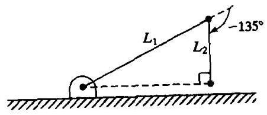
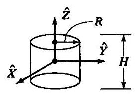
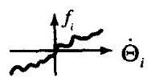
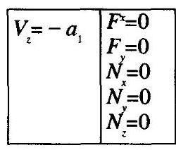
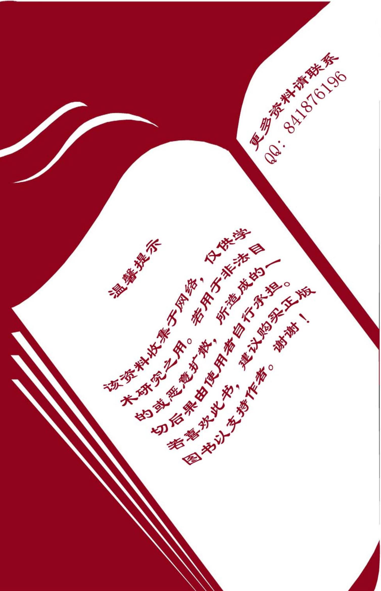

# 附录、习题答案与索引

## 附录A 三角恒等式

刚体绕 $X, Y, Z$ 轴旋转 $\theta$ 角的公式:

$$
{R}_{X}\left( \theta \right)  = \left\lbrack  \begin{matrix} 1 & 0 & 0 \\  0 & \cos \theta &  - \sin \theta \\  0 & \sin \theta & \cos \theta  \end{matrix}\right\rbrack \tag{A-1}
$$

$$
{R}_{Y}\left( \theta \right)  = \left\lbrack  \begin{matrix} \cos \theta & 0 & \sin \theta \\  0 & 1 & 0 \\   - \sin \theta & 0 & \cos \theta  \end{matrix}\right\rbrack \tag{A-2}
$$

$$
{R}_{Z}\left( \theta \right)  = \left\lbrack  \begin{matrix} \cos \theta &  - \sin \theta & 0 \\  \sin \theta & \cos \theta & 0 \\  0 & 0 & 1 \end{matrix}\right\rbrack \tag{A-3}
$$

与正弦和余弦周期特性有关的恒等式:

(A-4)

$$
\sin \theta  =  - \sin \left( {-\theta }\right)  =  - \cos \left( {\theta  + {90}^{ \circ  }}\right)  = \cos \left( {\theta  - {90}^{ \circ  }}\right)
$$

$$
\cos \theta  = \cos \left( {-\theta }\right)  =  - \sin \left( {\theta  + {90}^{ \circ  }}\right)  =  - \sin \left( {\theta  - {90}^{ \circ  }}\right)
$$

${\theta }_{1}$ 和 ${\theta }_{2}$ 的二角和或二角差的正弦、余弦公式:

$$
\cos \left( {{\theta }_{1} + {\theta }_{2}}\right)  = {c}_{12} = {c}_{1}{c}_{2} - {s}_{1}{s}_{2}
$$

(A-5)

$$
\sin \left( {{\theta }_{1} + {\theta }_{2}}\right)  = {s}_{12} = {c}_{1}{s}_{2} + {s}_{1}{c}_{2}
$$

$$
\cos \left( {{\theta }_{1} - {\theta }_{2}}\right)  = {c}_{1}{c}_{2} + {s}_{1}{s}_{2}
$$

$$
\sin \left( {{\theta }_{1} - {\theta }_{2}}\right)  = {s}_{1}{c}_{2} - {c}_{1}{s}_{2}
$$

同一个角的正弦平方与余弦平方的和等于1:

$$
{c}^{2}\theta  + {s}^{2}\theta  = 1 \tag{A-6}
$$

一个三角形的三个角分别为 $a, b, c$ ，角 $a$ 的对边是 $A$ ，其他角和边的关系依此类推，则 “余弦定理” 为:

$$
{A}^{2} = {B}^{2} + {C}^{2} - {2BC}\cos a \tag{A-7}
$$

“半角正切”变换公式为:

$$
u = \tan \frac{\theta }{2}
$$

$$
\cos \theta  = \frac{1 - {u}^{2}}{1 + {u}^{2}} \tag{A-8}
$$

$$
\sin \theta  = \frac{2u}{1 + {u}^{2}}
$$

矢量 $Q$ 绕单位矢量 $K$ 旋转 $\theta$ 角,由Rodriques公式得:

$$
{Q}^{\prime } = Q\cos \theta  + \sin \theta \left( {\widehat{K} \times  Q}\right)  + \left( {1 - \cos \theta }\right) \left( {\widehat{K} \cdot  \widehat{Q}}\right) \widehat{K} \tag{A-9}
$$

附录B是24种角坐标系的等效旋转矩阵的定义。附录C是逆运动学恒等式。

## 附录B 24种角坐标系的旋转矩阵定义

12种欧拉角坐标系的定义由下式给出

$$
{R}_{{X}^{\prime }{Y}^{\prime }{Z}^{\prime }}\left( {\alpha ,\beta ,\gamma }\right)  = \left\lbrack  \begin{matrix} {c\beta c\gamma } &  - {c\beta s\gamma } & {s\beta } \\  {s\alpha s\beta c\gamma } + {c\alpha s\gamma } &  - {s\alpha s\beta s\gamma } + {c\alpha c\gamma } &  - {s\alpha c\beta } \\   - {c\alpha s\beta c\gamma } + {s\alpha s\gamma } & {c\alpha s\beta s\gamma } + {s\alpha c\gamma } & {c\alpha c\beta } \end{matrix}\right\rbrack
$$

$$
{R}_{{X}^{\prime }{Z}^{\prime }}\left( {\alpha ,\beta ,\gamma }\right)  = \left\lbrack  \begin{matrix} {c\beta c\gamma } &  - {s\beta } & {c\beta s\gamma } \\  {c\alpha s\beta c\gamma } + {s\alpha s\gamma } & {c\alpha c\beta } & {c\alpha s\beta s\gamma } - {s\alpha c\gamma } \\  {s\alpha s\beta c\gamma } - {c\alpha s\gamma } & {s\alpha c\beta } & {s\alpha s\beta s\gamma } + {c\alpha c\gamma } \end{matrix}\right\rbrack
$$

$$
{R}_{Y{X}^{\prime }{Z}^{\prime }}\left( {\alpha ,\beta ,\gamma }\right)  = \left\lbrack  \begin{matrix} {s\alpha s\beta s\gamma } + {c\alpha c\gamma } & {s\alpha s\beta c\gamma } - {c\alpha s\gamma } & {s\alpha c\beta } \\  {c\beta s\gamma } & {c\beta c\gamma } &  - {s\beta } \\  {c\alpha s\beta s\gamma } - {s\alpha c\gamma } & {c\alpha s\beta c\gamma } + {s\alpha s\gamma } & {c\alpha c\beta } \end{matrix}\right\rbrack
$$

$$
{R}_{Y{Z}^{\prime }{X}^{\prime }}\left( {\alpha ,\beta ,\gamma }\right)  = \left\lbrack  \begin{matrix} {c\alpha c\beta } &  - {c\alpha s\beta c\gamma } + {s\alpha s\gamma } & {c\alpha s\beta s\gamma } + {s\alpha c\gamma } \\  {s\beta } & {c\beta c\gamma } &  - {c\beta s\gamma } \\   - {s\alpha c\beta } & {s\alpha s\beta c\gamma } + {c\alpha s\gamma } &  - {s\alpha s\beta s\gamma } + {c\alpha c\gamma } \end{matrix}\right\rbrack
$$

$$
{R}_{{Z}^{\prime }{X}^{\prime }{Y}^{\prime }}\left( {\alpha ,\beta ,\gamma }\right)  = \left\lbrack  \begin{matrix}  - {s\alpha s\beta s\gamma } + {c\alpha c\gamma } &  - {s\alpha c\beta } & {s\alpha s\beta c\gamma } + {c\alpha s\gamma } \\  {c\alpha s\beta s\gamma } + {s\alpha c\gamma } & {c\alpha c\beta } &  - {c\alpha s\beta c\gamma } + {s\alpha s\gamma } \\   - {c\beta s\gamma } & {s\beta } & {c\beta c\gamma } \end{matrix}\right\rbrack
$$

$$
{R}_{{Z}^{\prime }Y{X}^{\prime }}\left( {\alpha ,\beta ,\gamma }\right)  = \left\lbrack  \begin{matrix} {c\alpha c\beta } & {c\alpha s\beta s\gamma } - {s\alpha c\gamma } & {c\alpha s\beta c\gamma } + {s\alpha s\gamma } \\  {s\alpha c\beta } &  - {s\alpha s\beta s\gamma } + {c\alpha c\gamma } &  - {s\alpha s\beta c\gamma } - {c\alpha s\gamma } \\   - {s\beta } & {c\beta s\gamma } & {c\beta c\gamma } \end{matrix}\right\rbrack
$$

$$
{R}_{{X}^{\prime }{Y}^{\prime }{X}^{\prime }}\left( {\alpha ,\beta ,\gamma }\right)  = \left\lbrack  \begin{matrix} {c\beta } & {s\beta s\gamma } & {s\beta c\gamma } \\  {s\alpha s\beta } &  - {s\alpha c\beta s\gamma } + {c\alpha c\gamma } &  - {s\alpha c\beta c\gamma } - {c\alpha s\gamma } \\   - {c\alpha s\beta } & {c\alpha c\beta s\gamma } + {s\alpha c\gamma } & {c\alpha c\beta c\gamma } - {s\alpha s\gamma } \end{matrix}\right\rbrack
$$

$$
{R}_{{X}^{\prime }{Z}^{\prime }{X}^{\prime }}\left( {\alpha ,\beta ,\gamma }\right)  = \left\lbrack  \begin{matrix} {c\beta } &  - {s\beta c\gamma } & {s\beta s\gamma } \\  {c\alpha s\beta } & {c\alpha c\beta c\gamma } - {s\alpha s\gamma } &  - {c\alpha c\beta s\gamma } - {s\alpha c\gamma } \\  {s\alpha s\beta } & {s\alpha c\beta c\gamma } + {s\alpha s\gamma } &  - {s\alpha c\beta s\gamma } + {c\alpha c\gamma } \end{matrix}\right\rbrack
$$

$$
{R}_{Y{X}^{\prime }{Y}^{\prime }}\left( {\alpha ,\beta ,\gamma }\right)  = \left\lbrack  \begin{matrix}  - {s\alpha c\beta s\gamma } + {c\alpha c\gamma } & {s\alpha s\beta } & {s\alpha c\beta c\gamma } + {c\alpha s\gamma } \\  {s\beta s\gamma } & {c\beta } &  - {s\beta c\gamma } \\   - {c\alpha c\beta s\gamma } - {s\alpha c\gamma } & {c\alpha s\beta } & {c\alpha c\beta c\gamma } - {s\alpha s\gamma } \end{matrix}\right\rbrack
$$

$$
{R}_{Y{Z}^{\prime }{Y}^{\prime }}\left( {\alpha ,\beta ,\gamma }\right)  = \left\lbrack  \begin{matrix} {c\alpha c\beta c\gamma } - {s\alpha s\gamma } &  - {c\alpha s\beta } & {c\alpha c\beta s\gamma } + {s\alpha c\gamma } \\  {s\beta c\gamma } & {c\beta } & {s\beta s\gamma } \\   - {s\alpha c\beta c\gamma } - {c\alpha s\gamma } & {s\alpha s\beta } &  - {s\alpha c\beta s\gamma } + {c\alpha c\gamma } \end{matrix}\right\rbrack
$$

$$
{R}_{{Z}^{\prime }{X}^{\prime }{Z}^{\prime }}\left( {\alpha ,\beta ,\gamma }\right)  = \left\lbrack  \begin{matrix}  - {s\alpha c\beta s\gamma } + {c\alpha c\gamma } &  - {s\alpha c\beta c\gamma } - {c\alpha s\gamma } & {s\alpha s\beta } \\  {c\alpha c\beta s\gamma } + {s\alpha c\gamma } & {c\alpha c\beta c\gamma } - {s\alpha s\gamma } &  - {c\alpha s\beta } \\  {s\beta s\gamma } & {s\beta c\gamma } & {c\beta } \end{matrix}\right\rbrack
$$

$$
{R}_{{Z}^{\prime }{Y}^{\prime }{Z}^{\prime }}\left( {\alpha ,\beta ,\gamma }\right)  = \left\lbrack  \begin{matrix} {c\alpha c\beta c\gamma } - {s\alpha s\gamma } &  - {c\alpha c\beta s\gamma } - {s\alpha c\gamma } & {c\alpha s\beta } \\  {s\alpha c\beta c\gamma } + {c\alpha s\gamma } &  - {s\alpha c\beta s\gamma } + {c\alpha c\gamma } & {s\alpha s\beta } \\   - {s\beta c\gamma } & {s\beta s\gamma } & {c\beta } \end{matrix}\right\rbrack
$$

12种固定角坐标系的定义由下式给出

$$
{R}_{XYZ}\left( {\gamma ,\beta ,\alpha }\right)  = \left\lbrack  \begin{matrix} {c\alpha c\beta } & {c\alpha s\beta s\gamma } - {s\alpha c\gamma } & {c\alpha s\beta c\gamma } + {s\alpha s\gamma } \\  {s\alpha c\beta } & {s\alpha s\beta s\gamma } + {c\alpha c\gamma } & {s\alpha s\beta c\gamma } - {c\alpha s\gamma } \\   - {s\beta } & {c\beta s\gamma } & {c\beta c\gamma } \end{matrix}\right\rbrack
$$

$$
{R}_{XZY}\left( {\gamma ,\beta ,\alpha }\right)  = \left\lbrack  \begin{matrix} {c\alpha c\beta } &  - {c\alpha s\beta c\gamma } + {s\alpha s\gamma } & {c\alpha s\beta s\gamma } + {s\alpha c\gamma } \\  {s\beta } & {c\beta c\gamma } &  - {c\beta s\gamma } \\   - {s\alpha c\beta } & {s\alpha s\beta c\gamma } + {c\alpha s\gamma } &  - {s\alpha s\beta s\gamma } + {c\alpha c\gamma } \end{matrix}\right\rbrack
$$

$$
{R}_{YXZ}\left( {\gamma ,\beta ,\alpha }\right)  = \left\lbrack  \begin{matrix}  - {s\alpha s\beta s\gamma } + {c\alpha c\gamma } &  - {s\alpha c\beta } & {s\alpha s\beta c\gamma } + {c\alpha s\gamma } \\  {c\alpha s\beta s\gamma } + {s\alpha c\gamma } & {c\alpha c\beta } &  - {c\alpha s\beta c\gamma } + {s\alpha s\gamma } \\   - {c\beta s\gamma } & {s\beta } & {c\beta c\gamma } \end{matrix}\right\rbrack
$$

$$
{R}_{YZX}\left( {\gamma ,\beta ,\alpha }\right)  = \left\lbrack  \begin{matrix} {c\beta c\gamma } &  - {s\beta } & {c\beta s\gamma } \\  {c\alpha s\beta c\gamma } + {s\alpha s\gamma } & {c\alpha c\beta } & {c\alpha s\beta s\gamma } - {s\alpha c\gamma } \\  {s\alpha s\beta c\gamma } - {c\alpha s\gamma } & {s\alpha c\beta } & {s\alpha s\beta s\gamma } + {c\alpha c\gamma } \end{matrix}\right\rbrack
$$

$$
{R}_{ZXY}\left( {\gamma ,\beta ,\alpha }\right)  = \left\lbrack  \begin{matrix} {s\alpha s\beta s\gamma } + {c\alpha c\gamma } & {s\alpha s\beta c\gamma } - {c\alpha s\gamma } & {s\alpha c\beta } \\  {c\beta s\gamma } & {c\beta c\gamma } &  - {s\beta } \\  {c\alpha s\beta s\gamma } - {s\alpha c\gamma } & {c\alpha s\beta c\gamma } + {s\alpha s\gamma } & {c\alpha c\beta } \end{matrix}\right\rbrack
$$

$$
{R}_{ZYX}\left( {\gamma ,\beta ,\alpha }\right)  = \left\lbrack  \begin{matrix} {c\beta c\gamma } &  - {c\beta s\gamma } & {s\beta } \\  {s\alpha s\beta c\gamma } + {c\alpha s\gamma } &  - {s\alpha s\beta s\gamma } + {c\alpha c\gamma } &  - {s\alpha c\beta } \\   - {c\alpha s\beta c\gamma } + {s\alpha s\gamma } & {c\alpha s\beta s\gamma } + {s\alpha c\gamma } & {c\alpha c\beta } \end{matrix}\right\rbrack
$$

$$
{R}_{XYX}\left( {\gamma ,\beta ,\alpha }\right)  = \left\lbrack  \begin{matrix} {c\beta } & {s\beta s\gamma } & {s\beta c\gamma } \\  {s\alpha s\beta } &  - {s\alpha c\beta s\gamma } + {c\alpha c\gamma } &  - {s\alpha c\beta c\gamma } - {c\alpha s\gamma } \\   - {c\alpha s\beta } & {c\alpha c\beta s\gamma } + {s\alpha c\gamma } & {c\alpha c\beta c\gamma } - {s\alpha s\gamma } \end{matrix}\right\rbrack
$$

$$
{R}_{xzx}\left( {\gamma ,\beta ,\alpha }\right)  = \left\lbrack  \begin{matrix} {c\beta } &  - {s\beta c\gamma } & {s\beta s\gamma } \\  {c\alpha s\beta } & {c\alpha c\beta c\gamma } - {s\alpha s\gamma } &  - {c\alpha c\beta s\gamma } - {c\alpha c\gamma } \\  {s\alpha s\beta } & {s\alpha c\beta c\gamma } + {c\alpha s\gamma } &  - {s\alpha c\beta s\gamma } + {c\alpha c\gamma } \end{matrix}\right\rbrack
$$

$$
{R}_{YXY}\left( {\gamma ,\beta ,\alpha }\right)  = \left\lbrack  \begin{matrix}  - {s\alpha c\beta s\gamma } + {c\alpha c\gamma } & {s\alpha s\beta } & {s\alpha c\beta c\gamma } + {c\alpha s\gamma } \\  {s\beta s\gamma } & {c\beta } &  - {s\beta c\gamma } \\   - {c\alpha c\beta s\gamma } - {s\alpha c\gamma } & {c\alpha s\beta } & {c\alpha c\beta c\gamma } - {s\alpha s\gamma } \end{matrix}\right\rbrack
$$

$$
{R}_{YZY}\left( {\gamma ,\beta ,\alpha }\right)  = \left\lbrack  \begin{matrix} {c\alpha c\beta c\gamma } - {s\alpha s\gamma } &  - {c\alpha s\beta } & {c\alpha c\beta s\gamma } + {s\alpha c\gamma } \\  {s\beta c\gamma } & {c\beta } & {s\beta s\gamma } \\   - {s\alpha c\beta c\gamma } - {c\alpha s\gamma } & {s\alpha s\beta } &  - {s\alpha c\beta s\gamma } + {c\alpha c\gamma } \end{matrix}\right\rbrack
$$

$$
{R}_{ZXZ}\left( {\gamma ,\beta ,\alpha }\right)  = \left\lbrack  \begin{matrix}  - {s\alpha c\beta s\gamma } + {c\alpha c\gamma } &  - {s\alpha c\beta c\gamma } - {c\alpha s\gamma } & {s\alpha s\beta } \\  {c\alpha c\beta s\gamma } + {s\alpha c\gamma } & {c\alpha c\beta c\gamma } - {s\alpha s\gamma } &  - {c\alpha s\beta } \\  {s\beta s\gamma } & {s\beta c\gamma } & {c\beta } \end{matrix}\right\rbrack
$$

$$
{R}_{ZYZ}\left( {\gamma ,\beta ,\alpha }\right)  = \left\lbrack  \begin{matrix} {c\alpha c\beta c\gamma } - {s\alpha s\gamma } &  - {c\alpha c\beta s\gamma } - {s\alpha c\gamma } & {c\alpha s\beta } \\  {s\alpha c\beta c\gamma } + {c\alpha s\gamma } &  - {s\alpha c\beta s\gamma } + {c\alpha c\gamma } & {s\alpha s\beta } \\   - {s\beta c\gamma } & {s\beta s\gamma } & {c\beta } \end{matrix}\right\rbrack
$$

## 附录C 逆运动学公式

下述方程

$$
\sin \theta  = a \tag{C-1}
$$

有两个解为

$$
\theta  =  \pm  \mathrm{A}\tan 2\left( {\sqrt{1 - {a}^{2}}, a}\right) \tag{C-2}
$$

同样, 已知

$$
\cos \theta  = b \tag{C-3}
$$

有两个解为

$$
\theta  = \mathrm{A}\tan 2\left( {b, \pm  \sqrt{1 - {b}^{2}}}\right) \tag{C-4}
$$

联立 (C-1) 和 (C-3) 得到唯一解为

$$
\theta  = \mathrm{A}\tan 2\left( {a, b}\right) \tag{C-5}
$$

超越方程

$$
a\cos \theta  + b\sin \theta  = 0 \tag{C-6}
$$

有两个解为

$$
\theta  = \mathrm{A}\tan 2\left( {a, - b}\right) \tag{C-7}
$$

和

$$
\theta  = \mathrm{A}\tan 2\left( {-a, b}\right) \tag{C-8}
$$

方程

$$
a\cos \theta  + b\sin \theta  = c \tag{C-9}
$$

由 (4.5) 节的半角正切变换公式解得

$$
\theta  = \mathrm{A}\tan 2\left( {b, a}\right)  \pm  \mathrm{A}\tan 2\left( {\sqrt{{a}^{2} + {b}^{2} - {c}^{2}}, c}\right) \tag{C-10}
$$

方程组

(C-11)

$$
a\cos \theta  - b\sin \theta  = c
$$

$$
a\sin \theta  + b\cos \theta  = d
$$

由(4.4)节公式解得

$$
\theta  = \mathrm{A}\tan 2\left( {{ad} - {bc},{ac} + {bd}}\right) \tag{C-12}
$$

## 部分习题答案

第2章 空间描述和变换习题

2.1)

$$
R = \operatorname{ROT}\left( {\widehat{x},\phi }\right) \operatorname{ROT}\left( {\widehat{z},\theta }\right)
$$

$$
= \left\lbrack  \begin{matrix} 1 & 0 & 0 \\  0 & {C\phi } &  - {S\phi } \\  0 & {S\phi } & {C\phi } \end{matrix}\right\rbrack  \left\lbrack  \begin{matrix} {C\theta } &  - {S\theta } & 0 \\  {S\theta } & {C\theta } & 0 \\  0 & 0 & 1 \end{matrix}\right\rbrack
$$

$$
= \left\lbrack  \begin{matrix} {C\theta } &  - {S\theta } & 0 \\  {C\phi S\theta } & {C\phi C\theta } &  - {S\phi } \\  {S\phi S\theta } & {S\phi C\theta } & {C\phi } \end{matrix}\right\rbrack
$$

2.12) 速度是一个 “自由矢量”, 它仅受旋转影响, 而不受平移影响:

$$
{}^{A}V = {}_{B}^{A}R{}^{B}V = \left\lbrack  \begin{matrix} {0.866} &  - {0.5} & 0 \\  {0.5} & {0.866} & 0 \\  0 & 0 & 1 \end{matrix}\right\rbrack  \left\lbrack  \begin{array}{l} {10} \\  {20} \\  {30} \end{array}\right\rbrack
$$

$$
{}^{A}V = {\left\lbrack  \begin{array}{lll}  - {1.34} & {22.32} & {30.0} \end{array}\right\rbrack  }^{T}
$$

2.27)

$$
{}_{B}^{A}T = \left\lbrack  \begin{matrix}  - 1 & 0 & 0 & 3 \\  0 &  - 1 & 0 & 0 \\  0 & 0 & 1 & 0 \\  0 & 0 & 0 & 1 \end{matrix}\right\rbrack
$$

2.33)

$$
{}_{C}^{B}T = \left\lbrack  \begin{matrix}  - {0.866} &  - {0.5} & 0 & 3 \\  0 & 0 &  + 1 & 0 \\   - {0.5} & {0.866} & 0 & 0 \\  0 & 0 & 0 & 1 \end{matrix}\right\rbrack
$$

第3章 操作臂运动学习题

3.1)

$$
{}_{1}^{0}T = \left\lbrack  \begin{matrix} {C}_{1} &  - {S}_{1} & 0 & 0 \\  {S}_{1} & {C}_{1} & 0 & 0 \\  0 & 0 & 1 & 0 \\  0 & 0 & 0 & 1 \end{matrix}\right\rbrack
$$

$$
\frac{1}{2}T = \left\lbrack  \begin{matrix} {C}_{2} &  - {S}_{2} & 0 & {L}_{1} \\  {S}_{2} & {C}_{2} & 0 & 0 \\  0 & 0 & 1 & 0 \\  0 & 0 & 0 & 1 \end{matrix}\right\rbrack  \;\frac{2}{3}T = \left\lbrack  \begin{matrix} {C}_{3} &  - {S}_{3} & 0 & {L}_{2} \\  {S}_{3} & {C}_{3} & 0 & 0 \\  0 & 0 & 1 & 0 \\  0 & 0 & 0 & 1 \end{matrix}\right\rbrack
$$

$$
{}_{3}^{0}T = {}_{1}^{0}T{}_{2}^{1}T{}_{3}^{2}T = \left\lbrack  \begin{matrix} {C}_{123} &  - {S}_{123} & 0 & {L}_{1}{C}_{1} + {L}_{2}{C}_{12} \\  {S}_{123} & {C}_{123} & 0 & {L}_{1}{S}_{1} + {L}_{2}{S}_{12} \\  0 & 0 & 1 & 0 \\  0 & 0 & 0 & 1 \end{matrix}\right\rbrack
$$

<table><tr><td>${\alpha }_{i - 1}$</td><td>${a}_{i - 1}$</td><td>${d}_{i}$</td></tr><tr><td>0</td><td>0</td><td>0</td></tr><tr><td>0</td><td>${L}_{1}$</td><td>0</td></tr><tr><td>0</td><td>${L}_{2}$</td><td>0</td></tr></table>

式中

$$
{C}_{123} = \cos \left( {{\theta }_{1} + {\theta }_{2} + {\theta }_{3}}\right)
$$

$$
{S}_{123} = \sin \left( {{\theta }_{1} + {\theta }_{2} + {\theta }_{3}}\right)
$$

3.8) 当 $\{ G\}  = \{ T\}$ 时,有

$$
{}_{W}^{B}T{}_{T}^{W}T = {}_{S}^{B}T{}_{G}^{S}T
$$

因此

$$
{}_{T}^{W}T{ = }_{W}^{B}{T}^{-1}{}_{S}^{B}T{}_{G}^{S}T
$$

## 第4章 操作臂逆运动学

4.14) 否。Pieper的方法给出了任何3自由度操作臂封闭形式的解 (参见Pieper有关这方面的所有论文)。

4.18) 2

4.22) 1

## 第5章 速度和静力习题

5.1) 坐标系 $\{ 0\}$ 的雅可比矩阵为

$$
{}^{ \circ  }J\left( \theta \right)  = \left\lbrack  \begin{matrix}  - {L}_{1}{S}_{1} - {L}_{2}{S}_{12} &  - {L}_{2}{S}_{12} \\  {L}_{1}{C}_{1} + {L}_{2}{C}_{12} & {L}_{2}{C}_{12} \end{matrix}\right\rbrack
$$

$$
\operatorname{DET}\left( {{}^{ \circ  }J\left( \theta \right) }\right)  =  - \left( {{L}_{2}{C}_{12}}\right) \left( {{L}_{1}{S}_{1} + {L}_{2}{S}_{12}}\right)  + \left( {{L}_{2}{S}_{12}}\right) \left( {{L}_{1}{C}_{1} + {L}_{2}{C}_{12}}\right)
$$

$$
=  - {L}_{1}{L}_{2}{S}_{1}{C}_{12} - {L}_{2}^{2}{S}_{12}{C}_{12} + {L}_{1}{L}_{2}{C}_{1}{S}_{12} + {L}_{2}^{2}{S}_{12}{C}_{12}
$$

$$
= {L}_{1}{L}_{2}{C}_{1}{S}_{12} - {L}_{1}{L}_{2}{S}_{1}{C}_{12} = {L}_{1}{L}_{2}\left( {{C}_{1}{S}_{12} - {S}_{1}{C}_{12}}\right)
$$

$$
= {L}_{1}{L}_{2}{S}_{2}
$$

所以，当你以 ${}^{3}J\left( \theta \right)$ 开始，结果是相同的，即奇异位形为 ${\theta }_{2} = {0}^{ \circ  }$ 或 ${180}^{ \circ  }$ 。

5.8) 第2个连杆的雅可比矩阵为

$$
{}^{3}J\left( \theta \right)  = \left\lbrack  \begin{matrix} {L}_{1}{S}_{2} & 0 \\  {L}_{1}{C}_{2} + {L}_{2} & {L}_{2} \end{matrix}\right\rbrack
$$

存在一个各向同性点, 如果

$$
{}^{3}J = \left\lbrack  \begin{matrix} {L}_{2} & 0 \\  0 & {L}_{2} \end{matrix}\right\rbrack
$$

因此

$$
{L}_{1}{S}_{2} = {L}_{2}
$$

$$
{L}_{1}{C}_{2} + {L}_{2} = 0
$$

因为, ${S}_{2}^{2} + {C}_{2}^{2} = 1$ ,因此 ${\left( \frac{{L}_{2}}{{L}_{1}}\right) }^{2} + {\left( \frac{-{L}_{2}}{{L}_{1}}\right) }^{2} = 1$

即 ${L}_{1}^{2} = 2{L}_{2}^{2} \rightarrow  {L}_{1} = \sqrt{2}{L}_{2}$

根据这个条件, ${S}_{2} = \frac{1}{\sqrt{2}} =  \pm  {0.707}$

和 ${C}_{2} =  - {0.707}$

所以,如果 ${L}_{1} = \sqrt{2}{L}_{2}$ ,存在一个各向同性点,并且,当 ${\theta }_{2} =  \pm  {135}^{ \circ  }$ 时,存在一个各向同性点。

此时, 操作臂在这个位形下像一个笛卡儿操作臂一样。

5.13)

$$
\tau  = {}^{ \circ  }{J}^{T}\left( \theta \right) {}^{ \circ  }F
$$

$$
\tau  = \left\lbrack  \begin{matrix}  - {L}_{1}{S}_{1} - {L}_{2}{S}_{12} & {L}_{1}{C}_{1} + {L}_{2}{C}_{12} \\   - {L}_{2}{S}_{12} & {L}_{2}{C}_{12} \end{matrix}\right\rbrack  \left\lbrack  \begin{array}{l} {10} \\  0 \end{array}\right\rbrack
$$

$$
{\tau }_{1} =  - {10}{S}_{1}{L}_{1} - {10}{L}_{2}{S}_{12}
$$

$$
{\tau }_{2} =  - {10}{L}_{2}{S}_{12}
$$

## 第6章 操作臂动力学习题.

6.1) 应用式 (6.17),但按照极坐标形式写出,因为这种描述形式较方便。例如,对于 ${I}_{x}$ ,

$$
{I}_{zz} = {\int }_{-H/2}^{H/2}{\int }_{0}^{2\pi }{\int }_{0}^{R}\left( {{x}^{2} + {y}^{2}}\right) {\rho r}{dr}{d\theta }{dz}
$$

$$
x = R\cos \theta ,\;y = R\sin \theta ,\;{x}^{2} + {y}^{2} = {R}^{2}\left( {r}^{2}\right)
$$

$$
{I}_{zz} = {\int }_{-H/2}^{H/2}{\int }_{0}^{2\pi }{\int }_{0}^{R}\rho {r}^{3}{drd\theta dz}
$$

$$
{I}_{zz} = \frac{\pi }{2}{R}^{4}{H\rho },\text{ VOLUME } = \pi {r}^{2}H
$$

$$
\therefore \;\text{ Mass } = M = {\rho \pi }{r}^{2}H\;\therefore \;{I}_{zz} = \frac{1}{2}M{R}^{2}
$$

同样 (仅难度较大) 有

$$
{I}_{xx} = {I}_{yy} = \frac{1}{4}M{R}^{2} + \frac{1}{12}M{H}^{2}
$$

由对称性 (或通过积分),

$$
{I}_{xy} = {I}_{xz} = {I}_{yz} = 0
$$

$$
{c}_{I} = \left\lbrack  \begin{matrix} \frac{1}{4}M{R}^{2} + \frac{1}{12}M{H}^{2} & 0 & 0 \\  0 & \frac{1}{4}M{R}^{2} + \frac{1}{12}M{H}^{2} & 0 \\  0 & 0 & \frac{1}{2}M{R}^{2} \end{matrix}\right\rbrack
$$

6.12) ${\theta }_{1}\left( t\right)  = {Bt} + c{t}^{2}$ ,因此

$$
{\dot{\theta }}_{1} = B + {2ct},\ddot{\theta } = {2c}
$$

因此

$$
{}^{1}{\dot{\omega }}_{1} = {\ddot{\theta }}_{1}{\widehat{z}}_{1} = {2c}{\widehat{z}}_{1} = \left\lbrack  \begin{matrix} 0 \\  0 \\  {2c} \end{matrix}\right\rbrack
$$

$$
{}^{1}{\dot{v}}_{c1} = \left\lbrack  \begin{matrix} 0 \\  0 \\  {2c} \end{matrix}\right\rbrack   \otimes  \left\lbrack  \begin{array}{l} 2 \\  0 \\  0 \end{array}\right\rbrack   + \left\lbrack  \begin{matrix} 0 \\  0 \\  {\dot{\theta }}_{1} \end{matrix}\right\rbrack   \otimes  \left( {\left\lbrack  \begin{matrix} 0 \\  0 \\  {\dot{\theta }}_{1} \end{matrix}\right\rbrack   \otimes  \left\lbrack  \begin{array}{l} 2 \\  0 \\  0 \end{array}\right\rbrack  }\right)
$$

$$
= \left\lbrack  \begin{matrix} 0 \\  {4c} \\  0 \end{matrix}\right\rbrack   + \left\lbrack  \begin{matrix}  - 2{\dot{\theta }}_{1}^{2} \\  0 \\  0 \end{matrix}\right\rbrack
$$

$$
{}^{1}{\dot{v}}_{c1} = \left\lbrack  \begin{matrix}  - 2{\left( B + 2ct\right) }^{2} \\  {4c} \\  0 \end{matrix}\right\rbrack
$$

6.18) 对于任一合理的 $F\left( {\theta ,\dot{\theta }}\right)$ ,存在如下特性: 关节 $i$ 的摩擦力 (或力矩) 仅取决于关节 $i$ 的速度, 即,

$$
F\left( {\theta ,\dot{\theta }}\right)  = {\left\lbrack  \begin{array}{llll} {f}_{1}\left( {\theta ,{\dot{\theta }}_{1}}\right) & {f}_{2}\left( {\theta ,{\dot{\theta }}_{2}}\right) & \cdots & {f}_{N}\left( {\theta ,{\dot{\theta }}_{N}}\right)  \end{array}\right\rbrack  }^{T}
$$

同样,每一个 ${f}_{i}\left( {\mathbf{\theta },\dot{\mathbf{\theta }}}\right)$ 应是 “被动的”,即这个函数应当位于第一和第三象限。

**这是1989年10月17日黄昏时7.0级地震的记录结果。

## 第7章 轨迹的生成习题

7.1)要求三次多项式曲线连接一个起始点、两个中间点和一个目标点——即对每一个关节有3个点, 总共有18条三次多项式曲线。每个三次多项式有4个系数, 因此需要存储72个系数。

7.17) 通过求导,

$$
\dot{\theta }\left( t\right)  = {180t} - {180}{t}^{2}
$$

$$
\ddot{\theta }\left( t\right)  = {180} - {360t}
$$

然后,在 $t = 0$ 和 $t = 1$ 时进行预测估计,有

$$
\theta \left( 0\right)  = {10}\;\dot{\theta }\left( 0\right)  = 0\;\ddot{\theta }\left( 0\right)  = {180}
$$

$$
\theta \left( 1\right)  = {40}\;\dot{\theta }\left( 1\right)  = 0\;\ddot{\theta }\left( 1\right)  =  - {180}
$$

## 第8章 操作臂的机械设计习题

8.3) 应用式 (8.1), 有

$$
L = \mathop{\sum }\limits_{{i = 1}}^{3}\left( {{a}_{i - 1} + {d}_{i}}\right)  = \left( {0 + 0}\right)  + \left( {0 + 0}\right)  + \left( {0 + \left( {U - L}\right) }\right)  = U - L
$$

$$
W = \frac{4}{3}\pi {U}^{3} - \frac{4}{3}\pi {L}^{3} = \frac{4}{3}\pi \left( {{U}^{3} - {L}^{3}}\right) \left\{  \begin{array}{l} \text{ a } \\  \text{ hollow ” 一个 “空心” 球 } \\  \text{ sphere } \end{array}\right.
$$

$$
\therefore {Q}_{L} = \frac{U - L}{\sqrt[3]{\frac{4}{3}\pi \left( {{U}^{3} - {L}^{3}}\right) }}
$$

8.6) 由式 (8.14),

$$
\frac{1}{{K}_{\text{ TOTAL }}} = \frac{1}{1000} + \frac{1}{300} = {4.333} \times  {10}^{-3}
$$

$$
\therefore {K}_{TOTAL} = {230.77}\frac{\mathrm{{NTM}}}{\mathrm{{RAD}}}
$$

8.16)由式 (8.15),

$$
K = \frac{{G\pi }{d}^{4}}{32L} = \frac{\left( {{0.33} \times  {7.5} \times  {10}^{10}}\right) \left( \pi \right) {\left( {0.001}\right) }^{4}}{\left( {32}\right) \left( {0.40}\right) } = {0.006135}\frac{\mathrm{{NTM}}}{\mathrm{{RAD}}}
$$

这是非常薄的,因为它的直径只有 $1\mathrm{\;{mm}}$ !

## 第9章 操作臂的线性控制习题

9.2) 由式 (9.5),

$$
{s}_{1} =  - \frac{6}{2 \times  2} + \frac{\sqrt{{36} - 4 \times  2 \times  4}}{2 \times  2} =  - {1.5} + {0.5} =  - {1.0}
$$

$$
{s}_{2} =  - {1.5} - {0.5} =  - {2.0}
$$

$\therefore$

$\operatorname{quad}x\left( t\right)  = {c}_{1}{e}^{-t} + {c}_{2}{e}^{-{2t}}$ 和 $\dot{x}\left( t\right)  =  - {c}_{1}{e}^{-t} - 2{c}_{2}{e}^{-{2t}}$

$$
\text{ Att } = 0\;x\left( 0\right)  = 1 = {c}_{1} + {c}_{2} \tag{1}
$$

$$
\dot{x}\left( 0\right)  = 0 =  - {c}_{1} - 2{c}_{2} \tag{2}
$$

将式 (1) 和式 (2) 相加得

$$
1 =  - {c}_{2}
$$

因此 ${c}_{2} =  - 1$ 和 ${c}_{1} = 2$ 。

$$
\therefore x\left( t\right)  = 2{e}^{-t} - {e}^{-{2t}}
$$

9.10)应用式(8.24)，假定材料为铝，有

$$
K = \frac{\left( {0.333}\right) \left( {2 \times  {10}^{11}}\right) \left( {{0.05}^{4} - {0.04}^{4}}\right) }{\left( 4\right) \left( {0.50}\right) } = {123000.0}
$$

参考图9-13,等效质量为 $\left( {0.23}\right) \left( 5\right)  = {1.15}\mathrm{\;{kg}}$ 。

因此

$$
{W}_{\text{ res }} = \sqrt{k/m} = \sqrt{\frac{123000.0}{1.15}} \cong  {327.04}\frac{\mathrm{{rad}}}{\mathrm{{sec}}}
$$

这个速度非常高——因此设计者在设计时可能出了错误，这个连杆的振动代表了这个系统的最低阶未建模共振!

9.13) 同习题9.12,有效刚度为 $K = {32000}$ 。这里,有效惯量为 $I = 1 + \left( {0.1}\right) \left( {64}\right)  = {7.4}$

$$
\therefore {W}_{\text{ res }} = \sqrt{\frac{32000}{7.4}} \cong  {65.76}\frac{\mathrm{{rad}}}{\mathrm{{sec}}} \cong  {10.47}\mathrm{{Hz}}
$$

## 第10章 操作臂的非线性控制习题

10.2) 令 $\tau  = \alpha {\tau }^{\prime } + \beta$

$$
\alpha  = 2\;\beta  = {5\theta }\dot{\theta } - {13}{\dot{\theta }}^{3} + 5
$$

和 ${\tau }^{\prime } = {\ddot{\theta }}_{D} + {K}_{v}\dot{e} + {K}_{p}e$

式中 $e = {\theta }_{D} - \theta$

和

${K}_{p} = {10}$

$$
{K}_{v} = 2\sqrt{10}
$$

10.10) 令 $f = \alpha {f}^{\prime } + \beta$

且 $\alpha  = 2,\beta  = {5x}\dot{x} - {12}$

和 ${f}^{\prime } = {\ddot{X}}_{D} + {k}_{v}\dot{e} + {k}_{p}e,\;e = {X}_{D} - X$

${k}_{p} = {20},{k}_{v} = 2\sqrt{20}$

## 第11章 操作臂的力控制习题

11.2) 对于这个操作任务, 所求的人工约束应为

式中 ${\alpha }_{1}$ 是插入速度。

11.4) 应用式 (5.105) 以及坐标系 $\{ A\}$ 和 $\{ B\}$ 的逆矩阵。首先求 ${}_{A}^{B}T$ ,因此逆阵为 ${}_{B}^{A}T$ :

$$
{}_{A}^{B}T = \left\lbrack  \begin{matrix} {0.866} & {0.5} & 0 &  - {8.66} \\   - {0.5} & {0.866} & 0 & {5.0} \\  0 & 0 & 1 &  - {5.0} \\  0 & 0 & 0 & 1 \end{matrix}\right\rbrack
$$

这里,

$$
{}^{B}F{ = }_{A}^{B}R{}^{A}F = {\left\lbrack  \begin{array}{lll} 1 & {1.73} &  - 3 \end{array}\right\rbrack  }^{T}
$$

$$
{}^{B}N = {}^{B}{P}_{AORG} \otimes  {}^{B}F + {}_{A}^{B}R{}^{A}N = {\left\lbrack  -{6.3} - {30.9} - {15.8}\right\rbrack  }^{T}
$$

$$
\therefore {}^{B}F = {\left\lbrack  \begin{array}{llllll} {1.0} & {1.73} &  - 3 &  - {6.3} &  - {30.9} &  - {15.8} \end{array}\right\rbrack  }^{T}
$$

## 索

注:索引页码为英文原书页码，即本书页边所标页码。

Acceleration of a rigid body (刚体的加速度), 166-167

angular acceleration ( 角加速度 ), 167

linear acceleration (线加速度), 166-167

Accuracy (精度), 233

Actuation schemes (驱动方式), 244-247

actuator location (驱动器布局), 244-245

reduction/transmission systems (减速/传动系统), 245-247

Actuator location (驱动器布局):

direct-drive configuration (直接驱动结构), 244-245

speed-reduction system (减速系统), 245

transmission system (传动系统), 245

Actuator positions (驱动器位置), 77

Actuator space (驱动器空间), 77

Actuator vectors (驱动器矢量), 77

Actuators (驱动器), 278-279

joint (关节), 9 脚注

and stiffness (刚度), 250-252

vane (气动), 250-251

Adaptive control (自适应控制), 311-312

Adept 2-D vision system (Adept二维视觉系统), 366- 367

Affixments (附件), 345

AL language (AL语言), 341, 345

Algebraic solution (代数解法), 106, 109-112

by reduction to polynomial (通过化简为多项式), 113-114

Algorithms (算法):

control (控制), 11-12

nonlinear control (非线性控制), 12-13

Alternating current (AC) motors and stepper motors ( 交流电机与步进电机), 252

Angle sets (角坐标系), 144

Angle-axis representation (轴角坐标系表示方法), 218- 219

Angles (角):

Euler (欧拉角), 44

joint (关节), 5, 66, 185

yaw (偏转角), 41

Angle-set conventions (角坐标系表示法), 46, 374-376

Angular acceleration (角加速度), 167

Angular velocity (角速度), 141-144

representations of (描述方法), 142-143

Angular-velocity matrix (角速度矩阵), 142

Angular-velocity vector (角速度矢量), 137-138, 142

gaining physical insight concerning (建立关于……的物理概念), 142-143

Anthropomorphic manipulator (拟人操作臂), 235

Antialiasing (抗混叠), 278

AR-BASIC (American Cimflex) (AR-BASIC语言 (美国 Cimflex)), 341

Arm signature style calibration (机械臂特征标定规范), 357

Armature (电枢), 278

ARMII manipulator arm (ARMII (Advanced Research Manipulator II) 型操作臂), 288

Articulated manipulator (铰接型操作臂), 235

Artificial constraints (人工约束), 320-321

Assembly (装配), 3

Assembly strategy (装配策略), 321

Automated subtasks in OLP systems: automatic assessment of errors and tolerances (离线编程系统的自动子任务: 误差和公差的自动估计), 369

automatic planning of coordinated motion (坐标运动的自动规划), 368

automatic robot placement (自动确定机器人位移), 367-368

automatic scheduling (自主控制), 368

collision avoidance and path optimization (避障与路径优化), 368

force-control simulation (力控制仿真), 368

Automatic collision detection (自动碰撞检测), 357

Automation, fixed (自动化装备, 专用的), 3, 14

Autonomous system (自治系统), 305

Azimuth (方位角), 7

Back emf constant (反电势常数), 279

Backlash (间隙), 245

Ball-bearing screws (滚珠丝杠), 246-247

Base frame (B) (基坐标系), 5, 89, 125

Bearing flexibility (轴承的变形), 250

Belts (平带), 246

and stiffness (刚度), 249

BIBO stability (BIBO稳定性), 276

Bolted joints, and hysteresis (螺栓联接和滞后), 254

Bottom-up programming (自下而上的编程方法), 348

Bounded-input, bounded-output (BIBO) stability (有界输入 - 有界输出 (BIBO) 稳定性), 276

Brushless motors (无刷电机), 252

Cables (电缆), 246

Calculation, kinematic (计算, 运动学), 91-92

Calibration matrix (标定矩阵), 253

Calibration techniques (标定技术), 127

Candidate Lyapunov functions (选取李雅普诺夫函数), 305

Cartesian configuration space torque equation (笛卡儿形位空间中的力矩方程), 187-188

Cartesian manipulator (笛卡儿操作臂), 234-235

Cartesian mass matrix (笛卡儿质量矩阵), 186

Cartesian motion (笛卡儿运动), 218

Cartesian paths, geometric problems with (笛卡儿路径, 几何问题), 219-222

high joint rates near singularity (近奇异点附近的高关节速率), 220-221

intermediate points unreachable (不可达的中间点), 220

start and goal reachable in different solutions (不同解下的可达起点和终点), 221-222

Cartesian space (笛卡儿空间), 6, 76-77

formulating manipulator dynamics in (建立操作臂动力学方程), 185-188

Cartesian state-space equation (笛卡儿状态空间方程), 185-187

Cartesian trajectory generation (笛卡儿轨迹生成), 10

Cartesian-based control systems (基于笛卡儿空间的控制系统), 307-311

Cartesian decoupling scheme (笛卡儿解耦方案), 310-311

defined (定义), 308

intuitive schemes of Cartesian control (笛卡儿空间的直接控制方法), 309-310

joint-based schemes compared with (与基于关节空间控制方法的比较), 307-309

Cartesian-space paths, generation (笛卡儿空间路径, 生成), 223-224

Cartesian-space schemes (笛卡儿空间规划方法), 216- 219

Cartesian straight-line motion (笛卡儿直线运动), 217-219

Cayley's formula for orthonormal matrices (正交矩阵的凯莱公式), 40

Centrifugal force (离心力), 181

Chain drives (链传动), 246

Characteristic equation (特征方程), 265

Cincinatti Milacron (辛辛纳提 Milacron), 238

Closed-form dynamic equations, example of (封闭形式的动力学方程, 如), 177-180

Closed-form solutions (封闭形式解), 106

Closed-form-solvable manipulators (封闭解操作臂), 114

Closed-loop stiffness (闭环刚度), 272

Closed-loop structures (闭环结构), 242-244

Grübler's formula (Grübler公式), 243

Stewart mechanism (Stewart机构), 243-244

Closed-loop system (闭环系统), 264

Collision-free path planning ( 无碰撞路径规划), 225

Co-located sensor and actuator pairs (并置的传感器与驱动器组合), 252

Complex roots (复根), 266, 267-269

Computation (计算), 52-54

Computed points (计算点), 127

Computed-torque method (计算力矩法), 290

Concatenating link transformations (连续的连杆变换), 76

Configuration-space equation ( 形位空间方程), 181-182

Constraints (约束):

artificial (人工的), 320-321

force (力的), 320-321

natural (自然的), 319-321

position (位置的), 320-321

spatial (空间的), 202

Continuous vs. discrete time control (连续时间控制与离散时间控制), 277-278

Control algorithm (控制算法), 11-12

Control gains (控制增益), 272

Control law (控制律), 271

Control theory (控制理论), 3

Control-law partitioning (控制律的分解), 273-275

Coriolis force (哥氏力), 181

Coulomb friction (库仑摩擦), 188-189, 293

Coulomb-friction constant (库仑摩擦常数), 188

Critical damping (临界阻尼), 266, 291

Cubic polynomials (三次多项式), 203-205

for a path with via points (具有中间点的路径), 205- 209

Current amplifier (电流放大器), 279-280

Cycle time (循环时间), 233

Cylindrical configuration ( 柱坐标位形), 236-237

Damped natural frequency (阻尼振动固有频率), 268

Damping, effective (有效阻尼), 280

Damping ratio (阻尼比), 268

Deburring (去毛刺), 318

DEC LSI-11 computer (DEC LSI-11 计算机), 284-285

Decoupling (解耦), 295

Decoupling control, approximations (解耦控制, 近似方法), 303

Degrees of freedom (自由度), 5, 231-232

Denavit-Hartenberg notation (Denavit-Hartenberg符号), 67

Denavit-Hartenberg parameters (Denavit-Hartenberg 参数), 127

Descriptions (描述), 19-23

defined (定义), 19

of a frame (坐标系), 22-23

of an orientation (方位), 20-22

of a position (位置), 20

Dextrous workspace (灵巧工作空间), 102

Differentiation (微分):

numerical (数值的), 252

of position vectors (位置矢量), 136-137

Direct current (DC) brush motors (直流有刷电动机), 251-252

Direct kinematics (正 (向) 运动学, 运动学正问题), 101

Direct-drive configuration (直接驱动位形), 244-245

Direct-drive manipulator (直接驱动操作臂), 281

Direction cosines (方向余弦), 22

Discrete-time control (离散时间控制), 277-278, 297

Disturbance rejection (抗干扰), 276-277, 278

addition of an integral term (附加积分项), 277

PID control law (PID控制律), 277

steady-state error (稳态误差), 276

Draper Labs (Draper实验室), 333

Dual-rate computed-torque implementation ( 双速率计算力矩方法), 298-299

Dynamic emulation (动力学仿真), 358

Dynamic equations (动力学方程):

configuration-space equation (形位空间方程), 181- 182

state-space equation (状态空间方程), 180-181

structure of (结构), 177-180

Dynamic simulation (动力学仿真), 189-190

Dynamically simple manipulator (动力学上的简单操作臂), 191

Dynamics (动力学), 9-10

defined (定义), 9

Dynamics of manipulators (操作臂动力学), 165-200

acceleration of a rigid body (刚体加速度), 166-167

computation (计算), 190-192

efficiency (效率), 190-191

efficiency of closed forms vs. iterative form (封闭形式与迭代形式的效率), 190-191

efficient dynamics for simulation (有效的动力学仿真), 191

memorization scheme (存储方案), 192

dynamic equations, structure of (动力学方程, 结构), 177-180

dynamic simulation (动力学仿真), 189-190

Euler's equation (欧拉方程), 171-172

iterative Newton-Euler dynamic formulation (牛顿-欧拉迭代动力学公式), 173-176

iterative vs. closed form (迭代形式与封闭形式), 176-177

Lagrangian dynamic formulation (拉格朗日动力学公式), 182-185

mass distribution (质量分布), 167-171.

Newton's equation (牛顿方程), 171-172

nonrigid body effects, inclusion of (计及非刚体效应), 188-189

Dynamics of mechanisms (机构动力学), 165

Effective damping (有效阻尼), 280

Effective inertia (有效惯量), 280

Efficiency (效率):

of closed forms vs. iterative form (封闭形式与迭代形

式), 190-191

efficient dynamics for simulation (有效的动力学仿真), 191

historical note concerning (关于……研究简介), 190-191

Elbow manipulator (肘型操作臂), 235

Elevation (仰角), 7

End-effector (末端执行器), 5

End-of-arm tooling (工具端), 230

Equivalent angle-axis representation (等效轴角坐标系表示法), 46-50

Error detection/recovery (误差检测及校正), 349-350

Error space (误差空间), 275

Euler angles (欧拉角), 44

Z-Y-X, 43-45

Z-Y-Z, 45-46

Euler integration (欧拉积分), 189

Euler parameters (欧拉参数), 50-51

Euler's equation (欧拉方程), 171-172

Euler's formula (欧拉公式), 267

Euler's theorem on rotation (欧拉旋量定理), 46脚注

Event monitors (事件监测), 346

Explicit programming languages (显式编程语言), 341- 342

Feedback (反馈), 263

Feedforward nonlinear control (非线性前馈控制), 297- 298

Fictitious joints (虚拟关节), 232, 238

Finite-element techniques (有限元法), 250

Fixed angles, X-Y-Z (X-Y-Z固定角坐标系), 41-43

Fixed automation (专用的自动化装备), 3, 14

Flexible bands (柔性带), 246

Flexible elements in parallel and in series (并联和串联的柔性元件), 247

Flexure (挠曲变形), 253

Foil gauges (应变计), 254

Force constraints (力约束), 320-321

Force control (力控制), 13

hybrid position/force control problem ( 力/位混合控制问题), 323-324, 328-333

Cartesian manipulator aligned with constraint frame \{C\} (约束坐标系\{C\}中的笛卡儿操作臂), 328- 330

general manipulator (通用操作臂), 330-332

variable stiffness, adding (附加可变刚度), 332-333

industrial robots, application to assembly tasks (用于装配作业的工业机器人), 318

industrial-robot control schemes (工业机器人控制方法), 333-335

compliance through softening position gains (通过降低位置增益实现的柔顺性), 333-334

force sensing (力觉), 334-335

passive compliance (被动柔顺性), 333

of manipulators (操作臂), 317-338

of a mass-spring system (质量 - 弹簧系统), 324-328

partially constrained tasks, framework for control in (局部约束任务, 控制坐标系), 318-323

Force domain, Jacobians in ( 力域, 雅可比), 156-157

Force sensing (力检测, 力觉), 253-254, 334-335

design issues (设计问题), 253-254

flexure (挠曲变形), 253

hysteresis (滞后), 253-254

limit stops (限位挡块), 253-254

overload protection (过载保护), 253

Force-control law (力控制法则), 13

Force-moment transformation ( 力-力矩变换), 158-159

Force-sensing fingers (带有力觉的手指), 253

Forward kinematics (正 (向) 运动学), 4-6

4-quadrant arc tangent (4象限反正切), 43脚注

Frames (坐标系), 4, 34

affixing to links, convention for (附加到连杆, 规定), 67-73

base (基座), 5

compound (混合), 34-35

defined (定义), 23

description of (描述), 22-23

graphical representation of (图形表示), 23

with standard names (标准命名), 89-91

tool (工具), 5

Free vectors (自由矢量):

defined (定义), 51-52

transformation of (变换), 51-52

Friction (摩擦), 245

Gantry robots (龙门式机器人), 234

Gear ratio (齿轮传动比), 245, 246

Gears (齿轮), 245

and stiffness (刚度), 248-249

General frames, mappings involving (一般坐标系, 映射), 27-29

Generalizing kinematics (广义运动学), 91

Geometric solution (几何解), 106, 112-113

Geometric types (几何类型), 344

GMF S380 (日本Fanuc公司的GMF S380机器人), 340

Goal frame (G) (目标坐标系(G)), 91, 125

Gravity compensation, addition (重力补偿, 附加), 302-303

Grinding (磨削), 318

Grübler's formula (Grübler公式), 243

Guarded move (运动监控), 334

High repeatability and accuracy (高重复精度与定位精度), 233

Higher-order polynomials (高阶多项式), 209-210

Homogeneous transform (齐次变换), 28 - 29, 34

Hybrid control (混合控制), 13

Hybrid position/force control problem ( 力/位混合控制问题), 328-333

Cartesian manipulator aligned with constraint frame(C) (约束坐标系\{C\}中的笛卡儿操作臂), 328-330

general manipulator (一般操作臂), 330-332

variable stiffness, adding (可变刚度, 附加), 332- 333

Hybrid position/force controller ( 力/位混合控制器 ), 317

Hydraulic cylinders (液压缸), 250-251

Hysteresis, eliminating (消除滞后), 254

Independent joint control (独立关节控制), 264

Index pulse (特征脉冲), 252

Individual-joint PID control (独立关节PID控制), 301- 302

Industrial robot (工业机器人) :

applications (应用), 1-3

as automation trend in manufacturing process (制造业自动化的发展趋势), 1

growth in use of (使用量增长), 1

Industrial-robot control schemes (工业机器人控制方法), 333-335

compliance through softening position gains (通过降低位置增益实现的柔顺性), 333-334

force sensing (力觉), 334-335

passive compliance (被动柔顺性), 333

Industrial -robot control systems (工业机器人控制系统), 301-303

decoupling control, approximations of (解耦控制, 近似方法), 303

gravity compensation, addition of (重力补偿, 附加), 302-303

individual-joint PID control (独立关节PID控制), 301-302

Industrial-robot controller, architecture of (工业机器人控制器, 结构), 284-285

Inertia (惯量):

effective (有效的), 280

mass moments of (惯量矩), 168

mass products of (惯量积), 168-169

moment of (矩), 167

pendulum (摆), 171

principal moments of (主矩), 169

tensor (张量), 167, 171

Inertia ellipsoid (惯性椭球), 241

Initial conditions (初始条件), 265

Inspector (监测器), 367

Instantaneous axis of rotation (瞬时转动轴), 143

Interactive languages (交互式语言), 356

Interpretations (解释), 34

Intuitive schemes of Cartesian control (笛卡儿空间的控制直接方法), 309-310

Inverse kinematics (逆 (向) 运动学), 6-7, 101

Inverse manipulator kinematics (操作臂逆 (向) 运动学), 101-134

algebraic solution by reduction to polynomial ( 通过化简为多项式的代数解法), 114-117

algebraic vs. geometric solution (代数解法与几何解法), 109-113

computation (计算), 127-128

examples of (例子), 117-125

PUMA 560 (Unimation) (PUMA 560 (Unimation) 型机器人), 117-121

Yasukawa Motoman L-3 (Yasukawa Motoman L-3 型机器人), 121-125

manipulator subspace (操作臂子空间), 107-109

Pieper's solution when three axes intersect (三轴相交时的Pieper解法), 114-117

solvability (可解性), 101-106

existence of solutions (解的存在性), 102-103

method of solution (解法), 105-106

multiple solutions (多重解), 103-105

Inverse-Jacobian controller (逆雅可比控制器), 309

Inverse-kinematic formulas (逆运动学公式), 377

Iterative Newton-Euler dynamic formulation (牛顿-欧拉迭代动力学公式), 173-180

closed-form dynamic equations (封闭形式的动力学方程), 177-180

dynamics algorithm (动力学算法), 175-176

inclusion of gravity forces in (计及重力), 176

force/torque acting on a link (作用在连杆上的力/力矩), 174

inward iterations (向内迭代), 174-175

outward iterations (向外迭代), 173-174

Jacobian matrix (雅可比矩阵), 135 脚注

Jacobian transpose (雅可比转置), 157

Jacobians (雅可比), 7, 135-164

defined (定义), 149-150

in the force domain (在力域内), 156-157

frame of reference, changing (参考坐标系的变换), 151

velocity "propagation" from link to link (连杆间的速度 “传递”), 144-149

JARS (JARS语言), 341

Joint actuators (关节驱动器), 9

Joint angles (关节角), 5, 66, 185

Joint axes (关节轴), 64

Joint offset (关节偏距), 5

Joint space (关节空间), 6, 76-77, 185

Joint torques (关节力矩), 9

Joint variable (关节变量), 67

Joint vector (关节矢量), 76

Joint-based control schemes (基于关节空间的控制方法), 307-309

Jointed manipulator (关节型操作臂), 235

Joints, (关节) 5

bolted (螺栓联接), 254

press-fit (压配合), 254

prismatic (移动式), 5, 63

revolute (转动式), 5, 63

welded (焊接), 254

Joint-space paths, generation of (关节空间路径, 生成), 222-223

Joint-space schemes (关节空间的规划方法), 203-216

cubic polynomials (三次多项式), 203-205

cubic polynomials for a path with via points (具有中间点路径的三次多项式), 205-209

higher-order polynomials (高阶多项式), 209-210

linear function with parabolic blends (与抛物线拟合的线性函数), 210-212

for a path with via points (具有各中间点的路径),

212-216

KAREL (GMF Robotics) (KAREL(GMF机器人)), 341

Khatib, O., 332

Kinematic emulation (运动学仿真), 357-358

Kinematics, 4-6 (运动学)

calculating (计算), 91-92

defined (定义), 4, 62

link description (连杆描述), 62-65

link-connection description (连杆连接描述), 65-67

of PUMA 560 (Unimation) (PUMA 560 (Unimation) 机器人), 77-83

of two industrial robots (两个工业机器人), 77-89

of Yasukawa Motoman L-3 (Yasukawa Motoman L-3 机器人 (日本)), 83-89

Kinetically simple manipulator( 运动学上的简单操作臂 ), 191

Lagrangian, defined (拉格朗日函数, 定义), 183

Lagrangian dynamic formulation (拉格朗日动力学公式), 182-185

Language translation to target system (翻译成目标系统的语言), 359

Laplace transforms (拉普拉斯变换), 265

Lead screws (普通丝杠), 246-247

Leading subscripts/superscripts, in notation (左下标/左上标, 符号), 16

Length sum (长度和), 240

L'Hópital's rule (洛必达法则), 270

Limit stops (限位挡块), 253-254

Line of action (作用线), 51-52

Line vectors, defined (线矢量, 给定的), 51-52

Linear acceleration (线加速度), 166-167

Linear control of manipulators (操作臂线性控制), 262- 289

closed-loop control (闭环控制), 263-264

continuous vs. discrete time control (连续时间控制与离散时间控制), 277-278

control-law partitioning (控制律分解), 273-275

disturbance rejection (抗干扰), 276-277

feedback (反馈), 263

industrial-robot controller, architecure of (工业机器人控制器, 结构), 284-285

second-order linear systems (二阶线性系统), 264- 271

characteristic equation (特征方程), 265

complex roots (复根), 266, 267-269

control of (控制), 271-273

initial conditions (初始条件), 265

Laplace transforms (拉普拉斯变换), 265

poles (极点), 265

real and equal roots (两个相等的实根), 267, 269- 271

real and unequal roots (两个不相等的实根), 266- 267

single joint (单关节),

modeling/controlling (建模/控制), 278-284

effective inertia (有效惯量), 280

estimating resonant frequency (估计共振频率), 282- 283

motor-armature inductance (电机电枢感抗), 279- 280

unmodeled flexibility (未建模柔性), 281-282

trajectory-following control (轨迹跟踪控制), 275

Linear function with parabolic blends (与抛物线拟合的线性函数), 210-212

for a path with via points (具有中间点的路径), 212- 216

Linear position control (线性位置控制), 11-12

Linear velocity (线速度), 138-139

simultaneous rotational velocity (与角速度同时存在), 140-141

Linear-control systems (线性控制系统), 262

Linearizing and decoupling control law (线性化解耦控制律), 295

Linearizing control law (线性控制方法), 291

Link length (连杆长度), 64

Link offset (连杆偏距), 66

Link parameters (连杆参数), 67

of a three-link planar manipulator (三连杆平面操作臂), 71

Link transformations (连杆变换):

concatenating (连续的), 76

derivation of (推导), 73-76

Link twist (连杆转角), 64-65

Link-connection description (连杆连接的描述), 65-67

first and last links in the chain (连杆链中的首尾连杆), 66-67

intermediate links in the chain (连杆链中的中间连杆), 66

link parameters (连杆参数), 67

Link-frame assignment (连杆坐标系布局), 72

Links (连杆), 5

convention for affixing frames to (对附加坐标系的规定), 67-73

first and last links in the chain (连杆链中的首尾连杆), 68

intermediate links in the chain (连杆链中的中间连杆), 68

link parameter summary (连杆参数的归纳), 69

link-frame attachment procedure (建立连杆坐标系的步骤), 69

and stiffness (刚度), 249-250

Load capacity (负载能力), 233

Local linearization (局部线性化), 291

Locally degenerate mechanism (机构局部退化), 9

Lower pair (低副), 62-63

Low-pass filter (低通滤波器), 279-280

Lumped models (集中质量模型), 282-283

Lyapunov stability analysis (李雅普诺夫稳定性分析), 303-307

Lyapunov's method (李雅普诺夫方法), 290

Lyapunov's second (direct) method (第二类李雅普诺夫方法 (直接法)), 304

Manipulability measure (可操作度), 241

Manipulator control, problem of (操作臂控制, 问题), 294-295

Manipulator kinematics (操作臂运动学), 62-100

inverse (逆向), 101 - 134

link transformations: (连杆变换), 76

concatenating (连续的), 76

derivation of (导数), 73-76

"standard" frames ("标准" 坐标系), 89-91

Manipulator subspace (操作臂子空间), 107-109

Manipulator-mechanism design (操作臂的机械设计), 230-261

actuation schemes (驱动方式), 244-247

actuator location (驱动器的布局), 244-245

reduction/transmission systems (减速/传动系统), 245-247

articulated manipulator (铰接型操作臂), 235

basing design on task requirements (基于任务需求的设计), 231-233

accuracy (定位精度), 233

degrees of freedom, number of (自由度, 数目), 231-232

load capacity (负载能力), 233

repeatability (重复精度), 233

speed (速度), 233

workspace (工作空间), 233

Cartesian manipulator (笛卡儿操作臂), 234-235

closed-loop structures (闭环结构), 242-244

cylindrical configuration (圆柱面坐标位形), 236- 237

force sensing (力觉), 253-254

kinematic configuration (运动位形), 234-239

position sensing (位置检测), 252

redundant structures (冗余结构), 241-242

SCARA configuration (SCARA位形), 235-236

spherical configuration (球面坐标位形), 236

stiffness/deflections (刚度/变形), 246-252

actuators (驱动器), 250-252

belts (带), 249

flexible elements in parallel and in series (并联和串联的柔性元件), 247

gears (齿轮), 248-249

links (连杆), 249-250

shafts (轴), 247-248

well-conditioned workspaces (良好条件的工作空间), 241

workspace attributes, quantitative measures of (工作空间属性, 定量测量), 239-241

workspace generation, efficiency of design in terms of (生成工作空间, 按照……设计的效果), 240

wrist configuration (腕关节位形), 237-239

Manipulators (操作臂), 3

accuracy of (定位精度), 127

control problems for (控制问题), 295-296

design (设计), 10-11

dynamics (动力学), 9-10, 165-200

force control (力控制), 13

forward kinematics of (正 (向) 运动学), 4-6

inverse kinematics of (逆 (向) 运动学), 6-7

kinematics (运动学), 62-100

linear position control (线性位置控制), 11-12

mechanics and control of (机构与控制), 4-15

nonlinear position control (非线性位置控制), 12-13

off-line programming and simulation(离线编程和仿真), 15

position and orientation (位置与姿态), 4

programming robots (可编程机器人), 13-15

repeatability (重复精度), 127

sensors (传感器), 10-12

singularities (奇异性, 奇异点), 7-9

static forces (静力), 7-9

static forces in (作用在……上的静力), 153-156

trajectory generation (轨迹生成), 9-10

velocities (速度), 7-9

workspace (工作空间), 102

Mappings (映射), 7, 24 - 29

involving general frames (关于一般坐标系), 27-29

involving rotated frames (关于旋转坐标系), 25-27

involving translated frames (关于平移坐标系), 24- 25

Mass distribution (质量分布), 167-171

inertia tensor (惯性张量), 167, 171

mass moments of inertia (惯量矩), 168

mass products of inertia (惯量积), 168-169

parallel-axis theorem (平行移轴定理), 170

principal axes (主轴), 169

principal moments of inertia (主惯量矩), 169

Mass matrix (质量矩阵), 177

Mass moments of inertia (惯量矩), 168

Mass products of inertia (惯量积), 168-169

Mechanical impedance (机械阻抗), 332

Mechanical manipulators, See Manipulators Memorization scheme (机械操作臂, 见操作臂程序存储方案), 192

Micromanipulators (微操作臂), 242

Model-based portion (基于模型的控制部分), 273

Moment of inertia (惯量矩), 167

Motion specification (运动指令), 345-346

Motor torque constant (电机转矩常数), 278

Motor-armature inductance (电机电枢感抗), 279-280

Mouse (鼠标), 356

Moving linearization (运动线性化), 291

Multi-input, multi-output (MIMO) control systems ( 多输入多输出(MIMO)控制系统), 264, 295

Multiprocess simulation (多过程仿真), 358

Natural constraints (自然约束), 319-321

Natural frequency (固有频率), 268

Newton's equation (牛顿方程), 171-172

Noise (噪声), 276

Nonautonomous system (非自治系统), 305

Nonlinear control algorithms (非线性控制算法), 12-13

Nonlinear control of manipulators (操作臂非线性控制), 290-313

adaptive control (自适应控制), 311-312

Cartesian-based control systems (基于笛卡儿空间的控制系统), 307-311

Cartesian decoupling scheme (笛卡儿空间解耦控制方法), 310-311

defined (定义), 308

intuitive schemes of Cartesian control (笛卡儿空间的直接控制方法), 309-310

joint-based schemes compared to (与关节空间控制方法的比较), 307-309

current industrial-robot control systems (当前的工业机器人控制系统), 301-303

Lyapunov stability analysis (李雅普诺夫稳定性分析), 303-307

manipulators, control problems for (操作臂, 控制问题), 295-296

multi-input, multi-output (MIMO) control systems (多输入多输出(MIMO)控制系统), 295

nonlinear systems (非线性系统), 291-294

practical considerations (实际问题), 296-301

dual-rate computed-torque implementation (双速率计算力矩方法), 298-299

feedforward nonlinear control (非线性前馈控制), 297-298

parameters, lack of knowledge of (参数, 缺少……信息的情况), 299-301

time required to compute the model (模型计算耗时), 296-297

time-varying systems (时变系统), 291-294

Nonlinear position control (非线性位置控制), 12-13

Nonproper orthonormal matrices (非标准正交矩阵), 40

Nonrigid body effects (非刚体效应), 188-189

Coulomb friction (库仑摩擦), 188-189

Coulomb-friction constant (库仑摩擦常数), 188

viscous friction (粘性摩擦), 188-189

Notation (符号), 16

Denavit-Hartenberg notation (Denavit-Hartenberg 符号), 67

for orientation (方位, 姿态), 135-138

for time-varying positions (时变位置), 135-138

vector (矢量), 16

Numerical differentiation (数值微分), 252

Numerical solutions (数值解法), 106

Numerically controlled (NC) milling machines (数控 (NC)磨床), 3

Off-line programming (OLP) systems (离线编程(OLP)系统), 353-371

automating subtasks in (自动子任务), 367-369

automatic assessment of errors and tolerances (误差和公差的自动估计), 369

automatic planning of coordinated motion (坐标运动的自主规划), 368

automatic robot placement (自动确定机器人位移), 367-368

automatic scheduling (自主规划), 368

collision avoidance and path optimization ( 避障与路径优化), 368

force-control simulation (力控制仿真), 368

central issues in (核心问题), 355-360

defined (定义), 353

dynamic emulation (动力学仿真), 358

kinematic emulation (运动学仿真), 357-358

language translation to target system (翻成目标系统的语言), 359

multiprocess simulation (多过程仿真), 358

path-planning emulation (路径规划仿真), 358

Pilot simulator (引导仿真器), 360-367

sensors, simulation of (传感器, 仿真), 359

3-D modeling (三维建模), 356-357

user interface (用户接口), 355-356

workcell calibration (工作单元标定), 359-360

Off-line programming systems (离线编程系统), 15

Operating point (操作点), 291

Open-loop scheme ( 开环控制方式), 263-264

Operational point (操作点), 14

Operational space (操作空间), 6脚注, 76

Operators (算子), 30-34

rotational (旋转), 31-32

transformation (变换), 33-34

translational (平移), 30-31

Orientation (方位, 姿态):

angle-set conventions (轴角坐标系表示法), 46

description of (描述), 20-22

equivalent angle-axis representation (等效轴角坐标系表示法), 46-50

Euler parameters (欧拉参数), 50-51

notation for (符号), 135-138

predefined (预定义), 51

proper orthonormal matrices (标准正交矩阵), 40

taught (示教), 51

X-Y-Z fixed angles (X-Y-Z固定角坐标系), 41-43

Z-Y-X Euler angles (Z-Y-X欧拉角), 43-45

Z-Y-Z Euler angles (Z-Y-Z欧拉角), 45-46

Orienting structure (定向结构), 234

Orthogonal intersecting shafts ( 正交轴), 245

Orthonormal matrix, property of the derivative of (正交矩阵, 导数的性质), 141

Overdamped system (过阻尼系统), 266

Overload protection (过载保护), 253

Parallel shafts (平行轴), 245

Parallel-axis theorem (平行移轴定理), 170

Parallelism (并行操作), 358

Parts-mating tasks (零件装配任务), 318

Pascal (Pascal语言), 341

Passive compliance (被动柔顺性), 333

Path generation at run time (路径的实时生成), 222-224

Cartesian-space paths, generation of (笛卡儿空间路径, 生成), 223-224

joint-space paths, generation of (关节空间路径, 生成), 222-223

Path generator (路径生成器), 216

Path planning (路径规划), 224-225

collision-free (无碰撞), 225

Path points (路径点), 202

Path-planning emulation (路径规划仿真), 358

Path-update rate (路径更新率), 201

Pick and place locations (抓取和放置位置), 233

Pick and place operations (抓持和放置操作), 318

PID control law (PID控制律), 277, 284-285

Pilot simulator (引导仿真器), 360-367

adjusting probabilities as a function of drop height (下落高度函数的调节概率), 362-363

alignment of the part during grasp, computation of (抓持过程中零件的排列, 计算), 364-365

bins (立方体), 363

bounce, simulation of (反弹, 模拟), 363

computing which part to grasp (应抓持零件的计算), 364

connecting tray conveyors/sources and sinks (托盘传送机、托盘供给器和托盘接收器之间的连接), 365-366

default grasp location, computation of (缺省抓持位置, 计算), 364

findspace algorithm (空间搜索算法), 364

inspector sensors (监测传感器), 367

part grasping, geometric algorithms for (零件抓持, 几何算法), 364

part pushing, geometric algorithms for (零件上料, 几何算法), 365

part tumbling, geometric algorithms for (零件翻转, 几何算法), 361-362

physical modeling and interactive systems (物理建模与交互系统), 361

proximity sensors (接近传感器), 366

pushbar (推杆), 365

pushing of trays (托盘上料), 366

sensors, geometric algorithms for (传感器, 几何算法), 366

stable-state estimator algorithm (稳态估计算法), 363

stable-state probabilities (稳态概率), 362

stacking/tangling, simulation of (堆积和混迭, 仿真), 363-364

tray conveyors, geometric algorithms for (托盘传送机，几何算法), 365

2-D vision systems (二维视觉系统), 366-367

Pitch (俯仰角), 41

Pneumatic cylinders (气缸), 251

Points (点):

computed (计算), 127

operating (操作), 291

operational (操作), 14

path (路径), 202

pseudo via (伪中间), 216-217

taught (示教), 127

TCP (Tool Center Point) (TCP (工具中心点)), 14

through (经过), 216

via (中间), 10, 14, 202, 205-209, 212-216

wrist (腕关节), 234

Poles (极点), 265

Polynomials: and closed-form solutions (多项式: 封闭形式的解), 114

cubic (三次), 203 - 205

higher-order (高阶), 209-210

Position constraints (位置约束), 320-321

Position control system (位置控制系统), 11

Position sensing (位置检测), 252

Position vector (位置矢量), 20

Position vectors, differentiation of (位置矢量, 微分), 136-137

Position -control law (位置控制法则), 13

Positioning structure (定位结构), 234

Position-regulation system (位置校正系统), 271-272

Positive definite matrix (正定矩阵), 182

Potentiometers (电位计), 252

Predefined orientations (预定义姿态), 51

Press-fit joints, and hysteresis (过盈配合关节, 滞后), 254

Principal axes (主轴), 169

Principal moments of inertia (主惯量矩), 169

Prismatic joints (移动关节), 5, 63

Programming environment (编程环境), 346

Programming paradigm (编程方式), 360

Programming robots (可编程机器人), 13-15

Proper orthonormal matrices (标准正交矩阵), 40

Proprioceptive sensors (本体传感器), 230

Pseudo via points (伪中间点), 216-217

PUMA 560 (Unimation) (PUMA 560 (Unimation)型机器人), 235, 284, 357

defined (定义), 83-84

inverse manipulator kinematics (操作臂逆运动学), 117-121

kinematics of (运动学), 77-83

link parameters (连杆参数), 80

solutions (解), 104-105

Quadratic form (二次型), 182

RAPID (ABB Robotics) (RAPID (ABB机器人公司), 341

RCC (remote center compliance) (RCC (微偏心柔顺), 333

Reachable workspace (可达工作区间), 102

Real and equal roots (两个相等的实根), 267, 269-271

Real and unequal roots (两个不相等的实根), 266-267

Redundancies (冗余), 241-242

Redundant degree of freedom (冗余自由度), 231-232

Reference inputs, tracking (参考输入, 跟踪), 278

Remote center compliance (RCC) (微偏心柔顺(RCC)), 333

Repeatability (重复精度), 127, 233

Repeated roots (重根), 269

Resolved-rate algorithm (分步速度控制算法), 163-164

Resolvers (感应同步器), 252

Resonances (共振), 246, 247

structural (结构), 278

unmodeled (未建模的), 281

Resonant frequency, estimating (共振频率, 估计), 282-283

Revolute joints (转动关节), 5, 63

Rigid-body dynamics, form of (刚体动力学方程, 形式), 295

Robot (机器人):

specialized (专用), 11

universal (通用), 11

Robot programming (机器人编程):

levels of (级别), 340-342

teach by showing method (示教方法), 340

Robot programming languages (RPLs) (机器人编程语言 (RPLs)), 13-15, 339-350, 354

categories of (类型), 341

defined (定义), 342

description of paths with (使用……描述路径), 224

explicit programming languages (动作级编程语言), 341-342

problems peculiar to (特殊问题), 347-350

context sensitivity (程序前后的关联性), 348-349

error recovery (误差校正), 349-350

internal world model vs. external reality (内部世界模型与外部实际环境的关系), 347-348

requirements of (必要条件), 344-347

flow of execution (操作流程), 346

motion specification (运动指令), 345-346

programming environment (编程环境), 346

sensor integration (传感器融合), 347

world modeling (世界模型), 344-345

robot library for a new general-purpose language (应用新型通用语言的机器人程序库), 341

robot library for an existing computer language (应用已有计算机语言的机器人程序库), 341

sample application (应用实例), 342-344

specialized manipulation languages (专用操作语言), 341

task-level programming languages (任务级编程语言), 342, 354

Robotic manipulation (机器人操作), 19

Robots (机器人):

gantry (龙门式), 234

motion of the robot links (机器人连杆的运动), 144

programming (编程), 13-15

tool, position/orientation of (工具, 位置/姿态), 91

Robust controller (鲁棒控制器), 298

Rodriques's formula (Rodriques公式), 58, 373

Roll (回转角), 41

Roller chains (传动链), 246

Rotary optical encoder (旋转光学编码器), 252

Rotated frames, mappings involving (旋转坐标系, 关于……映射), 25-27

Rotation matrix (旋转矩阵), 21

Rotational operators (旋转算子), 31-32

Rotational velocity (转速), 139-140

simultaneous linear velocity (与线速度同时存在), 140-141

Rotor (转子), 278

RRR mechanism (RRR机构), 69-71

Run time (实时):

defined (定义), 222

path generation at (路径生成), 222-224

Sampling rate (采样速率), 297

SCARA configuration (SCARA位形), 235-236

Second-order linear systems (二阶线性系统), 264-271

characteristic equation (特征方程), 265

complex roots (复根), 266, 267-269

control of (控制), 271-273

initial conditions (初始条件), 265

Laplace transforms (拉普拉斯变换), 265

poles (极点), 265

real and equal roots (两个相等的实根), 267, 269- 271

real and unequal roots (两个不相等的实根), 266- 267

Semiconductor strain gauges (半导体应变计), 254

Sensor integration (传感器融合), 347

Sensors (传感器), 10-12

proprioceptive (本体的), 230

simulation of (仿真), 359

wrist (腕部), 253

Servo error (伺服误差), 264, 331

Servo portion (伺服控制部分), 273, 292

Servo rate (伺服速度), 277

Set-point (定位点), 285

Shafts (轴), 247-248

Similarity transform (相似变换), 57

Simple applications (简单应用), 318

Simulation (仿真), 9

Simulation specific code (仿真专用代码), 360

Single joint, modeling/controlling (单关节, 建模/控制), 278-284

effective inertia (有效惯量), 280

estimating resonant frequency (共振频率估计), 282- 283

motor-armature inductance (电机电枢感抗), 279- 280

unmodeled flexibility (未建模柔性), 281-282

Single-input, single-output (SISO) control systems (单输入单输出(SISO)控制系统), 264

Singularities of the mechanism (singularities) (机构的奇异位形 (奇异状态, 奇异性)), 9, 151-153

workspace-boundary singularities (工作空间边界的奇异位形), 151

workspace-interior singularities (工作空间内部的奇异位形), 152

Sink records (接收记录), 365-366

Skew shafts (普通丝杠), 245

Skew-symmetric matrices (反对称矩阵), 142

Softening position gains, compliance through (降低位置增益, 柔顺性), 333-334

Solvability (可解性), 101-106

existence of solutions (解的存在性), 102-103

method of solution (解法), 105-106

multiple solutions (多重解), 103-105

SOLVE function (SOLVE函数), 126

Spatial constraints on motion (运动中的空间约束), 202

Spatial descriptions (空间描述), 19-23

defined (定义), 19

of a frame (坐标系的), 22-23

of an orientation (姿态, 方位), 20-22

of a position (位置), 20

Specialized robot (专用机器人), 11

Speed (速度), 233

Speed-reduction system (减速系统), 245

Spherical configuration (球面坐标位形), 236

Spline (样条), 10

Spot welding (点焊), 318

Spray painting (喷涂), 318

Stable system (稳定系统), 264

Standard frames (标准坐标系), 89-91

base frame (B) (基坐标系(B)), 89, 125

goal frame (G) (目标坐标系(G)), 91, 125

location of (位置), 125

station frame (S) (工作台坐标系(S)), 90, 125

tool frame (T) (工具坐标系(T)), 90, 125-126

use in a general robot system (一般的机器人系统中的应用), 125-126

wrist frame (W) (腕部坐标系(W)), 90

State-space equation (状态空间方程), 180-181

centrifugal force (离心力), 181

Coriolis force (哥氏力), 181

Static forces (静力), 153-156

Cartesian transformation of velocities and (笛卡儿速

度变换), 157-159

Station frame (S) (工作台坐标系(S)), 90, 125

Stator (定子), 278

Steady-state analysis (稳态分析), 276

Steady-state error (稳态误差), 276

Stewart mechanism (Stewart机构), 243-244

Stiffness (刚度):

actuators (驱动器), 250-252

belts (带), 249

flexible elements in parallel and in series (并联和串联的柔性元件), 247

gears (齿轮), 248-249

links (连杆), 249-250

shafts (轴), 247-248

Strain gauges (应变计), 253

Structural length index (结构长度指标), 240

Structural resonances (结构共振), 278

Subspace (子空间), 107

Sum-of-angle formulas (二角和公式), 82

Tachometers (转速计), 252

Tangle factor (混迭因子), 363

Task space (任务空间), 6 脚注

Task-level programming languages (任务级编程语言), 342

Task-oriented space (任务空间), 76

Taught orientations (示教姿态), 51

Taught point (示教点), 127

TCP (Tool Center Point) (TCP (工具中心点)), 14

Teach and playback manipulators (示教-再现操作臂), 127

Teach pendant (示教盒), 285, 340

Temporal attributes of motion (运动的瞬时属性), 202

Three roll wrist (三转动腕关节), 238

3-D modeling (三维建模), 356-357

Through points (经过点), 216

Time-varying positions, notation for (时变位置, 符号), 135-138

Tool frame (工具坐标系), 5

Tool frame $\left( T\right)$ (工具坐标系 $\left( T\right)$ ),90,125-126

Tool, position/orientation of (工具, 位置/姿态), 91

Torque ripple (转矩波动), 279

Tracking reference inputs (跟踪参考输入), 278

Trailing subscripts/superscripts, in notation (右下标/右上标, 符号), 16

Trajectory, defined (轨迹, 定义), 201

Trajectory generation (轨迹生成) 10, 201-239

Cartesian paths, geometric problems with (笛卡儿路径, 几何问题), 219-222

Cartesian-space schemes (笛卡儿空间规划方法), 216-219

Cartesian straight-line motion (笛卡儿直线运动), 217-219

joint-space schemes (关节空间的规划方法), 203- 216

cubic polynomials (三次多项式), 203-205

cubic polynomials for a path with via points (具有中间点路径的三次多项式), 205-209

higher-order polynomials (高阶多项式), 209-210

linear function with parabolic blends (与抛物线拟合的线性函数), 210-212

linear function with parabolic blends for a path with via points (具有中间点的路径与抛物线拟合的线性函数), 212-216

path description and generation (路径描述和路径生成), 201-203

path generation at run time (路径的实时生成), 222- 224

Cartesian-space paths, generation of (笛卡儿空间路径, 生成), 223-224

joint-space paths, generation of (关节空间路径, 生成), 222-223

path planning (路径规划), 224-225

collision-free (无碰撞), 225

robot programming languages (机器人编程语言), 224

Trajectory-conversion process (轨迹变换过程), 307-309

Trajectory-following control, defined (轨迹跟踪控制, 定义), 275

Trajectory-following control system (轨迹跟踪控制系统), 272

Transducers, flexibility in (传感器, 柔性), 254

Transform equations (变换方程), 37-39

Transform mapping (变换映射), 34

Transform operator (变换算子), 34

Transformation (变换):

of free vectors (自由矢量), 51-52

order of (顺序), 53

Transformation arithmetic (变换计算), 34-37

compound transformations (混合变换), 34-35

inverting a transform (逆变换), 35-37

Transformation operators (变换算子), 33-34

Translated frames, mappings involving (平移坐标系, 关于……映射), 24-25

Translational mapping (平移映射), 24-25

Translational operators (平移算子), 30-31

Transmission system (传动系统), 245

Transpose-Jacobian controller (转置雅可比控制器), 309

Trigonometric identities (三角恒等式), 372-373

Types (模型), 344

Underdamped system ( 欠阻尼系统 ), 266

Unit quaternion (单位四元数), 50

Universal robot (通用机器人), 11

Universe coordinate system (世界坐标系), 19

Unmodeled flexibility (未建模柔性), 281-282

Unmodeled resonances (未建模共振), 281

Unstable performance (不稳定 (性)), 264

UPDATE simulation routine ( UPDATE仿真程序), 287

User interface (用户接口), 355-356

VAL language (VAL语言), 285, 341, 345

Vane actuators (气动驱动器), 250-251

Vector cross-product (矢量积, 矢量叉乘), 142

Vector notation (矢量符号), 16

Vectors (矢量):

actuator (驱动器), 77

angular (角), 137-138

position, differentiation of (位置, 微分), 136-137

Velocities, Cartesian transformation of (速度, 笛卡儿变换), 157-159

Velocity (速度):

angular (角), 141-144

linear (线性), 138-139

of a point due to rotating reference frame (由于参考系旋转的点的), 141-142

rotational (转动的), 139-140

Velocity transformation (速度变换), 158-159

Via points (中间点), 10, 14, 202

cubic polynomials for a path with (路径三次多项式), 205-209

linear function with parabolic blends for a path with via points (具有中间点的路径与抛物线拟合的线性函数), 212-216

Virtual work (虚功), 156

Viscous friction (粘性摩擦), 188-189

Welded joints, and hysteresis (焊接关节, 滞后), 254

Well-conditioned workspaces, designing (良好条件的工作空间，设计), 241

WHERE function (WHERE函数), 91

Work envelope (工作空间包络), 233

Work volume (工作空间体积), 233

Workcell (工作单元, 工序), 339, 344

calibration (标定), 359-360

Workspace (工作空间), 7, 102-103, 233

generation of, efficiency of design in terms of (生成, 按照……设计的效果), 240

and tool-frame transformation (工具坐标系变换), 103

Workspace attributes, quantitative measures of ( 工作空间属性, 定量测量). 239-241

Workspace-boundary singularities ( 工作空间边界奇异位形), 151

Workspace-interior singularities (工作空间内部奇异位形), 152

World modeling (世界模型), 344-345

Wrist configuration (腕关节构形), 237-239

Wrist frame (W) (腕部坐标系(W)), 90

Wrist point (腕关节原点), 234

Wrist sensors (腕力传感器), 253

Wrist-partitioned class of mechanisms (腕部机构布局形式), 234

X-Y-Z fixed angles (X-Y-Z固定角坐标系), 41-43

Yasukawa Motoman L-3 (Yasukawa Motoman L-3 型机器人), 235, 245

defined (定义), 83

inverse manipulator kinematics (操作臂逆 (向) 运动学), 121-125

kinematics of (运动学), 83-89

link frames, assignment of (连杆坐标系, 布局, 配置), 87

link parameters of (连杆参数), 88

Yaw angles (偏转角), 41

Z-Y-X Euler angles (Z-Y-X欧拉角), 43-45

Z-Y-Z Euler angles (Z-Y-Z欧拉角), 45-46

