# 第1章 绪论

## 1.1 背景

工业自动化的历史是以技术手段的快速更新为特征的。这种自动化技术的更新不论是看作世界经济发展的诱因还是结果, 都和世界经济密切相关。工业机器人在20世纪60年代毫无疑问是一种独特的设备 ${}^{\left\lbrack  1\right\rbrack  }$ ，将其和计算机辅助设计(CAD)系统、计算机辅助制造(CAM) 系统结合在一起应用，这是现代制造业自动化的最新发展趋势。这些技术正在引导工业自动化向一个新的领域过渡 ${}^{\left\lbrack  2\right\rbrack  }$ 。

在北美, 20世纪80年代初期工业机器人的应用很多, 到晚期有一个短暂的回落。从那时开始, 工业机器人市场虽然像所有产品一样受到经济波动的影响, 但仍然不断成长 (图1-1)。

图1-2反映了机器人在世界主要工业区的年安装使用量。我们注意到日本的统计数字在某种程度上与其他地区不同:他们将一些世界其他地区认为不属于机器人的机器也算作机器人 (然而这些机器仅能被看作是工厂的设备)。因此, 日本的统计数字稍有夸张。

工业机器人使用量增长的主要原因是价格不断降低。图1-3表明在20世纪90年代的十年间， 机器人价格降低而劳动力成本增加。机器人不仅越来越便宜, 而且它们在工业领域变得更加有效——速度更快、操作更准确、更富有柔性。如果在成本统计中将质量因素考虑在内，应用机器人的成本将比它的实际价格下降快得多。由于机器人作业变得愈加有效，而劳动力成本不断升高, 因此工业中越来越多的作业更适合于应用机器人自动化。这是推动工业机器人市场发展的主要因素。其次是非经济因素造成的, 随着机器人作业能力的增强, 它们可以完成更加危险或是人类不可能完成的工作。

虽然工业机器人的应用日趋成熟，但2000年在美国近78%的机器人仍应用于焊接和物料搬运作业。而在技术要求更高的领域，例如机器人装配作业，则仅装备有大约10%的机器人 ${}^{\left\lbrack  3\right\rbrack  }$ 。

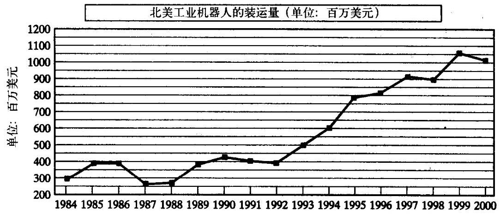

图1-1 北美工业机器人的装运量 (单位: 百万美元) [3]

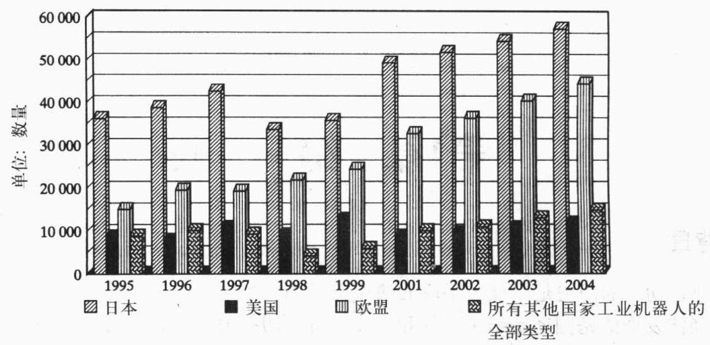

图1-2 1995 - 2000年各种用途工业机器人的年安装量和2001 - 2004年预计年安装量 ${}^{\lbrack 3\rbrack }$

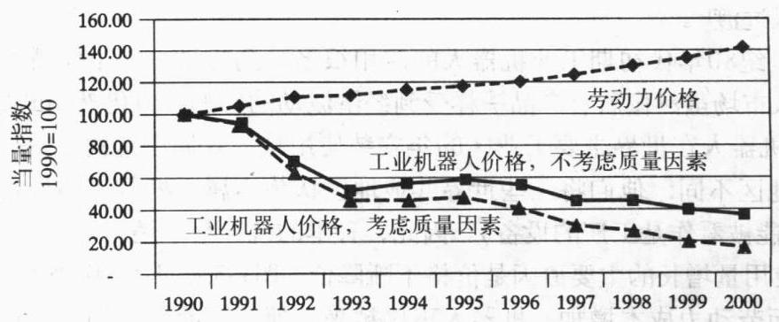

图1-3 20世纪90年代机器人价格与人力成本的比较 ${}^{\left\lbrack  3\right\rbrack  }$

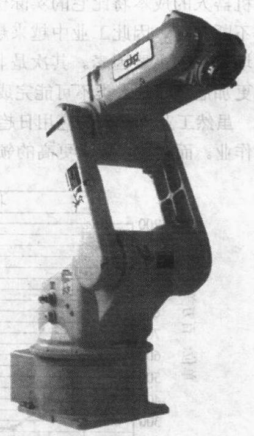

图1-4 被广泛应用的Adept 6 机械手有6个转动关节(经Adept公司许可)

本书重点阐述了操作臂的机构和控制理论，操作臂是工业机器人中最重要的一种类型。操作臂是否可称作工业机器人受到争议。如图 1-4 所示的装备通常被认为属于工业机器人的范畴, 而数控 (NC) 磨床则通常在此范畴之外。这种区别在某种程度上依赖于设备可编程能力的复杂程度。如果一台机械设备在编程后可实现多种用途, 则很可能被称作工业机器人。如果一台设备的主要功能都被限定用来执行同一类型任务，一般则把它称为专用的自动化装备。从本书的目的出发, 我们将不讨论这种区别, 书中的大部分内容均可应用于各种可编程机械。

一般来说, 对于操作臂的机构和控制理论的研究并不是一门新的科学, 它只不过是对传统学科理论的一种综合。机械工程理论为研究静态和动态环境下的操作臂提供了方法论; 数学方法用于描述机械手空间运动及其特性; 控制理论为实现期望运动或力提供了各种设计方法和评估算法; 电气工程技术可用于传感器及工业机器人接口的设计; 计算机技术提供了执行期望任务所需的编程平台。

## 1.2 操作臂的机构与控制

下面几节介绍一些术语, 并对文章中将要涉及的一些专题进行概述。

**位姿描述**

在机器人研究中, 我们通常在三维空间中研究物体的位置。这里所说的物体既包括操作臂的杆件、零部件和抓持工具, 也包括操作臂工作空间内的其他物体。通常这些物体可用两个非常重要的特性来描述:位置和姿态。自然我们会首先研究如何用数学方法表示和计算这些参量。

为了描述空间物体的位姿, 我们一般先将物体固置于一个空间坐标系, 即参考系中, 然后我们就在这个参考坐标系中研究空间物体的位置和姿态, 如图1-5所示。

任一坐标系都能用作描述物体位姿的参考系, 我们经常在不同参考系中变换表示物体空间位姿的形式。在第2章中，我们将研究同一物体在不同坐标系中空间位姿的描述方法和数学计算方法。

刚体位姿的研究对于机器人以外的领域也是非常有意义的。

**操作臂正运动学**

运动学研究物体的运动, 而不考虑引起这种运动的力。在运动学中, 我们研究位置、速度、加速度和位置变量对于时间或者其他变量的高阶微分。这样, 操作臂运动学的研究对象就是运动的全部几何和时间特性。

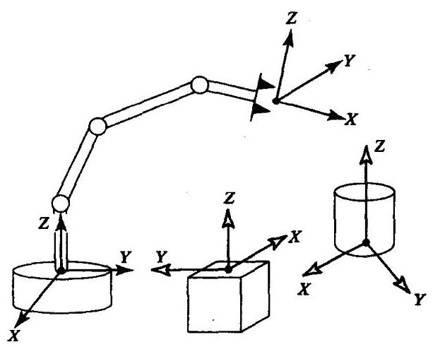

图1-5 在坐标系(参考系)中的操作臂和工作空间内的其他物体

几乎所有的操作臂都是由刚性连杆组成的, 相邻连杆间由可作相对运动的关节连接。这些关节通常装有位置传感器, 用来测量相邻杆件的相对位置。如果是转动关节, 这个位移被称为关节角。一些操作臂含有滑动 (或移动) 关节, 那么两个相邻连杆的位移是直线运动, 有时将这个位移称为关节偏距。

操作臂自由度的数目是操作臂中具有独立位置变量的数目, 这些位置变量确定了机构中所有部件的位置。自由度对所有的机构具有普遍意义。例如, 四杆机构只有一个自由度 (尽管它有三个可以运动的杆件)。对于一个典型的工业机器人来讲, 由于操作臂大都是开式的运动链, 而且每个关节位置都由一个独立的变量定义, 因此关节数目等于自由度数目。

末端执行器安装在操作臂的自由端。根据机器人的不同应用场合, 末端执行器可以是一个夹具、一个焊枪、一个电磁铁或是其他装置。我们通常用附着于末端执行器上的工具坐标系描述操作臂的位置, 与工具坐标系相对应的是与操作臂固定底座相联的基坐标系 (如图1-6所示)。

---

$\Theta$ 边栏页码为英文原书页码。

---

在操作臂运动学的研究中一个典型的问题是操作臂正运动学。计算操作臂末端执行器的位置和姿态是一个静态的几何问题。具体来讲, 给定一组关节角的值, 正运动学问题是计算工具坐标系相对于基坐标系的位置和姿态。一般情况下, 我们将这个过程称为从关节空间描述到笛卡儿空间描述的操作臂位置表示 ${}^{ \ominus  }$ 。这个问题将在第 3 章中详细论述。

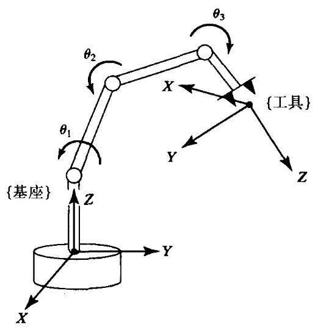

图1-6 正运动学方程描述了各个关节变量在工具坐标系与基坐标系间的函数关系

**操作臂逆运动学**

在第4章中, 我们将讨论操作臂逆运动学。这个问题就是给定操作臂末端执行器的位置和姿态, 计算所有可达给定位置和姿态的关节角 (如图 1-7 所示)。这是操作臂实际应用中的一个基本问题。

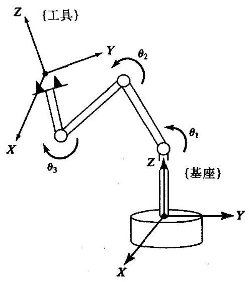

图1-7 给定工具坐标系的位置和姿态, 通过逆运动学可以计算各关节变量

这是一个相当复杂的几何问题, 然而人类或其他生物系统每天都要进行数千次这样的求解。对于机器人这样一个人工智能系统, 我们需要在控制计算机中生成一种算法来实现这种逆向计算。从某种程度上讲, 逆运动学问题的求解对于操作臂系统来说是最重要的部分。

我们认为这是个“定位”映射问题, 是将机器人位姿从三维笛卡儿空间向内部关节空间的映射。 当机器人目标位置用外部三维空间坐标表示时, 则需要进行这种映射。某些早期的机器人没有这种算法, 它们只能简单地被移动 (有时要由人工示教) 到期望位置, 同时记录一系列关节变量 (例如各关节空间的位置和姿态) 以实现再现运动。显然如果机器人只是单纯地记录和再现机器人的关节位置和运动, 那么就不需要任何从关节空间到笛卡儿空间的变换算法。然而现在已经很难找到一台没有这种逆运动学算法的工业机器人。

逆运动学不像正运动学那样简单。因为运动学方程是非线性的, 因此很难得到封闭解, 有时甚至无解。同时提出了解的存在性和多解问题。

上述问题的研究给人脑和神经系统在无意识的情况下引导手臂和手移动以及操作物体的现象做出了一种恰当的解释。

运动学方程解的存在与否限定了操作臂的工作空间。无解表示目标点处在工作空间之外, 因此操作臂不能达到这个期望位姿。

---

$\Theta$ 在笛卡儿坐标系中，我们用三个变量来描述空间一点的位置，而用另外三个变量描述物体的姿态。有时将此称为任务空间或操作空间。

---

**速度，静力，奇异性**

除了分析静态定位问题之外, 我们还希望分析运动中的操作臂。为操作臂定义雅可比矩阵可以比较方便地进行机构的速度分析。雅可比矩阵定义了从关节空间速度向笛卡儿空间速度的映射 (如图1-8所示)。这种映射关系随着操作臂位形的变化而变化。在奇异点雅可比矩阵是不可逆的。对这种现象的正确理解对于操作臂的设计者和用户都是十分重要的。

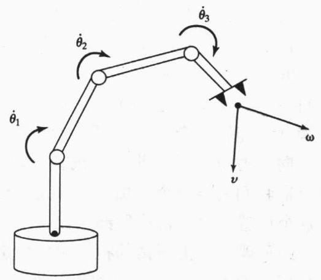

图1-8 关节速率和末端执行器速率的几何关系可以通过雅可比矩阵表示

以第一次世界大战中坐在老式双翼飞机后座的机枪手为例 (如图1-9所示)。当在前座舱中的驾驶员控制飞机飞行时，后座舱的机枪手负责射击敌人。 为了完成这项任务, 后座舱机枪被安装在有两个旋转自由度的机构上, 这两个自由度分别被称为方位角和仰角。通过这两个运动(两个自由度)，机枪手可以直接射击上半球面中任何方向的目标。

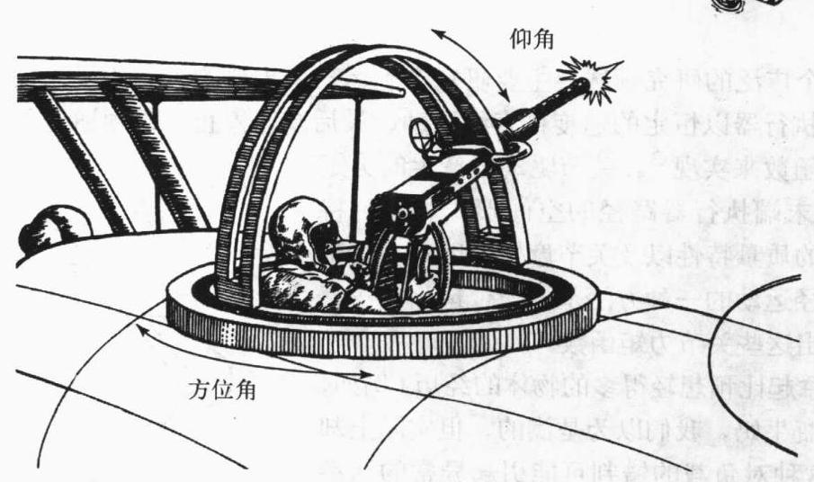

图1-9 第一次世界大战乘坐一个飞行员和一个后座舱机枪手的老式双翼飞机。 这种后座舱机枪的机构受奇异点的影响

一架敌机出现在方位角 ${15}^{ \circ  }$ 、仰角 ${25}^{ \circ  }$ 的地方! 机枪手瞄准敌机并向其开火，与此同时，机枪手改变机枪的方位以便尽可能长时间地向敌机连续发射子弹。他成功地击落了敌机。

另一架敌机出现在方位角 ${15}^{ \circ  }$ 、仰角 ${70}^{ \circ  }$ 的地方! 机枪手瞄准敌机并开始向其开火。敌机迅速躲避，相对于机枪手的飞机仰角越来越大。很快，敌机飞过机枪手飞机的正上方。敌机为何这样做? 因为这样的话,机枪手就不能够准确瞄准敌机了! 机枪手发现,当敌机飞过他的正上方时, 他就需要快速地改变机枪的方位角。但是他并不能以如此快速的动作改变方位角, 因而致使敌机逃掉了!

最终幸运的敌机飞行员因为机枪的奇异点而获救! 枪的定位机构尽管在绝大部分操作范围内都能工作良好, 但当枪竖直向上或接近这种方位时, 它的工作就越来越不理想。为了跟踪穿过飞机正上方的目标，机枪手就需要使枪以非常快的速度绕着方位轴转动。目标越接近于飞机正上方的位置, 机枪手就需要加速使枪绕方位轴转动来跟踪目标。如果目标直接飞过枪手正上方, 他就需要使枪以无穷大的速度绕方位轴转动!

机枪手应该向机构设计者抱怨这个问题吗？能设计出更好的机构来避免这个问题吗？然而回答却是这个问题并不容易避免。事实上, 任何一个只有两个转动关节的两自由度的定位机构都不能够避免这个问题。当机构处于这种位姿时，例如机枪竖直向上射击的情况，机枪的方向与方位角转轴共线。也就是说, 当处于这点时, 方位角转动改变不了机枪的方向。我们知道我们需要两个自由度来确定机枪的方位, 但在这一点上, 其中一个转动关节却失效了。 在这个位置, 这种机构局部退化, 就像只有一个自由由度一样 (仅有仰角)。

这种现象是由所谓的机构奇异性造成的。所有的机械装置都会有这种问题, 包括机器人。 正如后座舱机枪一样, 这些奇异性并不影响机器人手臂在其工作空间内的定位, 然而, 机械臂在这些奇异点附近运动时会出现一些问题。

操作臂并不总是在工作空间内自由运动, 有时也接触工件或工作面, 并施加一个静力。 在这种情况下的问题是一组什么样的关节力矩能够产生要求的接触力和力矩? 为了解决这个问题, 自然又要利用操作臂的雅可比矩阵。

**动力学**

动力学是一个广泛的研究领域, 主要研究产生运动所需要的力。为了使操作臂从静止开始加速, 使末端执行器以恒定的速度作直线运动, 最后减速停止, 必须通过关节驱动器产生一组复杂的力矩函数来实现 ${}^{ \ominus  }$ 。关节驱动器产生的力矩函数形式取决于末端执行器路径的空间形式和瞬时特性、连杆和负载的质量特性以及关节摩擦等因素。控制操作臂沿期望路径运动的一种方法是, 通过运用操作臂动力学方程求解出这些关节力矩函数。

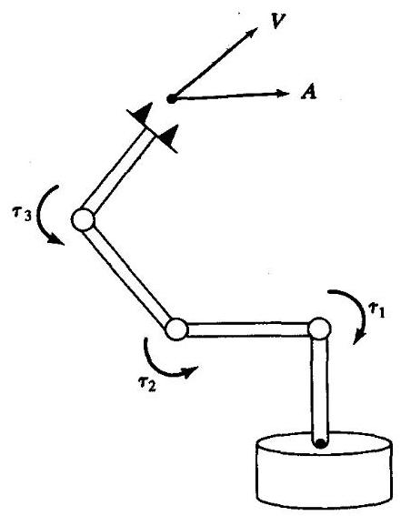

图1-10 动力学方程中驱动器的驱动力矩和操作臂运动之间关系的图示

许多人都有拿起比预想轻得多的物体的经历 (例如, 从冰箱中取出一瓶牛奶, 我们以为是满的, 但实际上却几乎是空的), 这种对负载的错判可能引起异常的抓举动作。这种经验表明, 人体控制系统比纯粹的运动规划更复杂。操作臂控制系统就是利用了质量以及其他动力学知识。同样, 我们构造机器人操作臂运动控制的算法也应当把动力学考虑进去。

动力学方程的第二个用途是用于仿真。通过重构动力学方程以便以驱动力矩函数的形式来计算加速度, 这样就可以在一组驱动力矩作用下对操作臂的运动进行仿真 (见图1-10)。随着计算能力的提高和计算成本的下降, 仿真在许多领域得到广泛应用并且显得越来越重要。

---

$\Theta$ 我们用关节驱动器作为操作臂驱动装置的通用术语，它可以是电机、气缸、液压缸和人工肌肉。

---

在第6章中, 我们推导了动力学方程, 这些动力学方程可用于对操作臂运动的控制和仿真。

**轨迹生成**

平稳控制操作臂从一点运动到另外一点, 通常的方法是使每个关节按照指定的时间连续函数来运动。一般情况下，操作臂各关节同时开始或同时停止运动, 这样操作臂的运动才显得协调。轨迹生成就是如何准确计算出这些运动函数 (见图1-11)。

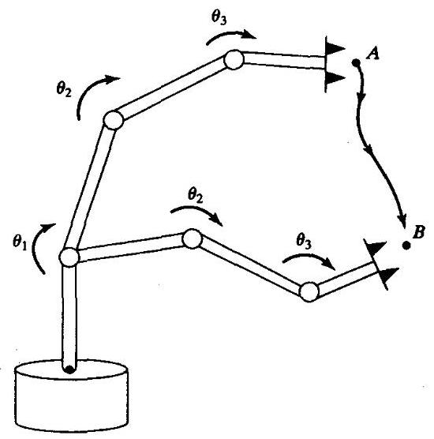

图 1-11 为了使末端执行器通过空间的 $A$ 点运动到 $B$ 点,必须为各个关节计算一个连续运动轨迹

通常, 一条路径的描述不仅需要确定期望目标, 而且还需要确定一些中间点或路径点, 操作臂必须通过这条路径到达目标。有时用术语样条函数来表示通过一系列路径点的连续函数。

为了使末端执行器在空间中走出一条直线 (或其他的几何形状)，那么必须将末端执行器的期望运动转化为一系列等效的关节运动。这种笛卡儿轨迹生成将在第7章中讨论。

**操作臂设计与传感器**

尽管从理论上说操作臂是一种适用于多种情况的通用装置, 但从经济角度考虑, 操作臂的机械设计是由预期执行的任务决定的。设计者不仅要考虑诸如几何尺寸、速度以及承载能力等因素, 而且还要考虑到关节的数量和它们的几何分布。这些因素影响了操作臂工作空间的大小和性质、操作臂结构的刚度以及其他性质。

机器人手臂的关节越多, 机器人就越灵巧, 能力越强。当然, 它的制造难度也越大, 造价也越高。为了设计一个实用的机器人, 可采取两种方式: 一种是为特定任务设计专用机器人，另一种是设计能够完成各种任务的通用机器人。对于专用机器人，仔细考虑一下就能确定需要的关节数目。比如说, 一个仅用来在电路板上装配电器元件的专用机器人有四个关节就足够了。三个关节就可以使操作臂到达三维空间中的任何位置, 第四个关节可以使被抓取的元件绕着垂直轴旋转。对于通用机器人, 有趣的是由我们生活的现实世界的基本特性可知 “合适的” 最小关节数量是六个。

完整的操作臂设计还包括以下因素:驱动器的选择和配置、传动系统以及内部位置(有时是力) 传感器 (见图1-12)。上述问题以及其他设计问题将在第8章中讨论。

**线性位置控制**

一些操作臂装有步进电机或其他驱动器来直接产生所需要的轨迹。绝大多数操作臂都是由驱动器来驱动的, 这些驱动器提供力或力矩来驱动连杆运动。在这种情况下, 就需要一个算法来计算用于产生期望运动的力矩。动力学是设计这种算法的核心问题, 但仅依靠动力学本身并不能解决问题。设计位置控制系统首先需要考虑的是, 自动补偿由于系统参数引起的误差, 以及抑制引起系统偏离期望轨迹的扰动。为此, 通过控制算法对位置和速度传感器进行检测, 以计算出驱动器的力矩指令 (见图1-13)。在第9章中, 我们将讨论控制算法, 这些算法的综合是基于操作臂动力学的线性近似得出的。这些线性控制方法已广泛应用于工程实际中。

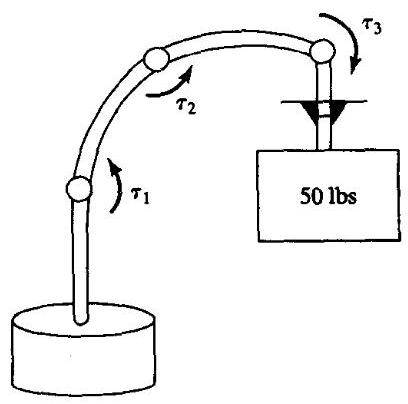

图1-12 机械操作臂的设计须解决驱动器的选择与配置、传动系统，结构刚度、传感器配置以及其他问题

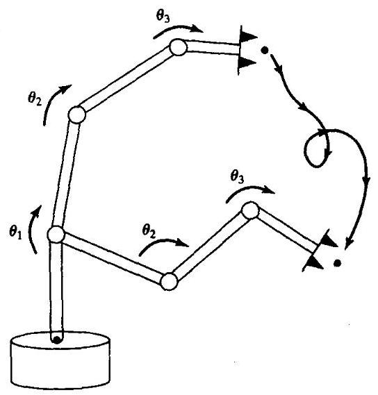

图1-13 为了使操作臂沿着期望轨迹运动, 必须设计位置控制系统。这个系统通过关节传感器的反馈保持操作臂的轨迹运动

**非线性位置控制**

尽管基于近似线性模型的控制系统广泛应用于当前的工业机器人中, 但在进行控制算法综合时, 考虑操作臂完整的非线性动力学就很重要了。一些工业机器人在控制器中已经应用非线性控制算法。操作臂的非线性控制技术比简单的线性控制方法具有更好的性能。第 10 章将介绍机器人的非线性控制系统。

**力控制**

在操作臂执行实际操作任务的过程中, 当操作臂接触零件、工具或工作表面时, 操作臂控制力的能力显得极其重要。力控制是对位置控制的补偿, 因为在特定情况下, 我们一般认为只有力控制或位置控制是合适的。当操作臂在自由空间中运动时，只有位置控制的概念, 因为它不与任何表面接触。然而在一些应用场合, 当操作臂接触刚性表面时, 位置控制方法可能会在接触表面产生过大的力或者使执行器脱离接触表面。操作臂很少同时在所有方向受到作用表面的约束，因此就需要混合控制方式，也就是说，在某些方向用位置控制法则来控制, 而其余方向通过力控制法则来控制 (见图1-14)。第11章介绍了设计这种力控制方案的方法。

当用机器人擦洗窗户时, 机器人应当在垂直于窗户平面的方向施加一个恒定的力, 同时在平行于窗户平面的方向走出一条运动轨迹。对于这类操作任务自然会应用分离或混合控制方法。

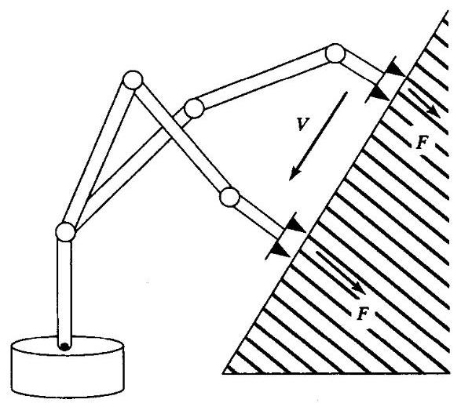

图1-14 为了使操作臂以恒力在一个表面上滑动, 必须应用力 - 位置混合控制系统

**可编程机器人**

机器人编程语言是用户和工业机器人交互的接口。这样就给我们提出了一个重要问题: 编程人员怎样才能容易地描述机器人的空间运动? 如何给多个机器人编程以便使它们并行工作? 怎样用机器人语言来描述基于传感器的运动?

机器人操作臂与专用的自动化装备不同的是它们具有 “柔性”, 即可编程。不仅操作臂的运动是可编程的, 而且通过传感器可以和其他的工厂自动化装备进行通信, 操作臂在执行任务的过程中还能够适应各种变化 (见图 1-15)。

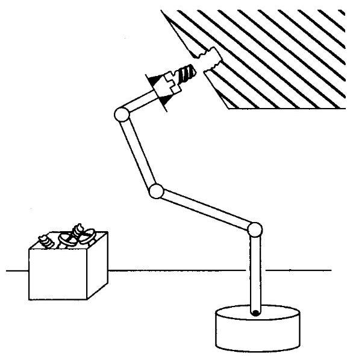

图1-15 操作臂和末端执行器的期望运动、期望的接触力以及复杂的操作方案都可以用机器人编程语言来描述

在典型的机器人系统中, 操作者可以用一种快速方法来操纵机器人该走哪条路径。首先, 操作者将操作臂手部上(也可以是抓持器上)的一个特殊点指定为操作点，有时也叫做TCP (工具中心点)。操作者可以通过操作点相对于用户坐标系的期望位置来描述机器人的运动。 通常, 操作者可在某个与任务相关的位置定义与机器人基坐标系相关的参考坐标系。

绝大多数情况下，路径是通过确定一系列的路径点形成的。路径点相对于参考坐标系确定, 是TCP经过路径上的指定位置。操作者除了要确定这些路径点之外, 还要确定不同路径段的TCP速度。有时, 其他编程人员也可以指定机器人的运动 (例如针对不同的光洁度标准等等)。在轨迹输入中，轨迹生成算法必须规划出机器人运动的所有细节:通过各点的速度曲线、运动时间等等。因此，轨迹生成的输入问题一般是由机器人编程语言的结构决定的。

由于操作臂和其他可编程自动化设备应用于越来越多的指令化工业操作中, 因此用户接口的性能变得极其重要。机器人编程的问题包含了所有 “传统” 计算机编程的问题, 所以它本身就是个广泛的研究课题。而且, 机器人编程的某些特殊问题还引发了另外的问题。其中的一些问题将在第12章中讨论。

**离线编程和仿真**

离线编程系统是一个机器人编程环境, 这种环境通常被计算机图形学充分扩展了, 在这种环境下, 即使不通过机器人本身也能够对机器人进行编程。采用这种系统的好处在于, 当需要对机器人编程时，离线编程系统允许生产设备(例如机器人)继续工作，因此，自动化工厂能够在大部分时间处于生产状态 (见图1-16)。

离线编程系统还可以将用于产品设计阶段的计算机辅助设计 (CAD) 数据库与产品的实际制造之间连接起来。在某些情况下, 直接使用CAD数据能够极大地减少制造过程所需的编程时间。第13章讨论了工业机器人离线编程系统的关键问题。

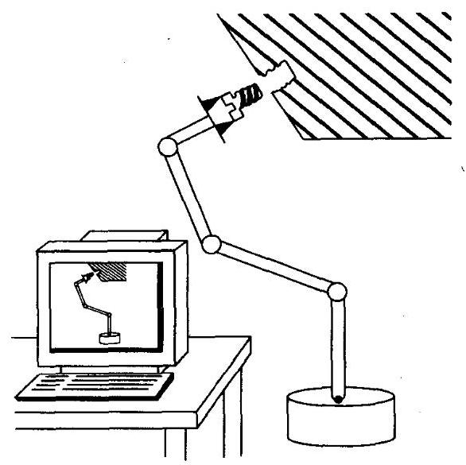

图1-16 离线编程系统通常提供了一个计算机图形学接口, 允许在编程过程中不通过机器人进行编程

## 1.3 符号

符号是科学和工程中的一个必不可少的问题。本书中, 我们作如下约定:

1. 一般大写字母的变量表示矢量或矩阵，小写字母的变量表示标量。

2. 左下标和左上标表示变量所在的坐标系。例如， ${}^{A}p$ 表示坐标系 $\{ A\}$ 中的位置矢量， ${}_{B}^{A}R$ 是确定坐标系 $\{ A\}$ 和坐标系 $\{ B\}$ 相对关系的旋转矩阵 ${}^{ \ominus  }$ 。

3. 右上标用来表示矩阵的逆或转置 (比如, ${R}^{-1},{R}^{T}$ ),这种表示已被广泛采用。

4. 右下标没有严格限制,但可以用来表示矢量的分量(例如 $x\text{ 、 }y$ 或 $z$ )或者作为一种描述—— 例如在 ${P}_{bolt}$ 中,表示螺栓上的位置。

5. 我们可能会用到许多三角函数。角 ${\theta }_{1}$ 的余弦可以用以下任何一种形式来表示: $\cos {\theta }_{1} = c{\theta }_{1} = {c}_{1}$ 。

矢量可用列矢量表示，因此，行矢量的转置可以直接表示列矢量。

一般对于矢量符号表示需要说明的是:很多力学教材处理矢量时非常抽象，一般是将矢量表示成相对于不同坐标系定义的矢量。最明显的例子就是矢量的相加, 可直接看出这些矢量是相对于不同参考坐标系的。这种表示方法非常方便,可以使表达式紧凑直观。以 ${}^{0}{\mathbf{\omega }}_{4}$ 为例, 它是串联起来的四个刚体 (就像操作臂的连杆一样) 中最后一个刚体相对于这个链的固定基座的角速度。由于角速度是以矢量的方式相加, 所以我们可以写出一个非常简单的矢量方程来表达最后一个杆件的角速度:

$$
{}^{0}{\omega }_{4} = {}^{0}{\omega }_{1} + {}^{1}{\omega }_{2} + {}^{2}{\omega }_{3} + {}^{3}{\omega }_{4} \tag{1-1}
$$

然而, 这些量必须是相对于同一个坐标系的, 否则它们不能够相加, 所以, 尽管方程 (1-1) 是直观的, 但却隐含了许多计算工作。对于研究操作臂这种具体的例子, 像方程 (1-1) 这样的表述是非常理想的, 它隐含了记录坐标系等繁杂的工作, 而这些工作实际上都是需要去做的。

因此, 本书中使用的矢量符号都带有参考系信息, 矢量只有在同一个坐标系下才可以相加, 否则不能相加。利用这种方法, 我们可以在推导时解决坐标系记录问题, 并且可以直接应用于数值计算。

**参考文献**

[1] B. Roth, "Principles of Automation," Future Directions in Manufacturing Technology, Based on the Unilever Research and Engineering Division Symposium held at Port Sunlight, April 1983, Published by Unilever Research, UK.

[2] R. Brooks, "Flesh and Machines," Pantheon Books, New York, 2002.

[3] The International Federation of Robotics, and the United Nations, "World Robotics 2001," Statistics, Market Analysis, Forecasts, Case Studies and Profitability of Robot Investment, United Nations Publication, New York and Geneva, 2001.

主要参考书目

[4] R. Paul, Robot Manipulators, MIT Press, Cambridge, MA, 1981.

[5] M. Brady et al., Robot Motion, MIT Press, Cambridge, MA, 1983.

[6] W. Synder, Industrial Robots: Computer Interfacing and Control, Prentice-Hall, Englewood Cliffs, NJ, 1985.

[7] Y. Koren, Robotics for Engineers, McGraw-Hill, New York, 1985.

[8] H. Asada and J.J. Slotine, Robot Analysis and Control, Wiley, New York, 1986.

---

$\Theta$ 这个术语将在第2章中介绍。

---

[9] K. Fu, R. Gonzalez, and C.S.G. Lee, Robotics: Control, Sensing, Vision, and Intelligence, McGraw-Hill, New York, 1987.

[10] E. Riven, Mechanical Design of Robots, McGraw-Hill, New York, 1988.

[11] J.C. Latombe, Robot Motion Planning, Kluwer Academic Publishers, Boston, 1991.

[12] M. Spong, Robot Control: Dynamics, Motion Planning, and Analysis, IEEE Press, New York, 1992.

[13] S.Y. Nof, Handbook of Industrial Robotics, 2nd Edition, Wiley, New York, 1999.

[14] L.W. Tsai, Robot Analysis: The Mechanics of Serial and Parallel Manipulators, Wiley, New York, 1999.

[15] L. Sciavicco and B. Siciliano, Modelling and Control of Robot Manipulators, 2nd Edition, Springer-Verlag, London, 2000.

[16] G. Schmierer and R. Schraft, Service Robots, A.K. Peters, Natick, MA, 2000.

**主要参考期刊和杂志**

[17] Robotics World.

[18] IEEE Transactions on Robotics and Automation.

[19] International Journal of Robotics Research (MIT Press).

[20] ASME Journal of Dynamic Systems, Measurement, and Control.

[21] International Journal of Robotics & Automation (IASTED).

**习题**

1.1 [20] 制做一个年表，记录在过去40年里工业机器人发展的主要事件。参见参考文献。

1.2 [20] 绘制一个表格, 表示工业机器人的主要应用 (例如点焊、装配等) 以及每个应用行业已装备机器人的使用百分比。在这张图上你能够发现需要的最新数据。见参考文献。

1.3 [40]图1-3显示了过去几年机器人成本是如何下降的。找出不同工业领域(例如汽车工业、 电子装配工业以及农业等等)的劳动力成本的数据，画出一个图，比较使用人力的成本和使用机器人技术的成本。你可看出不同时期各种工业领域机器人成本曲线与人力成本曲线交点的变化。当机器人技术开始显现它们在各种工业领域的应用价值时, 由此图可以得出一些近似的数据。

1.4 [10]用一两句话，简述运动学、工作空间和轨迹的定义。

1.5 [10]用一两句话, 简述坐标系、自由度和位置控制的定义。

1.6 [10]用一两句话，简述力控制、机器人编程语言的定义。

1.7 [10]用一两句话，简述非线性控制和离线编程的定义。

1.8 [20] 绘制一个图表, 表达出在过去的20年里人力成本是如何上升的。

1.9 [20] 绘制一个图表, 表达出在过去的20年里计算机的性价比是如何提高的。

1.10 [20] 绘制一个图表, 表达出工业机器人的主要用户 (例如航空和汽车业等等) 以及每个行业已装备机器人的使用百分比。在这张图上你能够得出需要的最新数据 (参见参考文献部分)。

**编程习题**

熟悉一下计算机, 它将用于每章结尾的编程习题。务必学会创建和编辑文件, 并会编译和执行程序。

**MATLAB习题**

本书绝大多数章节的结尾都将给出一个MATLAB习题集。通常, 这些习题要求学生在 MATLAB中应用相关的机器人数学进行编程，并检查MATLAB的Robotics工具箱中的结果。 本教科书认为学生已经掌握MATLAB和线性代数 (矩阵理论)。同样, 学生也必须逐渐掌握 MATLAB的Robotics工具箱。以下是MATLAB习题。

a) 如果必要的话, 熟悉一下MATLAB的编程环境。根据MATLAB软件的提示, 尝试输入演示和帮助。利用颜色代码的MATLAB编辑器，学习如何创建、编辑、保存、运行和调试m一文件(一系列MATLAB语句组成的ASCII文件)。学习如何创建阵列(矩阵和向量)。学习MATLAB内部的线性代数函数, 这些函数可用于矩阵和向量求积运算、点乘、 叉乘、转置、行列式和求逆, 也可以求解线性方程组。MATLAB是基于C语言的, 但使用起来比C语言更容易。学习如何应用MATLAB编制逻辑结构和循环结构的程序。 学习如何使用子程序和函数。学习如何使用注释符 (%) 对你编写的程序进行注释以及如何使用助记符来增强程序的可读性. 可以登录www.mathworks.com获得更多的信息和指导。MATLAB的高级用户应当熟悉MATLAB的图形接口Simulink，也应该熟悉 Symbolic工具箱。

b) 熟悉一下MATLAB的Robotics工具箱, 这是由澳大利亚Pinjarra Hills的联邦科学与工业研究组织的Peter I. Corke编写的第三部工具箱。这个产品可以从www.cat.csiro. au/ cmst/staff/pic/robot免费下载。它的源代码是可读和可修改的。有一个国际用户团体, 你可通过robot-toolbox @lists.msa.cmst.csiro.au进行联系。下载MATLAB的Robotics工具箱,使用 .zip文件按照指令安装在你的计算机上。阅读README文件, 熟悉一下提供给用户的各种函数。找到robot.pdf文件，这是个用户手册，它介绍了背景知识和工具箱所有函数的详细用法。如果你不了解这些函数的用途, 可不必担心, 它们是用来解决本书第2章到第7章所有机器人数学问题的。
