# 第2章 空间描述和变换

## 2.1 概述

机器人操作的定义是指通过某种机构使零件和工具在空间运动。这自然就需要表达零件、 工具以及机构本身的位置和姿态。为了定义和运用表达位姿的数学量, 我们必须定义坐标系并给出表达的规则。我们这里提出了许多关于位姿的描述, 这些描述作为我们以后表达线速度和角速度、力和力矩的基础。

我们采用这样一个体系, 即存在着一个世界坐标系, 我们讨论任何问题都能够参照这个坐标系。我们定义的位姿都是参照世界坐标系或者由世界坐标系定义的 (或能够定义的) 的笛卡儿坐标系。

## 2.2 描述: 位置、姿态与坐标系

描述可用来确定一个操作系统处理的各种对象的特性。这些对象包括零件、工具和操作臂本身。在本节中, 我们将讨论位姿的描述以及包含这两个描述的统一体: 坐标系。

**位置描述**

一旦建立了坐标系,我们就能用一个 $3 \times  1$ 的位置矢量对世界坐标系中的任何点进行定位。 因为经常在世界坐标系中还要定义许多坐标系, 因此必须在位置矢量上附加一信息, 表明是在哪一个坐标系被定义的。在本书, 位置矢量用一个前置的上标来表明其参考的坐标系 (除非在文中已明确说明) 一一例如, ${}^{A}P$ 。这表明 ${}^{A}P$ 的数值是由沿着坐标轴 $\{ A\}$ 的距离表示的。每个沿着坐标轴的距离都可被认为是矢量在相应坐标轴上的投影。

  

    <button type="button" class="is-active" data-figure-mode="original" aria-pressed="true">原图</button>
    <button type="button" data-figure-mode="interactive" aria-pressed="false">可交互</button>
  

  

    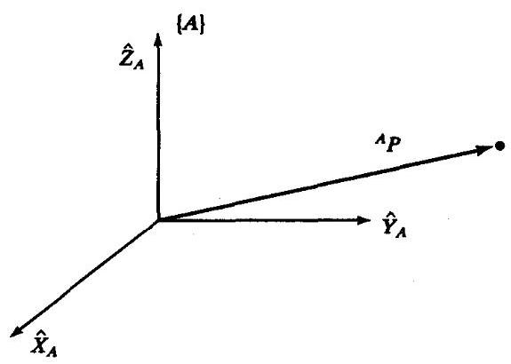
  

  

    
正在载入交互模型…

  

图2-1 相对于坐标系的矢量（原图与交互示例）

图2-1用三个相互正交的带有箭头的单位矢量来表示一个坐标系 $\{ A\}$ 。用一个矢量来表示一个点 ${}^{A}P$ ,并且可等价地被认为是空间的一个位置, 或者简单地用一组有序的三个数字来表示。矢量的各个元素用下标 $x, y$ 和 $z$ 来标明:

$$
{}^{A}P = \left\lbrack  \begin{array}{l} {p}_{x} \\  {p}_{y} \\  {p}_{z} \end{array}\right\rbrack \tag{2-1}
$$

总之, 我们用一个位置矢量来描述空间中点的位置。其他空间点位置的3维描述, 例如球坐标或柱坐标表示将放在本章结尾的习题中讨论。

**姿态描述**

我们发现不仅经常需要表示空间的点, 还经常需要描述空间中物体的姿态。例如, 如果在图 2-2 中矢量 ${}^{4}P$ 直接确定了在操作手指端之间的某点, 只有当手的姿态已知后, 手的位置才能完全被确定下来。假定操作手有足够数量的关节 ${}^{ \ominus  }$ , 则操作手可有任意的姿态, 而该点在指端之间的位置可保持不变。为了描述物体的姿态, 我们将在物体上固定一个坐标系并且给出此坐标系相对于参考系的表达。在图2-2中,已知坐标系 $\{ B\}$ 以某种方式固定在物体上。 $\{ B\}$ 相对于 $\{ A\}$ 中的描述就足以表示出物体的姿态。

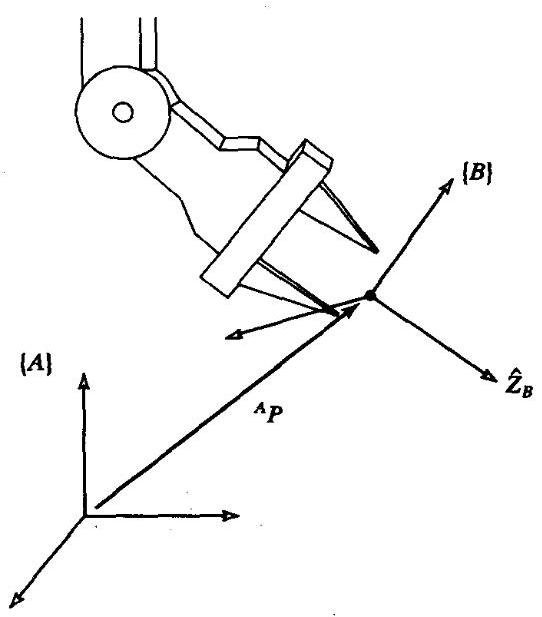

图2-2 物体位置和姿态的确定

因此, 点的位置可用矢量描述, 物体的姿态可用固定在物体上的坐标系来描述。描述连体坐标系 $\{ B\}$ 的一种方法是利用坐标系 $\{ A\}$ 的三个主轴单位矢量 ${}^{ \ominus  }$ 来表示。

我们用 ${\widehat{X}}_{B},{\widehat{Y}}_{B}$ 和 ${\widehat{Z}}_{B}$ 来表示坐标系 $\{ B\}$ 主轴方向的单位矢量。当用坐标系 $\{ A\}$ 的坐标表达时,它们被写成 ${}^{A}{\widehat{X}}_{B},{}^{A}{\widehat{Y}}_{B}$ 和 ${}^{A}{\widehat{Z}}_{B}$ 。我们很容易将这三个单位矢量按照 ${}^{A}{\widehat{X}}_{B},{}^{A}{\widehat{Y}}_{B},{}^{A}{\widehat{Z}}_{B}$ 的顺序排列组成一个 $3 \times  3$ 的矩阵,我们称这个矩阵为旋转矩阵,并且由于这个特殊旋转矩阵是 $\{ B\}$ 相对于 $\{ A\}$ 的表达, 所以我们用符号 ${}_{B}^{A}R$ 来表示 (下一节将进一步说明旋转矩阵中左上标和左下标的选择方法):

$$
{}_{B}^{A}R = \left\lbrack  {{}^{A}{\widehat{X}}_{B}{}^{A}{\widehat{Y}}_{B}{}^{A}{\widehat{Z}}_{B}}\right\rbrack   = \left\lbrack  \begin{array}{lll} {r}_{11} & {r}_{12} & {r}_{13} \\  {r}_{21} & {r}_{22} & {r}_{23} \\  {r}_{31} & {r}_{32} & {r}_{33} \end{array}\right\rbrack \tag{2-2}
$$

总之, 一组三个矢量可以用来确定一个姿态。简单起见, 我们用三个矢量作为矩阵的列来构造一个 $3 \times  3$ 的矩阵。于是,点的位置可用一个矢量来表示,物体的姿态可用一个矩阵来表示。 在2.8节, 我们将讨论另外一些只需要三个参数的姿态描述方法。

在式 (2-2) 中,标量 ${r}_{ij}$ 可用每个矢量在其参考坐标系中单位方向上投影的分量来表示。 于是,式 (2-2) 中 ${}_{B}^{A}R$ 的各个分量可用一对单位矢量的点积来表示:

$$
{}_{B}^{A}R = \left\lbrack  {{}^{A}{\widehat{X}}_{B}{}^{A}{\widehat{Y}}_{B}{}^{A}{\widehat{Z}}_{B}}\right\rbrack   = \left\lbrack  \begin{array}{lll} {\widehat{X}}_{B} \cdot  {\widehat{X}}_{A} & {\widehat{Y}}_{B} \cdot  {\widehat{X}}_{A} & {\widehat{Z}}_{B} \cdot  {\widehat{X}}_{A} \\  {\widehat{X}}_{B} \cdot  {\widehat{Y}}_{A} & {\widehat{Y}}_{B} \cdot  {\widehat{Y}}_{A} & {\widehat{Z}}_{B} \cdot  {\widehat{Y}}_{A} \\  {\widehat{X}}_{B} \cdot  {\widehat{Z}}_{A} & {\widehat{Y}}_{B} \cdot  {\widehat{Z}}_{A} & {\widehat{Z}}_{B} \cdot  {\widehat{Z}}_{A} \end{array}\right\rbrack \tag{2-3}
$$

---

$\Theta$ 多少关节为“足够”将在第3章和第4章讨论。

目 尽管有两个主轴单位矢量可能就够了，但一般常使用三个主轴单位矢量(第三个主轴单位矢量可由已知的两个主轴单位矢量叉乘得到)。

---

为简单起见, 式 (2-3) 中最右边矩阵内的前置上标被省略了。事实上, 只要点积的各对矢量是在同一个坐标系中描述的, 那么坐标系的选择可以是任意的。由两个单位矢量的点积可得到二者之间夹角的余弦, 因此你就可以明白为什么旋转矩阵的各分量常被称作方向余弦了。

进一步观察式 (2-3),可以看出矩阵的行是单位矢量 $\{ A\}$ 在 $\{ B\}$ 中的表达; 即,

$$
{}_{B}^{A}R = \left\lbrack  {{}^{A}{\widehat{X}}_{B}{}^{A}{\widehat{Y}}_{B}{}^{A}{\widehat{Z}}_{B}}\right\rbrack   = \left\lbrack  \begin{matrix} {}^{B}{\widehat{X}}_{A}^{T} \\  {}^{B}{\widehat{Y}}_{A}^{T} \\  {}^{B}{\widehat{Z}}_{A}^{T} \end{matrix}\right\rbrack \tag{2-4}
$$

因此, ${}_{A}^{B}R$ 为坐标系 $\{ A\}$ 相对于 $\{ B\}$ 的描述,可由式 (2-3) 的转置得到; 即,

$$
{}_{A}^{B}R = {}_{B}^{A}{R}^{T} \tag{2-5}
$$

这表明旋转矩阵的逆矩阵等于它的转置, 可以简单证明如下:

$$
{}_{B}^{A}{R}^{T}{}_{B}^{A}R = \left\lbrack  \begin{matrix} {}^{A}{\widehat{X}}_{B}^{T} \\  {}^{A}{\widehat{Y}}_{B}^{T} \\  {}^{A}{\widehat{Z}}_{B}^{T} \end{matrix}\right\rbrack  \left\lbrack  {{}^{A}{\widehat{X}}_{B}{}^{A}{\widehat{Y}}_{B}{}^{A}{\widehat{Z}}_{B}}\right\rbrack   = {I}_{3} \tag{2-6}
$$

其中, ${I}_{3}$ 是 $3 \times  3$ 的单位矩阵。因此,

$$
{}_{B}^{A}R = {}_{A}^{B}{R}^{-1} = {}_{A}^{B}{R}^{T} \tag{2-7}
$$

实际上, 由线性代数[1], 我们知道一个正交阵的逆等于它的转置。我们已经在几何上证明了这一点。

**坐标系的描述**

完整描述图2-2中的操作手位姿所需的信息为位置和姿态。我们可在物体上任选一点描述其位置, 为方便起见, 将其作为连体坐标系的原点。在机器人学中, 位置和姿态经常成对出现, 于是我们将此组合称作坐标系, 四个矢量为一组, 表示了位置和姿态信息。例如, 在图 2-2中，一个矢量表示指端位置，而另外三个矢量表示姿态。一个坐标系可以等价地用一个位置矢量和一个旋转矩阵来描述。注意到参考系是一个坐标系, 在这个坐标系中除了姿态, 还有一个位置矢量,它可以确定这个坐标系的原点相对于其他嵌入坐标系的位置。例如,用 ${}_{B}^{A}R$ 和 ${}^{A}{P}_{BORG}$ 来描述坐标系 $\{ B\}$ ,其中 ${}^{A}{P}_{BORG}$ 是确定坐标系 $\{ B\}$ 的原点的位置矢量:

$$
\{ B\}  = \left\{  {{}_{B}^{A}R,{}^{A}{P}_{BORG}}\right\} \tag{2-8}
$$

在图2-3中,在世界坐标系中有三个坐标系。已知坐标系 $\{ A\}$ 和 $\{ B\}$ 相对于世界坐标系的关系以及坐标系 $\{ C\}$ 相对于坐标系 $\{ A\}$ 的关系。

在图2-3中, 我们引入坐标系的图形表示, 以便于用图示说明坐标系。坐标系可用三个标有箭头的单位矢量定义的坐标系的主轴来描述。从原点到另一点的箭头表示了一个矢量。这个矢量表示了箭头处的原点相对于箭尾所在坐标系的位置。例如在图2-3中，箭头方向表示 $\{ C\}$ 相对于 $\{ A\}$ 的关系而不是 $\{ A\}$ 相对于 $\{ C\}$ 的关系。

总之, 一个参考系可以用一个坐标系相对于另一坐标系的关系来描述。参考系包括了位置和姿态两个概念, 大多数情况下被认为是这两个概念的结合。位置可由一个参考系表示, 这个参考系中的旋转矩阵是单位阵, 并且这个参考系中的位置矢量确定了被描述点的位置。 同样, 如果参考系中的位置矢量是零矢量, 那么它表示的就是姿态。

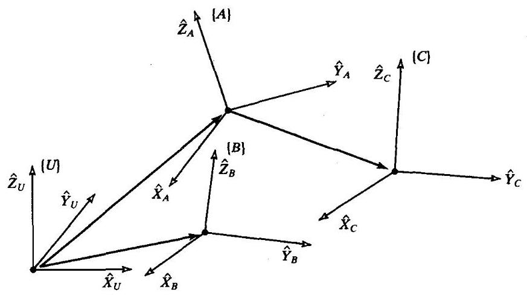

图2-3 几个坐标系举例

## 2.3 映射:从坐标系到坐标系的变换

在机器人学的许多问题中, 需要用不同的参考坐标系来表达同一个量。在上节中介绍了位置、姿态和坐标系的描述方法; 现在为了描述从一个坐标系到另一坐标系的变换, 我们讨论映射的数学方法。

**关于平移坐标系的映射**

在图2-4中,我们用矢量 ${}^{B}P$ 表示位置。当 $\{ A\}$ 与 $\{ B\}$ 的姿态相同时,我们希望以坐标系 $\{ A\}$ 来表达这个空间点。在这种情况下, $\{ B\}$ 不同于 $\{ A\}$ 的只是平移,可用矢量 ${}^{A}{P}_{BORG}$ 表示 $\{ B\}$ 的原点相对于 $\{ A\}$ 的位置。

因为两个矢量所在的坐标系具有相同的姿态,所以我们用矢量相加的方法求点 $P$ 相对 $\{ A\}$ 的表示 ${}^{A}P$ :

$$
{}^{A}P = {}^{B}P + {}^{A}{P}_{BORG} \tag{2-9}
$$

注意, 不同坐标系中的矢量只有在坐标系的姿态相同这种特殊情况时才可以相加。

这个简单例子说明了如何将一个矢量从一个坐标系映射到另一个坐标系。映射的概念, 即描述一个坐标系到另一坐标系的变换, 是非常重要的概念。这个点本身 (这里指空间某点) 没有改变,只是它的描述改变了。图2-4中由 ${}^{B}P$ 表示的点没有平移,而是保持不动,但我们给出该点一个新的描述,不过这是相对于坐标系 $\{ \mathbf{A}\}$ 的。

我们说矢量 ${}^{A}{P}_{BORG}$ 定义了这个映射，因为 ${}^{A}{P}_{BORG}$ 包含了所有进行变换所需的信息 (已知这些坐标系具有相同的姿态)。

**关于旋转坐标系的映射**

2.2 节介绍了用连体坐标系主轴的三个单位矢量来描述姿态的方法。为方便起见, 我们将三个单位矢量排列在一起形成一个 $3 \times  3$ 的矩阵的列,我们称此矩阵为旋转矩阵。如果这个旋转矩阵专门是指 $\{ B\}$ 相对于 $\{ A\}$ 的描述,我们用符号 ${}_{B}^{A}R$ 来表示。

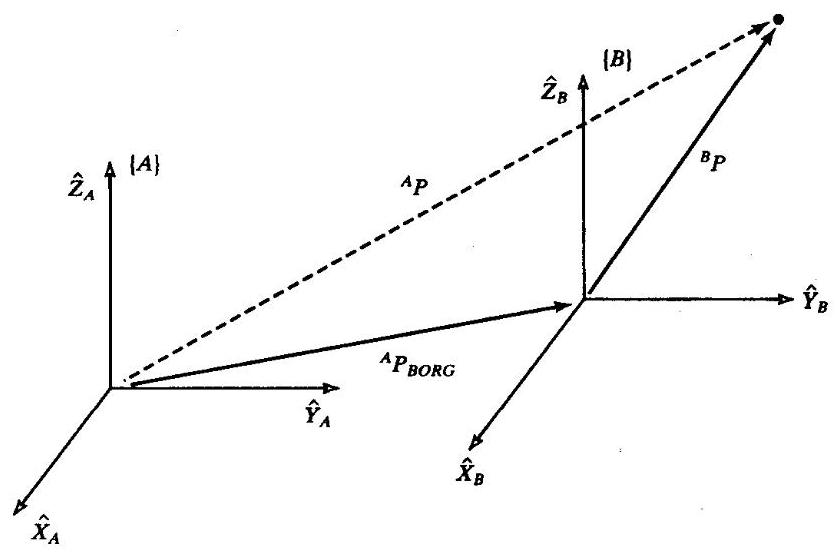

图2-4 平移映射

注意, 根据上述定义, 旋转矩阵各列的模均为1, 并且这些单位矢量相互正交。如前所述, 可得:

$$
{}_{B}^{A}R = {}_{A}^{B}{R}^{-1} = {}_{A}^{B}{R}^{T} \tag{2-10}
$$

从而,由于 ${}_{B}^{A}R$ 的列是 $\{ B\}$ 的单位矢量在 $\{ A\}$ 中的描述,所以 ${}_{B}^{A}R$ 的行是 $\{ A\}$ 的单位矢量在 $\{ B\}$ 中的描述。

那么一个旋转矩阵即为三个一组的列向量或三个一组的行向量, 即:

$$
{}_{B}^{A}R = \left\lbrack  {{}^{A}{\widehat{X}}_{B}{}^{A}{\widehat{Y}}_{B}{}^{A}{\widehat{Z}}_{B}}\right\rbrack   = \left\lbrack  \begin{matrix} {}^{B}{\widehat{X}}_{A}^{T} \\  {}^{B}{\widehat{Y}}_{A}^{T} \\  {}^{B}{\widehat{Z}}_{A}^{T} \end{matrix}\right\rbrack \tag{2-11}
$$

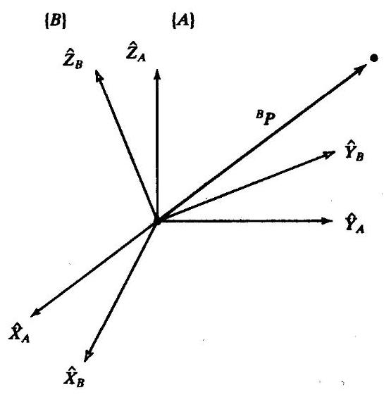

图2-5 矢量的旋转

我们已知矢量相对于某坐标系 $\{ B\}$ 的定义，现在想求矢量相对另一个坐标系 $\{ A\}$ 的定义，且这两个坐标系的原点重合, 这种情况是经常出现的, 如图2-5所示。 如果 $\{ B\}$ 相对于 $\{ A\}$ 的姿态描述是已知的,那么这个计算是可能的。这个姿态可由旋转矩阵 ${}_{B}^{A}R$ 来描述, 它的各列为 $\{ B\}$ 的单位矢量在 $\{ A\}$ 中的描述。

为了计算 ${}^{A}P$ ,我们注意到任一矢量的分量就是该矢量在参考系上单位矢量方向的投影。投影是由矢量点积计算的。因此,我们可知 ${}^{A}P$ 的分量计算如下:

$$
{}^{A}{p}_{x} = {}^{B}{\widehat{X}}_{A} \cdot  {}^{B}P
$$

$$
{}^{A}{p}_{y} = {}^{B}{\widehat{Y}}_{A} \cdot  {}^{B}P \tag{2-12}
$$

$$
{}^{A}{p}_{z} = {}^{B}{\widehat{Z}}_{A} \cdot  {}^{B}P
$$

为了用旋转矩阵相乘表示式 (2-12),由式 (2-11) 可知 ${}_{B}^{A}R$ 的行就是 ${}^{B}{\widehat{X}}_{A},{}^{B}{\widehat{Y}}_{A}$ 和 ${}^{B}{\widehat{Z}}_{A}$ ,那么可利用旋转矩阵将式 (2-12) 写成简化形式:

$$
{}^{A}P = {}_{B}^{A}{R}^{B}P \tag{2-13}
$$

式 (2-13) 进行了一个映射一一它改变了矢量的描述一将空间某点相对于 $\{ B\}$ 的描述 ${}^{B}P$ 转换成了该点相对于 $\{ A\}$ 的描述 ${}^{A}P$ 。

可以看出这种符号表示有助于跟踪映射过程和坐标系的变化。可看出引入符号的好处是用这个左下标正好消掉了后面变量的左上标,例如式 (2-13) 中的 $B$ 。

例2.1

图2-6表示坐标系 $\{ B\}$ 相对于坐标系 $\{ A\}$ 绕 $\widehat{Z}$ 轴旋转 30 度。这里 $\widehat{Z}$ 轴指向为由纸面向外。

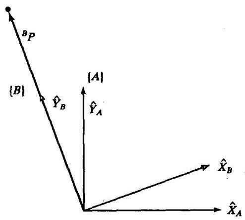

图2-6 $\left\{  B\right\}$ 绕 $\widehat{Z}$ 轴旋转30度

在 $\{ A\}$ 中写出 $\{ B\}$ 的单位矢量,并且将它们按列组成旋转矩阵,得到:

$$
{}_{B}^{A}R = \left\lbrack  \begin{array}{rrr} {0.866} &  - {0.500} & {0.000} \\  {0.500} & {0.866} & {0.000} \\  {0.000} & {0.000} & {1.000} \end{array}\right\rbrack \tag{2-14}
$$

已知:

$$
{}^{B}P = \left\lbrack  \begin{array}{l} {0.0} \\  {2.0} \\  {0.0} \end{array}\right\rbrack \tag{2-15}
$$

求出 ${}^{A}P$ :

$$
{}^{A}P = {}_{B}^{A}{R}^{B}P = \left\lbrack  \begin{array}{r}  - {1.000} \\  {1.732} \\  {0.000} \end{array}\right\rbrack \tag{2-16}
$$

这里, ${}_{B}^{A}R$ 的作用是将相对于坐标系 $\{ A\}$ 描述的 ${}^{B}P$ 映射到 ${}^{A}P$ 。当引入这个变换时,重要的是要记住:从映射的角度看，原矢量 $P$ 在空间并没有改变，我们只不过求出了这个矢量相对于另一个坐标系的新的描述。

**关于一般坐标系的映射**

经常有这种情况,我们已知矢量相对某坐标系 $\{ B\}$ 的描述,并且想求出它相对于另一个坐标系 $\{ A\}$ 的描述。现在考虑映射的一般情况。此时,坐标系 $\{ B\}$ 的原点和坐标系 $\{ A\}$ 的原点不重合,有一个矢量偏移。确定 $\{ B\}$ 原点的矢量用 ${}^{A}{P}_{BORG}$ 表示，同时 $\{ B\}$ 相对 $\{ A\}$ 的旋转用 ${}_{B}^{A}R$ 描述。 ${}^{B}P$ 已知，求 ${}^{A}P$ ，如图2-7所示。

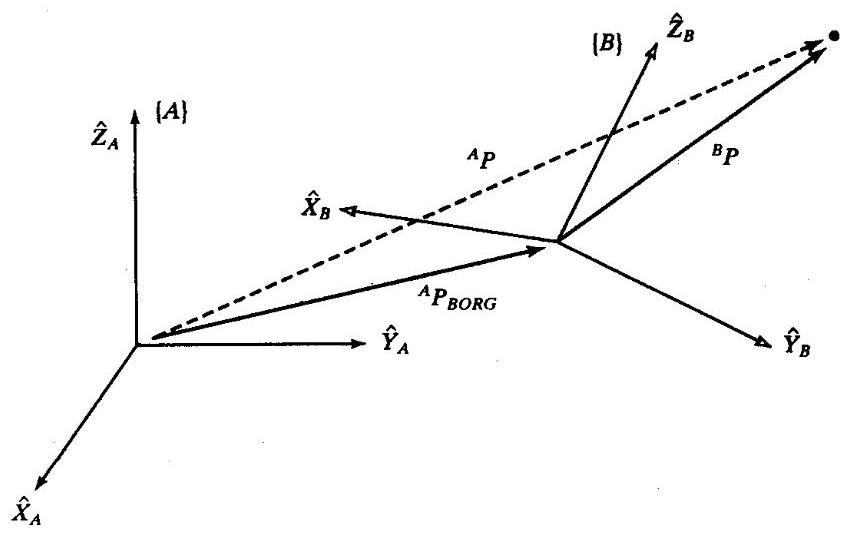

图2-7 在一般情况下的矢量变换

首先将 ${}^{B}P$ 变换到一个中间坐标系,这个坐标系和 $\{ A\}$ 的姿态相同、原点和 $\{ B\}$ 的原点重合。 这可以像上一节中那样由左乘矩阵 ${}_{B}^{A}R$ 得到。然后仍用简单的矢量加法将原点平移，并得到:

$$
{}^{A}P = {}_{B}^{A}{R}^{B}P + {}^{A}{P}_{BORG} \tag{2-17}
$$

式 (2-17) 表示了将一个矢量描述从一个坐标系变换到另一个坐标系矢量的一般变换映射。 注意式 (2-17) 中的符号:消掉了 $B$ 的矢量符号，剩下了所有在 $A$ 中的矢量符号，然后这些量才可以相加。

由式 (2-17) 引出一个新的概念形式:

$$
{}^{A}P = {}_{B}^{A}{T}^{B}P \tag{2-18}
$$

即用一个矩阵形式的算子表示从一个坐标系到另一个坐标系的映射。这比式 (2-17) 表达更简洁, 概念更明确。为了用式 (2-18) 的矩阵算子的形式写出式 (2-17) 的数学表达式, 定义一个 $4 \times  4$ 的矩阵算子并使用了 $4 \times  1$ 位置矢量,这样式 (2-18) 就成为:

$$
\left\lbrack  \begin{matrix} {}^{A}P \\  1 \end{matrix}\right\rbrack   = \left\lbrack  \begin{matrix} {}_{B}^{A}R & {}^{A}{P}_{BORG} \\  0 & 0 \end{matrix}\right\rbrack  \left\lbrack  \begin{matrix} {}^{B}P \\  1 \end{matrix}\right\rbrack \tag{2-19}
$$

换而言之,

1. 在 $4 \times  1$ 矢量中增加的最后一个分量为 “ 1 ”;

2. 在 $4 \times  4$ 矩阵中增加的最后一行为 “ $\left\lbrack  \begin{array}{llll} 0 & 0 & 0 & 1 \end{array}\right\rbrack$ ”。

习惯上把位置矢量当作 $3 \times  1$ 或 $4 \times  1$ 的矢量，这取决于它是与 $3 \times  3$ 还是 $4 \times  4$ 的矩阵相乘。 容易看出式 (2-19) 可写成:

$$
{}^{A}P = {}_{B}^{A}{R}^{B}P + {}^{A}{P}_{BORG} \tag{2-20}
$$

$$
1 = 1
$$

式 (2-19) 中的 $4 \times  4$ 矩阵被称为齐次变换矩阵。它完全可以被看作是用一个简单的矩阵形式表示了一般变换的旋转和位移。在其他研究领域, 它可被用于进行投影和比例运算 (当最后一行不是 “[0001]” 或者旋转矩阵不是正交阵时)。有兴趣的读者可参见[2]。

因为在文中很明显，所以常写成式 (2-18) 的形式，而不用任何符号注明它是齐次变换。 注意, 尽管简洁形式的齐次变换很有用, 但在计算机程序中一般不用它来进行矢量变换, 因为这个变换把时间消耗在 1 、 0 的乘法运算上。因此，这种形式主要是便于公式推导。

正如用旋转矩阵定义姿态一样, 我们将用变换 (常用齐次变换) 来定义一个坐标系。注意,尽管我们已经在映射中引入齐次变换,但它们仍可用于坐标系的描述。坐标系 $\{ B\}$ 相对于坐标系 $\{ A\}$ 的变换描述为 ${}_{B}^{A}T$ 。

例2.2

图2-8表示了一个坐标系 $\{ B\}$ ,它绕坐标系 $\{ A\}$ 的 $\widehat{Z}$ 轴旋转了 30 度,沿 ${\widehat{X}}_{A}$ 平移 10 个单位, 再沿 ${\widehat{Y}}_{A}$ 平移 5 个单位。已知 ${}^{B}P = {\left\lbrack  {3.07}{.00}{.0}\right\rbrack  }^{T}$ ,求 ${}^{A}P$ 。

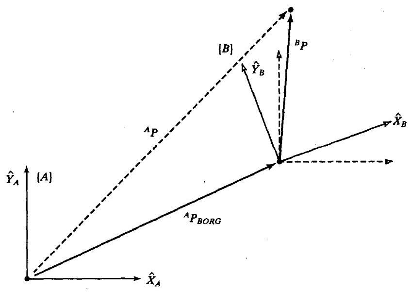

图2-8 经平移和旋转的坐标系 $\{ B\}$

坐标系 $\{ B\}$ 的定义为

$$
{}_{B}^{A}T = \left\lbrack  \begin{matrix} {0.866} &  - {0.500} & {0.000} & {10.0} \\  {0.500} & {0.866} & {0.000} & {5.0} \\  {0.000} & {0.000} & {1.000} & {0.0} \\  0 & 0 & 0 & 1 \end{matrix}\right\rbrack \tag{2-21}
$$

已知

$$
{}^{B}P = \left\lbrack  \begin{array}{l} {3.0} \\  {7.0} \\  {0.0} \end{array}\right\rbrack \tag{2-22}
$$

按照 $\{ B\}$ 的定义和已知条件进行变换:

$$
{}^{A}P = {}_{B}^{A}{T}^{B}P = \left\lbrack  \begin{array}{r} {9.098} \\  {12.562} \\  {0.000} \end{array}\right\rbrack \tag{2-23}
$$

## 2.4 算子:平移、旋转和变换

用于坐标系间点的映射的通用数学表达式称为算子, 包括点的平移算子、矢量旋转算子和平移加旋转的算子。本节对已给出的数学描述进行说明。

**平移算子**

平移将空间中的一个点沿着一个已知的矢量方向移动一定距离。对空间一点实际平移的描述仅与一个坐标系有关。空间中点的平移与此点向另一个坐标系的映射具有相同的数学描述, 因此弄清楚映射的数学意义是非常重要的。这个区别很简单: 当一个矢量相对于一个坐标系 “向前移动” 时, 既可以认为是矢量 “向前移动”, 也可以认为坐标系 “向后移动”, 二者的数学表达式是相同的,只不过是观察位置不同。图2-9表示矢量 ${}^{A}{P}_{1}$ 怎样通过矢量 ${}^{A}Q$ 进行平移。这里,矢量 ${}^{A}Q$ 给出了进行平移的信息。

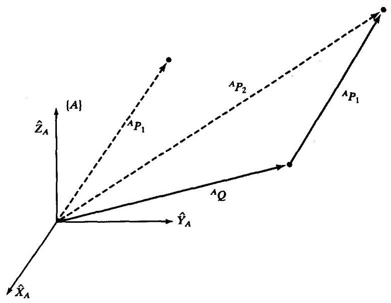

图2-9 平移算子

运算的结果是得到一个新的矢量 ${}^{A}{P}_{2}$ ,计算如下:

$$
{}^{A}{P}_{2} = {}^{A}{P}_{1} + {}^{A}Q \tag{2-24}
$$

用矩阵算子写出平移变换, 有:

$$
{}^{A}{P}_{2} = {D}_{Q}{\left( q\right) }^{A}{P}_{1} \tag{2-25}
$$

式中， $q$ 是沿矢量 $\widehat{Q}$ 方向平移的数量，它是有符号的。算子 ${D}_{Q}$ 可被看成是一个特殊形式的齐次变换:

$$
{D}_{Q}\left( q\right)  = \left\lbrack  \begin{matrix} 1 & 0 & 0 & {q}_{x} \\  0 & 1 & 0 & {q}_{y} \\  0 & 0 & 1 & {q}_{z} \\  0 & 0 & 0 & 1 \end{matrix}\right\rbrack \tag{2-26}
$$

式中 ${q}_{x}$ 、 ${q}_{y}$ 和 ${q}_{z}$ 是平移矢量 $Q$ 的分量，并且 $q = \sqrt{{q}_{x}^{2} + {q}_{y}^{2} + {q}_{z}^{2}}$ 。式 (2-9) 和式 (2-24) 的数学表达式相同。注意,如果在图2-4已定义了 ${}^{B}{P}_{AORG}$ (而不是 ${}^{A}{P}_{AORG}$ ) 并应用在式 (2-9) 中, 那么在式 (2-9) 和式 (2-24) 之间就会有符号的变化。此符号的变化说明了是矢量 “向前” 移动还是坐标系 “向后” 移动。通过定义 $\{ B\}$ 相对于 $\{ A\}$ 的位置 (用 ${}^{A}{P}_{BORG}$ ),使得这两个描述具有相同的数学表达式。现在已引入了符号 ${D}_{\varrho }$ ,我们就可以用它来描述坐标系和映射。

**旋转算子**

旋转矩阵还可以用旋转变换算子来定义,它将一个矢量 ${}^{A}{P}_{1}$ 用旋转 $R$ 变换成一个新的矢量 ${}^{A}{P}_{2}$ 。通常,当一个旋转矩阵作为算子时,就无需写出下标或上标,因为它不涉及两个坐标系。因此可写成:

$$
{}^{A}{P}_{2} = {R}^{A}{P}_{1} \tag{2-27}
$$

同平移的情况一样, 式 (2-13) 和式 (2-27) 的数学表达形式相同, 只是意义不同。为此我们能够知道如何得出作为算子的旋转矩阵:

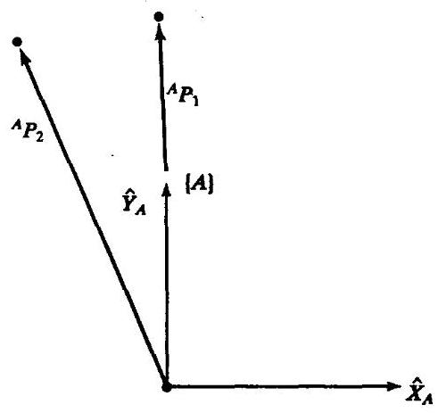

图2-10 矢量 ${}^{A}{P}_{1}$ 绕 $\widehat{Z}$ 轴旋转 30 度

矢量经某一旋转 $R$ 得到的旋转矩阵与一个坐标系相对于参考坐标系经某一旋转 $R$ 得到的旋转矩阵是相同的。

尽管将旋转矩阵看作为一个算子是很简单的, 但是我们将用另一个符号定义旋转算子以明确地说明是绕哪个轴旋转的:

$$
{}^{A}{P}_{2} = {R}_{K}{\left( \theta \right) }^{A}{P}_{1} \tag{2-28}
$$

符号 “ ${R}_{K}\left( \theta \right)$ ” 是一个旋转算子,它表示绕 $\widehat{K}$ 轴旋转 $\theta$ 角度。可将这个算子写成齐次变换矩阵, 其中位置矢量的分量为零。例如,代入到式 (2-11) 可得到绕 $\widehat{z}$ 轴旋转 $\theta$ 的算子:

$$
{R}_{z}\left( \Theta \right)  = \left\lbrack  \begin{array}{rrrr} \cos \theta &  - \sin \theta & 0 & 0 \\  \sin \theta & \cos \theta & 0 & 0 \\  0 & 0 & 1 & 0 \\  0 & 0 & 0 & 1 \end{array}\right\rbrack \tag{2-29}
$$

当然,位置矢量也可以用 $3 \times  3$ 旋转矩阵的齐次变换子阵进行旋转。因此符号 “ ${R}_{k}$ ” 可看作是 $3 \times  3$ 或 $4 \times  4$ 矩阵。在本章后面,我们将看到如何写出一个绕广义轴 $\widehat{K}$ 旋转的旋转矩阵。

例2.3

图2-10给出一个矢量 ${}^{A}{P}_{1}$ 。计算绕 $\widehat{Z}$ 轴旋转 30 度得到的新矢量 ${}^{A}{P}_{2}$ 。

将矢量绕 $\widehat{Z}$ 轴旋转 30 度得到的旋转矩阵与一个坐标系相对于参考坐标系绕 $\widehat{Z}$ 轴旋转 30 度得到的旋转矩阵是相同的。因此, 正确的旋转算子是

$$
{R}_{z}\left( {30.0}\right)  = \left\lbrack  \begin{array}{rrr} {0.866} &  - {0.500} & {0.000} \\  {0.500} & {0.866} & {0.000} \\  {0.000} & {0.000} & {1.000} \end{array}\right\rbrack \tag{2-30}
$$

已知

$$
{}^{A}{P}_{1} = \left\lbrack  \begin{array}{l} {0.0} \\  {2.0} \\  {0.0} \end{array}\right\rbrack \tag{2-31}
$$

求得 ${}^{A}{P}_{2}$ 为

$$
{}^{A}{P}_{2} = {R}_{z}{\left( {30.0}\right) }^{A}{P}_{1} = \left\lbrack  \begin{array}{r}  - {1.000} \\  {1.732} \\  {0.000} \end{array}\right\rbrack \tag{2-32}
$$

式 (2-13) 和式 (2-27) 使用了相同的数学表达式。注意,如果在式 (2-13) 已定义了 ${}_{A}^{B}R$ (而不是 ${}_{B}^{A}R$ )，那么 $R$ 的逆可由式 (2-27) 得到。这个变化说明了矢量“向前”旋转还是坐标系“向后” 旋转之间的差别。通过定义 $\{ B\}$ 相对于 $\{ A\}$ 的位置(用 ${}_{B}^{A}R$ )，使得两个变换的数学意义是相同的。

**变换算子**

与矢量和旋转矩阵一样, 坐标系还可以用变换算子来定义。在这个定义中, 只涉及到一个坐标系,所以符号 $T$ 没有上下标。算子 $T$ 将一个矢量 ${}^{A}{P}_{1}$ 平移并旋转得到一个新的矢量:

$$
{}^{A}{P}_{2} = {T}^{A}{P}_{1} \tag{2-33}
$$

和旋转的情况一样, 式 (2-18) 和式 (2-33) 的数学描述是相同的, 只是意义不同。为此我们能够知道如何得到作为算子的齐次变换矩阵:

经旋转 $R$ 和平移 $Q$ 的齐次变换矩阵与一个坐标系相对于参考坐标系经旋转 $R$ 和平移 $Q$ 的齐次变换矩阵是相同的。

一个变换通常被认为是由一个广义旋转矩阵和位置矢量分量组成的齐次变换的形式。

例2.4

图2-11给出一个矢量 ${}^{A}{P}_{1}$ 。将其绕 $\widehat{Z}$ 旋转 30 度并沿 ${\widehat{X}}_{A}$ 平移 10 个单位，沿 ${\widehat{Y}}_{A}$ 平移 5 个单位。 已知 ${}^{A}{P}_{1} = {\left\lbrack  \begin{array}{lll} {3.0} & {7.0} & {0.0} \end{array}\right\rbrack  }^{T}$ ,求 ${}^{A}{P}_{2}$ 。

进行平移和旋转的算子 $T$ 为:

$$
T = \left\lbrack  \begin{matrix} {0.866} &  - {0.500} & {0.000} & {10.0} \\  {0.500} & {0.866} & {0.000} & {5.0} \\  {0.000} & {0.000} & {1.000} & {0.0} \\  0 & 0 & 0 & 1 \end{matrix}\right\rbrack \tag{2-34}
$$

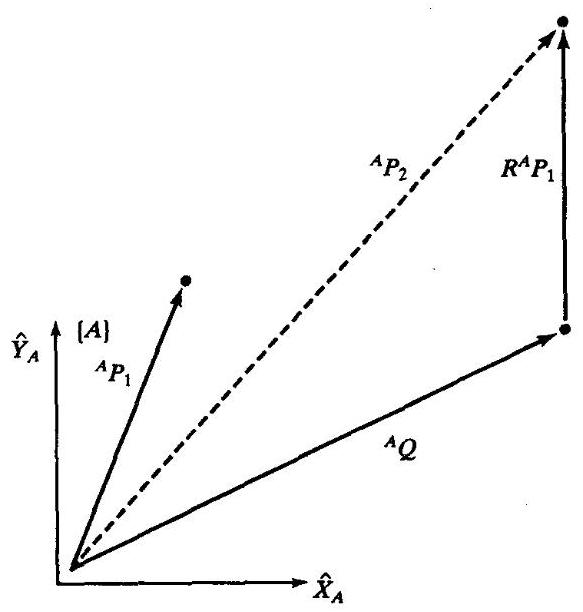

图2-11 矢量 ${}^{A}P$ 段旋转和平移得到 ${}^{A}{P}_{2}$

已知

$$
{}^{A}{P}_{1} = \left\lbrack  \begin{array}{l} {3.0} \\  {7.0} \\  {0.0} \end{array}\right\rbrack \tag{2-35}
$$

将 $T$ 看作算子:

$$
{}^{A}{P}_{2} = {T}^{A}{P}_{1} = \left\lbrack  \begin{array}{r} {9.098} \\  {12.562} \\  {0.000} \end{array}\right\rbrack \tag{2-36}
$$

注意此例的结果在数值上与例2.2相同, 但意义不同。

## 2.5 总结和说明

我们首先介绍了平移的概念, 然后介绍了旋转的概念, 最后介绍了旋转和平移的一般情况。在理解了旋转和平移这种一般情况后, 就无需将这两种简单情况分开了, 因为它们已被包括在一个一般体系中了。

介绍了一个包括姿态和位置信息的 $4 \times  4$ 齐次变换矩阵,作为表示坐标系的一般工具。

我们给出了齐次变换阵的三个定义:

1. 它是坐标系的描述。 ${}_{B}^{A}T$ 表示相对于坐标系 $\{ A\}$ 的坐标系 $\{ B\}$ 。特别是, ${}_{B}^{A}R$ 的各列是坐标系 $\{ B\}$ 主轴方向上的单位矢量， ${}^{A}{P}_{BORG}$ 确定了 $\{ B\}$ 的原点。

**2. 它是变换映射。 ${}_{B}^{A}T$ 是映射 ${}^{B}P \rightarrow  {}^{A}P$ 。**

3. 它是变换算子。 $T$ 将 ${}^{A}{P}_{1}$ 变换为 ${}^{A}{P}_{2}$ 。

由此可见, 坐标系和变换都可用位置矢量加上姿态来描述。一般来说坐标系主要是用于描述, 而变换常用来表示映射或算子。变换是平移和旋转的组合 (和蕴含); 但有时在纯旋转 (或纯平移) 情况下也常用变换这个术语。

## 2.6 变换算法

本节介绍变换的乘法和变换的逆运算。这两个基本运算组成了一套功能完备的变换算子。

**混合变换**

在图2-12中,已知 ${}^{C}P$ ,求 ${}^{A}P$ 。

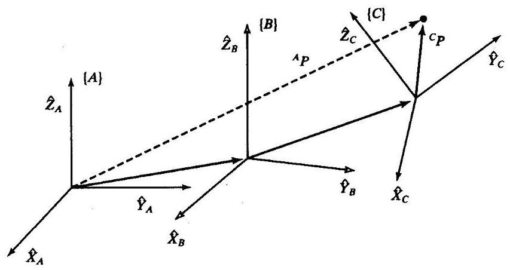

图2-12 混合坐标系: 每个坐标系相对于前一个坐标系是已知的

已知坐标系 $\{ C\}$ 相对于坐标系 $\{ B\}$ ,并且已知坐标系 $\{ B\}$ 相对于坐标系 $\{ A\}$ 。将 ${}^{C}P$ 变换成 ${}^{B}P$ :

$$
{}^{B}P = {}_{C}^{B}{T}^{C}P \tag{2-37}
$$

然后将 ${}^{B}P$ 变换成 ${}^{A}P$

$$
{}^{A}P = {}_{B}^{A}{T}^{B}P \tag{2-38}
$$

联立式 (2-37) 和式 (2-38), 得到 (确定解)

$$
{}^{A}P = {}_{B}^{A}{T}_{C}^{B}{T}^{C}P \tag{2-39}
$$

由此定义

$$
{}_{C}^{A}T = {}_{B}^{A}T{}_{C}^{B}T \tag{2-40}
$$

注意,熟练使用上下标可使运算简化。由于已知 $\{ B\}$ 和 $\{ C\}$ 的描述,因此可求得 ${}_{c}^{A}T$ 为

$$
{}_{C}^{A}T = \left\lbrack  \begin{array}{ll} {}_{B}^{A}{R}_{C}^{B}R & {}_{B}^{A}{R}^{B}{P}_{CORG} + {}^{A}{P}_{BORG} \\  0 & 0 \end{array}\right\rbrack \tag{2-41}
$$

**逆变换**

已知坐标系 $\{ B\}$ 相对于坐标系 $\{ A\}$ ——即 ${}_{B}^{A}T$ 的值已知。有时为了得到 $\{ A\}$ 相对于 $\{ B\}$ 的描述， 即 ${}_{A}^{B}T$ ,需要求这个矩阵的逆。一个直接求逆的办法是将 $4 \times  4$ 齐次变换求逆。但是,这样做就不能充分利用变换的性质。容易看出一个比较简单的方法是利用变换的性质求逆。

为了求 ${}_{A}^{B}T$ ,必须由 ${}_{B}^{A}R$ 和 ${}^{A}{P}_{BORG}$ 求出 ${}_{A}^{B}R$ 和 ${}^{B}{P}_{AORG}$ 。首先,回顾一下关于旋转矩阵的讨论:

$$
{}_{A}^{B}R = {}_{B}^{A}{R}^{T} \tag{2-42}
$$

其次利用式 (2-13) 将 ${}^{A}{P}_{BORG}$ 转变成在 $\{ B\}$ 中的描述:

$$
{}^{B}\left( {{}^{A}{P}_{BORG}}\right)  = {}_{A}^{B}{R}^{A}{P}_{BORG} + {}^{B}{P}_{AORG} \tag{2-43}
$$

式 (2-43) 的左边应为零, 由此可得:

$$
{}^{B}{P}_{AORG} =  - {}_{A}^{B}{R}^{A}{P}_{BORG} =  - {}_{B}^{A}{R}^{TA}{P}_{BORG} \tag{2-44}
$$

由式 (2-42) 和式 (2-44),可写出 ${}_{A}^{B}T$ :

$$
{}_{A}^{B}T = \left\lbrack  \begin{matrix} {}_{B}^{A}{R}^{T} &  - {}_{B}^{A}{R}^{TA}{P}_{BORG} \\  0 & 0 \end{matrix}\right\rbrack \tag{2-45}
$$

注意, 使用符号:

$$
{}_{A}^{B}T = {}_{B}^{A}{T}^{-1}
$$

式 (2-45) 是求齐次逆变换的一般且非常有用的方法。

例2.5

图2-13表示坐标系 $\{ B\}$ 绕坐标系 $\{ A\}$ 的 $\widehat{Z}$ 轴旋转 30 度,沿 ${\widehat{X}}_{A}$ 平移 4 个单位,沿 ${\widehat{Y}}_{A}$ 平移 3 个单位,于是得到 ${}_{B}^{A}T$ ,求 ${}_{A}^{B}T$ 。

定义坐标系 $\{ B\}$ :

$$
{}_{B}^{A}T = \left\lbrack  \begin{matrix} {0.866} &  - {0.500} & {0.000} & {4.0} \\  {0.500} & {0.866} & {0.000} & {3.0} \\  {0.000} & {0.000} & {1.000} & {0.0} \\  0 & 0 & 0 & 1 \end{matrix}\right\rbrack \tag{2-46}
$$

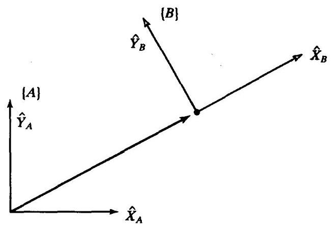

图2-13 相对于坐标系 $\{ A\}$ 的坐标系 $\{ B\}$

应用式 (2-45), 得到

$$
{}_{A}^{B}T = \left\lbrack  \begin{matrix} {0.866} & {0.500} & {0.000} &  - {4.964} \\   - {0.500} & {0.866} & {0.000} &  - {0.598} \\  {0.000} & {0.000} & {1.000} & {0.0} \\  0 & 0 & 0 & 1 \end{matrix}\right\rbrack \tag{2-47}
$$

## 2.7 变换方程

图2-14表示坐标系 $\{ D\}$ 可以用两种不同的方式表达成变换相乘的形式。第一个,

$$
{}_{D}^{U}T = {}_{A}^{U}{T}_{D}^{A}T \tag{2-48}
$$

第二个:

$$
{}_{D}^{U}T = {}_{B}^{U}{T}_{C}^{B}{T}_{D}^{C}T \tag{2-49}
$$

将两个表达式构造成一个变换方程

$$
{}_{A}^{U}{T}_{D}^{A}T = {}_{B}^{U}{T}_{C}^{B}{T}_{D}^{C}T \tag{2-50}
$$

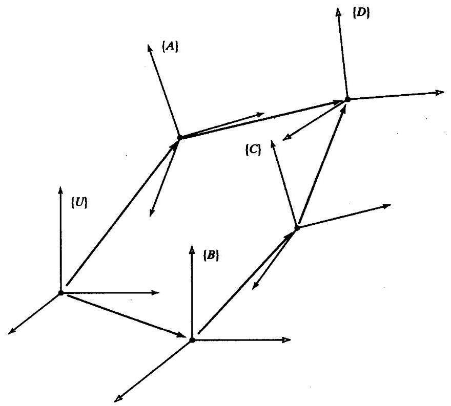

图2-14 形成一个闭环的变换序列

如有 $n$ 个未知变换和 $n$ 个变换方程,这个变换可由变换方程解出。设式 (2-50) 中的所有变换除了 ${}_{c}^{B}T$ 外均已知。这里,有一个变换方程和一个未知变换,很容易解出:

$$
{}_{C}^{B}T = {}_{B}^{U}{T}^{-1}{}_{A}^{U}{T}_{D}^{A}{T}_{D}^{C}{T}^{-1} \tag{2-51}
$$

图2-15对这种情况作了说明。

注意, 在所有的图中, 我们均采用了坐标系的图形表示法, 即用一个坐标系的原点指向另一个坐标系的原点的箭头来表示。箭头的方向指明了坐标系定义的方式:在图2-14中，相对于 $\{ A\}$ 定义坐标系 $\{ D\}$ ; 在图 2-15 中相对于 $\{ D\}$ 定义坐标系 $\{ A\}$ 。将箭头串连起来,通过简单的变换相乘就可得到混合坐标系。如果有一个箭头的方向与串连的方向相反, 就先求出它的逆。在图2-15中, $\{ C\}$ 的两个可能的描述为:

$$
{}_{C}^{U}T = {}_{A}^{U}{T}_{A}^{D}{T}^{-1}{}_{C}^{D}T \tag{2-52}
$$

和

$$
{}_{C}^{U}T = {}_{B}^{U}{T}_{C}^{B}T \tag{2-53}
$$

还可用式 (2-52) 和式 (2-53) 解出 ${}_{A}^{U}T$

$$
{}_{A}^{U}T = {}_{B}^{U}T{}_{C}^{B}T{}_{C}^{D}T{}^{-1}{}_{A}^{D}T \tag{2-54}
$$

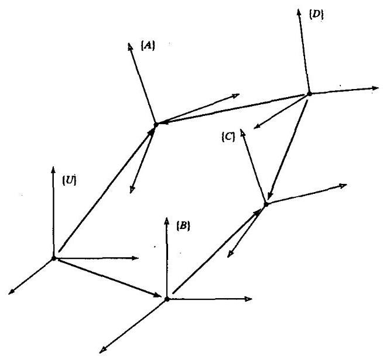

图2-15 变换方程的示例

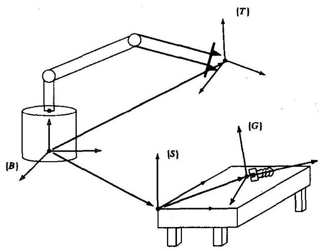

图2-16 接近一个螺栓的操作臂

例2.6

假定已知图2-16中变换 ${}_{T}^{B}T$ 描述了操作臂指端的坐标系 $\{ T\}$ ,它是相对于操作臂基座的坐标系 $\{ B\}$ 的,又已知工作台相对于操作臂基座的空间位置 (因为已知与工作台相连的坐标系 $\{ S\}$ 是 $\left. {{}_{S}^{B}T}\right)$ ,并且已知工作台上螺栓的坐标系相对于工作台坐标系的位置,即 ${}_{G}^{S}T$ 。计算螺栓相对操作手的位姿， ${}_{G}^{T}T$ 。

由公式推导(按照要求和我们的理解)得到相对于操作手坐标系的螺栓坐标系为:

$$
{}_{G}^{T}T = {}_{T}^{B}{T}^{-1}{}_{S}^{B}{T}_{G}^{S}T \tag{2-55}
$$

## 2.8 姿态的其他描述方法

至此,只给出了 $3 \times  3$ 旋转矩阵来表示姿态。如上所述,旋转矩阵是一种特殊的各列相互正交的单位阵。进一步我们知道旋转矩阵的行列式恒为 +1 。旋转矩阵也可被称为标准正交矩阵,“标准”是指其行列式的值为+1 (非标准正交矩阵的行列式值为 -1 )。

很自然地要问, 能否用少于九个数字来表示一个姿态。线性代数的结论 (已知正交矩阵的凯莱公式 ${}^{\left\lbrack  3\right\rbrack  }$ ) 告诉我们,对于任何正交阵 $R$ ,存在一个反对称矩阵 $S$ ,满足

$$
R = {\left( {I}_{3} - S\right) }^{-1}\left( {{I}_{3} + S}\right) \tag{2-56}
$$

式中 ${I}_{3}$ 是一个 $3 \times  3$ 单位阵。一个3维反对称阵(即 $S =  - {S}^{T}$ )可由三个参数 $\left( {{s}_{x},{s}_{y},{s}_{z}}\right)$ 表示为

$$
S = \left\lbrack  \begin{matrix} 0 &  - {s}_{x} & {s}_{y} \\  {s}_{x} & 0 &  - {s}_{x} \\   - {s}_{y} & {s}_{x} & 0 \end{matrix}\right\rbrack \tag{2-57}
$$

因此,从式 (2-56) 可直接得出结论,任何 $3 \times  3$ 旋转阵可用三个参量确定。

显然,旋转矩阵的九个分量线性相关。实际上,对于一个旋转矩阵 $R$ 很容易写出六个线性无关的分量。如上所述,假定 $R$ 为三列:

$$
R = \left\lbrack  \begin{array}{lll} \widehat{X} & \widehat{Y} & \widehat{Z} \end{array}\right\rbrack \tag{2-58}
$$

由 2.2 节可知, 这三个矢量是参考坐标系中某坐标系的单位轴。每个矢量都是单位矢量, 且相互垂直, 所以9个矩阵元素有6个约束:

$$
\left| \widehat{X}\right|  = 1
$$

$$
\left| \widehat{Y}\right|  = 1
$$

$$
\left| \widehat{Z}\right|  = 1
$$

$$
\widehat{X} \cdot  \widehat{Y} = 0 \tag{2-59}
$$

$$
\widehat{X} \cdot  \widehat{Z} = 0
$$

$$
\widehat{Y} \cdot  \widehat{Z} = 0
$$

自然要问是否能找到这样一种姿态表示法, 用三个参量就能简便地进行表达。本节将给出几个姿态表示法。

沿着三个相互垂直的轴的平移运动比较直观, 而旋转似乎不太直观。然而, 人们长期难以在3维空间描述和定义姿态。主要困难是旋转一般不是互逆的，即 ${}_{B}^{A}{R}_{C}^{B}R$ 与 ${}_{C}^{B}{R}_{B}^{A}R$ 不同。

例2.7

考虑两个旋转,一个绕轴 $\widehat{Z}$ 转 30 度,而另一个绕 $\widehat{X}$ 轴转 30 度:

$$
{R}_{z}\left( {30}\right)  = \left\lbrack  \begin{array}{rrr} {0.866} &  - {0.500} & {0.000} \\  {0.500} & {0.866} & {0.000} \\  {0.000} & {0.000} & {1.000} \end{array}\right\rbrack \tag{2-60}
$$

$$
{R}_{x}\left( {30}\right)  = \left\lbrack  \begin{array}{rrr} {1.000} & {0.000} & {0.000} \\  {0.000} & {0.866} &  - {0.500} \\  {0.000} & {0.500} & {0.866} \end{array}\right\rbrack \tag{2-61}
$$

$$
{R}_{z}\left( {30}\right) {R}_{x}\left( {30}\right)  = \left\lbrack  \begin{array}{rrr} {0.87} &  - {0.43} & {0.25} \\  {0.50} & {0.75} &  - {0.43} \\  {0.00} & {0.50} & {0.87} \end{array}\right\rbrack
$$

$$
\neq  {R}_{x}\left( {30}\right) {R}_{z}\left( {30}\right)  = \left\lbrack  \begin{array}{rrr} {0.87} &  - {0.50} & {0.00} \\  {0.43} & {0.75} &  - {0.50} \\  {0.25} & {0.43} & {0.87} \end{array}\right\rbrack \tag{2-62}
$$

毋庸置疑旋转的顺序是重要的, 进一步说, 正是因为矩阵相乘一般不满足交换律, 所以用矩阵来表示旋转需要特别引起注意。

因为旋转既可被看作算子又可被看作是对姿态的描述, 因此毋庸置疑对于不同的用途就有不同的表示法。旋转矩阵可作为算子, 当乘以矢量时, 旋转矩阵就起到旋转运算的作用。 但是, 用旋转矩阵来确定姿态有些不便。一个计算机终端操作员在输入一个机械手的期望姿态时, 需要烦琐地输入一个九个元素的正交矩阵。而一种只需三个数的表示法就显得简便些。 下节将介绍这些表示法。

**X-Y-Z固定角坐标系**

下面介绍描述坐标系 $\{ B\}$ 姿态的一种方法:

首先将坐标系 $\{ B\}$ 和一个已知参考坐标系 $\{ A\}$ 重合。先将 $\{ B\}$ 绕 ${\widehat{X}}_{A}$ 旋转 $\gamma$ 角,再绕 ${\widehat{Y}}_{A}$ 旋转 $\beta$ 角,最后绕 ${\widehat{Z}}_{A}$ 旋转 $\alpha$ 角。

每个旋转都是绕着固定参考坐标系 $\{ A\}$ 的轴。我们规定这种姿态的表示法为X-Y-Z固定角坐标系。“固定”一词是指旋转是在固定(即不运动的)参考坐标系(图2-17)中确定的。有时把它们定义为回转角、俯仰角和偏转角。但是使用中应注意, 因为这个定义经常与其他定义不同的问题相关。

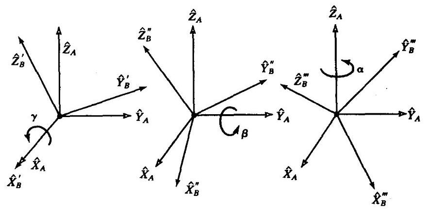

图2-17 X-Y-Z固定角坐标系,按照 ${R}_{x}\left( \gamma \right) ,{R}_{y}\left( \beta \right) ,{R}_{z}\left( \alpha \right)$ 的顺序进行旋转

可直接推导等价旋转矩阵 ${}_{B}^{A}{R}_{XYZ}\left( {\gamma ,\beta ,\alpha }\right)$ ,因为所有的旋转都是绕着参考坐标系各轴的; 即

$$
{}_{B}^{A}{R}_{XYZ}\left( {\gamma ,\beta ,\alpha }\right)  = {R}_{Z}\left( \alpha \right) {R}_{Y}\left( \beta \right) {R}_{X}\left( \gamma \right)
$$

$$
= \left\lbrack  \begin{array}{rrr} {c\alpha } &  - {s\alpha } & 0 \\  {s\alpha } & {c\alpha } & 0 \\  0 & 0 & 1 \end{array}\right\rbrack  \left\lbrack  \begin{array}{rrr} {c\beta } & 0 & {s\beta } \\  0 & 1 & 0 \\   - {s\beta } & 0 & {c\beta } \end{array}\right\rbrack  \left\lbrack  \begin{array}{rrr} 1 & 0 & 0 \\  0 & {c\gamma } &  - {s\gamma } \\  0 & {s\gamma } & {c\gamma } \end{array}\right\rbrack \tag{2-63}
$$

式中 ${c\alpha }$ 是 $\cos \alpha$ 的简写， ${s\alpha }$ 是 $\sin \alpha$ 的简写等等。最重要的是要搞清楚式 (2-63) 中的旋转顺序。 将旋转看作算子依次进行旋转 (从右开始),先进行旋转 ${R}_{X}\left( \gamma \right)$ ,再作旋转 ${R}_{Y}\left( \beta \right)$ ,最后作旋转 ${R}_{z}\left( \alpha \right)$ 。由式 (2-63) 的乘积得:

$$
{}_{B}^{A}{R}_{XYZ}\left( {\gamma ,\beta ,\alpha }\right)  = \left\lbrack  \begin{matrix} {c\alpha c\beta } & {c\alpha s\beta s\gamma } - {s\alpha c\gamma } & {c\alpha s\beta c\gamma } + {s\alpha s\gamma } \\  {s\alpha c\beta } & {s\alpha s\beta s\gamma } + {c\alpha c\gamma } & {s\alpha s\beta c\gamma } - {c\alpha s\gamma } \\   - {s\beta } & {c\beta s\gamma } & {c\beta c\gamma } \end{matrix}\right\rbrack \tag{2-64}
$$

要记住这里给定的三个旋转顺序, 仅当旋转是按照这个顺序进行时方程 (2-64) 才是正确的, 即绕 ${\widehat{X}}_{A}$ 旋转 $\gamma$ ,绕 ${\widehat{Y}}_{A}$ 旋转 $\beta$ ,绕 ${\widehat{Z}}_{A}$ 旋转 $\alpha$ 。

常使人感兴趣的是逆解问题，即从一个旋转矩阵等价推出 $X - Y - Z$ 固定角坐标系。逆解取决于求解一组超越方程: 如果方程 (2-64) 相当于一个已知的旋转矩阵, 那么就有九个方程和三个未知量。在这九个方程中有六个方程是相关的。因此实际上只有三个方程和三个未知量。 令

$$
{}_{B}^{A}{R}_{XYZ}\left( {\gamma ,\beta ,\alpha }\right)  = \left\lbrack  \begin{array}{lll} {r}_{11} & {r}_{12} & {r}_{13} \\  {r}_{21} & {r}_{22} & {r}_{23} \\  {r}_{31} & {r}_{32} & {r}_{33} \end{array}\right\rbrack \tag{2-65}
$$

由方程 (2-64),通过计算 ${r}_{11}$ 和 ${r}_{21}$ 的平方和的平方根,可求得 $\cos \beta$ 。然后用 $- {r}_{31}$ 除以 $\cos \beta$ 再求其反正切可求得 $\beta$ 。那么,只要 ${c\beta } \neq  0$ ,就可以用 ${r}_{21}/{c\beta }$ 除以 ${r}_{11}/{c\beta }$ 得到 $\alpha$ 角,用 ${r}_{32}/{c\beta }$ 除以 ${r}_{33}/{c\beta }$ 得到 $\gamma$ 角。

即

$$
\beta  = \mathrm{A}\tan 2\left( {-{r}_{31},\sqrt{{r}_{11}^{2} + {r}_{21}^{2}}}\right)
$$

$$
\alpha  = \mathrm{A}\tan 2\left( {{r}_{21}/{c\beta },{r}_{11}/{c\beta }}\right) \tag{2-66}
$$

$$
\gamma  = \mathrm{A}\tan 2\left( {{r}_{32}/{c\beta },{r}_{33}/{c\beta }}\right)
$$

式中Atan2 $\left( {y, x}\right)$ 是一个双参变量的反正切函数 ${}^{ \ominus  }$ 。

虽然存在第二个解,但在上式中取 $\beta$ 的正根以得到单解,满足 $- {90}^{ \circ  } < \beta  < {90}^{ \circ  }$ 。这样就可以在各种姿态表示法之间定义一一对应的映射函数。但是在某些情况下, 有必要求出所有的解 (详见第4章)。如果 $\beta  =  \pm  {90.0}^{ \circ  }$ (即 ${c\beta } = 0$ ),式 (2-67) 的解就退化了。在这种情况下,仅能求出 $\alpha$ 和 $\gamma$ 的和或差。在这种情况下一般取 $\alpha  = {0.0}$ ,结果如下。

如 $\beta  = {90.0}^{ \circ  }$ ,解得:

$$
\beta  = {90.0}^{ \circ  }
$$

$$
\alpha  = {0.0} \tag{2-67}
$$

$$
\gamma  = \mathrm{A}\tan 2\left( {{r}_{12},{r}_{22}}\right)
$$

如果 $\beta  =  - {90.0}^{ \circ  }$ ,解得:

$$
\beta  =  - {90.0}^{ \circ  }
$$

$$
\alpha  = {0.0} \tag{2-68}
$$

$$
\gamma  =  - \mathrm{A}\tan 2\left( {{r}_{12},{r}_{22}}\right)
$$

---

$\Theta$ Atan $2\left( {y, x}\right)$ 计算 ${\tan }^{-1}\left( \frac{y}{x}\right)$ 时，可根据x和y的符号可判别求得的角所在的象限。例如，Atan2 $\left( {-{2.0}, - {2.0}}\right)  =  - {135}^{ \circ  }$ , 而Atan $2\left( {{2.0},{2.0}}\right)  = {45}^{ \circ  }$ ,一个反正切函数的解可能被丢失。我们经常在 ${360}^{ \circ  }$ 的范围内计算角度,因此一般应用Atan2函数。注意, 当两个解都是0时, Atan2成为不定的。有时称它为 “4象限反正切”, 一些编程语言库中对其作了预定义。

---

**Z-Y-X欧拉角**

坐标系 $\{ B\}$ 的另一种表示法如下:

首先将坐标系 $\{ B\}$ 和一个已知参考坐标系 $\{ A\}$ 重合。先将 $\{ B\}$ 绕 ${\widehat{Z}}_{B}$ 旋转 $\alpha$ 角,再绕 ${\widehat{Y}}_{B}$ 旋转 $\beta$ 角,最后绕 ${\widehat{X}}_{B}$ 旋转 $\gamma$ 角。

在这种表示法中,每次都是绕运动坐标系 $\{ B\}$ 的各轴旋转而不是绕固定坐标系 $\{ A\}$ 的各轴旋转。

这样三个一组的旋转被称作欧拉角。注意每次旋转所绕的轴的方位取决于上次的旋转。 由于三个旋转分别是绕着 $\widehat{Z},\widehat{Y}$ 和 $\widehat{X}$ ,所以称这种表示法为Z-Y-X欧拉角。

图2-18表示每次进行欧拉角变换后坐标系 $\{ B\}$ 的轴。绕 $\widehat{Z}$ 轴旋转 $\alpha$ 角使 $\widehat{X}$ 旋转到 ${\widehat{X}}^{\prime }$ ， $\widehat{Y}$ 旋转到 ${\widehat{Y}}^{\prime }$ 等等。每次旋转得到的轴被附加一个 “撇号”。由Z-Y-X欧拉角参数化的旋转矩阵用 ${}_{B}^{A}{R}_{{Z}^{\prime }{Y}^{\prime }{X}^{\prime }}\left( {\alpha ,\beta ,\gamma }\right)$ 表示。注意下标上附加 “撇号” 表明这是用欧拉角描述的旋转。

参见图2-18,用中间坐标系 $\left\{  {B}^{\prime }\right\}$ 和 $\left\{  {B}^{\prime \prime }\right\}$ 来表达 ${}_{B}^{A}{R}_{{Z}^{\prime }{Y}^{\prime }{X}^{\prime }}\left( {\alpha ,\beta ,\gamma }\right)$ 。如果把这些旋转看成是坐标系的描述, 就可立即写出:

$$
{}_{B}^{A}R = {}_{{B}^{\prime }}^{A}{R}_{{B}^{\prime \prime }}^{{B}^{\prime }}{R}^{{B}^{\prime \prime }}R \tag{2-69}
$$

式 (2-69) 右边的每个旋转描述都是按照Z-Y-X欧拉角的定义给出的。即 $\{ B\}$ 相对于 $\{ A\}$ 的最终姿态为:

$$
{}_{B}^{A}{R}_{{Z}^{\prime }{Y}^{\prime }{X}^{\prime }} = {R}_{Z}\left( \alpha \right) {R}_{Y}\left( \beta \right) {R}_{X}\left( \gamma \right)
$$

$$
= \left\lbrack  \begin{array}{rrr} {c\alpha } &  - {s\alpha } & 0 \\  {s\alpha } & {c\alpha } & 0 \\  0 & 0 & 1 \end{array}\right\rbrack  \left\lbrack  \begin{array}{rrr} {c\beta } & 0 & {s\beta } \\  0 & 1 & 0 \\   - {s\beta } & 0 & {c\beta } \end{array}\right\rbrack  \left\lbrack  \begin{array}{rrr} 1 & 0 & 0 \\  0 & {c\gamma } &  - {s\gamma } \\  0 & {s\gamma } & {c\gamma } \end{array}\right\rbrack \tag{2-70}
$$

式中 ${c\alpha } = \cos \alpha ,{s\alpha } = \sin \alpha$ 等等。相乘后,得

$$
{}_{B}^{A}{R}_{{Z}^{\prime }{Y}^{\prime }{X}^{\prime }}\left( {\alpha ,\beta ,\gamma }\right)  = \left\lbrack  \begin{matrix} {c\alpha c\beta } & {c\alpha s\beta s\gamma } - {s\alpha c\gamma } & {c\alpha s\beta c\gamma } + {s\alpha s\gamma } \\  {s\alpha c\beta } & {s\alpha s\beta s\gamma } + {c\alpha c\gamma } & {s\alpha s\beta c\gamma } - {c\alpha s\gamma } \\   - {s\beta } & {c\beta s\gamma } & {c\beta c\gamma } \end{matrix}\right\rbrack \tag{2-71}
$$

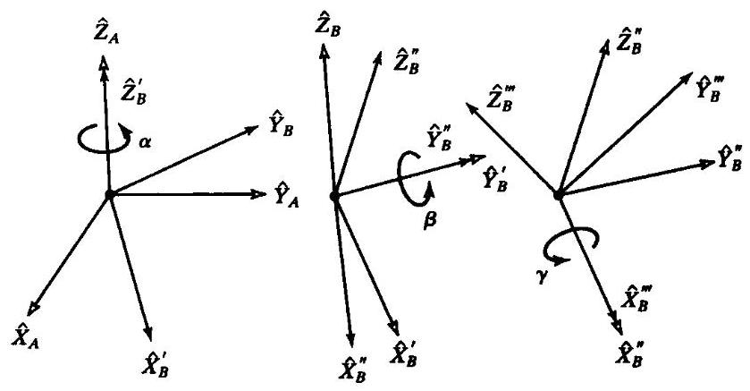

图2-18 Z-Y-X欧拉角

] 注意这个结果与以相反顺序绕固定轴旋转三次得到的结果完全相同! 总之, 这是一个不太直观的结果:三次绕固定轴旋转的最终姿态和以相反顺序三次绕运动坐标轴旋转的最终姿态相同。

因为式 (2-71) 和式 (2-64) 等价, 所以无需通过旋转矩阵的反复计算去求Z-Y-X欧拉角。 也就是说, 式 (2-66) 也可用来求解同一个已知旋转矩阵的Z-Y-X欧拉角。

**Z-Y-Z欧拉角**

坐标系 $\{ B\}$ 的另一种表示法如下:

首先将坐标系 $\{ B\}$ 和一个已知参考坐标系 $\{ A\}$ 重合。先将 $\{ B\}$ 绕 ${\widehat{Z}}_{B}$ 旋转 $\alpha$ 角，再绕 ${\widehat{Y}}_{B}$ 旋转 $\beta$ 角,最后绕 ${\widehat{Z}}_{B}$ 旋转 $\gamma$ 角。

相对于运动坐标系 $\{ B\}$ 的旋转描述是一个欧拉角描述。因为三个旋转是依次绕 $\widehat{Z},\widehat{Y}$ 和 $\widehat{Z}$ ,所以称此描述为Z-Y-Z欧拉角。

按照上一节的推导, 可得到等效矩阵

$$
{}_{B}^{A}{R}_{{Z}^{\prime }{Y}^{\prime }{Z}^{\prime }}\left( {\alpha ,\beta ,\gamma }\right)  = \left\lbrack  \begin{matrix} {c\alpha s\beta c\gamma } - {s\alpha s\gamma } &  - {c\alpha c\beta s\gamma } - {s\alpha c\gamma } & {c\alpha s\beta } \\  {s\alpha c\beta c\gamma } + {c\alpha s\gamma } &  - {s\alpha c\beta s\gamma } + {c\alpha c\gamma } & {s\alpha s\beta } \\   - {s\beta c\gamma } & {s\beta s\gamma } & {c\beta } \end{matrix}\right\rbrack \tag{2-72}
$$

从旋转矩阵得出Z-Y-Z欧拉角介绍如下。

已知

$$
{}_{B}^{A}{R}_{{Z}^{\prime }{Y}^{\prime }{Z}^{\prime }}\left( {\alpha ,\beta ,\gamma }\right)  = \left\lbrack  \begin{array}{lll} {r}_{11} & {r}_{12} & {r}_{13} \\  {r}_{21} & {r}_{22} & {r}_{23} \\  {r}_{31} & {r}_{32} & {r}_{33} \end{array}\right\rbrack \tag{2-73}
$$

如 $\sin \beta  \neq  0$ ,可得到

$$
\beta  = \mathrm{A}\tan 2\left( {\sqrt{{r}_{31}^{2} + {r}_{32}^{2}},{r}_{33}}\right)
$$

$$
\alpha  = \operatorname{Atan}2\left( {{r}_{23}/{s\beta },{r}_{13}/{s\beta }}\right) \tag{2 - 74}
$$

$$
\gamma  = \mathrm{A}\tan 2\left( {{r}_{32}/\mathrm{s}\beta , - {r}_{31}/\mathrm{s}\beta }\right)
$$

虽然存在第二个解 (在式中取 $\beta$ 的正平方根),但我们总是求满足 ${0.0} < \beta  < {180.0}^{ \circ  }$ 的单解。如果 $\beta  = {0.0}$ 或 ${180.0}^{ \circ  }$ ,式 (2-74) 的解就退化了。在这种情况下,仅能求出 $\alpha$ 和 $\gamma$ 的和或差。在这种情况下，一般取 $\alpha  = {0.0}$ ，结果如下。

如果 $\beta  = {0.0}$ ,则解为

$$
\beta  = {0.0}
$$

$$
\alpha  = {0.0} \tag{2-75}
$$

$$
\gamma  = \mathrm{A}\tan 2\left( {-{r}_{12},{r}_{11}}\right)
$$

如 $\beta  = {180.0}^{ \circ  }$ ,则解为

$$
\beta  = {180.0}^{ \circ  }
$$

$$
\alpha  = {0.0} \tag{2-76}
$$

$$
\gamma  = \mathrm{A}\tan 2\left( {{r}_{12}, - {r}_{11}}\right)
$$

**其他角坐标系的表示法**

在前一小节中, 已经介绍了三种表示姿态的惯用方法: X-Y-Z固定角、Z-Y-X欧拉角和 Z-Y-Z欧拉角。每个表示法均需要按一定顺序进行三次绕主轴的旋转。这些表示法是24种表示法中的典型方法, 且都被称作角坐标系表示法。其中, 12种为固定角坐标系法, 另12种为欧拉角坐标系法。注意到由于二者的对偶性, 对于绕主轴连续旋转的旋转矩阵实际上只有12种唯一的参数表示法。没有特别的理由优先采用何种表示法, 不同研究者可以采用不同的表示法, 所以把所有24种表示法的等效旋转矩阵列出来是有用的。附录B(在本书后面)给出了所有24种表示法的等效旋转矩阵。

**等效轴角坐标系表示法**

符号 ${R}_{x}\left( {30.0}\right)$ 表示绕一个给定轴 $\widehat{X}$ 旋转 30 度的方位。这是一个等效轴角坐标表示法的例子。如果轴的方向是一般方向 (而不是主轴方向), 任何方位都可通过选择适当的轴和角度来得到。坐标系 $\{ B\}$ 的表达如下:

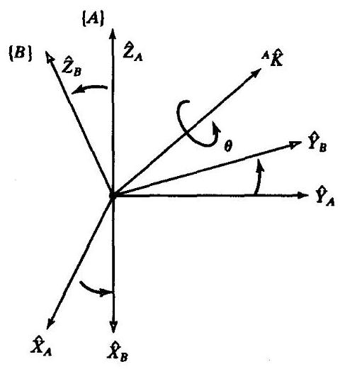

图2-19 等效轴角坐标系表示法

首先将坐标系 $\{ B\}$ 和一个已知参考坐标系 $\{ A\}$ 重合。 将 $\{ B\}$ 绕矢量 ${}^{A}\widehat{K}$ 按右手定则旋转 $\theta$ 角。

矢量 $\widehat{K}$ 有时被称为有限旋转的等效轴。 $\{ B\}$ 相对于 $\{ A\}$ 的一般姿态可用 ${}_{B}^{A}R\left( {\widehat{K},\theta }\right)$ 或 ${R}_{\kappa }\left( \theta \right)$ 来表示，并称作等效轴角坐标系表示法 ${}^{ \ominus  }$ 。确定矢量 ${}^{A}\widehat{K}$ 只需要两个参数，因为它的长度恒为 1 。角度确定了第三个参数。经常用旋转量 $\theta$ 乘以单位方向矢量 $\widehat{K}$ 形成一个简单的 $3 \times  1$ 的矢量来描述姿态,用 $K$ 表示 (没有 “帽号”),见图2-19。

当选择 $\{ A\}$ 的主轴中的一个轴作为旋转轴时,则等效旋转矩阵成为我们熟悉的平面旋转矩阵:

$$
{R}_{X}\left( \theta \right)  = \left\lbrack  \begin{matrix} 1 & 1 & 0 \\  0 & \cos \theta &  - \sin \theta \\  0 & \sin \theta & \cos \theta  \end{matrix}\right\rbrack \tag{2-77}
$$

$$
{R}_{Y}\left( \theta \right)  = \left\lbrack  \begin{matrix} \cos \theta & 0 & \sin \theta \\  0 & 1 & 0 \\   - \sin \theta & 0 & \cos \theta  \end{matrix}\right\rbrack \tag{2-78}
$$

$$
{R}_{Z}\left( \theta \right)  = \left\lbrack  \begin{matrix} \cos \theta &  - \sin \theta & 0 \\  \sin \theta & \cos \theta & 0 \\  0 & 0 & 1 \end{matrix}\right\rbrack \tag{2-79}
$$

---

$\Theta$ 对于 $\{ B\}$ 相对于 $\{ A\}$ 的任何方位, $\widehat{K}$ 和 $\theta$ 以前由欧拉参数表示,现在被称为欧拉旋量定理 ${}^{\left\lbrack  3\right\rbrack  }$ 。

---

如果旋转轴为一般轴, 则等效旋转阵 (见习题2.6) 为:

$$
{R}_{K}\left( \theta \right)  = \left\lbrack  \begin{matrix} {k}_{x}{k}_{x}{v\theta } + {c\theta } & {k}_{x}{k}_{y}{v\theta } - {k}_{z}{s\theta } & {k}_{x}{k}_{z}{v\theta } + {k}_{y}{s\theta } \\  {k}_{x}{k}_{y}{v\theta } + {k}_{z}{s\theta } & {k}_{y}{k}_{y}{v\theta } + {c\theta } & {k}_{y}{k}_{z}{v\theta } - {k}_{x}{s\theta } \\  {k}_{x}{k}_{z}{v\theta } - {k}_{y}{s\theta } & {k}_{y}{k}_{z}{v\theta } + {k}_{x}{s\theta } & {k}_{z}{k}_{z}{v\theta } + {c\theta } \end{matrix}\right\rbrack \tag{2-80}
$$

式中, ${c\theta } = \cos \theta ,{s\theta } = \sin \theta ,{v\theta } = 1 - \cos \theta$ ,并且 ${}^{A}\widehat{K} = {\left\lbrack  {k}_{x},{k}_{y},{k}_{z}\right\rbrack  }^{T}$ 。 $\theta$ 的符号由右手定则确定,即大拇指指向 ${}^{A}\widehat{K}$ 的正方向。

公式 (2-80) 将等效轴角坐标系表示转变成旋转矩阵表示。注意, 对于任何旋转轴和任何角度, 都能很容易地构造出等效旋转阵。

从一个给定的旋转矩阵求出 $\widehat{\mathbf{K}}$ 和 $\mathbf{\theta }$ ,这个逆问题大部分留在习题中 (习题2.6和2.7),但在此给出了一部分结果 ${}^{\left\lbrack  3\right\rbrack  }$ 。如果

$$
{}_{B}^{A}{R}_{K}\left( \theta \right)  = \left\lbrack  \begin{array}{lll} {r}_{11} & {r}_{12} & {r}_{13} \\  {r}_{21} & {r}_{22} & {r}_{23} \\  {r}_{31} & {r}_{32} & {r}_{33} \end{array}\right\rbrack \tag{2-81}
$$

那么

$$
\theta  = \mathrm{A}\cos \left( \frac{{r}_{11} + {r}_{22} + {r}_{33} - 1}{2}\right)
$$

且

$$
\widehat{K} = \frac{1}{2\sin \theta }\left\lbrack  \begin{matrix} {r}_{32} - {r}_{33} \\  {r}_{13} - {r}_{31} \\  {r}_{21} - {r}_{12} \end{matrix}\right\rbrack \tag{2-82}
$$

由上式总可以计算出一个在0度到 180 度之间的 $\theta$ 值。对于任意一对轴 - 角 $\left( {{}^{A}\widehat{K},\theta }\right)$ ,存在另一对轴 - 角,即 $\left( {-{}^{A}\widehat{K}, - \theta }\right)$ ,它们在空间的姿态相同,可用同样的旋转矩阵描述。因此,在将旋转矩阵转化为等效轴角坐标系表示法时, 我们需要对解进行选择。一个更加重要的问题是, 对于小角度的旋转, 此时的轴将变得不确定。显然, 如果转动量为零, 旋转轴根本无法确定。 如果 $\theta  = {0}^{ \circ  }$ 或 ${180}^{ \circ  }$ 时,式 (2-82) 将无解。

例2.8

坐标系 $\{ B\}$ 最初与坐标系 $\{ A\}$ 重合。我们使坐标系 $\{ B\}$ 绕矢量 ${}^{A}\widehat{K} = {\left\lbrack  \begin{array}{lll} {0.707} & {0.70} & {70.0} \end{array}\right\rbrack  }^{T}\;({}^{A}\widehat{K}$ 经过原点) 旋转,转角 $\theta  = {30}^{ \circ  }$ ,求坐标系 $\{ B\}$ 的描述。

代入式 (2-80) 得到坐标系描述的旋转矩阵分量。因为原点没有改变, 所以位置矢量是 ${\left\lbrack  0,0,0\right\rbrack  }^{T}$ 。因此

$$
{}_{B}^{A}T = \left\lbrack  \begin{matrix} {0.933} \cdot  & {0.067} & {0.354} & {0.0} \\  {0.067} & {0.933} &  - {0.354} & {0.0} \\   - {0.354} & {0.354} & {0.866} & {0.0} \\  {0.0} & {0.0} & {0.0} & {1.0} \end{matrix}\right\rbrack \tag{2-83}
$$

到此为止, 我们讨论过的所有旋转都是绕经过参考系原点的轴进行的。如果我们遇到的问题不属于这种情况时, 我们可以定义另外一个坐标系, 该坐标系的原点在轴上, 为此将这类问题简化为 “经过原点的轴” 的情况来解决, 然后再求解这个变换方程。

例2.9

坐标系 $\{ B\}$ 最初与坐标系 $\{ A\}$ 重合。我们使坐标系 $\{ B\}$ 绕矢量 ${}^{A}\widehat{K} = {\left\lbrack  \begin{array}{lll} {0.707} & {0.707} & {0.0} \end{array}\right\rbrack  }^{T}$ (此矢量经过点 ${}^{A}P = \left\lbrack  {{1.02}\text{ . }0\text{ 3.0 }}\right\rbrack$ )旋转，转角 $\theta  = {30}^{ \circ  }$ ，求坐标系 $\{ B\}$ 的描述。

在旋转之前,坐标系 $\{ A\}$ 和 $\{ B\}$ 是重合的。如图 2-20 所示,我们定义了两个新的坐标系 $\left\{  {A}^{\prime }\right\}$ 和 $\left\{  {B}^{\prime }\right\}$ ,它们互相重合,且它们分别相对于坐标系 $\{ A\}$ 和 $\{ B\}$ 具有相同的方向,但它们的原点在旋转轴上,并且相对于坐标系 $\{ A\}$ 的原点有一定的偏移量。我们选择

$$
{}_{{A}^{\prime }}^{A}T = \left\lbrack  \begin{array}{llll} {1.0} & {0.0} & {0.0} & {1.0} \\  {0.0} & {1.0} & {0.0} & {2.0} \\  {0.0} & {0.0} & {1.0} & {3.0} \\  {0.0} & {0.0} & {0.0} & {1.0} \end{array}\right\rbrack \tag{2-84}
$$

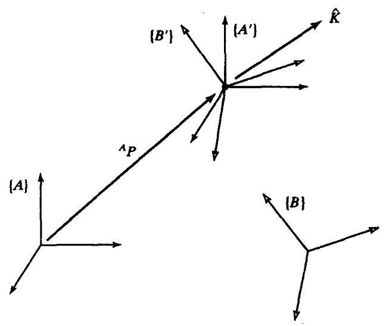

图2-20 绕不经过 $\{ A\}$ 原点的轴旋转,最初坐标系 $\{ A\}$ 与 $\{ B\}$ 重合

同样,坐标系 $\{ B\}$ 相对于坐标系 $\left\{  {B}^{\prime }\right\}$ 的描述是

$$
{}_{B}^{B}T = \left\lbrack  \begin{array}{rrrr} {1.0} & {0.0} & {0.0} &  - {1.0} \\  {0.0} & {1.0} & {0.0} &  - {2.0} \\  {0.0} & {0.0} & {1.0} &  - {3.0} \\  {0.0} & {0.0} & {0.0} & {1.0} \end{array}\right\rbrack \tag{2-85}
$$

现在，保持其他关系不变，使坐标系 $\left\{  {B}^{\prime }\right\}$ 绕坐标系 $\left\{  {A}^{\prime }\right\}$ 旋转。因为旋转轴经过原点，所以我们可以用式 (2-80) 来计算坐标系 $\left\{  {B}^{\prime }\right\}$ 相对于坐标系 $\left\{  {A}^{\prime }\right\}$ 的旋转量。带入式 (2-80) 得到描述坐标系的旋转矩阵分量。又因为原点没有改变,所以位置矢量是 ${\left\lbrack  0,0,0,\right\rbrack  }^{T}$ 。因此,我们得到

$$
{}_{{B}^{\prime }}^{{A}^{\prime }}T = \left\lbrack  \begin{matrix} {0.933} & {0.067} & {0.354} & {0.0} \\  {0.067} & {0.933} &  - {0.354} & {0.0} \\   - {0.354} & {0.354} & {0.866} & {0.0} \\  {0.0} & {0.0} & {0.0} & {1.0} \end{matrix}\right\rbrack \tag{2-86}
$$

最后, 我们可以用一个变换方程来计算要求的坐标系

$$
{}_{B}^{A}T = {}_{{A}^{\prime }}^{A}{T}_{{B}^{\prime }}^{{A}^{\prime }}{T}^{{B}^{\prime }}{}_{B}T \tag{2-87}
$$

从而求得

$$
{}_{B}^{A}T = \left\lbrack  \begin{array}{rrrr} {0.933} & {0.067} & {0.354} &  - {1.13} \\  {0.067} & {0.933} &  - {0.354} & {1.13} \\   - {0.354} & {0.354} & {0.866} & {0.05} \\  {0.000} & {0.000} & {0.000} & {1.00} \end{array}\right\rbrack \tag{2-88}
$$

绕一个不通过原点的轴旋转会引起位置变化, 附加上这个位置变化使得最终的姿态好像旋转轴已通过原点。

注意,无论以何种方式定义的坐标系 $\left\{  {A}^{\prime }\right\}$ 和 $\left\{  {B}^{\prime }\right\}$ ,它们的原点必须选在旋转轴上。旋转轴方向的选择是任意的, 而坐标系原点可以选在旋转轴的任意位置上 (参见习题2.14)。

**欧拉参数**

另一种姿态表示法是通过四个数值来表示的, 称为欧拉参数。虽然完整的讨论超出了本书的范围, 但在这里我们介绍一种规则作为参考。

根据等效旋转轴 $\widehat{K} = {\left\lbrack  {k}_{x}{k}_{y}{k}_{z}\right\rbrack  }^{T}$ 和等效旋转角 $\mathbf{\theta }$ 得到欧拉参数如下

$$
{\varepsilon }_{1} = {k}_{x}\sin \frac{\theta }{2}
$$

$$
{\varepsilon }_{2} = {k}_{y}\sin \frac{\theta }{2} \tag{2-89}
$$

$$
{\varepsilon }_{3} = {k}_{z}\sin \frac{\theta }{2}
$$

$$
{\varepsilon }_{4} = \cos \frac{\theta }{2}
$$

显然, 这四个参数不是独立的

$$
{\varepsilon }_{1}^{2} + {\varepsilon }_{2}^{2} + {\varepsilon }_{3}^{2} + {\varepsilon }_{4}^{2} = 1 \tag{2-90}
$$

这个关系总是保持不变。因此, 一个姿态可以看作是四维空间中单位超球面上的一点。

有时, 可以将欧拉参数看作是一个 $3 \times  1$ 的矢量加上一个标量。但是,虽然欧拉参数是一个 $4 \times  1$ 的矢量，我们还是将欧拉参数看作是一个单位四元数。

用欧拉参数组表示的旋转矩阵 ${R}_{\varepsilon }$ 是

$$
{R}_{\varepsilon } = \left\lbrack  \begin{array}{lll} 1 - 2{\varepsilon }_{2}^{2} - 2{\varepsilon }_{3}^{2} & 2\left( {{\varepsilon }_{1}{\varepsilon }_{2} - {\varepsilon }_{3}{\varepsilon }_{4}}\right) & 2\left( {{\varepsilon }_{1}{\varepsilon }_{3} + {\varepsilon }_{2}{\varepsilon }_{4}}\right) \\  2\left( {{\varepsilon }_{1}{\varepsilon }_{2} + {\varepsilon }_{3}{\varepsilon }_{4}}\right) & 1 - 2{\varepsilon }_{1}^{2} - 2{\varepsilon }_{3}^{2} & 2\left( {{\varepsilon }_{2}{\varepsilon }_{3} - {\varepsilon }_{1}{\varepsilon }_{4}}\right) \\  2\left( {{\varepsilon }_{1}{\varepsilon }_{3} - {\varepsilon }_{2}{\varepsilon }_{4}}\right) & 2\left( {{\varepsilon }_{2}{\varepsilon }_{3} + {\varepsilon }_{1}{\varepsilon }_{4}}\right) & 1 - 2{\varepsilon }_{1}^{2} - 2{\varepsilon }_{2}^{2} \end{array}\right\rbrack \tag{2-91}
$$

已知一个旋转矩阵得到对应的欧拉参数是

$$
{\varepsilon }_{1} = \frac{{r}_{32} - {r}_{23}}{4{\varepsilon }_{4}}
$$

$$
{\varepsilon }_{2} = \frac{{r}_{13} - {r}_{31}}{4{\varepsilon }_{4}} \tag{2-92}
$$

$$
{\varepsilon }_{3} = \frac{{r}_{21} - {r}_{12}}{4{\varepsilon }_{4}}
$$

$$
{\varepsilon }_{4} = \frac{1}{2}\sqrt{1 + {r}_{11} + {r}_{22} + {r}_{33}}
$$

注意，从计算的意义来讲，如果旋转矩阵表示的是绕某一轴180°的旋转，式 (2-92) 将失去意义,因为 ${\varepsilon }_{4} = 0$ 。但可以看出,当取极限时,式 (2-92) 中的所有表达式都趋向于无穷大,对于上述情况也是如此。实际上从式 (2-89) 的定义中可以看出,对于所有的 ${\varepsilon }_{i}$ ,其值在 $\left\lbrack  {-1,1}\right\rbrack$ 间。

**示教和预定义姿态运动**

在许多机器人系统中, 可以通过运行机器人来 “示教” 位置和姿态。将操作臂运行至一期望位置并将这一位置记录下来。在用这种方法示教时, 机器人不必要求返回原来的坐标系, 此坐标系可以是局部坐标系也可以是固定坐标系。换句话说, 此时的机器人是一个具有六自由度的测量工具。这样进行姿态示教就可完全不必在编程中处理姿态描述问题。在计算机中, 示教点是按照旋转矩阵形式被存储的, (然而) 用户对它是不了解的。因此, 尽量推荐采用机器人系统进行坐标系的示教。

除了示教坐标系外, 一些机器人系统还有一系列预定义姿态运动, 例如 “向下点动” 或 “向左点动”。这些指令对用户非常方便。但是, 如果这个预定义姿态运动仅对姿态进行描述和定义, 那么机器人系统的应用范围就将很有限。

## 2.9 自由矢量的变换

在这一章中我们将重点介绍位置矢量。在后面的章节中, 我们将讨论速度和力矢量。因为这些矢量的类型不同，所以它们的变换形式是不同的。

在力学中，矢量的相等和等效是有显著的区别的。如果两个矢量具有相同的维数、大小和方向时, 这两个矢量就相等。两个相等的矢量可能有不同的作用线——例如图2-21中所示的三个相等的矢量。这些速度矢量具有相同的维数、大小和方向，所以按照我们的定义可知它们是相等的。

如果两个矢量在某一功能上产生了相同的作用效果, 那么这两个矢量对这一特定功能来说就是等效的。因此, 如果在图2-21中判别的是运行距离, 这三个矢量的效果相同, 那么它们在这一功能上来讲是等效的。但是, 如果判断标准是在xy平面上方的高度, 那么这三个矢量是不等效的, 尽管它们是相等的矢量。因此, 矢量之间的关系以及是否等效完全取决于当时的判断条件。而且, 在某些情况下, 不相等的矢量可能会产生相同的作用效果。

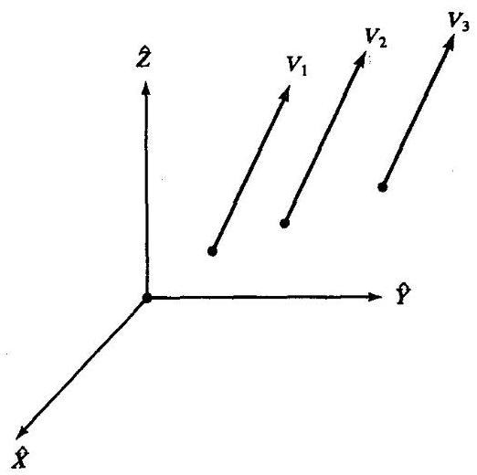

图2-21 相等的速度矢量

我们将定义两种很有用的基本矢量类型。

术语线矢量是指与作用线有关的矢量, 其作用效果取决于矢量的大小和方向。通常情况下, 力矢量的作用效果取决于力的作用线 (或者是力的作用点), 所以力矢量可以看作是线矢量。

自由矢量是指可能出现在空间任意位置的矢量, 但它的性质没有改变, 例如假定它的大小和方向保持不变。

例如,一纯力矩矢量就是一个自由矢量。如果已知在坐标系 $\{ B\}$ 中有一个力矩矢量 ${}^{B}N$ ,那么在坐标系 $\{ A\}$ 中计算这个力矩矢量,得

$$
{}^{A}N = {}_{B}^{A}{R}^{B}N \tag{2-93}
$$

换言之, (对于自由矢量) 所有的计算都是关于大小和方向的, 所以在两个坐标系的变换中只与旋转矩阵有关, 而原点的相对位移在计算中是不会涉及的。

同样的,在坐标系 $\{ B\}$ 中的速度矢量 ${}^{B}V$ ,在坐标系 $\{ A\}$ 中表示为

$$
{}^{A}V = {}_{B}^{A}{R}^{B}V \tag{2-94}
$$

某一点的速度是自由矢量, 所以对于此矢量最重要的是大小和方向。矢量旋转 (如式 (2-94)) 不会改变矢量的大小，但从坐标系 $\{ B\}$ 到坐标系 $\{ A\}$ 的旋转完成时，矢量的描述被改变了。需要注意的是,出现在位置矢量变换中的 ${}^{A}{P}_{BORG}$ 不能出现在速度变换当中。例如,在图2-22中,如果 ${}^{B}V = 5\widehat{X}$ ,那么 ${}^{A}V = 5\widehat{Y}$ 。

速度矢量、力矢量和力矩矢量将会在第5章中作进一步介绍。

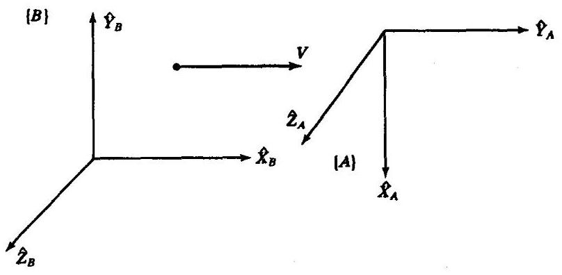

图2-22 速度变换

## 2.10 计算分析

计算成本的降低带来的效益极大地促进着机器人工业的发展, 因此, 在操作系统的设计当中, 高效的计算能力将始终是一个重要的方面。

齐次变换方法对概念分析是很有用的, 但是在工业操作臂系统中常用的变换软件并不直接应用这种方法, 因为大量时间会耗费在0和1的乘法运算上。

通常, 我们按照式 (2-41) 和式 (2-45) 进行计算, 而不是直接进行乘法或对 4 x 4 的矩阵进行求逆运算。

当对相同的量进行计算时, 变换顺序的不同将会导致计算量的很大差别。对于矢量的复合旋转

$$
{}^{A}P = {}_{B}^{A}{R}_{C}^{B}{R}_{D}^{C}{R}^{D}P \tag{2-95}
$$

一种方法是首先将这三个旋转矩阵相乘，得到 ${}_{D}^{A}R$ ，表示为

$$
{}^{A}P = {}_{D}^{A}{R}^{D}P \tag{2-96}
$$

由 ${}_{D}^{A}R$ 的三个分量来计算 ${}_{D}^{A}R$ 需要 54 次乘法运算和 36 次加法运算,而进行式 (2-96) 中最后的矩阵矢量乘法还要增加9次乘法运算和6次加法运算，所以总共需要63次乘法和42次加法运算。

另一种方法是逐个通过矩阵计算进行矢量变换, 即

$$
{}^{A}P = {}_{B}^{A}R{}_{C}^{B}R{}_{D}^{C}R{}^{D}P
$$

$$
{}^{A}P = {}_{B}^{A}R{}_{C}^{B}R{}^{C}P \tag{2-97}
$$

$$
{}^{A}P = {}_{B}^{A}R
$$

$$
{}^{A}P = {}^{A}P
$$

那么总的计算次数只需要 27 次乘法运算和 18 次加法运算, 与前一种方法相比所用的次数还不及一半。

当然,在某些情况下,关系式 ${}_{B}^{A}R,{}_{C}^{B}R$ 和 ${}_{D}^{C}R$ 是常数,这时主要是将 ${}^{D}{P}_{i}$ 转换为 ${}^{A}{P}_{i}$ 。 在这种情况下,更有效的方法是一次性计算 ${}_{D}^{A}R$ ,然后将它用于所有需要的变换。见习题 2.16 。

例2.10

给出一种求两个旋转矩阵乘积 ${}_{B}^{A}R{}_{C}^{B}R$ 的方法,计算次数不多于 27 次乘法运算和 18 次加法运算。

这里 ${\widehat{L}}_{i}$ 是 ${}_{C}^{B}R$ 的列, ${\widehat{C}}_{i}$ 分别是计算结果的三个列,计算如下、

$$
{\widehat{C}}_{1} = {}_{B}^{A}R{\widehat{L}}_{i}
$$

$$
{\widehat{C}}_{2} = {}_{B}^{A}R{\widehat{L}}_{2} \tag{2-98}
$$

$$
{\widehat{C}}_{3} = {\widehat{C}}_{1} \times  {\widehat{C}}_{2}
$$

这里只需要 24 次乘法和 15 次加法运算。

**参考文献**

[1] B. Noble, Applied Linear Algebra, Prentice-Hall, Englewood Cliffs, NJ, 1969.

[2] D. Ballard and C. Brown, Computer Vision; Prentice-Hall, Englewood Cliffs, NJ, 1982.

[3] O. Bottema and B. Roth, Theoretical Kinematics, North Holland, Amsterdam, 1979.

---

[4] R.P. Paul, Robot Manipulators, MIT Press, Cambridge, MA, 1981.

[5] I. Shames, Engineering Mechanics, 2nd edition, Prentice-Hall, Englewood Cliffs, NJ,

	1967.

[6] Symon, Mechanics, 3rd edition, Addison-Wesley, Reading, MA, 1971.

[7] B. Gorla and M. Renaud, Robots Manipulateurs, Cepadues-Editions, Toulouse, 1984.

---

**习题**

2.1 [15]一矢量 ${}^{A}P$ 绕 ${\widehat{Z}}_{A}$ 旋转 $\theta$ 度,然后绕 ${\widehat{X}}_{A}$ 旋转 $\phi$ 度,求按上述顺序旋转后得到的旋转矩阵。

2.2 [15] 一矢量 ${}^{A}P$ 绕 ${\widehat{Y}}_{A}$ 旋转30度,然后绕 ${\widehat{X}}_{A}$ 旋转45度,求按上述顺序旋转后得到的旋转矩阵。

2.3 [16] 坐标系 $\{ B\}$ 最初与坐标系 $\{ A\}$ 重合,将坐标系 $\{ B\}$ 绕 ${\widehat{Z}}_{B}$ 旋转 $\theta$ 度,接着再将上一步旋转得到的坐标系绕 ${\widehat{X}}_{B}$ 旋转 $\phi$ 度,求从 ${}^{B}P$ 到 ${}^{A}P$ 矢量变换的旋转矩阵。

2.4 [16] 坐标系 $\{ B\}$ 最初与坐标系 $\{ A\}$ 重合,将坐标系 $\{ B\}$ 绕 ${\widehat{Z}}_{B}$ 旋转 30 度,接着再将上一步旋转得到的坐标系绕 ${\widehat{X}}_{B}$ 旋转45度,求从 ${}^{B}P$ 到 ${}^{A}P$ 矢量变换的旋转矩阵。

2.5 [13] ${}_{B}^{A}R$ 是一个 $3 \times  3$ 的矩阵,其特征值分别为 $1,{e}^{+{ai}},{e}^{-{ai}}$ ,这里 $i = \sqrt{-1}$ 。请问 ${}_{B}^{A}R$ 的特征向量与其特征值1的物理意义是什么?

2.6 [21] 推导方程式 (2-80)。

2.7 [24] 描述 (或编写) 一个计算程序, 用来表示等效轴角坐标系形式的旋转矩阵。可以从方程 (2-82) 开始,但要使你的计算程序能够处理 $\theta  = {0}^{ \circ  }$ 和 $\theta  = {180}^{ \circ  }$ 这两种特殊情况。

2.8 [29]编写一个子程序用来描述旋转矩阵形式到等效轴角坐标系形式的变换。一个Pascal程序的起始形式如下

Procedure RMTOAA (VAR R:mat33; VAR K:vec3; VAR theta: real);

编写另一个子程序用来描述从等效轴角坐标系形式到旋转矩阵形式的变换

---

Procedure AATORM(VAR K:vec3; VAR theta: real: VAR R:mat33);

---

你可以选用C语言来编写程序。

在不同测试数据的情况下不断运行这些程序并验证你输入的结果, 其中包括一些较难的情况。

2.9 [27] 由习题2.8求绕固定轴的回转角、俯仰角和偏转角。

2.10 [27] 由习题2.8求 $Z - Y - Z$ 欧拉角。

2.11 [10]在什么条件下, 两个有限旋转矩阵可以交换? 不需进行证明。

2.12 [14]已知一速度矢量如下

$$
{}^{B}V = \left\lbrack  \begin{array}{l} {10.0} \\  {20.0} \\  {30.0} \end{array}\right\rbrack
$$

又已知

$$
{}_{B}^{A}T = \left\lbrack  \begin{matrix} {0.866} &  - {0.500} & {0.000} & {11.0} \\  {0.500} & {0.866} & {0.000} &  - {3.0} \\  {0.000} & {0.000} & {1.000} & {9.0} \\  0 & 0 & 0 & 1 \end{matrix}\right\rbrack
$$

计算 ${}^{A}V$ 。

2.13 [21]已知下列坐标系的定义

$$
{}_{A}^{U}T = \left\lbrack  \begin{matrix} {0.866} &  - {0.500} & {0.000} & {11.0} \\  {0.500} & {0.866} & {0.000} &  - {1.0} \\  {0.000} & {0.000} & {1.000} & {8.0} \\  0 & 0 & 0 & 1 \end{matrix}\right\rbrack
$$

$$
{}_{A}^{B}T = \left\lbrack  \begin{matrix} {1.000} & {0.000} & {0.000} & {0.0} \\  {0.000} & {0.866} &  - {0.500} & {10.0} \\  {0.000} & {0.500} & {0.866} &  - {20.0} \\  0 & 0 & 0 & 1 \end{matrix}\right\rbrack
$$

$$
{}_{U}^{C}T = \left\lbrack  \begin{matrix} {0.866} &  - {0.500} & {0.000} &  - {3.0} \\  {0.433} & {0.750} &  - {0.500} &  - {3.0} \\  {0.250} & {0.433} & {0.866} & {3.0} \\  0 & 0 & 0 & 1 \end{matrix}\right\rbrack
$$

绘制坐标系示意图 (如图 2-15 的形式) 定性地表明其坐标轴的排列,并求解 ${}_{C}^{B}T$ 。

2.14 [31]构造一个通用方程式求 ${}_{B}^{A}T$ ,这里,坐标系 $\{ B\}$ 最初与坐标系 $\{ A\}$ 重合,坐标系 $\{ B\}$ 绕 $\widehat{K}$ 旋转 $\theta$ 度, $\widehat{K}$ 经过点 ${}^{A}P$ (通常情况下不经过坐标系 $\{ A\}$ 的原点)。

2.15 [34]坐标系 $\{ A\}$ 和 $\{ B\}$ 只是在姿态上不同,坐标系 $\{ B\}$ 可以看作是通过如下的方式得到: 坐标系 $\{ B\}$ 最初与坐标系 $\{ A\}$ 重合,坐标系 $\{ B\}$ 绕单位矢量 $\widehat{K}$ 旋转 $\theta$ 弧度,即

$$
{}_{B}^{A}R = {}_{B}^{A}{R}_{K}\left( \theta \right)
$$

表示如下

$$
{}_{B}^{A}R = {e}^{k\theta }
$$

这里

$$
K = \left\lbrack  \begin{matrix} 0 &  - {k}_{x} & {k}_{y} \\  {k}_{z} & 0 &  - {k}_{x} \\   - {k}_{y} & {k}_{x} & 0 \end{matrix}\right\rbrack
$$

2.16 [22] 一个矢量映射须经过三个旋转矩阵变换:

$$
{}^{A}P = {}_{B}^{A}{R}_{C}^{B}{R}_{D}^{C}{R}^{D}P
$$

一种方法是首先将这三个旋转矩阵相乘，得到 ${}_{D}^{A}R$ ,表示为

$$
{}^{A}P = {}_{D}^{A}{R}^{D}P
$$

另一种方法是逐个通过矩阵计算进行矢量变换, 即

$$
{}^{A}P = {}_{B}^{A}R{}_{c}^{B}R{}_{D}^{C}R{}^{D}P
$$

$$
{}^{A}P = {}_{B}^{A}R{}_{C}^{B}R{}^{C}P
$$

$$
{}^{A}P = {}_{B}^{A}R
$$

$$
{}^{A}P = {}^{A}P
$$

如果 ${}^{D}P$ 以 ${100}\mathrm{{Hz}}$ 变化,那么我们就必须按相同的频率反复计算 ${}^{A}P$ 。而且,这三个旋转矩阵也同样变化。假设我们通过一个显示系统以 ${30}\mathrm{\;{Hz}}$ 的频率对 ${}_{B}^{A}R,{}_{C}^{B}R$ 和 ${}_{D}^{C}R$ 赋以新值, 那么, 按照什么方法计算使得计算量最小呢 (乘法运算和加法运算)?

2.17 [16] 另一种用来描述空间一点的三维坐标系是圆柱坐标系, 其中三个坐标参数的定义如图2-23所示。坐标 $\theta$ 给定 ${xy}$ 面内的有向线段, $r$ 表示沿着这个方向的径向长度; $z$ 给定了在 ${xy}$ 面上的高度。由圆柱坐标参数 $\theta$ ， $r$ 和 $z$ 来计算笛卡儿坐标系中的一点 ${}^{A}P$ 。

2.18 [18] 另一种用来描述空间一点的三维坐标系是球坐标系, 其中三个坐标的定义如图2-24 所示。角度 $\alpha$ 和 $\beta$ 可被看作是投射到空间的一条射线的方位角和俯仰角。第三个坐标 $r$ 表示沿这条射线到被描述的空间点的径向距离。由球坐标系的参数 $\alpha$ , $\beta$ 和 $r$ 来计算笛卡儿坐标系中的一点 ${}^{A}P$ 。

2.19 [24] 一物体绕 $\widehat{X}$ 轴旋转角度 $\phi$ ,接着绕旋转后生成的 $\widehat{Y}$ 轴旋转角度 $\psi$ 。由Euler 角公式可知最后的姿态是

$$
{R}_{x}\left( \phi \right) {R}_{y}\left( \psi \right)
$$

然而, 如果这两次旋转是绕固定参考系的轴进行的, 将解得

$$
{R}_{y}\left( \psi \right) {R}_{x}\left( \phi \right)
$$

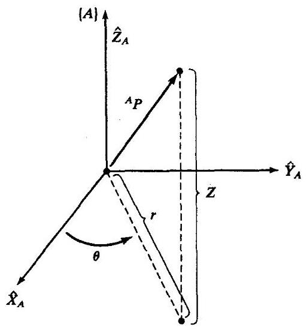

图2-23 圆柱坐标系

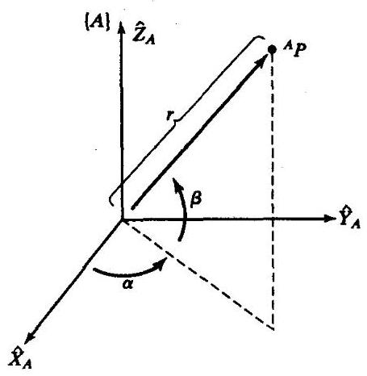

图2-24 球坐标系

进行乘法运算的顺序取决于被描述的旋转是相对于固定轴还是移动坐标系。而且应进一步看到, 当绕着移动坐标系中的一个轴的旋转被确定了, 在这种情况下, 我们就确定了一个在固定坐标系中的旋转, 并用下式表示为 (对于本例)

$$
{R}_{x}\left( \phi \right) {R}_{y}\left( \psi \right) {R}_{x}^{-1}\left( \phi \right)
$$

通过左乘 ${R}_{x}\left( \phi \right)$ ,这个相似变换 ${}^{\left\lbrack  1\right\rbrack  }$ 简化了方程的解,看起来好像矩阵乘法的顺序颠倒了。根据这个观点,推导与Z-Y-Z欧拉角 $\left( {\alpha ,\beta ,\gamma }\right)$ 坐标系等效的旋转矩阵 (结果由 (2-72) 给出)。

2.20 [20]假定一个矢量 $Q$ 绕一个矢量 $\widehat{K}$ 旋转 $\theta$ 形成一个新的矢量 ${Q}^{\prime }$ ，即

$$
{Q}^{\prime } = {R}_{K}\left( \theta \right) Q
$$

用 (2-80) 推导Rodrigues公式

$$
{Q}^{\prime } = Q\cos \theta  + \sin \theta \left( {\widehat{K} \times  Q}\right)  + \left( {1 - \cos \theta }\right) \left( {\widehat{K} \cdot  \widehat{Q}}\right) \widehat{K}
$$

2.21 [15] 如果旋转足够小,使得 $\sin \theta  = \theta ,\cos \theta  = 1$ 和 ${\theta }^{2} = 0$ 近似成立,推导绕一般轴 $\widehat{K}$ 旋转 $\theta$ 的等效旋转矩阵。从(2-80)开始推导。

2.22 [20] 用习题2.21的结果, 证明两个无穷小旋转相乘可交换 (即旋转的次序不重要)。

2.23 [25] 写出一个算法,由三点 ${}^{U}{P}_{1},{}^{U}{P}_{2}$ 和 ${}^{U}{P}_{3}$ 构造坐标系 ${}_{A}^{U}T$ ,已知这些点的条件如下:

1. ${}^{U}{P}_{1}$ 在 $\{ A\}$ 的原点处;

2. ${}^{U}{P}_{2}$ 位于 $\{ A\}$ 的 $\widehat{X}$ 轴正向某处;

3. ${}^{U}{P}_{3}$ 位于 $\{ A\}$ 的 ${XY}$ 平面上 $\widehat{Y}$ 轴正向的附近。

2.24 [45] 证明标准正交矩阵的凯莱公式。

2.25 [30] 证明旋转矩阵的特征值为 $1,{e}^{\alpha i}$ 和 ${e}^{-{\alpha i}}$ ,其中 $i = \sqrt{-1}$ 。

2.26 [33] 证明任一欧拉角坐标系都可以表示任何旋转矩阵。

2.27 [15] 参见图2-25,求 ${}_{B}^{A}T$ 的值。

2.28 [15] 参见图2-25,求 ${}_{C}^{A}T$ 的值。

2.29 [15] 参见图2-25，求 ${}_{C}^{B}T$ 的值。

2.30 [15] 参见图2-25,求 ${}_{A}^{C}T$ 的值。

2.31 [15] 参见图2-26,求 ${}_{B}^{A}T$ 的值。

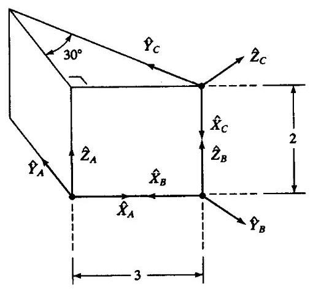

图2-25 在楔形块角顶点上的坐标系

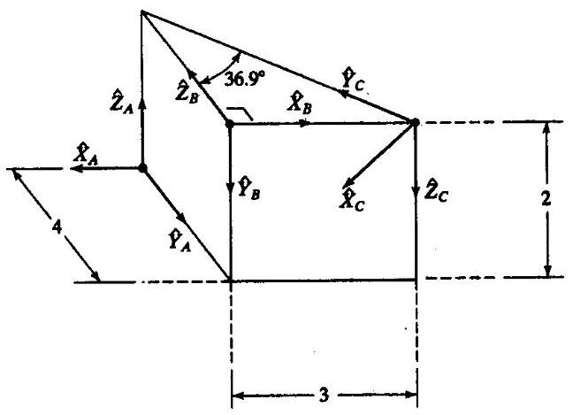

图2-26 在楔形块角顶点上的坐标系

2.32 [15] 参见图2-26,求 ${}_{c}^{A}T$ 的值。

2.33 [15] 参见图2-26,求 ${}_{c}^{B}T$ 的值。

2.34 [15] 参见图2-26,求 ${}_{A}^{C}T$ 的值。

2.35 [20] 证明任何旋转矩阵的行列式的值恒等于1。

2.36 [36] 在平面(即2维空间)内运动的刚体有三个自由度。在3维空间内运动的刚体有六个自由度。证明在 $N$ 维空间内的运动刚体有 $\frac{1}{2}\left( {{N}^{2} + N}\right)$ 个自由度。

2.37 [15] 已知

$$
{}_{B}^{A}T = \left\lbrack  \begin{matrix} {0.25} & {0.43} & {0.86} & {5.0} \\  {0.87} &  - {0.50} & {0.00} &  - {4.0} \\  {0.43} & {0.75} &  - {0.50} & {3.0} \\  0 & 0 & 0 & 1 \end{matrix}\right\rbrack
$$

${}_{A}^{B}T$ 中的 $\left( {2,4}\right)$ 元素是什么?

2.38 [25] 假设在一个刚体内嵌有两个单位矢量 ${v}_{1}$ 和 ${v}_{2}$ 。注意,无论刚体如何旋转,两个矢量的几何夹角保持不变 (即刚体旋转是一个 “角度保持” 的运动)。由此给出一个简要证明 (四到五行): 旋转矩阵的逆矩阵等于它的转置矩阵, 并且旋转矩阵是正交阵。

2.39 [37] 写出一个算法 (可用C语言的形式) 来求解一个已知旋转矩阵的单位四元数。将式 (2-91) 应用于起始点。

2.40 [33] 写出一个算法 (可用C语言的形式) 来求解一个已知旋转矩阵的Z-X-Z欧拉角。参见附录B。

2.41 [33] 写出一个算法 (可用C语言的形式) 来求解一个已知旋转矩阵的X-Y-X固定角。参见附录B。

**编程习题**

1. 如果你的函数库没有Atan2函数子程序, 那么就编写一个。

2. 制作一个友好的用户界面,用一个角度 $\theta$ 代替 $2 \times  2$ 旋转矩阵描述在平面坐标系中的姿态。用户始终按照角度 $\theta$ 输入,但是程序内部仍采用旋转矩阵的形式。用 $x$ 和 $y$ 值来确定坐标系的位置矢量分量。因此,允许用户用一个三元数 $\left( {x, y,\theta }\right)$ 来给定坐标系。在程序内部用一个 $2 \times  1$ 位置矢量和一个 $2 \times  2$ 旋转矩阵,所以需要一个转换程序。写出一个子程序,其Pascal的程序引导为

---

Procedure UTOI (VAR uform: vec3; VAR iform: frame);

---

其中 “UTOI” 意思是 “用户形式到内部形式”。第一个参数为三元数 $\left( {x, y,\theta }\right)$ ,并且第二个参数为 “坐标系” 的类型,由一个 $\left( {2 \times  1}\right)$ 位置矢量和一个 $\left( {2 \times  2}\right)$ 旋转矩阵组成。如果你愿意, 可用一个 $3 \times  3$ 齐次变换表示这个坐标系,其第三行为 $\left\lbrack  \begin{array}{lll} 0 & 0 & 1 \end{array}\right\rbrack$ 。求逆的程序也是必要的:

---

Procedure ITOU (VAR iform: frame; VAR uform: vec3);

---

3. 写出关于两个变换相乘的子程序。程序引导为:

---

Procedure TMULT (VAR brela, crelb, crela: frame);

---

前两个参数为输入,第三个为输出。注意程序中的参量文件名为 $\left( {\text{ brela } = {}_{B}^{A}T}\right)$ 。

4. 写出一个子程序,求变换的逆。程序引导为:

---

Procedure TINVERT (VAR brela, arelb: frame);

---

第一参数是输入,第二个为输出。注意程序中的参量文件名为 $\left( {\text{ brela } = {}_{B}^{A}T}\right)$ 。

5. 已知下列坐标系:

$$
{}_{A}^{U}T = \left\lbrack  {xy\theta }\right\rbrack   = \left\lbrack  \begin{array}{llll} {11.0} &  - {1.0} & 3 & {0.0} \end{array}\right\rbrack
$$

$$
{}_{A}^{B}T = \left\lbrack  {xy\theta }\right\rbrack   = \left\lbrack  \begin{array}{lll} {0.0} & {7.0} & {45.0} \end{array}\right\rbrack
$$

$$
{}_{U}^{C}T = \left\lbrack  {xy\theta }\right\rbrack   = \left\lbrack  {-{3.0} - {3.0} - {30.0}}\right\rbrack
$$

由用户输入坐标系的表达式 $\left\lbrack  {x, y,\theta }\right\rbrack$ ( $\theta$ 是以deg为单位)。画出坐标系 (如图2-15,只须在 2维平面内), 定性表达出它们的位置。写出子程序TMULT和TINVERT(在编程习题3和4中已定义) 以尽可能多的次数求解 ${}_{C}^{B}T$ 。打印出 ${}_{C}^{B}T$ 在程序中的表达式和用户的表达式。

**MATLAB习题1**

a) 用Z-Y-X $\left( {\alpha  - \beta  - \gamma }\right)$ 欧拉角表示法,写出MATLAB程序,当用户输入欧拉角 $\alpha  - \beta  - \gamma$ 时,计算旋转矩阵 ${}_{B}^{A}R$ 。用两个例子测试:

i) $\alpha  = {10}^{ \circ  },\beta  = {20}^{ \circ  },\gamma  = {30}^{ \circ  }$

ii) $\alpha  = {30}^{ \circ  },\beta  = {90}^{ \circ  },\gamma  =  - {55}^{ \circ  }$

对于情况i),证明单位正交旋转矩阵的6个约束条件 (即在 $3 \times  3$ 矩阵中有9个数,但是只有 3 个是独立的),对于情况i),证明这个完备性, ${}_{A}^{B}R = {}_{B}^{A}{R}^{-1} = {}_{B}^{A}{R}^{T}$ 。

b) 编写一个MATLAB程序。当输入旋转矩阵 ${}_{B}^{A}R$ 时,计算出欧拉角 $\alpha  - \beta  - \gamma$ (反解问题)。计算两个可能的解。证明a) 中两种情况的反解。使用循环方法检查你的结果是否正确 (即, 将a) 中的欧拉角输入到程序 $a$ ; 将得到的旋转矩阵 ${}_{B}^{A}R$ 输入到程序 $b$ ; 你将得到两组解答: 一组应当是用户原来的输入值, 而另一组可用a) 中的程序反复验证。

c) 仅简单地绕 $Y$ 轴旋转 $\beta$ 角。已知 $\beta  = {20}^{ \circ  }$ 和 ${}^{B}P = {\left\{  \begin{array}{lll} 1 & 0 & 1 \end{array}\right\}  }^{T}$ ，计算 ${}^{A}P$ ；用草图验证结果是否正确。

d) 用Corke MATLAB Robotics工具箱检查所有的结果。试使用函数 $\operatorname{rpy2tr}\left( \right) ,\operatorname{tr}{2rpy}\left( \right) ,\operatorname{rot}x\left( \right)$ , roty(), 和rotz()。

**MATLAB 习题2**

a) 编写一个MATLAB程序,当用户输入Z-Y-X欧拉角 $\alpha  - \beta  - \gamma$ 和位置矢量 ${}^{A}{P}_{B}$ 时,计算齐次变换矩阵 ${}_{B}^{A}T$ 。用两个例子测试:

i) $\alpha  = {10}^{ \circ  },\beta  = {20}^{ \circ  },\gamma  = {30}^{ \circ  }$ 和 ${}^{A}{P}_{B} = \{ {123}{\} }^{T}$ 。

ii) $\beta  = {20}^{ \circ  }\left( {\alpha  = \gamma  = {0}^{ \circ  }}\right) ,{}^{A}{P}_{B} = \{ {301}{\} }^{T}$ 。

b) 已知 $\beta  = {20}^{ \circ  }\left( {\alpha  = \gamma  = {0}^{ \circ  }}\right) ,{}^{A}{P}_{B} = {\left\{  \begin{array}{lll} 3 & 0 & 1 \end{array}\right\}  }^{T}$ 和 ${}^{B}P = {\left\{  \begin{array}{lll} 1 & 0 & 1 \end{array}\right\}  }^{T}$ ,用MATLAB计算 ${}^{A}P$ ; 用草图验证结果是否正确。并用相同的数值验证齐次变换矩阵的三个表达式: 作业b)是第二个表达式或变换映射。

c) 编写一个MATLAB程序,运用符号公式计算齐次变换矩阵的逆矩阵 ${}_{B}^{A}{T}^{-1} = {}_{A}^{B}T$ 。将结果和 MATLAB的数值函数(例如inv)作比较。证明两种方法均可得到正确的结果 (即, ${}_{B}^{A}{T}_{B}^{A}{T}^{-1} = {}_{B}^{A}{T}^{-1}{}_{B}^{A}T = {I}_{4}$ )。对上面a) 中的i) 和ii) 进行验证。

d) 令 $\left. {{}_{B}^{A}T\text{ 为 }\mathrm{a}}\right)$ 中i)的解, ${}_{c}^{B}T$ 为a) 中(ii) 的解。

i) 计算 ${}_{C}^{A}T$ ,并用变换图说明关系。对 ${}_{A}^{C}T$ 作同样的处理。

ii) 已知d)i) 中的 ${}_{c}^{A}T$ 和 ${}_{c}^{B}T$ ——假定 ${}_{B}^{A}T$ 未知,计算它并与已知的答案进行比较。

iii) 已知d) i) 中的 ${}_{c}^{A}T$ 和 ${}_{B}^{A}T$ ——假定 ${}_{c}^{B}T$ 未知,计算它并与已知的答案进行比较。

e) 用Corke MATLAB Robotics工具箱检查所有的结果。试使用函数 $\operatorname{rpy2tr}\left( \right)$ 和 $\operatorname{transl}\left( \right)$ 。
