# 第4章 操作臂逆运动学

## 4.1 概述

在上一章中讨论了已知操作臂的关节角, 计算工具坐标系相对于用户工作台坐标系的位置和姿态的问题。在本章中, 将研究难度更大的运动学逆问题: 已知工具坐标系相对于工作台坐标系的期望位置和姿态, 如何计算一系列满足期望要求的关节角? 第3章重点讨论操作臂的运动学正问题，而本章重点讨论操作臂的运动学逆问题。

为求出要求的关节角以放置相对于工作台坐标系 $\{ S\}$ 的工具坐标系 $\{ T\}$ ,可将这个问题分为两部分: 首先,进行坐标变换求出相对于基坐标系 $\{ B\}$ 的腕部坐标系 $\{ W\}$ ; 然后应用逆运动学求关节角。

## 4.2 可解性

求解操作臂运动学方程是一个非线性问题。已知 ${}_{N}^{0}T$ 的数值,试图求出 ${\theta }_{1},{\theta }_{2},\cdots ,{\theta }_{n}$ 。考虑式 (3.14) 给出的方程。对于PUMA560操作臂来说, 目前对这个问题的确切表述如下: 已知 ${}_{6}^{0}T$ 的16个数值(其中4个无意义)，求解式 (3.14) 的6个关节角 ${\theta }_{1} \sim  {\theta }_{6}$ 。

对于具有6个自由度的操作臂(对应于方程 (3.14)) 来说,有12个方程,其中6个是未知的。而且在由 ${}_{6}^{0}T$ 的旋转矩阵分量生成的9个方程中,只有3个是独立的。将这3个方程与由 ${}_{6}^{0}T$ 的位置矢量分量生成的3个方程相加,总共给出的6个方程,其中含有6个未知量。这些方程为非线性超越方程,很难求解。方程组 (3.14) 所描述的机器人的连杆参数很简单,多个 ${\alpha }_{i}$ 是 0 或 $\pm  {90}$ 度,许多连杆偏距和长度分别为 0 。显而易见,一般 6 自由度机构 (所有连杆参数均不为0)的运动方程要比(3.14)复杂得多。同任何非线性方程组一样，我们必须考虑其解的存在性、多重解性以及求解方法。

**解的存在性**

解是否存在的问题完全取决于操作臂的工作空间。简单地说, 工作空间是操作臂末端执行器所能到达的范围。若解存在, 则被指定的目标点必须在工作空间内。有时下面两种工作空间的定义也是很有用的:灵巧工作空间指机器人的末端执行器能够从各个方向到达的空间区域。也就是说, 机器人末端执行器可以从任意方向到达灵巧工作空间的每一个点。可达工作区间是机器人至少从一个方向上有一个方位可以达到的空间。显然, 灵巧工作空间是可达工作空间的子集。

现在讨论图4-1所示两连杆操作臂的工作空间。如果 ${l}_{1} = {l}_{2}$ ,则可达工作空间是半径为 $2{l}_{1}$ 的圆,而灵巧工作空间仅是单独的一点,即原点。如果 ${l}_{1} \neq  {l}_{2}$ ,则不存在灵巧工作空间,而可达工作空间为一外径为 ${l}_{1} + {l}_{2}$ 、内径为 $\left| {{l}_{1} - {l}_{2}}\right|$ 的圆环。在可达工作空间内部,末端执行器有两种可能的方位, 在工作空间的边界上只有一种可能的方位。

这里讨论的两连杆操作臂的工作空间是假设所有关节能够旋转 360 度, 这在实际机构中是很少见的。当关节旋转角度不能达到 360 度时, 显然工作空间的范围或可能的姿态的数目相应减小。例如,对于图4-1所示的操作臂, ${\theta }_{1}$ 的运动范围为 360 度, 但只有当 $0 \leq  {\theta }_{2} \leq  {180}^{ \circ  }$ 时,可达工作空间才具有相同的范围, 而此时仅有一个方位可以达到工作空间的每一个点。

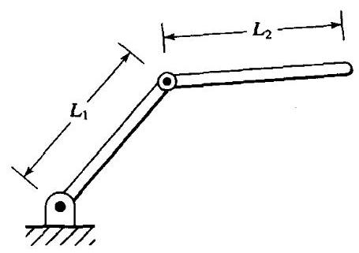

图4-1 连杆长度为 ${l}_{1}$ 和 ${l}_{2}$ 的两连杆操作臂

当一个操作臂少于6自由度时, 它在三维空间内不能达到全部位姿。显然, 图4-1中的平面操作臂不能伸出平面, 因此凡是 $Z$ 坐标不为 0 的目标点均不可达。在很多实际情况中, 具有四个或五个自由度的操作臂能够超出平面操作, 但显然不能达到全部目标点。必须研究这种操作臂以便弄清楚它的工作空间。通常这种机器人的工作空间是一个子空间, 这个空间是由特定的机器人的工作空间确定的。一个值得研究的问题是, 对于少于6 个自由度的操作臂来说, 给定一个确定的一般目标坐标系, 什么是最近的可达目标坐标系?

工作空间也取决于工具坐标系的变换, 因为所讨论的工具端点一般就是我们所说的可达空间点。一般来说, 工具坐标系的变换与操作臂的运动学和逆向运动学无关, 所以一般常去研究腕部坐标系 $\{ W\}$ 的工作空间。对于一个给定的末端执行器,定义工具坐标系 $\{ T\}$ ,给定目标坐标系 $\{ G\}$ ,去计算相应的坐标系 $\{ W\}$ 。接着我们会问: $\{ W\}$ 的期望位姿是否在这个工作空间内? 这里, 我们所研究的工作空间 (从计算的角度出发) 与用户关心的工作空间是有区别的,用户关心的是末端执行器的工作空间 $(\{ T\}$ 坐标系)。

如果腕部坐标系的期望位姿在这个工作空间内, 那么至少存在一个解。

**多重解问题**

在求解运动学方程时可能遇到的另一个问题就是多重解问题。一个具有3个旋转关节的平面操作臂, 由于从任何方位均可到达工作空间内的任何位置, 因此在平面中有较大的灵巧工作空间 (给定适当的连杆长度和大的关节运动范围)。图4-2所示为在某一位姿下带有末端执行器的三连杆平面操作臂。虚线表示第二个可能的位形, 在这个位形下, 末端操作器的可达位姿与第一个位形相同。

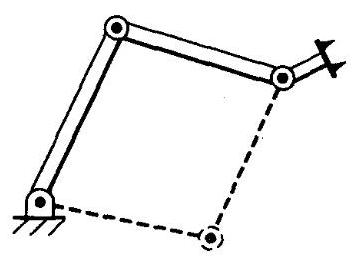

图4-2 三连杆操作臂, 虚线代表第二个解

因为系统最终只能选择一个解, 因此操作臂的多重解现象会产生一些问题。解的选择标准是变化的, 然而比较合理的选择应当是取 “最短行程” 解。例如, 在图4-3中,如果操作臂处于点 $A$ ,我们希望它移动到点 $B$ ,最近解就是使得每一个运动关节的移动量最小。 因此, 在没有障碍的情况下, 可选择图4-3中上部虚线所示的位形, 这表明对于操作臂的当前位置来说只需要对逆运动学程序输入一个小位移量即可。这样, 利用算法能够选择关节空间内的最短行程解。但是, “最短行程”解可能有几种确定方式。例如, 典型的机器人有3个大连杆, 附带3个小连杆, 姿态连杆靠近末端执行器。这样, 在计算 “最短行程”解时需要加权, 使得这种选择侧重于移动小连杆而不是移动大连杆。在存在障碍的情况下，“最短行程”解可能发生干涉，这时只能选择“较长行程”解一为此，一般我们需要计算全部可能的解。这样, 在图4-3中, 障碍的存在意味着需要按照下部虚线所示的位形才能到达 $B$ 点。

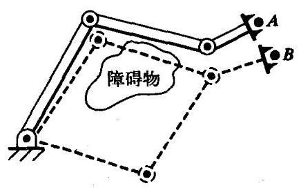

图4-3 到达B点有两个解, 其中一个解会引起干涉

解的个数取决于操作臂的关节数量,它也是连杆参数 (对于旋转关节操作臂来说为 ${\alpha }_{i}$ 、 ${a}_{i}$ 和 ${d}_{i}$ ) 和关节运动范围的函数。例如，PUMA560机器人到达一个确定的目标有8个不同的解， 图4-4所示为其中的4个解, 它们对于手部来说具有相同的位姿。对于图中所示的每一个解, 存在另外一种解, 其中最后三个关节变为另外一种位形, 如下式所示:

$$
{\theta }_{4}^{\prime } = {\theta }_{4} + {180}^{ \circ  }
$$

$$
{\theta }_{5}^{\prime } =  - {\theta }_{5} \tag{4-1}
$$

$$
{\theta }_{6}^{\prime } = {\theta }_{6} + {180}^{ \circ  }
$$

总之, 对于一个操作目标共有8个解。由于关节运动范围的限制, 这8个解中的某些解是不能实现的。

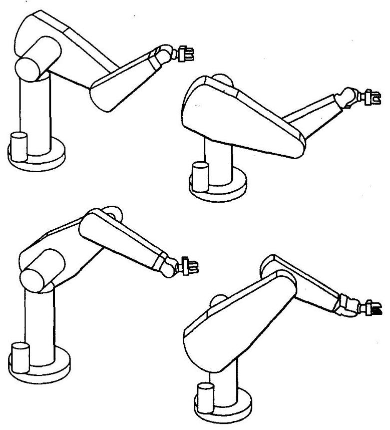

图4-4 PUMA560的4个解

通常, 连杆的非零参数越多, 达到某一特定目标的方式也越多。以一个具有6个旋转关节的操作臂为例,图4-5表明解的最大数目与等于零的连杆长度参数 $\left( {a}_{i}\right)$ 的数目有关。非零参数越多, 解的最大数目就越大。对于一个全部为旋转关节的6自由度操作臂来说, 可能多达 16种解 ${}^{\left\lbrack  1,6\right\rbrack  }$ 。

**解法**

<table><tr><td>${a}_{\mathrm{i}}$</td><td>解的个数</td></tr><tr><td>${a}_{1} = {a}_{3} = {a}_{5} = 0$</td><td>≤4</td></tr><tr><td>${a}_{3} = {a}_{5} = 0$</td><td>≤8</td></tr><tr><td>${a}_{3} = 0$</td><td>≤16</td></tr><tr><td>所有的 ${a}_{\mathrm{i}} \neq  0$</td><td>≤16</td></tr></table>

图4-5 解的个数与非零的 ${a}_{i}$

与线性方程组不同, 非线性方程组没有通用的求解算法。针对解法问题, 最好对已知操作臂“解”的构成形式加以定义。

如果关节变量能够通过一种算法确定, 这种算法可以求出与已知位姿相关的全部关节变量, 那么操作臂便是可解的 ${}^{\left\lbrack  2\right\rbrack  }$ 。

对于多重解情况, 这个定义的核心正是我们所需要的, 因为它可以求得所有的解。因此, 在求解操作臂问题时不必考虑具体的数值迭代过程, 即这些方法并不能保证求出全部的解。

我们把操作臂的全部求解方法分成两大类: 封闭解和数值解法。由于数值解法的迭代性质, 因此它一般要比相应的封闭解法的求解速度慢得多。实际上在大多数情况下, 我们并不喜欢用数值解法求解运动学问题。对运动学方程的数值迭代解法本身已构成一个完整的研究领域(参见[6、11、12])，这已超出本书的范围。

下面主要讨论封闭解法。在本书中，“封闭形式” 意指基于解析形式的解法，或者意指对于不高于四次的多项式不用迭代便可完全求解。可将封闭解的求解方法分为两类: 代数法和几何法。有时它们的区别又并不明显:任何几何方法中都引入了代数描述，因此这两种方法是相似的。这两种方法的区别或许仅是求解过程的不同。

根据可解性的定义, 最近在运动学方面的一个主要研究成果是, 所有包含转动关节和移动关节的串联型6自由度机构均是可解的。但是这种解一般是数值解, 对于6自由度机器人来说, 只有在特殊情况下才有解析解。这种存在解析解(封闭解)的机器人具有如下特性: 存在几个正交关节轴或者有多个 ${\alpha }_{i}$ 为0或 $\pm  {90}^{ \circ  }$ 。一般计算数值解比计算解析解耗时,因此,在设计操作臂时重要的问题是使封闭解存在。在操作臂的设计者发现了这个问题不久, 现在工业操作臂的虚拟设计已使这个问题大大简化, 从而能够得到封闭解。

具有6个旋转关节的操作臂存在封闭解的充分条件是相邻的三个关节轴线相交于一点, 在 4.6 节中对这个条件进行了讨论。当今设计的 6 自由度操作臂几乎都有三根相交轴。例如, PUMA560的4、5、6轴相交。

## 4.3 当 $n < 6$ 时操作臂子空间的描述

对于一个给定的操作臂来说,一系列可达目标坐标系构成了可达工作空间。对于一个 $n$ 自由度操作臂 $\left( {n < 6}\right)$ ，可达工作空间可看成是 $n$ 自由度子空间的一部分。同样，一个6自由度操作臂的工作空间是一个空间的子集, 更简单的操作臂的工作空间是这个子空间的子集。例如, 图4-1中两连杆机器人的子空间是一个平面,其工作空间是该平面的一个子集,即当 ${l}_{1} = {l}_{2}$ 时为一个半径为 ${l}_{1} + {l}_{2}$ 的圆。

确定 $n$ 自由度操作臂子空间的一种方法就是给出腕部坐标系或工具坐标系的表达式,它是含有 $n$ 个变量的函数。如果将这 $n$ 个变量看作自由变量,那么它们所有的可能取值就构成了这个子空间。

例4.1

试描述第3章中图3-6所示三连杆操作臂 ${}_{W}^{B}T$ 的子空间。

已知 ${}_{W}^{B}T$ 的子空间为:

$$
{}_{W}^{B}T = \left\lbrack  \begin{matrix} {c}_{\phi } &  - {s}_{\phi } & {0.0} & x \\  {s}_{\phi } & {c}_{\phi } & {0.0} & y \\  {0.0} & {0.0} & {1.0} & {0.0} \\  0 & 0 & 0 & 1 \end{matrix}\right\rbrack \tag{4-2}
$$

式中, $x, y$ 给出了腕关节的位置, $\phi$ 给出了末端连杆的姿态。当 $x\text{ 、 }y$ 和 $\phi$ 可以取任意值时,就得到了子空间。任何不满足式 (4-2) 的腕部坐标系均在这个操作臂的子空间之外 (从而位于这个工作空间之外)。连杆长度和关节运动范围限定了这个操作臂的工作空间为子空间的一个子集。

**例4.2**

试描述图4-6所示两自由度极坐标操作臂 ${}_{2}^{0}T$ 的子空间。

已知

$$
{}^{0}{P}_{2ORG} = \left\lbrack  \begin{array}{l} x \\  y \\  0 \end{array}\right\rbrack \tag{4-3}
$$

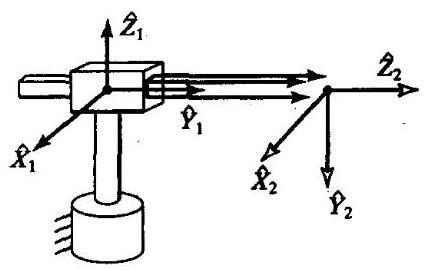

图4-6 两连杆极坐标操作臂

式中, $x$ 和 $y$ 可以取任意值。它的方位则是确定的,因为 ${}^{0}{\widehat{Z}}_{2}$ 轴的方向取决于 $x$ 和 $y$ ,所以它的姿态是受限制的, ${}^{0}{\widehat{Y}}_{2}$ 轴的方向总是向下,而 ${}^{0}{\widehat{X}}_{2}$ 轴的方向可以通过计算叉乘 ${}^{0}{\widehat{Y}}_{2} \times  {}^{0}{\widehat{Z}}_{2}$ 求得。由 $x$ 和 $y$ 有

$$
{}^{0}{\widehat{Z}}_{2} = \left\lbrack  \begin{matrix} \frac{x}{\sqrt{{x}^{2} + {y}^{2}}} \\  \frac{y}{\sqrt{{x}^{2} + {y}^{2}}} \\  0 \end{matrix}\right\rbrack \tag{4-4}
$$

因而, 求得子空间为

$$
{}_{2}^{0}T = \left\lbrack  \begin{matrix} \frac{y}{\sqrt{{x}^{2} + {y}^{2}}} & 0 & \frac{x}{\sqrt{{x}^{2} + {y}^{2}}} & x \\  \frac{-x}{\sqrt{{x}^{2} + {y}^{2}}} & 0 & \frac{y}{\sqrt{{x}^{2} + {y}^{2}}} & y \\  0 &  - 1 & 0 & 0 \\  0 & 0 & 0 & 1 \end{matrix}\right\rbrack \tag{4-5}
$$

为了对具有 $n$ 个自由度操作臂的目标点进行定义,通常采用 $n$ 个参数来确定这个目标点。 也就是说,如果给定的目标点有 6 个自由度,一般自由度 $n < 6$ 的操作臂是无法到达这个目标点的。在这种情况下, 可寻找一个位于操作臂子空间内的可达目标点代替原目标点, 并且和原期望目标点尽可能 “靠近”。

因此, 对于少于6个自由度的操作臂来说, 当确定一般目标点时, 求解方法如下:

1. 已知一般目标坐标系 ${}_{G}^{S}T$ ,计算一个修正的目标坐标系 ${}_{{G}^{\prime }}^{S}T$ ,使得 ${}_{{G}^{\prime }}^{S}T$ 位于操作臂的子空间内，并且和 ${}_{G}^{S}T$ 尽可能 “靠近”。应预先选择一个 “靠近” 标准。

2. 将 ${}_{{G}^{\prime }}^{S}T$ 作为期望目标,计算逆运动学,求关节角。注意,如果目标点不在操纵臂的工作空间内，将可能没有解。

首先确定工具坐标系原点到期望目标点的位置，然后选择一个接近期望姿态的可达姿态。 正如我们在例4.1和4.2中所见的, 子空间的计算取决于操纵臂的几何特征。对每个操纵臂必须单独考虑, 从而得到相应的计算方法。

为了计算关节角使得操作臂能够到达距期望坐标系最近的可达坐标系, 在4.7节中给出了将一个一般目标点投影到五自由度操作臂子空间的例子。

## 4.4 代数解法与几何解法

为了介绍运动学方程的求解方法, 这里用两种不同方法对一个简单的平面三连杆操作臂进行求解。

**代数解法**

以第3章中所介绍的三连杆平面操作臂为例, 它的连杆参数如图4-7所示。

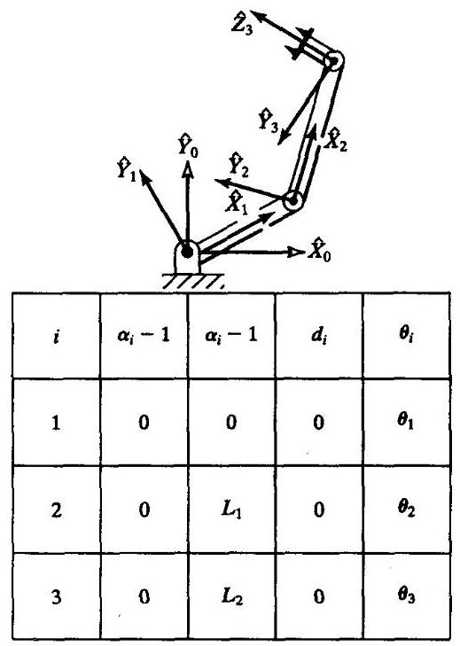

图4-7 平面三连杆操作臂和它的连杆参数

按照第3章中所介绍的方法, 应用这些连杆参数很容易求得这个机械臂的运动学方程:

$$
{}_{W}^{B}T = {}_{3}^{0}T = \left\lbrack  \begin{matrix} {c}_{123} &  - {s}_{123} & {0.0} & {l}_{1}{c}_{1} + {l}_{2}{c}_{12} \\  {s}_{123} & {c}_{123} & {0.0} & {l}_{1}{s}_{1} + {l}_{2}{s}_{12} \\  {0.0} & {0.0} & {1.0} & {0.0} \\  0 & 0 & 0 & 1 \end{matrix}\right\rbrack \tag{4-6}
$$

为了集中讨论逆运动学问题,我们假设腕部坐标系相对于基坐标系的变换,即 ${}_{W}^{B}T$ 已经完成,因此目标点的位置已经确定。由于我们研究的是平面操作臂,因此通过确定三个量 $x, y$ 和 $\phi$ 很容易确定这些目标点的位置,其中 $\phi$ 是连杆3在平面内的方位角 (相对于 $+ \widehat{X}$ 轴)。因此, 最好给出 ${}_{W}^{B}T$ 以确定目标点的位置,假定这个变换矩阵如下

$$
{}_{W}^{B}T = \left\lbrack  \begin{matrix} {c}_{\phi } &  - {s}_{\phi } & {0.0} & x \\  {s}_{\phi } & {c}_{\phi } & {0.0} & y \\  {0.0} & {0.0} & {1.0} & {0.0} \\  0 & 0 & 0 & 1 \end{matrix}\right\rbrack \tag{4-7}
$$

所有可达目标点必须位于式 (4-7) 描述的子空间内。令式 (4-6) 和 (4-7) 相等, 可以求得四个非线性方程,进而求出 ${\theta }_{1}\text{ 、 }{\theta }_{2}$ 和 ${\theta }_{3}$ :

$$
{c}_{\phi } = {c}_{123} \tag{4-8}
$$

$$
{s}_{\phi } = {s}_{123} \tag{4-9}
$$

$$
x = {l}_{1}{c}_{1} + {l}_{2}{c}_{12} \tag{4-10}
$$

$$
y = {l}_{1}{s}_{1} + {l}_{2}{s}_{12} \tag{4-11}
$$

现在用代数方法求解方程 (4-8) $\sim$ (4-11)。将式 (4-10) 和 (4-11) 同时平方,然后相加, 得到

$$
{x}^{2} + {y}^{2} = {l}_{1}^{2} + {l}_{2}^{2} + 2{l}_{1}{l}_{2}{c}_{2} \tag{4-12}
$$

这里利用了

$$
{c}_{12} = {c}_{1}{c}_{2} - {s}_{1}{s}_{2} \tag{4-13}
$$

$$
{s}_{12} = {c}_{1}{s}_{2} + {s}_{1}{c}_{2}
$$

由式 (4-12) 求解 ${c}_{2}$ ,得到:

$$
{c}_{2} = \frac{{x}^{2} + {y}^{2} - {l}_{1}^{2} - {l}_{2}^{2}}{2{l}_{1}{l}_{2}} \tag{4-14}
$$

上式有解的条件是式 (4-14) 右边的值必须在 -1 和1 之间。在这个解法中, 这个约束条件可用来检查解是否存在。如果约束条件不满足, 则操作臂与目标点的距离太远。

假定目标点在工作空间内, ${s}_{2}$ 的表达式为

$$
{s}_{2} =  \pm  \sqrt{1 - {c}_{2}^{2}} \tag{4-15}
$$

最后,应用2幅角反正切公式 ${}^{ \ominus  }$ 计算 ${\theta }_{2}$ ,得

$$
{\theta }_{2} = \mathrm{A}\tan 2\left( {{s}_{2},{c}_{2}}\right) \tag{4-16}
$$

---

$\Theta$ 见2.8节。

---

式 (4-15) 是多解的,可选择“正”解或“负”解确定式 (4-15) 的符号。在确定 ${\theta }_{2}$ 时, 再次应用求解运动学参数的方法, 即常用的先确定期望关节角的正弦和余弦, 然后应用2幅角反正切公式的方法。这样确保得出所有的解, 且所求的角度是在适当的象限里。

求出了 ${\theta }_{2}$ ,可以根据式 (4-10) 和 (4-11) 求出 ${\theta }_{1}$ 。将式 (4-10) 和 (4-11) 写成如下形式

$$
x = {k}_{1}{c}_{1} - {k}_{2}{s}_{1} \tag{4-17}
$$

$$
y = {k}_{1}{s}_{1} + {k}_{2}{c}_{1} \tag{4-18}
$$

式中

$$
{k}_{1} = {l}_{1} + {l}_{2}{c}_{2} \tag{4-19}
$$

$$
{k}_{2} = {l}_{2}{s}_{2}
$$

为了求解这种形式的方程,可进行变量代换,实际上就是改变常数 ${k}_{1}$ 和 ${k}_{2}$ 的形式。

如果

$$
r =  + \sqrt{{k}_{1}^{2} + {k}_{2}^{2}} \tag{4-20}
$$

并且

$$
\gamma  = \mathrm{A}\tan 2\left( {{k}_{2},{k}_{1}}\right)
$$

则

(4-21)

$$
{k}_{1} = r\cos \gamma
$$

$$
{k}_{2} = r\sin \gamma
$$

式 (4-17) 和 (4-18) 可以写成

$$
\frac{x}{r} = \cos \gamma \cos {\theta }_{1} - \sin \gamma \sin {\theta }_{1} \tag{4-22}
$$

$$
\frac{y}{r} = \cos \gamma \sin {\theta }_{1} + \sin \gamma \cos {\theta }_{1} \tag{4-23}
$$

因此

$$
\cos \left( {\gamma  + {\theta }_{1}}\right)  = \frac{x}{r} \tag{4-24}
$$

$$
\sin \left( {\gamma  + {\theta }_{1}}\right)  = \frac{y}{r} \tag{4-25}
$$

利用2幅角反正切公式, 得

$$
\gamma  + {\theta }_{1} = \mathrm{A}\tan 2\left( {\frac{y}{r},\frac{x}{r}}\right)  = \mathrm{A}\tan 2\left( {y, x}\right) \tag{4-26}
$$

从而

$$
{\theta }_{1} = \mathrm{A}\tan 2\left( {y, x}\right)  - \mathrm{A}\tan 2\left( {{k}_{2},{k}_{1}}\right) \tag{4-27}
$$

注意, ${\theta }_{2}$ 符号的选取将导致 ${k}_{2}$ 符号的变化,因此影响到 ${\theta }_{1}$ 。应用式 (4-20) 和 (4-21) 进行变换求解的方法经常出现在求解运动学问题中, 即式 (4-10) 或 (4-11) 的求解方法。同时注意,如果 $x = y = 0$ ,则式 (4-27) 不确定,此时 ${\theta }_{1}$ 可取任意值。

最后,由式 (4-8) 和 (4-9) 能够求出 ${\theta }_{1},{\theta }_{2},{\theta }_{3}$ 的和:

$$
{\theta }_{1} + {\theta }_{2} + {\theta }_{3} = \mathrm{A}\tan 2\left( {{s}_{\phi },{c}_{\phi }}\right)  = \phi \tag{4-28}
$$

由于 ${\theta }_{1}$ 和 ${\theta }_{2}$ 已知,从而可以解出 ${\theta }_{3}$ 。这种两个或两个以上连杆在平面内运动的操作臂是比较典型的问题。在求解过程中给出了关节角和的表达式。

总之, 用代数方法求解运动学方程是求解操作臂的基本方法之一, 在求解方程时, 解的形式已经确定。可以看出, 对于许多常见的几何问题, 经常会出现几种形式的超越方程。在前面的章节中已经遇到了其中的两种形式。更详细的内容在附录C中列出。

**几何解**

在几何方法中, 为求出操作臂的解, 须将操作臂的空间几何参数分解成为平面几何参数。用这种方法在求解许多操作臂时 (特别是当 ${\alpha }_{1} = 0$ 或 $\pm  {90}^{ \circ  }$ 时) 是相当容易的。然后应用平面几何方法可以求出关节角度 ${}^{\left\lbrack  7\right\rbrack  }$ 。对于如图4-7所示的具有3个自由度的操作臂来说, 由于操作臂是平面的, 因此我们可以利用平面几何关系直接求解。

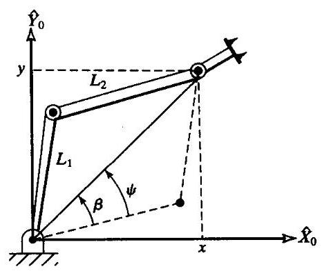

图4-8 平面三连杆机器人的平面几何关系

图4-8中示出了由 ${l}_{1}$ 和 ${l}_{2}$ 所组成的三角形及连接坐标系 $\{ 0\}$ 的原点和坐标系 $\{ 3\}$ 的原点的连线。图中虚线表示该三角形的另一种可能情况, 同样能够达到坐标系 (3) 的位置。对于实线表示的三角形,利用余弦定理求解 ${\theta }_{2}$

$$
{x}^{2} + {y}^{2} = {l}_{1}^{2} + {l}_{2}^{2} - 2{l}_{1}{l}_{2}\cos \left( {{180} + {\theta }_{2}}\right) \tag{4-29}
$$

现在, $\cos \left( {{180} + {\theta }_{2}}\right)  =  - \cos \left( {\theta }_{2}\right)$ ,所以有

$$
{c}_{2} = \frac{{x}^{2} + {y}^{2} - {l}_{1}^{2} - {l}_{2}^{2}}{2{l}_{1}{l}_{2}} \tag{4-30}
$$

为使该三角形成立,到目标点的距离 $\sqrt{{x}^{2} + {y}^{2}}$ 必须小于或等于两个连杆的长度之和 ${l}_{1} + {l}_{2}$ 。可对上述条件进行计算校核证明该解是否存在。当目标点超出操作臂的运动范围时, 这个条件不能满足。假设解存在,那么由该方程所解得的 ${\theta }_{2}$ 应在 $0 \sim   - {180}^{ \circ  }$ 范围内,因为只有这些值能够使图 4-8 中的三角形成立。另一个可能的解 (由虚线所示的三角形) 可以通过对称关系 ${\theta }_{2}^{\prime } =  - {\theta }_{2}$ 得到。

为求解 ${\theta }_{1}$ ,需要建立图 4-8 所示的 $\psi$ 和 $\beta$ 角的表达式。首先, $\beta$ 可以位于任意象限,这是由 $x$ 和 $y$ 的符号决定的。为此,应用2幅角反正切公式:

$$
\beta  = \mathrm{A}\tan 2\left( {y, x}\right) \tag{4-31}
$$

再利用余弦定理解出 $\psi$ :

$$
\cos \psi  = \frac{{x}^{2} + {y}^{2} + {l}_{1}^{2} - {l}_{2}^{2}}{2{l}_{1}\sqrt{{x}^{2} + {y}^{2}}} \tag{4-32}
$$

这里,求反余弦,使 $0 \leq  \psi  \leq  {180}^{ \circ  }$ ,以便使式 (4-32) 的几何关系成立。利用几何法求解时,上述关系是经常要用到的, 因此必须在变量的有效范围内应用这些公式才能保证几何关系成立。那么有

$$
{\theta }_{1} = \beta  \pm  \psi \tag{4-33}
$$

式中,当 ${\theta }_{2} < 0$ 时, ${\theta }_{1}$ 取 “ + ” 号; 当 ${\theta }_{2} > 0$ 时, ${\theta }_{1}$ 取 “ − ”号。

平面内的角度是可以相加的, 因此三个连杆的角度之和即为最后一个连杆的姿态:

$$
{\theta }_{1} + {\theta }_{2} + {\theta }_{3} = \phi \tag{4-34}
$$

由上式求出 ${\theta }_{3}$ 便得到这个操作臂的全部解。

## 4.5 通过化简为多项式的代数解法

超越方程往往很难求解,即使只有一个变量 $\left( {\text{ 如 }\theta }\right)$ ,因为它一般常以 $\sin \theta$ 和 $\cos \theta$ 的形式出现。可进行下列变换,用单一变量 $u$ 来表示:

$$
u = \tan \frac{\theta }{2}
$$

$$
\cos \theta  = \frac{1 - {u}^{2}}{1 + {u}^{2}} \tag{4-35}
$$

$$
\sin \theta  = \frac{2u}{1 + {u}^{2}}
$$

这是在求解运动学方程中经常用到的一种很重要的几何变换方法。这个变换是把超越方程变换成关于 $u$ 的多项式方程。附录A中列出了这些变换关系和一些三角恒等式。

例4.3

将超越方程

$$
a\cos \theta  + b\sin \theta  = c \tag{4-36}
$$

变换成含有半角正切的一次多项式,以求解 $\theta$ 。

采用式 (4-35) 的变换式,将上式乘以 $1 + {u}^{2}$ ,得

$$
a\left( {1 - {u}^{2}}\right)  + {2bu} = c\left( {1 + {u}^{2}}\right) \tag{4-37}
$$

取 $u$ 的幂函数形式为

$$
\left( {a + c}\right) {u}^{2} - {2bu} + \left( {c - a}\right)  = 0 \tag{4-38}
$$

由一元二次方程求解公式解出:

$$
u = \frac{b \pm  \sqrt{{b}^{2} + {a}^{2} - {c}^{2}}}{a + c} \tag{4-39}
$$

因此,

$$
\theta  = 2{\tan }^{-1}\left( \frac{b \pm  \sqrt{{b}^{2} + {a}^{2} - {c}^{2}}}{a + c}\right) \tag{4-40}
$$

由于原来的超越方程可能不存在实根, 因此从式 (4-39) 中解出 $u$ 是很复杂的。注意,如果 $a + c = 0$ ,那么自变量的反正切为无穷大,因此 $\theta  = {180}^{ \circ  }$ 。如果用计算机来计算,应该预先检查分母是否为0。当式 (4-38) 中的二次项被消去后, 那么这个二次方程就简化为线性方程了。

四次多项式便具有封闭形式的解 ${}^{\left\lbrack  8,9\right\rbrack  }$ ，所以用4阶(或低于4阶)的代数方程求解操作臂是相当简单的, 这种操作臂被称为封闭解操作臂。

## 4.6 三轴相交的PIEPER解法

如前所述, 尽管一般具有6个自由度的机器人没有封闭解, 但在某些特殊情况下还是可解的。Pieper ${}^{\left\lbrack  3,4\right\rbrack  }$ 研究了3个相邻的轴相交于一点的6自由度操作臂 ${}^{ \ominus  }$ 。在本节中,我们将介绍 Pieper提出的方法, 这种方法是针对6个关节均为旋转关节、且后面3个轴相交的操作臂。该方法可应用于其他形式的操作臂，包括移动关节，感兴趣的读者可参看文献[4]。Pieper的研究成果主要应用于产品化的工业机器人中。

当最后3根轴相交时，连杆坐标系 $\{ 4\} ,\{ 5\}$ 和 $\{ 6\}$ 原点均位于这个交点上。这点的基坐标如下

$$
{}^{0}{P}_{4ORG} = {}_{1}^{0}{T}_{2}^{1}{T}_{3}^{2}{T}^{3}{P}_{4ORG} = \left\lbrack  \begin{matrix} x \\  y \\  z \\  1 \end{matrix}\right\rbrack \tag{4-41}
$$

即,对于 $i = 4$ ,由式 (3-6) 的第 4 列有

$$
{}^{0}{P}_{4ORG} = {}_{1}^{0}{T}_{2}^{1}{T}_{3}^{2}T\left\lbrack  \begin{matrix} {a}_{3} \\   - {d}_{4}s{\alpha }_{3} \\  {d}_{4}c{\alpha }_{3} \\  1 \end{matrix}\right\rbrack \tag{4-42}
$$

或

$$
{}^{0}{P}_{4ORG} = {}_{1}^{0}{T}_{2}^{1}T\left\lbrack  \begin{matrix} {f}_{1}\left( {\theta }_{3}\right) \\  {f}_{2}\left( {\theta }_{3}\right) \\  {f}_{3}\left( {\theta }_{3}\right) \\  1 \end{matrix}\right\rbrack \tag{4-43}
$$

式中,

$$
\left\lbrack  \begin{array}{l} {f}_{1} \\  {f}_{2} \\  {f}_{3} \\  1 \end{array}\right\rbrack   = {}_{3}^{2}T\left\lbrack  \begin{matrix} {a}_{3} \\   - {d}_{4}s{\alpha }_{3} \\  {d}_{4}c{\alpha }_{3} \\  1 \end{matrix}\right\rbrack \tag{4-44}
$$

在式 (4-44) 中,对于 ${}_{3}^{2}T$ 应用式 (3-6) 得出下列 ${f}_{i}$ 的表达式:

$$
{f}_{1} = {a}_{3}{c}_{3} + {d}_{4}s{\alpha }_{3}{s}_{3} + {a}_{2}
$$

$$
{f}_{2} = {a}_{3}c{\alpha }_{2}{s}_{3} - {d}_{4}s{\alpha }_{3}c{\alpha }_{2}{c}_{3} - {d}_{4}s{\alpha }_{2}c{\alpha }_{3} - {d}_{3}s{\alpha }_{2} \tag{4-45}
$$

$$
{f}_{3} = {a}_{3}s{\alpha }_{2}{s}_{3} - {d}_{4}s{\alpha }_{3}s{\alpha }_{2}{c}_{3} + {d}_{4}c{\alpha }_{2}c{\alpha }_{3} + {d}_{3}c{\alpha }_{2}
$$

---

$\Theta$ 包括具有3个相邻的平行轴的操作臂，可以认为它们的交点在无穷远处。

---

在式 (4-43) 中,对于 ${}_{1}^{0}T$ 和 ${}_{2}^{1}T$ 应用式 (3-6) 得

$$
{}^{0}{P}_{4ORG} = \left\lbrack  \begin{matrix} {c}_{1}{g}_{1} - {s}_{1}{g}_{2} \\  {s}_{1}{g}_{1} + {c}_{1}{g}_{2} \\  {g}_{3} \\  1 \end{matrix}\right\rbrack \tag{4-46}
$$

式中,

$$
{g}_{1} = {c}_{2}{f}_{1} - {s}_{2}{f}_{2} + {a}_{1}
$$

$$
{g}_{2} = {s}_{2}c{\alpha }_{1}{f}_{1} + {c}_{2}c{\alpha }_{1}{f}_{2} - s{\alpha }_{1}{f}_{3} - {d}_{2}s{\alpha }_{1} \tag{4-47}
$$

$$
{g}_{3} = {s}_{2}s{\alpha }_{1}{f}_{1} + {c}_{2}s{\alpha }_{1}{f}_{2} + c{\alpha }_{1}{f}_{3} + {d}_{2}c{\alpha }_{1}
$$

现在写出 ${}^{0}{P}_{4ORG}$ 平方的表达式,这里 $r = {x}^{2} + {y}^{2} + {z}^{2}$ ,从式 (4-46) 可以看出

$$
r = {g}_{1}^{2} + {g}_{2}^{2} + {g}_{3}^{2} \tag{4-48}
$$

所以,对于 ${g}_{i}$ ,由式 (4-47) 得

$$
r = {f}_{1}^{2} + {f}_{2}^{2} + {f}_{3}^{2} + {a}_{1}^{2} + {d}_{2}^{2} + 2{d}_{2}{f}_{3} + 2{a}_{1}\left( {{c}_{2}{f}_{1} - {s}_{2}{f}_{2}}\right) \tag{4-49}
$$

现在，由式 (4-46) 写出 $Z$ 方向分量的方程，那么表示这个系统的两个方程如下:

$$
r = \left( {{k}_{1}{c}_{2} + {k}_{2}{s}_{2}}\right) 2{a}_{1} + {k}_{3} \tag{4-50}
$$

$$
z = \left( {{k}_{1}{s}_{2} - {k}_{2}{c}_{2}}\right) s{\alpha }_{1} + {k}_{4}
$$

式中

$$
{k}_{1} = {f}_{1}
$$

(4-51)

$$
{k}_{2} =  - {f}_{2}
$$

$$
{k}_{3} = {f}_{1}^{2} + {f}_{2}^{2} + {f}_{3}^{2} + {a}_{1}^{2} + {d}_{2}^{2} + 2{d}_{2}{f}_{3}
$$

$$
{k}_{4} = {f}_{3}c{\alpha }_{1} + {d}_{2}c{\alpha }_{1}
$$

方程式 (4-50) 很有用,因为它消去了因变量 ${\theta }_{1}$ ,并且简化了因变量 ${\theta }_{2}$ 的形式。

现在讨论如何由式 (4-50) 求解 ${\theta }_{3}$ ,分三种情况:

1. 若 ${a}_{1} = 0$ ,则 $r = {k}_{3}$ ,这里 $r$ 是已知的。 ${k}_{3}$ 的右边仅是关于 ${\theta }_{3}$ 的函数。代入式 (4-35) 后,由包含 $\tan \frac{{\theta }_{3}}{2}$ 的一元二次方程可以解出 ${\theta }_{3}$ 。

2. 若 $s{\alpha }_{1} = 0$ ，则 $z = {k}_{4}$ ，这里 $z$ 是已知的。再次代入式(4-35)后，利用上面的一元二次方程可以解出 ${\theta }_{3}$ 。

3. 否则,从方程 (4-50) 中消去 ${s}_{2}$ 和 ${c}_{2}$ ,得到

$$
\frac{{\left( r - {k}_{3}\right) }^{2}}{4{a}_{1}^{2}} + \frac{{\left( z - {k}_{4}\right) }^{2}}{{s}^{2}{\alpha }_{1}} = {k}_{1}^{2} + {k}_{2}^{2} \tag{4-52}
$$

代入式 (4-35) 解出 ${\theta }_{3}$ 后,可得到一个四次方程,由此可解出 ${\theta }_{3}{}_{0} \ominus$

解出 ${\theta }_{3}$ 后,就可以根据式 (4-50) 解出 ${\theta }_{2}$ ,再根据式 (4-46) 解出 ${\theta }_{1}$ 。

---

$\Theta$ 这里给出 ${f}_{1}^{2} + {f}_{2}^{2} + {f}_{3}^{2} = {a}_{3}^{2} + {d}_{4}^{2} + {d}_{3}^{2} + {a}_{2}^{2} + 2{d}_{4}{d}_{3}c{\alpha }_{3} + 2{a}_{2}{a}_{3}{c}_{3} + 2{a}_{2}{d}_{4}s{\alpha }_{3}{s}_{3}$ 。

---

为了完成求解工作,还需要求出 ${\theta }_{4}\text{ 、 }{\theta }_{5}\text{ 、 }{\theta }_{6}$ 。由于这些轴相交,故这些关节角只影响最后连杆的方位,我们只需计算指定目标的方向 ${}_{6}^{0}R$ 。在求出 ${\theta }_{1}\text{ 、 }{\theta }_{2}\text{ 、 }{\theta }_{3}$ 后,当 ${\theta }_{4} = 0$ 时,可以由连杆坐标系 $\{ 4\}$ 相对于基坐标系的方位计算出 ${\left. {}_{4}^{0}R\right| }_{{\theta }_{4} = 0}$ 。坐标系 $\{ 6\}$ 的期望方位与连杆坐标系 $\{ 4\}$ 的方位的差别仅在于最后三个关节的作用。由于 ${}_{6}^{0}R$ 已知,因此这个问题可以通过如下计算得出结果

$$
{\left. {}_{6}^{4}R\right| }_{{\theta }_{4} = 0} = {\left. {}_{4}^{0}{R}^{-1}\right| }_{{\theta }_{4} = 0}{}_{6}^{0}R \tag{4-53}
$$

对于大多数操作臂来说,完全可以将第 2 章介绍的Z-Y-Z欧拉角解法应用于 ${\left. {}_{6}^{4}R\right| }_{{\theta }_{4} = 0}$ ,解出最后三个关节角。对于任何一个 $4\text{ 、 }5\text{ 、 }6$ 轴相交的操作臂来说,最后三个关节角能够通过一组合适的欧拉角求出。最后的三个关节通常有两种解, 因此这种操作臂解的总数就是前三个关节解的数量的2倍。

## 4.7 操作臂逆运动学实例

在本节中, 将研究两个工业机器人的逆运动学问题。一种是仅用代数方法求操作臂的解, 第二种是用部分代数方法和部分几何方法求操作臂的解。下面的解法并不是适用于解决所有机器人运动学问题, 但是对于大多数通用操作臂来说, 这些解法是最常用的。注意, 前面提到的Pieper的解法 (在前一节中) 能够适用于这些操作臂, 但在这里我们选择一种不同的方法来求解, 以便对各种有效解法有所了解。

**The Unimation PUMA 560机器人**

作为一个适用于6自由度操作臂的代数解法的例子, 我们对第3章中提出的PUMA 560的运动学方程进行求解。这种解法类似于文献[5]。

当 ${}_{6}^{0}T$ 中的数值已知时,我们希望通过下列方程

$$
{}_{6}^{0}T = \left\lbrack  \begin{matrix} {r}_{11} & {r}_{12} & {r}_{13} & {p}_{x} \\  {r}_{21} & {r}_{22} & {r}_{23} & {p}_{y} \\  {r}_{31} & {r}_{32} & {r}_{33} & {p}_{z} \\  0 & 0 & 0 & 1 \end{matrix}\right\rbrack \tag{4-54}
$$

$$
{ = }_{1}^{0}T{\left( {\theta }_{1}\right) }_{2}^{1}T{\left( {\theta }_{2}\right) }_{3}^{2}T{\left( {\theta }_{3}\right) }_{4}^{3}T{\left( {\theta }_{4}\right) }_{5}^{4}T{\left( {\theta }_{5}\right) }_{6}^{5}T\left( {\theta }_{6}\right)
$$

解出 ${\theta }_{i}$ 。

整理式 (4-54),将含有 ${\theta }_{\mathrm{i}}$ 的部分移到方程的左边

$$
{\left\lbrack  {}_{1}^{0}T\left( {\theta }_{1}\right) \right\rbrack  }^{-1}{}_{6}^{0}T{ = }_{2}^{1}T{\left( {\theta }_{2}\right) }_{3}^{2}T{\left( {\theta }_{3}\right) }_{4}^{3}T{\left( {\theta }_{4}\right) }_{5}^{4}T{\left( {\theta }_{5}\right) }_{6}^{5}T\left( {\theta }_{6}\right) \tag{4-55}
$$

将 ${}_{1}^{0}T$ 转置,将 (4-55) 写成

$$
\left\lbrack  \begin{matrix} {c}_{1} & {s}_{1} & 0 & 0 \\   - {s}_{1} & {c}_{1} & 0 & 0 \\  0 & 0 & 1 & 0 \\  0 & 0 & 0 & 1 \end{matrix}\right\rbrack  \left\lbrack  \begin{matrix} {r}_{11} & {r}_{12} & {r}_{13} & {p}_{x} \\  {r}_{21} & {r}_{22} & {r}_{23} & {p}_{y} \\  {r}_{31} & {r}_{32} & {r}_{33} & {p}_{z} \\  0 & 0 & 0 & 1 \end{matrix}\right\rbrack   = {}_{6}^{1}T \tag{4-56}
$$

式中 ${}_{6}^{1}T$ 由第3章的式 (3-13) 给出。这种在方程两边乘以同一逆变换的技巧经常有助于分离变量求解。

令方程 (4-56) 两边的元素 (2,4) 相等, 得到

$$
- {s}_{1}{p}_{x} + {c}_{1}{p}_{y} = {d}_{3} \tag{4-57}
$$

为求解这种形式的方程, 可进行三角恒等变换

(4-58)

$$
{p}_{x} = \rho \cos \phi
$$

$$
{p}_{y} = \rho \sin \phi
$$

式中

$$
\rho  = \sqrt{{p}_{x}^{2} + {p}_{y}^{2}} \tag{4-59}
$$

$$
\phi  = \mathrm{A}\tan 2\left( {{p}_{y},{p}_{x}}\right)
$$

将式 (4-58) 带入式 (4-57), 得

$$
{c}_{1}{s}_{\phi } - {s}_{1}{c}_{\phi } = \frac{{d}_{3}}{\rho } \tag{4-60}
$$

由差角公式得

$$
\sin \left( {\phi  - {\theta }_{1}}\right)  = \frac{{d}_{3}}{\rho } \tag{4-61}
$$

因此

$$
\cos \left( {\phi  - {\theta }_{1}}\right)  =  \pm  \sqrt{1 - \frac{{d}_{3}^{2}}{{\rho }^{2}}} \tag{4-62}
$$

则

$$
\phi  - {\theta }_{1} = \mathrm{A}\tan 2\left( {\frac{{d}_{3}}{\rho }, \pm  \sqrt{1 - \frac{{d}_{3}^{2}}{{\rho }^{2}}}}\right) \tag{4-63}
$$

最后, ${\theta }_{1}$ 的解可以写为

$$
{\theta }_{1} = \mathrm{A}\tan 2\left( {{p}_{y},{p}_{x}}\right)  - \mathrm{A}\tan 2\left( {{d}_{3}, \pm  \sqrt{{p}_{x}^{2} + {p}_{y}^{2} - {d}_{3}^{2}}}\right) \tag{4-64}
$$

注意到相应于式 (4-64) 的正负号, ${\theta }_{1}$ 可以有两种解。现在, ${\theta }_{1}$ 已知,则式 (4-56) 的左边为已知。如果令式 (4-56) 两边的元素 (1,4) 和元素 (3,4) 分别相等, 得

(4-65)

$$
{c}_{1}{p}_{x} + {s}_{1}{p}_{y} = {a}_{3}{c}_{23} - {d}_{4}{s}_{23} + {a}_{2}{c}_{2}
$$

$$
- {p}_{x} = {a}_{3}{s}_{23} + {d}_{4}{c}_{23} + {a}_{2}{s}_{2}
$$

如果将式(4-65)和式(4-57)平方后相加，得

$$
{a}_{3}{c}_{3} - {d}_{4}{s}_{3} = K \tag{4-66}
$$

式中

$$
K = \frac{{p}_{x}^{2} + {p}_{y}^{2} + {p}_{x}^{2} - {a}_{2}^{2} - {a}_{3}^{2} - {d}_{3}^{2} - {d}_{4}^{2}}{2{a}_{2}} \tag{4-67}
$$

注意, 从式 (4-66) 中已经消去与 ${\theta }_{1}$ 有关的项,于是式 (4-66) 和式 (4-57) 的形式相同, 因此采用同样的三角恒等变换可以得出 ${\theta }_{3}$ 的解:

$$
{\theta }_{3} = \mathrm{A}\tan 2\left( {{a}_{3},{d}_{4}}\right)  - \mathrm{A}\tan 2\left( {K, \pm  \sqrt{{a}_{3}^{2} + {d}_{4}^{2} - {K}^{2}}}\right) \tag{4-68}
$$

式 (4-68) 中的 “ $\pm$ ” 号使得 ${\theta }_{3}$ 有两个不同的解。如果重新整理式 (4-54),使公式左边只有 ${\theta }_{2}$ 和已知的函数

$$
{\left\lbrack  {}_{3}^{0}T\left( {\theta }_{2}\right) \right\rbrack  }^{-{10}}{}_{6}^{0}T{ = }_{4}^{3}T{\left( {\theta }_{4}\right) }_{5}^{4}T{\left( {\theta }_{5}\right) }_{6}^{5}T\left( {\theta }_{6}\right) \tag{4-69}
$$

即

$$
\left\lbrack  \begin{matrix} {c}_{1}{c}_{23} & {s}_{1}{c}_{23} &  - {s}_{23} &  - {a}_{2}{c}_{3} \\   - {c}_{1}{s}_{23} &  - {s}_{1}{s}_{23} &  - {c}_{23} & {a}_{2}{s}_{3} \\   - {s}_{1} & {c}_{1} & 0 &  - {d}_{3} \\  0 & 0 & 0 & 1 \end{matrix}\right\rbrack  \left\lbrack  \begin{matrix} {r}_{11} & {r}_{12} & {r}_{13} & {p}_{x} \\  {r}_{21} & {r}_{22} & {r}_{23} & {p}_{y} \\  {r}_{31} & {r}_{32} & {r}_{33} & {p}_{z} \\  0 & 0 & 0 & 1 \end{matrix}\right\rbrack   = {}_{6}^{3}T \tag{4-70}
$$

式中, ${}_{6}^{3}T$ 由第3章的式 (3-11) 确定。令式 (4-70) 两边的元素 (1,4) 和元素 (2,4) 相等, 得到

$$
{c}_{1}{c}_{23}{p}_{x} + {s}_{1}{c}_{23}{p}_{y} - {s}_{23}{p}_{z} - {a}_{2}{c}_{3} = {a}_{3} \tag{4-71}
$$

$$
- {c}_{1}{s}_{23}{p}_{x} - {s}_{1}{s}_{23}{p}_{y} - {c}_{23}{p}_{z} + {a}_{2}{s}_{3} = {d}_{4}
$$

联立上述两个方程可以解出 ${s}_{23}$ 和 ${c}_{23}$ ,结果为

(4-72)

$$
{s}_{23} = \frac{\left( {-{a}_{3} - {a}_{2}{c}_{3}}\right) {p}_{z} + \left( {{c}_{1}{p}_{x} + {s}_{1}{p}_{y}}\right) \left( {{a}_{2}{s}_{3} - {d}_{4}}\right) }{{p}_{z}^{2} + {\left( {c}_{1}{p}_{x} + {s}_{1}{p}_{y}\right) }^{2}}
$$

$$
{c}_{23} = \frac{\left( {{a}_{2}{s}_{3} - {d}_{4}}\right) {p}_{z} - \left( {{a}_{3} + {a}_{2}{c}_{3}}\right) \left( {{c}_{1}{p}_{x} + {s}_{1}{p}_{y}}\right) }{{p}_{z}^{2} + {\left( {c}_{1}{p}_{x} + {s}_{1}{p}_{y}\right) }^{2}}
$$

上式中分母相等,且为正数,所以可求得 ${\theta }_{2}$ 和 ${\theta }_{3}$ 的和为

(4-73)

$$
{\theta }_{23} = \mathrm{A}\tan 2\left\lbrack  {\left( {-{a}_{3} - {a}_{2}{c}_{3}}\right) {p}_{z} - \left( {{c}_{1}{p}_{x} + {s}_{1}{p}_{y}}\right) \left( {{d}_{4} - {a}_{2}{s}_{3}}\right) }\right.
$$

$$
\left. {\left( {{a}_{2}{s}_{3} - {d}_{4}}\right) {p}_{z} - \left( {{a}_{3} + {a}_{2}{c}_{3}}\right) \left( {{c}_{1}{p}_{x} + {s}_{1}{p}_{y}}\right) }\right\rbrack
$$

根据 ${\theta }_{1}$ 和 ${\theta }_{3}$ 解的四种可能组合,由式 (4-73) 计算 ${\theta }_{23}$ 的 4 个值。然后,计算 ${\theta }_{2}$ 的 4 个可能的解为

$$
{\theta }_{2} = {\theta }_{23} - {\theta }_{3} \tag{4-74}
$$

式中应针对不同的情况适当选取 ${\theta }_{3}$ 。

现在, 式 (4-70) 中左边完全已知, 令式 (4-70) 两边的元素 (1,3) 和元素 (3,3) 分别相等, 得

$$
{r}_{13}{c}_{1}{c}_{23} + {r}_{23}{s}_{1}{c}_{23} - {r}_{33}{s}_{23} =  - {c}_{4}{s}_{5} \tag{4-75}
$$

$$
- {r}_{13}{s}_{1} + {r}_{23}{c}_{1} = {s}_{4}{s}_{5}
$$

只要 ${s}_{5} \neq  0$ ,就可解出 ${\theta }_{4}$

$$
{\theta }_{4} = \mathrm{A}\tan 2\left( {-{r}_{13}{s}_{1} + {r}_{23}{c}_{1}, - {r}_{13}{c}_{1}{c}_{23} - {r}_{23}{s}_{1}{c}_{23} + {r}_{33}{s}_{23}}\right) \tag{4-76}
$$

当 ${\theta }_{s} = 0$ 时，操作臂处于奇异位形，此时关节轴4和关节轴6成一条直线，机器人末端连杆的运动只有一种。在这种情况下,所有结果(所有可能的解)都是 ${\theta }_{4}$ 和 ${\theta }_{6}$ 的和或差。这种情况可以通过检查式 (4-76) 中Atan2的两个变量是否都趋近于零来判断。如果都趋近于零,则 ${\theta }_{4}$ 可以任意选取 ${}^{ \ominus  }$ ,之后计算 ${\theta }_{6}$ 时,可以参照 ${\theta }_{4}$ 进行选取。

改写式 (4-54),使公式左边均为已知的函数和 ${\theta }_{4}$ ,即

$$
{\left\lbrack  {}_{4}^{0}T\left( {\theta }_{4}\right) \right\rbrack  }^{-{10}}{}_{6}^{0}T = {}_{5}^{4}T{\left( {\theta }_{5}\right) }_{6}^{5}T\left( {\theta }_{6}\right) \tag{4-77}
$$

式中, ${\left\lbrack  {}_{4}^{0}T\left( {\theta }_{4}\right) \right\rbrack  }^{-1}$ 由下式给出

$$
\left\lbrack  \begin{matrix} {c}_{1}{c}_{23}{c}_{4} + {s}_{1}{s}_{4} & {s}_{1}{c}_{23}{c}_{4} - {c}_{1}{s}_{4} &  - {s}_{23}{c}_{4} &  - {a}_{2}{c}_{3}{c}_{4} + {d}_{3}{s}_{4} - {a}_{3}{c}_{4} \\   - {c}_{1}{c}_{23}{s}_{4} + {s}_{1}{c}_{4} &  - {s}_{1}{c}_{23}{s}_{4} - {c}_{1}{c}_{4} & {s}_{23}{s}_{4} & {a}_{2}{c}_{3}{s}_{4} + {d}_{3}{c}_{4} + {a}_{3}{s}_{4} \\   - {c}_{1}{s}_{23} &  - {s}_{1}{s}_{23} &  - {c}_{23} & {a}_{2}{s}_{3} - {d}_{4} \\  0 & 0 & 0 & 1 \end{matrix}\right\rbrack \tag{4-78}
$$

并且 ${}_{6}^{4}T$ 由第3章中的式 (3-10) 给出。令式 (4-77) 两边的元素 (1,3) 和元素 (3,3) 分别相等, 得

$$
{r}_{13}\left( {{c}_{1}{c}_{23}{c}_{4} + {s}_{1}{s}_{4}}\right)  + {r}_{23}\left( {{s}_{1}{c}_{23}{c}_{4} - {c}_{1}{s}_{4}}\right)  - {r}_{33}\left( {{s}_{23}{c}_{4}}\right)  =  - {s}_{5} \tag{4-79}
$$

$$
{r}_{13}\left( {-{c}_{1}{s}_{23}}\right)  + {r}_{23}\left( {-{s}_{1}{s}_{23}}\right)  + {r}_{33}\left( {-{c}_{23}}\right)  = {c}_{5}
$$

由此可以求出 ${\theta }_{5}$

$$
{\theta }_{5} = \mathrm{A}\tan 2\left( {{s}_{5},{c}_{5}}\right) \tag{4-80}
$$

式中, ${s}_{5}$ 和 ${c}_{5}$ 由式 (4-79) 给出。

再次应用上述方法,可以计算出 ${\left( {}_{5}^{0}T\right) }^{-1}$ ,并将式 (4-54) 写为如下形式

$$
{\left( {}_{5}^{0}T\right) }^{-{10}}{}_{6}^{0}T = {}_{6}^{5}T\left( {\theta }_{6}\right) \tag{4-81}
$$

如前所述, 令式 (4-77) 两边的元素 (1,1) 和元素 (3,1) 分别相等, 得

$$
{\theta }_{6} = \mathrm{A}\tan 2\left( {{s}_{6},{c}_{6}}\right) \tag{4-82}
$$

式中

$$
{s}_{6} =  - {r}_{11}\left( {{c}_{1}{c}_{23}{s}_{4} - {s}_{1}{c}_{4}}\right)  - {r}_{21}\left( {{s}_{1}{c}_{23}{s}_{4} + {c}_{1}{c}_{4}}\right)  + {r}_{31}\left( {{s}_{23}{s}_{4}}\right)
$$

$$
{c}_{6} = {r}_{11}\left\lbrack  {\left( {{c}_{1}{c}_{23}{c}_{4} + {s}_{1}{s}_{4}}\right) {c}_{5} - {c}_{1}{s}_{23}{s}_{5}}\right\rbrack   + {r}_{21}\left\lbrack  {\left( {{s}_{1}{c}_{23}{c}_{4} - {c}_{1}{s}_{4}}\right) {c}_{5} - {s}_{1}{s}_{23}{s}_{5}}\right\rbrack
$$

$$
- {r}_{31}\left( {{s}_{23}{c}_{4}{c}_{5} + {c}_{23}{s}_{5}}\right)
$$

由于在式 (4-64) 和 (4-68) 中出现了 $\pm$ 号,因此这些方程可能有 4 种解。另外,由于操作臂腕关节“翻转”可得到另外4个解。对于以上计算出的4种解, 由腕关节的“翻转”可得到

$$
{\theta }_{4}^{\prime } = {\theta }_{4} + {180}^{ \circ  }
$$

$$
{\theta }_{5}^{\prime } =  - {\theta }_{5} \tag{4-83}
$$

$$
{\theta }_{6}^{\prime } = {\theta }_{6} + {180}^{ \circ  }
$$

当计算出所有 8 种答案以后, 由于关节运动范围的限制要将其中的一些解 (甚至全部) 舍去。 在余下的有效解中, 通常选取一个最接近于当前操作臂的解。

---

$\Theta$ 通常取关节4的当前值。

---

**Yasukawa Motoman L-3型机器人**

由第3章中第二个例子, 这里将要求解Yasukawa Motoman L-3型机器人的运动学方程。这个解将由部分代数解以及部分几何解组成。Motoman L-3有三个特征使它的逆运动学特性不同于PUMA机器人。第一, 由于这种操作臂只有五个关节, 因此它的末端执行器的位姿不能保证到达一般目标坐标系。第二, 这种四杆机构以及链传动方式使得一个驱动器需要同时驱动两个甚至更多个关节。第三, 驱动器的运动范围不是常数, 而是取决于其他驱动器的位置, 因此判断一组驱动器运动是否在某一范围内是没有意义的。

如果考虑Motoman操作臂子空间的特性 (同样适用于许多具有5个自由度的操作臂), 可以很快看到这个子空间可以通过一个可达方位的约束来描述。工具端的指向 ( ${\widehat{Z}}_{T}$ 轴) 必须位于 “操作臂的平面内”, 该面是一个包含关节1的轴线以及轴4 和轴5交点的垂直面。以最小旋转量改变工具端的指向从而获得离一般方位最近的方位, 该方位位于上述平面内。 不需要给出这个子空间的显函数方程, 而只需要建立一种将一般目标坐标系投影到这个子空间的方法。注意, 对于这种情况的讨论仅是由于腕部坐标系和工具坐标系沿 ${\widehat{Z}}_{w}$ 的平移不同。

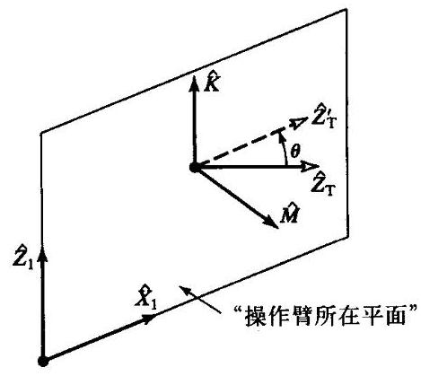

图4-9 将目标坐标系旋转到Motoman 操作臂的子空间

图4-9中所示为操作臂平面的法向 $\widehat{M}$ 以及工具端的期望指向 ${\widehat{Z}}_{T}$ 。为了在这个平面内产生一个新的指向 ${\widehat{Z}}_{T}$ ,该指向必须绕某一矢量 $\widehat{K}$ 旋转 $\theta$ 角。显然,使 $\theta$ 最小的 $\widehat{K}$ 位于这个平面内,同时与 ${\widehat{Z}}_{T}$ 和 ${\widehat{Z}}_{T}^{\prime }$ 正交。

对于任何给定的目标坐标系, $\widehat{M}$ 的定义如下

$$
\widehat{M} = \frac{1}{\sqrt{{p}_{x}^{2} + {p}_{y}^{2}}}\left\lbrack  \begin{matrix}  - {p}_{y} \\  {p}_{x} \\  0 \end{matrix}\right\rbrack \tag{4-84}
$$

式中, ${p}_{x}$ 和 ${p}_{y}$ 是期望工具端位置的 $x$ 和 $y$ 坐标,则 $K$ 由下式给出

$$
\mathbf{K} = \widehat{\mathbf{M}} \times  {\widehat{\mathbf{Z}}}_{T} \tag{4-85}
$$

新的 ${\widehat{Z}}_{T}^{\prime }$ 为

$$
{\widehat{Z}}_{T}^{\prime } = \widehat{K} \times  \widehat{M} \tag{4-86}
$$

$\theta$ 的旋转量为

$$
\cos \theta  = {\widehat{Z}}_{T} \cdot  {\widehat{Z}}_{T}^{\prime } \tag{4-87}
$$

$$
\sin \theta  = \left( {{\widehat{Z}}_{T} \times  {\widehat{Z}}_{T}^{\prime }}\right)  \cdot  \widehat{K}
$$

应用Rodrique公式 (参见习题2.20), 有

$$
{\widehat{Y}}_{T}^{\prime } = {c\theta }{\widehat{Y}}_{T} + {s\theta }\left( {\widehat{K} \times  {\widehat{Y}}_{T}}\right)  + \left( {1 - {c\theta }}\right) \left( {\widehat{K} \cdot  {\widehat{Y}}_{T}}\right) \widehat{K} \tag{4-88}
$$

最后可以计算出工具端新的旋转矩阵中其余的未知列

$$
{\widehat{X}}_{T}^{\prime } = {\widehat{Y}}_{T}^{\prime } \times  {\widehat{Z}}_{T}^{\prime } \tag{4-89}
$$

式 (4-84) ~ (4-89) 描述了一种将已知的一般目标方位投影到Motoman机器人子空间的方法。

假定已知腕部坐标系 ${}_{W}^{B}T$ 在操作臂的子空间内,我们按照下述方法求解运动学方程。在求解Motoman L-3运动学方程时, 可以构造连杆变换矩阵的乘积:

$$
{}_{5}^{0}T = {}_{1}^{0}{T}_{2}^{1}{T}_{3}^{2}{T}_{4}^{3}{T}_{5}^{4}T \tag{4-90}
$$

如果令

$$
{}_{5}^{0}T = \left\lbrack  \begin{matrix} {r}_{11} & {r}_{12} & {r}_{13} & {p}_{x} \\  {r}_{21} & {r}_{22} & {r}_{23} & {p}_{y} \\  {r}_{31} & {r}_{32} & {r}_{33} & {p}_{z} \\  0 & 0 & 0 & 1 \end{matrix}\right\rbrack \tag{4-91}
$$

式 (4-90) 两边同时前乘 ${}_{1}^{0}{T}^{-1}$ ,得到

$$
{}_{1}^{0}{T}^{-1}{}_{5}^{0}T = {}_{2}^{1}{T}^{2}{T}_{4}^{3}{T}_{5}^{4}T \tag{4-92}
$$

式中左边为

$$
\left\lbrack  \begin{matrix} {c}_{1}{r}_{11} + {s}_{1}{r}_{21} & {c}_{1}{r}_{12} + {s}_{1}{r}_{22} & {c}_{1}{r}_{13} + {s}_{1}{r}_{23} & {c}_{1}{p}_{x} + {s}_{1}{p}_{y} \\   - {r}_{31} &  - {r}_{32} &  - {r}_{33} &  - {p}_{z} \\   - {s}_{1}{r}_{11} + {c}_{1}{r}_{21} &  - {s}_{1}{r}_{12} + {c}_{1}{r}_{22} &  - {s}_{1}{r}_{13} + {c}_{1}{r}_{23} &  - {s}_{1}{p}_{x} + {c}_{1}{p}_{y} \\  0 & 0 & 0 & 1 \end{matrix}\right\rbrack \tag{4-93}
$$

右边为

$$
\left\lbrack  \begin{matrix}  * &  * & {s}_{234} &  * \\   * &  * &  - {c}_{234} &  * \\  {s}_{5} & {c}_{5} & 0 & 0 \\  0 & 0 & 0 & 1 \end{matrix}\right\rbrack \tag{4-94}
$$

式 (4-94) 中一些元素并没有给出。令方程两边的元素 (3,4) 相等, 得

$$
- {s}_{1}{p}_{x} + {c}_{1}{p}_{y} = 0 \tag{4-95}
$$

由此求得 ${}^{ \ominus  }$

$$
{\theta }_{1} = \mathrm{A}\tan 2\left( {{p}_{y},{p}_{x}}\right) \tag{4-96}
$$

令元素 $\left( {3,1}\right)$ 和 $\left( {3,2}\right)$ 相等，得

(4-97)

$$
{s}_{5} =  - {s}_{1}{r}_{11} + {c}_{1}{r}_{21}
$$

$$
{c}_{5} =  - {s}_{1}{r}_{12} + {c}_{1}{r}_{22}
$$

由上式计算 ${\theta }_{5}$ 得

$$
{\theta }_{5} = \mathrm{A}\tan 2\left( {{r}_{21}{c}_{1} - {r}_{11}{s}_{1},{r}_{22}{c}_{1} - {r}_{12}{s}_{1}}\right) \tag{4-98}
$$

---

$\Theta$ 对于这种操作臂，第二个解受到关节运动范围的限制，因此可不必计算。

---

令元素 $\left( {2,3}\right)$ 和 $\left( {1,3}\right)$ 相等,得

(4-99)

$$
{c}_{234} = {r}_{33}
$$

$$
{s}_{234} = {c}_{1}{r}_{13} + {s}_{1}{r}_{23}
$$

由此得

$$
{\theta }_{234} = \mathrm{A}\tan 2\left( {{r}_{13}{c}_{1} + {r}_{23}{s}_{1},{r}_{33}}\right) \tag{4-100}
$$

为了分别解出 ${\theta }_{2},{\theta }_{3}$ 和 ${\theta }_{4}$ ,可应用几何方法。图4-10所示为操作臂平面内关节轴之处的点 $A$ 、关节轴3处的点 $B$ 和关节轴4处的点 $C$ 。

对于三角形 ${ABC}$ 应用余弦定理,有

$$
\cos {\theta }_{3} = \frac{{p}_{x}^{2} + {p}_{y}^{2} + {p}_{z}^{2} - {l}_{2}^{2} - {l}_{3}^{2}}{2{l}_{2}{l}_{3}} \tag{4-101}
$$

则有 ${}^{ \ominus  }$

$$
{\theta }_{3} = \mathrm{A}\tan 2\left( {\sqrt{1 - {\cos }^{2}}{\theta }_{3},\cos {\theta }_{3}}\right) \tag{4-102}
$$

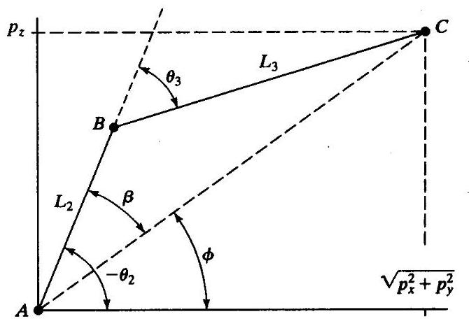

图4-10 平面内的Motoman操作臂

从图 4-10 可以看出 ${\theta }_{2} =  - \phi  - \beta$ ,即

$$
{\theta }_{2} =  - \mathrm{A}\tan 2\left( {{p}_{z},\sqrt{{p}_{x}^{2} + {p}_{y}^{2}}}\right)  - \mathrm{A}\tan 2\left( {{l}_{3}\sin {\theta }_{3},{l}_{2} + {l}_{3}\cos {\theta }_{3}}\right) \tag{4-103}
$$

最终得到

$$
{\theta }_{4} = {\theta }_{234} - {\theta }_{2} - {\theta }_{3} \tag{4-104}
$$

关节角度已经求出, 还须进一步计算求出驱动器参数。参见3.7节, 通过求解式 (3-16) 得出驱动器参数 ${A}_{i}$ :

$$
{A}_{1} = \frac{1}{{k}_{1}}\left( {{\theta }_{1} - {\lambda }_{1}}\right)
$$

$$
{A}_{2} = \frac{1}{{k}_{2}}\left( {\sqrt{-2{\alpha }_{2}{\beta }_{2}\cos \left( {{\theta }_{2} - {\Omega }_{2} - {\tan }^{-1}\left( \frac{{\phi }_{2}}{{\gamma }_{2}}\right)  + {270}^{ \circ  }}\right)  + {\alpha }_{2}^{2} + {\beta }_{2}^{2}} - {\lambda }_{2}}\right)
$$

$$
{A}_{3} = \frac{1}{{k}_{3}}\left( {\sqrt{-2{\alpha }_{3}{\beta }_{3}\cos \left( {{\theta }_{2} + {\theta }_{3} - {\tan }^{-1}\left( \frac{{\phi }_{3}}{{\gamma }_{3}}\right)  + {90}^{ \circ  }}\right)  + {\alpha }_{3}^{2} + {\beta }_{3}^{2}} - {\lambda }_{3}}\right) \tag{4-105}
$$

$$
{A}_{4} = \frac{1}{{k}_{4}}\left( {{180}^{ \circ  } + {\lambda }_{4} - {\theta }_{2} - {\theta }_{3} - {\theta }_{4}}\right)
$$

$$
{A}_{5} = \frac{1}{{k}_{5}}\left( {{\lambda }_{5} - {\theta }_{5}}\right)
$$

---

$\Theta$ 对于这种操作臂，第二个解受到关节运动范围的限制，因此可不必计算。

---

因为驱动器运动范围已被限定, 因此必须检查计算出的结果是否在这个范围之内。事实上, “这个范围” 的检查是复杂的。由于机构布局使得驱动器之间相互作用, 彼此的运动范围相互影响。对于Motoman机器人, 驱动器2和3相互作用而且始终要满足下列关系:

$$
{A}_{2} - {10000} > {A}_{3} > {A}_{2} + {3000} \tag{4-106}
$$

即驱动器3的运动范围是驱动器2位置的函数, 同样,

$$
{32000} - {A}_{4} < {A}_{5} < {55000} \tag{4-107}
$$

现在，关节5转1圈相当于驱动器码盘的25600个计数脉冲，因此当 ${A}_{4} > {2600}$ 时， ${A}_{5}$ 有两个可能的解。这是Yasukawa Motoman L-3机器人唯一可能产生大于一个解的情况。

## 4.8 标准坐标系

求解关节角度的能力实际上是许多机器人控制系统的核心问题。再次参考图4-11所示的标准坐标系的范例。

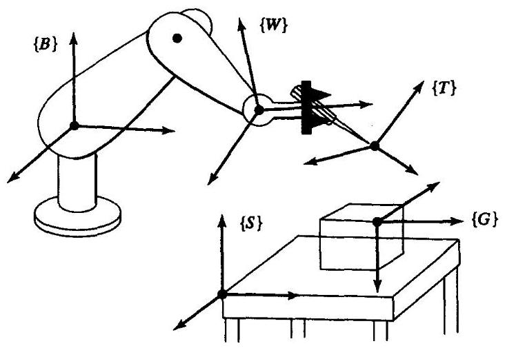

图4-11 “标准” 坐标系的位置

在一般的机器人系统中, 我们按照如下方法应用这些坐标系:

1. 由用户确定系统中工作台坐标系的位置, 这个坐标系可能在工作台的角点上, 如图 4-12所示,或者附于一个移动的传送带上。工作台坐标系 $\{ S\}$ 是相对于基坐标系 $\{ B\}$ 定义的。

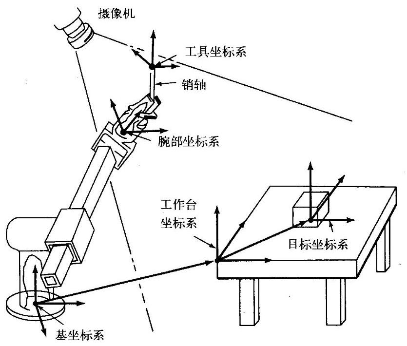

图4-12 工作台示例

2. 用户通过规定坐标系 $\{ T\}$ 给出机器人所用工具的描述。对于每种末端执行器，机器人抓持的每一种工具都应当有一个相应的工具坐标系 $\{ T\}$ 。注意,以不同的方式抓持相同的工具, 工具坐标系 $\{ T\}$ 的定义是不同的。工具坐标系 $\{ T\}$ 是相对于腕部坐标系 $\{ W\}$ 定义的,即 ${}_{T}^{W}T$ 。

3. 用户通过给定目标坐标系 $\{ G\}$ 相对于工作台坐标系的描述来指定机器人运动的目标点。 对于机器人的某些运动, $\{ T\}$ 和 $\{ S\}$ 的定义经常保持不变。在这种情况下,一旦它们被定义, 用户仅需给出一系列 $\{ G\}$ 的规定。在许多系统中,工具坐标系的定义 $\left( {{}_{T}^{W}T}\right)$ 是一个常量 (比如, 由两指端中心的原点来定义)。工作台坐标系可以被固定, 也可以由用户通过机器人简单示教。 在这些系统中, 并不需要用户搞清楚这五种标准坐标系——他 (她) 只需要相对于由工作台坐标系确定的工作区域, 移动工具到指定的位置 (目标)。

4. 机器人系统需要计算一系列关节角度使关节依次运动, 工具坐标系从初始位置以连续方式运动,直到 $\{ T\}  = \{ G\}$ 时运动结束。

## 4.9 操作臂求解

SOLVE函数可进行笛卡儿变换, 称为逆运动学函数。这个逆运动学是广义的, 使得工具坐标系和工作台坐标系的定义可以应用于基本逆运动学, 从而可以求解相对于基坐标系的腕部坐标系。

给定的目标坐标系 ${}_{T}^{S}T$ , SOLVE应用工具坐标系和工作台坐标系的定义来计算 $\{ W\}$ 相对于 $\{ B\}$ 的位置 ${}_{W}^{B}T$ :

$$
{}_{W}^{B}T = {}_{S}^{B}{T}_{T}^{S}{T}_{T}^{W}{T}^{-1} \tag{4-108}
$$

然后,逆运动学将 ${}_{W}^{B}T$ 作为输入,计算 ${\theta }_{1}$ 到 ${\theta }_{n}$ 。

## 4.10 重复精度和定位精度

现今许多工业机器人能够运动到示教的目标点。示教点是操作臂运动实际达到的点，然后关节位置传感器读取关节角并存储。当命令机器人返回这个空间点时, 每个关节都移动到已存储的关节角的位置。在这样简单的 “示教和再现” 的操作臂中, 不存在逆运动学问题, 因为没有在笛卡儿坐标系里指定目标点。当制造商在确定操作臂返回示教点的精度时, 就是在确定操作臂的重复精度。

一个目标的位姿一般都是通过笛卡儿坐标确定的, 计算逆运动学问题是为了求出关节角。 对于可将目标位置描述为笛卡儿坐标的系统, 它可以将操作臂移动到工作空间中一个从未示教过的点, 这些点或许以前从未达到过, 我们称这些点为计算点。对许多操作臂作业来说这种能力是必须的。比如, 如果用计算机视觉系统确定机器人必须抓持的某一部分, 那么机器人必须能够移动到视觉传感器指定的笛卡儿坐标。到达这个计算点的精度就被称作为操作臂的定位精度。

操作臂的定位精度受到重复精度的影响。显然, 定位精度受到机器人运动学方程中参数精度的影响。Denavit-Hartenberg参数中的误差将会引起逆运动学方程中关节角的计算误差。因此， 尽管绝大多数工业机器人的重复精度非常好, 但是操作臂之间的定位精度通常相当差, 并且变化相当大。标定技术能够通过对操作臂运动学参数的估计提高操作臂的定位精度 ${}^{\left\lbrack  {10}\right\rbrack  }$ 。

## 4.11 计算问题

在许多路径控制方法中 (这将在第7章中进行讨论), 需要以相当高的速率计算操作臂的逆运动学问题，比如 ${30}\mathrm{\;{Hz}}$ ，甚至更快。因此，计算效率是一个重要问题。对于计算速度的要求不包括数值解法的影响 (实际上是迭代算法), 因此, 在此对这个问题不做讨论。

3.10 节的主要内容是讨论正运动学问题, 但也适用于逆运动学问题。对于逆运动学问题, 一个关于Atan2的查表法子程序经常被用于获得更高的速度。

多解的计算结构也十分重要。并行计算所有的解通常效率是相当高的, 而不是依次顺序计算。当然在某些应用中, 并不需要所有的结果, 因此只计算需要的结果可以节省实际的计算时间。

当用几何方法求逆运动学解时, 有时可以通过一些简单运算, 计算各种角度以求得第一个解, 从而对多解问题进行计算, 即第一个解的计算是相当费时的, 但是通过计算角度的和或差以及加减π等方法可以很快求得其余的解。

**参考文献**

[1] B. Roth, J. Rastegar, and V. Scheinman, "On the Design of Computer Controlled Manipulators," On the Theory and Practice of Robots and Manipulators, Vol. 1, First CISM-IFToMM Symposium, September 1973, pp. 93-113.

[2] B. Roth, "Performance Evaluation of Manipulators from a Kinematic Viewpoint," Performance Evaluation of Manipulators, National Bureau of Standards, special publication, 1975.

[3] D. Pieper and B. Roth, "The Kinematics of Manipulators Under Computer Control," Proceedings of the Second International Congress on Theory of Machines and Mechanisms, Vol. 2, Zakopane, Poland, 1969, pp. 159-169.

[4] D. Pieper, "The Kinematics of Manipulators Under Computer Control," Unpublished Ph.D. Thesis, Stanford University, 1968.

[5] R.P. Paul, B. Shimano, and G. Mayer, "Kinematic Control Equations for Simple Manipulators," IEEE Transactions on Systems, Man, and Cybernetics, Vol. SMC-11, No. 6, 1981.

[6] L. Tsai and A. Morgan, "Solving the Kinematics of the Most General Six- and Five-degree-of-freedom Manipulators by Continuation Methods," Paper 84-DET-20, ASME Mechanisms Conference, Boston, October 7-10, 1984.

[7] C.S.G. Lee and M. Ziegler, "Geometric Approach in Solving Inverse Kinematics of PUMA Robots," IEEE Transactions on Aerospace and Electronic Systems, Vol. AES-20, No. 6, November 1984.

[8] W. Beyer, CRC Standard Mathematical Tables, 25th edition, CRC Press, Inc., Boca Raton, FL, 1980.

[9] R. Burington, Handbook of Mathematical Tables and Formulas, 5th edition, McGraw-Hill, New York, 1973.

[10] J. Hollerbach, "A Survey of Kinematic Calibration," in The Robotics Review, O. Khatib, J. Craig, and T. Lozano-Perez, Editors, MIT Press, Cambridge, MA, 1989.

[11] Y. Nakamura and H. Hanafusa, "Inverse Kinematic Solutions with Singularity Robustness for Robot Manipulator Control," ASME Journal of Dynamic Systems, Measurement, and Control, Vol. 108, 1986.

[12] D. Baker and C. Wampler, "On the Inverse Kinematics of Redundant Manipulators," International Journal of Robotics Research, Vol. 7, No. 2, 1988.

[13] L.W. Tsai, Robot Analysis: The Mechanics of Serial and Parallel Manipulators, Wiley, New York, 1999.

**习题**

4.1 [15]绘制第3章中习题3.3的三连杆操作臂指端工作空间的简图。已知 ${l}_{1} = {15.0},{l}_{2} = {10.0}$ 和 ${l}_{3} = {3.0}$ 。

4.2 [26]推导第3章习题3.3的三连杆操作臂的逆运动学方程。

4.3 [12]绘制第3章习题3.4中3自由度操作臂指端工作空间的简图。

4.4 [24]推导第3章习题3.4的3自由度操作臂的逆运动学方程。

4.5 [38]编写一个Pascal(或者C)子程序，用来计算PUMA 560操作臂在如下关节范围内的所有可能解。

$$
- {170.0} < {\theta }_{1} < {170.0}
$$

$$
- {225.0} < {\theta }_{2} < {45.0}
$$

$$
- {250.0} < {\theta }_{3} < {75.0}
$$

$$
- {135.0} < {\theta }_{4} < {135.0}
$$

$$
- {100.0} < {\theta }_{5} < {100.0}
$$

$$
- {180.0} < {\theta }_{6} < {180.0}
$$

将这些数值 (英寸) 代入 4.7 节的方程中。

$$
{a}_{2} = {17.0}
$$

$$
{a}_{3} = {0.8}
$$

$$
{d}_{3} = {4.9}
$$

$$
{d}_{4} = {17.0}
$$

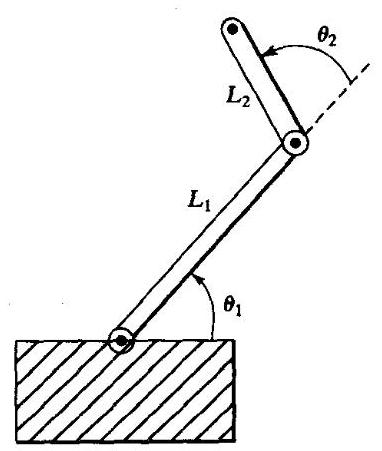

图4-13 两连杆平面操作臂

4.6 [15] 编写一个简单的算法, 从一组可能的解中选择出最短行程的解。

4.7 [10]编制一个表，列出可能影响操作臂重复精度的因素。 编制第二个表，列出影响操作臂定位精度的附加因素。

4.8 [12]已知一个三连杆平面旋转关节操作臂手部的期望位姿, 有两个可能的解。如果再加入一个旋转关节 (在这种情况下操作臂仍然处于同一平面), 将会有多少个解?

4.9 [26]图4-13所示为一个具有旋转关节的两连杆平面操作臂, 对于这个操作臂, 第二个连杆长度为第一个连杆长度的一半,即 ${l}_{1} = 2{l}_{2}$ 。关节的运动范围(单位为角度)为

$$
0 < {\theta }_{1} < {180}
$$

$$
- {90} < {\theta }_{2} < {180}
$$

绘出第二个连杆端部近似可达工作空间 (范围) 的简图。

4.10 [23]推导第3章习题3.4中操作臂的子空间表达式。

4.11 [24]一个2自由度工作台用于弧焊工件的定向。工作台支座 (连杆2) 相对于基座 (连杆0) 的正运动学变换为

$$
{}_{2}^{0}T = \left\lbrack  \begin{matrix} {c}_{1}{c}_{2} &  - {c}_{1}{s}_{2} & {s}_{1} & {l}_{2}{s}_{1} + {l}_{1} \\  {s}_{2} & {c}_{2} & 0 & 0 \\   - {s}_{1}{c}_{2} & {s}_{1}{s}_{2} & {c}_{1} & {l}_{2}{c}_{1} + {h}_{1} \\  0 & 0 & 0 & 1 \end{matrix}\right\rbrack
$$

已知固连于支座 (连杆2) 上的坐标系的单位方向为 ${}^{2}\widehat{V}$ ,求 ${\theta }_{1}$ 的逆运动学解, ${\theta }_{2}$ 的矢量沿 ${}^{0}\widehat{Z}$ 方向 (即向上的),存在多解吗? 如果不能得出唯一解,存在奇异条件吗?

4.12 [22] 图4-14所示的两个3R机构。在两种情况下, 三个轴都相交于一点 (在所有位形中, 交点在空间固定不变)。图4-14(a)所示的连杆转角 ${\alpha }_{i} = {90}^{ \circ  }$ ,图4-14(b)所示的连杆转角 ${\alpha }_{1} = \phi ,{\alpha }_{2} = {180}^{ \circ  } - \phi$ 。

可以看出Z-Y-Z的欧拉角适合于图4-14(a)所示的机构, 因此连杆3的方向相对于连杆0的方向是任意的 (图中箭头所示)。因为 $\phi  = {90}^{ \circ  }$ ,因此可以看出其他连杆的方向不能像连杆3那样是任意的。给出第二个机构不可达的方位集合。注意, 假设所有的关节都能旋转 ${360}^{ \circ  }$ (即无限制), 并假设连杆可互相穿过 (即工作空间不受自身碰撞的限制)。

4.13 [13]说出封闭形式的解析运动学解优于迭代解的两个原因。

4.14 [14]6自由度机器人没有封闭形式的运动学解。3自由度机器人也没有封闭形式的运动学 (位置)解吗?

4.15 [38] 写出一个子程序求解封闭形式的四次方程[参见8,9]。

4.16 [25] 图4-15所示为一个4R操作臂，非零连杆参数为 ${a}_{1} = 1,{\alpha }_{2} = {45}^{ \circ  },{d}_{3} = \sqrt{2}$ 和 ${a}_{3} = \sqrt{2}$ ,这个机构的位形为 $\Theta  = {\left\lbrack  \begin{array}{llll} 0 & {90}^{ \circ  } &  - {90}^{ \circ  } & 0 \end{array}\right\rbrack  }^{T}$ ,每个关节的运动范围为 $\pm  {180}^{ \circ  }$ ,对于

$$
{}^{0}{P}_{4ORG} = {\left\lbrack  \begin{array}{lll} {1.1} & {1.5} & {1.707} \end{array}\right\rbrack  }^{T}
$$

求所有 ${\theta }_{3}$ 的值。

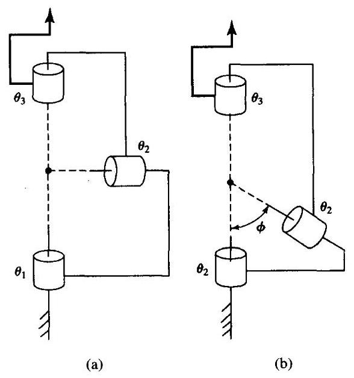

图4-14 两个3R机构(习题4.12)

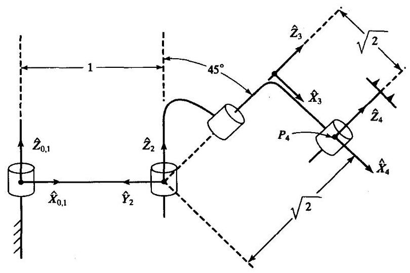

图4-154R操作臂，图示位置 $\Theta  = {\left\lbrack  0,{90}^{ \circ  }, - {90}^{ \circ  },0\right\rbrack  }^{T}$ (习题4.16)

4.17 [25] 图4-16所示为一个4R操作臂,非零连杆参数为 ${\alpha }_{1} =  - {90}^{ \circ  },{d}_{2} = 1,{\alpha }_{1} = {45}^{ \circ  },{d}_{3} = 1$ 和 ${a}_{3} = 1$ , 这个机构的位形为 $\Theta  = {\left\lbrack  \begin{array}{llll} 0 & 0 & {90}^{ \circ  } & 0 \end{array}\right\rbrack  }^{T}$ ,每个关节的运动范围为 $\pm  {180}^{ \circ  }$ ,对于

$$
{}^{0}{P}_{4ORG} = {\left\lbrack  \begin{array}{lll} {0.0} & {1.0} & {1.414} \end{array}\right\rbrack  }^{T}
$$

求所有 ${\theta }_{3}$ 的值。

4.18 [15]参见图3-37所示的RRP操作臂, 它的运动学方程 (位置) 有多少个解?

4.19 [15]参见图3-38所示的RRR操作臂, 它的运动学方程 (位置) 有多少个解?

4.20 [15]参见图3-39所示的RPP操作臂, 它的运动学方程 (位置) 有多少个解?

4.21 [15]参见图3-40所示的PRR操作臂, 它的运动学方程 (位置) 有多少个解?

4.22 [15]参见图3-41所示的PPP操作臂，它的运动学方程 (位置) 有多少个解？

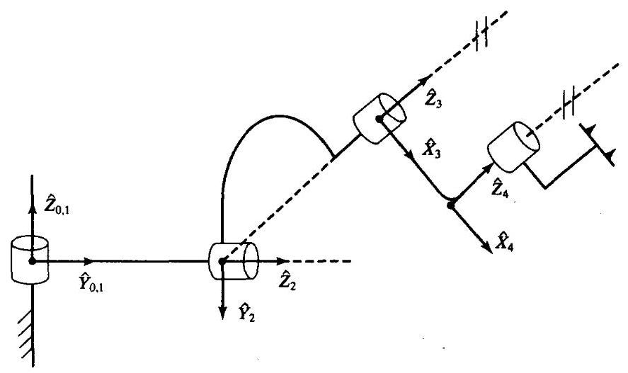

图4-16 $4\mathrm{R}$ 操作臂，图示位置 $\Theta  = {\left\lbrack  0,0,{90}^{ \circ  },0\right\rbrack  }^{T}$ (习题4.17)

4.23 [38]对于某一个问题给出下列运动学方程:

---

$$
\sin \xi  = a\sin \theta  + b
$$

$$
\sin \phi  = c\cos \theta  + d
$$

$$
\psi  = \xi  + \phi
$$

---

已知 $a, b, c, d$ 和 $\psi$ ，在一般情况下， $\theta$ 有4个解。求一个特定条件，使得 $\theta$ 只有2个解。

4.24 [20]已知由连杆坐标系 $\{ i - 1\}$ 描述的连杆坐标系 $\{ i\}$ ，求4个Denavit-Hartenberg参数，它们是 ${}^{i - 1}T$ 中元素的函数。

**编程习题**

1. 写出一个计算4.4节中三连杆操作臂的逆运动学子程序。这个子程序应以如下形式进行定义

---

Procedure INVKIN(VAR wrelb: frame; VAR current, near, far: vec3;

	VAR sol: boolean);

---

其中，"wrelb" 是一个输入量，代表相对于基坐标系的腕部坐标系； “current” 也是一个输入量, 代表机器人当前的位置信息 (通过关节角矢量给出); “near” 是最短行程解; "far" 是第二个解; "sol" 是一个表示是否找到解的标志。(如果没有解, sol=FALSE) 连杆长度 $\left( \mathrm{m}\right)$ 为

$$
{l}_{1} = {l}_{2} = {0.5}
$$

关节运动范围

$$
- {170}^{ \circ  } < {\theta }_{i} < {170}^{ \circ  }
$$

测试你的程序, 用KIN反复调用这个程序, 证明它们的确是互逆的。

2. 一个工具连接在操作臂的连杆3上，工具坐标系相对于腕部坐标系的描述为 ${}_{T}^{W}T$ 。用户要求的工作空间可表示为工作台坐标系相对于机器人基坐标系 ${}_{S}^{B}T$ 。写出这个子程序

---

Procedure SOLVE(VAR trels: frame; VAR current, near, far: vec3;

	VAR sol: boolean);

---

其中 “trels” 代表相对于坐标系 $\{ S\}$ 的坐标系 $\{ T\}$ 。其他参数均在INVKIN子程序中。 $\{ T\}$

和 $\{ S\}$ 定义为全局变量或常数。SOLVE用来调用TMULT, TINVERT和INVKIN。

3. 写出一个由 $x, y$ 和 $\phi$ 描述的目标坐标系的主程序。这个目标相对于 $\{ S\}$ 定义为 $\{ T\}$ ,用户可用这种方法确定目标。

像编程习题中那样,机器人在相同的工作空间里使用相同的工具。因此, $\{ T\}$ 和 $\{ S\}$ 定义为

$$
{}_{T}^{W}T = \left\lbrack  \begin{array}{lll} x & y & \theta  \end{array}\right\rbrack   = \left\lbrack  \begin{array}{lll} {0.1} & {0.2} & {30.0} \end{array}\right\rbrack
$$

$$
{}_{S}^{B}T = \left\lbrack  \begin{array}{lll} x & y & \theta  \end{array}\right\rbrack   = \left\lbrack  \begin{array}{lll}  - {0.1} & {0.3} & {0.0} \end{array}\right\rbrack
$$

计算下列三个目标坐标系的关节角:

$$
\left\lbrack  \begin{array}{lll} {x}_{1} & {y}_{1} & {\phi }_{1} \end{array}\right\rbrack   = \left\lbrack  \begin{array}{lll} {0.0} & {0.0} &  - {90.0} \end{array}\right\rbrack
$$

$$
\left\lbrack  \begin{array}{lll} {x}_{2} & {y}_{2} & {\phi }_{2} \end{array}\right\rbrack   = \left\lbrack  \begin{array}{lll} {0.6} &  - {0.3} & {45.0} \end{array}\right\rbrack
$$

$$
\left\lbrack  {{x}_{3}{y}_{3}{\phi }_{3}}\right\rbrack   = \left\lbrack  \begin{array}{lll}  - {0.4} & {0.3} & {120.0} \end{array}\right\rbrack
$$

$$
\left\lbrack  \begin{array}{lll} {x}_{4} & {y}_{4} & {\phi }_{4} \end{array}\right\rbrack   = \left\lbrack  \begin{array}{lll} {0.8} & {1.4} & {30.0} \end{array}\right\rbrack
$$

假定机器人开始运动时所有关节角均为 0.0 , 并且依次运动到这三个目标位置。程序可以找到相对于前一个目标点的最短行程解。反复调用SOLVE和WHERE保证它们的确是互逆函数。

**MATLAB习题**

这个练习集中讨论平面3自由度3R机器人的姿态逆运动学解。(参见图3-6和3-7; 图3-8中给出了DH参数。) 已知固定长度参数如下: ${L}_{1} = 4,{L}_{2} = 3$ 和 ${L}_{3} = 2\left( \mathrm{\;m}\right)$ 。

a) 用手算,求这个机器人的姿态逆运动学解析解: 已知 ${}_{H}^{0}T$ ,计算 $\left\{  {{\theta }_{1}{\theta }_{2}{\theta }_{3}}\right\}$ 所有可能的多重解。(文中给出了三种方法,选择其中一种)。提示: 为了简化这个方程,首先从 ${}_{H}^{0}T$ 和 ${L}_{3}$ 计算 ${}_{3}^{0}T$ 。

b) 编写一个MATLAB程序求解平面3R机器人的全部姿态逆运动学解 (即, 求出所有可能的多重解)。根据以下输入要求对你的程序进行测试:

i) ${}_{H}^{0}T = \left\lbrack  \begin{array}{llll} 1 & 0 & 0 & 9 \\  0 & 1 & 0 & 0 \\  0 & 0 & 1 & 0 \\  0 & 0 & 0 & 1 \end{array}\right\rbrack$

ii) ${}_{H}^{0}T = \left\lbrack  \begin{array}{rrrr} {0.5} &  - {0.866} & 0 & {7.5373} \\  {0.866} & {0.6} & 0 & {3.9266} \\  0 & 0 & 1 & 0 \\  0 & 0 & 0 & 1 \end{array}\right\rbrack$

iii) ${}_{H}^{0}T = \left\lbrack  \begin{matrix} 0 & 1 & 0 &  - 3 \\   - 1 & 0 & 0 & 2 \\  0 & 0 & 1 & 0 \\  0 & 0 & 0 & 1 \end{matrix}\right\rbrack$

$$
\text{ iv) }{}_{H}^{0}T = \left\lbrack  \begin{matrix} {0.866} & {0.5} & 0 &  - {3.1245} \\   - {0.5} & {0.866} & 0 & {9.1674} \\  0 & 0 & 1 & 0 \\  0 & 0 & 0 & 1 \end{matrix}\right\rbrack
$$

对于所有情况，使用循环校验来验证你的结果，将每一组关节角的结果(针对每一个多重解)代入到姿态正运动学MATLAB程序中，验证你原来求得的 ${}_{H}^{0}T$ 。

c) 应用Corke MATLAB Robotics工具箱验证所有结果。试用函数 ${ikine}\left( \right)$ 。
