# 第5章 速度和静力

## 5.1 概述

在本章中, 我们将机器人操作臂的讨论扩展到静态位置问题以外。我们研究刚体线速度和角速度的表示方法并且运用这些概念去分析操作臂的运动。我们将讨论作用在刚体上的力, 然后应用这些概念去研究操作臂静力学的应用问题。

可以看到关于速度和静力的研究将得出一个称为操作臂雅克比 ${}^{ \ominus  }$ 的实矩阵,该矩阵将在本章中介绍。

在本章中对机构运动学领域的研究内容并没有作深入讨论, 对于大多数问题的讨论仅限于机器人学专题中的一些基本概念。建议有兴趣的读者可进一步参考一些力学专著[1-3]。

## 5.2 时变位姿的符号表示

在研究刚体运动的描述之前, 先简单讨论一些基本知识: 矢量的微分, 角度速的表示法和符号。

**位置矢量的微分**

速度 (以及第6章中的加速度) 是需要研究的基本问题, 可用下面符号表示某个矢量的微分:

$$
{}^{B}{V}_{Q} = \frac{d}{dt}{}^{B}Q = \mathop{\lim }\limits_{{{\Delta t} \rightarrow  0}}\frac{{}^{B}Q\left( {t + {\Delta t}}\right)  - {}^{B}Q\left( t\right) }{\Delta t} \tag{5-1}
$$

位置矢量的速度可以看成是用位置矢量描述的空间一点的线速度。由式 (5-1) 可以看出，可以通过计算 $Q$ 相对于坐标系 $\{ B\}$ 的微分进行描述。例如,如果相对于坐标系 $\{ B\} , Q$ 不随时间变化,那么速度就为零,尽管在其他一些坐标系中 $Q$ 是变化的。因此,重要的是必须说明一个矢量是相对于哪个坐标系求微分。

像其他矢量一样, 速度矢量能在任意坐标系中描述, 其参考坐标系可以用左上标注明。 因此,如果在坐标系 $\{ A\}$ 中表示式 (5-1) 的速度矢量,可以写为

$$
{}^{A}\left( {{}^{B}{V}_{Q}}\right)  = \frac{{}^{A}d}{dt}{}^{B}Q \tag{5-2}
$$

可以看出, 在通常的情况下, 速度矢量都是与空间的某点相关的, 而描述此点速度的大小取决于两个坐标系:一个是进行微分运算的坐标系，另一个是描述这个速度矢量的坐标系。

在式 (5-1) 中, 速度是用微分坐标系描述的, 因此这个结果用左上标B注明。但是, 为简单起见, 当两个上标相同时, 不需要给出外层上标, 即可以写为

$$
{}^{B}\left( {{}^{B}{V}_{Q}}\right)  = {}^{B}{V}_{Q} \tag{5-3}
$$

最后, 由于进行参考坐标系变换的旋转矩阵已可清楚地表示这个关系, 因此总是省略掉外部左上标, 可以写为

$$
{}^{A}\left( {{}^{B}{V}_{Q}}\right)  = {}_{B}^{A}{R}^{B}{V}_{Q} \tag{5-4}
$$

---

$\ominus$ 数学上称它为 “雅克比矩阵”，但机器人学通常简称为 “雅克比”。

---

通常按照式 (5-4) 右边的形式给出速度的表达式, 因此描述速度的符号总是代表微分坐标系中的速度, 而没有外部左上标。

经常讨论的是一个坐标系原点相对于某个常见的世界参考坐标系的速度, 而不考虑相对于任意坐标系中一般点的速度。对于这种特殊情况, 定义一个缩写符号

$$
{v}_{C} = {}^{U}{V}_{CORG} \tag{5-5}
$$

式中的点为坐标系 $\{ C\}$ 的原点,参考坐标系为 $\{ U\}$ 。例如,用符号 ${v}_{c}$ 表示坐标系 $\{ C\}$ 原点的速度; ${}^{A}{v}_{C}$ 是坐标系 $\{ C\}$ 的原点在坐标系 $\{ A\}$ 中表示的速度 (尽管微分是相对于坐标系 $\{ U\}$ 进行的)。

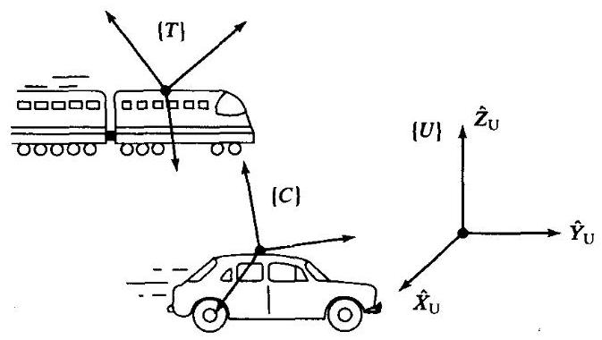

图5-1 几个直线运动坐标系的例子

例5.1

图5-1所示为固定的世界坐标系 $\{ U\}$ ，坐标系 $\{ T\}$ 固连在速度为 100 哩/小时的火车上，坐标系 $\{ C\}$ 固连在速度为 30 哩/小时的汽车上。两车的前进方向为 $\{ U\}$ 的 $\widehat{X}$ 方向。旋转矩阵 ${}_{T}^{U}R$ 和 ${}_{C}^{U}R$ 为已知且为常数。

求 $\frac{{}^{U}{dv}}{dt}{P}_{CORG}$

$$
\frac{{}^{U}d}{dt}{}^{U}{P}_{CORG} = {}^{U}{V}_{CORG} = {v}_{C} = {30}\widehat{X}
$$

求 ${}^{C}\left( {{}^{U}{V}_{TORG}}\right)$

$$
{}^{C}\left( {{}^{U}{V}_{TORG}}\right)  = {}^{C}{v}_{T} = {}_{U}^{C}R{v}_{T} = {}_{U}^{C}R\left( {{100}\widehat{X}}\right)  = {}_{C}^{U}{R}^{-1}{100}\widehat{X}
$$

求 ${}^{c}\left( {{}^{T}{V}_{CORG}}\right)$

$$
{}^{C}\left( {{}^{T}{V}_{CORG}}\right)  = {}_{T}^{C}{\mathbf{R}}^{T}{V}_{CORG} =  - {}_{C}^{U}{\mathbf{R}}^{-1}{}_{T}^{U}\mathbf{R}\mathbf{{70}}\widehat{\mathbf{X}}
$$

**角速度矢量**

现在介绍角速度矢量,用符号 $\Omega$ 表示。线速度描述了点的一种属性,角速度描述了刚体的一种属性。坐标系总是固连在被描述的刚体上, 所以可以用角速度来描述坐标系的旋转运动。

在图5-2中, ${}^{A}{\Omega }_{B}$ 描述了坐标系 $\{ B\}$ 相对于坐标系 $\{ A\}$ 的旋转。实际上， ${}^{A}{\Omega }_{B}$ 的方向就是 $\{ B\}$ 相对于 $\{ A\}$ 的瞬时旋转轴， ${}^{A}{\Omega }_{B}$ 的大小表示旋转速度。 像任意矢量一样, 角速度矢量可以在任意坐标系中描述, 所以需要附加另一个左上标, 例如, ${}^{C}\left( {{}^{A}{\Omega }_{B}}\right)$ 就是坐标系 $\{ B\}$ 相对于坐标系 $\{ A\}$ 的角速度在坐标系 $\{ C\}$ 中的描述。

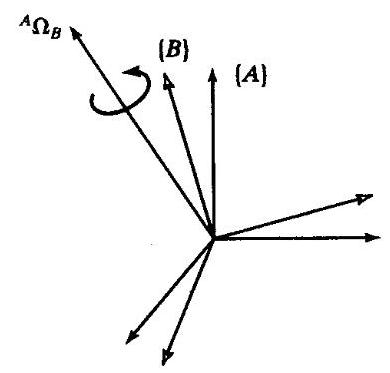

图5-2 坐标系 $\{ B\}$ 相对于坐标系 $\{ A\}$ 以角速度 ${}^{A}{\Omega }_{B}$ 旋转

对于一种重要的特殊情况, 再介绍一个简化符号, 即已知参考坐标系非常简单以致不需要符号表示:

$$
{\omega }_{C} = {}^{U}{\Omega }_{C} \tag{5-6}
$$

这里, ${\omega }_{c}$ 为坐标系 $\{ C\}$ 相对于某个已知参考坐标系 $\{ U\}$ 的角速度。例如: ${}^{A}{\omega }_{C}$ 是坐标系 $\{ C\}$ 的角速度在坐标系 $\{ A\}$ 中的描述 (尽管这个角速度是相对于坐标系 $\{ U\}$ 的)。

## 5.3 刚体的线速度和角速度

在本节中, 将讨论刚体的运动描述, 主要与速度有关。这些概念将第2章中关于平移和转动的描述扩展到时变的情况。在第6章中, 还要将这些概念扩展到加速度的研究。

与第2章中一样, 把坐标系固连在所要描述的刚体上。刚体运动等同于一个坐标系相对于另一个坐标系的运动。

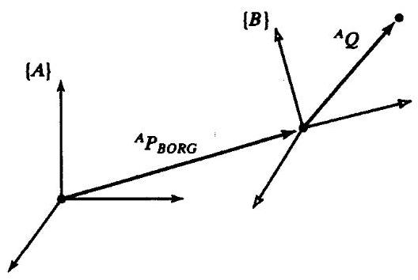

图5-3 坐标系 $\{ B\}$ 以速度 ${}^{A}{V}_{BORG}$ 相对于坐标系 $\{ A\}$ 平移

**线速度**

把坐标系 $\{ B\}$ 固连在一刚体上,要求描述相对于坐标系 $\{ A\}$ 的运动 ${}^{B}Q$ ,如图 5-3 所示。这里已经认为坐标系 $\{ A\}$ 是固定的。

坐标系 $\{ B\}$ 相对于坐标系 $\{ A\}$ 的位置用位置矢量 ${}^{A}{P}_{BORG}$ 和旋转矩阵 ${}_{B}^{A}R$ 来描述。此时,假定方位 ${}_{B}^{A}R$ 不随时间变化,则 $Q$ 点相对于坐标系 $\{ A\}$ 的运动是由于 ${}^{A}{P}_{BORG}$ 或 ${}^{B}Q$ 随时间的变化引起的。

求解坐标系 $\{ A\}$ 中 $Q$ 点的线速度是非常简单的。 只要写出坐标系 $\{ A\}$ 中的两个速度分量,求其和为:

$$
{}^{A}{V}_{Q} = {}^{A}{V}_{BORG} + {}_{B}^{A}{R}^{B}{V}_{Q} \tag{5-7}
$$

方程 (5-7) 只适用于坐标系 $\{ B\}$ 和坐标系 $\{ A\}$ 的相对方位保持不变的情况。

**角速度**

现在讨论两坐标系的原点重合、相对线速度为零的情况, 而且它们的原点始终保持重合。 其中一个或这两个坐标系固连在刚体上, 但是为清楚起见, 在图5-4没有表示出刚体。

坐标系 $\{ B\}$ 相对于坐标系 $\{ A\}$ 的方位是随时间变化的。如图5-4所示, $\{ B\}$ 相对于 $\{ A\}$ 的旋转速度用矢量 ${}^{A}{\Omega }_{B}$ 来表示。已知矢量 ${}^{B}Q$ 确定了坐标系 $\{ B\}$ 中一个固定点的位置。现在,考虑最重要的问题: 从坐标系 $\{ A\}$ 看固定在坐标系 $\{ B\}$ 中的矢量,这个矢量将如何随时间变化? 这个系统是否转动?

假设从坐标系 $\{ B\}$ 看矢量 $Q$ 是不变的，即

$$
{}^{B}{V}_{Q} = 0 \tag{5-8}
$$

既然它相对于 $\{ B\}$ 不变,显然从坐标系 $\{ A\}$ 中看点 $Q$ 的速度为旋转角速度 ${}^{A}{\Omega }_{B}$ 。为求点 $Q$ 的速度,可用一个直观的方法。图5-5所示为用两个瞬时量表示矢量 $Q$ 绕 ${}^{A}{\Omega }_{B}$ 的旋转。这是从坐标系 $\{ A\}$ 中观测到的。

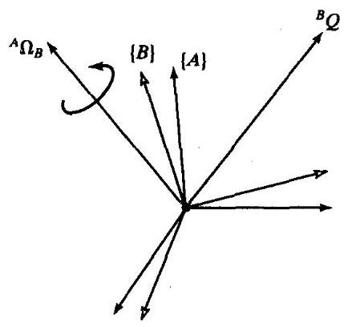

图5-4 固定在坐标系 $\{ B\}$ 中的矢量 ${}^{B}Q$ 以角速度 ${}^{A}{\Omega }_{B}$ 相对于坐标系 $\{ A\}$ 旋转

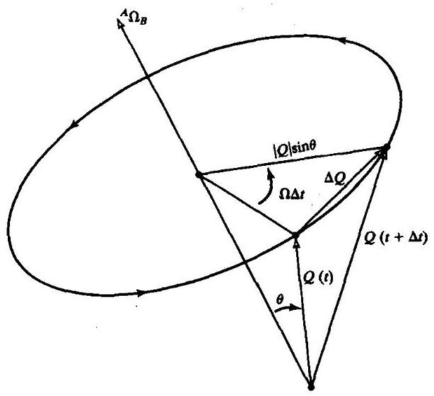

图5-5 用角速度表示的点的速度

由图5-5,可以计算出这个从坐标系 $\{ A\}$ 中观测到的矢量的方向和大小的变化。第一,显 ${\text{ 然 }}^{A}Q$ 的微分增量一定垂直于 ${}^{A}{\Omega }_{B}$ 和 ${}^{A}Q$ ; 第二,从图5-5可以看出微分增量的大小为

$$
\left| {\Delta Q}\right|  = \left( {{\left. \right| }^{A}Q \mid  \sin \theta }\right) \left( {{\left. \right| }^{A}{\Omega }_{B} \mid  {\Delta t}}\right) \tag{5-9}
$$

有了大小和方向这些条件, 即可得到矢量积。实际上, 这些矢量的大小和方向满足下面算式

$$
{}^{A}{V}_{Q} = {}^{A}{\Omega }_{B} \times  {}^{A}Q \tag{5-10}
$$

在一般情况下,矢量 $Q$ 是相对于坐标系 $\{ B\}$ 变化的,因此要加上此分量,得

$$
{}^{A}{V}_{Q} = {}^{A}\left( {{}^{B}{V}_{Q}}\right)  + {}^{A}{\Omega }_{B} \times  {}^{A}Q \tag{5-11}
$$

利用旋转矩阵消掉双上标,注意在任一瞬时矢量 ${}^{A}Q$ 的描述为 ${}_{B}^{A}{R}^{B}Q$ ,最后得到

$$
{}^{A}{V}_{Q} = {}_{B}^{A}{R}^{B}{V}_{Q} + {}^{A}{\Omega }_{B} \times  {}_{B}^{A}{R}^{B}Q \tag{5-12}
$$

**线速度和角速度同时存在的情况**

可以非常容易地将式 (5-12) 扩展到原点不重合的情况, 通过把原点的线速度加到式 (5-12) 中去,可以得到从坐标系 $\{ A\}$ 观测坐标系 $\{ B\}$ 中固定速度矢量的普遍公式:

$$
{}^{A}{V}_{Q} = {}^{A}{V}_{BORG} + {}_{B}^{A}{R}^{B}{V}_{Q} + {}^{A}{\Omega }_{B} \times  {}_{B}^{A}{R}^{B}Q \tag{5-13}
$$

方程 (5-13) 是从固定坐标系观测运动坐标系中的矢量微分的最终结果。

## 5.4 对角速度的进一步研究

在本节中, 将进一步研究角速度, 特别是式 (5-10) 的微分。前一节用几何方法证明了式 (5-10) 的有效性, 这里将引入数学方法。初次阅读本书的读者可以跳过本节。

**正交矩阵的导数的性质**

我们可以推出正交矩阵和某一反对称矩阵之间的一种特殊关系。对于任何 $n \times  n$ 正交矩阵 $R$ ,有

$$
R{R}^{T} = {I}_{n} \tag{5-14}
$$

式中, ${I}_{n}$ 是 $n \times  n$ 单位阵。另外,我们关心的是 $n = 3, R$ 为特征正交矩阵,即旋转矩阵的情况。 对式 (5-14) 求导得到

$$
\dot{R}{R}^{T} + R{\dot{R}}^{T} = {0}_{n} \tag{5-15}
$$

式中 ${0}_{n}$ 为 $n \times  n$ 的零矩阵。方程 (5-15) 可以写为

$$
\dot{R}{R}^{T} + {\left( \dot{R}{R}^{T}\right) }^{T} = {0}_{n} \tag{5-16}
$$

定义

$$
S = \dot{R}{R}^{T} \tag{5-17}
$$

由式 (5-16) 得

$$
S + {S}^{T} = {0}_{n} \tag{5-18}
$$

$S$ 为反对称矩阵。因此正交矩阵的微分与反对称矩阵之间存在如下特性,可写为

$$
S = \dot{R}{R}^{-1} \tag{5-19}
$$

**由于参考系旋转的点速度**

假定固定矢量 ${}^{B}P$ 相对于坐标系 $\{ B\}$ 是不变的,在另一个坐标系 $\{ A\}$ 中的描述为

$$
{}^{A}P = {}_{B}^{A}{R}^{B}P \tag{5-20}
$$

如果坐标系 $\{ B\}$ 是旋转的 $\left( {{}_{B}^{A}\dot{R}}\right.$ 的微分非零), ${}^{A}P$ 也是变化的,即使 ${}^{B}P$ 为常数,即

$$
{}^{A}\dot{P} = {}_{B}^{A}{\dot{R}}^{B}P \tag{5-21}
$$

或用速度符号写为

$$
{}^{A}{V}_{P} = {}_{B}^{A}{\dot{R}}^{B}P \tag{5-22}
$$

在式 (5-22) 中代入 ${}^{B}P$ 的表达式,得

$$
{}^{A}{V}_{P} = {}_{B}^{A}{\dot{R}}_{B}^{A}{R}^{-{1A}}P \tag{5-23}
$$

对于正交矩阵利用式 (5-19), 有

$$
{}^{A}{V}_{P} = {}_{B}^{A}{S}^{A}P \tag{5-24}
$$

式中用 $S$ 的上下标表明它是与旋转矩阵 ${}_{B}^{A}R$ 相关的反对称矩阵,由于它出现在式 (5-24) 中, 且为了便于理解的原因, 因此这里所说的旋转矩阵通常称为角速度矩阵。

**反对称矩阵和矢量积**

如果反对称矩阵 $S$ 的各元素如下

$$
S = \left\lbrack  \begin{matrix} 0 &  - {\Omega }_{x} & {\Omega }_{y} \\  {\Omega }_{x} & 0 &  - {\Omega }_{x} \\   - {\Omega }_{y} & {\Omega }_{x} & 0 \end{matrix}\right\rbrack \tag{5-25}
$$

定义 $3 \times  1$ 的列矢量

$$
\Omega  = \left\lbrack  \begin{array}{l} {\Omega }_{x} \\  {\Omega }_{y} \\  {\Omega }_{z} \end{array}\right\rbrack \tag{5-26}
$$

容易证明

$$
{SP} = \Omega  \times  P \tag{5-27}
$$

式中, $P$ 为任意矢量, $\times$ 表示矢量积。

与 $3 \times  3$ 的角速度矩阵相对应的 $3 \times  1$ 矢量 $\Omega$ 称为角速度矢量，这已在5.2节中作了介绍。

因此, 与式 (5-24) 联立可写为

$$
{}^{A}{V}_{P} = {}^{A}{\Omega }_{B} \times  {}^{A}P \tag{5-28}
$$

式中与 $\Omega$ 相关的符号表明该角速度矢量确定了坐标系 $\{ B\}$ 相对于坐标系 $\{ A\}$ 运动的。

**建立关于角速度矢量的物理概念**

结论可以证明式 (5-28) 中的矢量 $\Omega$ 是确实存在的,现在我们希望了解它的物理意义。可以通过旋转矩阵直接求导求得 $\Omega$

$$
\dot{R} = \mathop{\lim }\limits_{{{\Delta t} \rightarrow  0}}\frac{R\left( {t + {\Delta t}}\right)  - R\left( t\right) }{\Delta t} \tag{5-29}
$$

现在把 $R\left( {t + {\Delta t}}\right)$ 写为两个矩阵的组合

$$
R\left( {t + {\Delta t}}\right)  = {R}_{K}\left( {\Delta \theta }\right) R\left( t\right) \tag{5-30}
$$

式中,在时间间隔 ${\Delta t}$ 中,绕轴 $\widehat{K}$ 的微量旋转为 ${\Delta \theta }$ 。利用式 (5-30),式 (5-29) 可写为

$$
\dot{R} = \mathop{\lim }\limits_{{{\Delta t} \rightarrow  0}}\left( {\frac{{R}_{K}\left( {\Delta \theta }\right)  - {I}_{3}}{\Delta t}R\left( t\right) }\right) \tag{5-31}
$$

即

$$
\dot{R} = \left( {\mathop{\lim }\limits_{{{\Delta t} \rightarrow  0}}\frac{{R}_{K}\left( {\Delta \theta }\right)  - {I}_{3}}{\Delta t}}\right) R\left( t\right) \tag{5-32}
$$

对式 (2-80) 进行角度微分变换得

$$
{R}_{K}\left( {\Delta \theta }\right)  = \left\lbrack  \begin{matrix} 1 &  - {k}_{z}{\Delta \theta } & {k}_{y}{\Delta \theta } \\  {k}_{z}{\Delta \theta } & 1 &  - {k}_{x}{\Delta \theta } \\   - {k}_{y}{\Delta \theta } & {k}_{x}{\Delta \theta } & 1 \end{matrix}\right\rbrack \tag{5-33}
$$

所以，式 (5-32) 可写为

$$
\dot{R} = \left( {\mathop{\lim }\limits_{{{\Delta t} \rightarrow  0}}\frac{\left\lbrack  \begin{matrix} 0 &  - {k}_{z}{\Delta \theta } & {k}_{y}{\Delta \theta } \\  {k}_{z}{\Delta \theta } & 0 &  - {k}_{x}{\Delta \theta } \\   - {k}_{y}{\Delta \theta } & {k}_{x}{\Delta \theta } & 0 \end{matrix}\right\rbrack  }{\Delta t}}\right) R\left( t\right) \tag{5-34}
$$

最后,用 ${\Delta t}$ 除以这个矩阵,并取极限得

$$
\dot{R} = \left\lbrack  \begin{matrix} 0 &  - {k}_{z}\dot{\theta } & {k}_{y}\dot{\theta } \\  {k}_{z}\dot{\theta } & 0 &  - {k}_{x}\dot{\theta } \\   - {k}_{y}\dot{\theta } & {k}_{x}\dot{\theta } & 0 \end{matrix}\right\rbrack  R\left( t\right) \tag{5-35}
$$

因此有

$$
\dot{R}{R}^{-1} = \left\lbrack  \begin{matrix} 0 &  - {\Omega }_{z} & {\Omega }_{y} \\  {\Omega }_{z} & 0 &  - {\Omega }_{x} \\   - {\Omega }_{y} & {\Omega }_{x} & 0 \end{matrix}\right\rbrack \tag{5-36}
$$

式中

$$
\Omega  = \left\lbrack  \begin{array}{l} {\Omega }_{x} \\  {\Omega }_{y} \\  {\Omega }_{z} \end{array}\right\rbrack   = \left\lbrack  \begin{array}{l} {k}_{x}\dot{\theta } \\  {k}_{y}\dot{\theta } \\  {k}_{z}\dot{\theta } \end{array}\right\rbrack   = \dot{\theta }\widehat{K} \tag{5-37}
$$

角速度矢量 $\mathbf{\Omega }$ 的物理意义是,在任一时刻,旋转坐标系方位的变化可以看作是绕某个轴 $\widehat{\mathbf{K}}$ 的旋转。这个瞬时转动轴,可作为单位矢量,与绕这个轴的旋转速度标量 $\dot{\mathbf{\theta }}$ 构成角速度矢量。

**角速度的其他描述方法**

角速度还可以采用其他描述, 例如, 假设一个旋转刚体的角速度可以用Z-Y-Z欧拉角速率表示:

$$
{\dot{\Theta }}_{{Z}^{\prime }{Y}^{\prime }{Z}^{\prime }} = \left\lbrack  \begin{matrix} \dot{\alpha } \\  \dot{\beta } \\  \dot{\gamma } \end{matrix}\right\rbrack \tag{5-38}
$$

通过这种形式的描述, 或应用24种角坐标系当中的任意一种描述, 就可以推导出等效的角速度矢量。

已知

$$
\dot{R}{R}^{T} = \left\lbrack  \begin{matrix} 0 &  - {\Omega }_{z} & {\Omega }_{y} \\  {\Omega }_{z} & 0 &  - {\Omega }_{x} \\   - {\Omega }_{y} & {\Omega }_{x} & 0 \end{matrix}\right\rbrack \tag{5-39}
$$

从这个矩阵方程可以得到3个独立的方程, 即

$$
{\Omega }_{x} = {\dot{r}}_{31}{r}_{21} + {\dot{r}}_{32}{r}_{22} + {\dot{r}}_{33}{r}_{23}
$$

$$
{\Omega }_{y} = {\dot{r}}_{11}{r}_{31} + {\dot{r}}_{12}{r}_{32} + {\dot{r}}_{13}{r}_{33} \tag{5-40}
$$

$$
{\Omega }_{z} = {\dot{r}}_{21}{r}_{11} + {\dot{r}}_{22}{r}_{12} + {\dot{r}}_{23}{r}_{13}
$$

通过式 (5-40) 并按照角坐标系的符号表示 $R$ ,可以得到角坐标系速度和等效的角速度矢量关系的表达式。该结果可以转化成矩阵形式, 例如, 对于Z-Y-Z欧拉角,

$$
\Omega  = {E}_{{Z}^{\prime }{Y}^{\prime }{Z}^{\prime }}\left( {\Theta }_{{Z}^{\prime }{Y}^{\prime }{Z}^{\prime }}\right) {\dot{\Theta }}_{{Z}^{\prime }{Y}^{\prime }{Z}^{\prime }} \tag{5-41}
$$

式中, $E\left( \dot{A}\right)$ 是一个雅可比矩阵,它表示了角坐标系速度矢量和角速度矢量的关系,同时它也是这个角坐标系瞬时值的函数。 $E\left( \dot{A}\right)$ 的形式取决于给定的角坐标系,因此,用一个上标表示这个角坐标系。

例5.2

构造 $E$ 矩阵,表示Z-Y-Z欧拉角与角速度矢量的关系,即求式 (5-41) 中的 ${E}_{{Z}^{\prime }{Y}^{\prime }}$ 。

应用式 (2-72) 和式 (5-40), 通过必要的符号微分, 可以得到

$$
{E}_{{Z}^{\prime }{Y}^{\prime }{Z}^{\prime }} = \left\lbrack  \begin{matrix} 0 &  - {s\alpha } & {c\alpha s\beta } \\  0 & {c\alpha } & {s\alpha s\beta } \\  1 & 0 & {c\beta } \end{matrix}\right\rbrack \tag{5-42}
$$

## 5.5 机器人连杆的运动

在机器人连杆运动的分析中,一般使用连杆坐标系 $\{ 0\}$ 作为参考坐标系。因此, ${v}_{i}$ 是连杆坐标系原点 $\{ i\}$ 的线速度, ${\omega }_{i}$ 是连杆坐标系 $\{ i\}$ 的角速度。

在任一瞬时，机器人的每个连杆都具有一定的线速度和角速度。图5-6所示为连杆 $i$ 的这些矢量。通过这个例子表明,这些矢量均是在坐标系 $\{ i\}$ 中描述的。

## 5.6 连杆间的速度传递

现在讨论计算机器人连杆线速度和角速度的问题。操作臂是一个链式结构, 每一个连杆的运动都与它的相邻杆有关。由于这种结构的特点, 我们可以由基坐标系依次计算各连杆的速度。连杆 $i + 1$ 的速度就是连杆 $i$ 的速度加上那些附加到关节 $i + 1$ 上的新的速度分量。 $\Theta$

---

$\Theta$ 注意线速度是相对于一点的,而角速度是相对于一个物体的。因此,“连杆的速度”指的是连杆坐标系原点的线速度和连杆的角速度。

---

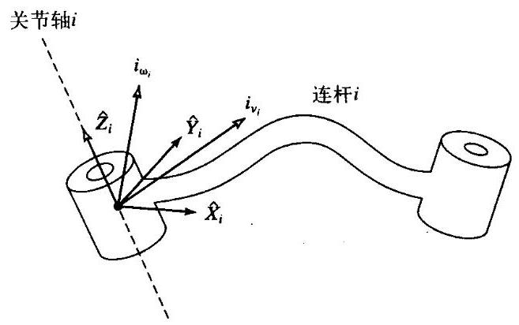

图5-6 连杆 $i$ 的速度可以用矢量 ${v}_{i}$ 和 ${\omega }_{i}$ 确定,在任何坐标系中均可以这样表示,包括坐标系 $\{ i\}$

如图5-6所示, 将机构的每一个连杆看作为一个刚体, 可以用线速度矢量和角速度矢量描述其运动。进一步, 我们可以用连杆坐标系本身描述这些速度, 而不用基坐标系。图5-7所示为连杆 $i$ 和 $i + 1$ ，以及在连杆坐标系中定义的速度矢量。

当两个 $\omega$ 矢量都是相对于同一个坐标系时，那么这些角速度能够相加。因此，连杆 $i + 1$ 的角速度就等于连杆 $i$ 的角速度加上一个由于关节 $i + 1$ 的角速度引起的分量。参照坐标系 $\{ i\}$ ,上述关系可写成

$$
{}^{i}{\omega }_{i + 1} = {}^{i}{\omega }_{i} + {}_{i + 1}R{\dot{\theta }}_{i + 1}{}^{i + 1}{\widehat{Z}}_{i + 1} \tag{5-43}
$$

注意,

$$
{\dot{\theta }}_{i + 1}{}^{i + 1}{\widehat{Z}}_{i + 1} = {}^{i + 1}\left\lbrack  \begin{matrix} 0 \\  0 \\  {\dot{\theta }}_{i + 1} \end{matrix}\right\rbrack \tag{5-44}
$$

我们曾利用坐标系 $\{ i\}$ 与坐标系 $\{ i + 1\}$ 之间的旋转变换矩阵表达坐标系 $\{ i\}$ 中由于关节运动引起的附加旋转分量。这个旋转矩阵绕关节 $i + 1$ 的旋转轴进行旋转变换,变换为在坐标系 $\{ i\}$ 中的描述后, 这两个角速度分量才能够相加。

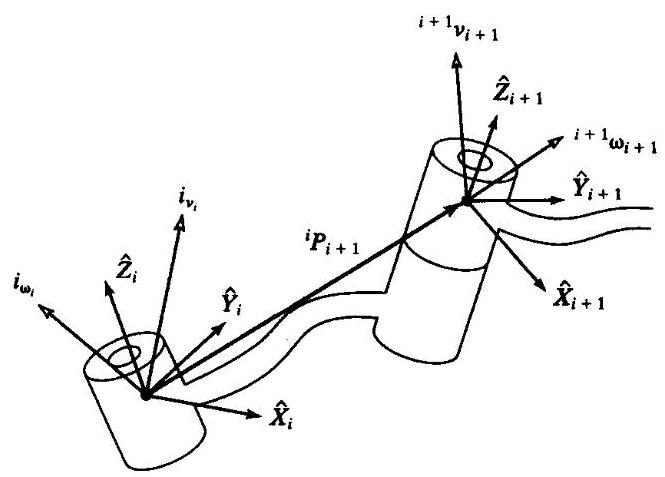

图5-7 相邻连杆的速度矢量

在方程式 (5-43) 两边同时左乘 ${}^{i + 1}R$ ,可以得到连杆 $i + 1$ 的角速度相对于坐标系 $\{ i + 1\}$ 的表达式:

$$
{}^{i + 1}{\omega }_{i + 1} = {}^{i + 1}{R}^{i}{\omega }_{i} + {\dot{\theta }}_{i + 1}{}^{i + 1}{\widehat{Z}}_{i + 1} \tag{5-45}
$$

坐标系 $\{ i + 1\}$ 原点的线速度等于坐标系 $\{ i\}$ 原点的线速度加上一个由于连杆 $i$ 的角速度引起的新的分量。这与式 (5-13) 描述的情况完全相同。由于 ${}^{i}{P}_{i + 1}$ 在坐标系 $\{ i\}$ 中是常数,所以其中一项就消失了。因此有

$$
{}^{i}{v}_{i + 1} = {}^{i}{v}_{i} + {}^{i}{\omega }_{i} \times  {}^{i}{P}_{i + 1} \tag{5-46}
$$

上式两边同时左乘 ${}^{i + 1}R$ ,得

$$
{}^{i + 1}{v}_{i + 1} = {}^{i + 1}R\left( {{}^{i}{v}_{i} + {}^{i}{\omega }_{i} \times  {}^{i}{P}_{i + 1}}\right) \tag{5-47}
$$

式 (5-45) 和式 (5-47) 可能是本章中最重要的结论。对于关节 $i + 1$ 为移动关节的情况,相应的关系为

$$
{}^{i + 1}{\omega }_{i + 1} = {}^{i + 1}{R}^{i}{\omega }_{i} \tag{5-48}
$$

$$
{}^{i + 1}{\upsilon }_{i + 1} = {}^{i + 1}R\left( {{}^{i}{\upsilon }_{i} + {}^{i}{\omega }_{i} \times  {}^{i}{P}_{i + 1}}\right)  + {\dot{d}}_{i + 1}{}^{i + 1}{\widehat{Z}}_{i + 1}
$$

从一个连杆到下一个连杆依次应用这些公式,可以计算出最后一个连杆的角速度 ${}^{N}{\omega }_{N}$ 和线速度 ${}^{N}{v}_{N}$ ,注意,这两个速度是按照坐标系 $\{ N\}$ 表达的。在后面可以看到,这个结果是非常有用的。如果用基坐标系来表达角速度和线速度的话,就可以用 ${}_{N}^{0}R$ 去左乘速度,向基坐标进行旋转变换。

例5.3

图5-8所示是具有两个转动关节的操作臂。计算出操作臂末端的速度, 将它表达成关节速度的函数。给出两种形式的解答, 一种是用坐标系\{3\}表示的, 另一种是用坐标系\{0\}表示的。

如图5-9所示, 坐标系\{3\}固连于操作臂末端, 求用坐标系\{3\}表示的该坐标系原点的速度。 对于这个问题的第二部分,求用坐标系 \{0\} 表示的这些速度。同以前一样, 首先将坐标系固连在连杆上 (如图5-9所示)。

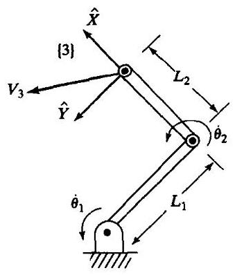

图5-8 两连杆操作臂

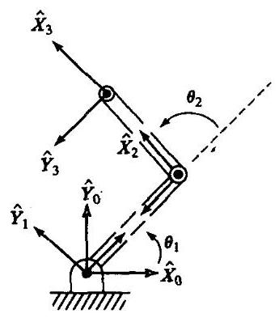

图5-9 两连杆操作臂的坐标系布局

运用式 (5-45) 和式 (5-47) 从基坐标系 \{0\} 开始依次计算出每个坐标系原点的速度, 其中基坐标系的速度为 0 。由于式 (5-45) 和式 (5-47) 将应用到连杆变换, 因此先将它们计算

如下:

$$
{}_{1}^{0}T = \left\lbrack  \begin{matrix} {c}_{1} &  - {s}_{1} & 0 & 0 \\  {s}_{1} & {c}_{1} & 0 & 0 \\  0 & 0 & 1 & 0 \\  0 & 0 & 0 & 1 \end{matrix}\right\rbrack
$$

$$
{}_{2}^{1}T = \left\lbrack  \begin{matrix} {c}_{2} &  - {s}_{2} & 0 & {l}_{1} \\  {s}_{2} & {c}_{2} & 0 & 0 \\  0 & 0 & 1 & 0 \\  0 & 0 & 0 & 1 \end{matrix}\right\rbrack \tag{5-49}
$$

$$
{}_{3}^{2}T = \left\lbrack  \begin{array}{llll} 1 & 0 & 0 & {l}_{2} \\  0 & 1 & 0 & 0 \\  0 & 0 & 1 & 0 \\  0 & 0 & 0 & 1 \end{array}\right\rbrack
$$

注意上式与例3.3的操作臂中的结果是一致的, 且关节3的转角恒为0度。坐标系\{2\}和坐标系 [3]之间的变换不必转化成标准的连杆变换形式 (尽管这样做可能是有用的)。对各连杆依次使用式 (5-45) 和式 (5-47), 计算如下

$$
{}^{1}{\omega }_{1} = \left\lbrack  \begin{matrix} 0 \\  0 \\  {\dot{\theta }}_{1} \end{matrix}\right\rbrack \tag{5-50}
$$

$$
{}^{1}{v}_{1} = \left\lbrack  \begin{array}{l} 0 \\  0 \\  0 \end{array}\right\rbrack \tag{5-51}
$$

$$
{}^{2}{\omega }_{2} = \left\lbrack  \begin{matrix} 0 \\  0 \\  {\dot{\theta }}_{1} + {\dot{\theta }}_{2} \end{matrix}\right\rbrack \tag{5-52}
$$

$$
{}^{2}{v}_{2} = \left\lbrack  \begin{matrix} {c}_{2} & {s}_{2} & 0 \\   - {s}_{2} & {c}_{2} & 0 \\  0 & 0 & 1 \end{matrix}\right\rbrack  \left\lbrack  \begin{matrix} 0 \\  {l}_{1}{\dot{\theta }}_{1} \\  0 \end{matrix}\right\rbrack   = \left\lbrack  \begin{matrix} {l}_{1}{s}_{2}{\dot{\theta }}_{1} \\  {l}_{1}{c}_{2}{\theta }_{1} \\  0 \end{matrix}\right\rbrack \tag{5-53}
$$

$$
{}^{3}{\omega }_{3} = {}^{2}{\omega }_{2} \tag{5-54}
$$

$$
{}^{3}{v}_{3} = \left\lbrack  \begin{matrix} {l}_{1}{s}_{2}{\dot{\theta }}_{1} \\  {l}_{1}{c}_{2}{\dot{\theta }}_{1} + {l}_{2}\left( {{\theta }_{1} + {\dot{\theta }}_{2}}\right) \\  0 \end{matrix}\right\rbrack \tag{5-55}
$$

式 (5-55) 即为答案。同时，坐标系\{3\}的角速度由式 (5-54) 给出。

为了得到这些速度相对于固定基坐标系的表达,用旋转矩阵 ${}_{3}^{0}R$ 对它们作旋转变换,即

$$
{}_{3}^{0}R = {}_{1}^{0}{R}_{2}^{1}{R}_{3}^{2}R = \left\lbrack  \begin{matrix} {c}_{12} &  - {s}_{12} & 0 \\  {s}_{12} & {c}_{12} & 0 \\  0 & 0 & 1 \end{matrix}\right\rbrack \tag{5-56}
$$

通过这个变换可以得到

$$
{}^{0}{v}_{3} = \left\lbrack  \begin{matrix}  - {l}_{1}{s}_{1}{\dot{\theta }}_{1} - {l}_{2}{s}_{12}\left( {{\dot{\theta }}_{1} + {\dot{\theta }}_{2}}\right) \\  {l}_{1}{c}_{1}{\dot{\theta }}_{1} + {l}_{2}{c}_{12}\left( {{\dot{\theta }}_{1} + {\dot{\theta }}_{2}}\right) \\  0 \end{matrix}\right\rbrack \tag{5-57}
$$

指出式 (5-45) 和式 (5-47) 的两个完全不同的用途是很重要的。首先, 可以利用它们推导解析表达式, 见前面的例5.3。在这里, 可利用符号方程进行推导, 直到得出形如式 (5-55) 的方程, 这样可针对某个应用问题应用计算机进行计算。其次, 正如上面的推导过程, 可利用符号方程直接计算出式 (5-45) 和式 (5-47)。这样很容易将它们写成子程序, 然后通过迭代方法计算出连杆的速度。为此, 它们可以用于任何一种操作臂, 而不必为每个特定的操作臂推导方程。然而，计算的数值解是隐式的结构。我们常关心如同式 (5-55) 所示的解析解的结构。如果我们不厌其烦的去计算式 (5-50) 到式 (5-57), 通常会发现, 由计算机完成的计算量就会较少。

## 5.7 雅可比

雅可比矩阵是多元形式的导数。例如, 假设有6个函数, 每个函数都有6个独立的变量:

$$
{y}_{1} = {f}_{1}\left( {{x}_{1},{x}_{2},{x}_{3},{x}_{4},{x}_{5},{x}_{6}}\right)
$$

$$
{y}_{2} = {f}_{2}\left( {{x}_{1},{x}_{2},{x}_{3},{x}_{4},{x}_{5},{x}_{6}}\right) \tag{5-58}
$$

$$
{y}_{6} = {f}_{6}\left( {{x}_{1},{x}_{2},{x}_{3},{x}_{4},{x}_{5},{x}_{6}}\right)
$$

也可以用矢量符号表示这些等式:

$$
Y = F\left( X\right) \tag{5-59}
$$

现在,如果想要计算出 ${y}_{i}$ 的微分关于 ${x}_{j}$ 的微分的函数,可简单应用多元函数求导法则计算, 得到

$$
\delta {y}_{1} = \frac{\partial {f}_{1}}{\partial {x}_{1}}\delta {x}_{1} + \frac{\partial {f}_{1}}{\partial {x}_{2}}\delta {x}_{2} + \cdots  + \frac{\partial {f}_{1}}{\partial {x}_{6}}\delta {x}_{6}
$$

$$
\delta {y}_{2} = \frac{\partial {f}_{2}}{\partial {x}_{1}}\delta {x}_{1} + \frac{\partial {f}_{2}}{\partial {x}_{2}}\delta {x}_{2} + \cdots  + \frac{\partial {f}_{2}}{\partial {x}_{6}}\delta {x}_{6} \tag{5-60}
$$

$$
\vdots
$$

$$
\delta {y}_{6} = \frac{\partial {f}_{6}}{\partial {x}_{1}}\delta {x}_{1} + \frac{\partial {f}_{6}}{\partial {x}_{2}}\delta {x}_{2} + \cdots  + \frac{\partial {f}_{6}}{\partial {x}_{6}}\delta {x}_{6}
$$

将上述式子写成更为简单的矢量表达式:

$$
{\delta Y} = \frac{\partial F}{\partial X}{\delta X} \tag{5-61}
$$

式 (5-61) 中的 $6 \times  6$ 偏导数矩阵就是我们所说的雅可比矩阵 $J$ 。注意到,如果 ${f}_{1}\left( X\right)$ 到 ${f}_{6}\left( X\right)$ 都是非线性函数,那么这些偏导数都是 ${x}_{i}$ 的函数,因此可以表示如下

$$
{\delta Y} = J\left( X\right) {\delta X} \tag{5-62}
$$

将上式两端同时除以时间的微分,可以将雅可比矩阵看成是 $X$ 中的速度向 $Y$ 中速度的映射:

$$
\dot{Y} = J\left( X\right) \dot{X} \tag{5-63}
$$

- 在任一瞬时, $X$ 都有一个确定的值, $J\left( X\right)$ 是个线性变换。在每一个新时刻,如果 $X$ 改变,线性变换也会随之而变。所以, 雅可比是时变的线性变换。

在机器人学中, 通常使用雅可比将关节速度与操作臂末端的笛卡儿速度联系起来, 比如,

$$
v = {}^{0}J\left( \Theta \right) \dot{\Theta } \tag{5-64}
$$

式中, $\Theta$ 是操作臂关节角矢量, $v$ 是笛卡儿速度矢量。在式 (5-64) 中,我们给雅可比表达式附加了左上标, 以此表示笛卡儿速度所参考的坐标系。有时, 由于参考坐标系很明显而不用说明, 或者对后续推导并不重要时, 这个左上标就可以略去。注意到, 对于任意已知的操作臂位形, 关节速度和操作臂末端速度的关系是线性的, 然而这种线性关系仅是瞬时的, 因为在下一刻，雅可比矩阵就会有微小的变化。对于通常的 6 关节机器人，雅可比矩阵是 6 x 6 阶的矩阵, $\dot{\Theta }$ 是 $6 \times  1$ 维的, ${}^{0}v$ 也是 $6 \times  1$ 维的。这个 $6 \times  1$ 笛卡儿速度矢量是由一个 $3 \times  1$ 的线速度矢量和一个 $3 \times  1$ 的角速度矢量组合起来的:

$$
{}^{0}v = \left\lbrack  \begin{matrix} {}^{0}v \\  {}^{0}\omega  \end{matrix}\right\rbrack \tag{5-65}
$$

可以定义任何维数的雅可比矩阵 (包括非方阵形式)。雅可比矩阵的行数等于操作臂在笛卡儿空间的自由度数量, 雅可比矩阵的列数等于操作臂的关节数量。例如, 对于平面操作臂, 虽然雅可比矩阵不可能超过 3 行, 但对于冗余度平面操作臂, 可以有任意多个列 (列数和关节数相等)。

对于两连杆的操作臂,可以写出一个 $2 \times  2$ 的雅可比矩阵,该矩阵将关节速度和末端执行器的速度联系起来。利用例5.3的结果, 可以很容易地给出两连杆操作臂的雅可比矩阵。可以由式 (5-55) 写出坐标系\{3\}中的雅可比表达式

$$
{}^{3}J\left( \Theta \right)  = \left\lbrack  \begin{matrix} {l}_{1}{s}_{2} & 0 \\  {l}_{1}{c}_{2} + {l}_{2} & {l}_{2} \end{matrix}\right\rbrack \tag{5-66}
$$

由式 (5-57) 可以写出坐标系\{0\}中的雅可比表达式

$$
{}^{0}J\left( \Theta \right)  = \left\lbrack  \begin{matrix}  - {l}_{1}{s}_{1} - {l}_{2}{s}_{12} &  - {l}_{2}{s}_{12} \\  {l}_{1}{c}_{1} + {l}_{2}{c}_{12} & {l}_{2}{c}_{12} \end{matrix}\right\rbrack \tag{5-67}
$$

注意, 在上述两种情况下, 都选择了一个方阵将关节速度和末端执行器的速度联系起来。当然, 也可以选择包含末端执行器角速度的3×2阶雅可比矩阵。

通过从式 (5-58) 到式 (5-62) 建立雅可比矩阵的过程, 我们会发现, 也可以通过对机构的运动方程直接微分来求得雅可比矩阵。这样可以直接求得线速度, 但却得不到 3x1 的方位矢量，而这个矢量的导数就是 $\omega$ 。我们已经介绍了一种方法，就是通过依次使用式(5-45) 和式 (5-47) 求出雅可比矩阵。也可以应用另外的几种方法来求(参阅[4])，在5.8节中将简要介绍其中一种方法。采用本文所述方法求雅可比矩阵的原因之一，就是为第6章讨论的内容作准备。在第6章中, 我们将采用类似的方法来计算操作臂运动的动力学方程。

**雅可比矩阵参考坐标系的变换**

已知坐标系 $\{ B\}$ 中的雅可比矩阵,即

$$
\left\lbrack  \begin{matrix} B \\  C \end{matrix}\right\rbrack   = {}^{B}v = {}^{B}J\left( \Theta \right) \dot{\Theta } \tag{5-68}
$$

我们关心的是给出雅可比矩阵在另一个坐标系 $\{ A\}$ 中的表达式。首先,注意到已知坐标系 $\{ B\}$ 中的 $6 \times  1$ 笛卡儿速度矢量可以通过如下变换得到相对于坐标系 $\left\{  \mathrm{A}\right\}$ 的表达式

$$
\left\lbrack  \begin{matrix} A \\  C \end{matrix}\right\rbrack   = \left\lbrack  \begin{matrix} A & B \\  B & D \end{matrix}\right\rbrack  \left\lbrack  \begin{matrix} 0 \\  0 \end{matrix}\right\rbrack \tag{5-69}
$$

因此, 可以得到

$$
\left\lbrack  \begin{matrix} {}^{A}v \\  {}^{A}\omega  \end{matrix}\right\rbrack   = \left\lbrack  \begin{matrix} {}_{B}^{A}R & 0 \\  0 & {}_{B}^{A}R \end{matrix}\right\rbrack  {}^{B}J\left( \Theta \right) \dot{\Theta } \tag{5-70}
$$

显然, 利用下列关系式可以完成雅可比矩阵参考坐标系的变换:

$$
{}^{A}J\left( \Theta \right)  = \left\lbrack  \begin{matrix} {}_{B}^{A}R & 0 \\  0 & {}_{B}^{A}R \end{matrix}\right\rbrack  {}^{B}J\left( \Theta \right) \tag{5-71}
$$

## 5.8 奇异性

已知一个线性变换可以将关节速度和笛卡儿速度联系起来, 那么自然会提出一个问题: 这个线性变换矩阵是可逆的吗? 也就是说, 这个矩阵是非奇异的吗? 如果这个矩阵是非奇异的, 那么已知笛卡儿速度的话, 就可以对该矩阵求逆计算出关节的速度:

$$
\dot{\Theta } = {J}^{-1}\left( \Theta \right) v \tag{5-72}
$$

这是一个重要的关系式。例如, 要求机器人手部在笛卡儿空间以某个速度矢量运动。应用式 (5-72), 可以计算出沿着这个路径每一瞬时所需的关节速度。这样, 雅可比矩阵可逆性的实质问题就在于: 雅可比矩阵对于所有的 $\Theta$ 值都是可逆的吗? 如果不是,在什么位置不可逆?

大多数操作臂都有使得雅可比矩阵出现奇异的 $\Theta$ 值。这些位置就称为机构的奇异位形或简称奇异状态。所有操作臂在工作空间的边界都存在奇异位形, 并且大多数操作臂在它们的工作空间内也有奇异位形。对奇异位形分类的深入研究已超出本书讨论范围，更多的相关内容可以参见文献[5]。在本书中, 我们没有给出奇异性的严格定义, 而是大致将它们分为两类:

1. 工作空间边界的奇异位形出现在操作臂完全展开或者收回使得末端执行器处于或非常接近工作空间边界的情况。

2. 工作空间内部的奇异位形出现在远离工作空间的边界, 通常是由于两个或两个以上的关节轴线共线引起的。

当一个操作臂处于奇异位形时, 它会失去一个或多个自由度 (在笛卡儿空间中观察)。这也就是说, 在笛卡儿空间的某个方向上 (或某个子空间中), 无论选择什么样的关节速度, 都不能使机器人手臂运动。显然, 这种情况也会在机器人的工作空间边界发生。

例5.4

对于例5.3所示的简单两连杆操作臂, 奇异位形在什么位置? 奇异位形的物理意义是什么? 它们是工作空间边界的奇异位形还是工作空间内部的奇异位形?

为了求出机构的奇异点, 必须首先计算机构的雅可比矩阵行列式的值。在行列式的值为0 的位置, 雅可比矩阵非满秩, 也就是奇异的:

$$
\operatorname{DET}\left\lbrack  {J\left( \Theta \right) }\right\rbrack   = \left\lbrack  \begin{matrix} {l}_{1}{s}_{2} & 0 \\  {l}_{1}{c}_{2} + {l}_{2} & {l}_{2} \end{matrix}\right\rbrack   = {l}_{1}{l}_{2}{s}_{2} = 0 \tag{5-73}
$$

显然,当 ${\theta }_{2}$ 为 0 或者 ${180}^{ \circ  }$ 时,机构处于奇异位形。从物理意义上讲,当 ${\theta }_{2} = 0$ 时,操作臂完全展开。处于这种位形时, 末端执行器仅可以沿着笛卡儿坐标的某个方向 (垂直于手臂方向) 运动。因此，操作臂失去了一个自由度。同样，当 ${\theta }_{2} = {180}^{ \circ  }$ 时，操作臂完全收回时，手臂也只能沿着一个方向运动, 而不能在两个方向运动。由于这类奇异位形处于操作臂工作空间的边界上,因此将它们称为工作空间边界的奇异位形。注意,无论对于坐标系 $\{ 0\}$ 还是其他坐标系, 雅可比矩阵都是相同的。

在机器人控制系统中应用式 (5-72) 的危险在于, 在奇异位形, 雅可比矩阵的逆不存在! 当操作臂接近奇异点位置时, 关节速度会趋向于无穷大。

例5.5

如图5-10所示,对于例5.3中的两连杆机器人,末端执行器沿着 $\widehat{X}$ 轴以 ${1.0}\mathrm{\;m}/\mathrm{s}$ 的速度运动。 当操作臂远离奇异位形时，关节速度都在允许范围内。但是当 ${\theta }_{2} = 0$ 时，操作臂接近奇异位形， 此时关节速度趋向于无穷大。

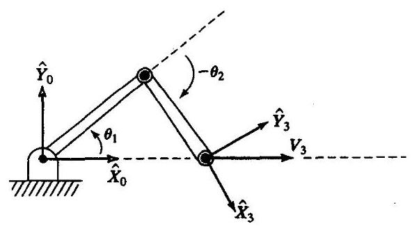

图5-10 末端以恒定的线速度运动的两连杆操作臂

首先计算坐标系 \{0\} 中雅可比矩阵的逆:

$$
{}^{0}{J}^{-1}\left( \Theta \right)  = \frac{1}{{l}_{1}{l}_{2}{s}_{2}}\left\lbrack  \begin{matrix} {l}_{2}{c}_{12} & {l}_{2}{s}_{12} \\   - {l}_{1}{c}_{1} - {l}_{2}{c}_{12} &  - {l}_{1}{s}_{1} - {l}_{2}{s}_{12} \end{matrix}\right\rbrack \tag{5-74}
$$

然后,当末端执行器以 $1\mathrm{\;m}/\mathrm{s}$ 的速度沿 $\widehat{X}$ 方向运动时,应用式 (5-74),按照操作臂位形的函数计算出关节速度:

(5-75)

$$
{\dot{\theta }}_{1} = \frac{{c}_{12}}{{l}_{1}{s}_{2}}
$$

$$
{\dot{\theta }}_{2} =  - \frac{{c}_{1}}{{l}_{2}{s}_{2}} - \frac{{c}_{12}}{{l}_{1}{s}_{2}}
$$

显然,当操作臂伸展到接近于 ${\theta }_{2} = 0$ 时,两个关节的速度都趋向于无穷大。

例5.6

对于PUMA560操作臂，给出两个可能出现的奇异位形的位置。

当 ${\theta }_{3}$ 接近于 -90deg时,存在一个奇异位形,作为练习,请读者计算出 ${\theta }_{3}$ 的精确值。(见习题5.14) 在这种情况下, 连杆2和连杆3完全展开, 这与例5.3的两连杆操作臂处于奇异位形的情况相同。这种情况属于工作空间边界的奇异位形。

只要 ${\theta }_{5} = {0.0}\mathrm{{deg}}$ ,操作臂都会处于奇异位形。在这个位形,关节轴4和关节轴6成一直线, 所以这两个关节轴的动作都会使末端执行器产生相同的运动, 因此操作臂就好像失去了一个自由度。由于这个奇异位形出现在工作空间内部, 所以它属于工作空间内部的奇异位形。

## 5.9 作用在操作臂上的静力

操作臂的链式结构特性自然让我们想到力和力矩是如何从一个连杆向下一个连杆传递的。 考虑操作臂的自由末端 (末端执行器) 在工作空间推动某个物体, 或用手部抓举着某个负载的典型情况。我们希望求出保持系统静态平衡的关节扭矩。

对于操作臂的静力, 首先锁定所有的关节以使操作臂的结构固定。然后对这种结构中的连杆进行讨论, 写出力和力矩对于各连杆坐标系的平衡关系。最后, 为了保持操作臂的静态平衡, 计算出需要对各关节轴依次施加多大的静力矩。通过这种方法, 可以求出为了使末端执行器支承住某个静负载所需的一组关节力矩。

在本节中, 不考虑作用在连杆上的重力 (这将留到第6章中讨论)。我们所讨论的关节静力和静力矩是由施加在最后一个连杆上的静力或静力矩 (或两者共同) 引起的，例如，当操作臂的末端执行器和环境接触时就是这样的。

我们为相邻杆件所施加的力和力矩定义以下特殊的符号:

${f}_{i} =$ 连杆 $i - 1$ 施加在连杆 $i$ 上的力,

${n}_{i} =$ 连杆 $i - 1$ 施加在连杆 $i$ 上的力矩。

我们按照惯例建立连杆坐标系。图5-11所示为施加在连杆 $i$ 上的静力和静力矩(除了重力以外)。将这些力相加并令其和为 0 , 有

$$
{}^{i}{f}_{i} - {}^{i}{f}_{i + 1} = 0 \tag{5-76}
$$

将绕坐标系 $\{ i\}$ 原点的力矩相加,有

$$
{}^{i}{n}_{i} - {}^{i}{n}_{i + 1} - {}^{i}{P}_{i + 1} \times  {}^{i}{f}_{i + 1} = 0 \tag{5-77}
$$

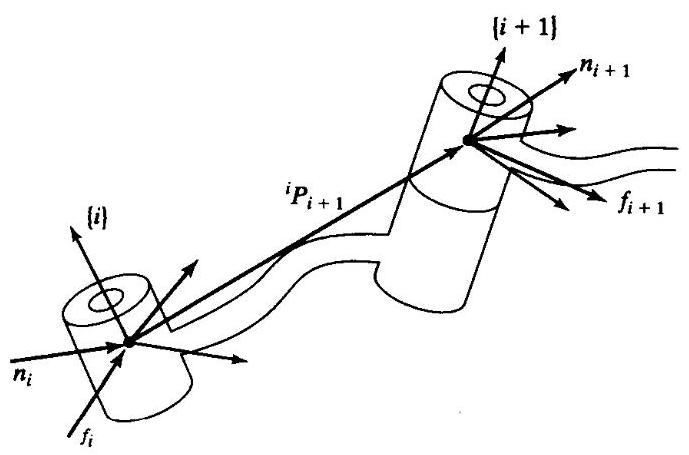

图5-11 单连杆的静力和静力矩平衡关系

如果我们从施加于手部的力和力矩的描述开始, 从末端连杆到基座 (连杆0) 进行计算就可以计算出作用于每一个连杆上的力和力矩, 为此, 对式 (5-76) 和式 (5-77) 进行整理, 以便从高序号连杆向低序号连杆进行迭代求解。结果如下

$$
{}^{i}{f}_{i} = {}^{i}{f}_{i + 1} \tag{5-78}
$$

$$
{}^{i}{n}_{i} = {}^{i}{n}_{i + 1} + {}^{i}{P}_{i + 1} \times  {}^{i}{f}_{i + 1} \tag{5-79}
$$

为了按照定义在连杆本体坐标系中的力和力矩写出这些表达式,用坐标系 $\{ i + 1\}$ 相对于坐标系 $\{ i\}$ 描述的旋转矩阵进行变换,就得到了最重要的连杆之间的静力 “传递” 表达式:

$$
{}^{i}{f}_{i} = {}_{i + 1}{R}^{i + 1}{f}_{i + 1} \tag{5-80}
$$

$$
{}^{i}{\mathbf{n}}_{i} = {}_{i + 1}^{i}{\mathbf{R}}^{i + 1}{\mathbf{n}}_{i + 1} + {}^{i}{\mathbf{P}}_{i + 1} \times  {}^{i}{\mathbf{f}}_{i} \tag{5-81}
$$

最后, 提出了一个重要的问题: 为了平衡施加在连杆上的力和力矩, 需要在关节上施加多大的力矩? 除了绕关节轴的力矩外, 力和力矩矢量的所有分量都可以由操作臂机构本身来平衡。 因此, 为了求出保持系统静平衡所需的关节力矩, 应计算关节轴矢量和施加在连杆上的力矩矢量的点积:

$$
{\tau }_{i} = {}^{i}{n}_{i}^{T}{}^{i}{\widehat{Z}}_{i} \tag{5-82}
$$

对于关节 $i$ 是移动关节的情况,可以计算出关节驱动力为

$$
{\tau }_{i} = {}^{i}{f}_{i}^{T}{}^{i}{\widehat{Z}}_{i} \tag{5-83}
$$

注意,即使对于线性的关节力,我们也使用符号 $\tau$ 。

按照惯例, 通常将使关节角增大的旋转方向定义为关节力矩的正方向。

式 (5-80) 到式 (5-83) 给出一种方法, 可以计算静态下用操作臂末端执行器施加力和力矩所需的关节力。

例5.7

例5.3的两连杆操作臂，在末端执行器施加作用力矢量 ${}^{3}F$ (可以认为该力是作用在坐标系 \{3\}原点的上)。按照位形函数和作用力的函数给出所需关节力矩(参见图5-12)。

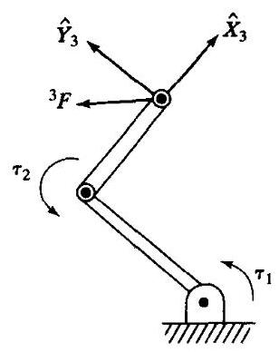

图 5-12

应用式 (5-80) 一式 (5-82), 从末端连杆开始向机器人的基座计算:

$$
{}^{2}{f}_{2} = \left\lbrack  \begin{matrix} {f}_{x} \\  {f}_{y} \\  0 \end{matrix}\right\rbrack \tag{5-84}
$$

$$
{}^{2}{n}_{2} = {l}_{2}{\widehat{X}}_{2} \times  \left\lbrack  \begin{matrix} {f}_{x} \\  {f}_{y} \\  0 \end{matrix}\right\rbrack   = \left\lbrack  \begin{matrix} 0 \\  0 \\  {l}_{2}{f}_{y} \end{matrix}\right\rbrack \tag{5-85}
$$

$$
{}^{1}{f}_{1} = \left\lbrack  \begin{matrix} {c}_{2} &  - {s}_{2} & 0 \\  {s}_{2} & {c}_{2} & 0 \\  0 & 0 & 1 \end{matrix}\right\rbrack  \left\lbrack  \begin{array}{l} {f}_{x} \\  {f}_{y} \\  0 \end{array}\right\rbrack   = \left\lbrack  \begin{matrix} {c}_{2}{f}_{x} - {s}_{2}{f}_{y} \\  {s}_{2}{f}_{x} + {c}_{2}{f}_{y} \\  0 \end{matrix}\right\rbrack \tag{5-86}
$$

$$
{}^{1}{n}_{1} = \left\lbrack  \begin{matrix} 0 \\  0 \\  {l}_{2}{f}_{y} \end{matrix}\right\rbrack   + {l}_{1}{\widehat{X}}_{1} \times  {}^{1}{f}_{1} = \left\lbrack  \begin{matrix} 0 \\  0 \\  {l}_{1}{s}_{2}{f}_{x} + {l}_{1}{c}_{2}{f}_{y} + {l}_{2}{f}_{y} \end{matrix}\right\rbrack \tag{5-87}
$$

于是有

$$
{\tau }_{1} = {l}_{1}{s}_{2}{f}_{x} + \left( {{l}_{2} + {l}_{1}{c}_{2}}\right) {f}_{y} \tag{5-88}
$$

$$
{\tau }_{2} = {l}_{2}{f}_{y} \tag{5-89}
$$

可将这个关系写成矩阵算子:

$$
\tau  = \left\lbrack  \begin{matrix} {l}_{1}{s}_{2} & {l}_{2} + {l}_{1}{c}_{2} \\  0 & {l}_{2} \end{matrix}\right\rbrack  \left\lbrack  \begin{array}{l} {f}_{x} \\  {f}_{y} \end{array}\right\rbrack \tag{5-90}
$$

这个矩阵是式 (5-66) 中求出的雅可比矩阵的转置, 但这并不是巧合!

## 5.10 力域中的雅可比

在静态下, 可知关节力矩完全与在手部上的力平衡。当力作用在机构上时, 如果机构有一个位移, 就作了功 (从技术意义上讲)。功被定义为作用力通过一段距离, 它是以能量为单位的标量。如令位移趋向于无穷小就可以用虚功原理来描述静止的情况。功具有能量的单位, 所以它在任何广义坐标系下的测量值都相同。特别是在笛卡儿空间作的功应当等于关节空间作的功。在多维空间, 功是一个力或力矩矢量与位移矢量的点积。于是有

$$
\mathcal{F} \cdot  {\delta \chi } = \tau  \cdot  {\delta \Theta } \tag{5-91}
$$

式中 $\mathcal{F}$ 是一个作用在末端执行器上的 $6 \times  1$ 维笛卡儿力-力矩矢量, ${\delta \chi }$ 是末端执行器的 $6 \times  1$ 维无穷小笛卡儿位移矢量， $\tau$ 是 $6 \times  1$ 维关节力矩矢量， ${\delta \Theta }$ 是 $6 \times  1$ 维无穷小的关节位移矢量。式 (5-91) 也可写成

$$
{\mathcal{F}}^{T}{\delta \chi } = {\tau }^{T}{\delta \Theta } \tag{5-92}
$$

雅可比矩阵的定义为

$$
{\delta \chi } = {J\delta \Theta } \tag{5-93}
$$

因此可写出

$$
{\mathcal{F}}^{T}{J\delta \theta } = {\tau }^{T}{\delta \Theta } \tag{5-94}
$$

对所有的 ${\delta \Theta }$ ,上式均成立,因此有

$$
{\mathcal{F}}^{T}J = {\tau }^{T} \tag{5-95}
$$

对上式两边转置, 可得:

$$
\tau  = {J}^{T}\mathcal{F} \tag{5-96}
$$

式 (5-96) 从一般意义上证明了例5.6中两连杆操作臂的特殊情况: 雅可比的转置将作用在手臂上的笛卡儿力映射成了等效关节力矩。当得到相对于坐标系 $\{ 0\}$ 的雅可比矩阵后,可以由下式对坐标系 $\{ 0\}$ 中的力矢量进行变换:

$$
\tau  = {}^{0}{J}^{T0}\mathcal{F} \tag{5-97}
$$

当雅可比矩阵不满秩时, 存在某些特定的方向, 末端执行器在这些方向上不能施加期望的静态力。即,如果式 (5-97) 中的雅可比矩阵奇异, $\mathcal{F}$ 在某些方向 (这些方向定义了雅可比矩阵的零空间 ${}^{\left\lbrack  6\right\rbrack  }$ 上的增大或减小与所求 $\tau$ 的值无关。这也意味着,在奇异位形附近,机械效益趋向于无穷大,以致只要很小的关节力矩就可在末端执行器产生很大的力。 ${}^{ \ominus  }$ 因此,在力域中和在位置域中奇异性都是存在的。

注意, 式 (5-97) 是一个非常有趣的关系式, 它可将一个笛卡儿空间的量变换为一个关节空间的量而无需计算任何运动学函数的逆解。在后面章节中讨论控制问题时将利用这个关系。

## 5.11 速度和静力的笛卡儿变换

可以根据 6 × 1 维的刚体广义速度表达式进行讨论:

$$
v = \left\lbrack  \begin{array}{l} v \\  \omega  \end{array}\right\rbrack \tag{5-98}
$$

同样,考虑 $6 \times  1$ 维的广义力矢量表达式,即

$$
\mathcal{F} = \left\lbrack  \begin{array}{l} F \\  N \end{array}\right\rbrack \tag{5-99}
$$

---

$\Theta$ 假设一个两连杆平面操作臂的末端执行器在与某表面接触时几乎完全伸展。在此种位形下，“很小”的力矩可以产生任意大的力。

---

式中 $F$ 是一个 $3 \times  1$ 力矢量, $N$ 是一个 $3 \times  1$ 的力矩矢量。很自然地可以想到用 $6 \times  6$ 变换阵将这些量从一个坐标系映射到另一个坐标系。这些工作已在连杆之间速度和力的传递的讨论中做过。 这里,用矩阵算子的形式写出式 (5-45) 和式 (5-47),将坐标系 $\{ A\}$ 中的广义速度矢量变换为在坐标系 $\{ B\}$ 中的描述。

这里涉及的两个坐标系之间的连接是刚性的, 所以在推导关系式时式 (5-45) 中出现的 ${\dot{\theta }}_{i + 1}$ 被置成零

$$
\left\lbrack  \begin{matrix} {}^{B}{v}_{B} \\  {}^{B}{\omega }_{B} \end{matrix}\right\rbrack   = \left\lbrack  \begin{matrix} {}_{A}^{B}R &  - {}_{A}^{B}{R}^{A}{P}_{BORG} \times  \\  0 & {}_{A}^{B}R \end{matrix}\right\rbrack  \left\lbrack  \begin{matrix} {}^{A}{v}_{A} \\  {}^{A}{\omega }_{A} \end{matrix}\right\rbrack \tag{5-100}
$$

式中, 叉乘可看成是矩阵算子

$$
P \times   = \left\lbrack  \begin{matrix} 0 &  - {p}_{x} & {p}_{y} \\  {p}_{x} & 0 &  - {p}_{x} \\   - {p}_{y} & {p}_{x} & 0 \end{matrix}\right\rbrack \tag{5-101}
$$

现在, 式 (5-100) 将一个坐标系的速度与另一个坐标系的速度联系起来, 因此这个6×6算子被称为速度变换矩阵,用符号 ${T}_{v}$ 表示。在这种情况中,它是一个将 $\{ A\}$ 中的速度映射到 $\{ B\}$ 中的速度的速度变换, 所以可用下列表达式将式 (5-100) 表示成紧凑的形式:

$$
{}^{B}{v}_{B} = {}_{A}^{B}{T}_{v}{}^{A}{v}_{A} \tag{5-102}
$$

已知 $\{ B\}$ 中的速度值,为了计算在 $\{ A\}$ 中的速度描述,可以对式 (5-100) 求逆:

$$
\left\lbrack  \begin{matrix} {}^{A}{\upsilon }_{A} \\  {}^{A}{\omega }_{A} \end{matrix}\right\rbrack   = \left\lbrack  \begin{matrix} {}_{B}^{A}R & {}^{A}{P}_{BORG} \times  {}_{B}^{A}R \\  0 & {}_{B}^{A}R \end{matrix}\right\rbrack  \left\lbrack  \begin{matrix} {}^{B}{\upsilon }_{B} \\  {}^{B}{\omega }_{B} \end{matrix}\right\rbrack \tag{5-103}
$$

即

$$
{}^{A}{v}_{A} = {}_{B}^{A}{T}_{v}^{B}{}^{B}{v}_{B} \tag{5-104}
$$

注意从坐标系到坐标系的速度变换是由 ${}_{B}^{A}T$ 确定的 (或它的逆变换),并且应被看作是瞬时结果,除非两个坐标系之间的关系是静止不变的。同样,由式 (5-80) 和式 (5-81) 可得 $6 \times  6$ 的矩阵,它可将在坐标系 $\{ B\}$ 中描述的广义力矢量变换成在坐标系 $\{ A\}$ 中的描述,即为

$$
\left\lbrack  \begin{array}{l} {}^{A}{F}_{A} \\  {}^{A}{N}_{A} \end{array}\right\rbrack   = \left\lbrack  \begin{matrix} {}_{B}^{A}R & 0 \\  {}_{A}{P}_{BORG} \times  {}_{B}^{A}R & {}_{B}^{A}R \end{matrix}\right\rbrack  \left\lbrack  \begin{array}{l} {}^{B}{F}_{B} \\  {}^{B}{N}_{B} \end{array}\right\rbrack \tag{5-105}
$$

可以写成紧凑形式

$$
A{\mathcal{F}}_{A} = {}_{B}^{A}{T}_{f} - {}_{B} \tag{5-106}
$$

式中 ${T}_{f}$ 用来表示一个力 - 力矩变换。

速度和力变换矩阵与雅可比矩阵相似, 可把不同坐标系中的速度和力联系起来。参照雅可比矩阵, 有

$$
{}_{B}^{A}{T}_{f} = {}_{B}^{A}{T}_{v}^{T} \tag{5-107}
$$

可通过式 (5-105) 和式 (5-103) 对上式进行检验。

例5.8

图5-13所示为一个持有工具的末端执行器。在固连在操作臂上的末端执行器上安装了一个腕力传感器。这个装置能够测量施加在它上面的力和力矩。

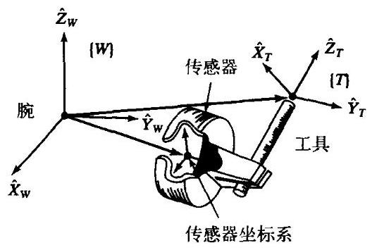

图5-13 带有力传感器的坐标系

假设传感器的输出为 $6 \times  1$ 的矢量 ${}^{s}\mathcal{F}$ ，它由传感器坐标系 $\{ S\}$ 中表示的三个力和三个力矩组成。我们真正感兴趣的是要知道施加在工具末端的力和力矩 ${}^{T}\mathcal{F}$ 。求出从 $\{ S\}$ 到工具坐标系 $\{ T\}$ 的 $6 \times  6$ 力 - 力矩矢量的变换矩阵。已知从 $\{ T\}$ 到 $\{ S\}$ 的变换 ${}_{S}^{T}T$ 。(注意,这里的 $\{ S\}$ 是传感器坐标系,而不是工作台坐标系。)

这是式 (5-106) 的简单应用。首先,从 ${}_{T}^{S}T$ 求出逆 ${}_{S}^{T}T$ 。 ${}_{S}^{T}T$ 由 ${}_{S}^{T}R$ 和 ${}^{T}{P}_{SORG}$ 组成。然后应用式 (5-106) 得到

$$
{}^{T}{\mathcal{F}}_{T} = {}_{S}^{T}{T}_{f}{}^{S}{\mathcal{F}}_{S} \tag{5-108}
$$

式中

$$
{}_{S}^{T}{T}_{f} = \left\lbrack  \begin{matrix} {}_{S}^{T}R & 0 \\  {}^{S}{P}_{SORG} \times  {}_{S}^{T}R & {}_{S}^{T}R \end{matrix}\right\rbrack \tag{5-109}
$$

**参考文献**

[1] K. Hunt, Kinematic Geometry of Mechanisms, Oxford University Press, New York, 1978.

[2] K.R. Symon, Mechanics, 3rd edition, Addison-Wesley, Reading, MA, 1971.

[3] I. Shames, Engineering Mechanics, 2nd edition, Prentice-Hall, Englewood Cliffs, NJ, 1967.

[4] D. Orin and W. Schrader, "Efficient Jacobian Determination for Robot Manipulators," in Robotics Research: The First International Symposium, M. Brady and R.P. Paul, Editors, MIT Press, Cambridge, MA, 1984.

[5] B. Gorla and M. Renaud, Robots Manipulateurs, Cepadues-Editions, Toulouse, 1984.

[6] B. Noble, Applied Linear Algebra, Prentice-Hall, Englewood Cliffs, NJ, 1969.

[7] J.K. Salisbury and J. Craig, "Articulated Hands: Kinematic and Force Control Issues," International Journal of Robotics Research, Vol. 1, No. 1, Spring 1982.

[8] C. Wampler, "Wrist Singularities: Theory and Practice," in The Robotics Review 2, O. Khatib, J. Craig, and T. Lozano-Perez, Editors, MIT Press, Cambridge, MA, 1992.

[9] D.E. Whitney, "Resolved Motion Rate Control of Manipulators and Human Prostheses," IEEE Transactions on Man-Machine Systems, 1969.

**习题**

5.1 [10] 用在坐标系 $\{ 0\}$ 中表达的雅可比矩阵重做例5.3。是否和例5.3的结果一致？

5.2 [25] 求出第3章习题3中的3自由度操作臂雅可比矩阵。在坐标系 \{4\} 中写出此矩阵, 坐标系 [4]位于手部末端且与坐标系 \{3\} 的方位相同。

5.3 [35] 求出第3章习题3中的3自由度操作臂雅可比矩阵。在坐标系 4 分中写出此矩阵, 坐标系 [4]位于手部末端且与坐标系 \{3\}的方位相同。用3种不同的方法推导雅可比矩阵:从基座到末端的速度传递; 从末端到基座的静力传递; 直接对运动学方程的微分。

5.4 [8] 证明在力域中的奇异位形与在位置域中的奇异位形相同。

5.5 [39] 计算PUMA560在坐标系 \{6\} 中的雅可比矩阵。

5.6 [47] 任何具有3个旋转关节且连杆长度非零的机构在其工作空间内一定有一条奇异点轨迹的说法是否正确?

5.7 [7] 画出一个3自由度机构的简图, 它的线速度雅可比矩阵在操作臂所有位形下是3×3的单位矩阵。用一两句话描述运动学解。

5.8 [18] 一般机构有时存在某些特定的位形, 称作 “各向同性点”, 这时雅可比矩阵的各列正交且模相同 ${}^{\left\lbrack  7\right\rbrack  }$ 。对于例5.3的两连杆操作臂,求出存在的各向同性点。提示: 对 ${l}_{1},{l}_{2}$ 有什么要求?

5.9 [50] 求出一般6自由度操作臂中存在各向同性点的必要条件。(见习题5.8)

5.10 [7] 对于例5.2的两连杆操作臂,求出将关节力矩变换成手部的 $2 \times  1$ 力矢量 ${}^{3}F$ 的变换矩阵。

5.11 [14] 已知

$$
{}_{B}^{A}T = \left\lbrack  \begin{matrix} {0.866} &  - {0.500} & {0.000} & {10.0} \\  {0.500} & {0.866} & {0.000} & {0.0} \\  {0.000} & {0.000} & {1.000} & {5.0} \\  0 & 0 & 0 & 1 \end{matrix}\right\rbrack
$$

如果在坐标系 $\{ A\}$ 原点的速度矢量是

$$
{}^{A}v = \left\lbrack  \begin{matrix} {0.0} \\  {2.0} \\   - {3.0} \\  {1.414} \\  {1.414} \\  {0.40} \end{matrix}\right\rbrack
$$

求出以坐标系 $\{ B\}$ 的原点为参考点的 $6 \times  1$ 速度矢量。

5.12 [15] 对于习题3.3的三连杆操作臂, 求与操作臂在工作空间边界上的奇异位形对应的一组关节角以及与操作臂在工作空间内部的奇异位形对应的另一组关节角。

5.13 [9] 某两连杆操作臂的雅可比矩阵为:

$$
{}^{0}J\left( \Theta \right)  = \left\lbrack  \begin{matrix}  - {l}_{1}{s}_{1} - {l}_{2}{s}_{12} &  - {l}_{2}{s}_{12} \\  {l}_{1}{c}_{1} + {l}_{2}{c}_{12} & {l}_{2}{c}_{12} \end{matrix}\right\rbrack
$$

不计重力,求出使操作臂产生静力矢量 ${}^{0}F = {10}{\widehat{X}}_{0}$ 的关节力矩。

5.14 [18] 如果PUMA560的连杆参数 ${a}_{3}$ 为 0,则当 ${\theta }_{3} =  - {90.0}^{ \circ  }$ 时会出现工作空间边界奇异。求出当奇异发生时, ${\theta }_{3}$ 的表达式。并证明如果 ${a}_{3}$ 为 0 时,结果为 ${\theta }_{3} =  - {90.0}^{ \circ  }$ 。提示: 在此位形下, 一条直线穿过关节轴 2 和 3，及轴 4，5 和 6 的交点。

5.15 [24]根据第3章例3.4操作臂的三个关节速率计算工具末端的线速度,求出 $3 \times  3$ 雅可比矩阵。 求出坐标系 扣 8 的雅可比矩阵。

5.16 [20] 一个用Z-Y-Z欧拉角描述的3R操作臂(即，用式 (2.72) 给出的正向运动学解，且 $\left. {\alpha  = {\theta }_{1},\beta  = {\theta }_{2},\gamma  = {\theta }_{3}}\right)$ ,求出联系关节速度和末端连杆角速度的雅可比矩阵。

5.17 [31]假设一般6自由度机器人,对所有的 $i$ 已知 ${}^{0}{\widehat{Z}}_{i}$ 和 ${}^{0}{P}_{\text{ lorg }}$ ——即,已知各连杆坐标系矢量 $Z$ 在基坐标系下的单位,并且已知各个连杆坐标系的原点在基坐标系下的位置。给出我们关心的工具点 (相对于连杆 $n$ 固定) 的速度,并且 ${}^{0}{P}_{\text{ tool }}$ 已知。现在,对于旋转关节,由关节 $i$ 的速度引起的工具末端的速度为

$$
{}^{0}{v}_{i} = {\dot{\theta }}_{i}^{0}{\widehat{Z}}_{i} \times  \left( {{}^{0}{P}_{\text{ tool }} - {}^{0}{P}_{\text{ torg }}}\right) \tag{5-110}
$$

并且由此关节的速度引起的连杆 $n$ 的角速度为

$$
{}^{0}{\omega }_{i} = {\dot{\theta }}_{i}{}^{0}{\widehat{Z}}_{i} \tag{5-111}
$$

分别对 ${}^{0}{v}_{i}$ 和 ${}^{0}{\omega }_{i}$ 求和可得出工具端的全部线速度和角速度。仿照式 (5-110) 和式 (5-111), 求出对于移动关节 $i$ 的表达式,且根据 ${\widehat{Z}}_{i},{P}_{\text{ iorg }},{P}_{\text{ tool }}$ 写出一个任意的 6 自由度操作臂的 $6 \times  6$ 雅可比矩阵。

5.18 [18] 已知一个3R机器人的运动学解为

$$
{}_{3}^{0}\mathbf{T} = \left\lbrack  \begin{matrix} {c}_{1}{c}_{23} &  - {c}_{1}{s}_{23} & {s}_{1} & {l}_{1}{c}_{1} + {l}_{2}{c}_{1}{c}_{2} \\  {s}_{1}{c}_{23} &  - {s}_{1}{s}_{23} &  - {c}_{1} & {l}_{1}{s}_{1} + {l}_{2}{s}_{1}{c}_{2} \\  {s}_{23} & {c}_{23} & 0 & {l}_{2}{s}_{2} \\  0 & 0 & 0 & 1 \end{matrix}\right\rbrack
$$

求 ${}^{0}J\left( \Theta \right)$ ,将其乘以关节速度矢量,求坐标系 \{3\} 的原点相对于坐标系\{0\}的线速度。 5.19 [15] 一个RP操作臂, 连杆2的原点位置为

$$
{}^{0}{P}_{2ORG} = \left\lbrack  \begin{matrix} {a}_{1}{c}_{1} - {d}_{2}{s}_{1} \\  {a}_{1}{s}_{1} + {d}_{2}{c}_{1} \\  0 \end{matrix}\right\rbrack
$$

求出将两个关节速率和坐标系 \{2\} 原点的线速度联系起来的 2 x 2 雅可比矩阵。求出使操作臂处于奇异位形的 $\Theta$ 值。

5.20 [15] 解释这句话的含义: “一个处于奇异位形的 $n$ 个自由度操作臂可以看作是一个处于 $n - 1$ 维空间的冗余操作臂。”

**编程习题**

1. 有两个相对固定的坐标系 $\{ A\}$ 和 $\{ B\}$ ——即 ${}_{B}^{A}T$ 是不变的。在平面运动情况下,定义坐标系 $\{ A\}$ 的速度为

$$
{}^{A}{v}_{A} = \left\lbrack  \begin{matrix} {}^{A}{\dot{x}}_{A} \\  {}^{A}{\dot{y}}_{A} \\  {}^{A}{\dot{\theta }}_{A} \end{matrix}\right\rbrack
$$

写出一个子程序,已知 ${}_{B}^{A}T$ 和 ${}^{A}{v}_{A}$ ,计算 ${}^{B}{v}_{B}$ 。提示: 此平面机构与式 (5-100) 类似。应用程序引导语句如下 (与 $\mathrm{C}$ 语言相似):

---

Procedure Veltrans (VAR brela: Trame; VAR vrela, vrelb: vec3);

---

式中 “vrela” 是相对于坐标系 $\{ A\}$ 的速度 ${}^{A}{v}_{A}$ ,并且 “vrelb” 是子程序的输出 (相对于坐标系 $\{ B\}$ 的速度即 ${}^{B}{v}_{B}$ )。

2. 求三连杆平面操作臂的 3 × 3 雅可比矩阵 (见例3.3)。为推导雅可比矩阵, 应进行速度传递分析 (方法如同例5.2) 或静力分析 (方法如同例5.6)。写出雅可比矩阵的推导过程。

编写一个子程序计算出坐标系 \{3\} 中的雅可比一一即关节角度的函数 ${}^{3}J\left( \Theta \right)$ 。注意坐标系 \{3\} 为原点在关节3轴上的标准连杆坐标系。应用程序引导语句如下 (与C语言相似):

---

Procedure Jacobian (VAR theta: vec3; Var Jac: mat33);

---

操作臂的参数为 ${l}_{2} = {l}_{2} = {0.5}\mathrm{\;m}$ 。

3. 对于某一任务, 一个工具坐标系和一个工作台坐标系的定义如下 (单位为m和deg):

$$
{}_{T}^{W}T = \left\lbrack  {xy\theta }\right\rbrack   = \left\lbrack  \begin{array}{lll} {0.1} & {0.2} & {30.0} \end{array}\right\rbrack
$$

$$
{}_{S}^{B}T = \left\lbrack  \begin{array}{lll} x & y & \theta  \end{array}\right\rbrack   = \left\lbrack  \begin{array}{lll} {0.0} & {0.0} & {0.0} \end{array}\right\rbrack
$$

在某一时刻, 工具末端的位置为

$$
{}_{T}^{S}T = \left\lbrack  {xy\theta }\right\rbrack   = \left\lbrack  {{0.6} - {0.3}\;{45.0}}\right\rbrack
$$

在同一时刻, 测得的关节速率 (deg/s) 为

$$
\dot{\Theta } = \left\lbrack  {{\dot{\theta }}_{1}{\dot{\theta }}_{2}{\dot{\theta }}_{3}}\right\rbrack   = \left\lbrack  \begin{array}{lll} {20.0} &  - {10.0} & {12.0} \end{array}\right\rbrack
$$

计算工具末端相对于自身坐标系的线速度和角速度,即 ${}^{T}{v}_{T}$ 。如果多于一个解,求出所有的解。

**MATLAB习题**

这个练习的重点是平面3自由度3R机器人 (见图3-6和3-7; DH参数由图3-8给出) 的雅可比矩阵及行列式、分步速度控制仿真和静力学逆解。

分步速度控制方法 ${}^{\left( 9\right) }$ 基于操作臂速度方程 ${}^{k}\dot{X} = {}^{k}J\dot{\Theta }$ ,式中 ${}^{k}J$ 是雅可比矩阵, $\dot{\Theta }$ 是关节相对速度矢量， ${}^{k}\dot{X}$ 是要求的笛卡儿速度矢量(包括平移和旋转)， $k$ 表示雅可比矩阵和笛卡儿速度表达式所在的坐标系。下图所示为一个分步速度控制算法仿真框图:

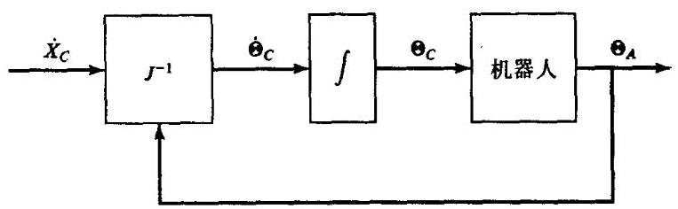

分步速度控制算法框图

如图中所示，分步速度控制算法计算期望的关节速率 ${\dot{\Theta }}_{C}$ 以得到期望的笛卡儿速度 ${\dot{X}}_{C}$ ；必须按此框图在每个仿真时步进行计算。雅可比矩阵随位形 ${\Theta }_{A}$ 改变。出于仿真的目的,假定期望的关节角度 ${\Theta }_{C}$ 总是和实际得到的关节角度 ${\Theta }_{A}$ 相同 (在实际中很难满足)。对平面 3 自由度 $3\mathrm{R}$ 机器人, $k = 0$ 时速度方程 ${}^{k}\dot{X} = {}^{k}J\dot{\Theta }$ 为

$$
\left( \begin{matrix} \dot{x} \\  \dot{y} \\  {\omega }_{z} \end{matrix}\right)  = {}^{0}\left\lbrack  \begin{matrix}  - {L}_{1}{s}_{1} - {L}_{2}{s}_{12} - {L}_{3}{s}_{123} &  - {L}_{2}{s}_{12} - {L}_{3}{s}_{123} &  - {L}_{3}{s}_{123} \\  {L}_{1}{c}_{1} + {L}_{2}{c}_{12} + {L}_{3}{c}_{123} & {L}_{2}{c}_{12} + {L}_{3}{c}_{123} & {L}_{3}{c}_{123} \\  1 & 1 & 1 \end{matrix}\right\rbrack  \left( \begin{array}{l} {\dot{\mathbf{\theta }}}_{1} \\  {\dot{\mathbf{\theta }}}_{2} \\  {\dot{\mathbf{\theta }}}_{3} \end{array}\right)
$$

式中 ${s}_{123} = \sin \left( {{\theta }_{1} + {\theta }_{2} + {\theta }_{3}}\right) ,{c}_{123} = \cos \left( {{\theta }_{1} + {\theta }_{2} + {\theta }_{3}}\right)$ 等等。注意 ${}^{0}\dot{X}$ 为手部坐标系 (位于图3-6中夹持器的中心) 原点相对于基坐标系 $\{ 0\}$ 原点的笛卡儿速度,并用坐标系 $\{ 0\}$ 的坐标表达。

目前大多数的工业机器人无法直接给出 ${\dot{\Theta }}_{C}$ 指令,所以必须首先将这些期望关节的相对速率进行积分得到期望的关节角度 ${\Theta }_{c}$ ，就可以在每个时步对机器人发出指令。实际上，最简单可行的积分可以完成此项工作,这里假定控制时步 ${\Delta t}$ : 很小 ${\Theta }_{\text{ new }} = {\Theta }_{\text{ old }} + \dot{\Theta }{\Delta t}$ 。在MATLAB的分步速度仿真中,假定期望的 ${\Theta }_{\mathrm{{new}}}$ 可被虚拟机器人全部完成(第6章和第9章中提出了动力学和控制的方法, 为此就无须做出这种简化假定)。一定要在完成分步速度计算之前用新的位形 ${\Theta }_{\text{ new }}$ 在下一时步对雅可比矩阵更新。

写出一个MATLAB程序计算雅可比矩阵并对平面3R机器人进行分步速度控制仿真。已知机器人连杆长度 ${L}_{1} = 4,{L}_{2} = 3,{L}_{3} = 2\left( \mathrm{\;m}\right)$ ; 起始关节角 $\Theta  = {\left\{  \begin{array}{lll} {\theta }_{1} & {\theta }_{2} & {\theta }_{3} \end{array}\right\}  }^{T} = {\left\{  \begin{array}{lll} {10}^{ \circ  } & {20}^{ \circ  } & {30}^{ \circ  } \end{array}\right\}  }^{T}$ ,并且恒定的期望笛卡儿速度 ${}^{0}\{ \dot{X}\}  = {\left\{  \dot{x}\dot{y}{\omega }_{z}\right\}  }^{T} = \{ {0.2} - {0.3} - {0.2}{\} }^{T}\left( {\mathrm{\;m}/\mathrm{s},\mathrm{m}/\mathrm{s},\mathrm{{rad}}/\mathrm{s}}\right)$ ,仿真时间为 $5\mathrm{\;s}$ ,时步为 ${dt} = {0.1}\mathrm{\;s}$ 。在同一个程序循环中,计算静力学逆解一即计算关节力矩 $T = {\left\{  \begin{array}{lll} {\tau }_{1} & {\tau }_{2} & {\tau }_{3} \end{array}\right\}  }^{T}\left( \mathrm{{Nm}}\right)$ ,已知恒定的期望笛卡儿力和力矩指令为 ${}^{0}\{ W\}  = {\left\{  \begin{array}{lll} {f}_{x} & {f}_{y} & {m}_{z} \end{array}\right\}  }^{T} = \{ {123}{\} }^{T}\left( {\mathrm{\;N},\mathrm{N},\mathrm{{Nm}}}\right)$ 。同样,在相同的程序循环中, 在屏幕上对这个机器人的每个时步进行动画显示, 这样就可以观察仿真运动是否正确。

a) 对指定的数值, 画出5张图 (请按每组数据分别画出):

1. 3 个主动关节速率 $\dot{\Theta } = {\left\{  {\dot{\theta }}_{1}{\dot{\theta }}_{2}{\dot{\theta }}_{3}\right\}  }^{T}$ 与时间的关系;

2.3 个主动关节角 $\Theta  = {\left\{  {\theta }_{1}{\theta }_{2}{\theta }_{3}\right\}  }^{T}$ 与时间的关系;

3. ${}_{H}^{0}T$ 的 3 个笛卡儿分量, $X = \{ {xy\phi }{\} }^{T}$ ( $\phi$ 应使用单位 $\mathrm{{rad}}$ ) 与时间的关系;

4. 雅可比矩阵行列式 $J$ 与时间的关系一在分步速度仿真中对靠近奇异点的程度进行评价;

5. 3 个主动关节力矩 $T = \left\{  {{\tau }_{1}{\tau }_{2}{\tau }_{3}}\right\}$ 与时间的关系。

在每个图中认真标出各个分量(最好用手画)；同时，标出轴的名称和单位。

b) 用Corke MATLAB Robotics工具箱检查一系列起始和终止关节角的雅可比矩阵结果。 试用函数jacob0()。注意: 雅可比函数工具箱适用于坐标系 \{3\} 相对于坐标系 \{0\} 的运动, 而不适用于由问题指定的坐标系 $\{ H\}$ 相对于坐标系 \{0\} 的运动。jacob0()给出了坐标系 ( 2 )中雅可比矩阵的结果；jacobn()将给出坐标系 \{ 3 \} 中的结果。
