# 第7章 轨迹的生成

## 7.1 概述

本章讨论计算轨迹的方法, 该轨迹描述了操作臂在多维空间中的期望运动。在这里, 轨迹指的是每个自由度的位置、速度和加速度的时间历程。

这个问题包括如何通过人机交互指定通过空间的一条轨迹或路径。为了使机器人系统的用户便于对操作臂的运动进行描述，不应当要求用户必须写出复杂的时间和空间的函数才能指定机器人任务。相反, 应该允许用户通过简单的描述来指定机器人的期望运动, 然后由系统来完成详细的计算。例如, 用户可能只需给定末端执行器期望的目标位姿, 而由系统来确定到达目标的准确路径、时间历程、速度曲线等等。

此外, 规划好的轨迹如何在计算机中进行描述也是一个值得关注的问题。最后, 要研究通过内部表达式计算轨迹的问题——即轨迹生成问题。大多数情况下，在轨迹生成的运行时间内需要计算位置、速度和加速度。这些轨迹由数字计算机计算, 因此要以某种速率计算轨迹点, 此速率叫做路径更新率。在典型的操作臂系统中，路径更新率在 ${60}\mathrm{\;{Hz}}$ 到 ${2000}\mathrm{\;{Hz}}$ 之间。

## 7.2 关于路径描述和路径生成的综述

在大多数情况下，将操作臂的运动看作是工具坐标系 $\{ T\}$ 相对于工作台坐标系 $\{ S\}$ 的运动。这两种运动的方式是相同的, 因为用户会感到按照这种方式描述路径和生成路径是非常有利的。

当按照工具坐标系相对于工作台坐标系的运动来指定路径时, 其实是将运动的描述与任何具体的机器人、末端执行器或工件相分离。由此得到的模型, 可将相同的路径描述应用于不同的操作臂或者用于具有不同工具尺寸的相同操作臂上。进而, 总是可以通过相对于工作台坐标系的运动规划来确定和规划运动着的工作台 (可能是一个传送带) 的运动, 而且在轨迹生成的运行时间内使得 $\{ S\}$ 的定义随时间变化。

如图7-1所示, 一个基本问题是将操作臂从初始位置移动到某个最终期望位置一一也就是将工具坐标系从当前值 $\left\{  {T}_{\text{ initial }}\right\}$ 移动到最终期望值 $\left\{  {T}_{\text{ final }}\right\}$ 。要注意,一般而言,运动包括工具相对于工作台的姿态变化和位置变化。

有时需要指定运动的更多细节而不只是简单地指定最终的期望位形。一种方法是在路径描述中给出一系列的期望中间点 (位于初始位置和最终期望位置之间的过渡点)。因此, 为了完成这个运动, 工具坐标系必须经过中间点所描述的一系列过渡位置与姿态。每个中间点实际上都是确定工具相对于工作台的位置与姿态的坐标系。路径点这个术语包括了所有的中间点以及初始点和最终点。需要记住的是，虽然通常使用 “点” 这个术语，但实际上它们是表达位置和姿态的坐标系。除了运动中的这些空间约束之外, 用户可能还希望指定运动的瞬时属性。例如, 在路径描述中可能还需要指定各中间点之间的时间间隔。

通常, 期望操作臂的运动是平滑的。为此, 要定义一个连续的且具有连续一阶导数的光滑函数。有时还希望二阶导数也是连续的。一般而言, 急速的运动会加剧机构的磨损, 激起操作臂共振。因此, 为了保证路径平滑, 必须在各中间点之间, 对路径的空间和时间特性给出一些限制条件。

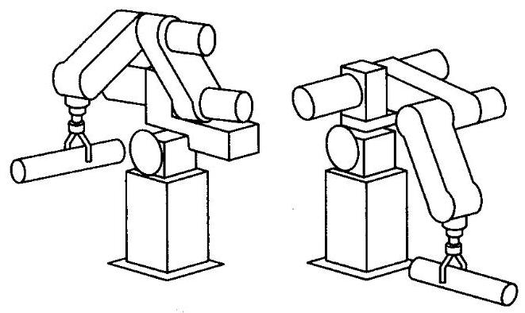

图7-1 在执行轨迹的过程中, 操作臂以平滑的方式从初始位置运动到期望的目标位置

这样看来存在着很多种选择, 因此可以使用很多方法来指定和规划路径。任何通过中间点的光滑函数都可以用来指定精确的路径。本章将从中选取一些简单的函数进行讨论。其他方法参见文献[1,2]和[13-16]。

## 7.3 关节空间规划方法

本节将研究以关节角的函数来描述轨迹 (在空间和时间) 的轨迹生成方法。

每个路径点通常是用工具坐标系 $\{ T\}$ 相对于工作台坐标系 $\{ S\}$ 的期望位姿来确定的。应用逆运动学理论，将中间点 “转换” 成一组期望的关节角。这样，就得到了经过各中间点并终止于目标点的 $n$ 个关节的光滑函数。对于每个关节而言,由于各路径段所需要的时间是相同的, 因此所有的关节将同时到达各中间点,从而得到 $\{ T\}$ 在每个中间点上的期望的笛卡儿位置。尽管对每个关节指定了相同的时间间隔，但对于某个特定的关节而言, 其期望的关节角函数与其他关节函数无关。

因此, 应用关节空间规划方法可以获得各中间点的期望位姿。尽管各中间点之间的路径在关节空间中的描述非常简单, 但在笛卡儿坐标空间中的描述却很复杂。一般情况下, 关节空间的规划方法便于计算, 并且由于关节空间与笛卡儿坐标空间之间并不存在连续的对应关系, 因而不会发生机构的奇异性问题。

**三次多项式**

下面考虑在一定时间内将工具从初始位置移动到目标位置的问题。应用逆运动学可以解出对应于目标位姿的各个关节角。操作臂的初始位置是已知的，并用一组关节角进行描述。 现在需要确定每个关节的运动函数,其在 ${t}_{0}$ 时刻的值为该关节的初始位置,在 ${t}_{f}$ 时刻的值为该关节的期望目标位置。如图7-2所示,有多种光滑函数 $\theta \left( t\right)$ 均可用于对关节角进行插值。

为了获得一条确定的光滑运动曲线,显然至少需要对 $\theta \left( t\right)$ 施加四个约束条件。通过选择初始值和最终值可得到对函数值的两个约束条件:

(7-1)

$$
\theta \left( 0\right)  = {\theta }_{0}
$$

$$
\theta \left( {t}_{f}\right)  = {\theta }_{f}
$$

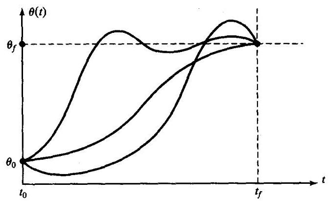

图7-2 某一关节的几种可能的路径曲线

另外两个约束条件需要保证关节速度函数连续, 即: 在初始时刻和终止时刻关节速度为零:

(7-2)

$$
\dot{\theta }\left( 0\right)  = 0
$$

$$
\dot{\theta }\left( {t}_{f}\right)  = 0
$$

次数至少为 3 的多项式才能满足这四个约束条件 (一个三次多项式有四个系数, 所以它能够满足由式 (7-1) 和式 (7-2) 给出的四个约束条件)。这些约束条件唯一确定了一个三次多项式。该三次多项式具有如下形式

$$
\theta \left( t\right)  = {a}_{0} + {a}_{1}t + {a}_{2}{t}^{2} + {a}_{3}{t}^{3} \tag{7-3}
$$

所以对应于该路径的关节速度和加速度显然有

$$
\dot{\theta }\left( t\right)  = {a}_{1} + 2{a}_{2}t + 3{a}_{3}{t}^{2} \tag{7-4}
$$

$$
\ddot{\theta }\left( t\right)  = 2{a}_{2} + 6{a}_{3}t
$$

把这四个期望的约束条件代入式(7-3)和式(7-4)可以得到含有四个未知量的四个方程:

$$
{\theta }_{0} = {a}_{0}
$$

$$
{\theta }_{f} = {a}_{0} + {a}_{1}{t}_{f} + {a}_{2}{t}_{f}^{2} + {a}_{3}{t}_{f}^{3} \tag{7-5}
$$

$$
0 = {a}_{1}
$$

$$
0 = {a}_{1} + 2{a}_{2}{t}_{f} + 3{a}_{3}{t}_{f}^{2}
$$

解出方程中的 ${a}_{i}$ ,可以得到

$$
{a}_{0} = {\theta }_{0}
$$

$$
{a}_{1} = 0
$$

$$
{a}_{2} = \frac{3}{{t}_{f}^{2}}\left( {{\theta }_{f} - {\theta }_{0}}\right) \tag{7-6}
$$

$$
{a}_{3} =  - \frac{2}{{t}_{f}^{3}}\left( {{\theta }_{f} - {\theta }_{0}}\right)
$$

应用式 (7-6) 可以求出从任何起始关节角位置到期望终止位置的三次多项式。但是该解仅适用于起始关节角速度与终止关节角速度均为零的情况。

例7.1

一个具有旋转关节的单杆机器人,处于静止状态时, $\theta  = {15}^{ \circ  }$ 。期望在 $3\mathrm{\;s}$ 内平滑地运动关节角至 $\theta  = {75}^{ \circ  }$ 。求出满足该运动的一个三次多项式的系数,并且使操作臂在目标位置为静止状态。 画出关节的位置、速度和加速度随时间变化的函数曲线。

将已知条件代入式 (7-6)，可以得到

$$
{a}_{0} = {15.0}
$$

(7-7)

$$
{a}_{1} = {0.0}
$$

$$
{a}_{2} = {20.0}
$$

$$
{a}_{3} =  - {4.44}
$$

根据式 (7-3) 和式 (7-4), 可以求得

$$
\theta \left( t\right)  = {15.0} + {20.0}{t}^{2} - {4.44}{t}^{3}
$$

$$
\dot{\theta }\left( t\right)  = {40.0t} - {13.33}{t}^{2} \tag{7-8}
$$

$$
\ddot{\theta }\left( t\right)  = {40.0} - {26.66t}
$$

图7-3所示为在40Hz时，对应于该运动的关节位置、速度和加速度函数曲线。注意，任何三次函数的速度曲线为抛物线, 加速度曲线为直线。

**具有中间点的路径的三次多项式**

到目前为止, 已经讨论了用期望的时间间隔和最终目标点描述的运动。一般而言, 希望确定包含中间点的路径。如果操作臂能够停留在每个中间点, 那么可以使用7.3节的三次多项式求解。

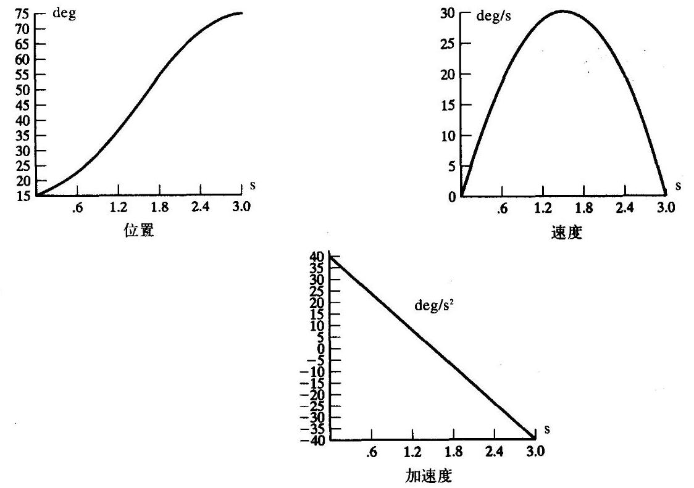

图7-3 一个三次曲线段的位置、速度和加速度曲线图, 起始和终止时均为静止

通常, 操作臂需要连续经过每个中间点, 所以应该归纳出一种能够使三次多项式满足路径约束条件的方法。

与单目标点的情形类似, 每个中间点通常是用工具坐标系相对于工作台坐标系的期望位姿来确定的。应用逆运动学把每个中间点 “转换” 成一组期望的关节角。然后, 考虑对每个关节求出平滑连接每个中间点的三次多项式。

如果已知各关节在中间点的期望速度, 那么就可像前面一样构造出三次多项式; 但是, 这时在每个终止点的速度约束条件不再为零，而是已知的速度。于是，式 (7-3) 的约束条件变成:

$$
\dot{\theta }\left( 0\right)  = {\dot{\theta }}_{0}
$$

$$
\dot{\theta }\left( {t}_{f}\right)  = {\dot{\theta }}_{f} \tag{7-9}
$$

描述这个一般三次多项式的四个方程为:

$$
{\theta }_{0} = {a}_{0}
$$

$$
{\theta }_{f} = {a}_{0} + {a}_{1}{t}_{f} + {a}_{2}{t}_{f}^{2} + {a}_{3}{t}_{f}^{3}
$$

$$
{\dot{\theta }}_{0} = {a}_{1} \tag{7-10}
$$

$$
{\dot{\theta }}_{f} = {a}_{1} + 2{a}_{2}{t}_{f} + 3{a}_{3}{t}_{f}^{2}
$$

求解方程组中的 ${a}_{i}$ ,可以得到

$$
{a}_{0} = {\theta }_{0}
$$

$$
{a}_{1} = {\dot{\theta }}_{0}
$$

$$
{a}_{2} = \frac{3}{{t}_{f}^{2}}\left( {{\theta }_{f} - {\theta }_{0}}\right)  - \frac{2}{{t}_{f}}{\dot{\theta }}_{0} - \frac{1}{{t}_{f}}{\dot{\theta }}_{f} \tag{7-11}
$$

$$
{a}_{3} =  - \frac{2}{{t}_{f}^{3}}\left( {{\theta }_{f} - {\theta }_{0}}\right)  + \frac{1}{{t}_{f}^{2}}\left( {{\dot{\theta }}_{f} + {\dot{\theta }}_{0}}\right)
$$

应用式 (7-11), 可求出符合任何起始和终止位置以及任何起始和终止速度的三次多项式。

如果在每个中间点处均有期望的关节速度, 那么可以简单地将式 (7-11) 应用到每个曲线段来求出所需的三次多项式。确定中间点处的期望关节速度可以使用以下几种方法:

1. 根据工具坐标系的笛卡儿线速度和角速度确定每个中间点的瞬时期望速度。

2. 在笛卡儿空间或关节空间使用适当的启发式方法, 系统自动选取中间点的速度。

3. 采用使中间点处的加速度连续的方法, 系统自动选取中间点的速度。

第一种方法, 利用在中间点上计算出的操作臂的雅克比逆矩阵, 把中间点的笛卡儿期望速度 “映射” 为期望的关节速度。如果操作臂在某个特定的中间点上处于奇异位置, 则用户将无法在该点处任意指定速度。对于一个路径生成算法而言, 其用处之一就是满足用户指定的期望速度。然而, 总是要求用户指定速度也是一个负担。因此, 一个方便的路径规划系统还应包括方法2或3(或者二者兼而有之)。

第二种方法, 系统使用一些启发式方法来自动地选择合理的中间点速度。图7-4所示为由中间点确定的某一关节 $\theta$ 的路径的方法。

在图7-4中, 已经合理选取了各中间点上的关节速度, 并用短直线来表示, 这些短直线即为曲线在每个中间点处的切线。这种选取结果是通过使用了概念和计算方法都很简单的启发式方法而得到的。假设用直线段把中间点连接起来。如果这些直线的斜率在中间点处改变符号, 则把速度选定为零; 如果这些直线的斜率没有改变符号, 则选取两斜率的平均值作为该点的速度。这样, 系统可以只根据规定的期望中间点, 来选取每个中间点的速度。

第三种方法，系统根据中间点处的加速度为连续的原则选取各点的速度。为此，需要一种新的方法。在这种样条曲线中设置一组数据, 在两条三次曲线的连接点处, 用速度和加速度均为连续的约束条件替换两个速度约束条件。 ${}^{ \ominus  }$

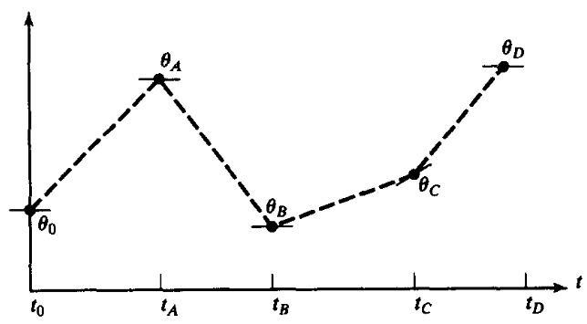

图7-4 有切线标记的点为期望速度的中间点

例7.2

试求解两个三次曲线的系数, 使得两线段连成的样条曲线在中间点处具有连续的加速度。 假设起始角为 ${\theta }_{0}$ ,中间点为 ${\theta }_{y}$ ,目标点为 ${\theta }_{g}$ 。

第一个三次曲线为

$$
\theta \left( t\right)  = {a}_{10} + {a}_{11}t + {a}_{12}{t}^{2} + {a}_{13}{t}^{2} \tag{7-12}
$$

第二个三次曲线为

$$
\theta \left( t\right)  = {a}_{20} + {a}_{21}t + {a}_{22}{t}^{2} + {a}_{23}{t}^{3} \tag{7-13}
$$

在一个时间段内,每个三次曲线的起始时刻为 $t = 0$ ,终止时刻 $t = {t}_{n}$ ,其中 $i = 1$ 或 $i = 2$ 。

施加的约束条件为

$$
{\theta }_{0} = {a}_{10}
$$

$$
{\theta }_{v} = {a}_{10} + {a}_{11}{t}_{f1} + {a}_{12}{t}_{f1}^{2} + {a}_{13}{t}_{f1}^{3}
$$

$$
{\theta }_{v} = {a}_{20}
$$

$$
{\theta }_{g} = {a}_{20} + {a}_{21}{t}_{f2} + {a}_{22}{t}_{f2}^{2} + {a}_{23}{t}_{f2}^{3} \tag{7-14}
$$

$$
0 = {a}_{11}
$$

$$
0 = {a}_{21} + 2{a}_{22}{t}_{f2} + 3{a}_{23}{t}_{f2}^{2}
$$

$$
{a}_{11} + 2{a}_{12}{t}_{f1} + 3{a}_{12}{t}_{f1}^{2} = {a}_{21}
$$

$$
2{a}_{12} + 6{a}_{13}{t}_{f1} = 2{a}_{22}
$$

这些约束条件确定了一个具有8个方程和8个未知数的线性方程组。当 ${t}_{f} = {t}_{n} = {t}_{p}$ 时可以得到

$$
{a}_{10} = {\theta }_{0}
$$

$$
{a}_{11} = 0
$$

$$
{a}_{12} = \frac{{12}{\theta }_{v} - 3{\theta }_{g} - 9{\theta }_{0}}{4{t}_{f}^{2}}
$$

$$
{a}_{13} = \frac{-8{\theta }_{v} + 3{\theta }_{g} + 5{\theta }_{0}}{4{t}_{f}^{3}}
$$

$$
{a}_{20} = {\theta }_{v} \tag{7-15}
$$

$$
{a}_{21} = \frac{3{\theta }_{g} - 3{\theta }_{0}}{4{t}_{f}}
$$

$$
{a}_{22} = \frac{-{12}{\theta }_{v} + 6{\theta }_{g} + 6{\theta }_{0}}{4{t}_{f}^{2}}
$$

$$
{a}_{23} = \frac{8{\theta }_{v} - 5{\theta }_{g} - 3{\theta }_{0}}{4{t}_{f}^{3}}
$$

---

$\Theta$ 在这里，术语“样条曲线”只是意味着随时间变化的函数曲线。

---

一般情况下,对于包含 $n$ 个三次曲线段的轨迹来说,当满足中间点处加速度为连续时,其方程组可以写成矩阵形式,可用来求解中间点的速度。该矩阵为三角阵,易于求解 ${}^{\left( 4\right) }$ 。

**高阶多项式**

有时用高阶多项式作为路径段。例如, 如果要确定路径段起始点和终止点的位置、速度和加速度, 则需要用一个五次多项式进行插值, 即

$$
\theta \left( t\right)  = {a}_{0} + {a}_{1}t + {a}_{2}{t}^{2} + {a}_{3}{t}^{3} + {a}_{4}{t}^{4} + {a}_{5}{t}^{5} \tag{7-16}
$$

其约束条件为

$$
{\theta }_{0} = {a}_{0}
$$

$$
{\theta }_{f} = {a}_{0} + {a}_{1}{t}_{f} + {a}_{2}{t}_{f}^{2} + {a}_{3}{t}_{f}^{3} + {a}_{4}{t}_{f}^{4} + {a}_{5}{t}_{f}^{5}
$$

(7-17)

$$
{\dot{\theta }}_{0} = {a}_{1}
$$

$$
{\dot{\theta }}_{f} = {a}_{1} + 2{a}_{2}{t}_{f} + 3{a}_{3}{t}_{f}^{2} + 4{a}_{4}{t}_{f}^{3} + 5{a}_{5}{t}_{f}^{4}
$$

$$
{\ddot{\theta }}_{0} = 2{a}_{2}
$$

$$
{\ddot{\theta }}_{f} = 2{a}_{2} + 6{a}_{3}{t}_{f} + {12}{a}_{4}{t}_{f}^{2} + {20}{a}_{5}{t}_{f}^{3}
$$

这些约束条件确定了一个具有6个方程和6个未知数的线性方程组, 其解为

$$
{a}_{0} = {\theta }_{0}
$$

$$
{a}_{1} = {\dot{\theta }}_{0}
$$

$$
{a}_{2} = \frac{{\ddot{\theta }}_{0}}{2} \tag{7-18}
$$

$$
{a}_{3} = \frac{{20}{\theta }_{f} - {20}{\ddot{\theta }}_{0} - \left( {8{\dot{\theta }}_{f} + {12}{\dot{\theta }}_{0}}\right) {t}_{f} - \left( {3{\ddot{\theta }}_{0} - {\ddot{\theta }}_{f}}\right) {t}_{f}^{2}}{2{t}_{f}^{3}}
$$

(7-18')

$$
{a}_{4} = \frac{{30}{\theta }_{0} - {30}{\theta }_{f} + \left( {{14}{\dot{\theta }}_{f} + {16}{\dot{\theta }}_{0}}\right) {t}_{f} + \left( {3{\ddot{\theta }}_{0} - 2{\ddot{\theta }}_{f}}\right) {t}_{f}^{2}}{2{t}_{f}^{4}}
$$

$$
{a}_{5} = \frac{{12}{\theta }_{f} - {12}{\theta }_{0} - \left( {6{\dot{\theta }}_{f} + 6{\dot{\theta }}_{0}}\right) {t}_{f} - \left( {{\ddot{\theta }}_{0} - {\ddot{\theta }}_{f}}\right) {t}_{f}^{2}}{2{t}_{f}^{5}}
$$

对于一个途经多个给定数据点的轨迹来说, 可用多种算法来求解描述该轨迹的光滑函数 (多项式或其他函数) ${}^{\left\lbrack  3,4\right\rbrack  }$ 。在本书中，将不对此进行介绍。

**与抛物线拟合的线性函数**

另外一种可选的路径形状是直线。即: 简单地从当前的关节位置进行线性插值, 直到终止位置, 如图7-5所示。请记住, 尽管在该方法中各关节的运动是线性的, 但是末端执行器在空间的运动轨迹一般不是直线。

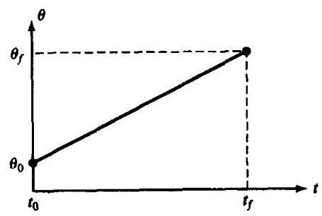

图7-5 线性插值要求加速度无穷大

然而, 直接进行线性插值将导致在起始点和终止点的关节运动速度不连续。为了生成一条位置和速度都连续的平滑运动轨迹, 开始先用线性函数, 但需在每个路径点增加一段抛物线拟合区域。

在运动轨迹的拟合区段内, 将使用恒定的加速度平滑地改变速度。图7-6所示为使用这种方法构造的简单路径。 直线函数和两个抛物线函数组合成一条完整的位置与速度均连续的路径。

为了构造这样的路径段, 假设两端的抛物线拟合区段具有相同的持续时间; 因此在这两个拟合区段中采用相同的恒定加速度 (符号相反)。如图7-7所示, 这里存在有多个解, 但是每个结果都对称于时间中点 ${t}_{h}$ 和位置中点 ${\theta }_{h}$ 。由于拟合区段终点的速度必须等于直线段的速度, 所以有

$$
\ddot{\theta }{t}_{b} = \frac{{\theta }_{h} - {\theta }_{b}}{{t}_{h} - {t}_{b}} \tag{7-19}
$$

式中, ${\theta }_{b}$ 是拟合段终点的 $\theta$ 值,而 $\ddot{\theta }$ 是拟合区段的加速度。 ${\theta }_{b}$ 的值由

$$
{\theta }_{b} = {\theta }_{0} + \frac{1}{2}\ddot{\theta }{t}_{b}^{2} \tag{7-20}
$$

给出。

联立式 (7-19) 和式 (7-20),且 $t = 2{t}_{h}$ ,可以得到

$$
\ddot{\theta }{t}_{b}^{2} - \ddot{\theta }t{t}_{b} + \left( {{\theta }_{f} - {\theta }_{0}}\right)  = 0 \tag{7-21}
$$

式中, $t$ 是期望的运动时间。对于任意给定的 ${\theta }_{f},{\theta }_{0}$ 和 $t$ ,可通过选取满足式 (7-21) 的 $\ddot{\theta }$ 和 ${t}_{b}$ 来获得任意一条路径。通常,先选择加速度 $\ddot{\theta }$ ,再计算式 (7-21),求解出相应的 ${t}_{b}$ 。选择的加速度必须足够大, 否则解将不存在。根据加速度和其他已知参数计算式 (7-21), 求解 ${t}_{b}$ :

$$
{t}_{b} = \frac{t}{2} - \frac{\sqrt{{\ddot{\theta }}^{2}{t}^{2} - 4\ddot{\theta }\left( {{\theta }_{f} - {\theta }_{0}}\right) }}{2\ddot{\theta }} \tag{7-22}
$$

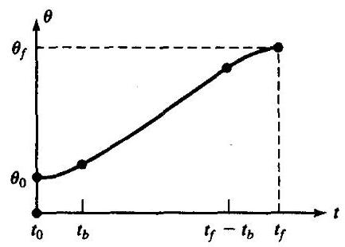

图7-6 带有抛物线拟合的直线段

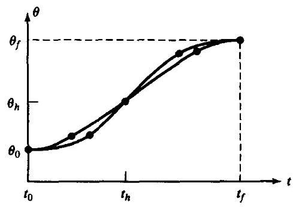

图7-7 带有抛物线拟合的直线段

在拟合区段使用的加速度约束条件为

$$
\ddot{\theta } \geq  \frac{4\left( {{\theta }_{f} - {\theta }_{0}}\right) }{{t}^{2}} \tag{7-23}
$$

当式 (7-23) 的等号成立时, 直线部分的长度缩减为零, 整个路径由两个拟合区段组成, 且衔接处的斜率相等。如果加速度的取值越来越大, 则拟合区段的长度将随之越来越短。当处于极限状态时, 即: 加速度无穷大, 路径又回复到简单的线性插值情况。

例7.3

与例7.1中讨论的单段路径相同, 这里给出两个带有抛物线拟合的直线路径例子。

图7-8(a)中，加速度 $\ddot{\theta }$ 的值选得较大。在这种情况下，关节迅速加速，然后转为匀速运动,最后减速。图7-8(b)所示的轨迹,由于所选的加速度 $\ddot{\theta }$ 相当小,以致直线区段几乎消失了。

**具有中间点的路径与抛物线拟合的线性函数**

现在讨论带有抛物线拟合的直线路径, 路径上指定了任意数量的中间点。图7-9所示, 为某个关节 $\mathbf{\theta }$ 在关节空间的一组中间点, 中间点之间使用线性函数相连, 而各中间点附近使用抛物线拟合。

在这里将使用如下符号: 用 $j, k$ 和 $l$ 表示三个相邻的路径点,位于路径点 $k$ 处的拟合区段的时间间隔为 ${t}_{k}$ ,位于点 $j$ 和 $k$ 之间的直线段的时间间隔为 ${t}_{jk}$ ,点 $j$ 和 $k$ 之间总的时间间隔为 ${t}_{djk}$ 。直线段的速度为 ${\ddot{\theta }}_{jk}$ ,而在点 $j$ 处拟合区段的加速度为 ${\ddot{\theta }}_{j}$ ,如图 7-9 所示。

与单段路径的情形相似, 存在许多可能解, 这取决于每个拟合区段的加速度值。已知所有的路径点 ${\theta }_{k}$ 、期望的时间间隔 ${t}_{ijk}$ 以及每个路径点处加速度的大小为 $\left| {\ddot{\theta }}_{k}\right|$ ,则可计算出拟合区段的时间间隔 ${t}_{k}$ 。对于那些内部的路径点,可直接使用下列公式计算:

$$
{\dot{\theta }}_{jk} = \frac{{\theta }_{k} - {\theta }_{j}}{{t}_{djk}}
$$

$$
{\ddot{\theta }}_{k} = \operatorname{SGN}\left( {{\dot{\theta }}_{kl} - {\dot{\theta }}_{jk}}\right) \left| {\ddot{\theta }}_{k}\right|
$$

$$
{t}_{k} = \frac{{\dot{\theta }}_{kl} - {\dot{\theta }}_{jk}}{{\ddot{\theta }}_{k}} \tag{7-24}
$$

$$
{t}_{jk} = {t}_{djk} - \frac{1}{2}{t}_{j} - \frac{1}{2}{t}_{k}
$$

但是, 对于第一个路径段和最后一个路径段的处理上稍有不同, 因为路段末端的整个拟合区段都必须计入到总路径段的时间间隔中。

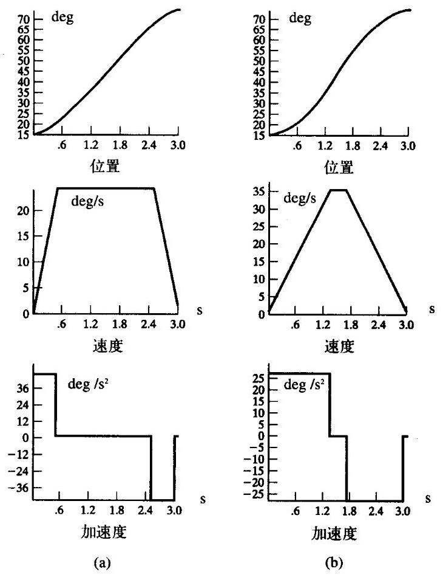

图7-8 带有抛物线拟合的线性插值的位置、速度和加速度曲线, 左边的一组曲线在拟合区段处的加速度高于右边的曲线

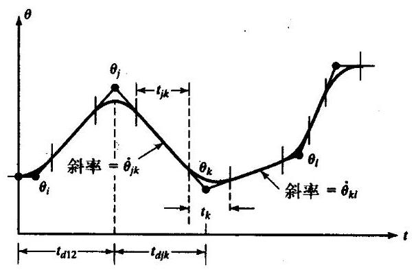

图7-9 多段带有拟合区段的直线路径

对于第一个路径段,令线性区段速度的两个速度表达式相等来求解 ${t}_{1}$ :

$$
\frac{{\theta }_{2} - {\theta }_{1}}{{t}_{12} - \frac{1}{2}{t}_{1}} = {\ddot{\theta }}_{1}{t}_{1} \tag{7-25}
$$

由此可解出起始点处的拟合时间 ${t}_{1}$ ,然后容易解出 ${\dot{\theta }}_{12}$ 和 ${t}_{12}$ :

$$
{\ddot{\theta }}_{1} = \operatorname{SGN}\left( {{\theta }_{2} - {\theta }_{1}}\right) \left| {\ddot{\theta }}_{1}\right|
$$

$$
{t}_{1} = {t}_{d12} - \sqrt{{t}_{d12}^{2} - \frac{2\left( {{\theta }_{2} - {\theta }_{1}}\right) }{{\ddot{\theta }}_{1}}}
$$

$$
{\dot{\theta }}_{12} = \frac{{\theta }_{2} - {\theta }_{1}}{{t}_{d12} - \frac{1}{2}{t}_{1}} \tag{7-26}
$$

$$
{t}_{12} = {t}_{d12} - {t}_{1} - \frac{1}{2}{t}_{2}
$$

同样,对于最后一个路径段 (连接点 $n - 1$ 到 $n$ ),有:

$$
\frac{{\theta }_{n - 1} - {\theta }_{n}}{{t}_{d\left( {n - 1}\right) n} - \frac{1}{2}{t}_{n}} = {\ddot{\theta }}_{n}{t}_{n} \tag{7-27}
$$

根据上式可求出

$$
{\ddot{\theta }}_{n} = \operatorname{SGN}\left( {{\theta }_{n - 1} - {\theta }_{n}}\right) \left| {\ddot{\theta }}_{n}\right|
$$

$$
{t}_{n} = {t}_{d\left( {n - 1}\right) n} - \sqrt{{t}_{d\left( {n - 1}\right) n}^{2} + \frac{2\left( {{\ddot{\theta }}_{n} - {\dddot{\theta }}_{n - 1}}\right) }{{\ddot{\theta }}_{n}}}
$$

$$
{\dot{\theta }}_{\left( {n - 1}\right) n} = \frac{{\theta }_{n} - {\theta }_{n - 1}}{{t}_{d\left( {n - 1}\right) n} - \frac{1}{2}{t}_{n}} \tag{7-28}
$$

$$
{t}_{\left( {n - 1}\right) n} = {t}_{d\left( {n - 1}\right) n} - {t}_{n} - \frac{1}{2}{t}_{n - 1}
$$

式 (7-24) ~ 式 (7-28) 可用来求出多段轨迹中各个拟合区段的时间和速度。通常用户只需给定中间点以及各个路径段的持续时间。在这种情况下, 系统使用各个关节的默认加速度值。有时, 为了方便用户起见, 系统还可按照默认的速度来计算持续时间。对于各个拟合区段, 加速度值必须取得足够大, 以便在下一个拟合区段开始之前有足够的时间进入直线区段。

例7.4

定义某个关节的轨迹,用 “deg” 为单位表示各路径点: 10,35,25,10。三个路径段的时间间隔分别为2s、1s和3s。所有拟合点处的默认加速度的绝对值为50deg/s²。计算各路径段的速度、拟合区段的持续时间和直线区段的持续时间。

对第一个曲线段, 利用式 (7-26) 得到

$$
{\ddot{\theta }}_{1} = {50.0} \tag{7-29}
$$

利用式 (7-26) 求出起始点处拟合区段的持续时间，得到

$$
{t}_{1} = 2 - \sqrt{4 - \frac{2\left( {{35} - {10}}\right) }{50.0}} = {0.27} \tag{7-30}
$$

由式 (7-26) 求出速度 ${\dot{\theta }}_{12}$

$$
{\dot{\theta }}_{12} = \frac{{35} - {10}}{2 - {0.5}\left( {0.27}\right) } = {13.50} \tag{7-31}
$$

由式 (7-24) 求出速度 ${\dot{\theta }}_{23}$ ,

$$
{\dot{\theta }}_{23} = \frac{{25} - {35}}{1} =  - {10.0} \tag{7-32}
$$

然后由式 (7-24) 得到

$$
{\ddot{\theta }}_{2} =  - {50.0} \tag{7-33}
$$

再由式 (7-24) 求出 ${t}_{2}$ ,得到

$$
{t}_{2} = \frac{-{10.0} - {13.50}}{-{50.0}} = {0.47} \tag{7-34}
$$

由式 (7-26) 求出路径段 1 的直线区段的持续时间长度:

$$
{t}_{12} = 2 - {0.27} - \frac{1}{2}\left( {0.47}\right)  = {1.50} \tag{7-35}
$$

然后, 由式 (7-29) 得到

$$
{\ddot{\theta }}_{4} = {50.0} \tag{7-36}
$$

于是,对于最末路径段,利用式 (7-28) 求出 ${t}_{4}$ ,得到

$$
{t}_{4} = 3 - \sqrt{9 + \frac{2\left( {{10} - {25}}\right) }{50.0}} = {0.102} \tag{7-37}
$$

由式 (7-28) 求出速度 ${\dot{\theta }}_{34}$

$$
{\dot{\theta }}_{34} = \frac{{10} - {25}}{3 - {0.050}} =  - {5.10} \tag{7-38}
$$

然后, 应用式 (7-24) 得到

$$
{\ddot{\theta }}_{3} = {50.0} \tag{7-39}
$$

从式 (7-24) 解出 ${t}_{3}$ :

$$
{t}_{3} = \frac{-{5.10} - \left( {-{10.0}}\right) }{50} = {0.098} \tag{7-40}
$$

最后, 由式 (7-24) 得到

$$
{t}_{23} = 1 - \frac{1}{2}\left( {0.47}\right)  - \frac{1}{2}\left( {0.098}\right)  = {0.716} \tag{7-41}
$$

$$
{t}_{34} = 3 - \frac{1}{2}\left( {0.098}\right)  - {0.012} = {2.849} \tag{7-42}
$$

以上给出了轨迹 “规划” 的计算结果。在执行过程中, 路径生成器利用这些数据按照轨迹更新速率求出 $\theta$ , $\dot{\theta }$ 和 $\ddot{\theta }$ 。

值得注意的是, 多段带有抛物线拟合的直线样条曲线实际并没有经过那些中间点, 除非操作臂在这些中间点处停留。通常, 如果选取的加速度足够大, 则实际路径将与期望的中间点非常接近。如果希望操作臂途经并停留在某个中间点, 只需要在路径中重复定义这个路径点即可。

如果用户希望操作臂精确地经过某个中间点而不停留，则仍可采用前面相同的计算公式， 但需要做以下补充:系统将操作臂希望经过的中间点自动替换为位于其两侧的两个伪中间点 (如图7-10所示)。然后利用前面的办法生成路径。原来的中间点将位于连接两个伪中间点的直线段上。除了要求操作臂精确地经过中间点之外, 用户还可以要求操作臂按一定的速度经过该中间点。如果用户没有规定速度，系统就使用适当的启发式方法选定速度。术语经过点 (而不是 “中间点”)被用来定义强迫操作臂准确经过的路径点。

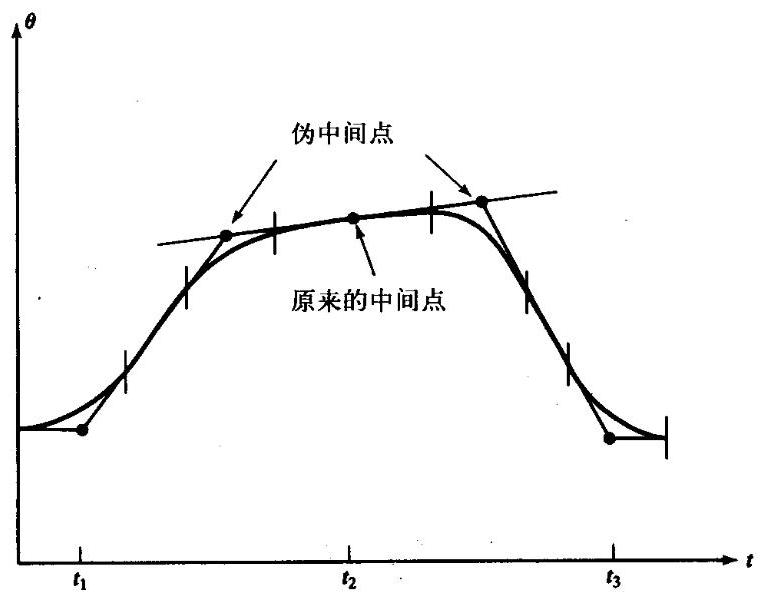

图7-10 用伪中间点来产生一个“经过点”

## 7.4 笛卡儿空间规划方法

如同7.3节所述, 在关节空间中计算出的路径可保证操作臂能够到达中间点和目标点, 即使这些路径点是用笛卡儿坐标系来规定的。不过, 末端执行器在空间的路径不是直线, 而且, 其路径的复杂程度取决于操作臂特定的运动学特性。在本节讨论的路径生成方法是用笛卡儿位姿关于时间的函数来描述路径形状。此方法可以确定路径点之间的空间路径形状。最常见的路径形状是直线，不过也会使用圆、正弦或其他路径形状。

每个路径点通常由工具坐标系相对于工作台坐标系的期望位姿来确定。在基于笛卡儿空间的路径规划方法中, 形成轨迹的样条函数是描述笛卡儿变量的随时间变化的函数。这些路径可直接根据用户指定的路径点进行规划,这些路径点是由 $\{ T\}$ 相对于 $\{ S\}$ 来描述的,无需事先进行逆运动学求解。可是, 执行笛卡儿规划的计算量很大, 因为在运行时必须以实时更新路径的速度求出运动学逆解——即在笛卡儿空间生成路径后，最后一步要通过求解逆运动学计算出期望的关节角度。

在工业机器人研究协会 (the research and industrial robotics community) 的文献[1, 2]中已提出了几种生成笛卡儿路径的规划方法。作为示例, 下节将介绍一种方法。在这个规划方法中, 将用到前面介绍过的关节空间的直线/抛物线样条函数方法。

**笛卡儿直线运动**

通常, 希望能够简单地确定空间路径, 使工具的末端在空间作直线运动。显然, 如果在一条直线上密集地指定许多分离的中间点, 那么不管在中间点之间使用何种光滑函数进行连接, 工具末端都走直线。但是, 如果能让工具在相隔较远的中间点之间走直线路径, 则会更为方便一些。这种定义和执行路径的模式被称作笛卡儿直线运动。使用直线来定义运动是更为一般意义上的笛卡儿运动的子集。在笛卡儿运动中, 可以使用笛卡儿变量关于时间的任意函数来定义路径。能完成一般笛卡儿运动的系统，可以执行诸如椭圆或正弦的路径形状。

在规划和生成笛卡儿直线路径时, 最好使用带有抛物线拟合的直线样条函数。在每段的直线部分, 位置的三个分量都以线性方式发生变化, 所以末端执行器会沿着直线路径在空间运动。然而, 如果在每个中间点将姿态定义成旋转矩阵, 则无法对其分量进行线性插值, 因为这样做不一定总能得到有效的旋转矩阵。一个旋转矩阵必须是由正交列向量组成, 而在两个有效的矩阵之间对矩阵元素进行线性插值并不能保证满足这个条件。因此, 可以使用另一种姿态的表示方法。

如第2章所述, 使用轴角坐标系表示方法可以只需三个参数来定义姿态。如果把这种姿态的表示方法与 $3 \times  1$ 的笛卡儿位置表示方法相结合,就可得到 $6 \times  1$ 的笛卡儿位置与姿态的表示方法。考虑一个中间点,其相对于工作台坐标系的定义为 ${}_{A}^{S}T$ 。坐标系 $\{ A\}$ 定义了一个中间点, 在该点处末端执行器的位置由 ${}^{S}{P}_{AORG}$ 给定,姿态由 ${}_{A}^{S}R$ 给定。该旋转矩阵可被转换成轴角坐标系的表示 ${ROT}\left( {{}^{S}{\widehat{K}}_{A},{\theta }_{SA}}\right)$ ——或简写成 ${}^{S}{K}_{A}$ 。这里使用符号 $\chi$ 代表该 $6 \times  1$ 的笛卡儿位置与姿态矢量。于是, 得到:

$$
{}^{S}{\chi }_{A} = \left\lbrack  \begin{matrix} {}^{S}{P}_{AORG} \\  {}^{S}{K}_{A} \end{matrix}\right\rbrack \tag{7-43}
$$

式中, ${}^{S}{K}_{A}$ 为转动量 ${\theta }_{SA}$ 与单位矢量 ${}^{S}{\widehat{K}}_{A}$ 相乘。如果每个路径点均使用这种方法来表示,那么就可以选择适当的样条函数, 使这六个分量随时间从一个路径点平滑地移动到下一个路径点。 如果采用带有抛物线拟合的直线函数, 那么中间点之间的路径则为直线。当通过中间点时, 末端执行器的线速度与角速度将作平滑地变化。

注意, 此法与其他笛卡儿-直线-运动规划方法不同, 当从一点运动到另一点时, 此法不能保证只绕一个 “等效轴” 旋转。相反, 该方法只是能够得到姿态的平滑变化以及可以应用前面介绍过的同样的关节空间轨迹规划的插值方法。

另外需要说明的是, 姿态的轴角坐标系表示方法并不唯一, 即

$$
\left( {{}^{S}{\widehat{K}}_{A},{\theta }_{SA}}\right)  = \left( {{}^{S}{\widehat{K}}_{A},{\theta }_{SA} + n{360}^{ \circ  }}\right) \tag{7-44}
$$

式中, $n$ 为任意的正整数或负整数。当操作臂从中间点 $\{ A\}$ 运动到中间点 $\{ B\}$ 时,总的转动量应取最小值。如果 $\{ A\}$ 的姿态由 ${}^{s}{K}_{A}$ 给出,则必须选择特定的 ${}^{s}{K}_{B}$ 使得 $\left| {{}^{s}{K}_{B} - {}^{s}{K}_{A}}\right|$ 最小。例如, 图7-11所示为四个可能的 ${}^{S}{K}_{B}$ 及其与给定的 ${}^{S}{K}_{A}$ 之间的关系。通过对矢量(虚线)长度的差别进行比较,从而判断哪个 ${}^{S}{K}_{B}$ 会使转动量最小一在此例中,是 ${}^{S}{K}_{B\left( {-1}\right) }$ 。

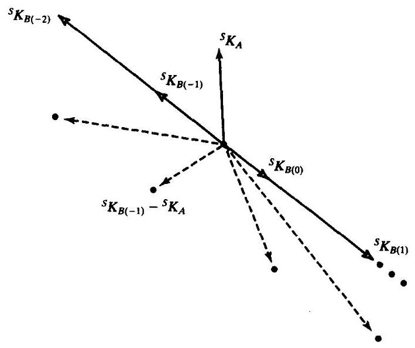

图7-11 选用轴角坐标系表示法使转动最小

一旦对每个中间点选定了 $\chi$ 的6个值,就可使用前面介绍的用直线和抛物线组合的样条函数进行路径规划。但是要附加一个约束条件: 每个自由度的拟合时间必须是相同的, 这样才能保证各自由度形成的复合运动在空间是一条直线。因为各自由度的拟合时间相同, 所以在拟合区段的加速度便不相同。因此, 在指定拟合区段的时间间隔时, 应该使用式 (7-24) 计算所需要的加速度 (而不使用其他方法)。可以通过选择适当的拟合时间以使加速度不超过上限。

还可以使用许多其他对笛卡儿路径的姿态进行描述和插值的方法。其中, 可以使用2.8节介绍的3×1姿态表示法。例如, 某些工业机器人使用与Z-Y-Z欧拉角相似的表示方法对姿态进行插值, 以使机器人沿笛卡儿直线路径运动。

## 7.5 笛卡儿路径的几何问题

由于笛卡儿空间描述的路径形状与关节位置之间有连续的对应关系, 所以笛卡儿空间的路径容易出现与工作空间和奇异点有关的各种问题。

**问题之一:不可达的中间点**

尽管操作臂的起始点和目标点都在其工作空间内部, 但是很有可能在连接这两点的直线上有某些点不在工作空间中, 例如图7-12所示的平面两杆机器人及其工作空间。在此例中, 连杆2比连杆1短, 所以在工作空间的中间存在一个空洞, 其半径为两连杆长度之差。起始点 $A$ 和目标点 $B$ 均在工作空间中,在关节空间中从 $A$ 运动到 $B$ 没有问题。但是如果试图在笛卡儿空间沿直线运动, 将无法到达路径上的某些中间点。该例表明了在某些情况下, 关节空间中的路径容易实现,而笛卡儿空间中的直线路径将无法实现 ${}^{ \ominus  }$ 。

---

日有些机器人系统在移动操作臂之前提前通知用户可能发生的问题，而对于另外一些机器人系统来说，操作臂沿着路径开始运动直到某些关节达到了极限位置时, 操作臂的运动才会停止。

---

**问题之二: 在奇异点附近的高关节速率**

从第5章可以看到, 在操作臂的工作空间中存在着某些位置, 在这些位置处无法用有限的关节速度来实现末端执行器在笛卡儿空间的期望速度。因此, 有某些路径 (在笛卡儿空间描述) 是操作臂所无法执行的, 这一点并不奇怪。例如, 如果一个操作臂沿笛卡儿直线路径接近机构的一个奇异位形时, 则机器人的一个或多个关节速度可能增加至无穷大。由于机构的速度是有上限的, 因此这通常将导致操作臂偏离期望的路径。

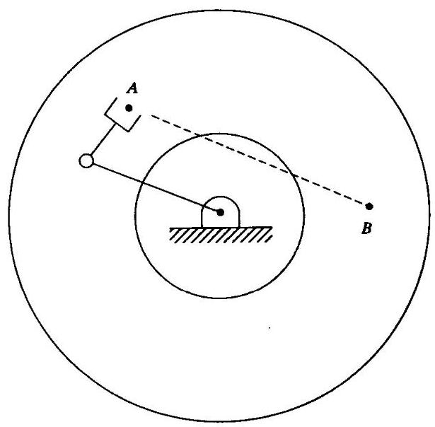

图7-12 笛卡儿路径问题之一

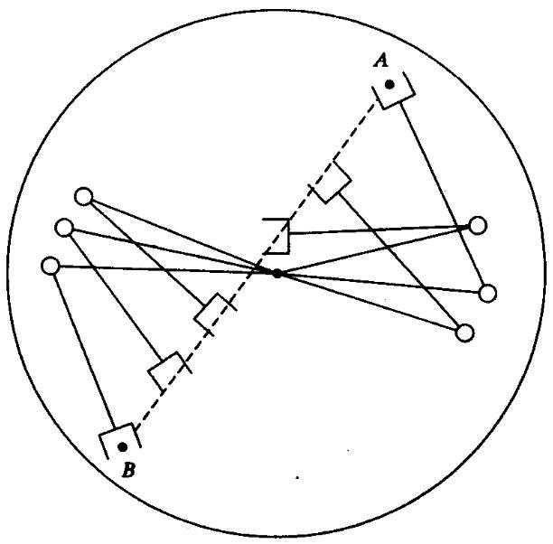

图7-13 笛卡儿路径问题之二

例如,图7-13给出了一个平面两杆 (两杆长度相同) 操作臂,从 $A$ 点沿着路径运动到 $B$ 点。 期望轨迹是使操作臂末端以恒定的线速度作直线运动。图中画出了操作臂在运动过程中的一些中间位置以便于观察其运动。可以看到, 路径上的所有点都可以到达, 但是当机器人经过路径的中间部分时, 关节1的速度非常高。路径越接近关节1的轴线, 关节1的速度就越大。一个解决办法是减小这个路径上的所有运动速度, 以使所有关节速度在其容许范围内。虽然这样可能不能保证路径上的瞬时特性, 但是至少由路径定义的空间点都能够达到。

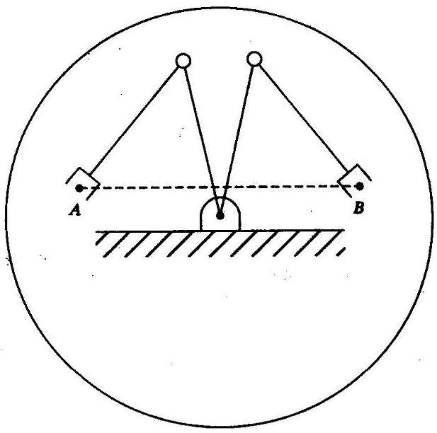

图7-14 笛卡儿路径问题之三

**问题之三:不同解下的可达起点和终点**

图7-14可以说明第三类问题。在这里, 平面两杆操作臂的两个杆长度相等, 但是关节存在约束, 这使机器人到达空间给定点的解的数量减少。尤其是当操作臂不能使用与起始点相同的解到达终点时, 就会出现问题。如图7-14 所示, 某些解可以使操作臂到达所有的路径点, 但并非任何解都可以到达。这样, 操作臂的转迹规划系统可以使机器人无需沿路径运动就能检测到这种问题，并向用户报错。

为了处理在笛卡儿空间定义路径存在的这些问题, 大多数工业操作臂控制系统都具有关节空间和笛卡儿空间的路径生成功能。用户很快可明白由于使用笛卡儿空间路径存在一定困难, 所以一般默认使用关节空间路径。只有在必要时, 才使用笛卡儿空间的路径规划方法。

## 7.6 路径的实时生成

在实时运行时,路径生成器不断生成用 $\theta ,\dot{\theta }$ 和 $\ddot{\theta }$ 构造的轨迹,并且将此信息传送至操作臂的控制系统。路径生成器以一定的路径更新率进行轨迹计算。

**关节空间路径的生成**

按照7.3节介绍的几种样条拟合方法生成的路径, 其结果都是有关各个路径段的一组数据。 这些数据被路径生成器用来实时计算 $\theta ,\dot{\theta }$ 和 $\ddot{\theta }$ 。

对于三次样条曲线,路径生成器只需随 $t$ 的变化不断计算式 (7-3)。当到达路径段的终点时, 调用新路径段的三次样条系数, 重新把 $t$ 置成零,继续生成路径。

对于带抛物线拟合的直线样条曲线,每次更新轨迹时,应首先检测时间 $t$ 的值,以判断当前是处在路径段的直线区段还是抛物线拟合区段。在直线区段, 对每个关节的轨迹计算如下:

$$
\theta  = {\theta }_{j} + {\dot{\theta }}_{jk}t
$$

$$
\dot{\theta } = {\dot{\theta }}_{jk} \tag{7-45}
$$

$$
\ddot{\theta } = 0
$$

式中, $t$ 是自第 $j$ 个中间点算起的时间, ${\dot{\theta }}_{jk}$ 的值在路径规划时按式 (7-24) 计算。在拟合区段, 对各关节的轨迹计算如下:

$$
{t}_{inb} = t - \left( {\frac{1}{2}{t}_{j} + {t}_{jk}}\right)
$$

$$
\theta  = {\theta }_{j} + {\dot{\theta }}_{jk}\left( {t - {t}_{inb}}\right)  + \frac{1}{2}{\ddot{\theta }}_{k}{t}_{inb}^{2}
$$

$$
\dot{\theta } = {\dot{\theta }}_{jk} + {\ddot{\theta }}_{k}{t}_{inb} \tag{7-46}
$$

$$
\ddot{\theta } = {\ddot{\theta }}_{k}
$$

式中, ${\dot{\theta }}_{jk},{\ddot{\theta }}_{k},{t}_{j}$ 和 ${t}_{jk}$ 在路径规划时根据式 (7-24) ~ (7-28) 计算。当进入一个新的直线区段时,将 $t$ 重置成 $\frac{1}{2}{t}_{k}$ ,继续计算,直到计算出所有表示路径段的数据集合。

**笛卡儿空间路径的生成**

在7.4节中已经介绍了笛卡儿空间路径规划方法, 使用路径生成器生成带有抛物线拟合的直线样条曲线。但是, 计算得到的数值表示的是笛卡儿空间的位置和姿态而不是关节变量值, 所以这里使用符号 $x$ 来表示笛卡儿位姿矢量的一个分量,并重写式 (7-45) 和式 (7-46)。在曲线的直线区段, $x$ 中的每个自由度按下式计算:

$$
x = {x}_{j} + {\dot{x}}_{jk}t
$$

$$
\dot{x} = {\dot{x}}_{jk} \tag{7-47}
$$

$$
\ddot{x} = 0
$$

式中, $t$ 是自第 $j$ 个中间点算起的时间,而 ${\dot{x}}_{jk}$ 是在路径规划时由类似于式 (7-24) 的方程求出的。在拟合区段中，每个自由度的轨迹计算如下:

$$
{t}_{inb} = t - \left( {\frac{1}{2}{t}_{j} + {t}_{jk}}\right)
$$

$$
x = {x}_{j} + {\dot{x}}_{jk}\left( {t - {t}_{inb}}\right)  + \frac{1}{2}{\ddot{x}}_{k}{t}_{inb}^{2} \tag{7-48}
$$

$$
\dot{x} = {\dot{x}}_{jk} + {\ddot{x}}_{k}{t}_{inb}
$$

$$
\ddot{x} = {\ddot{x}}_{k}
$$

式中, ${\dot{x}}_{jk},{\ddot{x}}_{k},{t}_{j}$ 和 ${t}_{jk}$ 的值在路径规划时计算出,与关节空间的情况完全相同。

最后,这些笛卡儿空间的轨迹 $\left( {\chi ,\dot{\chi },\ddot{\chi }}\right)$ 必须变换为等效的关节空间的变量。此问题的完整解析解应使用逆运动学计算关节的位置。用逆雅克比矩阵计算关节速度, 用逆雅克比矩阵及其导数计算角加速度 ${}^{\left\lbrack  5\right\rbrack  }$ 。在实际中经常使用的简单方法为: 根据路径更新率,将 $\chi$ 变换为等效的坐标系 ${}_{G}^{S}\mathbf{T}$ 表示。使用SOLVE算法 (见 4.8 节) 求出所需的关节角矢量 $\mathbf{\Theta }$ 。然后用数值微分计算出 $\dot{\Theta }$ 和 $\ddot{\Theta }{}^{ \ominus  }$ 。于是,算法为

$$
\chi  \rightarrow  {}_{G}^{S}T
$$

$$
\Theta \left( t\right)  = \operatorname{SOLVE}\left( {{}_{G}^{S}T}\right)
$$

$$
\dot{\Theta }\left( t\right)  = \frac{\Theta \left( t\right)  - \Theta \left( {t - {\delta t}}\right) }{\delta t} \tag{7-49}
$$

$$
\ddot{\Theta }\left( t\right)  = \frac{\dot{\Theta }\left( t\right)  - \dot{\Theta }\left( {t - {\delta t}}\right) }{\delta t}
$$

然后把 $\Theta ,\dot{\Theta },\ddot{\Theta }$ 输入给操作臂的控制系统。

## 7.7 使用机器人编程语言描述路径

在第12章将进一步讨论机器人编程语言。在此只说明在本章讨论的多种路径如何用机器人编程语言定义。在这些例子中，将使用AL语言，一种由斯坦福大学开发的机器人编程语言 ${}^{\left\lbrack  6\right\rbrack  }$ 。

在下列AL语言示例中,符号 $A\text{ 、 }B\text{ 、 }C\text{ 、 }D$ 表示与 “坐标系” 有关的变量,它们代表路径点,假定这些路径点已被示教或通过文本输进了系统。假定操作臂从位置 $A$ 开始运动,在关节空间使操作臂沿着带有抛物线拟合的直线路径运动, 可以写入

move ARM to C with duration $= 3 *$ seconds;

以直线移动到相同的位置和姿态, 可以写入

---

$\Theta$ 在路径规划时对 $\dot{\Theta }$ 和 $\ddot{\Theta }$ 不加区别地进行计算,当然可以得到所有的 $\dot{\Theta }$ 和 $\ddot{\Theta }$ 的解。然而,许多机器人控制系统并不需要输入 $\ddot{\Theta }$ ，因此可不必对 $\ddot{\Theta }$ 进行计算。

---

---

move ARM to C linearly with duration $= 3 *$ seconds;

---

其中，关键词 “linearly” 表示使用笛卡儿直线运动。如果时间间隔并不重要的话, 用户可忽略此定义, 而系统将采用默认的速度一即

---

move ARM to C;

---

如果加入一个中间点, 则可写为

---

move ARM to C via B;

---

或者加入一组中间点, 则可写为

---

move ARM to C via B, A, D;

---

注意, 在

---

move ARM to C via B with duration $= 6 *$ seconds;

---

中给出了整个运动的时间间隔。系统自行决定如何在这个运动的时间间隔中分配直线和抛物线区段的时间。在AL语言中，可以为某个区段单独指定时间间隔一一例如，

---

move ARM to C via B where duration $= 3 *$ seconds;

---

这样, 向B点运动的第一个区段的时间间隔为3s。

## 7.8 使用动力学模型的路径规划

通常, 在规划路径时, 在每个拟合点处使用默认的或最大的加速度。实际上, 操作臂在任何时刻加速度的大小是其动力学和驱动器移动范围的函数。大多数驱动器的特征并不是由固定的最大力矩或加速度来描述的, 而是由它的力矩-速度曲线来描述的。

在规划路径时, 如果假定在每个关节或沿着每个自由度具有最大的加速度, 则意味着作了很大简化。实际上, 为了避免超出驱动设备的承受能力, 必须保守地选取最大加速度值。 因而, 采用本章介绍的路径规划方法不能充分利用操作臂的速度性能。

自然会提出下列问题: 如果已知末端执行器的期望空间路径, 如何使操作臂以最短的时间到达目标点 (将空间路径的描述转变成轨迹)。这些问题已通过数值计算方法解决了 ${}^{\left\lbrack  7,8\right\rbrack  }$ 。 这些方法考虑了刚体动力学和驱动器的速度一力矩约束曲线。

## 7.9 无碰撞路径规划

如果能简单地把操作臂运动的期望目标点告诉机器人系统, 让系统自行决定所需中间点的位置和数量, 以使操作臂到达目标而不碰到任何障碍, 这将是非常方便的。为此, 必须要有操作臂的模型、工作区域以及在区域内所有潜在的障碍。如果在该区域中还有第二个操作臂在工作的话, 在这种情况下, 每个机械臂都应该把对方视作运动的障碍。

无碰撞路径规划系统尚未获得商业应用。此领域的研究形成了两个主要的相互竞争的技术以及若干变形和综合技术。一种解决问题的方法是做出一个描述无碰撞空间的连接图, 然后在该图中搜索无碰撞路径 ${}^{\left\lbrack  9 - {11},{17},{18}\right\rbrack  }$ 。然而,这些技术的复杂性随着操作臂的关节数量增加而按指数幅度增加。第二种方法是在障碍的周围设置人工势场, 使操作臂向目标点处的人工引力场运动时避免碰上障碍 ${}^{\left\lbrack  {12}\right\rbrack  }$ 。然而,这些方法通常只考虑了局部环境,因而会在人工势场区域的某个局部极小区被“卡”住。

**参考文献**

[1] R.P. Paul and H. Zong, "Robot Motion Trajectory Specification and Generation," 2nd International Symposium on Robotics Research, Kyoto, Japan, August 1984.

[2] R. Taylor, "Planning and Execution of Straight Line Manipulator Trajectories," in Robot Motion, Brady et al., Editors, MIT Press, Cambridge, MA, 1983.

[3] C. DeBoor, A Practical Guide to Splines, Springer-Verlag, New York, 1978.

[4] D. Rogers and J.A. Adams, Mathematical Elements for Computer Graphics, McGraw-Hill, New York, 1976.

[5] B. Gorla and M. Renaud, Robots Manipulateurs, Cepadues-Editions, Toulouse, 1984.

[6] R. Goldman, Design of an Interactive Manipulator Programming Environment, UMI Research Press, Ann Arbor, MI, 1985.

[7] J. Bobrow, S. Dubowsky, and J. Gibson, "On the Optimal Control of Robotic Manipulators with Actuator Constraints," Proceedings of the American Control Conference, June 1983.

[8] K. Shin and N. McKay, "Minimum-Time Control of Robotic Manipulators with Geometric Path Constraints," IEEE Transactions on Automatic Control, June 1985.

[9] T. Lozano-Perez, "Spatial Planning: A Configuration Space Approach," AI Memo 605, MIT Artificial Intelligence Laboratory, Cambridge, MA, 1980.

[10] T. Lozano-Perez, "A Simple Motion Planning Algorithm for General Robot Manipulators," IEEE Journal of Robotics and Automation, Vol. RA-3, No. 3, June 1987.

[11] R. Brooks, "Solving the Find-Path Problem by Good Representation of Free Space," IEEE Transactions on Systems, Man, and Cybernetics, SMC-13:190-197, 1983.

[12] O. Khatib, "Real-Time Obstacle Avoidance for Manipulators and Mobile Robots," The International Journal of Robotics Research, Vol. 5, No. 1, Spring 1986.

[13] R.P. Paul, "Robot Manipulators: Mathematics, Programming, and Control," MIT Press, Cambridge, MA, 1981.

[14] R. Castain and R.P. Paul, "An Online Dynamic Trajectory Generator," The International Journal of Robotics Research, Vol. 3, 1984.

[15] C.S. Lin and P.R. Chang, "Joint Trajectory of Mechanical Manipulators for Cartesian Path Approximation," IEEE Transactions on Systems, Man, and Cybernetics, Vol. SMC-13, 1983.

[16] C.S. Lin, P.R. Chang, and J.Y.S. Luh, "Formulation and Optimization of Cubic Polynomial Joint Trajectories for Industrial Robots," IEEE Transactions on Automatic Control, Vol. AC-28, 1983.

[17] L. Kavraki, P. Svestka, J.C. Latombe, and M. Overmars, "Probabilistic Roadmaps for Path Planning in High-Dimensional Configuration Spaces," IEEE Transactions on Robotics and Automation, 12(4): 566-580, 1996.

[18] J. Barraquand, L. Kavraki, J.C. Latombe, T.Y. Li, R. Motwani, and P. Raghavan, "A Random Sampling Scheme for Path Planning," International Journal of Robotics Research, 16(6): 759-774, 1997.

**习题**

7.1 [8] 一个六关节机器人沿着一条三次曲线通过两个中间点并停止在目标点, 需要计算几个不同的三次曲线? 描述这些三次曲线需要存储多少个系数?

7.2 [13] 一个单连杆转动关节机器人静止在关节角 $\theta  =  - {5}^{ \circ  }$ 处。希望在 $4\mathrm{\;s}$ 内平滑地将关节转动到 $\theta  = {80}^{ \circ  }$ 。求出完成此运动并且使操作臂停在目标点的三次曲线的系数。画出关节的位置、 速度和加速度随时间变化的函数。

7.3 [14] 一个单连杆转动关节机器人静止在关节角 $\theta  =  - {5}^{ \circ  }$ 处。希望在 $4\mathrm{\;s}$ 内平滑地将关节转动到 $\theta  = {80}^{ \circ  }$ 并平滑地停止。求出带有抛物线拟合的直线轨迹的相应参数。画出关节的位置、速度和加速度随时间变化的函数。

7.4 [30] 写出一个能实现式 (7-24) ～式 (7-28) 的通用路径规划程序，能处理由任意数量路径点描述的路径。例如, 此程序可被用来求解例7.4。

7.5 [18] 画出例7.2给出的具有两段连续加速度样条曲线的位置、速度和加速度图形。对于某个关节, ${\theta }_{0} = {5.0}^{ \circ  },{\theta }_{v} = {15.0}^{ \circ  },{\theta }_{g} = {40.0}^{ \circ  }$ ,每段持续 ${1.0}\mathrm{\;s}$ ,画出这些图形。

7.6 [18] 画出两段三次样条曲线的位置、速度和加速度图形, 使用式 (7-11) 给出的系数。对于某个关节,起始点 ${\theta }_{0} = {5.0}^{ \circ  }$ ,中间点 ${\theta }_{v} = {15.0}^{ \circ  }$ ,目标点 ${\theta }_{g} = {40.0}^{ \circ  }$ ,假定每段持续 1.0s,并且在中间点的速度为 ${17.5}^{ \circ  }/\mathrm{s}$ ，画出这些图形。

7.7 [20] 对一条带有抛物线拟合的两段直线样条曲线,计算 ${\dot{\theta }}_{12},{\dot{\theta }}_{23},{t}_{1},{t}_{2}$ 和 ${t}_{3}{}^{ \circ  }$ (使用式 (7-24) 二式 (7-28))。对于这个关节, ${\theta }_{1} = {5.0}^{ \circ  },{\theta }_{2} = {15.0}^{ \circ  },{\theta }_{3} = {40.0}^{ \circ  }$ 。假定 ${t}_{d12} = {t}_{d23} = {1.0}\mathrm{\;s}$ ,并且在拟合区段中使用的默认加速度为 ${80}^{ \circ  }/{\mathrm{s}}^{2}$ 。画出 $\theta$ 的位置、速度和加速度图形。

7.8 [18] 画出例7.2给出的具有两段连续加速度的样条曲线的位置、速度和加速度图形。对于某个关节, ${\theta }_{0} = {5.0}^{ \circ  },{\theta }_{v} = {15.0}^{ \circ  },{\theta }_{g} =  - {10.0}^{ \circ  }$ ,假定每段持续 2.0s,画出这些图形。

7.9 [18] 画出两段三次样条曲线的位置、速度和加速度图形, 使用式 (7-11) 给出的系数。对于某个关节,起始点 ${\theta }_{0} = {5.0}^{ \circ  }$ ,中间点 ${\theta }_{v} = {15.0}^{ \circ  }$ ,目标点 ${\theta }_{s} =  - {10.0}^{ \circ  }$ ,假定每段持续 2.0s,并且在中间点的速度为 ${0.0}^{ \circ  }/\mathrm{s}$ ，画出这些图形。

7.10 [20] 对一条带有抛物线拟合的两段直线样条曲线,计算 ${\dot{\theta }}_{12},{\dot{\theta }}_{23},{t}_{1},{t}_{2}$ 和 ${t}_{3}$ 。(使用式 (7-24) ~ (7-28) 式)。对于这个关节, ${\theta }_{1} = {5.0}^{ \circ  },{\theta }_{2} = {15.0}^{ \circ  },{\theta }_{3} =  - {10.0}^{ \circ  }$ 。假定 ${t}_{d12} = {t}_{d23} = {2.0}\mathrm{\;s}$ ,并且在拟合区段处使用的默认加速度为 ${60}^{ \circ  }/{\mathrm{s}}^{2}$ 。画出 $\theta$ 的位置、速度和加速度图形。

7.11 [6] 求出与 ${}_{G}^{S}T$ 等效的 $6 \times  1$ 笛卡儿位姿表达式 ${}^{s}{\chi }_{G}$ ,其中 ${}_{G}^{S}R = {ROT}\left( {\widehat{Z},{30}^{ \circ  }}\right)$ 并且 ${}^{S}{P}_{GORG} = {\left\lbrack  \begin{array}{lll} {10.0} & {20.0} & {30.0} \end{array}\right\rbrack  }^{T}$ 。

7.12 [6] 求出与 $6 \times  1$ 笛卡儿位姿表达式 ${}^{S}{\chi }_{G} = {\left\lbrack  \begin{array}{llllll} {5.0} &  - {20.0} & {10.0} & {45.0} & {0.0} & {0.0} \end{array}\right\rbrack  }^{T}$ 等效的 ${}_{G}^{S}T$ 。

7.13 [30] 写出一个程序, 使用6.7节 (平面两杆操作臂) 的动力学公式, 计算使操作臂沿着习题7.8的轨迹运动所需要施加的力矩随时间的变化规律。求出力矩的最大值以及发生在轨迹的何处?

7.14 [32] 写出一个程序, 用6.7节 (平面两杆操作臂) 的动力学公式, 计算使操作臂沿着习题 7.8的轨迹运动所需要施加的力矩随时间的变化规律。根据惯性项、速度项和重力分别画出所需的关节力矩图。

${7.15}\left\lbrack  {22}\right\rbrack$ 如 ${t}_{A} \neq  {t}_{B}$ ,计算例 7.2。

7.16 [25] 希望在时间 ${t}_{f}$ 内把一个单关节操作臂由初始的静止状态 ${\theta }_{0}$ 转到终止的 ${\theta }_{f}$ ，并静止。 ${\theta }_{0}$ 和 ${\theta }_{f}$ 的值已知,但是希望求出 ${t}_{f}$ ,以使对所有的 $t,\parallel \dot{\mathbf{\theta }}\left( t\right) \parallel  < {\dot{\theta }}_{\max }$ 并且 $\parallel \ddot{\mathbf{\theta }}\left( t\right) \parallel  < {\ddot{\theta }}_{\max }$ ,其中 ${\dot{\theta }}_{\max },{\ddot{\theta }}_{\max }$ 为给定的正常数。使用一条三次样条曲线段,求出 ${t}_{f}$ 的表达式和三次样条曲线的系数。

7.17 [10] 在从 $t = 0$ 到 $t = 1$ 的时间区间,使用一条三次样条曲线轨迹: $\theta \left( t\right)  = {10} + {90}{t}^{2} - {60}{t}^{3}$ 。求其起始点和终止点的位置、速度和加速度。

7.18 [12] 在从 $t = 0$ 到 $t = 2$ 的时间区间,使用一条三次样条曲线轨迹: $\theta \left( t\right)  = {10} + {90}{t}^{2} - {60}{t}^{3}$ 。求其起始点和终止点的位置, 速度和加速度。

7.19 [13]在从 $t = 0$ 到 $t = 1$ 的时间区间,使用一条三次样条曲线轨迹: $\theta \left( t\right)  = {10} + {5t} + {70}{t}^{2} - {45}{t}^{3}$ 。求其起始点和终止点的位置、速度和加速度。

7.20 [15] 在从 $t = 0$ 到 $t = 2$ 的时间区间,使用一条三次样条曲线轨迹: $\theta \left( t\right)  = {10} + {5t} + {70}{t}^{2} - {45}{t}^{3}$ 。求其起始点和终止点的位置、速度和加速度。

**编程习题**

1. 编写出一个关节空间三次样条曲线的路径规划系统。系统应包括一个子程序

---

Procedure CUBCOEF (VAR thO, thf, thdotO, thdotf: real; VAR cc:

		vec4);

---

其中

th0=θ在起始段的初始位置,

thf=θ在最终段的终止位置,

thdot0 = 曲线段的初始速度,

thdotf = 曲线段的终止速度。

这四个变量是输入, 而 “cc” ——4个三次曲线系数的数组是输出。

程序最多 (或至少) 应该能够输入 5 个中间点一在相对于工作台坐标系 $\{ S\}$ 的工具坐标系 $\{ T\}$ 中表达,或者以通常的用户形式 $\left( {x, y,\phi }\right)$ 表达。为了简便,所有的曲线段具有相同的时间间隔。该系统应能解出三次样条曲线的系数, 利用适当的启发式算法确定在中间点处的关节速度。提示:参见7.3节方法2。

2. 编写一个路径生成器系统，在关节空间根据各段三次样条曲线的系数数组计算轨迹。系统必须能够生成在第1题中规划的多曲线段路径。各曲线段的时间间隔由用户指定。系统应能以路径更新率产生位置、速度和加速度信息, 该速率仍可由用户指定。

3. 一个操作臂与前面使用的三连杆操作臂相同。坐标系 $\{ T\}$ 和 $\{ S\}$ 的定义与前述相同:

$$
{}_{T}^{w}T = \left\lbrack  \begin{array}{lll} x & y & \theta  \end{array}\right\rbrack   = \left\lbrack  \begin{array}{lll} {0.1} & {0.2} & {30.0} \end{array}\right\rbrack
$$

$$
{}_{s}^{B}T = \left\lbrack  \begin{array}{lll} x & y & \theta  \end{array}\right\rbrack   = \left\lbrack  \begin{array}{lll} {0.0} & {0.0} & {0.0} \end{array}\right\rbrack
$$

每段的时间间隔为3.0s，操作臂的起始点为

$$
\left\lbrack  \begin{array}{lll} {x}_{1} & {y}_{1} & {\phi }_{1} \end{array}\right\rbrack   = \left\lbrack  \begin{array}{lll} {0.758} & {0.173} & {0.0} \end{array}\right\rbrack
$$

运动经过中间点

$$
\left\lbrack  \begin{array}{lll} {x}_{2} & {y}_{2} & {\phi }_{2} \end{array}\right\rbrack   = \left\lbrack  {{0.6} - {0.3}\;{45.0}}\right\rbrack
$$

和

$$
\left\lbrack  \begin{array}{lll} {x}_{3} & {y}_{3} & {\phi }_{3} \end{array}\right\rbrack   = \left\lbrack  \begin{array}{lll}  - {0.4} & {0.3} & {120.0} \end{array}\right\rbrack
$$

并终止在目标点 (在本例中, 与起始点相同)

$$
\left\lbrack  \begin{array}{lll} {x}_{4} & {y}_{4} & {\phi }_{4} \end{array}\right\rbrack   = \left\lbrack  \begin{array}{lll} {0.758} & {0.173} & {0.0} \end{array}\right\rbrack
$$

规划并执行路径。路径更新率为40Hz，但仅每隔0.2s打印位置信息。用笛卡儿用户坐标形式打印位置信息。不必打印出速度和加速度, 尽管你可能有兴趣这样做。

**MATLAB习题**

本练习的目的是建立单关节多项式关节空间轨迹生成方程 (如果是多关节,则需要 $n$ 次运用本结果)。针对下面三种情况, 编写一个MATLAB程序建立关节空间轨迹生成器。对给定的任务输出结果。对于每种情况, 给出关于关节角、角速度、角加速度以及角加速度变化率 (即: 加速度对时间的导数) 的多项式函数。对于每种情况, 打印出结果 (纵坐标为角度、角速度、角加速度和角加速度变化率, 所有时间单位相同一一通过核对MATLAB的作图子函数 subplot完成这项工作)。不要只是作出图来一还需要做一些讨论, 以此检验你的结果是否有意义? 以下是三种情况:

a) 三阶多项式。在初始点和终止点,令角速度为 0 。已知 ${\theta }_{s} = {120}^{ \circ  }$ (起始点), ${\theta }_{f} = {60}^{ \circ  }$ (终止点), ${t}_{f} = 1\mathrm{\;s}$ 。

b) 五阶多项式。在初始点和终止点,令角速度和角加速度为 0 。已知 ${\theta }_{s} = {120}^{ \circ  }$ (起始点), ${\theta }_{f} = {60}^{ \circ  }$ (终止点), ${t}_{f} = 1\mathrm{\;s}$ 。将计算结果 (函数与图形) 与题(a)中使用三阶多项式的结果进行比较。

c) 两段带有中间点的三阶多项式。在起始点和终止点, 令角速度和角加速度为0。不必令在中间处的角速度为0-一必须保证两段多项式在那点上的时间重合, 使二者的速度和加速度相同。证明可以满足此条件。已知 ${\theta }_{s} = {60}^{ \circ  }$ (起始点), ${\theta }_{v} = {120}^{ \circ  }$ (中间点), ${\theta }_{f}$ =30°(终止点)，并且 ${t}_{1}$ = ${t}_{2}$ =1s(即相对时间步长 ${t}_{f}$ =2s)。

d) 用Corke MATLAB Robotics工具箱检验(a)和(b)的结果。试用函数jtraj()。
