# 第9章 操作臂的线性控制

## 9.1 概述

基于前面章节的知识, 现在可以计算关节位置的时间历程, 这些关节位置对应于末端执行器通过空间的期望运动。在本章中, 我们将讨论如何才能使操纵臂实际完成这些期望运动。

本章讨论的控制方法属于线性控制系统的范畴。严格讲, 线性控制技术仅适用于能够用线性微分方程进行数学建模的系统。对于操作臂的控制, 这种线性方法实质上是一种近似方法, 因为在第6章我们已看到, 操作臂的动力学方程一般都是由非线性微分方程来描述的。但是, 通常进行这种近似是可行的, 而且这些线性方法是当前工程实际中最常用的方法。

最后, 线性方法可作为第10章中处理更加复杂的非线性控制系统的基础。 尽管我们将线性控制作为操作臂控制的一种近似方法, 但是采用线性控制却并不仅仅是出于经验的原因。 第10章中将证明即使不进行操纵臂动力学的线性近似, 线性控制器也可作为一种比较合理的控制系统。熟悉线性控制系统的读者可以跳过本章的前4节。

## 9.2 反馈与闭环控制

我们将操作臂看作一个机构, 在这个机构的每个关节处安装一个用来测量关节角的传感器和一个能够对相邻连杆 (高序号连杆) 施加扭矩的驱动器。 ${}^{ \ominus  }$ 虽然有时也采用其他方式的传感器配置, 但大多数机器人在每一个关节处都有一个位置传感器。有时在关节处还安装速度传感器 (测速计)。尽管各种驱动和传动方式普遍应用在工业机器人中, 但是如果假定每个关节处只有一个独立的驱动器, 那么我们就能够建立这些驱动和传动方式的模型。

我们希望操作臂关节沿着指定的位置轨迹运动, 而驱动器是按照扭矩的指令运动, 因此我们必须应用某种控制系统计算出适当的驱动指令去实现这个期望运动。而这些期望的扭矩主要是由关节传感器的反馈计算出来的。

图9-1表示了轨迹生成器和机器人的关系。机器人从控制系统接收到一个关节扭矩矢量 $\tau$ , 操作臂传感器允许控制器读取关节位置矢量 $\Theta$ 和关节速度矢量 $\dot{\Theta }$ 。图9-1中的所有信号线中的信号均为 $N \times  1$ 维矢量 ( $N$ 为操作臂的关节数)。

让我们看一下图9-1中标有 “控制系统” 的模块能够进行哪些运算。一种可能是用机器人的动力学方程 (见第 6 章) 去计算一条特定轨迹所需的扭矩。由轨迹生成器给定 ${\Theta }_{d},{\dot{\Theta }}_{d}$ 和 ${\ddot{\Theta }}_{d}$ ,于是可以用式 (6.59) 计算

$$
\tau  = M\left( {\Theta }_{d}\right) {\ddot{\Theta }}_{d} + V\left( {{\Theta }_{d},{\dot{\Theta }}_{d}}\right)  + G\left( {\Theta }_{d}\right) \tag{9-1}
$$

上式可按照指定的模型计算出所需的扭矩以实现期望轨迹。如果动力学模型是完备和精确的, 且没有 “噪声” 或者其他干扰存在, 沿着期望轨迹连续应用式 (9-1) 即可实现期望的轨迹。 然而在实际情况中由于动力学模型的不完备以及不可避免的干扰使得这个方案并不实用。这种控制技术称为开环控制方式, 因为这种控制方式没有利用关节传感器的反馈。(即式 (9-1) 是期望轨迹 ${\Theta }_{d}$ 和 ${\Theta }_{d}$ 导数的函数,而不是实际轨迹 $\Theta$ 的函数)。

---

$\Theta$ 注意,所有关于转动关节的标注对于移动关节也是有效的,反之亦然。

---

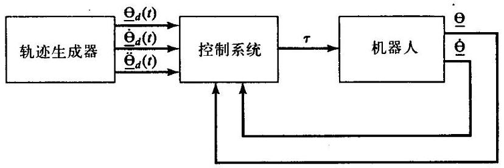

图9-1 机器人高阶控制系统框图

总之, 建立一个高性能的控制系统的唯一方法就是利用关节传感器的反馈, 如图9-1所示。 这个反馈一般是通过比较期望位置和实际位置之差以及期望速度和实际速度之差来计算伺服误差:

$$
E = {\Theta }_{d} - \Theta \tag{9-2}
$$

$$
\dot{E} = {\dot{\Theta }}_{d} - \dot{\Theta }
$$

这样控制系统就能够根据伺服误差函数计算驱动器需要的扭矩。显然, 这个基本思想是通过计算驱动器的扭矩来减少伺服误差。这种利用反馈的控制系统称为闭环系统。从图9-1中可以清楚地看出操作臂的控制系统形成了一个封闭的 “环”。

设计一个控制系统的核心问题是保证设计的闭环系统满足特定的性能要求。最基本的标准是系统要保持稳定。为此, 一个稳定系统的定义是机器人在按照各种期望规迹运动时系统的误差始终保持 “较小”, 即使存在一些 “中度” 的干扰。注意, 一个设计不合理的控制系统有时会使系统的性能不稳定, 在这个系统中, 伺服误差增大而不是减少。因此, 一个控制系统设计者的首要任务是要证明他 (她) 设计的系统是一个稳定的系统; 其次是要保证这个闭环系统的性能满足要求。实际上, 这些 “证明” 包括了那些基于某些假设和模型的数学证明以及从仿真或试验中得到的经验结果。

图9-1中,所有信号线表示 $N \times  1$ 维矢量,因此,操作臂的控制问题是一个多输入多输出 (MIMO) 控制问题。在本章中, 我们采用一种简单的方法建立一个控制系统, 即把每个关节作为一个独立系统进行控制。因此,对于 $N$ 个关节的操作臂来说,要设计 $N$ 个独立的单输入单输出 (SISO) 控制系统。这是目前为大部分工业机器人供应商所采用的设计方法。这种独立关节控制方法是一种近似方法, 这个系统的运动方程 (第6章得出的) 不是独立的, 而是高度耦合的。本章在后面将给出线性方法的证明, 至少是关于高度耦合的操作臂的证明。

## 9.3 二阶线性系统

在讨论操作臂的控制问题之前, 我们先以一个简单的机械系统为例开始讨论。图9-2表示一个质量为 $m$ 的质量块连接在一个刚度为 $k$ 的弹簧上、摩擦系数为 $b$ ,图9-2中还标出了质量块的零位和 $x$ 轴的正方向。假定摩擦力与质量块的速度成正比,由质量块的受力图可以直接得出运动方程,

$$
m\ddot{x} + b\dot{x} + {kx} = 0 \tag{9-3}
$$

因此, 这个单自由度系统的开环动力学问题便可由一个二阶线性常系数微分方程 ${}^{\left( 1\right) }$ 描述。微分方程 (9-3) 的解 $x\left( t\right)$ 是关于时间的函数,它确定了质量块的运动。方程的解取决于质量块的初始条件, 即初始位置和初始速度。

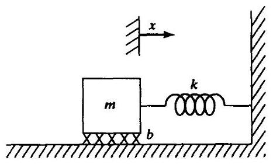

图9-2 具有摩擦的质量-弹簧系统

我们以这个简单的机械系统为例来回顾一些控制系统的基本概念。但是, 仅通过这里的简单介绍不可能解释清楚控制理论领域中的全部问题。在我们讨论控制问题时, 仅要求学生们熟悉简单的微分方程即可。因此我们不会用到控制工程领域中许多常用的工具。例如, 拉普拉斯变换以及其他常用的技术即不是必备的知识也不需要在这里介绍。有关控制领域的参考文献请参见[4]。

图9-2的系统直观地表示出几个不同特征的运动。例如, 假设弹簧刚度很小 (即 $k$ 很小) 而摩擦力很大 (即 $b$ 很大),当质量块受到扰动离开平衡位置后,它将以缓慢的衰减运动方式回到平衡位置。相反如果弹簧刚度很大而摩擦力很小,质量块将经过几次振荡才能回到平衡位置。出现这几种不同情况的原因是由于方程 (9-3) 的解的特性取决于参数 $m$ 、 $b$ 和 $k$ 的值。

由微分方程的研究 ${}^{\left( 1\right) }$ 可知方程 (9-3) 的解的形式与特征方程的根有关,

$$
m{s}^{2} + {bs} + k = 0 \tag{9-4}
$$

方程的根为:

$$
{s}_{1} =  - \frac{b}{2m} + \frac{\sqrt{{b}^{2} - {4mk}}}{2m} \tag{9-5}
$$

$$
{s}_{2} =  - \frac{b}{2m} - \frac{\sqrt{{b}^{2} - {4mk}}}{2m}
$$

${s}_{1}$ 和 ${s}_{2}$ 在复平面中的位置(有时称作系统的极点)代表系统的运动特性。如果 ${s}_{1}$ 和 ${s}_{2}$ 为实根,那么系统将呈现衰减运动而没有振荡; 如果 ${s}_{1}$ 和 ${s}_{2}$ 为复根 (即虚部存在),那么系统将出现振荡。 如果包括这两种情况之间的极限情况, 将有三种情况需要研究:

1. 两个不相等的实根。当 ${b}^{2} > {4mk}$ 时的情况; 即系统主要受摩擦力影响,系统将缓慢回到平衡位置。这种情况称为过阻尼。

2. 复根。当 ${b}^{2} < {4mk}$ 时的情况; 即系统主要受系统弹性力的影响,系统将出现振荡。这种情况称为欠阻尼。

3. 两个相等实根。当 ${b}^{2} = {4mk}$ 时的情况; 此时摩擦力与弹性力平衡,系统将以最短的时间回到平衡位置。这种情况称为临界阻尼。

第三种情况(临界阻尼)为期望的情况:系统在最短的时间内从非零初始位置迅速返回到平衡位置而不出现振荡。

**两个不相等的实根**

对于两个不相等的实根 (直接代入式 (9-3)),很容易得到质量块运动方程的解 $x\left( t\right)$

$$
x\left( t\right)  = {c}_{1}{e}^{{s}_{1}t} + {c}_{2}{e}^{{s}_{2}t} \tag{9-6}
$$

式中 ${s}_{1}$ 和 ${s}_{2}$ 由式 (9-5) 解出。系数 ${c}_{1}$ 和 ${c}_{2}$ 为常数,可通过任何一组已知的初始条件计算得出 (即质量块的初始位置和速度)。

图9-3所示为非零初始条件下的极点位置和相应的时间响应。当一个二阶系统的极点是两个不相等的实根时, 系统表现为衰减运动或者过阻尼运动。

当极点的一个值比另一个值大得多时, 较大的极点值可忽略, 因为与另一个极点一一主极点相比这个极点的运动将迅速衰减到零。主极点的概念可以扩展到更高阶的系统一一例如, 通常可以把一个三阶系统看成是仅有两个主极点的二阶系统来进行讨论。

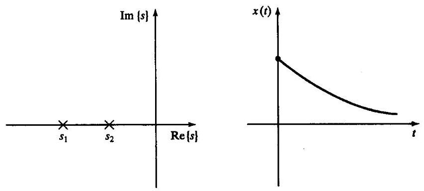

图9-3 过阻尼系统在初始条件下根的位置和响应

例9.1

求图9-2所示系统的运动。假设各参数值如下: $m = 1\text{ 、 }b = 5\text{ 、 }k = 6$ ,质量块 (初始时静止) 在 $x =  - 1$ 处被释放。

特征方程为

$$
{s}^{2} + {5s} + 6 = 0 \tag{9-7}
$$

解得 ${s}_{1} =  - 2,{s}_{2} =  - 3$ 。因此系统的响应为

$$
x\left( t\right)  = {c}_{1}{e}^{-{2t}} + {c}_{2}{e}^{-{3t}} \tag{9-8}
$$

根据已知的初始条件 $x\left( 0\right)  =  - 1$ 和 $\dot{x}\left( 0\right)  = 0$ 计算 ${c}_{1}$ 和 ${c}_{2}$ 。为了在 $t = 0$ 时满足上述条件,必须有

$$
{c}_{1} + {c}_{2} =  - 1
$$

和

$$
- 2{c}_{1} - 3{c}_{2} = 0 \tag{9-9}
$$

解得 ${c}_{1} =  - 3,{c}_{2} = 2$ 。于是得出当 $t \geq  0$ 时,系统的运动为

$$
x\left( t\right)  =  - 3{e}^{-{2t}} + 2{e}^{-{3t}} \tag{9-10}
$$

**复根**

对于特征方程有两个复根的情况

(9-11)

$$
{s}_{1} = \lambda  + {\mu i}
$$

$$
{s}_{2} = \lambda  - {\mu i}
$$

这种情况下解的形式同上

$$
x\left( t\right)  = {c}_{1}{e}^{{s}_{1}t} + {c}_{2}{e}^{{s}_{2}t} \tag{9-12}
$$

然而方程 (9-12) 难以直接求解, 因为方程中显含虚数。由欧拉公式 (见练习9.1)

$$
{e}^{ix} = \cos x + i\sin x \tag{9-13}
$$

将式 (9-12) 写成如下形式

$$
x\left( t\right)  = {c}_{1}{e}^{\lambda t}\cos \left( {\mu t}\right)  + {c}_{2}{e}^{\lambda t}\sin \left( {\mu t}\right) \tag{9-14}
$$

同上,系数 ${c}_{1}$ 和 ${c}_{2}$ 为常数,可通过任何一组已知的初始条件计算得出 (即质量块的初始位置和速度)。如果将常数 ${c}_{1}$ 和 ${c}_{2}$ 写成如下形式:

(9-15)

$$
{c}_{1} = r\cos \delta
$$

$$
{c}_{2} = r\sin \delta
$$

这样式 (9-14) 可以改写为

$$
x\left( t\right)  = r{e}^{\lambda t}\cos \left( {{\mu t} - \delta }\right) \tag{9-16}
$$

式中

$$
r = \sqrt{{c}_{1}^{2} + {c}_{2}^{2}} \tag{9-17}
$$

$$
\delta  = \mathrm{A}\tan 2\left( {{c}_{2},{c}_{1}}\right)
$$

从这个式子容易看出本式所表达的运动形式为振幅按指数形式衰减到零的振动。

另一种常用的方法是应用阻尼比和固有频率描述二阶振动系统。这两个参量是由如下的参数化特征方程定义的

$$
{s}^{2} + {2\zeta }{\omega }_{n}s + {\omega }_{n}^{2} = 0 \tag{9-18}
$$

式中 $\zeta$ 为阻尼比(介于0和1之间的无量纲数)， ${\omega }_{n}$ 为固有频率 ${}^{ \ominus  }$ 。极点位置与这两个参数的关系为

$$
\lambda  =  - \zeta {\omega }_{n}
$$

$$
\mu  = {\omega }_{n}\sqrt{1 - {\zeta }^{2}} \tag{9-19}
$$

这两个极点的虚部 $\mu$ 有时被称为阻尼振动固有频率。对于图9-2中所示的有阻尼的质量-弹簧系统, 阻尼比和固有频率分别为

$$
\zeta  = \frac{b}{2\sqrt{km}} \tag{9-20}
$$

$$
{\omega }_{n} = \sqrt{k/m}
$$

对于无阻尼系统(本例中 $b = 0$ )，阻尼比为0；对于临界阻尼系统( ${b}^{2} = {4km}$ )，阻尼比为1。

图9-4所示为非零初始条件下的极点位置和相应的时间响应。当一个二阶系统的极点具有复根时, 系统表现为振动或欠阻尼运动。

---

$\Theta$ 阻尼比和固有频率这两个参量同样适用于过阻尼系统,此时 $\zeta  > {1.0}$ 。

---

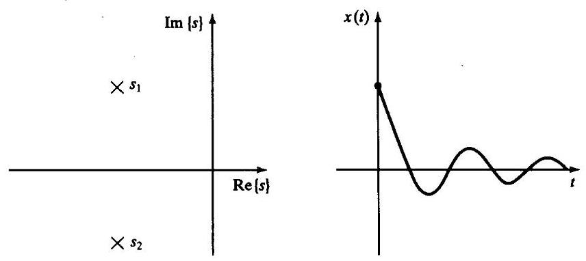

图9-4 欠阻尼系统在初始条件下根的位置和响应

例9.2

求图9-2所示系统的运动。假设各参数值如下: $m = 1\text{ 、 }b = 1\text{ 、 }k = 1$ ,质量块 (初始时静止) 在 $x =  - 1$ 处被释放。

特征方程为

$$
{s}^{2} + s + 1 = 0 \tag{9-21}
$$

解得的根为 ${s}_{i} =  - \frac{1}{2} \pm  \frac{\sqrt{3}}{2}i$ ,因此,系统的响应为

$$
x\left( t\right)  = {e}^{-\frac{t}{2}}\left( {{c}_{1}\cos \frac{\sqrt{3}}{2}t + {c}_{2}\sin \frac{\sqrt{3}}{2}t}\right) \tag{9-22}
$$

根据已知的初始条件 $x\left( 0\right)  =  - 1$ 和 $\dot{x}\left( 0\right)  = 0$ 计算 ${c}_{1}$ 和 ${c}_{2}$ 。为了在 $t = 0$ 时满足上述条件,必须有

$$
{c}_{1} =  - 1
$$

和

$$
- \frac{1}{2}{c}_{1} - \frac{\sqrt{3}}{2}{c}_{2} = 0 \tag{9-23}
$$

解得 ${c}_{1} =  - 1,{c}_{2} = \frac{\sqrt{3}}{3}$ 。因此当 $t \geq  0$ 时,系统的运动为

$$
x\left( t\right)  = {e}^{-\frac{t}{2}}\left( {-\cos \frac{\sqrt{3}}{2}t - \frac{\sqrt{3}}{3}\sin \frac{\sqrt{3}}{2}t}\right) \tag{9-24}
$$

这个解也可以写成式 (9-16) 的形式

$$
x\left( t\right)  = \frac{2\sqrt{3}}{3}{e}^{-\frac{t}{2}}\cos \left( {\frac{\sqrt{3}}{2}t + {120}^{ \circ  }}\right) \tag{9-25}
$$

**两个相等的实根**

将两个相等的实根 (即重根) 代入式 (9-3)，解的形式为

$$
x\left( t\right)  = {c}_{1}{e}^{{s}_{1}t} + {c}_{2}t{e}^{{s}_{2}t} \tag{9-26}
$$

这种情况下 ${s}_{1} = {s}_{2} =  - \frac{b}{2m}$ ,因此式 (9-26) 可以写成

$$
x\left( t\right)  = \left( {{c}_{1} + {c}_{2}t}\right) {e}^{-\frac{b}{2m}t} \tag{9-27}
$$

这种情况下解是不定的,可应用洛必达法则 ${}^{\left\lbrack  2\right\rbrack  }$ 很快求出 ${c}_{1}\text{ 、 }{c}_{2}$ 和 $a$

$$
\mathop{\lim }\limits_{{t \rightarrow  \infty }}\left( {{c}_{1} + {c}_{2}t}\right) {e}^{-{at}} = 0 \tag{9-28}
$$

图9-5所示为非零初始条件下的极点位置和相应的时间响应。当二阶系统的极点是两个相等的实根时, 系统表现为临界阻尼运动, 系统将以最短的时间回到平衡位置而不出现振荡。

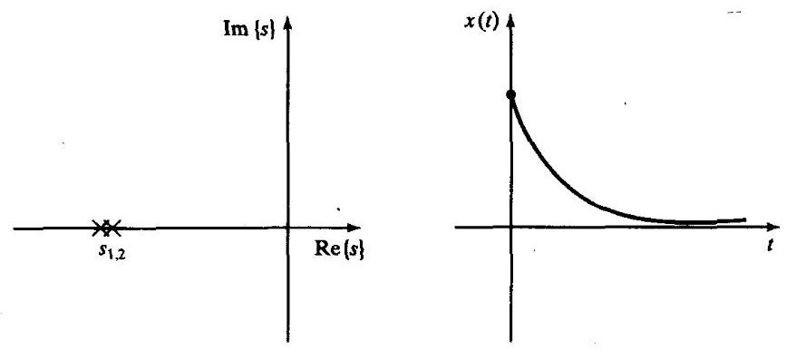

图9-5 临界阻尼系统在初始条件下根的位置和响应

例9.3

求图9-2所示系统的运动。假设各参数值如下: $m = 1$ 、 $b = 4$ 、 $k = 4$ ，质量块(初始时静止) 在位置 $x =  - 1$ 处被释放。

特征方程为

$$
{s}^{2} + {4s} + 4 = 0 \tag{9-29}
$$

解得的根为 ${s}_{1} = {s}_{2} =  - 2$ ,因此系统的响应为

$$
x\left( t\right)  = \left( {{c}_{1} + {c}_{2}t}\right) {e}^{-{2t}} \tag{9-30}
$$

根据已知的初始条件 $x\left( 0\right)  =  - 1$ 和 $\dot{x}\left( 0\right)  = 0$ ,计算 ${c}_{1}$ 和 ${c}_{2}$ 。为了在 $t = 0$ 时满足上述条件,必须有

$$
{c}_{1} =  - 1
$$

和

$$
- 2{c}_{1} + {c}_{2} = 0 \tag{9-31}
$$

解得 ${c}_{1} =  - 1,{c}_{2} =  - 2$ 。因此当 $t \geq  0$ 时,系统的运动为

$$
x\left( t\right)  = \left( {-1 - {2t}}\right) {e}^{-{2t}} \tag{9-32}
$$

从例9.1到例9.3的系统都是稳定的。像图9-2这样的受力系统就是这种情况。这种机械系统始终具有如下的特性:

$$
m > 0
$$

$$
b > 0 \tag{9-33}
$$

$$
k > 0
$$

在下一节中, 可看到控制系统的作用实际上就是改变这些系数中的一个或多个值。为此必须考虑设计的系统是否稳定。

## 9.4 二阶系统的控制

如果二阶机械系统的响应并不满足我们的要求, 例如求得的系统是欠阻尼系统或振荡系统, 而我们需要临界阻尼系统; 或者系统的弹性完全消失 $\left( {k = 0}\right)$ ,因此当受到扰动时,系统永远也不能返回到 $x = 0$ 的位置。那么通过使用传感器、驱动器和控制系统, 便可以按照我们的要求改变系统的特性。

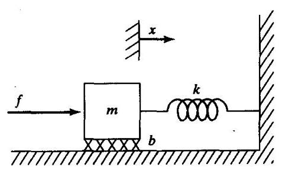

图9-6 带有驱动器的有阻尼质量-弹簧系统

图9-6所示为一个带有驱动器的有阻尼质量-弹簧系统，驱动器给质量块施加一个力 $f$ 。由受力图得出如下运动方程

$$
m\ddot{x} + b\dot{x} + {kx} = f \tag{9-34}
$$

假如可以通过传感器测定质量块的位置和速度。现在我们给出一种控制律, 它可以计算出驱动器应当施加给质量块的力, 这个力是传感器反馈的函数:

$$
f =  - {k}_{p}x - {k}_{v}\dot{x} \tag{9-35}
$$

图9-7是一个闭环系统的框图, 图中虚线左边的部分为控制系统 (通常通过计算机实现), 虚线右边的部分为受力系统。图中没有表示出控制计算机同驱动器输出指令以及传感器输入信息之间的接口。

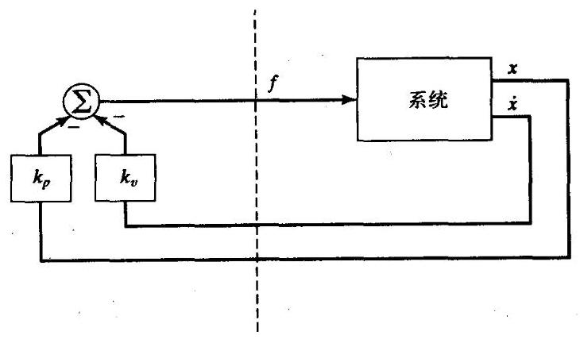

图9-7 闭环控制系统, 控制计算机 (虚线左边部分) 读取传感器输入信号并向驱动器输出指令

我们所提出的控制系统是一个位置校正系统一一这种系统只是试图保持质量块在一个固定的位置, 而不考虑质量块受到的干扰力。在下一节, 我们将要构造一个轨迹跟踪控制系统, 使质量块能跟随期望的位置轨迹运动。

联立开环动力学方程式 (9-34) 和控制律式 (9-35)，就可以得到闭环系统动力学方程如下

$$
m\ddot{x} + b\dot{x} + {kx} =  - {k}_{p}x - {k}_{v}\dot{x} \tag{9-36}
$$

或

$$
m\ddot{x} + \left( {b + {k}_{v}}\right) \dot{x} + \left( {k + {k}_{p}}\right) x = 0 \tag{9-37}
$$

或

$$
m\ddot{x} + {b}^{\prime }\dot{x} + {k}^{\prime }x = 0 \tag{9-38}
$$

式中 ${b}^{\prime } = b + {k}_{v},{k}^{\prime } = k + {k}_{p}$ 。从式 (9-37) 和式 (9-38) 可以清楚看出,通过设定控制增益 ${k}_{v}$ 和 ${k}_{p}$ 可以使闭环系统呈现任何期望的二阶系统特性。经常通过选择增益获得临界阻尼 (即 ${b}^{\prime } = 2\sqrt{m{k}^{\prime }}$ ) 和某种直接由 ${k}^{\prime }$ 给出的期望闭环刚度。

${k}_{v}$ 和 ${k}_{p}$ 可正可负,这是由原系统的参数决定的。而当 ${b}^{\prime }$ 或 ${k}^{\prime }$ 为负数时,控制系统将是不稳定的。由二阶微分方程的解 (式 (9-6)、式 (9-14) 或者式 (9-26) 的形式) 可以明显看出这种不稳定性。同样可以直接看出,如果 ${b}^{\prime }$ 或 ${k}^{\prime }$ 为负数时,伺服误差趋向增大而不是减小。

例9.4

如图9-6中所示的系统,各参数分别为 $m = 1, b = 1, k = 1$ ,求使闭环刚度为 16.0 时的临界阻尼系统的位置校正控制律的增益 ${k}_{v}$ 和 ${k}_{p}$ 。

如果 ${k}^{\prime } = {16.0}$ ,那么为了达到临界阻尼,则需要 ${b}^{\prime } = 2\sqrt{m{k}^{\prime }} = {8.0}$ 。现在 $k = 1, b = 1$ ,于是有

$$
{k}_{p} = {15.0} \tag{9-39}
$$

$$
{k}_{v} = {7.0}
$$

## 9.5 控制律的分解

为了设计更为复杂的系统的控制律, 我们对图9-6中的控制系统结构稍作一些变化。把控制器分为基于模型的控制部分和伺服控制部分。这样系统的参数 (即 $m, b, k$ ) 仅出现在基于模型的控制部分, 而与伺服控制部分是完全独立的。在本章中, 这个区别显得并不重要, 但对于第10章中的非线性系统来说这种区别就显得非常重要了。本书中主要采用这种控制律分解方法。

系统开环运动方程为

$$
m\ddot{x} + b\dot{x} + {kx} = f \tag{9-40}
$$

将这个系统的控制器分为两个部分。此时, 控制律中基于模型的控制部分应用给定的参数 $m$ , $b$ 和 $k$ ,可以将系统简化成一个单位质量,例9.5说明了这个问题。控制律的第二部分利用反馈来改变系统的特性。控制律中基于模型的控制部分将系统简化成一个单位质量, 因此伺服控制部分的设计就非常简单了——仅需选择增益，控制一个仅由单位质量构成的系统(即没有摩擦和刚度)。

在控制律中, 基于模型的控制部分的表达式为

$$
f = \alpha {f}^{\prime } + \beta \tag{9-41}
$$

式中 $\alpha$ 和 $\beta$ 是函数或常数,如果将 ${f}^{\prime }$ 作为新的系统输入,那么可选择 $\alpha$ 和 $\beta$ 使系统简化为单位质量。对于这种控制律结构, 系统方程 (联立式 (9-40) 和式 (9-41)) 为

$$
m\ddot{x} + b\dot{x} + {kx} = \alpha {f}^{\prime } + \beta \tag{9-42}
$$

显然,为了在输入 ${f}^{\prime }$ 时将系统简化为单位质量,这个系统中的 $\alpha$ 和 $\beta$ 选择如下

(9-43)

$$
\alpha  = m
$$

$$
\beta  = b\dot{x} + {kx}
$$

将这些假设条件代入式 (9-42), 得到系统方程

$$
\ddot{x} = {f}^{\prime } \tag{9-44}
$$

这是单位质量的运动方程。式 (9-44) 可作为被控系统的开环动力学方程。同前面的方法一样,设计一个控制律去计算 ${f}^{\prime }$ :

$$
{f}^{\prime } =  - {k}_{v}\dot{x} - {k}_{p}x \tag{9-45}
$$

将这个控制律与式 (9-44) 联立得

$$
\ddot{x} + {k}_{v}\dot{x} + {k}_{p}x = 0 \tag{9-46}
$$

在这种方法中, 控制增益的设定非常简单, 而且与系统参数独立, 即

$$
{k}_{v} = 2\sqrt{{k}_{p}} \tag{9-47}
$$

这时系统处于临界阻尼状态。图9-8所示为控制图9-6所示系统的分解控制器框图。

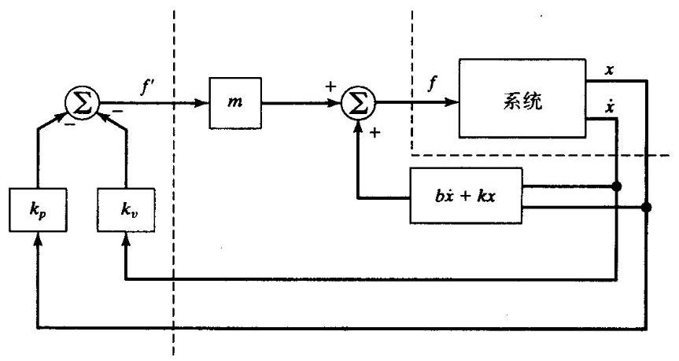

图9-8 采用控制律分解方法的闭环控制系统

例9.5

图9-6所示的系统参数分别为 $m = 1, b = 1, k = 1$ 。按照位置校正控制律,求在闭环刚度为 16.0、系统为临界阻尼状态时的 $\alpha$ 、 $\beta$ 以及增益 ${k}_{p}$ 和 ${k}_{y}$ 。

选择

(9-48)

$$
\alpha  = 1
$$

$$
\beta  = \dot{x} + x
$$

假定输入 ${f}^{\prime }$ 时系统简化为一单位质量。设定 ${k}_{p}$ 为期望闭环刚度的增益,并设定系统为临界阻尼, ${k}_{v} = 2\sqrt{{k}_{p}}$ 。

可得

(9-49)

$$
{k}_{p} = {16.0}
$$

$$
{k}_{v} = {8.0}
$$

## 9.6 轨迹跟踪控制

我们不仅要求质量块能够保持在期望位置, 而且希望扩展控制器功能, 使质量块能够跟踪一条轨迹。已知轨迹 ${x}_{d}\left( t\right)$ 是时间的函数,求质量块的期望位置。假设轨迹是光滑的 (即一阶导数存在),并且轨迹发生器在任一时间 $t$ 始终给出一组 ${x}_{d}\text{ 、 }{\dot{x}}_{d}$ 和 ${\ddot{x}}_{d}$ 。定义伺服误差 $e = {x}_{d} - x$ 为期望轨迹与实际轨迹之差。由伺服控制律得出的轨迹如下

$$
{f}^{\prime } = {\ddot{x}}_{d} + {k}_{v}\dot{e} + {k}_{p}e \tag{9-50}
$$

一个适当的选择是将式 (9-50) 与单位质量运动方程式 (9-44) 联立, 得到

$$
\ddot{x} = {\ddot{x}}_{d} + {k}_{v}\dot{e} + {k}_{p}e \tag{9-51}
$$

或者

$$
\ddot{e} + {k}_{v}\dot{e} + {k}_{p}e = 0 \tag{9-52}
$$

可由这个二阶微分方程选择系数, 由此可以设计任何期望的响应 (通常选择临界阻尼)。有时称这种方程为误差空间方程, 因为它描述了相对于期望轨迹的误差估计。图9-9为轨迹跟踪控制器的框图。

如果模型 (即关于 $m$ 、 $b$ 和 $k$ 的值) 是正确的,并且没有噪声和初始误差,质量块将准确跟随期望轨迹运动。如果存在初始误差, 这个误差将受到抑制 (见式 (9-52)), 而后这个系统将准确跟踪期望轨迹。

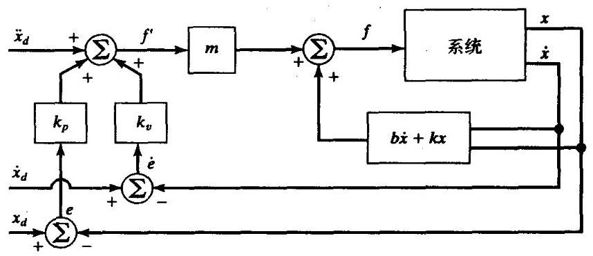

图9-9 图9-6所示系统的轨迹跟踪控制器

## 9.7 抗干扰

控制系统的一个作用就是提供抗干扰能力, 即存在外部干扰或者噪声的时候, 仍能保持良好的性能 (即减小误差)。图9-10所示为具有附加输入——干扰力 ${f}_{\text{ dist }}$ 的轨迹跟踪控制器。通过对闭环系统进行分析得出误差方程为

$$
\ddot{e} + {k}_{v}\dot{e} + {k}_{p}e = {f}_{\text{ dist }} \tag{9-53}
$$

式 (9-53) 是一个由力函数驱动的微分方程。如果已知 ${f}_{\text{ dist }}$ 是有界的——即存在常数 $a$ 使得

$$
\mathop{\max }\limits_{t}{f}_{\text{ dist }}\left( t\right)  < a \tag{9-54}
$$

这样微分方程的解 $e\left( t\right)$ 也是有界的。这个结果是由一个称为有界输入-有界输出即BIBO稳态线性系统的稳定性特性得出的 ${}^{\left\lbrack  3,4\right\rbrack  }$ 。这个基本结论说明,在大范围的干扰下,至少能够保持系统是稳定的。

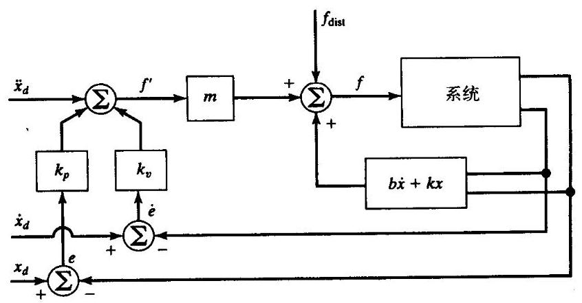

图9-10 具有干扰作用的轨迹跟踪控制系统

**稳态误差**

以一种最简单的干扰为例——即 ${f}_{\text{ dist }}$ 为常数的情况。这种情况下,通过对静态时系统的分析 (即所有系统变量的导数都为0 ) 进行稳态分析。设式 (9-53) 中的导数为0,得稳态方程为

$$
{k}_{p}e = {f}_{\text{ dist }} \tag{9-55}
$$

或者

$$
e = {f}_{\text{ dist }}/{k}_{p} \tag{9-56}
$$

由式 (9-56) 可求出稳态误差 $e$ 的值。显然,位置增益 ${k}_{p}$ 越大,稳态误差就越小。

**附加积分项**

为消除稳态误差, 有时采用一种修正的控制律。这种修正是在控制律中附加一个积分项, 即

$$
{f}^{\prime } = {\ddot{x}}_{d} + {k}_{v}\ddot{e} + {k}_{p}e + {k}_{i}\int {edt} \tag{9-57}
$$

则误差方程变为

$$
\ddot{e} + {k}_{v}\dot{e} + {k}_{p}e + {k}_{i}\int {edt} = {f}_{\text{ dist }} \tag{9-58}
$$

增加这一项可使系统在恒定干扰情况下,不出现稳态误差。如果 $t < 0$ 时 $e\left( t\right)  = 0$ ,那么当 $t > 0$ 时式 (9-58) 可写成

$$
\ddot{e} + {k}_{v}\ddot{e} + {k}_{p}\dot{e} + {k}_{i}e = {\dot{f}}_{\text{ dist }} \tag{9-59}
$$

稳态 (对于恒定干扰) 时, 上式变为

$$
{k}_{i}e = 0 \tag{9-60}
$$

因此

$$
e = 0 \tag{9-61}
$$

对于这种控制律, 系统变成了一个三阶系统, 求解相应的三阶微分方程, 可以求出初始条件下系统的响应。通常 ${k}_{i}$ 非常小,使得这个三阶系统没有积分项而 “近似于” 一个二阶系统 (即仅需进行主极点分析)。控制律式 (9-57) 被称为PID控制律, 即 “比例、积分、微分” 控制律 ${}^{\left\lbrack  4\right\rbrack  }$ 。为简单起见,本书中给出的控制方程一般不含有积分项。

## 9.8 连续时间控制与离散时间控制

在前面讨论的控制系统中, 都假设控制计算机完成控制律计算的时间为0 (即无限快)。 所以驱动力 $f$ 的值是时间的连续函数。当然在实际情况中,计算都需要一定的时间,因此输出的力指令是一个离散的 “阶梯” 函数 。本书中我们将认为计算机的计算速度极快。如果 $f$ 的更新计算速率比受控系统的固有频率快很多, 那么这个近似就是合适的。而在离散时间控制或数字控制领域，进行系统分析时，并不进行这种近似，而是考虑控制系统的伺服速度 ${}^{\left\lbrack  3\right\rbrack  }$ 。

通常假设计算速度足够快以至于时间连续性假设是有效的。由此产生了一个问题: 计算到底需要多么快? 若使选择的伺服 (或采样) 速度足够快则需要考虑以下几点:

跟踪参考输入: 期望输入或参考输入的频率范围给定了采样速率的绝对下限。采样频率至少为参考输入带宽的两倍。但这通常并不是限制因素。

抗干扰:对于抗干扰问题，时间连续系统给定了系统性能的上限。如果采样周期比干扰作用(假设为随机干扰的统计形式)的持续时间长，那么这些干扰将不会被抑制。一种有效的方法是使采样周期小于噪声持续时间的十分之一 ${}^{\left\lbrack  3\right\rbrack  }$ 。

抗混叠:只要在数控系统中使用模拟传感器，就会出现混叠现象，除非传感器的输出严格限制在带宽范围内。大多数情况下, 传感器没有输出带宽的限制, 因此应选择采样频率使混叠信号的能量较小。

结构共振: 在操作臂的动力学特性中未包括弯曲变形。实际上所有机构的刚度都是有限的, 因此会出现多种形式的振动。如果必须抑制这些振动 (经常需要), 那么必须使采样频率至少为固有共振频率的两倍。本章后面将再次讨论共振问题。

## 9.9 单关节的建模和控制

本节将要为单一旋转关节操作臂建立一个简单模型。通过几项假设可把这个系统看作为二阶线性系统。对于更完备的驱动关节模型, 见参考文献[5]。

许多工业机器人常用的驱动器是直流 (DC) 力矩电机 (如图8-18所示)。电机中不转动的部分 (定子) 由机座、轴承、永久磁铁或电磁铁组成。定子中的磁极产生一个穿过电机转动部件 (转子) 的磁场。转子由电机轴和线圈绕组组成, 电流通过线圈绕组产生电机转动的能量。电流经与换向器接触的电刷流入线圈绕组。换向器与变化的线圈绕组(也称为电枢)以某种方式相连接便产生指定方向的转矩。当电流通过线圈绕组时电机会产生转矩的物理现象可以表示为

$$
F = {qV} \times  B \tag{9-62}
$$

这里电荷 $q$ 以速度 $V$ 通过磁场强度为 $B$ 的区域时将产生一个力 $F$ 。电荷为通过线圈绕组的电子, 磁场由定子磁极产生。一般来说, 电机产生转矩的能力用电机转矩常数表示, 电枢电流与输出转矩的关系可表示为

$$
{\tau }_{m} = {k}_{m}{i}_{a} \tag{9-63}
$$

当电机转动时, 则成为一个发电机, 在电枢上产生一个电压。电机的另一个常数, 反电势常数 ${}^{ \ominus  }$ ,表示给定转速时产生的电压

$$
v = {k}_{e}{\dot{\theta }}_{m} \tag{9-64}
$$

一般来讲, 换向器实际上是一个开关, 它使电流通过变化的线圈绕组产生转矩, 并产生一定的转矩波动。尽管有时这个影响很重要, 但通常这种影响可忽略不计 (在任何情况下, 建立这个模型都是相当困难的, 即使建立了模型, 误差补偿也是相当困难的)。

**电机电枢感抗**

图9-11所示为电枢电路。主要的构成部分是电源电压 ${v}_{a}$ 、电枢绕组的感抗 ${l}_{a}$ 、电枢绕组的电阻 ${r}_{a}$ 以及产生的反电势 $v$ 。这个电路由如下一阶微分方程描述:

$$
{l}_{a}{\dot{i}}_{a} + {r}_{a}{i}_{a} = {v}_{a} - {k}_{e}{\dot{\theta }}_{m} \tag{9-65}
$$

一般用电机驱动器控制电机的转矩 (而不是速度)。驱动电路通过检测电枢电流不断调节电源电压 ${v}_{a}$ 以使通过电枢的电流为期望电流 ${i}_{a}$ 。这个电路称为电流放大器式电机驱动器 ${}^{\left\lbrack  7\right\rbrack  }$ 。在电流驱动系统中,由电机感抗 ${l}_{a}$ 和电源电压的上限 ${v}_{a}$ 控制电枢电流变化的速率。实际上相当于在工作电流和输出转矩之间存在一个低通滤波器。

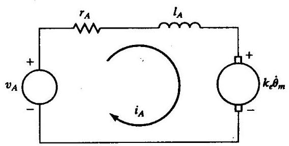

图9-11 直流力矩电机的电枢电路

为简化起见, 首先假设电机的感抗可以忽略。 当闭环控制系统的固有频率远低于由于感抗引起的电流驱动器中隐含的低通滤波器的截止频率时, 这个假设便是合理的。这个假设和转矩波动假设一样都可忽略不计, 这表明电机转矩可以直接控制。虽然存在某个比例因子 (例如 ${k}_{m}$ ),但仍可以将驱动器视为可以直接控制的纯力矩源。

**有效惯量**

图9-12所示为通过齿轮减速器与惯性负载相连的直流力矩电机转子的力学模型。式 (9-63) 表示作用于转子的扭矩 ${\tau }_{m}$ 是电枢电流 ${i}_{a}$ 的函数。传动比 $\left( \eta \right)$ 可提高驱动负载的力矩、降低负载的转速, 由下式表示

$$
\tau  = \eta {\tau }_{m}
$$

$$
\dot{\theta } = \left( {1/\eta }\right) {\dot{\theta }}_{m} \tag{9-66}
$$

式中 $\eta  > 1$ 。按照转子力矩写出系统的力矩平衡方程如下

$$
{\tau }_{m} = {I}_{m}{\ddot{\theta }}_{m} + {b}_{m}{\dot{\theta }}_{m} + \left( {1/\eta }\right) \left( {I\ddot{\theta } + b\dot{\theta }}\right) \tag{9-67}
$$

---

$\Theta$ “emf”代表电动势。

---

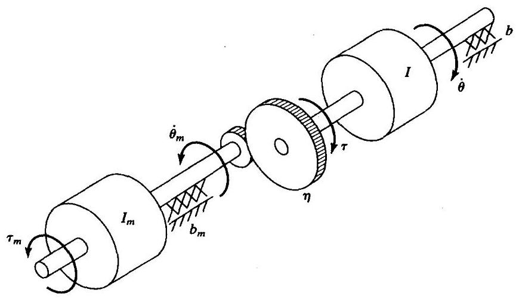

图9-12 通过齿轮减速器与惯性负载相连的直流力矩电机的力学模型

式中 ${I}_{m}$ 和 $I$ 分别为电机转子惯量和负载惯量, ${b}_{m}$ 和 $b$ 分别为电机转子轴承和负载轴承的粘滞摩擦系数。由式 (9-66), 将式 (9-67) 按照电机变量改写为

$$
{\tau }_{m} = \left( {{I}_{m} + \frac{I}{{\eta }^{2}}}\right) {\ddot{\theta }}_{m} + \left( {{b}_{m} + \frac{b}{{\eta }^{2}}}\right) {\dot{\theta }}_{m} \tag{9-68}
$$

或根据负载变量改写为

$$
\tau  = \left( {I + {\eta }^{2}{I}_{m}}\right) \ddot{\theta } + \left( {b + {\eta }^{2}{b}_{m}}\right) \dot{\theta } \tag{9-69}
$$

$I + {\eta }^{2}{I}_{m}$ 有时被称作减速器输出端 (连杆侧) 的有效惯量。同样, $b + {\eta }^{2}{b}_{m}$ 被称作有效阻尼。 注意,在大传动比 $\left( {\text{ 即 }\eta  >  > 1}\right)$ 的情况下,电机转子惯量是有效组合惯量中的主要部分。正是这个原因我们才能够假设有效惯量是一个常数。由第6章可知,机构关节的惯量 $I$ 实际上是随着机构位形和负载变化的。然而在大传动比的机器人中, 这种变化的比例小于直接驱动操作臂 (即 $\eta  = 1$ )。为确保机器人连杆的运动永远不为欠阻尼, $I$ 值应为取值范围内的最大值; 即 ${I}_{\max }$ 。这样可保证系统在任何情况下均为临界阻尼或者过阻尼。在第10章中我们将直接研究变化惯量并且不做上述假设。

例9.6

如果连杆惯量 $I$ 在 $2 \sim  6\mathrm{{Kg}} - {\mathrm{m}}^{2}$ 之间变化,转子惯量 ${I}_{m} = {0.01}$ ,传动比 $\eta  = {30}$ ,求有效惯量的最大值和最小值。

有效惯量的最小值为

$$
{I}_{\min } + {\eta }^{2}{I}_{m} = {2.0} + \left( {900}\right) \left( {0.01}\right)  = {11.0} \tag{9-70}
$$

最大值为

$$
{I}_{\max } + {\eta }^{2}{I}_{m} = {6.0} + \left( {900}\right) \left( {0.01}\right)  = {15.0} \tag{9-71}
$$

因此可以看出, 相对于总有效惯量的比例, 通过减速器使得惯量的变化减小了。

**未建模柔性**

在建模过程中的另一个主要假设是减速器、轴、轴承以及被驱动的连杆都是不可变形的。 实际上这些元件的刚度都是有限的, 因此在系统建模时, 它们的柔性将增加系统的阶次。关于忽略柔性作用影响的理由是, 如果系统刚度极大, 这些未建模共振的固有频率将非常高, 与已建模的二阶主极点的影响相比可以忽略不计 ${}^{ \ominus  }$ 。为了进行控制系统的分析和设计,“未建模”实际上是为了忽略这些影响而可以采用式 (9-69) 这样一个较简单的动力学模型。

因为在建模时未考虑系统的结构柔性，因此必须注意不能激发起这些共振模态。经验方法 ${}^{\left( 8\right) }$ 为: 如果最低的结构共振频率为 ${\omega }_{\mathrm{{res}}}$ ,那么必须按照下式限定闭环固有频率

$$
{\omega }_{n} \leq  \frac{1}{2}{\omega }_{\text{ res }} \tag{9-72}
$$

这为选择控制器增益提供了依据。我们发现提高增益会加速系统响应、减小稳态误差, 同时我们也发现非建模结构共振限制了系统增益。典型工业机器人的结构共振范围为5Hz到25Hz ${}^{\lbrack 8\rbrack }$ 。 量新的设计采用直接驱动方式可以避免由减速器和传动系统产生的柔性，可使机器人的最低结构共振频率提高到 ${70}{\mathrm{{Hz}}}^{\left\lbrack  9\right\rbrack  }$ 。

例9.7

图9-7所示系统的各参数值为: $m = 1, b = 1$ 和 $k = 1$ 。此外，已知系统未建模的最低共振频率为 $8\mathrm{{rad}}/\mathrm{s}$ 。求 $\alpha ,\beta$ 以及为使系统达到临界阻尼的位置控制律的增益 ${k}_{p}$ 和 ${k}_{v}$ 。且未建模模态未被激励, 系统的闭环刚度尽量高。

取

$$
\alpha  = 1 \tag{9-73}
$$

$$
\beta  = \dot{x} + x
$$

在虚拟输入 ${f}^{\prime }$ 作用下，系统可简化为一单位质量。利用经验方法式 (9-72),取闭环固有频率 ${\omega }_{n} \; = 4\mathrm{{rad}}/\mathrm{s}$ 。由式 (9-18) 和式 (9-46) 得 ${k}_{p} = {\omega }_{n}^{2}$ ,于是有

$$
{k}_{p} = {16.0} \tag{9-74}
$$

$$
{k}_{v} = {8.0}
$$

**估计共振频率**

引起共振的原因与第8章中讨论的结构柔性的问题相同。在结构柔性能够识别的情况下， 如果能够给出柔性结构件有效质量或有效惯量的描述, 那么就可以进行振动的近似分析。由式 (9-20) 给出的简单质量-弹簧系统可以近似得出系统的固有频率

$$
{\omega }_{n} = \sqrt{k/m} \tag{9-75}
$$

式中 $k$ 为柔性结构件的刚度, $m$ 为振动系统的等效质量。

例9.8

某轴 (假设无质量) 的刚度为 ${400}\mathrm{{Nm}}/\mathrm{{rad}}$ ,驱动一个转动惯量为 $1\mathrm{{Kg}} \cdot  {\mathrm{m}}^{2}$ 的负载。如果在动力学模型中不计轴的刚度, 那么这个未建模共振频率是多少?

---

$\Theta$ 这基本上与我们忽略由于电机感抗产生的极点一样。如果包括这些极点,那么系统的阶次将会提高。

---

应用式 (9-75), 得

$$
{\omega }_{\text{ res }} = \sqrt{{400}/1} = {20}\mathrm{{rad}}/\mathrm{s} = {20}/\left( {2\pi }\right) \mathrm{{Hz}} \cong  {3.2}\mathrm{{Hz}} \tag{9-76}
$$

为粗略估计梁和轴的最低共振频率, 参考文献[10]建议采用集中质量模型。估计梁和轴的末端刚度公式是已知的; 集中质量模型提供了估算共振频率所需的有效质量或有效惯量。图 9-13所示为参考文献[10]中的能量分析结果,这个分析建议用一个位于梁末端的质量为 ${0.23}\mathrm{\;m}$ 的质点代替质量为 $m$ 的梁,同样,要由轴末端的集中惯量 ${0.33I}$ 代替分布惯量 $I$ 。

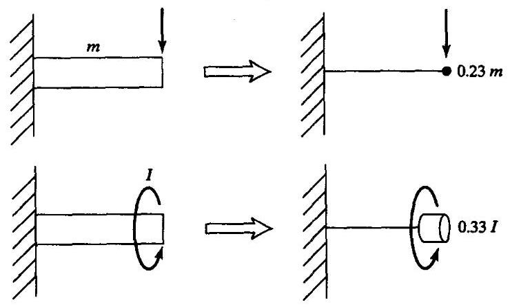

图9-13 用于估计横向共振和扭转共振的梁的集中质量模型

例9.9

一个质量为 ${4.347}\mathrm{{Kg}}$ 连杆，末端横向刚度为 ${3600}\mathrm{{Nt}}/\mathrm{m}$ 。假设驱动系统是完全刚性的，由于连杆柔性引起的共振将会限制控制增益，求 ${\omega }_{\mathrm{{res}}}$ 。

4.347Kg的质量在连杆上均匀分布，应用图 9-13 中的方法，有效质量为 $\left( {0.23}\right) \left( {4.347}\right)  \cong  {1.0}\mathrm{{Kg}}$ ,因此振动频率为

$$
{\omega }_{\text{ res }} = \sqrt{{3600}/{1.0}} = {60}\mathrm{{rad}}/\mathrm{s} = {60}/\left( {2\pi }\right) \mathrm{{Hz}} \cong  {9.6}\mathrm{\;{Hz}} \tag{9-77}
$$

如果希望这个系统的闭环带宽高于式 (9-75) 中的闭环带宽, 那么必须在用于控制律综合法的系统模型中应包括结构柔性。这种情况下系统的模态是高阶的, 相应的控制方法将变得相当复杂。这种控制方法超出了当前的工程实际发展水平,正处于研究阶段 ${}^{\left\lbrack  {11},{12}\right\rbrack  }$ 。

**单关节控制**

概括来说,我们建立了下列三个主要假设:

1. 电机的感抗 ${I}_{a}$ 可以忽略。

2. 考虑大传动比的情况,将有效惯量视为一个常数,即 ${I}_{\max } + {\eta }^{2}{I}_{m}$ 。

3. 结构柔性可以忽略，最低结构共振频率 ${\omega }_{\mathrm{{res}}}$ 用于设定伺服增益的情况除外。

应用这些假设, 可以用下式给出的分解运动对一个单关节操作臂进行控制

$$
\alpha  = {I}_{\max } + {\eta }^{2}{I}_{m} \tag{9-78}
$$

$$
\beta  = \left( {b + {\eta }^{2}{b}_{m}}\right) \dot{\theta }
$$

$$
{\tau }^{\prime } = {\ddot{\theta }}_{d} + {k}_{v}\dot{e} + {k}_{p}e \tag{9-79}
$$

系统的闭环动力学方程为

$$
\ddot{e} + {k}_{v}\dot{e} + {k}_{p}e = {\tau }_{\text{ dist }} \tag{9-80}
$$

式中的增益取

$$
{k}_{p} = {\omega }_{n}^{2} = \frac{1}{4}{\omega }_{\text{ res }}^{2} \tag{9-81}
$$

$$
{k}_{v} = 2\sqrt{{k}_{p}} = {\omega }_{\text{ res }}
$$

## 9.10 工业机器人控制器的结构

本节中, 我们简单了解一下Unimation PUMA 560工业机器人的控制系统结构。如图9-14所示, 硬件结构分为两个层次, 一台DEC LSI-11计算机作为上层 “主控”计算机输出指令到6个 Rockwell 6503微处理器 ${}^{ \ominus  }$ 。与本章讨论的控制方案不同，每一个微处理器采用PID控制律控制一个独立关节。PUMA 560机器人的每一个关节安装有一个光学增量编码器。这种编码器与一个上/下计数器接口, 微处理器可以读取关节的当前位置。PUMA 560机器人上没有转速计, 而是通过对关节位置的伺服周期序列差分获得关节速度。为了控制直流力矩电机的力矩, 微处理器与一个数模转换器 (DAC) 接口, 控制进入电流驱动器的电机电流。按照需要通过调节电枢两端的电压控制模拟电路中的电机电流, 以保持期望的电枢电流。图9-15为这个系统的框图。

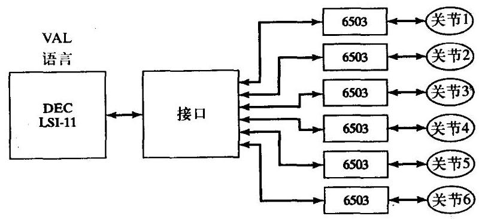

图9-14 PUMA 560机器人控制系统的计算机分级体系

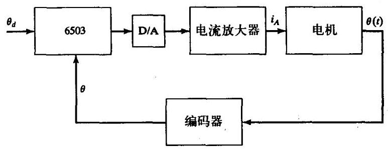

图9-15 PUMA 560机器人关节控制系统的功能框图

---

$\Theta$ 这些简单的8位计算机是早期的技术。现在机器人的控制器普遍采用32位微处理器。

---

LSI-11计算机每28ms发送一个新的位置指令(定位点)到关节微处理器。关节微处理器的运行周期为 ${0.875}\mathrm{{ms}}$ 。在这个周期内,微处理器进行期望位置定位点的差补运算,计算伺服误差, 计算PID控制律以及向电机发送一个新的力矩值。

LSI-11计算机执行整个控制系统的所有 “高级” 操作。首先，计算机需要对VAL (Unimation机器人编程语言) 程序指令逐句进行编译。在进行运动指令的编译时，LSI-11计算机执行必要的逆运动学计算，进行期望轨迹规划，并且每28ms为关节控制器生成一组路径点轨迹。

LSI-11计算机还可与标准外设如终端设备和软盘驱动器接口。另外, 计算机还有与悬挂式示教盒的接口。悬挂式示教盒是一个手持的按钮盒, 操作者可以用示教盒以各种运动模式控制机器人运动。例如, PUMA 560系统允许用户通过示教盒按增量方式让机器人在关节坐标系或者笛卡儿坐标系中运动。在这种模式下，可以在机器人“不工作”时，通过示教盒上的按钮进行轨迹计算, 并将轨迹指令向下发送到关节控制微处理器。

**参考文献**

[1] W. Boyce and R. DiPrima, Elementary Differential Equations, 3rd edition, John Wiley and Sons, New York, 1977.

[2] E. Purcell, Calculus with Analytic Geometry, Meredith Corporation, New York, 1972.

[3] G. Franklin and J.D. Powell, Digital Control of Dynamic Systems, Addison-Wesley, Reading, MA, 1980.

[4] G. Franklin, J.D. Powell, and A. Emami-Naeini, Feedback Control of Dynamic Systems, Addison-Wesley, Reading, MA, 1986.

[5] J. Luh, "Conventional Controller Design for Industrial Robots—a Tutorial," IEEE Transactions on Systems, Man, and Cybernetics, Vol. SMC-13, No. 3, June 1983.

[6] D. Halliday and R. Resnik, Fundamentals of Physics, Wiley, New York 1970.

[7] Y. Koren and A. Ulsoy, "Control of DC Servo-Motor Driven Robots," Proceedings of Robots 6 Conference, SME, Detroit, March 1982.

[8] R.P. Paul, Robot Manipulators, MIT Press, Cambridge, MA, 1981.

[9] H. Asada and K. Youcef-Toumi, Direct-Drive Robots-Theory and Practice, MIT Press, Cambridge, MA, 1987.

[10] J. Shigley, Mechanical Engineering Design, 3rd edition, McGraw-Hill, New York, 1977.

[11] W. Book, "Recursive Lagrangian Dynamics of Flexible Manipulator Arms," The International Journal of Robotics Research, Vol. 3, No. 3, 1984.

[12] R. Cannon and E. Schmitz, "Initial Experiments on the End-Point Control of a Flexible One Link Robot," The International Journal of Robotics Research, Vol. 3, No. 3, 1984.

[13] R.J. Nyzen, "Analysis and Control of an Eight-Degree-of-Freedom Manipulator," Ohio University Master's Thesis, Mechanical Engineering, Dr. Robert L. Williams II, Advisor, August 1999.

[14] R.L. Williams II, "Local Performance Optimization for a Class of Redundant Eight-Degree-of-Freedom Manipulators," NASA Technical Paper 3417, NASA Langley Research Center, Hampton, VA, March 1994.

**习题**

9.1 [20]一个二阶微分方程有复根

$$
{s}_{1} = \lambda  + {\mu i}
$$

$$
{s}_{2} = \lambda  - {\mu i}
$$

证明它的通解为

$$
x\left( t\right)  = {c}_{1}{e}^{{s}_{1}t} + {c}_{2}{e}^{{s}_{2}t}
$$

可写成

$$
x\left( t\right)  = {c}_{1}{e}^{\lambda t}\cos \left( {\mu t}\right)  + {c}_{2}{e}^{\lambda t}\sin \left( {\mu t}\right)
$$

9.2 [13]计算图9-2所示系统的运动,如果参数值分别为: $m = 2, b = 6$ 和 $k = 4$ ,并且质量块 (初始时静止) 从 $x = 1$ 位置释放。

9.3 [13]计算图9-2所示系统的运动,如果参数值分别为: $m = 1, b = 2$ 和 $k = 1$ ,并且质量块 (初始时静止) 从 $x = 4$ 位置释放。

9.4 [13]计算图9-2所示系统的运动,如果参数值分别为: $m = 1, b = 4$ 和 $k = 5$ ,并且质量块 (初始时静止) 从 $x = 2$ 位置释放。

9.5 [15]计算图9-2所示系统的运动,如果参数值分别为: $m = 1, b = 7$ 和 $k = {10}$ ,并且质量块 (初始时静止) 从 $x = 2$ 位置释放。

9.6 [15]用式 (6.60) 的元素(1,1)，计算这个机器人在位形变化时，关节1的等效惯量的变化 (以最大值的百分比表示)。采用以下数值

$$
{l}_{1} = {l}_{2} = {0.5}\mathrm{\;m}
$$

$$
{m}_{1} = {4.0}\mathrm{{Kg}}
$$

$$
{m}_{2} = {2.0}\mathrm{{Kg}}
$$

认为机器人是直接驱动的,并且转子惯量可被忽略。

9.7 [17]重新计算习题9.6,其中机器人带有减速器 (取 $\eta  = {20}$ ),并且转子惯量为 ${I}_{m} = {0.01}\mathrm{{Kg}} \cdot  {\mathrm{m}}^{2}$ 。

9.8 [18]考虑图9-6中所示的系统,如果参数分别为: $m = 1, b = 4$ 和 $k = 5$ ,并且系统的未建模共振频率为 ${\omega }_{\mathrm{{res}}} = {6.0}\mathrm{{rad}}/\mathrm{s}$ 。确定在刚度达到允许的最大值时系统临界阻尼的增益 ${k}_{v}$ 和 ${k}_{p}$ 。

9.9 [25] 图9-12所示的系统,负载惯量 $I$ 在 $4 \sim  5\mathrm{{Kg}} \cdot  {\mathrm{m}}^{2}$ 之间,转子惯量为 ${I}_{m} = {0.01}\mathrm{{Kg}} \cdot  {\mathrm{m}}^{2}$ ,传动比为 $\eta  = {10}$ 。系统的未建模共振频率为 ${8.0},{12.0},{20.0}\mathrm{{rad}}/\mathrm{s}$ 。设计分解运动控制器的 $\alpha$ 和 $\beta$ , 求 ${k}_{\varphi }$ 和 ${k}_{p}$ 的值,要求系统不出现欠阻尼并且不存在共振,刚度尽可能大。

9.10 [18]某直接驱动机器人的设计者, 怀疑由连杆本身的柔性引起的共振是产生最低阶未建模共振的原因。如果将连杆近似看成正方形横截面的梁,尺寸为 $5 \times  5 \times  {50}\mathrm{\;{cm}}$ ,壁厚为 $1\mathrm{\;{cm}}$ ,总质量为 $5\mathrm{{Kg}}$ ,估算 ${\omega }_{\mathrm{{res}}}$ 。

9.11 [15] 一直接驱动机器人的连杆,由刚度为1000Nt-m/rad的轴驱动,连杆惯量为 $1\mathrm{{Kg}} \cdot  {\mathrm{m}}^{2}$ , 轴的质量忽略不计,求 ${\omega }_{\mathrm{{res}}}$ 。

9.12 [18] 轴的刚度为 ${500}\mathrm{{Nt}} - \mathrm{m}/\mathrm{{rad}}$ ，驱动一刚性齿轮副，传动比 $\eta  = 8$ 。减速器的输出端驱动一惯量为 $1\mathrm{{Kg}} \cdot  {\mathrm{m}}^{2}$ 的刚性连杆。求轴的柔性产生的 ${\omega }_{\mathrm{{res}}}$ 是多少?

9.13 [25] 轴的刚度为 ${500}\mathrm{{Nt}} - \mathrm{m}/\mathrm{{rad}}$ ,驱动一刚性齿轮副,传动比 $\eta  = 8$ 。轴的惯量为 ${0.1}\mathrm{{Kg}} \cdot  {\mathrm{m}}^{2}$ 。 减速器的输出端驱动一惯量为 $1\mathrm{{Kg}} \cdot  {\mathrm{m}}^{2}$ 的刚性连杆。求轴的柔性产生的 ${\omega }_{\mathrm{{res}}}$ 是多少?

9.14 [28] 在图9-12所示的系统中,负载惯量 $I$ 在 $4 \sim  5\mathrm{{Kg}} \cdot  {\mathrm{m}}^{2}$ 之间,转子惯量为 ${I}_{m} = {0.01}\mathrm{{Kg}} \cdot  {\mathrm{m}}^{2}$ ,传动比为 $\eta  = {10}$ 。连杆末端刚度为 ${2400}\mathrm{{Nt}} - \mathrm{m}/\mathrm{{rad}}$ ,因此系统具有未建模共振。设计分解运动控

制器的 $\alpha$ 和 $\beta$ ，求 ${k}_{\nu }$ 和 ${k}_{p}$ 的值，要求系统不会出现欠阻尼，并且不存在共振，刚度尽可能大。 9.15 [25] 一长度为30cm、直径0.2cm的钢轴驱动传动比 $\eta  = 8$ 的减速器，刚性齿轮的输出端驱动一个长度为30cm、直径0.3cm的钢轴，如果负载惯量在1~4Kg·m²之间变化，系统的共振频率范围是多少?

**编程习题**

对一个三连杆平面操作臂的简单轨迹跟踪控制系统进行仿真。控制系统按照PD(比例+ 微分)控制律, 对一个独立关节进行控制。对关节1到3分别设定伺服增益, 使系统的闭环刚度为175.0, 110.0和20.0。使系统接近临界阻尼。

采用UPDATE仿真程序对一个离散时间伺服系统进行仿真。伺服频率为 ${100}\mathrm{\;{Hz}}$ ,即以 100Hz的频率而不是以数值积分的频率计算控制律。按以下要求对这个控制方案进行测试:

1. 在 $\Theta  = \left( {{60}, - {110},{20}}\right)$ 时启动操作臂,当定位点瞬时变化到 $\Theta  = \left( {{60}, - {50},{20}}\right)$ 时,控制操作臂在这个位置停留时间为 3.0 。这样就给关节 2 一个 60 deg 的阶跃输入。记录每一个关节的时间误差。

2. 控制操作臂沿着编程习题中的三次样条曲线的轨迹运行。记录每一个关节的时间误差。

**MATLAB习题**

本练习主要是对NASA的八轴AAI ARMII型操作臂 (Advanced Research Manipulator II) 的肩关节 (关节2) 进行线性独立关节控制的仿真 (见参考文献[14])。要求熟练掌握线性反馈控制系统, 包括原理框图和拉普拉斯变换。采用MATLAB 的图形用户界面Simulink。

图9-16所示为由一个直流伺服电机电枢控制器驱动的ARMII电动肩关节/连杆的线性开环系统的动力学模型。开环输入为参考电压 ${V}_{ref}$ (通过一个放大器提高电枢电压),研究负载轴输出转角ThetaL。这也是一个反馈控制的原理图, 图中表示了通过光学编码器读取负载轴转角、 为PID控制器提供反馈等原理。表中给出了全部系统参数和变量。

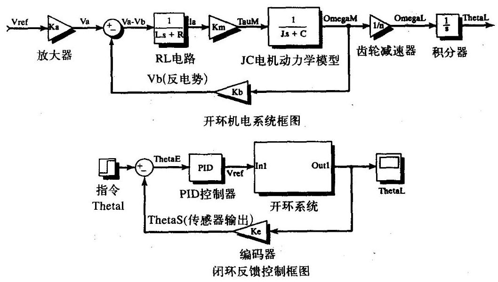

图9-16 由一个直流伺服电机电枢控制器驱动的ARMII电动肩关节/连杆的线性开环系统的动力学模型

如果将负载轴的惯量和阻尼变换到电机轴,有效极惯量和阻尼系数分别为 $J = {J}_{M} + {J}_{L}\left( t\right) /{n}^{2}$ 和 $C = {C}_{M} + {C}_{L}/{n}^{2}$ 。由于传动比 $n$ 很大,因此这些有效值与电机轴的惯量和阻尼系数没有很大差别。 为此,由于传动比使我们可以忽略与负载轴惯量 ${J}_{L}\left( t\right)$ 有关的位形变化,仅给出一个合理的平均值即可。

附表[13]给出了ARMII 的肩关节常量参数。注意, 可以直接应用英制单位, 因为在控制系统内部它们的影响被抵消了。同样, 对于转角可以直接以deg为单位。根据已给出的模型和反馈控制图建立一个Simulink 模型来模拟单关节控制模型, 应用表中指定的参数。在正常情况下, 为获得“良好的”性能(合适的超调量、上升时间、峰值时间和调节时间)，需通过反复试验确定PID增益。对于0到60deg的阶跃输入，对肩关节的运动进行仿真。绘制负载转角值-时间关系的仿真曲线以及负载轴角速度一时间关系的仿真曲线。另外, 绘制一个控制效果图一一即电枢电压 ${V}_{a}$ 与时间的关系曲线 (在同一个图中,给出反电势 ${V}_{b}$ )。

表9-1 ARMI肩关节常量参数

<table><tr><td>${V}_{a}\left( t\right)$</td><td>电枢电压</td><td>${\tau }_{M}\left( t\right)$</td><td>电机输出力矩</td><td>${\tau }_{L}\left( t\right)$</td><td>负载力矩</td><td></td></tr><tr><td>$L = {0.0006}\mathrm{H}$</td><td>电枢电感</td><td>${\theta }_{M}\left( t\right)$</td><td>电机轴转角</td><td>${\theta }_{L}\left( t\right)$</td><td>负载轴转角</td><td></td></tr><tr><td>$R = {1.40\Omega }$</td><td>电枢阻抗</td><td>${\omega }_{M}\left( t\right)$</td><td>电机轴角速度</td><td>${\omega }_{L}\left( t\right)$</td><td>负载轴角速度</td><td></td></tr><tr><td>${i}_{a}\left( t\right)$</td><td>电枢电流</td><td>${J}_{M} = {0.00844} \; {\mathrm{{lb}}}_{f} - {\mathrm{{in} - s}}^{2}$</td><td>电机的总极惯量</td><td>${J}_{L}\left( t\right)  = 1 \; 1{b}_{f} -$ in $- {s}^{2}$</td><td>负载的总极惯量</td><td></td></tr><tr><td>${V}_{b}\left( t\right)$</td><td>反电势</td><td>${C}_{u} = {0.00013}$   lb, -in/deg/s</td><td>电机轴粘性阻尼   系数</td><td>${C}_{L} = {0.5}$   $1{b}_{\widetilde{f}}$ in/deg/s</td><td>负载轴粘性阻尼系数</td><td></td></tr><tr><td>${K}_{a} = {12}$</td><td>放大器增益</td><td>$n = {200}$</td><td>传动比</td><td>$g = 0\mathrm{{in}}/{\mathrm{s}}^{2}$</td><td>重力(首先忽略重力)</td><td></td></tr><tr><td>${K}_{b} = {0.00867}$</td><td>反电势常数</td><td>${K}_{M} = {4.375}$</td><td>扭矩常数</td><td>${K}_{c} = 1$</td><td>编码器转换函数</td><td></td></tr><tr><td>$V/\mathrm{{deg}}/\mathrm{s}$</td><td></td><td>1b_in/A</td><td></td><td></td><td></td><td></td></tr></table>

现在, 改变一些参数一Simulink很容易实现参数改变:

1)进行控制器设计时阶跃输入不成立，因此尝试采用下述斜坡式阶跃输入代替:斜坡坡度为 ${1.5}\mathrm{\;s}$ 内从 $0\mathrm{{deg}}$ 到 ${60}\mathrm{{deg}}$ ,然后一直保持在 ${60}\mathrm{{deg}}$ ,大于 ${1.5}\mathrm{\;s}$ 。重新设计PID增益并重新仿真。

2)研究电感 $L$ 在系统中是否重要(电气系统比机械系统上升快得多——这个效应可以由时间常数表示)？

3) 我们没有估计好负载惯量和阻尼 $\left( {{J}_{L}\text{ 和 }{C}_{L}}\right)$ 。利用你以前得到的最好的PID增益,在对系统不产生影响的情况下，研究这些值能够达到多大(等比例增加标准参数)？

4) 现在将重力影响作为电机力矩 ${T}_{M}$ 的干扰。假设机器人运动质量为 ${200}\mathrm{{lb}}$ ，关节2向前移动长度为 6.4ft。测试你以前调整好的PID增益, 如有必要则需重新设计。肩关节负载角 ${\theta }_{2}$ 在零位,且竖直向上。
