# 第10章 操作臂的非线性控制

## 10.1 概述

在上一章, 为了用线性方法对操作臂控制问题进行分析, 我们给出了几个近似假设。其中最重要的近似假设是认为每个关节都是独立的, 而且每个关节驱动器的惯量被 “认为” 是恒定的。上一章中的线性控制器在实际工作时, 由于这种近似会导致整个工作空间内系统阻尼不一致，以及出现其他意想不到的结果。在本章中，我们将介绍不需要这些假设的更高级的控制技术。

在第9章,我们使用 $n$ 个独立的二阶微分方程对操作臂进行建模,在这个基础上建立了控制器模型。在本章中,我们将根据第6章中推导的一般操作臂的 $n \times  1$ 非线性矢量运动微分方程模型直接进行控制器设计。

非线性控制理论是一个广泛的领域, 因此我们只能讨论几种比较适用于机械操作臂控制的方法。本章中主要讨论一种特殊的方法, 这种方法在文献[1]中被首次提出, 在文献[2, 3]中被称为计算力矩法。本章中还将介绍一种非线性系统稳定性分析的方法,称为李雅普诺夫方法 ${}^{\left( 4\right) }$ 。

我们仍以最简单的单自由度有阻尼质量弹簧系统为例, 开始进行操作臂非线性控制技术的讨论。

## 10.2 非线性系统和时变系统

在前面的推导中, 我们求解的是一个线性常系数微分方程。采用这种数学形式是因为图 9-6中的有阻尼质量弹簧系统的模型是一个线性时不变系统。而对于参数随时间变化的系统， 即具有非线性特性的系统, 方程的求解将更加困难。

如果非线性特性不明显, 可以用局部线性化导出线性模型, 在操作点的邻域内, 用它近似代表非线性方程。然而, 这种方法并不适于操作臂的控制问题, 因为操作臂经常在工作空间内作大范围运动，因此无法找到一个适合于所有工作区域的线性化模型。

另一种方法是让操作点随操作臂的移动而变化, 始终在操作臂的期望位置附近进行线性化。这种运动线性化的结果使系统成为一个线性的时变系统。虽然对原系统的准静态线性化在某些分析和设计中是有用的, 但是我们并不采用这种方法对控制律进行综合, 我们将直接研究非线性运动方程, 而不借助线性化方法设计控制器。

如果图9-6中的弹簧不是线性的而是具有某种非线性特性, 这时可以把系统看作为准静态系统, 并在每个瞬时计算出系统极点的位置。我们会发现, 当质量块运动时, 这些极点随之在复平面上移动, 它是质量块位置的函数。因而, 我们无法选择固定的增益使极点保持在期望的位置 (例如, 临界阻尼状态)。为此, 需要寻找更复杂的控制律, 其中选择的增益是时变的 (实际上是按照质量块位置的函数变化) 从而使得系统总是处于临界阻尼状态。实际上可以通过计算 ${k}_{p}$ ,使控制律中的非线性项正好抵消弹簧的非线性效应,从而使系统的总刚度始终保持不变。这种控制方式称为线性控制方法, 因为它用非线性控制项去 “抵消” 被控系统的非线性, 使得整个闭环系统是线性的。

运用前述的控制律分解方法, 可以实现线性化的功能。在控制律分解方法中, 伺服控制律始终保持不变, 而基于模型的部分将包含非线性模型。因而, 基于模型的控制部分对系统进行了线性化处理。通过下面的例子可以得到具体说明。

例10.1

图10-1所示为一非线性弹簧特性。与普通线性弹簧的关系 $f = {kx}$ 不同,这个弹簧的特性曲线可由 $f = q{x}^{3}$ 描述。如果图9-6中所示系统的弹簧是这种弹簧,试建立一个控制律,使得系统工作在刚度为 ${k}_{CL}$ 的临界阻尼状态下。

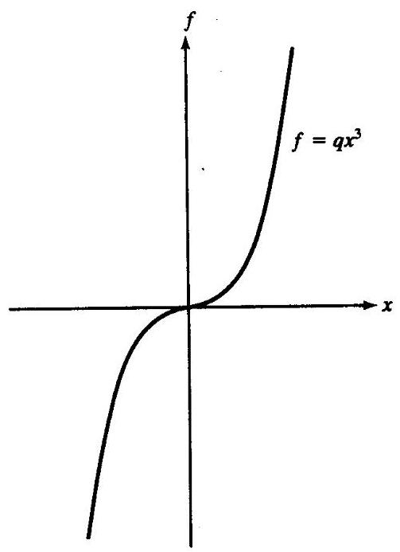

图10-1 非线性弹簧的力-伸长量特性曲线

系统的开环方程为

$$
m\ddot{x} + b\dot{x} + q{x}^{3} = f \tag{10-1}
$$

基于模型的单元为 $f = \alpha {f}^{\prime } + \beta$ ,其中

$$
\alpha  = m
$$

$$
\beta  = b\dot{x} + q{x}^{3} \tag{10-2}
$$

伺服控制部分同前所述

$$
{f}^{\prime } = {\ddot{x}}_{d} + {k}_{v}\dot{e} + {k}_{p}e \tag{10-3}
$$

式中的增益值可由期望的性能指标计算得出。图10-2为该系统的方框图。这个闭环系统将极点保持在固定位置。

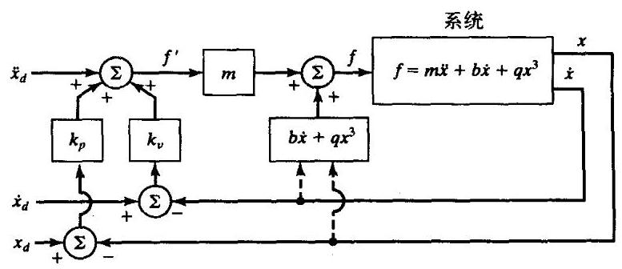

图10-2 用于非线性弹簧系统的非线性控制系统

例10.2

图10-3所示为非线性摩擦特性。线性摩擦的表达式为 $f = b\dot{x}$ ,而本例中的库仑摩擦特性为 $f = {b}_{c}\operatorname{sgn}\left( \dot{x}\right)$ 。目前大部分操作臂中,用这种非线性特性描述关节轴承(无论是转动关节还是移动关节)的摩擦比用简单的线性模型更精确。如果图9-6所示系统中的摩擦是这种摩擦, 试设计一个控制系统, 利用非线性的基于模型的控制部分使系统总是处于临界阻尼状态。

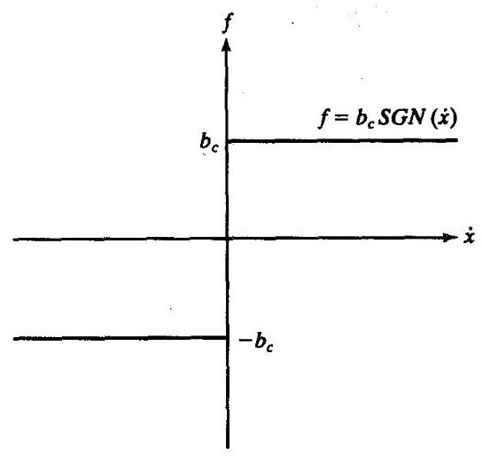

图10-3 库仑摩擦的力一速度特性曲线

系统的开环方程为

$$
m\ddot{x} + {b}_{c}\operatorname{sgn}\left( \dot{x}\right)  + {kx} = f \tag{10-4}
$$

分解运动控制律为 $f = \alpha {f}^{\prime } + \beta$ ,其中

$$
\alpha  = m
$$

$$
\beta  = {b}_{c}\operatorname{sgn}\left( \dot{x}\right)  + {kx} \tag{10-5}
$$

$$
{f}^{\prime } = {\ddot{x}}_{d} + {k}_{v}\dot{e} + {k}_{p}e
$$

式中的增益值可由期望的性能指标计算得出。

例10.3

图10-4所示为一单连杆操作臂。有一个转动关节。假定质量集中于连杆末端, 则转动惯

量为 $m{l}^{2}$ 。关节上作用有库仑摩擦和粘性摩擦,还有重力负载。

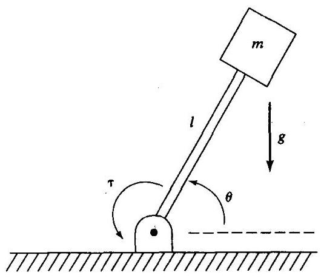

图10-4 一个倒立摆或一个单连杆操作臂

这个操作臂的模型为

$$
\tau  = m{l}^{2}\ddot{\theta } + v\dot{\theta } + {csgn}\left( \dot{\theta }\right)  + {mlg}\cos \theta \tag{10-6}
$$

同前, 控制系统分解为两部分, 线性化的模型控制部分和伺服控制部分。

基于模型的控制部分为 $f = \alpha {f}^{\prime } + \beta$ ,其中

(10-7)

$$
\alpha  = m{l}^{2}
$$

$$
\beta  = v\dot{\theta } + {csgn}\left( \dot{\theta }\right)  + {mlg}\cos \theta
$$

伺服控制部分同前

$$
{f}^{\prime } = {\ddot{\theta }}_{d} + {k}_{v}\dot{e} + {k}_{p}e \tag{10-8}
$$

式中的增益值可由期望的性能指标计算得出。

我们可以看到, 在某些简单的情况下, 设计一个非线性控制器并不困难。前面的简单例子中用到的一般方法同样可用于操作臂的控制问题中:

1. 计算一个非线性的基于模型的控制律, 用来 “抵消” 被控系统的非线性。

2. 将系统简化为线性系统, 用对应于单位质量系统的简单线性伺服控制律进行控制。

在某种意义上, 线性化控制律给出了被控系统的逆向模型。被控系统中的非线性与逆向模型中的非线性相抵消, 这样, 它与伺服控制律一起构成了一个线性闭环系统。显然, 为了抵消系统的非线性作用, 必须知道非线性系统的参数和结构。这是这种方法在实际应用中经常遇到的问题。

## 10.3 多输入多输出控制系统

与本章中前面讨论过的简单例子不同, 操作臂的控制是一个多输入多输出 (MIMO) 问题。也就是说, 需用矢量表示关节位置、速度和加速度, 控制律所计算的是各关节驱动信号矢量。把控制律分解成为基于模型的控制部分和伺服控制部分的方法在这里仍然适用, 只是以矩阵一矢量的形式出现。控制律的形式如下

$$
F = \alpha {F}^{\prime } + \beta \tag{10-9}
$$

式中,对于自由度为 $n$ 的系统, $F\text{ 、 }{F}^{\prime }$ 和 $\beta$ 为 $n \times  1$ 矢量, $\alpha$ 为 $n \times  n$ 矩阵。注意,矩阵 $\alpha$ 不一定是对角阵,它的作用是对 $n$ 个运动方程进行解耦。如果适当选择 $\alpha$ 和 $\beta$ ,那么根据输入 ${F}^{\prime }$ 系统, 将表现为 $n$ 个独立的单位质量系统。为此,在多维的情况下,控制律中基于模型的部分被称为线性化解耦控制律。而多维系统的伺服控制律为

$$
{F}^{\prime } = {\ddot{X}}_{d} + {K}_{v}\dot{E} + {K}_{p}E \tag{10-10}
$$

式中 ${K}_{v}$ 和 ${K}_{p}$ 都是 $n \times  n$ 矩阵,通常选取对角阵,对角线上的元素是常数增益值。 $E$ 和 $\dot{E}$ 分别为 $n \times  1$ 维的位置误差矢量和速度误差矢量。

## 10.4 操作臂的控制问题

对于操作臂的控制问题, 在第6章中曾建立了操作臂的模型和相应的运动方程。我们可以看到, 这些方程是很复杂的。刚体动力学方程的形式如下

$$
\tau  = M\left( \Theta \right) \ddot{\Theta } + V\left( {\Theta ,\dot{\Theta }}\right)  + G\left( \Theta \right) \tag{10-11}
$$

式中 $M\left( \Theta \right)$ 是操作臂的 $n \times  n$ 惯量矩阵, $V\left( {\Theta ,\dot{\Theta }}\right)$ 是 $n \times  1$ 的离心力和哥氏力矢量, $G\left( \Theta \right)$ 是 $n \times  1$ 的重力矢量。 $M\left( \Theta \right)$ 和 $G\left( \Theta \right)$ 中的每一项都是操作臂所有关节位置矢量 $\Theta$ 的复杂函数， $V\left( {\Theta ,\dot{\Theta }}\right)$ 中的每一项都是 $\Theta$ 和 $\dot{\Theta }$ 的复杂函数。

另外, 我们还可以加进一个摩擦模型 (或者其他非刚体效应)。假设这个摩擦模型是关节位置和速度的函数,我们在式 (10-11) 上加上一项 $F\left( {\Theta ,\dot{\Theta }}\right)$ ,得到

$$
\tau  = M\left( \Theta \right) \ddot{\Theta } + V\left( {\Theta ,\dot{\Theta }}\right)  + G\left( \Theta \right)  + F\left( {\Theta ,\dot{\Theta }}\right) \tag{10-12}
$$

对于式 (10-12) 描述的这种复杂系统的控制问题, 可以用本章介绍过的控制器分解方法来求解。这时有

$$
\tau  = \alpha {\tau }^{\prime } + \beta \tag{10-13}
$$

式中 $\tau$ 是 $n \times  1$ 关节力矩矢量。选择

(10-14)

$$
\alpha  = M\left( \Theta \right)
$$

$$
\beta  = V\left( {\Theta ,\dot{\Theta }}\right)  + G\left( \Theta \right)  + F\left( {\Theta ,\dot{\Theta }}\right)
$$

以及伺服控制律

$$
{\tau }^{\prime } = {\ddot{\Theta }}_{d} + {K}_{v}\dot{E} + {K}_{p}E \tag{10-15}
$$

式中

$$
E = {\Theta }_{d} - \Theta \tag{10-16}
$$

求得的控制系统如图10-5所示。

利用式 (10-12) 至 (10-15), 很容易得到系统闭环特性的误差方程为

$$
\ddot{E} + {K}_{v}\dot{E} + {K}_{p}E = 0 \tag{10-17}
$$

注意,这个矢量方程是解耦的: 矩阵 ${K}_{v}$ 和 ${K}_{p}$ 是对角阵,因而式 (10-17) 可以写成各关节独立的形式

$$
{\ddot{e}}_{i} + {k}_{vi}\dot{e} + {k}_{pi}e = 0 \tag{10-18}
$$

式 (10-17) 描述的理想特性在实际中是无法获得的, 在上述诸多因素中最重要的有两点:

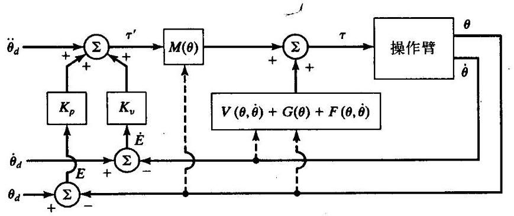

图10-5 基于模型的操作臂控制系统

1. 数字计算机的特性是离散的, 而不是式 (10-14) 和式 (10-15) 中表示的那种理想的连续时间控制律。

2. 操作臂模型的不精确 (必须计算式 (10-14))。

在下一节，我们将讨论(至少是部分地讨论)这两个问题。

## 10.5 实际应用中的问题

前几节中对于解耦和线性化控制的讨论中, 实际上作了若干假设, 而这些在实际情况中基本不存在。

**模型计算耗时**

在控制律分解策略的讨论分析中, 都隐含假设了整个系统的运行时间是连续的, 而且计算控制律所需的时间为零。对于已知的计算量, 如果计算机的容量很大, 计算速度非常快, 那么这个假设是合理的; 然而, 这种计算机非常昂贵, 使得这种方法在经济上是不合算的。 对于操作臂控制, 在控制律计算中必须计算操作臂的整个动力学方程式 (10-14)。这些计算是相当复杂的, 因此, 如同在第6章中讨论过的, 如何建立一个快速的算法来有效地进行这些计算, 得到了研究者们很大的关注。随着计算机计算能力的不断增强, 实现控制律的大量运算将变得越来越可行了。基于非线性模型的控制律的一些实验报道见文献[5-9]，部分已经开始在工业机器人的控制器上得到应用。

如第9章所述, 现在几乎所有的操作臂控制系统都由数字电路实现的, 并且在一定的采样速率下运行。这表明位置(或者其他参量)传感器的读取方式是实时的离散点。由这些值计算出驱动器指令并发送给驱动器。因此, 读取传感器和发送驱动器指令都不是连续的, 而是以有限的采样速率进行的。为了分析由计算时间和有限采样速率产生的延迟影响, 必须利用离散时间控制领域的研究方法。对于离散时间来说, 微分方程变成了差分方程, 相应地需用一套方法来解决离散系统的稳定性问题和极点配置问题。离散时间控制理论已经超出了本书的研究范围, 不过离散时间系统的许多概念对许多操作臂控制领域的研究者来说是十分重要的 (见文献[10]。)

尽管如此重要, 离散时间控制理论的思想和方法还是难以应用于非线性控制中。虽然我们已经努力设法写出了一个复杂的操作臂动力学运动微分方程, 但是等价的离散形式的方程却不可能得到, 因为, 在给定一组初始条件、输入和有限的时间间隔的情况下, 求解一般操作臂运动的唯一方法是采用数值积分 (如第6章中所述)。仅当应用微分方程的级数解法或者近似解法才能得到离散时间模型。然而, 如果需要通过近似方法建立一个离散模型, 很难说有比采用连续模型进行连续时间近似更好的方法。总之, 操作臂离散时间控制问题的分析是相当困难的, 通常依赖于仿真来判断某一采样速率的性能效果。

通常假定计算速度足够快并且连续时间近似是有效的。

**非线性前馈控制**

前馈控制方法已被应用于非线性动力学模型, 在这种控制律中不需要以伺服速率进行复杂的耗时计算 ${}^{\left\lbrack  {11}\right\rbrack  }$ 。在图 10-5 中,控制律中基于模型的控制部分是在 “伺服回路之中” 的, 在每个伺服时钟脉冲时这个回路中的信号是 “流” 过黑箱的。如果选择采样频率为 ${200}\mathrm{\;{Hz}}$ , 那么操作臂的动力学模型必须以此速率计算。另一种控制系统如图10-6所示。在这个系统中, 基于模型的控制部分在伺服环的 “外面”。因而, 可以有一个快速的内伺服环, 此时只需将误差与增益相乘。而基于模型的力矩计算则在一个较低的速率下附加在内伺服环的计算之上。

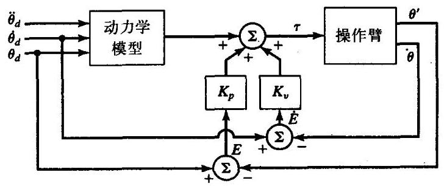

图10-6 基于模型的控制部分在伺服回路之“外”的控制方式

但是,图10-6所示的前馈控制方式并不能完全解耦。如果写出系统方程 ${}^{ \ominus  }$ ,则系统的误差方程为

$$
\ddot{E} + {M}^{-1}\left( \Theta \right) {K}_{v}\dot{E} + {M}^{-1}\left( \Theta \right) {K}_{p}E = 0 \tag{10-19}
$$

显然, 随着操作臂位形的变化, 有效的闭环增益将会改变, 准静态极点也会在复平面上移动。 然而, 我们可以根据式 (10-19) 设计鲁棒控制器的起始点——即找到一组合适的常数增益, 尽管存在极点 “运动”，但仍然可以使它们保持在有利位置。另一种方法是随着操作臂位形的变化, 事先计算出可变增益的值, 从而使系统的准静态极点保持在固定位置。

注意, 在图10-6所示系统中, 动力学模型仅是期望轨迹的函数, 因此当事先已知期望轨迹时, 可以在运动开始前 “离线” 计算出需要的数值。在运行时, 则从存储器中读出预先计算好的力矩函数。同样, 如果需要计算时变增益, 同样可以事先将它们计算并存储下来。因此, 这种控制方式运行时计算量较小, 从而可达到很高的伺服速率。

---

$\Theta$ 为简化起见,假定 $M\left( {\Theta }_{d}\right)  \cong  M\left( \Theta \right) , V\left( {{\Theta }_{d},{\dot{\Theta }}_{d}}\right)  \cong  \left( {V\left( {\Theta ,\dot{\Theta }}\right) }\right) , G\left( {\Theta }_{d}\right)  \cong  G\left( \Theta \right)$ 以及 $F\left( {{\Theta }_{d},{\dot{\Theta }}_{d}}\right)  \cong  F\left( {\Theta ,\dot{\Theta }}\right)$

---

**双速率计算力矩方法**

图10-7所示是一种实际的解耦及线性化的位置控制系统原理框图。动力学模型以形位空间的形式描述, 因此操作臂的动力学参数只是操作臂位置的函数。这些函数可以在后台进行计算,或者在另一台控制计算机上计算 ${}^{\left\lbrack  8\right\rbrack  }$ ,或者查阅预先计算的表格 ${}^{\left\lbrack  {12}\right\rbrack  }$ 。按照这种控制结构, 可以以低于闭环伺服速率的速度更新动力学参数。比如,闭环伺服频率为 ${250}\mathrm{\;{Hz}}$ 时,可以以 60Hz的频率进行后台计算。

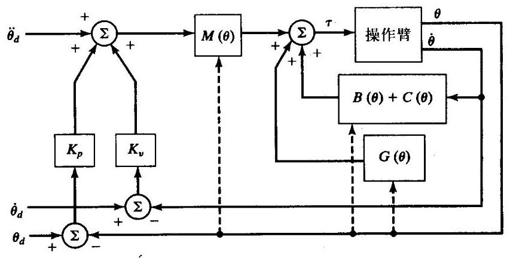

图10-7 基于模型的操作臂控制系统的实现方法

**缺少参数信息的情况**

应用计算力矩控制算法的第二个潜在困难是难以精确得到操作臂的动力学模型。对于动力学模型的某些参数尤其如此, 例如摩擦效应。实际上, 通常很难确定摩擦模型的结构, 更不用说参数的值 ${}^{\left\lbrack  {13}\right\rbrack  }$ 。此外,如果操作臂的某些动力学参数不具有重复性——例如,由于机器人的老化——则难以得到任何时候都适用这个动力学模型的参数值。

自然, 大部分机器人总是要抓持各种工件和工具。当机器人抓握着工具时, 工具的惯量和重量改变了操作臂的动力学特性。在工程应用中, 工具的质量分布可能是已知的, 这时, ' 可以用它计算控制律中基于模型的部分。当抓持工具时, 操作臂末端连杆的惯量矩阵、总质量以及质心可以按照末端连杆和工具合成后的值重新修正。然而, 在许多应用中, 操作臂抓持物体的质量分布一般不是已知的, 因此要保证动力学模型的精确性是很困难的。

对于一个最简单的非理想情况, 假定模型是精确的, 且以连续时间运行, 只有外部噪声作用在系统上。图10-8中所示为作用在关节上的干扰力矩矢量。包含这些未知干扰的系统误差方程为

$$
\ddot{E} + {K}_{v}\dot{E} + {K}_{p}E = {M}^{-1}\left( \Theta \right) {\tau }_{d} \tag{10-20}
$$

式中 ${\tau }_{d}$ 是作用在关节上的干扰力矩矢量。式 (10-20) 的左边是解耦的,但是,从右边可以看出,在任意一个关节上的干扰都将给其他关节造成误差,因为 $M\left( \Theta \right)$ 一般不是对角阵。

基于式 (10-20) 可以作一些简单分析。例如, 很容易计算出一个恒定干扰产生的稳态伺服误差为

$$
E = {K}_{p}^{-1}{M}^{-1}\left( \Theta \right) {\tau }_{d} \tag{10-21}
$$

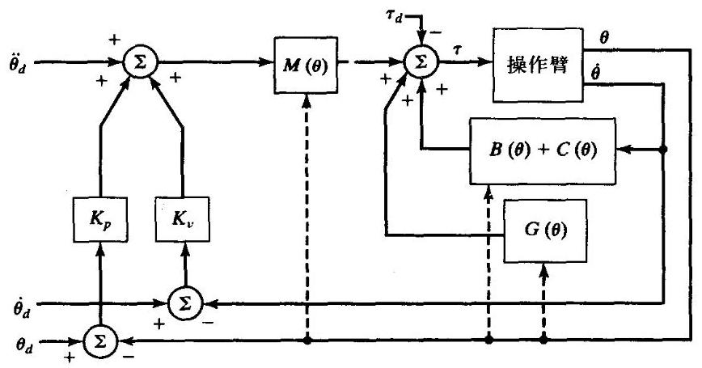

图10-8 有外部干扰作用的基于模型的控制器

如果操作臂的动力学模型不完善, 则对得到的闭环系统进行分析就变得更加困难。为此定义符号如下: $\widehat{M}\left( \Theta \right)$ 是操作臂惯量矩阵 $M\left( \Theta \right)$ 的模型参数。同样, $\widehat{V}\left( {\Theta ,\dot{\Theta }}\right) \text{ 、 }\widehat{G}\left( \Theta \right)$ 、 $\widehat{F}\left( {\Theta ,\dot{\Theta }}\right)$ 分别是实际机构的速度项、重力项和摩擦力项的模型参数。完全精确的模型是指

$$
\widehat{M}\left( \Theta \right)  = M\left( \Theta \right)
$$

$$
\widehat{V}\left( {\Theta ,\dot{\Theta }}\right)  = V\left( {\Theta ,\dot{\Theta }}\right)
$$

$$
\widehat{G}\left( \Theta \right)  = G\left( \Theta \right) \tag{10-22}
$$

$$
\widehat{F}\left( {\Theta ,\dot{\Theta }}\right)  = F\left( {\Theta ,\dot{\Theta }}\right)
$$

因而, 虽然已知操作臂的动力学方程为

$$
\tau  = M\left( \Theta \right) \ddot{\Theta } + V\left( {\Theta ,\dot{\Theta }}\right)  + G\left( \Theta \right)  + F\left( {\Theta ,\dot{\Theta }}\right) \tag{10-23}
$$

而采用的控制律计算却是

$$
\tau  = \alpha {\tau }^{\prime } + \beta
$$

$$
\alpha  = \widehat{M}\left( \Theta \right) \tag{10-24}
$$

$$
\beta  = \widehat{V}\left( {\Theta ,\dot{\Theta }}\right)  + \widehat{G}\left( \Theta \right)  + \widehat{F}\left( {\Theta ,\dot{\Theta }}\right)
$$

因而, 当已知参数不精确时, 解耦和线性化就无法很好地完成。所得到的系统闭环方程为

(10-25)

$$
\ddot{E} + {K}_{v}\dot{E} + {K}_{p}E
$$

$$
= {\widehat{M}}^{-1}\left\lbrack  {\left( {M - \widehat{M}}\right) \ddot{\Theta } + \left( {V - \widehat{V}}\right)  + \left( {G - \widehat{G}}\right)  + \left( {F - \widehat{F}}\right) }\right\rbrack
$$

为简明起见, 式中没有写出动力学函数的自变量。注意, 如果模型是精确的, 则式 (10-22) 成立, 从而式 (10-25) 的右边为零, 误差消失。当参数不能精确知道时, 实际参数与模型参数不一致，则根据十分复杂的式 (10-25) 计算，将会引起伺服误差(甚至可能导致系统失稳 ${}^{\left( 2l\right) }$ )。

关于非线性闭环系统的稳定性分析将在 10.7 节中进行讨论。

## 10.6 当前的工业机器人控制系统

正因为参数的精确性问题, 因此难以确知是否值得花费精力为操作臂控制去计算一个复杂的基于模型的控制律。以足够快的速率计算操作臂模型, 在计算能力上的花费可能并不值得, 尤其是当模型参数不准确时, 这种方法是无益的。工业机器人的制造厂商们从经济方面考虑, 认为在控制器中使用一个完备的操作臂模型是不值得的。相反, 当前的操作臂都使用很简单的控制律, 一般只进行误差补偿, 控制方式是在9.10节中讨论过的。图10-9所示为一具有高性能伺服系统的工业机器人。

**独立关节PID控制**

据了解, 当今大部分工业机器人的控制方式可描述如下

(10-26)

$$
\alpha  = I
$$

$$
\beta  = 0
$$

式中 $I$ 是 $n \times  n$ 单位矩阵。伺服控制部分为

$$
{\tau }^{\prime } = {\ddot{\Theta }}_{d} + {K}_{v}\dot{E} + {K}_{p}E + {K}_{i}\int {Edt} \tag{10-27}
$$

式中 ${K}_{v}\text{ 、 }{K}_{p}$ 和 ${K}_{f}$ 为常数对角阵。在许多情况下, ${\ddot{\Theta }}_{d}$ 未知,因此可简单地设为零。也就是说, 大部分简单的机器人控制器在控制律中根本不使用基于模型的控制部分。这种类型的PID控制方式是很简单的, 因为每个关节都被作为一个独立的控制系统来控制。如同9.10节中讨论过的, 通常每个关节都使用一个微处理器来完成式 (10-27) 的计算。

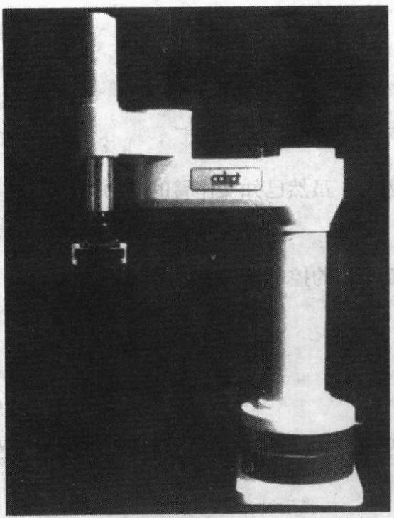

图10-9 AdeptOne, Adept技术公司制造的直接驱动机器人

用这种方式控制的操作臂的性能并不容易描述。由于没有进行解耦, 因此每个关节的运动都会对其他关节产生影响。这种相互影响引起的误差可通过误差补偿控制律进行抑制。要选择一个固定增益, 使操作臂在任何位形时对干扰的响应都处于临界阻尼状态是不可能的。因而, 通常选择 “平均” 增益, 使机器人工作空间的中心位置接近临界阻尼状态。当操作臂处于各种极端位形时, 系统为欠阻尼或过阻尼状态。根据机器人机械设计的具体情况, 可使这种影响相当小, 此时控制效果较好。在这种系统中, 重要的是要保证尽可能高的增益, 这样可使无法避免的干扰很快得到抑制。

**附加重力补偿**

由于重力项容易引起静态定位误差, 所以有些机器人生产商在控制律中包含了一个重力项 $G\left( \theta \right)$ (即 $\beta  = \widehat{G}\left( \Theta \right)$ )。总的控制律具有如下形式

$$
{\tau }^{\prime } = {\ddot{\Theta }}_{d} + {K}_{v}\dot{E} + {K}_{p}E + {K}_{i}\int {Edt} + \widehat{G}\left( \Theta \right) \tag{10-28}
$$

这个控制律可能是基于模型的控制器的最简单的例子。由于在式 (10-28) 中不再能严格按照单关节控制的模式进行计算, 所以控制器的结构必须具有在各关节控制器之间进行通讯的功能, 或者只应用一个中央处理器代替各关节处理器。

**解耦控制的各种近似方法**

对于特定的操作臂,可采用各种不同的方法对动力学方程进行简化 ${}^{\left\lbrack  3,{14}\right\rbrack  }$ 。经简化后,可以导出一个近似的解耦及线性化控制律。通常的简化方法是把速度项产生的力矩分量忽略掉一即模型中只有惯量项和重力项。一般在控制器中也不包含摩擦模型, 因为很难建立正确的摩擦模型。有时也对惯量矩阵进行简化, 只考虑关节轴之间的主要耦合, 不考虑次要的交叉耦合效应。例如, 文献[14]提出了PUMA560质量矩阵的一种简化模型, 需要的计算量仅为计算完整质量矩阵的10%，而精度在1%以内。

## 10.7 李雅普诺夫稳定性分析

在第9章中, 我们用阻尼和闭环带宽来对线性系统进行稳定性和动态响应性能的评价。对于非线性系统, 利用完备的基于模型的非线性控制器进行解耦和线性化, 这种分析方法同样有效, 因为最后得到的系统仍是线性的。但是, 当控制器没有进行解耦和线性化, 或解耦和线性化不完全或不精确时, 整个闭环系统仍然是非线性的。对于非线性系统, 稳定性和性能分析要困难得多。在本节, 我们介绍一种对线性和非线性系统都适用的稳定性分析方法。

我们以第9章中介绍的简单的有摩擦质量弹簧系统为例, 其运动方程为

$$
m\ddot{x} + b\dot{x} + {kx} = 0 \tag{10-29}
$$

系统的总能量为

$$
v = \frac{1}{2}m{\dot{x}}^{2} + \frac{1}{2}k{x}^{2} \tag{10-30}
$$

式中第一项为质量块的动能,第二项为储存在弹簧中的势能。注意,系统能量 $v$ 总是非负的 (即为正或零)。将式 (10-30) 对时间求导得到总能量的变化率

$$
\dot{v} = m\dot{x}\ddot{x} + {kx}\dot{x} \tag{10-31}
$$

将式 (10-29) 代入式 (10-31) 消去 $m\ddot{x}$ ,得

$$
\dot{v} =  - b{\dot{x}}^{2} \tag{10-32}
$$

可以看出该值总是非正的 (因为 $b > 0$ )。这说明系统的能量总是在耗散的,除非 $\dot{x} = 0$ 。由此得出结论, 系统受到初始干扰, 将不断丧失能量直到静止状态。用稳态分析方法式 (10-29) 考察系统可能的静止位置, 得

$$
{kx} = 0 \tag{10-33}
$$

即

$$
x = 0 \tag{10-34}
$$

因此, 通过能量分析可知, 式 (10-29) 所示的系统在任何初始条件下 (即任何初始能量), 最终都将稳定在平衡点。这种基于能量分析的稳定性证明方法是一种一般方法的简单例子, 这个一般方法是以19世纪的俄国数学家李雅普诺夫的名字命名的, 称为李雅普诺夫稳定性分析或第二类李雅普诺夫方法 (或直接法) ${}^{\left\lbrack  {13}\right\rbrack  }$ 。

这种稳定性分析方法的一个显著特点是不需要求解控制系统的微分方程即可判断系统的稳定性。然而, 虽然李雅普诺夫方法可以判断稳定性, 但它通常无法提供任何有关瞬时响应或系统性能的信息。注意, 这种能量分析方法不能给出系统是过阻尼或欠阻尼的信息, 也不能给出系统抑制干扰所需的时间。稳定性和动态性能的主要区别在于:虽然系统是稳定的， 但它的控制性能可能并不令人满意。

李雅普诺夫方法比前述的例子更具一般性。它是为数不多的几种能够直接应用到非线性系统上的稳定性分析方法之一。为了很快了解李雅普诺夫方法 (满足我们的具体需要), 我们将简单介绍一下这个理论, 然后直接分析几个实例。更完整的李雅普诺夫理论分析方法可参见文献[16, 17]。

李雅普诺夫方法用于确定下列微分方程的稳定性

$$
\dot{X} = f\left( X\right) \tag{10-35}
$$

式中, $X$ 为 $m \times  1$ 矢量, $f\left( \cdot \right)$ 可以是非线性函数。注意,高阶微分方程总是可以被写成一组形式为式 (10-35) 的一阶微分方程。为了用李雅普诺夫方法证明一个系统是否稳定, 必须构造一个具有如下性质的广义能量函数 $v\left( X\right)$ :

1. $v\left( X\right)$ 具有连续的一阶偏导数,对于任意 $X$ 有 $v\left( X\right)  > 0$ ,且 $v\left( 0\right)  = 0$ 除外;

2. $\dot{v}\left( X\right)  < 0,\;\dot{v}\left( X\right)$ 指 $v\left( X\right)$ 在系统所有轨迹上的变化率。

若这些性质仅在特定区域成立, 则相应的系统为弱稳定的; 若这些性质在全局成立, 则相应的系统为强稳定的。可直观解释为, 一个正定的 “能量形式” 的状态函数, 其值是一直减小的或保持为常数一一则系统是稳定的, 即系统的状态矢量是有界的。

若 $\dot{v}\left( X\right)$ 严格小于零，则系统的状态是渐近收敛于零矢量。LaSalle和Lefschetz ${}^{\left( 4\right) }$ 对李雅普诺夫最初的工作做了重要发展,他们指出,在一定情况下,即使当 $\dot{v}\left( X\right)  < 0$ (注意包含等号), 系统也是渐近稳定。为此,可以通过稳态分析讨论 $\dot{v}\left( X\right)  = 0$ 时的情况,以便确定这个系统是渐近稳定的,还是 “粘结在” $v\left( X\right)  = 0$ 以外的某处。

式 (10-35) 所描述的系统被称为自治系统,因为函数 $f\left( \cdot \right)$ 不是时间的显函数。李雅普诺夫方法也可以推广到非自治系统中去, 其中时间是非线性函数的自变量。详见文献[4,17]。

例10.4

对于一个线性系统

$$
\dot{X} =  - {AX} \tag{10-36}
$$

式中 $A$ 为 $m \times  m$ 正定矩阵。假定选取李雅蔷诺夫函数为

$$
v\left( X\right)  = \frac{1}{2}{X}^{T}X \tag{10-37}
$$

该函数是连续且非负的。将其微分得

$$
\dot{v}\left( X\right)  = {X}^{T}\dot{X}
$$

$$
= {X}^{T}\left( {-{AX}}\right) \tag{10-38}
$$

$$
=  - {X}^{T}{AX}
$$

因为 $A$ 是正定阵，因此该函数是非正的。因此，式 (10-37) 确实是式 (10-36) 所示系统的李雅普诺夫函数。该系统是渐近稳定的,因为 $\dot{v}\left( X\right)$ 仅在 $X = 0$ 处为零,而在其他位置 $X$ 一定是减小的。

例10.5

某机械弹簧阻尼系统中弹簧和阻尼器均为非线性的:

$$
\ddot{x} + b\left( \dot{x}\right)  + k\left( x\right)  = 0 \tag{10-39}
$$

函数 $b\left( \cdot \right)$ 和 $k\left( \cdot \right)$ 为一、三象限的连续函数,使得

(10-40)

$$
\dot{x}b\left( \dot{x}\right)  > 0\text{ 对于 }x \neq  0
$$

$$
{xk}\left( x\right)  > 0\text{ 对于 }x \neq  0
$$

假定李雅普诺夫函数

$$
v\left( {x,\dot{x}}\right)  = \frac{1}{2}{\dot{x}}^{2} + {\int }_{0}^{x}k\left( \lambda \right) {d\lambda } \tag{10-41}
$$

从而得到

$$
\dot{v}\left( {x,\dot{x}}\right)  = \dot{x}\ddot{x} + k\left( x\right) \dot{x}
$$

$$
=  - \dot{x}b\left( \dot{x}\right)  - k\left( x\right) \dot{x} + k\left( x\right) \dot{x} \tag{10-42}
$$

$$
=  - \dot{x}b\left( \dot{x}\right)
$$

因此, $\dot{v}\left( \cdot \right)$ 是非正的,且是半负定的,因为它只是 $\dot{x}$ 的函数而不是 $x$ 的函数。为了判断系统是否是渐近稳定的,还必须保证系统不会 “粘结在” 非零 $x$ 的某处。为了研究所有 $\dot{x} = 0$ 的轨迹, 需考查

$$
\ddot{x} =  - k\left( x\right) \tag{10-43}
$$

$x = 0$ 是上式的唯一解。因此,仅当 $x = \dot{x} = \ddot{x} = 0$ 时系统才是渐进稳定的。

例10.6

已知某操作臂的动力学方程为

$$
\tau  = M\left( \Theta \right) \ddot{\Theta } + V\left( {\Theta ,\dot{\Theta }}\right)  + G\left( \Theta \right) \tag{10-44}
$$

它的控制律为

$$
\tau  = {K}_{p}E - {K}_{d}\dot{\Theta } + G\left( \Theta \right) \tag{10-45}
$$

式中 ${K}_{p}$ 和 ${K}_{d}$ 是对角增益矩阵。注意,这个控制器并不能使操作臂跟踪轨迹,但是可以沿操作臂动力学特性确定的路径到达目标点, 并对目标位置进行调整。由式 (10-44) 和式 (10-45) 联立得到的闭环系统为

$$
M\left( \Theta \right) \ddot{\Theta } + V\left( {\Theta ,\dot{\Theta }}\right)  + {K}_{d}\dot{\Theta } + {K}_{p}\Theta  = {K}_{p}{\Theta }_{d} \tag{10-46}
$$

利用李雅普诺夫方法可以证明该系统是全局渐近稳定的 ${}^{\left\lbrack  {18},{19}\right\rbrack  }$ 。

假定选取李雅普诺夫函数为

$$
v = \frac{1}{2}{\dot{\Theta }}^{T}M\left( \Theta \right) \dot{\Theta } + \frac{1}{2}{E}^{T}{K}_{p}E \tag{10-47}
$$

式 (10-47) 总为正或零,因为操作臂质量矩阵 $M\left( \Theta \right)$ 和位置增益矩阵 ${K}_{p}$ 都是正定阵。对式 (10-47) 求导得

$$
\dot{v} = \frac{1}{2}{\dot{\Theta }}^{T}\dot{M}\left( \Theta \right) \dot{\theta } + {\dot{\theta }}^{T}M\left( \theta \right) \ddot{\Theta } - {E}^{T}{K}_{p}\dot{\Theta }
$$

$$
= \frac{1}{2}{\dot{\Theta }}^{T}\dot{M}\left( \Theta \right) \dot{\Theta } - {\dot{\Theta }}^{T}{K}_{d}\dot{\Theta } - {\dot{\Theta }}^{T}V\left( {\Theta ,\dot{\Theta }}\right) \tag{10-48}
$$

$$
=  - {\dot{\Theta }}^{T}{K}_{d}\dot{\Theta }
$$

只要 ${K}_{d}$ 正定,则该式非正。在式 (10-48) 的最后一式中,利用了一个有用的恒等式

$$
\frac{1}{2}{\dot{\Theta }}^{T}\dot{M}\left( \Theta \right) \dot{\Theta } = {\dot{\Theta }}^{T}V\left( {\Theta ,\dot{\Theta }}\right) \tag{10-49}
$$

通过拉格朗日运动方程的结构分析可以证明这一恒等式 ${}^{\left\lbrack  {18} \sim  {20}\right\rbrack  }$ (亦可参见习题6.17)。

下面我们研究系统是否会 “粘结在” 某个非零误差之处,因为 $\dot{v}$ 沿轨迹保持为零的必要条件是 $\dot{\Theta } = 0$ 和 $\ddot{\Theta } = 0$ ,在这种情况下,由式 (10-46) 可得

$$
{K}_{p}E = 0 \tag{10-50}
$$

又因为 ${K}_{p}$ 是非奇异的,则有

$$
E = 0 \tag{10-51}
$$

因此, 将控制律式 (10-45) 应用到系统式 (10-44) 可以达到全局渐近稳定。

这个结论之所以重要, 是因为它在某种程度上解释了为什么当前的工业机器人能够正常工作的原因。大多数工业机器人采用简单的误差驱动伺服控制, 有的包含重力模型, 因而与式 (10-45) 的控制律非常相似。

习题10.11至10.16例举了更多的例子, 运用李雅普诺夫方法判别非线性操作臂控制律的稳定性。近来在机器人学的研究文献中,李雅普诺夫理论的应用越来越多 ${}^{\left\lbrack  {18} - {25}\right\rbrack  }$ 。

## 10.8 基于笛卡儿空间的控制系统

在本节中将介绍基于笛卡儿空间控制的概念。尽管这类方法在当今的工业机器人中并没有应用，但一些研究机构正在开展这方面的研究。

**与基于关节空间控制方法的比较**

在此之前所讨论过的所有操作臂的控制方法中, 都假定期望轨迹可以用关节位置、速度和加速度的时间历程来表达。已知这些期望输入是有效的, 我们设计了基于关节空间的控制方法, 这种方法是通过计算关节空间的期望值与实际值之差, 从而得到轨迹误差。经常希望操作臂的末端执行器沿直线或其他在笛卡儿坐标系中描述的路径运动。如第7章所述，可以计算与笛卡儿坐标下的直线路径相对应的关节空间轨迹的时间历程。图10-10所示为这种操作臂轨迹控制方法的示意图。这种方法主要是一个轨迹变换过程, 用于计算关节轨迹。然后通过某种基于关节坐标的伺服控制实现轨迹跟踪, 这是前面讨论过的。

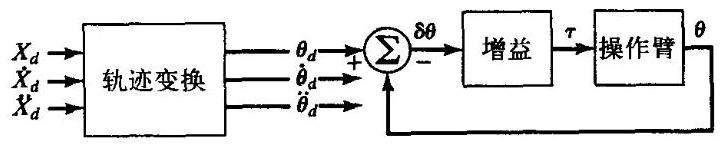

图10-10 具有笛卡儿路径输入的基于关节空间的控制方法

如果用解析方法完成轨迹变换过程, 那是相当困难的 (按照计算费用来说)。需要计算

$$
{\Theta }_{d} = \operatorname{INVKIN}\left( {\chi }_{d}\right)
$$

$$
{\dot{\Theta }}_{d} = {J}^{-1}\left( \Theta \right) {\dot{\chi }}_{d} \tag{10-52}
$$

$$
{\ddot{\Theta }}_{d} = {J}^{-1}\left( \Theta \right) {\dot{\chi }}_{d} + {J}^{-1}\left( \Theta \right) {\ddot{\chi }}_{d}
$$

在当前的系统中完成这种计算,通常应用逆运动学方法求解 ${\Theta }_{d}$ ,然后用一阶和二阶差分的数值计算方法求出关节速度和加速度。但是, 数值微分容易将噪声放大并引起延迟, 除非采用一个专门的滤波器 ${}^{ \ominus  }$ 。因此，我们希望找到计算式 (10-52) 时计算量较小的方法，或者给出一种不需要这些信息的控制方法。

另一种方案如图10-11所示。在这里, 检测到的操作臂位置立即由运动学方程变换成笛卡儿坐标下的位置, 将它与期望的笛卡儿坐标位置进行比较, 得到笛卡儿空间下的误差。这种基于笛卡儿空间误差的控制方法称为基于笛卡儿空间的控制方法。为简明起见, 在图10-11中未表示速度反馈, 但它在任何情况下都是存在的。

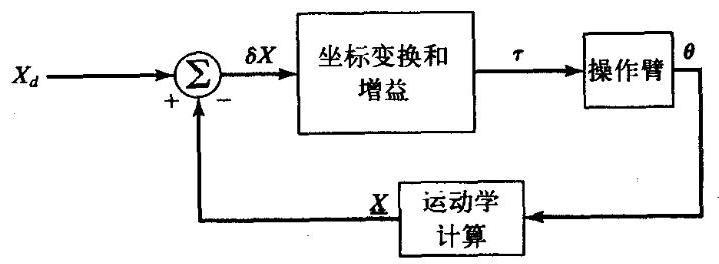

图10-11 基于笛卡儿空间的控制方法示意图

轨迹变换过程可被伺服环中的坐标变换所代替。注意, 基于笛卡儿坐标控制器的许多计算必须在反馈环内部进行, 即运动学计算和其他变换现在都是在 “反馈环内部” 进行的。这是基于笛卡儿坐标方法的一个缺点; 这种系统与基于关节空间系统相比, 运行时的采样频率较低 (当计算机容量相同时)。通常情况下这会降低系统的稳定性和抗干扰性能。

**笛卡儿空间的直接控制方法**

我们很容易得出一种相当直观的控制方法, 见图10-12。这种方法是将笛卡儿空间位置与期望位置比较,得到笛卡儿空间下的误差 $\delta \mathrm{X}$ 。当控制系统正常工作时,这个误差可以被认为很小,并可以用逆雅可比方法映射成关节空间内的小位移。将得到的关节空间误差 ${\delta \theta }$ 乘以增益来计算使误差减小的转矩。注意, 为简明起见, 图10-12所示的简化控制器中省略了速度反馈部分。速度反馈可以直接附加到图中。这种方法称为逆雅可比控制器。

---

$\Theta$ 数值微分会产生延迟，除非它可以基于过去、当前和将来值进行计算。当整个路径已预先规划好时，这种非因果关系的数值微分则可以完成。

---

另一种容易想到的方法如图10-13所示。这种方法是将笛卡儿空间误差矢量乘以增益来计算笛卡儿坐标系下的力矢量。可以将这个力矢量看成是施加在机器人末端执行器上的一个笛卡儿空间的力, 它使末端执行器向着笛卡儿空间误差减小的方向运动。将这个笛卡儿坐标系下的力矢量 (实际上是一个力一力矩矢量) 通过雅可比转置矩阵映射成当量关节力矩, 这样可以减小观测到的误差。这种方法称为转置雅可比控制器。

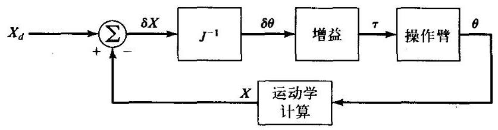

图10-12 逆雅可比笛卡儿空间控制方法

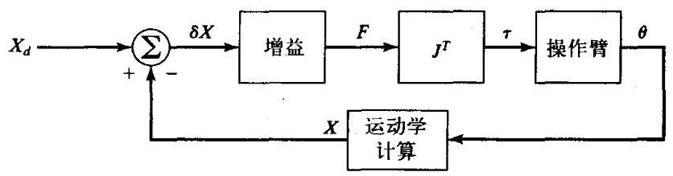

图10-13 转置雅可比笛卡儿空间控制方法

逆雅可比控制器和转置雅可比控制器都是一种直观的控制方法, 因此难以确定这些方法是稳定的, 更不用说它的性能了。然而这两个控制器是如此相似, 区别只是一个是逆雅可比、 另一个是转置雅可比。切记, 一般雅可比逆矩阵和雅可比转置矩阵是不相等的 (只有严格限 ] 制在笛卡儿空间的操作臂才有 ${J}^{T} = {J}^{-1}$ )。这些系统的精确的动力学特性 (比如,用二阶误差空间方程表示的系统) 是很复杂的。事实是, 这两种控制方法都能够工作 (即都是稳定的), 但工作性能不太好 (即在整个工作空间的性能不是都很好)。都可以通过选择适当的增益使系统工作稳定, 包括某种形式的速度反馈 (在图10-12和图10-13中未画出)。然而它们都不是精确的控制方法, 即我们无法选择固定的增益来得到固定的闭环极点。这两种控制器的动力学响应都会随着操作臂位形的变化而变化。

**笛卡儿空间解耦控制方法**

与基于关节空间控制器一样, 基于笛卡儿空间的控制器也应该使操作臂在所有位形下的动力学误差均为常量。而在基于笛卡儿空间控制方法中, 误差是在笛卡儿空间表示的, 这表明对于所设计的系统, 应使其在所有可能的位形下, 都可将笛卡儿空间误差限制在临界阻尼状态。

正如基于关节空间的控制器一样, 一个性能优良的笛卡儿空间控制器的前提条件是操作臂的线性化和解耦模型。因此, 我们必须用笛卡儿坐标的变量写出操作臂的动力学方程。这可以用第6章中讨论过的方法实现, 得到的运动方程形式与关节空间的方程十分相似。刚体动力学方程可以写作

$$
\mathcal{F} = {M}_{x}\left( \Theta \right) \ddot{\chi } + {V}_{x}\left( {\Theta ,\dot{\Theta }}\right)  + {G}_{x}\left( \Theta \right) \tag{10-53}
$$

式中 $\mathcal{F}$ 为作用在机器人末端执行器上的虚拟操作力-力矩矢量, $\chi$ 是一个适当表示末端执行器位置和姿态的笛卡儿坐标矢量 ${}^{\left\lbrack  8\right\rbrack  }$ 。与关节空间的参数类似, ${M}_{x}\left( \Theta \right)$ 是笛卡儿空间的质量矩阵, ${V}_{x}\left( {\Theta ,\dot{\Theta }}\right)$ 是笛卡儿空间的速度项矢量, ${G}_{x}\left( \Theta \right)$ 是笛卡儿空间的重力项矢量。

与以前处理基于关节坐标的控制问题一样, 可以在一个解耦和线性化控制器中应用动力学方程。因为已从式 (10-53) 计算出作用在机器人末端执行器上的虚拟笛卡儿力矢量 $\mathcal{F}$ ,那么就可以使用雅可比转置矩阵来实现这个控制——也就是说,用式 (10-53) 计算出 $\mathcal{F}$ 之后, 实际上已无法将一个笛卡儿空间的力施加到末端执行器上，相反，如果应用下式就可计算出能够有效平衡系统的关节力矩:

$$
\tau  = {J}^{\tau }\left( \Theta \right) \mathcal{F} \tag{10-54}
$$

图10-14所示为完全动力学解耦的笛卡儿空间操作臂控制系统。注意转置雅可比是在操作臂之前。可看出，图10-14所示的控制器可以直接描述笛卡儿路径而不需要进行轨迹变换。

与关节空间的情况相同, 在实际应用中最好使用双速率控制系统。图10-15所示为一个基于笛卡儿坐标系的解耦和线性化控制器示意图, 其中的动力学参数只是操作臂位置的函数。 这些动力学参数由后台或另一台控制计算机在一个低于伺服速率的频率下更新。这个方案是比较合理的, 因为我们希望伺服速率尽量快 (可能为500Hz或更高), 以便最大限度地抑制干扰和保持稳定性。由于动力学参数只是操作臂位置的函数, 因此只需在一个能够跟得上操作臂位形变化的速率下更新它们的值。参数更新速率可能不需要高于100Hz ${}^{\left\lbrack  8\right\rbrack  }$ 。

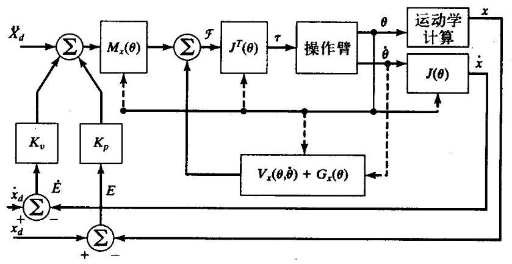

图10-14 基于模型的笛卡儿空间控制方法

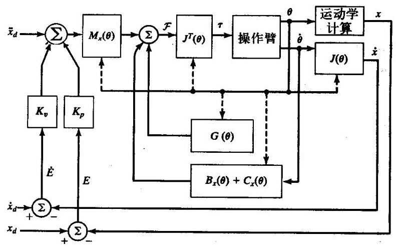

图10-15 基于模型的笛卡儿空间控制的实现方法

## 10.9 自适应控制

在基于模型的控制方法的讨论中, 我们常发现操作臂的参数不能精确已知。当模型中的参数与实际系统中的参数不符时, 会产生伺服误差, 如式 (10-25) 所示。可以利用伺服误差, 驱动某种自适应控制方法去更新模型参数的值, 直到这些伺服误差消失。目前已经提出了几种自适应方法。

一种理想的自适应方法如图10-16所示。这里使用了在本章中推导的基于模型的控制律。 自适应控制过程如下, 已知操作臂的状态和伺服误差, 系统将调整非线性模型中的参数值, 直到误差消失。这种系统会学习系统本身的动力学特性。自适应控制方法的设计和分析已超出了本书的范围。图10-16所示为这种控制方法的具体结构, 文献[20, 21]证明了这种方法的全局稳定性。与之相关的技术参见文献[22]。

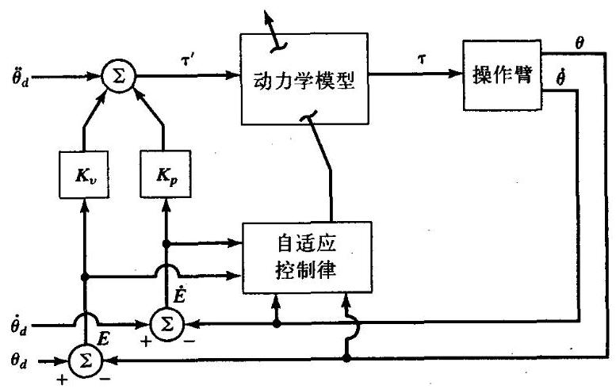

图10-16 自适应操作臂控制器示意图

**参考文献**

[1] R.P. Paul, "Modeling, Trajectory Calculation, and Servoing of a Computer Controlled Arm," Technical Report AIM-177, Stanford University Artificial Intelligence Laboratory, 1972.

[2] B. Markiewicz, "Analysis of the Computed Torque Drive Method and Comparison with Conventional Position Servo for a Computer-Controlled Manipulator," Jet Propulsion Laboratory Technical Memo 33-601, March 1973.

[3] A. Bejczy, "Robot Arm Dynamics and Control," Jet Propulsion Laboratory Technical Memo 33-669, February 1974.

[4] J. LaSalle and S. Lefschetz, Stability by Liapunov's Direct Method with Applications, Academic Press, New York, 1961.

[5] P.K. Khosla, "Some Experimental Results on Model-Based Control Schemes," IEEE Conference on Robotics and Automation, Philadelphia, April 1988.

[6] M. Leahy, K. Valavanis, and G. Saridis, "The Effects of Dynamic Models on Robot Control," IEEE Conference on Robotics and Automation, San Francisco, April 1986.

[7] L. Sciavicco and B. Siciliano, Modelling and Control of Robot Manipulators, 2nd Edition, Springer-Verlag, London, 2000.

[8] O. Khatib, "A Unified Approach for Motion and Force Control of Robot Manipulators: The Operational Space Formulation," IEEE Journal of Robotics and Automation, Vol. RA-3, No. 1, 1987.

[9] C. An, C. Atkeson, and J. Hollerbach, "Model-Based Control of a Direct Drive Arm, Part II: Control," IEEE Conference on Robotics and Automation, Philadelphia, April 1988.

[10] G. Franklin, J. Powell, and M. Workman, Digital Control of Dynamic Systems, 2nd edition, Addison-Wesley, Reading, MA, 1989.

[11] A. Liegeois, A. Fournier, and M. Aldon, "Model Reference Control of High Velocity Industrial Robots," Proceedings of the Joint Automatic Control Conference, San Francisco, 1980.

[12] M. Raibert, "Mechanical Arm Control Using a State Space Memory," SME paper MS77-750, 1977.

[13] B. Armstrong, "Friction: Experimental Determination, Modeling and Compensation," IEEE Conference on Robotics and Automation, Philadelphia, April 1988.

[14] B. Armstrong, O. Khatib, and J. Burdick, "The Explicit Dynamic Model and Inertial Parameters of the PUMA 560 Arm," IEEE Conference on Robotics and Automation, San Francisco, April 1986.

[15] A.M. Lyapunov, "On the General Problem of Stability of Motion," (in Russian), Kharkov Mathematical Society, Soviet Union, 1892.

[16] C. Desoer and M. Vidyasagar, Feedback Systems: Input-Output Properties, Academic Press, New York, 1975.

[17] M. Vidyasagar, Nonlinear Systems Analysis, Prentice-Hall, Englewood Cliffs, NJ, 1978.

[18] S. Arimoto and F. Miyazaki, "Stability and Robustness of PID Feedback Control for Robot Manipulators of Sensory Capability," Third International Symposium of Robotics Research, Gouvieux, France, July 1985.

[19] D. Koditschek, "Adaptive Strategies for the Control of Natural Motion," Proceedings of the 24th Conference on Decision and Control, Ft. Lauderdale, FL, December 1985.

[20] J. Craig, P. Hsu, and S. Sastry, "Adaptive Control of Mechanical Manipulators," IEEE Conference on Robotics and Automation, San Francisco, April 1986.

[21] J. Craig, Adaptive Control of Mechanical Manipulators, Addison-Wesley, Reading, MA, 1988.

[22] J.J. Slotine and W. Li, "On the Adaptive Control of Mechanical Manipulators," The International Journal of Robotics Research, Vol. 6, No. 3, 1987.

[23] R. Kelly and R. Ortega, "Adaptive Control of Robot Manipulators: An Input-Output Approach," IEEE Conference on Robotics and Automation, Philadelphia, 1988.

[24] H. Das, J.J. Slotine, and T. Sheridan, "Inverse Kinematic Algorithms for Redundant Systems," IEEE Conference on Robotics and Automation, Philadelphia, 1988.

[25] T. Yabuta, A. Chona, and G. Beni, "On the Asymptotic Stability of the Hybrid Position/Force Control Scheme for Robot Manipulators," IEEE Conference on Robotics and Automation, Philadelphia, 1988.

**习题**

10.1 [15]对于系统

$$
\tau  = \left( {2\sqrt{\theta } + 1}\right) \ddot{\theta } + 3{\dot{\theta }}^{2} - \sin \theta
$$

写出 $\alpha  - \beta$ 分解运动控制器的非线性控制方程。选择增益使系统始终工作在 ${k}_{CL} = {10}$ 的临界阻尼状态下。

10.2 [15] 对于系统

$$
\tau  = {5\theta }\dot{\theta } + 2\ddot{\theta } - {13}{\dot{\theta }}^{3} + 5
$$

写出 $\alpha  - \beta$ 分解运动控制器的非线性控制方程。选择增益使系统始终工作在 ${k}_{CL} = {10}$ 的临界阻尼状态下。

10.3 [19]根据6.7节中的二连杆操作臂, 画出一个关节空间控制器的框图, 使得操作臂在整个工作空间都处于临界阻尼状态。并在各方框内标出相应的方程。

10.4 [20] 根据6.7节中的二连杆操作臂, 画出一个笛卡儿空间控制器的框图, 使得操作臂在整个工作空间都处于临界阻尼状态 (见例6.6)。并在各方框内标出相应的方程。

10.5 [18] 设计一个轨迹跟踪控制系统。系统的动力学方程如下

$$
{\tau }_{1} = {m}_{1}{l}_{1}^{2}{\ddot{\theta }}_{1} + {m}_{1}{l}_{1}{l}_{2}{\dot{\theta }}_{1}{\dot{\theta }}_{2}
$$

$$
{\tau }_{2} = {m}_{2}{l}_{2}^{2}\left( {{\ddot{\theta }}_{1} + {\ddot{\theta }}_{2}}\right)  + {v}_{2}{\dot{\theta }}_{2}
$$

你认为上述方程可以代表一个真实的系统吗?

10.6 [17] 对于例10.3中设计的单连杆操作臂控制系统, 写出关于质量参数的误差函数的稳态位置误差表达式。令 ${\psi }_{m} = m - \widehat{m}$ 。结果应为 $l, g,\theta ,{\psi }_{m},\widehat{m}$ 和 ${k}_{p}$ 的函数。操作臂在什么稳态位置时误差最大?

10.7 [26] 对于图10-17所示的二自由度机械系统,设计一个控制器,使得 ${x}_{1}$ 和 ${x}_{2}$ 以临界阻尼状态跟踪轨迹和抑制干扰。

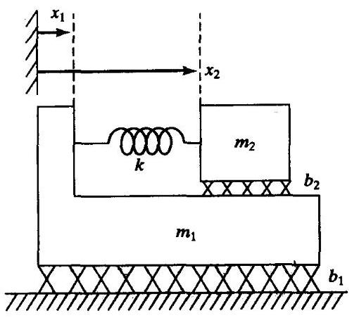

图10-17 具有二自由度的机械系统

10.8 [30]分析6.7节中的二连杆操作臂形位空间动力学方程, 推导计算力矩值对微小偏差 $\Theta$ 的灵敏度表达式。试求图10-7所示的控制器在正常运行时, 控制器应每隔多长时间重新计算动力学参数, 并表示成平均关节速度的函数。

10.9 [32] 分析例6.6中的二连杆操作臂在笛卡儿形位空间形式下的动力学方程。推导计算力矩值对微小偏差 $\Theta$ 的灵敏度表达式。试求图10-15所示的控制器在正常运行时,控制器应每隔多长时间重新计算动力学参数, 并表示成平均关节速度的函数。

10.10 [15] 设计一个控制系统

$$
f = {5x}\dot{x} + 2\ddot{x} - {12}
$$

选择增益使系统始终工作在闭环刚度为 20 的临界阻尼状态下。

10.11 [20] 对于一个位置校正系统 (不失一般性),假设 ${\Theta }_{d} = 0$ 。证明控制律

$$
\tau  =  - {K}_{p}\Theta  - M\left( \Theta \right) {K}_{v}\dot{\Theta } + G\left( \Theta \right)
$$

得到的是渐近稳定的非线性系统。可以取 ${K}_{v}$ 为 ${K}_{v} = {k}_{v}{I}_{n}$ 的形式,式中 ${k}_{v}$ 为标量, ${I}_{n}$ 为 $n \times \; n$ 单位矩阵。提示:这与例10.6类似。

10.12[20] 对于一个位置校正系统 (不失一般性),假设 ${\Theta }_{d} = 0$ 。证明控制律

$$
\tau  =  - {K}_{p}\Theta  - \widehat{M}\left( \Theta \right) {K}_{v}\dot{\Theta } + G\left( \Theta \right)
$$

得到的是渐近稳定的非线性系统。可以取 ${K}_{v}$ 为 ${K}_{v} = {k}_{v}{I}_{n}$ 的形式,式中 ${k}_{v}$ 为标量, ${I}_{n}$ 为 $n \times$

$n$ 单位矩阵。矩阵 $\widehat{M}\left( \Theta \right)$ 是操作臂质量矩阵的正定估计值。提示: 这与例 10.6 类似。

10.13 [25] 对于一个位置校正系统 (不失一般性),假设 ${\Theta }_{d} = 0$ 。证明控制律

$$
\tau  =  - M\left( \Theta \right) \left( {{K}_{p}\Theta  + {K}_{v}\dot{\Theta }}\right)  + G\left( \Theta \right)
$$

得到的是渐近稳定的非线性系统。可以取 ${K}_{v}$ 为 ${K}_{v} = {k}_{v}{I}_{n}$ 的形式,式中 ${k}_{v}$ 为标量, ${I}_{n}$ 为 $n \; \times  n$ 单位矩阵。提示: 这与例 10.6 类似。

10.14 [26] 对于一个位置校正系统 (不失一般性),假设 ${\Theta }_{d} = 0$ 。证明控制律

$$
\tau  =  - M\left( \Theta \right) \left( {{K}_{p}\Theta  + {K}_{v}\dot{\Theta }}\right)  + G\left( \Theta \right)
$$

得到的是渐近稳定的非线性系统。可以取 ${K}_{v}$ 为 ${K}_{v} = {k}_{v}{I}_{n}$ 的形式,式中 ${k}_{v}$ 为标量, ${I}_{n}$ 为 $n \times$

$n$ 单位矩阵。矩阵 $\widehat{M}\left( \Theta \right)$ 是操作臂质量矩阵的正定估计值。提示: 这与例 10.6 类似。

10.15 [28] 对于一个位置校正系统 (不失一般性),假设 ${\Theta }_{d} = 0$ 。证明控制律

$$
\tau  =  - {K}_{p}\Theta  - {K}_{v}\dot{\Theta }
$$

得到的是稳定的非线性系统, 证明这个系统不是渐近稳定的, 并给出稳态误差的表达式。提示:这与例10.6类似。

10.16 [30]证明10.8节中介绍的转置雅可比笛卡儿空间控制器的全局稳定性。用适当形式的速度反馈使系统稳定。提示: 参见文献[18]。

10.17 [15] 设计一轨迹跟踪控制器, 系统的动力学方程为

$$
f = a{x}^{2}\dot{x}\ddot{x} + b{\dot{x}}^{2} + c\sin x
$$

使其在所有位形下都可将误差限制在临界阻尼状态。

10.18 [15]系统的开环动力学方程为

$$
\tau  = m\ddot{\theta } + b{\dot{\theta }}^{2} + c\dot{\theta }
$$

采用控制律为

$$
\tau  = m\left( {{\ddot{\theta }}_{d} + {k}_{v}\dot{e} + {k}_{p}e}\right)  + \sin \theta
$$

写出闭环系统的微分方程。

**编程习题**

重复第9章的编程习题, 应用相同的测试方法, 但这个控制器使用三连杆完整动力学模型来对系统进行解耦和线性化。对本例中, 有

$$
{K}_{p} = \left\lbrack  \begin{array}{rrr} {100.0} & {0.0} & {0.0} \\  {0.0} & {100.0} & {0.0} \\  {0.0} & {0.0} & {100.0} \end{array}\right\rbrack
$$

选择对角阵 ${K}_{v}$ ,以保证在所有操作臂位形下系统都处于临界阻尼状态。并将结果与第9章编程习题中简化控制器所得的结果进行比较。
