# 第11章 操作臂的力控制

## 11.1 概述

当操作臂在空间中跟踪轨迹运动时, 可采用位置控制, 但当末端执行器与操作臂工作环境发生碰撞时, 纯粹的位置控制已经不适用了。考虑使用海绵擦窗的操作臂, 利用海面的柔性可以通过控制末端执行器与玻璃之间的位置来调整施加在窗户上的力。如果海绵十分柔软, 或者已知玻璃的精确位置, 则操作臂可以工作得很好。

但是, 如果末端执行器、工具或环境的刚性很高, 则操作臂压贴在平面上的操作执行起来就非常困难。假设不使用海绵擦洗, 而是操作臂使用刚性刮削工具从玻璃表面刮油漆。如果距离玻璃表面的位置存在任何不确定性, 或者操作臂存在任何位置误差, 则完成该项工作是不可能的。要么玻璃被碰碎, 要么操作臂在玻璃上方摆动而不与玻璃接触。

在清洗和刮擦这两个任务中, 可能不指定玻璃表面的位置, 而是指定一个垂直于玻璃表面的力更为合理。

前几章中介绍的方法在工业机器人中应用较多，而在本章中介绍的方法还都未在工业机器人中使用，只有一些极其简单的方法除外。本章主要介绍力位混合控制器，可以预见，通过这种控制器工业机器人终究会应用于需要执行力控制的任务中。然而, 无论哪种方法应用于工业实际, 本章介绍的许多概念始终是有效的。

## 11.2 工业机器人在装配作业中的应用

大多数工业机器人都应用于相对简单的应用场合, 如点焊、喷涂、抓取和放置操作。力控制已经在一些场合得到应用, 例如, 一些机器人已经能够实现简单的力控制, 如磨削和去毛刺。显然工业机器人的下一个大量应用领域将会是在装配线作业中执行一个或多个零件的装配任务。在这种零件装配任务中, 接触力的监控非常重要。

面对工作环境的不确定性和变化, 操作臂的精确控制是将机器人应用于工业装配操作中的先决条件。给机械手装上传感器, 以给出操作任务的状态信息, 这样就可以使机器人完成装配任务, 这似乎是机器人应用的重要进展。然而, 目前操作臂的灵巧性仍较低, 限制了它们在自动化装配领域的应用。

使用操作臂完成装配任务要求零件之间的位置精度非常高。目前工业机器人一般不能胜任如此精确的任务, 因此制造这种机器人可能没有意义。高精度操作臂只能以尺寸、重量、 成本为代价来实现。然而, 测量和控制手部产生的接触力为提高操作臂的精度提供了一种有效的方法。由于使用相对测量方法, 操作臂和被操作对象的绝对位置误差不像它们在纯位置控制系统中那样重要了。当中等刚度的零件相互作用时, 相对位置的微小变化会产生很大的接触力, 因此, 了解并控制这些力可以极大地提升直角数位置精度。

## 11.3 局部约束任务中的控制坐标系

本章中提出的方法是基于操作环境的控制坐标系的, 在这个环境中, 操作臂的运动受到一个或多个接触面 ${}^{\left\lbrack  1 - 3\right\rbrack  }$ 的约束。描述部分约束的坐标系是基于操作臂的末端执行器和环境之间相互作用的简化模型:因为我们仅需要描述接触和自由状态，因此只考虑由于接触产生的力。 这相当于进行准静态分析并忽略了其他静态力, 如某些摩擦力和重力。如果系统中的作用力主要是刚度较大的物体之间的接触力, 这种分析方法是合理的。注意, 这里介绍的方法已进行了某些简化和限定, 对于本文来说, 这种介绍基本概念的方法较好, 水平适当。与之相关的更一般、更严格的方法, 请参阅文献[19]。

每一操作任务可以分解为多个子任务, 这些子任务都是由操作臂末端执行器 (即工具) 和工作环境之间特定的接触状态定义的。对于每一个与这种子任务相关的约束，称为自然约束, 这些自然约束由操作位形特定的机械和几何特征形成。例如, 一个与静态刚性表面接触的手臂不能自由穿过该表面。因此, 存在自然位置约束。如果表面是无摩擦的, 则手臂不能任意施加与表面相切的力。这样, 就存在自然力约束。

在与环境接触的模型中, 对于每一个子任务的位形, 可以定义一个广义表面, 它具有垂直于该表面的位置约束和正切于该表面的力约束。这两种类型的约束一力约束和位置约束将末端执行器可能的运动自由度数划分成两个正交集, 必须根据不同的规则对这两组集合进行控制。注意, 该接触模型并不包含所有可能的接触情况 (更一般的方法参见文献[19])。

图11-1所示为两个具有代表性的与自然约束有关的任务。注意, 在每一情况下, 按照坐标系 $\{ C\}$ 描述任务,这个坐标系称为约束坐标系,该坐标系位于与任务相关的位置上。根据任务, $\{ C\}$ 可以固定在环境中，或者同操作臂末端执行器一起移动。在图11-1(a)中，约束坐标系固连在图中的手柄上并随手柄运动,规定 $\widehat{X}$ 方向总是指向手柄的轴心。作用于指端的摩擦力确保能够可靠地抓住把手，该把手在一个心轴上，且能够相对于手柄转动。在图11-1(b)中，约束坐标系固连在螺丝刀的末端，工作时随螺丝刀一起转动。注意,在 $\widehat{Y}$ 方向,力约束为零,因为螺钉上的槽允许螺丝刀在该方向滑动。在这些例子中, 给定的约束集在整个任务中保持不变。对于更为复杂的情况, 任务被分解成子任务, 对于这些子任务, 可以确定一个不变的自然约束集。

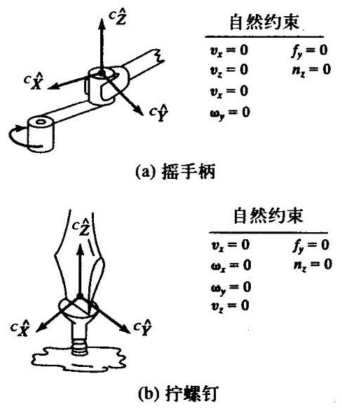

图11-1 两个不同任务的自然约束

在图 11-1 中,位置约束是通过在坐标系 $\{ C\}$ 中描述的末端执行器的速度分量 $\mathcal{V}$ 来表示的。 然而我们以前都是用位置表达式而不是用速度表达式来表示位置约束, 在大多数情况下, 将位置约束定义为 “速度为零” 的约束，可能更为简单。同样，可以通过在坐标系 $\{ C\}$ 中描述的施加在末端执行器上的力一力矩分量 $\mathcal{F}$ 来定义力约束。注意,这里所说的位置约束是指位置约束或姿态约束, 而力约束是指力约束或力矩约束。自然约束意指这些约束是在特定的接触条件下自然形成的, 它们与期望的或预先规定的操作臂运动无关。

附加约束, 又称为人工约束, 是按照自然约束确定的期望运动或施加的力来定义的。即, 每当用户给定了一个位置或力的期望轨迹, 就定义一个人工约束。这些约束也会出现在广义约束表面的切向或法向, 但是, 与自然约束不同, 人工力约束定义为沿表面的法向, 人工位置约束定义为沿表面的切向, 这样就保证了与自然约束的一致性。

图11-2所示为两种任务的自然约束和人工约束。注意,当给定自然位置约束在坐标系 $\{ C\}$ 中的特定自由度时, 也应给定人工力约束, 反之亦然。在任意瞬时, 通过控制约束坐标系中的给定自由度以满足位置约束或力约束。

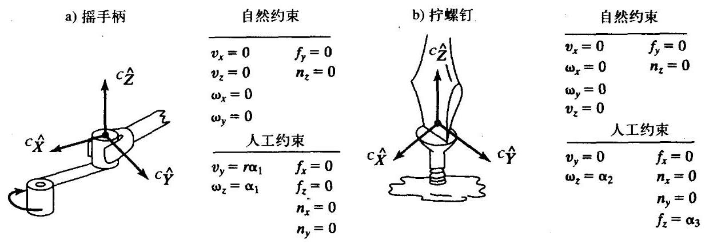

图11-2 两种任务的自然约束和人工约束

装配策略是指一个事先规划好的人工约束序列, 并按照要求的方式完成这个作业。这种策略必须包含一些检测手段，使系统能够检测接触状态的变化，以便跟踪自然约束的变化。对于自然约束的每一个变化, 从装配策略集中重新调用一个新的人工约束集, 并由控制系统实施。为给定的装配任务自动选择约束的方法有待进一步研究。在本章中, 为了确定自然约束, 假设已对任务进行了分析, 并且编程人员已经确定了一个控制操作臂的装配策略。

注意, 在任务分析时通常忽略接触表面之间的摩擦力, 这个假设仍能满足装配策略问题。事实上, 许多种工况下的装配策略都是按这个假设制定的。通常选择位置控制的方向作为滑动摩擦力的作用方向，因此可将滑动摩擦力看作是位置伺服的扰动，并通过控制系统进行抑制。

例11.1

图11-3(a) $\alpha$ (d)所示为一个装配序列,用于将一个销钉插入一个圆孔中。销钉向下运动到孔左侧的表面, 接着沿表面滑动直至进入孔中, 然后插入销钉直到孔的底部, 此时装配任务完成。将上述四个接触动作的每一个都定义为一个子任务。对于每一个子任务, 给定自然约束和人工约束。同时按照系统检测到的自然约束的变化进行操作。

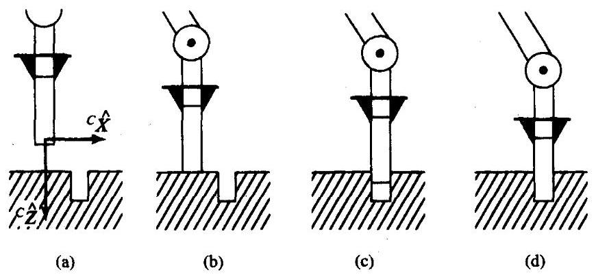

图11-3 销钉插入的四种接触动作序列

如图11-3(a)所示, 首先将约束坐标系固连于销钉上。在图11-3(a)中, 销钉位于自由空间, 因此自然约束为

$$
\varepsilon \mathcal{F} = 0 \tag{11-1}
$$

因此在这种情况下,人工约束构成了整个位置运动轨迹,使销钉沿 ${}^{c}\widehat{Z}$ 方向接近表面。例如

$$
{}^{c}v = \left\lbrack  \begin{matrix} 0 \\  0 \\  {v}_{\text{ approach }} \\  0 \\  0 \\  0 \end{matrix}\right\rbrack \tag{11-2}
$$

式中 ${v}_{\text{ approach }}$ 为接近表面的速度。

在图11-3(b)中,销钉已经达到表面。为检测销钉是否接触到了表面,需要检测 ${}^{c}\widehat{Z}$ 方向的力。当所检测到的力超过了阈值，则认为销钉接触到了表面，这表明在新的接触情况下生成了一种新的自然约束集。假设接触情况如图11-3(b)所示，销钉在 ${}^{c}\widehat{Z}$ 方向不能自由移动，也不能绕 ${}^{C}\widehat{X}$ 或 ${}^{C}\widehat{Y}$ 轴自由转动。在另外三个自由度方向,不能任意施加力,因此自然约束为

$$
{}^{c}{v}_{z} = 0
$$

$$
{}^{c}{\omega }_{x} = 0
$$

$$
{}^{c}{\omega }_{y} = 0 \tag{11-3}
$$

$$
{}^{c}{f}_{x} = 0
$$

$$
{}^{c}{f}_{y} = 0
$$

$$
{c}_{{n}_{z}} = 0
$$

人工约束描述了这个滑移装配策略是在 ${}^{c}\widehat{X}$ 方向沿表面的滑动,同时施加一个小的力来维持接触。因此有

$$
{c}_{{v}_{x}} = {v}_{\text{ slide }}
$$

$$
{c}_{{v}_{y}} = 0
$$

$$
{}^{C}{\omega }_{z} = 0 \tag{11-4}
$$

$$
{}^{c}{f}_{z} = {f}_{\text{ contact }}
$$

$$
{c}_{{n}_{x}} = 0
$$

$$
{c}_{{n}_{y}} = 0
$$

式中， ${f}_{\text{ contact }}$ 为销钉滑移时作用于表面的法向力， ${v}_{\text{ slide }}$ 为沿表面的滑移速度。

在图 11-3(c) 中，销钉已经慢慢进入孔中。这时检测 ${}^{C}\widehat{Z}$ 方向的速度，待超过某一阈值(在理想情况下变为非零)。当检测到这种情况时, 表明自然约束再次改变了, 为此必须改变装配 [ 策略 (嵌入在人工约束中)。新的自然约束为

$$
{}^{c}{v}_{x} = 0
$$

$$
{}^{c}{v}_{y} = 0
$$

$$
{}^{C}{\omega }_{x} = 0 \tag{11-5}
$$

$$
{}^{c}{\omega }_{y} = 0
$$

$$
{}^{c}{f}_{x} = 0
$$

$$
{c}_{{n}_{z}} = 0
$$

我们选择的人工约束为

$$
{c}_{{v}_{z}} = {v}_{\text{ insert }}
$$

$$
{}^{c}{\omega }_{z} = 0
$$

$$
{}^{c}{f}_{x} = 0
$$

$$
{}^{c}{f}_{y} = 0 \tag{11-6}
$$

$$
{}^{c}{n}_{x} = 0
$$

$$
{c}_{{n}_{y}} = 0
$$

式中， ${v}_{\mathrm{{insert}}}$ 为销钉向孔中插入的速度。最后，当 ${}^{C}\widehat{Z}$ 方向的力超过某一阈值时，检测到的系统状态如图11-3(d)所示。

注意，大多数情况是通过检测位置或不受控制的力来检测自然约束的变化。例如，检测从图11-3(b)到图11-3(c)的变化，当控制 ${}^{C}\widehat{Z}$ 方向的力时，可以检测 ${}^{C}\widehat{Z}$ 方向的速度。为了发现何时销钉已经接触到孔的底部,虽然控制的是 ${}^{C}{v}_{z}$ ,而检测的却是 ${}^{C}{f}_{z}$ 。

我们已对坐标系做了一些简化。更为一般和严格的方法是将任务 “分离” 为位置控制和力控制两部分, 可参见文献[19]。

确定更为复杂的零件的装配策略是相当复杂的。我们已经忽略了简化任务分析中不确定因素的影响。考虑不确定因素影响及实际应用的自动规划系统的开发已成为一个研究课题 ${}^{\left\lbrack  4 - 8\right\rbrack  }$ 。 若想对这些方法进行更详细地了解, 请参阅文献[9]。

## 11.4 力/位混合控制问题

图11-4所示为接触状态的两个极端情况。在图11-4(a)中, 操作臂在自由空间移动。在这种情况下，自然约束都是力约束——没有相互作用力，因此所有的约束力都为零 ${}^{ \ominus  }$ 。具有6自由度的操作臂可以在6个自由度方向上运动, 但是不能在任何方向上施加力。图11-4 (b) 所示为操作臂末端执行器紧贴墙面运动的极端情况。在这种情况下, 因为操作臂不能自由改变位置, 所以它有6个自然位置约束。然而, 操作臂可以在这6个自由度上对目标自由施加力和力矩。

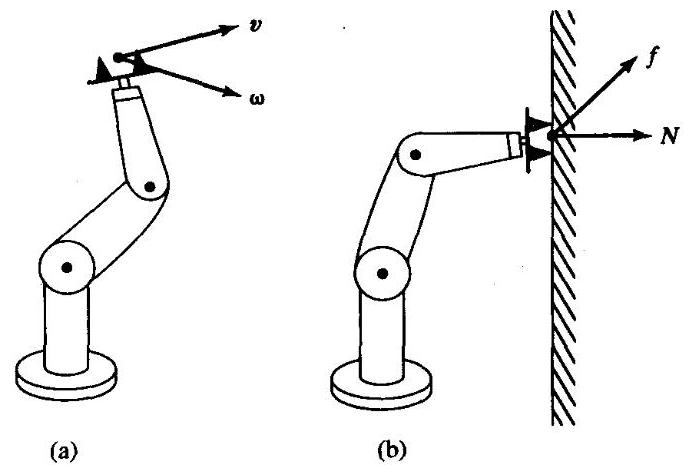

图11-4 接触状态的两个极端情况。左边的操作臂在自由空间中运动, 不与墙面接触右边的操作臂贴紧墙面，不存在自由运动

在第9章和第10章中研究了应用于图11-4(a)所示情况的位置控制问题。图11-4(b)中的情况在实际中并不经常出现, 多数情况是需要在部分约束任务环境中进行力控制, 即对系统的某些自由度需要进行位置控制, 而对另一些自由度需要进行力控制。这样, 在本章中我们主要讨论力/位混合控制方法。

对于力/位混合控制器必须解决以下三个问题:

1. 沿有自然力约束的方向进行操作臂的位置控制。

2. 沿有自然位置约束的方向进行操作臂的力控制。

3. 沿任意坐标系 $\{ C\}$ 的正交自由度方向进行任意位置和力的混合控制。

## 11.5 质量-弹簧系统的力控制

在第9章中, 我们从非常简单的单一质量块控制问题开始研究位置控制问题。在第10章, 我们将这种方法应用于一个操作臂模型，即控制整个操作臂的问题等价于控制 $n$ 个独立的集中质量 (对于具有 $n$ 个关节的操作臂来说)。同样,通过控制施加到简单的单一自由度系统的力来研究力控制。

---

$\Theta$ 切记,我们这里关心的是末端执行器和环境之间的接触力,而非内力。

---

考虑存在接触力的情况, 我们必须建立某种环境作用模型。为了建立这个概念, 使用一种非常简单的被控物体和环境之间的相互作用模型。将与环境接触的模型看作是一个弹簧—— 即假设系统是刚性的,而环境具有刚度 ${k}_{e}$ 。

考虑图 11-5 所示的质量一弹簧系统的控制问题。同时将未知干扰力 ${f}_{\text{ dist }}$ 考虑在内，它可能是未知模型的摩擦力,即操作臂传动齿轮的啮合损耗。要控制的变量为作用于环境的力 ${f}_{c}$ ,它是施加在弹簧上的力:

$$
{f}_{e} = {k}_{e}x \tag{11-7}
$$

描述这个物理系统的方程为

$$
f = m\ddot{x} + {k}_{e}x + {f}_{\text{ dist }} \tag{11-8}
$$

或者写成需要控制的变量 ${f}_{c}$ 的形式

$$
f = m{k}_{e}^{-1}{\ddot{f}}_{e} + {f}_{e} + {f}_{\text{ dist }} \tag{11-9}
$$

采用控制器分解方法, 取

$$
\alpha  = m{k}_{e}^{-1}
$$

和

$$
\beta  = {f}_{e} + {f}_{\text{ dist }}
$$

得到控制律

$$
f = m{k}_{e}^{-1}\left( {{\ddot{f}}_{d} + {k}_{vf}{\dot{e}}_{f} + {k}_{pf}{e}_{f}}\right)  + {f}_{e} + {f}_{\text{ dist }} \tag{11-10}
$$

式中 ${e}_{f} = {f}_{d} - {f}_{e}$ 为期望力 ${f}_{d}$ 与检测到的作用在环境上的力 ${f}_{e}$ 之间的误差。如果能计算式 (11-10), 则可以得到如下的闭环系统

$$
{\ddot{e}}_{f} + {k}_{vf}{\dot{e}}_{f} + {k}_{pf}{e}_{f} = 0 \tag{11-11}
$$

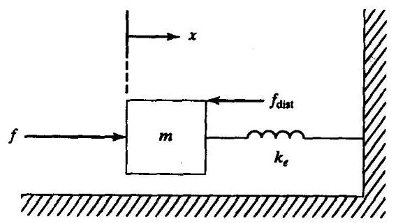

图11-5 弹簧-质量系统

然而,在控制律中 ${f}_{\text{ dist }}$ 是未知的,因此式 (11-10) 不可解。我们可以在控制律中舍去这一项，但是由稳态分析表明，还有更好的解决方法，尤其是当环境刚性 ${k}_{z}$ 很高时(通常情况下)。

如果选择在控制律中舍去 ${f}_{\text{ dist }}$ 这一项，则令式 (11-9) 与式 (11-10) 相等，并且在稳态分析中令对时间的各阶导数为零, 可得

$$
{e}_{f} = \frac{{f}_{\text{ dist }}}{\alpha } \tag{11-12}
$$

式中, $\alpha  = m{k}_{e}^{-1}{k}_{pf}$ 为有效力反馈增益。然而,在式 (11-10) 中用 ${f}_{d}$ 代替 ${f}_{d} + {f}_{\text{ dist }}$ ,则稳态误差为

$$
{e}_{f} = \frac{{f}_{\text{ dist }}}{1 + \alpha } \tag{11-13}
$$

一般情况下，环境是刚性的， $\alpha$ 可能很小，因此由式 (11-13) 计算稳态误差远优于式 (11-12)。因此, 推荐控制律如下

$$
f = m{k}_{e}^{-1}\left( {{\ddot{f}}_{d} + {k}_{vf}{\dot{e}}_{f} + {k}_{pf}{e}_{f}}\right)  + {f}_{d} \tag{11-14}
$$

图11-6为采用控制律 (11-14) 的闭环系统示意图。

通常, 对于力伺服控制来说, 实际情况与图11-6中描述的理想情况有些不同。首先, 力轨迹通常为常数——即通常希望将接触力控制为某一常数值，而很少把它设置为任意的时间函数。因此,控制系统的输入 ${\dot{f}}_{d}$ 和 ${\ddot{f}}_{d}$ 通常恒设为零。另一种实际情况是检测到的力 “噪声” 很大,因此用数值微分计算 ${\dot{f}}_{e}$ 是不可行的。然而, ${f}_{e} = {k}_{e}x$ ,因此可以求作用于环境上的力的微分 ${\dot{f}}_{e} = {k}_{e}\dot{x}$ 。这样做非常实际,因为大多数操作臂都可以测量速度,技术是成熟的。做出这两个实际选择之后, 可以将控制律写为

$$
f = m\left( {{k}_{pf}{k}_{e}^{-1}{e}_{f} - {k}_{vf}\dot{x}}\right)  + {f}_{d} \tag{11-15}
$$

对应的原理图如图11-7所示。

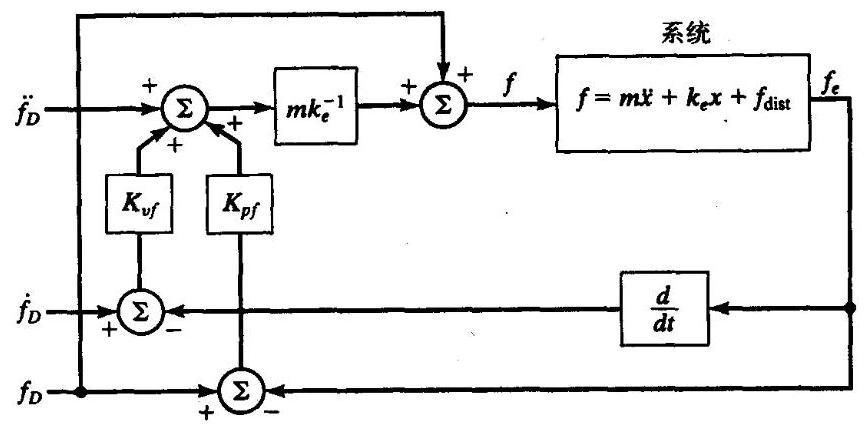

图11-6 弹簧-质量系统的力控制系统

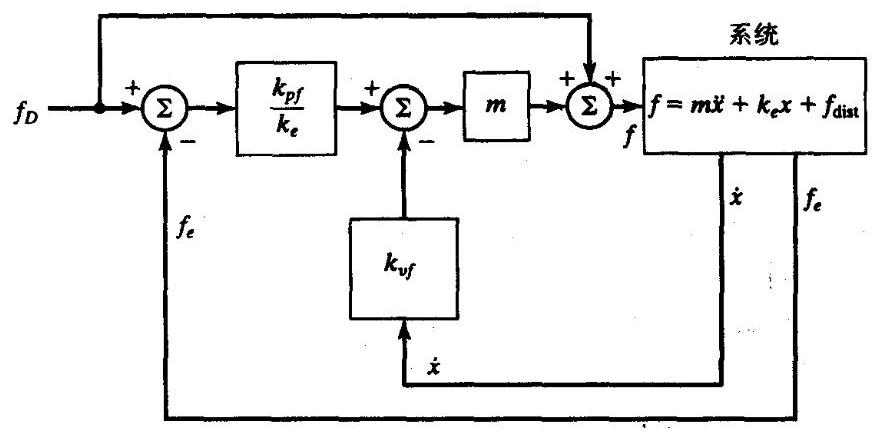

图11-7 实际的弹簧 - 质量系统的力控制系统

注意，图 11-7 所示系统表明，对于具有增益 ${k}_{vf}$ 的内部速度环，力误差生成了一个点集。 某些力控制律也包含积分项，以提高系统的稳态性能。

最后一个重要问题就是控制律中的环境刚度 ${k}_{e}$ 常是未知的和时变的。然而,由于装配机器人经常装配刚性零件，因此，可以认为 ${k}_{e}$ 很大。通常进行这种假设，并选择增益，以便相对 ${k}_{e}$ 的变化系统是鲁棒的。

构造控制接触力的控制律, 目的是提出一个假设结构, 并从中发现一些问题。本章的最后, 我们将简单假设这样的力控制伺服系统是成立的, 并将其抽象为如图 11-8 所示的黑箱。 实际上,建立一个高性能的力伺服系统是不容易的,目前这是一个非常活跃的研究领域 ${}^{\left\lbrack  {11} - {14}\right\rbrack  }$ 。 有关这方面的详细介绍, 请参阅文献[15]。

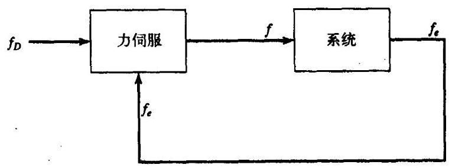

图11-8 黑箱形式的力控制伺服系统

## 11.6 力/位混合控制方法

在本节中,介绍力/位混合控制器的控制系统结构。

**坐标系 $\{ C\}$ 中的笛卡儿操作臂**

首先考虑具有移动关节的3自由度操作臂的简单情况,关节轴线沿 $\widehat{\mathbf{z}}\text{ 、 }\widehat{\mathbf{Y}}$ 和 $\widehat{\mathbf{X}}$ 方向。为简单起见,假设每一连杆的质量为 $m$ ,滑动摩擦力为零。假设关节运动方向与约束坐标系 $\{ C\}$ 的轴线方向完全一致。末端执行器与刚性为 ${k}_{e}$ 的表面接触， ${}^{C}\widehat{Y}$ 垂直于接触表面。因此，在该方向需要力控制,而在 ${}^{C}\widehat{X}\text{ 、 }{}^{C}\widehat{Z}$ 方向进行位置控制 (见图 11-9)。

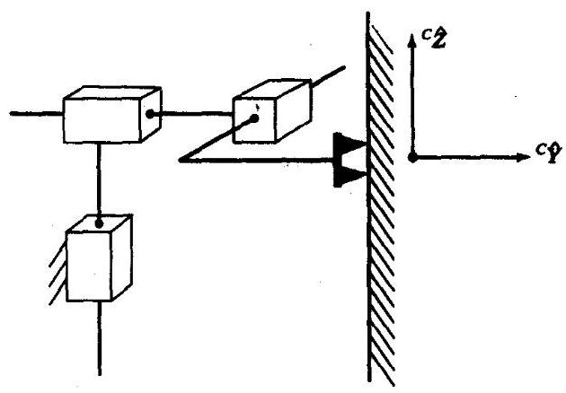

图11-9 与表面接触的3自由度笛卡儿操作臂

在这种情况下, 力/位混合控制问题的解比较清楚。我们使用第9章中提出的单位质量位置控制器来控制关节 1 和 3。关节 2 (作用于 $\widehat{\mathbf{Y}}$ 方向) 应使用 11.4 节中介绍的力控制器进行控制。 于是可以在 ${}^{C}\widehat{X}$ 、 ${}^{C}\widehat{Z}$ 方向设定位置轨迹,同时在 ${}^{C}\widehat{Y}$ 方向独立设定力轨迹 (可能只是一个常数)。

如果希望将约束表面的法线方向转变为沿 $\widehat{X}$ 向或 $\widehat{Z}$ 向,则可以按如下方法对笛卡儿操作臂控制系统稍加扩展:构建这个控制器，使它可以确定3个自由度的全部位置轨迹，同时也可以确定3个自由度的力轨迹。当然, 不能同时满足这6个约束的控制一因而, 需要设定一些工作模式来指明在任一给定时刻应控制哪条轨迹的哪个分量。

在图11-10所示的控制器中, 用一个位置控制器和一个力控制器, 控制简单笛卡儿操作臂的3个关节。引入矩阵 $S$ 和 ${S}^{\prime }$ 来确定应采用哪种控制模式——位置或力——去控制笛卡儿操作臂的每一个关节。 $S$ 矩阵为对角阵,对角线上的元素为 1 和 0 。对于位置控制, $S$ 中元素为 1 的位置在 ${S}^{\prime }$ 中对应的元素为 0 ; 对于力控制, $S$ 中元素为 0 的位置在 ${S}^{\prime }$ 中对应的元素为 1 。因此,矩阵 $S$ 和 ${S}^{\prime }$ 相当于一个互锁开关,用于设定 $\{ C\}$ 中每一个自由度的控制模式。按照 $S$ 的规定,系统中总有3个轨迹分量受到控制, 而位置控制和力控制之间的组合是任意的。另外3个期望轨迹分量和相应的伺服误差应被忽略。也就是说, 当一个给定的自由度受到力控制时, 那么这个自由度上的位置误差就应该被忽略。

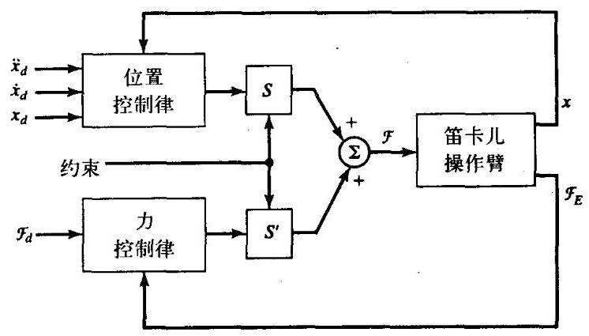

图11-103自由度笛卡儿操作臂的混合控制器

例11.2

如图11-9中所示， ${}^{C}\widehat{Y}$ 方向的运动受到作用表面的约束，求矩阵 $S$ 和 ${S}^{\prime }$ 。

由于 $\widehat{X}$ 和 $\widehat{Y}$ 方向的分量受到位置控制,所以在矩阵 $S$ 对角线上对应于这两个分量的位置上输入1。在这两个方向上具有位置伺服，可以跟踪输入轨迹。 $\widehat{Y}$ 方向输入的任何位置轨迹将被忽略。矩阵 ${S}^{\prime }$ 对角线方向上的0和1元素与矩阵 $S$ 相反。因此,有

$$
S = \left\lbrack  \begin{array}{lll} 1 & 0 & 0 \\  0 & 0 & 0 \\  0 & 0 & 1 \end{array}\right\rbrack \tag{11-16}
$$

$$
{S}^{\prime } = \left\lbrack  \begin{array}{lll} 0 & 0 & 0 \\  0 & 1 & 0 \\  0 & 0 & 0 \end{array}\right\rbrack
$$

图11-10所示的混合控制器是关节轴线与约束坐标系 $\{ C\}$ 完全一致的特殊情况。在下一小节中,我们将前面章节研究的方法推广到一般操作臂的控制器中,且对于任意的 $\{ C\}$ 都适用。 然而,在理想情况下,操作臂好像有一个与 $\{ C\}$ 中的每一自由度都一致的驱动器。

**一般操作臂的控制**

将图11-10所示的混合控制器推广到一般操作臂，以便可以直接应用基于笛卡儿坐标系的控制方法。第6章讨论了如何根据末端执行器的笛卡儿运动写出操作臂的运动方程，第10章给出了如何对操作臂应用数学方法进行解耦的笛卡儿位置控制。这个基本思想是通过使用笛卡儿空间的动力学模型, 把实际操作臂的组合系统和计算模型变换为一系列独立的、解耦的单位质量系统。一旦完成解耦和线性化, 我们就可以应用11.4节中介绍的简单伺服方法。

图11-11所示为在笛卡儿空间中基于操作臂动力学公式的计算方法, 使操作臂呈现为一系列解耦的单位质量系统。为了用于混合控制方案, 笛卡儿动力学方程和雅可比矩阵都应在约束坐标系 $\{ C\}$ 中描述。同样,运动学方程也应相对于约束坐标系 $\{ C\}$ 进行计算。

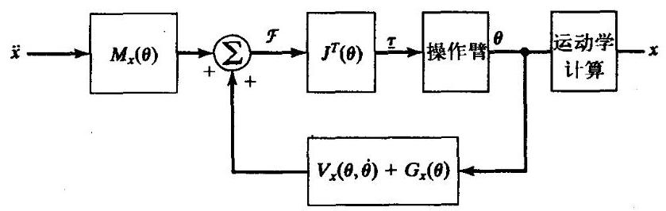

图11-11 第10章中介绍的笛卡儿解耦方案

由于已经设计了与约束坐标系一致的笛卡儿操作臂的混合控制器, 并且因为用笛卡儿解耦方法建立的系统具有相同的输入-输出特性, 因此只需要将这两个条件结合, 就可以生成一般的力/位混合控制器。

图11-12是一个一般操作臂的混合控制器框图。注意，动力学方程以及雅可比矩阵均在约束坐标系中描述。

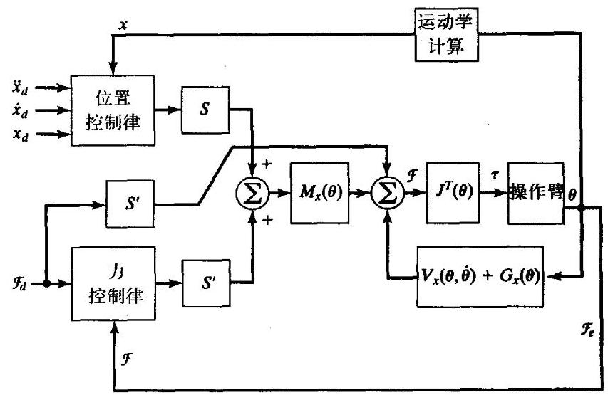

图11-12 一般操作臂的力/位混合控制器。为简单起见, 没有表示出速度反馈环

描述运动学方程时应将坐标变换到约束坐标系, 同样, 检测的力也要变换到约束坐标系 $\{ C\}$ 中。伺服误差应在 $\{ C\}$ 中计算, $\{ C\}$ 中的控制模型通过适当选择 ${S}^{ \ominus  }$ 来设定。图 11-13 所示为受上述系统控制的操作臂。

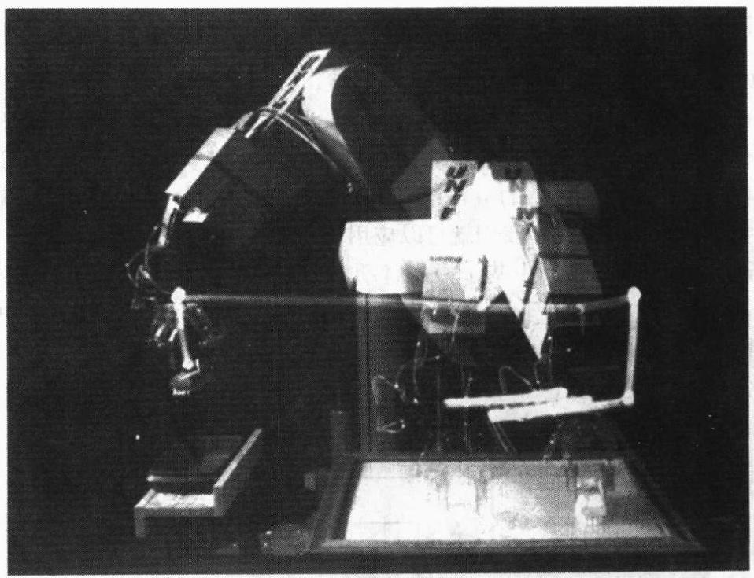

图11-13 Standford大学的O.Khatib开发的由COMOS系统控制的PUMA560擦窗操作臂。

这些实验使用力觉手指和类似于图11-12 ${}^{\left\lbrack  {10}\right\rbrack  }$ 的控制结构

**附加可变刚度**

对一个自由度进行严格的位置或力控制是在伺服刚度频谱的高端和低端进行的。理想的位置伺服刚度为无穷大, 可抑制所有作用于系统的干扰力。相反, 理想的力伺服刚度为零, 可保持期望的作用力, 不受位置变化的干扰。应用中常控制末端执行器的特性为有限刚度而不是零或无穷大。总之,是希望控制末端执行器的机械阻抗 ${}^{\left\lbrack  {14},{16},{17}\right\rbrack  }$ 。

在接触力的分析中, 我们已经假设环境的刚度很大。当与刚性环境接触时, 可使用零刚度力控制。当与零刚度环境接触时 (在自由空间运动), 可使用高刚度位置控制。因此, 控制末端执行器的刚度, 可近似用控制局部环境的刚度代替, 这可能是一个较好的方法。因此, 在操作塑性零件或弹性零件时, 希望设定伺服刚度为有限值而不是零或无穷大。

在混合控制器中,可以简单地采用位置控制以及降低 $\{ C\}$ 中相应自由度的位置增益进行控制。通常, 如果这样做, 还应降低相应的速度增益, 使这个自由度保持在临界阻尼状态。在 $\{ C\}$ 中这个自由度的位置伺服,应具有改变位置增益和速度增益的能力,使力/位混合控制器对于末端执行器产生一个广义的机械阻抗 ${}^{\left\lbrack  {17}\right\rbrack  }$ 。然而,在许多实际情况中,遇到的都是刚性零件间的相互作用问题, 因此要求进行纯粹的位置控制或纯粹的力控制。

---

日 在文献[10]中已将本章中介绍的基本方法推广到沿相关任务方向的分解运动控制模型中。

---

## 11.7 当前的工业机器人控制方法

目前, 真正的力控制 (例如本章中介绍的力/位混合控制器) 并未应用在工业机器人中。 这是因为, 在实际应用中还存在许多问题, 如需要进行大量的计算、缺少动力学模型的精确参数、缺少可靠耐用的力传感器以及用户在确定力/位控制方法时出现的困难和负担。

**被动柔顺性**

一个刚度很高的操作臂, 同时具有很高的位置伺服刚度, 那么它并不适用于完成零件相互接触并产生接触力的任务。因为在这种情况下, 零件常会被卡住或破坏。从早期将操作臂用于装配的实验开始, 人们就开始认识到, 机器人有时可以执行这样的操作, 那是由于零件、 夹具或操作臂自身存在一定的柔性。一般情况下，系统的一个或多个部件存在一定的 “柔性”， 使得机器人的装配操作能够成功。

据此, 可以在系统设计时专门设计一种柔顺装置。这种装置最成功的例子是Draper 实验室开发的RCC，即微偏心柔顺装置 ${}^{\left\lbrack  {18}\right\rbrack  }$ 。RCC被巧妙地设计用来获得一种“合适”的柔顺性， 可以保证平滑、迅速地完成某些装配任务而不发生或很少发生卡住的现象。RCC实际上是一个具有6自由度的弹簧, 它安装在操作臂的腕部和末端执行器之间。通过调节6个弹簧的刚度, 可以获得大小不同的柔顺性。这种方法称作被动柔顺方法, 并被用于某些工业机器人的操作任务中。

**通过降低位置增益实现的柔顺性**

另一种方法可以代替被动柔顺方法, 这种方法通过调节位置控制系统的增益来改变操作臂的总体刚度。一些工业机器人采用了这种方法, 例如磨削加工。磨削时需要保持表面接触, 但却不需要精确的力控制。

索尔兹伯里 ${}^{\left\lbrack  {16}\right\rbrack  }$ 提出了一种独特有趣的方法。他的方法是在基于关节的伺服系统中,通过改变位置增益使末端执行器沿笛卡儿自由度方向具有一定的刚度。考虑一个普通的具有6自由度的弹簧, 它的作用力可以描述为

$$
\mathcal{F} = {K}_{px}{\delta \chi } \tag{11-17}
$$

式 ${K}_{px}$ 中是一个 $6 \times  6$ 的对角阵,对角线上前 3 个元素是移动刚度,后 3 个元素是转动刚度。如何使操作臂的末端执行器表现出这种刚度特性呢?

根据操作臂雅可比矩阵的定义, 有

$$
{\delta \chi } = J\left( \Theta \right) {\delta \Theta } \tag{11-18}
$$

结合式 (11-17) 得到

$$
\mathcal{F} = {K}_{px}J\left( \Theta \right) {\delta \Theta } \tag{11-19}
$$

根据静力平衡原理, 有

$$
\tau  = J{}^{T}\left( \Theta \right) \mathcal{F} \tag{11-20}
$$

联立式 (11-19) 得到

$$
\tau  = {J}^{T}\left( \Theta \right) {K}_{px}J\left( \Theta \right) {\delta \Theta } \tag{11-21}
$$

这里, 雅可比矩阵通常在工具坐标系中写出。方程 (11-21) 表示关节力矩是关节角微小变化 ${\delta \Theta }$ 的函数,使得操作臂末端执行器像一个6自由度笛卡儿弹簧一样。

一个简单的基于关节的位置控制器可以使用如下控制律

$$
\tau  = {K}_{p}E + {K}_{v}\dot{E} \tag{11-22}
$$

式中 ${K}_{p}$ 和 ${K}_{v}$ 是常量对角增益矩阵, $E$ 为由 ${\Theta }_{d} - \Theta$ 定义的伺服误差。索尔兹伯里建议使用下式

$$
\tau  = {J}^{T}\left( \Theta \right) {K}_{px}J\left( \Theta \right) E + {K}_{v}\dot{E} \tag{11-23}
$$

式中 ${K}_{px}$ 为笛卡儿空间中末端执行器的期望刚度。对于一个具有 6 自由度的操作臂, ${K}_{px}$ 是一个对角矩阵, 对角线上的元素分别表示末端执行器的3个移动刚度和3个旋转刚度。实际上, 通过使用雅可比矩阵, 可以将笛卡儿刚度变换为关节空间刚度。

**力觉**

力觉使操作臂能够检测到与表面的接触，并使用力检测来完成某些动作。例如，运动监控有时用来表示这种控制策略:在检测到力以前，以位置控制方式运动，检测到力之后，停止运动。此外, 力觉还可以用于检测操作臂举起物体的重量, 例如可采用在零件抓持操作中的简单检测确保抓住零件或抓住正确的零件。

某些产品化的机器人开始在末端执行器上配备力传感器, 这些机器人可以通过编程使操作力超过阈值时停止运动或执行其他运动，有些机器人可以通过编程检测末端执行器抓取物体的重量。

**参考文献**

[1] M. Mason, "Compliance and Force Control for Computer Controlled Manipulators," M.S. Thesis, MIT AI Laboratory, May 1978.

[2] J. Craig and M. Raibert, "A Systematic Method for Hybrid Position/Force Control of a Manipulator," Proceedings of the 1979 IEEE Computer Software Applications Conference, Chicago, November 1979.

[3] M. Raibert and J. Craig, "Hybrid Position/Force Control of Manipulators," ASME Journal of Dynamic Systems, Measurement, and Control, June 1981.

[4] T. Lozano-Perez, M. Mason, and R. Taylor, "Automatic Synthesis of Fine-Motion Strategies for Robots," 1st International Symposium of Robotics Research, Bretton Woods, NH, August 1983.

[5] M. Mason, "Automatic Planning of Fine Motions: Correctness and Completeness," IEEE International Conference on Robotics, Atlanta, March 1984.

[6] M. Erdmann, "Using Backprojections for the Fine Motion Planning with Uncertainty," The International Journal of Robotics Research, Vol. 5, No. 1, 1986.

[7] S. Buckley, "Planning and Teaching Compliant Motion Strategies," Ph.D. Dissertation, Department of Electrical Engineering and Computer Science, MIT, January 1986.

[8] B. Donald, "Error Detection and Recovery for Robot Motion Planning with Uncertainty," Ph.D. Dissertation, Department of Electrical Engineering and Computer Science, MIT, July 1987.

[9] J.C. Latombe, "Motion Planning with Uncertainty: On the Preimage Backchain-ing Approach," in The Robotics Review, O. Khatib, J. Craig, and T. Lozano-Perez, Editors, MIT Press, Cambridge, MA, 1988.

[10] O. Khatib, "A Unified Approach for Motion and Force Control of Robot Manipulators: The Operational Space Formulation," IEEE Journal of Robotics and Automation, Vol. RA-3, No. 1, 1987.

[11] D. Whitney, "Force Feedback Control of Manipulator Fine Motions," Proceedings Joint Automatic Control Conference, San Francisco, 1976.

[12] S. Eppinger and W. Seering, "Understanding Bandwidth Limitations in Robot Force Control," Proceedings of the IEEE Conference on Robotics and Automation, Raleigh, NC, 1987.

[13] W. Townsend and J.K. Salisbury, "The Effect of Coulomb Friction and Stiction on Force Control," Proceedings of the IEEE Conference on Robotics and Automation, Raleigh, NC, 1987.

[14] N. Hogan, "Stable Execution of Contact Tasks Using Impedance Control," Proceedings of the IEEE Conference on Robotics and Automation, Raleigh, NC, 1987.

[15] N. Hogan and E. Colgate, "Stability Problems in Contact Tasks," in The Robotics Review, O. Khatib, J. Craig, and T. Lozano-Perez, Editors, MIT Press, Cambridge, MA, 1988.

[16] J.K. Salisbury, "Active Stiffness Control of a Manipulator in Cartesian Coordinates," 19th IEEE Conference on Decision and Control, December 1980.

[17] J.K. Salisbury and J. Craig, "Articulated Hands: Force Control and Kinematic Issues," International Journal of Robotics Research, Vol. 1, No. 1.

[18] S. Drake, "Using Compliance in Lieu of Sensory Feedback for Automatic Assembly," Ph.D. Thesis, Mechanical Engineering Department, MIT, September 1977.

[19] R. Featherstone, S.S. Thiebaut, and O. Khatib, "A General Contact Model for Dynamically-Decoupled Force/Motion Control," Proceedings of the IEEE Conference on Robotics and Automation, Detroit, 1999.

**习题**

11.1 [12]将方形截面的销钉插入一个方孔中, 给出自然约束表达式。用简图表示约束坐标系 $\{ C\}$ 的定义。

11.2 [10]给出习题11.1中使方形销钉插入孔中而不被卡住的人工约束 (即, 轨迹)。

11.3 [20]将式 (11-14) 表示的控制律用于式 (11-9) 给出的系统中, 证明可以得出如下误差空间方程

$$
{\ddot{e}}_{f} + {k}_{{v}_{f}}{\dot{e}}_{f} + \left( {{k}_{pf} + {m}^{-1}{k}_{e}}\right) {e}_{f} = {m}^{-1}{k}_{e}{f}_{\text{ dist }}
$$

并且仅当环境刚度 ${k}_{e}$ 已知时,才能选择增益,使系统达到临界阻尼状态。

11.4 [17]已知

$$
{}_{B}^{A}T = \left\lbrack  \begin{matrix} {0.866} &  - {0.500} & {0.000} & {10.0} \\  {0.500} & {0.866} & {0.000} & {0.0} \\  {0.000} & {0.000} & {1.000} & {5.0} \\  0 & 0 & 0 & 1 \end{matrix}\right\rbrack
$$

如果坐标系 $\{ A\}$ 原点处的力-力矩矢量为

$$
{}^{A}v = \left\lbrack  \begin{array}{r} {0.0} \\  {2.0} \\   - {3.0} \\  {0.0} \\  {0.0} \\  {4.0} \end{array}\right\rbrack
$$

求以坐标系 $\{ B\}$ 原点为参考点的 $6 \times  1$ 力-力矩矢量。

11.5 [17] 已知

$$
{}_{B}^{A}T = \left\lbrack  \begin{array}{rrrr} {0.866} & {0.500} & {0.000} & {10.0} \\   - {0.500} & {0.866} & {0.000} & {0.0} \\  {0.000} & {0.000} & {1.000} & {5.0} \\  0 & 0 & 0 & 1 \end{array}\right\rbrack
$$

如果坐标系 $\{ A\}$ 原点处的力-力矩矢量为

$$
{}^{A}v = \left\lbrack  \begin{array}{l} {6.0} \\  {6.0} \\  {0.0} \\  {5.0} \\  {0.0} \\  {0.0} \end{array}\right\rbrack
$$

求以坐标系 $\{ B\}$ 原点为参考点的 $6 \times  1$ カ-力矩矢量。

11.6 [18]用英语描述如何在拥挤的书架上将一本书插到书间的狭缝中。

11.7 [20]给出用操作臂关闭铰链门这一任务的自然约束和人工约束。可以做出必要的合理假设。用简图表示 $\{ C\}$ 的定义。

11.8 [20] 给出用操作臂拔掉香槟瓶塞这一任务的自然约束和人工约束。可以做出必要的合理假设。用简图表示 $\{ C\}$ 的定义。

11.9 [41]对于11.7节中的刚性伺服系统, 我们没有说明这个系统是稳定的。假设将式 (11-23) 作为解耦和线性化操作臂 ( $n$ 个关节可以看作为单位质量) 的伺服控制部分。证明对于任何负定矩阵 ${K}_{v}$ ,这个控制器都是稳定的。

11.10 [48] 对于11.7节中的刚性伺服系统, 我们没有说明这个系统处于临界阻尼状态。假设将式 (11-23) 作为解耦和线性化操作臂 ( $n$ 个关节可以看作为单位质量) 的伺服控制部分。是否可以设计一个 ${K}_{p}$ ,它是 $\Theta$ 的函数,并使系统在所有位形下处于临界阻尼状态?

11.11 [15]如图11-14所示, 一个质量块受到地板和墙面的约束。假设该接触状态在整个时间间隔上不变, 给出这种情况下的自然约束。

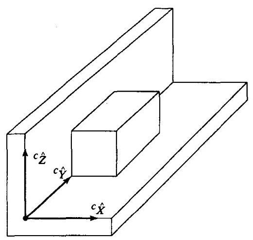

图11-14 受到地板和墙面约束的质量块

**编程习题**

对于三关节平面操作臂, 使用控制律 (11-23) 控制模拟操作臂, 建立一个笛卡儿刚度控制。使用坐标系 \{3\} 中描述的雅可比矩阵。

操作臂的位置为 $\Theta  = \left\lbrack  \begin{array}{lll} {60.0} &  - {90.0} & {30.0} \end{array}\right\rbrack$ ,并且 ${\mathbf{K}}_{px}$ 具有如下形式

$$
{K}_{px} = \left\lbrack  \begin{matrix} {k}_{\text{ small }} & {0.0} & {0.0} \\  {0.0} & {k}_{\text{ big }} & {0.0} \\  {0.0} & {0.0} & {k}_{\text{ big }} \end{matrix}\right\rbrack
$$

对系统在下述静态力的情况下进行仿真:

1. 作用在坐标系 (3) 原点的 ${\widehat{X}}_{3}$ 方向的力为 $1\mathrm{N}$ ;

2. 作用在坐标系 (3) 原点的 ${\widehat{Y}}_{3}$ 方向的力为 $1\mathrm{N}$ 。

通过实验求 ${k}_{\text{ small }}$ 和 ${k}_{\text{ big }}$ 的值,将 ${k}_{\text{ big }}$ 作为 ${\widehat{Y}}_{3}$ 方向的高刚度,将 ${k}_{\text{ small }}$ 作为 ${\widehat{X}}_{3}$ 方向的低刚度。在这两种情况下, 系统的稳态偏差是多少?
