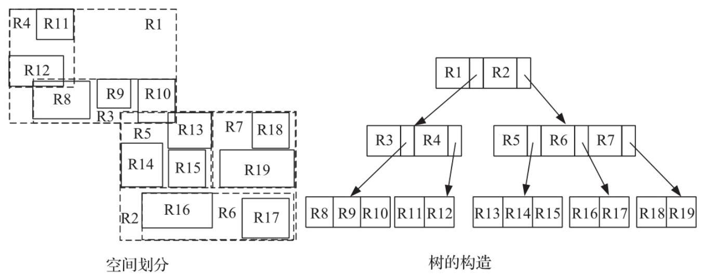
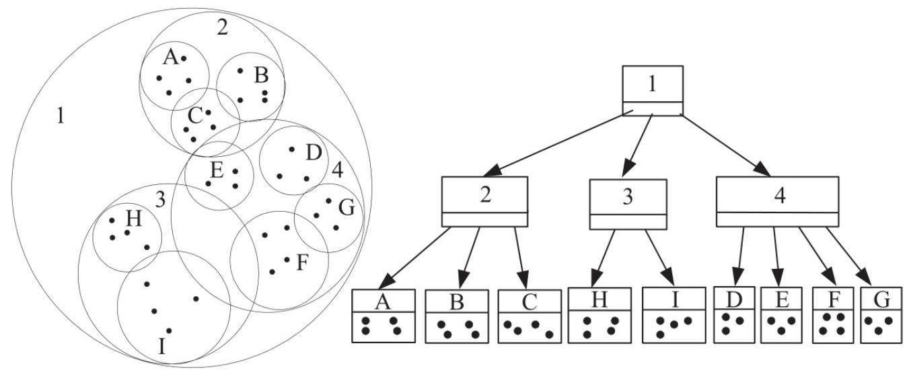
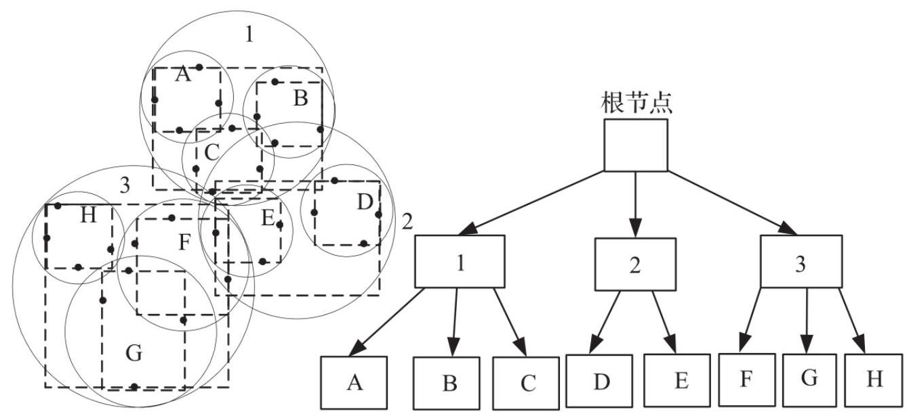
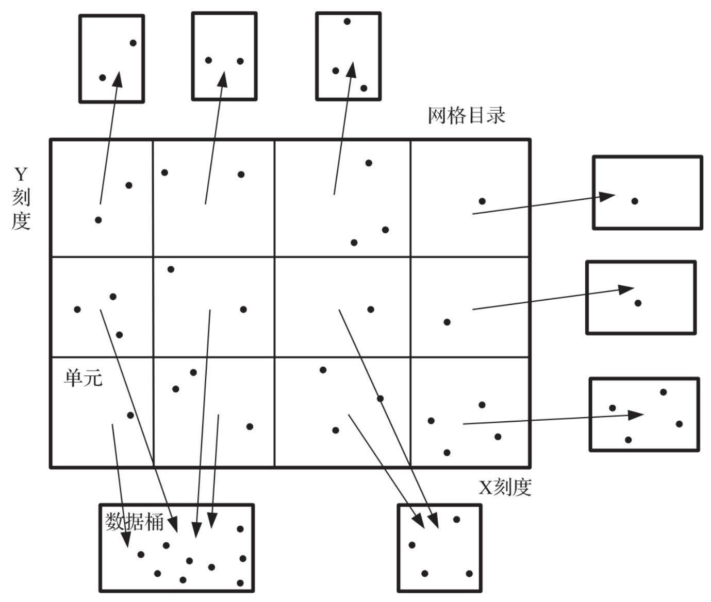
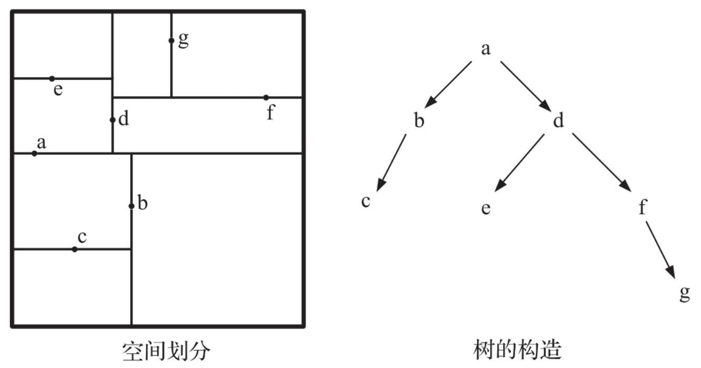
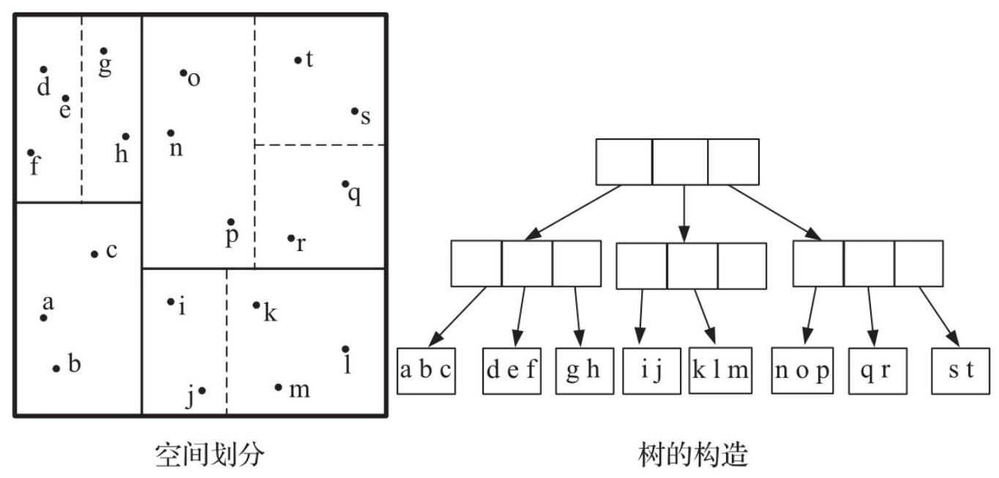
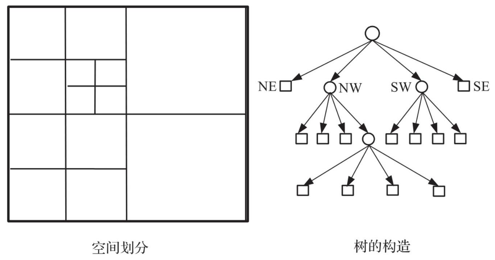
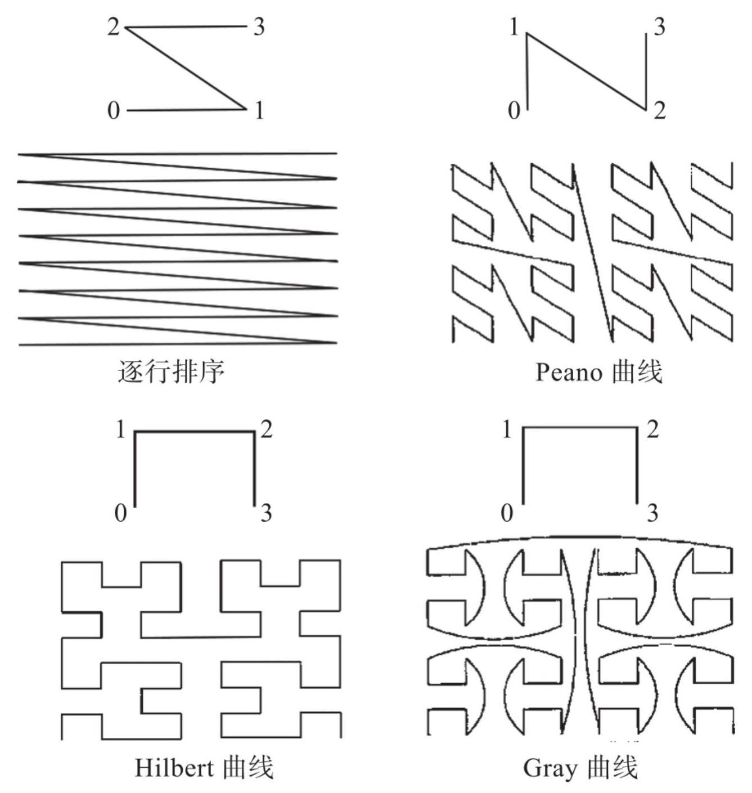
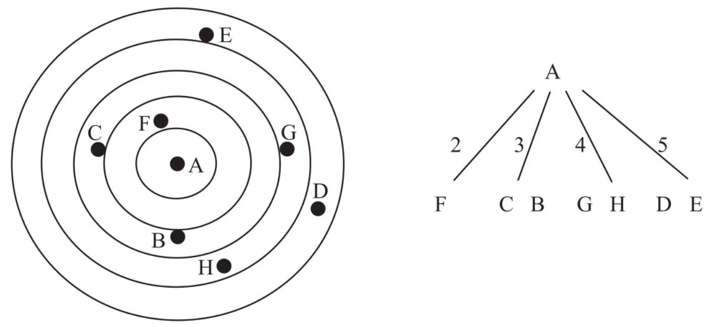

# 第2章 机器视觉中的索引技术

在基于内容的相似性检索技术中，索引技术的地位非常高。建立高效的索引结构始终是一个重要的任务。传统的索引结构不能直接应用于机器视觉检索中，比如B(Balance，平衡)树可以建立一维索引，但是不能搜索多维空间；哈希表虽然可以实现精确查找，但是不能进行范围查询，因此研究高维空间索引技术是解决机器视觉中面向内容检索的重要基础。

本章阐述机器视觉中索引技术的概念、作用，并详细介绍向量空间索引和度量空间索引。

## 索引技术概述

检索是计算机科学的基本功能，索引是支撑检索功能的核心技术。在计算机图像视觉等方向中，相似性检索是一种常用的查询类型。给定一个查询对象，相似性检索会根据相似性的定义找到相似的对象，这种功能在很多环境中非常有用。例如，在模式识别中，相似性查询可以基于标签根据已经分类好的对象对新对象进行分类；在多媒体检索中，相似性查询可以利用特定的图像来识别图像；在推荐系统中，可以通过相似性查询生成个性化的基于用户偏好的建议。本节介绍索引的概念与索引的作用。

2.1.1

## 索引的概念

索引是独立于被索引数据之外的一种数据，通过组织被索引数据的相关信息摘要，构建可按一定顺序查找的数据结构，在检索时过滤与目标无关的搜索空间，从而减少磁盘的访问次数，进而提高查询速度。

最初的图像检索技术是利用文本标注, 为图像建立关键字, 通过对关键字进行检索，进而搜索到图片。伴随着多媒体数据量的急剧增加， 利用多媒体数据存储、浏览、索引和查找等技术来获取更高的经济效益成为一个新的热点。20世纪90年代以来，基于内容的图像检索 (Content-Based Image Retrieval, CBIR)技术成为研究热点，至今依然热度不减。CBIR技术利用图像本身的视觉内容，如空间尺度、颜色、 形状、特征等高维数据来检索有价值的图片。高维数据就是高维空间的数据，比如二维空间中的点、线、矩形，三维空间中的点、线、 面、方体、球。最为重要的高维数据是从图像中提取的特征向量。 30多年来，科研工作者提出了近百种高维数据索引结构，这些结构都有各自的适用范围、优缺点。高维索引结构根据其功能又可以分为以下几种。

口树形高维空间索引结构，例如KD(K-Dimensional)树、R树、混合 (Hybrid) 树。

口基于相似性的索引结构，例如VA-File、 ${\mathrm{{VA}}}^{ + }$ -File。

口基于降低维度的索引结构，例如iDistance、Pyramid-Technique、 iMinMax。

口基于聚类的索引结构，例如Clindex、VQ-Index。

不同的高维索引结构对应不同的查询方法，基于特征向量常见的查询方法有:点查询、范围查询、K近邻查询。有些索引结构支持以上3种不同类型的查询，有些只支持其中一种或者两种查询方法。其中R树是B ${}^{ + }$ 树在高维数据空间的扩展，只支持点查询和范围查询。大量的应用需要对高维空间中的数据进行相似性检索, 为了给出相似度的计算，一种重要的方法就是对高维数据加上度量结构形成度量空间。

2.1.2

## 索引的作用

多维数据的查询处理在地球科学、机械CAD

(Computer Aided Design, 计算机辅助设计) 、机器人技术、视觉技术、自动导航、环境保护以及医学成像等领域中发挥着重要的作用， 其中的多维索引技术在提高查询效率、改善存取方式方面扮演着重要的角色。近几年来，对多维索引的研究由集中式逐步过渡到分布式， 特别是基于对等计算的多维索引技术目前是研究的热点。

多维索引技术从20世纪中期开始到如今经历了半个多世纪的发展，简单地讲, 多维索引的目的是提高查询多维数据的效率, 基本方法是综合考虑数据对象的各个维度，从整体上进行统一组织，设计合理的数据结构与查询算法，从而加快查找速度。从根本上讲，利用索引提高查询效率的本质是进行数据剪枝。

数据的高维性是大规模图像检索面临的一个亟待解决的问题，索引系统面对高维数据时，效率会大大降低。图像库中的图像特征向量通常是维度很高的向量，其维数从几百维到几千维不等，甚至更高。

基于高维空间进行检索操作，其效率与特征向量的维数密切相关。面对大规模图像数据库，如何降低算法的时间复杂度，使其具有实时性是应用领域必须要解决的问题。如果没有建立索引结构，要检索某一个图像就需要扫描数据库所有的图像，该操作的时间复杂度是 $O\left( n\right)$ 。 建立索引结构的目的就是要减少计算机对不必要图片的访问，从而提高数据库的检索效率。如果需要达到实时性的要求，在大规模图像库中建立有效的高维索引方法来提高查询速度是至关重要的。

许多基于内容的检索技术在处理高维特征向量时, 会遇到“维数灾难”问题，性能会显著退化，最终沦落到扫描整个图像数据库的地步， 搜索响应时间还远不及顺序扫描。这些方法在高维空间中主要遇到了如下3个问题。

口数据划分:只用到了其中一小部分维数，忽略了大部分维数，造成了非常大的损失。然而一个完整性的表示需要更多维度的信息，因此数据划分的效率很低。

口覆盖对象:对高维空间覆盖时，大多数用到的是超球或者是超立方体，这样会存在误差，为了弥补误差就会在高维空间下产生大量的重叠现象。

口精确检索:在精确查询的情况下，为了得到最终结果，所有与查询区域有交集的覆盖区间都需要被查询一遍，由于高维空间数据分布的极度稀疏性，这样查询的效率会非常低，性能退化成顺序查找。

## 向量空间索引技术

从数据形式上分类, 索引可以分为向量空间索引和度量空间索引。向量空间可以被看作带有坐标信息的特殊的度量空间。在一定条件下， 这两类空间是可以相互转换的。快速映射算法就是一种将度量空间中的对象转换为具有低维坐标的向量空间中的点的算法，当在向量空间中定义好一个距离函数而只取物体之间的距离信息时，就将向量空间转换成了度量空间。不难看出，度量空间索引比向量空间索引具有更普遍的适用范围，所用到的信息更少，难度也更大。

进行相似性查询时，在度量空间中算法执行的主要代价被认为是计算距离函数的CPU代价，因此度量空间索引结构主要考虑的是减少距离函数的计算次数。而在向量空间中进行查询的主要代价被认为是读取磁盘的I/O代价，向量空间索引结构主要考虑的是减少磁盘的I/O次数。

2.2.1

## 向量空间索引技术概述

在近几十年对向量空间高维数据索引的研究过程中，已经提出了大量的索引结构。根据索引结构的特点分类如下。

口根据处理数据的类型，索引可以分为点数据和空间数据。点数据是指那些只能处理点数据的索引结构，如KD(K-Dimensional)树、TV (Telescopic-Vector)树等；空间数据指既可以处理点数据，又可以处理线、矩形等具有一定形状的数据的索引结构，如R树、R*树等。

口根据索引创建时数据的组织形式，索引可以分为静态结构和动态结构。静态结构是指用批处理的方式将全部数据构建成索引，不支持动态的插入和删除，如packed-R树；动态结构指数据依次插入而生成的索引结构，如动态R树、动态R*树等。

口根据划分方法的不同，索引可以分为数据划分方法、空间划分方法以及混合型划分方法。数据划分方法是根据数据所在的位置进行层次划分, 如R树等；空间划分方法则是将整个数据空间逐渐划分为互相邻接的子空间, 如KD树等；混合型划分是指既根据空间进行划分又根据数据进行划分，如混合树等。

口根据索引的组织形式，索引可以分为树型结构和非树型结构。树型结构指索引结构按照树的形式组织，如KD树、R树等；非树型结构类如VA-File等。

口根据目录节点的形状，索引结构可以分为矩形、球形和混合型。在构造索引结构时，目录节点形状的选择直接影响检索效率，选择为矩形的有KD树、R树、R*树等；选择为球形的有SS树、TV树等；将矩形和球形结合起来使用的即混合型，如SR树等。

---

2.2.2

---

## 分类介绍

## 1. R树类

R树类的索引结构类似于B树，一般具有层次性的数据结构，最先出现的R树索引结构是在1984年由Guttman提出的R树。此后人们对它的算法和结构进行了改进，不过大多保持了与R树相同或类似的结构特点。

R树是一种平衡树，如图2-1所示，具有类似于B树的层次结构。在R树中存放的数据并不是原始数据，而是这些数据的最小外接矩形

(Minimum Bounding Rectangle, MBR) , 它具有以下性质。

口如果用M来表示一个节点中可以存放的项数目的最大值，用m $\left( {m \leq  M/2}\right)$ 来表示一个节点中可以存放的项数目的最小值，则除了根节点外，每个节点中必须包含 $m \sim  M$ 个项。

口根节点中至少要包含两个项，除非它是叶子节点。

口节点中每个项目的结构为 (rect, pointer)，在内部节点中，rect是子节点中所有数据的MBR，pointer指向该子节点；在叶子节点中，rect是实际数据的MBR，pointer指向实际数据存放的位置。

口所有叶子节点出现在同一层上。

R树的查找算法类似于B树，是从根节点出发，检查内部节点每一个项是否与要查找的区域重叠。如果重叠，则查找该项指向的子节点，直至查找到叶子节点。由于在R树中存放的是MBR，这些MBR可能相互重叠，因此无法保证查找操作只搜索一个路径即可成功，在最坏的情况下，一个查找操作可能要遍历所有的路径。 向R树中插入一个数据，实际上是插入该数据的MBR。和查找操作不同的是，一次插入操作只需要遍历一个从根节点到叶子节点的路径， 从根节点开始，在经过的每一个内部节点中选择这样的项，它所指向的子节点MBR的面积需要是最小的，如果出现面积相同的情况，则选择MBR最小的一个。

图2-1 R树结构示例

当到达叶子节点时，如果该节点中还有剩余的空间，就将数据插入节点，并按原路径返回，修改其祖先节点中相应项的MBR。假如在叶子节点中已经没有足够的空间存放要插入的数据，则发生分裂，生成一个新的叶子节点，并在其父节点中插入一个指向新叶子节点的项。如果在其父节点中同样出现了溢出，也要产生分裂。如此下去直至根节点，如果根节点也发生了分裂，则生成一个新的根节点，树的高度增加1。

要在R树中删除一个数据，首先要进行一次精确的查询操作，如果找到了该数据，则从节点中将其删除。删除之后如果节点中有足够的项， 则依次修改其祖先节点中相应项的MBR。如果在删除后节点中项的数目小于 $m$ ,则将该节点所有的项保存到一个临时缓冲区内，并将该节点从树中删除。如果节点删除后其父节点也出现相同的情况，则要进行相同的操作，如此直至根节点。将临时缓冲区内所有的项重新插入到树中，如果在删除完成之后，根节点只有一个子节点，则这个子节点就成为新的根节点，树的高度减1。

R*树对R树的插入算法和分裂算法进行了一些改进，主要体现在以下两点。

口提出了强制重新插入的概念，即当一个节点在插入的过程中发生了溢出，并不急于进行分裂，而是首先看一下该层节点在这次插入过程中有没有进行过重新插入，如果没有，则选择一定比例的项从该节点中删除并重新插入到树中；如果该层已经有节点进行过重新插入，则对该节点进行分裂。

口当节点进行分裂时，不仅要考虑分裂后两个新节点的面积，还要考虑分裂后节点周长以及该层节点的重叠面积等因素。

X树引入了超节点的概念，当节点发生溢出的时候，首先考虑为节点选择合适的分裂算法，以使节点分裂以后的重叠区域小到一定程度，假如无法避免分裂后出现较严重的区域重叠, 则不分裂节点, 而是扩大节点以放入更多的项，形成超节点。

SS树是一种用于多维点数据相似搜索的索引结构，如图2-2所示。它是对R*树的一种改进, 提高了最近邻 (Nearest Neighbor, NN) 查询的性能。它使用了限定球来划分区域的形状，球的中心是包络点的质心， 在树的构建算法中利用质心将各点划分成各向同性的邻居。SS树还改进了R*树的强制重插机制, 提高了树结构的动态重构性。因为SS树采用的超球体积很大, 导致超球之间重叠严重, 所以增加了多路搜索的开销。

图2-2 SS树结构示例

SR树是一种用于高维NN查询的多维索引结构，如图2-3所示。SR树的特点是将限定球与限定矩形相结合，限定球可以将点划分为小直径的区域，而限定矩形可以将点划分为小体积的区域。这样的结合既提高

了区域之间的不相连性，又改进了NN查询的性能。性能测试表明，SR 树优于SS树和R*树。

图2-3 SR树结构示例

## 2. 网格文件类

网格文件是一种典型的基于哈希的存取方式，由包含很多与数据桶相关联的单元网格目录组成，一般一个数据桶为硬盘上的一个磁盘页， 如图2-4所示。

每个单元只对应一个数据桶，而一个数据桶可以包含几个相邻的单元。因为随着数据增多，网格目录可能会慢慢变大，所以通常将其保存在硬盘上。为了保证在精确查询的时候能仅用两次I/O操作就找到相应的记录，一般将网格本身保存在主存中，网格使用 $d$ 个一维数组表示，这些数组构成了网格的刻度。

在进行精确查询的时候，首先用这些刻度来定位要查找的记录成员， 假如这个单元不在内存中, 那么将进行一次I/O操作, 将这个单元从硬盘调入主存，在这个单元中包含一个指向可能找到记录页的指针，读

取这个指针所指的页又需要进行一次I/O操作；而对于范围查询，需要检查所有与要查询的区域相交的单元。

图2-4 网格文件结构示例

向网格文件插入一个数据的时候，首先要进行一次精确查询，以确定该数据项应当插入的单元以及对应的数据页。如果在这个页中还有足够的空间, 将数据插入即可。如果已经没有足够的空间, 则要根据与该页相关联的单元的数目来决定处理的方法。当有几个单元指向该页的时候，检查现在的刻度中是否有合适的超平面能够成功地将该页分开，如果有，就产生一个新的页并根据这个超平面将数据分配在两个

页中。如果现存的超平面没有合适的，或者只有一个单元指向该页时，将引入一个新的超平面并产生一个新的页，然后根据这个超平面分配数据，同时要将这个超平面插入到相应的刻度中，而所有与此超平面相交的单元也要发生分裂。

在网格文件中删除数据，也要先进行一次精确查询，确定该数据所在的单元及对应的数据页，并将其删除。假如在删除之后，这个页中存储的数据低于一定数目，则需要进行相应的处理，根据当前刻度对空间的分割情况，选择同其相邻的页进行合并，还可以取消刻度中的一个超平面。

Excell与网格文件的不同之处在于其所有的网格单元的大小是相同的， 每次分裂都将导致目录大小成倍增长。

两层网格文件的基本思想是增加一个网格文件，形成两层网格来管理目录，其中第一层被称为根目录，它是第二层目录的一个大致描述， 具有指向第二层目录的指针，而第二层才是真正的目录，它包含指向数据页的指针。这种结构的好处是，当发生分裂的时候，产生的影响被限制在第二层目录的范围内，不会过多影响其他数据。

Twin网格文件也引入了另外一个网格文件，不过与两层网格文件不同的是，这两个文件的关系是对等的，而且每个文件都覆盖了整个空间，数据在这两个文件中的分布是动态的，当在插入过程中某个文件的单元所指向的页出现溢出的时候，在这两个网格文件之间重新分配数据。

## 3. KD树类

KD树是一种在 $k$ 维空间中的二叉查找树，如图2-5所示，它主要存储的是点数据，在每一个内部节点中，用一个 $k$ -1维的超平面将节点所表示的 $k$ 维空间分成两部分，这些超平面在 $k$ 个可能的方向上交替出现，而且在每一个超平面中至少包括一个点数据。

图2-5 KD树示例

KD树的查找和插入操作很简单，而删除操作则有点复杂，因为删除一个点可能会导致子树的重建。KD树只能处理点数据，其他具有一定形状的数据只能用中心点来代替。需要指出的是，数据插入的顺序不同时, KD树的结构也不同, 而且数据会分散出现在树的任何地方, 而不是仅出现在叶子节点上。

Adaptive KD树是在KD树的结构上做了少许改变，在分裂的时候选择合适的超平面, 使分裂后的两部分包含相同数量的数据, 而且在这些超平面上不一定包含数据及它们的方向，也不一定严格地在这 $k$ 个可能的方向上交替出现。在这种结构里，内部节点表示的是分裂的超平面， 所有的数据都出现在叶子节点中，每个叶子只能包含一定量的数据， 超过这个数量的时候就要发生分裂。

KDB树是将Adaptive KD树和B树的特点结合到了一起，如图2-6所示。 KDB树采用Adaptive KD树中的用超平面来划分节点中的空间，不过对于一个内部节点所表示的空间，可以用多于一个的超平面来划分，形成几个相邻的子空间，每个子空间对应一个内部节点，所有的数据均存储在相应的叶子节点中。KDB树的结构类似于B树，不过在树中不能保证最小空间的利用率。

图2-6 KDB树结构示例

## 4. Quad树类

与KD树类似, Quad树也是用超平面的方法来划分整个空间, 不同的是，Quad树不是二叉树，在 $k$ 维空间中，每一个内部节点具有2k个子节点，每个子节点对应一个子空间。

例如, 对于一个在二维空间的Quad树, 每个内部节点拥有4个子节点, 每个子节点对应一个矩形。这4个矩形一般用NW(North West)、NE (North East)、SW(South West)以及SE(South East)来表示，如图 2-7所示。用这种方法将整个空间逐渐划分到每一个矩形中，直到包含的数据数量低于一定的数目为止。显然这样得到的Quad树不能保证是平衡树，在数据比较密集的地方，树的深度将高于其他的地方。

Quad树的查找操作类似于普通的二叉查找树，在每一层选择要继续查找的子树，对于点查询，只需要选择其中一个合适的，而对于范围查询可能需要几个子树，按照这个方法递归执行，直到查找到树的叶子节点。

图2-7 Quad树结构示例

Point Quad树是Quad树的一个变种，它是由点数据一个接一个连续插入构造出来的。对于每一个点，首先进行一个点查找操作，假如没有在树中发现这个点，则将这个点插入刚才查找操作终止的叶子节点，而这个节点所表示的区域以新插入的点为中心分为2 * 个子空间。

如果从Point Quad树中删除一个点，会引起相应的子树的重建，一个简单的解决方法是将所有子树上的数据重新插入。

## 5. 空间填充曲线

这一类索引结构的特点是希望找到某种方法对高维空间中的数据进行近似的排序，使得原来在空间中较为接近的数据能在排序后以比较高的概率排列在一起，那么就可以用一维数据对它们进行索引。这种方法在点查询操作中能够取得良好的效果，但在范围查询时就比较麻烦

了。根据这种思路，人们提出了4种将高维空间中的点数据映射到一维空间并排序的方法，如图2-8所示。

图2-8 4种空间填充曲线示例

所有的空间填充曲线都有一个重要的优点，就是可以处理任何维数的数据，前提是映射到一维空间的键值可以任意大。这种方法也有一个明显的缺点，将两个不同区域的索引组合到一起的时候，至少要对其中的一个重新编码。

## 6. 量化近似类

量化近似的思想首先在VA-File中提出，基本思想是将高维点数据进行压缩和近似存储。首先，对于特定总的比特数 $b$ 以及维数 $d$ ，对每一维j 分配一定的比特数bj。

每一维上的比特数决定了在这一维上的刻度，一般来说，第 $j$ 维需要 ${2}^{\mathrm{{bj}}} + 1$ 个刻度来得到 ${2}^{\mathrm{{bj}}}$ 个区间，其中第一个刻度对应该维的最小值，最后一个刻度对应该维的最大值，其余的刻度对该维进行等分。在插入和删除过程中，这些刻度一般保持不变，只有区间之间点数的差别超过了一定的限制后才重新计算。

对每一个点数据，将每一维所在区间对应的比特串联起来即为它的近似值，用两个浮点数表示的点可以用4个比特来表示，从而实现了对原来数据的压缩。当进行查询的时候，VA-File起到过滤的作用，也就是说首先对这些比特串按顺序扫描, 根据比特串所对应区间的边界来确定哪些可能是查询结果的数据，再对得到的结果进行精确的查询。

LPC-File为了近似矢量能够更精确地表示原来的高维矢量，增加了极坐标信息，从而提高了查询精度。

VA-Index最大的特点是引入了矢量量化的方法，而不是采用VA-File和 LPC -File中的标量量化方法。这种方法虽然在很大程度上提高了查询效率，但其构造复杂度大大提高，而且需要利用历史数据生成较好的矢量量化器。

## 7. 降维类

Pyramid是第一个降维类索引结构，首先将多维空间中的矢量数据映射为一维数据，然后利用传统的索引结构，如B ${}^{ + }$ 树实现索引及相似查询。在Pyramid中，首先将数据空间分割为以中心点为定点的2d( $d$ 为高维空间的维数)个金字塔区域，然后将每个金字塔区域划分为多个区域，其中每个区域对应于B ${}^{ + }$ 树中的一个磁盘页。

在划分数据空间后，对每个金字塔按顺序编号，对落入某个金字塔区域的高维数据，根据其所在区域的标号以及高度可以计算得到一个一维数据。在将高维数据映射到一维数据后，利用B ${}^{ + }$ 树进行索引。在进行范围查询时，将二维数据转换为一维数据。

对每个高维数据，iMinMax首先从该数据的所有维度中选择数值最大的维度和数值最小的维度，然后利用这些数值进行简单的计算，获得该高维数据对应的一维数据，并利用B ${}^{ + }$ 树进行索引。

iDistance首先对所有数据进行分割，在分割得到的每一类中选择一个代表点，并对每一类按顺序编号。对每一个高维数据，首先通过其所在的编号及其与代表点之间的相似度得到一个一维数据，然后利用B ${}^{ + }$ 树进行索引和查询。

---

2.2.3

---

## 向量空间索引的应用

向量空间索引适用于具有坐标并且可以利用坐标计算距离的场景。最常见的场景是空间数据库、地理信息系统等，主要依靠向量空间索引进行空间检索(注意，地理信息空间有时也存在度量空间的场景)。 空间数据可以按照图形分为点类型、直线类型、曲线类型、面类型、 体类型等，这些数据都可以用点数据表示。每个点在实际空间中可以采用地理坐标或其他空间坐标表示。在检索时，可以采用的查询方式如下。

口精确匹配查询(Exact Match Query, EMQ):对于给定的查询数据q， 从数据库中找出所有与 $q$ 相同的数据。

口点查询(Point Query, PQ):给定点数据q，从数据库中找出所有包含点q的数据。

口窗口查询 (Window Query, WQ) :给定一个 $d$ 维的矩形查询区 ${I}^{d} = \; \left\lbrack  {l, u}\right\rbrack   \times  \left\lbrack  {l, u}\right\rbrack   \times  \ldots  \times  \left\lbrack  {{l}_{\mathrm{d}},{u}_{\mathrm{d}}}\right\rbrack$ ，从数据库中找出至少包含一个 $I$ 中的点的所有数据。

---

1122

---

口相交查询(Intersection Query, IQ):给定具有一定形状的空间数据 $q$ ,从数据库中找出至少包含 $q$ 中任意一点的所有数据。

口包含查询 (Enclosure Query, EQ) :给定查询数据 $q$ ，从数据库中找出所有包含 $q$ 的数据。

口被包含查询(Containment Query, CQ):给定查询数据q，从数据库中找出所有被 $q$ 包含的数据。

口邻接查询(Adjacency Query, AQ):给定查询数据q，从数据库中找出所有同 $q$ 邻接的数据。

口范围查询 (Range Query, RQ) :给定查询数据 $q$ 与查询距离门限 $T$ ， 从数据库中找出所有与 $q$ 距离小于 $T$ 的数据。

口k-近邻查询(k-Nearest Neighbor Query, k-NNQ):给定查询数据q及正整数k, 从数据库中找出距离q最近的k个数据。

面向向量空间的索引可以以空间点坐标为基础, 首先利用索引中相关空间划分方法划分空间对象，然后建立索引结构，针对不同的查询方法再设计相应的查询算法，从而满足快速检索空间数据的需要。

## 度量空间索引技术

向量空间索引技术针对的是有具体表示形态的数据(如有坐标的数据)，在实际中往往还存在另一类没有表示形态的数据，这些数据之间可以进行大小、长度的比较。针对这种数据的检索，可采用度量空间索引技术。

2.3.1

## 度量空间索引技术概述

目前已有多种度量空间的高维索引结构，根据索引结构的特点和出发点, 有以下几种分类方法。

口根据索引创建时数据的组织形式，度量空间索引可以分为静态结构和动态结构。静态结构是指用批处理的方式将全部数据构建成索引， 不能支持或不能有效支持动态的插入和删除操作；动态结构是指数据一次插入生成的索引结构，如M树、Slim树等。

口根据索引的组织形式，度量空间索引可以分为树型结构和非树型结构。树型结构是指索引结构是按照树的形式组织的, 如BK (Burkhard Keller) 树、VP (Vantage Point) 树等；非树型结构是指索引结构不是按照树的形式组织的, 如FQ-Array等。

口根据索引结构使用的距离定义是离散型还是连续型，度量空间索引可以分为离散距离和连续距离。离散距离索引结构是指所使用的距离函数是离散的，连续距离索引结构是指所使用的距离函数是连续的。

## 分类介绍

## 1. BK树类

BK树类的索引结构是针对离散的距离函数设计的。最早的BK树结构是由Burkhard和Keller在1973年提出的, 其后虽然人们在它的基础上又进行了改进, 但大都在结构上保持了相似的特点。

BK树是最早的度量空间树状索引结构，适用于离散的距离函数，如图 2-9所示。从数据集中任意选取元素 $p \in  W$ 作为索引树的根节点，即可构造BK树。

图2-9 BK树结构示例

对于任意离散距离 $i > 0$ ，定义 ${Wi} = \{ w \in  W, d\left( {w, p}\right)  = i\}$ ，即 ${Wi}$ 为与根节点距离为 $i$ 的所有点的集合。对于每一个非空的 ${Wi}$ ，循环为其建立BK树，直到剩余元素数目小于一个预定义的闭值 $b$ 时停止，其中每一个被选择为子树根节点的元素成为支点(pivot)。

当给定一个查询 $q$ 和范围 $r$ 时，BK树的查询算法是从根节点出发，找出所有满足不等式 $d\left( {p, q}\right)  - r \leq  i \leq  d\left( {p, q}\right)  + r$ 的子节点 $i$ ，递归直至到叶子节点。

对路径上所有的支点和叶子节点中的每一个元素都要与 $q$ 进行比较是否满足不等式 $d\left( {q, u}\right)  \leq  r$ ，记录所有满足不等式的点，将它们作为结果并返回。在查询中，三角不等式性质保证了所有满足查询条件的点均会被检索到。

在BK树提出之后，人们对它的结构进行了各种改进，以期得到更好的性能。FQ树对BK树进行的改进主要体现在两点。

口数据库中的所有数据都存放在叶子节点上，在非叶子节点中存放的可能是数据库中的数据，也可能是其他的关键字。

口位于同一高度上的所有中间节点存放的都是同一个关键字, 这是FQ 树最新颖的地方。

由于同一层的中间节点所对应的是同一个关键字, 因此在检索时可以减少距离比较的次数，同时也会增加遍历的节点数，即树的高度会增加。

FHQ树在FQ树的基础上进行了改进，即强行规定所有的叶子节点必须在同一高度上。这样在进行查询时对于同一层的节点可以统一考虑， 不必再分为叶子节点和中间节点两种情况。这个规定的代价为某些叶子节点不得不增加高度以满足这一条件。

FQ-Array是一种数组查询结构，其实质是对FHQ树的一种压缩存储格式。它的构成是将一棵FHQ树的叶子节点从左到右依次存入数组的每一个元素，并且记录从根节点至叶子节点所历经的所有边的权值。利用FQ-Array进行查找实际是进行二分查找，相较于FHQ树而言，需要花更多的时间，复杂度为 $O\left( {\log {2n}}\right)$ ，不过并没有增加距离函数的计算次数。

## 2. BS树类

BS树类的索引结构不仅可用于离散的距离函数，也适用于连续的距离函数，比BK树类的索引结构有更广泛的适用范围。

BS树是BS树类中最早被提出的索引结构，它是一棵二叉查找树，构造方法为从根节点出发，为每一个节点选择两个中心数据点 $C$ 和 $C$ ，依照距离中心点C和C谁更近的原则，依次将剩余元素分别放入节点的左右子树中；记录每一个中心点的覆盖半径，即在它的子树中离它最远的元素的距离。BS树的查找过程很简单，在每一层上对于中心点C，如果 $d\left( {q, C}\right)$ - $r$ 小于 $C$ 的覆盖半径，则进入 $C$ 对应的子树进行查找，否则删除这一分支。

---

12121111

---

VT树具有和BS树类似的结构，改进之处在于必须生成一个新的节点以容纳新插入的元素，不仅把新插入的元素放入该节点，而且把它的父节点所包含的距离最近的元素也放入该节点。实验证明，VT树比BS树具有更高的查询效率和更好的平衡性。

VT树在构造上与BS树类似，不同之处在于查询时不是使用中心点的覆盖半径,而是通过两个中心点之间的超平面来选择分支,如果 $d\left( {q, C}\right)  - r \; < d\left( {q, C}\right)  + r$ ，则进入C的子树查找；如果 $d\left( {q, C}\right)  - r < d\left( {q, C}\right)  + r$ ，则进入C的子树查找。需要注意的是，有可能会查找所有的分支。

121212

Monotonous BS树对BS树进行的改进在于当为每个节点选取两个中心点时，其中一个中心点是父节点的中心点。这样做的好处是查询时随着树深度的增加，中心点的覆盖半径会递减。

GNA树的本质思想与BS树完全一致，只是对BS树进行了扩展，即为每个节点选取的中心点不是两个，而是m个，相应得到的索引树也不再是二叉树，而是 $m$ 叉树。

## 3. VP树类

VP树是一种基于连续距离函数的二叉平衡树，它的思想是如何将二分查找应用到只有距离信息的高维度量空间中。类似于KD树，VP树的每一个节点都相当于对空间的一次划分, 有所不同的是, VP树使用的是距离信息而不是坐标信息。具体构造方法为选取一个元素 $p$ 作为根节点，将剩余的所有元素根据与 $p$ 的距离均匀地放至 $p$ 的左右子树中，离 $p$ 较近的一半元素放入p的左子树中，离p较远的一半元素放入p的右子树中；设M为左右子树的临界距离值，将它作为节点的附加信息保存；分别对左右子树重复以上过程，直到节点中的元素数目小于 ${k}_{\mathrm{o}}$

MVP树对VP树的结构做了少许改变。它将中间节点所包含元素的数目由VP树的一个增加到两个。其中，每个元素的划分份数为 $m$ ，这样提高了每个节点的输出能力，降低了树的高度，从而减少了距离函数的计算次数。构造一棵MVP树所需要的距离函数的计算次数为 $O\left( {n{\log }_{\mathrm{m}}n}\right)$ ，比VP树少了 ${\log }_{2}n$ ，并且在查询性能上也有了很大的提高。

VPF树是VP树的又一个变种，它针对VP树的一个缺点作出改进:在VP 树中，当一个查询点距离支点很近时，将不得不分别进入支点的左右子树进行查询。VPF树的主要思想是在树的每一层上，将所有距离支点适中的元素独立选取出来，并用这些元素构造第二棵树，以此类推， 得到由多棵树构成的索引结构。

## 4. M树类

M树是度量空间中第一个真正的动态索引结构，它不仅考虑了减少距离函数的计算次数，而且考虑了I/O性能。M树的结构特点类似于R 树, 具体体现在以下几个方面。

口它是平衡树, 所有指向实际数据的指针都存放在叶子节点上。

口每个节点所存放的项的数目不得超过 $N$ 。

口在动态插入一个数据项时，选择最相近的分支往下插入，当引起节点溢出时，要对节点进行分裂。

M树区别于R树的方面如下。

口在中间节点中存放的是有代表性的数据项和该数据项覆盖其所有子数据项需要的最小半径。

口只用到了距离信息，没有坐标位置。

通过分析可以看出，M树是将向量空间索引结构的动态性与平衡性和度量空间索引结构的距离定义相结合，以期达到较好的检索性能。如果给M树加上坐标信息，实际上就成了向量空间中的另一种索引结构 SS树。

Slim树是在M树的基础上进行了优化，具体体现在以下方面。

口提出了一种基于MST(Minimum Spanning Tree，最小生成树)的节点分裂算法，首先为待分裂节点中的所有元素构造一棵最小生成树， 边的权值用距离表示，选择权值最大的边进行切分；然后将剩余的两个连通图中的元素分别作为两个新节点中的元素；最后为每个新节点选取有代表性的元素和最小覆盖半径。

口提出了一种衡量度量空间中空间重叠程度的办法，并且利用这种衡量标准给出了一种在节点之间移动数据项的算法，以期达到降低节点相互重叠程度的目的。

${\mathrm{M}}^{2}$ 树在M树的基础上进行了性能优化，传统的M树只能根据数据的某一个固定的特征进行检索，而M²树可以同时根据数据的多个特征对数据进行检索，即使用了多种距离函数，因此在节点的数据项中包含了多个特征以及对应每个特征的距离值。 ${\mathrm{M}}^{2}$ 树可以应用在多媒体数据库中进行复杂查询。

## 5. SA树

与传统索引结构的划分数据集的思想不同，SA树的基本思想是随着查询的进行可以不断地在空间位置上越来越靠近查询点, 以此得到查询结果。构造方法为选择一个数据点 $a$ 作为根节点，并求得它的邻居节点集合 $N$ 。 $N$ 中的每一个数据点 $b$ 都满足条件 $\forall r \in  N, d\left( {a, b}\right)  < d\left( {b, r}\right)$ ；将 $N$ 中的每一个数据点都作为 $a$ 的一棵子树插入；把剩余的数据点分别插入距离最近的子树中，并以原 $N$ 中的数据点作为根节点重复以上过程。显然 SA树是一种完全静态的索引结构。

2.3.3

## 度量空间索引的应用

度量空间索引主要应用于无法获取坐标，只能获取任意两点之间距离的场景，而这种场景在多媒体计算领域居多(注意，多媒体领域也有向量空间，也可以应用向量空间索引)，特别是针对多媒体计算中的基于内容的检索，利用度量空间索引可以达到高效查询的目的。

基于内容的多媒体检索始于20世纪90年代初, 随着高速传输和高效存储技术的发展，大量图形、图像和视频以计算机可读的形式存在。

面对日益增多的可访问到的多媒体信息，为了不迷失在其中，人们会提出快速查询的需求，即从数据库中查找与给定的查询对象最为相似的一些或一个对象。基本思想来源于基于内容的图片检索(Content-based Image Retrieval, CBIR)。这种技术从图像中自动提取底层的视觉特征，比如颜色、纹理、形状等，作为图像的底层视觉特征。

在检索中，用户提交一幅例子图像给系统作为查询条件，系统会返回与此图像在视觉特征上相似的其他图像作为检索结果。 早期具有代表性的研究是基于内容的图像检索，如QBIC

(Query By Image Content, 图像检索) 系统、Virage系统、Photobook 系统和MARS(Multimedia Analysis and Retrieval System，多媒体分析和检索系统)等。这种技术后来也被运用到基于内容的视频检索中， 如卡内基梅隆大学的Informedia系统和哥伦比亚大学的VideoQ系统等。 由于采用图形表示的模型不同，很多方法难以给出每个多媒体对象在整个空间的坐标, 可以采用某种度量方法给出任意两个多媒体对象按照某种度量标准的距离值, 在海量相似性检索中, 如果采用一一比较的方法将会十分耗时，这时度量空间索引就可以发挥作用了。

## 本章小结

本章针对机器视觉中重要的基础技术——索引技术进行了分类论述。首先讲述了索引技术的概念和作用，然后从索引技术的两个重要方向: 向量空间和度量空间，分门别类地论述不同的索引技术。第3章将机器视觉中另一个重要的基础技术一人脸识别技术。

CHAPTER 3
