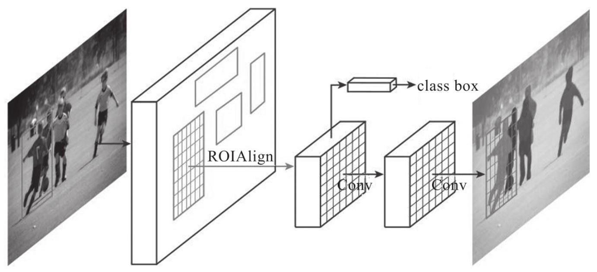
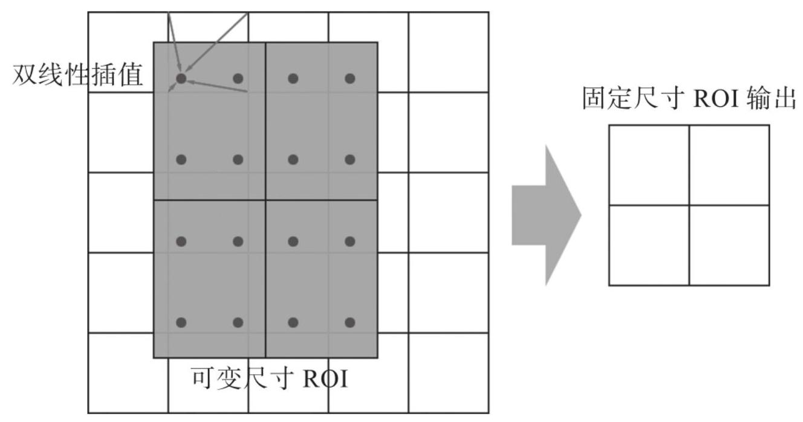
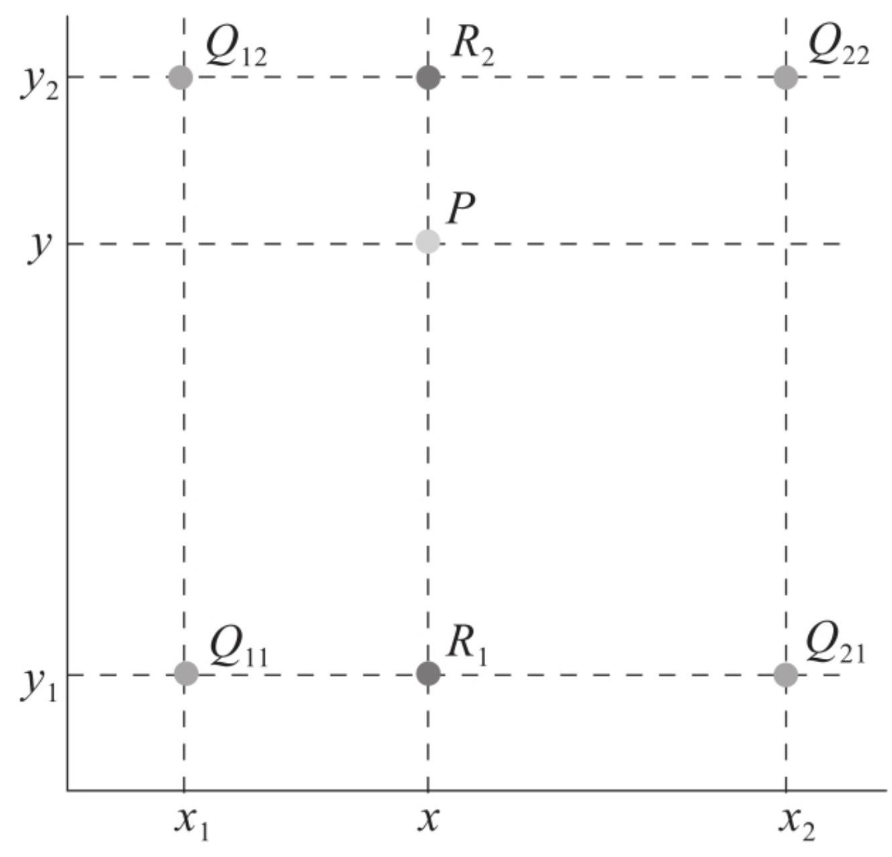
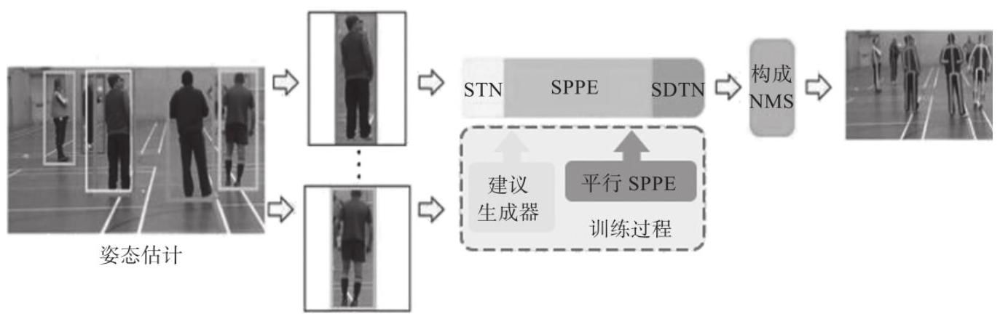
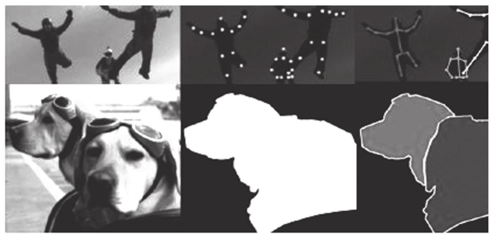
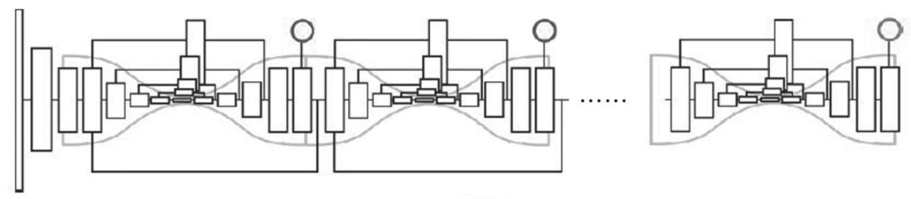
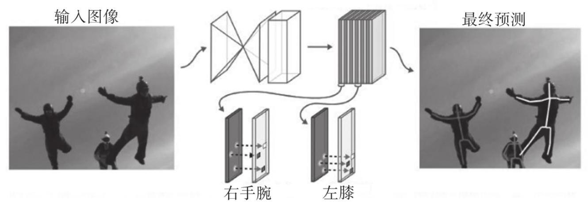

# 第4章 人体姿态识别技术

机器视觉中的人体姿态识别技术

人体姿态识别一直是计算机视觉中备受关注的研究热点，在智能安防、人机交互、动作识别等领域有着重要的研究价值。近年来，随着深度学习技术的快速发展，人体姿态识别的效果不断提升，已经广泛应用于计算机视觉的相关领域。

本章主要介绍机器视觉中人体姿态识别技术的相关概念和定义，并重点介绍与人体姿态识别相关的两类技术——自上而下的人体姿态识别和自下而上的人体姿态识别。

## 4.1 人体姿态识别技术概述

在计算机视觉中，行为识别、人物跟踪、步态识别等相关技术的具体应用主要集中在智能视频监控、病人监护系统、人机交互、虚拟现实、人体动画、智能家居、智能安防、运动员辅助训练等实际场景中。

由于人体具有柔性，会出现各种姿态，因此任何一个部位的微小变化都可能产生一种新的姿态，同时其关键点的可见性受穿着、姿态、视角等的影响也非常大, 而且还面临着遮挡、光线等环境的影响。此外，二维人体关键点和三维人体关键点在视觉上会有明显的差异，身体的不同部位在视觉上会有不同的效果，使得人体姿态识别技术成为机器视觉领域中一个极具挑战性的课题。

### 4.1.1 概念与定义

近年来，随着科学技术的发展，深度学习得到更多的应用。研究人员希望研发出更加高端的技术，提高机器对人类的理解能力。正是在这样的研究热潮下，人体姿态识别技术得到快速发展。

人体姿态识别就是让计算机从图像或视频中定位人体的关键点，然后依据这些关键点并结合人体姿态知识、场景等对当前人体姿态进行估计或对行为做出判断。

人体姿态识别技术一方面用于实现高质量的人机交互体验，例如将姿态估计应用于游戏等娱乐设备中，人们不再需要通过硬件设备或者语言交互，机器能自动识别人们的姿态，从而理解人们的意图，实现相应的交互体验；另一方面用于行为预判功能的实现，通过对当前的行为进行分析，推测目标在下一时间轴的若干行为，如应用于安全防范监控设备，对于暴力、恐怖行为进行预判和预警。

人体姿态识别不仅能大幅提高人机交互时的体验质量，对于安防系统甚至安全领域也有重大的意义。近年来，相关领域的研究越来越深入，先进算法甚至达到了93%的识别率。识别场景从静态图像到动态视频，识别实体从单一个体到复杂场景多目标识别，识别要求从分辨率有严格要求到像素稀疏、目标重叠，姿态估计识别逐渐接近人们的实际生活，将给人们的生活带来巨大的改变。

### 4.1.2 人体姿态识别技术的特点

随着科学技术的发展，计算机的运算能力大大提升，许多需要进行大量计算的任务得以实现。特别是在识别技术上, 无论计算机视觉识别还是语音识别，识别精度都得到了一定程度的提高。人机交互、视频监控和智能家居等方面的强大需求更是为姿态估计提供了强大的动力，越来越多的研究人员开始探索更高效的识别算法。

近些年，研究人员已经在人体姿态估计与识别方面做了大量的研究工作，取得了许多重要的成果，一些复杂背景下的人体姿态识别取得了重大进展，甚至一些算法已经能够落实到具体的应用项目中。

基于视觉的人体姿态识别方法可以分为两类。

一类是基于模板匹配的方法。首先需要建立模板库，然后对比模板库中每一个样本与要识别的人体目标的相似性。这种方法很粗糙，考虑到人体姿态动作的多样性和样本数据的多尺度结构，相同的姿态可能在空间上的差异极大，因此基于模板匹配的识别精度十分有限。

另一类是基于机器学习的方法。通过算法从样本中自动学习需要的特征，在预测阶段应用该类型的分类器通过学习到的特征自动对人体的姿态信息进行分类。这种方法相对于基于模板匹配的方法有很大的改进。通过大样本特征学习，分类器具有较好的特征识别能力，能够达到较高的精度，对于尺度处理有更高的鲁棒性。对于同一类型不同尺度的人体目标，模板匹配的方法很难进行处理。当需要检测其他的姿态动作时，还需要重新加强模型的鲁棒性，拓展性较差。

后来有学者提出基于人体结构骨骼点的识别方法，不仅在识别率上达到了一个新的高度，同时大幅减少了识别数据，使得姿态分析研究得到质的飞跃。

人体姿态识别和深度学习理论的结合，具有深刻的意义。传统的图像识别很难去处理这样复杂的任务。卷积神经网络的出现，使得人们不仅可以分析静态图像的人体姿态动作，在一些性能优秀的模型中，已经能够应用到视频的人体姿态动作分析中。

深度学习算法的研究如雨后春笋，应用于各领域的算法纷纷涌现，已经成功应用于语音、图形识别等领域。研究人员运用深度学习技术， 已经能够在静态图像上十分准确地提取人体姿态信息, 并逐步推广至具有时间序列的视频姿态分析与研究中。为了解决时间序列的特征提取问题，研究人员又提出了融合时空特征的算法。

基于深度学习的人体姿态估计能够快速将样本标签中的人体姿态信息进行拟合，从而生成具有姿态分析能力的模型。随着电子硬件技术的迅速崛起，视频采集传感器的采集速度可以实现更高的速率，而且图像质量急速提高，使得这方面的研究在视频监控、人机接口、基于内容的视频检索等方面逐渐成为一个具有广泛应用前景的研究课题。

人体姿态识别的过程是首先进行人体骨架关键点提取，然后再进行人体姿态估计。

### 4.1.3 人体骨架关键点提取技术

随着国民经济水平的不断提高和安全监控需求的不断增加，人们对计算机视频内容信息提取的要求越来越严格。近年来，人体骨架提取在计算机视觉等相关领域成为研究热点。人体骨架提取与姿态估计技术在智慧城市安防、智能传感交互式家居、智能体育直播、人机交互、 虚拟现实、步态跟踪等场景有广泛的应用。人体骨架作为人体行为描述的一种高维度抽象信息，在视频内容理解领域中具有较高的学术研究价值和应用价值。

从维度上区分，人体骨架提取技术分为三维和二维。目前三维人体骨架提取技术存在采集设备上的限制，现有研究普遍采用Kinect设备的结构光采集人体三维骨架信息。该方法存在观测距离和视角范围的局限，并且对于目标遮挡场景存在检测精度较差的问题。二维人体骨架提取和姿态估计技术针对一般监控场景中的视频信息，可以有效地对多人的骨架信息进行实时检测。二维人体骨架提取和姿态估计结合普通视觉传感器更能满足监控场景，在视频分析理解行业有更高的应用价值。

人体骨架可以采用人体姿态骨架图的形式表示。本质上，它是一组坐标，连接起来可以描述人的姿势。骨架中的每个坐标都被称为这个图的部件(或关节、关键点)，两个部件之间的有效连接称为“对”。需要注意的是，并非所有部件组合都能产生有效的对。 一般而言，人体姿态骨架图模型选择18个关键点:头部5个关键点、脖子、左右肩关节、左右肘关节、左右手腕关节、左右髋关节、左右膝关节、左右脚踩关节。骨骼特征虽然优势突出，但存在一个明显的局限，当前的识别方法需要建立在良好的骨架检测结果之上。另外，当遇到一些诸如踢足球或打篮球的团体动作时，由于存在大量遮挡，导致难以检测到完整的骨骼。

骨骼关键点的提取工作十分重要，其检测精度会直接影响行为识别的准确度及预测精度。国内外许多学者在骨骼关键点提取工作中不断探索。有很多研究基于Kinect摄像头采集骨骼信息，其数据量小，具有研究优势，缺点是比较依赖设备。

### 4.1.4 人体姿态识别算法

传统的人体姿态识别算法为了获得视频内容中人体目标的区域，通常对于提取后的目标进行图像分割或设计目标检测器进行识别，以此降低网络学习的难度。一种研究思路是利用图像分割，这对于某些特定场景可能效果较好，但在其他应用场景的适用性能并不理想。以此为基础的行为识别算法在视频序列数据库中的分割提取率有待提高。另一种研究思路是省略运动目标检测与分割的步骤, 直接将视频图像序列作为输入来提取目标特征，进行姿态估计和骨架提取。

随着深度学习方法的发展，人体姿态识别算法也逐渐面向处理存在多人目标的图像或者视频。人体姿态识别算法主要分为两种。

第一种是自上而下的方法，先检测图像中的所有行人，然后对每个行人进行姿态估计，寻找每个人的关键点。单人姿态估计可以直接用于多目标场景。换言之，是将多人姿态估计的问题转化为多个单人姿态估计的问题。这种方法依赖于对人的检测，并且计算复杂度和人数呈

正相关。具有代表性的算法有RMPE (Regional Multi-person Pose Estimation, 区域多人姿态识别)、CFN (Coarse-Fine Network, 粗糙-细粒度网络)、Mask R-CNN

(Mask Regional Convolutional Neural Network, 掩码区域卷积神经网络)、DeepCut等。

第二种是自下而上的方法，思路与第一种正好相反，先检测图像中所有的人体部位，比如所有的头部、左手、左脚等，再根据聚类的方法区分关键点的归属, 最后进行人形拼接。具有代表性的算法有 Associative Embedding、PAF (Part Affinity Fields，人体关键点亲和域)、Mid-Range Offsets等。

## 4.2 自上而下的人体姿态识别技术

自上而下的人体姿态识别需要注意:关键点局部信息的区分性很弱， 即背景中很容易出现同样的局部区域, 造成混淆, 需要考虑较大的感受野区域。人体不同关键点的检测难易程度是不一样的, 对于腰部、 腿部这类关键点的检测，要明显难于头部附近关键点的检测，不同的关键点可能需要区别对待。自上而下的人体关键点定位依赖于检测算法，会出现检测不准和重复检测等情况，大部分相关研究都是基于这3 个特征进行改进的。

本节介绍自上而下的人体姿态识别技术，主要有Mask R-CNN、RMPE 以及DeepCut。

### 4.2.1 Mask R-CNN

Mask R-CNN是一种在有效检测目标的同时输出高质量的实例分割掩码 (Mask)，是对Faster R-CNN的扩展，与bbox识别并行增加一个预测分割Mask的分支。Mask R-CNN可以应用到人体姿势识别中，并且在 2017年图像(物体)识别挑战赛的所有项目中取得了最佳成绩，包括目标检测、实例分割、人体关键点检测。

Mask R-CNN的方法是从Faster R-CNN扩展而来的，它在每一个ROI (Regious Of Interest，感兴趣区域)上预测分割掩码的分支增加应用， 该分支与已存在的分类分支和边界框回归分支保持平行，如图4-1所示。

图4-1 Mask R-CNN框架

Mask分支是应用在每一个ROI上的小型全卷积网络，以像素到像素的方式来预测分割掩码。Mask R-CNN在给定的Faster R-CNN框架下实现, 训练简单, Faster R-CNN促进了灵活广泛的结构设计。Mask分支只增加了很少的消耗，实现了一个快速的实例分割系统。

原则上, Mask R-CNN是对Faster R-CNN的一种直接扩展, 正确地构造 Mask分支对于获得良好的效果至关重要。最重要的是，Faster R-CNN 网络的输入输出没有设计像素到像素的对齐，ROIPool是参与实例的实际核心操作，它为粗略的空间量化提供特征提取，这一点最为明显。 为了弥补这一不足, Mask R-CNN提出了一个称为ROIAlign的简单且容易量化的层, 该层能保留准确的空间位置。

从表面上看只是微小的改变, 对ROIAlign却有很大的影响, 它将掩码精度从10%提高到50%，在严格定位指标下获得了更大的增益。解耦掩码和分类预测至关重要，在不与其他分类产生竞争的情况下，独立地为每一类预测一个二元掩码，并且依赖网络的RoI分类分支来预测类别。

#### 1. ROIAlign

ROIPool是从每一个ROI中突出小特征图的标准操作。ROIPool首先将浮点数的ROI量化成特征映射图的离散粒度，然后将这些量化的ROI细分到本身量化好的空间盒子中，最后聚合每个盒子所包含的特征值(使用最大值池化)。

这些量化在ROI和提取的特征之间不能整除，导致引入不对齐。比如由于量化操作将2.4量化为2，那么这0.4的偏差放大到输入原图大小，如放大32倍，偏差变为12.8像素，偏差较大，对小目标的检测不利。这种不对齐虽然不一定会影响分类，因为它对于小的变化具有鲁棒性，但是对于预测像素准确度的掩码会产生很大的消极影响。

为了解决这个问题，Mask R-CNN提出了ROIAlign层，该层去除了 ROIPool的粗量化，使提取的特征与输入良好对齐。ROIAlign层避免了对ROI边界进行量化，使用双线性插值在每一个ROI盒子的4个固定采样点计算输入特征的准确值，然后聚合计算结果(采用最大值池化)。

ROIAlign避免了对ROI边界的处理，采用了双线性差值计算每个 ROI Bin中若干个采样点的特征值。浮点型采样点的像素值是通过与该点最近邻的4个整数点的像素值差值得到的，距离越近的值贡献越高， 如图4-2、图4-3所示。

#### 2. Mask R-CNN

Mask R-CNN网络架构主要包括两部分:主干架构和头架构。主干架构即CNN，用于提取整张图片的特征；头架构用于边框识别(分类和回归)以及每个ROI的掩码预测。

▲ 图4-2 ROIAlign层示意图

图4-3 双线性插值

对于主干架构，系统主要评估了深度为50或101层的ResNet和ResNeXt 网络，同时结合了FPN网络。使用FPN的Faster R-CNN根据尺度提取不同级别的金字塔的RoI特征，不过其他部分和平常的ResNet类似。使用 ResNet-FPN进行特征提取的Mask R-CNN可以在精度和速度方面获得极大的提升。 头架构沿用了之前Faster R-CNN提出的架构，只是在此架构上添加了一个FCN掩码预测分支。掩码分支中除了输出层是1×1的，其他卷积都是 3×3的。反卷积是2×2的，步进为2，隐藏层中使用ReLU激活函数。

#### 3. Mask R-CNN人体姿态估计过程

Mask R-CNN框架可以很容易地扩展到人体姿态估计中，只需要将关键点的位置建模为One-Hot掩码，并采用Mask R-CNN来预测 $K$ 个掩码，每个掩码对应一个骨架关键点类型，例如左肩、右肘。

在适配关键点时，对分割系统进行细微的修改。对于目标的 $K$ 个关键点，训练目标是一个One-Hot的 $m \times  m$ 二进制掩码，其中只有一个像素被标记为前景。在训练期间，对于每个可视的关键点真实值，使得 $m \times  m$ 的Softmax输出的交叉熵损失最小。和目标分割一样， $K$ 个关键点的检测仍然是独立对待的。系统采用ResNet-FPN的变体，由8个堆叠的 3×3512-d卷积层组成，后面是一个反卷积层进行2次双线性上采样，产生分辨率56×56的输出。相比于掩码预测，相对较高的分辨率输出是关键点精确定位所必需的。

### 4.2.2 RMPE

RMPE于2017年提出，也称为AlphaPose的姿态估计方法，主要解决的是自上而下的关键点检测算法在目标检测产生裁剪区域的过程中可能会出现的检测框定位误差、对同一个物体重复检测等问题。出现检测框定位误差时，裁剪出来的区域不会包含整个人或者目标人体在框内的比例较小, 造成单人人体骨骼关键点检测错误。

对同一个物体重复检测，虽然目标人体是一样的，但是由于裁剪区域的差异，可能会造成对同一个人生成不同的关键点定位结果。RMPE提出了一种解决目标检测产生的裁剪区域问题的方法，即通过空间变换

网络将同一个人体产生的不同裁剪区域都变换到一个较准确的映射上，如人体在裁剪区域的正中央，就不会产生一个人体有不同裁剪区域的情况，如图4-4所示。

图4-4 RMPE架构

RMPE的设计目标是在检测到不精准的人体目标框的情况下，估计正确的人体姿态。事实上，单人姿态估计

(Single Person Pose Estimate, SPPE) 对于区域框错误的纠正是非常脆弱的，即使是使用IoU $> {0.5}$ 的边界框阈值进行筛选，检测到的人体姿态依然可能是错误的, 并且冗余的区域框会产生冗余的姿态, 影响下一步的行为识别工作。

为了提升SPPE的性能，RMPE算法在SPPE结构上添加对称空间变换网络(Symmetric Spatial Transformer Network, SSTN)的分支网络结构， 能够在不精准的区域框中提取到高质量的人体区域。RMPE使用并行分支结构SSTN增强网络性能，使用参数化姿态非最大抑制来解决目标检测的冗余问题。同时, RMPE结构还创新性地构建了姿态距离度量方案，用于对比姿态之间的相似度，用数据驱动的方法优化姿态距离参数。

为了在训练过程中强化数据，引入姿态引导区域框生成器(Pose-Guided Proposals Generator, PGPG)学习输出结果中不同姿态的描述信息，来模仿人体区域框的生成过程，产生一个更大的训练集。

目标检测算法得到的人体区域框不太适合SPPE。SPPE算法是用于训练单人图像的，它对于定位错误十分敏感。微小变换、修剪的方法可以有效提高SPPE效果。

SSTN可分为空间变换网络(Spatial Transformer Network, STN)和空间反变换网络(Spatial De-Transformer Network, SDTN)。STN能自动选取ROI，有助于提取高质量的人体区域框。SDTN结构接收一个由定位网络生成的参数，然后反向转换为计算参数。该方法使用网格生成器和采样器去提取目标人物的所在区域，并制定一个中心定位姿态标签。

在得到高质量的人体检测框后，可以使用SPPE算法继续进行高精度的人体姿态检测。在训练过程中，SSTN和SPPE将训练过程一起进行参数微调。

为了进一步帮助STN提取更好的人体区域位置，在训练阶段添加了一个平行分支网络Parallel SPPE。Parallel SPPE也是从STN中连接出来的，和SPPE并行处理，最终输出中间结果时忽略SDTN网络的输出。 SPPE网络会直接比较输出和人体姿态标签的真值。

Parallel SPPE的所有层会在训练过程中被强制关闭，以确保固定该分支的训练权重，目的是将姿态定位后产生的误差反向传播到STN模块中。如果STN提取的姿态不是中心位置，那么Parallel SPPE会返回一个较大的误差值。这种方式可以帮助STN聚焦在正确的中心位置并提取出高质量的区域位置。

在测试阶段不会使用Parallel SPPE，只有在训练阶段，Parallel SPPE才会产生作用。Parallel SPPE可以看作训练阶段的正则化过程，有助于避免局部最优的情况。SDTN的反向修正可以减少网络错误，进而降低陷

入局部最优的可能性。这些错误对于训练STN是很有影响的。通过 Parallel SPPE，可以提高STN将人体姿态移动到检测框中间的能力。

在SSTN+SPPE的训练阶段，对于训练样本中的每个标注姿态，首先查找相应的原子姿态a，然后根据 $P\left( {{\delta B} \mid  a}\right)$ ，通过密集采样产生额外的偏移，目的是产生增强的训练效果。SSTN+SPPE应该用SSD产生的人体裁剪区域充分训练，需要适当地进行数据增强。这里主要是在训练过程中增加Proposal(候选)的数量，虽然每一张图片都只有 $K$ 个人， 每个人只会产生一个限定框，但是可以根据真实值的裁剪区域，生成和其分布相同的多个裁剪区域一起训练。

RMPE作为一种新的区域多人姿态估计框架，在准确性和效率方面明显优于最先进的多人人体姿态估计方法。SPPE适用于人体检测器，它验证了两阶段框架的潜力，即人体检测器+ SPPE。RMPE框架由3个新颖的组件组成——具有并行SPPE的对称STN、参数姿态NMS和PGPG。

PGPG用于通过学习针对给定人体姿势的边界框提议的条件分布来论证训练数据。由于使用对称STN和并行SPPE，因此SPPE善于处理人体本地化错误。参数姿态NMS可用于减少冗余检测。

当人体之间高度重叠导致人体检测器失效时，或者当物体和人体非常相似时，人体检测器和SPPE均失效，错误的姿态依然会被检测。 RMPE处理每帧图片用时为1~2s，实时性和图片中的人数相关，实时性有待提高。

### 4.2.3 DeepCut

DeepCut模型采用自顶向下的方法，针对多人进行姿态估计，先使用 CNN提取身体部件候选区域，再判断这些关节点属于哪一个人，最后使用整数线性规划(Integer Linear Program, ILP)优化模型进行姿态估计。

使用CNN提取身体部件候选区域时，每个候选区域对应一个关节点， 每个关节点作为图中的一个节点，所有候选关节点的代表节点组成一幅完整的图。节点之间的关联性作为图中节点之间的权重。这时，可以将其看作一个优化问题，将属于同一个人的关节点归为一类，每一个人作为一个单独的类。同时，另一条分支需要对检测出来的节点进行标记，确定它们属于人体的哪一部分。最后，使用分类的人结合标记的部分构成每个人的姿态估计。

DeepCut模型的优点如下。

口在人数未知的情况下可以解决多人姿态估计问题，通过归类可以得到每个人的关节点分布。

口可有效发挥非极大值抑制的作用。

口优化问题表示为整数线性规划ILP问题，可以用数学方法得到有效的解决。

DeepCut模型也存在不足，由于使用了自适应的Fast R-CNN进行人体检测, 同时又使用ILP进行人体姿态估计, 因此计算非常复杂。

DeeperCut模型在DeepCut的基础上基于以下方面做了改进。

口针对人体部件的检测，采用ResNet模型来提高检测的性能，提高了效率和精度。在完全卷积模式下，ResNet需要像素级的步长来进行卷积，这会导致卷积信息跨度较大。这样虽然节省了特征向量的空间， 但是损失了精度。为了提高精度，DeeperCut修改为8像素的步长，并且该算法为2倍的上采样添加反卷积层，并将最终输出连接到卷积层第三层的输出上，完成了ResNet的短接结构。

口使用了图像条件成对项，可以将足够多的候选区域节点压缩为一定数量的节点。基于CNN的人体检测器可以针对较大的检测接受域预测整个肢体，由此可见，它包含足够丰富的信息来推断某关键点附近其他肢体的位置。DeeperCut利用这一结论, 采用深度网络进行成对的关键点预测，并将它们用于计算成对概率。结果表明，这一措施明显改进了多人姿势估计的性能，这也是该算法的核心部分。

## 4.3 自下而上的人体姿态识别技术

自下而上的人体姿态识别技术也包含两部分:关键点检测和关键点聚类。即首先将图片中所有的关键点都检测出来，然后通过相关策略将所有的关键点聚类成不同的个体。

关键点检测和单人关键点检测的方法类似, 区别在于这里的关键点检测需要将图片中所有类别的所有关键点全部检测出来，然后对这些关键点进行聚类处理，将不同人的不同关键点连接在一起，从而聚类产生不同的个体。

### 4.3.1 PAF

PAF(Part Affinity Fields，人体关键点亲和域)模型来自卡内基梅隆大学感知计算实验室，获得了2016年COCO比赛的冠军。PAF模型提出了人体姿态估计中的3个关键挑战。

口不知道一张图像中包含多少人，这些人的姿态也是未知的。

口多个人体之间的接触、遮挡加大了检测难度。

口人体姿态估计具有实时性的要求，随着图像中人数的增多，计算也越来越复杂。

PAF模型对多人接触和遮挡有很好的鲁棒性，实时性也比自上而下的方法提升了很多，而且人数增多，计算时间不会明显增加。

自下而上的策略是针对图像中每一个像素位置，先预测关键点的置信度, 然后连接所有可能组成同一个目标的关键点, 在人体目标检测不佳的情况下有一定的优势。PAF方法的主要作用是将已经自下而上检测出的候选关键点连接成人体的最小部件，即两端为关键点的肢体。

最简单的置信方法是找到一个位于每一对关键点之间的中间点, 检查中间点也是关键点的概率。对于目标比较拥挤的复杂情况，该方法效果并不好，以至于可能得到错误的连接线肢体。

PAF保存了躯体支撑区域的位置信息和方向信息，使得每一个关键点之间存在一个二维向量区域。属于一个躯干上的每一个像素都对应一个二维向量，这个向量表示躯干上从一个关键点到另一个关键点的方向。这样两个候选部分位置只须沿着线段对预测部分的亲和域进行取样，就可以测量它们的置信度。基于计算PAF的聚类匹配方法在相对短的时间开销下，提高了姿态估计的精度。

首先，网络输入图像特征，第一个网络回归每个人的关节点，得到各个部件的置信度谱，第二个网络回归每个人关节之间的联系，得到各个部件之间的关系矢量谱。

其次，融合上一阶段生成的置信度谱、关系谱以及输入图像的特征， 继续回归每个人的关节点和关节点之间的联系，这相当于融合了关节点的空间信息，从而输出新的置信度谱和部件关系矢量谱。

最后，得到各个部件的置信度谱和各个部件之间的关系谱。对置信度谱通过非最大抑制的方法定位候选部件, 对关系谱首先通过积分的方式，获得各个相邻部件之间的连接权重值。应用条件约束的匹配算法，即在没有两个边共享节点的条件下，通过最大权重匹配获得最终的部件关系，从而获得多人姿态输出结果。

PAF算法的思路为，经过基于VGG-19的卷积神经网络提取特征，得到一组特征图, 将其输入到第一次循环当中, 分别得到部位检测图S1和

亲和矢量场 ${L1}$ 。之后的循环以前一次的循环结果 $S$ 和 $L$ 加上原始的特征作为输入，若干次迭代后得到最终结果 $S$ ( $T$ 张部位图)和 $L$ ( $C$ 张亲和力矢量图)。

由此，PAF将每个图像位置都编码成一个二维向量。对预测的置信度图进行非极大值抑制后, 可以得到一组离散的候选身体部位。因为图像上有多个人或者存在FP(False Positives，假阳性)的情况，所以对于每一个部位存在多个候选部位，这些候选部位可以定义一个很大的可能肢体集合，通过计算每一个候选肢体的分数进行基于PAF的匹配计算。

### 4.3.2 Associative Embedding

Associative Embedding是一种自下而上的人体姿态识别技术，通常用于多人姿势检测、实例分割、多目标跟踪等场景。在多人姿势检测和实例分割问题的实验中，Associative Embedding的效果较好。

Associative Embedding是将计算机视觉的任务看作关键点检测和分组问题检测，然后将它们组合成更大的单元，如图4-5所示。例如，多人目标检测可以先检测人的关节点，然后将它们分组(属于同一个人的关节点为一组)；实例分割问题可以看作检测一些相关的像素，并将它们组合成一个目标实例。Associative Embedding的基本思路是为每次检测引入一个实数，用作识别对象所属组的“标签”。

图4-5 Associative Embedding的示例

换句话说，标签将每个检测与同一组中的其他检测相关联。需要注意的是，这里标签的具体值并不重要，重要的是不同标签之间的差异。

#### 1. Associative Embedding的网络结构

Associative Embedding的网络结构采用Stacked Hourglass模型，如图4-6 所示。首先对每个关节点输出热力图，然后将带有相似标签的关节点分组, 作为单个人的关节点集合。

图4-6 Associative Embedding网络结构

Stacked Hourglass模型最初用于单人目标检测，模型输出目标人物的人体关节点热力图，热力图中最高激活值将作为关节点的定位像素。这种网络结构是为了兼顾全局与局部的信息，使得在获取整个人体结构的同时能进行精准的定位。

Associative Embedding对Stacked Hourglass网络结构进行了细微的调整，在每次分辨率下降时增加输出特征的数量。另外，每一层使用3×3 的卷积，而不是之前的残差块。对于多人姿势检测任务，在训练的时候使用了4个Hourglass模块，输入大小为512×512，输出大小为 ${128} \times  {128}$ ,尺寸为 32,学习速率为 $2 \times  {10}^{-4}$ 。

#### 2. Associative Embedding多人姿态检测方法

多人姿势检测与单人姿势检测的区别在于，多人的热力图具有多个峰值(例如，属于不同人的多个左手腕)，而不是单人的单个峰值。为了实现多人姿势检测，网络需要对每个关节点的每个像素位置产生一个标签。也就是说，每个关节点的热力图对应一个标签热力图。如果一张图片中待检测的关节点有 $m$ 个，则网络理想状态下会输出 ${2m}$ 个通道, 其中m个通道用于定位, m个通道用于分组。

为了将检测结果对应到个人，Associative Embedding使用非极大值抑制来取得每个关节的热力图峰值，然后检索其对应位置的标签，再比较所有身体位置的标签，将足够接近的标签分为一组，这样就将关节点匹配到单个人身上。整个过程如图4-7所示。

图4-7 Associative Embedding多人姿态检测示例

## 本章小结

本章对机器视觉在人体识别中应用的另一个重要基础技术—人体姿态识别技术进行了详细论述，首先给出了人体姿态识别的概念，分析了技术特点，并给出了技术的分类，然后从自上而下和自下而上两个方面论述了不同的人体姿态识别技术。第5章介绍作者团队在实际工程中对高维空间快速索引技术的研究与改进。
