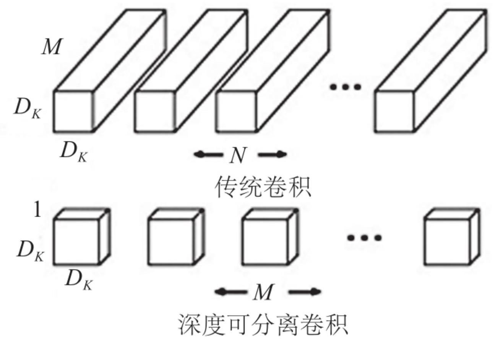
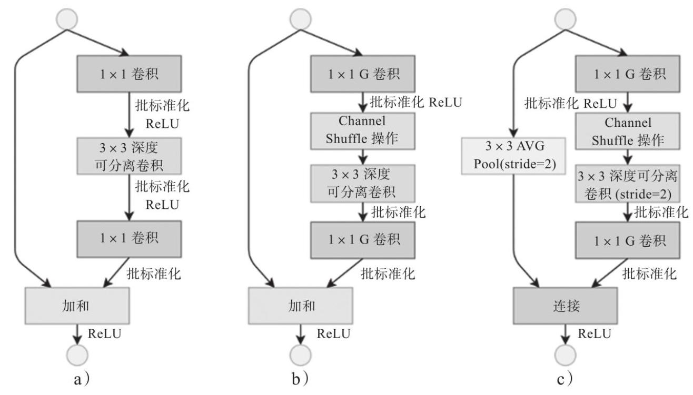
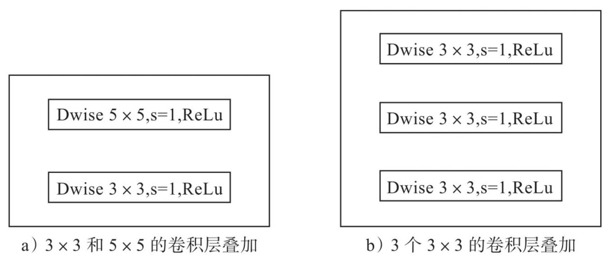
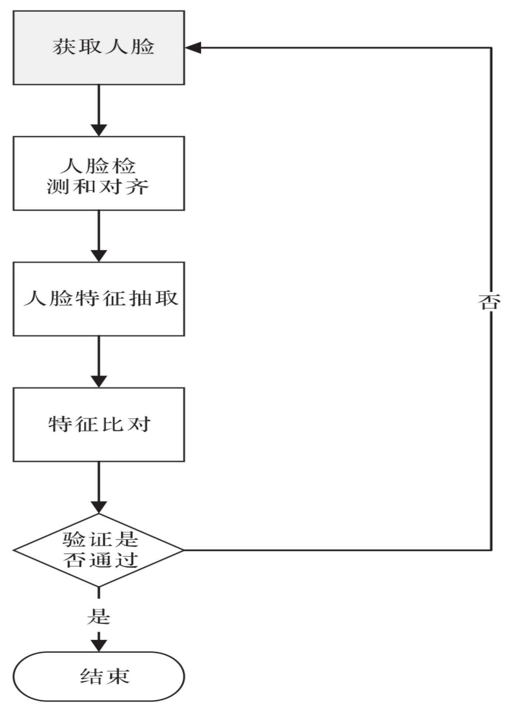
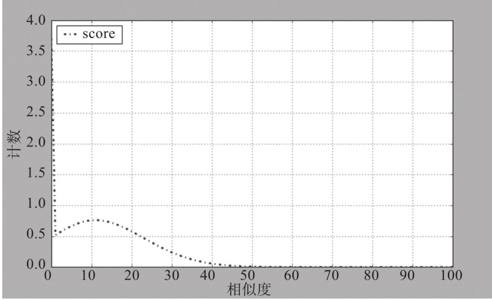
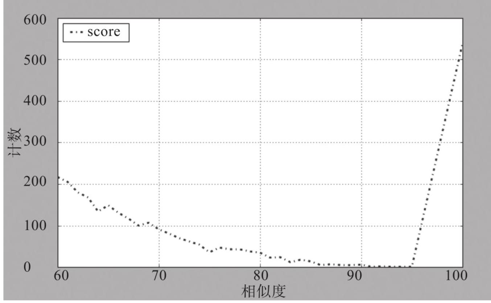

# 第6章 嵌入式人脸识别

嵌入式设备中的人脸精准识别技术

人脸识别技术是一项非常重要的身份授权技术。近年来，该技术越来越多地应用于基于ARM芯片的移动设备和嵌入式设备中，如设备解锁、应用登录、移动支付等。一些移动设备、嵌入式设备已经配置了人脸识别技术，比如智能手机解锁、高铁站入口闸机、社区人脸门禁等。

为了在有限的计算资源内获得更好的用户体验, 人脸识别模型需要在设备上进行本地化部署，这对模型的精度和性能提出了更高的要求。 然而现在高精度人脸识别算法模型都是基于深度神经网络实现的, 并且采用的大多是网络层次非常深、非常大的卷积神经网络，这种卷积神经网络模型对计算资源的要求非常高, 并不适合在大多数移动端和嵌入式设备上使用。

本章介绍嵌入式设备中的人脸识别技术，该技术在实际项目中取得了较好的效果。

## 6.1 嵌入式设备概述

随着硬件计算能力的快速发展，很多便携式嵌入式设备如手机、平板电脑和智能可穿戴设备在一些计算量大的任务中发挥着重要的作用。 以深度学习技术为代表的新一代人工智能技术，正在逐步渗透到越来越多的嵌入式设备中。本节主要介绍嵌入式人脸识别算法及应用。

### 6.1.1 嵌入式设备的由来

嵌入式系统是用来控制和处理外部世界各种中断信号的计算机系统， 嵌入式系统被定义为以应用为中心，以计算机技术为基础，软件和硬件可裁剪，适应应用系统对功能、可靠性、成本、体积、功耗严格要求的专用计算机系统。嵌入式系统是一种专用的计算机系统, 通常情况下，该系统只须实现特定的功能，开发者可根据实际需求对嵌入式系统的软硬件进行裁剪。

回顾嵌入式设备的发展，在20世纪90年代，嵌入式技术全面发展，至今已成为通信和消费类产品的共同发展方向。在通信领域，数字技术正在全面取代模拟技术。在广播电视领域，美国等国家已经开始由模拟电视向数字电视转变, DVB (Digital Video Broadcasting, 数字视频广播)技术在全球众多国家推广。DAB(Digital Audio Broadcasting， 数字音频广播)技术也已经进入商品化试播阶段。而软件、集成电路和新型元器件在产业发展中的作用日益重要。

上述产品都离不开嵌入式系统技术。在C端市场中，嵌入式产品主要作为移动的数据处理和通信软件。由于嵌入式设备具有自然的人机交

互界面, 以GUI (Graphical User Interface, 图形用户界面) 屏幕为中心的多媒体界面具有很好的亲和力。

嵌入式系统因专用性强、实时性强、可靠性高、成本功耗较低等优点，在诸多领域得到了广泛的研究与应用。随着网络化、信息化与智能化的快速发展，嵌入式系统将获得更广阔的发展空间，这也对嵌入式行业提出了更高的要求。

在未来，嵌入式系统将呈现以下发展趋势。

口嵌入式系统的开发是一个完整的系统工程，嵌入式系统开发商需要提供嵌入式软硬件系统之外，更为齐全的服务与支持。

口网络化与信息化的不断发展促使各种嵌入式设备不再局限于满足用户单一的需求，这对嵌入式系统的性能提出了更高的要求，其结构往往也更加复杂。

口在移动互联的发展趋势下，为了满足不同设备的通信需求，网络互联将成为嵌入式系统发展的必然趋势。

口激烈的竞争环境与技术的不断创新，促使研究者和开发者在实现系统功能的基础上不断精简系统，以减小设备体积、功耗和成本。

口科技的不断进步使用户对嵌入式系统的需求不断提高，友好易用的交互界面成为嵌入式系统不断追求的目标之一。

### 6.1.2 嵌入式设备的分类

嵌入式设备可以从核心处理器的角度分类，也可以从开发板种类的角度分类。

嵌入式处理器是整个系统硬件的核心，随着芯片技术的发展，目前研发出了不同类型的嵌入式处理器，在实际应用中常见的嵌入式处理器有以下几款。

□Intel公司推出的51单片机:属于精简指令集哈佛结构，具有8位字长，目前应用广泛。

☐Atmel公司推出的AVR单片机:属于精简指令集哈佛结构，按照字长分为8位、16位和32位，具有性能高、速度快、价格低和功耗低等特点。

口IBM公司推出的PowerPC处理器:属于精简指令集哈佛结构，具有功耗低和散热量低的特点，在嵌入式领域得到了广泛的应用。

□ARM公司推出的ARM处理器，按照字长分为32位和64位处理器。32 位处理器中大多数属于精简指令集哈佛结构，是比较流行的嵌入式处理器。

主流的嵌入式开发板包括以下几款。

#### 1. 树莓派

Raspberry Pi开发板由注册于英国的一家名为树莓派(Respberry Pi)的基金会主持开发，最早的产品于2012年由英国剑桥大学正式发售。由于其整体大小如信用卡一般，且包括了普通电脑具备的所有基本功能，尤其是搭配了基于ARM处理器的Linux系统和丰富的外部接口， 使得刚刚发布就受到众多嵌入式开发者的关注。

Raspberry Pi 3B+是该系列较新的一代产品，在同级别同价位的开发板中性价比较高，搭载1.4GHz的64位4核CPU，1 GB内存，内置蓝牙4.2 适配器和双频802.11 AC无线网卡。 此外, Raspberry Pi 3B+还具有4个USB接口、1个以太网接口和1个 HDMI接口，可以外接键盘、鼠标和显示器。主板上预留了摄像头接口，可与树莓派专用摄像头完美对接。Raspberry Pi 3B+可以安装 Ubuntu MATE 16.04系统。Ubuntu MATE 16.04以Python语言作为主要编程语言，基于Linux 32位操作系统开发。Raspberry Pi 3B+开发板非常适合作为人脸识别系统的无GPU嵌入式平台。

#### 2. Arduino

Arduino是一款简单易学且功能丰富的开源平台，于2005年由一个欧洲开发团队开发完成。它构建于Simple I/O，具有类Java、C语言的 Processing/Wiring开发环境。

Arduino主要包含两部分，一部分是用于电路连接的电路板；另一部分是Arduino IDE，即计算机中的程序开发环境。在IDE中编写程序，将程序上传到Arduino电路板后，程序便会告诉Arduino电路板要执行的任务。

Arduino硬件部分可以独立工作，也可以与外部硬件设备协同工作。比如利用Arduino配合各种传感器来感知环境，使用Arduino控制电机来驱动机械臂、机器人和无人机，还可以用Arduino来控制LED。

Arduino IDE软件是Arduino开发板的开发环境，Arduino开发语言基于 C/C++。

Arduino能通过各种传感器感知环境，通过控制灯光、电机等装置来反馈、影响环境。通过Arduino编写程序并编译成二进制文件，烧录进微控制器。对Arduino的编程是通过Arduino编程语言和Arduino开发环境来实现的。基于Arduino的项目, 可以只包含Arduino, 也可以包含 Arduino和其他一些在PC上运行的软件。

#### 3. 英特尔伽利略开发板

英特尔伽利略(Intel Galileo)开发板是基于英特尔架构、兼容Arduino 系列电路板的首款产品。该开发板对于新手设计师和希望不断提升水平的设计者, 都非常简单易用。

伽利略开发板同时具有英特尔技术的性能和Arduino软件开发环境的易用性，支持Arduino软件库的开源Linux操作系统，可扩展性强，可重复使用现有软件库的资源。伽利略开发板可以采用Mac OS、Windows 和Linux操作系统进行编程，也可以作为与Arduino生态系统兼容的软硬件产品。

伽利略开发板采用英特尔Quark系统芯片X1000。英特尔Quark具有功耗低、规格小的特点，扩展了英特尔架构的应用范畴，进入从物联网到可穿戴计算的高速发展领域。该芯片为32位单核单线程, 并且与奔腾指令集架构兼容，运行速度可高达400MHz。

为了超越Arduino生态系统，扩展原生应用及能力，英特尔伽利略开发板以标准化的方式, 支持多种计算行业标准I/O接口、 EHCI/OHCI USB主机端口、高速UART、RS-232串行端口、可编程 8MB NOR闪存，以及方便调试的JTAG端口。

英特尔伽利略开发板基于通用开源工具链，将Arduino集成开发环境的许多优势，与完整的、未经修改的Linux软件栈的软件开发工具和能力相结合，汇集在一个平台之上。英特尔伽利略开发板为快速开发简单交互式设计原型提供了实现途径。

## 6.2 轻量级人脸识别算法与嵌入式人脸识别应用

本节重点论述嵌入式设备中的轻量级人脸识别算法，并分门别类地讲述各类轻量级人脸识别算法的特点，以及嵌入式人脸识别技术的应用。

### 6.2.1 轻量级人脸识别算法

卷积神经网络(Convolutional Neural Network, CNN)可以解决现实场景中遇到的一些识别问题，并且已经应用于嵌入式设备、移动终端。 CNN虽然提升了识别精度，但其训练和预测效率并不高，这也是研究人员一直着力解决的问题。

提升CNN效率有两种处理方法，一种是针对原始模型进行模型压缩， 减少网络参数且不影响识别的精度，提升内存利用率，从而解决速度慢的问题；另一种方法是采用轻量化模型设计。

轻量化模型的主要思想是设计更高效的网络计算方法，比如改变卷积计算方式，达到减少网络参数又不损失网络性能的目的。近年来，轻量化CNN模型快速发展，一些非常有效的模型结构在实际应用中取得了很好的效果，比较经典的轻量化网络结果如SqueezeNet、 MobileNet、Xception、Shufflenet、NCNN等。

#### 1. SqueezeNet

2016年，Iandola提出了SqueezeNet轻量化网络，该网络借鉴了Inception 网络的设计思想, 通过Fire Module实现SqueezeNet网络的构建。 Fire Module由两部分构成—Squeeze层和Expand层。

Squeeze层为1×1卷积，卷积核的数目小于上一层特征映射数，这个操作已经被GoogleInception借鉴。Expand层为1×1和3×3卷积，在此之上再做Concat操作。该操作在Google Inception系列中也有应用。利用卷积层、Fire Module和池化层构建的SqueezeNet网络大小只有4.8MB, 却在 ImageNet上达到了相比AlexNet略优的57.5%的Top1分类精度。

2018年，Gholami基于SqueezeNet提出了改进版的SqueezeNext轻量化网络。该结构采用通道数减半的两层Squeeze对输入内容进行处理，然后通过3×1和1×3卷积搭配的低秩卷积核进行卷积，之后利用一个卷积层实现数据维度匹配。此外，SqueezeNext借鉴ResNet网络思想实现了 Shortcut连接，并通过硬件实验指导网络设计，其参数量相比 SqueezeNet有了明显下降，却实现了高达69.8%的Top1分类精度。

#### 2. MobileNet

Google团队2017年提出了MobileNet, 是一种专为移动端设计的网络模型。MobileNet的创新点在于以深度可分离卷积的卷积计算方式代替传统的卷积计算方式，能够大幅减少网络权值参数，从而提升网络计算的性能。深度可分离卷积在MobileNet中的应用让研究者们认识到这种卷积计算方式是非常有效的，进而推动了轻量化模型的发展。

标准卷积在MobileNet中被分成了两步。

第一步是逐通道卷积，一个卷积核只负责一个通道的计算，一个通道也只用一个卷积核进行滤波。

第二步是逐像素卷积，这一步将逐通道卷积计算出来的特征进行串联操作。每个特征映射的输出内容包含所有特征映射信息的输入层，这样的设计是不可能仅使用逐通道的卷积就完成的, 必须有卷积的像素来协助。

图6-1描述了Mobile-Net卷积计算方法，其中有 $M$ 个输入特征映射， $N$ 个输出特征映射。与传统卷积方式相比，相同数量的权值参数下，深度可分离卷积方式能够成倍减少卷积计算量, 大幅提升网络的计算性能。

图6-1 传统卷积和深度可分离卷积的对比

2018年，MobileNet第二版在第一版的基础上进行改进，使得准确度获得提升且保留了轻量级的特性，具体改进点体现在倒残差模块。

原先的残差模块是先用1×1的卷积对通道进行降维，再用3×3的卷积进行计算，然后使用1×1的卷积对通道进行升维。残差模块是先对通道进行降维，这样有助于减少3×3卷积的计算量，整个过程可概括为通道降维 $\rightarrow$ 普通卷积计算 $\rightarrow$ 通道升维。

MobileNet第二版则是通道升维 $\rightarrow$ 深度卷积计算 $\rightarrow$ 通道降维，这和残差模型对通道的处理相反，故取名为倒残差模块。该模块可以看作在深度可分离卷积的基础上，增加一个通道升维的步骤。

通道先进行升维是为了减少非线性激活的影响，卷积层后面通常有非线性的激活层，因此MobileNet第二版针对通道维数和非线性激活的关系进行大量实验, 对通道进行升维再通过非线性激活层提高模型的准确度。当倒残差模块最后一个卷积层用于降维时，不使用非线性激活函数而是改用线性激活函数，避免了非线性激活函数对通道维度数少造成信息损失，这些使得第二版的准确度比第一版有了大幅提升。

2019年MobileNet第三版诞生，主要改进以下方面。

口优化了耗费计算时间的层。

口使用Hard-Swish方法提升效率。

口扩展层使用的滤波器数量不同，并使用NetAdapt算法获得最佳数量。

口瓶颈层输出的通道数量不同，也采用NetAdapt算法获得最佳数量。

口使用压缩奖惩(Squeeze and Excitation, SE)模块缩减了通道数。

口对于SE模块，不再使用Sigmoid函数，而是采用ReLU6函数进行优化。

MobileNet第二版中，在全局平均池化层之前是一个1×1的卷积，将通道数从320扩展到1280，以此得到更高维度的特征，供分类器使用。这样做的好处是，有更多更丰富的特征用来满足预测，但同时也引入了额外的计算成本与延时。

在MobileNet第三版中，这个1×1卷积层位于全局平均池化层的后面， 由于可用于更小的特征图，所以MobileNet第三版速度更快。这样就能够删除前面的瓶颈层和深度分离卷积层，而不会降低准确性。

#### 3. Xception

Xception是谷歌对Inception第三版的改进网络，在Inception网络结构的基础上提出了一种假设, 即通道卷积与空间卷积是不相关的, 二者分开操作效果会更好。Xception包括36个卷积层、14个模块，使用深度可分离卷积来替换Inception第三版中的卷积模块，且加入残差学习的结构，除了第一个和最后一个模块，中间模块都有残差连接。

Xception网络与Inception网络极为相似，只是略有不同。前者首先执行通道空间卷积操作，每一次卷积操作之后加入批归一化和激活函数。 中间的模块采用残差直连结构，可以减少网络复杂性，在数据量很大的图像分类数据集上，训练效果显著优于Inception第三版。

深度可分离卷积分为逐通道卷积和逐像素卷积，首先将每个输入通道的特征通过3×3的卷积核进行计算，并将结果拼接起来，然后通过1×1 的卷积核来关联通道之间的特征。残差结构直接在输入层和输出层之间增加一个跳跃连接, 缓解了深层网络存在的梯度消失和信息丢失问题，提高了网络性能。

Xception网络的特征提取部分由36个卷积层构成，有14个模块，除去首尾两个模块，中间12个模块都加入残差连接。Xception引入深度可分离卷积和残差连接，深度可分离卷积可以减少模型参数量并保持高精确率, 残差连接可以解决梯度消失和信息丢失的问题。

#### 4. ShuffleNet

旷视Face++团队于2017年提出了ShuffleNet，与MobileNet一样发表于 CVPR-2017，较MobileNet晚两个月公开。ShuffleNet提出使用逐点分组卷积的方式提高卷积的运算效率，并引入通道混淆的概念，将各部分的特征映射通道打乱，再组成新的特征映射，目标是解决分组卷积导致的信息流通不畅的问题。与其他先进的网络模型相比，ShuffleNet在保证计算精度的同时, 大大降低了计算成本, 实现了较好的性能。

实际上，早在AlexNet网络模型中就已经使用了分组卷积，之后提出的 Xception和MobileNet等高效的神经网络模型在分组卷积的基础上，引入了深度可分离卷积。虽然模型的能力与计算量可以协调，但是模型中逐像素卷积的计算量比重较大，因此ShuffleNet结构中引入了像素级别的组卷积来减少1×1卷积操作所带来的计算复杂度。

虽然可以通过组卷积的方法将卷积操作限制在每个组内，降低模型的计算复杂度，但是当多个组卷积进行堆叠时，输出通道的特征信息仅来自其所在的一小部分输入通道，组内的输出仅与其组内的输入相关，无法获得其他组的信息，各组之间的信息不互通，阻碍了组内通道间的信息流动, 这样导致提取的特征缺乏广泛性, 在很大程度上影响模型的泛化能力和识别精度。

如果组卷积可以获得其他组的输入数据，也就是对于前一组生成的特征图，先把每组中的通道划分成几个子组，然后为下一层中每个组提供不同的子组, 那么输出的特征图就会包含其他组的特征信息。 ShuffleNet用Shuffle替换掉1×1卷积，这样可以大幅减少权值参数。 ShuffleNet源于ResNet的思想，从ResNet的瓶颈单元逐步演变得到 ShuffleNet的瓶颈单元，再使用ShuffleNet的瓶颈单元进行堆叠，从而获得ShuffleNet。

ShuffleNet提出了通道混合操作，具体来说，假设上一层卷积层共有 $g$ 组，输出有 $g \times  n$ 个通道，通道混合操作就是把输出通道维数设为 $\left( {g, n}\right)$ , 进行转置变成 $\left( {n, g}\right)$ ，再将其平分成 $g$ 组，作为下一层的输入。经过转置后的组卷积中包含其他组卷积的信息, 让通道之间的信息可以流动。

在经过逐点分组卷积以及通道混合操作之后，ShuffleNet引入残差块的设计原理，提出了ShuffleNet单元。在主分支瓶颈特征映射上，使用逐

点分组卷积后再进行通道混合操作，提高了不同组间的信息流动。为了降低计算量，采用计算量较小的3×3深度可分离卷积。紧接着经过一个1×1的逐点分组卷积，最后将两个分支像素相加。在分支部分增加了一个3×3的步长为2的平均池化操作，并且用通道串联代替逐像素相加。这样做的优点是仅用很小的计算成本就可以扩大通道维度。

图6-2展示了ShuffleNet单元演进的过程，图6-2a)是一个带有深度可分离卷积的瓶颈单元；图6-2b)在a)的基础上进行变化，将1×1卷积转换成1×1 G卷积，并在第一个1×1 G卷积之后增加一个Channel Shuffle操作；图6-2c)中增加AVG Pool用以减小特征映射的分辨率。由于分辨率变小了，最后不采用加和，而是进行连接操作，这样就能弥补分辨率减小而造成的信息损失。

图6-2 ShuffleNet单元的演进过程

为了改善ShuffleNet的缺陷，旷视Face++团队又提出了Shuffle-Net 2单元结构，ShuffleNet 2使用了一种新的运算，即通道分割技术，在开始时把输入的特征图在通道维度进行分割，分成两个分支，其中一个分支不变，做同等映射；另一个分支连续进行3个卷积，且输出和输入通道相同。用两个1×1普通卷积代替组卷积，两个分支相当于分成了两组。 两个分支输出的特征不再使用逐像素相加运算，而是将通道串联再输出结果, 并进行通道混合操作, 来保证两个分支之间的信息交流。

对于一个模块的通道串联和通道混合操作，实际上可以和下一个模块的通道分割合成一个元素级运算。对于下采样单元模块，不再使用通道分割操作，对于两个分支都是获取当前的输入，且每个分支都加入步长为2的下采样，再将两个输出通道串联在一起，这样输出的特征图空间大小减半。

#### 5. NCNN框架

腾讯的NCNN是一个优化的高性能神经网络前向计算框架，使得神经网络模型能够很方便地在移动端、嵌入式设备中进行部署和使用，无第三方依赖、跨平台，在移动终端和嵌入式设备上CPU的速度快于目前所有已知的开源框架。

基于NCNN, 开发者能够将MXNET、Caffe、TensorFlow等训练的神经网络模型转换成NCNN的算法模型，深度学习算法能够方便地移植到手机端执行，开发人工智能App。

NCNN目前已在腾讯多款应用中使用，如QQ、Qzone、微信、天天P图等。不断涌现出来的优秀的前端神经网络优化框架也从一个层面反映出前端设备对于人工智能的巨大需求。深度学习在移动设备、嵌入式设备上的应用将越来越广泛，前端设备智能化是一个极其重大的趋势，自动驾驶、智能制造、智慧城市、智慧社区等等都需要前端设备能够实现一定程度的智能化。基于ARM的神经网络优化框架使得人脸识别算法能够更轻松、更流畅地在移动终端、嵌入式设备中应用，神

经网络算法能够轻松地在前端设备上部署，并且大幅提升算法的执行性能。

### 6.2.2 嵌入式人脸识别应用

从日常生活中的应用来说，随着现代科技的发展，人脸识别已成为一种生活常态，不论是智能家居生活中门禁系统的人脸识别，还是现代交易时的“刷脸”支付，可以说人脸识别技术逐渐受到越来越多人的关注。

人脸识别系统的设计离不开单片机嵌入式系统。在软件的编程方面， 要在机器中进行人脸的识别和验证，需要通过十分复杂的算法，并配合与其相适应的指令，硬件才能实现刷脸功能。虽然人脸识别技术被人们普遍关注，但实际应用并不广泛，因为人们比较担心网络安全的问题。随着科技的进一步发展，其安全性将大大提升，这种现状会有所改变。

嵌入式人脸设备也可以成为边缘计算体系的一部分。随着5G商用的开展，越来越多的嵌入式设备接入互联网，组成了一个庞大的物联网。 随着应用的不断拓展，每年将产生海量的数据，大约40%的数据需要边缘计算服务。

边缘计算服务是指计算、存储等功能在本地平台实现并直接给边缘智能设备提供近端服务，而不是在云端平台进行处理后，再将结果传输给边缘智能设备。随着深度学习的发展，人脸识别算法在边缘设备中应用，实现设备人机协同的功能并不遥远。

从嵌入式系统与人工智能结合的发展角度来说，在实际生活中，人工智能涉及诸多学科，其应用的范围也比较广泛。人工智能的发展离不开人嵌入式系统的支持，可以说，二者之间具有十分密切的关联，甚至可以说是嵌入式系统的出现才开启了人工智能发展的进程。

人工智能的发展离不开嵌入式系统的支持，这也是当前业界划分“强人工智能”与“弱人工智能”的主要依据之一。“弱人工智能”是一种具有一定行为能力的智能化工具，这种“弱人工智能”是在MCU的基础上，通过应用嵌入式系统而实现的。

在互联网信息技术的支持下，单片机嵌入式系统的研发会越来越高效，这为人工智能的发展提供了更大的助力，从而引领人工智能的发展方向，推动人工智能技术更快速地发展，在更多领域得到应用，并更好地为我们的生活提供服务。

## 6.3 面向ARM的人脸精准识别方法VMFace

本节介绍作者团队设计的适用于ARM设备的VMFace人脸识别神经网络。

### 6.3.1 VMFace神经网络结构

MobileFaceNet是一个用于人脸识别的、非常适用于移动端和嵌入式设备的神经网络模型，在MobileNetV2的基础上用一个全局深度卷积层 (Global Depthwise Convolution, GDConv) 替换了原有的全局平均池化层，模型大小仅为4MB，并且在LFW(Labeled Faces in the Wild)和 Megaface两个人脸数据测试集上取得了非常不错的识别精度。

VMFace神经网络模型可以在不损失太多性能的情况下获得更高的识别精度。主要优化工作体现在两方面。

口加深网络层级，增加了瓶颈数目。

口替换了GDConv，并提出了GDConv模块，增强了网络的表示能力。

GDConv模块替换了MobileFaceNet中的Liner GDConv层，并且在最后一个瓶颈中增加了2次堆叠，模型深度较MobileFaceNet略有增加，能够在改善数据拟合能力的同时, 不明显增加计算量。GDConv模块的结构如图6-3所示，图6-3a)为3×3和5×5的卷积层叠加的块，图6-3b)为3个 3×3的卷积层叠加的块。

图6-3 GDConv模块

VMFace基于MS-Celeb-1M进行了训练，并且做了大量的对比实验，输入图片尺寸为112×112，选择LFW和VMTF两个数据集作为验证集，其中VMTF为作者团队自建的亚洲人脸验证集，包含3000对同一个人的照片和3000对不同人照片的验证，在性能没有太多损失的情况下，精度获得了提升。如表6-1所示，实验结果表明VMFace在识别精度上能够获得一定的提升效果。

表6-1 VMFace对比实验

<table><tr><td>网络</td><td>LFW Acc</td><td>VMTF Acc</td><td>Params</td><td>MAdds</td><td>速度</td></tr><tr><td>MobileFaceNet</td><td>99.55</td><td>93.79</td><td>0.99M</td><td>130M</td><td>36ms</td></tr><tr><td>VMFace-A</td><td>99.62</td><td>94.92</td><td>1.1M</td><td>140M</td><td>38ms</td></tr><tr><td>VMFace-B</td><td>99.65</td><td>95.10</td><td>1.1M</td><td>140M</td><td>38ms</td></tr></table>

### 6.3.2 VMFace在ARM环境的应用与性能分析

VMFace采用MXNET实现，为了移植到ARM环境中，采用了NCNN框架提供的转换工具，将训练好的MXNET网络模型转换为NCNN支持的模型文件，这样就很容易在ARM环境中部署。应用环境为瑞芯微的 RK3399, 操作系统采用Ubuntu 16.04。

VMFace采用MTCNN作为人脸检测技术基础，同样基于NCNN来实现，人脸识别流程如图6-4所示。人脸识别的全过程包括人脸检测和对齐、人脸特征抽取、特征比对。

图6-4 VMFace在ARM应用中人脸识别流程

在RK3399环境中，人脸识别应用VMFace算法可以在100ms内完成，实时性较强。利用100000规模的亚洲人脸对算法模型进行训练、调优, 实测效果较好。实测中发现，VMFace算法对于大角度或者光照鲁棒性不强, 影响识别效果。

特征比对中, 作者团队设计了一个Sigmoid函数, 实现特征向量余弦距离到相似度打分的转换。

$$
X = {20} \times  \left( {\text{ dist } - d}\right)
$$

$$
\text{ score } = {\mathrm{e}}^{\mathrm{X}}/\left( {1 + {\mathrm{e}}^{\mathrm{X}}}\right)
$$

其中dist为特征向量之间的余弦距离, 为不同人之间的分割线, 在实际应用中使用的是0.6, 能够使不同人获得比较好的区分性。

使用100000人脸证件照作为底库，5000人脸照片作为查询数据在底库中进行比对，从图6-5可以看到，相似度打分在50以后非常贴近横坐标轴线。图6-6展示了相似度打分在60分以上的比对结果，打分100的实际上命中的是与查询照片相同的照片数。

▲ 图6-5 5000人脸与底库比对结果

图6-6 5000人脸与底库比对结果细节图

## 本章小结

本章论述了作者团队自行研发设计的轻量级嵌入式人脸识别算法 VMFace。首先阐述嵌入式设备的特点和分类。然后介绍了现有的针对嵌入式设备的轻量级人脸识别算法，以作为后续性能对比的目标。最后介绍了面向ARM的人脸识别方法VMFace。第7章将介绍作者团队针对人体姿态识别技术的应用进行的实际测评。
