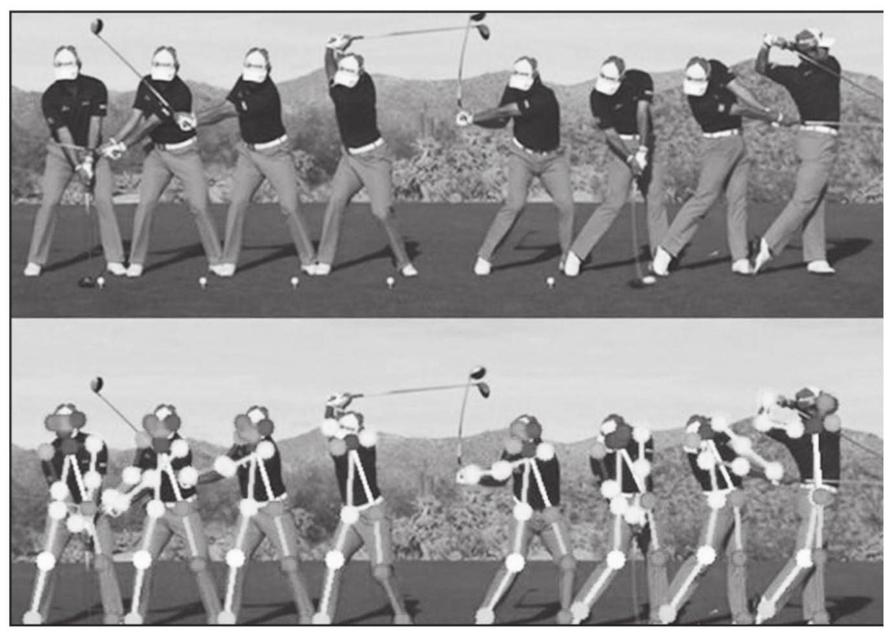
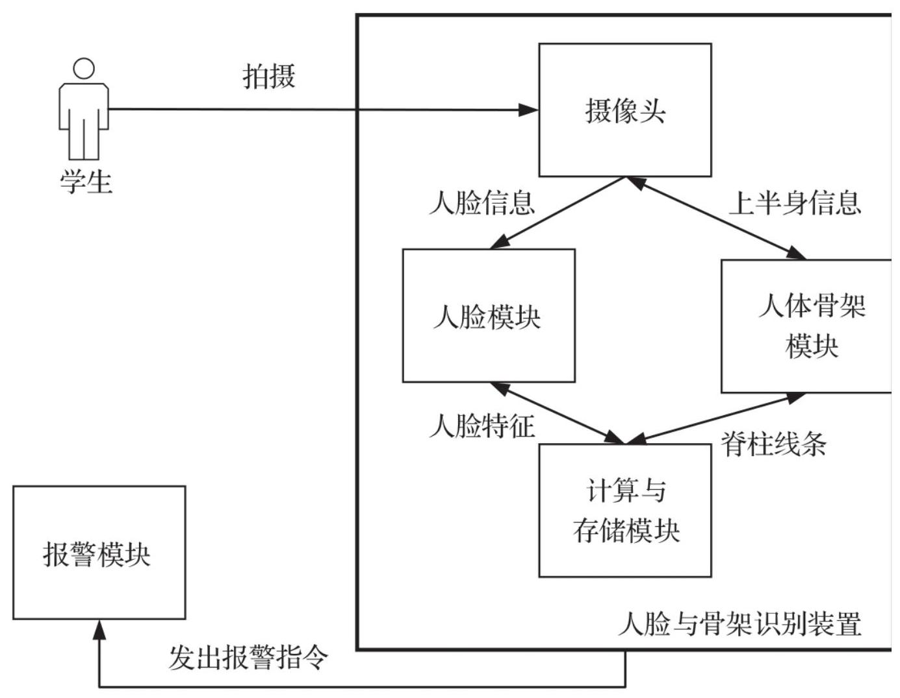
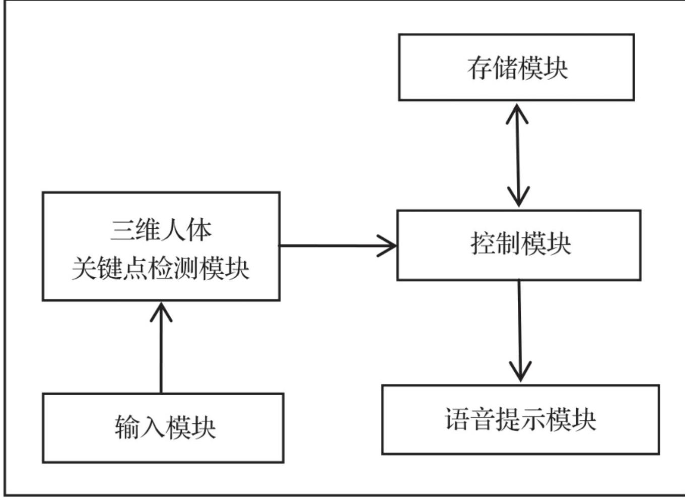

# 第9章 人体姿态识别技术的应用

人体姿势估计的研究目标是根据图像和视频等输入数据来定位人体部位并建立人体的表现形式。在过去的十年中，这项技术引发了非常多的关注，如今已被广泛用于包括人机交互、运动分析、增强现实和虚拟现实等领域。

在人体行为分析的发展过程中，研究人员攻克了很多技术上的难关， 并形成了一些经典算法, 但仍有很多尚未解决的问题。从研究的发展趋势来看，人体行为分析的研究正由采用单一特征、单一传感器向采用多特征、多传感器的方向发展。而人体姿态估计作为人体行为识别的一个重要特征，是进行人体行为分析的基础，是人体行为分析领域备受关注的研究方向之一。

## 9.1 运动训练场景应用

运动分析技术可以提取运动员的技术参数(如四肢关节位置、手臂摆动速度及角速度等)并加以分析，之后为该运动员制订更适合自身状况的训练计划。这对于开发运动员的潜能以及提升运动员的竞技水平有着重大的意义。

运动分析技术在医疗领域也有广泛的应用，对人体的正常步态进行建模, 可以为医学步态分析研究提供依据, 有助于通过生物反馈系统对病患进行步态方面的分析，在临床矫形等方面有很大的应用前景。

利用人体姿态识别技术可以在运动训练场景中对有特定要求的人体姿态进行识别与判断，从而进行辅助运动训练。

随着计算机技术的高速发展，人们已经开始结合虚拟现实等技术来实现科学的体育运动辅助训练，以此摆脱传统体育训练纯粹依靠经验的现状。人体姿态估计通过建立图像中人体特征和人体姿态的映射关系获取图像中的人的肢体部位在二维平面或三维空间里的位置、角度等信息。采用技术手段对运动姿势进行准确分析，是目前提高运动员竞技水平的重要手段之一。

### 9.1.1 算法分析

正确定位图像中的人体关键部位是进行动作识别和动作评价的关键所在，其中包括人体的动作理解与评价。不管是对动作的理解还是评价，都少不了对动作进行识别。动作识别的相关研究中，算法可以分为两个类别:模板匹配法和空间状态法。

模板匹配法就是将获取到的动作数据与事先准备好的动作数据进行匹配，看二者是否属于同一个或者同一类动作，关键在于判断动作的相似性。模板匹配法适用于复杂度不高的动作，在连续动作识别上可以采用隐马尔可夫方法。

空间状态法是将整段动作当作许多单一动作的集合，这些单一动作对应各自的空间状态，这些状态存在一定的关联。对动作进行评价的关键在于对提取到的人体姿态数据进行处理，因此设计一种合理的动作评价方法尤为重要。

#### 1. 模板匹配法

基于模板或样式进行匹配的方法有很多，例如样式匹配和动态匹配。 在匹配模式下，将待检测动作序列与事先建立的样式动作库遵从某种特定的时间秩序进行对比, 并且引入动作相似性对动作进行评价。

对于复杂动作，研究时不需要在意时间秩序，可以使用动态匹配的方法把待检测动作序列中任意时刻的动作拿来与样式动作库进行对比和分析。

动态匹配的复杂性在于很难获得好的运动模型样本，而且必须为每一个动作创立足够数量的模型样本，使得待检测动作序列能与模型样本集合进行正确的逐一匹配，最终得到最佳的动作匹配路线。

#### 2. 空间状态法

空间状态法的典型代表是隐马尔可夫模型，基于此模型可以对抓拍到的运动手势进行计算，得到手掌的质心与手掌面积。利用这两个数据可以建立隐马尔可夫模型，识别待检测的手部姿态，也可以在训练隐

马尔可夫模型之前就对动作序列中的关键动作进行提取，并为模型加入自学习能力。

### 9.1.2 案例介绍

本节介绍人体姿态识别技术在运动训练场景中的应用。

#### 1. 健身、体育和舞蹈

通过人体姿态识别技术，我们可以根据人体关键点信息分析人体姿态、运动轨迹、动作角度等，辅助运动员进行体育训练，分析健身锻炼效果，提升教学效率。通过摄像头捕捉和追踪人体在一段时间内的姿势变化，我们能够检测人体姿态是否达到预期的角度、幅度、速度, 检测人体运动动作并判断动作是否达标, 辅助健身锻炼、体育训练、康复训练等，如图9-1所示。

图9-1 利用人体姿态识别辅助高尔夫动作训练

#### 2. 运动捕捉和增强现实

人体姿态估计的一个有趣应用是CGI (Computer Graphic Image, 电脑生成图像)。如果可以检测出人体姿态，那么图形、风格、特效增强、设备和艺术造型等就可以被加载在人体上。通过追踪人体姿态的变化，使渲染图形在人体移动的时候“自然”地与人“融合”。

传统的机器人动作设计都是通过人工为机器人编程的。利用运动捕捉技术，可以让机器人跟随一个做特定动作的人体骨架，教练可以仅演示特定的动作，教机器人学习这一动作。机器人通过计算如何移动关节，来执行相同的动作。

## 9.2 姿态纠正应用

利用基于视频分析的人体姿态识别可以对特定场景中的人体姿态进行识别, 并针对场景要求, 对不正确的姿态进行提醒和纠正。

### 9.2.1 坐姿纠正应用

在当今社会，工作压力越来越大，上班族中患颈椎病的人越来越多， 学生人群中这一比例也在激增。导致这些病症的主要因素便是长期坐姿不当。对于坐姿的检测具有重要的研究意义，通过人体姿态识别技术可以进行不正确坐姿姿态的识别及提醒。

坐姿纠正应用架构如图9-2所示。

图9-2 坐姿纠正应用的架构

坐姿纠正的模块构成如下。

口摄像头及其连接线:用于拍摄人体并传输至后端处理模块。

口目标检测模块:用于检测人体目标并判定是否为上半身。

口骨架提取模块:用于针对上半身提取左肩-右肩一线关键点和脊柱关键点。

口比较计算模块:用于将提取的骨架与标准的坐姿骨架进行比较，计算坐姿是否正确。 坐姿判断过程如下。

1)学生通过人脸与骨架识别装置进行注册，填入姓名、学号、身高等信息，通过摄像头拍照后，记录人脸，并将基本信息与人脸信息存入人脸与骨架识别装置。

2)目标检测模块检测目标是否为人体上半身。

3)若检测到上半身，则将左肩-右肩一线提取4个骨骼关键点，分别是左肩点、左锁骨点、右锁骨点和右肩点。通过这4个点连线构成肩部的骨骼线，然后沿脊柱由上至下以均匀距离提取4个关键点，这4个关键点构成脊柱的骨骼线。

坐姿不正确的判定过程如下。

1)若肩部骨骼线与标准的肩部骨骼线倾角大于预设值θ，则直接判定为不正确坐姿。

2)若肩部骨骼线与标准的肩部骨骼线倾角在0～θ之间，需要进一步判断。计算脊柱骨骼线4个关键点中距离标准脊柱骨骼线最远的一个，设为 $G$ 点。若 $G$ 点距离标准脊柱骨骼线距离大于预设值 $L$ ，则判定为坐姿不正确。

### 9.2.2 演讲姿态纠正应用

很多人在公众演讲时会有多余的小动作，影响整体的演讲效果。为了克服这种不利影响，人们通常反复观看录像进行刻意训练或者请专业的指导教练在旁监督。前一种仅凭录像进行自我学习的效率太低，后一种由于高昂的费用，很难普及。

利用人体姿态识别技术可以帮助演讲者改进姿态。针对演讲纠正姿态的需求，可以设计一种基于三维人体关键点检测演讲者肢体动作的智能系统，框架如图9-3所示，功能模块如下。

口输入模块:获取深度信息的摄像头装置，如双目摄像头或者RGB-D 摄像机等，用于获取带深度信息的视频流。

口一台至少带一块GPU的高性能主机，主机本体包括:三维人体关键点检测模块，用于检测人体三维关键点信号；控制模块和存储模块， 存储模块用于存储用户预设的三维人体关键点数据，控制模块用于将检测到的人体三维关键点信号和预设的三维人体关键点数据进行比对。

口语音提示模块:可选择任意一款可连接主机的音箱，用于将比对结果通过语音提示的方式告知用户。

图9-3 演讲姿态纠正应用框架

演讲者姿态改进的算法流程如下。

1)初始化三维人体关键点检测模块，获取用户设定的三维人体关键点数据，并保存至存储模块的关键点数据库中。同时给每一种预设的人体三维关键点添加一段描述语，用于后续的语音提示。

2)三维人体关键点检测模块检测人体三维关键点信号，并将人体三维关键点信号输入到控制模块中，控制模块在存储模块预设的人体三维关键点数据库中查找并一一比对，若与某一预设人体三维关键点的差异小于指定阈值，则认为比对成功，获取此种预设模块的人体三维关键点描述语，进入下一步；否则跳过，重复本步骤。

3)语言提示模块接收控制模块发送的关键点描述语，进行语音播报提示并返回上一步。

## 9.3 安防应用

安防监控的关键在于对监控视频的结构化处理，以便于对人员进行检索和布控，同时也可以使用本系统实现实时监测并定位人体，判断特殊时段、核心区域是否有人员入侵、异常奔跑、人群聚集等异常行为，社区、园区、厂房、门店、楼道、电梯等重点区域，检测人员摔倒、打斗等行为，及时预警管控，增强安保和监控力度，避免发生安全事故。

利用人体姿态识别以及视频结构化技术可以对行人或被监控人员进行动作跟踪、特征提取，并实时识别发型、年龄、性别、种族、是否戴帽、是否背包、上衣类型与颜色、裤子类型与颜色等属性。

在检测到行人特征之后，即可实现行人的特征检索，可以进行临近摄像机的视频检索，还可以自动识别人体关键点，通过关键点描述人体骨骼信息，以此来判别动作类型。

### 9.3.1 安防应用背景

在安防领域，人体姿态识别技术可广泛用于智能监控、远距离身份识别、计算机人体行为分析等领域。相对于指纹识别、人脸识别、语音识别等生物特征识别技术，人体姿态识别有着非侵犯性和非接触性、 难于隐藏和伪装、易于采集、可远距离识别等优点，具有重要的研究意义和实用价值。

在智能监控系统中对运动的目标进行辨识，首先需要实现运动目标的检测，目标检测是最基础的算法。在实际应用中，一些简单且在多个目标中不需要分辨每个目标的异常运动的检测，可以直接根据运动目标检测的结果进行判断。

对于较为复杂的情况，例如有多个人进入视野的时候，不仅需要检测出每个人，还要分辨出他们是谁。

### 9.3.2 算法分析

#### 1. 目标检测算法

目标检测的流程是，首先对视频序列进行灰度处理。然后建立背景模型, 并对其进行更新。接着用每帧图像和背景的GBR值相减, 如果结果的绝对值大于阈值，则认为是前景中的待确认目标，进而得到一个包含目标和噪声的二值图像。之后对二值图像进行开运算，以去除小噪点并断开粘连。接下来去除一些不规则区域，如小面积区域、细长条区域等。最后检测阴影，如果存在阴影，将其去除便可得到无干扰的目标区域。

#### 2. 目标跟踪算法

进行目标跟踪可采用粒子滤波跟踪算法。粒子滤波算法的核心思想是利用一组带有权值的粒子近似表示某时刻目标状态的后验概率，每一个粒子代表目标的一个假设状态, 用一个与目标区域一致的特定形状 (圆形、椭圆形、矩形等)表示对应粒子的离散采样概率。

当粒子数足够多时, 这种对目标状态的后验离散加权估计可以接近贝叶斯最优解, 能够解决动态系统的状态估计问题。粒子区域的颜色分布与目标颜色分布越相似，权值越大，反之越小。

#### 3. 异常姿态识别算法

人以正常姿态行进时，检测得到的人体区域面积会发生变化，可以采用面积变化率来表示。面积变化率是指一段时间内面积的方差和面积均值之比。若面积变化率在正常步态范围内且高宽比满足人体正常行进的比例, 则认为是正常姿态, 否则根据高宽比来判断属于哪一种异常姿态。

## 9.4 虚拟现实应用

人体姿态识别的另一项重要应用就是结合当前比较热门的虚拟现实应用，将人体姿态传递至虚拟现实，从而进行虚拟人物的动作控制。

### 9.4.1 虚拟现实应用背景

目前，各个国家对于虚拟现实的研究与开发都有不同侧重。美国作为虚拟现实(Virtual Reality, VR)技术的发源地，目前的研究内容包括用户界面和后台运行等虚拟平台的设计，主要目的是加强用户在虚拟现实游戏中的体验。英国的虚拟现实研究更多关注将虚拟现实技术与实际生活中的需求相结合，以完成更多的实际任务，如工业设计、可视化座舱、桌面VR等，也就是扩大虚拟现实技术在实际中的应用范围和场景。在日本，动作识别技术如手势识别、面部表情识别等常与虚拟现实场景结合起来应用于虚拟现实知识库和虚拟游戏的开发中。

人体识别技术不断取得新的成果，如何将快速发展的人体识别技术与虚拟现实的交互结合起来, 对于虚拟现实技术的发展是至关重要的。

动作识别技术可以分为静态识别和动态识别两种。静态识别是指当前时刻人体的形体特征所表现的意义，例如图像静态识别涉及的空间分割，从分割的区域中提取有意义的信息，利用模式识别技术进行区分。动态识别表示动作时间序列在时间轴中提取的运动信息，需要确定时间序列中某种动作的开始帧和结束帧。

### 算法分析

在搭建好的虚拟现实平台中主要完成动作分割与动作识别两个任务。 动作分割算法对骨架数据进行分割，以此时间为基准，确定图像数据的开始和结束时间，最后得到连续独立片段的骨架数据和彩色图像。 动作识别算法根据贝叶斯算法和数据校正技术来判别动作片段的类别。

#### 1. 动作分割

动作分割是一个必不可少的步骤, 对于后续姿态识别的性能有一定的影响。动作分割一般在姿态识别之前完成，从连续的动作流中确定动作的开始帧和结束帧。在整个虚拟现实的交互平台中加入对动作的分割，不仅可以将连续的动作序列分割为独立的动作片段，还大大简化了动作识别的难度。对于动作的分割，目前常用的两种方法是动作边界检测和滑动窗口方法。

动作边界检测主要是通过检测连续动作中设定的速度和加速度等运动量数值的断点、极大值或者极小值判断动作的边界, 依照此边界分割连续的数据。

滑动窗口方法的主要思想是将数据时间序列分割为多个局部重叠的数据片段，通过分类器在多个片段上进行计算，选取得分最高的数据序列作为动作的位置。这种动作分割方法需要人工预先分类的数据进行分类器的训练。在实际运用时，基于人体关节点特征数据，利用骨架特征分割技术对两种数据进行分割，这样做是因为图像中的时空兴趣点特征对动作分割算法不敏感，不能很好地判断动作的时间断点，并且骨架特征比兴趣点特征的计算量小。

对于整个虚拟训练过程来说, 每个动作执行完成后, 都需要时间间隙等待平台的信息反馈，动静状态边界分明，而且在交互结束时，人的行为姿态一般会以几种固有的姿态作为结束。

#### 2. 连续动作识别

连续动作识别由独立系统的识别和决策组成，是整个虚拟现实交互设计的核心。虚拟现实的交互平台要确保此交互系统的实时性，对于人体的骨架信息，首先进行数据的预处理，去除骨架数据中的突变信息点，然后进行骨架特征的提取，将骨架的全局特征和局部特征进行融合。

在时空域施加兴趣点检测器，检测时空域中在时间和空间中灰度值明显变化的点。原始的时空兴趣点由于背景噪声的干扰，具有很多错判的时空兴趣点，利用矫正模型将其剔除，再基于兴趣点及其邻域内的特征进行描述, 并使用K-means模型进行特征的提炼和简化, 使用模板匹配的方法得到识别结果。

基于骨架特征的姿态识别系统在骨架无误的情况下拥有较高的准确率，区分性强且能解决人体姿态识别时动作长短不一的问题。基于局部特征的姿态识别在骨架发生错乱时对姿态识别有较好的识别能力, 稳定性强且对场景中人与物的交互细节信息进行补充。利用贝叶斯算法进行初步融合之后，根据人体动作的某种特定顺序的规律对识别结果进行修正, 以实现优化识别效果。

## 9.5 其他应用场景

#### 1. 射击辅助训练

利用基于视频分析的人体姿态识别技术可以对射击训练中的射击姿态进行评估与纠正。

按照人体模型，对人体立姿射击姿态进行简化，按照人体基本几何比例等参数，建立力学结构中的多刚体铰接系统，模拟人体立姿射击。 基于人体各个关节的自由度参数建立系统约束条件的假定和分析, 建立系统的力学方程。运用仿真软件进行建模和仿真，对立姿射击姿态进行完整建模。通过对立姿射击姿态的仿真，研究人体立姿射击姿态的力学特性，找出提高立姿射击姿态稳定性和命中率的技巧。

#### 2. 智慧养老

利用人体姿态识别技术可以实现老人跌倒检测、老人活动量分析，进而分析老人的精神状态、身体变化趋势等。

#### 3. 智能交通

人体姿态识别技术在智能交通中也得到了广泛的应用，例如可以在路口斑马线检测到行人时，语音提醒行人和车辆注意安全；对行人闯红灯行为进行抓拍，动态管控行人通行等。

#### 4. 娱乐互动

对于视频直播平台、线下互动大屏幕等场景，可基于人体检测和关键点分析，增加身体道具、体感游戏等互动形式，丰富娱乐体验。

## 本章小结

本章主要介绍人体姿态识别技术在各类场景中的应用，主要包括运动训练、姿态纠正、安防以及虚拟现实，每种场景都进行了相关算法的分析和应用场景的描述，能够给读者应用人体姿态识别技术提供参考。第10章将对机器视觉在人体识别中的应用进行总结与展望。
