<a id="isbn9787302503880_1_3"></a>

# 第3章  运算符与表达式

**（


 视频讲解：64分钟）**

在进行数学运算或逻辑判断时，需要应用算术运算符、比较运算符，以及逻辑运算符等。因此，在Python中也提供了这些运算符。另外，Python还提供了一个可以根据条件确定返回值的条件表达式。这些内容都是Python开发必备的基础知识，需要读者掌握。

本章将先对Python中的运算符进行详细讲解，然后再介绍运算符的优先级，最后介绍Python中的条件表达式。

通过阅读本章，您可以：


 掌握如何应用Python中的算术运算符


 掌握Python中的赋值运算符的用法


 掌握Python中比较（关系）运算符的应用


 掌握如何应用Python中的逻辑运算符


 了解Python中的位运算符的用法


 了解各个运算符之间的优先级


 掌握条件表达式的应用

<a id="isbn9787302503880_1_3_1_1"></a>

## 3.1 运算符

运算符是一些特殊的符号，主要用于数学计算、比较大小和逻辑运算等。Python的运算符主要包括算术运算符、赋值运算符、比较（关系）运算符、逻辑运算符和位运算符。使用运算符将不同类型的数据按照一定的规则连接起来的式子，称为表达式。例如，使用算术运算符连接起来的式子称为算术表达式，使用逻辑运算符连接起来的式子称为逻辑表达式。下面将对一些常用的运算符进行介绍。

<a id="isbn9787302503880_1_3_1_1_1"></a>

### 3.1.1 算术运算符

算术运算符号是处理四则运算的符号，在数字的处理中应用得最多。常用的算术操作符如表3.1所示。

**表3.1 算术运算符**

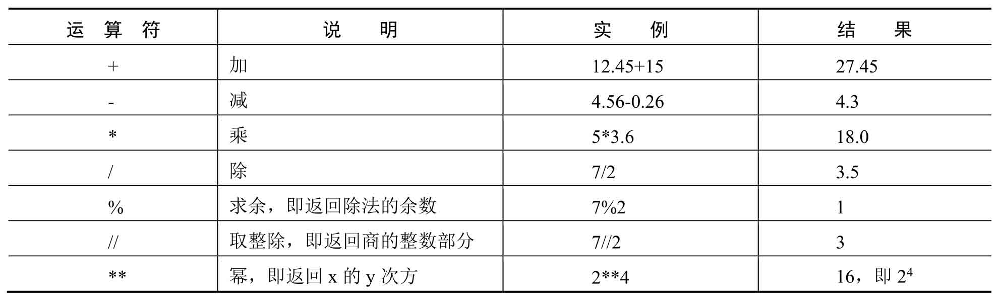

**说明**

在算术操作符中使用%求余，如果除数（第二个操作数）是负数，那么取得的结果也是一个负值。

**注意**

使用除法（/或//）运算符和求余运算符时，除数不能为0，否则将会出现异常，如图3.1所示。

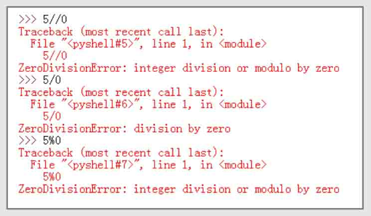

*图3.1 除数为0时出现的错误提示*

**【例3.1】** 计算学生成绩的分差及平均分。**（实例位置：资源包\\TM\\sl\\03\\01）**

某学员3门课程成绩如图3.2所示，编程实现：


 Python课程和English课程的分数之差；


 3门课程的平均分。

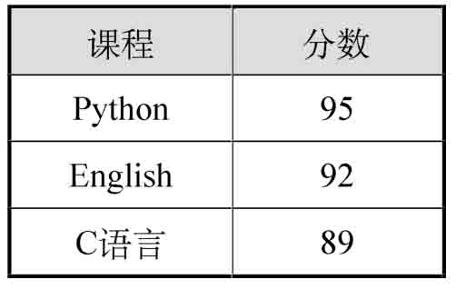

*图3.2 某学员的成绩表*

在IDLE中创建一个名称为score\_handle.py的文件，然后在该文件中，首先定义3个变量，用于存储各门课程的分数，然后应用减法运算符计算分数差，再应用加法运算符和除法运算符计算平均成绩，最后输出计算结果。代码如下：

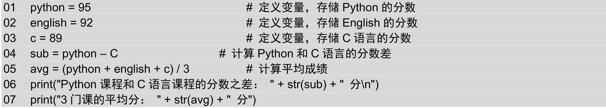

运行结果如图3.3所示。

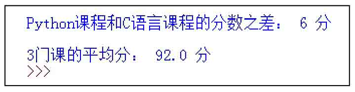

*图3.3 计算学生成绩的分数差及平均分*

**说明**

在Python 2.x中，除法运算符（/）的执行结果与Python 3.x不一样。在Python 2.x中，如果操作数为整数，则结果也将截取为整数。而在Python 3.x中，结果为浮点数。例如，7/2，在Python 2.x中结果为3，而在Python 3.x中结果为3.5。

<a id="isbn9787302503880_1_3_1_1_2"></a>

### 3.1.2 赋值运算符

赋值运算符主要用来为变量等赋值。使用时，可以直接把基本赋值运算符“=”右边的值赋给左边的变量，也可以进行某些运算后再赋值给左边的变量。在Python中常用的赋值运算符如表3.2所示。

**表3.2 常用的赋值运算符**

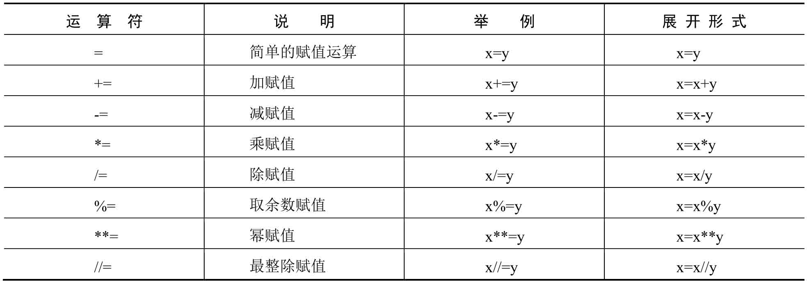

**注意**

混淆“=”和“==”是编程中最常见的错误之一。很多语言（而不只是Python）都使用了这两个符号，另外每天都有很多程序员用错这两个符号。

<a id="isbn9787302503880_1_3_1_1_3"></a>

### 3.1.3 比较（关系）运算符

比较运算符，也称为关系运算符。用于对变量或表达式的结果进行大小、真假等比较，如果比较结果为真，则返回True，如果为假，则返回False。比较运算符通常用在条件语句中作为判断的依据。Python中的比较运算符如表3.3所示。

**表3.3 Python的比较运算符**

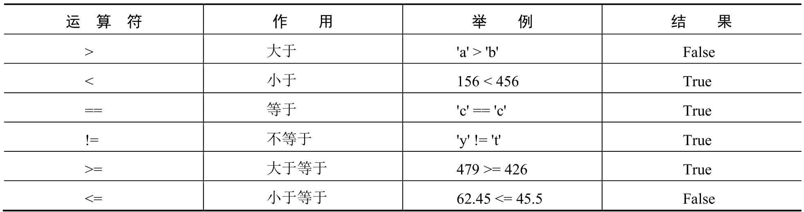

**【例3.2】** 使用比较运算符比较大小关系。**（实例位置：资源包\\TM\\sl\\03\\02）**

在IDLE中创建一个名称为comparison\_operator.py的文件，然后在该文件中定义3个变量，并分别使用Python中的各种比较运算符对它们的大小关系进行比较，代码如下：

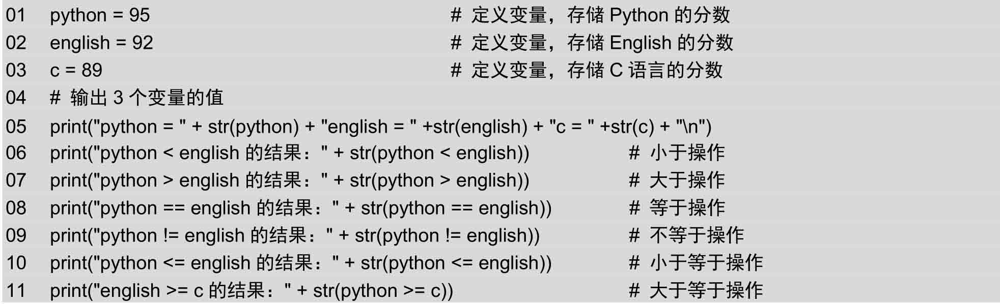

运行结果如图3.4所示。

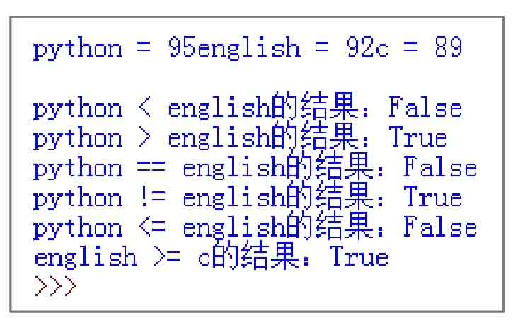

*图3.4 使用关系运算符比较大小关系*

<a id="isbn9787302503880_1_3_1_1_4"></a>

### 3.1.4 逻辑运算符

假定某面包店，在每周二的下午7点至8点和每周六的下午5点至6点，对生日蛋糕商品进行折扣让利活动，那么想参加折扣活动的顾客，就要在时间上满足“周二并且7:00 PM~8:00 PM”或者“周六并且5:00 PM~6:00 PM”，这里就用到了逻辑关系，Python中也提供了这样的逻辑运算符来进行逻辑运算。

逻辑运算符是对真和假两种布尔值进行运算，运算后的结果仍是一个布尔值，Python中的逻辑运算符主要包括and（逻辑与）、or（逻辑或）、not（逻辑非）。表3.4列出了逻辑运算符的用法和说明。

使用逻辑运算符进行逻辑运算时，其运算结果如表3.5所示。

**表3.4 逻辑运算符**

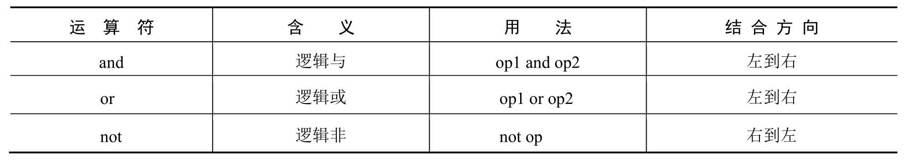

**表3.5 使用逻辑运算符进行逻辑运算的结果**

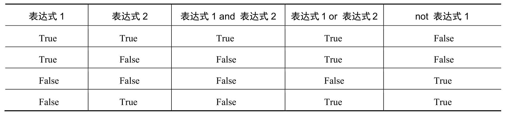

**【例3.3】** 参加面包店的打折活动。**（实例位置：资源包\\TM\\sl\\03\\03）**

在IDLE中创建一个名称为sale.py的文件，然后在该文件中使用代码实现3.1.4节开始描述的场景，代码如下：

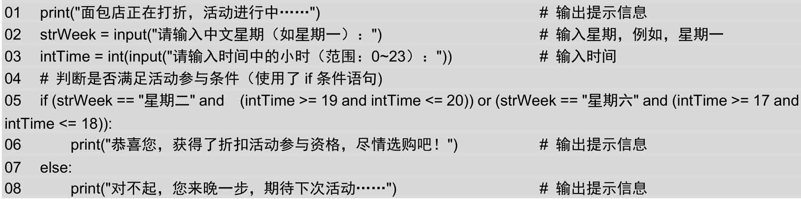

**说明**

（1）第2行代码中，input()方法用于接收用户输入的字符序列。

（2）第3行代码中，由于input()方法返回的结果为字符串类型，所以需要进行类型转换。

（3）第5行和第7行代码使用了if…else条件判断语句，该语句主要用来判断是否满足某种条件，该语句将在第4章进行详细讲解，这里只需要了解即可。

（4）第5行代码中对条件进行判断时，使用了逻辑运算符and、or和关系运算符==、&gt;=、&lt;=。

按快捷键F5运行实例，首先输入星期为“星期一”，然后输入时间为8，将显示如图3.5所示的结果，再次运行程序，输入星期为“星期六”，时间为18，将显示如图3.6所示的结果。

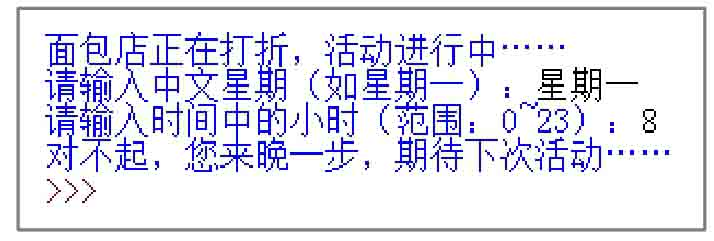

*图3.5 符合条件的运行效果*

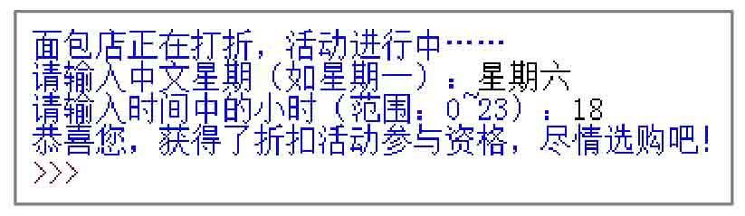

*图3.6 不符合条件的运行效果*

**说明**

本实例未对输入错误信息进行校验，所以为保证程序的正确性，请输入合法的星期和时间。另外，有兴趣的读者可以自己试着添加校验功能。

<a id="isbn9787302503880_1_3_1_1_5"></a>

### 3.1.5 位运算符

位运算符是把数字看作二进制数来进行计算的，因此，需要先将要执行运算的数据转换为二进制，然后才能执行运算。Python中的位运算符有按位与（&）、按位或（｜）、按位异或（^）、按位取反（~）、左移位（&lt;&lt;）和右移位（&gt;&gt;）运算符。

**说明**

整型数据在内存中以二进制的形式表示，如整型变量7的32位二进制表示是00000000 00000000 00000000 00000111，其中，左边最高位是符号位，最高位是0表示正数，若为1则表示负数。负数采用补码表示，如−7的32位二进制表示为11111111 11111111 11111111 11111001。

<a id="isbn9787302503880_1_3_1_1_5_1"></a>

#### 1．“按位与”运算

“按位与”运算的运算符为“&”，它的运算法则是：两个操作数据的二进制表示，只有对应位都是1时，结果位才是1，否则为0。如果两个操作数的精度不同，则结果的精度与精度高的操作数相同，如图3.7所示。

<a id="isbn9787302503880_1_3_1_1_5_2"></a>

#### 2．“按位或”运算

“按位或”运算的运算符为“\|”，它的运算法则是：两个操作数据的二进制表示，只有对应位都是0，结果位才是0，否则为1。如果两个操作数的精度不同，则结果的精度与精度高的操作数相同，如图3.8所示。

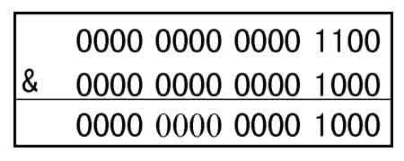

*图3.7 12&8的运算过程*

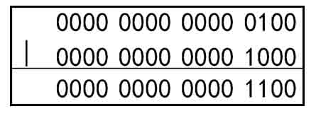

*图3.8 4\|8的运算过程*

<a id="isbn9787302503880_1_3_1_1_5_3"></a>

#### 3．“按位异或”运算

“按位异或”运算的运算符是“^”，它的运算法则是：当两个操作数的二进制表示相同（同时为0或同时为1）时，结果为0，否则为1。若两个操作数的精度不同，则结果数的精度与精度高的操作数相同，如图3.9所示。

<a id="isbn9787302503880_1_3_1_1_5_4"></a>

#### 4．“按位取反”运算

“按位取反”运算也称“按位非”运算，运算符为“~”。“按位取反”运算就是将操作数对应二进制中的1修改为0，0修改为1，如图3.10所示。

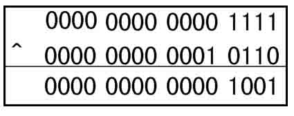

*图3.9 31^22的运算过程*

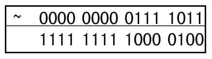

*图3.10 ~123的运算过程*

在Python中使用print()函数输出图3.7~图3.10的运算结果，代码如下：

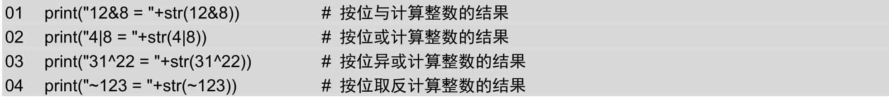

运算结果如图3.11所示。

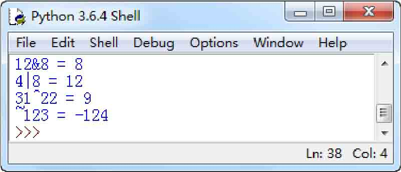

*图3.11 图3.7～图3.10的运算结果*

<a id="isbn9787302503880_1_3_1_1_5_5"></a>

#### 5．左移位运算符&lt;&lt;

左移位运算符&lt;&lt;是将一个二进制操作数向左移动指定的位数，左边（高位端）溢出的位被丢弃，右边（低位端）的空位用0补充。左移位运算相当于乘以2*<sup>n</sup>* 。

例如，int类型数据48对应的二进制数为00110000，将其左移1位，根据左移位运算符的运算规则可以得出(00110000&lt;&lt;1)=01100000，所以转换为十进制数就是96（48×2）；将其左移2位，根据左移位运算符的运算规则可以得出(00110000&lt;&lt;2)=11000000，所以转换为十进制数就是192（48×2<sup>2</sup> ），其执行过程如图3.12所示。

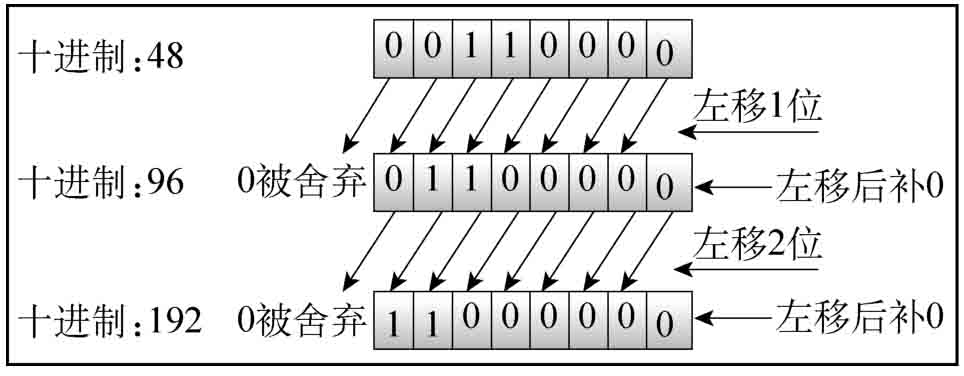

*图3.12 左移位运算*

<a id="isbn9787302503880_1_3_1_1_5_6"></a>

#### 6．右移位运算符&gt;&gt;

右移位运算符&gt;&gt;是将一个二进制操作数向右移动指定的位数，右边（低位端）溢出的位被丢弃，而在填充左边（高位端）的空位时，如果最高位是0（正数），左侧空位填入0；如果最高位是1（负数），左侧空位填入1。右移位运算相当于除以2*<sup>n</sup>* 。

正数48右移1位的运算过程如图3.13所示。

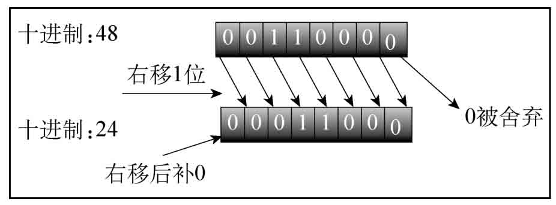

*图3.13 正数的右移位运算过程*

负数−80右移2位的运算过程如图3.14所示。

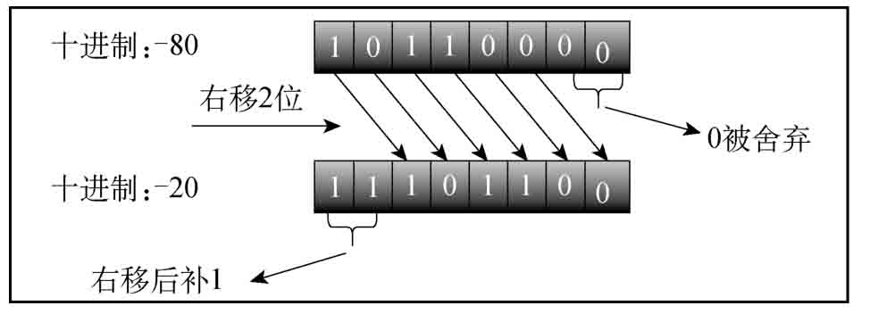

*图3.14 负数的右移位运算过程*

**说明**

由于移位运算的速度很快，在程序中遇到表达式乘以或除以2*<sup>n</sup>* 的情况时，一般采用移位运算来代替。

**【例3.4】** 使用位移运算符对密码进行加密。**（实例位置：资源包\\TM\\sl\\03\\04）**

在IDLE中创建一个名称为encryption.py的文件，然后在该文件中定义两个变量，一个用于保存密码，一个用于保存加密参数，然后应用左移位运算符实现加密，并输出结果，最后应用右移位运算符实现解密，并输出结果，代码如下：

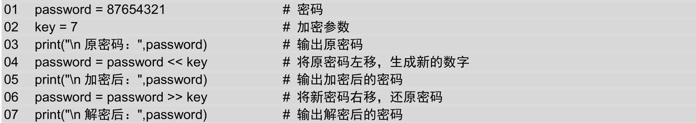

运行上面的代码，将显示如图3.15所示的运行结果。

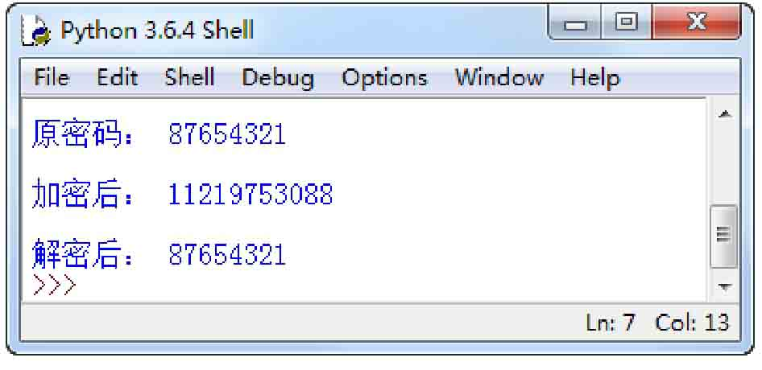

*图3.15 对密码进行加密和解密的结果*

<a id="isbn9787302503880_1_3_1_2"></a>

## 3.2 运算符的优先级

所谓运算符的优先级，是指在应用中哪一个运算符先计算，哪一个后计算，与数学的四则运算应遵循的“先乘除，后加减”是一个道理。

Python的运算符的运算规则是：优先级高的运算先执行，优先级低的运算后执行，同一优先级的操作按照从左到右的顺序进行。也可以像四则运算那样使用小括号，括号内的运算最先执行。表3.6按从高到低的顺序列出了运算符的优先级。同一行中的运算符具有相同优先级，此时它们的结合方向决定求值顺序。

**表3.6 运算符的优先级**

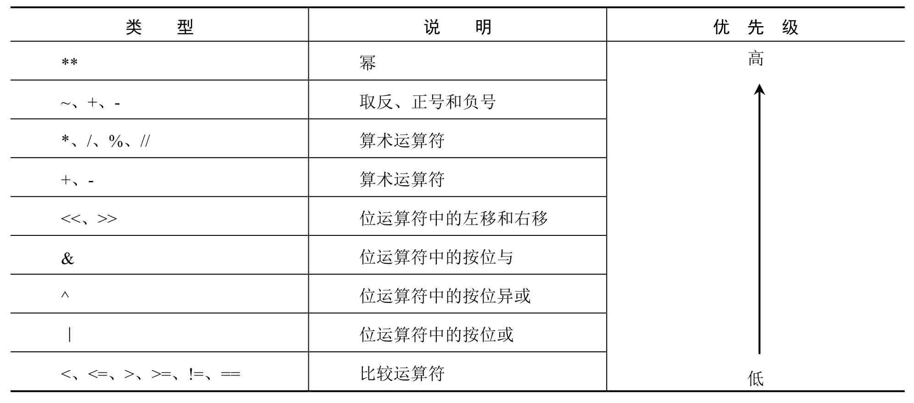

**说明**

在编写程序时尽量使用括号“()”来限定运算次序，以免运算次序发生错误。

<a id="isbn9787302503880_1_3_1_3"></a>

## 3.3 条件表达式

在程序开发时，经常会根据表达式的结果有条件地进行赋值。例如，要返回两个数中较大的数，可以使用下面的if语句。

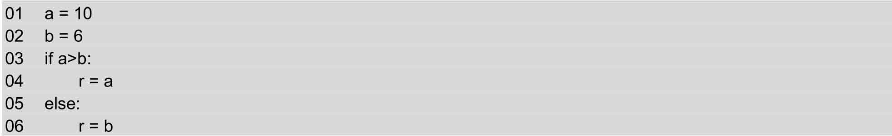

上面的代码可以使用条件表达式进行简化，代码如下：

```python
01  a = 10
02  b = 6
03  r = a if a > b else b
```

使用条件表达式时，先计算中间的条件（a&gt;b），如果结果为True，返回if语句左边的值，否则返回else右边的值。例如上面的表达式的结果，即r的值为10。

**【例3.5】** 使用条件表达式判断是否为闰年。**（实例位置：资源包\\TM\\sl\\03\\05）**

在IDLE中创建一个名称为leapyear.py的文件，然后在该文件中定义一个保存要判断的年份的变量，然后应用条件表达式判断该年份是否为闰年，最后输出判断结果，代码如下：

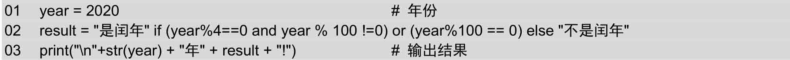

运行上面的代码，将显示如图3.16所示的运行结果。

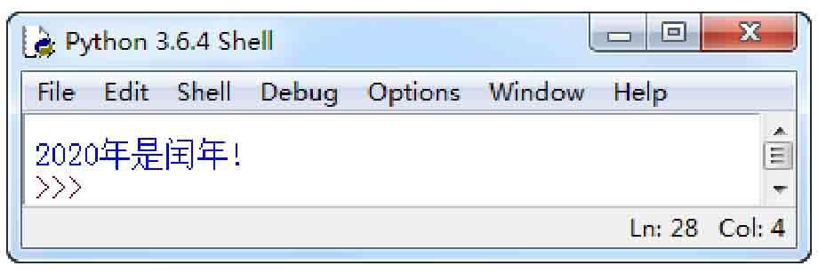

*图3.16 判断是否为闰年的结果*

**说明**

判断一个年份是否为闰年的条件是：能被4整除，但不能被100整除，或者能被400整除。

<a id="isbn9787302503880_1_3_1_4"></a>

## 3.4 小结

本章主要介绍了Python中的运算符和表达式。同其他语言类似，最常用的运算符有算术运算符、赋值运算符、比较运算符、逻辑运算符和位运算符。这几种常用的运算符是需要读者重点掌握的。另外，如果在一个表达式中需要同时使用多个运算符，那么必须考虑运算符的优先级，优先级高的要比优先级低的先被执行。
