<a id="isbn9787302503880_1_4"></a>

# 第4章  流程控制语句

**（


 视频讲解：106分钟）**

做任何事情都要遵循一定的原则。例如，到图书馆去借书，就必须要有借书证，并且借书证不能过期，这两个条件缺一不可。程序设计也是如此，需要利用流程控制实现与用户的交流，并根据用户的需求决定程序“做什么”“怎么做”。

流程控制对于任何一门编程语言来说都是至关重要的，它提供了控制程序如何执行的方法。如果没有流程控制语句，整个程序将按照线性顺序来执行，而不能根据用户的需求决定程序执行的顺序。本章将对Python中的流程控制语句进行详细讲解。

通过阅读本章，您可以：


 了解程序设计的基本结构


 掌握Python中的几种选择语句


 掌握while循环语句的应用


 掌握如何使用for循环语句


 掌握如何进行循环嵌套


 掌握break语句的基本用法


 掌握continue语句的应用


 了解pass语句的基本用法

<a id="isbn9787302503880_1_4_1_1"></a>

## 4.1 程序结构

计算机在解决某个具体问题时，主要有3种情形，分别是顺序执行所有的语句、选择执行部分语句和循环执行部分语句。对应程序设计中的3种基本结构是顺序结构、选择结构和循环结构。这3种结构的执行流程如图4.1所示。

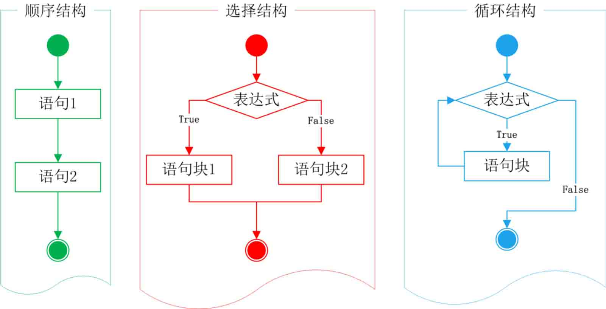

*图4.1 结构化程序设计的3种基本结构*

其中，第一幅图是顺序结构的流程图，编写完毕的语句按照编写顺序依次被执行；第二幅图是选择结构的流程图，它主要根据条件语句的结果选择执行不同的语句；第三幅图是循环结构的流程图，它是在一定条件下反复执行某段程序的流程结构，其中，被反复执行的语句称为循环体，而决定循环是否终止的判断条件称为循环条件。

本章之前编写的多数例子采用的都是顺序结构。例如，定义一个字符串类型的变量，然后输出该变量，代码如下：

```python
01  mot_cn = "命运给予我们的不是失望之酒，而是机会之杯。"  # 使用双引号，字符串内容必须在一行
02  print(mot_cn)
```

选择结构和循环结构的应用场景，例如：看过《射雕英雄传》的人可能会记得，黄蓉与瑛姑见面时曾出过这样一道数学题：今有物不知其数，三三数之剩二，五五数之剩三，七七数之剩二，问几何？

解决这道题，有以下两个要素：


 需要满足的条件是一个数，除以三余二，除以五余三，除以七余二。这就涉及条件判断，需要通过选择语句实现。


 依次尝试符合条件的数。这就需要循环执行，需要通过循环语句实现。

<a id="isbn9787302503880_1_4_1_2"></a>

## 4.2 选择语句

在生活中，我们总是要做出许多选择，程序也是一样。下面给出几个常见的例子：


 如果购买成功，用户余额减少，用户积分增多。


 如果输入的用户名和密码正确，则提示登录成功，进入网站，否则，提示登录失败。


 如果用户使用微信登录，则使用微信扫一扫；如果使用QQ登录，则输入QQ号和密码；如果使用微博登录，则输入微博账号和密码；如果使用手机号登录，则输入手机号和密码。

以上例子中的判断就是程序中的选择语句，也称为条件语句。即按照条件选择执行不同的代码片段。Python中选择语句主要有3种形式，分别为if语句、if…else语句和if…elif…else多分支语句，下面将分别对它们进行详细讲解。

**说明**

在其他语言（如C、C++、Java等）中，选择语句还包括switch语句，也可以实现多重选择。但是，在Python中却没有switch语句，所以实现多重选择的功能时，只能使用if…elif…else多分支语句或者if语句的嵌套。

<a id="isbn9787302503880_1_4_1_2_1"></a>

### 4.2.1 最简单的if语句

Python中使用if保留字来组成选择语句，其最简单的语法形式如下：

```python
if 表达式:
   语句块
```

其中，表达式可以是一个单纯的布尔值或变量，也可以是比较表达式或逻辑表达式（例如，a &gt; b and a!= c），如果表达式的值为真，则执行“语句块”；如果表达式的值为假，就跳过“语句块”，继续执行后面的语句，这种形式的if语句相当于汉语里的“如果……就……”，其流程图如图4.2所示。

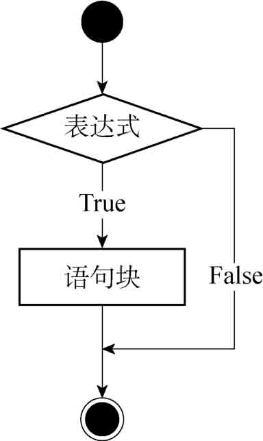

*图4.2 最简单if语句的执行流程*

**说明**

在Python中，当表达式的值为非零的数或者非空的字符串时，if语句也认为是条件成立（即为真值）。具体都有哪些值才是假，可以参见2.3.3节。

下面通过一个具体的实例来解决4.1节给出的应用场景中的第一个要素：判断一个数，除以三余二，除以五余三，除以七剩二。

**【例4.1】** 判断输入的是不是黄蓉所说的数。**（实例位置：资源包\\TM\\sl\\04\\01）**

使用if语句判断用户输入的数字是不是黄蓉所说的除以三余二，除以五余三，除以七余二的数，代码如下：

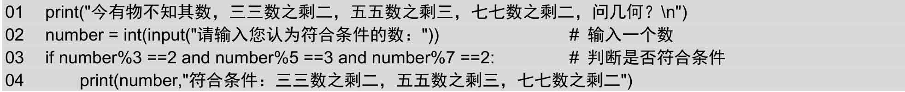

运行程序，当输入23时，效果如图4.3所示；当输入45时，效果如图4.4所示。

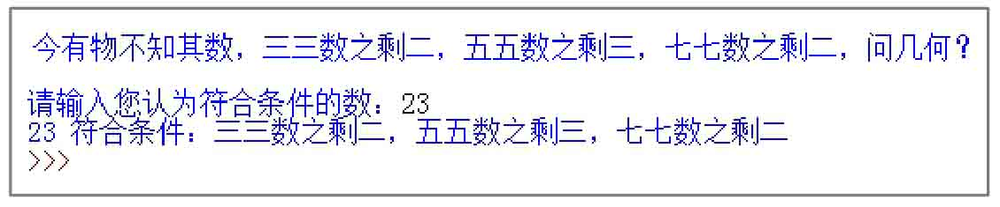

*图4.3 输入的是符合条件的数*

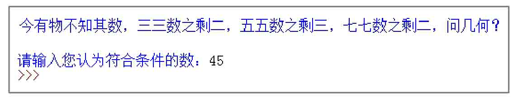

*图4.4 输入的是不符合条件的数*

**说明**

使用if语句时，如果只有一条语句，语句块可以直接写到冒号“:”的右侧，例如下面的代码：

```python
if a > b:max = a
```

但是，为了程序代码的可读性，建议不要这么做。

**常见错误：**

（1）if语句后面未加冒号。例如下面的代码：

```python
01  number = 5
02  if number == 5
03      print("number的值为5")
```

运行后，将产生如图4.5所示的语法错误。

解决的方法是在第2行代码的结尾处添加英文半角的冒号。正确的代码如下：

```python
04  number = 5
05  if number == 5:
06  print("number的值为5")
```

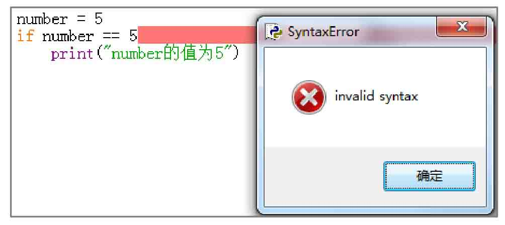

*图4.5 语法错误*

（2）使用if语句时，如果在符合条件时，需要执行多个语句，例如，程序的真正意图是以下语句：

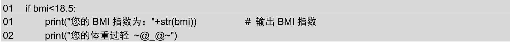

但是，在第二个输出语句的位置没有缩进，代码如下：

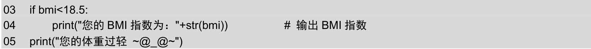

执行程序时，无论bmi的值是否小于18.5，都会输出“您的体重过轻~@\_@~”。这显然与程序的本意是不符的，但程序并不会报告异常，因此这种Bug很难被发现。

<a id="isbn9787302503880_1_4_1_2_2"></a>

### 4.2.2 if…else语句

如果遇到只能二选一的条件，例如，某个公司在发展过程中遇到了“扩张”和“求稳”的抉择，示意图如图4.6所示。

Python中提供了if…else语句解决类似问题，其语法格式如下：

```python
if 表达式:
    语句块1
else:
    语句块2
```

使用if…else语句时，表达式可以是一个单纯的布尔值或变量，也可以是比较表达式或逻辑表达式，如果满足条件，则执行if后面的语句块，否则，执行else后面的语句块，这种形式的选择语句相当于汉语里的“如果……否则……”，其流程图如图4.7所示。


*图4.6 公司发展面临的抉择*

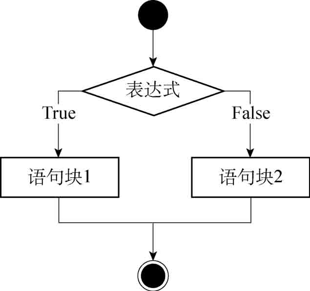

*图4.7 if…else语句流程图*

**技巧**

if…else语句可以使用条件表达式进行简化，例如下面的代码：

```python
01  a = -9
02  if a > 0:
03      b = a
04  else:
05      b = -a
06  print(b)
```

可以简写成：

```python
01  a = -9
02  b = a if a>0 else -a
03  print(b)
```

上段代码主要实现求绝对值的功能，如果a &gt; 0，就把a的值赋值给变量b，否则将−a赋值给变量b。使用条件表达式的好处是可以使代码简洁，并且有一个返回值。

下面对实例4.1进行改进，加入：如果输入的数不符合条件，则给出提示的功能。

**【例4.2】** 判断输入的是不是黄蓉所说的数（续）。**（实例位置：资源包\\TM\\sl\\04\\02）**

使用if…else语句判断用户输入的数字是不是黄蓉所说的除以三余二，除以五余三，除以七余二的数，并给予相应的提示，代码如下：

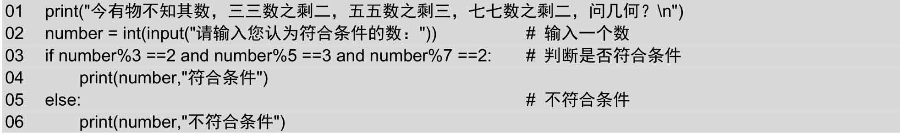

运行程序，当输入23时，效果如图4.8所示；当输入32时，效果如图4.9所示。

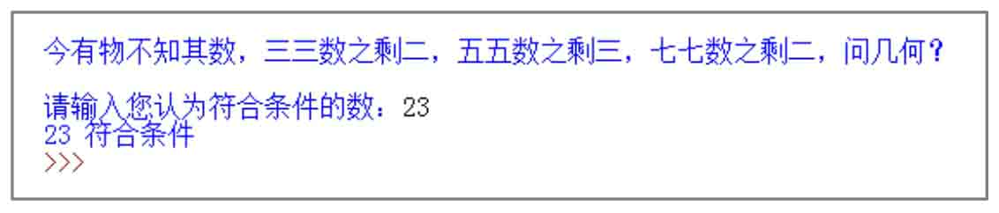

*图4.8 输入的是符合条件的数*

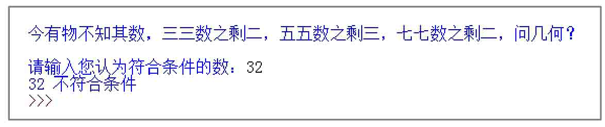

*图4.9 输入的是不符合条件的数*

**注意**

在使用else语句时，else一定不可以单独使用，它必须和保留字if一起使用，例如，下面的代码是错误的：

```python
01  else:
02      print(number,"不符合条件")
```

程序中使用if...else语句时，如果出现if语句多于else语句的情况，那么该else语句将会根据缩进确定该else语句是属于哪个if语句的。例如下面的代码：

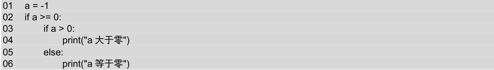

将不输出任何提示信息，这是因为else语句属于第3行的if语句，所以当a小于零时，else语句将不执行。而如果将上面的代码修改为以下内容：

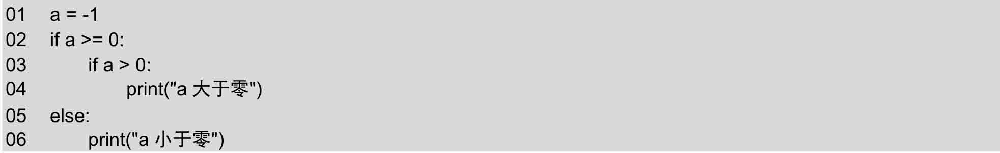

将输入提示信息“a小于零”。此时，else语句属于第2行的if语句。

<a id="isbn9787302503880_1_4_1_2_3"></a>

### 4.2.3 if…elif…else语句

大家平时在网上购物时，通常都有多种付款方式以供选择，如图4.10所示。


*图4.10 购物时的付款页面*

图4.10中提供了3种付款方式，这时用户就需要从多个选项中选择一个。在开发程序时，如果遇到多选一的情况，则可以使用if…elif…else语句，该语句是一个多分支选择语句，通常表现为“如果满足某种条件，进行某种处理，否则，如果满足另一种条件，则执行另一种处理……”。if…elif…else语句的语法格式如下：

```python
if 表达式1:
   语句块1
elif 表达式2:
   语句块2
elif 表达式3:
   语句块3
...
else:
   语句块n
```

使用if…elif…else语句时，表达式可以是一个单纯的布尔值或变量，也可以是比较表达式或逻辑表达式，如果表达式为真，则执行语句；而如果表达式为假，则跳过该语句，进行下一个elif的判断，只有在所有表达式都为假的情况下，才会执行else中的语句。if…elif…else语句的流程如图4.11所示。

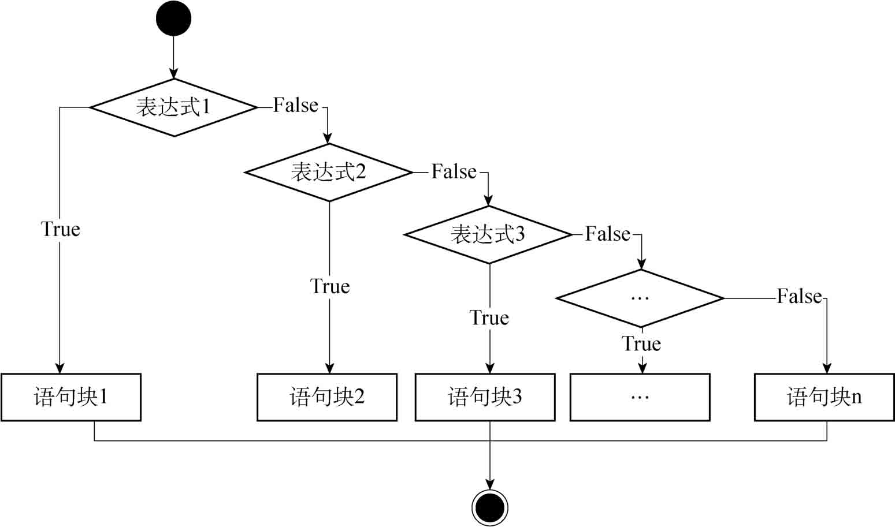

*图4.11 if…elif…else语句的流程图*

**注意**

if和elif都需要判断表达式的真假，而else则不需要判断；另外，elif和else都必须跟if一起使用，不能单独使用。

**【例4.3】** 根据年龄输出不同的提示。**（实例位置：资源包\\TM\\sl\\04\\03）**

使用if…elif…else多分支语句实现根据用户输入的年龄输出相应的提示信息的功能，代码如下：

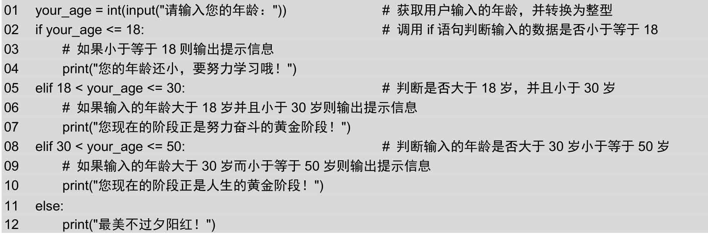

**说明**

第1行代码中的int()函数用于将用户的输入强制转换成整型。

运行程序，输入一个年龄值，并按Enter键，即可显示相应的提示信息，效果如图4.12所示。

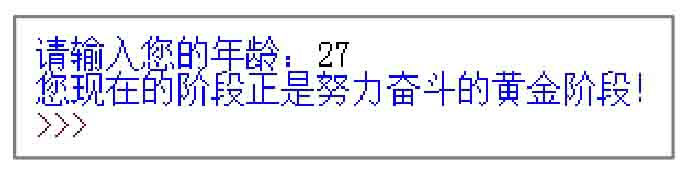

*图4.12 if…elif…else多分支语句的使用*

**说明**

使用if选择语句时，尽量遵循以下原则：

（1）当使用布尔类型的变量作为判断条件时，假设布尔型变量flag，例如较为规范的书写：

```python
if flag:      # 表示为真
if not flag:  # 表示为假
```

不符合规范的书写，例如：

```python
if flag == True:
if flag == False:
```

（2）使用“if 1 == a:”这样的书写格式可以防止错写成“if a = 1:”这种形式，以避免逻辑上的错误。

<a id="isbn9787302503880_1_4_1_2_4"></a>

### 4.2.4 if语句的嵌套

前面介绍了3种形式的if选择语句，这3种形式的选择语句之间都可以互相嵌套。例如，在最简单的if语句中嵌套if…else语句，形式如下：

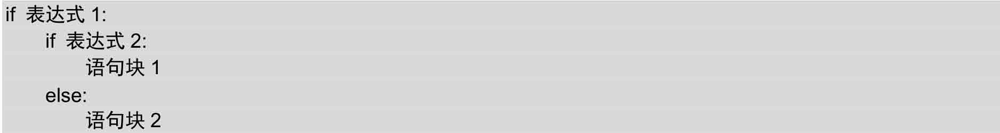

例如，在if…else语句中嵌套if…else语句，形式如下：

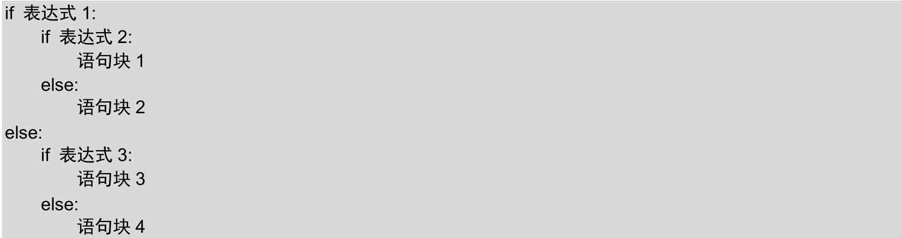

**说明**

if选择语句可以有多种嵌套方式，开发程序时，可以根据自身需要选择合适的嵌套方式，但一定要严格控制好不同级别代码块的缩进量。

**【例4.4】** 判断输入的年份是不是闰年。**（实例位置：资源包\\TM\\sl\\04\\04）**

通过使用嵌套的if语句实现判断用户输入的年份是不是闰年的功能，代码如下：

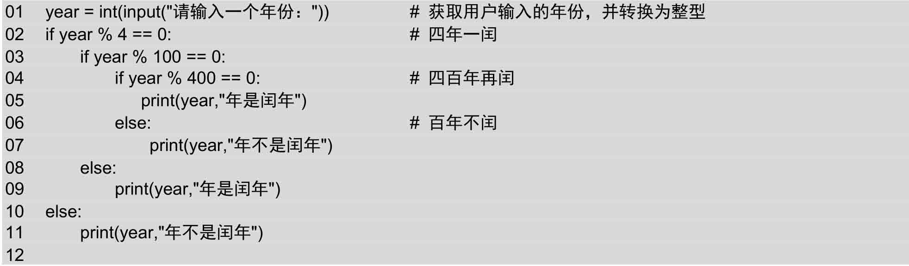

**说明**

判断闰年的方法是“四年一闰，百年不闰，四百年再闰”。程序使用嵌套的if语句对这3个条件逐一判断，第2行代码首先判断年份能否被4整除，如果不能整除，输出字符串“yyyy年不是闰年”，如果能整除，第3行代码继续判断能否被100整除，如果不能整除，输出字符串“yyyy年是闰年”，如果能整除，第4行代码继续判断能否被400整除，如果能整除，输出字符串“yyyy年是闰年”，如果不能整除，输出字符串“yyyy年不是闰年”。

运行程序，当输入一个闰年年份（如2016）时，效果如图4.13所示；当输入一个非闰年年份（如2018）时，效果如图4.14所示。

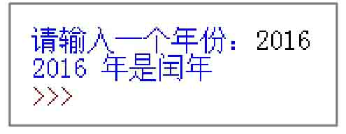

*图4.13 输入闰年年份的结果*


*图4.14 输入非闰年年份的结果*

<a id="isbn9787302503880_1_4_1_3"></a>

## 4.3 循环语句

日常生活中很多问题都无法一次解决，如盖楼，所有高楼都是一层一层建起来的。还有，有些事物必须周而复始地运转才能保证其存在的意义，例如，公交车、地铁等交通工具必须每天在同样的时间往返于始发站和终点站之间。类似这样的反复做同一件事的情况，称为循环。循环主要有两种类型：


 重复一定次数的循环，称为计次循环，如for循环。


 一直重复，直到条件不满足时才结束的循环，称为条件循环。只要条件为真，这种循环会一直持续下去，如while循环。下面将对这两种类型的循环分别进行介绍。

**说明**

在其他语言（如C、C++、Java等）中，条件循环还包括do…while循环。但是，在Python中没有do…while循环。

<a id="isbn9787302503880_1_4_1_2_5"></a>

### 4.3.1 while循环

while循环是通过一个条件来控制是否要继续反复执行循环体中的语句。

语法如下：

```python
while 条件表达式:
    循环体
```

**说明**

循环体是指一组被重复执行的语句。

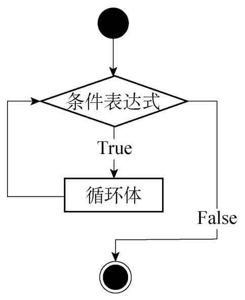

*图4.15 while循环语句的执行流程图*

当条件表达式的返回值为真时，则执行循环体中的语句，执行完毕后，重新判断条件表达式的返回值，直到表达式返回的结果为假时，退出循环。while循环语句的执行流程如图4.15所示。

我们以现实生活中的例子来理解while循环的执行流程。在体育课上，体育老师要求同学们沿着环形操场跑圈。要求听到老师吹的哨子声时就停下来。同学们每跑一圈，可能会请求一次老师吹哨子。如果老师吹哨子，则停下来，即循环结束。否则继续跑步，即执行循环。

下面通过一个具体的实例来解决4.1节给出的应用场景中的第二个要素：依次尝试符合条件的数。此时，需要用到第一个要素确定是否符合条件。

**【例4.5】** 解决黄蓉难倒瑛姑的数学题（while循环版）。**（实例位置：资源包\\TM\\sl\\04\\05）**

使用while循环语句实现从1开始依次尝试符合条件的数，直到找到符合条件的数时，才退出循环。具体的实现方法是：首先定义一个用于计数的变量number和一个作为循环条件的变量none（默认值为真），然后编写while循环语句，在循环体中，将变量number的值加1，并且判断number的值是否符合条件，当符合条件时，将变量none设置为假，从而退出循环。具体代码如下：

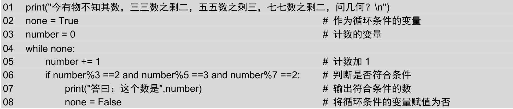

运行程序，将显示如图4.16所示的效果。从图4.16中可以看出第一个符合条件的数是23，这就是黄蓉想要的答案。

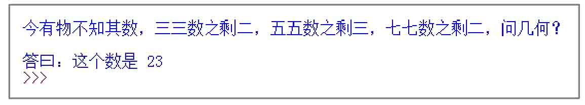

*图4.16 解决黄蓉难倒瑛姑的数学题（while循环版）*

**注意**

在使用while循环语句时，一定不要忘记添加将循环条件改变为False的代码（例如实例4.5中的第8行代码一定不能少），否则，将产生死循环。

<a id="isbn9787302503880_1_4_1_2_6"></a>

### 4.3.2 for循环

for循环是一个计次循环，一般应用在循环次数已知的情况下。通常适用于枚举或遍历序列，以及迭代对象中的元素。

语法如下：

```python
for 迭代变量 in 对象:
   循环体
```

其中，迭代变量用于保存读取出的值；对象为要遍历或迭代的对象，该对象可以是任何有序的序列对象，如字符串、列表和元组等；循环体为一组被重复执行的语句。

for循环语句的执行流程如图4.17所示。

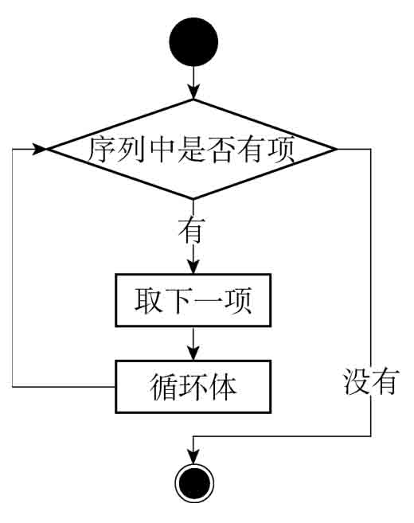

*图4.17 for循环语句的执行流程图*

我们以现实生活中的例子来理解for循环的执行流程。在体育课上，体育老师要求同学们排队进行踢毽球测试，每个同学一次机会，毽球落地则换另一个同学，直到全部同学都测试完毕，即循环结束。

<a id="isbn9787302503880_1_4_1_2_6_1"></a>

#### 1．进行数值循环

在使用for循环时，最基本的应用就是进行数值循环。例如，想要实现从1到100的累加，可以通过下面的代码实现。

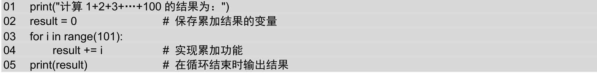

在上面的代码中使用了range()函数，该函数是Python内置的函数，用于生成一系列连续的整数，多用于for循环语句中。其语法格式如下：

```python
range(start,end,step)
```

各参数说明如下：


 start：用于指定计数的起始值，可以省略，如果省略则从0开始。


 end：用于指定计数的结束值（但不包括该值，如range(7)，则得到的值为0~6，不包括7），不能省略。当range()函数中只有一个参数时，即表示指定计数的结束值。


 step：用于指定步长，即两个数之间的间隔，可以省略，如果省略则表示步长为1。例如，range(1,7)将得到1、2、3、4、5、6。

**注意**

在使用range()函数时，如果只有一个参数，那么表示指定的是end；如果有两个参数，则表示指定的是start和end；只有3个参数都存在时，最后一个才表示步长。

例如，使用下面的for循环语句，将输出10以内的所有奇数。

```python
01  for i in range(1,10,2):
02      print(i,end = ' ')
```

得到的结果如下：

```python
1 3 5 7 9
```

**说明**

在Python 2.x中，如果想让print语句输出的内容在一行上显示，可以在后面加上逗号（如print i,），但是在Ptyhon 3.x中，使用print()函数时，不能直接加逗号，需要加上“,end = '分隔符'”，在上面的代码中使用的分隔符为一个空格。

**说明**

在Python 2.x中，除提供range()函数外，还提供了一个xrange()函数，用于解决range()函数会不经意间耗掉所有可用内存的问题，而在Python 3.x中已经更名为range()函数，并且删除了老式xrange()函数。

下面通过一个具体的实例来演示使用for循环语句进行数值循环的具体应用。

**【例4.6】** 解决黄蓉难倒瑛姑的数学题（for循环版）。**（实例位置：资源包\\TM\\sl\\04\\06）**

使用for循环语句实现从1循环到100（不包含100），并且记录符合黄蓉要求的数。具体的实现方法是：应用for循环语句从1迭代到100，在循环体中，判断迭代变量number是否符合“三三数之剩二，五五数之剩三，七七数之剩二”的要求，如果符合则应用print()函数输出，否则继续循环。具体代码如下：

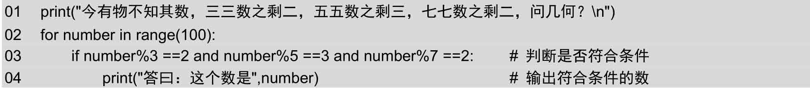

运行程序，将显示和实例4.5一样的效果，也是如图4.16所示的效果。

**常见错误：** for语句后面未加冒号。例如下面的代码：

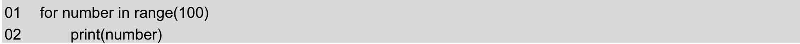

运行后，将产生如图4.18所示的语法错误。解决的方法是在第一行代码的结尾处添加一个冒号。

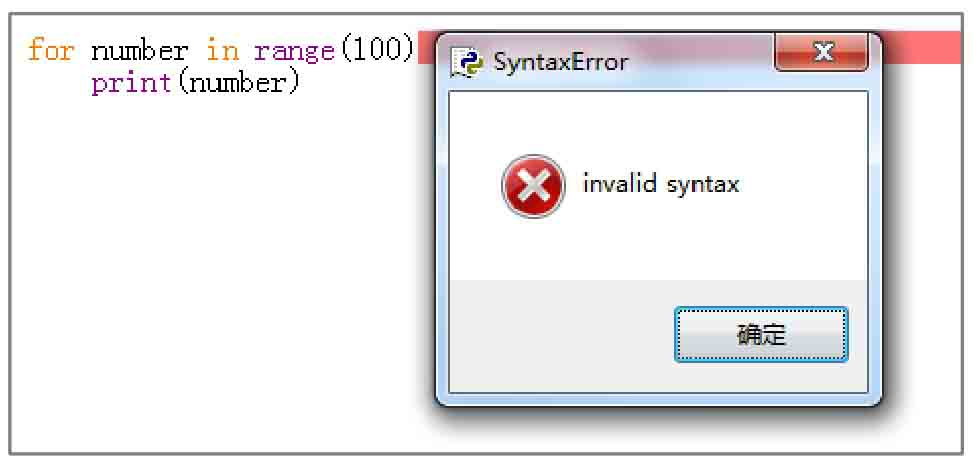

*图4.18 for循环语句的常见错误*

<a id="isbn9787302503880_1_4_1_2_6_2"></a>

#### 2．遍历字符串

使用for循环语句除了可以循环数值，还可以逐个遍历字符串，例如，下面的代码可以将横向显示的字符串转换为纵向显示。

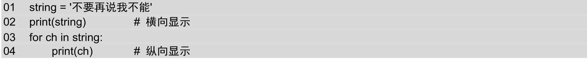

上面代码的运行结果如图4.19所示。

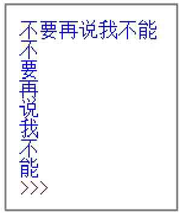

*图4.19 将字符串转换为纵向显示*

**说明**

for循环语句还可以用于迭代（遍历）列表、元组、集合和字典等，具体的方法将在第5章介绍。

<a id="isbn9787302503880_1_4_1_2_7"></a>

### 4.3.3 循环嵌套

在Python中，允许在一个循环体中嵌入另一个循环，这称为循环嵌套。在Python中，for循环和while循环都可以进行循环嵌套。

例如，在while循环中套用while循环的格式如下：

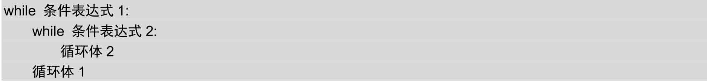

在for循环中套用for循环的格式如下：

```python
for 迭代变量1 in 对象1:
   for 迭代变量2 in 对象2:
    循环体2
循环体1
```

在while循环中套用for循环的格式如下：

```python
while 条件表达式:
    for 迭代变量 in 对象:
        循环体2
    循环体1
```

在for循环中套用while循环的格式如下：

```python
for 迭代变量 in 对象:
    while 条件表达式:
        循环体2
    循环体1
```

除了上面介绍的4种嵌套格式外，还可以实现更多层的嵌套，方法与上面的类似，这里就不再一一给出了。

**【例4.7】** 打印九九乘法表。**（实例位置：资源包\\TM\\sl\\04\\07）**

使用嵌套的for循环打印九九乘法表，代码如下：

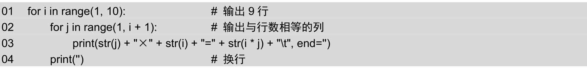

上面的代码使用了双层for循环，第一个循环可以看成是对乘法表的行数的控制，同时也是每个乘法公式的第二个因子；第二个循环控制乘法表的列数，列数的最大值应该等于行数，因此第二个循环的条件应该是在第一个循环的基础上建立的。

程序运行结果如图4.20所示。

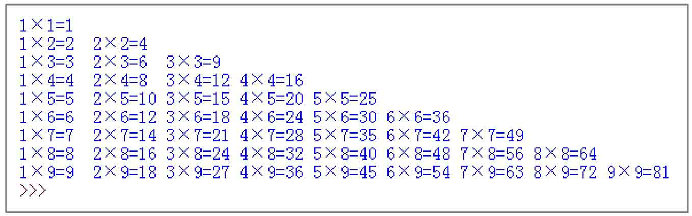

*图4.20 使用循环嵌套打印九九乘法表*

<a id="isbn9787302503880_1_4_1_4"></a>

## 4.4 break、continue和pass语句

当循环条件一直满足时，程序将会一直执行下去，就像一辆迷路的车，在某个地方不停地转圆圈。如果希望在中间离开循环，也就是for循环结束计数之前，或者while循环找到结束条件之前。有两种方法可以做到：


 使用continue语句直接跳到循环的下一次迭代。


 使用break完全中止循环。

另外，在Python中还有一个用于保持程序结构完整性的pass语句。下面将对break、continue和pass语句进行详细介绍。

<a id="isbn9787302503880_1_4_1_2_8"></a>

### 4.4.1 break语句

break语句可以终止当前的循环，包括while和for在内的所有控制语句。以独自一人沿着操场跑步为例，原计划跑10圈，可是在跑到第2圈的时候，遇到自己的女神或者男神，于是果断停下来，中止跑步，这就相当于使用了break语句提前中止了循环。break语句的语法比较简单，只需要在相应的while或for语句中加入即可。

**说明**

break语句一般会结合if语句进行搭配使用，表示在某种条件下跳出循环。如果使用嵌套循环，break语句将跳出最内层的循环。

在while语句中使用break语句的形式如下：

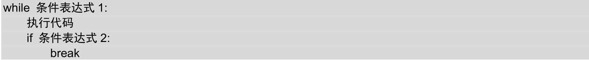

其中，条件表达式2用于判断何时调用break语句跳出循环。在while语句中使用break语句的流程如图4.21所示。

在for语句中使用break语句的形式如下：

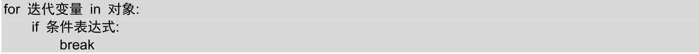

其中，条件表达式用于判断何时调用break语句跳出循环。在for语句中使用break语句的流程如图4.22所示。

在实例4.6中，使用for循环语句解决了黄蓉难倒瑛姑的数学题。但是，在该实例中，整合for要从0一直循环到99，尽管在循环到23时，已经找到了符合要求的数。下面将实例4.6进行改进，实现当找到第一个符合条件的数后，就跳出循环。这样可以提高程序的执行效率。

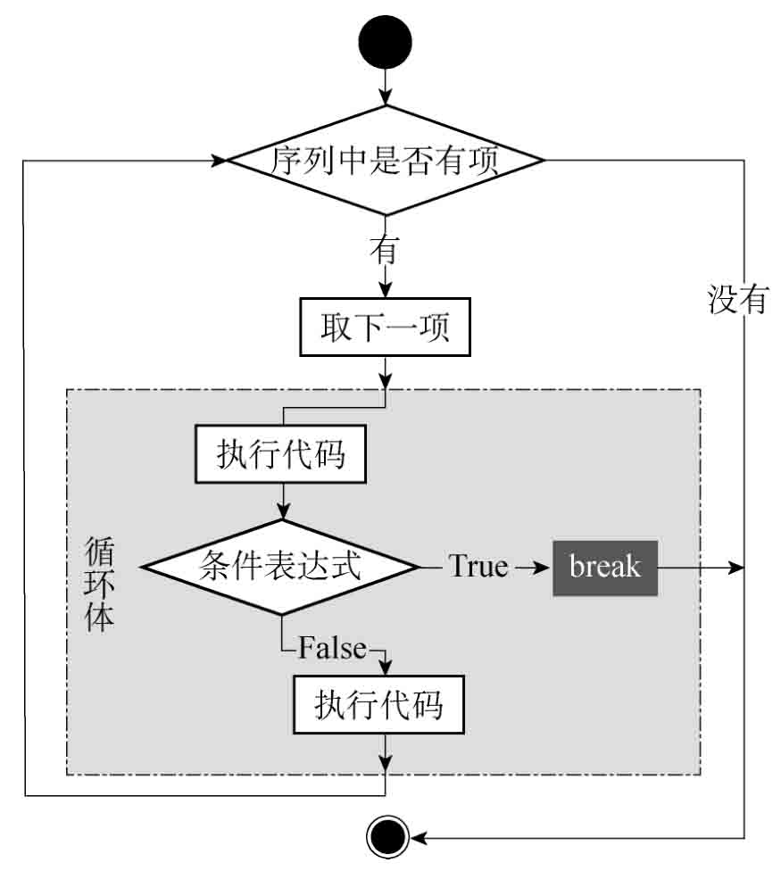

*图4.21 在while语句中使用break语句的流程图*

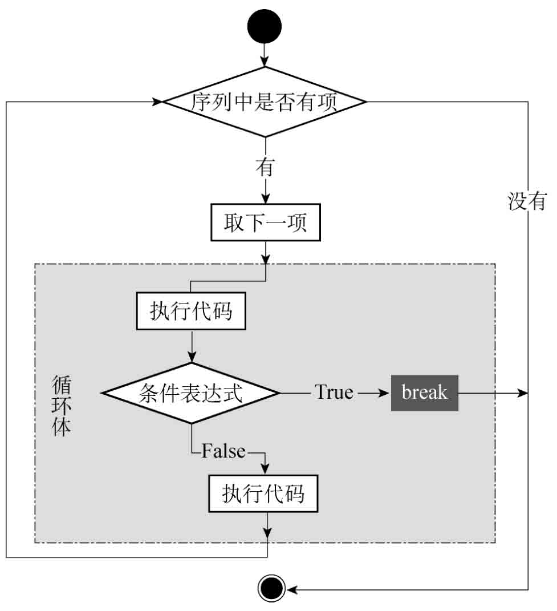

*图4.22 在for语句中使用break语句的流程图*

**【例4.8】** 解决黄蓉难倒瑛姑的数学题（for循环改进版）。**（实例位置：资源包\\TM\\sl\\04\\08）**

在实例4.7的最后一行代码下方再添加一个break语句，即可以实现找到符合要求的数后直接退出for循环。修改后的代码如下：

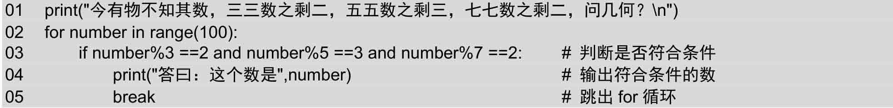

运行程序，将显示和实例4.5一样的效果，也是如图4.16所示的效果。如果想要看出实例4.8和实例4.6的区别，可以在上面第2行和第3行代码之间添加“print(number)”语句输出number的值。添加break语句后的执行效果如图4.23所示，未添加break语句时的执行效果如图4.24所示。

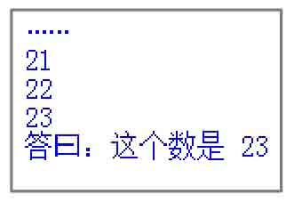

*图4.23 添加break语句时的效果*

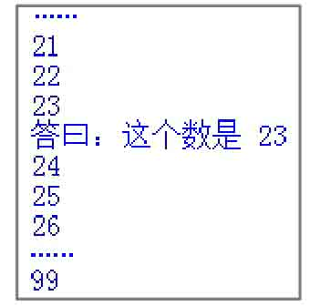

*图4.24 未添加break语句时的效果*

<a id="isbn9787302503880_1_4_1_2_9"></a>

### 4.4.2 continue语句

continue语句的作用没有break语句强大，它只能中止本次循环而提前进入下一次循环中。仍然以独自一人沿着操场跑步为例，原计划跑步10圈。当跑到第2圈的时候，遇到自己的女神或者男神也在跑步，于是果断停下来，跑回起点等待，制造一次完美邂逅，然后从第3圈开始继续。

continue语句的语法比较简单，只需要在相应的while或for语句中加入即可。

**说明**

continue语句一般会结合if语句进行搭配使用，表示在某种条件下，跳过当前循环的剩余语句，然后继续进行下一轮循环。如果使用嵌套循环，continue语句将只跳过最内层循环中的剩余语句。

在while语句中使用continue语句的形式如下：

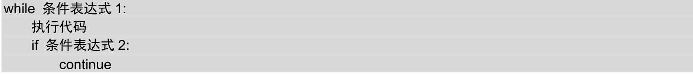

其中，条件表达式2用于判断何时调用continue语句跳出循环。在while语句中使用continue语句的流程图如图4.25所示。

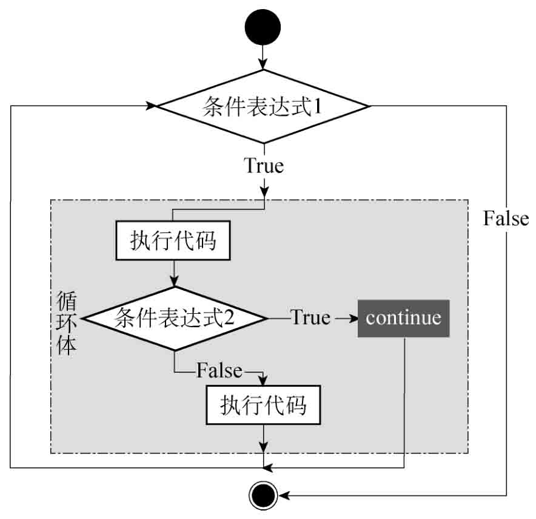

*图4.25 在while语句中使用continue语句的流程图*

在for语句中使用continue语句的形式如下：

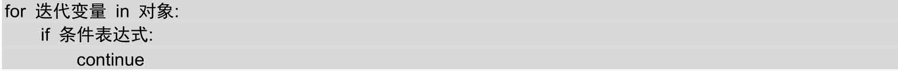

其中，条件表达式用于判断何时调用continue语句跳出循环。在for语句中使用continue语句的流程如图4.26所示。

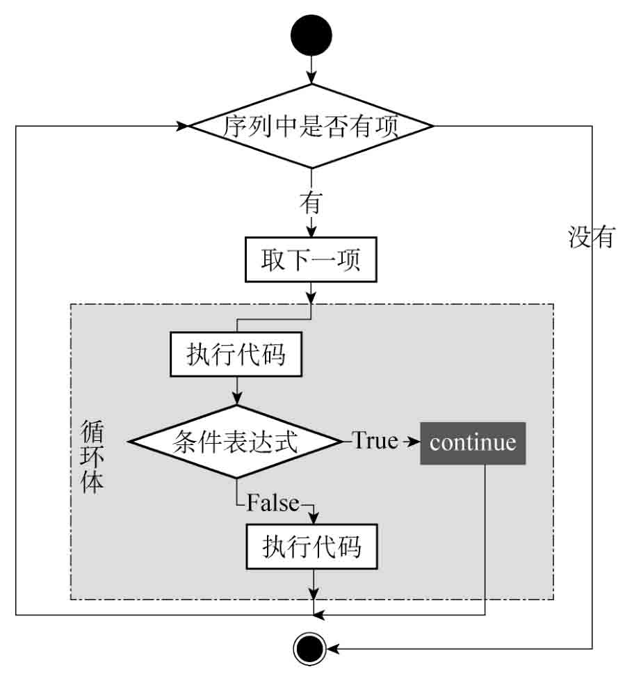

*图4.26 在for语句中使用continue语句的流程图*

**【例4.9】** 计算100以内所有偶数的和。**（实例位置：资源包\\TM\\sl\\04\\09）**

通过在for循环中使用continue语句实现1到100（不包括100）的偶数和，代码如下：

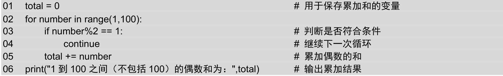

**说明**

第3行代码实现的是：当所判断的数字是奇数时，会执行第4行的continue语句，跳过后面的累加操作，直接进入下一次循环。

程序运行结果如下：

```python
1到100之间（不包括100）的偶数和为：2450
```

<a id="isbn9787302503880_1_4_1_2_10"></a>

### 4.4.3 pass语句

在Python中还有一个pass语句，表示空语句。它不做任何事情，一般起到占位作用。例如，在应用for循环输出1～10（不包括10）的偶数时，在不是偶数时，应用pass语句占个位置，方便以后对不是偶数的数进行处理。代码如下：

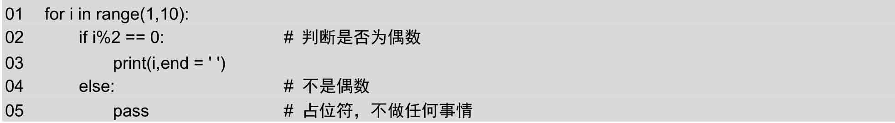

程序运行结果如下：

```python
2 4 6 8
```

<a id="isbn9787302503880_1_4_1_5"></a>

## 4.5 小结

本章详细介绍了选择语句、循环语句、break和continue跳转语句，以及pass语句的概念及用法。在程序中，语句是程序完成一次操作的基本单位，而流程控制语句是用于控制语句的执行顺序的，在讲解流程控制语句时，通过实例演示每种语句的用法。在学习本章内容时，读者要重点掌握if语句、while语句和for语句的用法，因为这几种语句在程序开发中会经常用到。希望通过对本章的学习，读者能够熟练掌握Python中流程控制语句的使用，并能够应用在实际的开发中。
