<a id="isbn9787302503880_1_5"></a>

# 第5章  列表与元组

**（


 视频讲解：202分钟）**

在数学里，序列也称为数列，是指按照一定顺序排列的一列数，而在程序设计中，序列是一种常用的数据存储方式，几乎每种程序设计语言都提供了类似的数据结构，如C语言或Java中的数组等。

在Python中，序列是最基本的数据结构。它是一块用于存放多个值的连续内存空间。Python中内置了5个常用的序列结构，分别是列表、元组、集合、字典和字符串。本章将对前两个序列结构进行详细介绍，剩下的集合和字典将在第6章进行介绍，字符串将在第7章进行详细介绍。

通过阅读本章，您可以：


 了解什么是序列


 掌握序列的基本操作


 掌握列表及二维列表的基本操作


 掌握列表推导式的应用


 掌握元组的基本操作


 掌握元组推导式的应用


 了解元组和列表的区别

<a id="isbn9787302503880_1_5_1_1"></a>

## 5.1 序列概述

序列是一块用于存放多个值的连续内存空间，并且按一定顺序排列，每个值（称为元素）都分配一个数字，称为索引或位置。通过该索引可以取出相应的值。例如，我们可以把一家酒店看作一个序列，那么酒店里的每个房间都可以看作是这个序列的元素。而房间号就相当于索引，可以通过房间号找到对应的房间。

在Python中，序列结构主要有列表、元组、集合、字典和字符串。对于这些序列结构有以下几个通用的操作。其中，集合和字典不支持索引、切片、相加和相乘操作。

<a id="isbn9787302503880_1_5_1_1_1"></a>

### 5.1.1 索引

序列中的每个元素都有一个编号，也称为索引（Indexing）。这个索引是从0开始递增的，即下标为0表示第一个元素，下标为1表示第二个元素，依此类推，如图5.1所示。

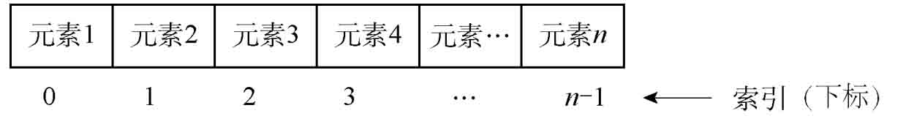

*图5.1 序列的正数索引*

Python比较神奇，它的索引可以是负数。这个索引从右向左计数，也就是从最后的一个元素开始计数，即最后一个元素的索引值是−1，倒数第二个元素的索引值为−2，依此类推，如图5.2所示。

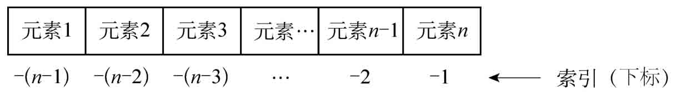

*图5.2 序列的负数索引*

**注意**

在采用负数作为索引值时，是从−1开始的，而不是从0开始的，即最后一个元素的下标为−1，这是为了防止与第一个元素重合。

通过索引可以访问序列中的任何元素。例如，定义一个包括4个元素的列表，要访问它的第三个元素和最后一个元素，可以使用下面的代码。

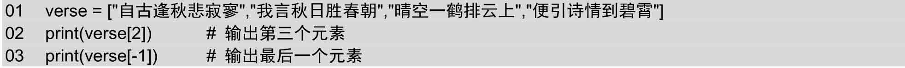

输出的结果为显示文字：

```python
晴空一鹤排云上
```

**说明**

关于列表的详细介绍请参见5.2节。

<a id="isbn9787302503880_1_5_1_1_2"></a>

### 5.1.2 切片

切片（sliceing）操作是访问序列中元素的另一种方法，它可以访问一定范围内的元素。通过切片操作可以生成一个新的序列。实现切片操作的语法格式如下：

```python
sname[start : end : step]
```

参数说明如下：


 sname：表示序列的名称；


 start：表示切片的开始位置（包括该位置），如果不指定，则默认为0；


 end：表示切片的截止位置（不包括该位置），如果不指定，则默认为序列的长度；


 step：表示切片的步长，如果省略，则默认为1，当省略该步长时，最后一个冒号也可以省略。

**说明**

在进行切片操作时，如果指定了步长，那么将按照该步长遍历序列的元素，否则将一个一个遍历序列。

例如，通过切片获取列表中的第2个到第6个元素，以及获取第2个、第4个和第6个元素，可以使用下面的代码。

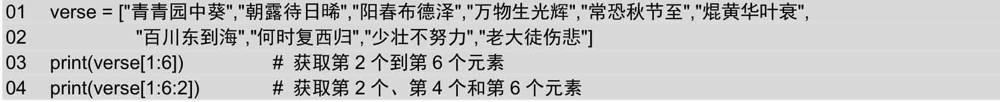

运行上面的代码，将输出以下内容：

```python
['朝露待日晞', '阳春布德泽', '万物生光辉', '常恐秋节至', '焜黄华叶衰']
['朝露待日晞', '万物生光辉', '焜黄华叶衰']
```

**说明**

如果想要复制整个序列，可以将start和end参数都省略，但是中间的冒号需要保留。例如，verse\[:\]就表示复制整个名称为verse的序列。

<a id="isbn9787302503880_1_5_1_1_3"></a>

### 5.1.3 序列相加

在Python中，支持两种相同类型的序列相加（adding）操作。即将两个序列进行连接，不会去除重复的元素，使用加（+）运算符实现。例如，将两个列表相加，可以使用下面的代码。

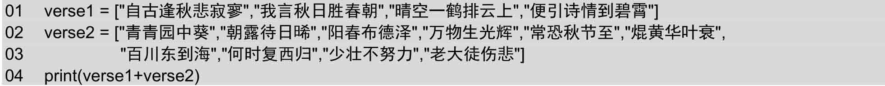

运行上面的代码，将输出以下内容：

```python
['自古逢秋悲寂寥', '我言秋日胜春朝', '晴空一鹤排云上', '便引诗情到碧霄', '青青园中葵', '朝露待日晞', '阳春布德泽',
'万物生光辉', '常恐秋节至', '焜黄华叶衰', '百川东到海', '何时复西归', '少壮不努力', '老大徒伤悲']
```

从上面的输出结果中可以看出，两个列表被合为一个列表了。

**说明**

在进行序列相加时，相同类型的序列是指，同为列表、元组、字符串等，序列中的元素类型可以不同。例如，下面的代码也是正确的。

```python
01  num = [7,14,21,28,35,42,49,56,63]
02  verse = ["自古逢秋悲寂寥","我言秋日胜春朝","晴空一鹤排云上","便引诗情到碧霄"]
03  print(num + verse)
```

但是不能是列表和元组相加，或者列表和字符串相加。例如，下面的代码就是错误的。

```python
01  num = [7,14,21,28,35,42,49,56,63]
02  print(num + "输出是7的倍数的数")
```

上面的代码，在运行后，将产生如图5.3所示的异常信息。

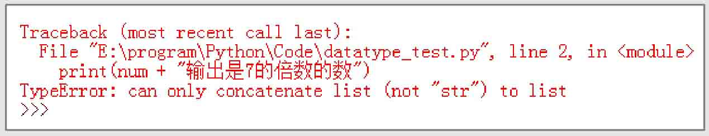

*图5.3 将列表和字符串相加产生的异常信息*

<a id="isbn9787302503880_1_5_1_1_4"></a>

### 5.1.4 乘法

在Python中，使用数字*n* 乘以一个序列会生成新的序列。新序列的内容为原来序列被重复*n* 次的结果。例如，下面的代码，将实现将一个序列乘以3后生成一个新的序列并输出，从而达到重要事情说3遍的效果。

```python
01  verse = ["自古逢秋悲寂寥","我言秋日胜春朝"]
02  print( verse * 3)
```

运行上面的代码，将显示以下内容：

```python
['自古逢秋悲寂寥', '我言秋日胜春朝', '自古逢秋悲寂寥', '我言秋日胜春朝', '自古逢秋悲寂寥', '我言秋日胜春朝']
```

在进行序列的乘法（Multiplying）运算时，还可以实现初始化指定长度列表的功能。例如下面的代码，将创建一个长度为5的列表，列表的每个元素都是None，表示什么都没有。

```python
01  emptylist = [None]*5
02  print(emptylist)
```

运行上面的代码，将显示以下内容：

```python
[None, None, None, None, None]
```

<a id="isbn9787302503880_1_5_1_1_5"></a>

### 5.1.5 检查某个元素是否是序列的成员（元素）

在Python中，可以使用in关键字检查某个元素是否是序列的成员，即检查某个元素是否包含在该序列中。语法格式如下：

```python
value in sequence
```

其中，value表示要检查的元素；sequence表示指定的序列。

例如，要检查名称为verse的序列中，是否包含元素“晴空一鹤排云上”，可以使用下面的代码。

```python
01  verse = ["自古逢秋悲寂寥","我言秋日胜春朝","晴空一鹤排云上","便引诗情到碧霄"]
02  print("晴空一鹤排云上" in verse)
```

运行上面的代码，将显示True，表示在序列中存在指定的元素。

另外，在Python中，也可以使用not in关键字实现检查某个元素是否不包含在指定的序列中。例如下面的代码，将显示False。

```python
01  verse = ["自古逢秋悲寂寥","我言秋日胜春朝","晴空一鹤排云上","便引诗情到碧霄"]
02  print("晴空一鹤排云上"  not in verse)
```

<a id="isbn9787302503880_1_5_1_1_6"></a>

### 5.1.6 计算序列的长度、最大值和最小值

在Python中，提供了内置函数计算序列的长度、最大值和最小值。分别是：使用len()函数计算序列的长度，即返回序列包含多少个元素；使用max()函数返回序列中的最大元素；使用min()函数返回序列中的最小元素。

例如，定义一个包括9个元素的列表，并通过len()函数计算列表的长度，可以使用下面的代码。

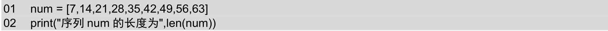

运行上面的代码，将显示“序列verse的长度为9”。

例如，定义一个包括9个元素的列表，并通过max()函数计算列表的最大元素，可以使用下面的代码。

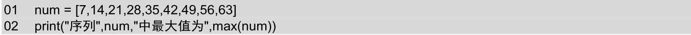

运行上面的代码，将显示以下结果。

```python
序列 [7, 14, 21, 28, 35, 42, 49, 56, 63] 中最大值为 63
```

例如，定义一个包括9个元素的列表，并通过min()函数计算列表的最小元素，可以使用下面的代码。

```python
01  num = [7,14,21,28,35,42,49,56,63]
02  print("序列",num,"中最小值为",min(num))
```

运行上面的代码，将显示以下结果。

```python
序列 [7, 14, 21, 28, 35, 42, 49, 56, 63] 中最小值为 7
```

除了上面介绍的3个内置函数，Python还提供了如表5.1所示的内置函数。

**表5.1 Python提供的内置函数及其说明**

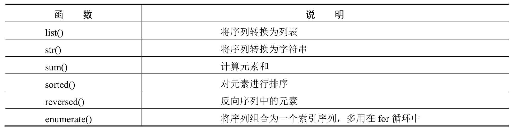

<a id="isbn9787302503880_1_5_1_2"></a>

## 5.2 列表

对于歌曲列表（list）大家一定很熟悉，在列表中记录着要播放歌曲的名称，如图5.4所示，即为手机App的歌曲列表页面。


*图5.4 歌曲列表*

Python中的列表和歌曲列表类似，也是由一系列按特定顺序排列的元素组成。它是Python中内置的可变序列。在形式上，列表的所有元素都放在一对中括号“\[\]”中，两个相邻元素间使用逗号“,”分隔。在内容上，可以将整数、实数、字符串、列表、元组等任何类型的内容放入列表中，并且同一个列表中，元素的类型可以不同，因为它们之间没有任何关系。由此可见，Python中的列表是非常灵活的，这一点与其他语言是不同的。

<a id="isbn9787302503880_1_5_1_1_7"></a>

### 5.2.1 列表的创建和删除

在Python中提供了多种创建列表的方法，下面分别进行介绍。

<a id="isbn9787302503880_1_5_1_1_7_1"></a>

#### 1．使用赋值运算符直接创建列表

同其他类型的Python变量一样，创建列表时，也可以使用赋值运算符“=”直接将一个列表赋值给变量。具体的语法格式如下：

```python
listname = [element 1,element 2,element 3,...,element n]
```

其中，listname表示列表的名称，可以是任何符合Python命名规则的标识符；element 1、element 2、element 3、element n表示列表中的元素，个数没有限制，并且只要是Python支持的数据类型就可以。

例如，下面定义的都是合法的列表。

```python
01  num = [7,14,21,28,35,42,49,56,63]
02  verse = ["自古逢秋悲寂寥","我言秋日胜春朝","晴空一鹤排云上","便引诗情到碧霄"]
03  untitle = ['Python',28,"人生苦短，我用Python",["爬虫","自动化运维","云计算","Web开发"]]
04  python = ['优雅',"明确",'''简单''']
```

**说明**

在使用列表时，虽然可以将不同类型的数据放入同一个列表中，但是通常情况下，我们不这样做，而是在一个列表中只放入一种类型的数据。这样可以提高程序的可读性。

<a id="isbn9787302503880_1_5_1_1_7_2"></a>

#### 2．创建空列表

在Python中，也可以创建空列表，例如，要创建一个名称为emptylist的空列表，可以使用下面的代码：

```python
emptylist = []
```

<a id="isbn9787302503880_1_5_1_1_7_3"></a>

#### 3．创建数值列表

在Python中，数值列表很常用。例如，在考试系统中记录学生的成绩，或者在游戏中记录每个角色的位置，各个玩家的得分情况等。在Python中，可以使用list()函数直接将range()函数循环出来的结果转换为列表。

**说明**

关于range()函数的详细介绍请参见4.3.2节。

list()函数的基本语法如下：

```python
list(data)
```

其中，data表示可以转换为列表的数据，其类型可以是range对象、字符串、元组或者其他可迭代类型的数据。

例如，创建一个10~20（不包括20）中所有偶数的列表，可以使用下面的代码。

```python
list(range(10, 20, 2))
```

运行上面的代码后，将得到下面的列表。

□

```python
[10, 12, 14, 16, 18]
```

**说明**

使用list()函数不仅能通过range对象创建列表，还可以通过其他对象创建列表。

<a id="isbn9787302503880_1_5_1_1_7_4"></a>

#### 4．删除列表

对于已经创建的列表，不再使用时，可以使用del语句将其删除。语法格式如下：

```python
del listname
```

其中，listname为要删除列表的名称。

**说明**

del语句在实际开发时，并不常用。因为Python自带的垃圾回收机制会自动销毁不用的列表，所以即使我们不手动将其删除，Python也会自动将其回收。

例如，定义一个名称为verse的列表，然后再应用del语句将其删除，可以使用下面的代码。

```python
01  verse = ["自古逢秋悲寂寥","我言秋日胜春朝","晴空一鹤排云上","便引诗情到碧霄"]
02  del verse
```

**常见错误：** 在删除列表前，一定要保证输入的列表名称是已经存在的，否则将出现如图5.5所示的错误。

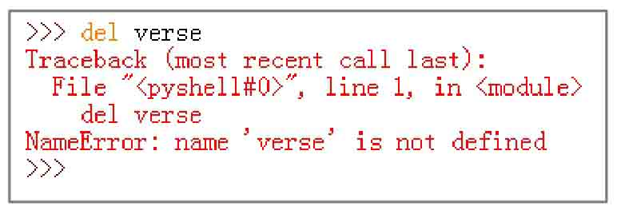

*图5.5 删除的列表不存在产生的异常信息*

<a id="isbn9787302503880_1_5_1_1_8"></a>

### 5.2.2 访问列表元素

在Python中，如果想将列表的内容输出也比较简单，可以直接使用print()函数。例如，要想打印上面列表中的untitle列表，则可以使用下面的代码。

```python
print(untitle)
```

执行结果如下：

```python
['Python', 28, '人生苦短，我用Python', ['爬虫', '自动化运维', '云计算', 'Web开发', '游戏']]
```

从上面的执行结果中可以看出，在输出列表时，是包括左右两侧的中括号的。如果不想输出全部的元素，也可以通过列表的索引获取指定的元素。例如，要获取列表untitle中索引为2的元素，可以使用下面的代码。

```python
print(untitle[2])
```

执行结果如下：

```python
人生苦短，我用Python
```

从上面的执行结果中可以看出，在输出单个列表元素时，不包括中括号，如果是字符串，还不包括左右的引号。

**【例5.1】** 输出每日一帖。**（实例位置：资源包\\TM\\sl\\05\\01）**

在IDLE中创建一个名称为tips.py的文件，然后在该文件中导入日期时间类，然后定义一个列表（保存7条励志文字作为每日一帖的内容），再获取当前的星期，最后将当前的星期作为列表的索引，输出元素内容，代码如下：

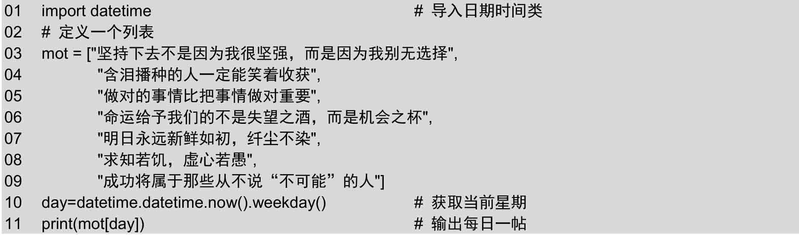

**说明**

在上面的代码中，datetime.datetime.now()方法用于获取当前日期，而weekday()方法则是从日期时间对象中获取星期，其值为0～6中的一个，为0时代表星期一，为1时代表星期二，依此类推，为6时代表星期日。

运行结果如图5.6所示。

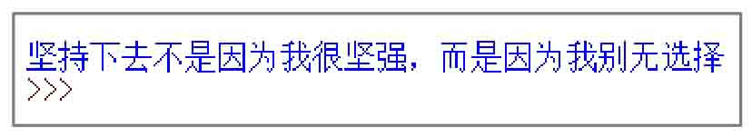

*图5.6 根据星期输出每日一帖*

**说明**

上面介绍的是访问列表中的单个元素。实际上，列表还可以通过切片操作实现处理列表中的部分元素。关于切片的详细介绍请参见5.1.2节。

<a id="isbn9787302503880_1_5_1_1_9"></a>

### 5.2.3 遍历列表

遍历列表中的所有元素是常用的一种操作，在遍历的过程中可以完成查询、处理等功能。在生活中，如果想要去商场买一件衣服，就需要在商场中逛一遍，看是否有想要的衣服，逛商场的过程就相当于列表的遍历操作。在Python中，遍历列表的方法有多种，下面介绍两种常用的方法。

<a id="isbn9787302503880_1_5_1_1_7_5"></a>

#### 1．直接使用for循环实现

直接使用for循环遍历列表，只能输出元素的值。它的语法格式如下：

```python
for item in listname:
    # 输出item
```

其中，item用于保存获取到的元素值，要输出元素内容时，直接输出该变量即可；listname为列表名称。

例如，定义一个保存一首古诗的列表，然后通过for循环遍历该列表，并输出各个诗句，代码如下：

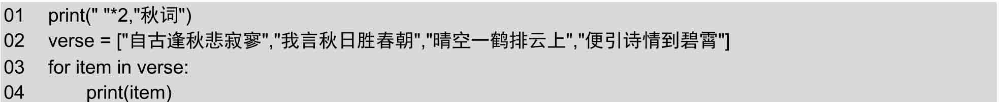

执行上面的代码，将显示如图5.7所示的结果。

<a id="isbn9787302503880_1_5_1_1_7_6"></a>

#### 2．使用for循环和enumerate()函数实现

使用for循环和enumerate()函数可以实现同时输出索引值和元素内容。它的语法格式如下：

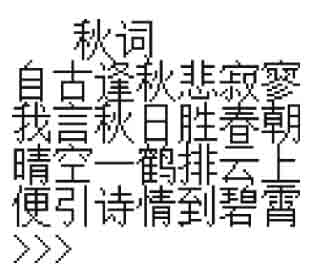

*图5.7 通过for循环遍历列表*

```python
for index,item in enumerate(listname):
    # 输出index和item
```

参数说明如下：


 index：用于保存元素的索引；


 item用于保存获取到的元素值，要输出元素内容时，直接输出该变量即可；


 listname为列表名称。

例如，定义一个保存一首古诗的列表，然后通过for循环和enumerate()函数遍历该列表，并输出索引和诗句，代码如下：

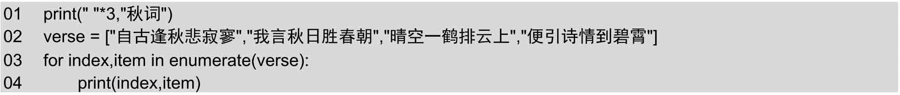

执行上面的代码，将显示下面的结果。

```python
    秋词
0 自古逢秋悲寂寥
1 我言秋日胜春朝
2 晴空一鹤排云上
3 便引诗情到碧霄
```

如果想实现两句一行输出各个诗句，请看下面的实例。

**【例5.2】** 每两句一行输出古诗《长歌行》。**（实例位置：资源包\\TM\\sl\\05\\02）**

在IDLE中创建一个名称为printverse.py的文件，并且在该文件中先输出古诗标题，然后定义一个列表（保存古诗内容），再应用for循环和enumerate()函数遍历列表，在循环体中通过if…else语句判断是否为偶数，如果为偶数则不换行输出，否则换行输出。代码如下：

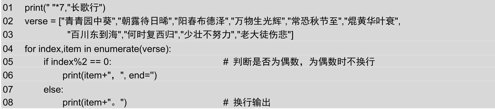

**说明**

在上面的代码中，在print()函数中使用“, end=''”表示不换行输出，即下一条print()函数的输出内容会和这个内容在同一行输出。

运行结果如图5.8所示。

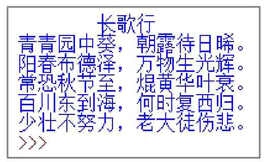

*图5.8 每两行一句输出古诗《长歌行》*

<a id="isbn9787302503880_1_5_1_1_10"></a>

### 5.2.4 添加、修改和删除列表元素

添加、修改和删除列表元素也称为更新列表。在实际开发时，经常需要对列表进行更新。下面分别介绍如何实现列表元素的添加、修改和删除。

<a id="isbn9787302503880_1_5_1_1_7_7"></a>

#### 1．添加元素

在5.1节序列概述中介绍了可以通过“+”号将两个序列连接，通过该方法也可以实现为列表添加元素。但是这种方法的执行速度要比直接使用列表对象的append()方法慢，所以建议在实现添加元素时，使用列表对象的append()方法实现。列表对象的append()方法用于在列表的末尾追加元素，它的语法格式如下：

```python
listname.append(obj)
```

其中，listname为要添加元素的列表名称；obj为要添加到列表末尾的对象。

例如，定义一个包括4个元素的列表，然后应用append()方法向该列表的末尾再添加一个元素，可以使用下面的代码。

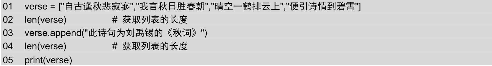

上面的代码在IDEL中的执行过程如图5.9所示。

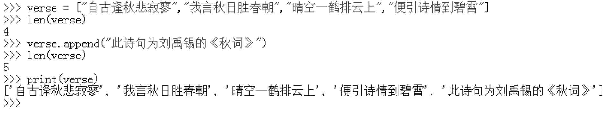

*图5.9 向列表中添加元素*

下面通过一个具体的实例演示为列表添加元素的应用。

**场景模拟：** 在20世纪50年代早期，Bryan Thwaites（史威兹）担任教师时，要求学生计算一组数列，其规则为：当某数是偶数时，将其除以2；如果是奇数，则先乘以3再加1。根据当时学生的探讨及史威兹本人的研究，这个序列最后必定会是数字1，并且出现1以后，又会按照“4"2"1”进行循环下去。所以将1视为这个序列的终点。本实例将创建一个列表，用于存储符合这个条件的序列。

**【例5.3】** 创建符合Bryan Thwaites要求的列表。**（实例位置：资源包\\TM\\sl\\05\\03）**

在IDLE中创建一个名称为numberlist.py的文件，然后在该文件中定义一个空列表，并定义一个表示初始值的变量a，让其等于6，然后创建一个无限循环，在该循环中，判断a是否为偶数，如果为偶数，则让其除以2，结果再赋值给a，否则让其乘以3再加1，结果也赋值给a，直到a等于1时，使用break语句跳出循环，另外在每次循环时，还需要把a的值添加到列表中，最后输出列表，代码如下：

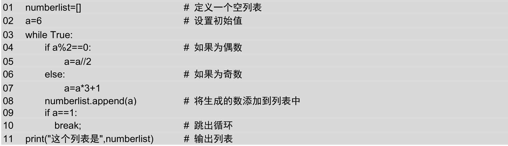

**说明**

在上面的代码中，之所以使用a//2，是因为这样代表整除，可以得到整数。

运行结果如图5.10所示。

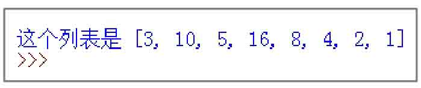

*图5.10 创建符合Bryan Thwaites要求的列表*

**说明**

在本实例中，设置的初始值是6，有兴趣的读者可以换为其他的数字试试。

**说明**

列表对象除了提供append()方法向列表中添加元素外，还提供了insert()方法向列表中添加元素。该方法用于向列表的指定位置插入元素。但是由于该方法的执行效率没有append()方法高，所以不推荐这种方法。

上面介绍的是向列表中添加一个元素，如果想要将一个列表中的全部元素添加到另一个列表中，可以使用列表对象的extend()方法实现。extend()方法的具体语法如下：

```python
listname.extend(seq)
```

其中，listname为原列表；seq为要添加的列表。语句执行后，seq2的内容将追加到listname的后面。

例如，创建两个列表，然后应用extend()方法将第一个列表添加到第二个列表中，具体代码如下：

```python
01  verse1 = ["常记溪亭日暮","沉醉不知归路","兴尽晚回舟","误入藕花深处","争渡","争渡","惊起一滩鸥鹭"]
02  verse2 = ["李清照","如梦令"]
03  verse2.extend(verse1)
04  print(verse2)
```

上面的代码运行后，将显示下面的内容。

□

```python
['李清照', '如梦令', '常记溪亭日暮', '沉醉不知归路', '兴尽晚回舟', '误入藕花深处', '争渡', '争渡', '惊起一滩鸥鹭']
```

<a id="isbn9787302503880_1_5_1_1_7_8"></a>

#### 2．修改元素

修改列表中的元素只需要通过索引获取该元素，然后再为其重新赋值即可。例如，定义一个保存3个元素的列表，然后修改索引值为2的元素，代码如下：

```python
01  verse = ["长亭外","古道边","芳草碧连天"]
02  print(verse)
03  verse[2] = "一行白鹭上青天"    # 修改列表的第3个元素
04  print(verse)
```

上面的代码在IDEL中的执行过程如图5.11所示。

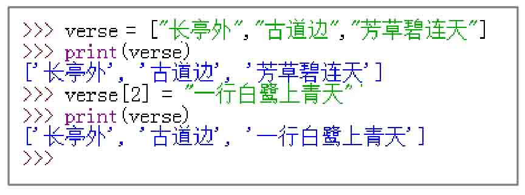

*图5.11 修改列表的指定元素*

<a id="isbn9787302503880_1_5_1_1_7_9"></a>

#### 3．删除元素

删除元素主要有两种情况，一种是根据索引删除，另一种是根据元素值进行删除。下面分别进行介绍。

（1）根据索引删除

删除列表中的指定元素和删除列表类似，也可以使用del语句实现。所不同的就是在指定列表名称时，换为列表元素。例如，定义一个保存3个元素的列表，删除最后一个元素，可以使用下面的代码。

```python
01  verse = ["长亭外","古道边","芳草碧连天"]
02  del verse[-1]
03  print(verse)
```

上面的代码在IDLE中的执行过程如图5.12所示。

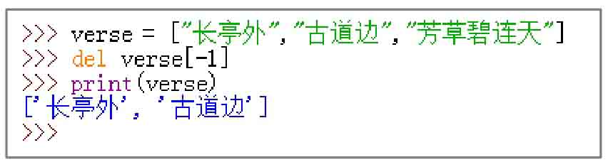

*图5.12 删除列表的指定元素*

（2）根据元素值删除

如果想要删除一个不确定其位置的元素（即根据元素值删除），可以使用列表对象的remove()方法实现。例如，要删除列表中内容为“古道边”的元素，可以使用下面的代码。

```python
01  verse = ["长亭外","古道边","芳草碧连天"]
02  verse.remove("古道边")
```

使用列表对象的remove()方法删除元素时，如果指定的元素不存在，将出现如图5.13所示的异常信息。

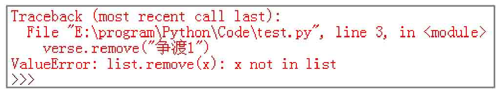

*图5.13 删除不存的元素时出现的异常信息*

所以在使用remove()方法删除元素前，最好先判断该元素是否存在，改进后的代码如下：

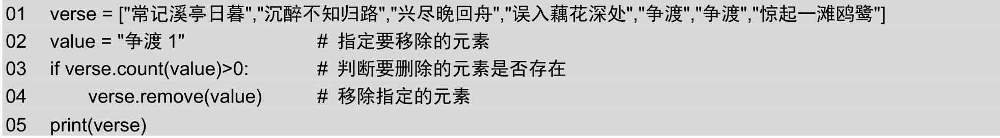

**说明**

列表对象的count()方法用于判断指定元素出现的次数，返回结果为0时，表示不存在该元素。关于count()方法的详细介绍请参见5.2.5节。

执行上面的代码后，将显示下面的列表原有内容：

□

```python
['常记溪亭日暮', '沉醉不知归路', '兴尽晚回舟', '误入藕花深处', '争渡', '争渡', '惊起一滩鸥鹭']
```

<a id="isbn9787302503880_1_5_1_1_11"></a>

### 5.2.5 对列表进行统计计算

Python的列表提供了内置的一些函数来实现统计计算方面的功能。下面介绍常用的功能。

<a id="isbn9787302503880_1_5_1_1_7_10"></a>

#### 1．获取指定元素出现的次数

使用列表对象的count()方法可以获取指定元素在列表中的出现次数。基本语法格式如下：

```python
listname.count(obj)
```

其中，listname表示列表的名称；obj表示要判断是否存在的对象，这里只能进行精确匹配，即不能是元素值的一部分。

例如，创建一个列表，内容为李清照的《如梦令》中的诗句，然后应用列表对象的count()方法判断元素“争渡”出现的次数，代码如下：

```python
01  verse = ["常记溪亭日暮","沉醉不知归路","兴尽晚回舟","误入藕花深处","争渡","争渡","惊起一滩鸥鹭"]
02  num = verse.count("争渡")
03  print(num)
```

上面的代码运行后，将显示2，表示在列表verse中“争渡”出现了两次。

<a id="isbn9787302503880_1_5_1_1_7_11"></a>

#### 2．获取指定元素首次出现的下标

使用列表对象的index()方法可以获取指定元素在列表中首次出现的位置（即索引）。基本语法格式如下：

```python
listname.index(obj)
```

参数说明如下：


 listname：表示列表的名称；


 obj：表示要查找的对象，这里只能进行精确匹配。如果指定的对象不存在，则抛出如图5.14所示的异常；


 返回值：首次出现的索引值。

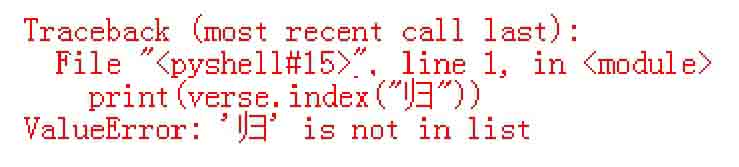

*图5.14 查找对象不存在时抛出的异常*

例如，创建一个列表，内容为李清照的《如梦令》中的诗句，然后应用列表对象的index()方法判断元素“争渡”首次出现的位置，代码如下：

```python
01  verse = ["常记溪亭日暮","沉醉不知归路","兴尽晚回舟","误入藕花深处","争渡","争渡","惊起一滩鸥鹭"]
02  position = verse.index("争渡")
03  print(position)
```

上面的代码运行后，将显示4，表示“争渡”在列表verse中首次出现的索引位置是4。

<a id="isbn9787302503880_1_5_1_1_7_12"></a>

#### 3．统计数值列表的元素和

在Python中，提供了sum()函数用于统计数值列表中各元素的和。语法格式如下：

```python
sum(iterable[,start])
```

参数说明如下：


 iterable：表示要统计的列表；


 start：表示统计结果是从哪个数开始（即将统计结果加上start所指定的数），是可选参数，如果没有指定，默认值为0。

例如，定义一个保存10名学生语文成绩的列表，然后应用sum()函数统计列表中元素的和，即统计总成绩，然后输出，代码如下：

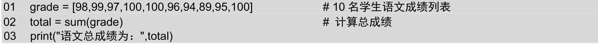

上面的代码执行后，将显示“语文总成绩为：968”。

<a id="isbn9787302503880_1_5_1_1_12"></a>

### 5.2.6 对列表进行排序

在实际开发时，经常需要对列表进行排序。Python中提供了两种常用的对列表进行排序的方法。下面分别进行介绍。

<a id="isbn9787302503880_1_5_1_1_7_13"></a>

#### 1．使用列表对象的sort()方法实现

列表对象提供了sort()方法用于对原列表中的元素进行排序。排序后原列表中的元素顺序将发生改变。列表对象的sort()方法的语法格式如下：

```python
listname.sort(key=None, reverse=False)
```

参数说明如下：


 listname：表示要进行排序的列表；


 key：表示指定一个从每个列表元素中提取一个比较键（例如，设置“key=str.lower”表示在排序时不区分字母大小写）；


 reverse：可选参数，如果将其值指定为True，则表示降序排列，如果为False，则表示升序排列。默认为升序排列。

例如，定义一个保存10名学生语文成绩的列表，然后应用sort()方法对其进行排序，代码如下：

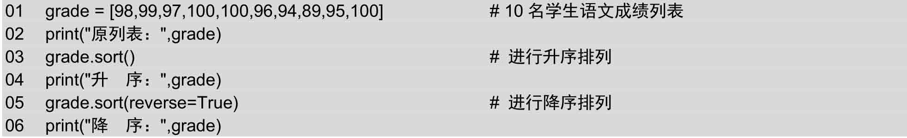

执行上面的代码，将显示以下内容。

```python
原列表：[98, 99, 97, 100, 100, 96, 94, 89, 95, 100]
升  序：[89, 94, 95, 96, 97, 98, 99, 100, 100, 100]
降  序：[100, 100, 100, 99, 98, 97, 96, 95, 94, 89]
```

使用sort()方法进行数值列表的排序比较简单，但是使用sort()方法对字符串列表进行排序时，采用的规则是先对大写字母进行排序，然后再对小写字母进行排序。如果想要对字符串列表进行排序（不区分大小写时），需要指定其key参数。例如，定义一个保存英文字符串的列表，然后应用sort()方法对其进行升序排列，可以使用下面的代码。

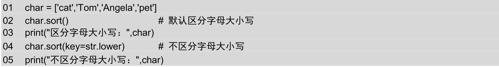

运行上面的代码，将显示以下内容。

```python
区分字母大小写： ['Angela', 'Tom', 'cat', 'pet']
不区分字母大小写： ['Angela', 'cat', 'pet', 'Tom']
```

**说明**

采用sort()方法对列表进行排序时，对于中文支持不好。排序的结果与我们常用的按拼音或者笔画都不一致。如果需要实现对中文内容的列表排序，还需要重新编写相应的方法进行处理，不能直接使用sort()方法。

<a id="isbn9787302503880_1_5_1_1_7_14"></a>

#### 2．使用内置的sorted()函数实现

在Python中，提供了一个内置的sorted()函数，用于对列表进行排序。使用该函数进行排序后，原列表的元素顺序不变。sorted()函数的语法格式如下：

```python
sorted(iterable, key=None, reverse=False)
```

参数说明如下：


 iterable：表示要进行排序的列表名称；


 key：表示指定从每个元素中提取一个用于比较的键（例如，设置“key=str.lower”表示在排序时不区分字母大小写）；


 reverse：可选参数，如果将其值指定为True，则表示降序排列，如果为False，则表示升序排列。默认为升序排列。

例如，定义一个保存10名学生语文成绩的列表，然后应用sorted()函数对其进行排序，代码如下：

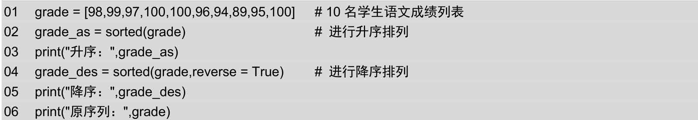

执行上面的代码，将显示以下内容。

```python
升序：[89, 94, 95, 96, 97, 98, 99, 100, 100, 100]
降序：[100, 100, 100, 99, 98, 97, 96, 95, 94, 89]
原序列：[98, 99, 97, 100, 100, 96, 94, 89, 95, 100]
```

**说明**

列表对象的sort()方法和内置sorted()函数的作用基本相同，所不同的就是使用sort()方法时，会改变原列表的元素排列顺序，但是使用sorted()函数时，会建立一个原列表的副本，该副本为排序后的列表。

<a id="isbn9787302503880_1_5_1_1_13"></a>

### 5.2.7 列表推导式

使用列表推导式可以快速生成一个列表，或者根据某个列表生成满足指定需求的列表。列表推导式通常有以下几种常用的语法格式。

（1）生成指定范围的数值列表，语法格式如下：

```python
list = [Expression for var in range]
```

参数说明如下：


 list：表示生成的列表名称；


 Expression：表达式，用于计算新列表的元素；


 var：循环变量；


 range：采用range()函数生成的range对象。

例如，要生成一个包括10个随机数的列表，要求数的范围在10~100（包括100），具体代码如下：

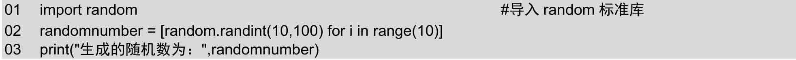

执行结果如下：

```python
生成的随机数为：[38, 12, 28, 26, 58, 67, 100, 41, 97, 15]
```

（2）根据列表生成指定需求的列表，语法格式如下：

```python
newlist = [Expression for var in list]
```

参数说明如下：


 newlist：表示新生成的列表名称；


 Expression：表达式，用于计算新列表的元素；


 var：变量，值为后面列表的每个元素值；


 list：用于生成新列表的原列表。

例如，定义一个记录商品价格的列表，然后应用列表推导式生成一个将全部商品价格打五折的列表，具体代码如下：

```python
01  price = [1200,5330,2988,6200,1998,8888]
02  sale = [int(x*0.5) for x in price]
03  print("原价格：",price)
04  print("打五折的价格：",sale)
```

执行结果如下：

```python
原价格： [1200, 5330, 2988, 6200, 1998, 8888]
打五折的价格： [600, 2665, 1494, 3100, 999, 4444]
```

（3）从列表中选择符合条件的元素组成新的列表，语法格式如下：

```python
newlist = [Expression for var in list if condition]
```

参数说明如下：


 newlist：表示新生成的列表名称；


 Expression：表达式，用于计算新列表的元素；


 var：变量，值为后面列表的每个元素值；


 list：用于生成新列表的原列表；


 condition：条件表达式，用于指定筛选条件。

例如，定义一个记录商品价格的列表，然后应用列表推导式生成一个商品价格高于5000的列表，具体代码如下：

```python
01  price = [1200,5330,2988,6200,1998,8888]
02  sale = [x for x in price if x>5000]
03  print("原列表：",price)
04  print("价格高于5000的：",sale)
```

执行结果如下：

```python
原列表： [1200, 5330, 2988, 6200, 1998, 8888]
价格高于5000的： [5330, 6200, 8888]
```

<a id="isbn9787302503880_1_5_1_1_14"></a>

### 5.2.8 二维列表

在Python中，由于列表元素可以是列表，所以它也支持二维列表的概念。那么什么是二维列表呢？前文提到酒店有很多房间，这些房间都可以构成一个列表，如果这个酒店有500个房间，那么拿到499号房钥匙的旅客可能就不高兴了，从1号房走到499号房要花好长时间，因此酒店设置了很多楼层，每个楼层都会有很多房间，形成一个立体的结构，把大量的房间均摊到每个楼层，这种结构就是二维列表结构。使用二维列表结构表示酒店每个楼层的房间号的效果如图5.15所示。

二维列表中的信息以行和列的形式表示，第一个下标代表元素所在的行，第二个下标代表元素所在的列。

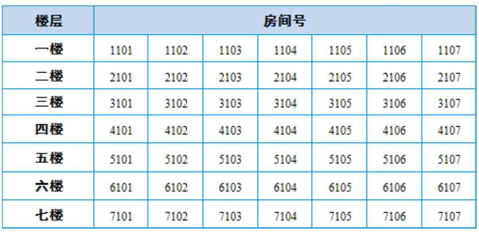

*图5.15 二维列表结构的楼层房间号*

在Python中，创建二维列表有以下3种常用的方法。

<a id="isbn9787302503880_1_5_1_1_7_15"></a>

#### 1．直接定义二维列表

在Python中，二维列表就是包含列表的列表。即一个列表的每个元素又都是一个列表。例如，下面的列表就是二维列表。

```python
[['移', '舟', '泊', '烟', '渚'],
['日', '暮', '客', '愁', '新'],
['野', '旷', '天', '低', '树'],
['江', '清', '月', '近', '人']]
```

所以在创建二维列表时，可以直接使用下面的语法格式进行定义。

```python
listname = [[元素11, 元素12, 元素13, ..., 元素1n],
 [元素21, 元素22, 元素23, ..., 元素2n],
 ...,
 [元素n1, 元素n2, 元素n3, ..., 元素nn]]
```

参数说明如下：


 listname：表示生成的列表名称；


 \[元素11，元素12，元素13，...，元素1n\]：表示二维列表的第一行，也是一个列表。其中元素11、元素12……代表第一行中的列；


 \[元素21，元素22，元素23，...，元素2n\]：表示二维列表的第二行；


 \[元素n1，元素n2，元素n3，...，元素nn\]：表示二维列表的第n行。

例如，定义一个包含4行5列的二维列表，可以使用下面的代码。

```python
01  verse = [['移', '舟', '泊', '烟', '渚'], ['日', '暮', '客', '愁', '新'],
02  ['野', '旷', '天', '低', '树'], ['江', '清', '月', '近', '人']]
```

上面的代码，将创建以下二维列表。

```python
[['移', '舟', '泊', '烟', '渚'], ['日', '暮', '客', '愁', '新'], ['野', '旷', '天', '低', '树'], ['江', '清', '月', '近', '人']]
```

<a id="isbn9787302503880_1_5_1_1_7_16"></a>

#### 2．使用嵌套的for循环创建

创建二维列表，可以使用嵌套的for循环实现。例如，创建一个包含4行5列的二维列表，可以使用下面的代码。

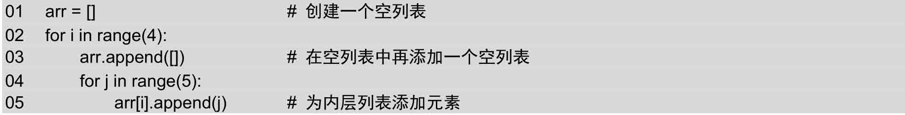

上面代码在执行后，将创建以下二维列表。

```python
[[0, 1, 2, 3, 4], [0, 1, 2, 3, 4], [0, 1, 2, 3, 4], [0, 1, 2, 3, 4]]
```

<a id="isbn9787302503880_1_5_1_1_7_17"></a>

#### 3．使用列表推导式创建

使用列表推导式也可以创建二维列表，而且这种方法也是推荐的方法，因为它比较简洁。例如，使用列表推导式创建一个包含4行5列的二维列表可以使用下面的代码。

```python
arr = [[j for j in range(5)] for i in range(4)]
```

上面代码在执行后，将创建以下二维列表。

```python
[[0, 1, 2, 3, 4], [0, 1, 2, 3, 4], [0, 1, 2, 3, 4], [0, 1, 2, 3, 4]]
```

创建二维数组后，可以通过以下语法格式访问列表中的元素。

```python
listname[下标1][下标2]
```

参数说明如下：


 listname：表示列表名称；


 下标1：表示列表中第几行，下标值从0开始，即第一行的下标为0；


 下标2：表示列表中第几列，下标值从0开始，即第一列的下标为0。

例如，要访问二维列表中的第2行、第4列，可以使用下面的代码。

```python
verse[1][3]
```

下面通过一个具体的实例演示二维列表的应用。

**【例5.4】** 使用二维列表输出不同版式的古诗《宿建德江》。**（实例位置：资源包\\TM\\sl\\05\\04）**

在IDLE中创建一个名称为printverse.py的文件，然后在该文件中首先定义4个字符串，内容为古诗《宿建德江》的诗句，并定义一个二维列表，然后应用嵌套的for循环将古诗以横版方式输出，再将二维列表进行逆序排列，最后应用嵌套的for循环将古诗以竖版方式输出，代码如下：

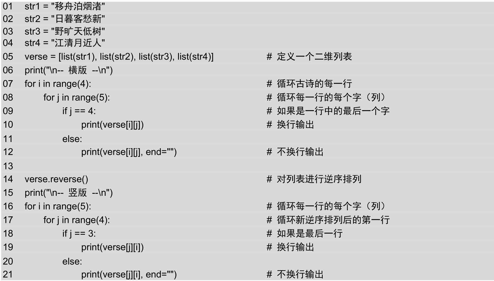

**说明**

在上面的代码中，list()函数用于将字符串转换为列表；列表对象的reverse()方法用于对列表进行逆序排列，即将列表的最后一个元素移到第一个，倒数第二个元素移到第二个，依此类推。

运行结果如图5.16所示。

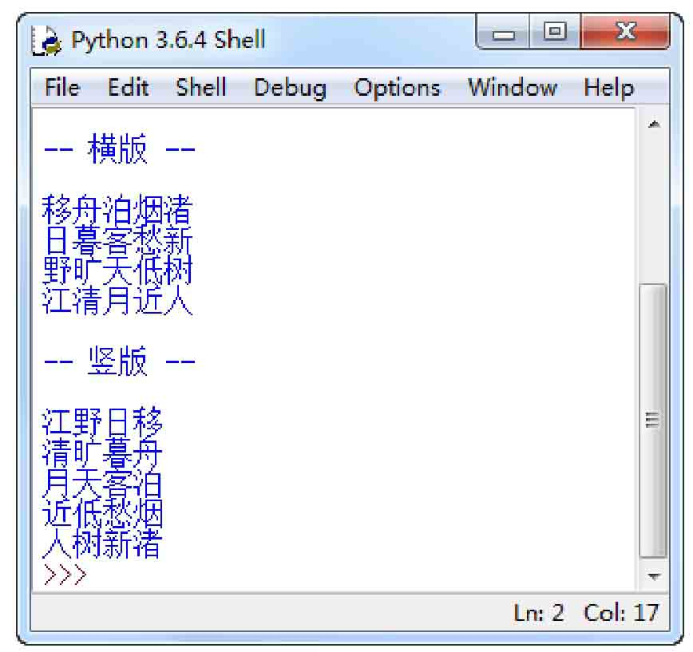

*图5.16 使用二维列表输出古诗《宿建德江》*

<a id="isbn9787302503880_1_5_1_3"></a>

## 5.3 元组

元组（tuple）是Python中另一个重要的序列结构，与列表类似，也是由一系列按特定顺序排列的元素组成。但是它是不可变序列。因此，元组也可以称为不可变的列表。在形式上，元组的所有元素都放在一对小括号“()”中，两个相邻元素间使用逗号“,”分隔。在内容上，可以将整数、实数、字符串、列表、元组等任何类型的内容放入元组中，并且同一个元组中，元素的类型可以不同，因为它们之间没有任何关系。通常情况下，元组用于保存程序中不可修改的内容。

**说明**

从元组和列表的定义上看，这两种结构比较相似，那么它们之间有哪些区别呢？它们之间的主要区别就是一个是不可变序列，一个是可变序列。即元组中的元素不可以单独修改，而列表则可以任意修改。

<a id="isbn9787302503880_1_5_1_1_15"></a>

### 5.3.1 元组的创建和删除

在Python中提供了多种创建元组的方法，下面分别进行介绍。

<a id="isbn9787302503880_1_5_1_1_7_18"></a>

#### 1．使用赋值运算符直接创建元组

同其他类型的Python变量一样，创建元组时，也可以使用赋值运算符“=”直接将一个元组赋值给变量。具体的语法格式如下：

```python
tuplename = (element 1,element 2,element 3,...,element n)
```

其中，tuplename表示元组的名称，可以是任何符合Python命名规则的标识符；element 1、element 2、element 3、element n表示元组中的元素，个数没有限制，并且只要是Python支持的数据类型就可以。

**注意**

创建元组的语法与创建列表的语法类似，只是创建列表时使用的是中括号“\[\]”，而创建元组时使用的是小括号“()”。

例如，下面定义的都是合法的元组。

```python
01  num = (7,14,21,28,35,42,49,56,63)
02  ukguzheng = ("渔舟唱晚","高山流水","出水莲","汉宫秋月")
03  untitle = ('Python',28,("人生苦短","我用Python"),["爬虫","自动化运维","云计算","Web开发"])
04  python = ('优雅',"明确",'''简单''')
```

在Python中，虽然元组是使用一对小括号将所有的元素括起来。但是实际上，小括号并不是必需的，只要将一组值用逗号分隔开来，Python就可以认为它是元组。例如，下面的代码定义的也是元组。

```python
ukguzheng = "渔舟唱晚","高山流水","出水莲","汉宫秋月"
```

在IDLE中输出该元组后，将显示以下内容。

```python
('渔舟唱晚', '高山流水', '出水莲', '汉宫秋月')
```

如果要创建的元组只包括一个元素，则需要在定义元组时，在元素的后面加一个逗号“,”。例如，下面的代码定义的就是包括一个元素的元组。

```python
verse = ("一片冰心在玉壶",)
```

在IDLE中输出verse，将显示以下内容。

```python
('一片冰心在玉壶',)
```

而下面的代码，则表示定义一个字符串。

```python
verse = ("一片冰心在玉壶")
```

在IDLE中输出verse，将显示以下内容。

```python
一片冰心在玉壶
```

**说明**

在Python中，可以使用type()函数测试变量的类型。例如下面的代码：

```python
01  verse1 = ("一片冰心在玉壶",)
02  print("verse1的类型为",type(verse1))
03  verse2 = ("一片冰心在玉壶")
04  print("verse2的类型为",type(verse2))
```

在IDLE中执行上面的代码，将显示以下内容。

```python
verse1的类型为 <class 'tuple'>
verse2的类型为 <class 'str'>
```

<a id="isbn9787302503880_1_5_1_1_7_19"></a>

#### 2．创建空元组

在Python中，也可以创建空元组，例如，要创建一个名称为emptytuple的空元组，可以使用下面的代码：

```python
emptytuple = ()
```

空元组可以应用在为函数传递一个空值或者返回空值时。例如，定义一个函数必须传递一个元组类型的值，而我们还不想为它传递一组数据，那么就可以创建一个空元组传递给它。

<a id="isbn9787302503880_1_5_1_1_7_20"></a>

#### 3．创建数值元组

在Python中，可以使用tuple()函数直接将range()函数循环出来的结果转换为数值元组。

**说明**

关于range()函数的详细介绍请参见4.3.2节。

tuple()函数的基本语法如下：

```python
tuple(data)
```

其中，data表示可以转换为元组的数据，其类型可以是range对象、字符串、元组或者其他可迭代类型的数据。

例如，创建一个10~20（不包括20）中所有偶数的元组，可以使用下面的代码。

```python
tuple(range(10, 20, 2))
```

运行上面的代码后，将得到下面的列表。

```python
(10, 12, 14, 16, 18)
```

**说明**

使用tuple()函数不仅能通过range对象创建元组，还可以通过其他对象创建元组。

<a id="isbn9787302503880_1_5_1_1_7_21"></a>

#### 4．删除元组

对于已经创建的元组，不再使用时，可以使用del语句将其删除。语法格式如下：

```python
del tuplename
```

其中，tuplename为要删除元组的名称。

**说明**

del语句在实际开发时，并不常用。因为Python自带的垃圾回收机制会自动销毁不用的元组，所以即使我们不手动将其删除，Python也会自动将其回收。

例如，定义一个名称为verse的元组，然后再应用del语句将其删除，可以使用下面的代码。

```python
01  verse = ("自古逢秋悲寂寥","我言秋日胜春朝","晴空一鹤排云上","便引诗情到碧霄")
02  del verse
```

**场景模拟：** 假设有一家伊米咖啡馆，只提供6种咖啡，并且不会改变。请使用元组保存该咖啡馆里提供的咖啡名称。

**【例5.5】** 使用元组保存咖啡馆里提供的咖啡名称。**（实例位置：资源包\\TM\\sl\\05\\05）**

在IDLE中创建一个名称为cafe\_coffeename.py的文件，然后在该文件中定义一个包含6个元素的元组，内容为伊米咖啡馆里的咖啡名称，并且输出该元组，代码如下：

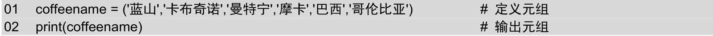

运行结果如图5.17所示。

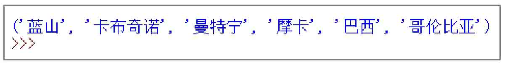

*图5.17 使用元组保存咖啡馆里提供的咖啡名称*

<a id="isbn9787302503880_1_5_1_1_16"></a>

### 5.3.2 访问元组元素

在Python中，如果想将元组的内容输出也比较简单，可以直接使用print()函数。例如，要想打印上面元组中的untitle元组，则可以使用下面的代码。

```python
print(untitle)
```

执行结果如下：

```python
('Python', 28, ('人生苦短', '我用Python'), ['爬虫', '自动化运维', '云计算', 'Web开发'])
```

从上面的执行结果中可以看出，在输出元组时，是包括左右两侧的小括号的。如果不想输出全部元素，也可以通过元组的索引获取指定的元素。例如，要获取元组untitle中索引为0的元素，可以使用下面的代码。

```python
print(untitle[0])
```

执行结果如下：

```python
Python
```

从上面的执行结果中可以看出，在输出单个元组元素时，不包括小括号，如果是字符串，还不包括左右的引号。

另外，对于元组也可以采用切片方式获取指定的元素。例如，要访问元组untitle中前3个元素，可以使用下面的代码。

```python
print(untitle[:3])
```

执行结果如下：

```python
('Python', 28, ('人生苦短', '我用Python'))
```

同列表一样，元组也可以使用for循环进行遍历。下面通过一个具体的实例演示如何通过for循环遍历元组。

**场景模拟：** 仍然是伊米咖啡馆，这时有客人到了，服务员向客人介绍本店提供的咖啡。

**【例5.6】** 使用for循环列出咖啡馆里的咖啡名称。**（实例位置：资源包\\TM\\sl\\05\\06）**

在IDLE中创建一个名称为cafe\_coffeename.py的文件，然后在该文件中定义一个包含6个元素的元组，内容为伊米咖啡馆里的咖啡名称，然后应用for循环语句输出每个元组元素的值，即咖啡名称，并且在后面加上“咖啡”二字，代码如下：

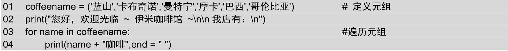

运行结果如图5.18所示。

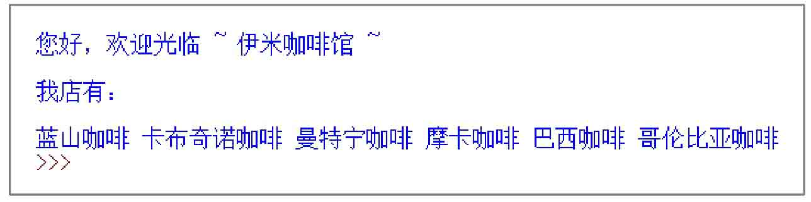

*图5.18 使用元组保存咖啡馆里提供的咖啡名称*

另外，元组还可以使用for循环和enumerate()函数结合进行遍历。下面通过一个具体的实例演示如何通过for循环和enumerate()函数结合遍历元组。

**说明**

enumerate()函数用于将一个可遍历的数据对象（如列表或元组）组合为一个索引序列，同时列出数据和数据下标，一般在for循环中使用。

**【例5.7】** 使用元组实现每两行一句输出古诗《长歌行》。**（实例位置：资源包\\TM\\sl\\05\\07）**

本实例将在实例5.2的基础上进行修改，将列表修改为元组，其他内容不变，修改后的代码如下：

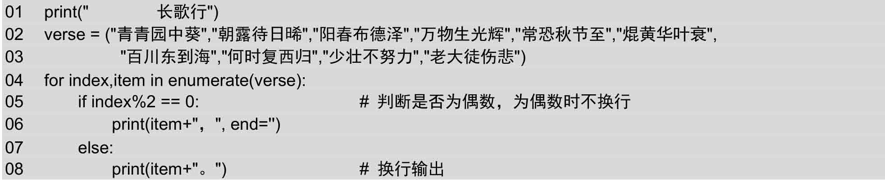

**说明**

在上面的代码中，在print()函数中使用“, end=''”表示不换行输出，即下一条print()函数的输出内容会和这个内容在同一行输出。

运行结果如图5.19所示。

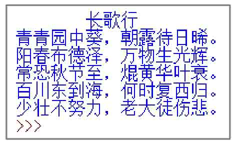

*图5.19 每两行一句输出古诗《长歌行》*

<a id="isbn9787302503880_1_5_1_1_17"></a>

### 5.3.3 修改元组

**场景模拟：** 仍然是伊米咖啡馆，因为巴西咖啡断货，所以店长想要把它换成土耳其咖啡。

**【例5.8】** 替换巴西咖啡为土耳其咖啡。**（实例位置：资源包\\TM\\sl\\05\\08）**

在IDLE中创建一个名称为cafe\_replace.py的文件，然后在该文件中定义一个包含6个元素的元组，内容为伊米咖啡馆里的咖啡名称，然后修改其中的第5个元素的内容为“土耳其”，代码如下：

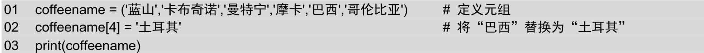

运行结果如图5.20所示。

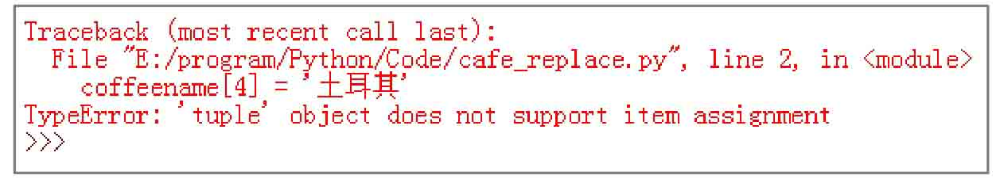

*图5.20 替换巴西咖啡为土耳其咖啡出现异常*

元组是不可变序列，所以我们不能对它的单个元素值进行修改，但是元组也不是完全不能修改。我们可以对元组进行重新赋值。例如，下面的代码是允许的。

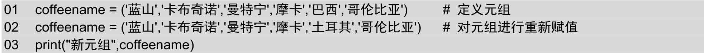

执行结果如下。

```python
新元组 ('蓝山', '卡布奇诺', '曼特宁', '摩卡', '土耳其', '哥伦比亚')
```

从上面的执行结果可以看出，元组coffeename的值已经改变。

另外，还可以对元组进行连接组合。例如，可以使用下面的代码实现在已经存在的元组结尾处添加一个新元组。

```python
01  ukguzheng = ('蓝山','卡布奇诺','曼特宁','摩卡')
02  print("原元组：",ukguzheng)
03  ukguzheng = ukguzheng + ('巴西','哥伦比亚')
04  print("组合后：",ukguzheng)
```

执行结果如下。

```python
原元组： ('蓝山', '卡布奇诺', '曼特宁', '摩卡')
组合后： ('蓝山', '卡布奇诺', '曼特宁', '摩卡', '土耳其', '哥伦比亚')
```

**注意**

在进行元组连接时，连接的内容必须都是元组。不能将元组和字符串或者列表进行连接。例如，下面的代码就是错误的。

```python
01  ukguzheng = '蓝山','卡布奇诺','曼特宁','摩卡')
02  ukguzheng = ukguzheng + ['巴西','哥伦比亚']
```

**说明**

在进行元组连接时，如果要连接的元组只有一个元素，一定不要忘记后面的逗号。例如，使用下面的代码将生产如图5.21所示的错误。

```python
01  ukguzheng = ('蓝山','卡布奇诺','曼特宁','摩卡')
02  ukguzheng = ukguzheng + ('巴西')
```

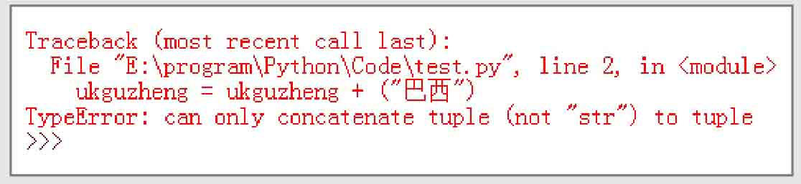

*图5.21 在进行元组连接时产生的异常*

<a id="isbn9787302503880_1_5_1_1_18"></a>

### 5.3.4 元组推导式

使用元组推导式可以快速生成一个元组，它的表现形式和列表推导式类似，只是将列表推导式中的中括号“\[\]”修改为小括号“()”。例如，我们可以使用下面的代码生成一个包含10个随机数的元组。

```python
01  import random  #导入random标准库
02  randomnumber = (random.randint(10,100) for i in range(10))
03  print("生成的元组为：",randomnumber)
```

执行结果如下：

```python
生成的元组为： <generator object <genexpr> at 0x0000000003056620>
```

从上面的执行结果中可以看出，使用元组推导式生成的结果并不是一个元组或者列表，而是一个生成器对象，这一点和列表推导式是不同的。要使用该生成器对象，可以将其转换为元组或者列表。其中，转换为元组使用tuple()函数，而转换为列表则使用list()函数。

例如，使用元组推导式生成一个包含10个随机数的生成器对象，然后将其转换为元组并输出，可以使用下面的代码。

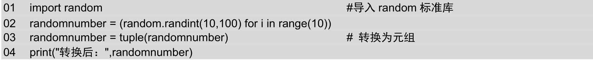

执行结果如下：

```python
转换后： (76, 54, 74, 63, 61, 71, 53, 75, 61, 55)
```

要使用通过元组推导器生成的生成器对象，还可以直接通过for循环遍历或者直接使用\_\_next()\_\_方法进行遍历。

**说明**

在Python 2.x中，\_\_next\_\_()方法为next()，也是用于遍历生成器对象的。

例如，通过生成器推导式生成一个包含3个元素的生成器对象number，然后调用3次\_\_next\_\_()方法输出每个元素，再将生成器对象number转换为元组输出，代码如下：

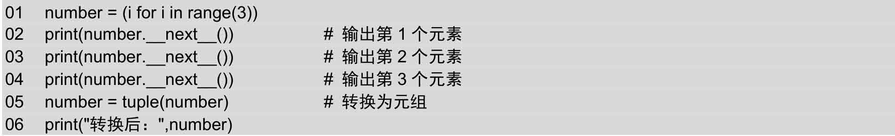

上面的代码运行后，将显示以下结果。

```python
0
1
2
转换后： ()
```

再如，通过生成器推导式生成一个包括4个元素的生成器对象number，然后应用for循环遍历该生成器对象，并输出每个元素的值，最后再将其转换为元组输出，代码如下：

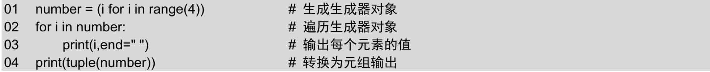

执行结果如下：

```python
0 1 2 3 ()
```

从上面的两个示例中可以看出，无论通过哪种方法遍历，如果还想再使用该生成器对象，都必须重新创建一个生成器对象。因为遍历后，原生成器对象已经不存在了。

<a id="isbn9787302503880_1_5_1_1_19"></a>

### 5.3.5 元组与列表的区别

元组和列表都属于序列，而且它们又都可以按照特定顺序存放一组元素，类型又不受限制，只要是Python支持的类型都可以。那么它们之间有什么区别呢？

简单理解：列表类似于我们用铅笔在纸上写下自己喜欢的歌曲，写错了还可以擦掉。而元组则类似于用钢笔写下的歌曲名字，写上了就擦不掉了，除非换一张纸重写。

列表和元组的区别主要体现在以下5个方面。

（1）列表属于可变序列，它的元素可以随时修改或者删除，而元组属于不可变序列，其中的元素不可以修改，除非整体替换。

（2）列表可以使用append()、extend()、insert()、remove()和pop()等方法实现添加和修改列表元素，而元组则没有这几个方法，因为不能向元组中添加和修改元素。同样，也不能删除元素。

（3）列表可以使用切片访问和修改列表中的元素。元组也支持切片，但是它只支持通过切片访问元组中的元素，不支持修改。

（4）元组比列表的访问和处理速度快。所以如果只需要对其中的元素进行访问，而不进行任何修改，建议使用元组而不使用列表。

（5）列表不能作为字典的键，而元组可以。

<a id="isbn9787302503880_1_5_1_4"></a>

## 5.4 小结

本章首先对Python中的序列及序列的常用操作进行了简要的介绍，然后重点介绍了Python中的列表和元组，其中，元组可以理解为被上了“枷锁”的列表，即元组中的元素不可以修改。在介绍元组和列表时还分别介绍了采用推导式来创建列表或元组。这种方式可以快速生成想要的列表和元组，如果符合条件，推荐采用该方式。
