<a id="isbn9787302503880_2_8"></a>

# 第8章  Python中使用正则表达式

**（


 视频讲解：45分钟）**

正则表达式（Regular Expression，常简写为regex或者RE），又称规则表达式，它不是某个编程语言所特有的，是计算机科学的一个概念，通常被用来检索和替换符合某些规则的文本。目前，正则表达式已经在各种计算机语言（如Java、C#和Python等）中得到了广泛的应用和发展。

在Python中，可以使用正则表达式进行与字符串相关的一些匹配。本章将重点介绍如何在Python中使用正则表达式。

通过阅读本章，您可以：


 了解正则表达式的基本语法


 掌握在Python中使用正则表达式的语法格式


 掌握如何使用re模块匹配字符串


 掌握使用re模块替换字符串的方法


 掌握如何使用正则表达式分割字符串

<a id="isbn9787302503880_2_8_1_1"></a>

## 8.1 正则表达式语法

在处理字符串时，经常会有查找符合某些复杂规则的字符串的需求。正则表达式就是用于描述这些规则的工具。换句话说，正则表达式就是记录文本规则的代码。对于接触过DOS的用户来说，如果想匹配当前文件夹下所有的文本文件，可以输入“dir \*.txt”命令，按Enter键后，所有“.txt”文件将会被列出来。这里的“\*.txt”即可理解为一个简单的正则表达式。

<a id="isbn9787302503880_2_8_1_1_1"></a>

### 8.1.1 行定位符

行定位符就是用来描述字符串的边界。“^”表示行的开始；“$”表示行的结尾。如：

```python
^tm
```

该表达式表示要匹配字符串tm的开始位置是行头，如tm equal Tomorrow Moon就可以匹配，而Tomorrow Moon equal tm则不匹配。但如果使用：

```python
tm$
```

后者可以匹配，而前者不能匹配。如果要匹配的字符串可以出现在字符串的任意部分，那么可以直接写成：

```python
tm
```

这样，两个字符串就都可以匹配了。

<a id="isbn9787302503880_2_8_1_1_2"></a>

### 8.1.2 元字符

现在我们已经知道几个很有用的元字符了，如^和$。其实，正则表达式里还有更多的元字符，下面来看看更多的例子：

```python
\bmr\w*\b
```

匹配以字母mr开头的单词，先是从某个单词开始处（\\b），然后匹配字母mr，接着是任意数量的字母或数字（\\w\*），最后是单词结束处（\\b）。该表达式可以匹配“mrsoft”、“mrbook”和“mr123456”等。更多常用元字符如表8.1所示。

**表8.1 常用元字符**

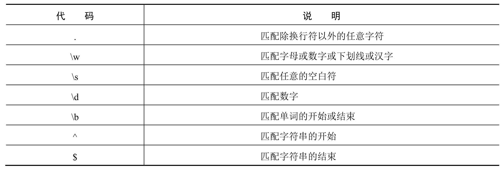

<a id="isbn9787302503880_2_8_1_1_3"></a>

### 8.1.3 重复

在8.1.2节的例子中，使用“\\w\*”匹配任意数量的字母或数字。如果想匹配特定数量的数字，该如何表示呢？正则表达式为我们提供了限定符（指定数量的字符）来实现该功能。例如，匹配8位QQ号可用如下表达式：

```python
^\d{8}$
```

常用的限定符如表8.2所示。

**表8.2 常用限定符**

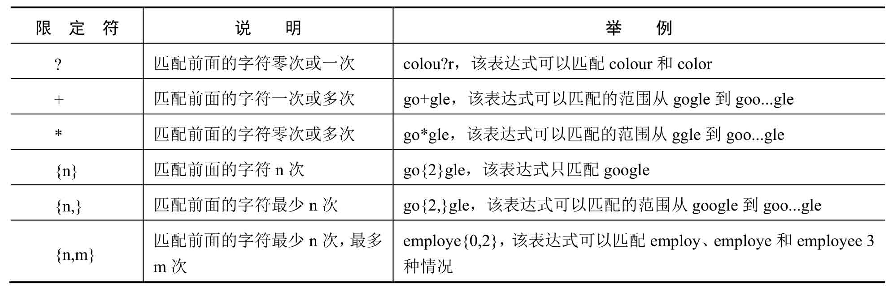

<a id="isbn9787302503880_2_8_1_1_4"></a>

### 8.1.4 字符类

正则表达式查找数字和字母是很简单的，因为已经有了对应这些字符集合的元字符（如\\d，\\w），但是如果要匹配没有预定义元字符的字符集合（比如元音字母a, e, i, o, u），应该怎么办？

很简单，只需要在方括号里列出它们就行了，像\[aeiou\]就匹配任何一个英文元音字母，\[.?!\]匹配标点符号“.”、“?”或“!”。也可以轻松地指定一个字符范围，像\[0-9\]代表的含义与\\d就是完全一致的：代表一位数字；同理，\[a-z0-9A-Z\_\]也完全等同于\\w（如果只考虑英文的话）。

**说明**

要想匹配给定字符串中任意一个汉字，可以使用\[\\u4e00-\\u9fa5\]；如果要匹配连续多个汉字，可以使用\[\\u4e00-\\u9fa5\]+。

<a id="isbn9787302503880_2_8_1_1_5"></a>

### 8.1.5 排除字符

在8.1.4节列出的是匹配符合指定字符集合的字符串。现在反过来，匹配不符合指定字符集合的字符串。正则表达式提供了“^”字符。这个元字符在8.1.1节中出现过，表示行的开始，而这里将会放到方括号中，表示排除的意思。例如：

```python
[^a-zA-Z]
```

该表达式用于匹配一个不是字母的字符。

<a id="isbn9787302503880_2_8_1_1_6"></a>

### 8.1.6 选择字符

试想一下，如何匹配身份证号码呢？首先需要了解一下身份证号码的规则。身份证号码长度为15位或者18位。如果为15位，则全为数字；如果为18位，前17位为数字，最后一位是校验位，可能为数字或字符X。

在上面的描述中，包含着条件选择的逻辑，这就需要使用选择字符（\|）来实现。该字符可以理解为“或”，匹配身份证的表达式可以写成如下方式：

```python
(^\d{15}$)|(^\d{18}$)|(^\d{17})(\d|X|x)$
```

该表达式的意思是可以匹配15位数字，或者18位数字，或者17位数字和最后一位。最后一位可以是数字或者是X或者是x。

<a id="isbn9787302503880_2_8_1_1_7"></a>

### 8.1.7 转义字符

正则表达式中的转义字符（\\）和Python中的大同小异，都是将特殊字符（如“.”“?”“\\”等）变为普通的字符。举一个IP地址的实例，用正则表达式匹配如127.0.0.1这样格式的IP地址。如果直接使用点字符，格式为：

```python
[1-9]{1,3}.[0-9]{1,3}.[0-9]{1,3}.[0-9]{1,3}
```

这显然不对，因为“.”可以匹配一个任意字符。这时，不仅是127.0.0.1这样的IP，连127101011这样的字串也会被匹配出来。所以在使用“.”时，需要使用转义字符（\\）。修改后，上面的正则表达式格式为：

```python
[1-9]{1,3}\.[0-9]{1,3}\.[0-9]{1,3}\.[0-9]{1,3}
```

**说明**

括号在正则表达式中也算是一个元字符。

<a id="isbn9787302503880_2_8_1_1_8"></a>

### 8.1.8 分组

通过8.1.6节中的例子，相信读者已经对小括号的作用有了一定的了解。小括号字符的第一个作用就是可以改变限定符的作用范围，如“\|”“\*”“^”等。来看下面的一个表达式。

```python
(thir|four)th
```

这个表达式的意思是匹配单词thirth或fourth，如果不使用小括号，那么就变成了匹配单词thir和fourth了。

小括号的第二个作用是分组，也就是子表达式。例如(\\.\[0-9\]{1,3}){3}，就是对分组(\\.\[0-9\]{1,3})进行重复操作。

<a id="isbn9787302503880_2_8_1_1_9"></a>

### 8.1.9 在Python中使用正则表达式语法

在Python中使用正则表达式时，是将其作为模式字符串使用的。例如，将匹配不是字母的一个字符的正则表达式表示为模式字符串，可以使用下面的代码：

```python
'[^a-zA-Z]'
```

而如果将匹配以字母m开头的单词的正则表达式转换为模式字符串，则不能直接在其两侧添加引号定界符，例如，下面的代码是不正确的。

```python
'\bm\w*\b'
```

而是需要将其中的“\\”进行转义，转换后的代码为：

```python
'\\bm\\w*\\b'
```

由于模式字符串中可能包括大量的特殊字符和反斜杠，所以需要写为原生字符串，即在模式字符串前加r或R。例如，上面的模式字符串采用原生字符串表示就是：

```python
r'\bm\w*\b'
```

**说明**

在编写模式字符串时，并不是所有的反斜杠都需要进行转换。例如，前面编写的正则表达式“^\\d{8}$”中的反斜杠就不需要转义，因为其中的\\d并没有特殊意义。不过，为了编写方便，本书中所写正则表达式都采用原生字符串表示。

<a id="isbn9787302503880_2_8_1_2"></a>

## 8.2 使用re模块实现正则表达式操作

在8.1节介绍了正则表达式的语法，本节将介绍如何在Python中使用正则表达式。Python提供了re模块，用于实现正则表达式的操作。在实现时，可以使用re模块提供的方法（如search()、match()、findall()等）进行字符串处理，也可以先使用re模块的compile()方法将模式字符串转换为正则表达式对象，然后再使用该正则表达式对象的相关方法来操作字符串。

re模块在使用时，需要先应用import语句引入，具体代码如下：

```python
import re
```

如果在使用re模块时，未将其引入，将抛出如图8.1所示的异常。

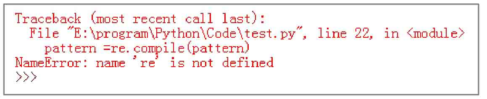

*图8.1 未引入re模块异常*

<a id="isbn9787302503880_2_8_1_1_10"></a>

### 8.2.1 匹配字符串

匹配字符串可以使用re模块提供的match()、search()和findall()等方法。下面分别进行介绍。

<a id="isbn9787302503880_2_8_1_1_10_1"></a>

#### 1．使用match()方法进行匹配

match()方法用于从字符串的开始处进行匹配，如果在起始位置匹配成功，则返回Match对象，否则返回None。其语法格式如下：

```python
re.match(pattern, string, [flags])
```

参数说明如下：


 pattern：表示模式字符串，由要匹配的正则表达式转换而来。


 string：表示要匹配的字符串。


 flags：可选参数，表示标志位，用于控制匹配方式，如是否区分字母大小写。常用的标志如表8.3所示。

**表8.3 常用标志**

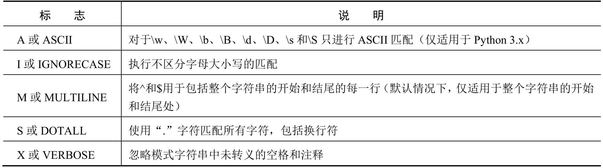

例如，匹配字符串是否以“mr\_”开头，不区分字母大小写，代码如下：


执行结果如下：

```python
<_sre.SRE_Match object; span=(0, 7), match='MR_SHOP'>
None
```

从上面的执行结果中可以看出，字符串“MR\_SHOP”是以“mr\_”开头，所以返回一个Match对象，而字符串“项目名称MR\_SHOP”不是以“mr\_”开头，所以返回None。这是因为match()方法从字符串的开始位置开始匹配，当第一个字母不符合条件时，则不再进行匹配，直接返回None。

Match对象中包含了匹配值的位置和匹配数据。其中，要获取匹配值的起始位置可以使用Match对象的start()方法；要获取匹配值的结束位置可以使用end()方法；通过span()方法可以返回匹配位置的元组；通过string属性可以获取要匹配的字符串。例如下面的代码：

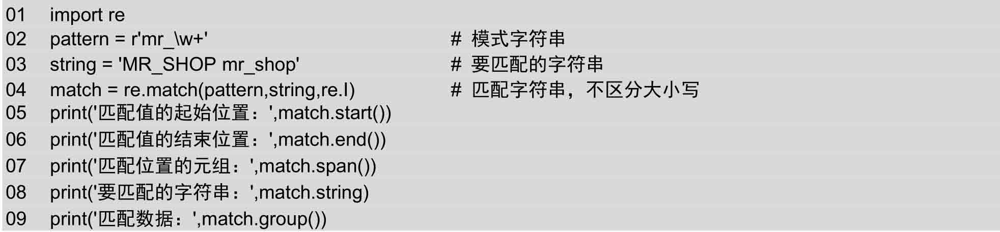

执行结果如下：

```python
匹配值的起始位置： 0
匹配值的结束位置： 7
匹配位置的元组： (0, 7)
要匹配字符串： MR_SHOP mr_shop
匹配数据： MR_SHOP
```

**【例8.1】** 验证输入的手机号码是否合法。**（实例位置：资源包\\TM\\sl\\08\\01）**

在IDLE中创建一个名称为checkmobile.py的文件，然后在该文件中导入Python的re模块，再定义一个验证手机号码的模式字符串，最后应用该模式字符串验证两个手机号码，并输出验证结果，代码如下：

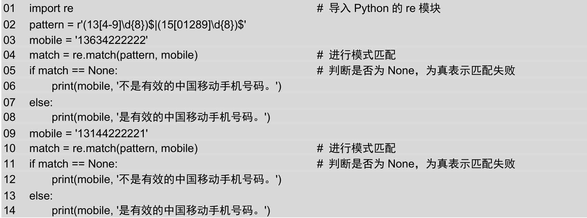

运行实例代码，将显示如图8.2所示的结果。

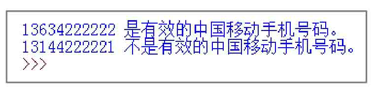

*图8.2 验证输入的手机号码是否合法*

<a id="isbn9787302503880_2_8_1_1_10_2"></a>

#### 2．使用search()方法进行匹配

search()方法用于在整个字符串中搜索第一个匹配的值，如果在起始位置匹配成功，则返回Match对象，否则返回None。其语法格式如下：

```python
re.search(pattern, string, [flags])
```

参数说明如下：


 pattern：表示模式字符串，由要匹配的正则表达式转换而来。


 string：表示要匹配的字符串。


 flags：可选参数，表示标志位，用于控制匹配方式，如是否区分字母大小写。常用的标志如表8.3所示。

例如，搜索第一个以“mr\_”开头的字符串，不区分字母大小写，代码如下：

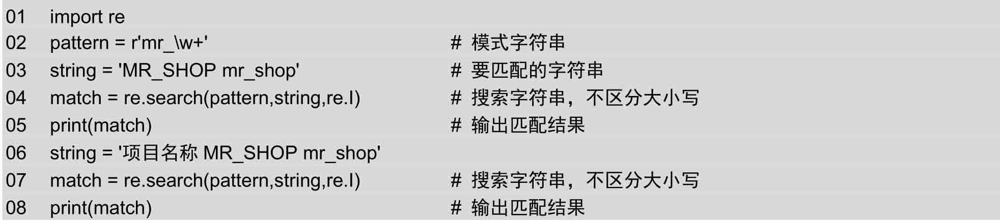

执行结果如下：

```python
<_sre.SRE_Match object; span=(0, 7), match='MR_SHOP'>
<_sre.SRE_Match object; span=(4, 11), match='MR_SHOP'>
```

从上面的运行结果中可以看出，search()方法不仅仅是在字符串的起始位置搜索，其他位置有符合的匹配也可以。

**【例8.2】** 验证是否出现危险字符。**（实例位置：资源包\\TM\\sl\\08\\02）**

在IDLE中创建一个名称为checktnt.py的文件，然后在该文件中导入Python的re模块，再定义一个验证危险字符的模式字符串，最后应用该模式字符串验证两段文字，并输出验证结果，代码如下：

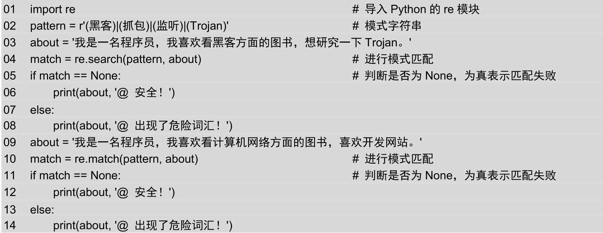

运行实例代码，将显示如图8.3所示的结果。

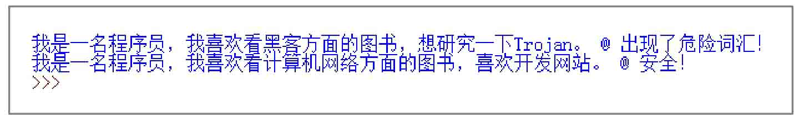

*图8.3 验证是否出现危险字符*

<a id="isbn9787302503880_2_8_1_1_10_3"></a>

#### 3．使用findall()方法进行匹配

findall()方法用于在整个字符串中搜索所有符合正则表达式的字符串，并以列表的形式返回。如果匹配成功，则返回包含匹配结构的列表，否则返回空列表。其语法格式如下：

```python
re.findall(pattern, string, [flags])
```

参数说明如下：


 pattern：表示模式字符串，由要匹配的正则表达式转换而来。


 string：表示要匹配的字符串。


 flags：可选参数，表示标志位，用于控制匹配方式，如是否区分字母大小写。常用的标志如表8.3所示。

例如，搜索以“mr\_”开头的字符串，代码如下：

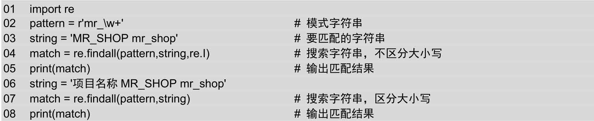

执行结果如下：

```python
['MR_SHOP', 'mr_shop']
['mr_shop']
```

如果在指定的模式字符串中包含分组，则返回与分组匹配的文本列表。例如下面的代码：

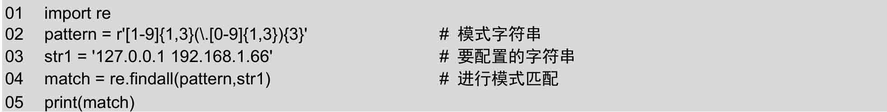

上面的代码执行结果如下：

```python
['.1', '.66']
```

从上面的结果中可以看出，并没有得到匹配的IP地址，这是因为在模式字符串中出现了分组，所以得到的结果是根据分组进行匹配的结果，即“(\\.\[0-9\]{1,3})”匹配的结果。如果想获取整个模式字符串的匹配，可以将整个模式字符串使用一对小括号进行分组。然后在获取结果时，只取返回值列表的每个元素（是一个元组）的第1个元素。代码如下：

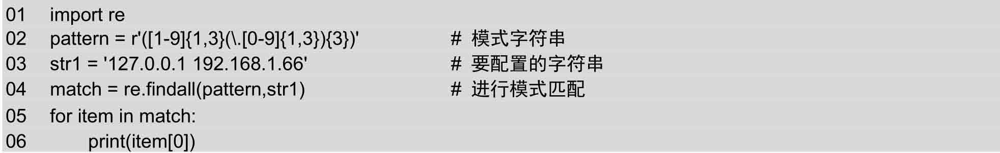

执行结果如下：

```python
127.0.0.1
192.168.1.66
```

<a id="isbn9787302503880_2_8_1_1_11"></a>

### 8.2.2 替换字符串

sub()方法用于实现字符串替换。其语法格式如下：

```python
re.sub(pattern, repl, string, count, flags)
```

参数说明如下：


 pattern：表示模式字符串，由要匹配的正则表达式转换而来。


 repl：表示替换的字符串。


 string：表示要被查找替换的原始字符串。


 count：可选参数，表示模式匹配后替换的最大次数，默认值为0，表示替换所有的匹配。


 flags：可选参数，表示标志位，用于控制匹配方式，如是否区分字母大小写。常用的标志如表8.3所示。

例如，隐藏中奖信息中的手机号码，代码如下：

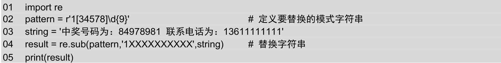

执行结果如下：

```python
中奖号码为：84978981 联系电话为：1××××××××××
```

**【例8.3】** 替换出现的危险字符。**（实例位置：资源包\\TM\\sl\\08\\03）**

在IDLE中创建一个名称为checktnt.py的文件，然后在该文件中导入Python的re模块，再定义一个验证危险字符的模式字符串，最后应用该模式字符串验证两段文字，并输出验证结果，代码如下：

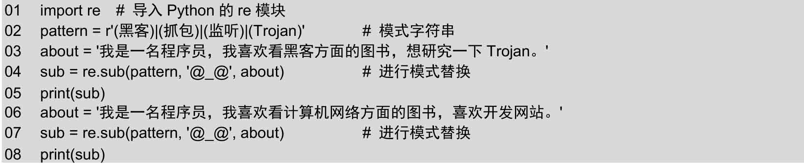

运行实例代码，将显示如图8.4所示的结果。

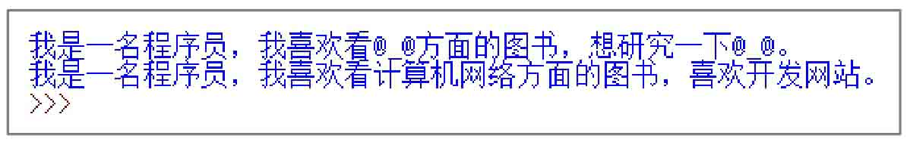

*图8.4 替换出现的危险字符*

<a id="isbn9787302503880_2_8_1_1_12"></a>

### 8.2.3 使用正则表达式分割字符串

split()方法用于实现根据正则表达式分割字符串，并以列表的形式返回。其作用与7.2.4节介绍的字符串对象的split()方法类似，所不同的就是分割字符由模式字符串指定。其语法格式如下：

```python
re.split(pattern, string, [maxsplit], [flags])
```

参数说明如下：


 pattern：表示模式字符串，由要匹配的正则表达式转换而来。


 string：表示要匹配的字符串。


 maxsplit：可选参数，表示最大的拆分次数。


 flags：可选参数，表示标志位，用于控制匹配方式，如是否区分字母大小写。常用的标志如表8.3所示。

例如，从给定的URL地址中提取出请求地址和各个参数，代码如下：

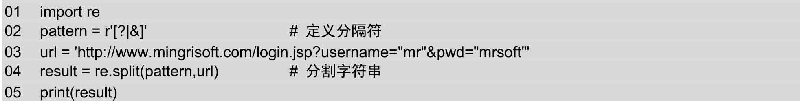

执行结果如下：

```python
['http://www.mingrisoft.com/login.jsp', 'username="mr"', 'pwd="mrsoft"']
```

**场景模拟：** 微博的@好友栏目中，输入“@明日科技@扎克伯格@盖茨”（好友名称之间用一个空格区分），即可同时@三个好友。

**【例8.4】** 输出被@的好友名称（副本）。**（实例位置：资源包\\TM\\sl\\08\\04）**

在IDLE中创建一个名称为atfriend-split1.py的文件，然后在该文件中定义一个字符串，内容为“@明日科技@扎克伯格@盖茨”，然后使用re模块的split()方法对该字符串进行分割，从而获取到好友名称，并输出，代码如下：

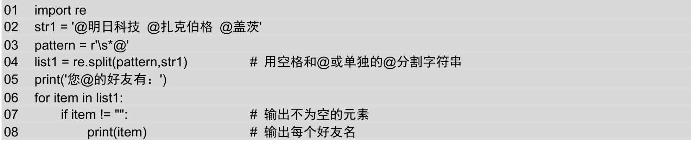

运行结果如图8.5所示。

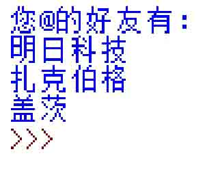

*图8.5 输出被@的好友*

<a id="isbn9787302503880_2_8_1_3"></a>

## 8.3 小结

本章首先对正则表达式的基本语法进行了简要介绍，然后又介绍了在Python中如何应用re模块实现正则表达式匹配等技术。正则表达式在实际项目开发中，经常被用于指定模式匹配规则，从而实现替换功能。所以掌握正则表达式也是Python开发中的一项重要内容。另外，由于正则表达式已经发展得很成熟，其基本语法远不止本章所涉及的这些内容，所以如果想要对正则表达式进行更深入的研究，还需要查阅一些其他资料。
