<a id="isbn9787302503880_2_10"></a>

# 第10章  面向对象程序设计

**（


 视频讲解：110分钟）**

面向对象程序设计是在面向过程程序设计的基础上发展而来的，它比面向过程编程具有更强的灵活性和扩展性。面向对象程序设计也是一个程序员发展的“分水岭”，很多的初学者和略有成就的开发者，就是因为无法理解“面向对象”而放弃。这里要提醒一下初学者：要想在编程这条路上走得比别人远，就一定要掌握面向对象编程技术。

Python从设计之初就已经是一门面向对象的语言。它可以很方便地创建类和对象。本章将对面向对象程序设计进行详细讲解。

通过阅读本章，您可以：


 了解什么是面向对象


 掌握如何定义和使用类


 掌握如何创建类的属性


 掌握继承的基本语法


 掌握方法重写


 掌握如何在派生类中调用基类的\_\_init\_\_()方法

<a id="isbn9787302503880_2_10_1_1"></a>

## 10.1 面向对象概述

面向对象（Object Oriented）的英文缩写是OO，它是一种设计思想。从20世纪60年代提出面向对象的概念到现在，它已经发展成为一种比较成熟的编程思想，并且逐步成为目前软件开发领域的主流技术。如我们经常听说的面向对象编程（Object Oriented Programming，即OOP）就是主要针对大型软件设计而提出的，它可以使软件设计更加灵活，并且能更好地进行代码复用。

面向对象中的对象（Object），通常是指客观世界中存在的对象，这个对象具有唯一性，对象之间各不相同，各有各的特点，每个对象都有自己的运动规律和内部状态；对象与对象之间又是可以相互联系、相互作用的。另外，对象也可以是一个抽象的事物。例如，可以从圆形、正方形、三角形等图形抽象出一个简单图形，简单图形就是一个对象，它有自己的属性和行为，图形中边的个数是它的属性，图形的面积也是它的属性，输出图形的面积就是它的行为。概括地讲，面向对象技术是一种从组织结构上模拟客观世界的方法。

<a id="isbn9787302503880_2_10_1_1_1"></a>

### 10.1.1 对象

对象，是一个抽象概念，英文称作“Object”，表示任意存在的事物。世间万物皆对象。现实世界中，随处可见的一个事物就是对象，对象是事物存在的实体，如一个人，如图10.1所示。


*图10.1 对象“人”的示意图*

通常将对象划分为两个部分，即静态部分与动态部分。静态部分被称为“属性”，任何对象都具备自身属性，这些属性不仅是客观存在的，而且是不能被忽视的，如人的性别，如图10.2所示；动态部分指的是对象的行为，即对象执行的动作，如人可以行走，如图10.3所示。


*图10.2 静态属性“性别”的示意图*


*图10.3 动态属性“行走”的示意图*

**说明**

在Python中，一切都是对象。即不仅是具体的事物称为对象，字符串、函数等也都是对象。这说明Python天生就是面向对象的。

<a id="isbn9787302503880_2_10_1_1_2"></a>

### 10.1.2 类

类是封装对象的属性和行为的载体，反过来说，具有相同属性和行为的一类实体被称为类。例如，把雁群比作大雁类，那么大雁类就具备了喙、翅膀和爪等属性，觅食、飞行和睡觉等行为，而一只要从北方飞往南方的大雁则被视为大雁类的一个对象。大雁类和大雁对象的关系如图10.4所示。

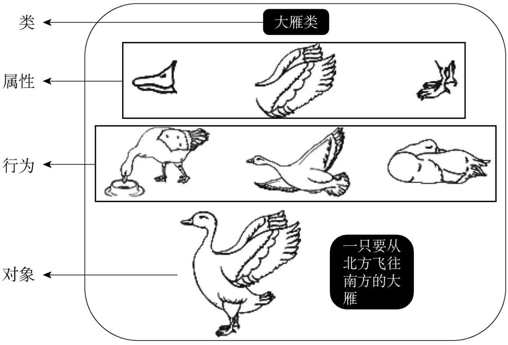

*图10.4 大雁类和大雁对象的关系图*

在Python语言中，类是一种抽象概念，如定义一个大雁类（Geese），在该类中，可以定义每个对象共有的属性和方法；而一只要从北方飞往南方的大雁则是大雁类的一个对象（wildGeese），对象是类的实例。有关类的具体实现将在10.2节进行详细介绍。

<a id="isbn9787302503880_2_10_1_1_3"></a>

### 10.1.3 面向对象程序设计的特点

面向对象程序设计具有三大基本特征：封装、继承和多态，下面分别描述。

<a id="isbn9787302503880_2_10_1_1_3_1"></a>

#### 1．封装

封装是面向对象编程的核心思想，将对象的属性和行为封装起来，而将对象的属性和行为封装起来的载体就是类，类通常对客户隐藏其实现细节，这就是封装的思想。例如，用户使用计算机，只需要使用手指敲击键盘就可以实现一些功能，而无须知道计算机内部是如何工作的。

采用封装思想保证了类内部数据结构的完整性，使用该类的用户不能直接看到类中的数据结构，而只能执行类允许公开的数据，这样就避免了外部对内部数据的影响，提高了程序的可维护性。

使用类实现封装特性如图10.5所示。

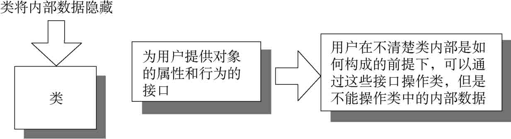

*图10.5 封装特性示意图*

<a id="isbn9787302503880_2_10_1_1_3_2"></a>

#### 2．继承

矩形、菱形、平行四边形和梯形等都是四边形。因为四边形与它们具有共同的特征：拥有4个边。只要将四边形适当地延伸，就会得到上述图形。以平行四边形为例，如果把平行四边形看作四边形的延伸，那么平行四边形就复用了四边形的属性和行为，同时添加了平行四边形特有的属性和行为，如平行四边形的对边平行且相等。Python中，可以把平行四边形类看作是继承四边形类后产生的类，其中，将类似于平行四边形的类称为子类，将类似于四边形的类称为父类或超类。值得注意的是，在阐述平行四边形和四边形的关系时，可以说平行四边形是特殊的四边形，但不能说四边形是平行四边形。同理，Python中可以说子类的实例都是父类的实例，但不能说父类的实例是子类的实例，四边形类层次结构示意图如图10.6所示。

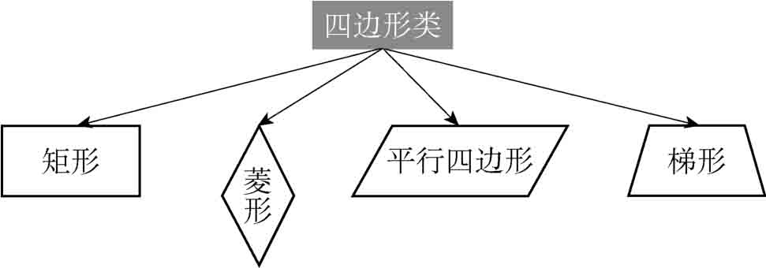

*图10.6 四边形类层次结构示意图*

综上所述，继承是实现重复利用的重要手段，子类通过继承复用了父类的属性和行为的同时，又添加了子类特有的属性和行为。

<a id="isbn9787302503880_2_10_1_1_3_3"></a>

#### 3．多态

将父类对象应用于子类的特征就是多态。比如创建一个螺丝类，螺丝类有两个属性：粗细和螺纹密度；然后再创建了两个类，一个是长螺丝类，一个是短螺丝类，并且它们都继承了螺丝类。这样长螺丝类和短螺丝类不仅具有相同的特征（粗细相同，且螺纹密度也相同），还具有不同的特征（一个长，一个短，长的可以用来固定大型支架，短的可以固定生活中的家具）。综上所述，一个螺丝类衍生出不同的子类，子类继承父类特征的同时，也具备了自己的特征，并且能够实现不同的效果，这就是多态化的结构。螺丝类层次结构示意图如图10.7所示。

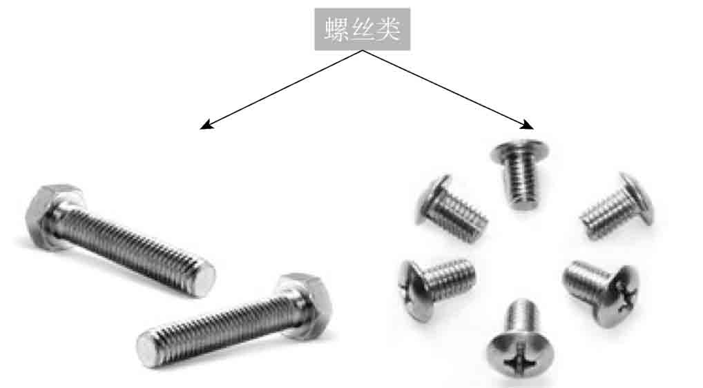

*图10.7 螺丝类层次结构示意图*

<a id="isbn9787302503880_2_10_1_2"></a>

## 10.2 类的定义和使用

在Python中，类表示具有相同属性和方法的对象的集合。在使用类时，需要先定义类，然后再创建类的实例，通过类的实例就可以访问类中的属性的方法。下面进行具体介绍。

<a id="isbn9787302503880_2_10_1_1_4"></a>

### 10.2.1 定义类

在Python中，类的定义使用class关键字来实现，语法如下：

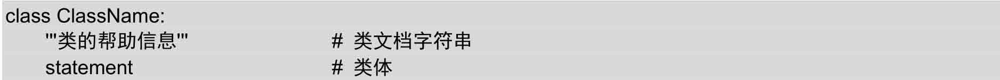

参数说明如下：


 ClassName：用于指定类名，一般使用大写字母开头，如果类名中包括两个单词，第二个单词的首字母也大写，这种命名方法也称为“驼峰式命名法”，这是惯例。当然，也可根据自己的习惯命名，但是一般推荐按照惯例来命名。


 '''类的帮助信息'''：用于指定类的文档字符串，定义该字符串后，在创建类的对象时，输入类名和左侧的括号“(”后，将显示该信息。


 statement：类体，主要由类变量（或类成员）、方法和属性等定义语句组成。如果在定义类时，没想好类的具体功能，也可以在类体中直接使用pass语句代替。

例如，下面以大雁为例声明一个类，代码如下：


<a id="isbn9787302503880_2_10_1_1_5"></a>

### 10.2.2 创建类的实例

定义完类后，并不会真正创建一个实例。这有点像一辆汽车的设计图。设计图可以告诉你汽车看上去怎么样，但设计图本身不是一辆汽车。你不能开走它，它只能用来制造真正的汽车，而且可以使用它制造很多汽车。那么如何创建实例呢？

class语句本身并不创建该类的任何实例。所以在类定义完成以后，可以创建类的实例，即实例化该类的对象。创建类的实例的语法如下：

```python
ClassName(parameterlist)
```

其中，ClassName是必选参数，用于指定具体的类；parameterlist是可选参数，当创建一个类时，没有创建\_\_init\_\_()方法（该方法将在10.2.3节进行详细介绍），或者\_\_init\_\_()方法只有一个self参数时，parameterlist可以省略。

例如，创建10.2.1节定义的Geese类的实例，可以使用下面的代码。


执行上面代码后，将显示类似下面的内容。

```python
<__main__.Geese object at 0x0000000002F47AC8>
```

从上面的执行结果中可以看出，wildGoose是Geese类的实例。

<a id="isbn9787302503880_2_10_1_1_6"></a>

### 10.2.3 创建\_\_init\_\_()方法

在创建类后，通常会创建一个\_\_init\_\_()方法。该方法是一个特殊的方法，类似Java语言中的构造方法。每当创建一个类的新实例时，Python都会自动执行它。\_\_init\_\_()方法必须包含一个self参数，并且必须是第一个参数。self参数是一个指向实例本身的引用，用于访问类中的属性和方法。在方法调用时会自动传递实际参数self。因此，当\_\_init\_\_()方法只有一个参数时，在创建类的实例时，就不需要指定实际参数了。

**说明**

在\_\_init\_\_()方法的名称中，开头和结尾处是两个下划线（中间没有空格），这是一种约定，旨在区分Python默认方法和普通方法。

例如，下面仍然以大雁为例声明一个类，并且创建\_\_init\_\_()方法，代码如下：

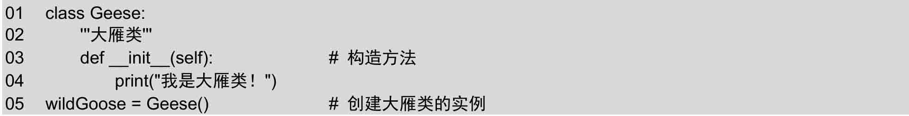

运行上面的代码，将输出以下内容：

```python
我是大雁类！
```

从上面的运行结果可以看出，在创建大雁类的实例时，虽然没有为\_\_init\_\_()方法指定参数，但是该方法会自动执行。

**常见错误：** 在为类创建\_\_init\_\_()方法时，在开发环境中运行下面的代码：

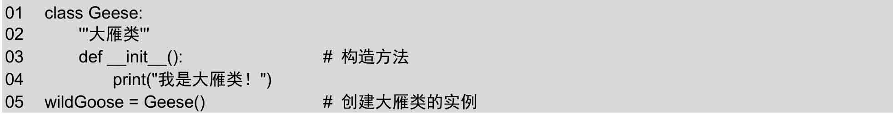

运行上面的代码，将显示如图10.8所示的异常信息。该错误的解决方法是在第3行代码的括号中添加self。

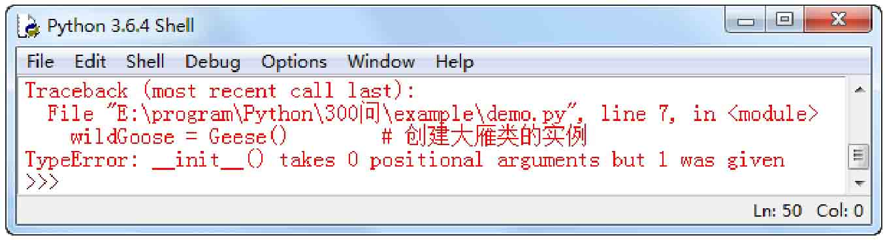

*图10.8 缺少self参数抛出的异常信息*

在\_\_init\_\_()方法中，除了self参数外，还可以自定义一些参数，参数间使用逗号“,”进行分隔。例如，下面的代码将在创建\_\_init\_\_()方法时再指定3个参数，分别是beak、wing和claw。

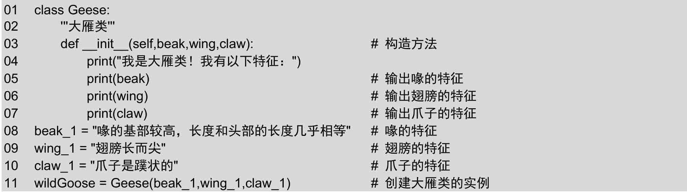

执行上面的代码，将显示如图10.9所示的运行结果。

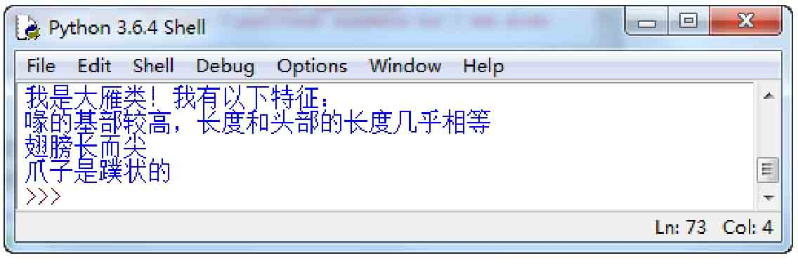

*图10.9 创建\_\_init\_\_()方法时指定4个参数*

<a id="isbn9787302503880_2_10_1_1_7"></a>

### 10.2.4 创建类的成员并访问

类的成员主要由实例方法和数据成员组成。在类中创建了类的成员后，可以通过类的实例进行访问。下面进行详细介绍。

<a id="isbn9787302503880_2_10_1_1_3_4"></a>

#### 1．创建实例方法并访问

所谓实例方法，是指在类中定义的函数。该函数是一种在类的实例上操作的函数。同\_\_init\_\_()方法一样，实例方法的第一个参数必须是self，并且必须包含一个self参数。创建实例方法的语法格式如下：

```python
def functionName(self,parameterlist):
    block
```

参数说明如下：


 functionName：用于指定方法名，一般使用小写字母开头；


 self：必要参数，表示类的实例，其名称可以是self以外的单词，使用self只是一个习惯而已；


 parameterlist：用于指定除self参数以外的参数，各参数间使用逗号“,”进行分隔；


 block：方法体，实现的具体功能。

**说明**

实例方法和Python中的函数的主要区别就是，函数实现的是某个独立的功能，而实例方法是实现类中的一个行为，是类的一部分。

实例方法创建完成后，可以通过类的实例名称和点（.）操作符进行访问。具体的语法格式如下：

```python
instanceName.functionName(parametervalue)
```

其中，instanceName为类的实例名称；functionName为要调用的方法名称；parametervalue表示为方法指定对应的实际参数，其值的个数与创建实例方法中parameterlist的个数相同。

下面通过一个具体的实例演示创建实例方法并访问。

**【例10.1】** 创建大雁类并定义飞行方法。**（实例位置：资源包\\TM\\sl\\10\\01）**

在IDLE中创建一个名称为geese.py的文件，然后在该文件中定义一个大雁类Geese，并定义一个构造方法，然后再定义一个实例方法fly()，该方法有两个参数，一个是self，另一个用于指定飞行状态，最后再创建大雁类的实例，并调用实例方法fly()，代码如下：

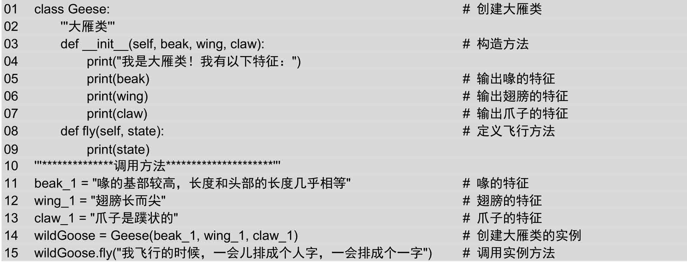

运行结果如图10.10所示。

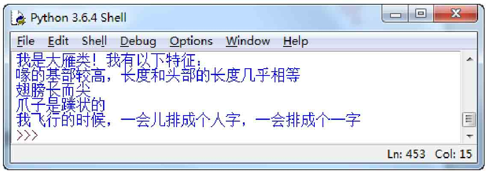

*图10.10 创建大雁类并定义飞行方法*

<a id="isbn9787302503880_2_10_1_1_3_5"></a>

#### 2．创建数据成员并访问

数据成员是指在类中定义的变量，即属性，根据定义位置，又可以分为类属性和实例属性。下面分别进行介绍。


 类属性

类属性是指定义在类中，并且在函数体外的属性。类属性可以在类的所有实例之间共享值，也就是在所有实例化的对象中公用。

**说明**

类属性可以通过类名称或者实例名访问。

例如，定义一个雁类Geese，在该类中定义3个类属性，用于记录雁类的特征，代码如下：

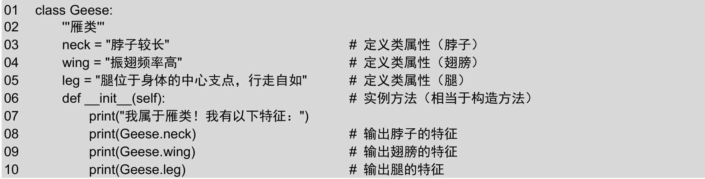

创建上面的类Geese，然后创建该类的实例，代码如下：

```python
geese = Geese()  # 实例化一个雁类的对象
```

应用上面的代码创建Geese类的实例后，将显示以下内容。

```python
我是雁类！我有以下特征：
脖子较长
振翅频率高
腿位于身体的中心支点，行走自如
```

下面通过一个具体的实例演示类属性在类的所有实例之间共享值的应用。

**场景模拟：** 春天来了，有一群大雁从南方返回北方。现在想要输出每只大雁的特征，以及大雁的数量。

**【例10.2】** 通过类属性统计类的实例个数。**（实例位置：资源包\\TM\\sl\\10\\02）**

在IDLE中创建一个名称为geese\_a.py的文件，然后在该文件中定义一个雁类Geese，并在该类中定义4个类属性，前3个用于记录雁类的特征，第4个用于记录实例编号，然后定义一个构造方法，在该构造方法中将记录实例编号的类属性进行加1操作，并输出4个类属性的值，最后通过for循环创建4个雁类的实例，代码如下：

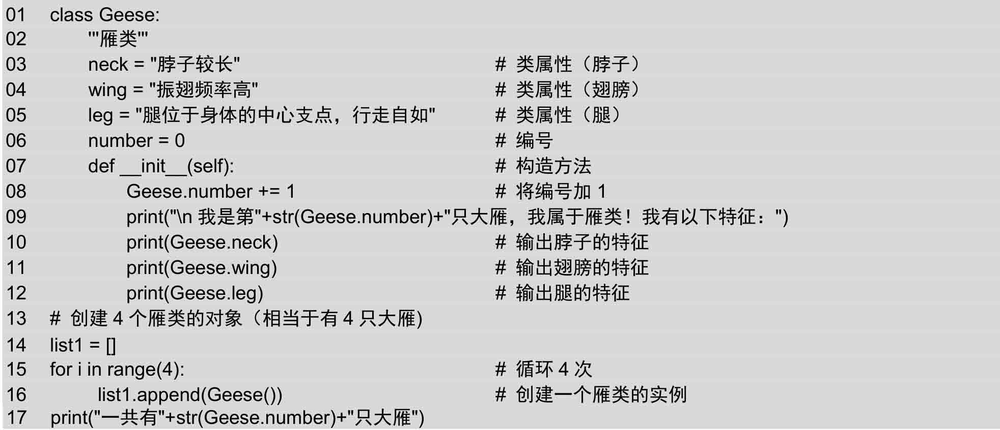

运行结果如图10.11所示。

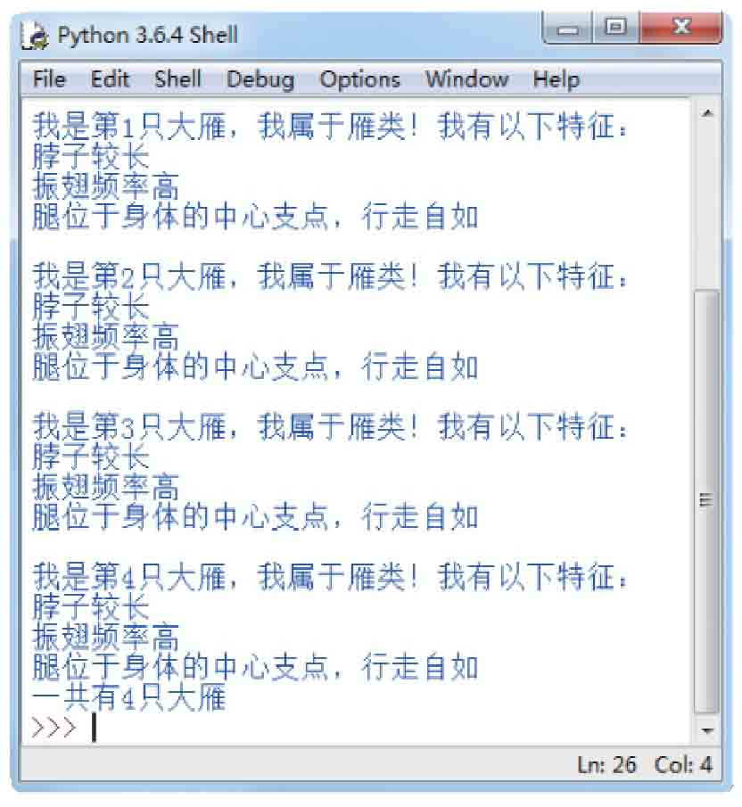

*图10.11 通过类属性统计类的实例个数*

在Python中除了可以通过类名称访问类属性，还可以动态地为类和对象添加属性。例如，在实例10.2的基础上为雁类添加一个beak属性，并通过类的实例访问该属性，可以在上面代码的后面再添加以下代码：


**说明**

上面的代码只是以第2只大雁为例进行演示，读者也可以换成其他的大雁试试。

运行后，将在原来的结果后面显示以下内容。

```python
第2只大雁的喙： 喙的基部较高，长度和头部的长度几乎相等
```

**说明**

除了可以动态地为类和对象添加属性，也可以修改类属性。修改结果将作用于该类的所有实例。


 实例属性

实例属性是指定义在类的方法中的属性，只作用于当前实例中。

例如，定义一个雁类Geese，在该类的\_\_init\_\_()方法中定义3个实例属性，用于记录雁类的特征，代码如下：

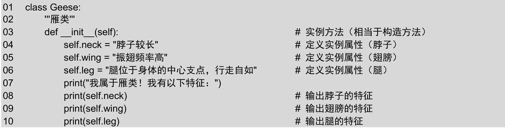

创建上面的Geese类，然后创建该类的实例，代码如下：

```python
geese = Geese()  # 实例化一个雁类的对象
```

应用上面的代码创建Geese类的实例后，将显示以下内容。

```python
我是雁类！我有以下特征：
脖子较长
振翅频率高
腿位于身体的中心支点，行走自如
```

**说明**

实例属性只能通过实例名访问。如果通过类名访问实例属性，将抛出如图10.12所示的异常。

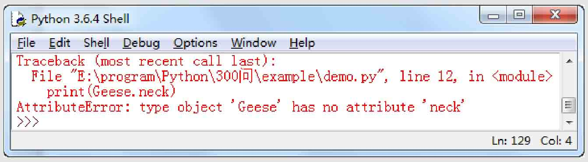

*图10.12 通过类名访问实例属性*

对于实例属性也可以通过实例名称修改，与类属性不同，通过实例名称修改实例属性后，并不影响该类的另一个实例中相应的实例属性的值。例如，定义一个雁类，并在\_\_init\_\_()方法中定义一个实例属性，然后创建两个Geese类的实例，并且修改第一个实例的实例属性，最后分别输出实例10.1和实例10.2的实例属性，代码如下：

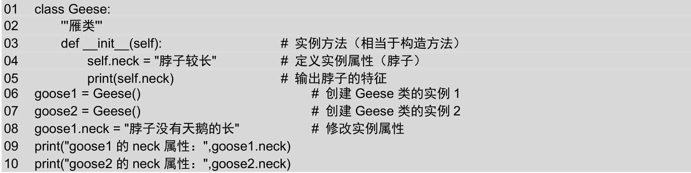

运行上面的代码，将显示以下内容。

```python
脖子较长
脖子较长
goose1的neck属性： 脖子没有天鹅的长
goose2的neck属性： 脖子较长
```

<a id="isbn9787302503880_2_10_1_1_8"></a>

### 10.2.5 访问限制

在类的内部可以定义属性和方法，而在类的外部则可以直接调用属性或方法来操作数据，从而隐藏了类内部的复杂逻辑。但是，Python并没有对属性和方法的访问权限进行限制。为了保证类内部的某些属性或方法不被外部访问，可以在属性或方法名前面添加单下划线（\_foo）、双下划线（\_\_foo）或首尾加双下划线（\_\_foo\_\_），从而限制访问权限。其中，单下划线、双下划线、首尾双下划线的作用如下：

（1）\_foo：以单下划线开头的表示protected（保护）类型的成员，只允许类本身和子类进行访问，但不能使用“from module import \*”语句导入。

例如，创建一个Swan类，定义保护属性\_neck\_swan，并在\_\_init\_\_()方法中访问该属性，然后创建Swan类的实例，并通过实例名输出保护属性\_neck\_swan，代码如下：

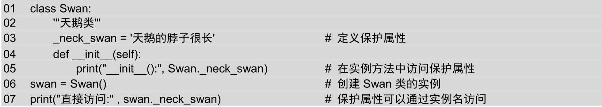

执行上面的代码，将显示以下内容。

```python
__init__(): 天鹅的脖子很长
直接访问: 天鹅的脖子很长
```

从上面的运行结果中可以看出：保护属性可以通过实例名访问。

（2）\_\_foo：双下划线表示private（私有）类型的成员，只允许定义该方法的类本身进行访问，而且也不能通过类的实例进行访问，但是可以通过“类的实例名.类名\_\_xxx”方式访问。

例如，创建一个Swan类，定义私有属性\_\_neck\_swan，并在\_\_init\_\_()方法访问该属性，然后创建Swan类的实例，并通过实例名输出私有属性\_\_neck\_swan，代码如下：

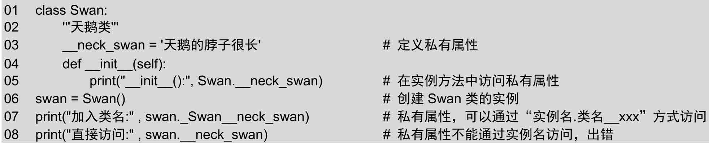

执行上面的代码后，将输出如图10.13所示的结果。

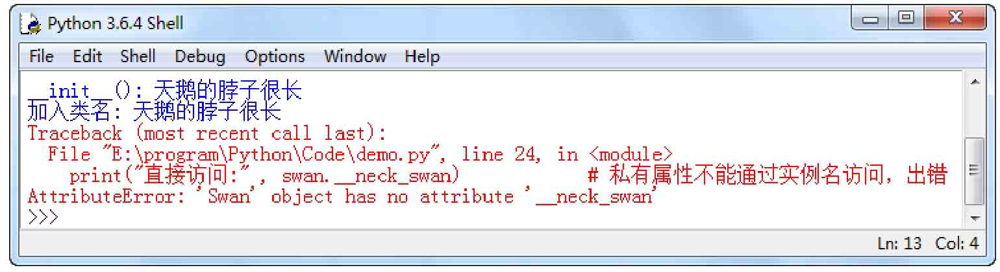

*图10.13 访问私有属性*

从上面的运行结果可以看出：私有属性可以在类的实例方法中访问，也可以通过“实例名.类名\_\_xxx”方式访问，但是不能直接通过实例名＋属性名访问。

（3）\_\_foo\_\_：首尾双下划线表示定义特殊方法，一般是系统定义名字，如\_\_init\_\_()。

<a id="isbn9787302503880_2_10_1_3"></a>

## 10.3 属性

本节介绍的属性（property）与10.2.4节介绍的类属性和实例属性不同。10.2.4节介绍的属性将返回所存储的值，而本节要介绍的属性则是一种特殊的属性，访问它时将计算它的值。另外，该属性还可以为属性添加安全保护机制。下面分别进行介绍。

<a id="isbn9787302503880_2_10_1_1_9"></a>

### 10.3.1 创建用于计算的属性

在Python中，可以通过@property（装饰器）将一个方法转换为属性，从而实现用于计算的属性。将方法转换为属性后，可以直接通过方法名来访问方法，而不需要再添加一对小括号“()”，这样可以让代码更加简洁。

通过@property创建用于计算的属性的语法格式如下：

```python
@property
def methodname(self):
   block
```

参数说明如下：


 methodname：用于指定方法名，一般使用小写字母开头。该名称最后将作为创建的属性名。


 self：必要参数，表示类的实例。


 block：方法体，实现的具体功能。在方法体中，通常以return语句结束，用于返回计算结果。

例如，定义一个矩形类，在\_\_init\_\_()方法中定义两个实例属性，然后再定义一个计算矩形面积的方法，并应用@property将其转换为属性，最后创建类的实例，并访问转换后的属性，代码如下：

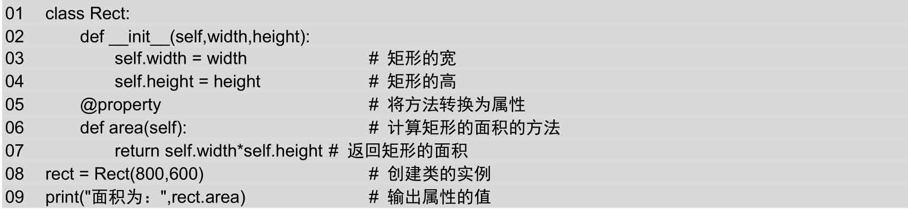

运行上面的代码，将显示以下运行结果。

```python
面积为： 480000
```

**注意**

通过@property转换后的属性不能重新赋值，如果对其重新赋值，将抛出如图10.14所示的异常信息。

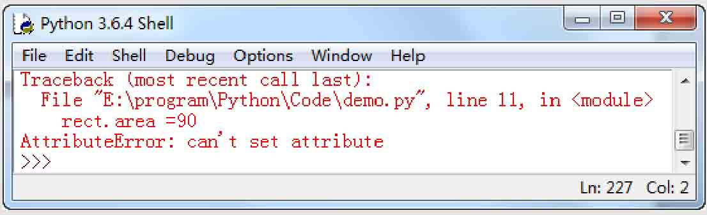

*图10.14 AttributeError异常*

<a id="isbn9787302503880_2_10_1_1_10"></a>

### 10.3.2 为属性添加安全保护机制

在Python中，默认情况下，创建的类属性或者实例是可以在类体外进行修改的，如果想要限制其不能在类体外修改，可以将其设置为私有的，但设置为私有后，在类体外也不能获取它的值。如果想要创建一个可以读取，但不能修改的属性，那么可以使用@property实现只读属性。

例如，创建一个电视节目类TVshow，再创建一个show属性，用于显示当前播放的电视节目，代码如下：

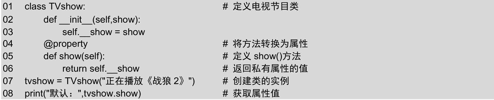

执行上面的代码，将显示以下内容。

```python
默认： 正在播放《战狼2》
```

通过上面的方法创建的show属性是只读的，尝试修改该属性的值，再重新获取。在上面代码的下方添加以下代码。


运行后，将显示如图10.15所示的运行结果。其中红字的异常信息就是修改属性show时抛出的异常。

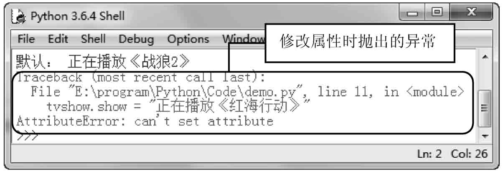

*图10.15 修改只读属性时抛出的异常*

通过属性不仅可以将属性设置为只读属性，而且可以为属性设置拦截器，即允许对属性进行修改，但修改时需要遵守一定的约束。

**场景模拟：** 某电视台开设了电影点播功能，但要求只能从指定的几个电影（如《战狼2》《红海行动》《西游记女儿国》《熊出没·变形记》）中选择一个。

**【例10.3】** 在模拟电影点播功能时应用属性。**（实例位置：资源包\\TM\\sl\\10\\03）**

在IDLE中创建一个名称为film.py的文件，然后在该文件中定义一个电视节目类TVshow，并在该类中定义一个类属性，用于保存电影列表，然后在\_\_init\_\_()方法中定义一个私有的实例属性，再将该属性转换为可读取、可修改（有条件进行）的属性，最后创建类的实例，并获取和修改属性值，代码如下：

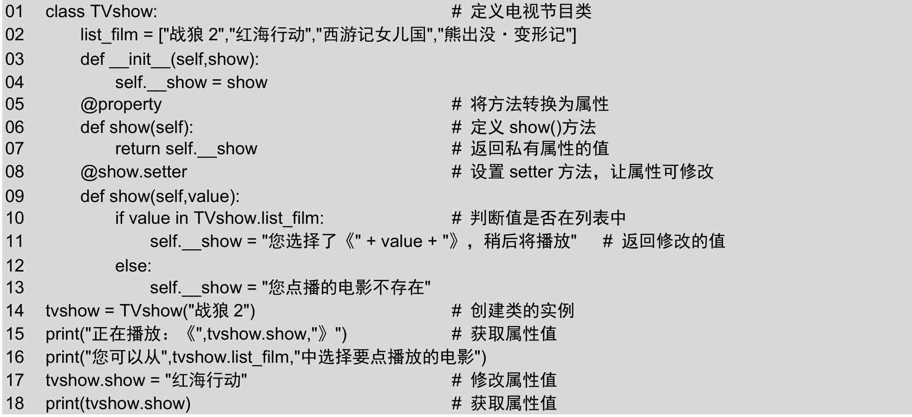

运行结果如图10.16所示。

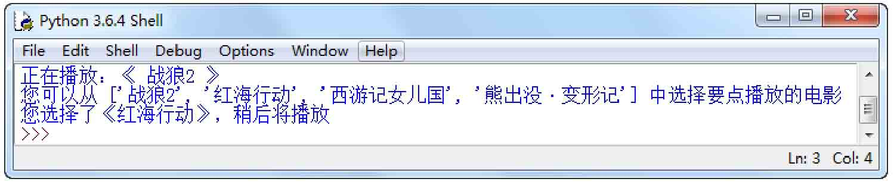

*图10.16 在模拟电影点播功能时应用属性的效果*

如果将第17行代码中的“红海行动”修改为“捉妖记2”，将显示如图10.17所示的效果。

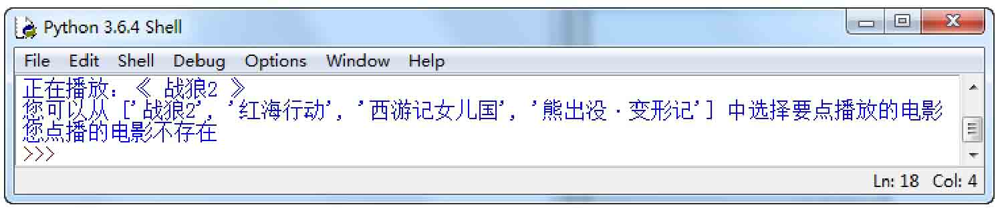

*图10.17 要点播的电影不存在的效果*

<a id="isbn9787302503880_2_10_1_4"></a>

## 10.4 继承

在编写类时，并不是每次都要从空白开始。当要编写的类和另一个已经存在的类之间存在一定的继承关系时，就可以通过继承来达到代码重用的目的，提高开发效率。下面将介绍如何在Python中实现继承。

<a id="isbn9787302503880_2_10_1_1_11"></a>

### 10.4.1 继承的基本语法

继承是面向对象编程最重要的特性之一，它源于人们认识客观世界的过程，是自然界普遍存在的一种现象。例如，我们每个人都从祖辈和父母那里继承了一些体貌特征，但是每个人却又不同于父母，因为每个人都存在自己的一些特性，这些特性是独有的，在父母身上并没有体现。在程序设计中实现继承，表示这个类拥有它继承的类的所有公有成员或者受保护成员。在面向对象编程中，被继承的类称为父类或基类，新的类称为子类或派生类。

通过继承不仅可以实现代码的重用，还可以通过继承来理顺类与类之间的关系。在Python中，可以在类定义语句中，类名右侧使用一对小括号将要继承的基类名称括起来，从而实现类的继承。具体的语法格式如下：

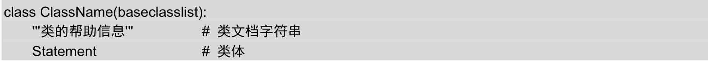

参数说明如下：


 ClassName：用于指定类名。


 baseclasslist：用于指定要继承的基类，可以有多个，类名之间用逗号“,”分隔。如果不指定，将使用所有Python对象的根类object。


 '''类的帮助信息'''：用于指定类的文档字符串，定义该字符串后，在创建类的对象时，输入类名和左侧的括号“(”后，将显示该信息。


 statement：类体，主要由类变量（或类成员）、方法和属性等定义语句组成。如果在定义类时，没想好类的具体功能，也可以在类体中直接使用pass语句代替。

**【例10.4】** 创建水果基类及其派生类。**（实例位置：资源包\\TM\\sl\\10\\04）**

在IDLE中创建一个名称为fruit.py的文件，然后在该文件中定义一个水果类Fruit（作为基类），并在该类中定义一个类属性（用于保存水果默认的颜色）和一个harvest()方法，然后创建Apple类和Orange类，都继承自Fruit类，最后创建Apple类和Orange类的实例，并调用harvest()方法（在基类中编写），代码如下：

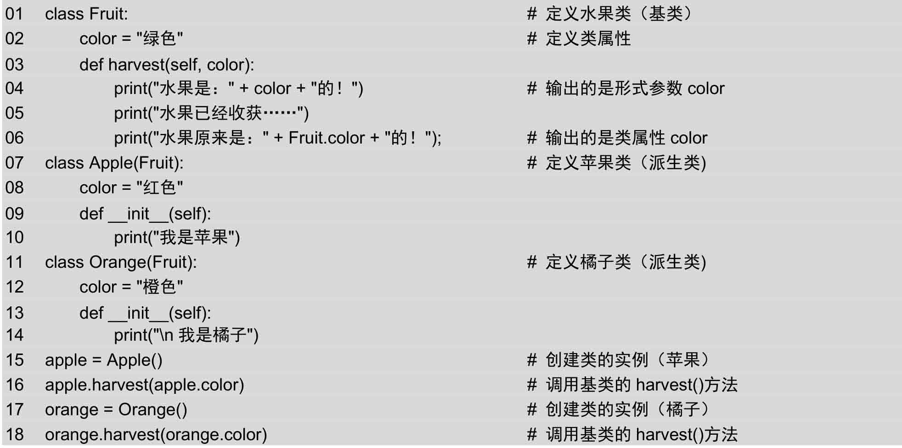

执行上面的代码，将显示如图10.18所示的运行结果。从该运行结果中可以看出：虽然在Apple和Orange类中没有harvest()方法，但是Python允许派生类访问基类的方法。

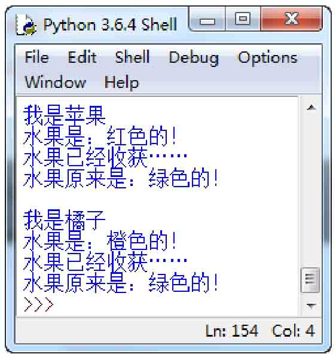

*图10.18 创建水果基类及其派生类的结果*

<a id="isbn9787302503880_2_10_1_1_12"></a>

### 10.4.2 方法重写

基类的成员都会被派生类继承，当基类中的某个方法不完全适用于派生类时，就需要在派生类中重写父类的这个方法，这和Java语言中的方法重写是一样的。

在实例10.4中，基类中定义的harvest()方法，无论派生类是什么水果都会显示“水果……”，如果想要针对不同水果给出不同的提示，可以在派生类中重写harvest()方法。例如，在创建派生类Orange时，重写harvest()方法的代码如下：

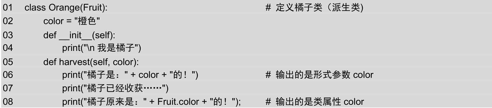

添加harvest()方法后（即在实例10.4中添加上面代码中的第5～8行代码），再次运行实例10.4，将显示如图10.19所示的运行结果。

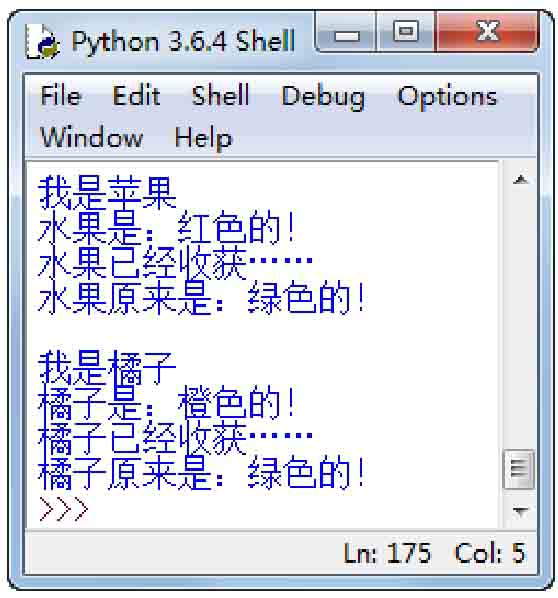

*图 10.19重写Orange类的harvest()方法的结果*

<a id="isbn9787302503880_2_10_1_1_13"></a>

### 10.4.3 派生类中调用基类的\_\_init\_\_()方法

在派生类中定义\_\_init\_\_()方法时，不会自动调用基类的\_\_init\_\_()方法。例如，定义一个Fruit类，在\_\_init\_\_()方法中创建类属性color，然后在Fruit类中定义一个harvest()方法，在该方法中输出类属性color的值，再创建继承自Fruit类的Apple类，最后创建Apple类的实例，并调用harvest()方法，代码如下：

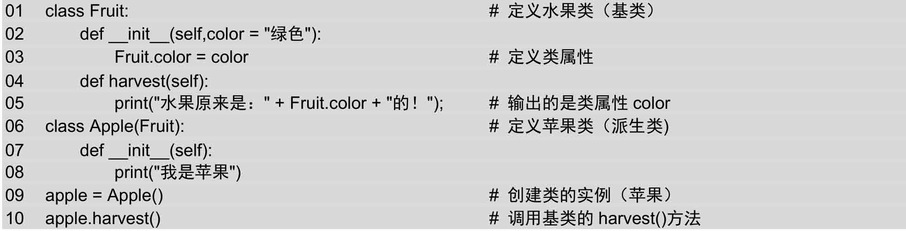

执行上面的代码后，将显示如图10.20所示的异常信息。

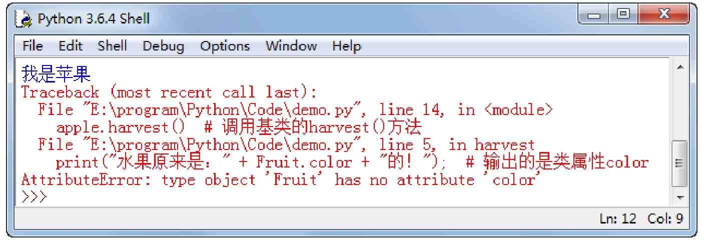

*图10.20 基类的\_\_init\_\_()方法未执行引起的异常*

因此，要让派生类调用基类的\_\_init\_\_()方法进行必要的初始化，需要在派生类使用super()函数调用基类的\_\_init\_\_()方法。例如，在上面代码的第8行的下方添加以下代码。


**注意**

在添加上面的代码时，一定要注意缩进的正确性。

运行后将显示以下正常的运行结果。

```python
我是苹果
水果原来是：绿色的！
```

下面通过一个具体的实例演示派生类中调用基类的\_\_init\_\_()方法的具体的应用。

**【例10.5】** 在派生类中调用基类的\_\_init\_\_()方法定义类属性。**（实例位置：资源包\\TM\\sl\\10\\05）**

在IDLE中创建一个名称为fruit.py的文件，然后在该文件中定义一个水果类Fruit（作为基类），并在该类中定义\_\_init\_\_()方法，在该方法中定义一个类属性（用于保存水果默认的颜色），然后在Fruit类中定义一个harvest()方法，再创建Apple类和Sapodilla类，都继承自Fruit类，最后创建Apple类和Sapodilla类的实例，并调用harvest()方法（在基类中编写），代码如下：

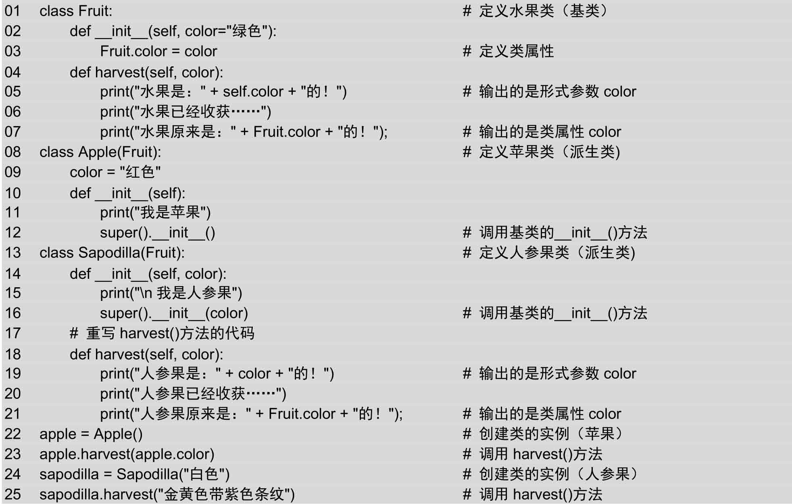

执行上面的代码，将显示如图10.21所示的运行结果。

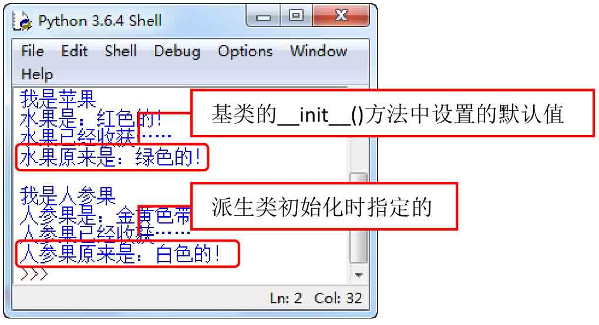

*图10.21 在派生类中调用基类的\_\_init\_\_()方法定义类属性*

<a id="isbn9787302503880_2_10_1_5"></a>

## 10.5 小结

本章主要对Python中的面向对象程序设计进行了详细的介绍。其中，首先介绍了面向对象相关的概念和特点，然后又详细介绍了如何在Python中定义类、使用类，以及property属性的应用，最后介绍了继承相关的内容。虽然本章关于OOP（面向对象编程）概念介绍得很全面、很详细，但要想真正明白面向对象思想，必须要多动手实践、多动脑思考、注意平时积累等。希望读者通过自己的努力，能有所突破。
