<a id="isbn9787302503880_2_14"></a>

# 第14章  操作数据库

**（


 视频讲解：74分钟）**

程序运行的时候，数据都是在内存中的。当程序终止的时候，通常都需要将数据保存到磁盘上，前面我们学习了将数据写入文件，保存在磁盘上。为了便于程序保存和读取数据，而且，能直接通过条件快速查询到指定的数据，就出现了数据库（Database）这种专门用于集中存储和查询的软件。本章将介绍数据库编程接口的知识，以及使用SQLite和MySQL存储数据的方法。

通过阅读本章，您可以：


 了解数据库编程接口中的连接对象和游标对象


 掌握如何创建SQLite数据库


 掌握操作SQLite数据库的方法


 了解如何下载和安装MySQL数据库


 了解安装PyMySQL的方法


 掌握如何通过PyMySQL连接和创建数据库


 掌握如何操作MySQL数据库

<a id="isbn9787302503880_2_14_1_1"></a>

## 14.1 数据库编程接口

在项目开发中，数据库应用必不可少。虽然数据库的种类有很多，如SQLite、MySQL、Oracle等，但是它们的功能基本都是一样的，为了对数据库进行统一的操作，大多数语言都提供了简单的、标准化的数据库接口（API）。在Python Database API 2.0规范中，定义了Python数据库API接口的各个部分，如模块接口、连接对象、游标对象、类型对象和构造器、DB API的可选扩展以及可选的错误处理机制等。下面重点介绍一下数据库API接口中的连接对象和游标对象。

<a id="isbn9787302503880_2_14_1_1_1"></a>

### 14.1.1 连接对象

数据库连接对象（Connection Object）主要提供获取数据库游标对象和提交／回滚事务的方法，以及关闭数据库连接。

<a id="isbn9787302503880_2_14_1_1_1_1"></a>

#### 1．获取连接对象

如何获取连接对象呢？这就需要使用connect()函数。该函数有多个参数，具体使用哪个参数，取决于使用的数据库类型。例如，需要访问Oracle数据库和MySQL数据库，则必须同时下载Oracle和MySQL数据库模块。这些模块在获取连接对象时，都需要使用connect()函数。connect()函数常用的参数及说明如表14.1所示。

**表14.1 connect()函数常用的参数及说明**

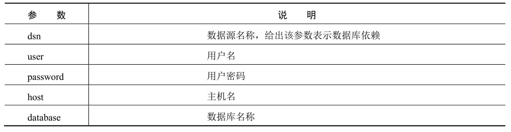

例如，使用PyMySQL模块连接MySQL数据库，示例代码如下：

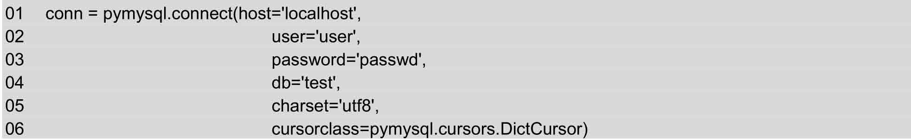

**说明**

上述代码中，pymysql.connect()使用的参数与表14.1中并不完全相同。在使用时，要以具体的数据库模块为准。

<a id="isbn9787302503880_2_14_1_1_1_2"></a>

#### 2．连接对象的方法

connect()函数返回连接对象。这个对象表示目前和数据库的会话。连接对象支持的方法如表14.2所示。

**表14.2 连接对象方法**

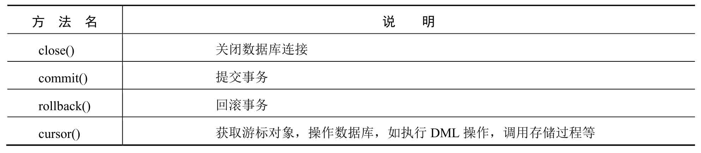

commit()方法用于提交事务，事务主要用于处理数据量大、复杂度高的数据。如果操作的是一系列的动作，比如张三给李四转账，有如下两个操作：


 张三账户金额减少；


 李四账户金额增加。

这时使用事务可以维护数据库的完整性，保证两个操作要么全部执行，要么全部不执行。

<a id="isbn9787302503880_2_14_1_1_2"></a>

### 14.1.2 游标对象

游标对象（Cursor Object）代表数据库中的游标，用于指示抓取数据操作的上下文。主要提供执行SQL语句、调用存储过程、获取查询结果等方法。

如何获取游标对象呢？通过使用连接对象的cursor()方法，可以获取到游标对象。游标对象的属性如下所示：


 description：数据库列类型和值的描述信息。


 rowcount：回返结果的行数统计信息，如SELECT、UPDATE、CALLPROC等。

游标对象的方法如表14.3所示。

**表14.3 游标对象方法**

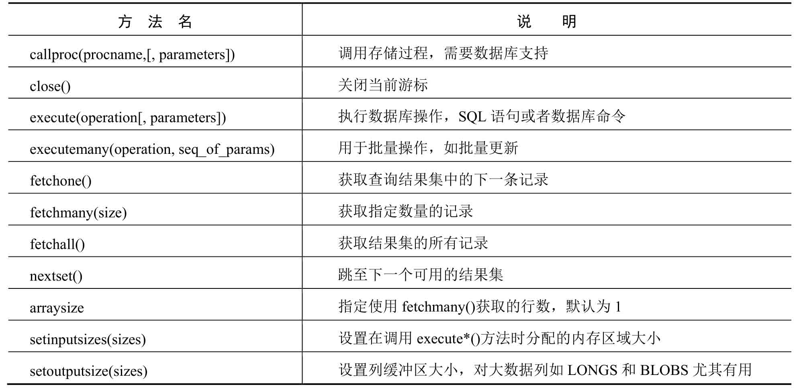

<a id="isbn9787302503880_2_14_1_2"></a>

## 14.2 使用SQLite

与许多其他数据库管理系统不同，SQLite不是一个客户端／服务器结构的数据库引擎，而是一种嵌入式数据库，它的数据库就是一个文件。SQLite将整个数据库，包括定义、表、索引以及数据本身，作为一个单独的、可跨平台使用的文件存储在主机中。由于SQLite本身是用C语言写的，而且体积很小，所以，经常被集成到各种应用程序中。Python就内置了SQLite3，所以，在Python中使用SQLite，不需要安装任何模块，直接使用。

<a id="isbn9787302503880_2_14_1_1_3"></a>

### 14.2.1 创建数据库文件

由于Python中已经内置了SQLite3，所以可以直接使用import语句导入SQLite3模块。Python操作数据库的通用的流程如图14.1所示。

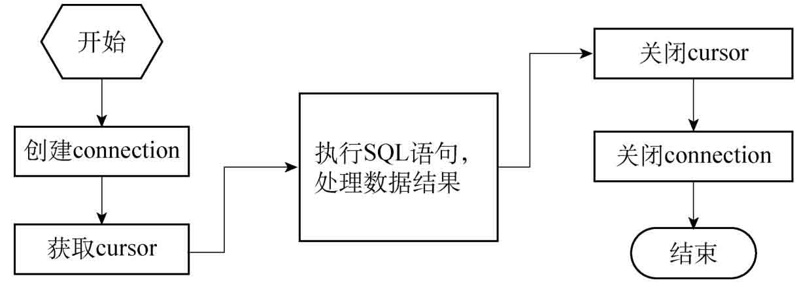

*图14.1 操作数据库流程*

**【例14.1】** 创建SQLite数据库文件。**（实例位置：资源包\\TM\\sl\\14\\01）**

创建一个mrsoft.db的数据库文件，然后执行SQL语句创建一个user（用户表），user表包含id和name两个字段。具体代码如下：

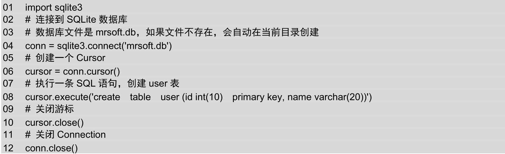

上述代码中，使用sqlite3.connect()方法连接SQLite数据库文件mrsoft.db，由于mrsoft.db文件并不存在，所以会在本实例Python代码同级目录下创建mrsoft.db文件，该文件包含了user表的相关信息。mrsoft.db文件所在目录如图14.2所示。

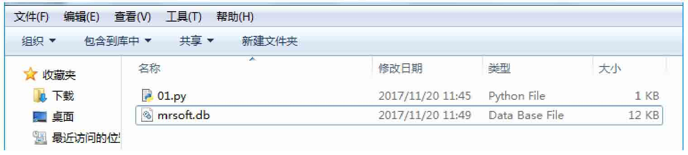

*图14.2 mrsoft.db文件所在目录*

**说明**

再次运行实例14.1时，会提示错误信息：sqlite3.OperationalError:table user alread exists。这是因为user表已经存在。

<a id="isbn9787302503880_2_14_1_1_4"></a>

### 14.2.2 操作SQLite

<a id="isbn9787302503880_2_14_1_1_1_3"></a>

#### 1．新增用户数据信息

为了向数据表中新增数据，可以使用如下SQL语句：

```python
insert into 表名(字段名1,字段名2,…,字段名n)  values (字段值1,字段值2,…,字段值n)
```

在user表中有两个字段，字段名分别为id和name。而字段值需要根据字段的数据类型来赋值，如id是一个长度为10的整型，name是长度为20的字符串型数据。向user表中插入3条用户信息记录，则SQL语句如下：

```python
01  cursor.execute('insert into user (id, name) values ("1", "MRSOFT")')
02  cursor.execute('insert into user (id, name) values ("2", "Andy")')
03  cursor.execute('insert into user (id, name) values ("3", "明日科技小助手")')
```

下面通过一个实例介绍一下向SQLite数据库中插入数据的流程。

**【例14.2】** 新增用户数据信息。**（实例位置：资源包\\TM\\sl\\14\\02）**

由于在实例14.1中已经创建了user表，所以本实例可以直接操作user表，向user表中插入3条用户信息。此外，由于是新增数据，需要使用commit()方法提交事务。因为对于增加、修改和删除操作，使用commit()方法提交事务后，如果相应操作失败，可以使用rollback()方法回滚到操作之前的状态。新增用户数据信息的具体代码如下：

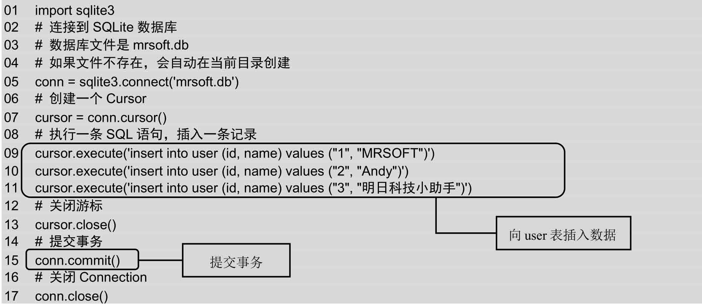

运行该实例，会向user表中插入3条记录。为验证程序是否正常运行，可以再次运行，如果提示如下信息，说明插入成功（因为user表中已经保存了上一次插入的记录，所以再次插入会报错）。

```python
sqlite3.IntegrityError: UNIQUE constraint failed: user.id
```

<a id="isbn9787302503880_2_14_1_1_1_4"></a>

#### 2．查看用户数据信息

查看user表中的数据可以使用如下SQL语句：

```python
select  字段名1,字段名2,字段名3,… from 表名  where 查询条件
```

查看用户信息的代码与插入数据信息大致相同，不同点在于使用的SQL语句不同。此外，查询数据时通常使用如下3种方式：


 fetchone()：获取查询结果集中的下一条记录。


 fetchmany(size)：获取指定数量的记录。


 fetchall()：获取结构集的所有记录。

下面通过一个实例来学习这3种查询方式的区别。

**【例14.3】** 使用3种方式查询用户数据信息。**（实例位置：资源包\\TM\\sl\\14\\03）**

分别使用fetchone、fetchmany和fetchall这3种方式查询用户信息，具体代码如下：

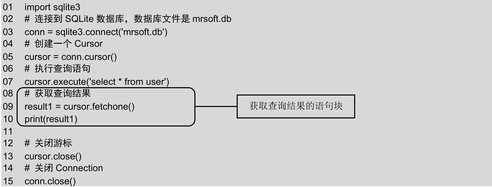

使用fetchone()方法返回的result1为一个元组，运行结果如下：

```python
(1,’MRSOFT’)
```

（1）修改实例14.3的代码，将获取查询结果的语句块代码修改为：

```python
01  result2 = cursor.fetchmany(2) # 使用fetchmany方法查询多条数据
02  print(result2)
```

使用fetchmany()方法传递一个参数，其值为2，默认为1。返回的result2为一个列表，列表中包含两个元组，运行结果如下：

```python
[(1,’MRSOFT’),(2,’Andy’)]
```

（2）修改实例14.3的代码，将获取查询结果的语句块代码修改为：

```python
01  result3 = cursor.fetchall() # 使用fetchmany方法查询多条数据
02  print(result3)
```

使用fetchall()方法返回的result3为一个列表，列表中包含所有user表中数据组成的元组，运行结果如下：

```python
[(1,’MRSOFT’),(2,’Andy’),(3,’明日科技’)]
```

（3）修改实例14.3的代码，将获取查询结果的语句块代码修改为：

```python
01  cursor.execute('select * from user where id > ?',(1,))
02  result3 = cursor.fetchall()
03  print(result3)
```

在select查询语句中使用问号作为占位符代替具体的数值，然后使用一个元组来替换问号（注意，不要忽略元组中最后的逗号）。上述查询语句等价于：

```python
cursor.execute('select * from user where id > 1')
```

运行结果如下：

```python
[(2,’Andy’),(3,’明日科技’)]
```

**说明**

使用占位符的方式可以避免SQL注入的风险，推荐使用这种方式。

<a id="isbn9787302503880_2_14_1_1_1_5"></a>

#### 3．修改用户数据信息

修改user表中的数据可以使用如下SQL语句：

```python
update  表名  set 字段名 = 字段值  where 查询条件
```

下面通过一个实例来学习一下如何修改表中数据。

**【例14.4】** 修改用户数据信息。**（实例位置：资源包\\TM\\sl\\14\\04）**

将sqlite数据库中user表ID为1的数据name字段值mrsoft修改为mr，并使用fetchAll获取表中的所有数据。具体代码如下：

```python
01  import sqlite3
02  # 连接到SQLite数据库，数据库文件是mrsoft.db
03  conn = sqlite3.connect('mrsoft.db')
04  # 创建一个Cursor
05  cursor = conn.cursor()
06  cursor.execute('update user set name = ? where id = ?',('MR',1))
07  cursor.execute('select * from user')
08  result = cursor.fetchall()
09  print(result)
10  # 关闭游标
11  cursor.close()
12  # 提交事务
13  conn.commit()
14  # 关闭Connection:
15  conn.close()
```

运行结果如下：

```python
[(1, 'MR'), (2, 'Andy'), (3, '明日科技小助手')]
```

<a id="isbn9787302503880_2_14_1_1_1_6"></a>

#### 4．删除用户数据信息

删除user表中的数据可以使用如下SQL语句：

```python
delete  from 表名  where 查询条件
```

下面通过一个实例来学习一下如何删除表中数据。

**【例14.5】** 删除用户数据信息。**（实例位置：资源包\\TM\\sl\\14\\05）**

将sqlite数据库中user表ID为1的数据删除，并使用fetchAll获取表中的所有数据，查看删除后的结果。具体代码如下：

```python
01  import sqlite3
02  # 连接到SQLite数据库，数据库文件是mrsoft.db
03  conn = sqlite3.connect('mrsoft.db')
04  # 创建一个Cursor
05  cursor = conn.cursor()
06  cursor.execute('delete from user where id = ?',(1,))
07  cursor.execute('select * from user')
08  result = cursor.fetchall()
09  print(result)
10  # 关闭游标
11  cursor.close()
12  # 提交事务
13  conn.commit()
14  # 关闭Connection:
15  conn.close()
```

执行上述代码后，user表中ID为1的数据将被删除。运行结果如下：

```python
[(2, 'Andy'), (3, '明日科技小助手')]
```

<a id="isbn9787302503880_2_14_1_3"></a>

## 14.3 使用MySQL

<a id="isbn9787302503880_2_14_1_1_5"></a>

### 14.3.1 下载安装MySQL

MySQL是一款开源的数据库软件，由于其免费特性得到了全世界用户的喜爱，是目前使用人数最多的数据库。下面将详细讲解如何下载和安装MySQL库。

<a id="isbn9787302503880_2_14_1_1_1_7"></a>

#### 1．下载MySQL

在浏览器的地址栏中输入地址https://dev.mysql.com/downloads/windows/installer/5.7.html，并按Enter键，将进入当前版本MySQL 5.7的下载页面，选择离线安装包，如图14.3所示。

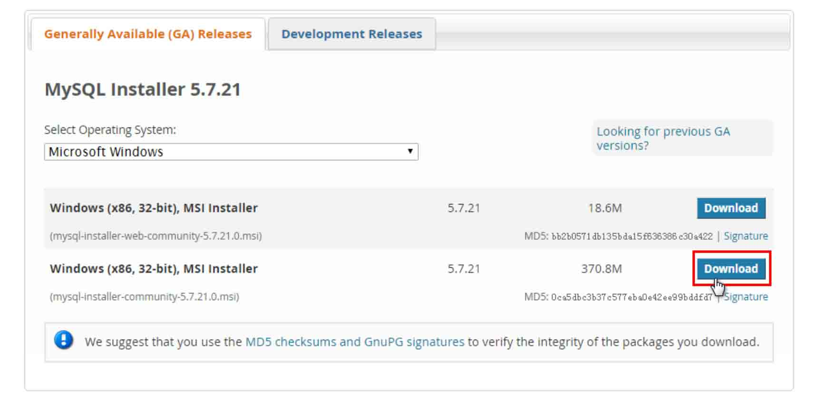

*图14.3 下载MySQL*

单击Download按钮下载，进入开始下载页面，如果有MySQL的账户，可以单击Login按钮，登录账户后下载，如果没有，可以直接单击下方的“No thanks, just take me to the download.”超链接，跳过注册步骤，直接下载，如图14.4所示。

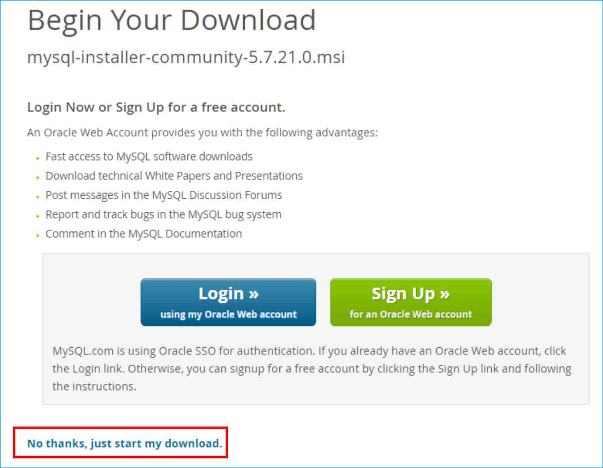

*图14.4 不注册下载*

<a id="isbn9787302503880_2_14_1_1_1_8"></a>

#### 2．安装MySQL

下载完成以后，开始安装MySQL。双击安装文件，在所示界面中选中I accept the license terms，单击Next按钮，进入选择设置类型界面。在选择设置中有5种类型，说明如下：


 Developer Default：安装MySQL服务器以及开发MySQL应用所需的工具。工具包括开发和管理服务器的GUI工作台、访问操作数据的Excel插件、与Visual Studio集成开发的插件、通过NET/Java/C/C++/OBDC等访问数据的连接器、例子和教程、开发文档。


 Server only：仅安装MySQL服务器，适用于部署MySQL服务器。


 Client only：仅安装客户端，适用于基于已存在的MySQL服务器进行MySQL应用开发的情况。


 Full：安装MySQL所有可用组件。


 Custom：自定义需要安装的组件。

MySQL会默认选择Developer Default类型，这里我们选择纯净的Server only类型，如图14.5所示，然后一直默认选择安装。

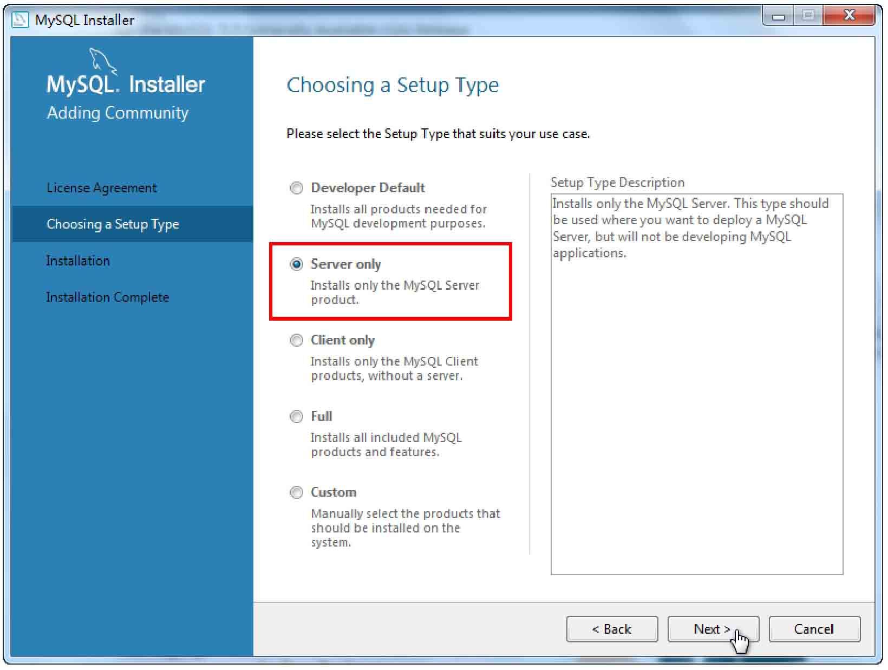

*图14.5 选择安装类型*

<a id="isbn9787302503880_2_14_1_1_1_9"></a>

#### 3．设置环境变量

安装完成以后，默认的安装路径是C:\\Program Files\\MySQL\\MySQL Server 5.7\\bin。下面设置环境变量，以便在任意目录下使用MySQL命令。右击“计算机”→选择“属性”→选择“高级系统设置”→选择“环境变量”→选择“PATH”→单击“编辑”按钮，将C:\\Program Files\\MySQL\\MySQL Server 5.7\\bin写在变量值中，如图14.6所示。

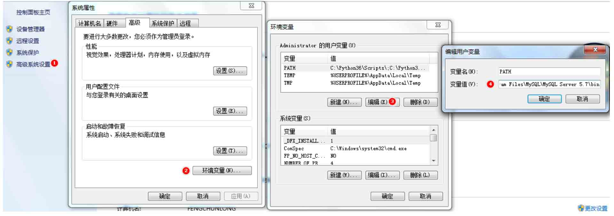

*图14.6 设置环境变量*

<a id="isbn9787302503880_2_14_1_1_1_10"></a>

#### 4．启动MySQL

使用MySQL数据库前，需要先启动MySQL。在cmd窗口中，输入命令行“net start mysql57”来启动MySQL 5.7。启动成功后，使用账户和密码进入MySQL。输入命令“mysql-u root-p”，接着提示“Enter password:”，输入密码root即可进入MySQL，如图14.7所示。

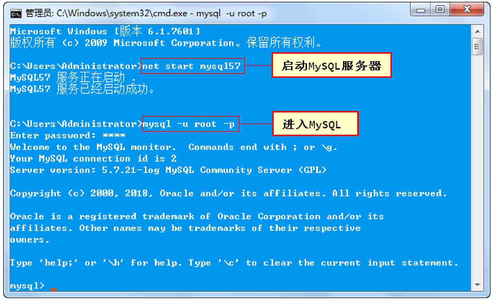

*图14.7 启动MySQL*

<a id="isbn9787302503880_2_14_1_1_1_11"></a>

#### 5．使用Navicat for MySQL管理软件

在命令提示符下操作MySQL数据库的方式对初学者并不友好，而且需要有专业的SQL语言知识，所以各种MySQL图形化管理工具应运而生，其中Navicat for MySQL就是一个广受好评的桌面版MySQL数据库管理和开发工具。它使用图形化的用户界面，可以让用户使用和管理更为轻松。官方网址：https://www.navicat.com.cn。

首先下载、安装Navicat for MySQL。然后新建MySQL连接，如图14.8所示。

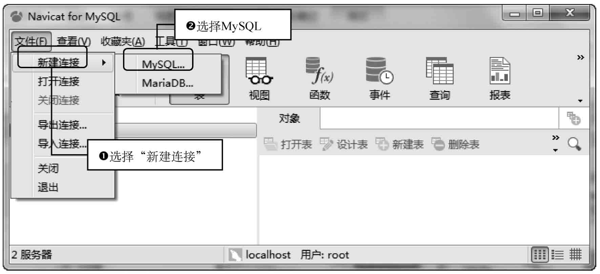

*图14.8 新建MySQL连接*

接下来，输入连接信息。输入连接名studyPython，输入主机名后IP地址localhost或127.0.0.1，输入密码为root，如图14.9所示。

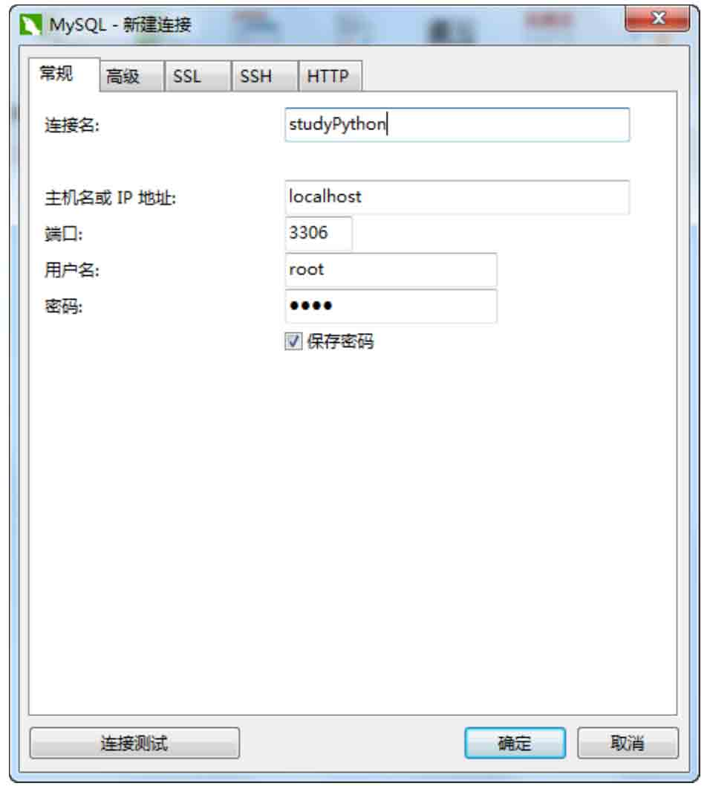

*图14.9 输入连接信息*

单击“确定”按钮，创建完成。此时，双击localhost图标，即进入localhost数据库，如图14.10所示。

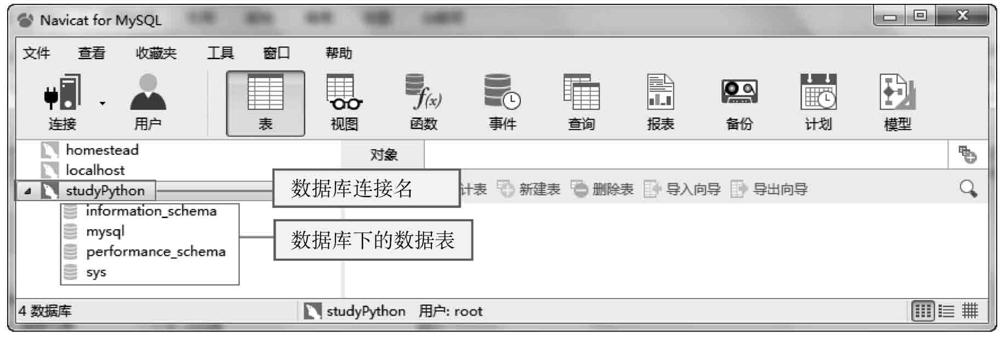

*图14.10 Navicat主页*

下面使用Navicat创建一个名为mrsoft的数据库，步骤为：右击studyPython图标→选择“新建数据库”命令→填写数据库信息，如图14.11所示。

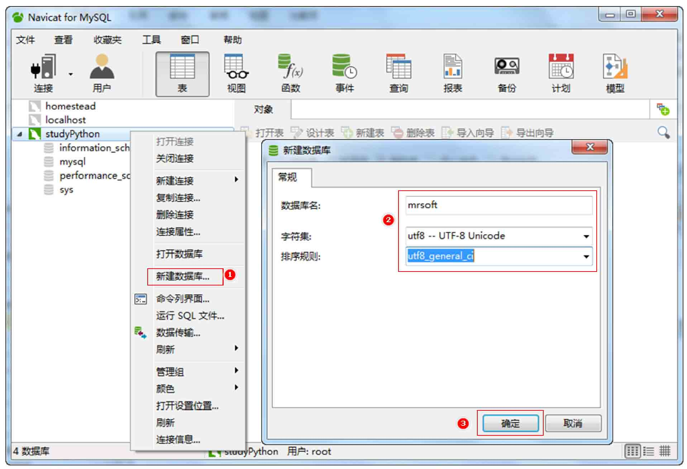

*图14.11 创建数据库*

**说明**

Navicat for MySQL的更多操作请查阅相关资料。

<a id="isbn9787302503880_2_14_1_1_6"></a>

### 14.3.2 安装PyMySQL

由于MySQL服务器以独立的进程运行，并通过网络对外服务，所以，需要支持Python的MySQL驱动来连接到MySQL服务器。在Python中支持MySQL的数据库模块有很多，我们选择使用PyMySQL。

PyMySQL的安装比较简单，在cmd中运行如下命令：

```python
pip install PyMySQL
```

运行结果如图14.12所示。

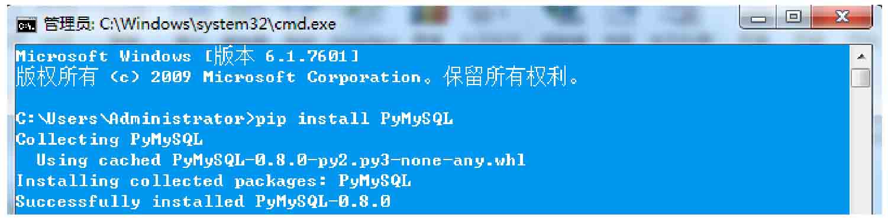

*图14.12 安装PyMySQL*

<a id="isbn9787302503880_2_14_1_1_7"></a>

### 14.3.3 连接数据库

使用数据库的第一步是连接数据库。接下来使用PyMySQL连接数据库。由于PyMySQL也遵循Python Database API 2.0规范，所以操作MySQL数据库的方式与SQLite相似。我们可以通过类比的方式来学习。

**【例14.6】** 使用PyMySQL连接数据库。**（实例位置：资源包\\TM\\sl\\14\\06）**

前面我们已经创建了一个MySQL连接studyPython，并且在安装数据库时设置了数据库的用户名root和密码root。下面就通过以上信息，使用connect()方法连接MySQL数据库。具体代码如下：

```python
01  import pymysql
02
03  # 打开数据库连接,参数1:主机名或IP；参数2：用户名；参数3：密码；参数4：数据库名称
04  db = pymysql.connect("localhost", "root", "root", "studyPython")
05  # 使用 cursor()方法创建一个游标对象 cursor
06  cursor = db.cursor()
07  # 使用 execute()方法执行 SQL 查询
08  cursor.execute("SELECT VERSION()")
09  # 使用 fetchone()方法获取单条数据
10  data = cursor.fetchone()
11  print ("Database version : %s " % data)
12  # 关闭数据库连接
13  db.close()
```

上述代码中，首先使用connect()方法连接数据库，然后使用cursor()方法创建游标，接着使用excute()方法执行SQL语句查看MySQL数据库版本，然后使用fetchone()方法获取数据，最后使用close()方法关闭数据库连接。运行结果如下：

```python
Database version : 5.7.21-log
```

<a id="isbn9787302503880_2_14_1_1_8"></a>

### 14.3.4 创建数据表

数据库连接成功以后，我们就可以为数据库创建数据表了。下面通过一个实例使用execute()方法来为数据库创建表books图书表。

**【例14.7】** 创建books图书表。**（实例位置：资源包\\TM\\sl\\14\\07）**

books表包含id（主键）、name（图书名称），category（图书分类），price（图书价格）和publish\_time（出版时间）5个字段。创建books表的SQL语句如下：

```python
CREATE TABLE books (
  id int(8) NOT NULL AUTO_INCREMENT,
  name varchar(50) NOT NULL,
  category varchar(50) NOT NULL,
  price decimal(10,2) DEFAULT NULL,
  publish_time date DEFAULT NULL,
  PRIMARY KEY (id)
) ENGINE=MyISAM AUTO_INCREMENT=1 DEFAULT CHARSET=utf8;
```

在创建数据表前，使用如下语句：

```python
DROP TABLE IF EXISTS `books`;
```

如果mrsoft数据库中已经存在books，那么先删除books，然后再创建books数据表。具体代码如下：

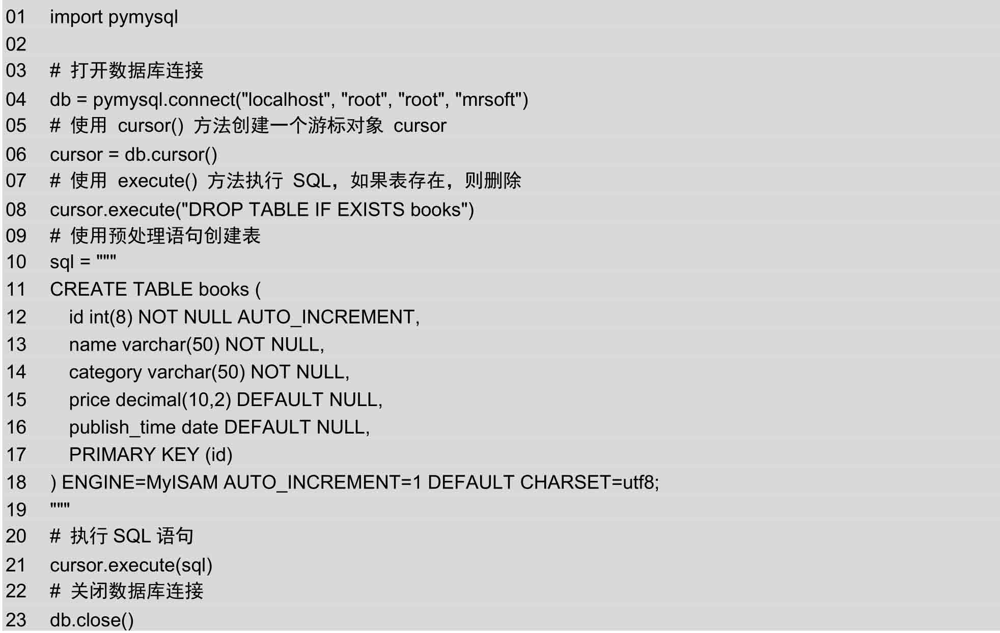

运行上述代码后，mrsoft数据库下就已经创建了一个books表。打开Navicat（如果已经打开按F5键刷新），发现mrsoft数据库下多了一个books表，右击books，选择设计表，效果如图14.13所示。

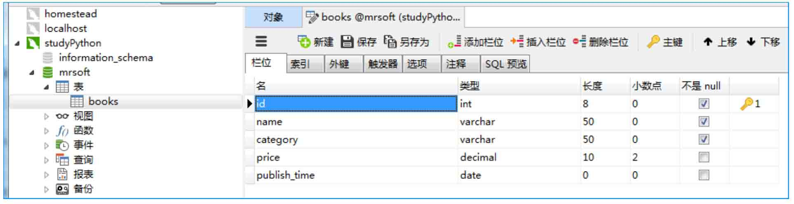

*图14.13 创建books表效果*

<a id="isbn9787302503880_2_14_1_1_9"></a>

### 14.3.5 操作MySQL数据表

MySQL数据表的操作主要包括数据的增删改查，与操作SQLite类似，这里通过一个实例讲解如何向books表中新增数据，至于修改、查找和删除数据则不再赘述。

**【例14.8】** books图书表添加图书数据。**（实例位置：资源包\\TM\\sl\\14\\08）**

在向books图书表中插入图书数据时，可以使用excute()方法添加一条记录，也可以使用executemany()方法批量添加多条记录，executemany()方法的格式如下：

```python
executemany(operation, seq_of_params)
```

参数说明如下：


 operation：操作的SQL语句。


 seq\_of\_params：参数序列。

executemany()方法批量添加多条记录的具体代码如下：

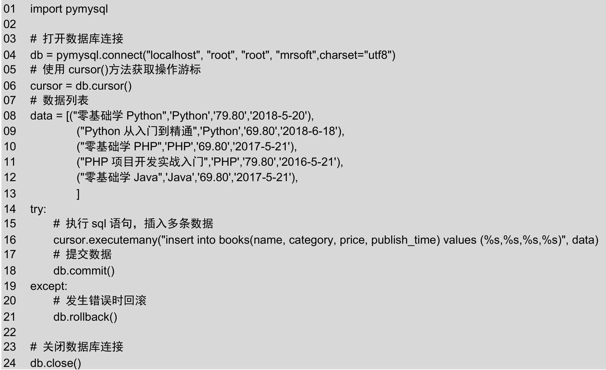

上述代码中，特别注意以下两点：


 使用connect()方法连接数据库时，额外设置字符集charset=utf-8，可以防止插入中文时出错。


 在使用insert语句插入数据时，使用%s作为占位符，可以防止SQL注入。

运行上述代码，在Navicat中查看books表数据，如图14.14所示。

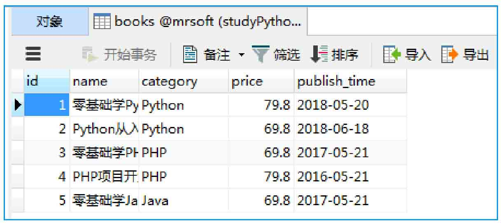

*图14.14 books表数据*

<a id="isbn9787302503880_2_14_1_4"></a>

## 14.4 小结

本章主要介绍了使用Python操作数据库的基础知识。通过本章的学习，读者能够理解Python数据库编程接口，并掌握Python操作数据库的通用流程。掌握数据库连接对象的常用方法，并能够具备独立完成设计数据库的能力。希望本章能够起到抛砖引玉的作用，能够帮助读者在此基础上更深层次地学习Python操作SQLite和MySQL数据库的相关技术，并进一步学习使用SQLAlchemy的方式操作数据库的方法。
