<a id="isbn9787302503880_3_15"></a>

# 第15章  GUI界面编程

**（


 视频讲解：82分钟）**

到目前为止，我们的所有输入和输出都只是IDLE中的简单文本。不过现代计算机和程序会使用大量的图形。如果我们的程序中也有一些图形就太好了。在这一章中，我们会开始建立一些简单的GUI。这说明从现在开始，我们的程序看上去就会像你平常熟悉的那些程序一样，将会有窗口、按钮之类的图形。

通过阅读本章，您可以：


 了解什么是GUI和常用的GUI框架


 了解如何安装GUI框架wxPython


 掌握如何使用wxPython框架创建一个应用程序


 掌握wxPython框架中提供的常用控件


 掌握BoxSizer布局的应用


 掌握如何进行事件处理

<a id="isbn9787302503880_3_15_1_1"></a>

## 15.1 初识GUI

<a id="isbn9787302503880_3_15_1_1_1"></a>

### 15.1.1 什么是GUI

GUI是Graphical User Interface（图形用户界面）的缩写。在GUI中，并不只是输入文本和返回文本，用户可以看到窗口、按钮、文本框等图形，而且可以用鼠标单击，还可以通过键盘输入。GUI是与程序交互的一种不同的方式。GUI的程序有3个基本要素：输入、处理和输出，如图15.1所示，但它们的输入和输出更丰富、更有趣一些。

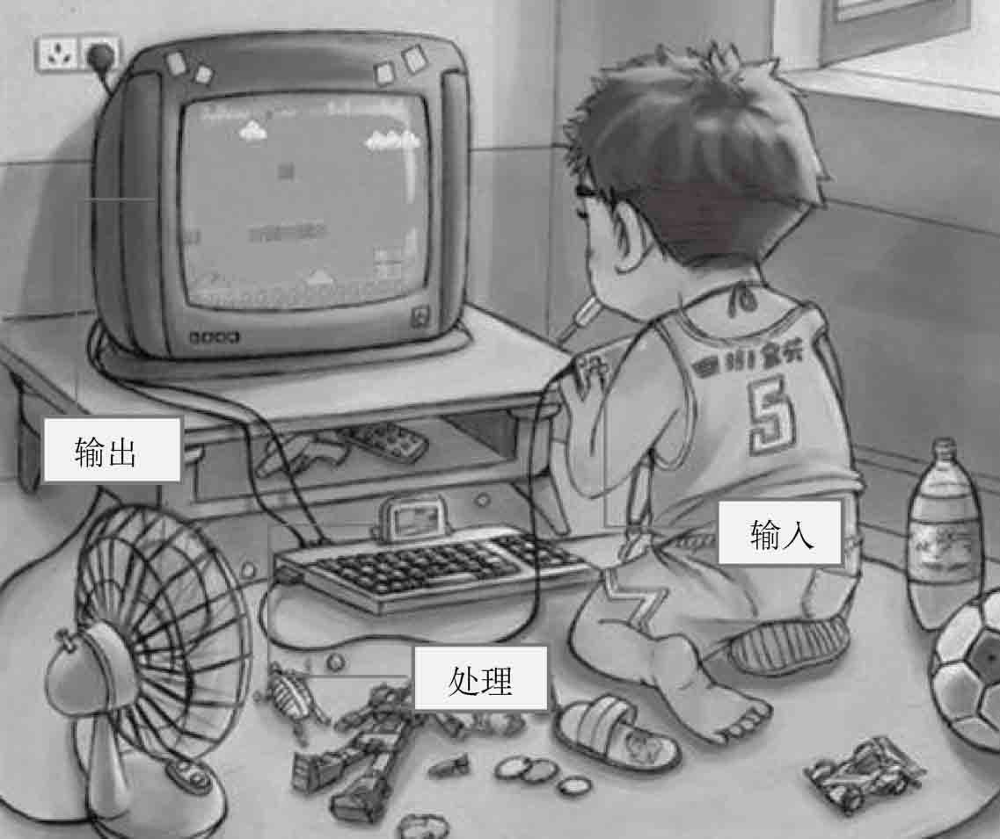

*图15.1 GUI的3个基本要素*

<a id="isbn9787302503880_3_15_1_1_2"></a>

### 15.1.2 常用的GUI框架

对于Python的GUI开发，有很多工具包可以选择。其中一些流行的工具包如表15.1所示。

**表15.1 流行的GUI工具包**

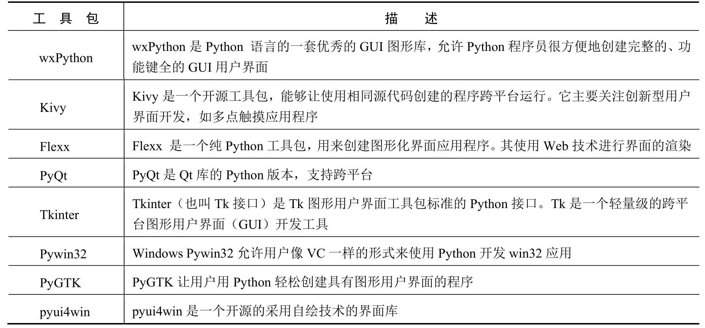

每个工具包都有其优缺点，所以工具包的选择取决于用户的应用场景。本章将详细介绍wxPython的使用方法。

<a id="isbn9787302503880_3_15_1_1_3"></a>

### 15.1.3 安装wxPython

wxPython是个成熟而且特性丰富的跨平台GUI工具包。由Robin Dunn和Harri Pasanen开发，官方网站：http://wxpython.org。wxPython的安装非常简单，使用pip工具安装wxPython只需要如下一行命令：

```python
pip install -U wxPython
```

在Windows系统的cmd命令下，使用pip安装wxPython，如图15.2所示。

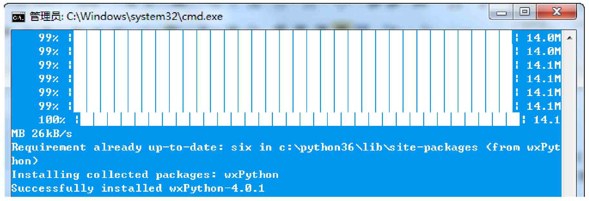

*图15.2 安装wxPython*

<a id="isbn9787302503880_3_15_1_2"></a>

## 15.2 创建应用程序

使用wxPython之前，先来了解两个基础对象：应用程序对象和顶级窗口。


 应用程序对象管理主事件循环，主事件循环是wxPython程序的动力。如果没有应用程序对象，wxPython应用程序将不能运行。


 顶级窗口通常用于管理最重要的数据，控制并呈现给用户。

图15.3显示了这两个基础对象和应用程序的其他部分之间的关系。

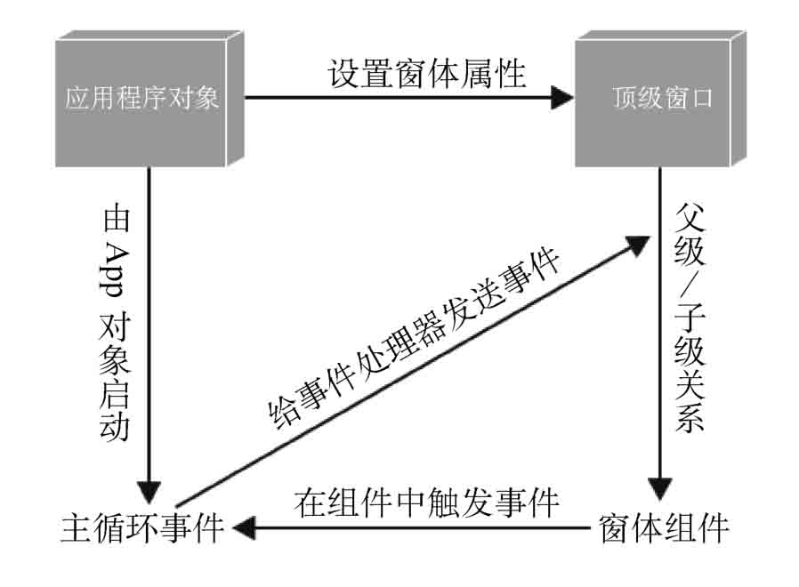

*图15.3 wxPython应用的基本结构*

在图15.3中，这个应用程序对象拥有顶级窗口和主事件循环。顶级窗口管理其窗口中的组件和其他的分配给它的数据对象。窗口和它的组件的触发事件基于用户的动作，并接受事件通知以便改变显示。

<a id="isbn9787302503880_3_15_1_1_4"></a>

### 15.2.1 创建一个wx.App的子类

在开始创建应用程序之前，先来创建一个没有任何功能的子类。创建和使用一个wx.App子类，需要执行如下4个步骤：


 定义这个子类。


 在定义的子类中写一个OnInit()初识化方法。


 在程序的主要部分创建这个类的一个实例。


 调用应用程序实例的MainLoop()方法。这个方法将程序的控制权转交给wxPython。

创建一个没有任何功能的子类，具体代码如下：

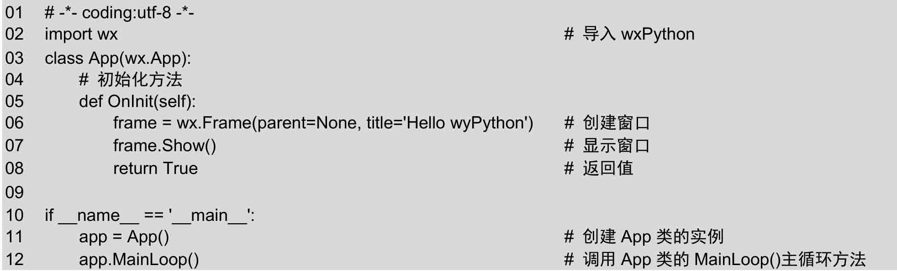

上述代码中，定义了一个子类App()，它继承父类wx.App，子类中包含一个初始化方法OnInit()。在主程序中创建类的实例，然后调用MainLoop()主循环方法。运行结果如图15.4所示。

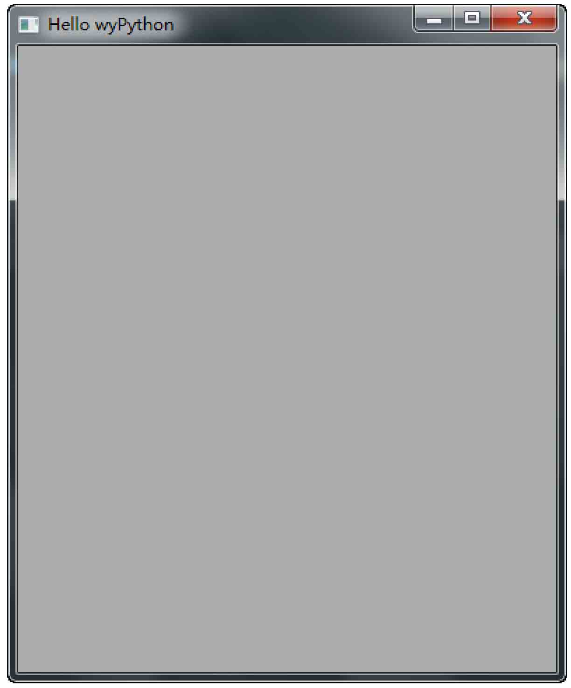

*图15.4 创建子类*

<a id="isbn9787302503880_3_15_1_1_5"></a>

### 15.2.2 直接使用wx.App

通常，如果在系统中只有一个窗口的话，可以不创建wx.App子类，直接使用wx.App。这个类提供了一个最基本的OnInit()初始化方法，具体代码如下：

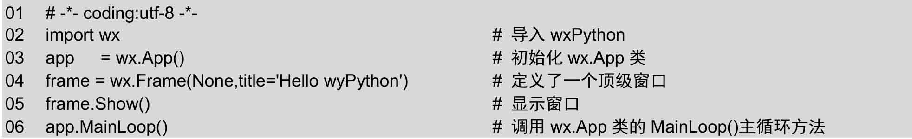

上述代码中，wx.App()初始化wx.App类，包含了OnInit()方法，运行结果与图15.4相同。

<a id="isbn9787302503880_3_15_1_1_6"></a>

### 15.2.3 使用wx.Frame框架

在GUI中，框架通常也称为窗口。框架是一个容器，用户可以将它在屏幕上任意移动，并可对它进行缩放，它通常包含诸如标题栏、菜单等。在wxPython中，wx.Frame是所有框架的父类。当用户创建wx.Frame的子类时，子类应该调用其父类的构造器wx.Frame.\_\_init\_\_()。wx.Frame的构造器语法格式如下：

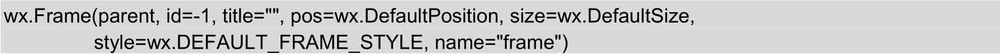

参数说明如下：


 parent：框架的父窗口。如果是顶级窗口，这个值是None。


 id：关于新窗口的wxPython ID号。通常设为−1，让wxPython自动生成一个新的ID。


 title：窗口的标题。


 pos：一个wx.Point对象，它指定这个新窗口的左上角在屏幕中的位置。在图形用户界面程序中，通常（0,0）是显示器的左上角。这个默认的（-1,-1）将让系统决定窗口的位置。


 size：一个wx.Size对象，它指定这个窗口的初始尺寸。这个默认的（-1,-1）将让系统决定窗口的初始尺寸。


 style：指定窗口的类型的常量。可以使用或运算来组合它们。


 name：框架的内在的名字。可以使用它来寻找这个窗口。

创建wx.Frame子类的代码如下：

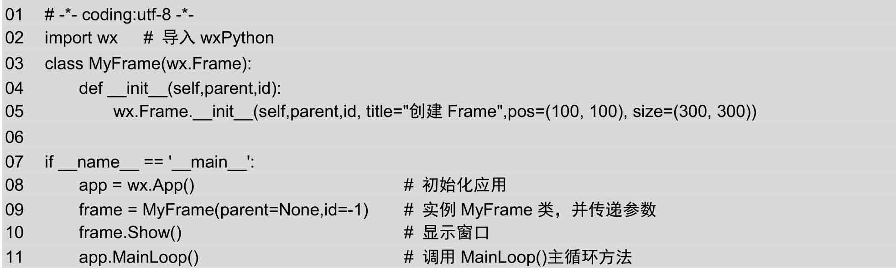

上述代码中，在主程序中调用MyFrame类，并且传递两个参数。在MyFrame类中，自动执行\_\_init\_\_()初始化方法，接收参数。然后调用父类wx.Frame的\_\_init\_\_()初始化方法，设置顶级窗口的相关属性。运行结果如图15.5所示。

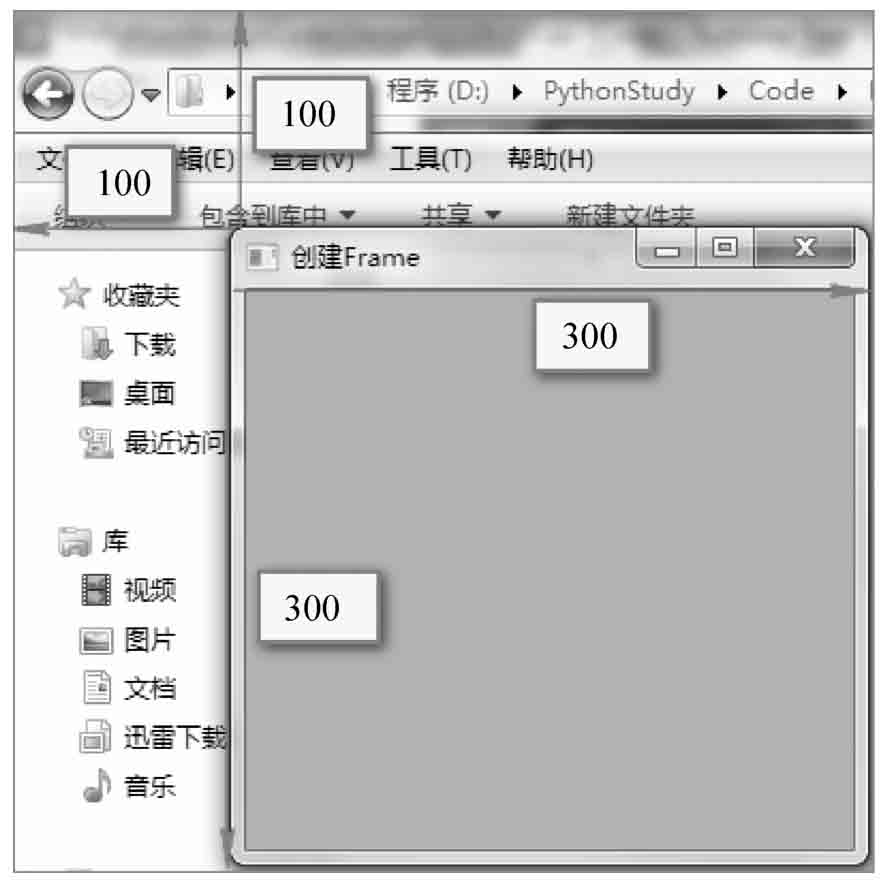

*图15.5 使用wx.Frame框架*

<a id="isbn9787302503880_3_15_1_3"></a>

## 15.3 常用控件

创建完窗口以后，我们可以在窗口内添加一些控件，所谓的控件，就是经常使用的按钮、文本、输入框、单选框等。

<a id="isbn9787302503880_3_15_1_1_7"></a>

### 15.3.1 StaticText文本类

对于所有的UI工具来说，最基本的任务就是在屏幕上绘制纯文本。在wxPython中，可以使用wx.StaticText类来完成。使用wx.StaticText能够改变文本的对齐方式、字体和颜色等。wx.StaticText类的构造函数语法格式如下：

```python
wx.StaticText(parent, id, label, pos=wx.DefaultPosition,size=wx.DefaultSize,
             style=0, name="staticText")
```

wx.StaticText构造函数的参数如下所示。


 parent：父窗口部件。


 id：标识符。使用-1可以自动创建一个唯一的标识。


 label：显示在静态控件中的文本内容。


 pos：一个wx.Point或一个Python元组，它是窗口部件的位置。


 size：一个wx.Size或一个Python元组，它是窗口部件的尺寸。


 style：样式标记。


 name：对象的名字。

**【例15.1】** 使用wx.StaticText输出Python之禅。**（实例位置：资源包\\TM\\sl\\15\\01）**

在Python控制台中输入import this后，会输出如图15.6所示的结果，结果中的英文语句就是通常所说的Python之禅。

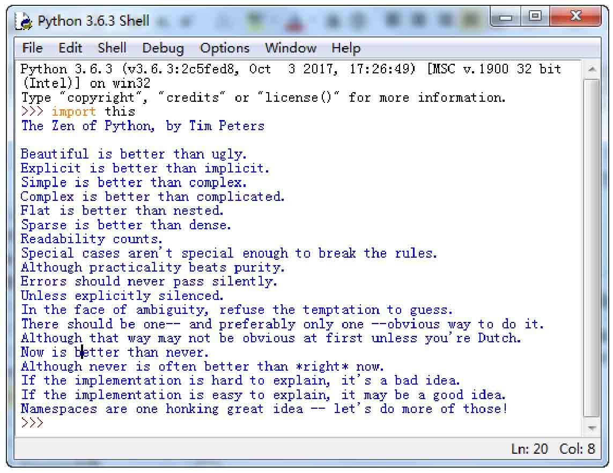

*图15.6 Python之禅*

下面使用StaticText类输出中文版的Python之禅。具体代码如下：

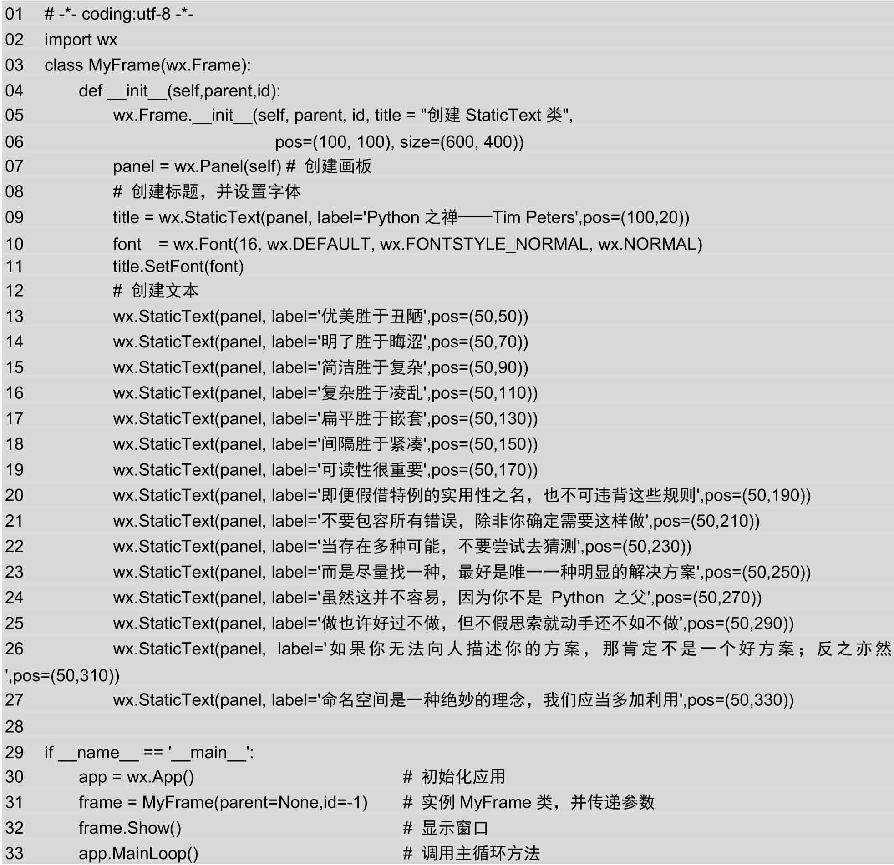

上述代码中，使用panel = wx.Panel(self)来创建画板，并将panel作为父类，然后将组件放入窗体中。此外，使用wx.Font类来设置字体。创建一个字体实例，需要使用如下的构造函数：

```python
wx.Font(pointSize, family, style, weight, underline=False, faceName="",
    encoding=wx.FONTENCODING_DEFAULT)
```

参数说明如下：


 pointSize：字体的整数尺寸，单位为磅。


 family：用于快速指定一个字体而无须知道该字体的实际名字。


 style：指明字体是否倾斜。


 weight：指明字体的醒目程度。


 underline：仅在Windows系统下有效，如果取值为True，则加下划线，False为无下划线。


 faceName：指定字体名。


 encoding：允许在几个编码中选择一个，大多数情况可以使用默认编码。

运行结果如图15.7所示。

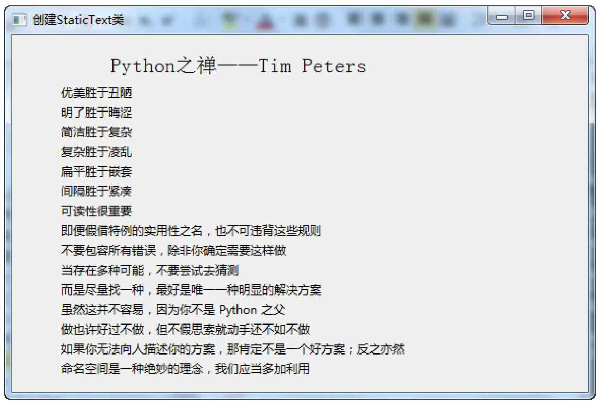

*图15.7 输出Python之禅*

<a id="isbn9787302503880_3_15_1_1_8"></a>

### 15.3.2 TextCtrl输入文本类

wx.StaticText类只能够用于显示纯粹的静态文本，但是有时需要输入文本与用户进行交互，此时，就需要使用wx.TextCtrl类，它允许输入单行和多行文本。它也可以作为密码输入控件，掩饰所按下的按键。

wx.TextCtrl类的构造函数的语法格式如下：

```python
wx.TextCtrl(parent, id, value = "", pos=wx.DefaultPosition, size=wx.DefaultSize, style=0, validator=wx.DefaultValidator
name=wx.TextCtrlNameStr)
```

参数parent、id、pos、size、style和name与wx.StaticText构造函数相同，重点看一下其他参数。


 style：单行wx.TextCtrl的样式，取值及说明如下。

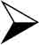

 wx.TE\_CENTER：控件中的文本居中。


 wx.TE\_LEFT：控件中的文本左对齐。默认行为。


 wx.TE\_NOHIDESEL：文本始终高亮显示，只适用于Windows系统。


 wx.TE\_PASSWORD：不显示所输入的文本，以星号（\*）代替显示。


 wx.TE\_PROCESS\_ENTER：如果使用该参数，那么当用户在控件内按Enter键时，一个文本输入事件将被触发。否则，按键事件内在的由该文本控件或该对话框管理。


 wx.TE\_PROCESS\_TAB：如果指定了这个样式，那么通常的字符事件在Tab键按下时创建（一般意味一个制表符将被插入文本）。否则，tab由对话框来管理，通常是控件间的切换。


 wx.TE\_READONLY：文本控件为只读，用户不能修改其中的文本。


 wx.TE\_RIGHT：控件中的文本右对齐。


 value：显示在该控件中的初始文本。


 validator：常用于过滤数据以确保只能输入要接收的数据。

**【例15.2】** 使用wx.TextCtrl实现登录界面。**（实例位置：资源包\\TM\\sl\\15\\02）**

使用wx.TextCtrl类和wx.StaticText类实现一个包含用户名和密码的登录界面。具体代码如下：

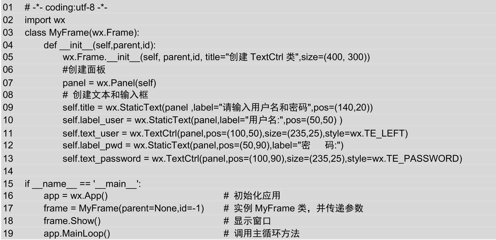

上述代码中，使用wx.TextCtrl类生成用户名，并且设置控件中的文本左对齐。使用wx.TextCtrl类生成密码，并且设置文本用星号代替。运行结果如图15.8所示。

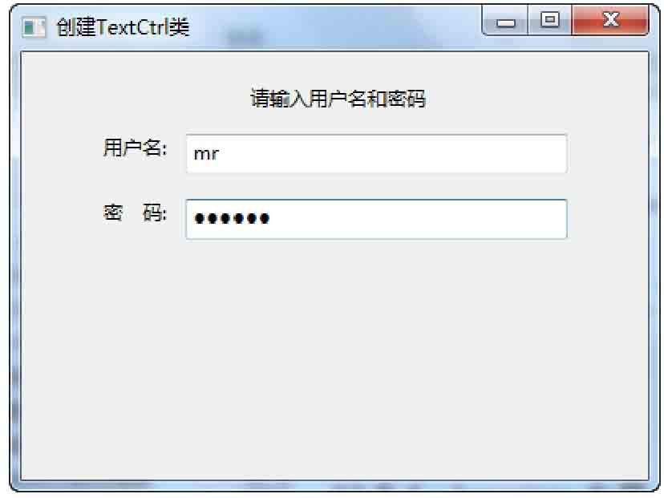

*图15.8 生成用户名和密码文本框*

<a id="isbn9787302503880_3_15_1_1_9"></a>

### 15.3.3 Button按钮类

按钮是GUI界面中应用最为广泛的控件，它常用于捕获用户生成的单击事件，其最明显的用途是触发绑定到一个处理函数。

wxPython类库提供不同类型的按钮，其中最简单、常用的是wx.Button类。wx.Button的构造函数如下所示：

```python
wx.Button(parent, id, label, pos, size=wxDefaultSize, style=0, validator, name="button")
```

wx.Button的参数与wx.TextCtrl的参数基本相同，其中参数label是显示在按钮上的文本。

**【例15.3】** 为登录界面添加“确认”和“取消”按钮。**（实例位置：资源包\\TM\\sl\\15\\03）**

使用wx.Button，在实例15.2的基础上添加“确认”和“取消”按钮。具体代码如下：

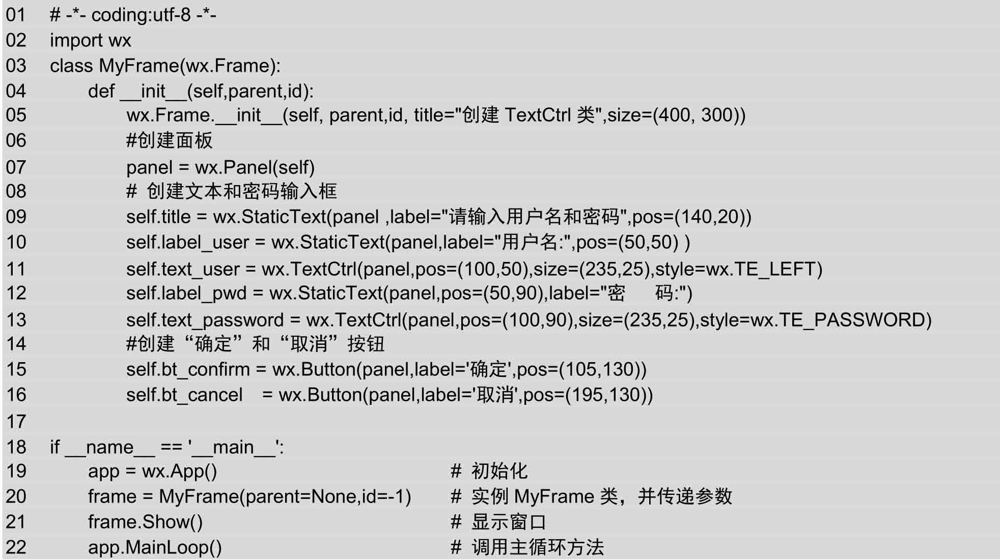

运行结果如图15.9所示。

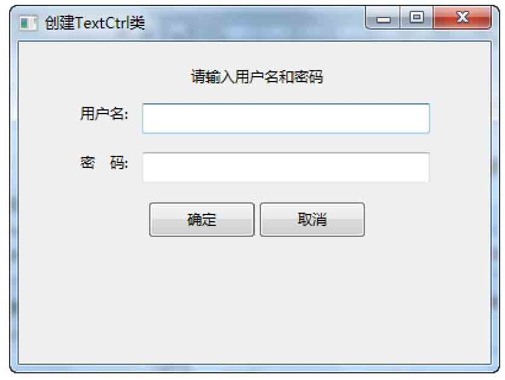

*图15.9 添加按钮的登录界面*

<a id="isbn9787302503880_3_15_1_4"></a>

## 15.4 BoxSizer布局

在前面的例子中使用了文本和按钮等控件，并将这些控件通过pos参数布置在pannel画板上。虽然这种设置坐标的方式很容易理解，但是过程很麻烦。此外，控件的几何位置是绝对位置，也就是固定的。当调整窗口大小时，界面会不美观。在wxPython中有一种更智能的布局方式——sizer（尺寸器）。sizer是用于自动布局一组窗口控件的算法。sizer被附加到一个容器，通常是一个框架或面板。在父容器中创建的子窗口控件必须被分别地添加到sizer。当sizer被附加到容器时，它随后就可以管理它所包含的子布局。

wxPython提供了5个sizer，相关说明如表15.2所示。

**表15.2 wxPython的sizer说明**

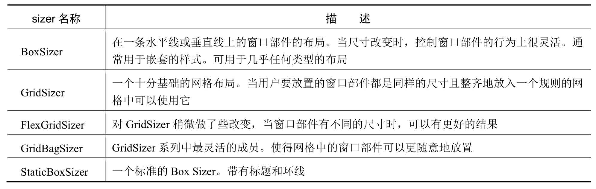

<a id="isbn9787302503880_3_15_1_1_10"></a>

### 15.4.1 什么是BoxSizer

BoxSizer是wxPython所提供的sizer中最简单和最灵活的。一个BoxSizer是一个垂直列或水平行，窗口部件在其中从左至右或从上到下布置在一条线上。虽然这听起来好像用处不大，但是来自相互之间嵌套sizer的能力使用户能够在每行或每列很容易放置不同数量的项目。由于每个sizer都是一个独立的实体，因此用户的布局就有了更多的灵活性。对于大多数的应用程序，一个嵌套有水平sizer的垂直sizer将使用户能够创建自己所需要的布局。

<a id="isbn9787302503880_3_15_1_1_11"></a>

### 15.4.2 使用BoxSizer布局

尺寸器会管理组件的尺寸。只要将部件添加到尺寸器上，再加上一些布局参数，然后让尺寸器自己去管理父组件的尺寸。下面使用BoxSizer实现简单的布局。代码如下：

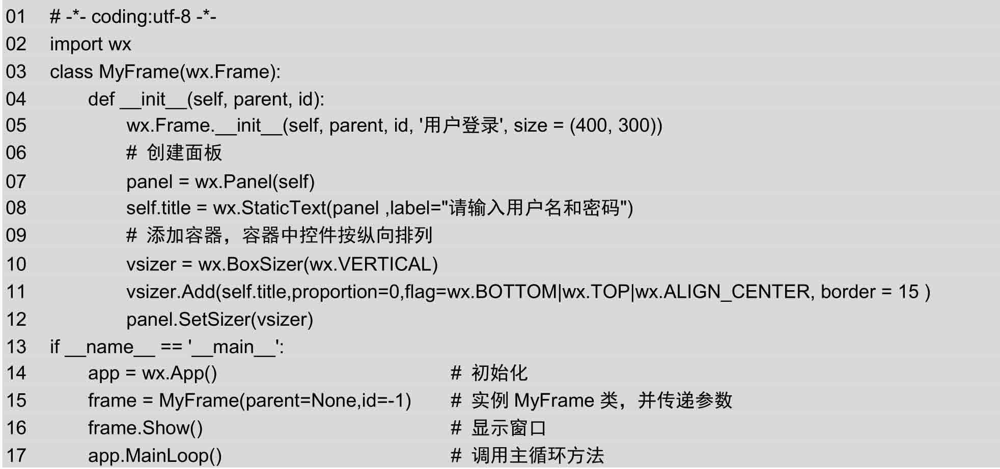

运行结果如图15.10所示。

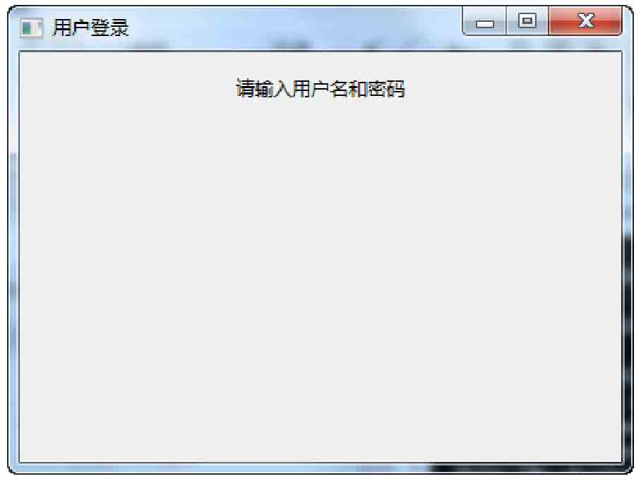

*图15.10 BoxSizer基本布局*

上述代码中，设置了增加背景控件（wx.Panel），并创建了一个wx.BoxSizer，它带有一个决定它是水平还是垂直的参数（wx.HORIZONTAL或者wx.VERTICAL），默认为水平。然后使用Add()方法将控件加入sizer，最后使用面板的SetSizer()方法设定它的尺寸器。

Add()方法的语法格式如下：

```python
Box.Add(control, proportion, flag, border)
```

参数说明如下：


 control：要添加的控件。


 proportion：所添加控件在定义的定位方式所代表方向上占据的空间比例。如果有3个按钮，它们的比例值分别为0、1和2，它们都已添加到一个宽度为30的水平排列wx.BoxSizer，起始宽度都是10。当sizer的宽度从30变成60时，按钮1的宽度保持不变，仍然是10，按钮2的宽度约为(10+(60−30)×1/(1+2))=30，按钮2约为20。


 flag：flag参数与border参数结合使用可以指定边距宽度，包括以下选项：


 wx.LEFT：左边距。


 wx.RIGHT：右边距。


 wx.BOTTOM：底边距。


 wx.TOP：上边距。


 wx.ALL：上、下、左、右4个边距。

可以通过竖线“\|”操作符（operator）来联合使用这些标志，比如wx.LEFT \| wx.BOTTOM。此外，flag参数还可以与proportion参数结合，指定控件本身的对齐（排列）方式，包括以下选项：


 wx.ALIGN\_LEFT：左边对齐。


 wx.ALIGN\_RIGHT：右边对齐。


 wx.ALIGN\_TOP：顶部对齐。


 wx.ALIGN\_BOTTOM：底边对齐。


 wx.ALIGN\_CENTER\_VERTICAL：垂直对齐。


 wx.ALIGN\_CENTER\_HORIZONTAL：水平对齐。


 wx.ALIGN\_CENTER：居中对齐。


 wx.EXPAND：所添加控件将占有sizer定位方向上所有可用的空间。


 boder：控制所添加控件的边距，就是在部件之间添加一些像素的空白。

**【例15.4】** 使用BoxSizer设置登录界面布局。**（实例位置：资源包\\TM\\sl\\15\\04）**

使用BoxSizer布局方式，实现实例15.3的界面布局效果。具体代码如下：

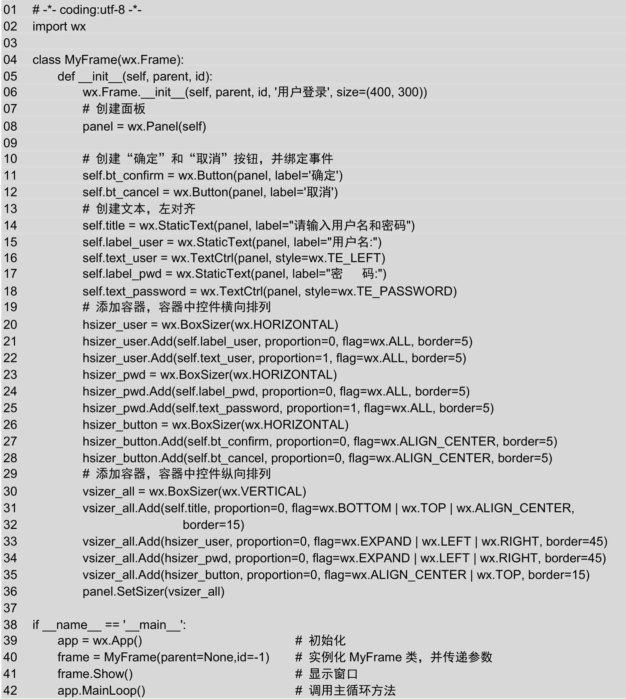

在上述代码中，首先创建按钮和文本控件，然后将其添加到容器中，并且设置横向排列。接着，设置纵向排列。在布局的过程中，通过设置每个控件的flag和border参数，实现控件位置间的布局。至此，使用BoxSizer将绝对位置布局更改为相对位置布局，运行结果如图15.11所示。

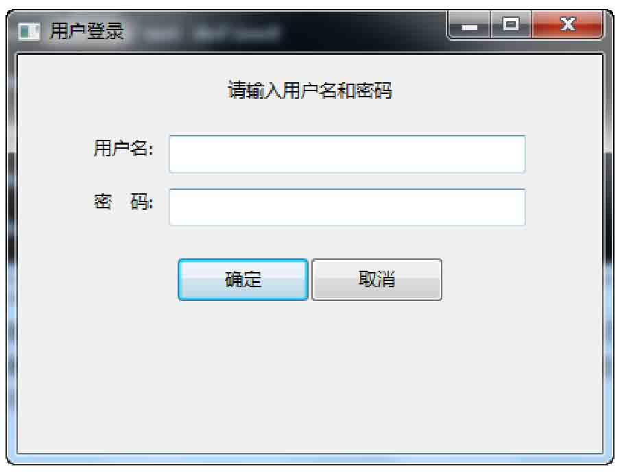

*图15.11 使用BoxSizer布局登录界面*

<a id="isbn9787302503880_3_15_1_5"></a>

## 15.5 事件处理

<a id="isbn9787302503880_3_15_1_1_12"></a>

### 15.5.1 什么是事件

完成布局以后，接下来就是输入用户名和密码。当单击“确定”按钮时，检验输入的用户名和密码是否正确，并输出相应的提示信息。当单击“取消”按钮时，清空已经输入的用户名和密码。要实现这样的功能，就需要使用wxPython的事件处理。

那么什么是事件呢？用户执行的动作就叫作事件（event），比如单击按钮，就是一个单击事件。

<a id="isbn9787302503880_3_15_1_1_13"></a>

### 15.5.2 绑定事件

当发生一个事件时，需要让程序注意这些事件并且做出反应。这时，可以将函数绑定到所涉及事件可能发生的控件上。当事件发生时，函数就会被调用。利用控件的Bind()方法可以将事件处理函数绑定到给定的事件上。例如，为“确定”按钮添加一个单击事件，代码如下：

```python
bt_confirm.Bind(wx.EVT_BUTTON,OnclickSubmit)
```

参数说明如下：


 wx.EVT\_BUTTON：事件类型为按钮类型。在wxPython中有很多wx.EVT\_开头的事件类型，例如，类型wx.EVT\_MOTION产生于用户移动鼠标。类型wx.ENTER\_WINDOW和wx.LEAVE\_WINDOW产生于当鼠标进入或离开一个窗口控件。类型wx.EVT\_MOUSEWHEEL被绑定到鼠标滚轮的活动。


 OnclickSubmit：方法名。事件发生时执行该方法。

**【例15.5】** 使用事件判断用户登录。**（实例位置：资源包\\TM\\sl\\15\\05）**

在实例15.4的基础上，分别为“确定”和“取消”按钮添加单击事件。当用户输入用户名和密码后，单击“确定”按钮，如果输入的用户名为mr并且密码为mrsoft，则弹出对话框提示“登录成功”，否则提示“用户名和密码不匹配”。当用户单击“取消”按钮时，清空用户输入的用户名和密码。关键代码如下：

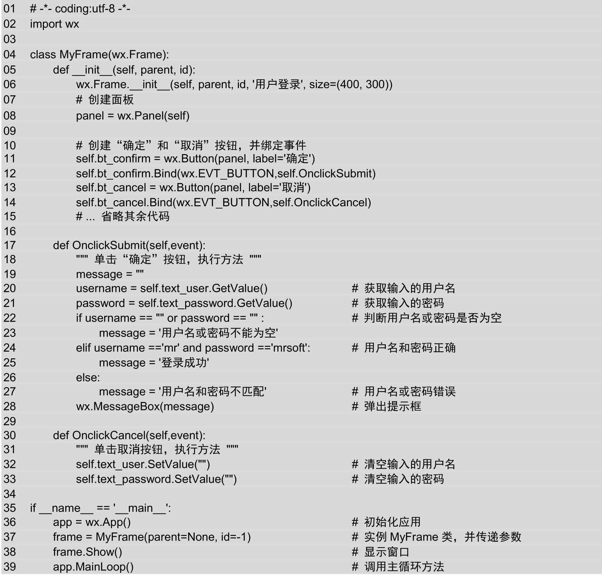

上述代码中，分别使用bind()函数为bt\_confirm和bt\_cancel绑定了单击事件，单击“确定”按钮时，执行OnclickSubmit()方法判断用户名和密码是否正确，然后使用wx.MessageBox()弹出提示框。单击“取消”按钮时，执行OnclickCancel()方法。用户名和密码正确运行结果如图15.12所示，否则运行结果如图15.13所示。

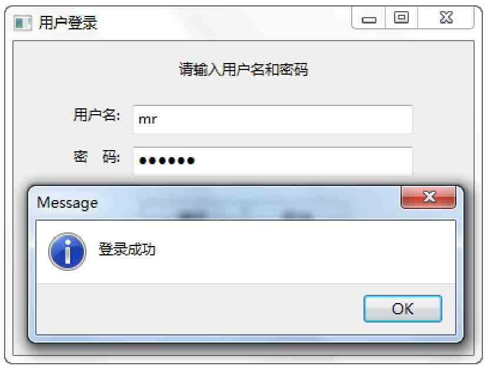

*图15.12 用户名和密码正确*

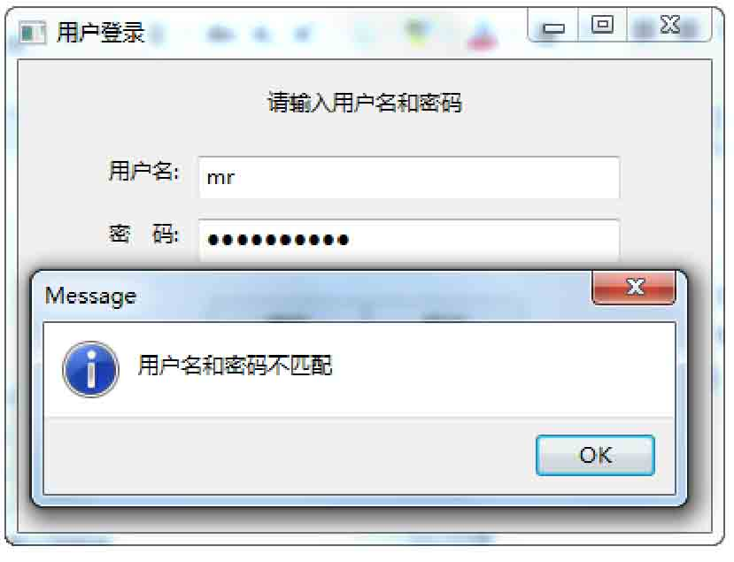

*图15.13 用户名或密码错误*

<a id="isbn9787302503880_3_15_1_6"></a>

## 15.6 小结

本章主要介绍了Python的GUI编程，包括GUI的基础知识以及Python常用的GUI框架。在众多GUI框架中，我们选择了知名的wxPython进行详细讲解。学习使用wxPython创建应用程序，使用常用控件，设置BoxSizer布局以及处理事件等内容。通过本章的学习，读者能够了解Python的GUI相关知识，并使用wxPython编写交互式的图形界面。
