<a id="isbn9787302503880_3_20"></a>

# 第20章  Web编程

**（


 视频讲解：93分钟）**

由于Python简洁易懂，可维护性好，所以越来越多的互联网公司使用Python进行Web开发，如豆瓣、知乎等网站。本章将介绍Web基础知识，包括HTTP协议、Web服务器以及前端基础知识。此外，将重点介绍WSGI接口，最后介绍常用的Web开发框架。

通过阅读本章，您可以：


 了解什么是HTTP协议


 了解什么是Web服务器和静态服务器


 了解前端相关的基础知识


 了解什么是CGI和WSGI


 掌握如何定义WSGI接口


 掌握如何运行WSGI服务


 了解什么是Web框架


 了解Python中常用的Web框架

<a id="isbn9787302503880_3_20_1_1"></a>

## 20.1 Web基础

当用户浏览明日学院官网时，会打开浏览器，输入网址www.mingrisoft.com，然后按Enter键，浏览器中就会显示明日学院官网的内容。在这个看似简单的用户行为背后，到底隐藏了什么呢？

<a id="isbn9787302503880_3_20_1_1_1"></a>

### 20.1.1 HTTP协议

在用户输入网址访问明日学院网站的例子中，用户浏览器被称为客户端，而明日学院网站被称为服务器。这个过程实质上就是客户端向服务器发起请求，服务器接收请求后，将处理后的信息（也称为响应）传给客户端。这个过程是通过HTTP协议实现的。

HTTP（HyperText Transfer Protocol），超文本传输协议，是互联网上应用最为广泛的一种网络协议。HTTP是利用TCP在两台计算机（通常是Web服务器和客户端）之间传输信息的协议。客户端使用Web浏览器发起HTTP请求给Web服务器，Web服务器发送被请求的信息给客户端。

<a id="isbn9787302503880_3_20_1_1_2"></a>

### 20.1.2 Web服务器

当在浏览器输入URL后，浏览器会先请求DNS服务器，获得请求站点的IP地址（即根据URL地址www.mingrisoft.com获取其对应的IP地址，如101.201.120.85），然后发送一个HTTP Request（请求）给拥有该IP的主机（明日学院的阿里云服务器），接着就会接收到服务器返回的HTTP Response（响应），浏览器经过渲染后，以一种较好的效果呈现给用户。HTTP基本原理如图20.1所示。

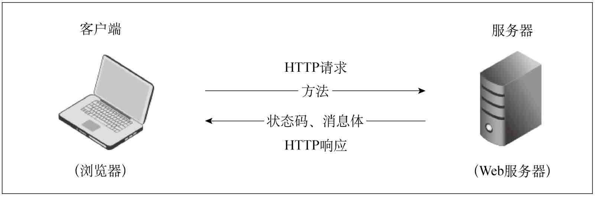

*图20.1 HTTP基本原理*

我们重点来看下Web服务器。Web服务器的工作原理可以概括为如下4个步骤。

（1）建立连接：客户端通过TCP/IP协议建立到服务器的TCP连接。

（2）请求过程：客户端向服务器发送HTTP协议请求包，请求服务器里的资源文档。

（3）应答过程：服务器向客户端发送HTTP协议应答包，如果请求的资源包含有动态语言的内容，那么服务器会调用动态语言的解释引擎负责处理“动态内容”，并将处理后得到的数据返回给客户端。由客户端解释HTML文档，在客户端屏幕上渲染图形结果。

（4）关闭连接：客户端与服务器断开。

步骤（2）客户端向服务器端发起请求时，常用的请求方法如表20.1所示。

**表20.1 HTTP协议的常用请求方法**

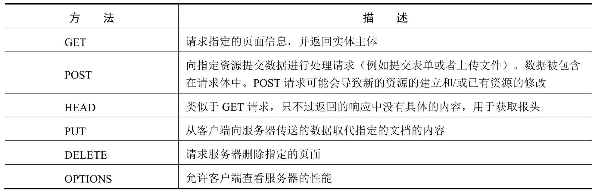

步骤（3）服务器返回给客户端的状态码，可以分为5种类型，由它们的第一位数字表示，如表20.2所示。

**表20.2 HTTP状态码含义**

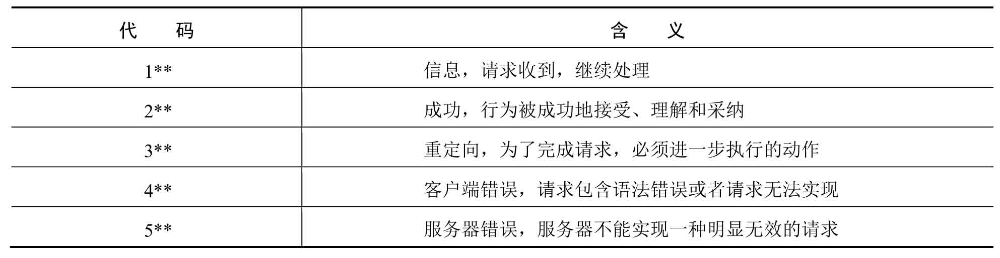

例如，状态码为200，表示请求成功已完成；状态码为404，表示服务器找不到给定的资源。

下面我们用谷歌浏览器访问明日学院官网，查看一下请求和响应的流程。步骤如下：

（1）在谷歌浏览器中输入网址www.mingrisoft.com，按Enter键，进入明日学院官网。

（2）按F12键（或右击，选择“检查”命令），审查页面元素。运行效果如图20.2所示。

（3）单击谷歌浏览器调试工具的Network图标，按F5键（或手动刷新页面），单击调试工具中Name栏目下的www.mingrisoft.com，查看请求与响应的信息，如图20.3所示。

图20.3中的General概述关键信息如下：


 Request URL：请求的URL地址，也就是服务器的URL地址。


 Request Method：请求方式是GET。


 Status Code：状态码是200，即成功返回响应。


 Remote Address：服务器IP地址是101.201.120.85，端口号是80。

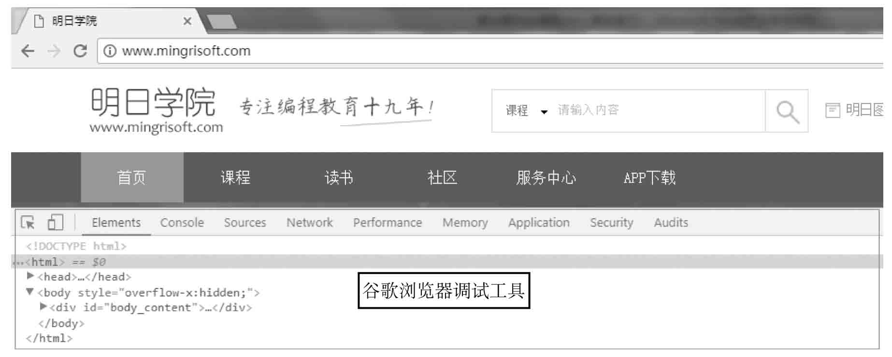

*图20.2 打开谷歌浏览器调试工具*

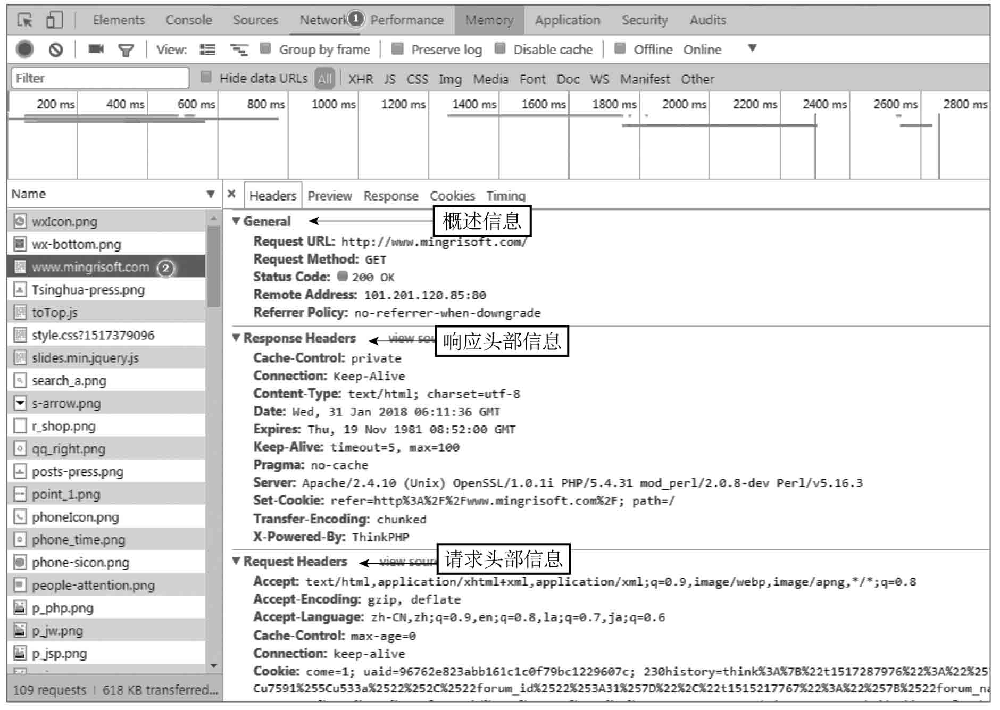

*图20.3 请求和响应信息*

<a id="isbn9787302503880_3_20_1_1_3"></a>

### 20.1.3 前端基础

对于Web开发，通常分为前端（Front-End）和后端（Back-End）。“前端”是与用户直接交互的部分，包括Web页面的结构、Web的外观视觉表现以及Web层面的交互实现。“后端”更多的是与数据库进行交互以处理相应的业务逻辑。需要考虑的是如何实现功能、数据的存取、平台的稳定性与性能等。后端的编程语言包括Python、Java、PHP、ASP.NET等，而前端编程语言主要包括HTML、CSS和JavaScript。

对于浏览网站的普通用户而言，更多的是关注网站前端的美观程度和交互效果，很少去考虑后端的实现，如图20.4所示。所以使用Python进行Web开发，需要具备一定的前端基础。

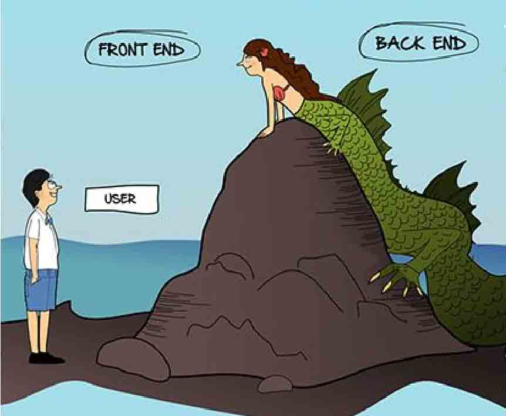

*图20.4 前端VS后端*

<a id="isbn9787302503880_3_20_1_1_3_1"></a>

#### 1．HTML简介

HTML是用来描述网页的一种语言。HTML指的是超文本标记语言（Hyper Text Markup Language），它不是一种编程语言，而是一种标记语言。标记语言是一套标记标签，这种标记标签通常被称为HTML标签，它们是由尖括号包围的关键词，比如&lt;html&gt;。HTML标签通常是成对出现的，比如&lt;h1&gt;和&lt;/h1&gt;。标签对中的第一个标签是开始标签，第二个标签是结束标签。Web浏览器的作用是读取HTML文档，并以网页的形式显示它们。浏览器不会显示HTML标签，而是使用标签来解释页面的内容，如图20.5所示。

在图20.5中，左侧是HTML代码，右侧是显示的页面内容。HTML代码中，第一行的&lt;!DOCTYPE html&gt;表示使用的是HTML5（最新HTML版本），其余的标签都是成对出现，并且在右侧的页面中，只显示标签里的内容，不显示标签。

**说明**

更多HTML知识，请查阅相关教程。作为Python Web初学者，只要求掌握基本的HTML知识。

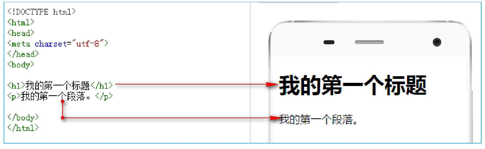

*图20.5 显示页面内容*

<a id="isbn9787302503880_3_20_1_1_3_2"></a>

#### 2．CSS简介

CSS是Cascading Style Sheets（层叠样式表）的缩写。CSS是一种标记语言，用于为HTML文档中定义布局。例如，CSS涉及字体、颜色、边距、高度、宽度、背景图像、高级定位等方面。运用CSS样式可以让页面变得美观，就像化妆前和化妆后的效果一样，如图20.6所示。

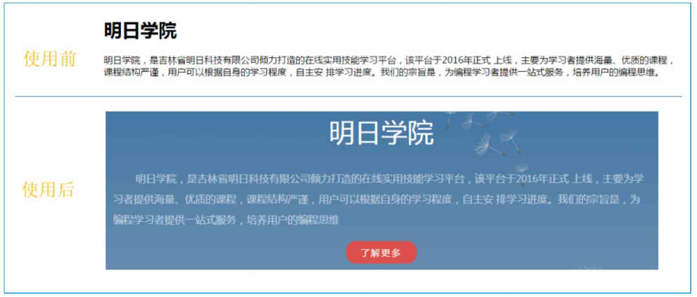

*图20.6 使用CSS前后效果对比*

**说明**

更多CSS知识，请查阅相关教程。作为Python Web初学者，只要求掌握基本的CSS知识。

<a id="isbn9787302503880_3_20_1_1_3_3"></a>

#### 3．JavaScript简介

通常，我们所说的前端就是指HTML、CSS和JavaScript三项技术。


 HTML：定义网页的内容。


 CSS：描述网页的样式。


 JavaScript：描述网页的行为。

JavaScript是一种可以嵌入在HTML代码中，由客户端浏览器运行的脚本语言。在网页中使用JavaScript代码，不仅可以实现网页特效，还可以响应用户请求，实现动态交互的功能。例如，在用户注册页面中，需要对用户输入信息的合法性进行验证，包括是否填写了“邮箱”和“手机号”，填写的“邮箱”和“手机号”格式是否正确等。JavaScript验证邮箱是否为空的效果如图20.7所示。

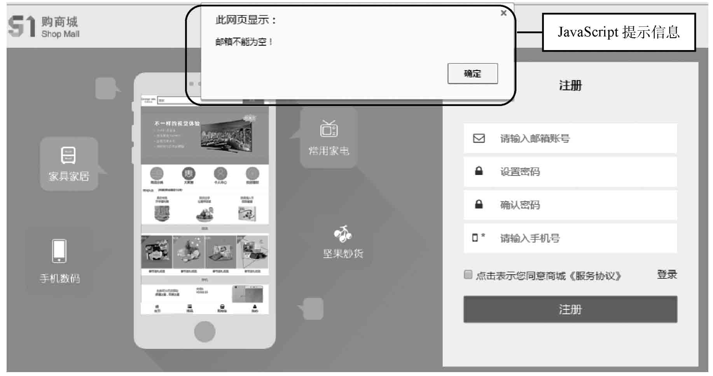

*图20.7 JavaScript验证为空*

**说明**

更多JavaScript知识，请查阅相关教程。作为Python Web初学者，只要求掌握基本的JavaScript知识。

<a id="isbn9787302503880_3_20_1_1_4"></a>

### 20.1.4 静态服务器

在第19章使用Socket实现服务器和浏览器通信时，我们通过浏览器访问服务器，服务器会发送“Hello World”给浏览器。而对于Web开发，我们需要让用户在浏览器中看到完整的Web页面（也就是HTML）。

在Web中，纯粹HTML格式的页面通常被称为“静态页面”，早期的网站通常都是由静态页面组成的。例如马云早期的创业项目“中国黄页”网站就是由静态页面组成的静态网站，如图20.8所示。

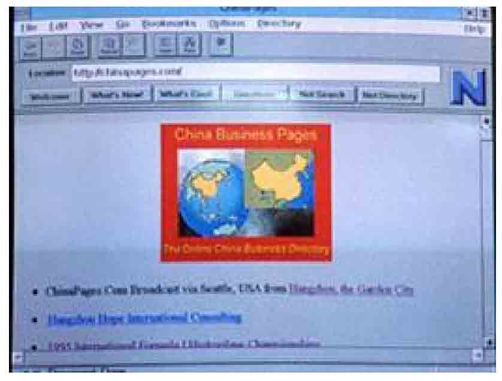

*图20.8 早期的中国黄页*

下面通过实例结合Python网络编程和Web编程知识，创建一个静态服务器。通过该服务器，可以访问包含两个静态页面的明日学院网站。

**【例20.1】** 创建“明日学院”网站静态服务器。**（实例位置：资源包\\TM\\sl\\20\\01）**

创建一个“明日学院”官方网站，当用户输入网址127.0.0.1:8000或127.0.0.1:8000/index.html时，访问网站首页。当用户输入网址127.0.0.1:8000/contact.html，访问“联系我们”页面。可以按照如下步骤实现该功能。

（1）创建Views文件夹，在Views文件夹下创建index.html页面作为“明日学院”首页。index.html页面关键代码如下：

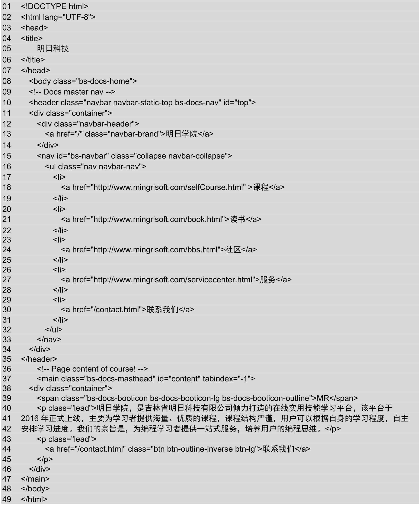

（2）在Views文件夹下创建contact.html文件，作为明日学院的“联系我们”页面。关键代码如下：

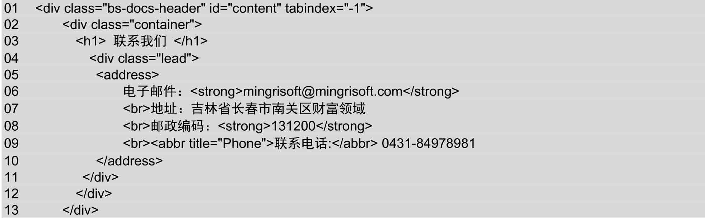

（3）在Views同级目录下创建web\_server.py文件，用于实现客户端和服务器端的HTTP通信，具体代码如下：

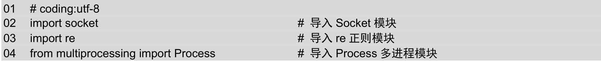

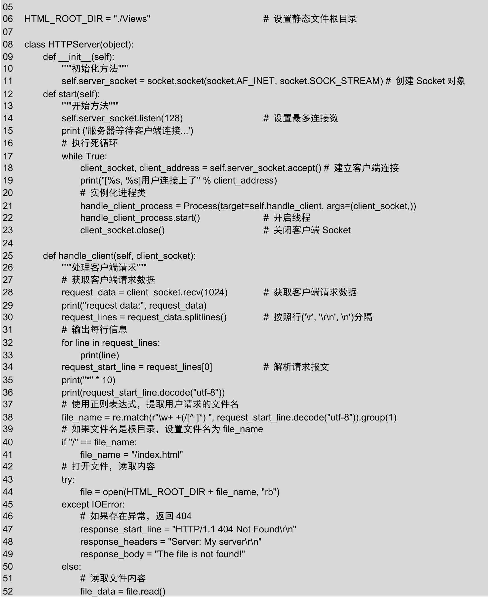

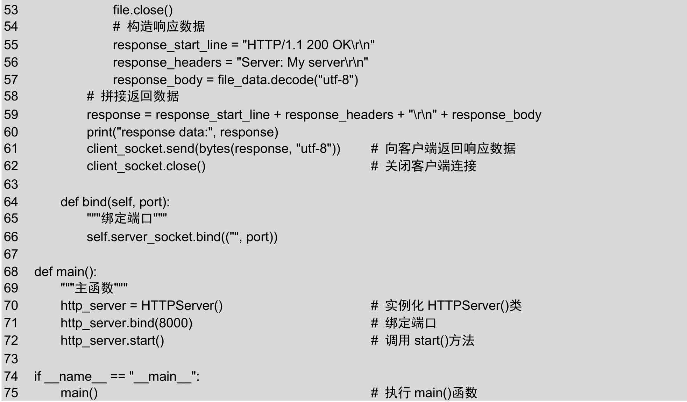

上述代码中定义了一个HTTPServer()类，其中\_\_init\_\_()初始化方法用于创建Socket实例，start()方法用于建立客户端连接，开启线程。handle\_client()方法用于处理客户端请求，主要功能是通过正则表达式提取用户请求的文件名。如果用户输入“127.0.0.1:8000/”。则读取Views/index.html文件，否则访问具体的文件名。例如，用户输入“127.0.0.1:8000/contact.html”，读取Views/contact.html文件内容，将其作为响应的主体内容。如果读取的文件不存在，则将“The file is not found!”作为响应主体内容。最后，拼接数据返回客户端。

运行web\_server.py文件，然后使用谷歌浏览器访问“127.0.0.1:8000/”，运行效果如图20.9所示。

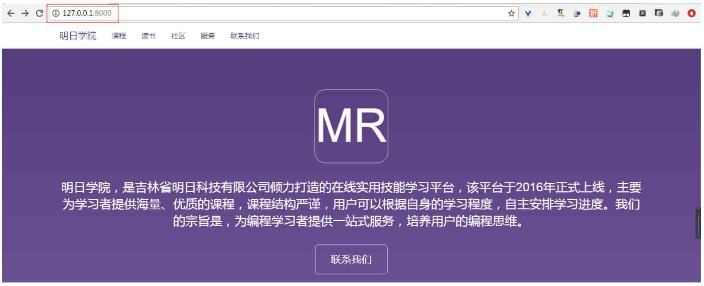

*图20.9 明日学院主页*

单击“联系我们”按钮，页面跳转至“127.0.0.1:8000/contact.html”，运行效果如图20.10所示。尝试访问一个不存在的文件，例如，在浏览器中访问“127.0.0.1:8000/test.html”，运行效果如图20.11所示。

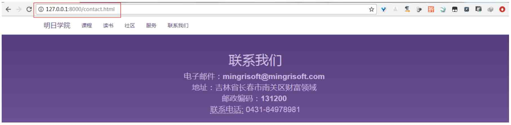

*图20.10 联系我们页面效果*

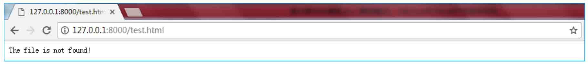

*图20.11 文件不存在时页面效果*

<a id="isbn9787302503880_3_20_1_2"></a>

## 20.2 WSGI接口

<a id="isbn9787302503880_3_20_1_1_5"></a>

### 20.2.1 CGI简介

实例20.1中我们实现了一个静态服务器，但是当今Web开发已经很少使用纯静态页面，更多的是使用动态页面，如网站的登录和注册功能等。当用户登录网站时，需要输入用户名和密码，然后提交数据。Web服务器不能处理表单中传递过来的与用户相关的数据，这不是Web服务器的职责。CGI应运而生。

CGI（Common Gateway Interface），通用网关接口，它是一段程序，运行在服务器上。Web服务器将请求发送给CGI应用程序，再将CGI应用程序动态生成的HTML页面发送回客户端。CGI在Web服务器和应用之间充当了交互作用，这样才能够处理用户数据，生成并返回最终的动态HTML页面。CGI的工作方式如图20.12所示。

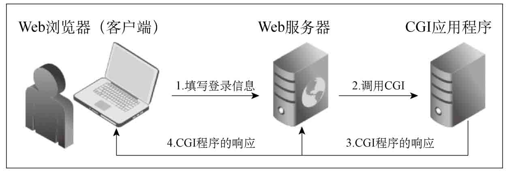

*图20.12 CGI工作概述*

CGI有明显的局限性，例如，CGI进程针对每个请求进行创建，用完就抛弃。如果应用程序接收数千个请求，就会创建大量的语言解释器进程，这将导致服务器停机。于是CGI的加强版FastCGI（Fast Common Gateway Interface）应运而生。

FastCGI使用进程／线程池来处理一连串的请求。这些进程／线程由FastCGI服务器管理，而不是Web服务器。FastCGI致力于减少网页服务器与CGI程序之间交互的开销，从而使服务器可以同时处理更多的网页请求。

<a id="isbn9787302503880_3_20_1_1_6"></a>

### 20.2.2 WSGI简介

FastCGI的工作模式实际上没有什么太大缺陷，但是在FastCGI标准下写异步的Web服务还是不方便，所以WSGI就被创造出来了。

WSGI（Web Server Gateway Interface），服务器网关接口，是Web服务器和Web应用程序或框架之间的一种简单而通用的接口。从层级上来讲要比CGI/FastCGI高级。WSGI中存在两种角色：接受请求的Server（服务器）和处理请求的Application（应用），它们底层是通过FastCGI沟通的。当Server收到一个请求后，可以通过Socket把环境变量和一个Callback回调函数传给后端Application，Application在完成页面组装后通过Callback把内容返回给Server，最后Server再将响应返回给Client。整个流程如图20.13所示。

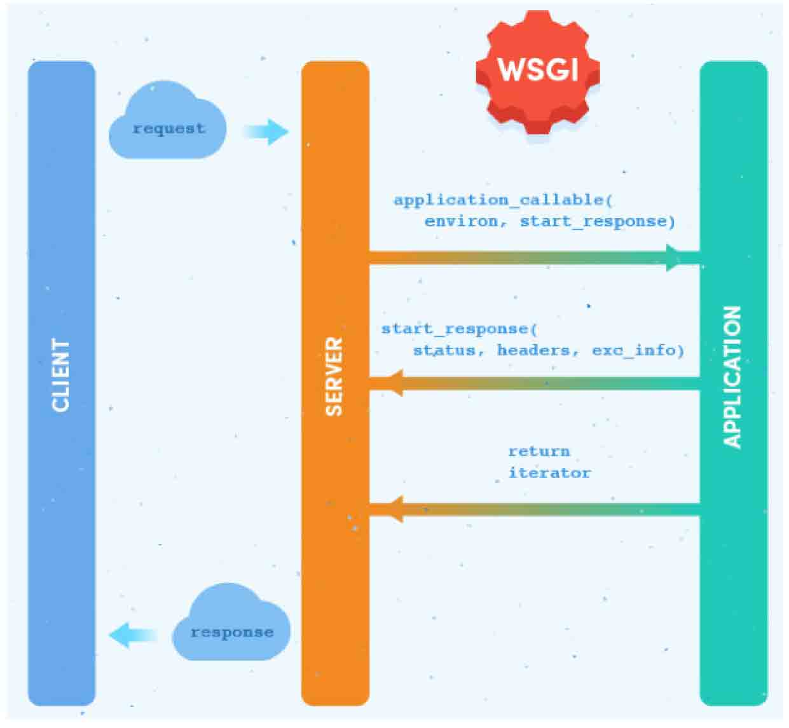

*图20.13 WSGI工作概述*

<a id="isbn9787302503880_3_20_1_1_7"></a>

### 20.2.3 定义WSGI接口

WSGI接口定义非常简单，它只要求Web开发者实现一个函数，就可以响应HTTP请求。我们来看一个最简单的Web版本的“Hello World!”，代码如下：

```python
01  def application(environ, start_response):
02      start_response('200 OK', [('Content-Type', 'text/html')])
03      return [b'<h1>Hello, World!</h1>']
```

上面的application()函数就是符合WSGI标准的一个HTTP处理函数，它接收两个参数：


 environ：一个包含所有HTTP请求信息的字典对象；


 start\_response：一个发送HTTP响应的函数。

整个application()函数本身没有涉及任何解析HTTP的部分，也就是说，把底层Web服务器解析部分和应用程序逻辑部分进行了分离，这样开发者就可以专心做一个领域了。

可是要如何调用application()函数呢？environ和start\_response这两个参数需要从服务器获取，所以application()函数必须由WSGI服务器来调用。现在，很多服务器都符合WSGI规范，如Apache服务器和Nginx服务器等。此外Python内置了一个WSGI服务器，这就是wsgiref模块。它是用Python编写的WSGI服务器的参考实现。所谓“参考实现”，是指该实现完全符合WSGI标准，但是不考虑任何运行效率，仅供开发和测试使用。

<a id="isbn9787302503880_3_20_1_1_8"></a>

### 20.2.4 运行WSGI服务

使用Python的wsgiref模块可以不用考虑服务器和客户端的连接、数据的发送和接收等问题，而专注于业务逻辑的实现。下面我们通过一个实例应用wsgiref创建“明日学院”网站的课程页面。

**【例20.2】** 创建“明日学院”网站课程页面。**（实例位置：资源包\\TM\\sl\\20\\02）**

创建“明日学院”官方网站课程页面，当用户输入网址127.0.0.1:8000/courser.html时，访问课程介绍页面。可以按照如下步骤实现该功能。

（1）复制实例20.1的Views文件夹，在Views文件夹下创建course.html页面作为“明日学院”课程页面。course.html页面关键代码如下：

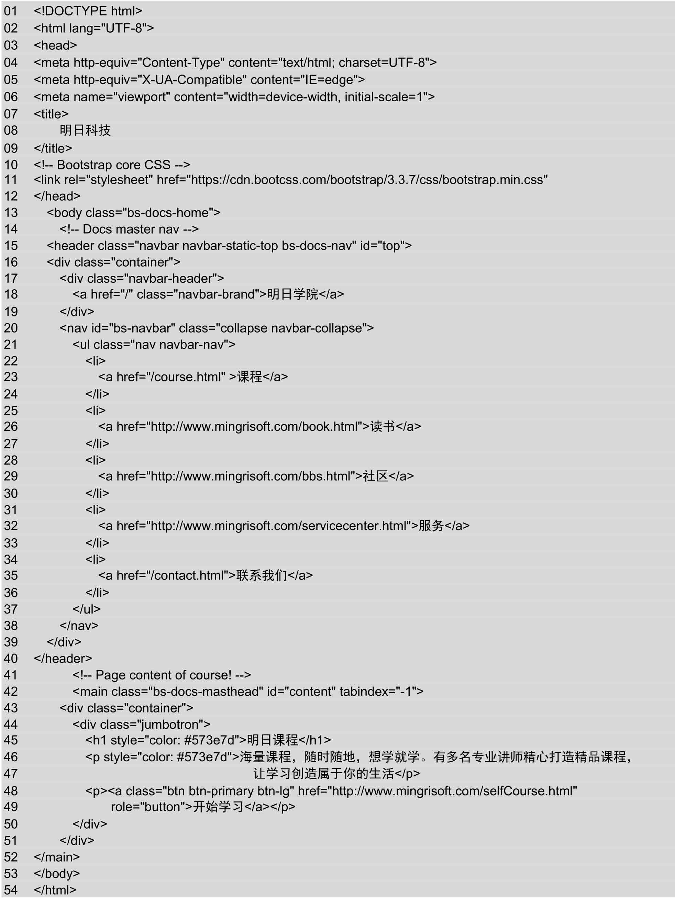

（2）在Views同级目录下创建application.py文件，用于实现Web应用程序的WSGI处理函数，具体代码如下：

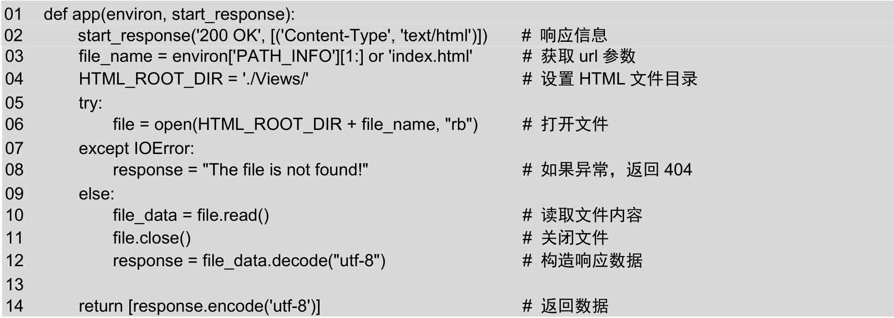

上述代码中使用application()函数接收两个参数：environ请求信息和start\_response函数。通过environ来获取url中的文件扩展名，如果为“/”，则读取index.html文件。如果不存在，则返回“The file is not found!”。

（3）在Views同级目录下创建web\_server.py文件，用于启动WSGI服务器，加载application()函数，具体代码如下：

```python
01  # 从wsgiref模块导入
02  from wsgiref.simple_server import make_server
03  # 导入编写的application函数
04  from application import app
05
06  # 创建一个服务器，IP地址为空，端口是8000，处理函数是app
07  httpd = make_server('', 8000, app)
08  print('Serving HTTP on port 8000...')
09  # 开始监听HTTP请求
10  httpd.serve_forever()
```

运行web\_server.py文件，当显示“Serving HTTP on port 8000...”时，在浏览器的地址栏中输入网址“127.0.0.1:8000”，访问“明日学院”首页，运行结果如图20.14所示。然后单击顶部导航栏的“课程”按钮，将进入明日学院的课程页面，运行效果如图20.15所示。

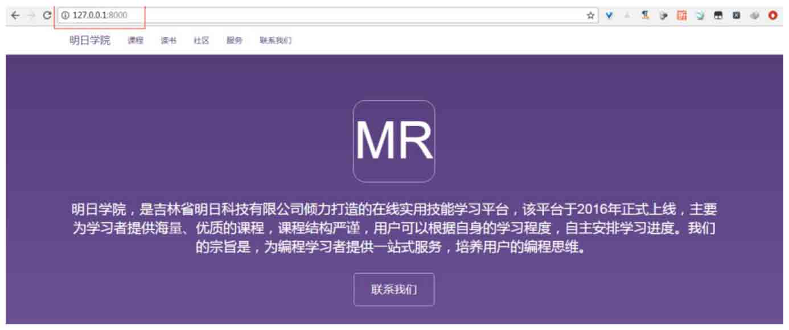

*图20.14 明日学院首页*

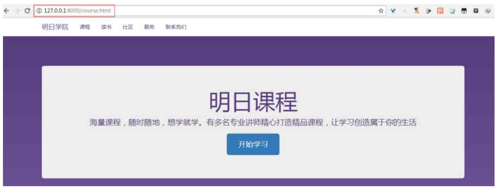

*图20.15 明日学院课程页面*

<a id="isbn9787302503880_3_20_1_3"></a>

## 20.3 Web框架

如果你要从零开始建立一些网站，可能会注意到你不得不一次又一次地解决一些相同的问题。这样做是令人厌烦的，并且违反了良好编程的核心原则之一——DRY（不要重复自己）。

有经验的Web开发人员在创建新站点时也会遇到类似的问题。当然，总有一些特殊情况会因网站而异，但在大多数情况下，开发人员通常需要处理四项任务——数据的创建、读取、更新和删除，也称为CRUD。幸运的是，开发人员通过使用Web框架解决了这些问题。

<a id="isbn9787302503880_3_20_1_1_9"></a>

### 20.3.1 什么是Web框架

Web框架是用来简化Web开发的软件框架。框架的存在是为了避免用户重新发明轮子，并且在创建一个新的网站时帮助减少一些开销。典型的框架提供了如下常用功能：


 管理路由。


 访问数据库。


 管理会话和Cookies。


 创建模板来显示HTML。


 促进代码的重用。

事实上，框架根本就不是什么新的东西，它只是一些能够实现常用功能的Python文件。我们可以把框架看作是工具的集合，而不是特定的东西。框架的存在使得建立网站更快、更容易。框架还促进了代码的重用。

<a id="isbn9787302503880_3_20_1_1_10"></a>

### 20.3.2 Python中常用的Web框架

前面我们学习了WSGI（服务器网关接口），它是Web服务器和Web应用程序或框架之间的一种简单而通用的接口。也就是说，只要遵循WSGI接口规则，就可以自主开发Web框架。所以，各种开源Web框架至少有上百个，关于Python框架优劣的讨论也仍在继续。作为初学者，应该选择一些主流的框架来学习使用。这是因为主流框架文档齐全，技术积累较多，社区繁盛，并且能得到更好的支持。下面介绍几种Python的主流Web框架。

<a id="isbn9787302503880_3_20_1_1_3_4"></a>

#### 1．Django

这可能是最广为人知和使用最广泛的Python Web框架了。Django有世界上最大的社区和最多的包。它的文档非常完善，并且提供了一站式的解决方案，包括缓存、ORM、管理后台、验证、表单处理等，使得开发复杂的数据库驱动的网站变得简单。但是，Django系统耦合度较高，替换掉内置的功能比较麻烦，所以学习曲线也相当陡峭。

<a id="isbn9787302503880_3_20_1_1_3_5"></a>

#### 2．Flask

Flask是一个轻量级Web应用框架。它的名字暗示了它的含义，它基本上就是一个微型的胶水框架。Flask把Werkzeug和Jinja黏合在一起，所以它很容易被扩展。Flask也有许多的扩展可以供用户使用，Flask也有一群忠诚的粉丝和不断增加的用户群。它有一份很完善的文档，甚至还有一份唾手可得的常见范例。Flask很容易使用，用户只需要几行代码就可以写出来“Hello World”。

<a id="isbn9787302503880_3_20_1_1_3_6"></a>

#### 3．Bottle

这个框架相对来说比较新。Bottle才是名副其实的微框架——它只有大约4500行代码。它除了Python标准库以外，没有任何其他的依赖，甚至还有自己独特的一点儿模板语言。Bottle的文档很详细并且抓住了事物的实质。它很像Flask，也使用了装饰器来定义路径。

<a id="isbn9787302503880_3_20_1_1_3_7"></a>

#### 4．Tornado

Tornado不单单是个框架，还是个Web服务器。它一开始是为FriendFeed开发的，后来在2009年的时候也给Facebook使用。它是为了解决实时服务而诞生的。为了做到这一点，Tornado使用了异步非阻塞IO，所以它的运行速度非常快。

以上4种框架各有优劣，使用时需要根据自身的应用场景选择适合自己的Web框架。在第21章，我们将学习其中的一个——Flask框架。

<a id="isbn9787302503880_3_20_1_4"></a>

## 20.4 小结

本章内容涉及知识比较广泛，既有前端HTML、CSS和JavaScript技术，又有后端Python的WSGI知识。相信读者在学习完本章后，能够对前端技术有一定的了解，能够理解CGI、FASTCGI和WSGI的关系，并能掌握WSGI技术开发网站。
