<a id="isbn9787302503880_3_21"></a>

# 第21章  Flask框架

**（


 视频讲解：75分钟）**

第20章我们介绍了如何使用WSGI进行Web开发，并且介绍了4种Python常用Web框架，本章我们将详细介绍如何使用Flask框架。通过对比WSGI，读者将会发现使用Web框架开发Web应用程序的简单和高效。

通过阅读本章，您可以：


 了解Flask框架的特点


 掌握如何安装、激活虚拟环境


 掌握如何搭建安装Flask及相关扩展


 掌握Flask路由、静态文件和蓝图


 掌握Flask模板技术


 掌握Flask创建、渲染表单技术

<a id="isbn9787302503880_3_21_1_1"></a>

## 21.1 Flask简介

Flask依赖两个外部库：Werkzeug和Jinja2。Werkzeug是一个WSGI（在Web应用和多种服务器之间的标准Python接口）工具集。Jinja2负责渲染模板。所以，在安装Flask之前，需要安装这两个外部库，而最简单的方式就是使用Virtualenv创建虚拟环境。

<a id="isbn9787302503880_3_21_1_1_1"></a>

### 21.1.1 安装虚拟环境

安装Flask最便捷的方式是使用虚拟环境。Virtualenv为每个不同项目提供一份Python安装。它并没有真正安装多个Python副本，但是它确实提供了一种巧妙的方式来让各项目环境保持独立。

<a id="isbn9787302503880_3_21_1_1_1_1"></a>

#### 1．安装Virtualenv

Virtualenv的安装非常简单，可以使用如下命令进行安装：

```python
pip install virtualenv
```

安装完成后，可以使用如下命令检测Virtualenv版本：

```python
virtualenv --version
```

如果运行效果如图21.1所示，则说明安装成功。

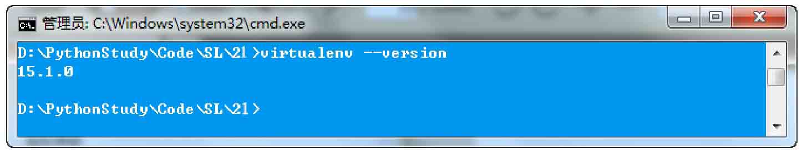

*图21.1 查看Virtualenv版本*

<a id="isbn9787302503880_3_21_1_1_1_2"></a>

#### 2．创建虚拟环境

下一步是使用Virtualenv命令在当前文件夹中创建Python虚拟环境。这个命令只有一个必需的参数，即虚拟环境的名字。创建虚拟环境后，当前文件夹中会出现一个子文件夹，名字就是上述命令中指定的参数，与虚拟环境相关的文件都保存在这个子文件夹中。按照惯例，一般虚拟环境会被命名为venv。运行如下命令：

```python
virtualenvvenv
```

运行完成后，在运行的目录下会新增一个venv文件夹，它保存一个全新的虚拟环境，其中有一个私有的Python解释器，如图21.2所示。

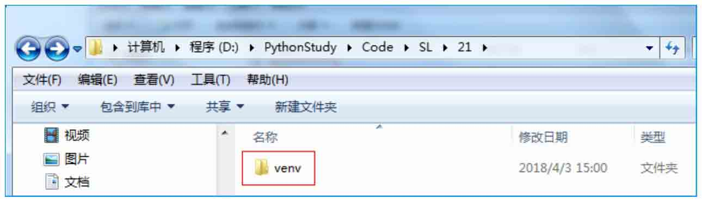

*图21.2 创建虚拟环境*

<a id="isbn9787302503880_3_21_1_1_1_3"></a>

#### 3．激活虚拟环境

在使用这个虚拟环境之前，需要先将其“激活”。可以通过下面的命令激活这个虚拟环境。

```python
venv\Scripts\activate
```

激活后的效果如图21.3所示。

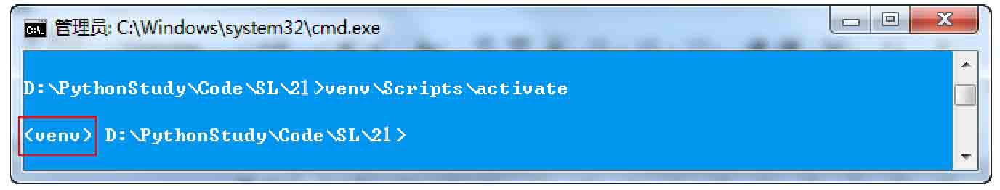

*图21.3 激活虚拟环境后的效果*

<a id="isbn9787302503880_3_21_1_1_2"></a>

### 21.1.2 安装Flask

大多数Python包都使用pip实用工具安装，使用Virtualenv创建虚拟环境时会自动安装pip。激活虚拟环境后，pip所在的路径会被添加进PATH。使用如下命令安装Flask：

```python
pip install flask
```

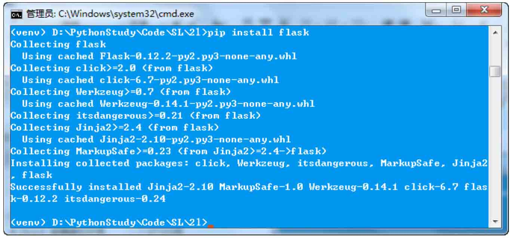

*图21.4 安装Flask*

运行效果如图21.4所示。安装完成以后，可以通过如下命令查看所有安装包：

```python
pip list --format columns
```

运行结果如图21.5所示。

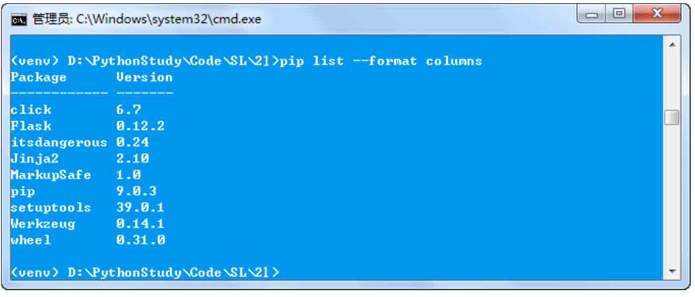

*图21.5 查看所有安装包*

从图21.5中可以看到，已经成功安装了Flask，并且也安装Flask的两个外部依赖库：Werkzeug和Jinja2。

<a id="isbn9787302503880_3_21_1_1_3"></a>

### 21.1.3 第一个Flask程序

一切准备就绪，现在我们开始编写第一个Flask程序。由于是第一个Flask程序，当然要从最简单的“Hello World！”开始。

**【例21.1】** 输出“Hello World!”。**（实例位置：资源包\\TM\\sl\\21\\01）**

在venv同级目录下创建一个01.py文件，代码如下：

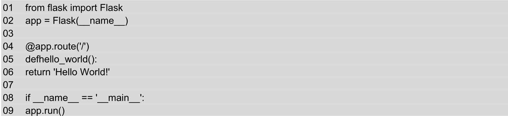

运行hello.py文件，运行效果如图21.6所示。

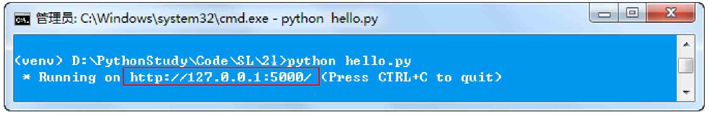

*图21.6 运行hello.py文件*

然后在浏览器中输入网址“http://127.0.0.1:5000/”，运行效果如图21.7所示。

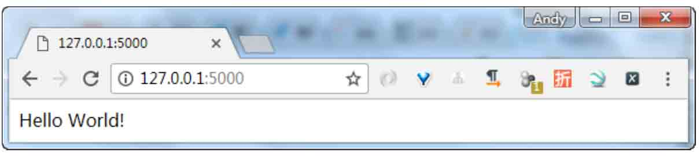

*图21.7 输出“Hello World!”*

那么，这段代码做了什么？

（1）首先，我们导入了Flask类。这个类的实例将会是我们的WSGI应用程序。

（2）接下来，我们创建一个该类的实例，第一个参数是应用模块或者包的名称。如果你使用单一的模块（如本例），你应该使用\_\_name\_\_，因为模块的名称将会因其作为单独应用启动还是作为模块导入而有不同（也是'\_\_main\_\_'或实际的导入名）。这是必需的，这样Flask才知道到哪儿去找模板、静态文件等。详情见Flask的文档。

（3）然后，我们使用route()装饰器告诉Flask什么样的URL能触发我们的函数。

（4）这个函数的名字也在生成URL时被特定的函数采用，这个函数返回我们想要显示在用户浏览器中的信息。

（5）最后我们用run()函数来让应用运行在本地服务器上。其中“if\_\_name\_\_=='\_\_main\_\_':”确保服务器只会在该脚本被Python解释器直接执行的时候才会运行，而不是作为模块导入的时候。

**说明**

关闭服务器，按Ctrl+C快捷键。

<a id="isbn9787302503880_3_21_1_2"></a>

## 21.2 Flask基础

<a id="isbn9787302503880_3_21_1_1_4"></a>

### 21.2.1 开启调试模式

虽然run()方法适用于启动本地的开发服务器，但是用户每次修改代码后都要手动重启它。这样并不够优雅，而且Flask可以做到更好。如果你启用了调试支持，服务器会在代码修改后自动重新载入，并在发生错误时提供一个相当有用的调试器。

有两种途径来启用调试模式。一种是直接在应用对象上设置：

```python
app.debug = True
app.run()
```

另一种是作为run()方法的一个参数传入：

```python
app.run(debug=True)
```

两种方法的效果完全相同。

<a id="isbn9787302503880_3_21_1_1_5"></a>

### 21.2.2 路由

客户端（如Web浏览器）把请求发送给Web服务器，Web服务器再把请求发送给Flask程序实例。程序实例需要知道对每个URL请求运行哪些代码，所以保存了一个URL到Python函数的映射关系。处理URL和函数之间关系的程序称为路由。

在Flask程序中定义路由的最简便方式，是使用程序实例提供的app.route修饰器把修饰的函数注册为路由。下面的例子说明如何使用这个修饰器声明路由：

```python
01  @app.route('/')
02  def index():
03  return '<h1>Hello World!</h1>'
```

**说明**

修饰器是Python语言的标准特性，可以使用不同的方式修改函数的行为。惯常用法是使用修饰器把函数注册为事件的处理程序。

但是，不仅如此！你可以构造含有动态部分的URL，也可以在一个函数上附着多个规则。

<a id="isbn9787302503880_3_21_1_1_1_4"></a>

#### 1．变量规则

要给URL添加变量部分，你可以把这些特殊的字段标记为&lt;variable\_name&gt;，这个部分将会作为命名参数传递到你的函数。规则可以用&lt;converter:variable\_name&gt;指定一个可选的转换器。

**【例21.2】** 根据参数输出相应信息。**（实例位置：资源包\\TM\\sl\\21\\02）**

创建02.py文件，以实例21.1代码为基础，添加如下代码：

```python
01  @app.route('/user/<username>')
02  defshow_user_profile(username):
03  # 显示该用户名的用户信息
04  return 'User %s' % username
05
06  @app.route('/post/<int:post_id>')
07  defshow_post(post_id):
08  # 根据ID显示文章，ID是整型数据
09  return 'Post %d' % post_id
```

上述代码中使用了转换器。它有下面3种：


 int：接收整数。


 float：同int，但是接收浮点数。


 path：和默认的相似，但也接收斜线。

运行hello.py文件，运行结果如图21.8和图21.9所示。

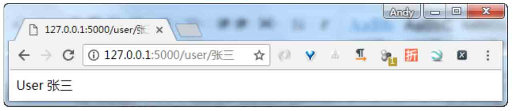

*图21.8 获取用户信息*

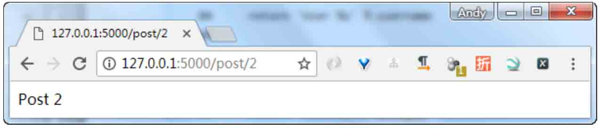

*图21.9 获取文章信息*

<a id="isbn9787302503880_3_21_1_1_1_5"></a>

#### 2．构造URL

如果Flask能匹配URL，那么Flask可以生成它们吗？当然可以。你可以用url\_for()来给指定的函数构造URL。它接收函数名作为第一个参数，也接收对应URL规则的变量部分的命名参数。未知变量部分会添加到URL末尾作为查询参数。

**【例21.3】** 使用url\_for()函数获取URL信息。**（实例位置：资源包\\TM\\sl\\21\\03）**

创建03.py文件，以实例21.2为基础添加如下代码：

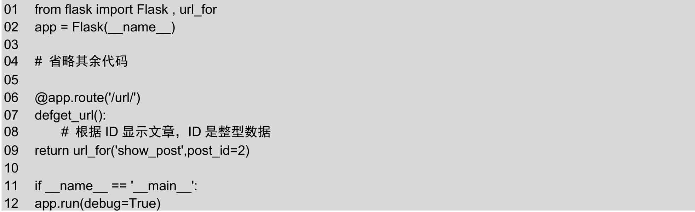

上述代码中设置了“/url/”路由，访问该路由时，返回“show\_post”函数的URL信息。运行结果如图21.10所示。

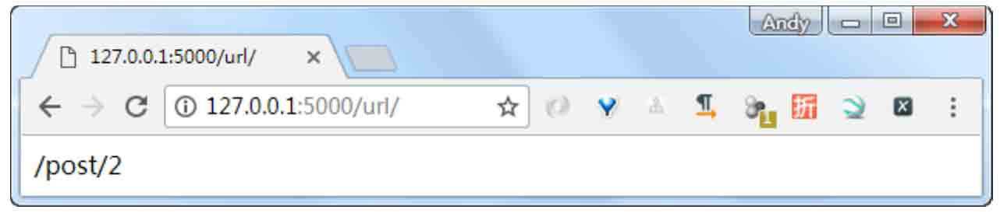

*图21.10 url\_for()函数应用效果图*

<a id="isbn9787302503880_3_21_1_1_1_6"></a>

#### 3．HTTP 方法

HTTP（与Web应用会话的协议）有许多不同的访问URL方法。默认情况下，路由只回应GET请求，但是通过route()装饰器传递methods参数可以改变这个行为。例如下面的代码：

```python
01  @app.route('/login', methods=['GET', 'POST'])
02  def login():
03  ifrequest.method == 'POST':
04  do_the_login()
05  else:
06  show_the_login_form()
```

HTTP方法（也经常被叫作“谓词”）告知服务器，客户端想对请求的页面做些什么。常见的方法如表21.1所示。

**表21.1 常用的HTTP方法**

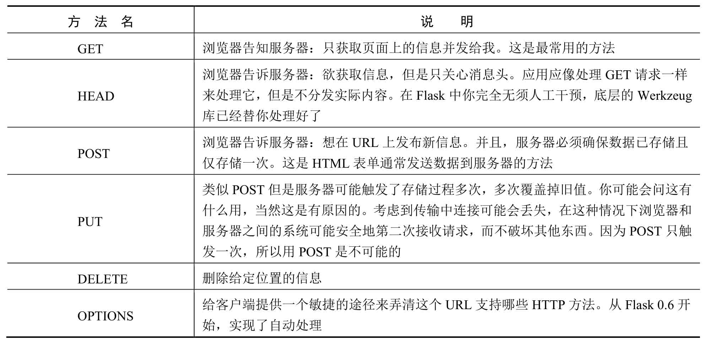

<a id="isbn9787302503880_3_21_1_1_6"></a>

### 21.2.3 静态文件

动态Web应用也会需要静态文件，通常是CSS和JavaScript文件。理想情况下，你已经配置好Web服务器来提供静态文件，但是在开发中，Flask也可以做到。只要在你的包中或是模块的所在目录中创建一个名为static的文件夹，在应用中使用/static即可访问。

给静态文件生成URL，使用特殊的“static”端点名：

```python
url_for('static', filename='style.css')
```

这个文件应该存储在文件系统上的static/style.css。

<a id="isbn9787302503880_3_21_1_1_7"></a>

### 21.2.4 蓝图

Flask用蓝图（blueprints）的概念来在一个应用中或跨应用制作应用组件和支持通用的模式。蓝图很好地简化了大型应用工作的方式，并提供给Flask扩展在应用上注册操作的核心方法。一个Blueprint对象与Flask应用对象的工作方式很像，但它确实不是一个应用，而是一个描述如何构建或扩展应用的蓝图。

Flask中的蓝图为如下这些情况而设计：


 把一个应用分解为一个蓝图的集合。这对大型应用是理想的。一个项目可以实例化一个应用对象，初始化几个扩展，并注册一个集合的蓝图。


 以URL前缀和／或子域名在应用上注册一个蓝图。URL前缀／子域名中的参数即成为这个蓝图下的所有视图函数的共同的视图参数（默认情况下）。


 在一个应用中用不同的URL规则多次注册一个蓝图。


 通过蓝图提供模板过滤器、静态文件、模板和其他功能。一个蓝图不一定要实现应用或者视图函数。


 初始化一个Flask扩展时，在这些情况中注册一个蓝图。


 Flask中的蓝图不是即插应用，因为它实际上并不是一个应用——它是可以注册，甚至可以多次注册到应用上的操作集合。为什么不使用多个应用对象呢？你可以做到那样，但是你的应用的配置是分开的，并需要在WSGI层管理。

<a id="isbn9787302503880_3_21_1_3"></a>

## 21.3 模板

模板是一个包含响应文本的文件，其中包含用占位变量表示的动态部分，其具体值只在请求的上下文中才能知道。使用真实值替换变量，再返回最终得到的响应字符串，这一过程称为渲染。为了渲染模板，Flask使用了一个名为Jinja2的强大模板引擎。

<a id="isbn9787302503880_3_21_1_1_8"></a>

### 21.3.1 渲染模板

默认情况下，Flask在程序文件夹中的templates子文件夹中寻找模板。下面通过一个实例学习如何渲染模板。

**【例21.4】** 使用url\_for()函数获取URL信息。**（实例位置：资源包\\TM\\sl\\21\\04）**

在venv同级目录下创建templates文件夹，然后创建两个文件并分别命名为index.html和user.html。然后在venv同级目录下创建04.py文件，渲染这些模板。目录结构如图21.11所示。

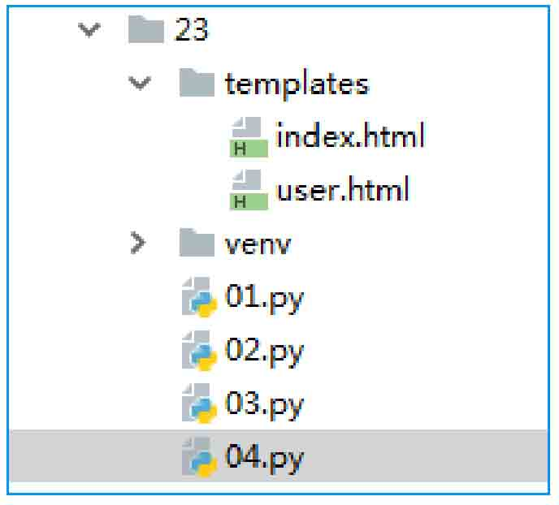

*图21.11 目录结构*

templates\\index.html代码如下：

```python
01  <!DOCTYPE html>
02  <html lang="en">
03  <head>
04  <meta charset="UTF-8">
05  <title></title>
06  </head>
07  <body>
08  <h1>Hello World!</h1>
09  </body>
    10  </html>
```

templates\\user.html代码如下：

```python
01  <!DOCTYPE html>
02  <html lang="en">
03  <head>
04  <meta charset="UTF-8">
05  <title>Title</title>
06  </head>
07  <body>
08  <h1>Hello, {{ name }}!</h1>
09  </body>
    10  </html>
```

04.py代码如下：

```python
01  from flask import Flask
02  app = Flask(__name__)
03
04  @app.route('/')
05  defhello_world():
06  return render_template('index.html')
07
08  @app.route('/user/<username>')
09  defshow_user_profile(username):
10  # 显示该用户名的用户信息
11  return render_template('user.html', name=name)
12
13  if __name__ == '__main__':
14  app.run(debug=True)
```

Flask提供的render\_template()函数把Jinja2模板引擎集成到了程序中。render\_template()函数的第一个参数是模板的文件名。随后的参数都是键值对，表示模板中变量对应的真实值。在这段代码中，第二个模板收到一个名为name的变量。前例中的name=name是关键字参数，这类关键字参数很常见，但如果你不熟悉它们的话，可能会觉得迷惑且难以理解。左边的name表示参数名，就是模板中使用的占位符；右边的name是当前作用域中的变量，表示同名参数的值。

运行效果与实例21.2相同。

<a id="isbn9787302503880_3_21_1_1_9"></a>

### 21.3.2 变量

实例21.4在模板中使用的{{ name }}结构表示一个变量，它是一种特殊的占位符，告诉模板引擎这个位置的值从渲染模板时使用的数据中获取。Jinja2能识别所有类型的变量，甚至是一些复杂的类型，如列表、字典和对象。在模板中使用变量的一些示例如下：

```python
<p>从字典中取一个值: {{ mydict['key'] }}.</p>
<p>从列表中取一个值: {{ mylist[3] }}.</p>
<p>从列表中取一个带索引的值: {{ mylist[myintvar] }}.</p>
<p>从对象的方法中取一个值: {{ myobj.somemethod() }}.</p>
```

可以使用过滤器修改变量，过滤器名添加在变量名之后，中间使用竖线分隔。例如，下述模板以首字母大写形式显示变量name的值：

```python
Hello, {{ name|capitalize }}
```

Jinja2提供的部分常用过滤器如表21.2所示。

**表21.2 常用过滤器**

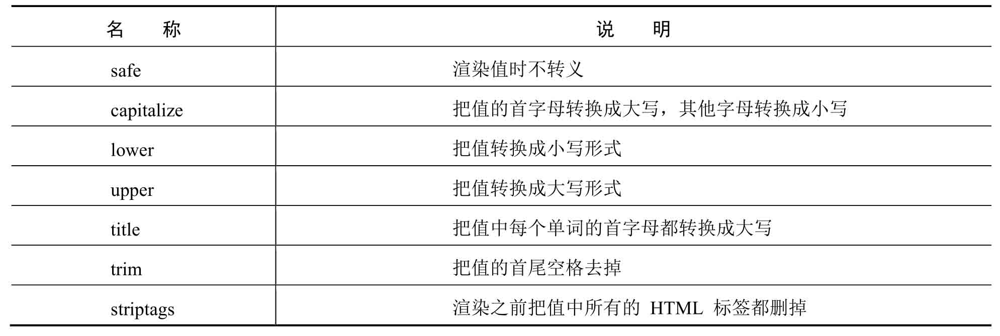

safe过滤器值得特别说明一下。默认情况下，出于安全考虑，Jinja2会转义所有变量。例如，如果一个变量的值为'&lt;h1&gt;Hello&lt;/h1&gt;'，Jinja2会将其渲染成'&lt;h1&gt;Hello&lt;/h1&gt;'，浏览器能显示这个h1元素，但不会进行解释。很多情况下需要显示变量中存储的HTML代码，这时就可使用safe过滤器。

<a id="isbn9787302503880_3_21_1_1_10"></a>

### 21.3.3 控制结构

Jinja2提供了多种控制结构，可用来改变模板的渲染流程。本节使用简单的例子介绍其中最有用的控制结构。

下面这个例子展示如何在模板中使用条件控制语句：

```python
01  
02  Hello, {{ user }}!
03  
04  Hello, Stranger!
05  
```

另一种常见需求是在模板中渲染一组元素。下例展示如何使用for循环实现这一需求：

```python
01  <ul>
02  
03  <li>{{ comment }}</li>
04  
05  </ul>
```

Jinja2还支持宏。宏类似于Python代码中的函数。例如：

```python
01  
02  <li>{{ comment }}</li>
03  
04  <ul>
05  
06  {{ render_comment(comment) }}
07  
08  </ul>
```

为了重复使用宏，我们可以将其保存在单独的文件中，然后在需要使用的模板中导入：

```python
01  
02  <ul>
03  
04  {{ macros.render_comment(comment) }}
05  
06  </ul>
```

需要在多处重复使用的模板代码片段可以写入单独的文件，再包含在所有模板中，以避免重复：

```python

```

另一种重复使用代码的强大方式是模板继承，它类似于Python代码中的类继承。首先，创建一个名为base.html的基模板：

```python
01  <html>
02  <head>
03  
04  <title> - My Application</title>
05  
06  </head>
07  <body>
08  
09  
10  </body>
11  </html>
```

block标签定义的元素可在衍生模板中修改。在本例中，我们定义了名为head、title和body的块。注意，title包含在head中。下面这个示例是基模板的衍生模板：

```python
01  
02  Index
03  
04  {{ super() }}
05  <style>
06  </style>
07  
08  
09  <h1>Hello, World!</h1>
10  
```

extends指令声明这个模板衍生自base.html。在extends指令之后，基模板中的3个块被重新定义，模板引擎会将其插入适当的位置。注意新定义的head块，在基模板中其内容不是空的，所以使用super()获取原来的内容。

<a id="isbn9787302503880_3_21_1_4"></a>

## 21.4 Web表单

表单是允许用户跟你的Web应用交互的基本元素。Flask自己不会帮你处理表单，但Flask-WTF插件允许用户在Flask应用中使用著名的WTForms包。这个包使得定义表单和处理表单功能变得轻松。

WTForms的安装非常简单，使用如下命令即可安装：

```python
pip install flask-wtf
```

安装完成后，使用如下命令查看所有安装包：

```python
piplist  –-format columns
```

如果安装成功，列表中会有Flask-WTF及其依赖包WTForms，如图21.12所示。

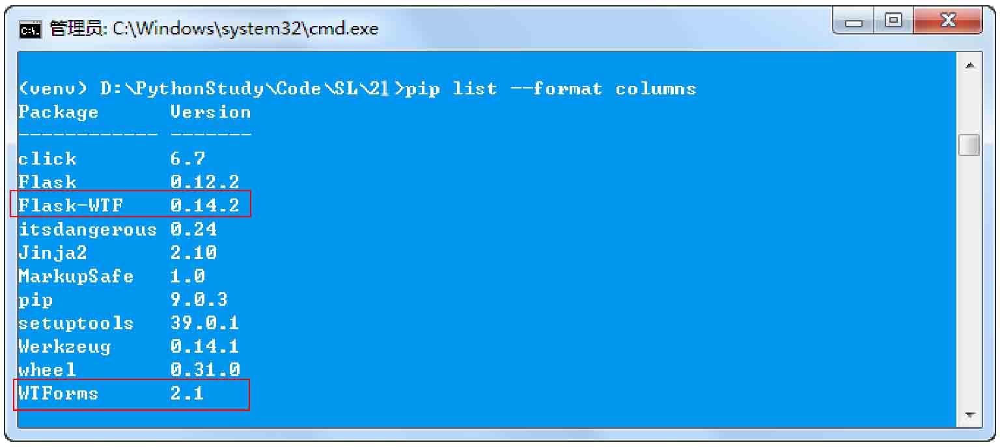

*图21.12 查看安装包*

<a id="isbn9787302503880_3_21_1_1_11"></a>

### 21.4.1 CSRF保护和验证

CSRF全称是cross site request forgery，即跨站请求伪造。CSRF通过第三方伪造表单数据，以POST到应用服务器上。例如，假设明日学院网站允许用户通过提交一个表单来注销账户。这个表单发送一个POST请求到明日学院服务器的注销页面，并且用户已经登录，就可以注销账户。如果黑客在他自己的网站中创建一个会发送到明日学院服务器的同一个注销页面的表单。现在，假如有个用户单击了黑客设置网站的表单的“提交”按钮，同时这个用户又登录了邮件账号，那么他的账户就会被注销。

所以我们怎样判断一个POST请求是否来自网站自己的表单呢？WTForms在渲染每个表单时生成一个独一无二的token，使得这一切变得可能。那个token将在POST请求中随表单数据一起传递，并且会在表单被接受之前进行验证。关键在于token的值取决于存储在用户的会话（cookies）中的一个值，而且会在一定时间（默认30分钟）之后过时。这样只有登录了页面的用户才能提交一个有效的表单，而且仅仅是在登录页面30分钟之内才能这么做。

默认情况下，Flask-WTF能保护所有表单免受跨站请求伪造的攻击。恶意网站把请求发送到被攻击者已登录的其他网站时就会引发CSRF攻击。为了实现CSRF保护，Flask-WTF需要程序设置一个密钥。Flask-WTF使用这个密钥生成加密令牌，再用令牌验证请求中表单数据的真伪。设置密钥的方法如下所示：

```python
app = Flask(__name__)
app.config['SECRET_KEY'] = 'mrsoft'
```

app.config字典可用来存储框架、扩展和程序本身的配置变量。使用标准的字典句法就能把配置值添加到app.config对象中。这个对象还提供了一些方法，可以从文件或环境中导入配置值。

SECRET\_KEY配置变量是通用密钥，可在Flask和多个第三方扩展中使用。如其名所示，加密的强度取决于变量值的机密程度。不同的程序要使用不同的密钥，而且要保证其他人不知道你所用的字符串。

<a id="isbn9787302503880_3_21_1_1_12"></a>

### 21.4.2 表单类

使用Flask-WTF时，每个Web表单都由一个继承自Form的类表示。这个类定义表单中的一组字段，每个字段都用对象表示。字段对象可附属一个或多个验证函数。验证函数用来验证用户提交的输入值是否符合要求。例如，使用Flask-WTF创建包含一个文本字段、密码字段和一个提交按钮的简单的Web表单，代码如下：

```python
01  from flask_wtf import FlaskForm
02  from wtforms import StringField, PasswordField,SubmitField
03  from wtforms.validators import Required
04  class NameForm(FlaskForm):
05      name = StringField('请输入姓名', validators=[Required()])
06      password = PasswordField('请输入密码', validators=[Required()])
07      submit = SubmitField('Submit')
```

这个表单中的字段都定义为类变量，类变量的值是相应字段类型的对象。在这个示例中，NameForm表单中有一个名为name的文本字段、一个名为password的密码字段和一个名为submit的提交按钮。StringField类表示属性为type="text"的&lt;input&gt;元素。SubmitField类表示属性为type="submit"的&lt;input&gt;元素。字段构造函数的第一个参数是把表单渲染成HTML时使用的标号。StringField构造函数中的可选参数validators指定一个由验证函数组成的列表，在接受用户提交的数据之前验证数据。验证函数Required()确保提交的字段不为空。

**说明**

Form基类由Flask-WTF扩展定义，所以从flask.ext.wtf中导入。字段和验证函数却可以直接从WTForms包中导入。

上述代码中，我们只使用了3个HTML标准字段，WTForms还支持很多其他的HTML标准字段，如表21.3所示。

**表21.3 WTForms支持的HTML标准字段**

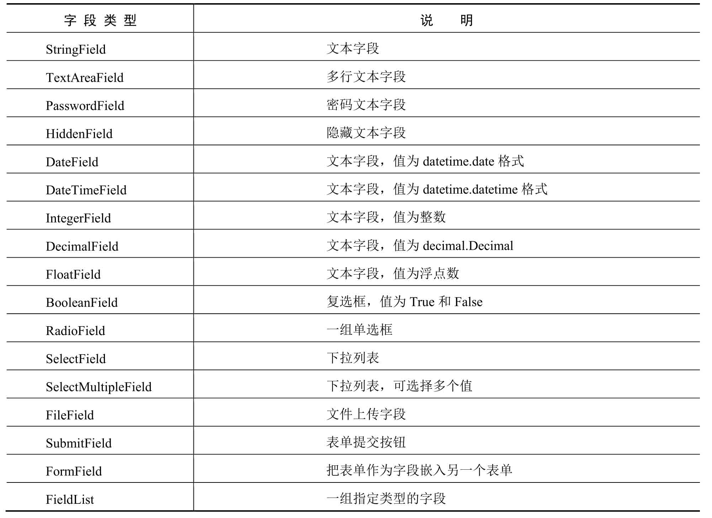

WTForms内置的验证函数如表21.4所示。

**表21.4 WTForms内置验证函数**

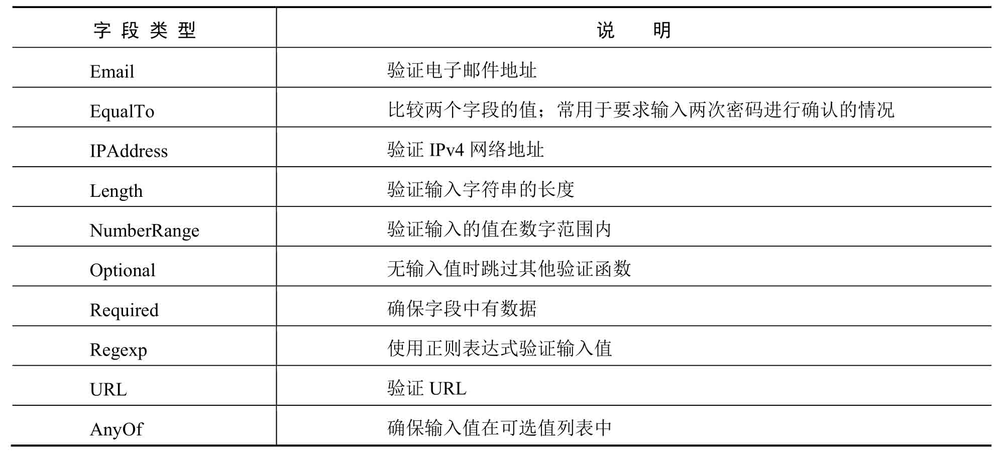

<a id="isbn9787302503880_3_21_1_1_13"></a>

### 21.4.3 把表单渲染成HTML

表单字段是可调用的，在模板中调用后会渲染成HTML。假设视图函数把一个NameForm实例通过参数form传入模板，在模板中可以生成一个简单的表单。

**【例21.5】** 使用url\_for()函数获取URL信息。**（实例位置：资源包\\TM\\sl\\21\\05）**

创建05.py文件，在该文件中定义一个Loginform类。Loginform类有3个属性，分别是name（用户名）、password（密码）和submit（提交按钮）。具体代码如下：

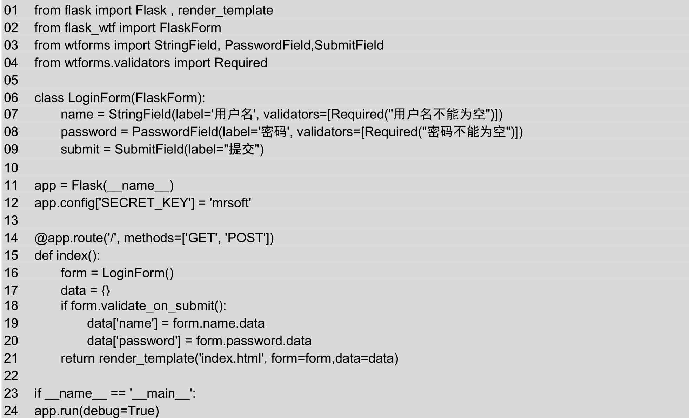

上述代码中，app.route修饰器中添加的methods参数告诉Flask在URL映射中把这个视图函数注册为GET和POST请求的处理程序。如果没指定methods参数，就只把视图函数注册为GET请求的处理程序。把POST加入方法列表很有必要，因为将提交表单作为POST请求进行处理更加便利。表单也可作为GET请求提交，不过GET请求没有主体，提交的数据以查询字符串的形式附加到URL中，可在浏览器的地址栏中看到。基于这个以及其他多个原因，提交表单大都作为POST请求进行处理。

局部变量name和password用来存放表单中输入的有效用户名和密码，如果没有输入，其值为None。如上述代码所示，在视图函数中创建一个LoginForm类实例用于表示表单。提交表单后，如果数据能被所有验证函数接受，那么validate\_on\_submit()方法的返回值为True，否则返回False。这个函数的返回值决定是重新渲染表单还是处理表单提交的数据。

修改templates目录下的index.html文件，在该文件中定义一个表单，使用flask-wtf渲染表单，具体代码如下：

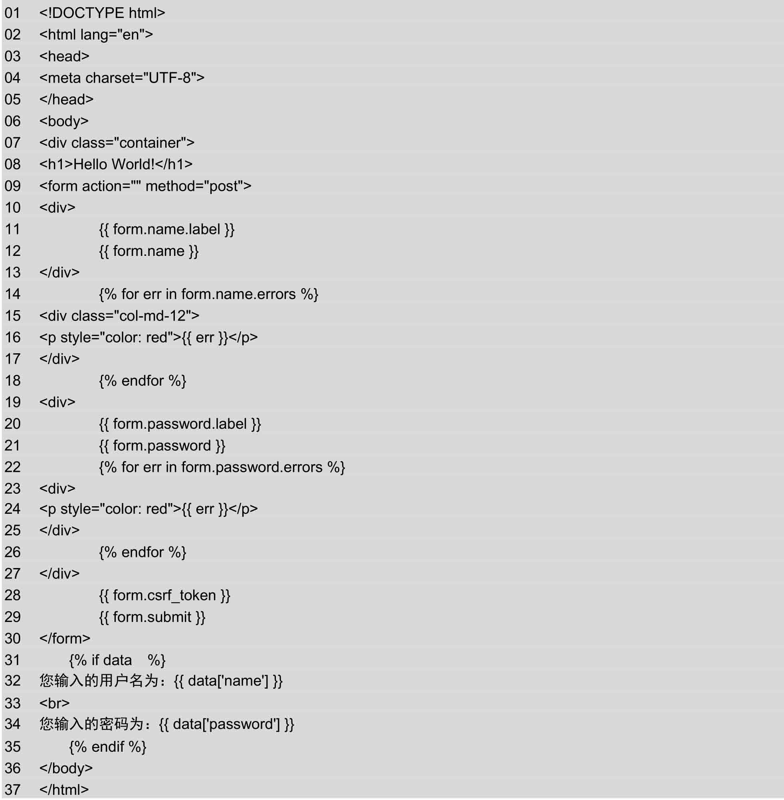

运行05.py文件，在浏览器中输入网址“127.0.0.1:5000”。用户第一次访问程序时，服务器会收到一个没有表单数据的GET请求，所以validate\_on\_submit()将返回False。if语句的内容将被跳过，通过渲染模板处理请求，并传入表单对象和值为None的name变量作为参数。用户会看到浏览器中显示了一个表单。运行效果如图21.13所示。

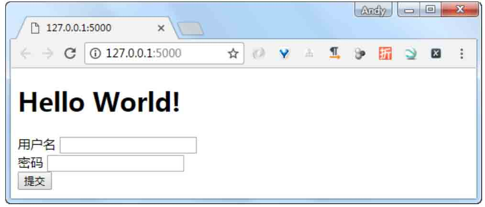

*图21.13 显示表单页面*

如果用户提交表单之前没有输入用户名或密码，Required()验证函数会捕获这个错误，如图21.14所示。

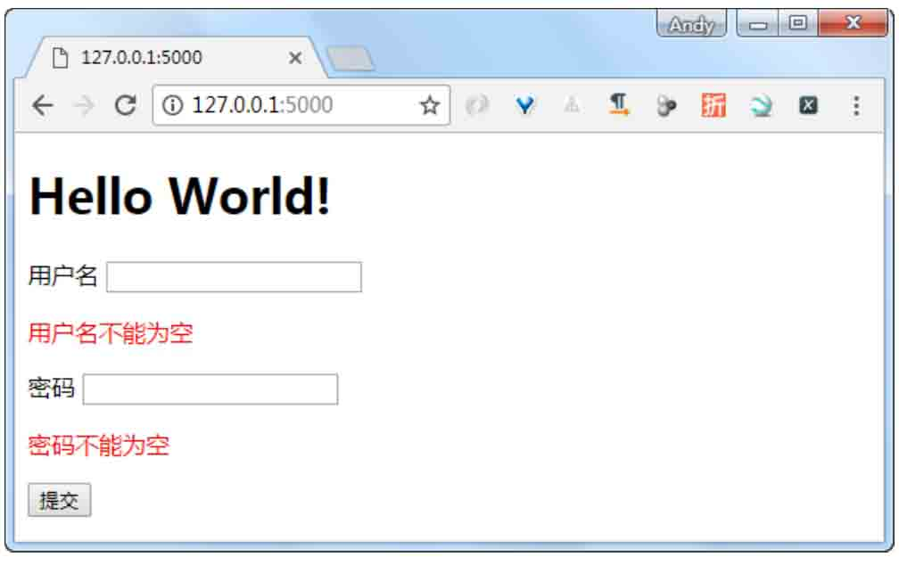

*图21.14 验证提交字段效果*

如果用户填写了用户名和密码并单击“提交”按钮，运行结果如图21.15所示。

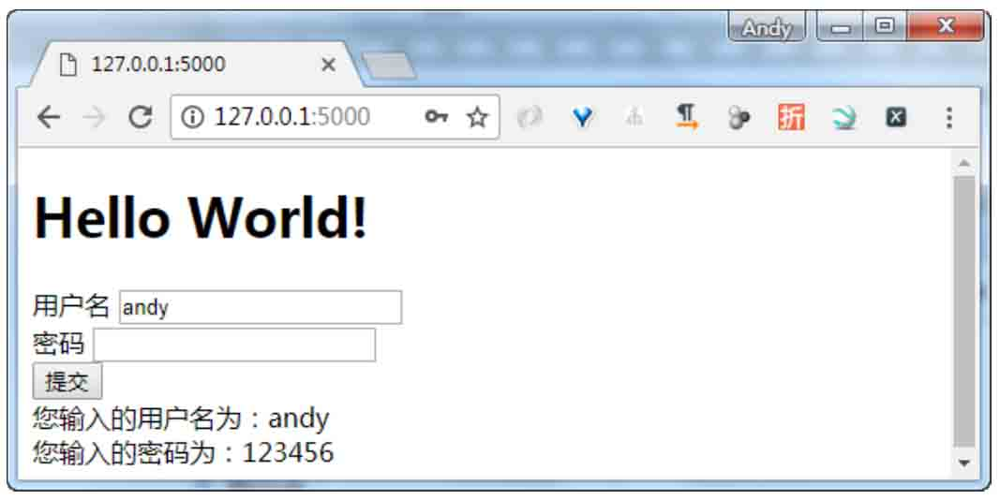

*图21.15 显示提交内容*

<a id="isbn9787302503880_3_21_1_5"></a>

## 21.5 小结

本章首先简要介绍了Flask，主要包括Virtualenv虚拟环境的安装、创建和激活。然后介绍了如何安装Flask，以及编写第一个Flask程序输出“Hello World！”。接下来又介绍了Flask的基础知识，包括开启调试模式、路由和静态文件等。最后介绍了模板和Web表单的使用。通过本章的学习，读者会对Flask有基本的了解，并能够使用Flask制作简单的Web网站。学习好本章的内容，将会为下一章使用Flask开发完整的项目打下良好的基础。
