<a id="isbn9787302503880_4_22"></a>

# 第22章  e起去旅行网站

**（


 视频讲解：143分钟）**

第21章介绍了Flask框架的基本使用方法，本章我们就应用Flask框架实现一个介绍旅游景区及旅游攻略的网站——e起去旅行网站。e起去旅行网站是一个包括前台和后台的完整网站。前台主要包括用户登录、注册以及景区内容的展现，而后台主要包括景区管理、游记管理、用户管理等内容的增删改查。

通过阅读本章，您可以：


 了解网站的开发流程


 了解Web前端技术


 了解MySQL相关技术


 掌握Flask框架基础知识


 掌握常用的Flask扩展


 掌握Python Web开发基础知识

<a id="isbn9787302503880_4_22_1_1"></a>

## 22.1 系统功能设计

<a id="isbn9787302503880_4_22_1_1_1"></a>

### 22.1.1 系统功能结构

e起去旅行网站包括前台和后台两个部分。前台主要负责页面的展示，包括首页推荐景区、推荐地区、景区介绍、景区收藏以及景区游记等。网站的前台功能模块如图22.1所示。而后台则主要负责数据的增删改查，包括添加地区、添加景区、添加游记等，后台功能模块如图22.2所示。

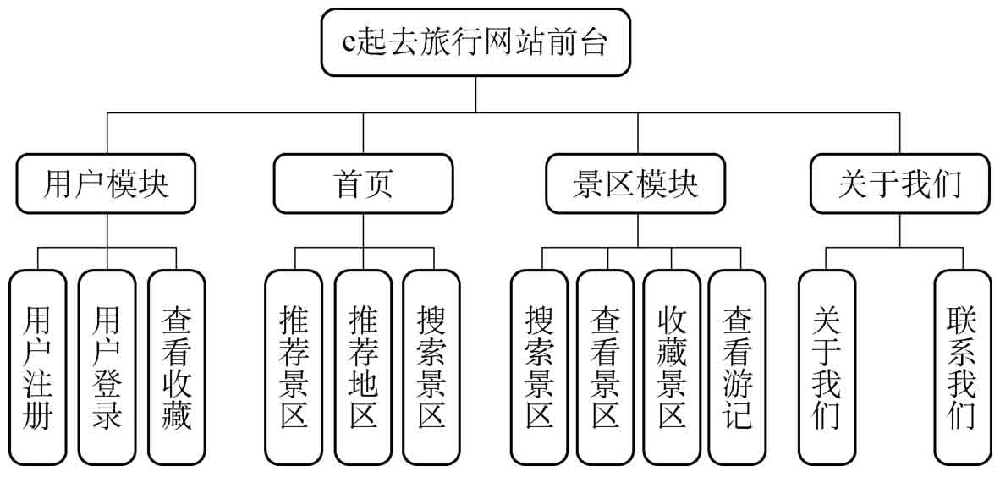

*图22.1 前台功能模块结构图*

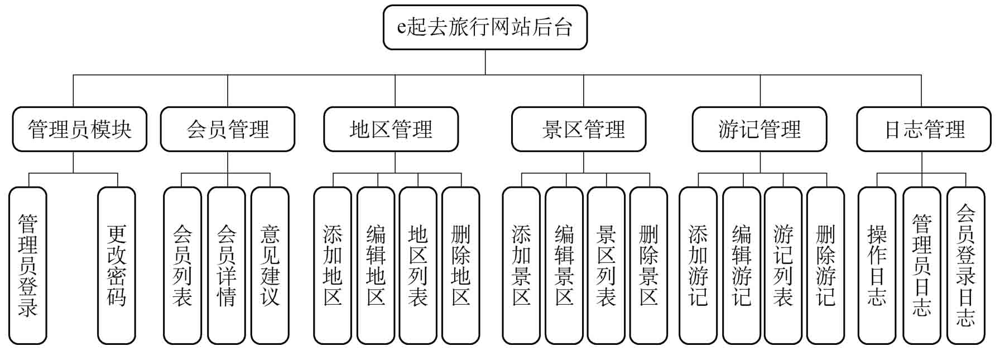

*图22.2 后台功能模块结构图*

<a id="isbn9787302503880_4_22_1_1_2"></a>

### 22.1.2 系统业务流程

e起去旅行网站涉及的角色主要有两个：管理员和用户。管理员负责后台数据的增删改查，而用户则可以通过浏览网页访问前台信息。具体流程如图22.3所示。

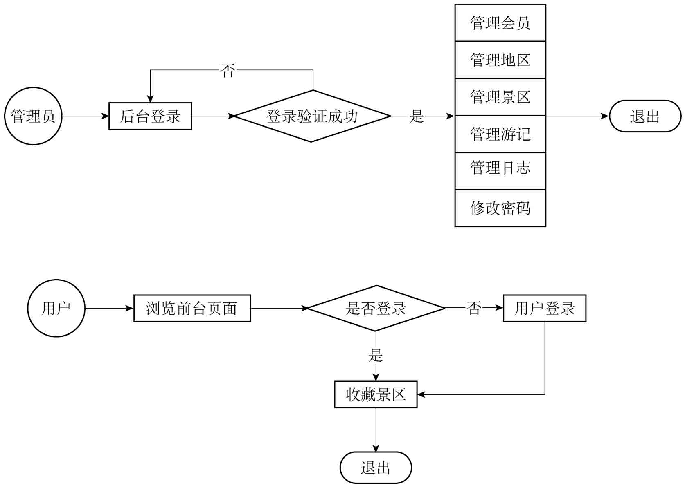

*图22.3 系统业务流程图*

<a id="isbn9787302503880_4_22_1_2"></a>

## 22.2 系统开发必备

<a id="isbn9787302503880_4_22_1_1_3"></a>

### 22.2.1 系统开发环境

本系统的软件开发及运行环境具体如下。


 操作系统：Windows 7及以上。


 虚拟环境：virtualenv。


 MySQL图形化管理软件：Navicat for MySQL。


 开发工具：PyCharm / Sublime Text 3等。


 Flask版本：0.12.2。


 浏览器：Google Chrome浏览器。

<a id="isbn9787302503880_4_22_1_1_4"></a>

### 22.2.2 文件夹组织结构

在进行网站开发前，首先要规划网站的架构。也就是说，建立多个文件夹对各个功能模块进行划分，实现统一管理，这样做易于网站的开发、管理和维护。不同于大多数其他的Web框架，Flask并不强制要求大型项目使用特定的组织方式，程序结构的组织方式完全由开发者决定。在e起去旅行项目中使用包和模块方式组织程序。文件夹组织结构如图22.4所示。

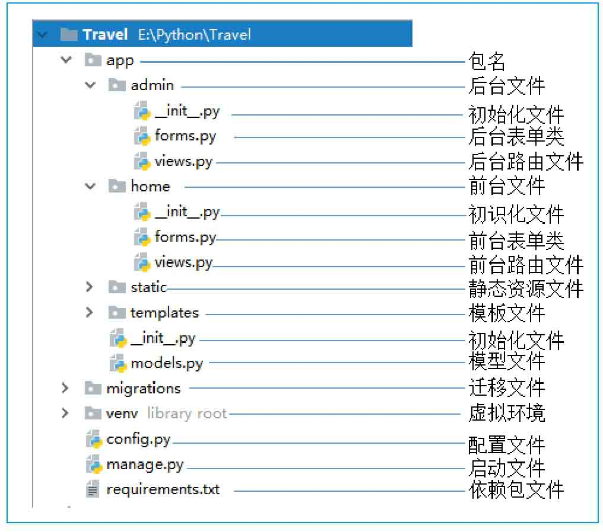

*图22.4 文件夹组织结构*

在图22.4的文件夹组织结构中，有3个顶级文件夹：


 app：Flask程序的包名，一般都命名为app。该文件夹下还包含两个包：home（前台）和admin（后台）。每个包下又包含3个文件：\_\_init\_\_.py（初始化文件）、forms.py（表单文件）和views（路由文件）。


 migrations：数据库迁移脚本。


 venv：Python虚拟环境。

同时还创建了一些新文件：


 requirements.txt：列出了所有依赖包，便于在其他计算机中重新生成相同的虚拟环境。


 config.py：存储配置。


 manage.py：用于启动程序以及其他的程序任务。

在本项目中，使用flask-script扩展以命令行方式生成数据库表和启动服务。生成数据表的命令如下：

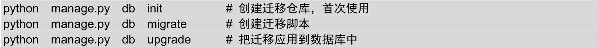

启动服务的命令如下：

```python
python  manage.py  runserver
```

<a id="isbn9787302503880_4_22_1_3"></a>

## 22.3 数据库设计

<a id="isbn9787302503880_4_22_1_1_5"></a>

### 22.3.1 数据库概要说明

本项目采用MySQL数据库，数据库名称为travel，其中包含10张数据表，数据表名称及作用如表22.1所示。

**表22.1 数据库表结构**

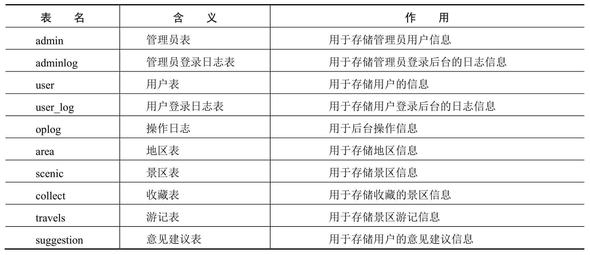

<a id="isbn9787302503880_4_22_1_1_6"></a>

### 22.3.2 数据表模型

本项目中使用SQLAlchemy进行数据库操作，将所有的模型放置到一个单独的models模块中，使程序的结构更加明晰。SQLAlchemy是一个常用的数据库抽象层和数据库关系映射包（ORM），并且需要一些设置才可以使用，因此使用Flask-SQLAlchemy扩展来操作它。

由于篇幅有限，这里只给出models.py模型文件中比较重要的代码。关键代码如下：

&lt;代码位置：资源包\\TM\\sl\\22\\Travel\\app\\models.py&gt;

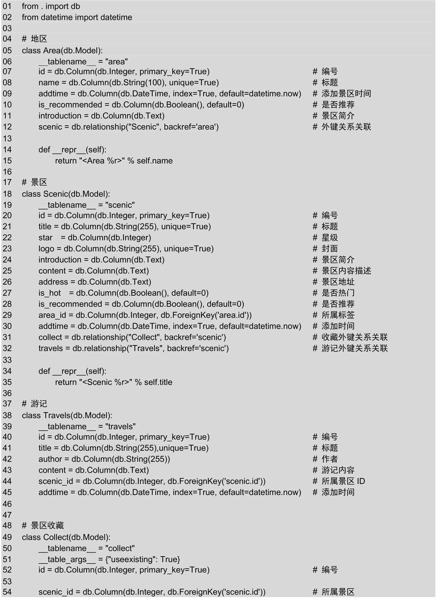

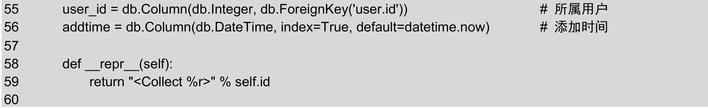

<a id="isbn9787302503880_4_22_1_1_7"></a>

### 22.3.3 数据表关系

本项目中主要数据表的关系为：一个地区（area表）对应多个景区（scenic表），一个景区对应多个游记（travels表）。一个用户（user表）可以有多个收藏（collect表），一个景区（scenic表）可以被收藏（collect表）多次。使用ER图来直观地展现数据表之间的关系，如图22.5所示。

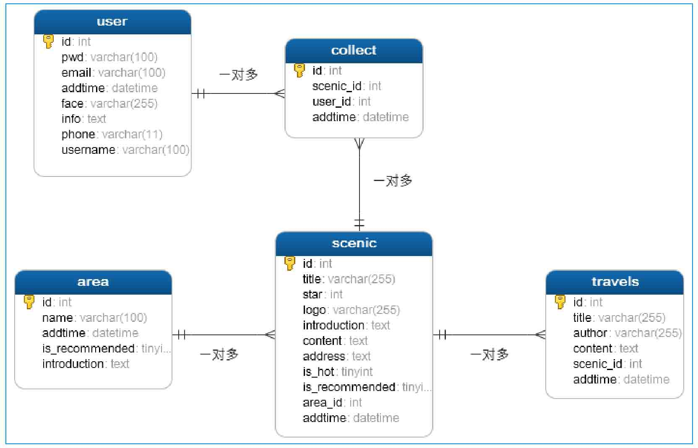

*图22.5 主要表关系*

<a id="isbn9787302503880_4_22_1_4"></a>

## 22.4 前台用户模块设计

<a id="isbn9787302503880_4_22_1_1_8"></a>

### 22.4.1 会员注册功能实现

会员注册模块主要用于实现新用户注册成为网站会员的功能。在会员注册页面中，用户需要填写满足条件的如下信息：


 用户名：不能为空。


 邮箱：不能为空，需要满足邮箱格式，并且每个用户只能使用唯一的一个邮箱。


 密码：不能为空。


 确认密码：不能为空，并且与“密码”保持一致。

如果满足以上条件，用户注册成功，就将填写的会员信息保存到数据库中，否则注册失败，并给出错误提示。会员注册页面路由的关键代码如下：

&lt;代码位置：资源包\\TM\\sl\\22\\Travel\\app\\Home\\views.py&gt;

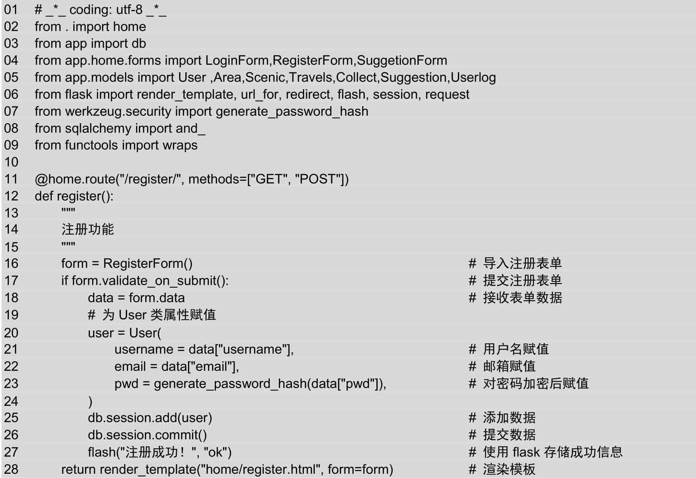

上述代码中，包括了显示用户注册页面和提交用户注册信息两部分功能。当if语句条件form.validate\_on\_submit不为真，即用户使用GET方式访问路由时，只渲染模板，显示注册页面。当form.validate\_on\_submit为真，即用户使用POST方式访问路由时，提交注册表单，执行用户注册的业务逻辑。下面分别介绍这两种情况。

<a id="isbn9787302503880_4_22_1_1_8_1"></a>

#### 1．显示注册页面

用户使用浏览器访问“127.0.0.1:5000/register”，匹配到路由@home.route("/register/")，执行register()函数。首先实例化RegisterForm()类，RegisterForm()类是从app.home.forms模块导入，关键代码如下：

&lt;代码位置：资源包\\TM\\sl\\22\\Travel\\app\\Home\\forms.py&gt;

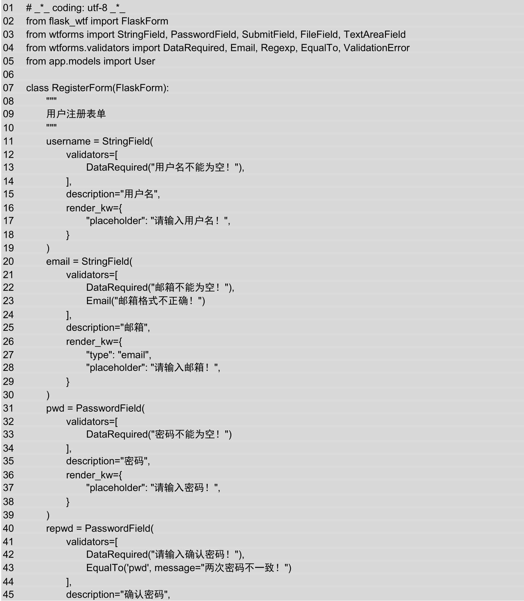

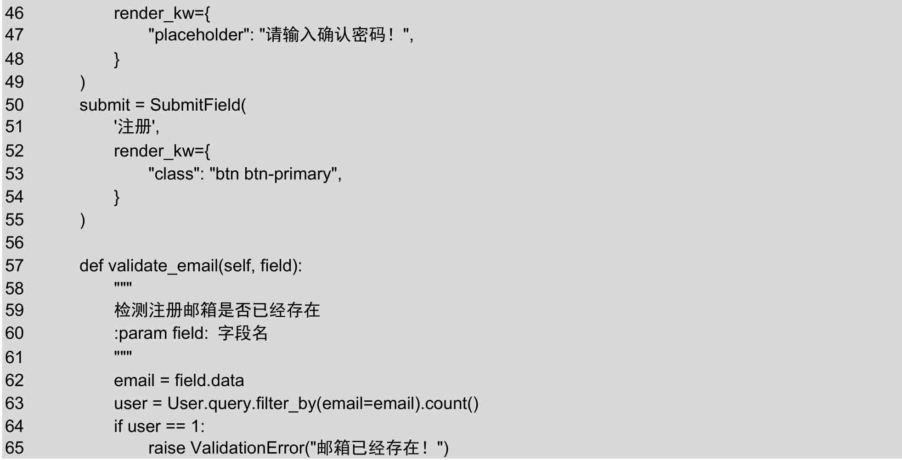

上述代码中定义了一个RegisterForm类，继承自FlaskForm类。FlaskForm类是一个Python扩展，可以实现表单的创建和验证。接下来，定义RegisterForm类的相关属性和方法，包括username、email、pwd、repwd、submit和validate\_emai()。以email为例，在User表中，email字段是字符串型数据，所以使用StringField()方法来定义。在StringField()中定义username的验证规则、描述信息和渲染页面的相关属性。此外，还需要使用validate\_email()方法来验证该邮箱是否已经被注册。

接下来，回到views.py文件的register()函数。实例化RegisterForm类后，使用render\_template()函数渲染模板home\\register.html，并传递form变量。register.html关键代码如下：

&lt;代码位置：资源包\\TM\\sl\\22\\Travel\\app\\Templates\\home\\register.html&gt;

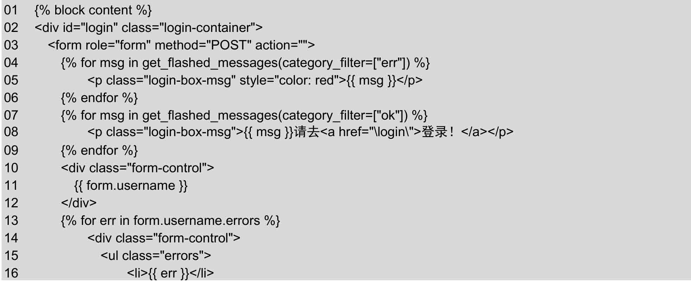

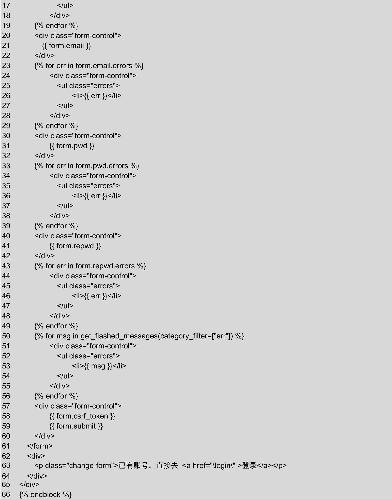

上述代码中，使用form.username输出表单中的username信息，使用form.username.errors输出验证username的错误信息。这里form对象是在register()函数中通过render\_template("home/register.html",form=form)传递过来的变量。

此外需要注意的是，form.csrf\_token生成一个隐藏字段，其内容是CSRF令牌，需要和表单中的数据一起提交。CSRF是一种通过伪装来自受信任用户的请求，来发送恶意攻击的方法。FlaskForm通过使用CSRF令牌方式避免CSRF攻击。

在浏览器中访问“127.0.0.1:5000/register/”，注册页面运行效果如图22.6所示。

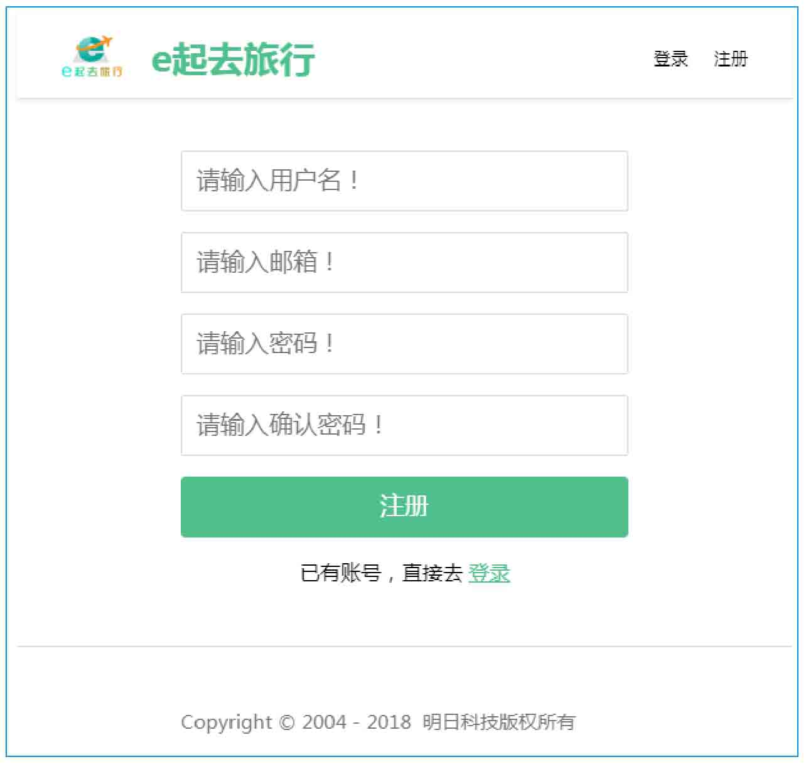

*图22.6 注册页面效果图*

<a id="isbn9787302503880_4_22_1_1_8_2"></a>

#### 2．提交注册信息

当用户填写完注册信息提交表单时，首先验证表单，然后将注册信息存入数据库。具体流程如下。

（1）验证表单。在forms.py中对表单中的每个字段进行验证。以email字段为例。注册信息时要求email不能为空，符合邮箱格式，并且邮箱唯一。在RegisterForm类中，关键代码如下：

&lt;代码位置：资源包\\TM\\sl\\22\\Travel\\app\\Home\\forms.py&gt;

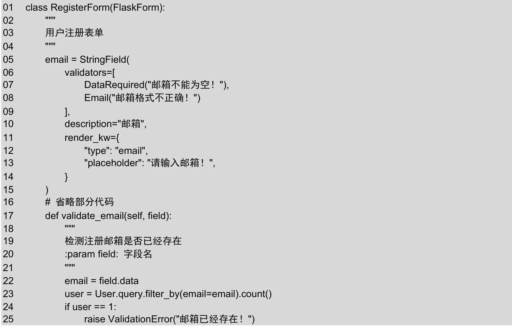

上述代码中，StringField()方法对RegisterForm类的email属性赋值时使用validators进行验证。validators是一个列表，有两个值：DataRequired()用于检测输入是否为空；Email()用于检测是否符合邮箱格式。此外，对于某些特殊验证，如邮箱是否被注册，则可以使用自定义验证。在RegisterForm类中定义一个方法，命名为validate\_字段名。例如，验证用户名定义validate\_username，验证密码定义validate\_pwd。在自定义方法中，可以实现具体的验证逻辑。

当验证用户输入不符合要求时，则会将错误信息写入form.email.errors中。form.email.errors是一个列表，可以在register.html模板中迭代输出错误信息，关键代码如下：

&lt;代码位置：资源包\\TM\\sl\\22\\Travel\\app\\Templates\\home\\register.html&gt;

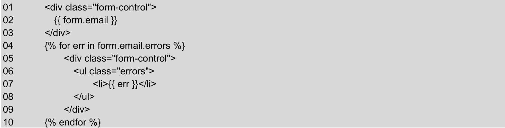

在浏览器中访问“127.0.0.1:5000/register/”，注册页面运行效果如图22.7所示。当不输入用户信息，直接提交，运行效果如图22.8所示。当输入的“密码”和“确认密码”不一致时，运行效果如图22.9所示。当输入一个已存在的邮箱时，运行效果如图22.10所示。


*图22.7 验证字段不能为空*

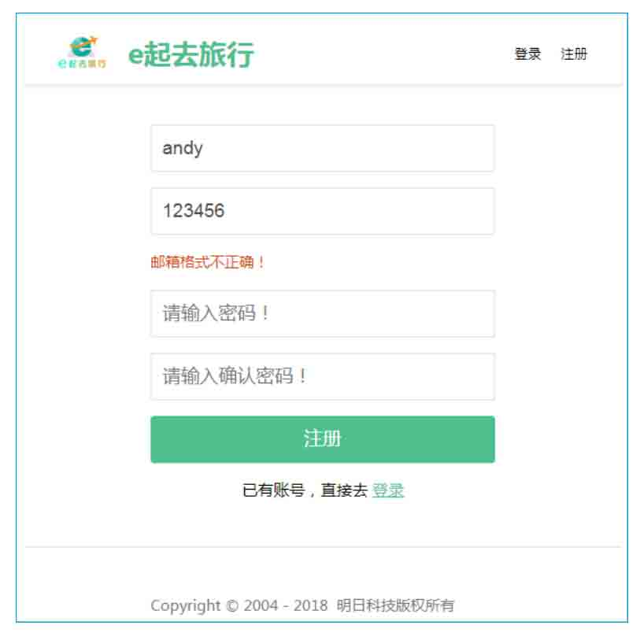

*图22.8 验证邮箱格式*

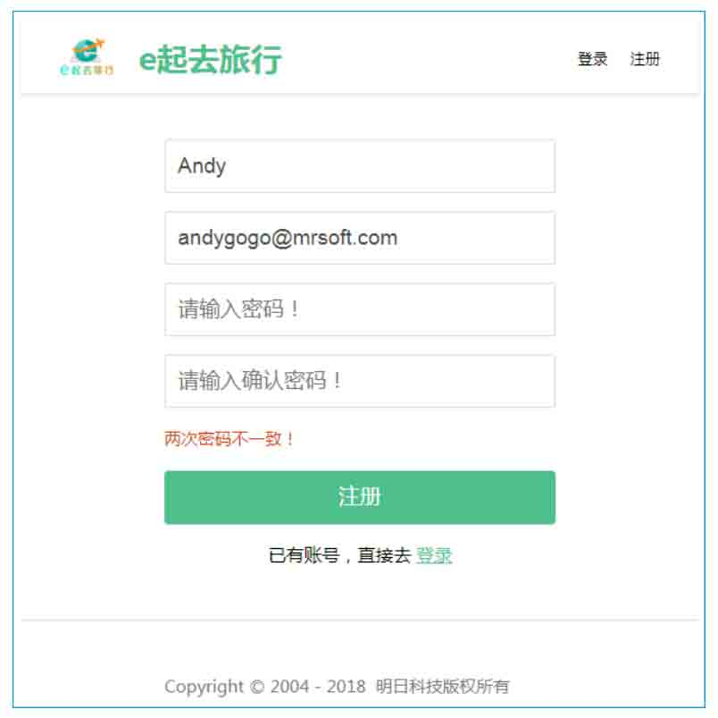

*图22.9 验证密码是否一致*

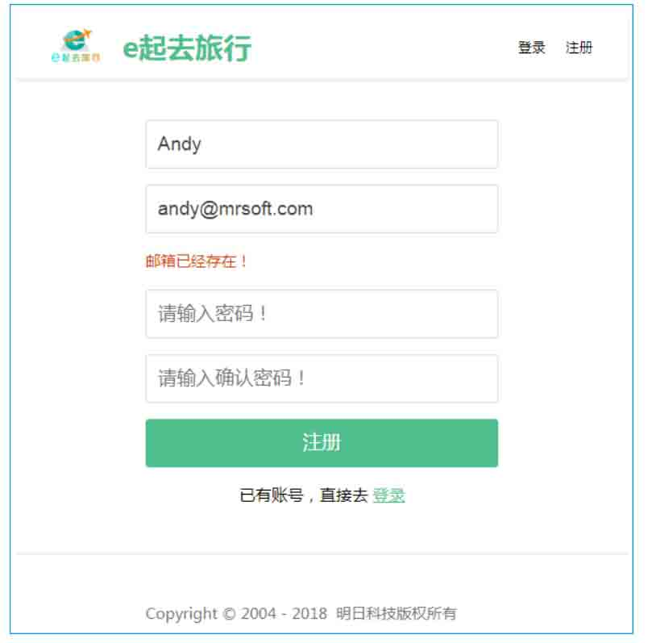

*图22.10 验证邮箱是否已经存在*

（2）存入数据库。当验证通过后，开始接收表单数据，然后存入数据库。register()函数关键代码如下：

&lt;代码位置：资源包\\TM\\sl\\22\\Travel\\app\\Home\\views.py&gt;

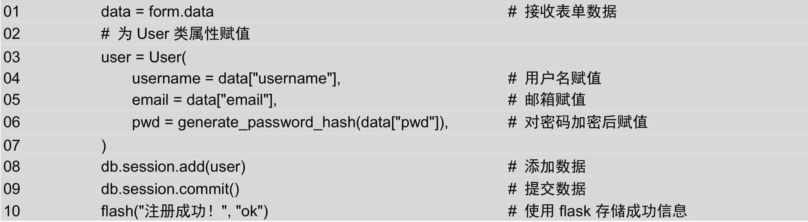

上述代码中，通过form.data来接收用户在表单中提交的数据。例如用户输入的用户名，可以用form.data.username来接收。为了保护用户的隐私安全，必须对用户输入的密码进行加密。可以使用werkzeug.security的generate\_password\_hash()方法实现密码加密功能。接下来，使用db.session.add(user)添加数据，使用db.session.commit()提交数据。最后使用flask存储添加成功信息。

添加成功后，需要提示用户添加成功。成功信息已经写入flash中，可以通过get\_flashed\_messages()函数获取信息，然后输出到模板。在register.html模板中，输出添加成功信息。关键代码如下：


运行结果如图22.11所示。

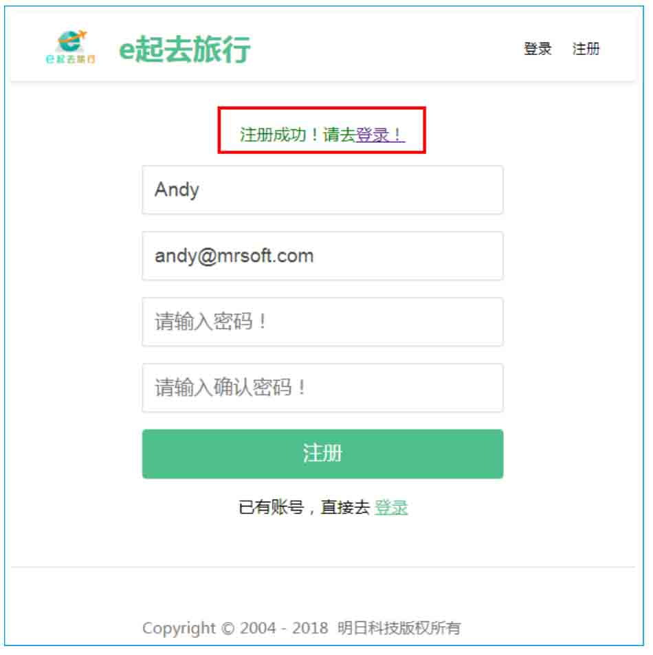

*图22.11 注册成功提示*

<a id="isbn9787302503880_4_22_1_1_9"></a>

### 22.4.2 会员登录功能实现

会员登录模块主要用于实现网站的会员登录功能。由于用户邮箱是唯一的，所以使用邮箱和密码作为登录凭证。在登录页面中，填写用户邮箱和密码，单击“登录”按钮，即可实现会员登录。如果没有输入邮箱、密码或者账号密码不匹配，都将给予错误提示。

会员登录功能与会员注册功能业务逻辑相似，会员登录页面路由的关键代码如下：

&lt;代码位置：资源包\\TM\\sl\\22\\Travel\\app\\Home\\views.py&gt;

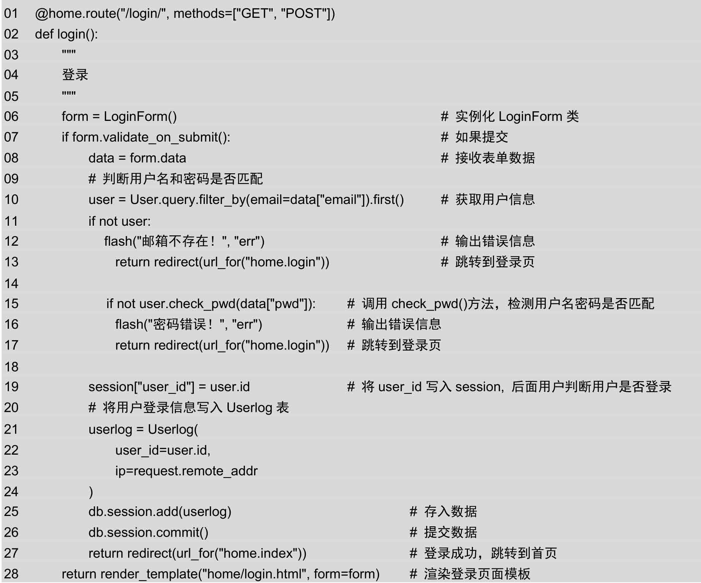

上述代码中，首先实例化LoginForm表单，如果以GET方式访问路由，则执行渲染页面的功能。如果以POST方式访问路由，即填写登录信息登录，则首先执行表单验证功能，与注册页面表单验证功能相同，如图22.12所示。接下来，执行登录流程。首先根据用户输入的邮箱，获取User对象。如果User对象不存在，提示“邮箱不存在”。然后调用User对象的check\_pwd()方法，检测密码是否正确。如果密码错误，提示“密码错误！”，如果密码正确，则将用户信息写入Session，为后续判断用户是否登录功能做准备。

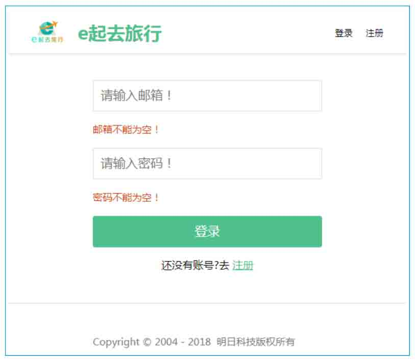

*图22.12 登录验证*

<a id="isbn9787302503880_4_22_1_1_10"></a>

### 22.4.3 会员退出功能实现

退出功能的实现比较简单，主要是清空登录时Session中的user\_id。可以使用session.pop()函数来实现该功能。具体代码如下：

&lt;代码位置：资源包\\TM\\sl\\22\\Travel\\app\\Home\\views.py&gt;

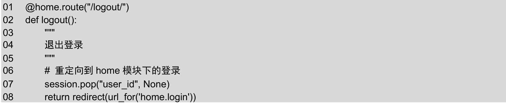

当用户单击“退出”按钮时，执行logout()方法，并且跳转到登录页。

<a id="isbn9787302503880_4_22_1_5"></a>

## 22.5 前台首页模块设计

当用户访问e起去旅行网站时，首先进入的是前台首页。前台首页是对整个网站总体内容的概述。在本项目的前台首页中，主要包含以下内容：


 推荐景区模块：显示在后台设置为推荐的景区。


 推荐地区模块：显示在后台设置为推荐的地区，以及该地区的所有景区。


 景区搜索模块：根据地区和星级搜索景区。

首页运行效果如图22.13所示。

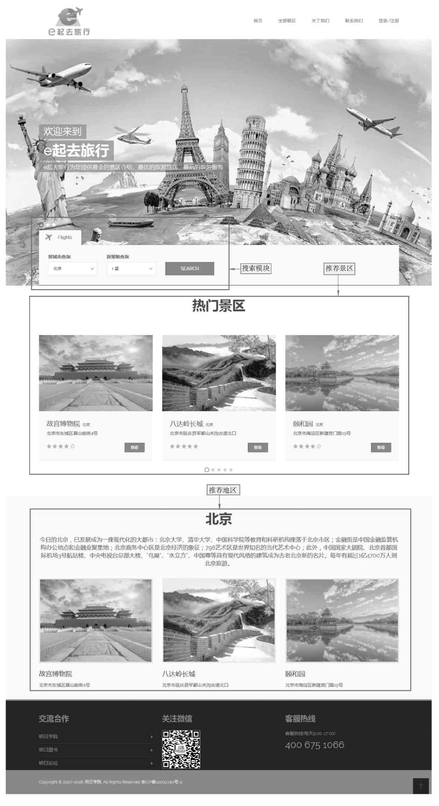

*图22.13 前台首页效果*

<a id="isbn9787302503880_4_22_1_1_11"></a>

### 22.5.1 推荐景区功能实现

首页作为网站浏览量最多的页面，必然要向用户展示最重要的信息，但由于一个页面展示的信息量有限，所以通常在网站后台都有设置推荐选项，只用被推荐的产品才会显示在首页。e起去旅行网站首页推荐景区部分也是显示被推荐的景区。

<a id="isbn9787302503880_4_22_1_1_8_3"></a>

#### 1．获取推荐景区数据

当用户访问网站的根目录即“127.0.0.1:50000”时，页面跳转至首页。在前台路由文件views.py中首页显示的关键代码如下：

&lt;代码位置：资源包\\TM\\sl\\22\\Travel\\app\\Home\\views.py&gt;

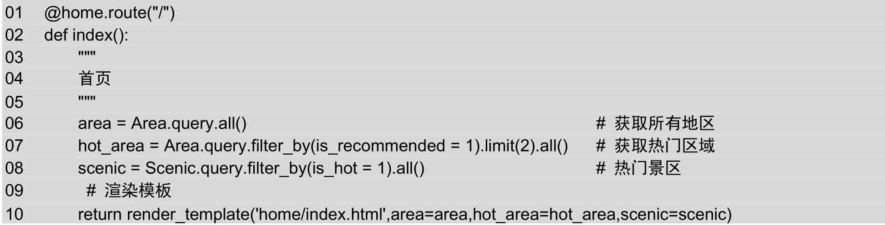

上述代码中，使用SQLAlchemy获取area表的所有地区，为搜索区域的地区下拉列表提供数据。然后分别获取热门区域和热门景区的数据。在获取热门景区时，使用filter\_by()条件查询筛选is\_hot字段为1的所有数据，即所有推荐的景区。最后，使用render\_template()函数渲染模板并传递数据。

<a id="isbn9787302503880_4_22_1_1_8_4"></a>

#### 2．渲染模板

获取完热门景区数据后，接下来就需要渲染模板显示数据了。由于热门数据是一个可迭代对象，所以使用for标签遍历数据。关键代码如下：

&lt;代码位置：资源包\\TM\\sl\\22\\Travel\\app\\templates\\home\\index.html&gt;

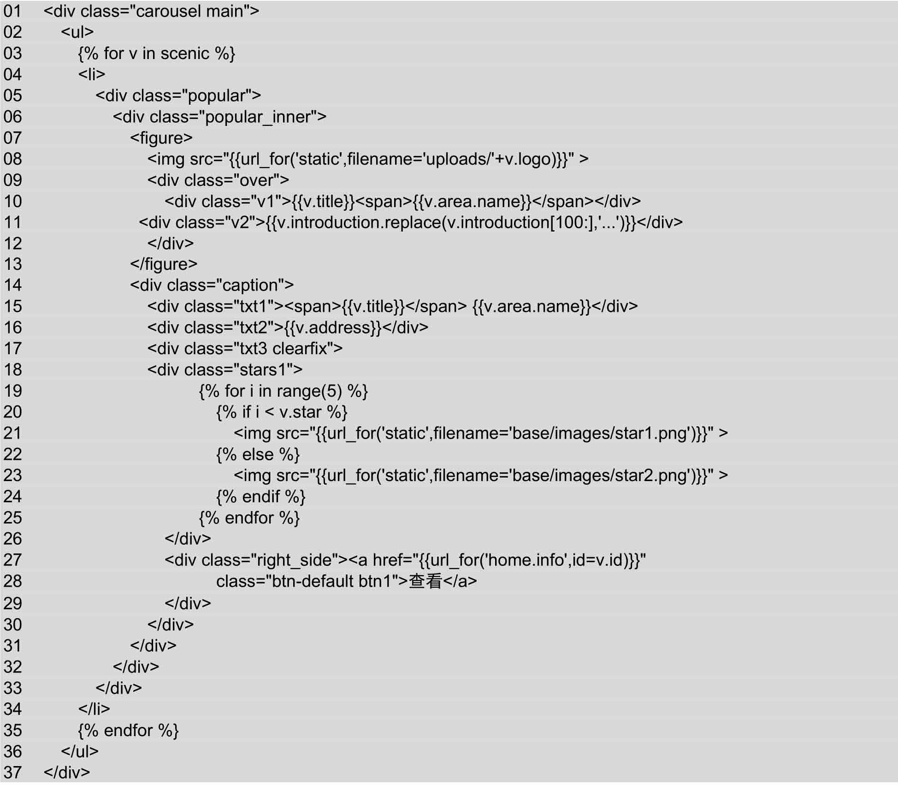

上面代码中，使用for标签将变量scenic赋值给变量v。然后使用“v.”属性方式获取景区表scenic的字段值。如v.title的值就是景区的名称。v.logo的值就是景区的封面图片名称，为了在HTML页面中显示图片内容，需要设置&lt;img&gt;标签的src属性，其属性值可以使用url\_for()函数来生成。

值得注意的是，scenic表和area表是一对多的关系，由于使用了SQLAlchemy，通过v.area就可以很容易地获取该景区所对应的地区对象。v.area.name就是这个地区的名称。

对于景区的星级最多为5颗星。如某个景区的星级为4星，那么可以使用for标签来显示4颗实心星和1颗空心星。运行结果如图22.14所示。


*图22.14 显示热门景区*

<a id="isbn9787302503880_4_22_1_1_12"></a>

### 22.5.2 推荐地区功能实现

推荐地区的功能与推荐景区类似，首先根据条件获取所有推荐的景区。前台路由文件views.py中有如下代码：

```python
hot_area = Area.query.filter_by(is_recommended = 1).limit(2).all() #获取热门区域
```

即从Area表中筛选is\_recommended字段为1的数据，并限定只筛选出两条数据。接下来渲染视图。关键代码如下：

&lt;代码位置：资源包\\TM\\sl\\22\\Travel\\app\\templates\\home\\index.html&gt;

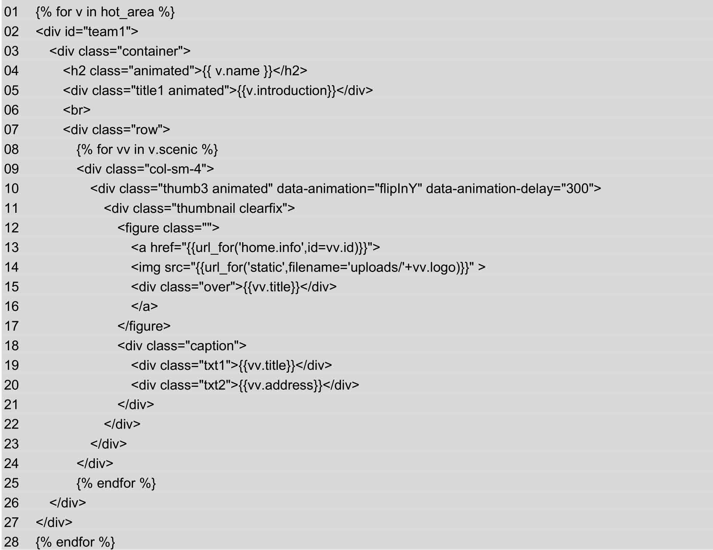

上述代码中，使用for标签将变量hot\_area依次赋值给变量v，变量v是地区对象，通过“v.”属性的方式获取相应的属性值。但是，推荐地区内容除获取地区外，还要获取该地区的景区，v.scenic即为该地区下的所有景区。所以，再次使用for标签遍历每个景区。运行结果如图22.15所示。


*图22.15 推荐地区*

<a id="isbn9787302503880_4_22_1_1_13"></a>

### 22.5.3 搜索景区功能实现

首页的搜索区域可以根据地区和星级搜索景区，由于在景区模块中也会应用搜索功能，所以将搜索区域作为通用部分，通过使用include标签在需要的部分引用。在templates\\home\\路径下创建search\_box.html作为通用搜索区域，具体代码如下：

&lt;代码位置：资源包\\TM\\sl\\22\\Travel\\app\\templates\\home\\search\_box.html&gt;

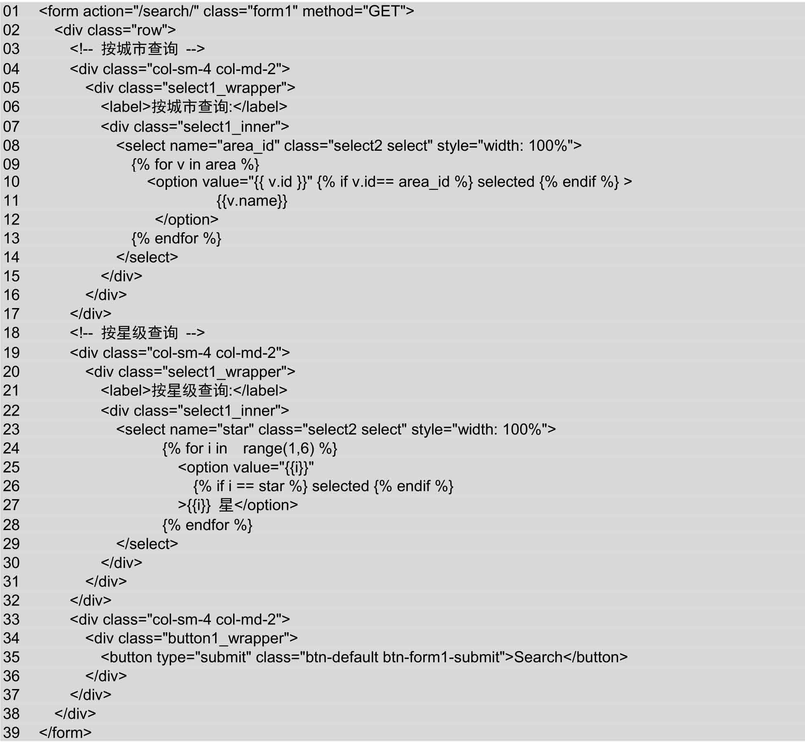

上述代码中包含一个Form表单。表单中包含两个栏位：地区和星级。其中地区数据是Area表中的全部数据，而星级数据则使用for标签设定为1至5颗星。运行效果如图22.16所示。

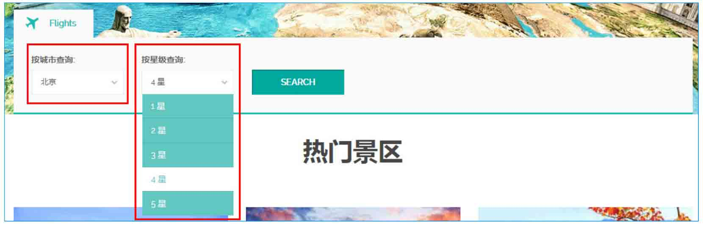

*图22.16 首页搜索景区*

当单击SEARCH按钮时，使用GET方式提交表单到/search/路由，然后执行搜索景区的逻辑，关键代码如下：

&lt;代码位置：资源包\\TM\\sl\\22\\Travel\\app\\Home\\views.py&gt;

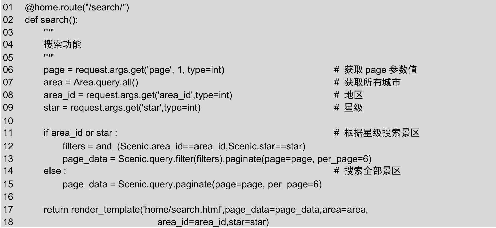

上述代码中，使用request.args.get()函数接收URL链接中的参数。area\_id表示地区ID，star表示星级。由于景区数量较多，为更好地展示页面效果，需要使用分页功能。所以设置page参数，作为当前页码。如果page的值不存在，默认为1，即显示第1页。例如，一个URL为“127.0.0.1:5000//search/?area\_id=1&star=4&page=2”，则表示查找地区ID为1，星级为4星，并且当前页码为第2页的数据。

接下来，判断area\_id或者star是否存在。如果都不存在，则查找全部景区，否则根据筛选条件查找满足条件的景区。由于景区和星级是并且关系，所以使用and\_()函数同时查找。最后使用SQLAlchemy的paginate()函数实现分页功能。paginate()函数第一个参数page表示当前页码，第二个参数per\_page表示每页显示的数量。

根据特定条件查找景区的运行结果如图22.17所示，查找全部景区的运行效果如图22.18所示。

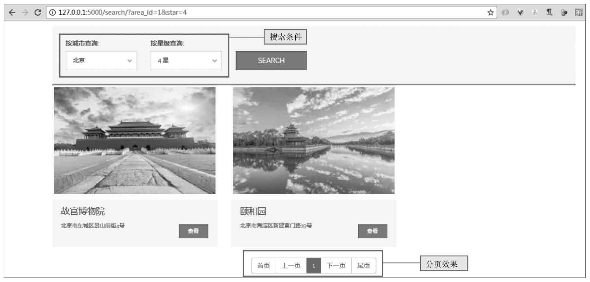

*图22.17 根据条件查找景区*

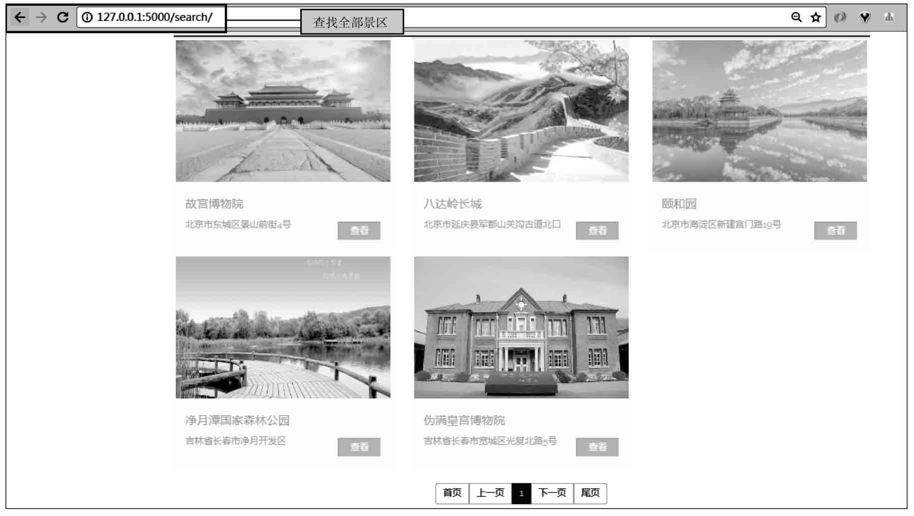

*图22.18 查找全部景区*

<a id="isbn9787302503880_4_22_1_6"></a>

## 22.6 景区模块设计

景区模块主要包括景区搜索、查看景区、收藏景区和查看游记等功能。由于景区搜索功能与查找景区功能相同，本节不再赘述，本节重点讲解查看景区、收藏景区以及和收藏相关的功能和查看游记的功能。

<a id="isbn9787302503880_4_22_1_1_14"></a>

### 22.6.1 查看景区功能实现

在前台首页或者全部景区页面，当单击“查看”按钮时，页面会跳转至景区的详情介绍页面。页面路由为http://127.0.0.1:5000/info/&lt;int:id&gt;，其中&lt;id&gt;是该景区的ID。关键代码如下：

&lt;代码位置：资源包\\TM\\sl\\22\\Travel\\app\\Home\\views.py&gt;

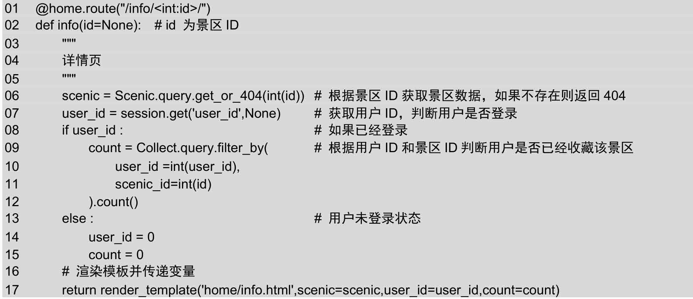

上述代码中，首先使用get\_or\_404()方法根据ID判断景区是否存在，如果景区不存在，直接跳转到404页面。如果景区存在，使用session.get()函数获取用户ID，然后根据用户ID和景区ID判断用户是否已经收藏该景区。

接下来查看模板文件。关键代码如下：

&lt;代码位置：资源包\\TM\\sl\\22\\Travel\\app\\templates\\home\\info.html&gt;

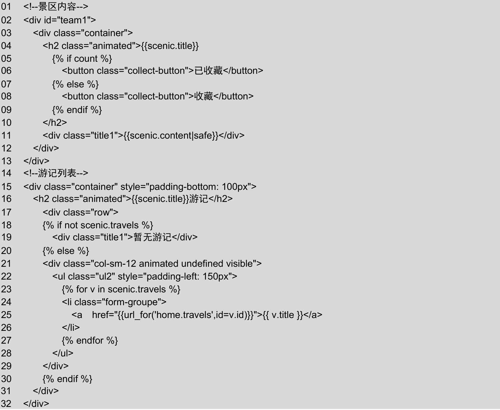

模板文件代码相对简单，在页面中主要显示两部分内容：景区详情和景区游记。景区详情包括标题、是否收藏和景区内容。使用if-else标签判断是否收藏，并显示相应文字。在获取景区内容时，使用“\|safe”过滤器将HTML代码标签标记为安全，可以正常显示，如图22.19所示。如果没有使用“\|safe”过滤器，运行结果如图22.20所示。景区游记主要是使用SQLAlchemy关联travels表，然后获取景区游记标题和ID，并设置&lt;a&gt;标签链接。

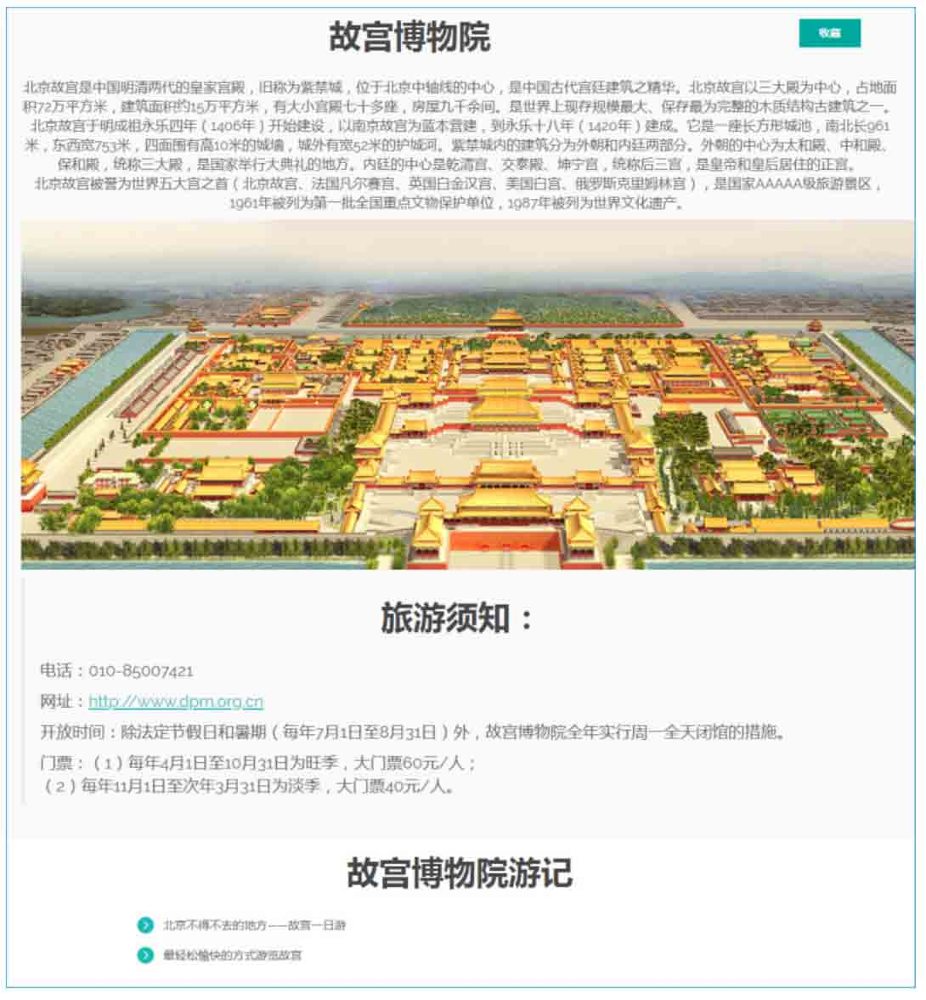

*图22.19 使用过滤器效果*

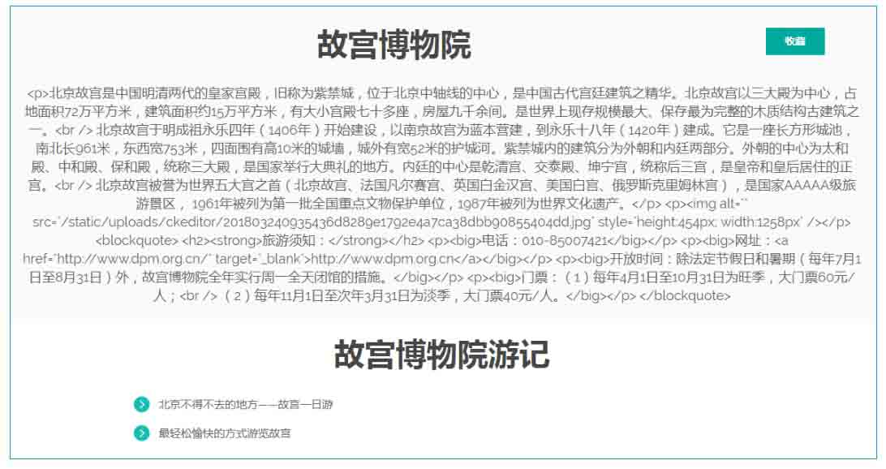

*图22.20 未使用过滤器效果*

<a id="isbn9787302503880_4_22_1_1_15"></a>

### 22.6.2 查看游记功能实现

在景区页面底部有一个“景区游记”列表区域，单击相应选项即可查看景区游记。景区游记路由是“127.0.0.1:5000/travels/&lt;int:id&gt;/”，其中id为游记ID，具体代码如下：

&lt;代码位置：资源包\\TM\\sl\\22\\Travel\\app\\Home\\views.py&gt;

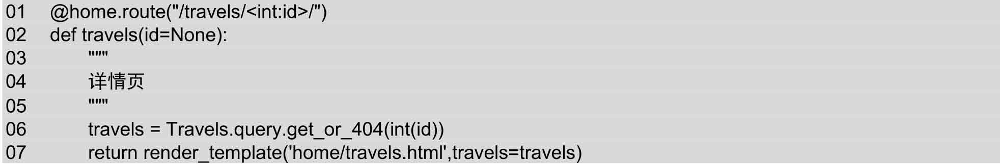

在上述代码中，首先根据景区ID获取景区数据。如果不存在，则直接跳转至404页面。然后渲染模板并传递变量。在游记模板中，关键代码如下：

&lt;代码位置：资源包\\TM\\sl\\22\\Travel\\app\\templates\\home\\travels.html&gt;

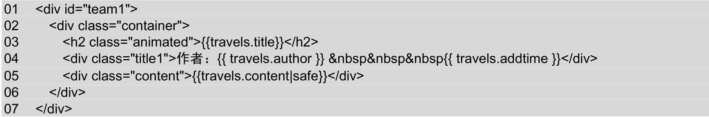

查看游记与查看景区模板页面类似，这里不再赘述。运行效果如图22.21所示。

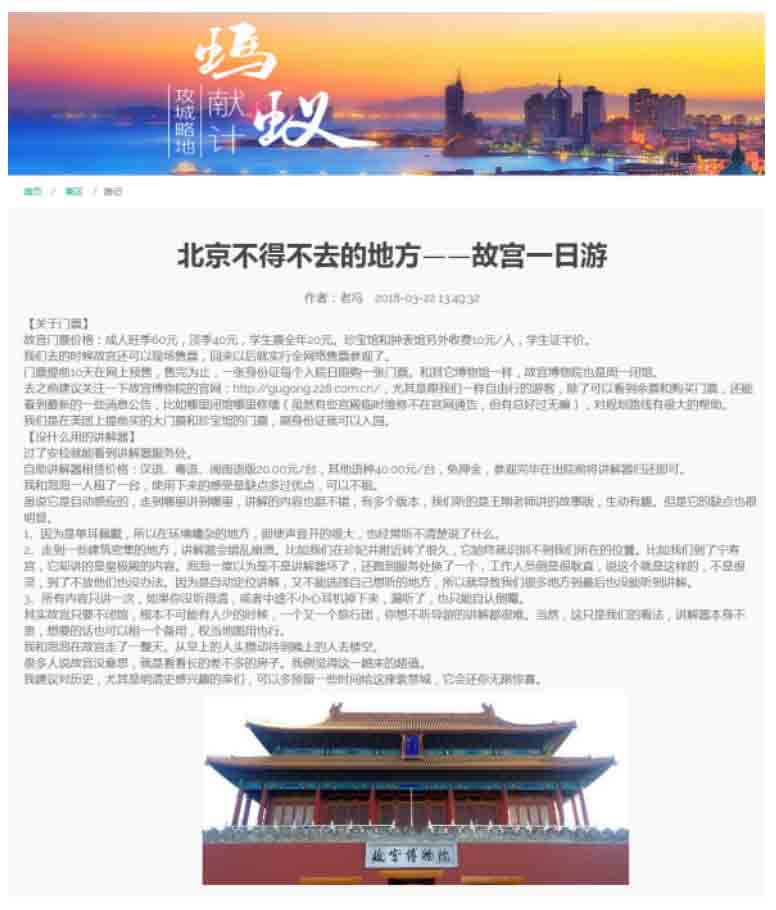

*图22.21 显示游记效果*

<a id="isbn9787302503880_4_22_1_1_16"></a>

### 22.6.3 收藏景区功能实现

景区详情页面可以实现景区收藏功能。单击标题右侧的“收藏”按钮，首先判断用户是否登录，如果没有登录，则提示用户“请先登录”。如果已经登录，则通过Ajax异步提交方式执行收藏景区的业务逻辑。

<a id="isbn9787302503880_4_22_1_1_8_5"></a>

#### 1．权限判断

在查看景区功能中，使用session.get('user\_id',None)函数来获取用户ID，并且将user\_id传递至info.html模板中。所以，在info.html模板中可以通过user\_id来判断用户是否登录。如果user\_id不存在，使用layer.js弹出错误提示。关键代码如下：

&lt;代码位置：资源包\\TM\\sl\\22\\Travel\\app\\templates\\home\\info.html&gt;

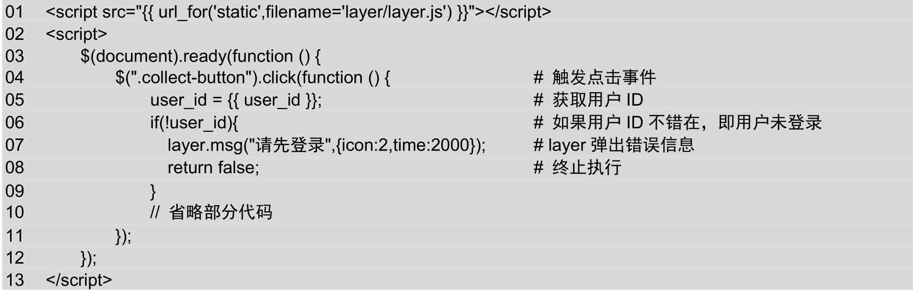

上述代码中，首先引入layer弹出插件，然后在“收藏”按钮中绑定单击事件，接着使用layer.msg()方法弹出错误信息。运行结果如图22.22所示。

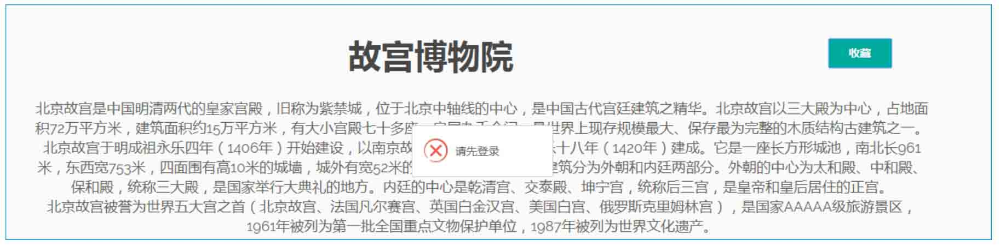

*图22.22 判断是否登录效果*

<a id="isbn9787302503880_4_22_1_1_8_6"></a>

#### 2．Ajax异步提交

如果用户已经登录，单击“收藏”按钮，将使用Ajax在页面无跳转的情况下，将景区ID提交至路由“127.0.0.1:5000/ collect\_add”，执行收藏景区的逻辑，接着将执行后的信息返回给当前页面。

&lt;代码位置：资源包\\TM\\sl\\22\\Travel\\app\\templates\\home\\info.html&gt;

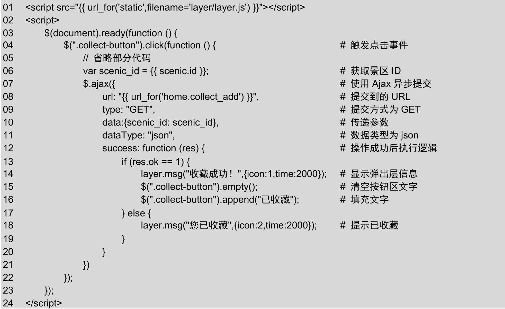

上述代码中，使用了Ajax的GET方式将scenic\_id提交至“127.0.0.1:5000/ collect\_add”路由，该路由下的方法代码如下：

&lt;代码位置：资源包\\TM\\sl\\22\\Travel\\app\\Home\\views.py&gt;

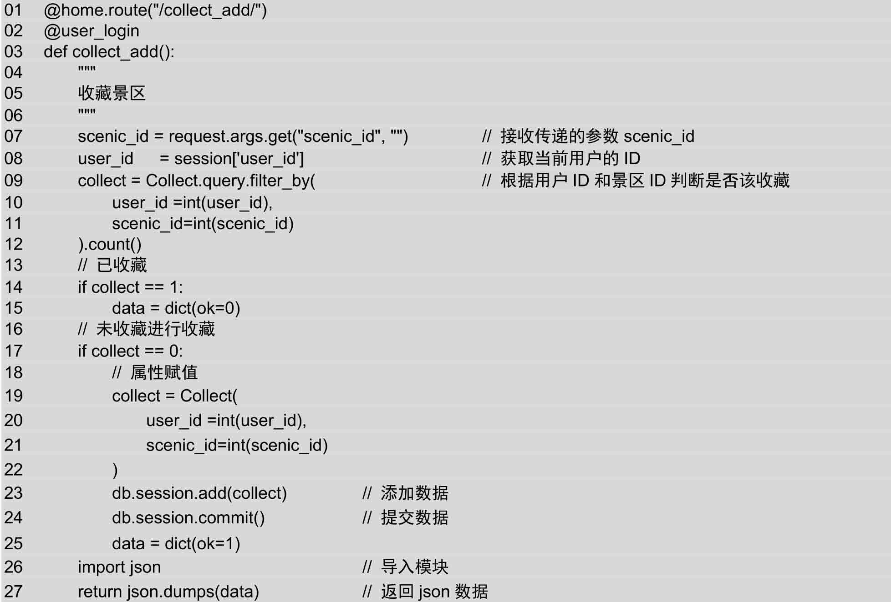

上述代码中，首先在路由下使用@user\_login装饰器判断用户是否登录。如果用户在没有登录的情况下访问“127.0.0.1/collect\_add/”，页面会跳转到登录页，提示用户登录。user\_login()函数代码如下：

&lt;代码位置：资源包\\TM\\sl\\22\\Travel\\app\\Home\\views.py&gt;

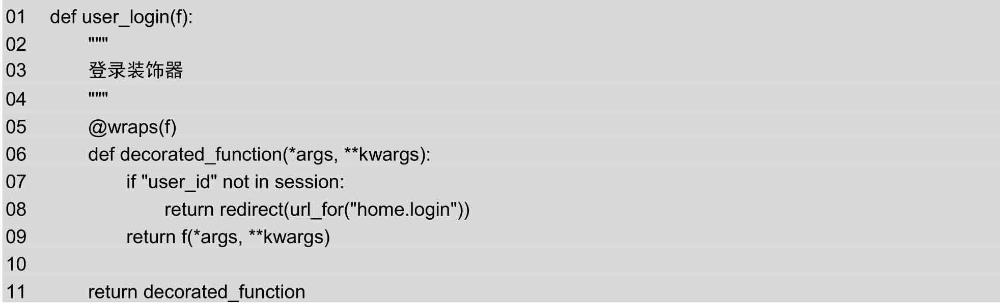

如果用户已经登录，继续判读用户是否已经收藏该景区。如果已经收藏，直接设置ok等于0。如果尚未收藏，则将user\_id和scenic\_id写入collect表，并且设置ok等于1。最后，导入json模块，返回json格式数据。

再次回到index.html模板Ajax的success()函数。如果res.ok等于1，提示“收藏成功”，将info.html页面“收藏”按钮中的文字更改为“已收藏”。如果res.ok等于0，则提示“已经收藏”。首次收藏运行效果如图22.23所示。再次收藏的运行效果如图22.24所示。

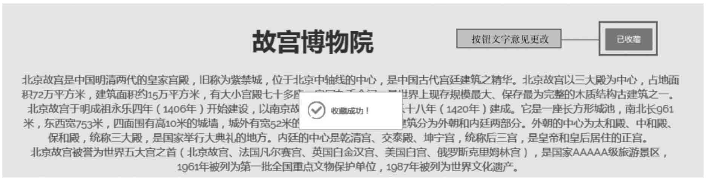

*图22.23 收藏成功效果*

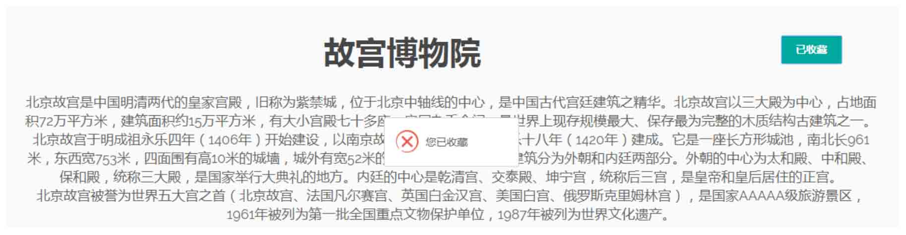

*图22.24 已经收藏效果*

<a id="isbn9787302503880_4_22_1_1_17"></a>

### 22.6.4 查看收藏景区功能实现

<a id="isbn9787302503880_4_22_1_1_8_7"></a>

#### 1．查看收藏景区

用户收藏完景区后，可以单击顶部导航“我的收藏”链接查看所有收藏的景区。“我的收藏”页面路由为“127.0.0.1:5000/collect\_list/”，也需要访问权限，所以需要在路由下添加@user\_login装饰器。具体代码如下：

&lt;代码位置：资源包\\TM\\sl\\22\\Travel\\app\\Home\\views.py&gt;

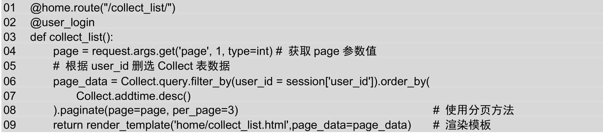

上述代码中，由于要查看当前用户的收藏景区情况，所以需要设置筛选条件为user\_id = session\['user\_id'\]。然后使用order\_by()方法根据添加时间降序排列，最后使用paginate()函数生成分页。

模板文件关键代码如下：

&lt;代码位置：资源包\\TM\\sl\\22\\Travel\\app\\templates\\collect\_list\\info.html&gt;

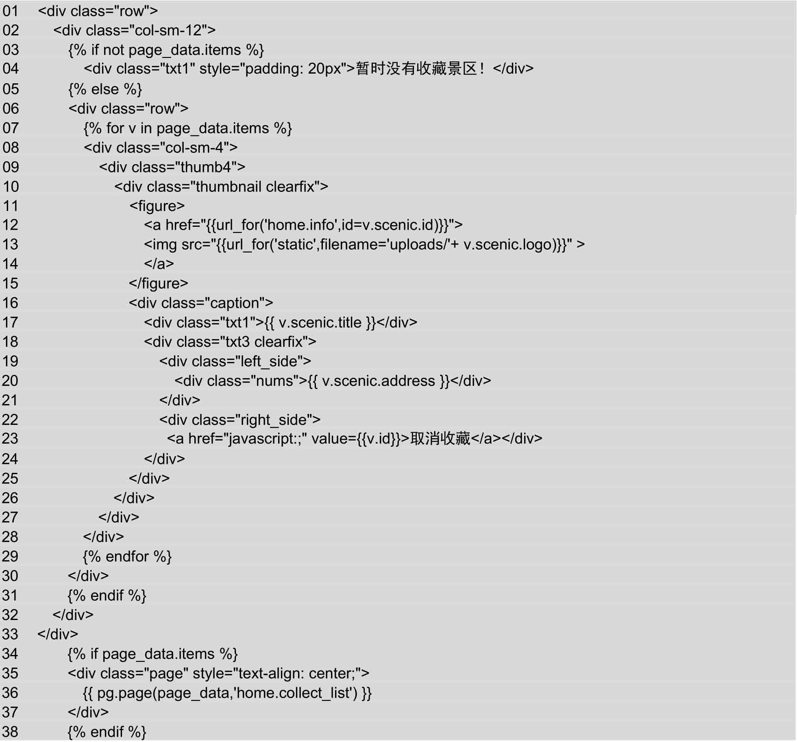

上述代码中，首先判断是否有收藏的数据，如果没有则提示“暂时没有收藏景区！”。如果存在，通过SQLAlchemy管理scenic表，使用“v.scenic.”属性的方式获取相应的景区数据。接下来，显示分页。如果没有景区数据，则不显示分页。运行效果如图22.25所示。

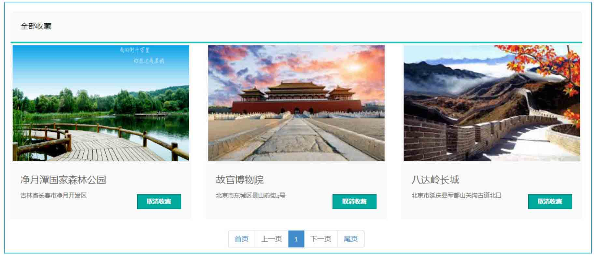

*图22.25 查看收藏景区效果*

<a id="isbn9787302503880_4_22_1_1_8_8"></a>

#### 2．取消收藏景区

取消收藏景区功能与收藏景区类似，也使用Ajax异步提交方式完成。当用户单击“取消收藏”按钮时，获取该景区ID，然后提交到“127.0.0.1:5000/collect\_cancel/”路由，执行取消收藏景区的逻辑。具体代码如下：

&lt;代码位置：资源包\\TM\\sl\\22\\Travel\\app\\templates\\collect\_list\\info.html&gt;

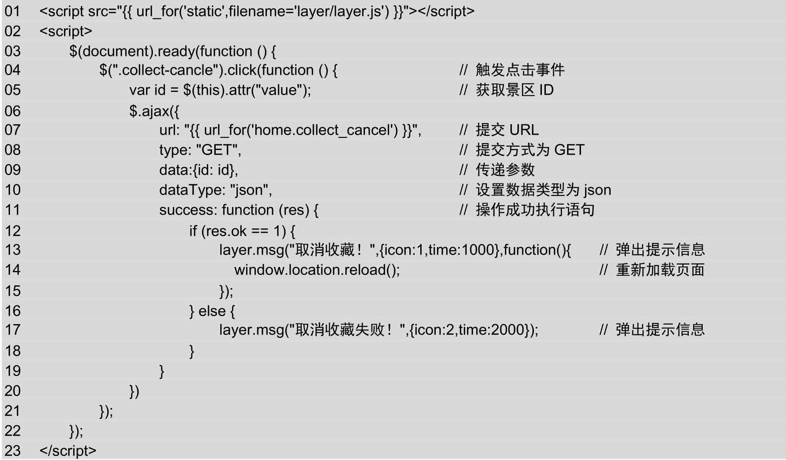

以上JavaScript代码与收藏景区类似，这里不再赘述，重点看下“127.0.0.1:5000/collect\_cancel/”路由下的方法。

&lt;代码位置：资源包\\TM\\sl\\22\\Travel\\app\\Home\\views.py&gt;

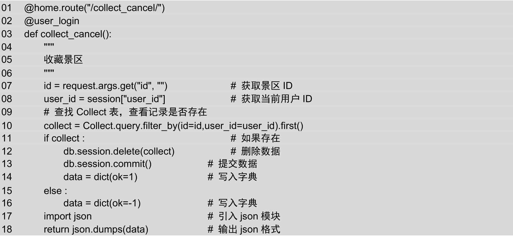

上述代码中，首先接收Ajax传递过来的景区ID，然后使用session.get()函数获取当前用户的ID，然后根据条件查找collect表数据，接着删除数据，最后返回json数据。

运行结果如图22.26所示。

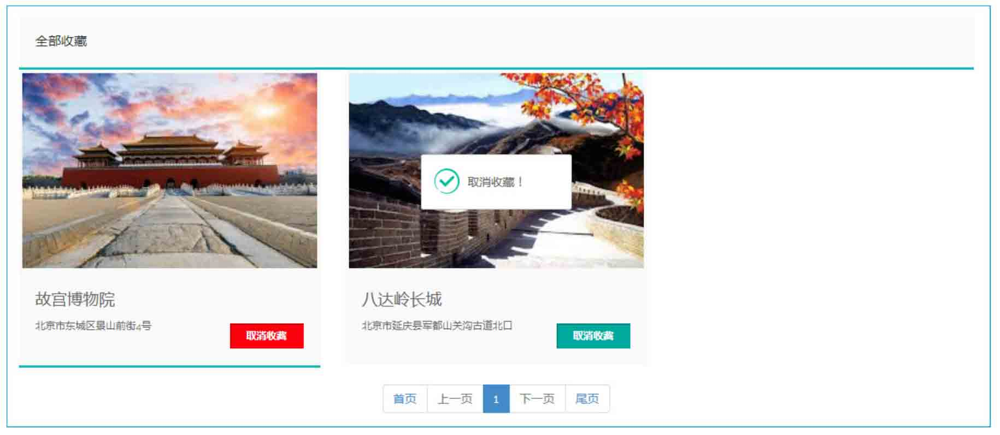

*图22.26 取消收藏效果*

<a id="isbn9787302503880_4_22_1_7"></a>

## 22.7 关于我们模块设计

关于我们模块主要包括关于我们和联系我们两个页面。关于我们页面主要用于对公司的相关介绍，以静态页面为主。联系我们页面主要是通过表单提交用户填写的意见和建议。我们重点介绍联系我们页面。

联系我们的路由为“127.0.0.1:5000/contact/”，关键代码如下：

&lt;代码位置：资源包\\TM\\sl\\22\\Travel\\app\\Home\\views.py&gt;

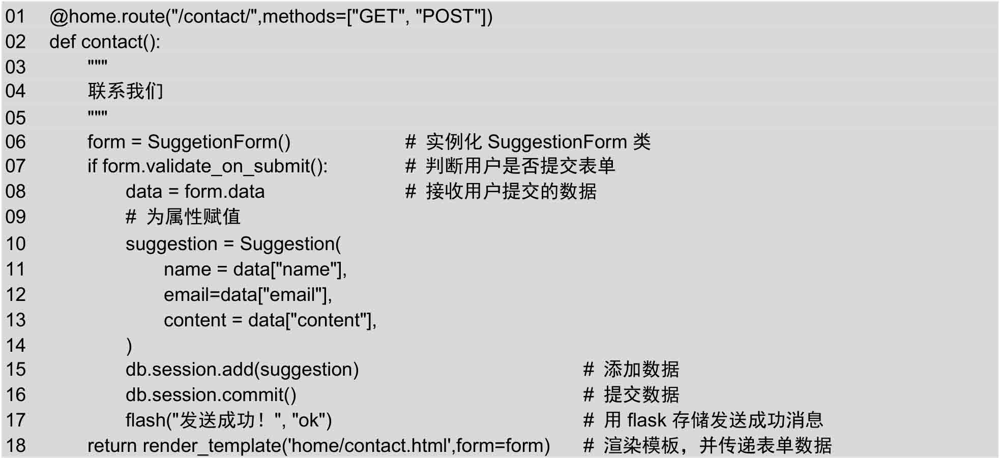

上述代码中，设置两种方式访问路由：GET和POST方式。这与登录和注册的功能类似。当以GET方式访问时，只执行渲染模板。模板页面关键代码如下：

&lt;代码位置：资源包\\TM\\sl\\22\\Travel\\app\\templates\\collect\_list\\contact.html&gt;

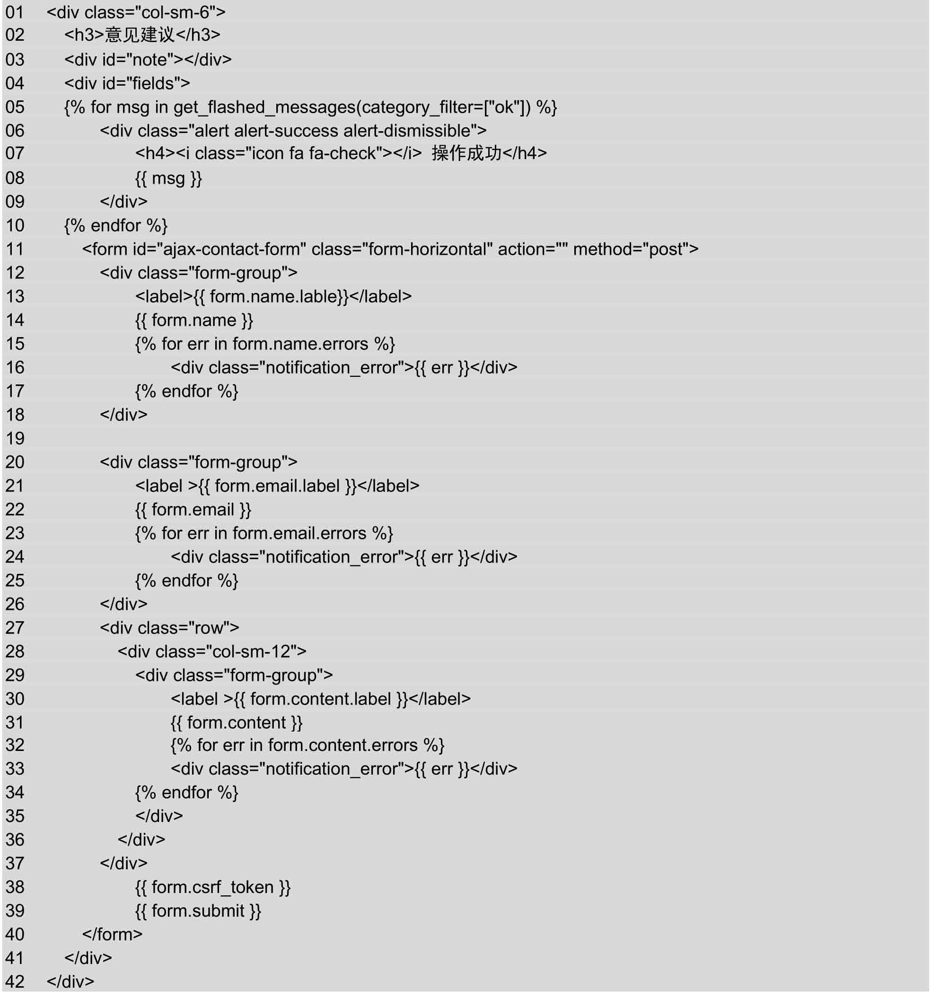

上述代码中注意使用form.csrf\_token生成一个隐藏字段，即CSRF令牌。运行结果如图22.27所示。

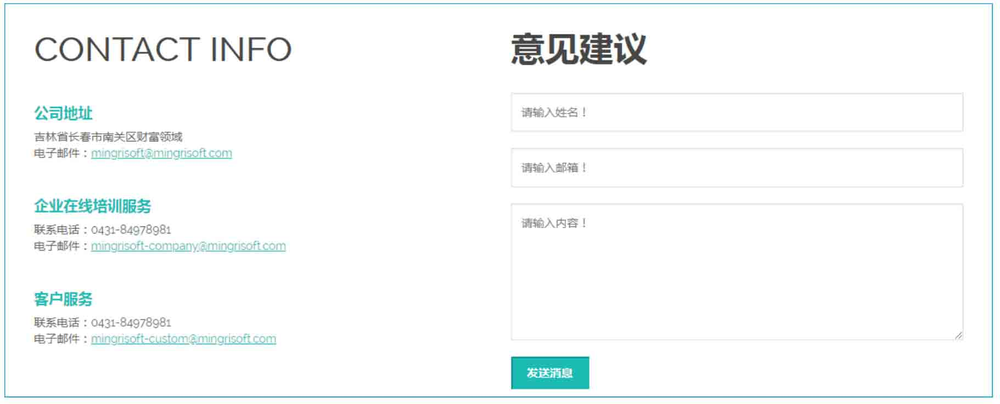

*图22.27 意见建议运行效果*

当用户单击“发送消息”按钮提交表单时，则以POST方式访问路由，执行if语句中的代码。提交表单时，首先要检测表单，在SuggetionForm()类中已经设置了表单数据的验证规则，关键代码如下所示：

&lt;代码位置：资源包\\TM\\sl\\22\\Travel\\app\\Home\\forms.py&gt;

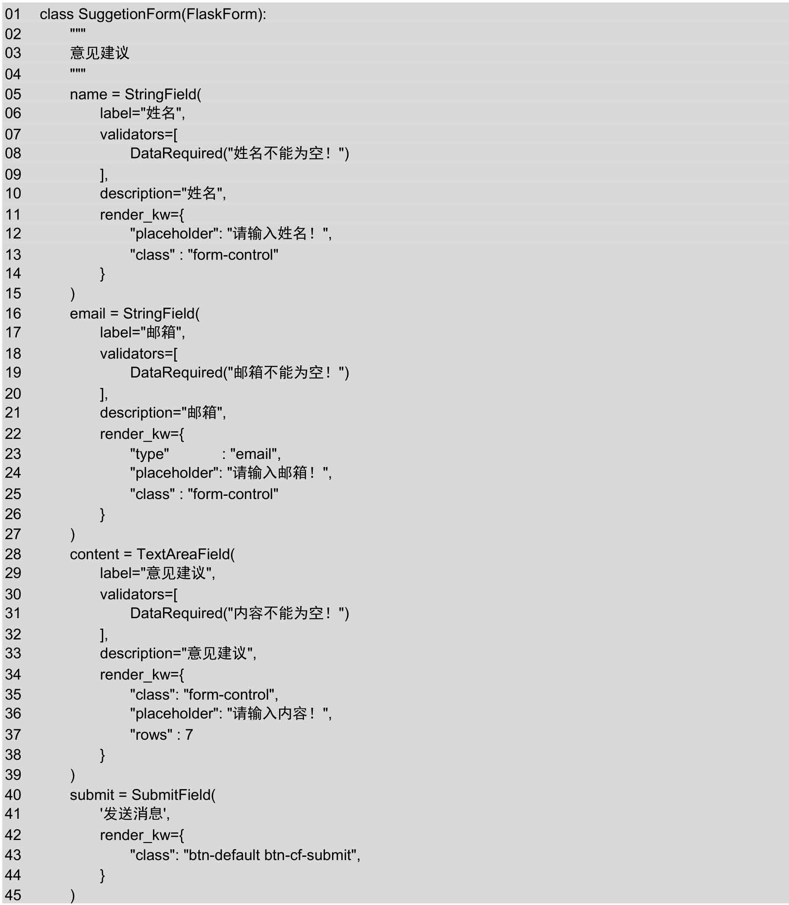

当直接提交表单时，提示错误的验证信息，运行结果如图22.28所示。当填写的信息通过验证时，运行效果如图22.29所示。


*图22.28 表单验证效果*


*图22.29 建议提交成功效果*

<a id="isbn9787302503880_4_22_1_8"></a>

## 22.8 后台模块设计

对于动态网站而言，网站后台起着至关重要的作用，因为我们需要在后台对数据实现增删改查等操作，从而管理所有前台显示的动态数据。e起去旅行网站后台使用了BootStrap主题模板——AdminLTE，页面美观大方，布局合理，可扩展性强。

后台模块包括管理员管理、用户管理、地区管理、景区管理、游记管理和日志管理等。由于篇幅有限，我们重点对景区管理做详细介绍，对于其他管理模块只做简单介绍和效果展示。

<a id="isbn9787302503880_4_22_1_1_18"></a>

### 22.8.1 管理员登录功能实现

在后台登录页面中填写管理员账户和密码，单击“登录”按钮，即可实现管理员登录。如果没有输入账户和密码，单击“登录”按钮时，运行效果如图22.30所示。如果输入一个不存在的账号，单击“登录”按钮时，运行效果如图22.31所示。如果输入正确的账号和密码，则进入后台控制面板页面，运行效果如图22.32所示。

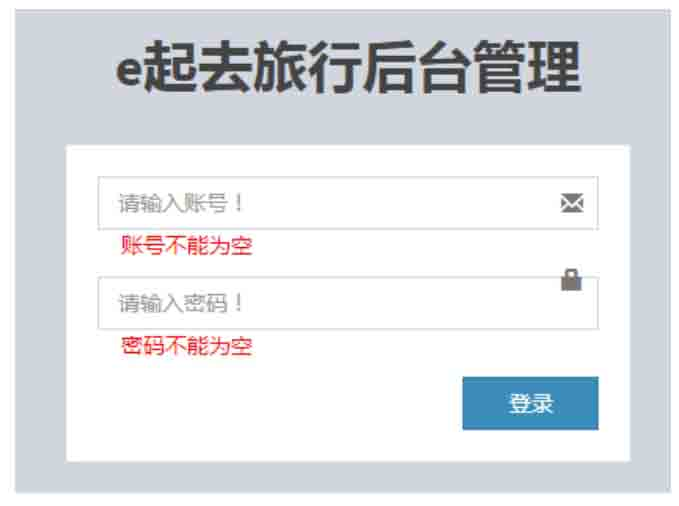

*图22.30 验证是否为空*

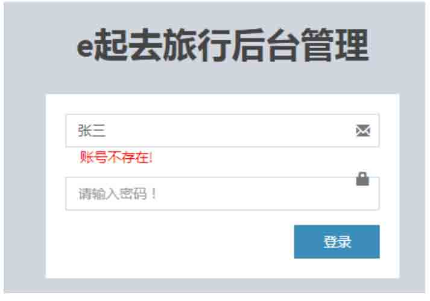

*图22.31 验证账号是否存在*

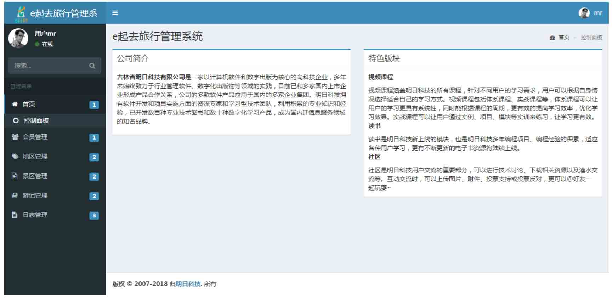

*图22.32 后台控制面板页面效果*

在后台控制面板左侧显示了所有功能菜单，访问每个链接都需有管理员权限，需要判断管理员是否登录，可以定义一个admin\_login()作为装饰器来判断是否登录。关键代码如下：

&lt;代码位置：资源包\\TM\\sl\\22\\Travel\\app\\Admin\\views.py&gt;

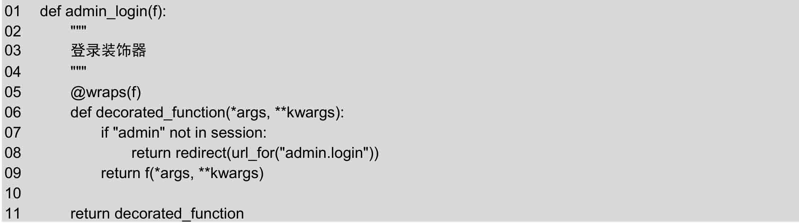

上述代码中，判断session中是否有admin值。如果有，则表示已经登录，否则表示未登录，页面跳转至登录页。

<a id="isbn9787302503880_4_22_1_1_19"></a>

### 22.8.2 景区管理功能实现

景区管理功能作为e起去旅行网站的核心模块，包括新增景区、景区列表、编辑景区、删除景区等功能。下面分别介绍这4个功能。

<a id="isbn9787302503880_4_22_1_1_8_9"></a>

#### 1．新增景区

新增景区页面主要显示景区表单，表单包括的内容及满足条件如下：


 景区名称：输入框，不能为空。


 所述地区：下拉列表，从Area表中筛选数据。


 景区地址：输入框，不能为空。


 星级：下拉列表，1～5级。


 是否推荐：单选按钮，如果设置推荐，将在前台首页推荐景区中显示。


 是否热门：单选按钮，如果设置热门，将在前台首页推荐地区中显示。


 封面：文件域，上传图片格式为jpg或pgn。


 景区简介：文本域，不能为空。


 景区内容：文本编辑器，不能为空。

由于上面字段的验证规则较多，可以使用WTForms扩展方便地实现表单的验证，在后台form.py文件中设置验证规则，关键代码如下：

&lt;代码位置：资源包\\TM\\sl\\22\\Travel\\app\\Admin\\forms.py&gt;

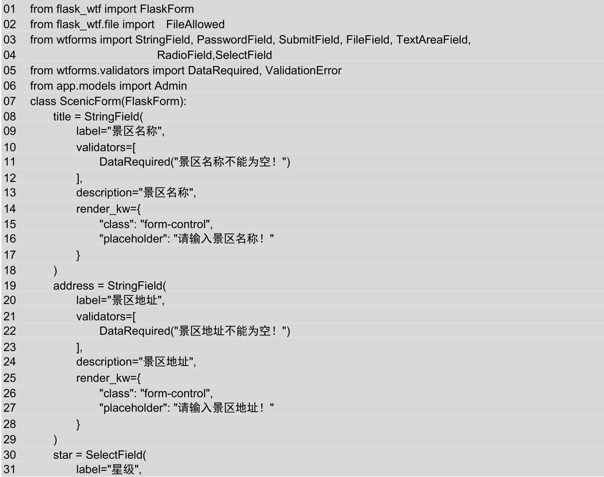

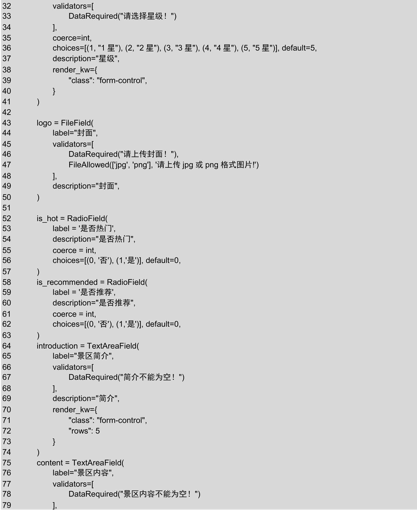

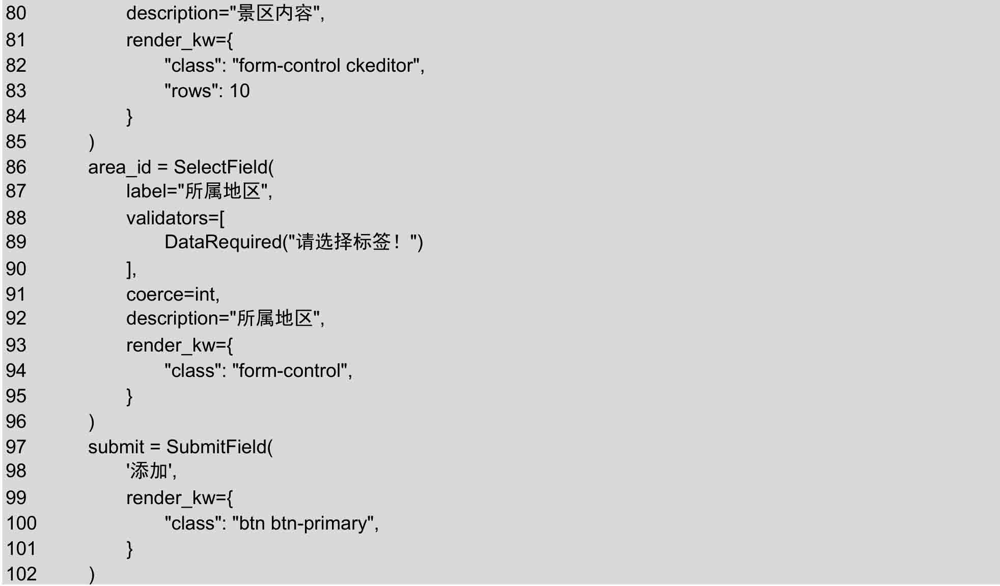

上述代码中，title和address字符串输入框的验证与前台登录注册模块相同。start下拉列表需要设置SelectField()的choices属性，将下拉列表value值和文本写入字典，此外还可以使用default设置默认值。例如，“choices=\[(1, "1星"), (2, "2星"), (3, "3星"), (4, "4星"), (5, "5星")\], default=5,”。

由于设置下拉列表的value值为整型，如“1”表示1星。所以，还要设置一个属性：coerce=int。运行效果如图22.33所示。

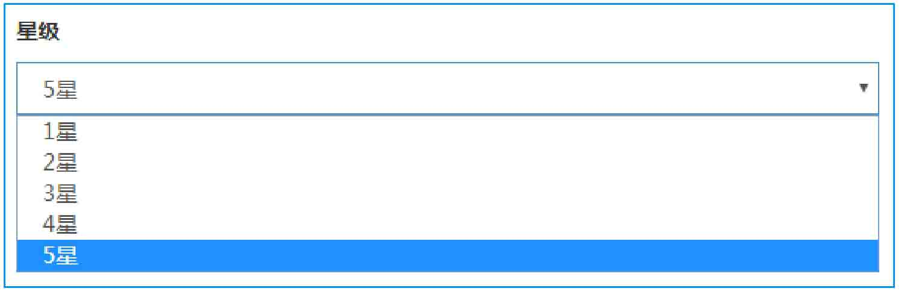

*图22.33 下拉列表运行效果*

logo文件上传框需要设置FileField()的FileAllowed()方法，设置允许上传的文件类型。is\_hot和is\_recommended单选按钮的设置与SelectField()下拉菜单相同。此外，值得注意的是，area\_id也是一个下拉菜单，但是由于地区数据需要从area表中筛选，ScenicForm类中没有设置该属性，后面实例化ScenicForm类后会动态设置。

下面看下路由文件，添加景区方法的关键代码如下：

&lt;代码位置：资源包\\TM\\sl\\22\\Travel\\app\\Admin\\views.py&gt;

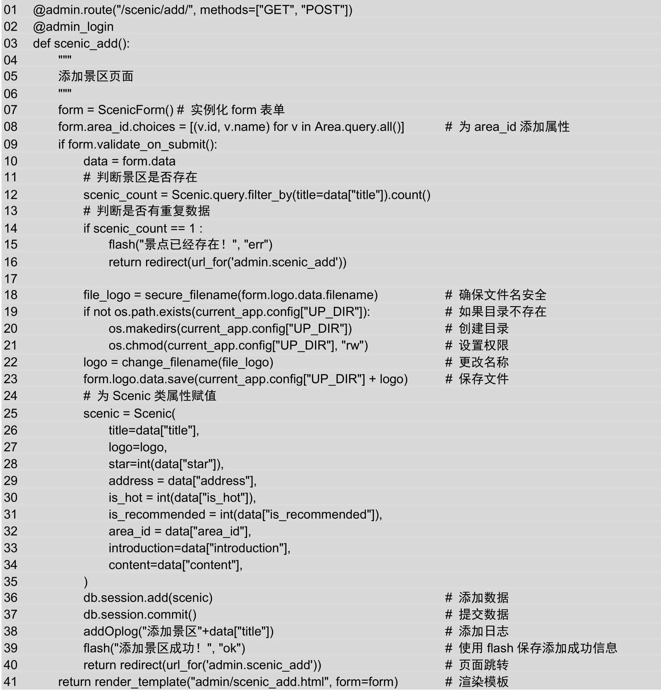

上述代码中，首先实例化ScenicForm表单，然后设置form.area\_id.choices的属性值。这里从area表中获取包含id和name的全部数据，并以列表格式赋值。接下来，判断是否提交表单，如果没有提交表单，只渲染添加景区模板。如果提交表单，则先验证表单数据是否满足条件，验证通过后再执行添加景区的业务逻辑。添加景区时，首先需要根据标题查找scenic表，判断标题是否已经存在，防止重复添加，然后单独处理文件上传内容。主要步骤如下：


 判断文件存储目录是否存在，不存在则创建该目录。


 调用change\_filename()自定义方法创建一个唯一的文件名。


 使用save()方法存储表单。

添加景区模板关键代码如下所示：

&lt;代码位置：资源包\\TM\\sl\\22\\Travel\\app\\Templates\\admin\\scenic\_ add.html&gt;

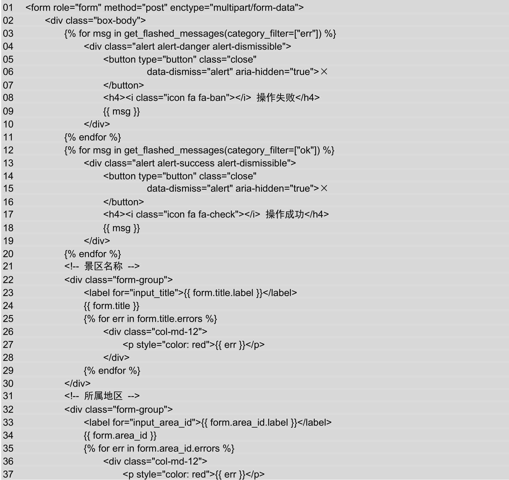

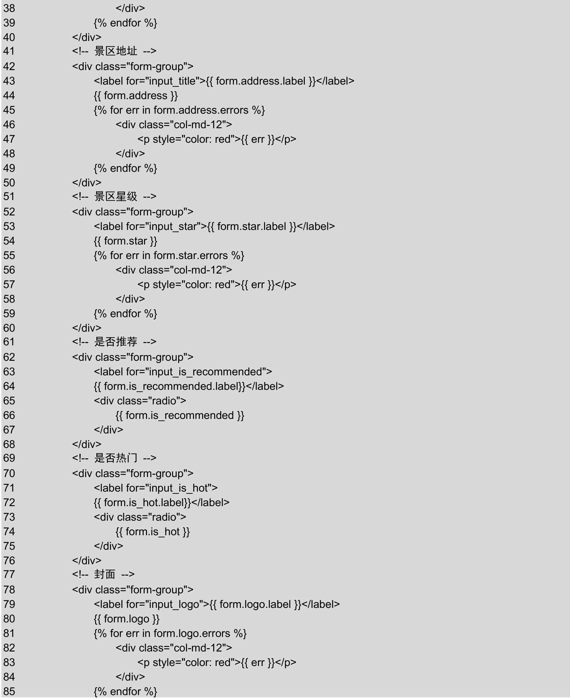

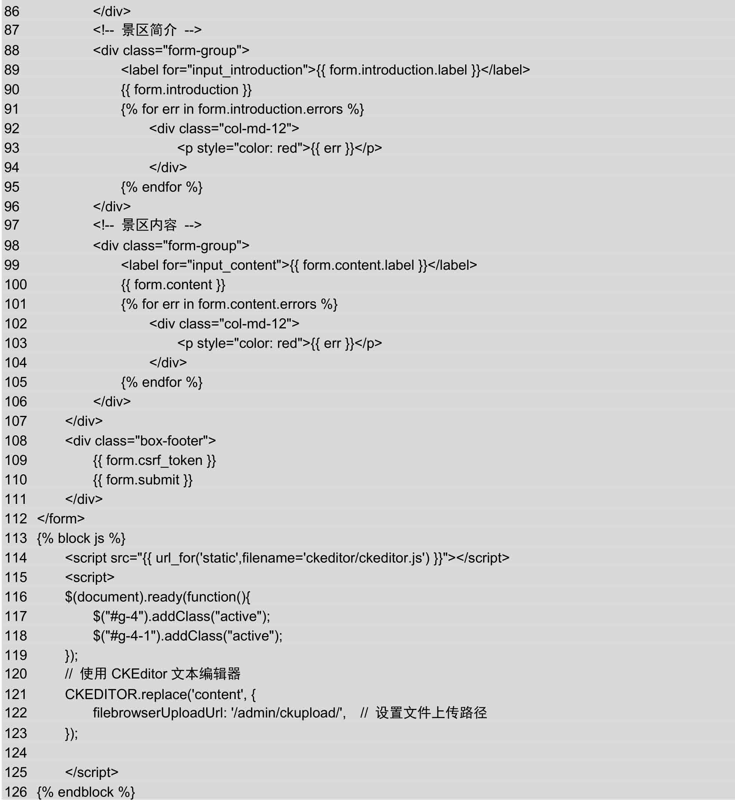

上述代码中，使用了CKEditor文本编辑器替换原来的文本框。首先引入ckeditor.js文件，然后使用CKEDITOR.replace()方法，设置替换的区域以及CKEditor文件上传的路径。运行结果如图22.34所示。

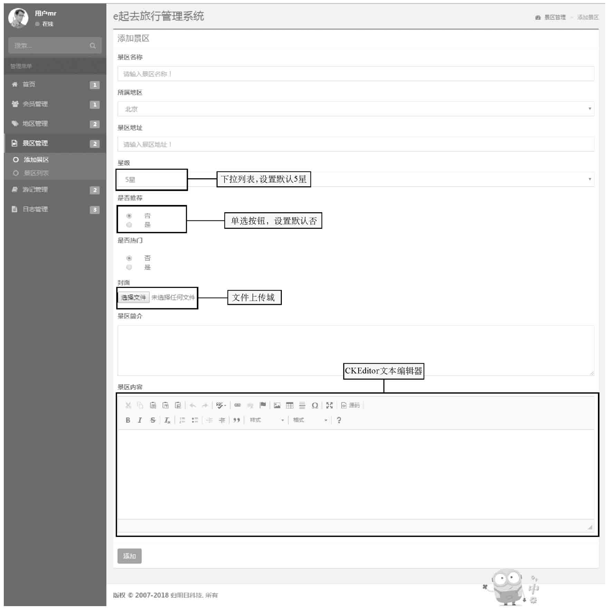

*图22.34 新增景区*

<a id="isbn9787302503880_4_22_1_1_8_10"></a>

#### 2．景区列表

添加完景区，可以在景区列表页中查看添加结果。景区列表路由为“127.0.0.1:5000/admin/scenic/list/”，关键代码如下：

&lt;代码位置：资源包\\TM\\sl\\22\\Travel\\app\\Admin\\views.py&gt;

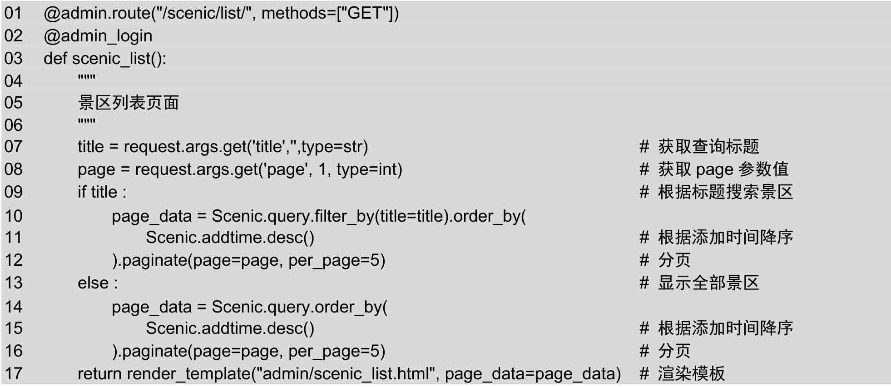

运行结果如图22.35所示。

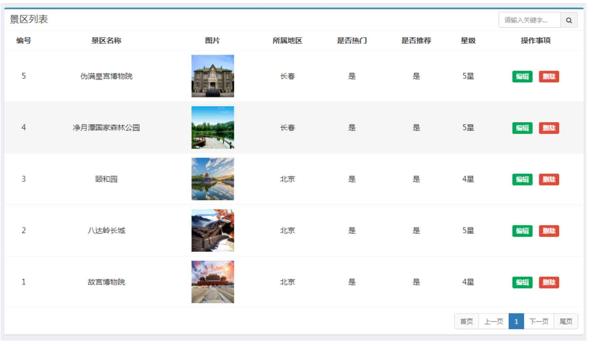

*图22.35 景区列表效果*

<a id="isbn9787302503880_4_22_1_1_8_11"></a>

#### 3．编辑景区

添加完景区后，如果发现填写错误，可以通过编辑景区功能来更改景区信息。编辑景区的路由是“127.0.0.1:5000/admin/scenic/edit/&lt;int:id&gt;/”，关键代码如下：

&lt;代码位置：资源包\\TM\\sl\\22\\Travel\\app\\Admin\\views.py&gt;

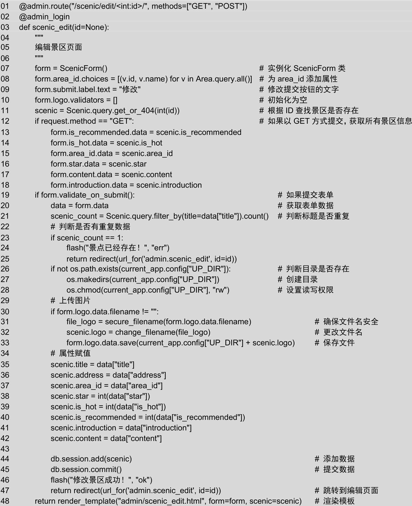

上述代码与新增景区的代码基本相似，这是在渲染模板时要传递当前ID的景区数据。运行结果如图22.36所示。

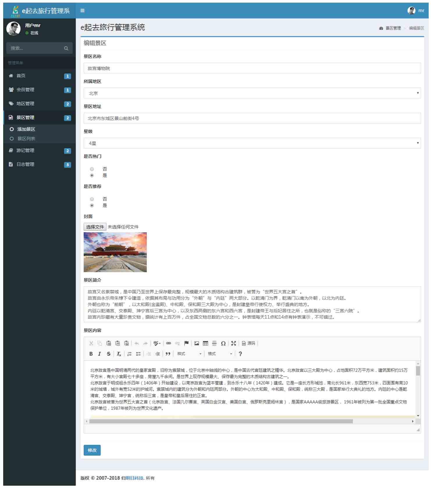

*图22.36 编辑景区页面效果*

<a id="isbn9787302503880_4_22_1_1_8_12"></a>

#### 4．删除景区

当不再需要一个景区时，可以使用删除景区功能。删除景区的路由是“127.0.0.1:5000/admin/scenic/edit/&lt;int:id&gt;/”，关键代码如下：

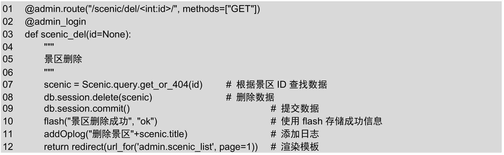

上述代码中，首先查找景区是否存在，如果存在，则使用delete()方法删除景区，然后使用commit()方法提交数据。最后，使用addOplog()自定义方法写入操作日志，记录删除的数据。

<a id="isbn9787302503880_4_22_1_1_20"></a>

### 22.8.3 地区管理功能实现

添加景区时，需要选择所在地区，所以需要在“地区管理”菜单中添加地区。地区管理也包括新增地区、地区列表、编辑地区和删除地区等功能。地区列表运行效果如图22.37所示。

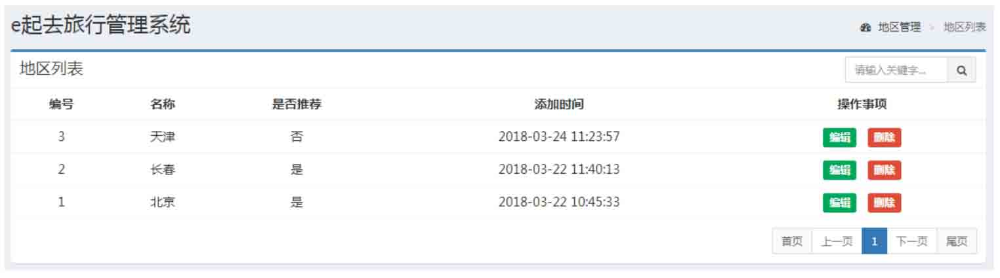

*图22.37 地区列表效果*

<a id="isbn9787302503880_4_22_1_1_21"></a>

### 22.8.4 游记管理功能实现

添加完景区后，可以为景区添加多个游记，这就需要使用游记管理功能。游记管理功能包括新增游记、游记列表、编辑游记和删除游记等。添加游记时，需要选择所属景区，运行效果如图22.38所示。游记列表运行效果如图22.39所示。

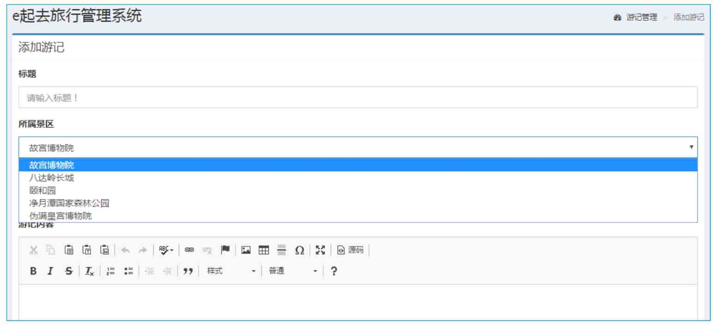

*图22.38 新增游记效果*

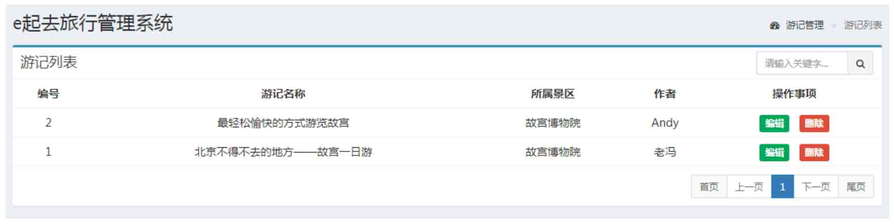

*图22.39 游记列表效果*

<a id="isbn9787302503880_4_22_1_1_22"></a>

### 22.8.5 会员管理功能实现

作为后台管理员，需要知道前台哪些用户注册了网站，这就需要会员管理功能。会员管理功能包括查看会员的列表信息和查看详细信息以及删除会员等功能。会员列表信息如图22.40所示。

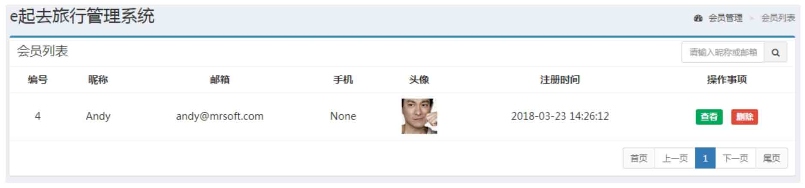

*图22.40 会员列表效果*

如果会员信息较多，在列表中无法全部展示，则可以单击“查看”按钮，查看会员的详细信息，运行效果如图22.41所示。

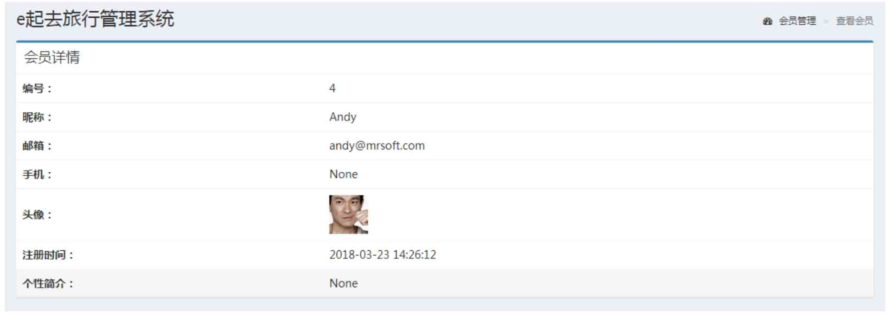

*图22.41 查看详情*

<a id="isbn9787302503880_4_22_1_1_23"></a>

### 22.8.6 日志管理功能实现

日志管理主要记录操作日志相关内容。日志管理包含的功能和作用如下：


 操作日志：主要记录管理员新增和删除地区、景区、游记的操作。


 管理员登录日志：主要记录管理登录后台的信息，包括登录时间和登录IP等。


 会员登录日志：主要记录前台会员登录的信息。

操作日志列表运行效果如图22.42所示。

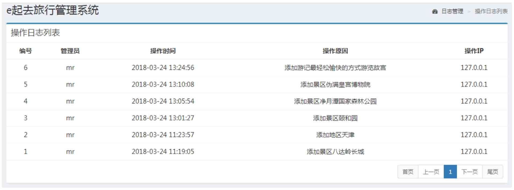

*图22.42 操作日志运行效果*

管理员登录日志运行效果如图22.43所示。

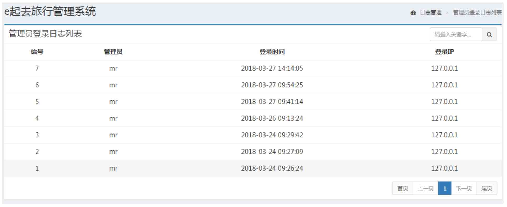

*图22.43 管理员登录日志运行效果*

会员登录日志运行效果如图22.44所示。

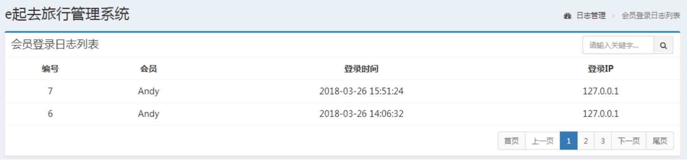

*图22.44 会员登录日志运行效果*

<a id="isbn9787302503880_4_22_1_9"></a>

## 22.9 小结

本章主要介绍了如何使用Flask框架实现e起去旅行项目，包括网站的系统功能设计、数据库设计以及前台和后台的主要功能模块。希望通过本章的学习，读者能够将前面章节所学知识融会贯通，了解项目开发流程，并掌握Flask开发Web技术，为今后项目开发积累经验。
