# Zotero 使用讲义

> **配套资源**
>
> - [观看 Zotero 使用教学视频（哔哩哔哩）](https://www.bilibili.com/video/BV1L6bG6vEA2/)
>
> **内容制作：张衡**

从软件安装、文献抓取与 PDF 阅读到参考文献生成

适用环境
Zotero 9 Windows 版
Edge / Chrome 浏览器
Microsoft Word 桌面版

适用于毕业论文、SCI/SSCI 论文、课程论文、课题申报书及日常科研资料管理。

## 使用说明
本讲义按照 Zotero 的完整工作流程展开：先完成软件、浏览器连接器和必要插件的安装，再从网页与数据库抓取文献，随后进行分组、题录清洗、PDF 阅读和笔记整理，最后在 Word 中插入引文并自动生成参考文献。正文中的操作均以文字讲清楚，可直接独立学习。

**学习建议**：准备一个测试文献库、一篇带 PDF 的中英文文献和一份空白 Word 文档，边阅读边操作。首次练习插件安装、批量删除和解除引文链接时，不要使用唯一的正式论文文件。

不同浏览器、Word 版本和 Zotero 小版本的按钮位置可能略有变化，但菜单名称和操作逻辑基本一致。截图只用于帮助定位功能，实际操作以软件界面为准。

| 章节 | 内容 | 学习重点 |
| --- | --- | --- |
| 01 | 安装与基础设置 | 桌面端、Connector、账户同步、Word 插件和扩展插件 |
| 02 | 界面与文献库结构 | 三区界面、条目、附件、分类、标签和搜索 |
| 03 | 抓取与导入文献 | 网页保存、知网批量抓取、PDF 导入、标识符和题录清洗 |
| 04 | 分组与资料管理 | 分类体系、重复条目、标签、附件关系和研究笔记 |
| 05 | PDF 阅读与批注 | 高亮、下划线、便签、区域、手写、注释面板和笔记 |
| 06 | Word 引文与参考文献 | 插件、样式、插入引文、页码、多篇引文、文献表和更新 |
| 07 | 样式、同步与备份 | CSL 样式、快速复制、同步边界、数据目录和迁移 |
| 08 | 常见问题与工作流 | 抓取失败、插件缺失、乱码、重复、卡顿和全过程检查 |

---

## 01 安装与基础设置
先建立稳定的软件环境，再配置浏览器、同步、Word 和中文文献处理插件。

### 1.1 Zotero 的工作方式
Zotero 同时管理三类对象：**文献题录、附件文件和写作中的引文**。
- 题录保存作者、题名、期刊、年份、卷期、页码和 DOI；
- PDF 作为附件与题录关联；
- Word 插件根据 CSL 样式把题录转换为正文引文和文末参考文献。

理解这三层关系后，后续操作会更加清楚。

Zotero 的优势在于网页抓取、PDF 阅读与批注、跨平台同步、群组文献库和丰富插件。它适合从资料收集一直延伸到论文写作，但**自动抓取并不等于信息绝对准确，导入后的题录仍需人工核对**。

### 1.2 安装桌面端与浏览器连接器

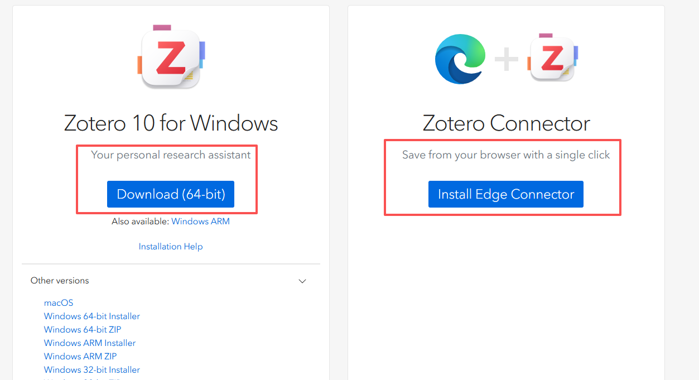

1. **安装桌面端**：在官方下载页面选择 Windows 64‑bit 版本，运行安装程序并保留默认组件。安装完成后先启动 Zotero。
2. **安装 Connector**：根据正在使用的 Edge、Chrome 或 Firefox 安装 Zotero Connector。浏览器右上角出现保存图标后，连接器即已启用。
3. **固定图标**：在浏览器扩展管理中将 Zotero Connector 固定到工具栏，便于观察图标变化和保存状态。

> **版本匹配**：桌面端和 Connector 应保持在相近版本。浏览器更新后若图标消失，先检查扩展是否被关闭，再尝试重新安装。

### 1.3 注册账户与同步
账户用于在多台设备之间同步题录、分类、标签和笔记。注册完成后，在 Zotero 中打开「编辑 → 设置 → 同步」，输入用户名和密码。

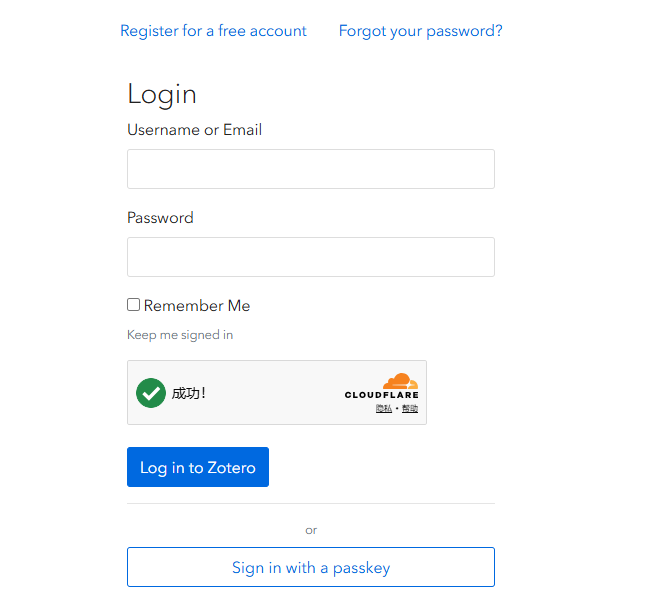

- **数据同步**：同步题录等数据库内容
- **附件同步**：同步 PDF 等文件

> ⚠️ **同步不是备份**：误删或错误修改可能同步到其他设备，因此同步不能代替历史备份。正式项目仍应定期复制数据目录或保留独立备份。

### 1.4 安装和修复 Word 插件
路径：`编辑 → 设置 → 引用 → 文字处理软件 → 重新安装 Microsoft Word 加载项`

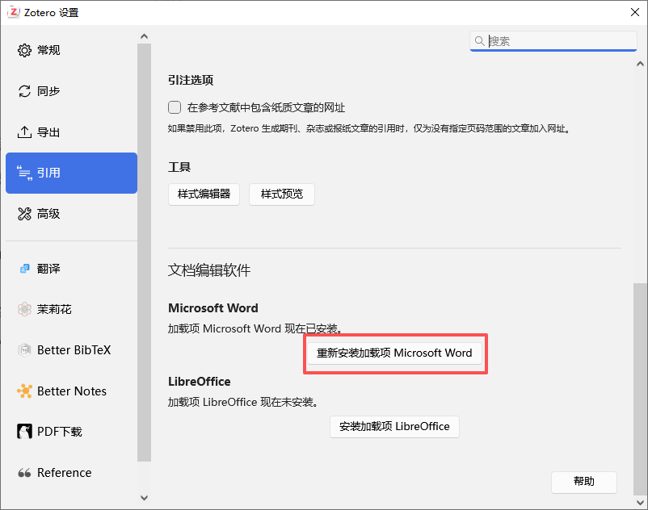

操作要点：
关闭 Word 后执行重新安装，再打开 Word 检查功能区是否出现 Zotero 选项卡。
> 若使用 WPS，兼容性和功能完整度可能低于 Microsoft Word，正式长文档优先使用 Word 桌面版。

### 1.5 安装扩展插件
Zotero 本体已经可以完成大多数任务。插件应围绕明确需求安装，数量过多会增加兼容性风险。讲义使用 Add‑on Market for Zotero 管理插件，并安装 **Jasminum（茉莉花）**辅助中文元数据处理。

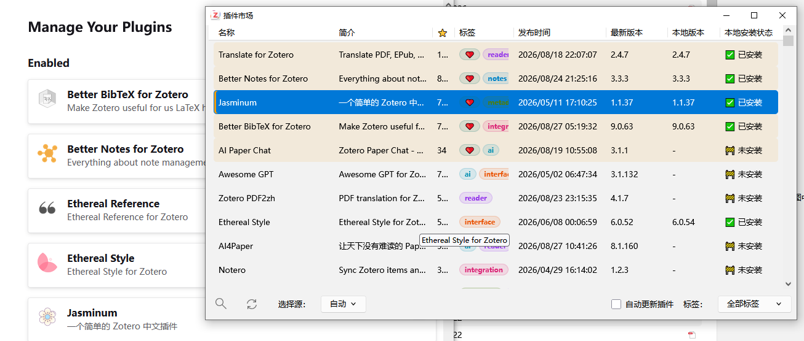

1. 下载插件：确认插件支持当前 Zotero 版本，下载后缀为 `.xpi` 的安装文件。
2. 打开插件管理：进入「工具 → 插件」，将 `.xpi` 拖入窗口，或通过插件窗口菜单选择「从文件安装插件」。
3. 重启并设置：安装后按提示重启 Zotero，再进入插件对应设置页完成配置。插件升级前先查看版本兼容性。

### 1.6 插件安装后的检查
每次安装或升级插件后，先确认 Zotero 能正常启动、条目列表和 PDF 阅读器没有异常，再检查插件设置是否保留。插件只应获取完成其功能所需的权限，涉及翻译、AI 或云端服务时，还应了解文本是否会发送到第三方接口。

|检查项|建议|
| ---- | ---- |
|版本兼容|插件说明中明确支持当前 Zotero 主版本|
|自动更新|重要项目期间避免一次性升级多个插件|
|功能冲突|出现卡顿或按钮异常时逐个停用排查|
|隐私与数据|不向不可信插件提供账号、论文原稿或未公开数据|

---

## 02 界面与文献库结构
掌握左侧组织、中间选择、右侧编辑的基本逻辑，并区分题录、附件和分类。

### 2.1 主界面的三个区域

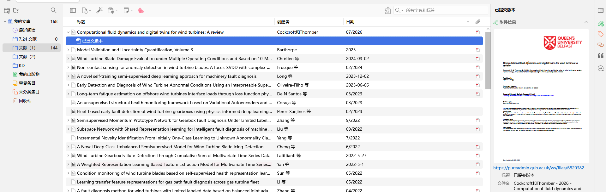

- **左侧栏**：显示「我的文库」、分类、群组文库和标签；
- **中间列表**：显示当前范围内的文献条目；
- **右侧信息栏**：用于查看和修改题录字段、附件、笔记、标签与关联。

双击 PDF 附件后会进入内置阅读器。

### 2.2 条目与附件的关系
| 对象 | 常见图标与内容 | 操作原则 |
| --- | --- | --- |
| 父条目 | 期刊论文、图书、学位论文、网页等题录 | 引用时通常引用父条目；作者、题名、年份等应在父条目中维护 |
| PDF 附件 | 位于父条目下方的文件 | 用于阅读和批注，不应把文件名当作完整题录 |
| 网页快照 | 保存网页当时的离线副本 | 适合网页资料留档，但可能增加存储占用 |
| 笔记 | 独立笔记或条目笔记 | 记录阅读摘要、观点、方法和待处理事项 |

### 2.3 分类不是文件夹复制
同一条文献可以同时放入多个分类，但文献库中只有一条原始记录。将条目从一个分类拖到另一个分类**不会复制 PDF，也不会增加重复题录**。
- 删除分类只删除组织结构；
-「从分类中移除」与「移到回收站」不是同一操作。

### 2.4 常用入口
|入口|作用|适用场景|
| ---- | ---- | ---- |
|最近阅读|快速回到近期打开的文献|连续阅读与批注|
|我的出版物|管理本人公开作品|个人成果展示|
|重复条目|识别并合并重复题录|多来源导入后清理|
|未分类条目|查找尚未放入任何分类的记录|定期整理文献库|
|回收站|恢复或彻底删除条目|误删检查|

---

## 03 抓取与导入文献
从网页、数据库和本地文件获得题录与 PDF，并在导入后立即核对元数据。

### 3.1 识别 Connector 图标
Connector 会根据当前页面改变图标：
- 普通网页：网页图标
- 单篇论文：文献类型图标
- 检索结果页：文件夹图标
- PDF 页面：PDF 图标

点击后可选择保存到哪个分类，并决定是否保存快照或全文。

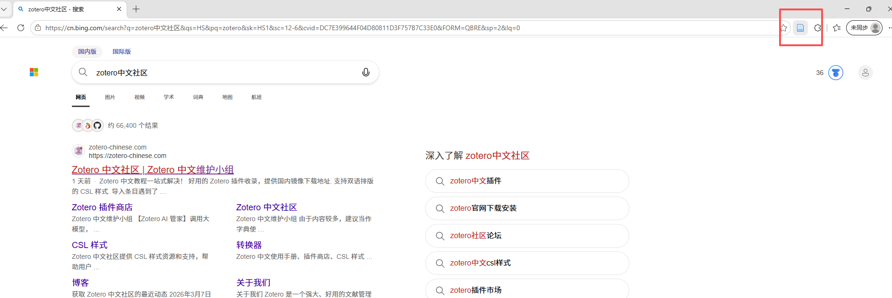

操作步骤：
1. 打开 Zotero：抓取前保持 Zotero 桌面端运行，可减少通信失败。
2. 检查图标：等待网页加载完成，确认 Connector 已识别页面类型。
3. 选择分类：点击图标后在弹出窗口中选择目标分类；保存完成后回到 Zotero 核对题录和附件。

### 3.2 保存单篇网页文献
在论文详情页点击 Connector，Zotero 会读取页面中的题名、作者、来源、日期等元数据，并在权限允许时下载 PDF。
> 保存后不要只看标题是否出现，还要检查**文献类型、作者顺序、期刊、年份、卷期、页码和 DOI**。

### 3.3 从检索结果批量保存
检索结果页出现文件夹图标时，点击后会弹出条目选择列表。勾选真正需要的文献，**不建议一次抓取整个结果页**；批量过大容易触发网站限制，也会把大量低相关文献带入文献库。

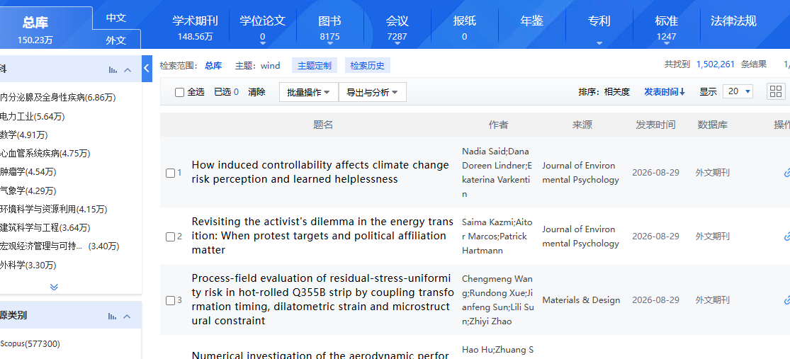

> **中文数据库注意事项**：数据库页面结构变化、校园代理和访问权限都可能影响抓取。抓取失败时，可改用数据库导出的 RIS、EndNote 或 BibTeX 文件，或先下载 PDF 再在 Zotero 中识别。

### 3.4 导入本地 PDF
将 PDF 拖到文献列表空白区域，会生成独立附件；右键选择「检索 PDF 元数据」可尝试建立父条目。
> 若已经存在正确题录，应把 PDF 拖到该父条目上，使其成为附件，避免再生成一条重复记录。

扫描版、网页打印版、没有 DOI 的中文 PDF 或首页信息不完整的文件，识别成功率较低。此时应手动建立父条目，或通过数据库导入题录后再附加文件。

### 3.5 通过标识符添加
工具栏的魔术棒按钮可以通过 **DOI、ISBN、PMID 或 arXiv ID** 建立条目。一次可粘贴多个标识符，每行一个。该方法适合已知精确编号但没有打开数据库页面的情况。

> 工具栏「通过标识符添加条目」→ 输入 DOI / ISBN / PMID / arXiv ID →确认

### 3.6 导入题录文件
| 来源格式 | 常见后缀 | 导入方法 |
| --- | --- | --- |
| RIS | .ris | 文件 → 导入，或直接拖入 Zotero |
| BibTeX | .bib | 适合 LaTeX 项目和数据库导出 |
| EndNote XML / Refer | .xml / .enw | 从其他文献管理器或中文数据库迁移 |
| Zotero RDF | .rdf | 保留较多 Zotero 结构信息 |

### 3.7 导入后的题录清洗
| 文献类型 | 重点字段 |
| --- | --- |
| 期刊文章 | 作者、题名、期刊、年份、卷、期、页码、 DOI |
| 学位论文 | 作者、题名、学位类型、学校、地点、年份 |
| 会议论文 | 作者、题名、会议名称、地点、论文集、页码、年份 |
| 网页 | 作者或机构、网页标题、网站名称、日期、 URL 、访问日期 |
| 图书章节 | 章节作者、章节题名、编者、书名、出版社、页码、年份 |

> **清洗原则**：先确认条目类型，再检查字段。条目类型错误会导致输出模板选错，即使字段内容看似完整，最终参考文献仍可能错误。

---

## 04 分组与资料管理
建立可持续的分类体系，用标签和笔记补充分类，而不是重复创建条目。

### 4.1 创建分类与子分类
点击左上角新建分类按钮，或右键「我的文库」创建分类；在已有分类上右键可创建子分类。分类名称应服务于检索和写作，避免同时混用太多维度。

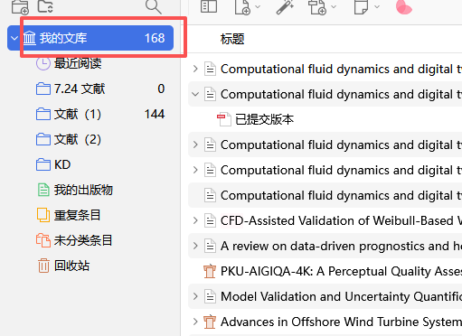

> 推荐按论文结构或研究任务建立一级分类，例如：`理论基础、研究方法、变量关系、数据来源、待引用、已引用`。
> 年份、语言、重要程度等更适合用标签或搜索条件管理。

### 4.2 将文献放入分类

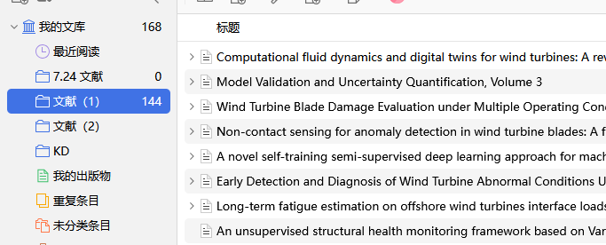

在中间列表中选中文献后拖到左侧分类即可。
- 按住 `Ctrl` 可多选不连续条目
- 按住 `Shift` 可连续选择

条目进入分类后仍保留在「我的文库」中；**同一条目可被拖入多个分类**。

### 4.3 标签与颜色
标签适合跨分类描述主题、方法、状态和用途。可以建立少量稳定标签，如`核心文献、待读、已精读、方法参考、数据来源、待核查、返修补充`。重要标签可分配颜色和数字快捷键，便于快速标记。

| 标签示例 | 含义 | 建议用法 |
| --- | --- | --- |
| 核心文献 | 理论或证据不可替代 | 少量使用，避免所有文献都变成核心 |
| 待读 / 已精读 | 阅读进度 | 与最近阅读配合 |
| 方法参考 | 量表、模型、统计方法 | 写方法部分时集中检索 |
| 待核查 | 题录、数据或结论尚未确认 | 核对后及时移除 |
| 已引用 | 已经进入论文正文 | 投稿前用于交叉核对 |

### 4.4 重复条目的合并
进入「重复条目」，选择同一文献的多条记录后使用右侧合并功能。
> 合并时应选择字段最完整的一条作为主记录，并确认 PDF、笔记、标签和分类均被保留。**不要直接批量删除重复项**，否则可能删除 Word 正在引用的记录。

### 4.5 附件与文件命名
PDF 可以由 Zotero 管理为内部存储附件，也可以链接到外部文件。普通用户优先使用内部存储，迁移和同步更稳定。
> 统一文件名可采用「作者‑年份‑简短题名」，但真正用于引用的是父条目字段，而不是 PDF 文件名。

### 4.6 研究笔记模板
> **推荐笔记结构**
> 研究目的:
> 样本与数据:
> 核心变量:
> 研究方法:
> 主要结论:
> 理论贡献:
> 局限性:
> 可用于论文的章节:

条目笔记适合记录单篇文献，独立笔记适合跨文献主题整理。
> 写作时应把**原文摘录**和**自己的理解**明确区分，避免后期无法判断文字来源。

---

## 05 PDF 阅读与批注
用统一的批注规则把阅读结果转化为可检索、可回到原文、可进入写作的笔记。

### 5.1 打开内置阅读器
双击条目下的 PDF 附件即可在 Zotero 标签页中打开。顶部是批注工具，左侧可显示缩略图或大纲，右侧可显示条目信息和注释列表。阅读进度会保留，便于下次继续。

### 5.2 文本高亮与下划线

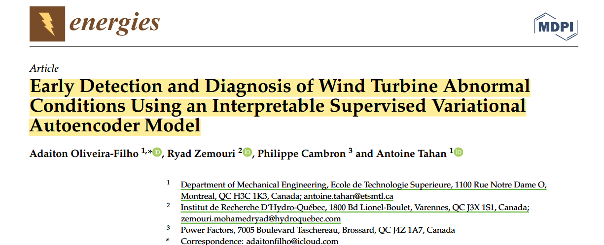

选中文本后可选择高亮或下划线，并设置颜色。
- 高亮适合保留完整观点
- 下划线适合标记概念、变量或术语

点击已创建的批注可增加评论、标签或修改颜色。

### 5.3 区域与手写批注

- **区域批注**：可截取图表、公式或扫描页面的一部分，适合无法直接选中文字的内容；
- **手写工具**：适合圈画、箭头和简短标记。手写应克制使用，过多涂画会降低页面可读性。

### 5.4 建立颜色规则
| 颜色用途 | 建议含义 |
| --- | --- |
| 黄色 | 研究问题、核心观点或结论 |
| 蓝色 | 理论、概念和变量定义 |
| 绿色 | 研究方法、样本和数据 |
| 紫色 | 可直接用于文献综述的证据 |
| 红色 | 质疑、冲突、错误或需要核查 |

> 颜色规则不需要追求复杂，关键是同一项目保持一致。若不同论文项目含义不同，应在项目笔记首页记录颜色说明。

### 5.5 注释面板与笔记
注释列表可以按颜色、标签和页面快速定位。选择批注后添加到笔记，Zotero 会保留原文摘录、页码和返回 PDF 的链接。
> 整理笔记时应补充自己的解释和用途，而不是只堆积原文。

### 5.6 从批注走向写作
1. **完成阅读**：用高亮和评论记录关键内容，不在正文外另建无法回溯来源的零散摘抄。
2. **生成条目笔记**：将重要批注加入笔记，按研究问题或论文结构排序。
3. **补充解释**：在每段摘录后写明「说明什么、支持哪一节、与哪些研究一致或冲突」。
4. **进入写作**：根据笔记回到原文核查语境，再通过 Word 插件插入正式引文。

---

## 06 Word 引文与参考文献
选择正确样式，在动态引文状态下完成插入、编辑、更新和文献表生成。

### 6.1 认识 Word 工具栏
|按钮|作用|
| ---- | ---- |
|Add/Edit Citation|插入新引文或编辑光标所在引文|
|Add/Edit Bibliography|插入或更新文末参考文献表|
|Document Preferences|选择当前文档使用的引用样式和语言|
|Refresh|重新读取 Zotero 数据并刷新全部引文|
|Unlink Citations|把动态引文转换为普通文本，通常不可逆|

### 6.2 设置文档样式

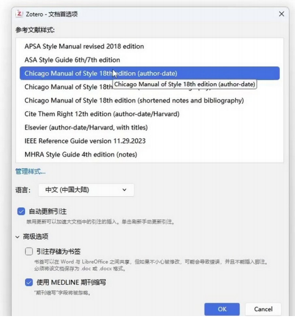

点击 `Document Preferences`，选择期刊、学校或国家标准要求的样式，并设置语言。
- 数字编号制：会按首次出现顺序编号
- 著者‑年份制：通常按作者和年份显示

更换样式后，已有引文和参考文献会自动重排。

### 6.3 安装缺少的 CSL 样式

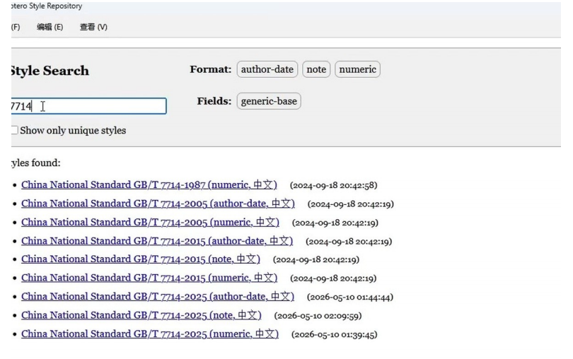

Zotero路径：`编辑 → 设置 → 引用 → 样式 → 获取更多样式 / “+”安装本地 .csl`

> GB/T 7714 常见有**数字制**和**著者‑年份制**两个版本，应按学校或期刊要求选择。样式名称相近并不代表细节完全一致，定稿前仍需核对作者缩写、文献类型标识、标点、页码和 DOI。

### 6.4 插入第一条引文

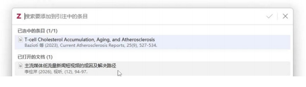

1. **放置光标**：将光标放到需要引文的位置，点击 `Add/Edit Citation`。

2. **检索文献**：在快速格式栏输入作者、题名或年份，选择正确条目。

3. **确认插入**：按 Enter 完成插入。Zotero 会按当前样式显示编号或作者‑年份。

   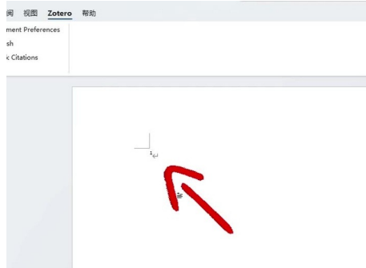

### 6.5 同一位置插入多篇文献
在快速格式栏中依次搜索并选择多条记录，再按 Enter。Zotero 会根据样式自动排序和合并，例如显示为`[1‑3]`或`(Wang, 2023; Li, 2024)`。
> ❗不要在 Word 中手工改编号。

### 6.6 添加页码、前缀和后缀
在快速格式栏中点击已选中的引文气泡，可设置页码或其他定位符，也可添加前缀、后缀并隐藏作者。直接引用原文时应根据所用样式填写具体页码。

### 6.7 生成参考文献表

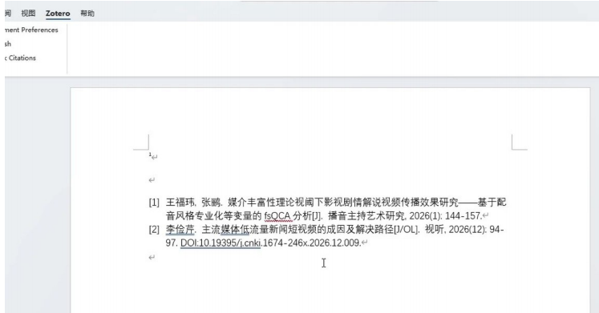

将光标放在文末参考文献位置，点击 `Add/Edit Bibliography`。
> 文献表只包含当前文档中实际引用的条目；新增、删除或移动正文引文后，Zotero 会自动更新编号和文献表。

### 6.8 刷新与修改
发现作者、题名或 DOI 错误时，**应回到 Zotero 修改父条目，再点击 Word 中的 Refresh**。
> ❗不要直接改动态参考文献文字，因为刷新后手工修改可能被覆盖。

### 6.9 解除引文链接
> ✅正确做法：先另存一份 Word 副本，再在副本中点击 `Unlink Citations`。

解除后引文和参考文献变为普通文本，无法继续由 Zotero 自动更新。
- **动态版**：用于继续修改
- **纯文本版**：用于特定投稿或终稿排版

---

## 07 样式、同步与备份
掌握文献快速输出、数据目录备份和跨设备迁移，避免把同步误当成备份。

### 7.1 不进入 Word 也能生成参考文献
在 Zotero 中选择一条或多条文献，右键「由所选条目创建参考文献表」，选择样式、语言和输出方式，可复制到剪贴板、保存为 RTF/HTML 或生成参考文献列表。
> 该功能适合邮件、申报书和临时材料，**不适合替代论文中的动态引文管理**。

### 7.2 快速复制
在「编辑 → 设置 → 导出」中设置默认输出样式后，可以使用快捷复制把格式化引文或参考文献拖入其他应用。
> 正式论文仍建议通过 Word 插件插入，以便后续自动更新。

### 7.3 同步的范围
| 内容 | 是否通常同步 | 说明 |
| --- | --- | --- |
| 题录、分类、标签、笔记 | 是 | 属于数据同步 |
| PDF 与其他附件 | 取决于文件同步设置和容量 | 可使用 Zotero 存储或 WebDAV |
| 本地链接文件 | 通常否 | 链接路径依赖本机目录 |
| 插件与插件设置 | 通常不会完整同步 | 新电脑需重新安装和配置 |
| Word 文档 | 否 | 需通过云盘或文件系统单独管理 |

### 7.4 数据目录备份
路径：`编辑 → 设置 → 高级 → 文件和文件夹 → 数据目录位置`

1. **关闭 Zotero**：备份前退出程序，确保数据库文件已经写入完成。
2. **复制整个目录**：保留 `zotero.sqlite`、`storage` 文件夹及其他相关文件，不要只复制 PDF。
3. **按日期命名**：例如 `Zotero_Backup_2026‑07‑14`，并至少保留近期多个版本。
4. **验证恢复**：在备用位置测试能否看到条目数量、分类、笔记和附件。

### 7.5 更换电脑
1. 优先在旧电脑完成同步和本地备份；
2. 在新电脑安装相同主版本与 Connector，登录同步账户，等待数据和附件完成同步；
3. 再安装必要插件并检查 Word 加载项。

> 若使用本地备份迁移，应在 Zotero 关闭状态下复制数据目录。

### 7.6 项目归档
论文投稿或毕业时，应同时保留：
- Zotero 数据目录备份
- 动态引文 Word 文件
- 解除链接后的投稿文件
- 最终 PDF
- 使用的 CSL 样式

> 这样即使以后更换电脑或样式下架，也能恢复当时的写作环境。

---

## 08 常见问题与推荐工作流
用系统排查代替反复重装，并在投稿前完成题录、引文和附件的交叉检查。

### 8.1 Connector 图标不见了
1. 检查扩展：在浏览器扩展管理中确认 Zotero Connector 已启用。
2. 固定图标：从扩展菜单将图标固定到工具栏。
3. 重启连接：关闭浏览器和 Zotero 后重新打开。
4. 重新安装：仍无效时卸载 Connector，再从官方页面安装与浏览器匹配的版本。

### 8.2 网页抓取失败或只保存快照
先确认 Zotero 已打开、网页已完全加载、浏览器允许扩展访问当前网站。
> 中文数据库抓取失败时，可使用 RIS/EndNote 导出文件，或下载 PDF 后手动附加。抓取成功但无 PDF，通常与机构权限、站点限制或全文链接结构有关。

### 8.3 中文题录不完整或乱码
检查条目类型和字符编码，优先从数据库重新导入；Jasminum（茉莉花）可辅助部分中文 PDF 的元数据抓取和中文转换器管理，但插件不能替代人工核对。
> 作者、期刊、卷期、页码和 DOI 是最需要检查的字段。

### 8.4 Word 中没有 Zotero 选项卡
1. 关闭 Word：确保 `WINWORD.EXE` 没有在后台运行。
2. 重新安装加载项：在 Zotero 设置的「引用 → 文字处理软件」中点击重新安装。
3. 检查 Word 加载项：进入「文件 → 选项 → 加载项」，查看模板和已禁用项目。
4. 检查安全软件：受控文件夹和安全策略可能阻止模板写入 Word 启动目录。

### 8.5 引文或参考文献没有更新
1. 点击 `Refresh`；
2. 确认当前文档仍为动态引文，没有在副本中解除链接；
3. 检查 Zotero 是否正在运行；
4. 若只修改了 Word 中显示文字，应撤销手工修改并回到 Zotero 字段中更正。

### 8.6 同一文献被编号两次
通常是文献库中存在两个不同条目。
> 进入「重复条目」合并记录，再在 Word 中删除错误引文并重新插入正确记录。仅仅让两条记录的标题相同，并不会让 Word 认为它们是同一条文献。

### 8.7 推荐的完整工作流
| 阶段 | 主要操作 | 检查点 |
| --- | --- | --- |
| 1. 建库 | 安装桌面端、Connector、Word 插件，登录同步 | 版本匹配；创建测试分类 |
| 2. 收集 | 从数据库或网页抓取，导入 RIS/PDF/DOI | 题录类型和 PDF 是否正确 |
| 3. 清洗 | 核对作者、题名、来源、年份、卷期、页码、 DOI | 去重；统一期刊和作者写法 |
| 4. 组织 | 分类、标签、相关条目和阅读状态 | 分类维度不要混乱 |
| 5. 阅读 | 高亮、评论、区域批注、条目笔记 | 摘录能回到原页；区分原文与观点 |
| 6. 写作 | 选择 CSL 样式，通过 Word 插入动态引文 | 不手工改编号和动态文献表 |
| 7. 核对 | 刷新、交叉检查正文与文末、验证 DOI | 每条正文引文有文献；文末无孤立记录 |
| 8. 归档 | 备份数据目录，保留动态版与投稿版 | 解除链接只在副本中进行 |

### 8.8 投稿前最终检查
| 检查项目 | 应达到的状态 |
| --- | --- |
| 正文与文末对应 | 正文每条引文均有文献；文献表每条均在正文出现 |
| 题录真实性 | 作者、题名、年份、期刊、卷期页码与原始文献一致 |
| DOI 与 URL | DOI 可解析；网页访问日期符合期刊要求 |
| 重复与版本 | 无重复记录；预印本已替换为正式发表版本时信息已更新 |
| 格式细节 | 作者缩写、et al.、标点、斜体、编号和排序符合目标规范 |
| 文件版本 | 动态版可继续编辑；投稿版已备份且不覆盖唯一原稿 |

> **把 Zotero 用成一套工作流**
> 准确题录是基础，稳定分类是秩序，阅读笔记是积累，动态引文是写作接口，定期备份是最后的安全线。
>
> **收集 → 清洗 → 组织 → 阅读 → 笔记 → 引用 → 核对 → 归档**
