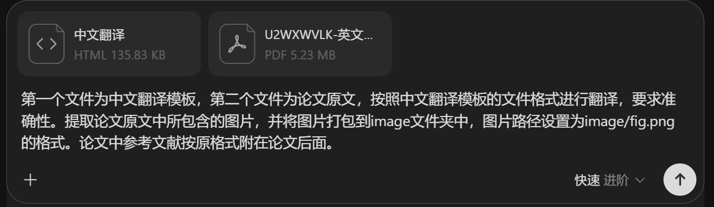
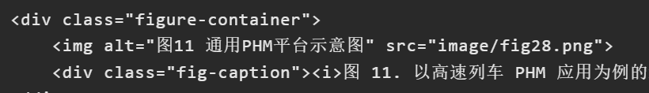
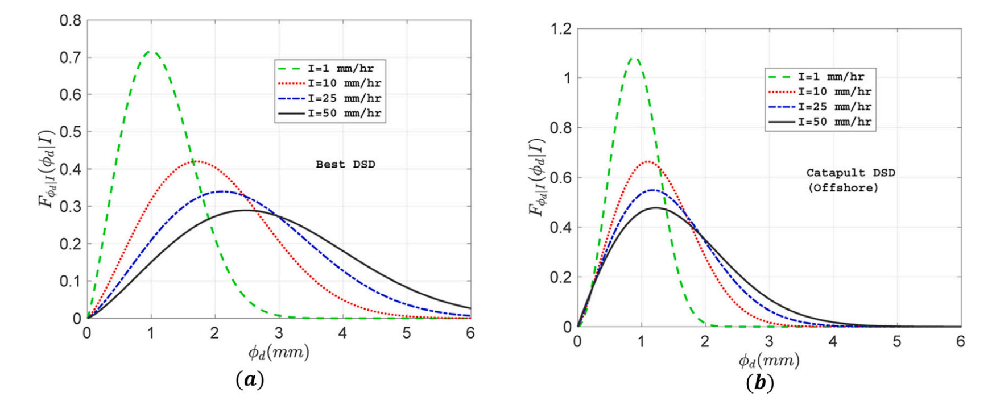
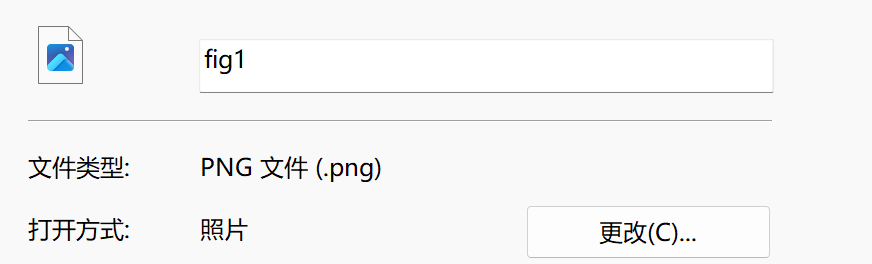
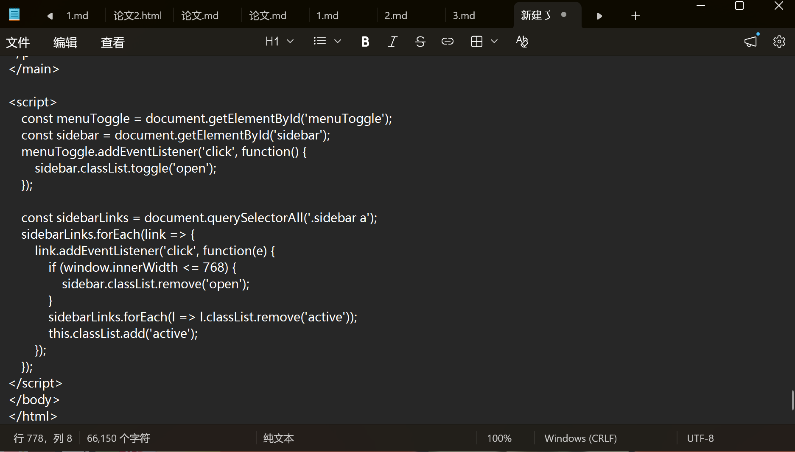
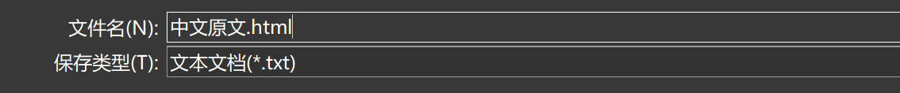

# 使用 Kimi 翻译论文与术语整理指南

> **配套资源**
>
> - [播放课程视频：使用 Kimi 翻译论文（哔哩哔哩）](https://www.bilibili.com/video/BV1JmtU6kE9T/)
>
> **内容制作：李东**

## 步骤一：使用 AI 工具翻译论文

利用 AI 工具，将**论文翻译参考模板**和**论文原文**提供给 AI，输入**提示词**。



**可参考的提示词：**

> 第一个文件为中文翻译模板，第二个文件为论文原文，按照中文翻译模板的文件格式进行翻译，要求准确性。提取论文原文中所包含的图片，并将图片打包到 image 文件夹中，图片路径设置为 `image/fig.png` 的格式。论文中参考文献按原格式附在论文后面。



## 步骤二：检查图片路径

检查 AI 输出的 **HTML 代码**中图片设置的路径是否正确。


## 步骤三：截取论文图片并保存

1. 在桌面创建一个 `image` 文件夹。
2. 打开论文原文，找到论文图片的位置进行截图。

例如：



3. 只需截取图片部分，将该图片保存到 `image` 文件夹中，并将图片命名为 `fig_N.png` 格式（`N` 处填写图片序号）。



## 步骤四：生成 HTML 文件

1. 将 AI 输出的代码粘贴到文本文件中。





2. 以 `.html` 格式保存。

## 步骤五：生成 Markdown 文件

将生成的 **HTML 文档**再次提供给 AI，让其输出为 **Markdown 文件**。按照与步骤四相同的操作，以 `.md` 格式保存。

---

## 操作流程总览

```text
论文原文 + 翻译参考模板
        │
        ▼
  AI 翻译（输入提示词）
        │
        ▼
  检查 HTML 中图片路径
        │
        ▼
  截图保存图片（image/fig_N.png）
        │
        ▼
  保存为 HTML 文件（.html）
        │
        ▼
  AI 转换并保存为 Markdown 文件（.md）
```

---

## 术语表

本表对上述文档中涉及的术语进行统一规范，确保文档表述一致。

| 序号 | 统一术语 | 英文 / 规范写法 | 原文中出现的变体 | 说明 |
| :--: | :------- | :-------------- | :--------------- | :--- |
| 1 | AI 工具 | AI tool | ai 工具、ai | 指用于翻译和格式转换的人工智能工具。统一使用大写 "AI"。 |
| 2 | 论文原文 | original paper | 论文原文 | 待翻译的原始论文文件，通常作为第二个输入文件提供给 AI。 |
| 3 | 中文翻译模板 | Chinese translation template | 论文翻译的参考模板、中文翻译模板 | 规定译文格式的参考文件，作为第一个输入文件提供给 AI。 |
| 4 | 提示词 | prompt | 提示词 | 输入给 AI 的指令文本，用于说明翻译格式、图片提取等要求。 |
| 5 | HTML 代码 | HTML code | html 代码 | AI 翻译后输出的网页代码。统一使用大写 "HTML"。 |
| 6 | HTML 文档 | HTML file | html 文档 | 将 HTML 代码粘贴至文本文件后，以 `.html` 扩展名保存得到的文件。 |
| 7 | Markdown 文件 | Markdown file | markdown 文件 | 由 HTML 文档经 AI 转换得到、以 `.md` 扩展名保存的文件。统一使用首字母大写 "Markdown"。 |
| 8 | 图片文件夹 | `image` folder | image 的文件夹、image 文件夹 | 在桌面创建的用于存放论文图片的文件夹，统一命名为 `image`。 |
| 9 | 图片文件命名 | `fig_N.png` | fig_.png（下划线处填序号） | 图片统一命名规则：`fig_` + 序号 + `.png`，如 `fig_1.png`、`fig_2.png`。 |
| 10 | 图片路径 | `image/fig.png` | image/fig.png | HTML / Markdown 中引用图片的相对路径格式，指向图片文件夹中的对应图片。 |
| 11 | 截图 | screenshot | 截图 | 从论文原文中截取图片的操作，只需截取图片本体部分。 |
| 12 | 文本文件 | text file (`.txt`) | 文本文件 | 用于临时存放 AI 输出代码的纯文本文件。 |
| 13 | 参考文献 | references | 参考文献 | 论文末尾的引用文献列表，翻译时按原格式附在译文后面。 |

### 使用规范

1. **大小写统一**：`AI`、`HTML`、`Markdown` 等技术名词在文档中统一使用上述规范写法，避免出现 `ai`、`html` 等混用。
2. **命名统一**：图片文件夹固定为 `image`，图片文件固定为 `fig_N.png`（N 为阿拉伯数字序号），路径引用统一为 `image/fig_N.png`。
3. **文件扩展名**：HTML 文件以 `.html` 保存，Markdown 文件以 `.md` 保存。

---

## 进阶：专业术语与长篇论文翻译

论文翻译最容易出现的问题不是句子看不懂，而是**专业术语前后不统一**。同一个术语在不同章节被翻译成不同中文，会直接影响阅读和后续写作。

本教程采用：

```text
英文原文 Markdown
        +
专业术语库 CSV
        ↓
上传到 Kimi 或其他 AI 工具
        ↓
按照术语库完成翻译
        ↓
检查标题、公式、图片和术语
        ↓
输出中文 Markdown
```

## 准备专业术语库

本教程已经准备了专业术语 CSV 文件。翻译论文时，不需要每次重新解释专业词汇，直接将术语库和原文一起上传给大模型即可。

术语库通常包含：

| 英文术语                 | 中文术语   | 来源   |
| -------------------- | ------ | ---- |
| wind turbine         | 风力发电机组 | 国家标准 |
| power converter      | 功率变流器  | 国家标准 |
| condition monitoring | 状态监测   | 专业文献 |
| fault diagnosis      | 故障诊断   | 专业文献 |

如果同一个英文术语存在多个中文译法，应优先使用：

```text
国家标准
  ↓
行业标准或专业教材
  ↓
高质量中文论文
  ↓
大模型自行翻译
```

如果 CSV 中已经包含“来源”或“优先级”列，应明确要求大模型按照该列选择译法。

### 下载专业术语库

[下载专业术语库（CSV）](../assets/files/wind-power-terminology.csv){ .md-button .md-button--primary }

下载后可以使用 Excel、WPS 或文本编辑器打开。

!!! tip "CSV 出现中文乱码"

```
如果使用 Excel 打开后出现乱码，应将 CSV 文件保存为 **UTF-8 with BOM** 编码。
```

## 准备待翻译文件

推荐先将论文 PDF 转换为 Markdown，再进行翻译。

准备以下两个文件：

```text
英文原文.md
专业术语库.csv
```

Markdown 文件应保留：

* 标题层级；
* 图片引用；
* 数学公式；
* 表格；
* 代码块；
* 参考文献；
* 脚注和链接。

不要先把 Markdown 复制到 Word 再翻译。Word 中的图片、公式和标题结构更容易在大模型处理过程中丢失。

## 使用 Kimi 或其他 AI 工具翻译

打开 Kimi 或其他 AI 工具 后，同时上传：

```text
英文原文.md
专业术语库.csv
```

然后输入下面的提示词。

### 基础翻译提示词

```text
请根据我上传的专业术语库，将英文 Markdown 论文翻译为中文 Markdown。

要求：

1. 严格使用术语库中的中英文对应关系；
2. 如果同一个英文术语存在多个译法，优先使用来源等级更高的译法；
3. 术语库中已有的术语不得自行更换译法；
4. 不得删减、概括、扩写或重新组织原文；
5. 保留原有 Markdown 标题层级；
6. 保留所有图片路径和图片引用；
7. 保留所有数学公式，不要翻译或改写公式；
8. 保留表格、代码块、链接、脚注和参考文献；
9. 人名、机构名、模型名、数据集名称和软件名称原则上保留英文；
10. 第一次出现的重要缩写采用“中文名称（英文全称，缩写）”格式；
11. 后续再次出现时直接使用统一的中文名称或缩写；
12. 不要在翻译结果前后添加解释；
13. 只输出完整的中文 Markdown 内容。
```

### 需要保留原文术语时

部分术语只翻译成中文后容易产生歧义，可以要求第一次出现时保留英文。

例如：

```text
双馈感应发电机（doubly-fed induction generator，DFIG）
公共连接点（point of common coupling，PCC）
最大功率点跟踪（maximum power point tracking，MPPT）
```

可以在提示词中增加：

```text
对于重要模型、设备、控制方法和专业缩写，第一次出现时使用：

中文名称（英文全称，英文缩写）

后续只保留中文名称或英文缩写。
```

## 长篇论文分块翻译

论文过长时，Kimi 或其他 AI 工具 可能出现：

* 上下文长度不足；
* 后半部分没有输出；
* 跳过图片或公式；
* 标题层级发生变化；
* 前后术语不统一；
* 参考文献被截断。

此时不要按照固定字数随意切割，应按照章节拆分。

例如：

```text
第1块：标题、摘要、关键词和引言
第2块：第2章
第3块：第3章
第4块：第4章
第5块：结论和参考文献
```

### 分块翻译提示词

```text
这是论文的第 2 部分。

请继续按照之前上传的专业术语库翻译。

要求：

1. 延续前文已经确定的术语译法；
2. 不得修改标题编号；
3. 保留 Markdown 标题层级；
4. 保留公式、图片、表格、链接和代码块；
5. 不重复已经翻译的内容；
6. 不输出整篇文章，只输出当前部分；
7. 不添加解释或总结。
```

每一块翻译完成后，按照原来的章节顺序合并。

合并时重点检查：

```text
标题编号是否连续
图片路径是否完整
公式符号是否成对
章节之间是否重复
术语是否保持一致
参考文献是否完整
```

## 图片和公式不能改动

### 图片引用

原文中的图片可能写成：

```markdown

```

翻译时可以修改图片说明：

```markdown

```

但是不能修改：

```text
images/figure_01.png
```

图片路径发生变化后，MkDocs 和 HTML 页面将无法显示图片。

### 数学公式

原文公式：

```markdown
$$
P=\frac{1}{2}\rho A v^3 C_p
$$
```

翻译后仍然保持：

```markdown
$$
P=\frac{1}{2}\rho A v^3 C_p
$$
```

只翻译公式前后的解释文字，不翻译：

* 变量；
* LaTeX 命令；
* 上下标；
* 公式编号；
* 数学符号。

### 表格

Markdown 表格的表头和文字可以翻译，但不要破坏竖线结构。

原文：

```markdown
| Method | Accuracy | Dataset |
|---|---:|---|
| LSTM | 95.2% | SCADA |
```

翻译后：

```markdown
| 方法 | 准确率 | 数据集 |
|---|---:|---|
| LSTM | 95.2% | SCADA |
```

## 翻译后的检查

大模型完成翻译后，不要直接发布，至少检查以下内容。

### 检查标题层级

每篇 Markdown 文件只保留一个一级标题：

```markdown
# 论文标题
```

章节依次使用：

```markdown
## 一级章节

### 二级章节

#### 三级章节
```

不要出现：

```markdown
# 论文标题

# 引言

# 方法
```

多个一级标题可能导致 MkDocs 右侧目录显示异常。

### 检查术语一致性

可以在编辑器中搜索英文术语或中文译法。

重点检查：

* 同一个英文术语是否有多个中文译法；
* 缩写第一次出现时是否给出全称；
* 后文是否错误地重复解释缩写；
* 模型名称是否被翻译；
* 专业名词是否出现口语化表达。

例如，下面这种情况需要统一：

```text
wind turbine → 风力涡轮机
wind turbine → 风力发电机
wind turbine → 风机
```

如果术语库规定为：

```text
wind turbine → 风力发电机组
```

全文应优先统一为“风力发电机组”。

### 检查遗漏内容

对比英文原文和中文翻译，重点检查：

* 摘要是否完整；
* 图片是否全部保留；
* 表格是否遗漏；
* 公式是否被截断；
* 图题和表题是否翻译；
* 结论是否完整；
* 参考文献是否保留；
* 是否存在大段英文没有翻译。

### 检查大模型误改

大模型有时会主动“优化”原文，例如：

* 将长句改写为总结；
* 删除重复内容；
* 修改章节顺序；
* 补充原文没有的解释；
* 将作者的谨慎结论改成确定结论；
* 修改公式中的符号；
* 根据常识纠正原文数据。

论文翻译的原则是：

```text
忠实保留原文
优先保证准确
不要擅自改写
```

## 使用大模型统一全文术语

完成整篇翻译后，可以将中文 Markdown 和术语库再次上传给 Kimi 或其他 AI 工具，进行一次术语检查。

提示词：

```text
请根据我上传的专业术语库，检查这篇中文 Markdown 中的术语一致性。

要求：

1. 只修正专业术语不统一的问题；
2. 不修改文章内容和表达；
3. 不改变标题层级；
4. 不改变图片路径；
5. 不改变公式、表格、链接和参考文献；
6. 如果术语库中存在明确译法，全文统一使用该译法；
7. 如果同一术语存在多个译法，优先采用来源等级更高的译法；
8. 输出修正后的完整 Markdown；
9. 不添加修改说明。
```

建议保留翻译前后的两个版本：

```text
论文名称_英文原文.md
论文名称_中文初译.md
论文名称_中文术语统一版.md
```

避免大模型修改错误后无法恢复。

## 推荐操作流程

```text
准备英文 Markdown
        ↓
下载并检查专业术语库
        ↓
将原文和术语库上传到 Kimi 或其他 AI 工具
        ↓
按照提示词完成翻译
        ↓
长篇论文按章节分块
        ↓
检查标题、公式、图片和表格
        ↓
再次使用术语库统一全文
        ↓
保存中文 Markdown
        ↓
放入 MkDocs 或转换为 HTML
```
