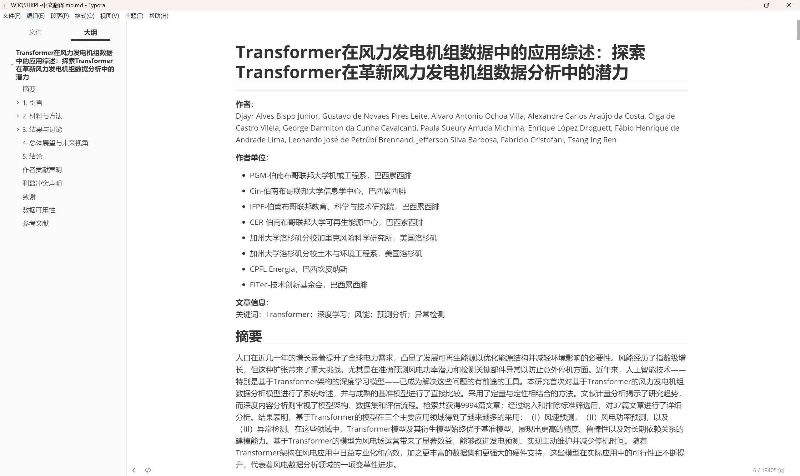
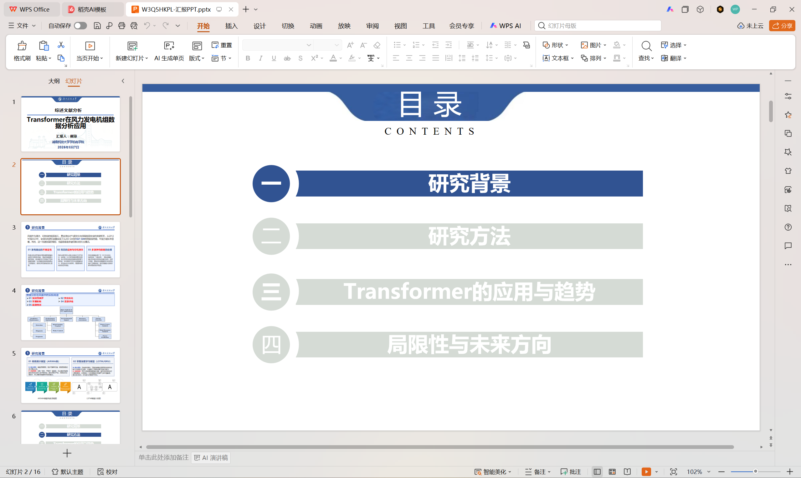
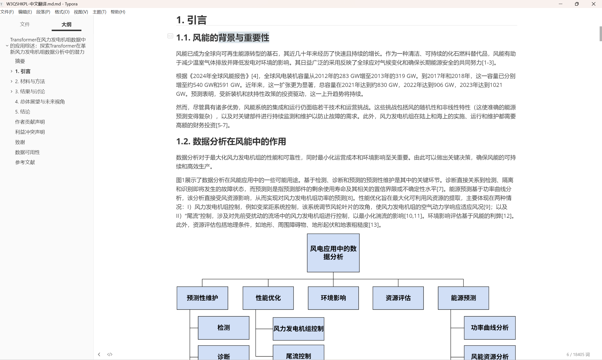
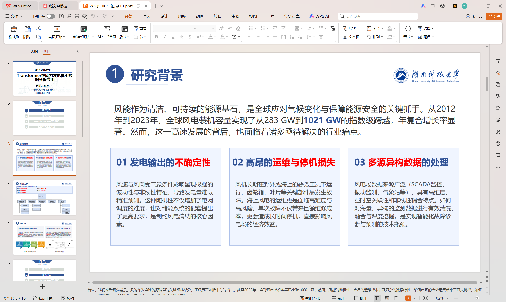
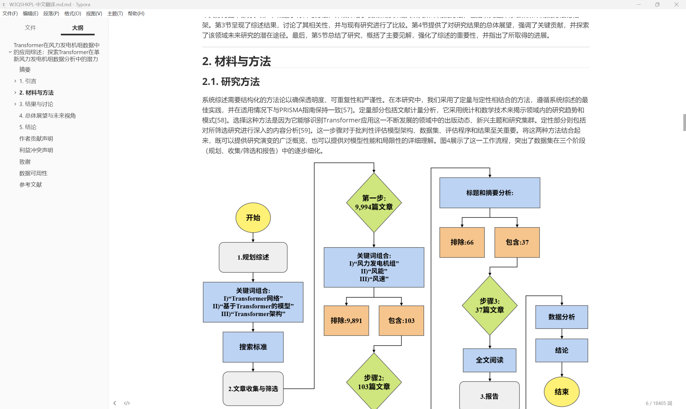
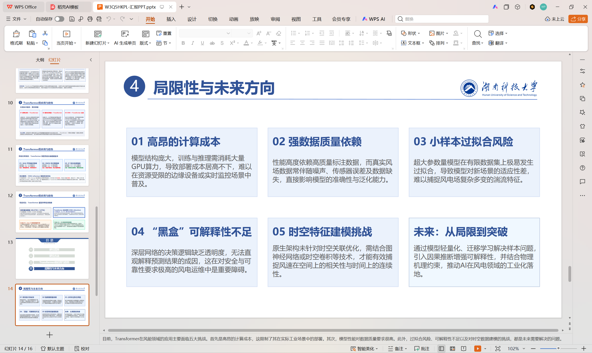
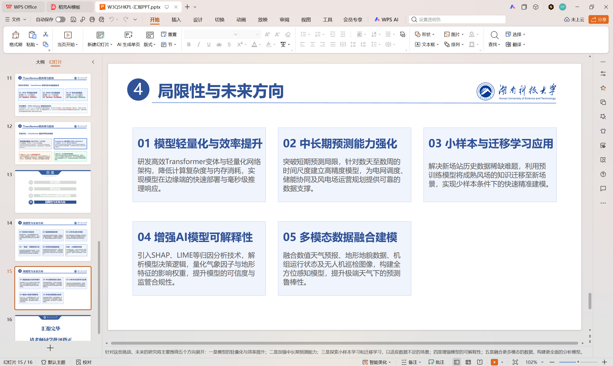

# 科研汇报 PPT 制作教学

> **配套资源**
>
> - <a href="research-presentation.mp4" target="_blank" rel="noopener">观看教学视频</a>
> - <a href="research-presentation.mp4" download="科研汇报PPT制作教学视频.mp4">下载教学视频（MP4）</a>
> - [阅读案例参考文章](reference.md)
>
> **内容制作：戴琼**

## 扩展 PPT 资源

以下文件可用于科研汇报的框架参考、版式学习和案例复刻：

- <a href="extra-resources/框架一.pptx" download>下载：框架一（PPTX）</a>
- <a href="extra-resources/框架二.pptx" download>下载：框架二（PPTX）</a>
- <a href="extra-resources/随机系统统计矩估计的降维积分法：研究进展.pptx" download>下载：随机系统统计矩估计的降维积分法—研究进展（PPTX）</a>
- <a href="extra-resources/国家自然区域创新发展联合基金项目答辩.pptx" download>下载：国家自然区域创新发展联合基金项目答辩（PPTX）</a>
- <a href="extra-resources/基于数据-机理混合驱动的“驭电”仿真大模型.pptx" download>下载：基于数据-机理混合驱动的“驭电”仿真大模型（PPTX）</a>
- <a href="extra-resources/基于图神经网络的流场预测方法研究进展.pptx" download>下载：基于图神经网络的流场预测方法研究进展（PPTX）</a>
- <a href="extra-resources/PPT复刻(1).pptx" download>下载：PPT 复刻案例（网页下载版，PPTX）</a>

> 说明：“PPT 复刻案例”原文件超过网站单文件发布限制，网页下载版仅压缩了内嵌图片，幻灯片数量、文字和版式保持不变。


> 教学案例：
> 《Transformer在风力发电机组数据分析中的应用综述》
>
> 教学目标：
> 学习如何将一篇论文/技术报告转化为结构清晰、逻辑完整的汇报PPT。

---

## 一、整体思路：从论文到汇报PPT

### 首先要对论文框架有一个大致的了解

论文结构：



```
摘要
 ↓
引言
 ↓
理论基础
 ↓
研究方法
 ↓
实验结果
 ↓
讨论
 ↓
结论
```

### 其次要明白PPT要汇报哪些任务

汇报PPT主要脉络：

```
为什么研究？
      ↓
如何研究？
      ↓
发现了什么？
      ↓
有什么价值？
      ↓
未来怎么办？
```

---

## 二、确定汇报主题与核心问题

### 提取论文核心信息

阅读论文后，需要回答三个问题：

#### （1）研究对象（方向）是什么？

示例：

- 风力发电机组数据分析

#### （2）研究方法是什么？

示例：

- Transformer深度学习模型
- 系统综述方法

#### （3）研究价值或意义是什么？

示例：

- 提升风电预测精度
- 降低设备故障风险
- 推动智能运维


---

## 三、设计PPT目录结构

选择一个合适的PPT模板（初步可以先借鉴博士答辩等优质PPT进行模仿）



### 构建PPT目录模板（参考）


```
1. 研究背景
2. 研究方法
3. 核心研究内容与发现
4. 局限性与未来方向
5. 总结
```


---

## 四、研究背景部分怎么做？

### 目标：

回答：

> 为什么需要研究这个问题？


### 步骤：

#### 从论文引言中寻找：

- 行业发展趋势

- 当前痛点

- 现有方法不足

  


---

### 案例分析

论文背景：



风能快速发展，但存在：

#### 问题1：发电预测困难

原因：

- 风速随机性
- 非线性变化


#### 问题2：设备维护成本高

原因：

- 关键部件容易故障
- 停机损失严重


#### 问题3：数据复杂

原因：

- SCADA数据
- 气象数据
- 状态监测数据


---

## 五、研究方法部分怎么提炼？

### 目标：

说明：

> 作者如何得到研究结论？


### 提取内容：

论文中的：

- 数据来源
- 筛选流程
- 分析方法


---

### 案例：

论文采用系统综述方法：



```
初步检索

9994篇论文

        ↓

领域关键词筛选

103篇论文

        ↓

严格筛选

37篇核心论文
```


---

### PPT技巧：

页面布局要图文并茂，图表和数据比文字更有说服力。


---

## 六、核心研究内容部分：如何提炼论文的主要发现？（重点）


### 1. 核心内容部分的目标

论文中的“结果与讨论”通常包含大量内容：

- 大量实验数据
- 多个模型结构
- 不同研究方向
- 多篇参考文献
- 复杂技术细节


但是汇报PPT不能简单复制论文。


核心任务是：

> 从大量研究内容中提炼出几个最重要的“研究发现”，并围绕这些发现建立清晰的汇报逻辑。


---

### 2. 核心内容提炼方法


### 第一步：寻找论文中的“研究分类”

通常综述类论文会按照研究方向分类。


阅读论文时重点寻找：

- XXX应用领域
- XXX方法分类
- XXX模型比较
- XXX实验结果


这些内容通常就是PPT核心章节。


---

### 案例分析：

原论文研究：

《Transformer在风力发电机组数据分析中的应用综述》


论文分析了37篇相关研究。


作者将Transformer应用总结为：Transformer应用三个主要方向

① 风速预测

② 风电功率预测

③ 异常检测

因此PPT核心部分不应该按照：

论文3.1
 论文3.2
 论文3.3

展开。


而应该重新组织为：

Transformer解决了风电领域哪些关键问题？

​    ↓

三个应用方向

​    ↓

每个方向的价值与效果


---

## 七、局限与未来方向怎么总结？


### 不只是说缺点

应该形成：

```
发现的问题

↓

形成的原因

↓

未来解决方向
```


---

###  问题




### 方向




---

## 科研汇报PPT流程


```
阅读论文

↓

提炼研究问题

↓

确定汇报主线

↓

重新组织章节

↓

提取关键数据

↓

制作图表

↓

优化视觉表达

↓

形成最终汇报
```


---

## 最终原则

优秀论文汇报PPT不是：

> 把论文搬到幻灯片上。


而是：

> 帮助听众快速理解：
> 为什么研究？
> 怎么研究？
> 得到了什么？
> 有什么意义？
