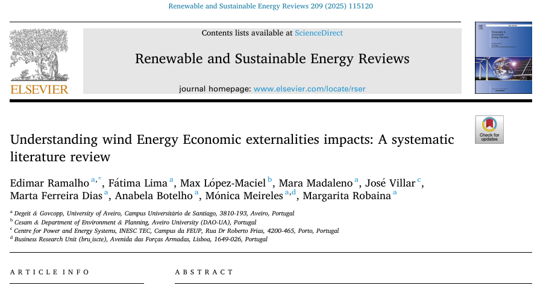
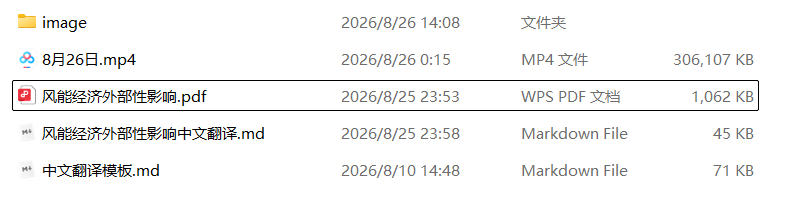
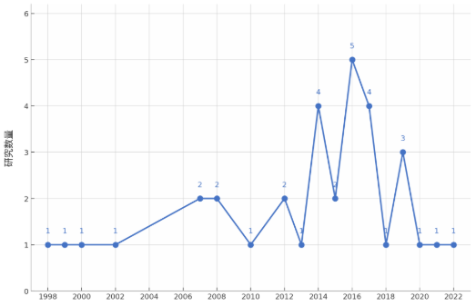
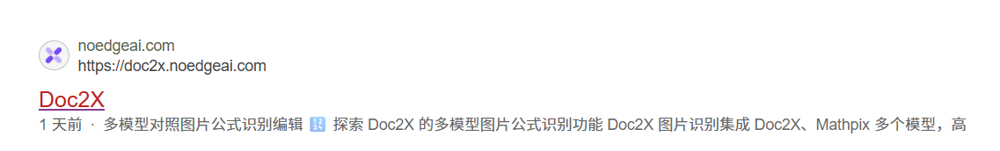
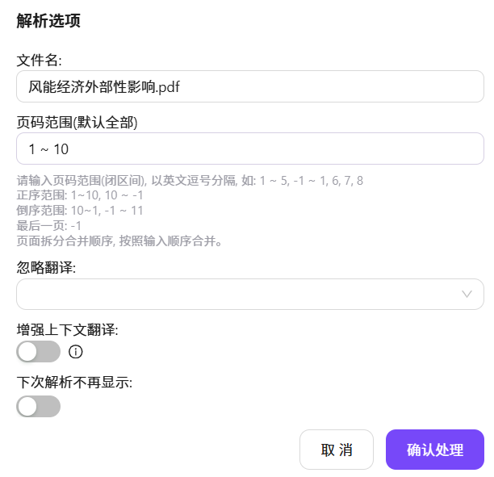
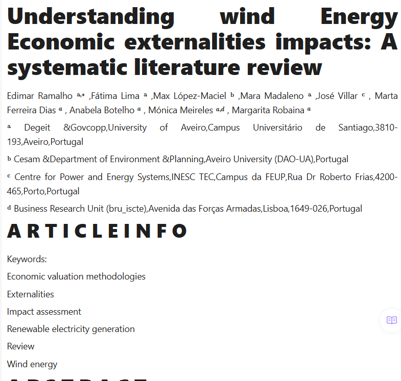
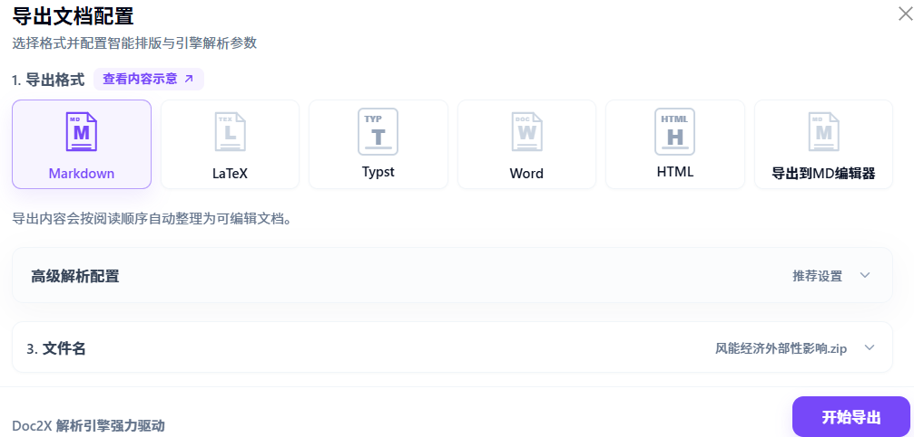

# PDF 转 Markdown 格式

> **配套资源**
>
> - [观看 PDF 转 Markdown 教学视频（哔哩哔哩）](https://www.bilibili.com/video/BV16stf6MESW/)
>
> **内容制作：刘航**

## 一、使用 DeepSeek

### 1. 下载 PDF 文献

将需要的文献（风电）从官网下载为 PDF 格式。

### 2. 上传 PDF 文件

将下载的 PDF 文件放入 DeepSeek 大模型中。

### 3. 提供 Markdown 模板

将标准的 Markdown 模板同步放入 DeepSeek 大模型中。

### 4. 输入提示词

将标准提示词同时放入 DeepSeek 大模型中。

> 把这篇文章转为 md 格式，然后图片按照 1.jpeg、2.jpeg，以此类推，以右边为模板。

### 5. 整理复现图片

复现的图片需要单独放在一个文件夹中，并将文件夹命名为 `image`。

### 6. 整理 Markdown 和图片目录

将 Markdown 文件和 `image` 文件夹放在同一个文件夹中，并将外层文件夹命名为 `images`。

### 7. 引用图片

在 Markdown 中需要显示图片的位置插入对应的图片引用。

## 二、使用 Doc2X

### 1. 打开 Doc2X

在浏览器中搜索 Doc2X。

### 2. 上传并解析文件

上传文件，等待解析完成。

### 3. 生成 Markdown 文件

生成 Markdown 文件。

### 4. 导出 Markdown 文件

导出 Markdown 文件。

