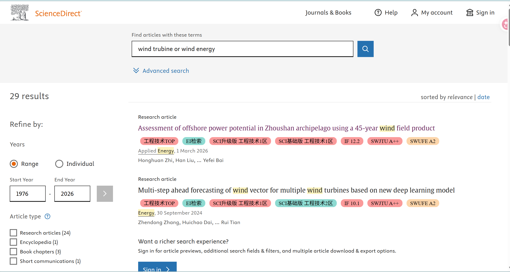
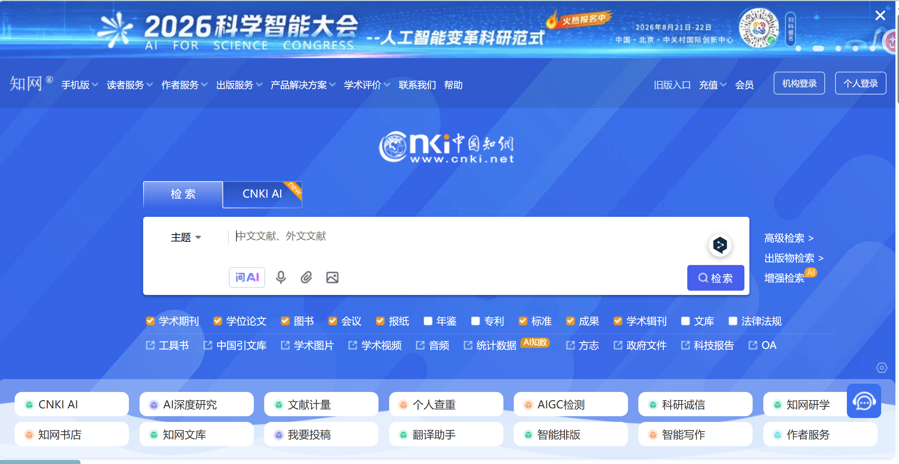
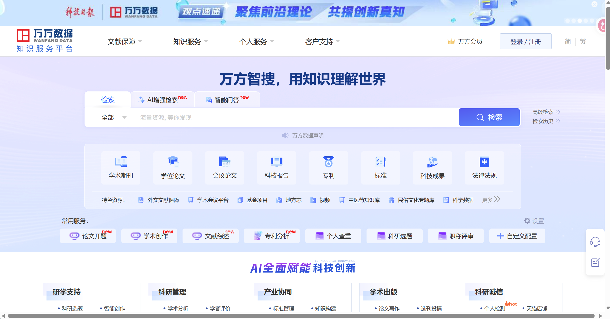
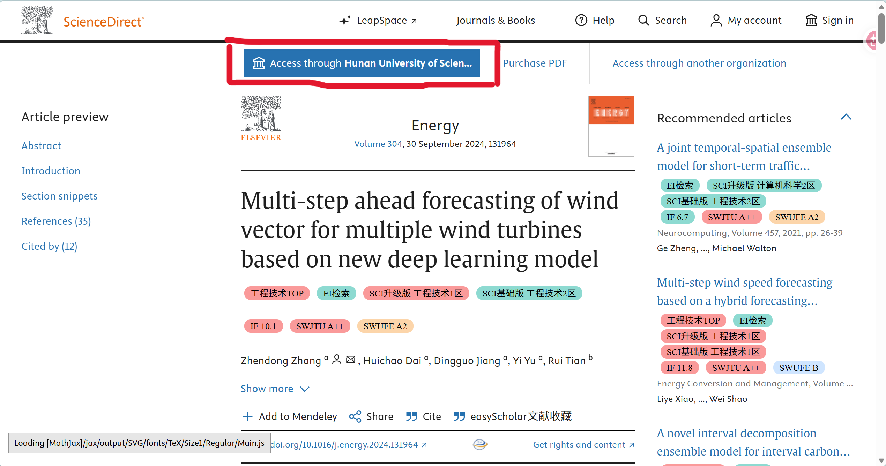
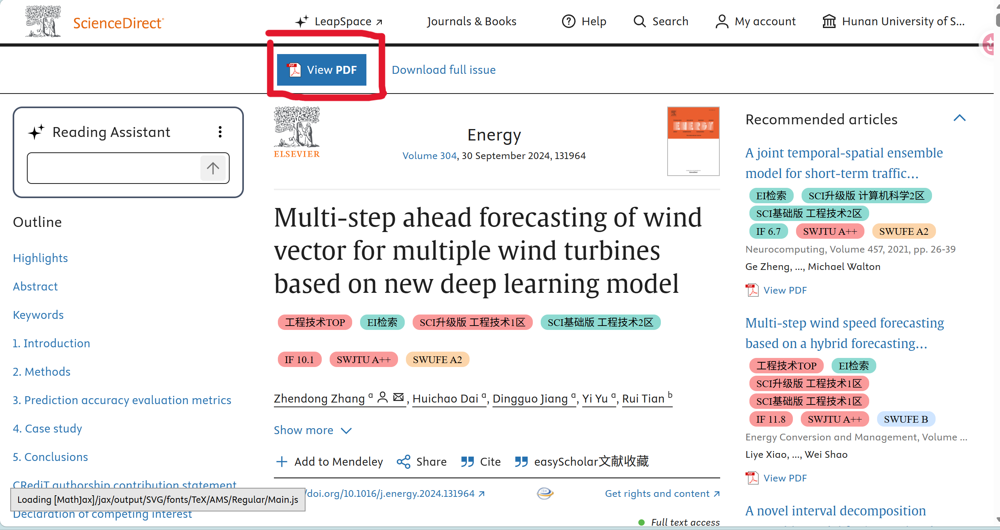

# 系统性文献检索与筛选操作手册

> **课程信息**
>
> - 内容制作：肖鑫
> - 筛选方法补充整理：郑圭晟
> - 配套视频：[前往 Bilibili 观看](https://www.bilibili.com/video/BV1iwYr6ZEyo/)

---

## 一、建立关键词表

### 1.1 中文关键词（根据你的专业方向选择）

| 概念组 | 核心词 | 同义词或相关词 |
|---|---|---|
| 研究对象 | 风电 | 风力发电、风电机组、风力发电机组、风电场、海上风电、陆上风电 |
| 数据或方法 | 大数据 | 风电数据、数据分析、数据挖掘、SCADA数据、人工智能、机器学习、深度学习、数字孪生 |
| 功率问题 | 功率预测 | 风电功率预测、风电出力预测、短期预测、超短期预测、功率波动 |
| 运维问题 | 故障诊断 | 状态监测、健康评估、异常检测、预测性维护、剩余寿命预测 |
| 系统问题 | 并网调度 | 风电消纳、电力系统调度、新能源并网、风储协同 |

### 1.2 英文关键词（根据你的专业方向选择）

| 概念组 | 核心词 | 同义词或相关词 |
|---|---|---|
| 研究对象 | wind power | wind energy, wind turbine, wind farm, offshore wind, onshore wind |
| 数据或方法 | big data | data analytics, data mining, SCADA data, artificial intelligence, machine learning, deep learning, digital twin |
| 功率问题 | power forecasting | wind power forecasting, wind power prediction, wind generation forecasting, short-term forecasting |
| 运维问题 | fault diagnosis | fault detection, condition monitoring, health assessment, predictive maintenance, remaining useful life |
| 系统问题 | grid integration | power system dispatch, renewable energy integration, wind-storage coordination |

### 1.3 关键词组合规则

- 同一概念组内的同义词用 `OR` 连接；
- 不同概念组之间用 `AND` 连接；
- 固定词组使用英文双引号；
- 先用较宽检索式了解文献规模，再逐步增加限制条件；
- 每次只改变一个条件，便于解释结果变化。



---

## 二、选择检索网站

### 2.1 中文数据库

| 网站 | 地址 | 主要用途 |
|---|---|---|
| 中国知网 | https://www.cnki.net/ | 中文期刊、学位论文、核心期刊 |
| 万方数据 | https://www.wanfangdata.com.cn/ | 中文期刊、学位论文、科技报告 |
| 维普 | https://www.cqvip.com/ | 中文期刊补充检索 |
| 国家哲学社会科学文献中心 | https://www.ncpssd.org/ | 能源政策、产业、管理类文献 |







### 2.2 英文数据库

| 网站 | 地址 | 主要用途 |
|---|---|---|
| Web of Science | https://www.webofscience.com/ | SCI、ESCI、引文追踪 |
| Scopus | https://www.scopus.com/ | 工程、能源、计算机综合检索 |
| ScienceDirect | https://www.sciencedirect.com/ | Elsevier能源和工程期刊全文 |
| IEEE Xplore | https://ieeexplore.ieee.org/ | 电力系统、控制、人工智能、传感器 |
| SpringerLink | https://link.springer.com/ | 能源、数据科学、智能制造 |
| Wiley Online Library | https://onlinelibrary.wiley.com/ | 风能、可靠性、能源工程 |
| Google Scholar | https://scholar.google.com/ | 补充检索和引用追踪 |
| Crossref | https://search.crossref.org/ | 核对DOI和书目信息 |
| OpenAlex | https://openalex.org/ | 免费查询论文和引用关系 |


### 2.3 行业和标准网站

| 网站 | 地址 | 主要用途 |
|---|---|---|
| 国家能源局 | https://www.nea.gov.cn/ | 风电政策、装机和行业数据 |
| 全球风能理事会 | https://gwec.net/ | 全球风电行业报告 |
| 中国可再生能源学会风能专业委员会 | http://www.cwea.org.cn/ | 中国风电行业统计和报告 |
| 国家标准全文公开系统 | https://openstd.samr.gov.cn/ | 查询风电国家标准和行业术语 |

> 学术论文主要来自知网、Web of Science、Scopus、IEEE Xplore等数据库；行业报告和标准用于补充背景，不与学术论文混为一类。

---

## 三、正式检索：先做测试，再做最终检索

### 3.1 测试检索

目的：检查关键词是否合理，不立即确定最终文献数量。

先使用宽检索式：

#### 中文测试检索式

```text
(风电 OR 风力发电 OR 风电机组 OR 风电场)
AND
(大数据 OR 数据分析 OR 机器学习 OR 深度学习)
```

#### 英文测试检索式

```text
("wind power" OR "wind energy" OR "wind turbine" OR "wind farm")
AND
("big data" OR "data analytics" OR "machine learning" OR "deep learning")
```

如果结果太多：增加“功率预测”“故障诊断”“predictive maintenance”等应用词。  
如果结果太少：删除一个应用词，或将检索字段从“标题”放宽为“主题/标题摘要关键词”。

### 3.2 最终检索式示例

#### 风电功率预测

```text
("wind power" OR "wind energy" OR "wind farm")
AND
("machine learning" OR "deep learning" OR "big data")
AND
("power forecasting" OR "power prediction")
```

#### 风电机组故障诊断

```text
("wind turbine" OR "wind farm")
AND
("fault diagnosis" OR "fault detection" OR "condition monitoring" OR "predictive maintenance")
AND
("machine learning" OR "deep learning" OR "artificial intelligence" OR "big data")
```

---

## 四、如何导出文献

### 4.1 推荐格式

优先使用：用zotero管理文献  

### 4.2 如果下载不了文献

可以用学校的VPN下载，用机构登录，登录学校自己的账号






### 4.3 推荐文件夹结构

```text
风电大数据文献检索
01_原始检索结果
02_去重后文献
03_标题摘要筛选
04_全文筛选
05_最终纳入文献
06_排除文献
07_检索截图
08_文献提取表
```

### 4.4 推荐文件命名

```text
数据库_主题_日期
```

示例：

```text
CNKI_WindPowerBigData_2026-08-25.ris
WOS_WindTurbineFaultDiagnosis_2026-08-25.bib
Scopus_WindPowerForecasting_2026-08-25.csv
```

---

## 五、文献去重

推荐工具：Zotero

1. 先按DOI自动去重；
2. 再按论文题名去重；
3. 检查第一作者和发表年份；
4. 检查中文题名与英文题名是否为同一研究；
5. 人工确认后再删除。

---

## 六、文献筛选

### 6.1 纳入标准

- 研究对象是风电机组、风电场、海上风电或风电并网系统；
- 使用风电运行数据、SCADA数据、气象数据或电力数据；
- 研究功率预测、故障诊断、状态监测、智能运维或并网调度；
- 使用大数据、机器学习、深度学习、人工智能或数字孪生；
- 论文信息完整，能够获得题名、作者、年份和摘要；
- 属于综述、正式期刊、会议、学位论文、或权威报告。

### 6.2 排除标准

- 研究对象不是风电；
- 仅在背景部分提及风电；
- 实际研究的是光伏、火电或核电；
- 没有使用或分析风电数据；
- 新闻、广告、博客或商业宣传材料；
- 重复文献；
- 无法判断研究内容且无法获得全文。


---


### 6.3 三级筛选流程

#### 第一级：标题筛选

标题筛选只回答一个问题：

> 这篇论文是否可能与我的研究问题相关？

建议保留以下论文：

- 标题中出现研究对象或核心方法；
- 标题虽未直接出现关键词，但属于重要综述或基础方法；
- 标题涉及相邻任务，可能提供数据、模型或评价方法。

标题明显无关时直接排除，不必下载全文。

#### 第二级：摘要筛选

阅读摘要时提取五项信息：

1. 研究问题；
2. 使用的数据；
3. 采用的方法；
4. 对比实验；
5. 主要结论。

可以用下面的快速判断表：

| 判断问题 | 是 | 否 |
|---|---:|---:|
| 研究对象与课题相关吗？ | 保留 | 排除或降级 |
| 方法可以借鉴或对比吗？ | 保留 | 继续判断 |
| 数据和实验描述清楚吗？ | 保留 | 谨慎 |
| 结论能够回答研究问题吗？ | 保留 | 排除或仅作背景 |
| 是否属于经典、综述或最新代表性研究？ | 优先保留 | 普通处理 |

#### 第三级：全文筛选

全文筛选重点查看：

- 引言最后一段：论文解决什么问题；
- 相关工作：作者如何划分已有研究；
- 方法部分：输入、输出、模型和关键假设；
- 数据部分：数据来源、样本规模和预处理；
- 实验部分：基线、评价指标和消融实验；
- 结果与讨论：结论是否得到实验支持；
- 局限性：方法在哪些条件下可能失效。

### 6.4 论文质量判断

#### 相关性

按与课题的关系分为三级：

- **A：直接相关**——研究对象、任务和方法高度一致，应精读；
- **B：部分相关**——可提供方法、数据或评价指标，应选择性阅读；
- **C：背景相关**——只用于了解概念或行业背景，不必投入过多时间。

#### 方法完整性

重点检查：

- 方法是否描述到可以理解或复现；
- 是否说明关键参数和训练设置；
- 是否与合理的基线方法比较；
- 是否进行了消融实验或敏感性分析；
- 是否解释模型为什么有效，而不只是报告指标。

#### 数据可靠性

重点检查：

- 数据来源是否清楚；
- 样本规模是否足够；
- 训练集、验证集和测试集是否合理划分；
- 是否存在数据泄漏；
- 是否说明缺失值、异常值和归一化处理；
- 数据是否能够代表论文声称的应用场景。

#### 结果可信度

重点检查：

- 评价指标是否适合研究任务；
- 是否只展示最有利的结果；
- 是否报告多次实验的波动；
- 提升幅度是否具有实际意义；
- 图表、正文和结论是否一致；
- 作者的结论是否超出了实验能够支持的范围。

#### 期刊、会议与引用情况

期刊、会议等级和引用次数可以作为辅助信息，但不能单独决定论文质量。

需要注意：

- 新论文发表时间短，引用次数通常较少；
- 高被引论文也可能只是在某个时期影响较大；
- 顶级期刊或会议论文仍需要检查具体内容；
- 与课题高度相关的工程论文可能比高影响力但不相关的论文更有价值。

### 6.5 文献类型的合理搭配

一个较完整的研究文献集合通常应包含：

| 文献类型 | 作用 |
|---|---|
| 综述论文 | 快速了解研究分类、发展脉络和常用术语 |
| 经典论文 | 理解核心理论、模型和基准方法的来源 |
| 最新论文 | 了解当前前沿、最新改进和未解决问题 |
| 方法论文 | 学习模型结构、算法原理和实验设计 |
| 应用论文 | 了解方法在风电或具体工程场景中的表现 |
| 数据或基准论文 | 获取数据集、评价指标和复现基线 |

不要只阅读最新论文，也不要只依赖综述论文。

### 6.6 去重与版本选择

同一项研究可能同时存在：

- arXiv 预印本；
- 会议版本；
- 期刊扩展版本；
- 作者接收稿；
- 数据库重复记录。

处理原则：

1. 优先保留正式发表且信息最完整的版本；
2. 如果预印本更新更及时，可同时保留并注明版本；
3. 使用 DOI、标题和作者组合判断是否重复；
4. 合并重复条目时保留笔记、标签和附件；
5. 对版本差异明显的论文，不要直接视为重复。

### 6.7 文献筛选记录表

建议建立如下表格：

| 字段 | 填写内容 |
|---|---|
| 编号 | 文献唯一编号 |
| 标题 | 论文标题 |
| 年份 | 发表年份 |
| 来源 | 期刊、会议或平台 |
| 研究对象 | 风机、风电场、风速等 |
| 研究任务 | 预测、诊断、控制等 |
| 主要方法 | Transformer、LSTM、物理模型等 |
| 数据来源 | 公开数据、SCADA、仿真数据等 |
| 主要结论 | 用一两句话概括 |
| 相关等级 | A、B 或 C |
| 是否精读 | 是或否 |
| 排除原因 | 无关、重复、信息不足等 |
| 备注 | 代码、数据、疑问和可借鉴内容 |

### 6.8 推荐筛选流程

```text
导出全部检索结果
    ↓
去除明显重复条目
    ↓
标题初筛
    ↓
摘要复筛
    ↓
下载候选全文
    ↓
全文质量判断
    ↓
标记精读、泛读和背景文献
    ↓
记录纳入与排除原因
```

### 6.9 常见误区

**误区一：只看期刊影响因子**

影响因子不能代替论文内容判断。对具体课题而言，相关性和可借鉴性更重要。

**误区二：下载很多，但没有记录筛选原因**

缺少筛选记录会导致重复阅读，也无法解释为什么选择这些论文。

**误区三：只保留结果最好的论文**

负面结果、方法局限和效果一般的论文也可能帮助发现真正的研究问题。

**误区四：把大模型生成的论文总结直接当作筛选依据**

大模型可能遗漏条件、混淆数据或夸大创新点。筛选阶段至少需要核对原始摘要、方法和结论。

---

## 七、检索结果统计

| 阶段 | 文献数量 |
|---|---:|
| 中文数据库初始结果 |  |
| 英文数据库初始结果 |  |
| 合并后总数 |  |
| 删除重复文献 |  |
| 标题摘要筛选后 |  |
| 全文筛选后 |  |
| 最终纳入文献 |  |
