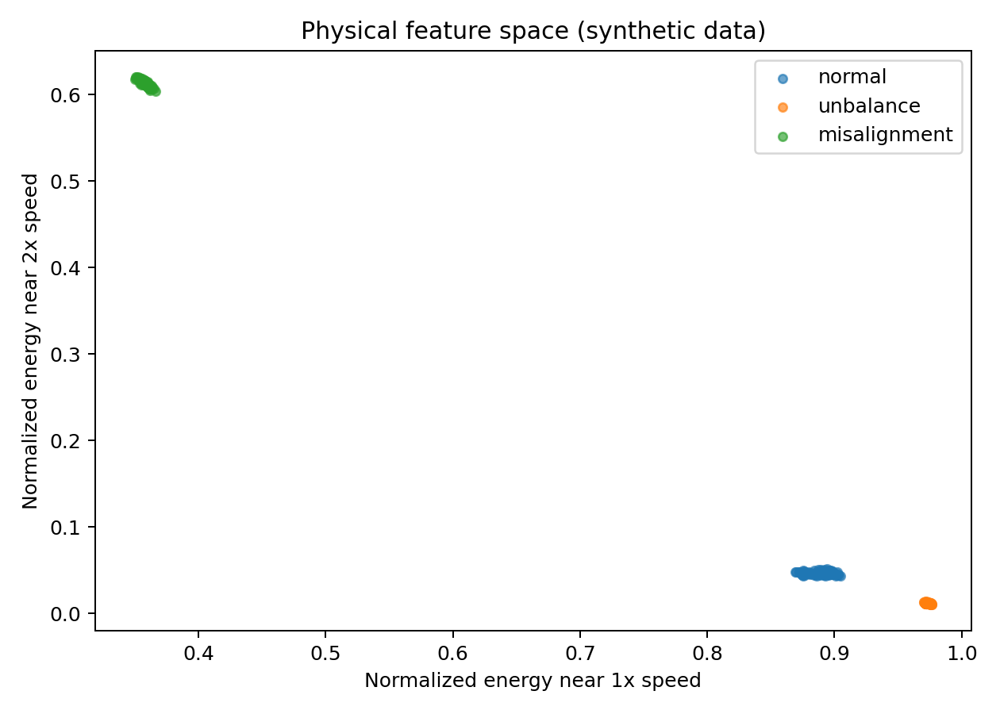
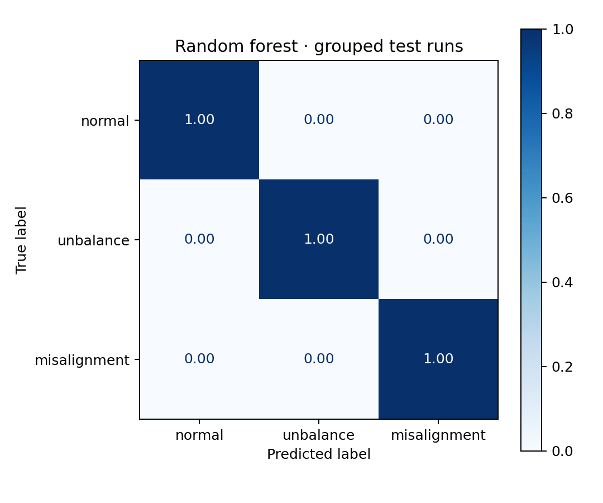

# 第一个机器学习完整项目：从数据到可信结论

这个练习不依赖外部数据：脚本先生成三类带标签的传感器信号，再提取可解释特征并训练分类器。它选用设备状态作为一个具体案例，但重点是通用流程——定义问题、准备数据、避免泄漏、比较基线、保存结果。换成其他表格或时间序列数据时仍然适用。

[下载可运行脚本](examples/bearing_fault_pipeline.py){ .md-button .md-button--primary download }
[先复习 Python 数据处理](python-basics.md){ .md-button }

## 问题定义

输入是一段 2 秒加速度信号，输出是三种状态之一：

- `normal`：转频成分较小；
- `unbalance`：1× 转频增强；
- `misalignment`：2× 转频增强，并出现更明显的冲击成分。

每个独立 `run_id` 模拟一次试验。一次试验里的多个窗口共享转速、安装状态和噪声特征，因此**必须按 run 划分**，不能把窗口随机打散。

## 流程图

<div class="workflow-flow" aria-label="机器学习完整项目流程">
  <span>独立试验 <code>run</code></span>
  <span>切分信号窗口</span>
  <span>时域与频域特征</span>
  <span>按 <code>run</code> 划分</span>
  <span>两个基线模型</span>
  <span>指标与误差分析</span>
</div>

## 特征不是越多越好

脚本只使用六个可解释特征：

| 特征 | 目的 |
|---|---|
| `rms` | 总体振动强度 |
| `peak_to_peak` | 峰值范围 |
| `crest_factor` | 冲击相对强度 |
| `kurtosis` | 稀疏冲击程度 |
| `band_1x` | 转频附近能量 |
| `band_2x` | 二倍转频附近能量 |

频带中心由每个窗口的已知转速换算，而不是在完整数据集上“找最有区分度的频率”。后者会把测试集信息偷渡进特征设计。

## 正确划分：按试验，而不是按窗口

```python
splitter = StratifiedGroupKFold(n_splits=4, shuffle=True, random_state=42)
train_idx, test_idx = next(splitter.split(X, y, groups=groups))

assert set(groups[train_idx]).isdisjoint(groups[test_idx])
```

如果同一个 run 的相邻窗口同时出现在训练和测试中，模型可能只记住该次采集的背景噪声。测试分数会很好看，但换一台机器就失效。

## 两个基线回答两个问题

=== "逻辑回归"

    先标准化再拟合。它回答：“这些物理特征是否已经近似线性可分？”系数还能帮助检查特征方向是否符合预期。

    ```python
    logistic = make_pipeline(
        StandardScaler(),
        LogisticRegression(max_iter=2_000, random_state=42),
    )
    ```

=== "随机森林"

    它能表达非线性阈值与特征交互，通常是机械表格特征的强基线。若它远胜逻辑回归，应检查是真的存在非线性，还是数据量小导致过拟合。

    ```python
    forest = RandomForestClassifier(
        n_estimators=300,
        min_samples_leaf=2,
        class_weight="balanced",
        random_state=42,
        n_jobs=-1,
    )
    ```

## 运行与产物

将下载的脚本放在项目根目录，确保环境中已有 NumPy、Matplotlib 和 scikit-learn：

```powershell
python bearing_fault_pipeline.py
```

脚本会生成：

<div class="artifact-strip">
  <div><strong>metrics.csv</strong><small>两个基线的 accuracy 与 macro-F1</small></div>
  <div><strong>confusion_matrix.png</strong><small>测试集混淆矩阵</small></div>
  <div><strong>feature_space.png</strong><small>两个物理频带特征的分布</small></div>
</div>

<div class="grid cards" markdown>

-   **物理特征空间**

    

-   **分组测试集混淆矩阵**

    

</div>

合成规则直接控制 1×/2× 分量，因此图中三类几乎完全分开，模型得到满分并不值得炫耀。这个结果只证明代码链路符合我们写入的规则；真实数据必须面对工况耦合、传感器差异和标签不确定性。

验收不是“准确率达到 100%”。你需要回答：

1. 测试集包含多少个独立 run，而不是多少个窗口？
2. 哪两类最容易混淆？这与合成规则一致吗？
3. 逻辑回归和随机森林差多少？是否值得使用更复杂模型？
4. 如果去掉转速信息，频带特征是否仍然合理？
5. 哪些假设在真实轴承或齿轮箱数据中不会成立？

## 换成自己的数据时

1. 先写数据字典：字段含义、单位、采集方式、标签来源和缺失值编码。
2. 把 `simulate_window()` 换成真实文件读取函数，保持后续接口不变。
3. `run_id` 改为真实对象、人员、设备或试验批次编号；属于同一对象的数据不能跨训练集和测试集。
4. 在训练集内部确定滤波、频带和超参数；测试集只在最后使用一次。
5. 报告每类样本数、独立设备数、置信区间和失败案例。

!!! danger "一段长信号切成 1000 个窗口，不等于有 1000 次独立试验"
    统计独立性由采集过程决定，不由数组行数决定。论文中同时报告窗口数与独立设备/试验数。

## 下一步挑战

- 将固定频带能量改为阶次域特征，适应转速变化。
- 引入一个完全未见过的转速区间，测试外推能力。
- 对每个 run 做 bootstrap，给 macro-F1 计算置信区间。
- 完成 [实验复现与项目整理](reproducible-research.md)，让同学能从空环境复现全部产物。
