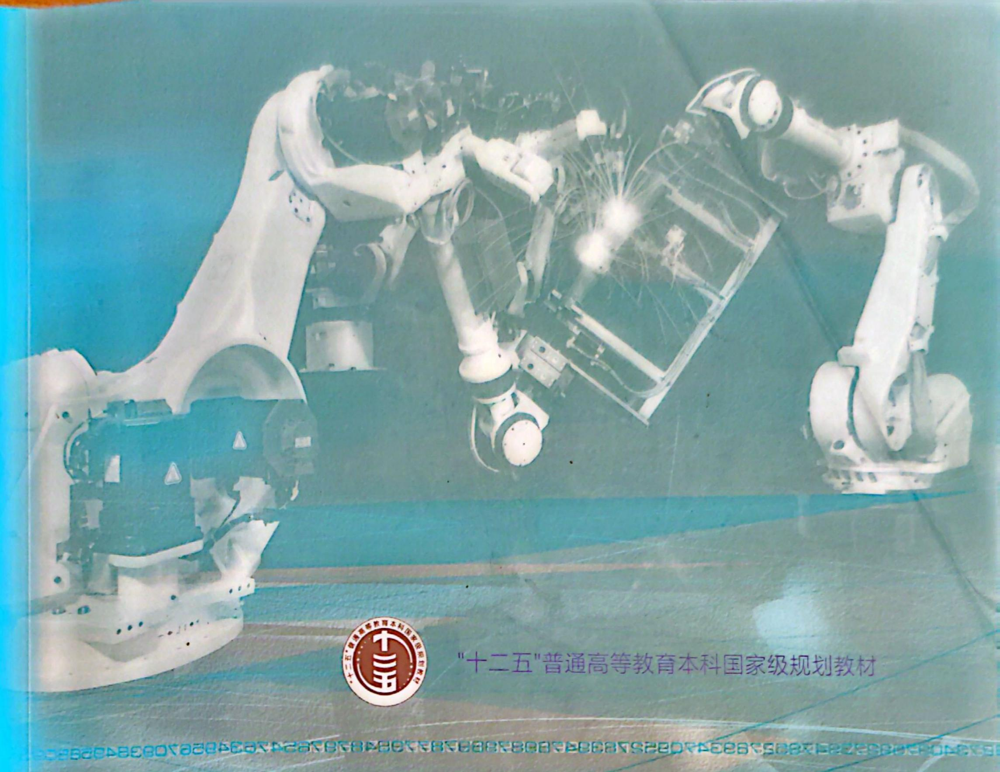

"十二五"普通高等教育本科国家级规划教材 

# 机器人技术基础 第三版

# 机器人技术基础 第三版

主编 刘极峰 杨小兰 

副主编 洪磊 邵秋萍 肖增文 杨文亮 

# 内容提要

本书是“十二五”普通高等教育本科国家级规划教材，是在第二版的基础上修订而成的。本次修订紧跟机器人新技术迅速发展的步伐，对机器人技术按开发应用领域分类进行了调整，编入部分最新前沿技术，简要插入编者在国家级与省部级科研项目中的部分研究成果，增加若干计算和课程实验示例。 

本次修订继续保持前两版注重系统性、突出应用性、体现可读性、选材新颖性的风格特点。全书主要内容包括绪论、机器人本体结构、机器人运动学、机器人动力学、机器人轨迹规划、机器人控制系统、机器人语言与编程、工业机器人、操纵型机器人、仿生机器人以及附录，各章后均附有一定数量的习题。本书还配套有多媒体课件、部分习题参考答案以及各种机器人技术及实例的视频文件等数字化资源，部分资源还以二维码的形式在书中呈现，帮助读者更好地理解教材内容。 

本书可作为高等学校本科机械类、近机械类各专业的教材或选修课、专题讲座教材，也可作为远程教育、成人教育、高等职业教育的教学用书，还可作为机器人工程技术人员的参考书。 

# 图书在版编目(CIP)数据

机器人技术基础/刘极峰,杨小兰主编.--3版 

ISBN 978-7-04-052612-7 

I. ①机… II. ①刘… ②杨… III. ①机器人技术-高等学校-教材 IV. ①TP242 

中国版本图书馆 CIP 数据核字(2019)第 183812 号 

Jiqiren Jishu Jichu 

策划编辑 薛立华 

责任编辑 薛立华 

插图绘制 于 博 

责任校对 刘丽娴 

封面设计 王鹏 

版式设计 张杰 

责任印制 耿轩 

出版发行 高等教育出版社 

社 址 北京市西城区德外大街4号 

邮政编码 100120 

印刷 山东百润本色印刷有限公司 

开 本 787mm×1092mm 1/16 

购书热线 010-58581118 

印 张 20.25 网址 http://www.hep.edu.cn  
http://www.hep.com.cn 

咨询电话 400-810-0598 

字 数 490 千字 

版权所有 侵权必究 网上订购 http://www.hepmall.com.cn  
http://www.hepmall.com  
http://www.hepmall.cn 

版 次 2006年5月第1版  
2019年10月第3版 印 次 2024 年 5 月第 7 次印刷 

物料号 52612-00 

本书如有缺页、倒页、脱页等质量问题，请到所购图书销售部门联系调换 

定价 39.90 元 

# 机器人技术基础

## (第三版)

1 计算机访问http://abook.hep.com.cn/1255701，或手机扫描二维码、下载并安装Abook应用。 

2 注册并登录，进入“我的课程”。 

3 输入封底数字课程账号(20位密码, 刮开涂层可见), 或通过Abook应用扫描封底数字课程账号二维码, 完成课程绑定。 

4 单击“进入课程”按钮，开始本数字课程的学习。 

机器人技术基础（第三版） 

机器人技术基础数字课程与纸质教材一体化设计，紧密配合。数字课程涵盖多媒体课件、部分习题参考答案，以及各种机器人技术及实例的短视频等，使读者能直观地了解机器人的基本功能和主要作用。充分运用多种形式的媒体提问，极大地丰富了知识的呈现形式，拓展了教材内容，为学生创建一个适宜自主学习和创造性学习的环境。在提升课程教学效果的同时，为学生学习提供思维与探索的空间。 

课程绑定后一年为数字课程使用有效期。受硬件限制，部分内容无法在手机端显示，请按提示通过计算机访问学习。 

如有使用问题，请发邮件至abook@hep.com.cn。 

扫描二维码下载Abook应用 

# 第三版序

自世界上第一台工业机器人 Unimate 诞生至今,经过半个多世纪的不断发展,机器人技术在理论、方法和应用方面都取得了巨大的、无与伦比的进步,机器人已由单纯完成机械动作的工业机器人,逐步拓展到具有高智能的工业机器人、非工业作业及高难度的操纵型机器人,再到如今可模仿各类生物特性或行为,具有感知、思维特征的仿生机器人,其应用实现了在可能应用的几乎所有领域的突破和飞跃。 

进入21世纪以来，机器人更加深入到人类生活、工作和生产的各个方面，如家务劳动、养老助残、娱乐服务、勘探、线路维修、焊接、搬运、危险环境作业、外科手术、脑波控制、自动驾驶，乃至形形色色的仿人、仿各种生物的机器人等，机器人始终扮演着人类的忠实助手。随着5G技术的诞生及人类社会需求的变化，放眼未来，机器人技术必将迎来更加广阔的发展空间，为人类享有更加精益的生产、便利的服务和舒适的生活发挥不可或缺的作用。 

由于机器人技术的迅猛发展和广泛应用,近年来机器人技术已被列为各工业国未来高科技发展的重要领域。中国国内越来越多的企业,正急需各种具有现代机器人技术的装备,以及与之相适应的大量高素质的人才,这也给诸多高等院校、科研院所开展机器人方面的研究,带来空前的急迫感。 

本书正是在此背景下应运而生的，并于2006年和2012年分别推出第一版和第二版，有力地推进了机器人技术人才的培养和教育教学工作。近几年来，随着机械电子、自动控制、计算机、人工智能、传感技术的飞速发展，全球范围的机器人领域研究更加活跃，不断涌现出新技术、新方法和新应用。为反映当前国内外机器人技术的最新进展，研究机器人技术的未来发展趋势，本书适时推出了第三版。 

粗读此书,了解到本书是在作者紧跟当今机器人技术发展前沿的基础上,结合多年来机器人科研和教学工作中的经验积累和科研成果,倾力完成编写的。 

纵观全文,本书具有如下的鲜明特点: 

1. 层次分明、循序渐进。本书从基本概念入手，先阐述机器人基本结构、运动学、动力学、轨迹规划、控制系统、编程等基础知识，再介绍工业机器人、操纵型机器人、仿生机器人三大类典型机器人的应用和最新发展趋势，章节编排由浅入深、由易到难，有助于读者系统、有序地学习。 

2. 内容新颖、实用性强。本书强调与时俱进，力求介绍各类机器人领域中最先进的概念、方法及应用，使读者能够了解本领域的最新发展成果。同时本书以适量的机器人应用实例、图例和生动形象的短视频，使读者能直观地了解机器人的基本功能和主要作用。 

3. 通俗简明、易于教学。全书语言通俗简练，各章既独立成章，又保持内容衔接，既便于教师安排教学内容，也便于学生有选择地进行自学。 

我们相信,本书第三版的出版必将为中国机器人领域高素质应用型人才的培养,为机器人技术的进一步发展应用,为中国乃至全球机器人技术、生产自动化和智能化水平的提高发挥重要而有益的促进作用。 

[美]田纳西大学机械-航空航天和生物医学工程系主任现代机器人技术专家、教授 

[美]田纳西大学非线性生物动力学实验室主任、副教授现代机器人技术与脑波控制专家 

2019年3月

# 第三版前言

著名科学家贝弗里奇有句名言:成功的科学家往往是兴趣广泛的人,他们的独创精神可能来自他们的博学。多样化会使人观点新鲜,而过于长时间钻研一个狭窄的领域则易使人愚钝。机器人技术正是一种涉及机械电子、自动控制、人工智能、仿生学、网络通信等多学科交叉的综合应用技术,加上5G技术的诞生,需要一大批博学多才的“发明者”投入其中,将多种技术发展趋势汇为一股推动机器人技术前进的洪流,点燃机器人更新换代的“导火索”,彻底改变人类的生活方式。 

习近平在两院院士大会上特别指出:机器人是“制造业皇冠顶端的明珠”,其研发、制造、应用是衡量一个国家科技创新和高端制造业水平的重要标志。本书作为教育科学“十五”国家规划课题子课题的系列成果之一,第一版遴选汇集了国内5所本科高校的6位专业资深教师,经过细心筹划、精选内容、多次研讨精心编写而成,其间又经原上海交通大学机器人研究所所长、中国科学院丁汉院士,江苏大学智能机器人研究所所长马履中教授等分别指导、阅后作序,2006年出版使用后反应甚好,2007年被评为江苏省立项精品教材,同年被评为普通高等教育“十一五”国家级规划教材。2012年的第二版对当时机器人的新技术进行了补充编撰,出版后被评为“十二五”普通高等教育本科国家级规划教材。前两版已累计完成21次印刷,国内四十余所本科高校13年来持续使用,越来越多的各类机器人研究型、应用型学术论文及学位论文对本书不断引用,这些都是对本书的最好肯定。 

由于机器人技术的飞速发展,人们对机器人技术的分类理念也需与时俱进地适当调整。如本书前两版提出,按开发内容与应用,机器人可以分为工业机器人、操纵型机器人和智能机器人三大类,得到专家、读者的普遍认可。而今智能机器人技术已成熟地融入工业机器人和操纵型机器人之中,故需加强工业机器人和操纵型机器人在智能方面的阐述;而仿生机器人的发展现状,又构成一支机器人技术飞速发展的新军,也应根据近年来的发展现状简介,且对按开发与应用领域分类进行重新界定。当然,本书仍以工业机器人为主,以其他机器人为辅,加强机器人技术基础教育,凸显本科应用型及CDIO工程教育的特点,使学生更好地理解和掌握机器人技术的基本知识与内容。 

鉴于上述,本次修订在第二版的基础上,对涉及新国家标准的内容进行了相应更新;根据机器人新技术的发展和部分师生的需求,以及编者近年来在机器人科研项目中的研究成果及与国内外同行的交流信息,在部分章节及附录中增加了若干设计计算、新技术介绍和课程实验示例:在第8章工业机器人及第9章操纵型机器人中增加智能技术的融合与实例,将第10章修改为仿生机器人并重新编写,介绍仿生机器人最新技术和实例,简述国内外发展现状与展望;为便于课程的实验教学,附录中安排5项机器人课程实验示例,分别采用国内流行的德国慧鱼、日本MO-TOMAN和深圳元创兴智能科技教育有限公司的机器人产品或实体模型。建议第8、9、10章及附 录的内容作为机械类、近机械类专业研究生或本科生的讲座或选修课内容，使用后效果更佳。 

本次修订的编写分工如下:第1、2章及附录由刘极峰、杨小兰负责,第8、10章分别由杨文亮、洪磊负责,第9章由肖增文、杨小兰负责,刘极峰、杨小兰负责总策划、统稿、文字及图表修订及其他章节改编工作,洪磊参加了第8章的复核工作。与本书配套的多媒体课件由洪磊、杨小兰制作。邵秋萍、丁继斌、陈永胜、陈辽军、刘玉松曾参加本书第一、二版的编写工作。 

本书有幸邀请到美国田纳西大学著名机器人技术专家谈金东教授、机器人技术与脑波控制专家赵晓鹏博士为本书的编排内容进行指导并阅后作序。哈尔滨工业大学机器人技术与系统国家重点实验室赵杰教授审阅了本书，并对本书提出了很多宝贵的建议和意见。深圳元创兴智能科技教育有限公司为本书提供了部分课程实验示例资料。在此一并深表谢意！ 

在编写过程中,本书参考或引用了国内外相关文献的部分内容,在此向文献作者致以诚挚的谢意。机器人技术具有多学科交叉的复杂性、综合性及前沿性,涉及知识面非常广,编者精力与水平有限,取材与编写上的不妥之处,敬请读者予以批评指正或提出宝贵意见。 

编者  
2019年3月 

# 目录

主要符号表
第1章 绪论 …… 1
1.1 概述 …… 1
1.1.1 机器人发展简史 …… 1
1.1.2 机器人的定义 …… 3
1.1.3 机器人技术的研究领域与相关学科 …… 4
1.2 机器人的分类 …… 4
1.2.1 按机器人的开发应用领域分类 …… 4
1.2.2 按机器人的发展程度分类 …… 6
1.2.3 按机器人的性能指标分类 …… 7
1.2.4 按机器人的结构形式分类 …… 7
1.2.5 按坐标形式分类 …… 8
1.2.6 按控制方式分类 …… 9
1.2.7 按驱动方式分类 …… 9
1.2.8 按机器人工作时的机座可动性分类 …… 10
1.3 机器人的组成 …… 10
1.4 机器人的技术参数 …… 11
1.4.1 机器人的主要技术参数 …… 11
1.4.2 MOTOMAN UP6型通用工业机器人的技术参数 …… 15
1.4.3 MOTOMAN EA1400型弧焊机器人的技术参数 …… 16
习题 …… 17
第2章 机器人本体结构 …… 19
2.1 概述 …… 19
2.1.1 机器人本体的基本结构形式 …… 19
2.1.2 机器人本体材料的选择 …… 20
2.2 机身及臂部结构 …… 22
2.2.1 机身结构的基本形式和特点 …… 22
2.2.2 臂部结构的基本形式和特点 …… 24
2.2.3 机器人的平稳性和臂杆平衡方法 …… 26 

2.3 腕部及手部结构 …… 28
2.3.1 腕部结构的基本形式和特点 …… 28
2.3.2 手部结构的基本形式和特点 …… 33
2.4 传动及行走机构 …… 40
2.4.1 传动机构的基本形式和特点 …… 40
2.4.2 行走机构的基本形式和特点 …… 52
习题 …… 56
第3章 机器人运动学 …… 57
3.1 齐次坐标与位姿表示 …… 57
3.1.1 齐次坐标 …… 57
3.1.2 位姿表示 …… 58
3.2 齐次变换 …… 61
3.2.1 旋转的齐次变换 …… 61
3.2.2 平移的齐次变换 …… 64
3.2.3 复合变换 …… 66
3.3 机器人的位姿分析 …… 68
3.3.1 杆件坐标系的建立 …… 68
3.3.2 连杆坐标系间的变换矩阵 …… 69
3.4 机器人正向运动学 …… 71
3.4.1 斯坦福机器人运动方程 …… 71
3.4.2 PUMA 560 型机器人运动学方程 …… 72
3.5 机器人逆向运动学 …… 74
3.5.1 逆向运动学的解 …… 75
3.5.2 逆向运动学求解实例 …… 75
3.6 苹果采摘机械手运动学分析实例 …… 80
习题 …… 84
第4章 机器人动力学 …… 87
4.1 机器人雅可比 …… 87
4.1.1 机器人雅可比的定义 …… 87
4.1.2 机器人速度分析 …… 89
4.1.3 机器人雅可比讨论 …… 90
4.2 机器人静力分析 …… 91
4.2.1 操作臂的力和力矩平衡 …… 91
4.2.2 机器人力雅可比 …… 92
4.2.3 机器人静力计算 …… 93
4.3 机器人动力学方程 …… 94 

4.3.1 欧拉方程....95
4.3.2 拉格朗日方程....95
4.3.3 平面关节机器人动力学分析....96
4.4 机器人的动态特性....100
习题....100

第5章 机器人轨迹规划....103
5.1 概述....103
5.1.1 机器人轨迹的概念....103
5.1.2 轨迹规划的一般性问题....103
5.1.3 轨迹的生成方式....104
5.1.4 轨迹规划涉及的主要问题....105
5.2 插补方式分类与轨迹控制....105
5.2.1 插补方式分类....105
5.2.2 机器人轨迹控制过程....106
5.3 机器人轨迹插值计算....106
5.3.1 直线插补....106
5.3.2 圆弧插补....107
5.3.3 定时插补与定距插补....109
5.3.4 关节空间插补....110
5.4 机器人手部路径的轨迹规划....117
5.4.1 操作对象的描述....117
5.4.2 作业的描述....117
习题....118

第6章 机器人控制系统....119
6.1 机器人传感器....119
6.1.1 机器人传感器的特点和要求....119
6.1.2 机器人内部传感器....121
6.1.3 机器人外部传感器....127
6.2 驱动与运动控制系统....130
6.2.1 概述....130
6.2.2 基于计算机和芯片的运动控制器设计....131
6.2.3 基于PC技术的运动控制(卡)器....135
6.2.4 机器人的伺服执行机构....143
6.2.5 MOTOMAN UP6型机器人的运动控制....146
6.3 控制理论与算法....149
6.3.1 机器人分解运动的速度控制....149 

6.3.2 机器人分解运动的加速度控制 …… 150
6.3.3 力和力矩的控制 …… 151
习题 …… 151

第7章 机器人语言与编程 …… 153

7.1 概述 …… 153
7.2 编程语言类型 …… 157
7.2.1 动作级编程语言 …… 158
7.2.2 对象级编程语言 …… 159
7.2.3 任务级编程语言 …… 159

7.3 编程语言系统 …… 159
7.3.1 编程语言系统的组成 …… 159
7.3.2 编程语言系统的基本功能 …… 160
7.4 常用的机器人编程语言 …… 161
7.4.1 VAL语言 …… 161
7.4.2 SIGLA语言 …… 165
7.4.3 IML语言 …… 165
7.4.4 AL语言 …… 165
7.5 机器人离线编程 …… 167
7.5.1 机器人离线编程的特点及功能 …… 167
7.5.2 机器人离线编程系统的结构 …… 168
7.5.3 MOTOMAN UP6型机器人离线编程仿真系统 …… 171
习题 …… 173

第8章 工业机器人 …… 174
8.1 焊接机器人 …… 174
8.1.1 概述 …… 174
8.1.2 弧焊机器人工作站 …… 176
8.1.3 弧焊机器人工作站柔性焊接夹具设计实例 …… 182
8.2 搬运及码垛机器人工作站 …… 185
8.2.1 纸浆成品搬运机器人工作站 …… 185
8.2.2 汽车搬运机器人工作站 …… 186
8.2.3 码垛机器人工作站 …… 188
8.3 喷涂机器人 …… 192
8.3.1 EP-500S小型电动喷涂机器人 …… 192
8.3.2 EP-500S小型电动喷涂机器人在自动喷涂生产线上的应用 …… 197
8.4 装配机器人 …… 198
8.4.1 FANUC公司的电动机自动装配线 …… 199 

8.4.2 三菱机器人在电力接插件装配生产线的应用 …… 200
8.5 工业机器人智能化应用 …… 203
8.5.1 机器人焊缝视觉跟踪技术实例 …… 203
8.5.2 西屋公司的 APAS 系统 …… 210
8.5.3 日立经验学习机器人装配系统 …… 211
8.5.4 人机协作机器人 …… 212
8.6 工业机器人的产业现状与研究趋势 …… 213
8.6.1 工业机器人的产业现状 …… 213
8.6.2 工业机器人的研究趋势 …… 215
习题 …… 216
第9章 操纵型机器人 …… 218
9.1 概述 …… 218
9.1.1 操纵型机器人的分类与应用 …… 218
9.1.2 操纵型机器人的结构特点 …… 219
9.2 操纵型机器人的控制 …… 222
9.2.1 操纵型机器人的控制特点 …… 222
9.2.2 操纵型机器人的控制设计 …… 226
9.3 操纵型机器人实例 …… 229
9.3.1 服务机器人 …… 230
9.3.2 水下机器人 …… 231
9.3.3 清扫机器人 …… 233
9.3.4 割草机器人 …… 234
9.3.5 果蔬采摘机器人 …… 234
9.3.6 达芬奇手术机器人 …… 238
9.3.7 脑波控制机器人 …… 240
9.3.8 自动驾驶汽车 …… 243
9.3.9 巨型格斗机器人 …… 246
9.3.10 无人机与飞行机器人 …… 247
习题 …… 251
第10章 仿生机器人 …… 252
10.1 概述 …… 252
10.1.1 仿生学研究概述 …… 252
10.1.2 仿生机器人发展概述 …… 253
10.2 仿生机器人发展现状 …… 253
10.2.1 仿人机器人 …… 254
10.2.2 仿生四足机器人 …… 256 

10.2.3 仿生蛇形机器人 …… 258
10.2.4 空中仿生机器人 …… 259
10.2.5 水下仿生机器人 …… 260
10.3 仿生机器人的智能材料技术 …… 262
10.3.1 形状记忆合金材料及其仿生应用 …… 262
10.3.2 离子交换聚合金属材料及其仿生应用 …… 263
10.3.3 压电材料及其仿生应用 …… 264
10.4 仿生机器人的控制技术 …… 264
10.4.1 仿生机器人的驱动控制方式 …… 264
10.4.2 仿生机器人的模糊控制 …… 266
10.4.3 脑机接口技术 …… 268
10.5 仿生机器人的发展展望 …… 270
10.5.1 生肌电控制技术 …… 270
10.5.2 敏感触觉技术 …… 270
10.5.3 会话式智能交互技术 …… 271
10.5.4 情感识别技术 …… 271
10.5.5 纳米机器人技术 …… 271
习题 …… 272
附录 机器人课程实验示例 …… 273
实验示例一 慧鱼机器人模型组装综合实验 …… 273
实验示例二 MOTOMAN 机器人焊枪动作与编程实验 …… 275
实验示例三 欠驱动冗余机械臂 …… 277
实验示例四 二自由度机器人 …… 284
实验示例五 并联冗余机器人 …… 289
参考文献 …… 298 

# 主要符号表

| 符号                         | 含义                                                         |
| ---------------------------- | ------------------------------------------------------------ |
| $\mathbf{i}$                 | 坐标系 $X$ 轴的单位矢量                                      |
| $\mathbf{j}$                 | 坐标系 $Y$ 轴的单位矢量                                      |
| $\mathbf{k}$                 | 坐标系 $Z$ 轴的单位矢量                                      |
| $P$                          | 空间任一点                                                   |
| ${}^{A}P$                    | 空间一点 $P$ 在 ${A}$ 坐标系中的位置矢量                     |
| $R$                          | 两坐标系之间的变换矩阵                                       |
| ${}^{B}_{H}R$                | 从 ${H}$ 坐标系到 ${B}$ 坐标系的变换矩阵                     |
| $\mathrm{Rot}$               | 转动的齐次变换矩阵，又称旋转算子                             |
| $\mathrm{Trans}$             | 移动的齐次变换矩阵，又称平移算子                             |
| $A_i$                        | 连杆 $i$ 的坐标系到连杆 $i-1$ 的坐标系的齐次变换矩阵         |
| $T_i$                        | 连杆 $i$ 的坐标系到基础坐标系的齐次变换矩阵                  |
| ${}^{i-1}T_s$                | 连杆 $s$ 到连杆 $i-1$ 的坐标系间的齐次变换矩阵（$s>i$）      |
| $J$                          | 机器人速度雅可比                                             |
| $d\theta$                    | 关节空间微小运动                                             |
| $dX$                         | 手部作业空间微小位移                                         |
| $X$                          | 末端手爪位姿                                                 |
| $q$                          | 广义关节变量                                                 |
| $v$                          | 机器人末端在操作空间中的广义速度                             |
| $\dot q$                     | 机器人关节在关节空间中的关节速度                             |
| $J^{-1}$                     | 机器人逆速度雅可比                                           |
| $f_{i-1,i}$ 及 $n_{i-1,i}$   | $i-1$ 杆通过关节 $i$ 作用在 $i$ 杆上的力和力矩               |
| $f_{i,i+1}$ 及 $n_{i,i+1}$   | $i$ 杆通过关节 $i+1$ 作用在 $i+1$ 杆上的力和力矩             |
| $-f_{i,i+1}$ 及 $-n_{i,i+1}$ | $i+1$ 杆通过关节 $i+1$ 作用在 $i$ 杆上的反作用力和反作用力矩 |
| $f_{n,n+1}$ 及 $n_{n,n+1}$   | 机器人最末杆对外界环境的作用力和力矩                         |
| $-f_{n,n+1}$ 及 $-n_{n,n+1}$ | 外界环境对机器人最末杆的作用力和力矩                         |
| $f_{0,1}$ 及 $n_{0,1}$       | 机器人机座对杆 1 的作用力和力矩                              |
| $m_i g$                      | 连杆 $i$ 的重量，作用在质心 $C_i$ 上                         |
| $r_{i-1,i}$                  | 坐标系 ${i}$ 的原点相对于坐标系 ${i-1}$ 的位置矢量           |
| $r_{i,c_i}$                  | 质心相对于坐标系 ${i}$ 的位置矢量                            |
| $F$                          | 机器人手部端点的力和力矩                                     |
| $\tau$                       | 关节力矩（或关节力）矢量                                     |
| $n$                          | 关节的个数                                                   |
| $\delta q_i$                 | 关节虚位移                                                   |
| $\delta \lambda$             | 末端执行器的虚位移                                           |
| $d$                          | 末端执行器的线虚位移                                         |
| $\delta$                     | 末端执行器的角虚位移                                         |
| $\delta q$                   | 由各关节虚位移 $\delta q_i$ 组成的机器人关节虚位移           |
| $\delta w$                   | 虚功                                                         |
| $J'$                         | 机器人力雅可比                                               |
| $m$                          | 质量；定子绕组的相数                                         |
| $a_c$                        | 质心加速度                                                   |
| $\omega$                     | 刚体角速度                                                   |
| $\varepsilon$                | 刚体角加速度                                                 |
| $M$                          | 刚体力矩；某点处的弯矩                                       |
| ${}^{C}I$                    | 惯性张量                                                     |
| $L$                          | 拉格朗日函数（或称拉格朗日算子）                             |
| $E_i$                        | 系统总动能                                                   |
| $E_p$                        | 系统总势能                                                   |
| $F_i$                        | 作用在第 $i$ 个坐标上的广义力或力矩                          |
| $D(q)$                       | 操作臂的惯性矩阵                                             |
| $H(q,\dot q)$                | 离心力和科氏力矢量                                           |
| $G(q)$                       | 重力矢量                                                     |
| $\ddot X$                    | 末端加速度                                                   |
| $M_x(q)$                     | 操作空间惯性矩阵                                             |
| $U_x(q,\dot q)$              | 操作空间离心力和科氏力矢量                                   |
| $G_x(q)$                     | 操作空间重力矢量                                             |
| ${B}$                        | 基础坐标系                                                   |
| ${H}$                        | 手坐标系                                                     |
| $E$                          | 弹性模量                                                     |
| $\rho$                       | 密度                                                         |
| $P_q$                        | 驱动力                                                       |
| $F_m$                        | 各支承处的摩擦力                                             |
| $F_g$                        | 启动时的总惯性力                                             |
| $W$                          | 总重力                                                       |
| $M_q$                        | 驱动力矩                                                     |
| $M_m$                        | 总摩擦阻力矩                                                 |
| $M_g$                        | 各回转运动部件的总惯性力矩                                   |
| $\Delta \omega$              | 升速或制动过程中的角速度增量                                 |
| $\Delta t$                   | 回转运动升速过程或制动过程的时间                             |
| $J_0$                        | 全部回转零部件对机身回转轴的转动惯量                         |
| $G_i$                        | 零部件及工件的重量                                           |
| $L_i$                        | 零部件及工件的重心到机身回转轴的距离                         |
| $h$                          | 导套的长度                                                   |
| $f$                          | 摩擦系数                                                     |
| $\gamma$                     | 固定连杆和弹簧间的夹角                                       |
| $l$                          | 弹簧拉伸后的长度                                             |
| $k$                          | 弹簧的刚度                                                   |
| $i_n$                        | 速比                                                         |
| $I_a$                        | 工作臂的惯性矩                                               |
| $I_m$                        | 电动机的惯性矩                                               |
| $\omega$                     | 角速度                                                       |
| $z$                          | 齿数                                                         |
| $S$                          | 传感器的灵敏度                                               |
| $b$                          | 传感器线性度常数                                             |
| $\Delta y$                   | 传感器输出信号的增量                                         |
| $\Delta x$                   | 传感器输入信号的增量                                         |
| $x$                          | 传感器的输入信号                                             |
| $\gamma$                     | 传感器的输出信号                                             |
| $u$                          | 电压                                                         |
| $\theta$                     | 角度                                                         |
| $\alpha$                     | 圆心角                                                       |
| $e$                          | 实际位姿或轨迹与期望位姿或轨迹之间的误差                     |
| $X_d$                        | 期望的机器人末端位姿矢量                                     |
| $\mathrm{OR}$                | “或”模糊算子                                                 |
| $\mathrm{IF-THEN}$           | 模糊控制规则                                                 |
| $\mathrm{AND}$               | “与”模糊算子                                                 |
