# 附录 机器人课程实验示例

## 实验示例一 慧鱼机器人模型组装综合实验

### 一、实验内容

让学生运用已学的机械设计基础、工业机器人、机电传动控制、电工技术、电子技术等课程的相关知识,阅读慧鱼机器人说明书,根据教师拟订的设计题目或学生自选题目,设计并组装一个机电一体化机械系统。 

完成机械组件和电气组件与电动机的连接,输入并运行程序,记录参数,分析结果,培养学生在机电一体化技术的工程应用方面分析与解决问题的综合能力。 

### 二、实验目的及要求

#### 1. 实验目的

本实验的目的是使学生了解机器人和机电一体化技术的基本原理,了解和掌握机器人和机电一体化技术的基本知识,使学生对机器人和机电一体化技术有一个完整的理解,培养学生机电一体化设计的能力。 

#### 2. 实验要求

1）在实验课前必须认真预习教材与实验指导书中的相关内容，为实验做好充分准备。 

2）综合利用前期课程及本课程中所学的相关知识点，了解电动机安装与使用的基本知识，学习电动机控制技术、机电传动控制、电工技术、电子技术等课程的相关内容，培养学生在机电一体化技术方面综合分析与解决实际问题的能力。 

### 三、实验条件及要求

实验室备有若干成套的慧鱼机器人组件、计算机、通信数据线、连接线、LLWin 3.0 软件包等必需设备和工具,已进行过调试和试运行,可进行本实验项目的实施。 

1. 机器人技术课程综合 

1）机器人原理； 

2）机器人的技术参数； 

3）机器人的机械部分； 

4）机器人的控制部分。 

2. 机电一体化技术等课程综合 

1）机械原理； 

2）机械元件的选择； 

3）传感器的选择； 

4）电动机的运行； 

5）控制系统的基本构成，通信连接； 

6）基于LLWin3.0的程序设计。 

慧鱼机器人模型方案如附图1所示。 

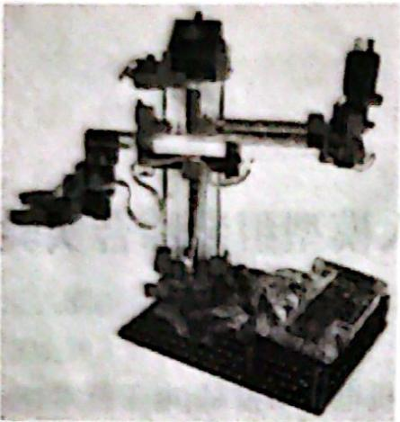


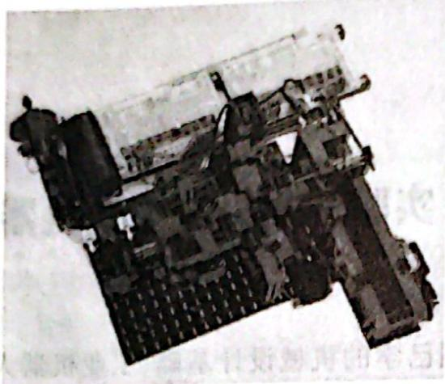

(a) 三自由度机械手

(b) 气动加工中心

附图1 慧鱼机器人模型方案


附图 1a 为三自由度机械手,轮廓尺寸为 $385 \, mm \times 270 \, mm \times 350 \, mm$ , 可通过 PLC 控制, 工作电压为 $24 \, V$ 。它含一个手臂夹子、四个 $24 \, V$ 直流电动机、四个限位开关和四个脉冲计数器, 模型定位在稳定的木板上。轴 1 的自由度为 $180^{\circ}$ ; 轴 2 前进或后退 $100 \, mm$ ; 轴 3 有 $160 \, mm$ 的升降。机械手可在三个自由度移动并可夹取工件, 可与带有传送带的冲床、双工作台操作流水线或气动加工中心联动。附图 1b 为气动加工中心, 轮廓尺寸为 $450 \, mm \times 410 \, mm \times 190 \, mm$ , 可通过 PLC 控制, 工作电压为 $24 \, V$ 。它含一个料仓、一个旋转工作台、一条传送带、一套气体压缩装置、三个气缸、两个直流电动机、两个光电传感器和九个接触传感器, 模型组装在 Fischertechnik 底板上, 可与三自由度机械手联动。 

LLWin 3.0 软件编程界面如附图 2 所示。 

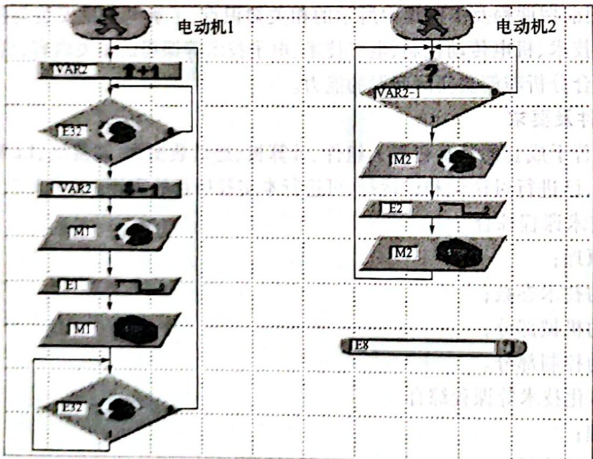

附图2 LLWin3.0软件编程界面


### 四、实验实施步骤

#### 1. 阅读慧鱼机器人说明书

根据慧鱼机器人说明书的内容,了解相应慧鱼机器人的基本结构、工作原理、包含的组件等。 

#### 2. 确定慧鱼机器人的组件

根据已有的器材,指定几种组装方案,由学生利用机电一体化手段,为实现机器人的动作,确定需要选用的不同的机构和传动装置(如连杆与凸轮、行星传动与蜗杆传动等)。 

#### 3. 慧鱼机器人的机械和电气组装

首先进行机械构件的组装,机械构件装配时要确保构件到位,不滑动;其次进行电子构件的装配,电子构件装配时要注意电子元件的正、负极性,接线稳定、可靠,没有松动;最后对整个模型进行整体布线调整,整个模型完成后还要考虑模型的美观,整体布线要规范。 

#### 4. 慧鱼机器人运动程序的编制

由教师给定组装后不同慧鱼机器人要实现的动作及其运动速度和轨迹等参数,利用 LLWin 3.0 软件编制相应程序,通过 RS232 串口把控制程序下载到慧鱼机器人的单片机中。 

#### 5. 运行程序, 记录参数, 分析结果

根据试运行情况,反复进行调试,直到达到教师给定的相应参数,确认无误后进行相应数据的记录并分析结果。 

### 五、思考问题

1) 机器人的主要技术参数有哪些？ 

2）慧鱼机器人组装与调试过程中应注意哪些问题？ 

3）慧鱼机器人中单片机的选择注意事项有哪些？ 

4) 简述机器人的基本组成。 

### 六、实验成绩评定办法

实验成绩评定比例为考勤 20%，安装操作 20%，编制程序 20%，实验报告 40%。最终成绩按优秀(90～100)、良好(80～89)、中等(70～79)、及格(60～69)和不及格(60以下)五级记分制评定。 

实验报告模板略。 

## 实验示例二 MOTOMAN 机器人焊枪动作与编程实验

### 一、实验目的

1) 了解自动控制单循环实验； 

2）了解自动控制及程序循环实验； 

3）理解焊枪动作的位姿变换。 

### 二、实验设备

MOTOMAN YASNAC XRC UP6 型机器人一台； 

机器人控制柜一台。 

### 三、注意事项

1）机器人示教作业前要检查以下事项，有异常则应及时修理或采取其他必要措施： 

① 机器人动作有无异常； 

② 外部电线遮盖物及外包装有无破损。 

2）示教编程器用完后须放回原处。 

3）不要强迫机器人移动，更不要用手扒机器人或站在机器人上。 

4）不要依靠 XRC 和其他控制柜，不要随意按开关、按钮。 

5）通电过程中，除专职的操作人员外，其他人员均不得触摸XRC和示教编程器。 

6）注意安全，听从老师的安排，不要停留在机器人的工作范围内。 

7）着装要求： 

① 操作机器人时禁止戴手套； 

② 严禁戴特别大的耳环、饰物等； 

③ 务必穿安全鞋、戴安全帽。 

### 四、实验步骤

机器人是一个在三维空间中具有较多自由度,并能实现拟人动作和功能的机器;而工业机器人则是在工业生产上应用的机器人,是用来进行搬运材料、零件、工具等可再编程的多功能机械手,或通过不同程序的调用来完成各种工作任务的特种装置。 

机器人焊枪动作,首先归原点,然后机器人根据事先编好的程序运动,到达工件部位,推动执行机构,焊枪按照程序运动,机器人复位,工作完毕。 

### 五、操作步骤

1）根据“三、注意事项”第1)项进行检查； 

2）将程序用示教编程器输入控制柜； 

3）检查焊枪安装正确与否； 

4）运行程序； 

5）观看机器人各关节部位的运动过程。 

MOTOMAN UP6 型机器人用于焊接作业时的示教编程实例(其轨迹见附图 3), 经过示教会自动产生一个焊接程序, 见附表 1。 

要焊接附图 3 所示的焊缝, MOTOMAN UP6 型机器人首先在示教状态下走出图示轨迹, 说明如下: 程序点 1、6 为待机位置, 两点重合, 选取时需处于工件、夹具不干涉的位置, 程序点 5 在向程序点 6 移动时, 也需处于与工件、夹具不干涉的位置。从程序点 1 到程序点 2 再到程序点 3 和从程序点 4 到程序点 5 再回到程 

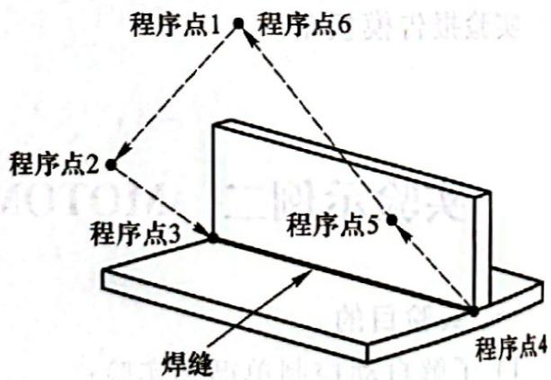

附图3 MOTOMAN UP6型机器人焊接示教


序点6为空行程，对轨迹无要求，所以选择工作状态佳、效率高的关节插补，生成的代码为MOVJ。空行程中在接近焊接的轨迹段时选择慢速。程序中关节插补的速度用VJ表示，数值代表最高关节速度的百分比，如 $\mathrm{VJ} = 25.00$ 表示以关节最高运行速度的 $25\%$ 运动。 

从程序点3到程序点4为焊接轨迹段，以焊接轨迹的要求（此处为直线）走过，生成的代码为 

MOVL, 以要求的焊接速度前进, 速度用 V 表示, 单位为 mm/s。程序中 ARCON 为引弧指令, ARCOF 为熄弧指令, 分别用于引弧的开始和结束, 也是在示教过程中通过按下示教编程器的功能键自动产生的。NOP 表示程序的开始, END 表示程序的结束。 

### 六、填表

在附表 1 中填写焊接程序各行的内容说明,并对各行的内容进行解释。 


附表 1 焊接程序


<table><tr><td>行</td><td>命令</td><td>内容说明</td><td>程序点</td></tr><tr><td>0000</td><td>NOP</td><td></td><td></td></tr><tr><td>0001</td><td>MOVJ VJ=25.00</td><td></td><td></td></tr><tr><td>0002</td><td>MOVJ VJ=25.00</td><td></td><td></td></tr><tr><td>0003</td><td>MOVJ VJ=12.5</td><td></td><td></td></tr><tr><td>0004</td><td>ARCON</td><td></td><td></td></tr><tr><td>0005</td><td>MOVL V=50</td><td></td><td></td></tr><tr><td>0006</td><td>ARCOF</td><td></td><td></td></tr><tr><td>0007</td><td>MOVJ VJ=25.00</td><td></td><td></td></tr><tr><td>0008</td><td>MOVJ VJ=25.00</td><td></td><td></td></tr><tr><td>0009</td><td>END</td><td></td><td></td></tr></table>

### 七、问答题

1) 手爪的开合为什么常用气动方式？ 

2）机器人编程方式有哪几种？ 

3) 什么是机器人离线编程？ 

4）何谓轨迹规划？ 

5) 何谓点位控制和连续轨迹控制？ 

6) 机器人转动件定位方法有哪几种？各适于什么定位场合？ 

### 八、实验成绩评定方法

实验成绩评定方法同实验示例一。 

实验报告模板略。 

## 实验示例三 欠驱动冗余机械臂

### 一、概述

机械臂是机器人的重要组成部分,同时也是机器人学的一个研究热点。传统的2R全驱动机械臂由两个驱动电动机和两连杆构成,此种控制已经趋于成熟。由于轻型化和可靠性要求的提高,依靠动力耦合性进行控制的欠驱动冗余机械臂已成为目前研究的热点。欠驱动冗余机械臂是一类含有被动关节、控制输入少于系统自由度的机械系统,由于系统中某个或某些关节不具有 驱动装置,所以减轻了机器人的重量,降低了成本,同时也减少了能源的消耗,非常适用于对能源和重量有要求的场合,如水下机器人、太空机器人等。 

欠驱动冗余机械臂为平面三连杆串联结构，一、二级杆为主动杆，末端杆为被动杆，关节部分配有编码器和制动器，主要用于欠驱动优化控制的研究，而欠驱动控制是空间技术中容错技术的重要方向。 

### 二、实验内容

#### 实验1 绝对编码器采集实验

绝对型旋转光电编码器，因其每一个位置绝对唯一、抗干扰、无需掉电记忆，已经越来越广泛地应用于各种工业系统中的角度、长度测量和定位控制。绝对编码器光码盘上有许多道刻线，每道刻线依次以2线、4线、8线、16线编排。 

在编码器的每一个位置,通过读取每道刻线的通、暗,获得一组从 $2^{0} \sim 2^{n-1}$ 的唯一的二进制编码(格雷码),这就称为 $n$ 位绝对编码器。这样的编码器是由码盘的机械位置决定的,它不受停电、干扰的影响。绝对编码器由机械位置决定的每个位置的唯一性,它无需记忆,无需找参考点,编码器的抗干扰特性、数据的可靠性大大提高。 

由于绝对编码器在定位方面明显地优于增量式编码器,已越来越多地应用于工控定位中。绝对型编码器因其精度高、输出位数较多,如仍用并行输出,其每一位输出信号必须确保连接得很好,对于较复杂工况还要隔离,连接电缆芯数多,由此带来诸多不便和降低可靠性,因此绝对编码器在多位数输出型一般均选用串行输出或总线型输出,德国生产的绝对型编码器串行输出最常用的是SSI(同步串行输出)。 

欠驱动冗余机械臂中选用的光电编码器线数为2500线，经运动控制卡四倍频后为10000线，也就是说电动机旋转一周，光电编码器计数10000个，那么计数对应角度公式（摆杆竖直向下时角度为零，逆时针方向为正）如下： 

$$
\theta = 2 \pi n / 1 0 0 0 0\tag{FL-1}
$$

式中： $\theta$ ——摆杆实际旋转角度，rad； 

n——光电编码器实际读数。 

#### 实验 2 交流伺服电动机认知及驱动元件连接实验

##### 2.1 实验介绍

交流伺服电动机的结构主要可分为两部分, 即定子部分和转子部分。其中定子的结构与旋转变压器的定子基本相同, 在定子铁心中也安放着空间互成 $90^{\circ}$ 电角度的两相绕组, 其中一组为励磁绕组, 另一组为控制绕组, 交流伺服电动机是一种两相的交流电动机。交流伺服电动机使用时, 励磁绕组两端施加恒定的励磁电压 $U_{\mathrm{f}}$ , 控制绕组两端施加控制电压 $U_{\mathrm{k}}$ , 当定子绕组加上电压后, 伺服电动机很快就会转动起来。通入励磁绕组及控制绕组的电流在电动机内产生一个旋转磁场, 旋转磁场的转向决定了电动机的转向, 当任意一个绕组上所加的电压反相时, 旋转磁场的方向就发生改变, 电动机的方向也发生改变。为了在电动机内形成一个圆形旋转磁场, 要求励磁电压 $U_{\mathrm{f}}$ 和控制电压 $U_{\mathrm{k}}$ 之间应有 $90^{\circ}$ 的相位差, 常用的方法有: 

1）利用三相电源的相电压和线电压构成90°的移相； 

2）利用三相电源的任意线电压； 

3）采用移相网络； 

4）在励磁相中串联电容器。 

在控制策略上,基于电动机稳态数学模型的电压频率控制方法和开环磁通轨迹控制方法都难以达到良好的伺服特性,当前普遍应用的是基于永磁电动机动态解耦数学模型的矢量控制方法,这是现代伺服系统的核心控制方法。为了提高控制特性和稳定性,人们提出了反馈线性化控制、滑模变结构控制和自适应控制等理论,还有不依赖数学模型的模糊控制和神经网络控制等方法。高性能伺服控制必须依赖高精度的转子位置反馈,人们为取消这个环节,研发了无位置传感器技术。在产品的商品化过程中,采用无位置传感器技术只能达到大约1:100的调速比,可以用在一些低档的、对位置和速度精度要求不高的伺服控制场合中,比如单纯追求快速启停和制动的缝纫机伺服控制。无位置传感器技术的高性能化还有较长的路要走。 

##### 2.2 驱动元件连接

驱动元件连接示意图如附图4所示,编码器集成在交流伺服电动机尾部,编码器将电动机运动转化成电脉冲并反馈给运动控制器,运动控制器通过以太网与PC通信,PC将计算控制量发给交流伺服驱动器,由驱动器来实现对电动机的精确控制。伺服驱动器电气接线图如附图5所示。 

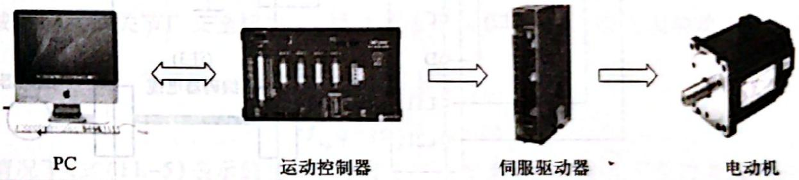

附图4 驱动元件连接示意图


#### 实验 3 运动学、动力学建模实验

对一类被动关节中安装制动器和位置检测元件的欠驱动冗余机械臂进行研究。假设机械臂中被动关节的数目为 $n_{\mathrm{p}}$ ，主动关节的数目为 $n_{\mathrm{a}}, n = n_{\mathrm{p}} + n_{\mathrm{a}}$ 为机械臂的位姿空间维数， $m$ 为机械臂操作空间的维数。其中 $n > m$ ，即机械臂在运动学上是存在冗余度的，但是 $m > n_{\mathrm{a}}$ ，即机械臂中主动关节的数目不多于操作空间的维数（只考虑 $m = n_{\mathrm{a}}$ 的情况进行研究）。针对这种系统，当被动关节处于自由状态时，其速度级运动学方程可写为 

$$
\dot {X} = J _ {\mathrm{F}} \dot {q}\tag{FL-2}
$$

式中： $X\in R_{\mathrm{m}}$ ——机械臂的末端位姿矢量； 

$J_{F} \in R^{m \times n}$ ——机械臂的雅可比矩阵； 

$q \in R_{n}$ ——机械臂的广义坐标矢量。 

当机械臂中被动关节处于锁定状态时,系统运动学方程变为 

$$
\dot {X} = J _ {\mathrm{L}} \dot {\theta}\tag{FL-3}
$$

式中： $J_{\mathrm{L}}\in R^{m\times n_{\mathrm{a}}}$ ——新的机械臂雅可比矩阵； 

$\theta\in R^{n}$ ——新的机械臂广义坐标矢量。 

式(FL-3)不失一般性,考察附图6所示的平面2R欠驱动非冗余机械臂,若给该机械臂连杆上各增加一个被动关节,则该机械臂变为平面4R欠驱动冗余机械臂,如附图7所示。 

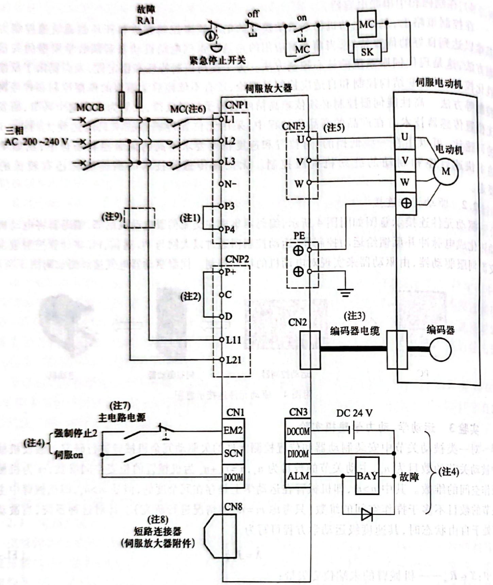

附图 5 伺服驱动器电气接线图


显然 $[q_{1} q_{2} q_{3} q_{4}]^{\mathrm{T}}$ 为被动关节自由时机械臂的一组广义坐标，而 $[\theta_{1} \theta_{2}]^{\mathrm{T}}$ 为被动关节锁定时的一组广义坐标。这两种运动学模型完全不同，因此被动关节中安装制动器的欠驱动冗余机械臂具有机构重构能力。当被动关节处于自由状态时，机械臂的位姿空间维数增加，机械臂在机构上具有“自运动”的能力，但是由于系统输入空间的维数（对应于主动关节数目）少于机械臂位姿空间的维数，机械臂研究不能在低速静态实现自运动的水平上。机械臂被动关节的位置控制只能通过主、被动关节间的动力学耦合实现，因此有必要从动力学水平上研究欠驱动冗余机械臂的控制问题。 

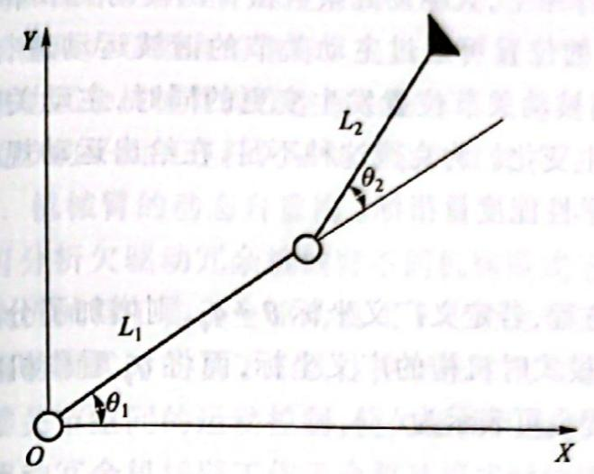


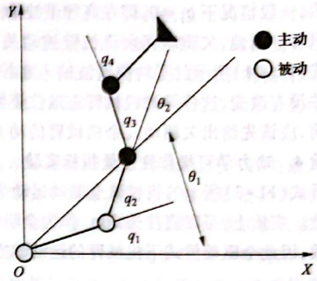

附图 6 平面 2R 欠驱动非冗余机械臂

附图 7 平面 4R 欠驱动冗余机械臂


由广义坐标表示的欠驱动冗余机械臂关节空间动力学模型可表示为 

$$
M \ddot {q} + c (\dot {q}, q)\tag{FL-4}
$$

式中： $M \in R^{n \times n}$ ，是系统的质量惯性矩阵； $c(\dot{q}, q) \in R^{n}$ 是包括诸如离心力、科氏力、重力、摩擦力等在内的与关节角速度及其乘积有关的项。 

设机械臂的主动关节广义坐标为 $q_{a}$ ，被动关节广义坐标为 $q_{p}$ ，则系统的动力学方程可写为分块形式： 

$$
M _ {\mathrm{aa}} \ddot {q} + M _ {\mathrm{ap}} \ddot {q} + c _ {\mathrm{a}} = \tau_ {\mathrm{a}}\tag{FL-5}
$$

$$
\boldsymbol {M} _ {\mathrm{ap}} ^ {\mathrm{T}} \ddot {\boldsymbol {q}} + \boldsymbol {M} _ {\mathrm{pp}} \ddot {\boldsymbol {q}} _ {\mathrm{p}} + \boldsymbol {c} _ {\mathrm{p}} = 0\tag{FL-6}
$$

一般情况下,式(FL-5)表示的是欠驱动冗余机械臂系统的二阶非完整约束,这是一种特例。这里针对一般情况进行研究,式(FL-6)描述的是欠驱动冗余机械臂中主、被动关节间的动力学耦合关系。首先考察系统的稳态周期运动特性,假设系统主动关节的运动规律为 

$$
\boldsymbol {q} _ {\mathrm{a}} = \boldsymbol {A} \cos \omega t\tag{FL-7}
$$

则对式(FL-7)微分得到 

$$
\dot {q} _ {\mathrm{a}} = - A \omega \sin \omega t\tag{FL-8}
$$

继续对式(FL-8)微分得到 

$$
\ddot {q} _ {\mathrm{a}} = - A \omega^ {2} \cos \omega t\tag{FL-9}
$$

式中： $\omega$ ——主动关节简谐运动的角频率； 

A——振幅。 

设 $\omega$ 足够大，而 $A$ 足够小，将式(FL-9)代入式(FL-6)得到 

$$
\ddot {\boldsymbol {q}} = - \boldsymbol {M} _ {\mathrm{pp}} ^ {- 1} \left(\boldsymbol {c} _ {\mathrm{p}} - A \boldsymbol {M} _ {\mathrm{ap}} ^ {\mathrm{T}} \omega^ {2} \cos \omega t\right)\tag{FL-10}
$$

式(FL-10)中, 虽然 $M_{\mathrm{pp}}^{-1}, c_{\mathrm{p}}, M_{\mathrm{ap}}^{\mathrm{T}}$ 均与机械臂的位姿有关, 在较长时间段内看是非线性的变化量, 但是由于 $\omega$ 为较大的数, 与 $\cos \omega t$ 相比, $M_{\mathrm{pp}}^{-1}, c_{\mathrm{p}}, M_{\mathrm{ap}}^{\mathrm{T}}$ 均为慢变量。在 $[0, 2\pi/\omega]$ 上认为 $M_{\mathrm{pp}}^{-1}, c_{\mathrm{p}}, M_{\mathrm{ap}}^{\mathrm{T}}$ 为常量, 把式(FL-10)在谐波输入的一个周期上进行积分得到 

$$
\begin{array}{r l} \boldsymbol {q} _ {\mathrm{p}} & = \int_ {0} ^ {2 \pi / \omega} \int_ {0} ^ {t} \left[ - M _ {\mathrm{pp}} ^ {- 1} (\boldsymbol {c} _ {\mathrm{p}} - A M _ {\mathrm{ap}} ^ {\mathrm{T}} \omega^ {2} \cos \omega t) \right] \mathrm{d} ^ {2} t \\ & = - 2 \frac {\pi}{\omega} M _ {\mathrm{pp}} ^ {- 1} \boldsymbol {c} _ {\mathrm{p}} + c _ {1} \frac {2 \pi}{\omega} + c _ {2} \end{array}\tag{FL-11}
$$

式中： $c_{1}, c_{2}$ 为积分常数。 

显然,一般情况下 $q_{\mathrm{r}} \neq 0$ , 即在高频谐波输入作用下, 欠驱动冗余机械臂的被动关节平衡位置将发生飘移。因此, 欠驱动冗余机械臂被动关节的位置可通过主动关节的谐波运动进行控制。然而由式(FL-11)所示的零均值谐波输入在控制被动关节位置发生变更的同时, 主动关节的平衡位置并没有改变, 这将导致机械臂末端位姿发生变化。为克服这种不足, 在给出运动规划和控制方法前, 应该先给出欠驱动冗余机械臂的动力学性能度量指标。 

#### 实验4 动力学可操作性度量指标实验

查看式(FL-3)所示的机械臂全驱动运动学方程, 若定义广义坐标 $\theta \neq q_{p}$ , 则增加了分析问题的复杂性。实质上, 可以直接选定 $q_{\bullet}$ 作为全驱动模式时机构的广义坐标, 而将 $q_{p}$ 看作机械臂的结构参数、因此全驱动模式下机械臂的运动学方程也可表示为 

$$
\dot {X} = J _ {\mathrm{a}} \dot {q} _ {\mathrm{a}}\tag{FL-12}
$$

式中： $J_{s}$ 表示 $J_{r}$ 中对应于主动关节广义坐标的雅可比矩阵的子矩阵。相应的，机械臂在全驱动模式下，其动力学方程可由式(FL-5)变为 

$$
M _ {a} \ddot {q} _ {a} + \bar {c} _ {a} = \tau_ {a}\tag{FL-13}
$$

式中： $\dot{c}_{s}$ 表示令 $\dot{q}_{s}=0$ 后 $c_{s}$ 剩余的部分。 

令 $E(q_{\mathrm{a}}) = J_{\mathrm{a}}M_{\mathrm{a}}^{-1}$ , 欠驱动冗余机械臂在全驱动模式下工作时, 动力学可操作性指标可定义为 

$$
\omega = \sqrt {\det [ E (\boldsymbol {q} _ {a}) E ^ {T} (\boldsymbol {q} _ {a}) ]}\tag{FL-14}
$$

式(FL-14)表示欠驱动冗余机械臂在全驱动工作模式下的动力学可操作性度量指标,它阐述了机械臂末端在工作空间中各个方向的加速性能。式(FL-14)的值为矩阵 $E(q_{a})$ 的奇异值之积,即 

$$
\omega = \prod_ {i = 1} ^ {m} \sigma_ {i}\tag{FL-15}
$$

另一种更便于应用的描述机械臂动态可操作性的指标是条件数： 

$$
\lambda = \frac {\sigma_ {1}}{\sigma_ {\square}}\tag{FL-16}
$$

式中: $\sigma_{1}$ 和 $\sigma_{\text{m}}$ 分别为矩阵 $E(q_{\text{s}})$ 的最大和最小奇异值。在仿真研究中, 将基于条件数来度量机械臂的动态可操作性。当 $\lambda = 1$ 时, 表示机械臂具有各向同性的操作性能, 这是进行机械臂动力学优化设计和最优动力学控制中被广泛采用的一种度量方法。 

### 三、实验目的

#### 1. 机械臂动力学建模

机械臂的动力学模型对于机械臂控制有极大的促进作用。长期以来，机器臂的动力学分析一直是难以解决的问题，主要表现在数学建模复杂、运算量大、难以实现实时控制等，这些限制了机器人的设计和应用性能，制约了精确的轨迹跟踪。而动力学建模实验的应用无疑对提高机器人的设计性能、降低设计成本、减少产品开发时间提供了帮助，并为机械手的控制研究奠定了基础。 

#### 2. 动力学耦合奇异研究

欠驱动冗余机械臂的运动只能从动力学水平进行控制,从动关节的运动是通过主动关节的动力学耦合间接控制的。主、被动关节之间的动力学耦合特征与机械臂关节空间的位姿有关,因此在欠驱动冗余机械臂运动过程中可能发生动力学耦合奇异,某些被动关节的运动变得不可控。从关 节空间和操作空间两个角度分析欠驱动冗余机械臂的动力学耦合问题,给出从以上两种工作空间度量系统动力学耦合的指标。提出一种基于输入变量非线性变换的滑模变结构控制方法,用于实现欠驱动冗余机械臂操作空间中的连续轨迹控制。通过平面二连杆欠驱动冗余机械臂和只有一个主动关节的平面三连杆欠驱动冗余机械臂进行了仿真,仿真结果证明提出的控制方法是可行的。 

#### 3. 机械臂的动态自重构

可分析欠驱动冗余机械臂不同机构模式下运动学模型及动力学模型之间的关系,给出欠驱动冗余机械臂工作于全驱动模式下的动力学操作性度量指标。提出一种欠驱动冗余机械臂工作在欠驱动模式时的基于非线性控制技术的自运动控制方法,利用少维数的控制输入实现机械臂的多维关节空间的运动控制,使欠驱动冗余机械臂能完成自运动流形控制。可提出一种动态提高欠驱动冗余机械臂工作于全驱动模式时的操作性能的方法,通过有两个被动关节的平面4R欠驱动冗余机械臂进行仿真验证。 

### 四、设备特点

1）采用 PC+运动控制器开放式控制平台； 

2）驱动关节采用交流伺服电动机； 

3）连杆为铝合金材料，长度可调； 

4）主传动部分采用高精度进口减速器； 

5）各非驱动关节配有电磁抱闸和10 000线编码器； 

6）控制方式为速度模式和力矩模式。 

### 五、技术参数

交流伺服驱动器电气接线图的主要技术参数见附表2。 


附表 2 交流伺服驱动器电气接线图的主要技术参数


<table><tr><td rowspan="5">基本技术指标</td><td>1</td><td>机械结构</td><td>水平关节型(3自由度)</td></tr><tr><td>2</td><td>载荷质量</td><td>1kg</td></tr><tr><td>3</td><td>本体质量</td><td>30kg</td></tr><tr><td>4</td><td>外形尺寸</td><td>900mm×400mm×500mm</td></tr><tr><td>5</td><td>安装方式</td><td>地面安装</td></tr><tr><td rowspan="4">连杆指标</td><td>1</td><td>连杆1中心距</td><td>250mm</td></tr><tr><td>2</td><td>连杆2中心距</td><td>250mm</td></tr><tr><td>3</td><td>连杆3中心距</td><td>250mm</td></tr><tr><td>4</td><td>连杆刚度</td><td>连杆1、2变刚度</td></tr><tr><td></td><td colspan="2">主动轴最大角速度</td><td>720°/s</td></tr><tr><td rowspan="2">关节角度分辨率</td><td>1</td><td>编码器分辨率</td><td>10 000脉冲/360°</td></tr><tr><td>2</td><td>倍频</td><td>4倍频</td></tr><tr><td rowspan="3">电动机指标</td><td>1</td><td>电动机类型</td><td>三菱交流伺服电动机</td></tr><tr><td>2</td><td>电动机功率</td><td>轴2:100W轴1:200W</td></tr><tr><td>3</td><td>电动机转速</td><td>最高为3000r/min</td></tr><tr><td rowspan="3">减速器指标</td><td>1</td><td>减速器类型</td><td>行星减速器</td></tr><tr><td>2</td><td>减速比</td><td>1:15</td></tr><tr><td>3</td><td>间隙</td><td>小于19.05mm</td></tr><tr><td rowspan="3">控制器指标</td><td>1</td><td>总线形式</td><td>PCI总线</td></tr><tr><td>2</td><td>轴数</td><td>4</td></tr><tr><td>3</td><td>控制模式</td><td>速度控制</td></tr><tr><td></td><td colspan="2">抱闸</td><td>自由杆</td></tr></table>

### 六、思考题

1）系统刚性改变对控制效果有什么影响？ 

2）增量式辅助编码器在欠驱动系统中的作用？ 

3）欠驱动系统相对于完全驱动系统有哪些优势？ 

4）欠驱动系统的典型应用有哪些？ 

## 实验示例四 二自由度机器人

### 一、概述

二自由度机器人是为了满足普通高等院校机械电子工程、机械设计制造及其自动化和电气工程及其自动化等专业进行工业机器人应用培训和相关机电及控制类基础课程教学的实验需要而设计开发的教学系统，属于最基础的机器人控制系统。 

### 二、实验内容

1）运动控制卡应用与基础运动控制实验； 

2）平面直线插补计算与程序控制实验； 

3）平面圆弧插补计算与程序控制实验。 

### 三、实验步骤

“PC+运动控制卡”的控制架构是当前最流行的机器人控制系统方案,而运动控制卡又可以说是整个机器人控制系统方案的核心。运动控制卡的性能直接影响机器人的速度、控制精度与可靠性。 

运动控制卡是一种基于 PC 及工业 PC、用于各种运动控制场合(包括位移、速度、加速度等)的上位控制单元。运动控制卡一般基于 PCI 总线,是利用高性能微处理器(如 DSP)及大规模可编程器件实现多个电动机的多轴协调控制的一种高性能的伺服电动机/步进电动机控制器,包括脉冲输出、脉冲计数、数字输入、数字输出、D/A 输出等功能,它可以发出连续的、高频率的脉冲串,通过改变发出脉冲的频率来控制电动机的速度,改变发出脉冲的数量来控制电动机的位置,它的脉冲输出模式包括脉冲/方向、脉冲/脉冲方式。脉冲计数可用于编码器的位置反馈,提供机器准确的位置,纠正传动过程中产生的误差。数字输入/输出点可用于正负限位开关、原点开关等。库函数包括 S 型、T 型加速,直线插补和圆弧插补,多轴联动函数等。运动控制卡目前广泛应用于工业自动化 控制领域中需要精确定位、定长的位置控制系统和基于PC的NC控制系统。具体就是将实现运动控制的底层软件和硬件集成在一起，使其具有伺服电动机控制所需的各种速度、加速度、位置控制功能，这些功能能通过计算机方便地调用。运动控制卡的典型应用如附图8所示。 

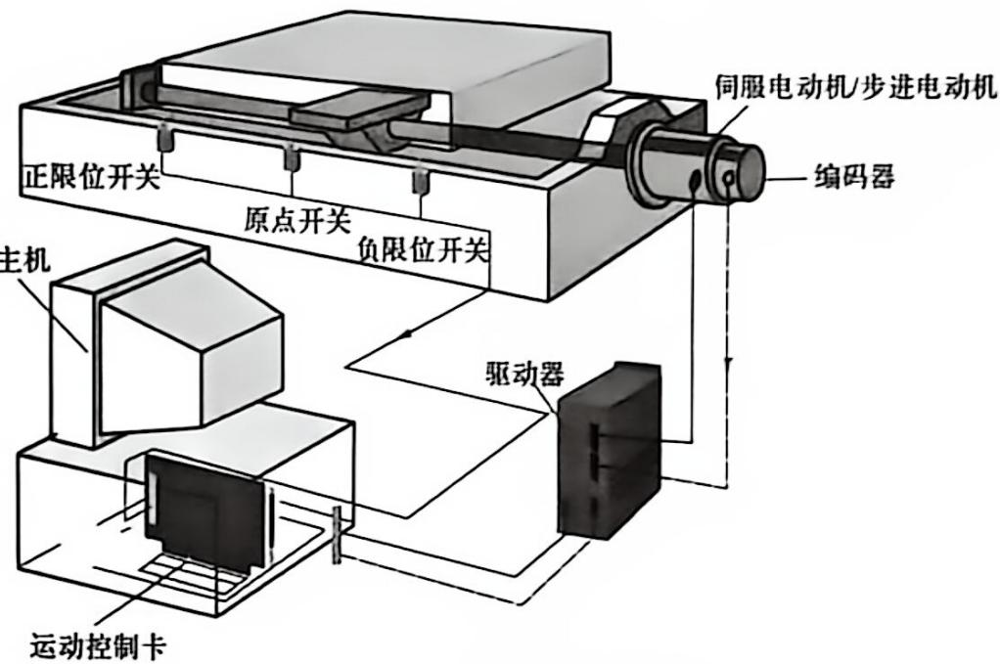

附图8 运动控制卡的典型应用


二自由度机器人系统选用的是 GE-400-PV 运动控制卡, GE-400-PV 运动控制卡一般与接线端子板配套使用, 运动控制卡安装在 PC 主板的 PCI 卡槽中 (如若是 ISA 总线, 则安装在 ISA 卡槽中), 接线端子板固定在二自由度机器人的电气控制柜中, 然后通过并口线相连接。 

GE-400-PV 运动控制卡的接线端子板最多可提供四路电动机接口和两路辅助编码器接口, 端子板上标有 +12 V/24 V 的端子接 12 V/24 V 电源, 标有 OGND 的接外部电源地, 至于使用的外部电源的具体电压值, 取决于外部的传感器和执行机构的供电要求, 使用时应根据实际要求选择。 

GE-400-PV 运动控制卡接线端子板接口示意图如附图 9 所示, 具体接口定义见附表 3, CN5、CN6、CN7、CN8 电动机接口引脚定义见附表 4。 

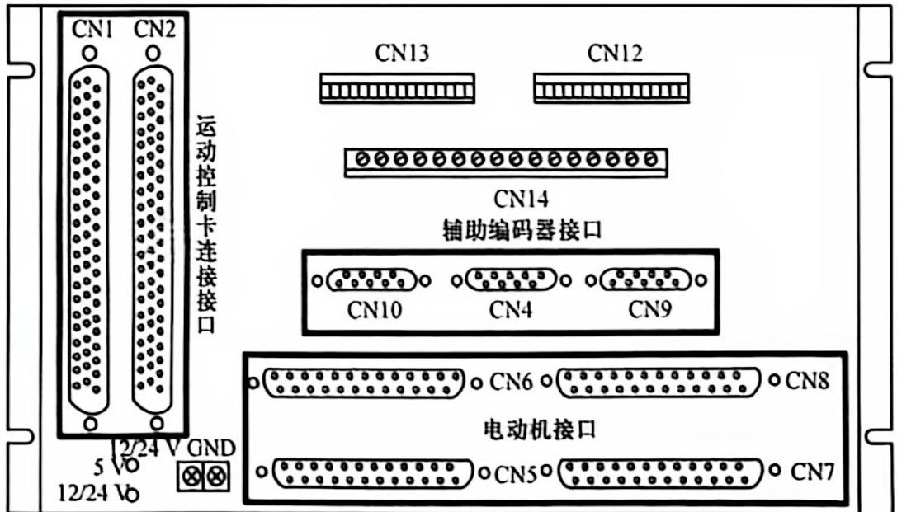

附图 9 CE-400-PV 运动控制卡接线端子板接口示意图

附表 3 GE-400-PV 运动控制卡接线端子板接口定义


<table><tr><td>接口</td><td>功能</td></tr><tr><td>CN1</td><td>运动控制卡连接接口</td></tr><tr><td>CN2</td><td>运动控制卡连接接口</td></tr><tr><td>CN4</td><td>空闲/备用</td></tr><tr><td>CN5</td><td>轴1电动机接口</td></tr><tr><td>CN6</td><td>轴2电动机接口</td></tr><tr><td>CN7</td><td>轴3电动机接口</td></tr><tr><td>CN8</td><td>轴4电动机接口</td></tr><tr><td>CN9</td><td>辅助编码器接口1</td></tr><tr><td>CN10</td><td>辅助编码器接口2</td></tr><tr><td>CN12</td><td>专用I/O信号输入接口</td></tr><tr><td>CN13</td><td>通用I/O输入接口</td></tr><tr><td>CN14</td><td>通用I/O输出接口</td></tr></table>


附表 4 CN5、CN6、CN7、CN8 电动机接口引脚定义


<table><tr><td>引脚</td><td>信号</td><td>说明</td></tr><tr><td>1</td><td>OGND</td><td>外部电源地</td></tr><tr><td>2</td><td>ALM</td><td>驱动报警</td></tr><tr><td>3</td><td>ENABLE</td><td>驱动允许</td></tr><tr><td>4</td><td>A-</td><td>编码器输入</td></tr><tr><td>5</td><td>B-</td><td>编码器输入</td></tr><tr><td>6</td><td>C-</td><td>编码器输入</td></tr><tr><td>7</td><td>+5 V</td><td>电源输出</td></tr><tr><td>8</td><td>DAC</td><td>模拟输出</td></tr><tr><td>9</td><td>DIR</td><td>步进方向输出</td></tr><tr><td>10</td><td>GND</td><td>数字地</td></tr><tr><td>11</td><td>PULSE-</td><td>步进脉冲输出</td></tr><tr><td>12</td><td>保留</td><td>保留</td></tr><tr><td>13</td><td>GND</td><td>数字地</td></tr><tr><td>14</td><td>OVCC</td><td>+12 V/24 V 输出</td></tr><tr><td>15</td><td>RESET</td><td>驱动报警复位</td></tr><tr><td>16</td><td>保留</td><td>保留</td></tr><tr><td>17</td><td>A+</td><td>编码器输入</td></tr><tr><td>18</td><td>B+</td><td>编码器输入</td></tr><tr><td>19</td><td>C+</td><td>编码器输入</td></tr><tr><td>20</td><td>GND</td><td>数字地</td></tr><tr><td>21</td><td>GND</td><td>数字地</td></tr></table>

续表 

<table><tr><td>引脚</td><td>信号</td><td>说明</td></tr><tr><td>22</td><td>DIR-</td><td>步进方向输出</td></tr><tr><td>23</td><td>PULSE+</td><td>步进脉冲输出</td></tr><tr><td>24</td><td>GND</td><td>数字地</td></tr><tr><td>25</td><td>保留</td><td>保留</td></tr></table>

GE-400-PV 运动控制卡支持脉冲量/模拟量两种输出方式,用户可以根据实际系统的需要选择不同的输出方式,如果系统对位置要求比较高,一般使用脉冲量输出功能,此时伺服驱动器应该设置成位置控制模式;如果系统对速度或者加速度响应要求比较高,则需要使用模拟量输出功能,伺服驱动器应该设置成速度控制模式;两种输出模式的接线方式也不一样。GE-400-PV 运动控制卡模拟量输出的电气接线图如附图 10 所示。 

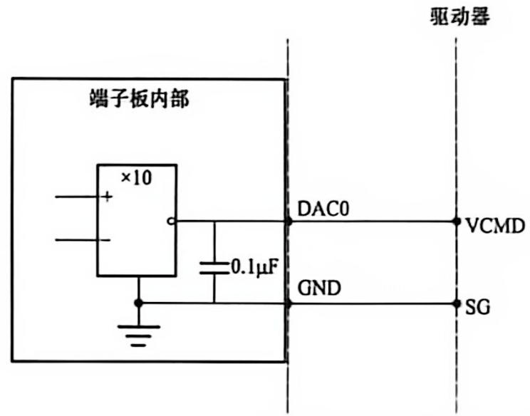

附图10 GE-400-PV运动控制卡模拟量输出的电气接线图


GE-400-PV 运动控制卡提供 DOS 下的 C 语言函数库和 Windows 环境下的动态链接库, 可采用 VC、VB 和 Delphi 等多种主流的开发工具开发机器人应用程序, 只需要连接动态链接库, 就可以调用函数库提供的任何函数指令, 实现二自由度机器人协调闭环控制, 如附图 11 所示。 

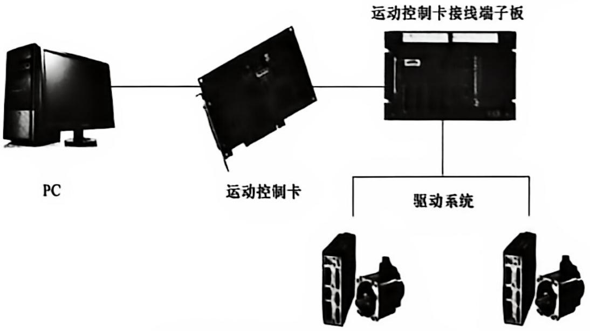

附图11 二自由度机器人控制架构


### 四、实验目的

1）熟悉运动控制的基础知识； 

2）掌握机器人的系统组成及其控制结构传动方式； 

3）研究机器人插补算法； 

4）研究机器人运动路径优化。 

### 五、设备特点

1）臂体采用铝合金高强度构架，重量和噪声小； 

2）传动部件采用谐波精密减速器； 

3）驱动部分采用交流伺服电动机； 

4）末端配有弹性画笔； 

5）控制程序采用 VC++ 开发，程序代码开放。 

### 六、主要技术参数

伺服电动机参数表见附表5。 


附表 5 伺服电动机参数表


<table><tr><td colspan="2">项目</td><td>指标</td></tr><tr><td rowspan="2">运动精度脉冲当量/r</td><td>关节1</td><td>800 000</td></tr><tr><td>关节2</td><td>790 000</td></tr><tr><td colspan="2">末端重复定位精度</td><td>±0.1mm</td></tr><tr><td rowspan="2">每轴最大运动范围</td><td>关节1</td><td>0~300°</td></tr><tr><td>关节2</td><td>0~100°</td></tr><tr><td rowspan="2">每轴最大运动速度</td><td>关节1</td><td>288°/s</td></tr><tr><td>关节2</td><td>284°/s</td></tr><tr><td colspan="2">最大展开半径</td><td>396 mm</td></tr><tr><td colspan="2">高度</td><td>548 mm</td></tr><tr><td colspan="2">电动机类型</td><td>交流伺服电动机</td></tr><tr><td colspan="2">控制卡</td><td>PCI四轴脉冲卡</td></tr><tr><td colspan="2">控制方式</td><td>PC+控制卡</td></tr><tr><td colspan="2">本体质量</td><td>≤30kg</td></tr><tr><td rowspan="2">几何尺寸</td><td>关节1(长度)</td><td>200mm</td></tr><tr><td>关节2(长度)</td><td>135mm</td></tr><tr><td rowspan="4">安装要求</td><td>安装方式</td><td>水平安装</td></tr><tr><td rowspan="3">安装环境</td><td>温度:0~45°C</td></tr><tr><td>相对湿度:20%~90%</td></tr><tr><td>振动:0.5g以下</td></tr></table>

### 七、思考题

1）二自由度机器人在工业中有哪些实际应用？ 

2）二自由度机器人系统主要由哪些组成？ 

3）运动控制卡在机器人系统中的作用是什么？ 

## 实验示例五 并联冗余机器人

### 一、概述

并联机器人具有无摩擦、无间隙、响应快、结构紧凑、刚性好、累积误差小等特点，但其在几何特性方面也存在很多缺点，如运动范围小、灵活性差以及工作空间内存在奇异位姿等，加入冗余度可以改善它的几何特性。由于冗余驱动并联机器人在工作空间、灵活性、避障能力及动力特性等方面具有优势，因而受到了越来越多的重视，特别是其在许多领域中的重要应用，弥补了串联机器人的不足，扩大了整个机器人的应用范围。但从目前的情况来看，在并联机器人的研究领域中关于并联机器人的冗余驱动研究还相对较少，许多方向还有待进一步研究与开发，这些都限制了并联机器人的推广与应用。目前机器人的智能化和自动化程度已经成为控制理论研究和自动化技术应用水平的一个重要标志，因此提高系统的鲁棒性、自适应性及智能化，是一件非常有意义的事情。通过对并联冗余机器人的深入研究，无疑可以提高并联机器人系统的性能和品质，并为其应用研究奠定一定的理论基础，具有重要的理论意义和实用价值。 

### 二、实验内容

1）并联冗余机器人系统认知实验； 

2）并联冗余机器人运动学正解实验； 

3）并联冗余机器人运动学反解实验； 

4）并联冗余机器人工作空间确定实验； 

5）并联冗余机器人运动轨迹绘制实验。 

### 三、研究方向

1）平面高速点位运动控制研究； 

2）平面高速插补方法； 

3）空间插补方法与控制技术； 

4）电动机同步控制方法； 

5）系统动力学研究与控制规划。 

### 四、控制原理

三自由度冗余驱动并联机器人硬件系统主要由 PC、运动控制卡（PCI 总线）、电气控制柜、并联机器人主体组成。运动控制卡安装于 PC 的 PCI 卡槽中，PC 和运动控制卡构成整个系统的控制平台，三台 200 W 交流伺服驱动器作为系统驱动机构固定在电气控制柜内，然后通过并口线与运动控制卡相连，三台 200 W 交流伺服电动机作为最终的执行机构分别安装于并联机器人主体连杆手臂主动杆的起始端，电气控制柜与并联机器人主体之间通过带屏蔽的通信电缆连接，如附图 12 所示。三自由度冗余驱动并联机器人的控制原理如附图 13 所示。 

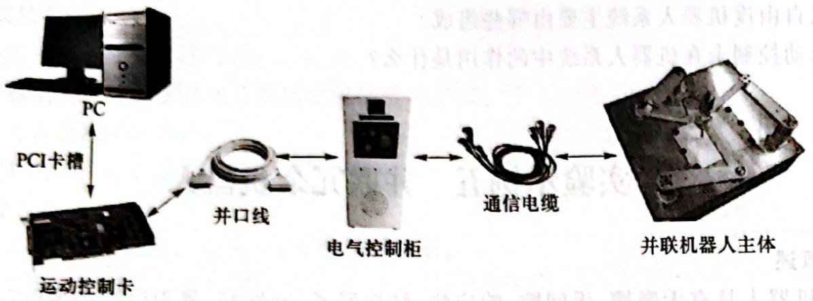

附图 12 三自由度冗余驱动并联机器人硬件系统


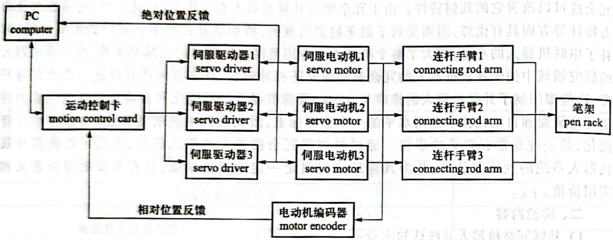

附图 13 三自由度冗余驱动并联机器人的控制原理


### 五、实验步骤

#### 1. 几何参数描述

三自由度冗余驱动并联机器人作为一种创新型并联机器人,是由三个并行链构成的闭链运动系统,即末端执行器通过三个独立运动链与机座相连。其结构上具有大负载能力、低惯量、高速度、高精度等优点,而且在工作空间中没有奇异位姿,运动学性能和动力学性能均优于非冗余机构,在精密仪器、现代机床、高速自动化生产线等领域有着广阔的应用前景。 

并联机器人主体结构示意图如附图14所示,三自由度冗余驱动并联机器人平台主要由三对连杆组成,每一对连杆(AA'和A'E、BB'和B'E、CC'和C'E)构成一只手臂,每一对连杆(手臂)中的第一根连杆为主动杆(AA'、BB'、CC'),第二根连杆为从动杆(A'E、B'E、C'E),三套驱动电动机安装在主动杆的起始端(A、B、C),三套驱动电动机分布在一个正三角形(边长为500 mm)顶点上,三根从动杆末端连接为一个活动关节点E(称为末端E),末端E上安装有工具(笔架)。连杆长 $L=|AA'|=|A'E|=|BB'|=|B'E|=|CC'|=|C'E|=244\ mm$ 。驱动电动机间距离: $D=|AB|=|BC|=|CA|=500\ mm$ 。 

#### 2. 坐标系建立

建立如附图 14 所示的坐标系: 取与 AB 平行且过 $\triangle ABC$ 中心方向为坐标系的 X 轴, AB 的中垂线为 Y 轴 (C 点在 Y 轴上, Y 轴经过三角形 $\triangle ABC$ 的重心); 三根主动杆 $AA'$ , $BB'$ , $CC'$ 与坐标系 

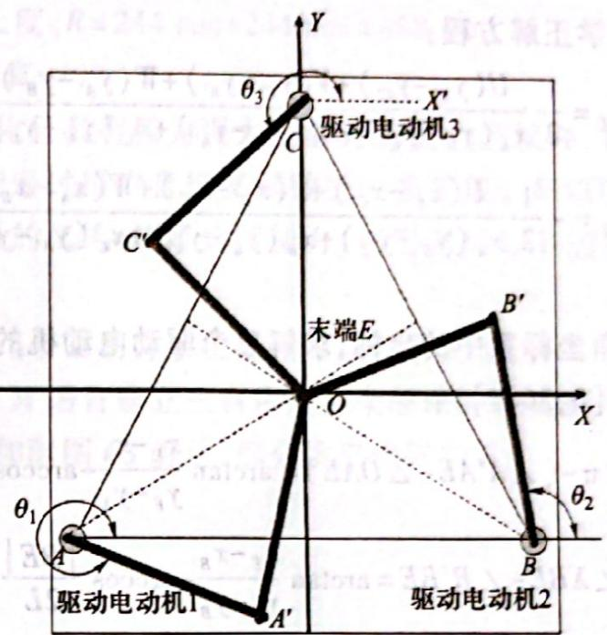

附图 14 三自由度冗余驱动并联机器人机构示意图


X轴方向夹角(驱动电动机的转角)分别记为 $\theta_{1}$ 、 $\theta_{2}$ 、 $\theta_{3}$ ; 根据以上坐标系, 驱动电动机关节 A、B、C 点的直角坐标位置固定, 各点的坐标值如下: 

$$
\left\{ \begin{array}{l l} A \text {点} (x _ {A}, y _ {A}): x _ {A} = - 2 5 0 \mathrm{mm}, & y _ {A} = - 1 4 4. 3 3 7 6 \mathrm{mm} \\ B \text {点} (x _ {B}, y _ {B}): x _ {B} = 2 5 0 \mathrm{mm}, & y _ {B} = - 1 4 4. 3 3 7 6 \mathrm{mm} \\ C \text {点} (x _ {C}, y _ {C}): x _ {C} = 0, & y _ {C} = D \sin 6 0 ^ {\circ} \approx 2 8 8. 6 7 5 1 \mathrm{mm} \end{array} \right.\tag{FL-17}
$$

#### 3. 运动学正解

已知三个驱动电动机的角度 $\theta_{1}, \theta_{2}, \theta_{3}$ ，求解工具末端 E 在直角坐标系中的坐标 $(x_{E}, y_{E})$ 。 

1）主动杆末端 $A^{\prime}, B^{\prime}, C^{\prime}$ 在直角坐标系中的坐标： 

$$
\left\{ \begin{array}{l} x _ {A ^ {\prime}} = x _ {A} + L \cos \theta_ {1} \\ y _ {A ^ {\prime}} = y _ {A} + L \sin \theta_ {1} \\ x _ {B ^ {\prime}} = x _ {B} + L \cos \theta_ {2} \\ y _ {B ^ {\prime}} = y _ {B} + L \sin \theta_ {2} \\ x _ {C ^ {\prime}} = x _ {C} + L \cos \theta_ {3} \\ y _ {C ^ {\prime}} = y _ {C} + L \sin \theta_ {3} \end{array} \right.\tag{FL-18}
$$

2）根据两点间距离公式和 $\left|A^{\prime}E\right|=\left|B^{\prime}E\right|=\left|C^{\prime}E\right|=D$ 得到联立方程组（没有利用连杆长度信息）： 

$$
\left\{ \begin{array}{l} \left(x _ {A ^ {\prime}} - x _ {E}\right) ^ {2} + \left(y _ {A ^ {\prime}} - y _ {E}\right) ^ {2} = \left(x _ {B ^ {\prime}} - x _ {E}\right) ^ {2} + \left(y _ {B ^ {\prime}} - y _ {E}\right) ^ {2} \\ \left(x _ {C ^ {\prime}} - x _ {E}\right) ^ {2} + \left(y _ {C ^ {\prime}} - y _ {E}\right) ^ {2} = \left(x _ {B ^ {\prime}} - x _ {E}\right) ^ {2} + \left(y _ {B ^ {\prime}} - y _ {E}\right) ^ {2} \end{array} \right.\tag{FL-19}
$$

3）令点 $A^{\prime}, B^{\prime}, C^{\prime}$ 到坐标系原点距离的平方记为 

$$
\left\{ \begin{array}{l} U = x _ {A ^ {\cdot}} ^ {2} + y _ {A ^ {\cdot}} ^ {2} \\ V = x _ {B ^ {\cdot}} ^ {2} + y _ {B ^ {\cdot}} ^ {2} \\ W = x _ {C ^ {\cdot}} ^ {2} + y _ {C ^ {\cdot}} ^ {2} \end{array} \right.\tag{FL-20}
$$

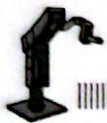


4）最后求解得到运动学正解方程： 

$$
\left\{ \begin{array}{l} x _ {E} = \frac {1}{2} \frac {U (y _ {B ^ {\prime}} - y _ {C ^ {\prime}}) + V (y _ {C ^ {\prime}} - y _ {A ^ {\prime}}) + W (y _ {A ^ {\prime}} - y _ {B ^ {\prime}})}{x _ {A ^ {\prime}} (y _ {B ^ {\prime}} - y _ {C ^ {\prime}}) + x _ {B ^ {\prime}} (y _ {C ^ {\prime}} - y _ {A ^ {\prime}}) + x _ {C ^ {\prime}} (y _ {A ^ {\prime}} - y _ {B ^ {\prime}})} \\ y _ {E} = - \frac {1}{2} \frac {U (x _ {B ^ {\prime}} - x _ {C ^ {\prime}}) + V (x _ {C ^ {\prime}} - x _ {A ^ {\prime}}) + W (x _ {A ^ {\prime}} - x _ {B ^ {\prime}})}{x _ {A ^ {\prime}} (y _ {B ^ {\prime}} - y _ {C ^ {\prime}}) + x _ {B ^ {\prime}} (y _ {C ^ {\prime}} - y _ {A ^ {\prime}}) + x _ {C ^ {\prime}} (y _ {A ^ {\prime}} - y _ {B ^ {\prime}})} \end{array} \right.\tag{FL-21}
$$

#### 4. 运动学反解

已知工具末端 E 在直角坐标系中的坐标, 求解三个驱动电动机的角度 $\theta_{1}$ 、 $\theta_{2}$ 、 $\theta_{3}$ , 根据三角关系可以推导出(角度转化到 $[0,360^{\circ}]$ ): 

$$
\left\{ \begin{array}{l} \theta_ {1} = 2 \pi - (\angle A ^ {\prime} A E - \angle O A E) = \arctan \frac {x _ {E} - x _ {A}}{y _ {E} - y _ {A}} - \arccos \frac {| A E |}{2 L} \\ \theta_ {2} = \angle X B E - \angle B ^ {\prime} B E = \arctan \frac {x _ {E} - x _ {B}}{y _ {E} - y _ {B}} - \arccos \frac {| B E |}{2 L} \\ \theta_ {3} = \angle X ^ {\prime} C E - \angle C ^ {\prime} C E = 2 \pi + \arctan \frac {x _ {E} - x _ {C}}{y _ {E} - y _ {C}} - \arccos \frac {| C E |}{2 L} \end{array} \right.\tag{FL-22}
$$

其中： 

$$
\begin{array}{l} \left| A E \right| = \sqrt {\left(y _ {E} - y _ {A}\right) ^ {2} + \left(x _ {E} - x _ {A}\right) ^ {2}} \\ \left| B E \right| = \sqrt {\left(y _ {E} - y _ {B}\right) ^ {2} + \left(x _ {E} - x _ {B}\right) ^ {2}} \\ \left| C E \right| = \sqrt {\left(y _ {E} - y _ {C}\right) ^ {2} + \left(x _ {E} - x _ {C}\right) ^ {2}} \end{array}\tag{FL-23}
$$

当并联机器人工具末端处于直角坐标系中(0,0)时,通过运动学反解计算得到三个驱动关节角度: 

$$
\theta_ {1} = - 2 3. 7 3 3 1 ^ {\circ}, \quad \theta_ {2} = 9 6. 2 6 6 9 ^ {\circ}, \quad \theta_ {3} = 2 1 6. 2 6 6 9 ^ {\circ}
$$

可以看出三个关节角度间相差均为 $120^{\circ}$ , 此时并联机器人三对连杆手臂为对称分布结构, 一般将此时末端所处的位置作为机器人机械零点标定位置, 亦是绝对原点位置。 

#### 5. 工作空间确定

工作空间的确定是并联机器人反向运动学中的一个关键问题,要确保并联机构连杆末端规划点在有效工作范围,就必须先确定工作空间(即反解存在的区域)。 

以主动杆起始端点 $A(x_{A},y_{A})$ 、 $B(x_{B},y_{B})$ 、 $C(x_{C},y_{C})$ 三点为圆心，连杆手臂长为半径画圆，分别得到圆 $g_{1},g_{2},g_{3}$ ，如附图15所示，圆 $g_{1},g_{2},g_{3}$ 可以视为三个轴的独立运动范围。 $W_{1}$ 是圆 $g_{2}$ 和圆 $g_{3}$ 的一个交点； $W_{2}$ 是圆 $g_{1}$ 和圆 $g_{3}$ 的一个交点； $W_{3}$ 是圆 $g_{1}$ 和圆 $g_{2}$ 的一个交点。圆弧 $W_{1}W_{2}$ 在圆 $g_{3}$ 上；圆弧 $W_{2}W_{3}$ 在圆 $g_{1}$ 上；圆弧 $W_{3}W_{1}$ 在圆 $g_{2}$ 上。所以，可以确定圆弧 $W_{1}W_{2},W_{2}W_{3},W_{3}W_{1}$ 包括的范围即为三自由度冗余驱动并联机器人的有效工作范围（附图15中的灰色区域）。圆 $g_{1},g_{2},g_{3}$ 的表达式如下： 

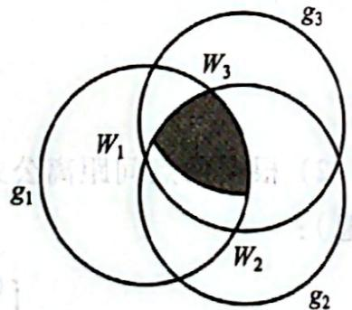

附图 15 三自由度冗余驱动并联机器人工作空间图


$$
\left\{ \begin{array}{l} g _ {1}: (x - x _ {A}) ^ {2} + (y - y _ {A}) ^ {2} = R ^ {2} \\ g _ {2}: (x - x _ {B}) ^ {2} + (y - y _ {B}) ^ {2} = R ^ {2} \\ g _ {3}: (x - x _ {C}) ^ {2} + (y - y _ {C}) ^ {2} = R ^ {2} \end{array} \right.\tag{FL-24}
$$

式中：半径 R 为连杆手臂长度， $R=244\ mm+244\ mm=488\ mm$ 。 

#### 6. MATLAB 运动学仿真

MATLAB 是一款可视化且具有极为强大矩阵计算能力的软件, 它包含了上百个预先定义好的命令和函数, 这些函数能通过用户自定义函数进一步扩展。MATLAB 除了具有强大的矩阵运算能力外, 同时还有着较强的二维、三维绘图能力, 利用 MATLAB 进行仿真能够大大缩短机器人的开发周期。 

前面已经对三自由度冗余驱动并联机器人的运动学正、反解和工作空间进行了分析,接下来将在 MATLAB 环境下利用 M 语言建立三自由度冗余驱动并联机器人的运动学仿真模型,并进行运动仿真实验。仿真模型如附图 16 所示,部分仿真代码如下: 

```matlab
clc
s=500;    %基座电动机间距
a=244;    %主动杆长度
b=244;    %从动杆长度
x0=0;    %原点初始x坐标
y0=0;    %原点初始y坐标
theta=pi*1/6;
BaseAngle=pi*3/6;    %固定量(unchangeable)
Increment=pi*4/6;    %增量(unchangeable)
Xa=[s*cos(BaseAngle+Increment),s*cos(BaseAngle+2*Increment),
s*cos(BaseAngle+3*Increment)];
Ya=[s*sin(BaseAngle+Increment),s*sin(BaseAngle+2*Increment),
s*sin(BaseAngle+3*Increment)];
for i=1:3    %防止出现极小数
    if(abs(Xa(i))<1e-010)
    Xa(i)=0;
    end
end
DXa=[Xa(1) Xa(2) Xa(3) Xa(1)];
DYa=[Ya(1) Ya(2) Ya(3) Ya(1)];
plot(DXa, DYa)
hold on
axis([-300 300 -300 300])
axis equal
plot(sum(Xa)/3,sum(Ya)/3,'pr')    %绘制零点
hold on
for ii=1:3
text(Xa(ii)-50,Ya(ii)+20 * Ya(ii)/abs(Ya(ii)),['('num2str(Xa(ii))','num2str(Ya(ii))')'])
end 
```

```matlab
MBaseAngle = pi * 3/6; % 固定量(unchangeable)
MIncrement = pi * 4/6; % 增量(unchangeable)
Xc = [x0 + e * cos(MBaseAngle + MIncrement + theta), x0 + e * cos(MBaseAngle + 2 * MIncrement + theta), x0 + e * cos(MBaseAngle + 3 * MIncrement + theta)];
Yc = [y0 + e * sin(MBaseAngle + MIncrement + theta), y0 + e * sin(MBaseAngle + 2 * MIncrement + theta), y0 + e * sin(MBaseAngle + 3 * MIncrement + theta)];
DXc = [Xc(1) Xc(2) Xc(3) Xc(1)];
DYc = [Yc(1) Yc(2) Yc(3) Yc(1)];
plot(DXc, DYc)
hold on
text(sum(Xc)/11-15, sum(Yc)/11-15, ['('num2str(theta * 180/pi)')'])
plot(sum(Xc)/3, sum(Yc)/3, 'pb')
hold on
f1 = 2 * a * (Ya-Yc);
f2 = 2 * a * (Xa-Xc);
f3 = Xc. * Xc + Yc. * Yc + Xa. * Xa + Ya. * Ya - 2 * Xc. * Xa - 2 * Yc. * Ya + a^2 - b^2;
ThetaO = 2 * atan((-fl + sqrt(fl.^2 + f2.^2 - f3.^2))./(f3 - f2));
Thetal = 2 * atan((-fl - sqrt(fl.^2 + f2.^2 - f3.^2))./(f3 - f2));
INPUT = [x0, y0, theta * 180/pi]
OUTPUT = [ThetaO]
Xb = Xa + a. * cos(ThetaO);
Yb = Ya + a. * sin(ThetaO);
Xabc = [Xa' Xb' Xc']';
Yabc = [Ya' Yb' Yc']';
line(Xabc, Yabc)
hold on
LXbc = Xc - Xb;
LYbc = Yc - Yb;
L = sqrt(LXbc. * LXbc + LYbc. * LYbc);
if(L - 160) > 1e-6
msgbox('从动杆长度错误，超出范围！','警告!');
end 
```

#### 7. 轨迹绘制

在轨迹编辑中开始编辑轨迹,如附图17所示。轨迹的鼠标输入方法:移动光标到绘图区,光标会变成绘图笔形状,此时可以按下鼠标左键开始在绘图区绘图,松开鼠标左键结束当前绘图笔画,按下鼠标左键开始下一个绘图笔画。 

编辑好的绘图轨迹可以通过单击轨迹编辑子界面中的“打开文件”按钮打开，然后进行轨迹求解，若求解出的目标点不在并联机器人有效工作区域，则会弹出警告提示框，如附图18所示。 

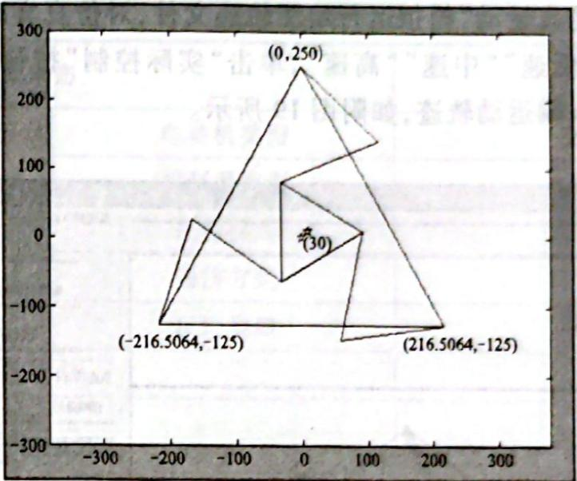

附图 16 三自由度冗余驱动并联机器人 MATLAB 仿真模型


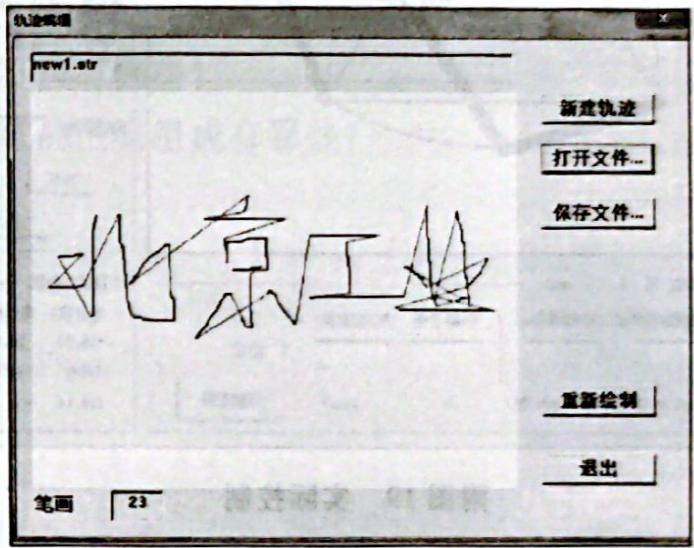

附图17 轨迹编辑


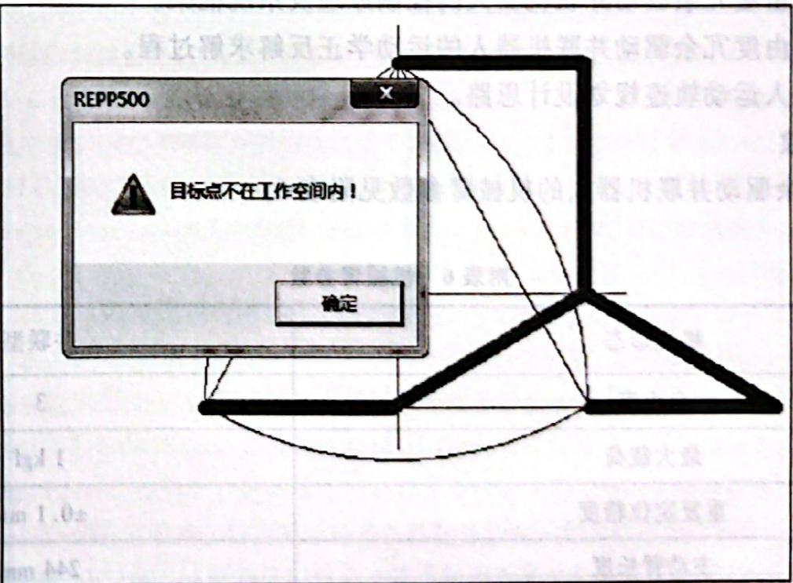

附图18 目标点不在工作空间内


求解完成以后通过“仿真运动”模拟运行绘图轨迹文件，对仿真实验满意的轨迹可以执行实际控制，选择速度挡中的“低速”“中速”“高速”，单击“实际控制”按钮后将在工作台面（铺上纸张）上绘制出并联机器人末端运动轨迹，如附图19所示。 

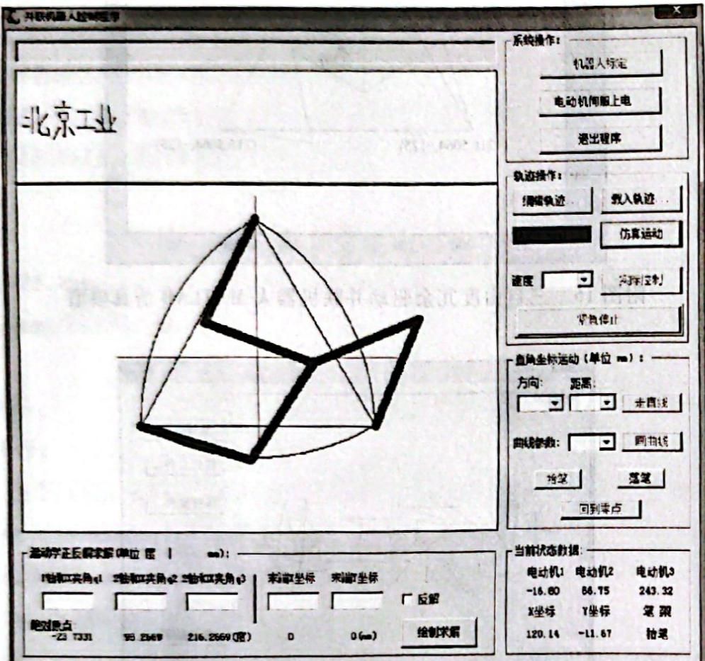

附图19 实际控制


### 六、实验目的

1）了解三自由度冗余驱动并联机器人的控制原理及系统框架。 

2）掌握三自由度冗余驱动并联机器人的运动学正反解求解过程。 

3）掌握机器人运动轨迹规划设计思路。 

### 七、技术参数

三自由度冗余驱动并联机器人的机械臂参数见附表6。 


附表 6 机械臂参数


<table><tr><td>机械形态</td><td>并联型</td></tr><tr><td>自由度</td><td>3</td></tr><tr><td>最大载荷</td><td>1kgf</td></tr><tr><td>重复定位精度</td><td>±0.1mm</td></tr><tr><td>主动臂长度</td><td>244 mm</td></tr><tr><td>从动臂长度</td><td>244 mm</td></tr></table>


续表


<table><tr><td colspan="2">机械形态</td><td>并联型</td></tr><tr><td rowspan="5">驱动控制部分</td><td>电动机类型</td><td>交流伺服电动机</td></tr><tr><td>控制器类型</td><td>嵌入式控制器</td></tr><tr><td>控制模式</td><td>位置模式/脉冲量</td></tr><tr><td>通信方式</td><td>并口</td></tr><tr><td>反馈类型</td><td>绝对式编码器</td></tr><tr><td colspan="2">额定功率</td><td>2 kW</td></tr><tr><td colspan="2">工作电压</td><td>AC 220 V</td></tr></table>

### 八、思考题

1）并联冗余机器人相对于串联式机器人有哪些优势？ 

2）并联冗余机器人在工业中的实际应用有哪些？ 

3）并联冗余机器人的特性有哪些？ 

4）并联冗余机器人系统的主要组成有哪些？

# 参考文献

[1] 熊有伦. 机器人学 [M]. 北京: 机械工业出版社, 1993. 

[2] 熊有伦. 机器人技术基础 [M]. 武汉: 华中理工大学出版社, 1996. 

[3] 谢存福, 张铁. 机器人技术及其应用 [M]. 北京: 机械工业出版社, 2005. 

[4] 吴振彪, 王正家. 工业机器人 [M]. 2 版. 武汉: 华中科技大学出版社, 2006. 

[5] 余达太, 马香峰, 鄢安民. 工业机器人应用工程 [M]. 北京: 冶金工业出版社, 1999. 

[6] 殷际英, 何广平. 关节机器人 [M]. 北京: 化学工业出版社, 1994. 

[7] 吴瑞祥. 机器人技术及应用 [M]. 北京: 北京航空航天大学出版社, 1994. 

[8] 蔡自兴. 机器人学 [M]. 北京: 清华大学出版社, 2000. 

[9] 刘根峰. 计算机辅助设计与制造 [M]. 北京: 高等教育出版社, 2004. 

[10] 聚自兴. 展望人工智能发展的若干问题 [J]. 高技术通讯, 1995, 5(7): 59-61. 

[11] 机电一体化技术手册编委会. 机电一体化技术手册 [M]. 北京: 机械工业出版社, 1999. 

[12] 方建军, 何广平. 智能机器人 [M]. 北京: 化学工业出版社, 2002. 

[13] 张福学. 机器人学: 智能机器人传感技术 [M]. 北京: 电子工业出版社, 1996. 

[14] 赵嘉华. 焊接方法与机电一体化 [M]. 北京: 化学工业出版社, 2001. 

[15] 曲道奎. 机器人技术新进展 [M] // 中国科学院. 2000 高技术发展报告. 北京: 科学出版社, 2000. 

[16] 蒋新检. 机器人学导论 [M]. 沈阳: 辽宁科学技术出版社, 1993. 

[17] 王天然. 机器人 [M]. 北京: 化学工业出版社, 2002. 

[18] 隋秀陵, 邵秋萍, 等. 现代制造系统 [M]. 北京: 高等教育出版社, 2002. 

[19] 普瑞德科 M. 机器人控制器与程序设计 [M]. 宗光华, 李大寨, 译. 北京: 科学出版社, 2004. 

[20] 克拉克 D, 欧文斯 M. 机器人设计与控制 [M]. 宗光华, 张慧慧. 北京: 科学出版社, 2004. 

[21] 张伯鹏. 机电智能控制工程 [M]. 北京: 机械工业出版社, 1990. 

[22] 王灏, 毛宗源. 机器人的智能控制方法 [M]. 北京: 国防工业出版社, 2002. 

[23] 大熊繁. 机器人控制 [M]. 卢伯英, 译. 北京: 科学出版社, 2002. 

[24] 申铁龙. 机器人鲁棒控制基础 [M]. 北京: 清华大学出版社, 2000. 

[25] 严学高, 孟正大. 机器人原理 [M]. 南京: 东南大学出版社, 1992. 

[26] 惽为民, 席裕庚. 智能机器人的信息系统 [J]. 机器人, 1996, 18(5): 257-263. 

[27] 张军. 863 计划机器人产业发展战略 [J]. 机器人技术与应用, 1997(2): 6. 

[28] 曾芬芳. 虚拟现实技术 [M]. 上海: 上海交通大学出版社, 1997. 

[29] 刘极峰. 塞拉门弧焊机器人工作站的开发研究[J]. 机电产品开发与创新, 2004(5): 15-17. 

[30] 刘极峰. 塞拉门弧焊机器人工作站柔性焊接夹具设计 [J]. 机械设计与制造, 2005(5): 97-99. 

[31] 欧青立, 何克忠. 室外智能移动机器人的发展及其关键技术研究 [J]. 机器人, 2000, 22(6): 519-526. 

[32] 张铁, 汤祥州, 谢存禧. SMA 驱动的微平面关节机器人研究 [J]. 机器人, 1998, 20(6): 449-454. 

[33] 张永军, 杨兰生. 基于仿生学的上肢机构研究 [J]. 机器人, 1998, 20(1): 20-24. 

[34] 张友军. 自主式机器人智能协调机制研究 [D]. 杭州: 浙江大学, 1997. 

[35] 张友军, 朱森良, 吴春明, 等. 自主式移动机器人系统的体系结构 [J]. 机器人, 1997, 19(5): 378-383. 

[36] 张仲俊, 蔡自兴. 智能控制与智能控制系统 [J]. 信息与控制, 1989, 18(5): 30-39. 

[37] 赵锡芳. 机器人动力学 [M]. 上海: 上海交通大学出版社, 1992. 

[38] 中英昌. 机器人 [M]. 郑春瑞, 译. 北京: 科学技术文献出版社, 1996. 

[39] 周远清, 张再兴, 许万雍, 等. 智能机器人系统 [M]. 北京: 清华大学出版社, 1989. 

[40] 诸静. 机器人与控制技术 [M]. 杭州: 浙江大学出版社, 1991. 

[41] 卫玉芬, 李小宁. 气动人工肌肉的进展和应用 [J]. 机床与液压, 2003(1): 37-38. 

[42] 张秀丽, 郑浩峻, 陈恳. 机器人仿生学研究综述 [J]. 机器人, 2002, 24(2): 188-192. 

[43] Coello Coello C A, Christiansen A D. An Using a new GA-based multiobjective optimization technique for the design of robot arms[J]. Robotica, 1998, 16(4): 401-414. 

[44] Fukuda T, Kubota N. Intelligent robot systems: adaptation, learning and evolution[J]. Artificial Life and Robotics, 1999,3(1):32-38. 

[45] Huber S A, Franz M O, Bulthoff H H. Robot and fly: modeling of directional behavior of fly vision [J]. Robotics and Autonomous systems, 1999, 29(4): 242-272. 

[46] Mandow A J, Gomez-de-Gabriel M, Martinez J L, et al. The autonomous mobile robot AURORA for greenhouse operation[J]. IEEE Robotics & Automation Magazine, 1996, 3(4): 18-28. 

[47] Zhou Xuecai, Li Weiping, et al. A new robot control system with open architecture: Proceedings of 8th International Conference on Advanced Robotics, Monterey, 1997[C]. 

[48] Brady M. Artificial intelligence and robotics [M] // Brady M, Gerhardt, et al. Artificial intelligence. New York: Spring Verlag, 1984. 

[49] Hu B, Teo C L, Lee H P. Local optimization of weighted joint torques for redundant robotic manipulators [J]. IEEE Transactions on Robotic and Automation, 1995, 11(3): 422-425. 

[50] Nedungadi A, Kazerounian K. A local solution with global characteristics for the joint torque optimization of a redundant manipulator[J]. J Robot System, 1989, 6(5): 631-654. 

[51] Lasky T A, Ravani B. Lateral vehicle control for AHS using a laser sensor: Proceedings of the Second World Congress on Intelligent Transportation Systems, Yokohama, 1995[C]. 

[52] Shladover S E, Desover C A, et al. Automatic vehicle control developments in the PATH program[J]. IEEE Transactions on Vehicular Technology, 1991, 40(1): 114-130. 

[53] Sheridan T B. Space teleoperation through time delay review and prognosis[J]. IEEE Transactions on Robotics and Automation, 1993, 9(5): 592-606. 

[54] Wu N Q, Zhou M C. AGV routing for conflict resolution in AGV systems: Proceedings of IEEE International Conference on Robotics and Automation, 2003[C]. 

[55] Zeng J Y, et al. Conflict-free routing of AGVs on the mesh topology based on a discrete-time model: Proceedings of the IEEE International Conference on Robotics and Automation, 2003[C]. 

[56] Ha I, et al. An efficient stimulation algorithm for the model parameters of robotic manipulators[J]. IEEE Trans. on Robotics and Automation, 1989, 5: 384-394. 

[57] Lim G, et al. Parameter identification method for robot dynamic models using a balancing mechanism [J]. Robotica, 1989, 7:327-337. 

[58] Marlin T A. The UK military UUV programme: a programme overview: Proceedings of the International UUV Conference, Newport, 2000[C]. 

[59] Zotov V, Bodrov V. Small displacement sensors based on magnetosensitive Z-elements: Third Symposium on Measurement and Control in Robotics, Torino, 1993[C]. 

[60] Zotov V, Bodrov V. Novel semiconductor sensitive elements based on the Z-effect intended for various robotic sensors and systems: 2nd Symbosium on Measurement and Control in Robotics, 1992[C]. 

[61] 刘极峰, 肖增文, 邹景超, 等. 塞拉门焊缝视觉跟踪图像处理技术 [J]. 焊接学报, 2008, 29(5): 61-64. 

[62] 肖增文, 杨小兰, 邹景超, 等. 城轨门弧焊视觉跟踪图像采集处理方法与试验 [J]. 制造业自动化, 2008, 30(5): 85-88. 

[63] 肖增文, 邹景超, 杨小兰, 等. 塞拉门弧焊机器人柔性工作站夹具与变位机设计 [J]. 焊接技术, 2008, 37(1): 30-32. 

[64] 肖增文, 刘极峰, 陈志超. 激光预扫描技术在曲线焊缝跟踪中的应用 [J]. 焊接学报, 2008, 29(12): 20-24. 

[65] 肖增文, 刘极峰. 基于结构光的半自主轨迹规划焊接技术 [J]. 焊接技术, 2008, 37(6): 7-11. 

[66] 杨文亮. 苹果采摘机器人机械手结构设计与分析 [D]. 镇江: 江苏大学, 2009. 

[67] 肖增文, 刘极峰. 多结构光双目复合视觉焊缝跟踪方法及装置: 中国, ZL200910024758.8 [P]. 2011-08-17. 

[68] David C, Roy C. Color vision in robotic fruit harvesting[J]. Transactions of the ASAE, 1987, 30(4): 1144-1148. 

[69] Sario Y. Robotic fruit harvesting: a state-of-the-art review[J]. Journal of Agricultural Engineering Research, 1993, 54(3):265-280. 

[70] 汤修映, 张铁中. 果蔬收获机器人研究综述[J]. 机器人, 2005, 27(1): 91-95. 

[71] Baeten J, Donné K, Boedrij S, et al. Autonomous fruit picking machine: a robotic apple harvester [M] // Springer Tracts in Advanced Robotics: Field and Service Robotics, 2008. 

[72] D'Esnon A G. Robotic harvesting of apple: Proceedings of the first international conference on robotics and intelligent machines in agriculture, Florida, October 2-4, 1983 [C]. 

[73] Kondon N, Ting K C. Robotics for bioproduction system [M]. ASAE Publication, 1998. 

[74] 陈飞, 蔡健荣. 柑橘收获机器人技术研究进展 [J]. 农机化研究, 2008(7): 232-235. 

[75] Kondo N, Ting K C. Robotics for plant production[J]. Artificial Intelligence Review, 1998, 12(1-3): 227-243. 

[76] 赵金英. 基于三维机器视觉的西红柿采摘机器人技术研究 [D]. 北京: 中国农业大学, 2006. 

[77] Van Henten E J; Hemming J.; Van Tuijl B A J, et al. An autonomous robot for harvesting cucumbers in greenhouses[J]. Autonomous Robots, 2002, 13(3): 241-258. 

[78] 有马诚一, 近藤直, 芝野保德, 等. キュウリ收获ロボットの研究: 第1报[J]. 农业机械学会志, 1994, 56(1): 55-64. 

[79] 有马诚一, 近藤直, 芝野保德, 等. キュウリ收获ロボットの研究: 第2报[J]. 农业机械学会志, 1994, 56(6): 69-76. 

[80] 有马诚一, 近藤直, 芝野保德, 等. キュウリ收获ロボットの研究: 第3报[J]. 农业机械学会志, 1995, 57(1): 51-58. 

[81] Kondo N, Nishitsuji Y, Ling P, et al. Visual feedback guided robotic cherry tomato harvesting [J]. Trans of the ASAE, 1996, 39:2331-2338. 

[82] Monta M, Kondo N, Shibano Y. Agricultural robot in grape production system[J]. IEEE International Conference on Robotics and Automation, 1995[C]. 

[83] 张志勇, 何东健, 张建锋, 等. 苹果采摘机器人手臂控制研究 [J]. 中国农业大学学报, 2008, 13(2): 78-82. 

[84] 姚立健, 丁为民, 陈玉仑, 等. 茄子收获机器人机械臂避障路径规划 [J]. 农业机械学报, 2008, 39(11): 94-98. 

[85] 陆怀民. 林木球果采摘机器人设计与试验[J]. 农业机械学报, 2001, 32(6): 52-58. 

[86] 梁喜凤, 苗香雯, 崔绍荣, 等. 番茄收获机械手运动学优化与仿真试验 [J]. 农业机械学报, 2005, 36(7): 96-100. 

[87] Monta M. End-effectors for tomato harvesting robot[J]. Artificial Intelligence Review, 1998(12): 11-25. 

[88] Shigehiko H, Katsunobu G, Yukitsugu I, et al. Robotic harvesting system for eggplants [J]. JARQ, 2002, 36(3): 163-168. 

[89] Justin K, Reza A, Soheil B, et al. Sequence-based manipulation of robotic arm control in brain machine interface [J]. International Journal of Intelligent Robotics and Applications, 2018, 2(2): 149-160. 

[90] 路雨祥. 仿生学的意义与发展 [J]. 科学中国人, 2004(4): 22-24. 

[91] 张伏, 李心平, 等. 机械仿生技术 [M]. 北京: 清华大学出版社, 2016. 

[92] 王国彪, 陈殿生, 陈科位, 等. 仿生机器人研究现状与发展趋势 [J]. 机械工程学报, 2015, 51(13): 27-44. 

[93] 罗庆生, 韩宝玲, 赵小川, 等. 现代仿生机器人设计 [M]. 北京: 电子工业出版社, 2008. 

[94] Siddall R, Kovac M. Launching the aqua MAV: Bioinspired design for aerial-aquatic robotic platforms [J]. Bioinspiration & Biomimetics, 2014, 9(3): 1-15. 

[95] 陈恳, 付成龙. 仿人机器人理论与技术 [M]. 北京: 清华大学出版社, 2010. 

[96] 佚名. 日科学未来馆向公众展出智能机器人“ASIMO”[J]. 工业设计, 2014(1): 64. 

[97] Nelson G, Saunders A, Neville N, et al. PETMAN: A humanoid robot for testing chemical protective clothing[J]. Journal of the Robotics Society of Japan, 2012, 30(4): 372-377. 

[98] 高海峰, 赵卫军, 吴少华. 类人机器人技术研究现状 [J]. 机床与液压, 2017, 45(21): 164-172. 

[99] 王握文. 新世纪的“先行者”: 我国类人型机器人诞生记[J]. 中国科技月报, 2001(2): 12-15. 

[100] Yu Z, Huang Q, Ma G, et al. Design and development of the humanoid robot BHR-5[J]. Advances in Mechanical Engineering, 2014(6): 1-11. 

[101] Liu H, Yang D P, Jiang L. Development of a multi-DOF prosthetic hand with intrinsic actuation, intuitive control and sensory feedback[J]. Industrial Robot: An International Journal, 2014, 41(4): 381-392. 

[102] 罗庆生, 罗霄. 仿生四足机器人技术 [M]. 北京: 北京理工大学出版社, 2016. 

[103] Raibert M, Blankespoor K, Nelson G, et al. Bigdog the rough-terrain quadruped robot: Proceeding of the 17th World Congr. of the International Federation of Automatic Control, Seoul, 2008[C]. 

[104] 苏中, 张双彪, 等. 仿生蛇形机器人技术 [M]. 北京: 国防工业出版社, 2015. 

[105] Liljeback P, Pettersen K, Stavdahl O. A snake robot with a contact force measurement system for obstacle-aided locomotion: IEEE International Conference on Robotics and Automation, Anchorage, 2010[C]. 

[106] 叶长龙, 马书根, 李斌, 等. 三维蛇形机器人巡视者 II 的开发 [J]. 机械工程学报, 2009, 45(5): 128-133. 

[107] Keennon M, KLingebiel K, Won H, et al. Development of the nano hummingbird: A tailless flapping wing micro air vehicle: 50th AIAA Aerospace Sciences Meeting Including the New Horizons Forum and Aerospace Exposition, Nashville, 2012[C]. 

[108] Mackenzie D. A flapping of wings[J]. Science, 2012, 335(6075): 1430-1433. 

[109] James L T, George V L, Lan W H, et al. The effect of fin ray flexural rigidity on the propulsive forces generated by a biorobotic fish pectoral fin[J]. The Journal of Experimental Biology, 2010, 213(23): 4043-4054. 

[110] 梁建宏, 邹丹, 王松, 等. SPC-II 机器鱼平台及其自主航行实验 [J]. 北京航空航天大学学报, 2005, 31(7): 709-713. 

[111] 李瑶, 王雷, 赵金海, 等. 仿生材料的研究进展 [J]. 黑龙江科学, 2012, 3(1): 32-35. 

[112] 刘贵杰, 刘展文, 田晓洁, 等. 智能材料在水下仿生机器人驱动中的应用综述 [J]. 中国海洋大学学报 (自然科学版), 2018, 48(3): 114-120. 

[113] 苏玉东. ICPF 智能材料驱动的仿生微型机器鱼的研究 [D]. 哈尔滨: 哈尔滨工程大学, 2012. 

[114] 王举田. 基于 SMA 驱动的仿生水母机器人技术研究 [D]. 青岛: 中国海洋大学, 2015. 

[115] 张倩, 薛志斌. 基于模糊控制的仿生机器鱼避障研究 [J]. 青海大学学报 (自然科学版), 2016, 34(3): 78-83. 

[116] 刘铁军, 张锐, 徐鹏. 基于运动想象的脑机接口关键技术研究 [J]. 中国生物医学工程学报, 2014, 33(6): 644-651. 

[117] 唐景昇. 基于脑机接口的协调控制技术研究 [D]. 长沙：国防科学技术大学, 2013. 

[118] 龚朱, 杨爱华, 赵惠康. 外科手术机器人发展及其应用 [J]. 中国医学教育技术, 2014, 28(3): 273-277. 

[119] 杜志江. 达芬奇手术机器人系统技术分析[J]. 机器人技术与应用, 2011(4): 14-16. 

[120] 张莉, 何传红, 何为. 脑-机接口的研究现状与挑战 [J]. 现代科学仪器, 2007(2): 23-26. 

[121] 罗尚清, 杨浩. 脑-机接口系统工作原理综述 [J]. 医疗卫生装备, 2008, 29(8): 33-35. 

[122] 程加园, 朱定见. 汽车自动驾驶系统的研究 [J]. 装备制造, 2010(1): 160, 151. 

[123] 杨帆. 无人驾驶汽车的发展现状和展望[J]. 上海汽车. 2014(3):35-40. 

[124] Tan J D. A scalable graph model and coordination algorithms for mobile sensor networks: Proceedings of 2005 IEEE/ASME International Conference on Advanced Intelligent Mechatronics, Monterey, 2005[C]. 

[125] Kong F Y, He H H, Raynor H A, et al. Dietcam: multi-view regular shape food recognition with a camera phone [J]. Pervasive and Mobile Computing, 2015(19): 108-121. 

[126] Tian Y, Hamel W R, Tan J D. Accurate human navigation using wearable monocular visual and inertial sensors [J]. Instrumentation and Measurement, IEEE Transactions on, 2014, 63(1): 203-213. 

[127] Abiri R, McBride J, Zhao X P, et al. A real-time brainwave based neuro-feedback system for cognitive enhancement: ASME 2015 Dynamic Systems and Control Conference, Columbus, 2015[C]. 

[128] Abiri R, Borhani S, Zhao X P, et al. Real-time brain machine interaction via social robot gesture control: Proceedings of the ASME 2017 Dynamic Systems and Control Conference, Tysons Corner, 2017[C]. 

[129] 罗均, 谢少荣, 翟宇毅, 等. 特种机器人 [M]. 北京: 化学工业出版社, 2006. 

[130] Choudhury M S H, Choudhury I A, Dahari M. Development of a control system for artificially rehabilitated limbs: a review[J]. Biological Cybernetics, 2015, 109(2): 141-162. 

高等教育出版社依法对本书享有专有出版权。任何未经许可的复制、销售行为均违反《中华人民共和国著作权法》，其行为人将承担相应的民事责任和行政责任；构成犯罪的，将被依法追究刑事责任。为了维护市场秩序，保护读者的合法权益，避免读者误用盗版书造成不良后果，我社将配合行政执法部门和司法机关对违法犯罪的单位和个人进行严厉打击。社会各界人士如发现上述侵权行为，希望及时举报，我社将奖励举报有功人员。 

反盗版举报电话 (010)58581999 58582371 

反盗版举报邮箱 dd@hep.com.cn 

通信地址 北京市西城区德外大街4号 高等教育出版社法律事务部 

邮政编码 100120 

# 防伪查询说明

用户购书后刮开封底防伪涂层，使用手机微信等软件扫描二维码，会跳转至防伪查询网页，获得所购图书详细信息。 

防伪客服电话 (010)58582300
