# 第2章 机器人本体结构

机器人本体结构指其机体结构和机械传动系统，也是机器人的支承基础和执行机构。本章以工业机器人为主要对象介绍机器人本体主要组成部分的特点和结构形式。 

## 2.1 概述

机器人本体是机器人的重要部分,所有的计算、分析和编程最终都要通过本体的运动和动作完成特定的任务。机器人本体各部分的基本结构、材料的选择将直接影响整体性能。 

### 2.1.1 机器人本体的基本结构形式

#### 一、机器人本体的基本结构

机器人本体主要包括:①传动部件;②机身及行走机构;③臂部;④腕部;⑤手部。 

#### 二、机器人本体基本结构的举例

下面以关节型机器人为例来说明机器人本体的基本结构。 

关节型机器人的主要特点是模仿人类腰部到臂部的基本结构,因此本体结构通常包括机器人的机座(即底部和腰部的固定支承)结构及腰部关节转动装置、大臂(即大臂支承架)结构及大臂关节转动装置、小臂(即小臂支承架)结构及小臂关节转动装置、手腕(即手腕支承架)结构及手腕关节转动装置和末端执行器(即手爪部分,也简称手部)。目前,可以像人一样行走的关节型机器人已经取得成功,并正在向具有高级智能的方向拓展。 

进行机器人本体的运动学、动力学和其他相关分析时，一般将机器人简化成由连杆、关节和末端执行器首尾相接，通过关节相连而构成的一个开式连杆系。在连杆系的开端安装有末端执行器。 

末端执行器是机器人直接参与工作的部分。手部可以是各种夹持器，也可以是各种工具，如焊枪、喷头等。操作时，往往要求手部不仅能到达指定的位置，而且要有正确的姿态。 

组成机器人的连杆和关节按功能可以分成两类:一类是组成手臂的长连杆,也称臂杆,其产生主运动,是机器人的位置机构;另一类是组成手腕的短连杆,它实际上是一组位于臂杆端部的关节组,是机器人的姿态机构,确定了手部执行器在空间的方向。 

机器人本体基本结构的特点主要可归纳为以下四点： 

1）一般可以简化成各连杆首尾相接、末端无约束的开式连杆系，连杆系末端自由且无支承，这决定了机器人的结构刚度不高，并随连杆系在空间位姿的变化而变化。 

2）开式连杆系中的每根连杆都具有独立的驱动器，属于主动连杆系，连杆的运动各自独立， 

不同连杆的运动之间没有依从关系，运动灵活。 

3）连杆驱动扭矩的瞬态过程在时域中的变化非常复杂，且和执行器反馈信号有关。连杆的驱动属于伺服控制型，因而对机械传动系统的刚度、间隙和运动精度都有较高的要求。 

4）连杆系的受力状态、刚度条件和动态性能都是随位姿的变化而变化的，因此极容易发生振动或出现其他不稳定现象。 

综合以上特点可见,合理的机器人本体结构应当使其机械系统的工作负载与自重的比值尽可能大,结构的静动态刚度尽可能高,并尽量提高系统的固有频率和改善系统的动态性能。 

臂杆质量小有利于改善机器人操作的动态性能。 

结构静、动态刚度高有利于提高手臂端点的定位精度和对编程轨迹的跟踪精度，这在离线编程时是至关重要的。刚度高还可降低对控制系统的要求和系统造价。机器人具有较好的刚度还可以增加机械系统设计的灵活性，比如在选择传感器安装位置时，刚度高的结构允许传感器放在离执行器较远的位置上，减少了设计方面的限制。 

尽可能提高机器人结构固有频率的目的在于避开机器人的工作频率。通常机器人的低阶固有频率为 $5 \sim 25 \mathrm{~Hz}$ , 以中等速度运动时, 输入信号的脉冲延续时间为 $0.05 \sim 1 \mathrm{~s}$ , 振荡频率相当于 $1 \sim 20 \mathrm{~Hz}$ , 因而机械系统可能会因此激发振荡。提高机械系统的固有频率有利于系统的稳定。运动速度变化时振荡的振幅和衰减时间是衡量机器人动力学性能好坏的重要指标。动态刚度高可以减小定位时的超调量, 缩短达到稳定状态的时间, 从而提高机器人的使用性能。 

### 2.1.2 机器人本体材料的选择

选择机器人本体材料应从机器人的性能要求出发,满足机器人的设计和制作要求。机器人本体用来支承、连接、固定机器人的各部分,当然也包括机器人的运动部分,这一点与一般机械结构的特性相同。机器人本体所用的材料也是结构材料。但是,机器人本体又不单是固定结构件,比如机器人臂是运动的,机器人整体也是运动的,所以机器人运动部分的材料应尽量轻。精密机器人对于机器人的刚度有一定的要求,即对材料的刚度有要求。刚度设计时要考虑静刚度和动刚度,即要考虑振动问题。从材料角度看,控制振动涉及减轻质量和抑制振动两方面,其本质就是材料内部的能量损耗和刚度问题,它与材料的抗振性紧密相关。另外,家用和服务机器人的外观与传统机械大有不同,故将会出现比传统工业材料更富有美感的机器人本体材料。从这一点看,机器人材料又应具备柔软和外表美观等特点。 

总之,正确选用结构件材料不仅可降低机器人的成本价格,更重要的是可适应机器人的高速化、高载荷化及高精度化,满足其静力学及动力学特性要求。随着材料工业的发展,新材料的出现给机器人的发展提供了宽广的空间。 

#### 一、材料选择的基本要求

与一般机械设备相比,机器人结构的动力学特性十分重要,这是材料选择的出发点。材料选择的基本要求是: 

1）强度高。机器人臂是直接受力的构件，高强度材料不仅能满足机器人臂的强度条件，而且可望减少臂杆的截面尺寸，减轻质量。 

2）弹性模量大。由材料力学的知识可知，构件刚度（或变形量）与材料的弹性模量 $E, G$ 有关。弹性模量越大，变形量越小，刚度越大。不同材料弹性模量的差异比较大，而同一种材料的 改性对弹性模量却没有太多改变。比如，普通结构钢的强度极限为 $420\mathrm{MPa}$ ，高合金结构钢的强度极限为 $2000\sim 2300\mathrm{MPa}$ ，但是二者的弹性模量 $E$ 却没有多大差别，均为 $2.1\times 10^{5}\mathrm{MPa}$ 。因此，还应寻找其他提高构件刚度的途径。 

3）质量轻。机器人手臂构件中产生的变形很大程度上是由惯性力引起的，与构件的质量有关。也就是说，为了提高构件刚度选用弹性模量 $E$ 大而密度 $\rho$ 也大的材料是不合理的。因此，提出了选用高弹性模量、低密度材料的要求。 

4）阻尼大。选择机器人的材料时不仅要求刚度大、质量轻，而且希望材料的阻尼尽可能大。机器人臂经过运动后，要求能平稳地停下来。可是在终止运动的瞬时构件会产生惯性力和惯性力矩，构件自身又具有弹性，因而会产生残余振动。从提高定位精度和传动平稳性来考虑，希望能采用大阻尼材料或采取增加构件阻尼的措施来吸收能量。 

5）经济性好。材料价格是机器人成本价格的重要组成部分。有些新材料如硼纤维增强铝合金、石墨纤维增强镁合金等用来作为机器人臂的材料是很理想的，但价格高昂。 

#### 二、机器人常用材料简介

##### 1. 碳素结构钢和合金结构钢

这类材料强度好,特别是合金结构钢,其强度增大了4~5倍,弹性模量E大,抗变形能力强,是应用最广泛的材料。 

##### 2. 铝、铝合金及其他轻合金材料

这类材料的共同特点是质量轻,弹性模量 E 并不大,但是材料密度小,故 $E/\rho$ 值仍可与钢材相比。有些稀贵铝合金的品质得到了更明显的改善,例如添加 3.2%(质量分数)锂的铝合金,弹性模量增加了 14%, $E/\rho$ 值增加了 16%。 

##### 3. 纤维增强合金

这类合金如硼纤维增强铝合金、石墨纤维增强镁合金等，其 $E / \rho$ 值分别达到 $11.4 \times 10^{7} \mathrm{~m}^{2} / \mathrm{s}^{2}$ 和 $8.9 \times 10^{7} \mathrm{~m}^{2} / \mathrm{s}^{2}$ 。这种纤维增强金属材料具有非常高的 $E / \rho$ 值，而且没有无机复合材料的缺点，但价格高昂。 

##### 4. 陶瓷

陶瓷材料具有良好的品质,但是脆性大,不易加工成具有长孔的连杆,与金属零件连接的接合部需特殊设计。然而,日本已经试制了在小型高精度机器人上使用的陶瓷机器人臂样品。 

##### 5. 纤维增强复合材料

这类材料具有极好的 $E / \rho$ 值，但存在老化、蠕变、高温热膨胀以及与金属件连接困难等问题。这类材料不但质量轻、刚度大，而且还具有十分突出的大阻尼的优点。传统金属材料不可能具有这么大的阻尼，所以在高速机器人上应用复合材料的实例越来越多。叠层复合材料的制造工艺还允许用户进行优化，改进叠层厚度、纤维倾斜角、最佳横断面尺寸等，使其具有最大阻尼值。 

##### 6. 粘弹性大阻尼材料

增大机器人连杆件的阻尼是改善机器人动态特性的有效方法。目前有许多方法用来增加结构件材料的阻尼，其中最适合机器人采用的一种方法是用粘弹性大阻尼材料对原构件进行约束层阻尼处理。吉林工业大学和西安交通大学进行了粘弹性大阻尼材料在柔性机械臂振动控制中应用的实验，结果表明，机械臂的重复定位精度在阻尼处理前为±0.30 mm，处理后为±0.16 mm；残余振动时间在阻尼处理前、后分别为0.9 s和0.5 s。 

## 2.2 机身及臂部结构

机器人必须有一个便于安装的基础件,即机座或行走机构。机座往往与机身做成一体。机身和臂部相连,机身支承臂部,臂部又支承腕部和手部。机身和臂部运动的平稳性也是应重点注意的问题。 

### 2.2.1 机身结构的基本形式和特点

机器人机身(或称立柱)是支承臂部及手部的部件。 

#### 一、机身的典型结构

机身结构一般由机器人总体设计确定。比如，圆柱坐标型机器人把回转与升降这两个自由度归属于机身；球坐标型机器人把回转与俯仰这两个自由度归属于机身；关节坐标型机器人把回转自由度归属于机身；直角坐标型机器人有时把升降(Z轴)或水平(X轴)移动自由度归属于机身。现介绍回转与升降机身和回转与俯仰机身。 

##### 1. 回转与升降机身

1）回转运动采用摆动油缸驱动，升降油缸在下，回转油缸在上。因摆动油缸安置在升降活塞杆的上方，故活塞杆的尺寸要加大。 

2）回转运动采用摆动油缸驱动，回转油缸在下，升降油缸在上，相比之下，回转油缸的驱动力矩要设计得大一些。 

3）链传动机构。链传动是将链条的直线运动变为链轮的回转运动，它的回转角度可大于 $360^{\circ}$ 。图2.1a所示为气动机器人采用单杆活塞气缸驱动链传动机构实现机身的回转运动。此外，也有用双杆活塞气缸驱动链条链轮回转的方式，如图2.1b所示。 

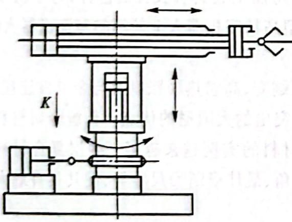

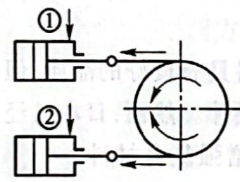

(a) 单杆活塞气缸驱动链传动结构

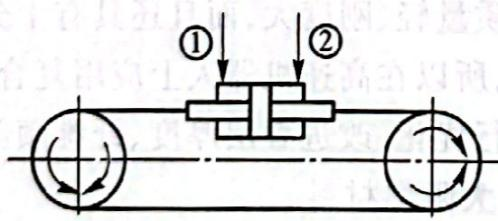

(b) 双杆活塞气缸驱动链传动机构

图 2.1 链传动实现机身回转的原理图

##### 2. 回转与俯仰机身

机器人臂部的俯仰运动一般采用活塞油(气)缸与连杆机构实现。臂部俯仰运动用的活塞 缸位于臂部的下方,其活塞杆和臂部用铰链连接,缸体采用尾部耳环或中部销轴等方式与立柱连接,如图2.2所示。此外,有时也采用无杆活塞缸驱动齿条齿轮或四杆机构实现臂部的俯仰运动。 

#### 二、机身驱动力(力矩)计算

##### 1. 垂直升降运动驱动力的计算

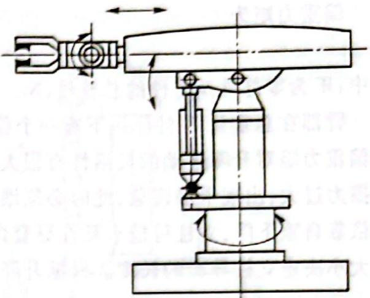

作垂直运动时,除克服摩擦力之外,还要克服机身自身运动部件的重力和其支承的臂部、腕部、手部及工件的总重力以及升降运动的全部部件惯性力,故其驱动力 $P_{q}$ 可按下式计算: 

图 2.2 回转与俯仰机身 

$$
\boldsymbol {P} _ {\mathrm{q}} = \boldsymbol {F} _ {\mathrm{m}} + \boldsymbol {F} _ {\mathrm{g}} \pm \boldsymbol {W}\tag{2.1}
$$

式中： $F_{m}$ 为各支承处的摩擦力，N； $F_{g}$ 为启动时的总惯性力，N；W 为运动部件的总重力，N；对于式中的正、负号，上升时为正，下降时为负。 

##### 2. 回转运动驱动力矩的计算

回转运动驱动力矩只包括两项:回转部件的摩擦总力矩和机身自身运动部件和其支承的臂部、腕部、手部及工件的总惯性力矩,故驱动力矩 $M_{q}$ 可按下式计算: 

$$
M _ {\mathrm{q}} = M _ {\mathrm{m}} + M _ {\mathrm{g}}\tag{2.2}
$$

式中： $M_{\mathrm{m}}$ 为总摩擦阻力矩， $\mathbf{N}\cdot \mathbf{m};M_{\mathrm{g}}$ 为各回转运动部件的总惯性力矩， $\mathbf{N}\cdot \mathbf{m}$ ，而 

$$
M _ {\mathrm{g}} = J _ {0} \frac {\Delta \omega}{\Delta t}\tag{2.3}
$$

式中： $\Delta\omega$ 为升速或制动过程中的角速度增量，rad/s； $\Delta t$ 为回转运动升速或制动过程的时间，s； $J_{0}$ 为全部回转零部件对机身回转轴的转动惯量， $kg\cdot m^{2}$ 。 

如果零件轮廓尺寸不大,重心到回转轴线的距离较远,一般可按质点计算它对回转轴的转动惯量。 

##### 3. 升降立柱下降不卡死(不自锁)的条件计算

偏重力矩是指臂部全部零部件与工件的总重量对机身回转轴的静力矩。当臂部悬伸为最大行程时，其偏重力矩最大。故偏重力矩应按悬伸最大行程且最大抓重时进行计算。 

各零部件的重量可根据其结构形状和材料密度进行粗略计算。由于大多数零件采用对称形状的结构，其中心位置就在几何截面的几何中心上，因此可根据静力学原理求出臂部总重量的重心位置到机身立柱轴的距离L，亦称为偏重力臂，如图2.3所示。 

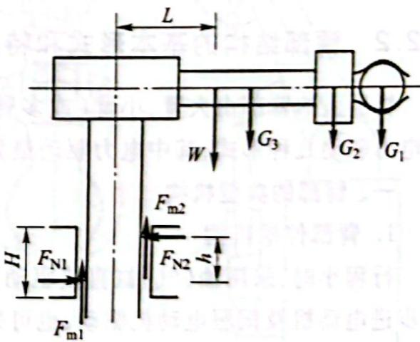

偏重力臂的大小为 

图 2.3 机器人臂部的偏重力矩

$$
L = \frac {\sum G _ {i} L _ {i}}{\sum G _ {i}}\tag{2.4}
$$

式中： $G_{i}$ 为零部件及工件的重量，N； $L_{i}$ 为零部件及工件的重心到机身回转轴的距离，m。 

偏重力矩为 

$$
M = W L\tag{2.5}
$$

式中：W 为零部件及工件的总重量，N。 

臂部在总重量 W 的作用下有一个偏重力矩,而立柱支承导套中有阻止臂部倾斜的力矩,显然偏重力矩对升降运动的灵活性有很大影响。如果偏重力矩过大,会使支承导套与立柱之间的摩擦力过大,出现卡滞现象,此时必须增大升降驱动力,相应的驱动及传动装置的结构庞大。如果依靠自重下降,立柱可能卡死在导套内而不能作下降运动,这就是自锁。故必须根据偏重力矩的大小决定立柱导套的长度。根据升降立柱的平衡条件可知: 

$$
F _ {\mathrm{N} 1} h = W L
$$

所以 

$$
F _ {\mathrm{N1}} = F _ {\mathrm{N2}} = \frac {L}{h} W
$$

要使升降立柱在导套内下降自由，臂部总重量 W 必须大于导套与立柱之间的摩擦力 $F_{ml}$ 及 $F_{m2}$ ，因此升降立柱依靠自重下降而不引起卡死的条件为 

$$
W > F _ {\mathrm{m} 1} + F _ {\mathrm{m} 2} = 2 F _ {\mathrm{N} 1} f = 2 \frac {L}{h} W f
$$

$$
h > 2 f L\tag{2.6}
$$

式中：h 为导套的长度，m；f 为导套与立柱之间的摩擦系数， $f=0.015\sim0.1$ ，一般取较大值；L 为偏重力臂长度，m。 

假如立柱升降都是依靠驱动力进行的,则不存在立柱自锁(卡死)条件,升降驱动力计算中摩擦阻力按式(2.6)计算。 

#### 三、机身设计要注意的问题

1）刚度和强度大，稳定性好。 

2）运动灵活，导套不宜过短，避免卡死。 

3）驱动方式适宜。 

4）结构布置合理。 

### 2.2.2 臂部结构的基本形式和特点

机器人的臂部由大臂、小臂(或多臂)所组成。臂部的驱动方式主要有液压驱动、气压驱动和电力驱动几种形式,其中电力驱动最为通用。 

#### 一、臂部的典型机构

##### 1. 臂部伸缩机构

行程小时,采用油(气)缸直接驱动;行程较大时,可采用油(气)缸驱动齿条传动的倍增机构或步进电动机及伺服电动机驱动,也可采用丝杠螺母或滚珠丝杠传动。为了增加臂部的刚性,防止臂部在伸缩运动时绕轴线转动或产生变形,臂部伸缩机构需设置导向装置,或设计方形、花键等形式的臂杆。常用的导向装置有单导向杆和双导向杆等,可根据臂部的结构、抓重等因素选取。 

图 2.4 所示为采用四根导向柱的臂部伸缩结构。臂部的垂直伸缩运动由油缸 3 驱动, 其特点是行程长、抓重大。工件形状不规则时, 为了防止产生较大的偏重力矩, 可采用四根导向柱。 

这种结构多用于箱体加工线上。 

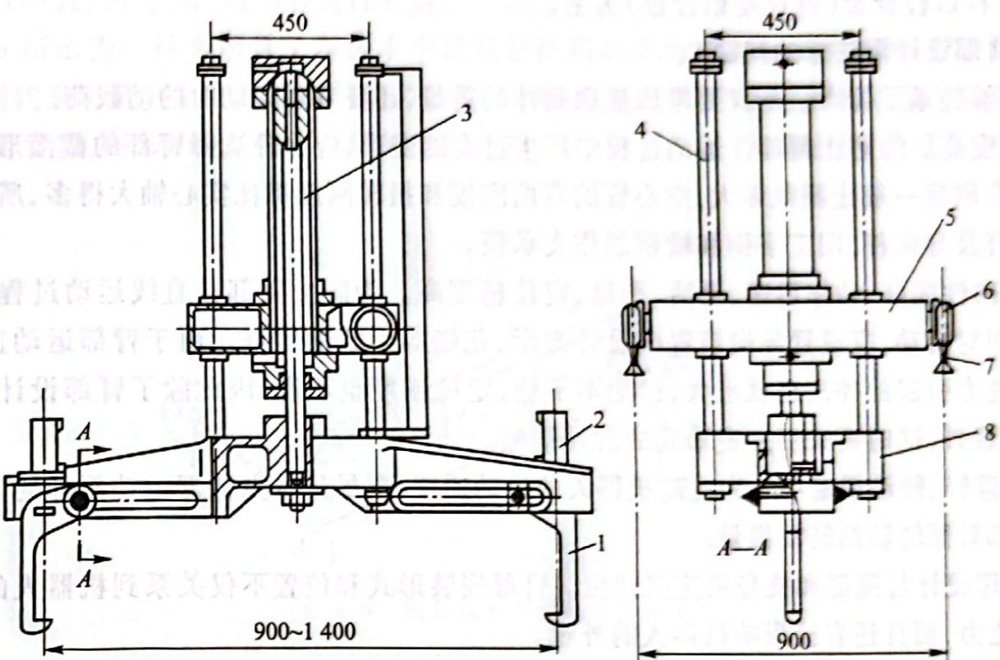

图 2.4 采用四根导向柱的臂部伸缩机构

1—手部；2—夹紧缸；3—油缸；4—导向柱；5—运行架；6—行走车轮；7—轨道；8—支座

##### 2. 臂部俯仰机构

通常采用摆臂油(气)缸驱动、铰链连杆机构传动实现臂部的俯仰,如图2.5所示。 

##### 3. 臂部回转与升降机构

臂部回转与升降机构常采用回转缸与升降缸单独驱动,适用于升降行程短而回转角度小于360°的情况,也有采用升降缸与气马达-锥齿轮传动的结构。 

#### 二、机器人臂部材料的选择

机器人臂部材料应根据臂部的工作状况来选择。根据设计要求，机器人臂部要完成各种运动。因此，对材料的一个要求是，作为运动的部件它应是轻型材料。另外，臂部在运动过程中往往会产生振动，这将大大降低它的运动精度。因此，选择材料时，需要对质量、刚度、阻尼进行综合考虑，以便有效地提高臂部的动态性能。 

机器人臂部材料首先应是结构材料。臂部承受载荷时不应有变形和断裂，从力学角度看，即要具有一定的强度，应选择高强度材料，如钢、铸铁、合金钢等。机器人臂部是运动的，又要具有很好的受控性，因此要求臂部比较轻。综合而言，应该优 

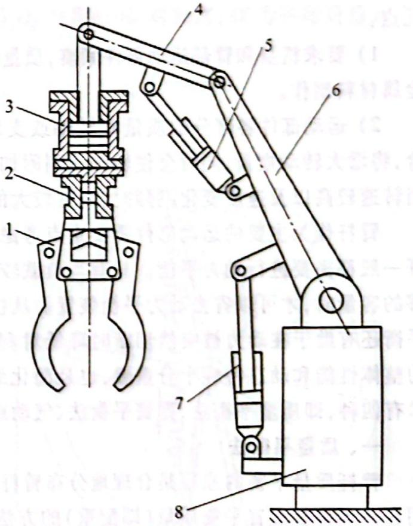

图 2.5 摆动油缸驱动连杆臂部俯仰机构

1—手部；2—夹紧缸；3—升降缸；4—小臂； 

5、7—摆动油缸；6—大臂；8—立柱 

先选择强度大而密度小的材料制作臂部,其中非金属材料有尼龙6、聚乙烯(PEH)和碳素纤维等,金属材料以轻合金(特别是铝合金)为主。 

#### 三、臂部设计需注意的问题

1）足够的承载能力。不仅要考虑抓取物体的重量，还要考虑运动时的动载荷。 

2）刚度高。为防止臂部在运动过程中产生过大的变形，应合理选择臂部的截面形状。工字形截面弯曲刚度一般比圆截面大，空心管的弯曲刚度和扭转刚度都比实心轴大得多，所以常用钢管制作臂杆及导向杆、用工字钢和槽钢制作支承板。 

3）导向性能好，动作迅速、灵活、平稳，定位精度高。为防止臂部在直线运动过程中沿运动轴线发生相对转动，应设置导向装置或设计方形、花键等形式的臂杆。由于臂部运动速度越高，定位前惯性力引起的冲击也就越大，运动不平稳，定位精度也不高，因此除了臂部设计力求结构紧凑、重量轻外，同时要采用一定形式的缓冲措施。 

4）重量轻、转动惯量小。为提高机器人的运动速度，要尽量减少臂部运动部分的重量，以减少整个臂部对回转轴的转动惯量。 

5）合理设计与腕部和机身的连接部位。臂部安装形式和位置不仅关系到机器人的强度、刚度和承载能力，而且还直接影响机器人的外观。 

### 2.2.3 机器人的平稳性和臂杆平衡方法

机身和臂部的运动较多,质量较大,如果运动速度和负载又较大,当运动状态变化时,将产生冲击和振动。这将不仅影响机器人的精确定位,甚至会使其不能正常运转。为了提高工作平稳性,在设计时应采取有效的缓冲装置吸收能量。从减少能量产生的方面来看,一般应注意以下几点: 

1）要求机身和臂部运动部件紧凑，质量轻，以减小惯性力。例如，臂部构件采用铝合金或非金属材料制作。 

2）运动部件各部分的质量对转轴或支承的分布情况，即重心的布置。如重心与转轴不重合，将增大转动惯量，同时会使转轴受到附加的动压力，其方向在臂部转动过程中是不断变化的，当转速较高以及速度变化剧烈时，将有较大的冲击和振动。 

臂杆作为主要的运动部件需要重点考虑。为了减小驱动力矩和增加运动的平稳性，大、小臂杆一般都需要进行动力平衡。只有当负载较小，臂杆的质量较轻，关节力矩不大和驱动装置有足够的容量时，才可以省去动力平衡装置。从机械驱动的合理性和安全性角度出发，机器人臂杆的平衡还有助于在动力被突然切断时降低对刹车装置的要求。总之，臂杆平衡技术对提高机器人的整体性能和动态特性十分重要，也是简化编程和控制的重要措施。常见机器人臂杆的平衡技术有四种，即质量平衡法、弹簧平衡法、气动或液压平衡法和采用平衡电动机。 

#### 一、质量平衡法

臂杆质量平衡的原理是合理地分布臂杆质量,使臂杆重心尽可能落在支点上,必要时甚至采用在适当位置配置平衡质量(即配重)的方法,使臂杆的重心落在支点上。例如 PUMA 262 型机器人就是采用将关节驱动电动机布置到各手臂转轴另一端的方法,巧妙地解决了大部分悬臂质量的平衡问题。这种方法虽然会使臂杆的总质量有所增加,但由于重力悬臂力矩减小,使总的驱动扭矩、扭矩间的耦合和非线性程度有所降低。在关节型机器人的应用中,由于小臂杆质量对驱 动扭矩的不利影响更大，因而在小臂杆上使用平衡技术更为普遍；对于大臂臂杆，主要使用弹簧力或其他可控力，如气、液、电力等进行平衡。 

图2.6所示为一种在质量平衡技术中最经常使用的平行四边形平衡机构。图中 $L_{2}, L_{3}$ 和 $G_{2}, G_{3}$ 分别代表下臂和上臂的长度与质心； $m_{2}, m_{3}$ 和 $\theta_{2}, \theta_{3}$ 分别代表它们的质量与转角； $m$ 为可移动的平衡质量，用来平衡下臂和上臂的质量。杆 $SA, AB$ 与上臂、下臂铰接，构成一个平行四边形平衡系统。 

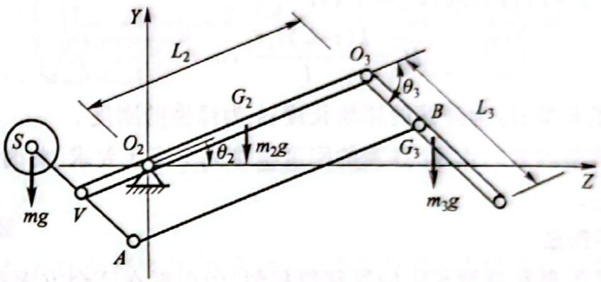

图 2.6 机器人平行四边形平衡机构

可以证明,只要满足 

$$
S V = \frac {m _ {3} O _ {3} G _ {3}}{m}\tag{2.7}
$$

$$
O _ {2} V = \frac {m _ {2} O _ {2} G _ {2} + m _ {3} O _ {3} G _ {3}}{m}\tag{2.8}
$$

式中： $O_{3}G_{3}$ 为关节 $O_{3}$ 与质心 $G_{3}$ 的距离； $O_{2}G_{2}$ 为关节 $O_{2}$ 与质心 $G_{2}$ 的距离；SV 为平衡质量 m 与关节 V 的距离； $O_{2}V$ 为关节 $O_{2}$ 与关节 V 的距离。 

$$
\sum M = 0
$$

使平行四边形机构处于平衡状态。 

式(2.7)及式(2.8)表明平衡与否只与可移动平衡质量 m 的大小和位置有关,与 $\theta_{2}$ 、 $\theta_{3}$ 无关,这说明该平衡系统在机械臂的任何构型下都是平衡的。 

#### 二、弹簧平衡法

弹簧平衡一般可以使用长弹簧。分析表明，在关节模型中，只要采用合适刚度和长度的弹簧平衡系统，可以全部平衡关节模型重力项。 

如图 2.7 所示, 设杆 2 代表要平衡的臂杆, 平衡时在杆 2 的尾端离转动中心 $r_{2}$ 处安装一根长弹簧。长弹簧的另一端安装在长度为 $r_{1}$ 的固定连杆 1 上, 固定连杆 1 的另一端固定在转动中心 O 上。如果杆 2 的原始位置和固定连杆 1 垂直, 工作时杆 2 顺时针转动了角度 $\theta$ , 则在工作位置上弹簧力…… 

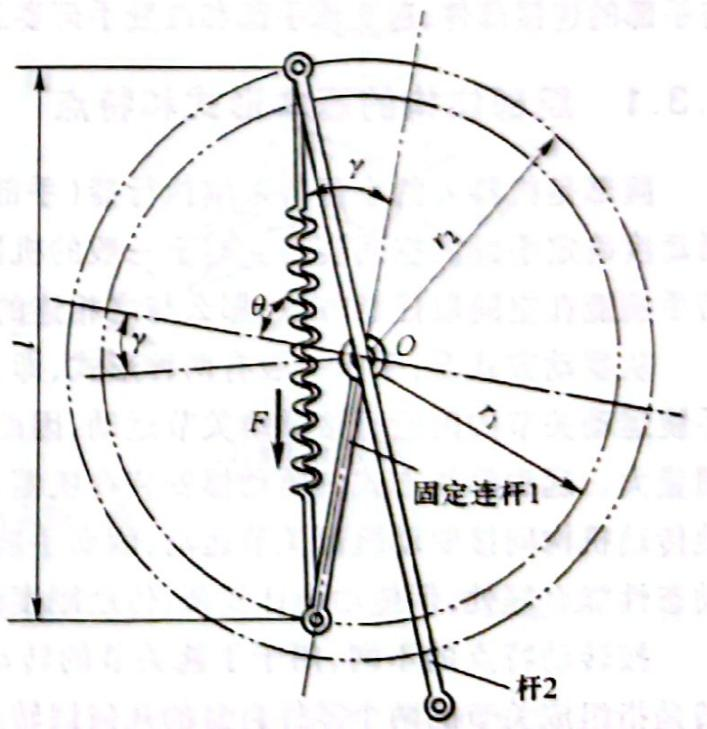

图 2.7 弹簧平衡原理

## 2.3 腕部及手部结构

### 2.3.1 腕部结构的基本形式和特点

> 编校说明：原始扫描 PDF 缺少书页 28—29，因此 2.2.3 的结尾和 2.3.1 的开头部分无法恢复；以下内容从书页 30 起续接。

图 2.10 所示为三自由度手腕的 6 种结合方式示意图。 

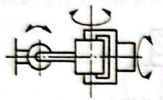

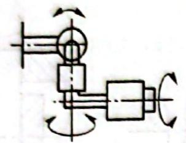

(a) BBR 型三自由度手腕结构 (b) BRR 型三自由度手腕结构

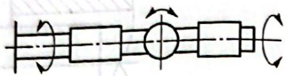

(c) RBR 型三自由度手腕结构

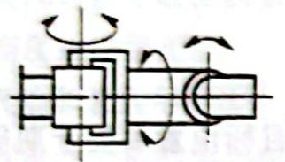

(d) BRB 型三自由度手腕结构

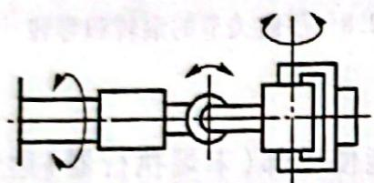

(e) RBB 型三自由度手腕结构

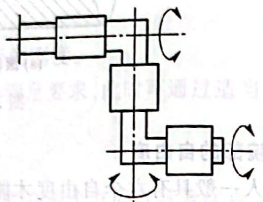

(f) RRR 型三自由度手腕结构

图2.10 三自由度手腕的6种结合方式示意图

#### 二、RRR型手腕

RRR型手腕容易实现远程传动。RRR型手腕的结构示意及远程传动示意分别如图2.11和图2.12所示。为了实现运动的传递，RRR型手腕的中间关节是斜置的，三根转动轴内外套在同一转动轴线上，最外面的转动轴套直接驱动整个手腕转动，中间的轴套驱动斜置的中间关节运动，中心轴驱动第三个滚转关节。PUMA 262型机器人的腕部就采用了这种远程关节传动形式。RRR型手腕制造简单，润滑条件好，机械效率高，应用较为普遍。 

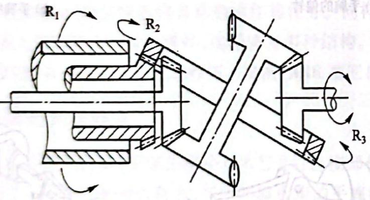

图 2.11 RRR 型手腕结构示意

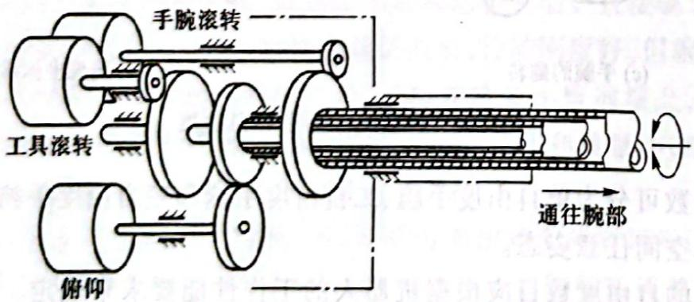

图 2.12 RRR 型手腕远程传动示意

#### 三、腕部的典型结构

##### 1. 单自由度回转运动手腕

单自由度回转运动手腕用回转油缸或气缸直接驱动实现腕部回转运动。图2.13所示为采用回转油缸直接驱动的单自由度腕部结构。这种手腕具有结构紧凑、体积小、运动灵活、响应快、精度高等特点，但回转角度受限制，一般小于 $270^{\circ}$ 。 

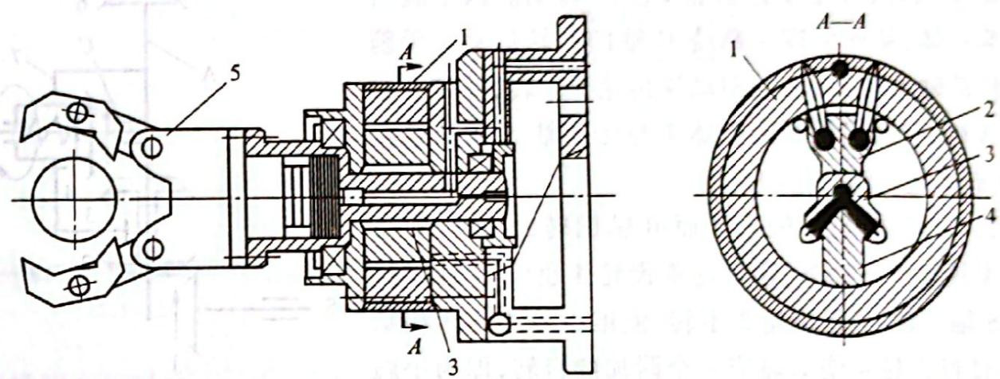

图 2.13 回转油缸直接驱动的单自由度腕部结构

1—回转油缸；2—定片；3—腕回转轴；4—动片；5—手腕

##### 2. 二自由度手腕

###### (1) 双回转油缸驱动的腕部

图 2.14 所示为采用两个轴线互相垂直的回转油缸的腕部结构。V—V 剖面为腕部摆动回转 

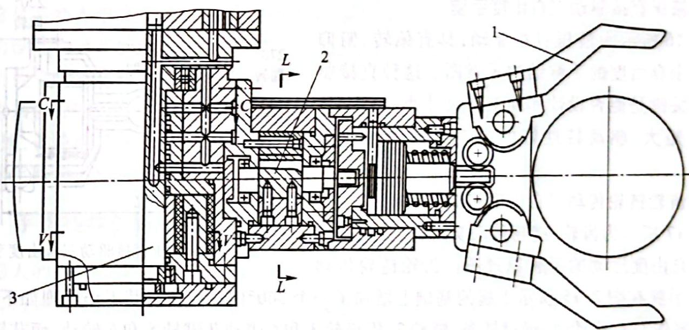

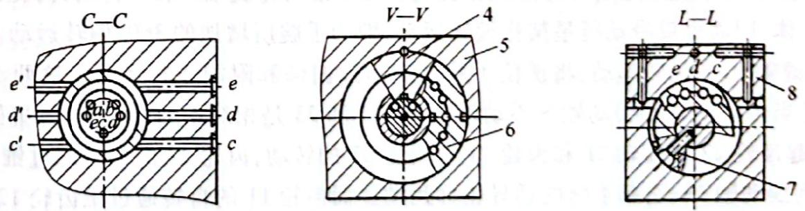

图 2.14 具有回转与摆动的二自由度腕部结构

1—手腕；2—回转中心轴；3—固定中心轴；4—定片；5—摆动回转油缸；6—动片；7—回转轴；8—回转油缸

油缸,工作时,动片6带动摆动回转油缸5使整个腕部绕固定中心轴3摆动。L-L剖面为腕部回转油缸,工作时,回转轴7带动回转中心轴2,实现腕部的回转运动。 

###### (2) 齿轮传动二自由度腕部

图 2.15 所示为采用齿轮传动机构实现手腕回转和俯仰的二自由度手腕。手腕的回转运动由传动轴 S 传递，轴 S 驱动锥齿轮 1 回转，并带动锥齿轮 2、3、4 转动。因手腕与锥齿轮 4 为一体，从而实现手部绕 C 轴的回转运动。手腕的俯仰由传动轴 B 传递，轴 B 驱动锥齿轮 5 回转，并带动锥齿轮 6 绕 A 轴回转，因手腕的壳体 7 与传动轴 A 用销连接为一体，从而实现手腕的俯仰运动。 

由图 2.15 可知, 当 S 轴不转而 B 轴回转时, B 轴除带动手腕绕 A 轴上下摆动外, 还带动锥齿轮 4 也绕 A 轴作转动。由于 S 轴不转, 故锥齿轮 3 不转, 但锥齿轮 4 与 3 相啮合, 因此迫使锥齿轮 4 绕 C 轴有一个附加的自转, 即为手腕的附加回转运动。因手腕俯仰运动引起的手腕附加回转运动被称为诱导运动, 这在考虑手腕的回转运动时应予以注意。 

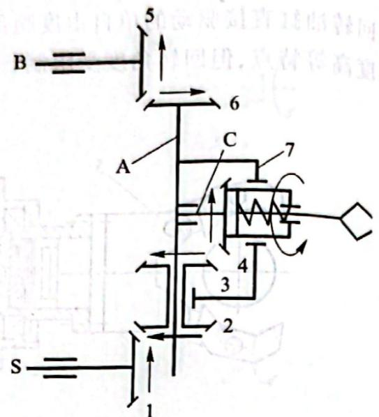

图2.15 齿轮传动回转和俯仰型腕部原理

这种传动机构结构紧凑、轻巧，传动扭矩大，能提高机器人的工作性能。在示敏型机器人中，较多地采用这类传动机构作为手腕结构。但该结构的缺点是手腕有一个诱导运动，设计时要注意采取补偿措施，消除诱导运动的影响。 

##### 3. 三自由度手腕

###### (1) 液压直接驱动三自由度手腕

图 2.16 所示为液压直接驱动, 具有偏转、俯仰和回转三个自由度的手腕结构示意图。这种直接驱动手腕的关键是能否设计和加工出尺寸小、重量轻, 而驱动力矩大、驱动特性好的电动机或液压驱动马达。 

###### (2) 齿轮链轮传动三自由度腕部

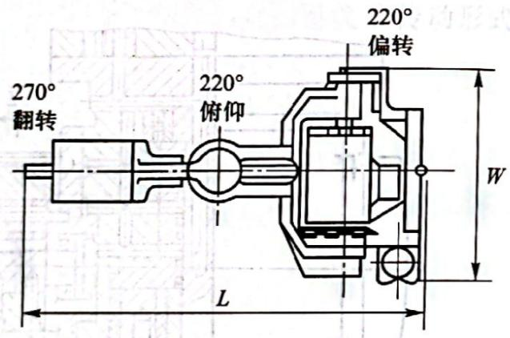

图 2.17 所示为齿轮、链轮传动实现偏转、俯仰和回转三个自由度运动的手腕原理图。齿轮链轮传动 

图 2.16 液压直接驱动三自由度手腕

三自由度手腕在图2.15所示手腕的基础上增加了一个 $360^{\circ}$ 偏转运动。其工作原理如下:当油缸1中的活塞作左右移动时,通过链条、链轮2、锥齿轮3和4带动花键轴5和6转动,而花键轴6与行星架9连成一体,因而也就带动行星架作偏转运动,即为手腕所增加的 $360^{\circ}$ 偏转运动。由于增加了T轴(即花键轴6)的偏转运动,将诱使手腕产生附加俯仰和附加回转运动。这两个诱导运动产生的原因是当传动轴B和传动轴S不动时,齿轮21和23是相对不动的,由于行星架9的回转运动,势必引起齿轮22绕齿轮21和齿轮11绕齿轮23的转动,齿轮22的自转通过锥齿轮20、16、17、18传递到摆动轴19,引起手腕的诱导俯仰运动。而齿轮11的自转通过锥齿轮12、13、14、15传递到手部夹紧缸的壳体,使手腕作诱导回转运动。同样的,当S、T轴不动时,B轴的转动也会诱使手部夹紧缸的壳体作附加回转运动。设计时要注意采取补偿措施消除诱导运动的影响。 

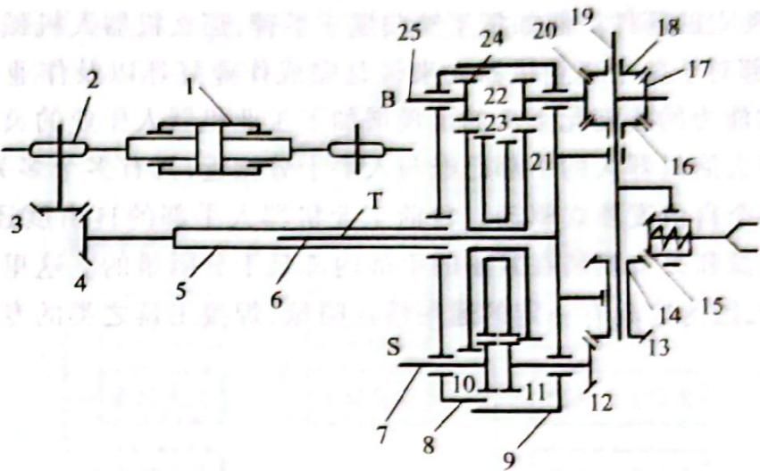

图 2.17 齿轮链轮传动三自由度手腕原理图

1—油缸；2—链轮；3、4—锥齿轮；5、6—花键轴；7—传动轴S；8—腕架；9—行星架；10、11、22、24—圆柱齿轮；12、13、14、15、16、17、18、20—锥齿轮；19—摆动轴；21、23—双联圆柱齿轮；25—传动轴B

这种机构在轴线重合时会出现奇异状态,即自由度退化。图 2.17 所示手腕所处的位置即为奇异状态。 

#### 四、设计腕部时一般应注意的问题

1）结构紧凑，重量轻。 

2）动作灵活、平稳，定位精度高。 

3）强度、刚度高。 

4）合理设计与臂部和手部的连接部位以及传感器和驱动装置的布局和安装。 

手腕是机器人中最复杂的结构,而且因传动系统互相干扰,更增加了手腕结构的设计难度。对腕部的设计要求是质量轻,满足作业对手部姿态的要求,并留有一定的裕量(5%~10%);传动系统结构简单并有利于小臂对整机的静力平衡。一般来说,由于手腕处在开式连杆系末端的特殊位置,它的尺寸和质量对操作机的动态特性和使用性能影响很大。因此,除了要求其动作灵活、可靠外,还应使其结构尽可能紧凑、质量尽可能小。在所有的三自由度手腕结构中,RRR型三自由度手腕构造较简单,应用较普遍。 

### 2.3.2 手部结构的基本形式和特点

机器人的手部也称为末端执行器,它是装在机器人手腕上直接抓握工件或执行作业的部件。人的手有两种定义:第一种定义是医学上把包括上臂、手腕在内的整体称为手;第二种定义是把手掌和手指部分称为手。机器人的手部接近于第二种定义,因此也常称为手爪。 

#### 一、机器人手部的特点

1）手部与手腕相连处可拆卸。手部与手腕有机械接口，也可能有电、气、液接头。工业机器人作业对象不同时，可以方便地拆卸和更换手部。 

2）手部是机器人末端执行器。它可以像人手那样具有手指，也可以是不具备手指的手；可以是类人的手爪，也可以是进行专业作业的工具，比如装在机器人手腕上的喷枪、焊接工具等。 

3）手部的通用性比较差。机器人手部通常是专用的装置。例如：一种手爪往往只能抓握一种或几种在形状、尺寸、重量等方面相近的工件；一种工具只能执行一种作业任务。 

4）手部是一个独立的部件。假如把手腕归属于手臂，那么机器人机械系统的三大件就是机身、手臂和手部。手部对于整个工业机器人来说是完成作业好坏以及作业柔性好坏的关键部件之一。具有复杂感知能力的智能化手爪的出现增加了工业机器人作业的灵活性和可靠性。 

有一种弹钢琴的表演机器人的手部已经与人手十分相近,具有多个多关节手指,一个手的自由度达到20余个,每个自由度独立驱动。目前工业机器人手部的自由度还比较少,把具备足够驱动力量的多个驱动源和关节安装在紧凑的手部内部是十分困难的。这里主要介绍和讨论手爪式手部的原理和设计,因为它具有一定的通用性。喷枪、焊接工具之类的专用工具是行业性专业工具,这里不予介绍。 

#### 二、手部的分类

##### 1. 按用途分类

###### (1) 手爪

手爪具有一定的通用性,它的主要功能是抓住工件、握持工件和释放工件。 

抓住工件——在给定的目标位置和期望姿态上抓住工件，工件在手爪内必须具有可靠的定位，保持工件与手爪之间准确的相对位姿，并保证机器人后续作业的准确性。 

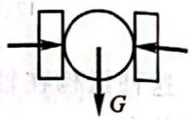

握持工件——确保工件在搬运过程中或零件在装配过程中定义了的位置和姿态的准确性。 

释放工件——在指定点上除去手爪和工件之间的约束关系。 

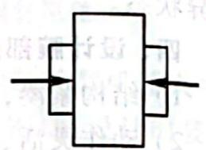

图 2.18 所示手爪夹持圆柱工件时尽管夹紧力足够大, 在工件和手爪接触面上有足够的摩擦力来支承工件重量, 但是从运动学观点来看其约束条件不够, 不能保证工件在手爪上的准确定位。 

图2.18 平面手爪夹持圆柱工件 

###### (2) 工具

工具是进行某种作业的专用工具,如喷枪、焊接工具等,如图2.19所示。 

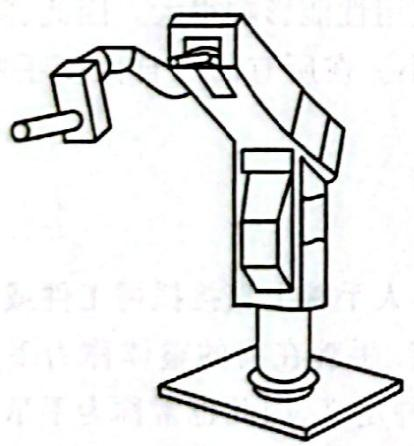

(a) 喷枪

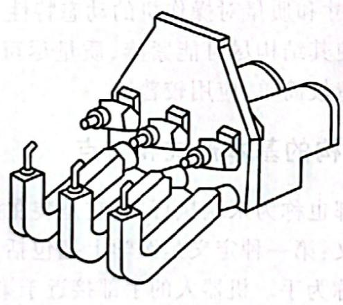

(b) 焊接工具

图 2.19 专用工具(喷枪、焊接工具)

##### 2. 按夹持原理分类

按夹持原理手爪可分为机械手爪、磁力类手爪和真空类手爪三种。机械手爪有靠摩擦力夹持和吊钩承重两类，前者是有指手爪，后者是无指手爪。产生夹紧力的驱动方式可以有气动、液动、电动和电磁四种。磁力类手爪主要是磁力吸盘，有电磁吸盘和永磁吸盘两种。真空类手爪主 要是真空式吸盘,根据形成真空的原理可分为真空吸盘、气流负压吸盘和挤气负压吸盘三种。磁力类手爪及真空类手爪是无指手爪(图2.20)。 

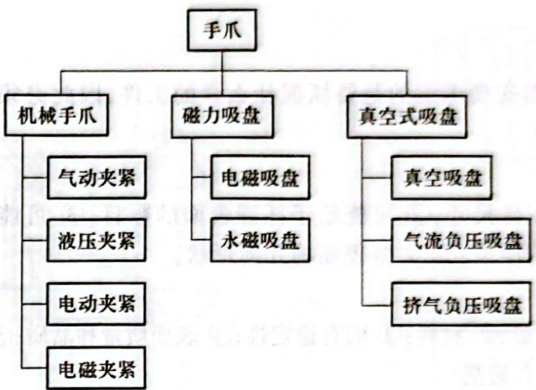

图 2.20 手爪按夹持原理分类

##### 3. 按手指或吸盘数目分类

1）按手指数目可分为二指手爪及多指手爪。 

2）按手指关节可分为单关节手指手爪及多关节手指手爪。 

3）吸盘式手爪按吸盘数目可分为单吸盘式手爪及多吸盘式手爪。 

图 2.21 所示为一种三指手爪的外形图, 每个手指是独立驱动的。这种三指手爪与二指手爪相比, 可以抓取类似立方体、圆柱及球等不同形状的物体。图 2.22 所示为一种多关节柔性手指手爪, 它的每个手指具有若干个被动式关节, 每个关节不是独立驱动的。在拉紧夹紧钢丝绳后柔性手指环抱住物体, 因此这种柔性手指手爪对物体形状有一种适应性。但是, 这种柔性手指并不同于各个关节独立驱动的多关节手指。 

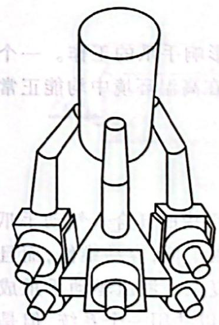

图 2.21 三指手爪

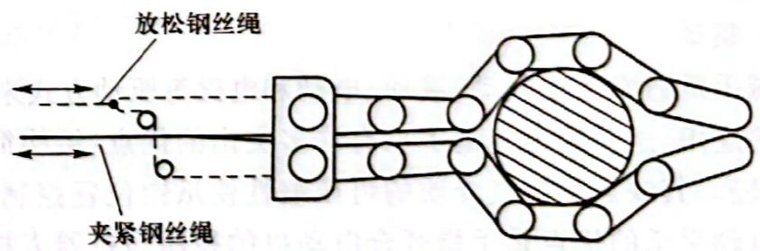

图 2.22 多关节柔性手指手爪

##### 4. 按智能化分类

1）普通式手爪。这类手爪不具备传感器。 

2）智能化手爪。这类手爪具备一种或多种传感器，如力传感器、触觉传感器及滑觉传感器等，手爪与传感器集成为智能化手爪。 

#### 三、手爪设计和选用的要求

手爪设计和选用时最主要的是满足功能上的要求,具体来说要围绕以下几个方面进行调查,提出设计参数和要求。 

##### 1. 被抓握的对象

手爪设计和选用时首先要考虑的是要抓握什么样的工件,因此必须充分了解工件的几何参数及机械特性。 

###### (1) 几何参数

几何参数包括:①工件尺寸;②可能给予抓握表面的数目;③可能给予抓握表面的位置和方向;④夹持表面之间的距离;⑤夹持表面的几何形状。 

###### (2) 机械特性

机械特性包括:① 质量;② 材料;③ 固有稳定性;④ 表面质量和品质;⑤ 表面状态;⑥ 工件温度。 

##### 2. 物料馈送器或储存装置

与机器人配合工作的物料馈送器或储存装置对手爪最小和最大爪钳之间的必需距离以及夹紧力都有要求,同时还应了解其他可能的不确定因素对手爪工作的影响。 

##### 3. 机器人作业顺序

一台机器人在齿轮箱装配作业中需要搬运齿轮和轴,并进行装配。虽然手部既可以抓握齿轮也可以夹持轴,但是不同零件所需的夹紧力和爪钳张开距离是不同的,手部设计时应考虑被夹持对象的顺序。必要的时候可采用多指手爪,以增加手部作业的柔性。 

##### 4. 手爪和机器人匹配

手爪一般用法兰式机械接口与手腕相连接,手爪自重也增加了机械臂的负载,这两个问题必须给予仔细考虑。手爪是可以更换的,手爪形式可以不同,但是与手腕的机械接口必须相同,这就是接口匹配。手爪自重不能太大,机器人能抓取工件的重量是机器人承载能力减去手爪重量。手爪自重要与机器人承载能力匹配。 

##### 5. 环境条件

作业区域内的环境状况很重要,如高温、水、油等不同环境会影响手爪的工作。一个锻压机械手要从高温炉内取出红热的锻件坯,必须保证手爪的开合、驱动在高温环境中均能正常工作。 

#### 四、手爪的典型结构

##### 1. 机械手爪

###### (1) 驱动

机械手爪通常采用气动、液动、电动和电磁等驱动方式来控制手指的开合。气动手爪目前得到广泛的应用,这是因为气动手爪有许多突出的优点:结构简单,成本低,容易维修,而且开合迅速,重量轻。其缺点是空气介质的可压缩性使爪钳位置控制比较复杂。液压驱动手爪成本稍高一些。电动手爪的优点是手指开合电动机的控制与机器人控制可以共用一个系统,但是夹紧力比气动手爪、液压手爪小,开合时间比它们长。电磁手爪控制信号简单,但是电磁夹紧力与爪钳行程有关,因此只用在开合距离小的场合。图2.23所示为一种气动手爪,气缸4中的压缩空气推动活塞3使连杆齿条2作往复运动,经扇形齿轮1带动平行四边形机构,使爪钳5平行地快速开合。 

###### (2) 爪钳

爪钳是与工件直接接触的部分,它们的形状和材料对夹紧力有很大影响。夹紧工件的接触点 越多,所要求的夹紧力越小,对夹持工件来说显得越安全。图2.24所示为具有V形爪钳表面的手爪,它有四条折线与工件相接触,形成力封闭形式的夹持状态,比平面爪钳夹持安全可靠很多。 

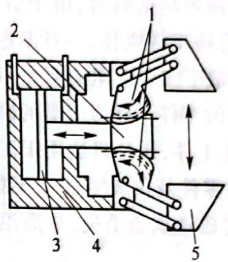

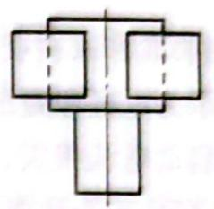

图 2.23 气动手爪

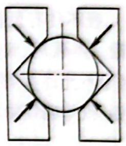

1—扇形齿轮；2—齿条；3—活塞；4—气缸；5—爪钳

图 2.24 V 形爪钳

###### (3) 传动

驱动源的驱动力通过传动机构驱使爪钳开合并产生夹紧力。机械手爪还常以传动机构来命名，如平行连杆式手爪（图2.23）、齿轮齿条式手爪（图2.25a）、拨杆式手爪（图2.25b）、滑槽式手爪（图2.25c）、重力式手爪（图2.25d）等。机械手爪对于传动机构有运动要求和夹紧力要求。 

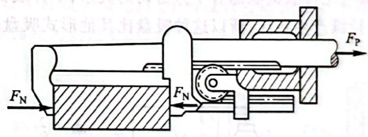

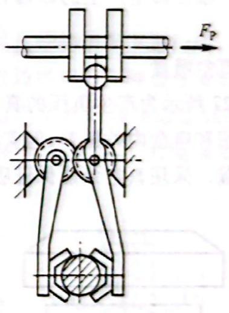

(a) 齿轮齿条式手爪

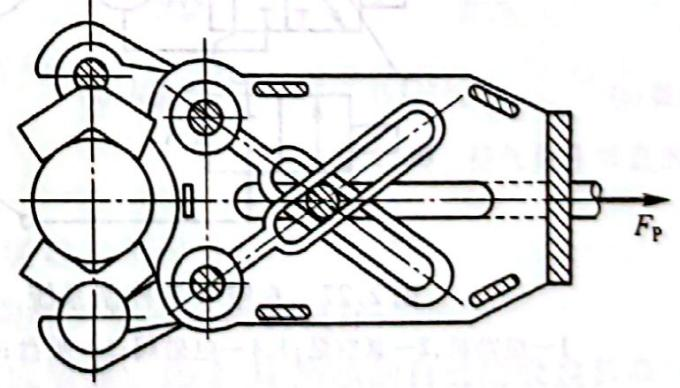

(b)拨杆式手爪

(c) 滑槽式手爪

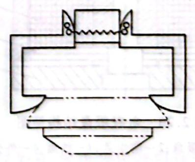

图 2.25 四种手爪传动机构

(d) 重力式手爪

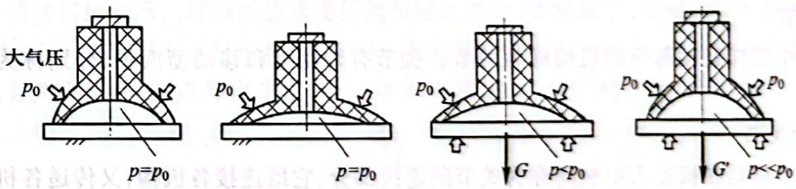

图 2.23 所示的平行连杆式手爪及图 2.25a 所示的齿轮齿条式手爪可保持爪钳平行运动，夹持宽度变化大，对夹紧力的要求是爪钳开合度不同时夹紧力能保持不变。 

##### 2. 磁力吸盘

磁力吸盘有电磁吸盘和永磁吸盘两种。磁力吸盘是在手部装上电磁铁，通过磁场吸力把工件吸住。图2.26所示为电磁吸盘的结构简图。在线圈通电的瞬时，由于空气间隙的存在，磁阻很大，线圈的电感和启动电流很大，这时产生磁性吸力将工件吸住，一旦断电，磁性吸力消失，工件松开。若采用永久磁铁作为吸盘，则必须强迫性地取下工件。电磁吸盘只能吸住铁磁材料制成的工件（如钢铁件），吸不住有色金属和非金属材料的工件。磁力吸盘的缺点是被吸附工件有剩磁，吸盘上常会吸附一些铁屑，致使不能可靠地吸住工件，而且只适用于工件要求不高或有剩磁也无妨的场合。对于不允许有剩磁的工件（如钟表零件及仪表零件），不能选用磁力吸盘，可用真空吸盘。另外，钢、铁等磁性物质在723℃以上时磁性就会消失，故高温条件下不宜使用磁力吸盘。 

磁力吸盘要求工件表面清洁、平整、干燥，以保证可靠地吸附。磁力吸盘的计算主要是电磁吸盘中电磁铁吸力的计算以及铁心截面积、线圈导线直径和线圈匝数等参数的设计。要根据实际应用环境选择工作情况系数和安全系数。 

##### 3. 真空式吸盘

真空式吸盘主要用于搬运体积大、重量轻的零件，如冰箱壳体、汽车壳体等；也广泛用于需要小心搬运的物件，如显像管、平板玻璃等。真空式吸盘要求工件表面平整光滑、干燥清洁，同时气密性要好。根据真空产生的原理，真空式吸盘可分为真空吸盘、气流负压吸盘和挤气负压吸盘三种。 

###### (1) 真空吸盘

图 2.27 所示为产生负压的真空吸盘控制系统。吸盘吸力在理论上决定于吸盘与工件表面的接触面积和吸盘内外压差,但实际上其与工件表面状态有十分密切的关系,工件表面状态影响负压的泄漏。采用真空泵能保证吸盘内持续产生负压,所以这种吸盘比其他形式吸盘的吸力大。 

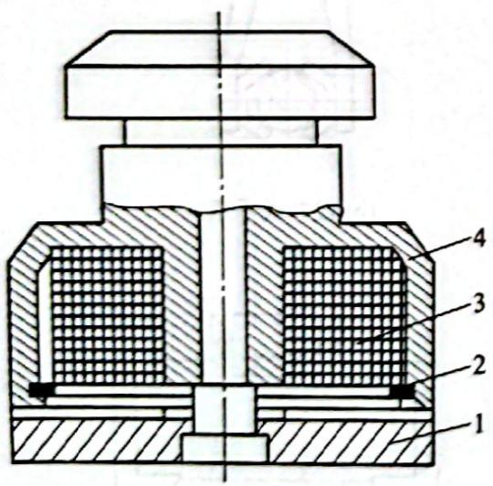

图 2.26 电磁吸盘结构简图

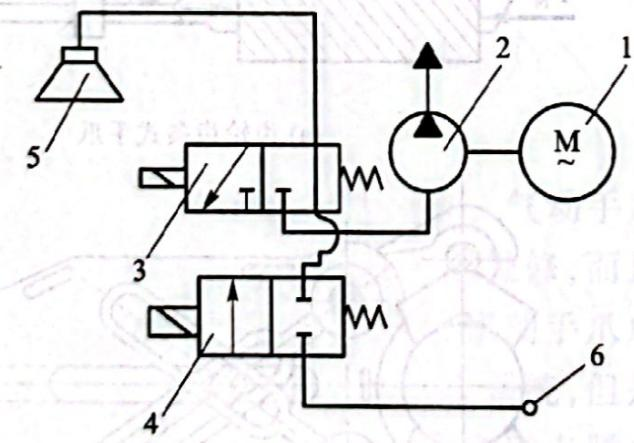

1—电磁吸盘；2—防尘盖；3—线圈；4—外壳体

图 2.27 真空吸盘控制系统

1—电动机；2—真空泵；3、4—电磁阀；5—吸盘；6—通大气

###### (2) 气流负压吸盘

气流负压吸盘的工作原理如图2.28所示，压缩空气进入喷嘴后，利用伯努利效应使橡胶皮 碗内产生负压。工厂一般都有空压机站或空压机，比较容易获得空压机气源，不需专为机器人配置真空泵，所以气流负压吸盘在工厂内使用方便。 

###### (3) 挤气负压吸盘

图 2.29 所示为挤气负压吸盘的结构。图 2.30 所示为挤气负压吸盘的工作原理。吸盘压向工件表面时，将吸盘内的空气挤出；松开时，压力去除，吸盘恢复弹性变形，使吸盘内腔形成负压，将工件牢牢吸住，机械手即可进行工件搬运；到达目标位置后，用碰撞力 $F_{p}$ 或电磁力使压盖 2 动作，破坏吸盘腔内的负压，释放工件。此种挤气负压吸盘不需真空泵系统也不需压缩空气气源，比较经济、方便，但是可靠性比真空吸盘和气流负压吸盘差。 

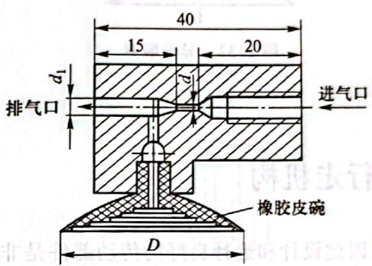

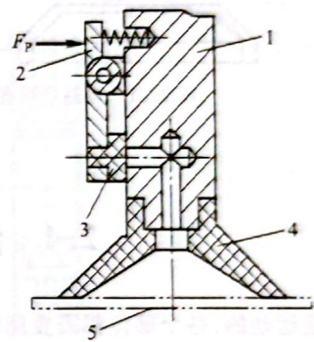

图2.28 气流负压吸盘

图 2.29 挤气负压吸盘

1—吸盘架；2—压盖；3—密封垫；4—吸盘；5—工件

挤气负压吸盘的吸力计算是在假设吸盘与工件表面气密性良好的情况下进行的,利用玻-玛定律和静力平衡公式计算内腔最大负压和最大极限吸力。对市场供应的三种型号耐油橡胶吸盘进行吸力理论计算及实测的结果表明,理论计算误差主要由假定工件表面为理想状况所造成。实验表明,在工件表面清洁度、平滑度较好的情况下牢固吸附时间可连续30 s,能满足一般工业机器人工作循环时间的要求。 

(a) 未挤气 

(b) 挤气 

(c) 提起工件重量 $G$ (d) 提起最大工件重量 $G^{\prime}$ 

图 2.30 挤气负压吸盘的工作原理 

##### 4. 真空吸盘的新设计

目前有两种真空吸盘的新设计： 

1）自适应吸盘。图2.31所示的自适应吸盘具有一个球关节，使吸盘能倾斜自如，适应工件表面倾角的变化，这种自适应吸盘在实际应用中获得了良好的效果。 

2）异形吸盘。图2.32所示异形吸盘为异形吸盘中的一种。通常吸盘只能吸附一般的平整 

工件,而该异形吸盘可用来吸附鸡蛋、锥颈瓶等物件,扩大了真空吸盘在工业机器人上的应用。 

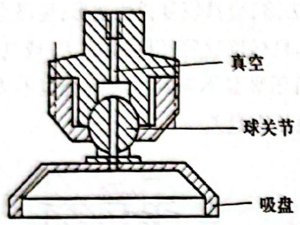

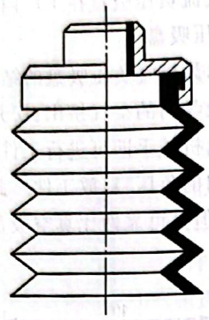

图2.31 自适应吸盘

图2.32 异形吸盘

## 2.4 传动及行走机构

机器人是运动的,各个部位都需要能源和动力,因此设计和选择良好的传动部件是非常重要的。本节主要介绍关节、常用的传动机构以及传动部件的定位和消隙。 

机器人可分成固定式和行走式两种,一般的工业机器人多为固定式。但是,随着海洋科学、原子能科学及宇宙空间事业的发展,可以预见,具有智能的可移动机器人是今后机器人的发展方向。例如,美国研制的“探索者”轮式机器人已成功用于火星探测。 

### 2.4.1 传动机构的基本形式和特点

传动机构用来把驱动器的运动传递到关节和动作部位,这涉及关节形式的确定、传动方式以及传动部件的定位和消隙等多个方面的内容。 

#### 一、关节

机器人中连接运动部分的机构称为关节。关节有转动型和移动型两种，分别称为转动关节和移动关节。 

##### 1. 转动关节

转动关节就是在机器人中被简称为关节的连接部分,它既连接各机构,又传递各机构间的回转运动(或摆动),用于基座与臂部、臂部之间、臂部和手部等连接部位。关节由回转轴、轴承和驱动机构组成。 

###### (1) 转动关节的形式

关节与驱动机构的连接方式有多种,因此转动关节也有多种形式(图 2.33): 

1) 驱动机构与回转轴同轴式。这种形式直接驱动回转轴，有较高的定位精度。但是，为了减轻重量，要选择小型减速器并增加臂部的刚性。它适用于水平多关节型机器人。 

2）驱动机构与回转轴正交式。重量大的减速机构安放在基座上，通过臂部的齿轮、链条传递运动。这种形式适用于要求臂部结构紧凑的场合。 

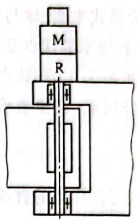

(a) 驱动机构与回转轴同轴式

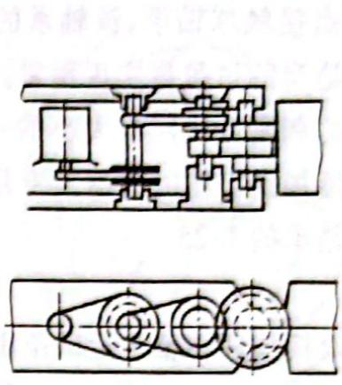

(b) 驱动机构与回转轴正交式

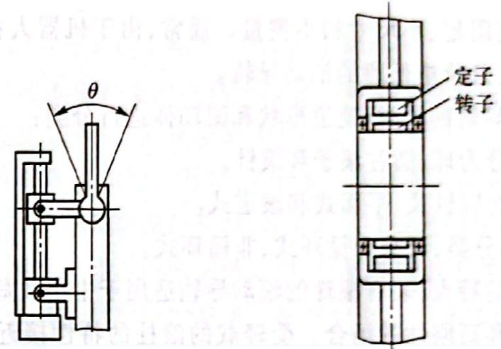

(c) 外部驱动机构驱动臂部的形式 (d) 驱动电动机安装在关节内部的形式

图2.33 转动关节的形式

3）外部驱动机构驱动臂部的形式。这种形式适合于传递大扭矩的回转运动，采用的传动机构有滚珠丝杠、液压缸和气缸。 

4）驱动电动机安装在关节内部的形式。这种方式称为直接驱动方式。 

###### (2) 轴承

机器人中轴承起着相当重要的作用,用于转动关节的轴承有多种形式,球轴承是机器人和机械手结构中最常用的轴承。球轴承能承受径向和轴向载荷,摩擦较小,对轴和轴承座的刚度不敏感。图2.34a所示为普通向心球轴承,图2.34b所示为向心推力球轴承,这两种轴承的每个球和滚道之间只有两点接触(一点与内滚道,另一点与外滚道)。为实现预载,此种轴承必须成对使 用。图 2.34c 所示为四点接触球轴承,该轴承的滚道是尖拱式半圆,球与每个滚道两点接触,该轴承通过两内滚道之间适当的过盈量实现预紧。因此,此种轴承的优点是无间隙,能承受双向轴向载荷,尺寸小,承载能力和刚度比同样大小的一般球轴承高 1.5 倍;缺点是价格较高。采用四点接触式设计以及高精度加工工艺的机器人专用轴承已经问世,这种轴承的质量是同等轴径的常规中系列四点接触球轴承的 1/25。 

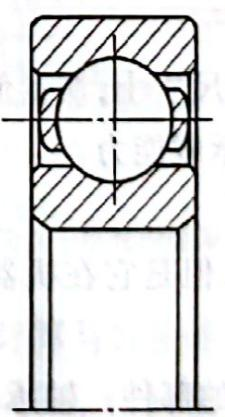

(a) 普通向心球轴承

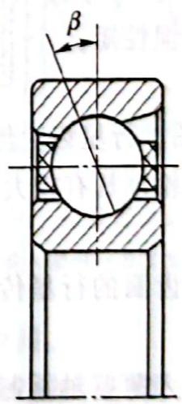

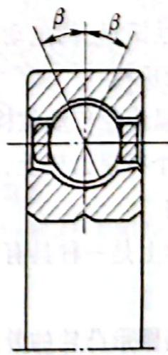

(b) 向心推力球轴承

(c) 四点接触球轴承

图 2.34 转动关节常用轴承

##### 2. 移动关节

移动关节由直线运动机构和在整个运动范围内起直线导向作用的直线导轨部分组成。导轨部分分为滑动导轨、滚动导轨、静压导轨和磁性悬浮导轨等形式。 

一般,要求机器人导轨间隙小或能消除间隙;在垂直于运动方向上要求刚度高,摩擦系数小且不随速度变化,并且有高阻尼、小尺寸和小惯量。通常,由于机器人在速度和精度方面的要求很高,故一般采用结构紧凑且价格低廉的滚动导轨。 

滚动导轨可以按直线导轨的种类、轨道形状和滚动体进行分类： 

1）按滚动体分类，可分为球、圆柱滚子和滚针。 

2）按轨道分类，可分为圆轴式、平面式和滚道式。 

3）按滚动体是否循环分类，可分为循环式、非循环式。 

这些滚动导轨各有各的特点,装有滚珠的滚动导轨适用于中小载荷和小摩擦的场合;装有滚柱的滚动导轨适用于重载和高刚性的场合。受轻载的滚柱的特性接近于线性弹簧,呈硬弹簧特性;而滚珠的特性接近于非线性弹簧,刚性要求高时应施加一定的预紧力。 

#### 二、机器人传动机构

传动机构用来把驱动器的运动传递到关节和动作部位。机器人中常用的传动机构有齿轮传动、螺旋传动、带传动与链传动、绳传动与钢带传动、连杆机构与凸轮传动、流体传动。 

##### 1. 齿轮传动

机器人中常用的齿轮传动机构是行星齿轮传动机构和谐波传动机构。电动机是高转速、小力矩的驱动器，而机器人通常却要求低转速、大力矩，因此常用行星齿轮传动机构和谐波传动机构减速器来完成速度和力矩的变换与调节。 

输出力矩有限的原动机要在短时间内加速负载,要求其齿轮传动机构的速比 $i_{n}$ 为最优, $i_{n}$ 可由下式求出: 

$$
i _ {n} = \sqrt {I _ {n} / I _ {\mathrm{m}}}\tag{2.13}
$$

式中： $I_{s}$ 为工作臂的惯性矩； $I_{n}$ 为电动机的惯性矩。 

###### (1) 行星齿轮传动机构

图 2.35 所示为行星齿轮传动机构简图。行星齿轮传动尺寸小, 惯量低; 一级传动比大, 结构紧凑; 载荷分布在若干个行星齿轮上, 内齿轮也具有较大的承载能力。 

###### (2) 谐波传动机构

谐波传动在运动学上是一种具有柔性齿圈的行星传动,但是它在机器人上获得比行星齿轮传动更加广泛的应用。 

谐波发生器是在椭圆形凸轮的外周嵌入薄壁轴承制成的部件。轴承内圈固定在凸轮上，外圈依靠钢球发生弹性变形，一般与输入轴相连。 

柔轮是杯状薄壁金属弹性体，杯口外圆切有齿，底部称为柔轮底，用来与输出轴相连。 

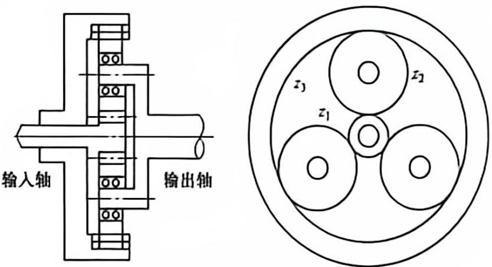

图2.35 行星齿轮传动

刚轮内圆有很多齿，齿数比柔轮多两个，一般固定在壳体。 

谐波发生器通常由凸轮或偏心安装的轴承构成。刚轮为刚性齿轮，柔轮为能产生弹性变形的齿轮。当谐波发生器连续旋转时，产生的机械力使柔轮变形，变形曲线为一条基本对称的谐波曲线。发生器波数表示谐波发生器转一周时，柔轮某一点变形的循环次数。其工作原理是：当谐波发生器在柔轮内旋转时，迫使柔轮发生变形，同时进入或退出刚轮的齿间。在谐波发生器的短轴方向，刚轮与柔轮的齿间处于啮入或啮出的过程，伴随着谐波发生器的连续转动，齿间的啮合状态依次发生变化，即产生啮入—啮合一啮出—脱开—啮人的变化过程。这种错齿运动把输入运动变为输出的减速运动。 

图 2.36 所示是谐波传动的结构简图。由于谐波发生器 4 的转动使柔轮 6 上的柔轮齿圈 7 与刚轮（圆形花键轮）1 上的刚轮内齿圈 2 相啮合。3 为输入轴，如果刚轮 1 固定，则轴 5 为输出轴；如果轴 5 固定，则刚轮 1 的轴为输出轴。 

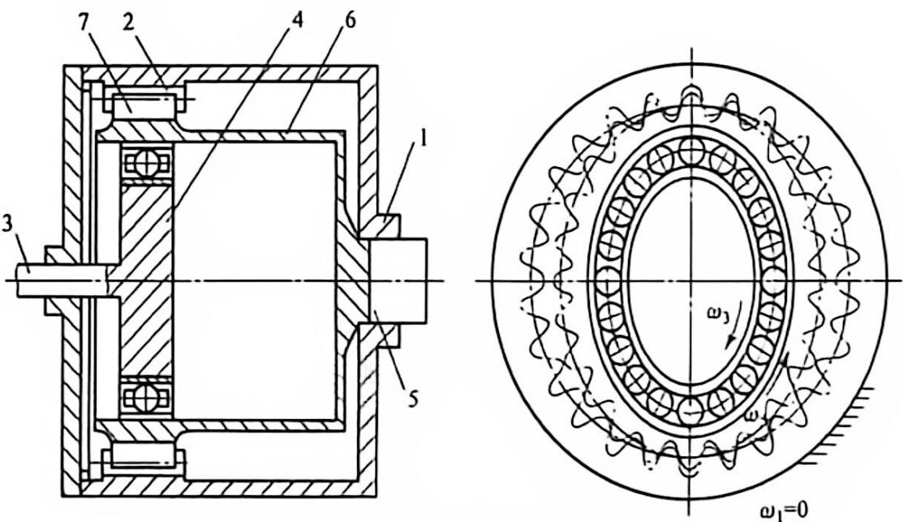

图 2.36 谐波传动的结构简图

1—刚轮；2—刚轮内齿圈；3—输入轴；4—谐波发生器；5—轴；6—柔轮；7—柔轮齿圈

谐波传动速比的计算与行星传动相同。 

如果刚轮1不转动 $(\omega_{1} = 0)$ ，谐波发生器 $(\omega_{3})$ 为输入，柔轮轴 $(\omega_{3})$ 为输出，速比为 

$$
i _ {3 3} = \frac {\omega_ {3}}{\omega_ {5}} = - \frac {z _ {7}}{z _ {2} - z _ {7}}\tag{2.14}
$$

式中:负号表示柔轮向谐波发生器旋转方向的反向旋转。 

如果柔轮6静止不转动 $(\omega_{3} = 0)$ ，谐波发生器 $(\omega_{3})$ 为输入，则刚轮1的轴 $(\omega_{1})$ 为输出，速比为 

$$
i _ {3 1} = \frac {\omega_ {3}}{\omega_ {1}} = + \frac {z _ {2}}{z _ {2} - z _ {7}}\tag{2.15}
$$

式中: 正号表示刚轮与谐波发生器同方向旋转; $\omega_{3}$ 、 $\omega_{1}$ 代表输入、输出轴的角速度; $z_{2}$ 为刚轮内齿圈 2 的齿数; $z_{7}$ 为柔轮齿圈 7 的齿数。 

谐波传动的速比 $i_{\text{min}} = 60, i_{\text{an}} = 300$ ，传动效率高达 $80\% - 90\%$ ，如果在柔轮和刚轮之间能够多齿啮合，例如任何时刻有 $10\% - 30\%$ 的齿同时啮合，那么可以大大提高谐波传动的承载能力。 

谐波传动的优点是:① 尺寸小,惯量低;② 误差均布在多个啮合点上,传动精度高;③ 为加预载啮合,传动侧隙非常小;④ 为多齿啮合,传动具有高阻尼特性。 

谐波传动的缺点是:① 柔轮的疲劳问题;② 扭转刚度低;③ 以 2、4、6 倍输入轴速度的啮合频率产生振动;④ 谐波传动与行星齿轮传动相比具有较小的传动间隙和重量,但是刚度比行星减速器差。 

目前,采用液压静压谐波发生器的谐波传动机构已经问世,如图2.37所示。凸轮1和柔轮2之间不直接接触,凸轮1上的小孔3与柔轮内表面有大约0.1 mm的间隙,高压油从小孔3喷出,使柔轮产生变形波,从而产生减速驱动。油具有很好的冷却作用,能提高传动速度。采用电磁波原理谐波发生器的谐波传动机构也已经被提出。 

谐波传动装置在机器人技术比较先进的国家已得到了广泛的应用,仅就日本来说,机器人驱动装置的 $60\%$ 都采用了谐波传动。美国送到月球上的机器人,其各个关节部位都采用谐波传动装置,其中一只上臂就用了30个谐波传动机构。苏联送入月球的移动式机器人“登月者”,其成对安装的8个轮子均是用密闭谐波传动机构单独驱动的。德国大众汽车公司研制的ROHREN、GEROT R30型机器人和法国雷诺公司研制的VERTICAL 80型机器人等都采用了谐波传动机构。 

##### 2. 丝杠传动

丝杠传动有滑动式、滚珠式和静压式等。机器人传动用的丝杠具备结构紧凑、间隙小和传动效率高等特点。 

滑动式丝杠螺母机构是连续的面接触,传动中不会产生冲击,传动平稳,无噪声,并且能自锁。因丝杠的螺纹升角较小,所以用较小的驱动力矩可获得较大的牵引力。但是,丝杠螺母螺旋面之间的摩擦为滑动摩擦,故传动效率低。滚珠丝杠传动效率高,而且传动精度和定位精度均很高,传动时灵敏度和平稳性亦很好。由于磨损小,滚珠丝杠的使用寿命比较长,但成本较高。 

图 2.38 所示为滚珠丝杠的基本组成, 导向槽 4 连接螺母的第一圈和最后一圈, 使其形成滚动体可以连续循环的导槽。滚珠丝杠在工业机器人上的应用比滚柱丝杠多, 因为后者结构尺寸大(径向和轴向), 传动效率低。 

图 2.39 所示为采用丝杠螺母传动的手臂升降机构,由电动机 1 带动蜗杆 2 使蜗轮 5 回转,依靠蜗轮内孔的螺纹带动丝杠 4 作升降运动。为了防止丝杠的转动,在丝杠上端铣有花键与固定在箱体 6 上的花键套 7 组成导向装置。 

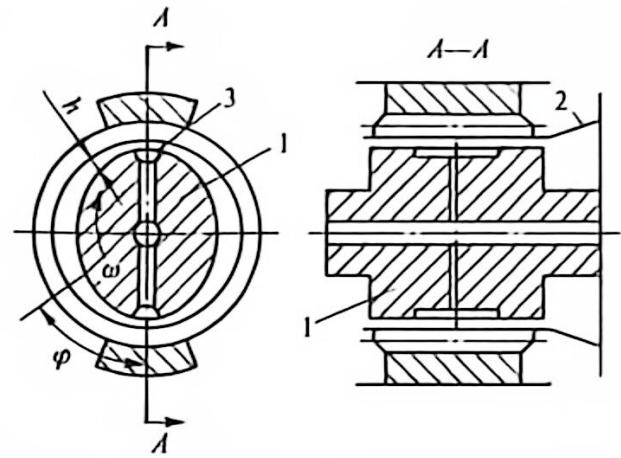

图 2.37 采用液压静压谐波发生器的谐波传动  
1—凸轮；2—柔轮；3—小孔

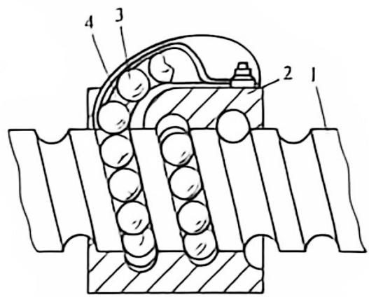

图2.38 滚珠丝杠的基本组成 1—丝杠；2—螺母；3—滚珠；4—导向槽

##### 3. 带传动与链传动

带传动和链传动用于传递平行轴之间的回转运动,或把回转运动转换成直线运动。机器人中的带传动和链传动分别通过带轮或链轮传递回转运动,有时还用来驱动平行轴之间的小齿轮。 

###### (1) 同步带传动

如图 2.40 所示, 同步带的传动面上有与带轮啮合的梯形齿。同步带传动时无滑动, 初始张力小, 被动轴的轴承不易过载。因无滑动, 它除了用做动力传动外, 还适用于定位。同步带采用 

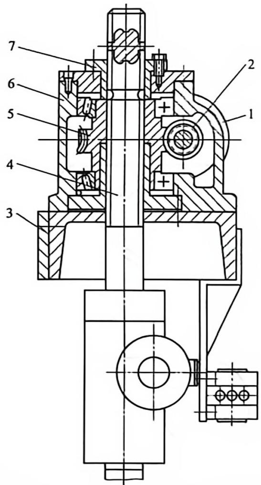

图 2.39 丝杠螺母传动的手臂升降机构

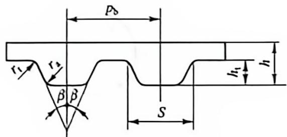

图2.40 同步带形状

1—电动机；2—蜗杆；3—臂架；4—丝杠；5—蜗轮；6—箱体；7—花键套 

氯丁橡胶作为基材，并在中间加入玻璃纤维等伸缩刚性大的材料，齿面上覆盖耐磨性好的尼龙布。用于传递轻载荷的齿形带用聚氨基甲酸酯制造。 

同步带传动属于低惯性传动,适合于在电动机和高速比减速器之间使用。同步带上安装滑座,可完成与齿轮齿条机构同样的功能。由于同步带传动惯性小且有一定的刚度,所以适合于高速运动的轻型滑座。 

###### (2) 滚子链传动

滚子链传动属于比较完善的传动机构,由于噪声小、效率高,因此得到了广泛的应用。但是,高速运动时滚子与链轮之间的碰撞会产生较大的噪声和振动,只有在低速时才能得到满意的效果,即滚子链传动适合于低惯性负载的关节传动。链轮齿数少,摩擦力会增加,要得到平稳运动,链轮的齿数应大于17,并尽量采用奇数齿。 

##### 4. 绳传动与钢带传动

###### (1) 绳传动

绳传动广泛应用于机器人的手爪开合传动,特别适合有限行程的运动传递。绳传动的主要优点是钢丝绳强度大,各方向上的柔软性好,尺寸小,预载后有可能消除传动间隙。 

绳传动的主要缺点是:不加预载时存在传动间隙;因为绳索的蠕变和索夹的松弛,使传动不稳定;多层缠绕后,在内层绳索及支承中损耗能量;效率低;易积尘垢。 

###### (2) 钢带传动

钢带传动的优点是传动比精确,传动件质量小,惯量小,传动参数稳定,柔性好,不需润滑,强度高。 

图 2.41 所示为钢带传动, 钢带末端紧固在驱动轮和从动轮上, 因此摩擦力不是传动的重要要素。钢带传动适合于有限行程的传动。图 2.41a、b 所示适合于等传动比, 图 2.41c、d 所示适合于变化的传动比; 图 2.41b、d 所示为直线传动, 而图 2.41a、c 所示为回转传动。 

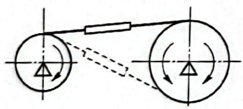

(a) 等传动比回转传动

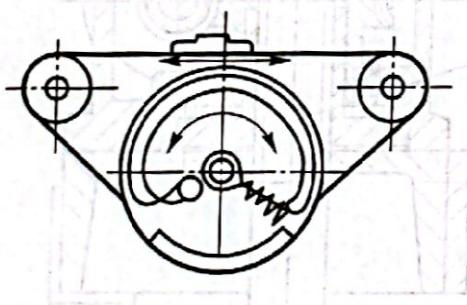

(b) 等传动比直线传动

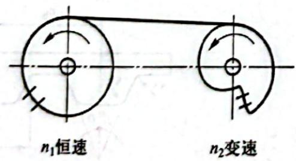

(c) 变传动比回转传动

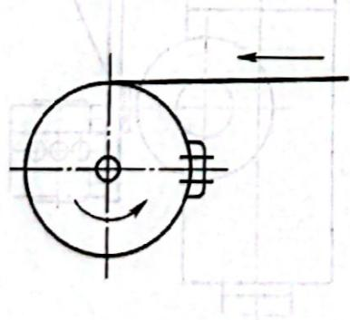

(d) 变传动比直线传动

图 2.41 钢带传动

钢带传动已成功应用在 ADEPT 机器人上，它以 1:1 速比的直接驱动在立轴和小臂关节轴之间进行远距离传动，如图 2.42 所示。 

##### 5. 连杆机构与凸轮传动

重复完成简单动作的搬运机器人(固定程序机器人)中广泛采用连杆机构与凸轮机构,例如从某位置抓取物体放在另一位置上的作业。连杆机构的特点是用简单的机构可得到较大的位移,而凸轮机构具有设计灵活、可靠性高和形式多样等特点,外凸轮机构是最常见的机构,它借助于弹簧可得到较好的高速性能;内凸轮驱动时要求有一定的间隙,其高速性能劣于前者;圆柱凸轮用于驱动摆杆,而摆杆在与凸轮回转方向平行的面内摆动。设计凸轮机构时,应选用适应大负载的凸轮曲线(修正梯形和修正正弦曲线等)。机器人中常用凸轮机构、连杆机构分别如图2.43、图2.44所示。 

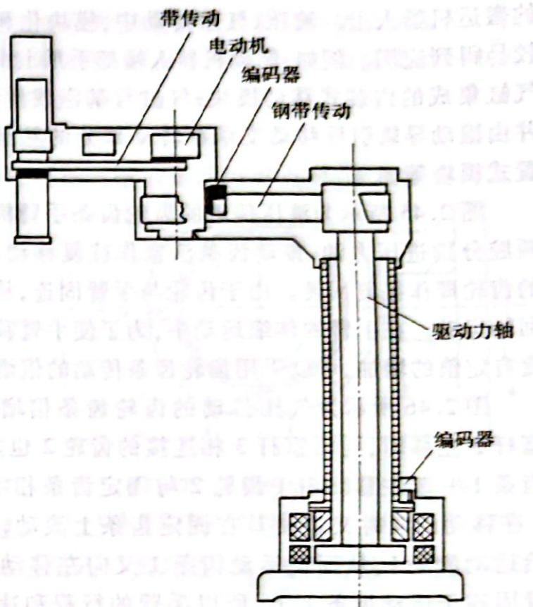

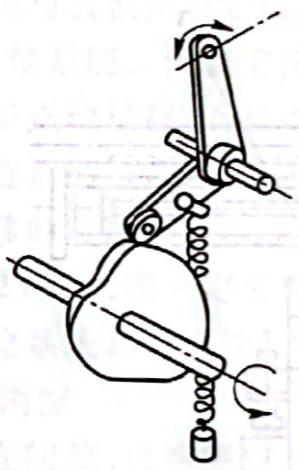

图 2.42 采用钢带传动的 ADEPT 机器人

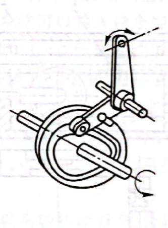

(a)外凸轮

(b) 内凸轮

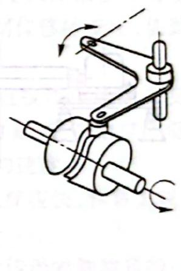

(c) 圆柱凸轮

图2.43 凸轮机构

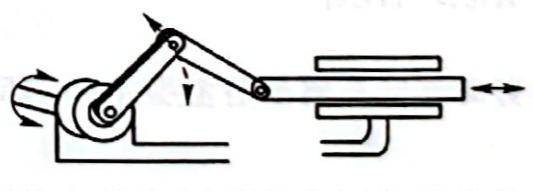

(a) 曲柄式

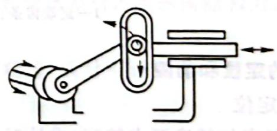

图2.44 连杆机构

(b)拨叉式

##### 6. 流体传动

流体传动分为液压传动和气压传动。液压传动由液压泵、液压马达或液压缸组成，可得到高扭矩-惯性比。气压传动比其他传动运动精度低，但由于容易达到高速，多数用在完成简易作业 

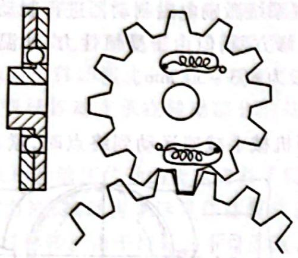

(a) 弹簧消隙

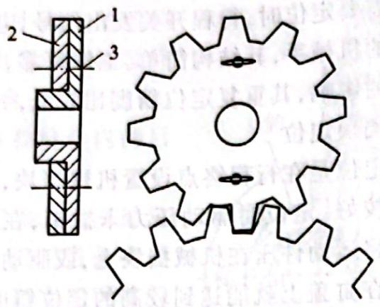

图2.48 消隙齿轮

(b) 螺钉消隙

1、2—薄齿轮；3—螺钉

###### (2) 柔性齿轮消隙

图 2.49a 所示为一种钟罩形状且具有弹性的柔性齿轮, 装配时加一定预载就能引起轮壳的变形, 从而引起每个轮齿的双侧齿廓都能啮合, 消除了侧隙。图 2.49b 所示为采用了上述同样的原理, 却采用不同设计形式的径向柔性齿轮, 其轮壳和齿圈是刚性的, 但与齿圈连接处具有弹性。给定同样的扭矩负载, 为保证无侧隙啮合, 径向柔性齿轮所需要的预载力比钟罩状柔性齿轮小得多。 

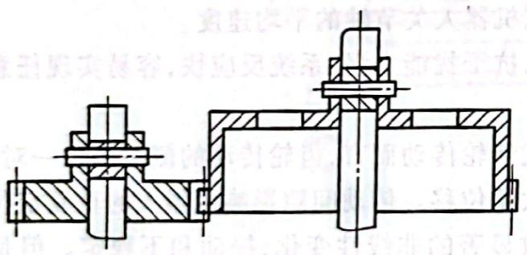

(a) 钟罩状柔性齿轮

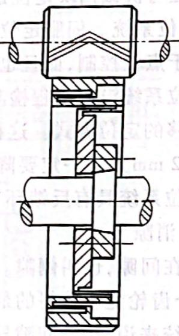

图 2.49 柔性齿轮消隙

(b) 径向柔性齿轮

###### (3) 对称传动消隙

一个传动系统设置两个对称的分支传动,并且其中必有一个具有回弹能力。图 2.50 所示为使用了双谐波传动的消隙方法。电动机置于关节中间,电动机双向输出轴连接完全相同的两个谐波减速器,驱动一个手臂运动。谐波传动过程中的柔轮弹性很好。图 2.51 所示为两种消隙啮合传动。图 2.51a 所示为 PUMA 机器人的腰转关节驱动装置。电动机 1 的输出轴上装有小齿轮 2,减速传动齿轮 3'和 3"分别装在空转的轴 4'和 4"上,通过 5'和 5"两个齿轮传动,由齿轮 6 作驱动输出。这种消隙装置的设计关键是一个空转轴的直径比另一个小(容易产生扭转变形),并加以扭矩预载产生弹性状态。其结果是消除了传动侧隙,但是附加的传动件增加了负载和结构尺寸。因此,该 装置仅应用在类似腰转这样的大惯量关节上,在这种场合消除传动间隙是十分重要的。图2.51b所示为CINCINNATI 646型机器人采用的另一种类似消隙装置,不同之处是采用了两个完全相同的齿轮箱1和2,由电动机6驱动1和2,然后通过齿轮3和4驱动齿轮5,带动机器人腰转。压紧轮8使同步带7张紧,并在 $1\rightarrow3\rightarrow5\rightarrow4\rightarrow2\rightarrow7$ 传动链中产生必要的弹性变形,达到消隙的目的。同步带传动9用于调整齿轮箱1和2之间的相位角。 

###### (4) 偏心机构消隙

图 2.52 所示的偏心机构实际上是中心距调整机构。当有齿轮磨损等原因造成传动间隙增加时，最简单的方法是调整中心距。这是 PUMA 机器人腰转关节上应用的又一实例。图中，中心 

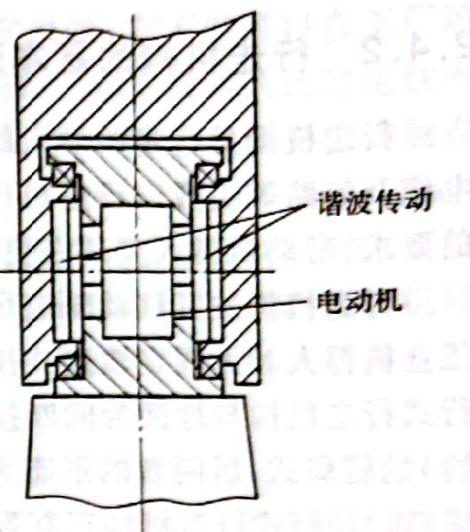

图 2.50 双谐波传动消隙

距 $OO'$ 固定，一对齿轮中的一个装在 $O'$ 轴上，另一个装在 $A$ 轴上； $A$ 轴的轴承偏心地装在可调的支架上；应用调整螺钉转动支架就可以改变一对齿轮啮合的中心距 $AO'$ 的大小，达到消隙目的。 

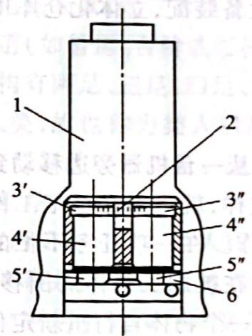

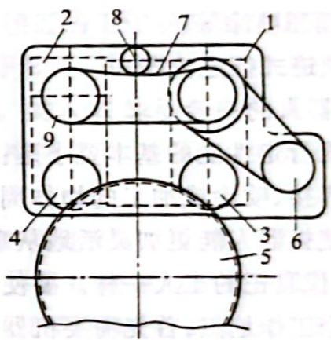

(a) PUMA机器人腰转关节驱动装置

(b) CINCINNATI 646 型机器人腰转关节驱动原理

1—电动机；2—小齿轮；3'、3"—减速传动齿轮；4'、4"—轴；5'、5"—齿轮；6—齿轮

1、2—齿轮箱；3、4、5—齿轮；6—电动机；7—同步带；8—压紧轮；9—同步带传动

图 2.51 消隙啮合传动 

###### (5) 齿廓弹性覆层消隙

齿廓表面覆有薄薄一层弹性很好的橡胶或层压材料,相啮合的一对齿轮加以预载,可以完全消除啮合侧隙,如图2.53所示。齿轮几何学上的齿面间隙在滑动橡胶层内部发生剪切弹性流动时被吸收,因此铝合金甚至石墨纤维增强塑料等非常轻而又具备良好接触和滑动品质的材料,都可用来作为传动齿轮的材料,同时可大大减小重量和转动惯量。 

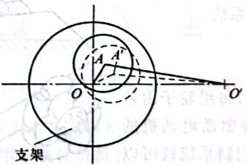

图 2.52 偏心消隙机构

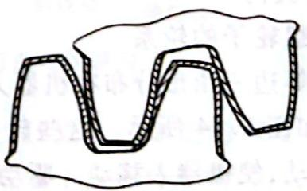

图 2.53 齿廓弹性覆层消隙

### 2.4.2 行走机构的基本形式和特点

行走机构是行走机器人的重要执行部件,它由驱动装置、传动机构、位置检测元件、传感器、电缆及管路等组成。行走机构一方面支承机器人的机身、臂部和手部,另一方面还根据工作任务的要求,带动机器人实现在更广阔空间内的运动。 

行走机构按其移动轨迹可分为固定轨迹式和无固定轨迹式。固定轨迹式行走机构主要用于工业机器人。无固定轨迹式按行走机构的特点可分为步行式、轮式和履带式。在行走过程中，步行式行走机构与地面为间断接触，轮式和履带式行走机构与地面为连续接触；前者为类人（或动物）的腿脚式，后两者的形态为运行车式。运行车式行走机构用得比较多，多用于野外作业，比较成熟。步行式行走机构正在发展和完善中。 

#### 一、固定轨迹式可移动机器人

该类机器人机身底座安装在一个可移动的拖板座上,靠丝杠螺母驱动,整个机器人沿丝杠纵向移动。这类机器人除了采用这种直线驱动方式外,有时也采用类似起重机梁行走方式等。这种可移动机器人主要用在作业区域大的场合,如大型设备装配,立体化仓库中的材料搬运、材料堆垛和储运及大面积喷涂等。 

#### 二、无固定轨迹式行走机器人

##### 1. 对行走机器人的一般要求

工厂对机器人行走性能的基本要求是:机器人能够从一台机器旁边移动到另一台机器旁边,或者在一个需要焊接、喷涂或加工的物体周围移动。这样,就可不必再把工件送到机器人面前。这种行走性能也使机器人能更加灵活地从事更多的工作。在一项任务不忙的时候,它还能够去干另一项工作,就像真正的工人一样。要使机器人能够在被加工物体周围移动或者从一个工作地点移动到另一个工作地点,首先需要机器人能够面对一个物体自行重新定位。同时,行走机器人应能够绕过其运行道路上的障碍物。计算机视觉系统是提供上述能力的方法之一。 

运载机器人的行走车辆必须能够支承机器人的重量。当机器人四处行走对物体进行加工时,移动车辆还需具有保持稳定的能力。这就意味着机器人本身既要平衡可能出现的不稳定力或力矩,又要有足够的强度和刚度,以承受可能施加于其上的力和力矩。为了满足这些要求,可以采用以下两种方法:一是增加机器人移动车辆的重量和刚性,二是进行实时计算和施加所需要的平衡力。由于前一种方法容易实现,所以它是目前改善机器人行走性能的常用方法。 

机器人的移动要求在各个方面都具有很大的灵活性。如果像汽车那样采用四个轮子，其中 

两个作为导向轮,必然限制它移动的灵活性。所以,人们正致力于研究适合于机器人使用的高机动性轮系和悬挂系统。 

##### 2. 典型行走机构

###### (1) 具有三组轮子的轮系

三组轮子呈等边三角形分布在机器人的下部,每组轮子由若干个滚轮组成,如图2.54所示。这些轮子能够在驱动电动机的带动下自由地转动,使机器人移动。驱动电动机控制系统既可以同时驱动所有三组轮子,也可以分别驱动其中两组轮子,这样机 器人就能够在任何方向上移动。该类机器人的行走机构设计得非常灵活，它不但可以在工厂地面上运动，而且图2.54所示的轮系能够沿小路行驶。这种轮系存在的问题是机器人的稳定性不够，容易倾倒，而且运动稳定性随着负载与轮子的相对位置不同而变化；在轮子与地面的接触点从一个滚轮移到另一个滚轮上时，还会出现颠簸。为了改进该机器人的稳定性，Unimation-Stanford研究小组重新设计了一种三轮机器人。改进设计的特点是使用长度不同的两种滚轮，长滚轮呈锥形，固定在短滚轮的凹槽里，这样可大大减小滚轮之间的间隙，减小轮子的厚度，提高机器人的稳定性。此外，滚轮上还附加了软橡胶，具有足够的变形能力，可使滚轮的接触点在相互替换时不发生颠簸。 

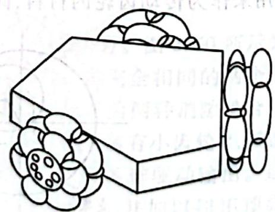

图2.54 具有三组轮子的轮系

###### (2) 具有四组轮子的轮系

具有四组轮子的轮系其运动稳定性有很大提高。但是，要保证四组轮子同时和地面接触，必须使用特殊的轮系悬挂系统。它需要四个驱动电动机，控制系统比较复杂，造价也较高。 

###### (3) 两足步行式机器人

车轮式行走机构只有在平坦、坚硬的地面上行驶才有理想的运动特性。如果地面凸凹程度和车轮直径相当或地面很软，则它的运动阻力将大大增加。步行式行走机构有很大的适应性，尤其在有障碍物的通道（如管道、台阶或楼梯）上或很难接近的工作场地更有优越性。 

步行式行走机构有两足、三足、四足、六足、八足等形式，其中两足步行式机器人具有最好的适应性，也最接近人类，故也称为类人双足行走机构。类人双足行走机构是多自由度的控制系统，是现代控制理论很好的应用对象。这种机构除结构简单外，在保证静、动行走性能及稳定性和高速运动等方面都是最困难的。 

图 2.55 所示的两足步行式机器人行走机构是一空间连杆机构。在行走过程中,行走机构始终满足静力学的静平衡条件,也就是机器人的重心始终落在接触地面的一脚上。两足步行式机器人的动步行有效地利用了惯性力和重力。人的步行就是动步行,动步行的典型例子是踩高跷。高跷与地面只是单点接触,两根高跷在地面不动时站稳是非常困难的,要想原地停留,必须不断踏步,不能总是保持步行中的某种瞬间姿态。 

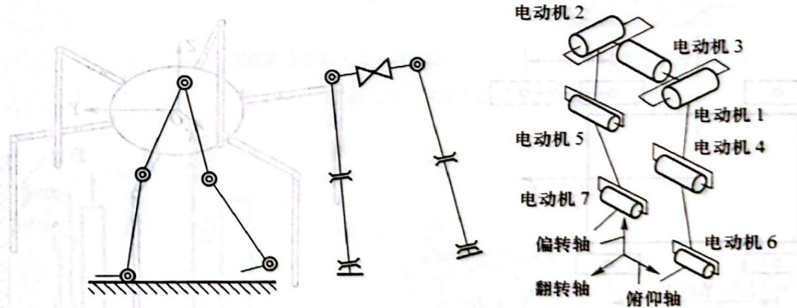

图 2.55 两足步行式机器人行走机构原理

图 2.56 所示为由日本早稻田大学加藤研究室开发、日立公司制造的双足机器人的基本结构。它有效地采用了现代机械技术和计算机技术，人工配置了多种行走模式，这些模式储存在计算机的存储器内以使机器人能像人一样以各种步态行走。 

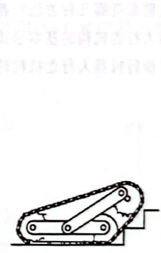

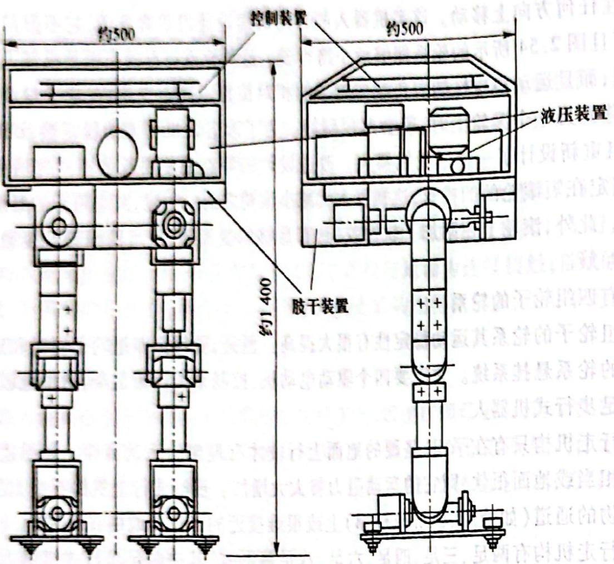

图 2.56 WHL-11 型双足机器人

###### (4) 四足、六足及多足步行式机器人

这类步行式机器人是模仿动物行走的机器人。四足步行式机器人除了关节式外，还有缩放式腿步行机构。图2.57所示为四足缩放式腿步行机器人在平地上行走的初始姿态，通常使机体与支承面平行。四足对称姿态比两足步行容易保持运动过程中的稳定，控制也容易些，其运动过程是一腿抬起，三腿支承机体向前移动。图2.58所示为六足缩放式腿步行机构原理，每腿有三个转动关节。行走时，三个腿为一组，足端以相同位移移动，两组相差一定时间间隔进行移动，可以实现 $XOY$ 平面内任意方向的行走和原地转动。 

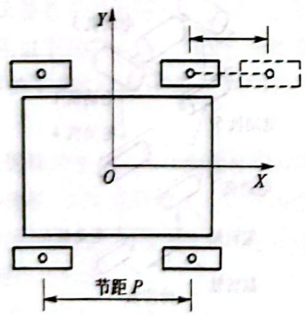

图 2.57 四足缩放式腿步行机器人的平面几何模型

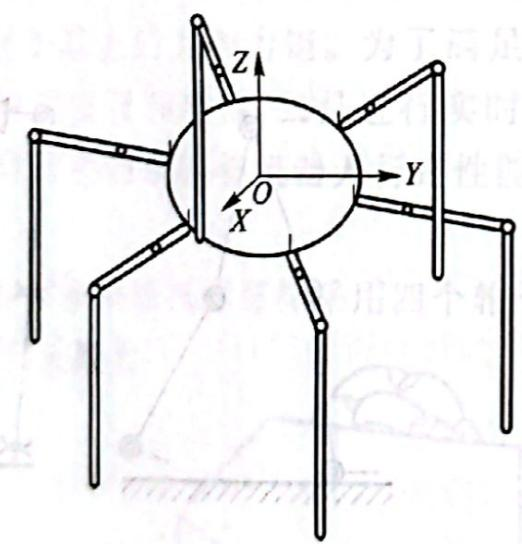

图2.58 六足缩放式腿步行机构

###### (5) 履带式行走机器人

履带式行走具有很明显的特点:可以在有些凹凸的地面上行走;可以跨越障碍物;能爬梯度不太高的台阶。它的缺点是由于没有自定位轮,没有转向机构,只能靠左、右两个履带的速度差 实现转弯,所以在横向和前进方向都会产生滑动;转弯阻力大,不能准确地确定回转半径等。图2.59所示为装有转向机构的履带式机器人。它没有上述缺点,可以上下台阶。图2.60a所示的机器人主体前、后装有转向器,并装有使转向器绕 $A-A'$ 轴旋转的提升机构,这使得上下台阶非常顺利,能得到诸如用折叠方式向高处伸臂、在斜面上保持主体水平等各种各样的姿势。图2.60b所示机构的履带形状可以为适应台阶而改变,也比普通履带机构的动作更为自如。 

###### (6) 其他行走机器人

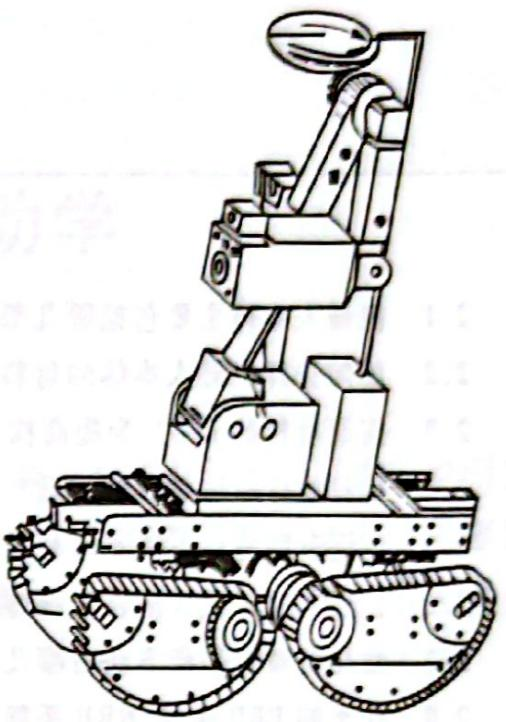

为了特殊的目的,还研制了各种各样的移动机器人机构。图2.61所示为能在壁面上爬行的机器人。图2.61a所示为用吸盘交互地吸附在壁面上实现移动;图2.61b所示的滚子是磁铁,其壁面是磁性体。图2.62所示为轮、脚混合式行走机器人,脚端装有球形转动体。除了普通行走之外,它可以在 

图2.59 装有转向机构的履带式机器人 

管内把脚向上方伸,利用管断面上的三个点支承实现移动,也可以骑在管子上沿轴向或圆周方向移动。其他行走机器人还有摆线机构推进移动车、用轮辐凸出的三轮车登台阶的轮椅以及用压电晶体、形状记忆合金驱动的移动机构等。 

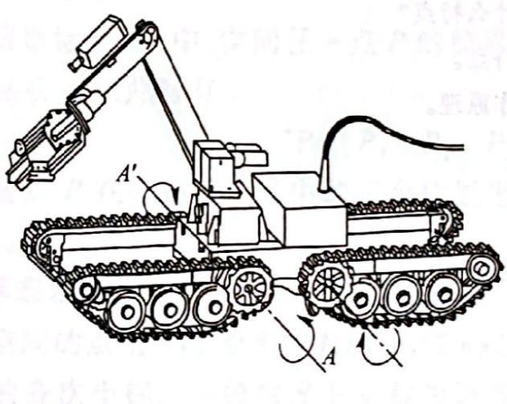

(a) 双重履带式机器人(6个自由度)

(b) 形状可变式履带机构

图 2.60 容易上下台阶的履带式行走机器人

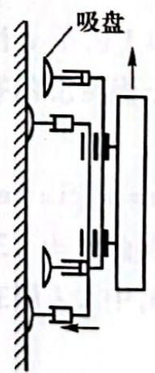

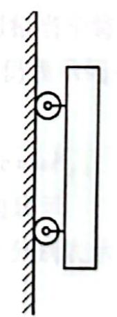

(a) 吸盘式

(b) 磁吸滚子式

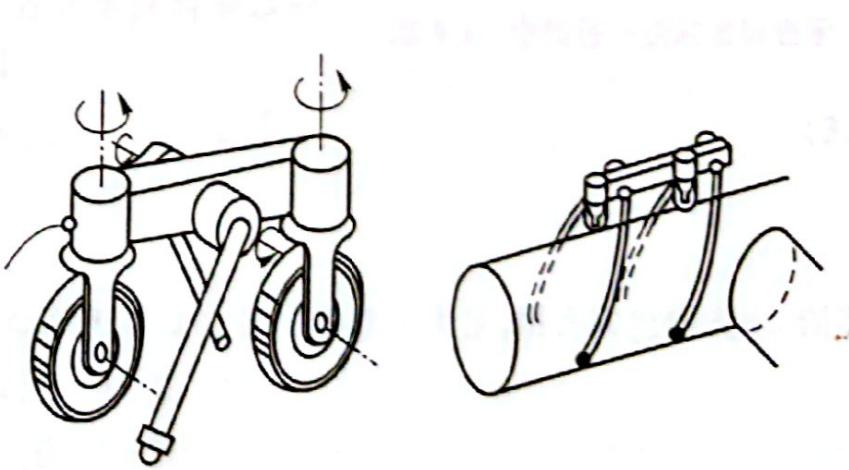

图2.61 能在壁面上爬行的机器人

图2.62 轮、脚混合式行走机器人

## 习题

2.1 机器人本体主要包括哪几部分？以关节型机器人为例，说明机器人本体的基本结构和主要特点。 

2.2 如何选择机器人本体的材料？常用的机器人本体材料有哪些？ 

2.3 何谓材料的 $E / \rho$ ？为提高构件刚度选用材料 $E / \rho$ 值大些好还是小些好？为什么？ 

2.4 机身设计应注意哪些问题？ 

2.5 何谓升降立柱下降不卡死条件？立柱导套为什么要有一定的长度？ 

2.6 机器人臂部设计应注意哪些问题？ 

2.7 常用的臂杆平衡方法有哪几种？试述质量平衡常用的平行四边形平衡机构。 

2.8 什么叫 BBR 手腕、RRR 手腕？什么叫手腕自由度退化？ 

2.9 机器人手爪有哪些种类？各有什么特点？ 

2.10 试述磁力吸盘和真空吸盘的工作原理。 

2.11 何谓自适应吸盘及异形吸盘？ 

2.12 机器人对移动关节有何要求？为什么常用滚动导轨？ 

2.13 机器人专用滚动轴承有何特点？机器人为什么要采用谐波传动？ 

2.14 传动件定位常有哪几种方法？ 

2.15 传动件消隙常有哪几种方法？各有什么特点？ 

2.16 简述机器人行走机构的基本形式和特点。 

2.17 简述两足步行机器人行走机构的工作原理。
