# 第3章 机器人运动学

机器人,特别是其中最有代表性的关节型机器人,实质上是由一系列关节连接而成的空间连杆开式链机构。要研究机器人,就必须对其运动学和动力学有一个基本的了解。本章将主要讨论机器人运动学的基本问题,引入齐次坐标、齐次变换,进行机器人的位姿分析,介绍机器人正向与逆向运动学的基本知识。 

## 3.1 齐次坐标与位姿表示

### 3.1.1 齐次坐标

#### 一、空间任意点的坐标表示

在选定的直角坐标系 $\{A\}$ 中, 空间任一点 $P$ 的位置可以用 $3 \times 1$ 的位置矢量 $^A P$ 表示, 其左上标表示选定的坐标系 $\{A\}$ , 此时有 

$$
{ } ^ { A } \boldsymbol { P } = \left[ \begin{array} { c c c } P _ { X } & P _ { Y } & P _ { Z } \end{array} \right] ^ { \intercal }\tag{3.1}
$$

式中： $P_{X}$ 、 $P_{Y}$ 、 $P_{Z}$ 是点 P 在坐标系 $\{A\}$ 中的三个位置坐标分量，如图 3.1 所示。 

#### 二、齐次坐标表示

将一个 $n$ 维空间的点用 $n + 1$ 维坐标表示，则该 $n + 1$ 维坐标即为 $n$ 维坐标的齐次坐标。一般情况下 $w$ 称为该齐次坐标中的比例因子，当取 $w = 1$ 时，其表示方法称为齐次坐标的规格化形式，即 

$$
\boldsymbol {P} = \left[ \begin{array}{l l l l} P _ {x} & P _ {y} & P _ {z} & 1 \end{array} \right] ^ {\mathrm{T}}
$$

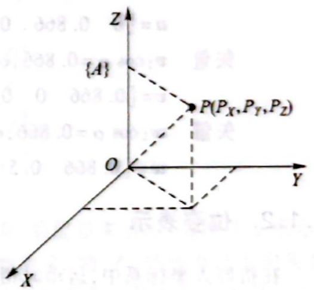

(3.2) 

当 $w$ 不为1时，则相当于将该列阵中各元素同时乘以一个非零的比例因子 $w$ ，仍表示同一点 $P$ ，即 

图 3.1 空间任一点的坐标表示 

$$
\boldsymbol {P} = \left[ \begin{array}{c c c c} a & b & c & w \end{array} \right] ^ {\intercal}\tag{3.3}
$$

式中： $a = wP_{X};b = wP_{Y};c = wP_{Z}$ 

#### 三、坐标轴的方向表示

在图3.2中， $i,j,k$ 分别表示直角坐标系中 $X,Y,Z$ 坐标轴的单位矢量，用齐次坐标表示，则有 

$$
\begin{array}{l} \boldsymbol {X} = \left[ \begin{array}{c c c c} 1 & 0 & 0 & 0 \end{array} \right] ^ {\mathrm{T}} \\ \boldsymbol {Y} = \left[ \begin{array}{c c c c} 0 & 1 & 0 & 0 \end{array} \right] ^ {\mathrm{T}} \\ \boldsymbol {Z} = \left[ \begin{array}{c c c c} 0 & 0 & 1 & 0 \end{array} \right] ^ {\mathrm{T}} \end{array}
$$

由上述可知, 若规定: $4 \times 1$ 列阵 $[a b c w]^{\mathrm{T}}$ 中第四个元素为零, 且满足 $a^2 + b^2 + c^2 = 1$ , 则 $[a b c 0]^{\mathrm{T}}$ 中 $a, b, c$ 表示某轴的方向; $4 \times 1$ 列阵 $[a b c w]^{\mathrm{T}}$ 中第四个元素不为零, 则 $[a b c w]^{\mathrm{T}}$ 表示空间某点的位置。 

图 3.2 中所示的矢量 u 的方向用 $4 \times 1$ 列阵可表达为 

$$
\boldsymbol {u} = \left[ \begin{array}{l l l l} a & b & c & 0 \end{array} \right] ^ {\mathrm{T}}\tag{3.4}
$$

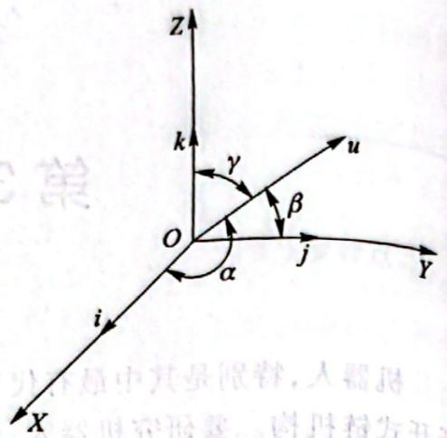

式中： $a = \cos \alpha ,b = \cos \beta ,c = \cos \gamma$ 

图 3.2 中所示的矢量 u 的起点 O 为坐标原点, 用 $4 \times 1$ 列阵可表达为 

$$
\boldsymbol {O} = \left[ \begin{array}{l l l l} 0 & 0 & 0 & 1 \end{array} \right] ^ {\mathrm{T}}
$$

图3.2 坐标轴的方向表示 

例 3.1 用齐次坐标表示图 3.3 中所示的矢量 u、v、w 的坐标方向。 

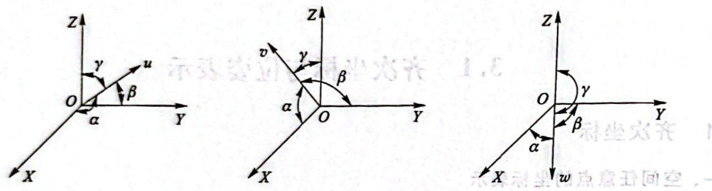

$$
\alpha = 3 0 ^ {\circ}, \beta = 6 0 ^ {\circ}, \gamma = 9 0 ^ {\circ}
$$

图 3.3 用不同方向角表示方向矢量 u、v、w

解 矢量 $u: \cos \alpha = 0, \cos \beta = 0.866, \cos \gamma = 0.5$ $u = [0\quad 0.866\quad 0.5\quad 0]^{\mathrm{T}}$ 矢量 $v: \cos \alpha = 0.866, \cos \beta = 0, \cos \gamma = 0.5$ $v = [0.866\quad 0\quad 0.5\quad 0]^{\mathrm{T}}$ 矢量 $w: \cos \alpha = 0.866, \cos \beta = 0.5, \cos \gamma = 0$ $w = [0.866\quad 0.5\quad 0\quad 0]^{\mathrm{T}}$ 

### 3.1.2 位姿表示

在机器人坐标系中,运动时相对于连杆不动的坐标系称为静坐标系,简称静系;跟随连杆运 

动的坐标系称为动坐标系,简称动系。动系位置与姿态的描述称为动系的位姿表示,是对动系原点位置及各坐标轴方向的描述,现以下述实例说明之。 

#### 一、连杆的位姿表示

设有一个机器人的连杆,若给定了连杆 PQ 上某点的位置和该连杆在空间的姿态,则称该连杆在空间是完全确定的。 

如图 3.4 所示, $O'$ 为连杆上任一点, $O'X'Y'Z'$ 为与连杆固接的一个动坐标系, 即为动系。连杆 PQ 在固定坐标系 OXYZ 中的位置可用一齐次坐标表示为 

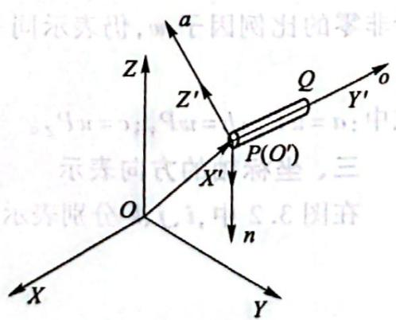

图3.4 连杆的位姿表示

$$
\boldsymbol {P} = \left[ \begin{array}{l l l l} X _ {0} & Y _ {0} & Z _ {0} & 1 \end{array} \right] ^ {\mathrm{T}}\tag{3.5}
$$

连杆的姿态可由动系的坐标轴方向来表示。令 n、o、a 分别为 $X'$ 、 $Y'$ 、 $Z'$ 坐标轴的单位矢量，各单位方向矢量在静系上的分量为动系各坐标轴的方向余弦，以齐次坐标形式分别表示为 

$$
\left. \begin{array}{l} \boldsymbol {n} = \left[ \begin{array}{c c c c} n _ {X} & n _ {Y} & n _ {Z} & 0 \end{array} \right] ^ {\mathrm{T}} \\ \boldsymbol {o} = \left[ \begin{array}{c c c c} o _ {X} & o _ {Y} & o _ {Z} & 0 \end{array} \right] ^ {\mathrm{T}} \\ \boldsymbol {a} = \left[ \begin{array}{c c c c} a _ {X} & a _ {Y} & a _ {Z} & 0 \end{array} \right] ^ {\mathrm{T}} \end{array} \right\}\tag{3.6}
$$

由此可知,连杆的位姿可用下述齐次矩阵表示: 

$$
\pmb {d} = \left[ \begin{array}{l l l l} {\pmb {n}} & {\pmb {o}} & {\pmb {a}} & {\pmb {P}} \end{array} \right] = \left[ \begin{array}{l l l l} {n _ {_ X}} & {o _ {_ X}} & {a _ {_ X}} & {X _ {_ 0}} \\ {n _ {_ Y}} & {o _ {_ Y}} & {a _ {_ Y}} & {Y _ {_ 0}} \\ {n _ {_ Z}} & {o _ {_ Z}} & {a _ {_ Z}} & {Z _ {_ 0}} \\ {0} & {0} & {0} & {1} \end{array} \right]\tag{3.7}
$$

显然，连杆的位姿表示就是对固连于连杆上的动系位姿表示。 

例 3.2 图 3.5 表示固连于连杆的坐标系 $\{B\}$ 位于 $O_{B}$ 点， $X_{B}=2, Y_{B}=1, Z_{B}=0$ 。在 XOY 平面内，坐标系 $\{B\}$ 相对固定坐标系 $\{A\}$ 有一个 $30^{\circ}$ 的偏转，试写出表示连杆位姿的坐标系 $\{B\}$ 的 $4\times4$ 矩阵表达式。 

$$
X _ {B}
$$

$$
\begin{array}{r l} \boldsymbol {n} & = [ \cos 3 0 ^ {\circ} \quad \cos 6 0 ^ {\circ} \quad \cos 9 0 ^ {\circ} \quad 0 ] ^ {\mathrm{T}} \\ & = [ 0. 8 6 6 \quad 0. 5 0 0 \quad 0. 0 0 0 \quad 0 ] ^ {\mathrm{T}} \end{array}
$$

$$
Y _ {B}
$$

$$
\begin{array}{r l} \boldsymbol {o} & = [ \cos 1 2 0 ^ {\circ} \quad \cos 3 0 ^ {\circ} \quad \cos 9 0 ^ {\circ} \quad 0 ] ^ {\mathrm{T}} \\ & = [ - 0. 5 0 0 \quad 0. 8 6 6 \quad 0. 0 0 0 \quad 0 ] ^ {\mathrm{T}} \end{array}
$$

$Z_{B}$ 的方向列阵 $\pmb {a} = [0.000\quad 0.000\quad 1.000\quad 0]^{\mathrm{T}}$ 

坐标系 $\{B\}$ 的位置阵列 $P=\left[2\quad1\quad0\quad1\right]^{T}$ 

则动坐标系 $\{B\}$ 的 $4\times 4$ 矩阵表达式为 

$$
\boldsymbol {T} = \left[ \begin{array}{c c c c} 0. 8 6 6 & - 0. 5 0 0 & 0. 0 0 0 & 2. 0 \\ 0. 5 0 0 & 0. 8 6 6 & 0. 0 0 0 & 1. 0 \\ 0. 0 0 0 & 0. 0 0 0 & 1. 0 0 0 & 0. 0 \\ 0 & 0 & 0 & 1 \end{array} \right]
$$

#### 二、手部的位姿表示

机器人手部的位置和姿态也可以用固连于手部的坐标系 $\{B\}$ 的位姿来表示，如图3.6所示。坐标系 $\{B\}$ 可以这样来确定：取手部的中心点为原点 $O_B$ ；关节轴为 $Z_B$ 轴， $Z_B$ 轴的单位方向矢量 $a$ 称为接近矢量，指向朝外；两手指的连线为 $Y_B$ 轴， $Y_B$ 轴的单位方向矢量 $o$ 称为姿态矢量，指向可任意选定； $X_B$ 轴与 $Y_B$ 轴及 $Z_B$ 轴垂直， $X_B$ 轴的单位方向矢量 $n$ 称为法向矢量，且 $n = o \times a$ ，指向符合右手法则。 

手部的位置矢量为固定参考系原点指向手部坐标系 $\{B\}$ 原点的矢量P，手部的方向矢量为n、o、a。于是手部的位姿可用 $4\times4$ 矩阵表示为 

$$
\pmb {T} = \left[ \begin{array}{l l l l} {\pmb {n}} & {\pmb {o}} & {\pmb {a}} & {\pmb {P}} \end{array} \right] = \left[ \begin{array}{l l l l} {n _ {X}} & {o _ {X}} & {a _ {X}} & {P _ {X}} \\ {n _ {Y}} & {o _ {Y}} & {a _ {Y}} & {P _ {Y}} \\ {n _ {Z}} & {o _ {Z}} & {a _ {Z}} & {P _ {Z}} \\ {0} & {0} & {0} & {1} \end{array} \right]
$$

(3.8) 

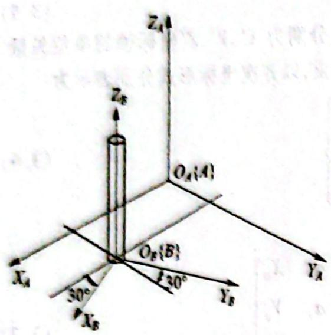

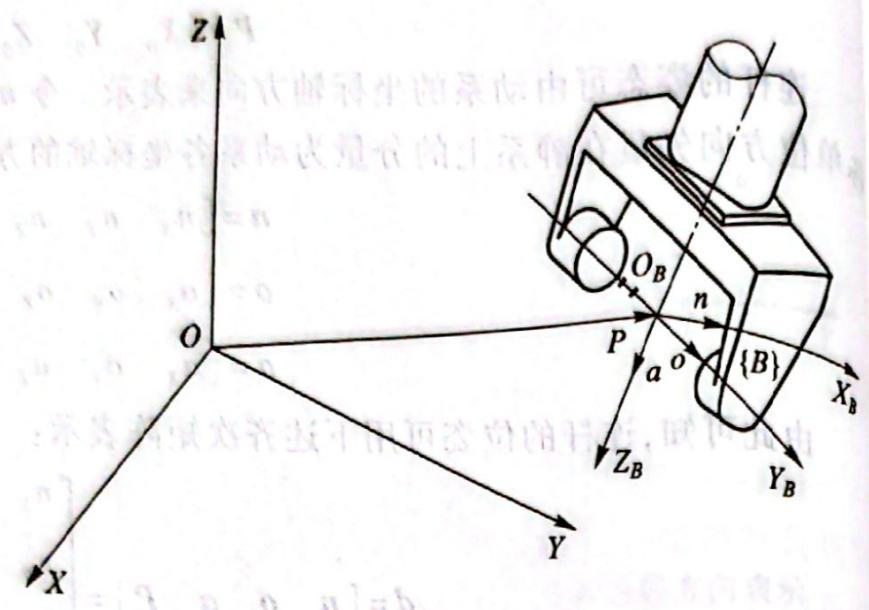

(01.8) 

图 3.5 动坐标系 $|B|$ 的位姿表示

图 3.6 手部的位姿表示

(51.8) 

例3.3 图3.7表示手部抓握物体 $Q$ ，物体是边长为2个单位的正立方体，写出表达该手部位姿的矩阵表达式。 

解 因为物体 $Q$ 形心与手部坐标系 $O'X'Y'Z'$ 的坐标原点 $O'$ 相重合，则手部位置的 $4 \times 1$ 列阵为 

$$
\boldsymbol {P} = \left[ \begin{array}{l l l l} 1 & 1 & 1 & 1 \end{array} \right] ^ {\mathrm{T}}
$$

手部坐标系 $X^{\prime}$ 轴的方向可用单位矢量 $\pmb{n}$ 表示为 

$$
\begin{array}{l l} \boldsymbol {n}: & \alpha = 9 0 ^ {\circ}, \quad \beta = 1 8 0 ^ {\circ}, \quad \gamma = 9 0 ^ {\circ} \\ n _ {I} = \cos \alpha = 0, & n _ {Y} = \cos \beta = - 1, \\ n _ {Z} = \cos \gamma = 0 \end{array}\tag{31.3}
$$

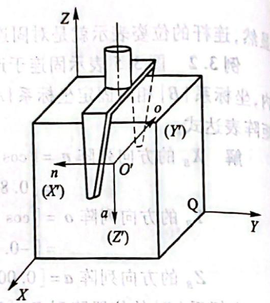

同理,手部坐标系 $Y'$ 轴与 $Z'$ 轴的方向可分别用单位矢量 o 和 a 表示为 

图3.7 抓握物体Q的手部

$$
\begin{array}{l l} \boldsymbol {o}: & o _ {X} = - 1, \quad o _ {Y} = 0, \quad o _ {Z} = 0 \\ \boldsymbol {a}: & a _ {X} = 0, \quad a _ {Y} = 0, \quad a _ {Z} = - 1 \end{array}
$$

根据式(3.8)可知,手部位姿可用矩阵表示为 

$$
\pmb {T} = \left[ \begin{array}{l l l l} {\pmb {n}} & {\pmb {o}} & {\pmb {a}} & {\pmb {P}} \end{array} \right] = \left[ \begin{array}{c c c c} {0} & {- 1} & {0} & {1} \\ {- 1} & {0} & {0} & {1} \\ {0} & {0} & {- 1} & {1} \\ {0} & {0} & {0} & {1} \end{array} \right]
$$

#### 三、目标物齐次矩阵表示

如图 3.8 所示, 楔块 Q 在图 3.8a 所示位置, 其位置和姿态可用 8 个点描述, 矩阵表达式为 

$$
Q = \left[ \begin{array}{c c c c c c c c} 1 & - 1 & - 1 & 1 & 1 & - 1 & - 1 & 1 \\ 0 & 0 & 2 & 2 & 0 & 0 & 2 & 2 \\ 0 & 0 & 0 & 0 & 2 & 2 & 1 & 1 \\ 1 & 1 & 1 & 1 & 1 & 1 & 1 & 1 \end{array} \right]\tag{D, O, B}
$$

若让楔块绕 $Z$ 轴旋转 $-90^{\circ}$ , 再沿 $X$ 轴方向平移 4, 则楔块成为图 3.8b 所示的情况。此时楔块用新的 8 个点来描述它的位置和姿态, 其矩阵表达式为 

$$
Q ^ {\prime} = \left[ \begin{array}{c c c c c c c c} 4 & 4 & 6 & 6 & 4 & 4 & 6 & 6 \\ - 1 & 1 & 1 & - 1 & - 1 & 1 & 1 & - 1 \\ 0 & 0 & 0 & 0 & 2 & 2 & 1 & 1 \\ 1 & 1 & 1 & 1 & 1 & 1 & 1 & 1 \end{array} \right]\tag{收审费回款}
$$

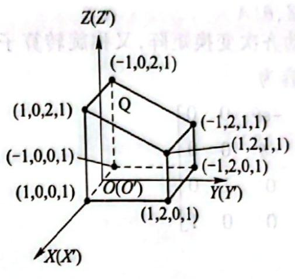

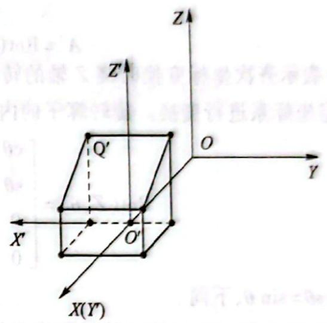

(a) 旋转前的位置

(b) 旋转后的位置

图3.8 楔块Q的齐次矩阵表示

## 3.2 齐次变换

连杆的运动是由转动和平移组成的。为了能用同一矩阵表示转动和平移，引入齐次坐标变换矩阵。 

### 3.2.1 旋转的齐次变换

#### 一、点在空间直角坐标系中绕坐标轴的旋转变换

如图 3.9 所示, 空间某一点 A, 坐标为 $(X_{A}, Y_{A}, Z_{A})$ , 当它绕 Z 轴旋转 $\theta$ 角后至 $A'$ 点, 坐标为 $(X_{A'}, Y_{A'}, Z_{A'})$ 。 $A'$ 点和 A 点的坐标关系为 

$$
\left. \begin{array}{l} X _ {A ^ {\prime}} = X _ {A} \cos \theta - Y _ {A} \sin \theta \\ Y _ {A ^ {\prime}} = X _ {A} \sin \theta + Y _ {A} \cos \theta \\ Z _ {A ^ {\prime}} = Z _ {A} \end{array} \right\}\tag{21.8}
$$

或用矩阵表示为 

(3.9) 

的测量方法 

$$
\left[ \begin{array}{c} X _ {A ^ {\prime}} \\ Y _ {A ^ {\prime}} \\ Z _ {A ^ {\prime}} \end{array} \right] = \left[ \begin{array}{c c c} \cos \theta & - \sin \theta & 0 \\ \sin \theta & \cos \theta & 0 \\ 0 & 0 & 1 \end{array} \right] \left[ \begin{array}{c} X _ {A} \\ Y _ {A} \\ Z _ {A} \end{array} \right]
$$

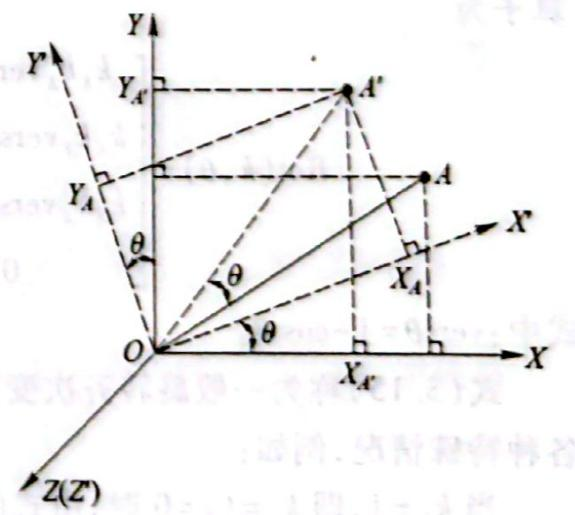

$A^{\prime}$ 点和 $A$ 点的齐次坐标分别为 $[X_{A}, Y_{A}, Z_{A}, 1]^{\mathrm{T}}$ 和 $[X_{A}, Y_{A}, Z_{A}, 1]^{\mathrm{T}}$ , 因此 $A$ 点的旋转齐次变换过程为 

图3.9 点的旋转变换 

$$
\left[ \begin{array}{c} X _ {A ^ {\prime}} \\ Y _ {A ^ {\prime}} \\ Z _ {A ^ {\prime}} \\ 1 \end{array} \right] = \left[ \begin{array}{c c c c} \cos \theta & - \sin \theta & 0 & 0 \\ \sin \theta & \cos \theta & 0 & 0 \\ 0 & 0 & 1 & 0 \\ 0 & 0 & 0 & 1 \end{array} \right] \left[ \begin{array}{c} X _ {A} \\ Y _ {A} \\ Z _ {A} \\ 1 \end{array} \right]\tag{3.10}
$$

也可简写为 

$$
\boldsymbol {A} ^ {\prime} = \operatorname{Rot} (\boldsymbol {Z}, \theta) \boldsymbol {A}
$$

式中: Rot(Z,θ) 表示齐次坐标变换时绕 Z 轴的转动齐次变换矩阵, 又称旋转算子, 旋转算子左乘表示相对于固定坐标系进行变换。旋转算子的内容为 

$$
\operatorname{Rot} (Z, \theta) = \left[ \begin{array}{c c c c} \mathrm{c} \theta & - \mathrm{s} \theta & 0 & 0 \\ \mathrm{s} \theta & \mathrm{c} \theta & 0 & 0 \\ 0 & 0 & 1 & 0 \\ 0 & 0 & 0 & 1 \end{array} \right]\tag{3.12}
$$

式中： $c\theta=\cos\theta,s\theta=\sin\theta$ ，下同。 

同理,可写出绕 X 轴转动的旋转算子和绕 Y 轴转动的旋转算子: 

$$
\operatorname{Rot} (X, \theta) = \left[ \begin{array}{c c c c} 1 & 0 & 0 & 0 \\ 0 & \mathbf {c} \theta & - \mathbf {s} \theta & 0 \\ 0 & \mathbf {s} \theta & \mathbf {c} \theta & 0 \\ 0 & 0 & 0 & 1 \end{array} \right]\tag{3.13}
$$

$$
\operatorname{Rot} (Y, \theta) = \left[ \begin{array}{c c c c} {\mathbf {c} \theta} & {0} & {\mathbf {s} \theta} & {0} \\ {0} & {1} & {0} & {0} \\ {- \mathbf {s} \theta} & {0} & {\mathbf {c} \theta} & {0} \\ {0} & {0} & {0} & {1} \end{array} \right]\tag{3.14}
$$

#### 二、点在空间直角坐标系中绕过原点任意轴的一般旋转变换

图 3.10 所示为点 A 绕任意过原点的单位矢量 k 旋转 $\theta$ 角的情况。 $k_{X}$ 、 $k_{Y}$ 、 $k_{Z}$ 分别为 k 矢量在固定参考系坐标轴 X、Y、Z 上的三个分量，且 $k_{X}^{2} + k_{Y}^{2} + k_{Z}^{2} = 1$ 。 

  

    <button type="button" class="is-active" data-figure-mode="original" aria-pressed="true">原图</button>
    <button type="button" data-figure-mode="interactive" aria-pressed="false">可交互</button>
  

  

    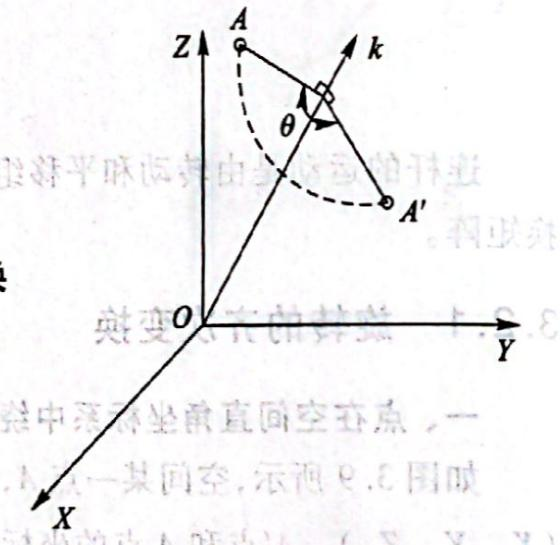
  

  

    
正在载入交互模型…

  

图 3.10 一般旋转变换（原图与交互示例）

可以证得,绕任意过原点的单位矢量 k 旋转 $\theta$ 角的旋转算子为 

$$
\operatorname{Rot} (\boldsymbol {k}, \theta) = \left[ \begin{array}{c c c c} k _ {X} k _ {X} \text {vers} \theta + \mathrm{c} \theta & k _ {Y} k _ {X} \text {vers} \theta - k _ {Z} \mathrm{s} \theta & k _ {Z} k _ {X} \text {vers} \theta + k _ {Y} \mathrm{s} \theta & 0 \\ k _ {X} k _ {Y} \text {vers} \theta + k _ {Z} \mathrm{s} \theta & k _ {Y} k _ {Y} \text {vers} \theta + \mathrm{c} \theta & k _ {Z} k _ {Y} \text {vers} \theta - k _ {X} \mathrm{s} \theta & 0 \\ k _ {X} k _ {Z} \text {vers} \theta - k _ {Y} \mathrm{s} \theta & k _ {Y} k _ {Z} \text {vers} \theta + k _ {X} \mathrm{s} \theta & k _ {Z} k _ {Z} \text {vers} \theta + \mathrm{c} \theta & 0 \\ 0 & 0 & 0 & 1 \end{array} \right]\tag{3.15}
$$

式中： $\mathrm{vers}\theta = 1 - \cos \theta$ 

式(3.15)称为一般旋转齐次变换通式,它概括了绕 X 轴、Y 轴及 Z 轴进行旋转齐次变换的各种特殊情况,例如: 

当 $k_{x} = 1$ ，即 $k_{y} = k_{z} = 0$ 时，由式(3.15)可得到式(3.13)； 

当 $k_{Y} = 1$ ，即 $k_{X} = k_{Z} = 0$ 时，由式(3.15)可得到式(3.14)； 

当 $k_{z} = 1$ ，即 $k_{x} = k_{y} = 0$ 时，由式(3.15)可得到式(3.12)。 

反之，若给出某个旋转算子 

$$
\boldsymbol {R} = \left[ \begin{array}{c c c c} n _ {X} & o _ {X} & a _ {X} & 0 \\ n _ {Y} & o _ {Y} & a _ {Y} & 0 \\ n _ {Z} & o _ {Z} & a _ {Z} & 0 \\ 0 & 0 & 0 & 1 \end{array} \right]
$$

则可根据式(3.15)求出其等效转轴矢量 $k$ 及等效转角 $\theta$ 为 

(3.78) 

$$
\left. \begin{array}{l} \sin \theta = \pm \frac {1}{2} \sqrt {\left(o _ {Z} - a _ {Y}\right) ^ {2} + \left(a _ {X} - n _ {Z}\right) ^ {2} + \left(n _ {Y} - o _ {X}\right) ^ {2}} \\ \tan \theta = \pm \frac {\sqrt {\left(o _ {Z} - a _ {Y}\right) ^ {2} + \left(a _ {X} - n _ {Z}\right) ^ {2} + \left(n _ {Y} - o _ {X}\right) ^ {2}}}{n _ {X} + o _ {Y} + a _ {Z} - 1} \\ k _ {X} = \frac {o _ {Z} - a _ {Y}}{2 \sin \theta} \\ k _ {Y} = \frac {a _ {X} - n _ {Z}}{2 \sin \theta} \\ k _ {Z} = \frac {n _ {Y} - o _ {X}}{2 \sin \theta} \end{array} \right\}\tag{3.16}
$$

式中: 当 $\theta$ 取 $0^{\circ}$ 到 $180^{\circ}$ 之间的值时, 式中的符号取“+”号; 当转角 $\theta$ 很小时, 公式很难确定转轴; 当 $\theta$ 接近 $0^{\circ}$ 或 $180^{\circ}$ 时, 转轴完全不确定。 

旋转算子公式(3.12)、式(3.13)、式(3.14)以及一般旋转算子公式(3.15)不仅适用于点的旋转变换,而且也适用于矢量、坐标系、物体等的旋转变换计算。 

#### 三、算子左、右乘规则

若相对固定坐标系进行变换,则算子左乘;若相对动坐标系进行变换,则算子右乘。 

例 3.4 已知坐标系中点 U 的位置矢量 $U=[7\quad3\quad2\quad1]^{T}$ ，将此点绕 Z 轴旋转 $90^{\circ}$ ，再绕 Y 轴旋转 $90^{\circ}$ ，如图 3.11 所示，求旋转变换后所得的点 W。 

解 $W = \mathrm{Rot}(Y,90^{\circ})\mathrm{Rot}(Z,90^{\circ})U$ 

$$
= \left[ \begin{array}{l l l l} 0 & 0 & 1 & 0 \\ 0 & 1 & 0 & 0 \\ - 1 & 0 & 0 & 0 \\ 0 & 0 & 0 & 1 \end{array} \right] \left[ \begin{array}{l l l l} 0 & - 1 & 0 & 0 \\ 1 & 0 & 0 & 0 \\ 0 & 0 & 1 & 0 \\ 0 & 0 & 0 & 1 \end{array} \right] \left[ \begin{array}{l} 7 \\ 3 \\ 2 \\ 1 \end{array} \right]
$$

$$
= \left[ \begin{array}{c c c c} 0 & 0 & 1 & 0 \\ 1 & 0 & 0 & 0 \\ 0 & 1 & 0 & 0 \\ 0 & 0 & 0 & 1 \end{array} \right] \left[ \begin{array}{l} 7 \\ 3 \\ 2 \\ 1 \end{array} \right] = \left[ \begin{array}{l} 2 \\ 7 \\ 3 \\ 1 \end{array} \right]
$$

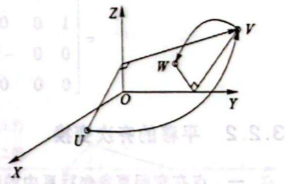

图 3.11 两次旋转变换

例3.5 图3.12所示单臂操作手的手腕也具有一个自由度。已知手部起始位姿矩阵为 

$$
\boldsymbol {G} _ {1} = \left[ \begin{array}{c c c c} 0 & 1 & 0 & 2 \\ 1 & 0 & 0 & 6 \\ 0 & 0 & - 1 & 2 \\ 0 & 0 & 0 & 1 \end{array} \right]
$$

若手臂绕 $Z_{0}$ 轴旋转 $+90^{\circ}$ , 则手部到达 $G_{2}$ ; 若手臂不动, 仅手部绕手腕 $Z_{1}$ 轴旋转 $+90^{\circ}$ , 则手部达 $G_{3}$ 。写出手部坐标系 $\{G_{2} \mid$ 及 $\{G_{3}\}$ 的矩阵表达式。 

(81.5) 

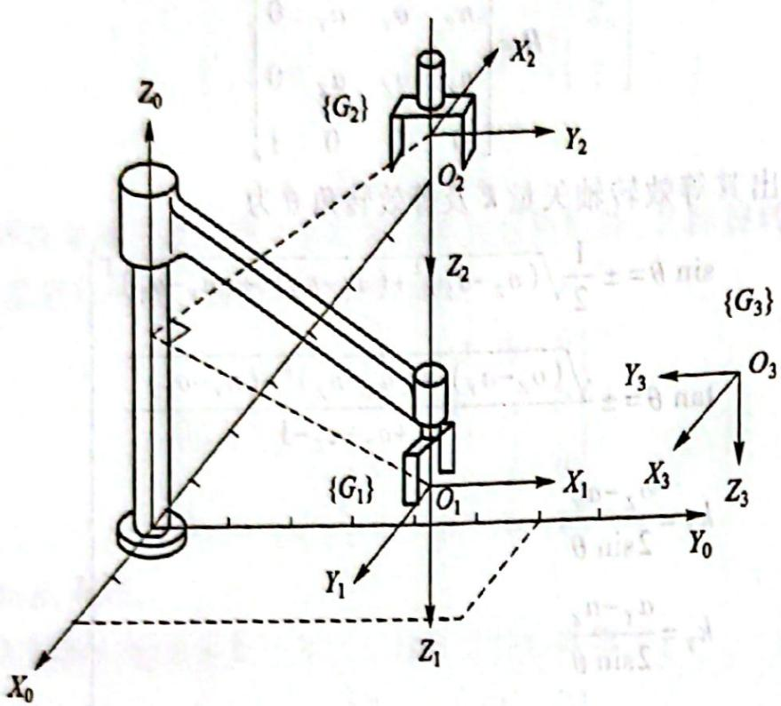

图3.12 单臂操作手手腕与手臂的转动

解 手臂绕定轴转动是相对固定坐标系作旋转变换,故有 

$$
\boldsymbol {G} _ {2} = \operatorname{Rot} \left(\boldsymbol {Z} _ {0}, 9 0 ^ {\circ}\right) \boldsymbol {G} _ {1}
$$

$$
= \left[ \begin{array}{c c c c} 0 & - 1 & 0 & 0 \\ 1 & 0 & 0 & 0 \\ 0 & 0 & 1 & 0 \\ 0 & 0 & 0 & 1 \end{array} \right] \left[ \begin{array}{c c c c} 0 & 1 & 0 & 2 \\ 1 & 0 & 0 & 6 \\ 0 & 0 & - 1 & 2 \\ 0 & 0 & 0 & 1 \end{array} \right] = \left[ \begin{array}{c c c c} - 1 & 0 & 0 & - 6 \\ 0 & 1 & 0 & 2 \\ 0 & 0 & - 1 & 2 \\ 0 & 0 & 0 & 1 \end{array} \right]
$$

手部绕手腕轴旋转是相对动坐标系作旋转变换,所以 

$$
\mathbf {G} _ {3} = \mathbf {G} _ {1} \operatorname{Rot} \left(Z _ {1}, 9 0 ^ {\circ}\right)
$$

$$
= \left[ \begin{array}{l l l l} 0 & 1 & 0 & 2 \\ 1 & 0 & 0 & 6 \\ 0 & 0 & - 1 & 2 \\ 0 & 0 & 0 & 1 \end{array} \right] \left[ \begin{array}{l l l l} 0 & - 1 & 0 & 0 \\ 1 & 0 & 0 & 0 \\ 0 & 0 & 1 & 0 \\ 0 & 0 & 0 & 1 \end{array} \right] = \left[ \begin{array}{l l l l} 1 & 0 & 0 & 2 \\ 0 & - 1 & 0 & 6 \\ 0 & 0 & - 1 & 2 \\ 0 & 0 & 0 & 1 \end{array} \right]
$$

### 3.2.2 平移的齐次变换

#### 一、点在空间直角坐标系中的平移变换

如图 3.13 所示, 空间某一点 A, 坐标为 $(X_{A}, Y_{A}, Z_{A})$ , 当它平移至 $A'$ 点后, 坐标为 $(X_{A'}, Y_{A'}, Z_{A'})$ 。其中 

$$
\left. \begin{array}{l} X _ {A ^ {\prime}} = X _ {A} + \Delta X \\ Y _ {A ^ {\prime}} = Y _ {A} + \Delta Y \\ Z _ {A ^ {\prime}} = Z _ {A} + \Delta Z \end{array} \right\}\tag{3.17}
$$

或写成如下形式： 

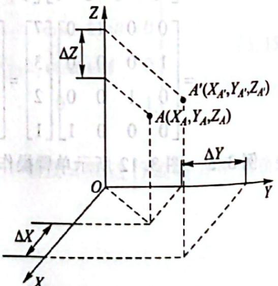

图3.13 点的平移变换

$$
\left[ \begin{array}{c} X _ {A ^ {\prime}} \\ Y _ {A ^ {\prime}} \\ Z _ {A ^ {\prime}} \\ 1 \end{array} \right] = \left[ \begin{array}{c c c c} 1 & 0 & 0 & \Delta X \\ 0 & 1 & 0 & \Delta Y \\ 0 & 0 & 1 & \Delta Z \\ 0 & 0 & 0 & 1 \end{array} \right] \left[ \begin{array}{c} X _ {A} \\ Y _ {A} \\ Z _ {A} \\ 1 \end{array} \right]
$$

也可以简写为 

$$
A ^ {\prime} = \text { Trans } (\Delta X, \Delta Y, \Delta Z) A\tag{3.18}
$$

式中：Trans( $\Delta X,\Delta Y,\Delta Z$ )表示齐次坐标变换的平移算子，且 

$$
\operatorname{Trans} (\Delta X, \Delta Y, \Delta Z) = \left[ \begin{array}{c c c c} 1 & 0 & 0 & \Delta X \\ 0 & 1 & 0 & \Delta Y \\ 0 & 0 & 1 & \Delta Z \\ 0 & 0 & 0 & 1 \end{array} \right]\tag{3.19}
$$

式中:第四列元素 $\Delta X$ 、 $\Delta Y$ 、 $\Delta Z$ 分别表示沿坐标轴X、Y、Z的移动量。 

#### 二、坐标系与物体的平移变换

点的平移的齐次变换公式(3.19)同样适用于坐标系、物体等的变换,3.2.1节提到的算子左、右乘规则同样适于平移的齐次变换。 

例 3.6 图 3.14 所示坐标系与物体的平移变换给出了下面三种情况: 动坐标系 $\{A\}$ 相对于固定坐标系的 $X_{0}, Y_{0}, Z_{0}$ 轴作 $(-1, 2, 2)$ 平移后到 $\{A'\}$ ，动坐标系 $\{A\}$ 相对于自身坐标系的 X, Y, Z 轴分别作 $(-1, 2, 2)$ 平移后到 $\{A''\}$ ; 物体 Q 相对于固定坐标系作 $(2, 6, 0)$ 平移后为 $Q'$ 。已知: 

$$
\boldsymbol {A} = \left[ \begin{array}{c c c c} 0 & - 1 & 0 & 1 \\ - 1 & 0 & 0 & 1 \\ 0 & 0 & - 1 & 1 \\ 0 & 0 & 0 & 1 \end{array} \right], \quad \boldsymbol {Q} = \left[ \begin{array}{c c c c c c c c} 1 & - 1 & - 1 & 1 & 1 & - 1 & 1 & - 1 \\ 0 & 0 & 0 & 0 & 2 & 2 & 2 & 2 \\ 0 & 0 & 1 & 1 & 0 & 0 & 0. 5 & 0. 5 \\ 1 & 1 & 1 & 1 & 1 & 1 & 1 & 1 \end{array} \right]
$$

写出坐标系 $\{A'\}$ 、 $\{A''\}$ 以及物体 $Q'$ 的矩阵表达式。 

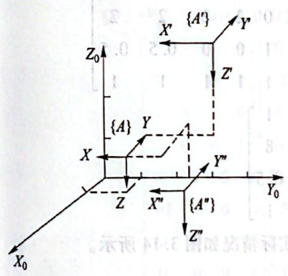

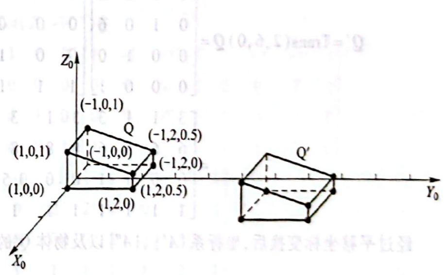

(a)坐标系

(b) 物体Q在固定坐标系下的位置变化

S.S. 

图 3.14 坐标系与物体的平移变换 

解 动坐标系 $\{A\}$ 的两个齐次坐标变换平移算子均为 

$$
\operatorname{Trans} (\Delta X, \Delta Y, \Delta Z) = \left[ \begin{array}{c c c c} 1 & 0 & 0 & - 1 \\ 0 & 1 & 0 & 2 \\ 0 & 0 & 1 & 2 \\ 0 & 0 & 0 & 1 \end{array} \right]
$$

$\{A'\}$ 坐标系是动系 $\{A\}$ 沿固定坐标系作平移变换得来的，故算子左乘， $\{A'\}$ 的矩阵表达式为 

$$
\boldsymbol {A} ^ {\prime} = \operatorname{Trans} (- 1, 2, 2) \boldsymbol {A} = \left[ \begin{array}{l l l l} 1 & 0 & 0 & - 1 \\ 0 & 1 & 0 & 2 \\ 0 & 0 & 1 & 2 \\ 0 & 0 & 0 & 1 \end{array} \right] \left[ \begin{array}{l l l l} 0 & - 1 & 0 & 1 \\ - 1 & 0 & 0 & 1 \\ 0 & 0 & - 1 & 1 \\ 0 & 0 & 0 & 1 \end{array} \right] = \left[ \begin{array}{l l l l} 0 & - 1 & 0 & 0 \\ - 1 & 0 & 0 & 3 \\ 0 & 0 & - 1 & 3 \\ 0 & 0 & 0 & 1 \end{array} \right]
$$

$\{A''\}$ 坐标系是动系 $\{A\}$ 沿自身坐标系作平移变换得来的，故算子右乘， $\{A''\}$ 的矩阵表达式为 

$$
\begin{array}{r l} A ^ {\prime \prime} = & A \operatorname{Trans} (- 1, 2, 2) = \left[ \begin{array}{c c c c} 0 & - 1 & 0 & 1 \\ - 1 & 0 & 0 & 1 \\ 0 & 0 & - 1 & 1 \\ 0 & 0 & 0 & 1 \end{array} \right] \left[ \begin{array}{c c c c} 1 & 0 & 0 & - 1 \\ 0 & 1 & 0 & 2 \\ 0 & 0 & 1 & 2 \\ 0 & 0 & 0 & 1 \end{array} \right] \\ & = \left[ \begin{array}{c c c c} 0 & - 1 & 0 & - 1 \\ - 1 & 0 & 0 & 2 \\ 0 & 0 & - 1 & - 1 \\ 0 & 0 & 0 & 1 \end{array} \right] \end{array}
$$

物体 Q 的齐次坐标变换平移算子为 

$$
\operatorname{Trans} (\Delta X, \Delta Y, \Delta Z) = \left[ \begin{array}{c c c c} 1 & 0 & 0 & 2 \\ 0 & 1 & 0 & 6 \\ 0 & 0 & 1 & 0 \\ 0 & 0 & 0 & 1 \end{array} \right] \quad \left[ \begin{array}{l l l l} 1 & 0 & 0 & 2 \\ 0 & 1 & 0 & 6 \\ 0 & 0 & 1 & 0 \\ 0 & 0 & 0 & 1 \end{array} \right] = A
$$

故有 

$$
\begin{array}{r l} Q ^ {\prime} = \operatorname{Trans} (2, 6, 0) Q & = \left[ \begin{array}{l l l l} 1 & 0 & 0 & 2 \\ 0 & 1 & 0 & 6 \\ 0 & 0 & 1 & 0 \\ 0 & 0 & 0 & 1 \end{array} \right] \left[ \begin{array}{l l l l l l l l} 1 & - 1 & - 1 & 1 & 1 & - 1 & 1 & - 1 \\ 0 & 0 & 0 & 0 & 2 & 2 & 2 & 2 \\ 0 & 0 & 1 & 1 & 0 & 0 & 0. 5 & 0. 5 \\ 1 & 1 & 1 & 1 & 1 & 1 & 1 & 1 \end{array} \right] \\ & = \left[ \begin{array}{l l l l l l l l} 3 & 1 & 1 & 3 & 3 & 1 & 3 & 1 \\ 6 & 6 & 6 & 6 & 8 & 8 & 8 & 8 \\ 0 & 0 & 1 & 1 & 0 & 0 & 0. 5 & 0. 5 \\ 1 & 1 & 1 & 1 & 1 & 1 & 1 & 1 \end{array} \right] \end{array}
$$

经过平移坐标变换后，坐标系 $\{A'\}$ 、 $\{A''\}$ 以及物体 $Q'$ 的实际情况如图3.14所示。 

### 3.2.3 复合变换

平移变换和旋转变换可以组合在一个齐次变换中,称为复合变换。 

如例3.4中的点 $W$ 若还要作 $4i - 3j + 7k$ 的平移至 $E$ 点，则只要左乘上平移变换算子，即可得到最后 $E$ 点的列阵表达： 

$$
\boldsymbol {E} = \boldsymbol {H} \boldsymbol {U} = \operatorname{Trans} (4, - 3, 7) \operatorname{Rot} (Y, 9 0 ^ {\circ}) \operatorname{Rot} (Z, 9 0 ^ {\circ}) \boldsymbol {U}
$$

$$
= \left[ \begin{array}{l l l l} 1 & 0 & 0 & 4 \\ 0 & 1 & 0 & - 3 \\ 0 & 0 & 1 & 7 \\ 0 & 0 & 0 & 1 \end{array} \right] \left[ \begin{array}{l l l l} 0 & 0 & 1 & 0 \\ 1 & 0 & 0 & 0 \\ 0 & 1 & 0 & 0 \\ 0 & 0 & 0 & 1 \end{array} \right] \left[ \begin{array}{l} 7 \\ 3 \\ 2 \\ 1 \end{array} \right] = \left[ \begin{array}{l l l l} 0 & 0 & 1 & 4 \\ 1 & 0 & 0 & - 3 \\ 0 & 1 & 0 & 7 \\ 0 & 0 & 0 & 1 \end{array} \right] \left[ \begin{array}{l} 7 \\ 3 \\ 2 \\ 1 \end{array} \right] = \left[ \begin{array}{l} 6 \\ 4 \\ 1 0 \\ 1 \end{array} \right]
$$

式中： $H=\begin{bmatrix}0&0&1&4\\ 1&0&0&-3\\ 0&1&0&7\\ 0&0&0&1\end{bmatrix}$ ，为平移加旋转的复合变换矩阵。 

例 3.7 如图 3.8 所示的楔块 Q, 在图 3.8a 所示位置下描述它的齐次矩阵为 

$$
Q = \left[ \begin{array}{c c c c c c c c} 1 & - 1 & - 1 & 1 & 1 & - 1 & - 1 & 1 \\ 0 & 0 & 2 & 2 & 0 & 0 & 2 & 2 \\ 0 & 0 & 0 & 0 & 2 & 2 & 1 & 1 \\ 1 & 1 & 1 & 1 & 1 & 1 & 1 & 1 \end{array} \right]
$$

试求楔块经过绕固定坐标系 OXYZ 的 Z 轴旋转 $-90^{\circ}$ ，再沿 X 轴方向平移 4 后（图 3.8b）的齐次矩阵表达式及其复合变换矩阵 H。 

解 楔块从图 3.8a 至图 3.8b 的所有变换都是相对于固定坐标系 OXYZ 进行的, 故各坐标变换算子应该依次左乘, 即复合变换矩阵为 

$$
\begin{array}{r l} \boldsymbol {H} = \mathrm{Trans} (4, 0, 0) \operatorname{Rot} (Z, - 9 0 ^ {\circ}) & = \left[ \begin{array}{l l l l} 1 & 0 & 0 & 4 \\ 0 & 1 & 0 & 0 \\ 0 & 0 & 1 & 0 \\ 0 & 0 & 0 & 1 \end{array} \right] \left[ \begin{array}{l l l l} 0 & 1 & 0 & 0 \\ - 1 & 0 & 0 & 0 \\ 0 & 0 & 1 & 0 \\ 0 & 0 & 0 & 1 \end{array} \right] \\ & = \left[ \begin{array}{l l l l} 0 & 1 & 0 & 4 \\ - 1 & 0 & 0 & 0 \\ 0 & 0 & 1 & 0 \\ 0 & 0 & 0 & 1 \end{array} \right] \end{array}
$$

$Q^{\prime} = HQ = \mathrm{Trans}(4,0,0)\mathrm{Rot}(Z, - 90^{\circ})Q$ 

$$
= \left[ \begin{array}{l l l l} 1 & 0 & 0 & 4 \\ 0 & 1 & 0 & 0 \\ 0 & 0 & 1 & 0 \\ 0 & 0 & 0 & 1 \end{array} \right] \left[ \begin{array}{l l l l} 0 & 1 & 0 & 0 \\ - 1 & 0 & 0 & 0 \\ 0 & 0 & 1 & 0 \\ 0 & 0 & 0 & 1 \end{array} \right] \left[ \begin{array}{l l l l l l l l} 1 & - 1 & - 1 & 1 & 1 & - 1 & - 1 & 1 \\ 0 & 0 & 2 & 2 & 0 & 0 & 2 & 2 \\ 0 & 0 & 0 & 0 & 2 & 2 & 1 & 1 \\ 1 & 1 & 1 & 1 & 1 & 1 & 1 & 1 \end{array} \right]
$$

$$
= \left[ \begin{array}{l l l l} 0 & 1 & 0 & 4 \\ - 1 & 0 & 0 & 0 \\ 0 & 0 & 1 & 0 \\ 0 & 0 & 0 & 1 \end{array} \right] \left[ \begin{array}{l l l l l l l l} 1 & - 1 & - 1 & 1 & 1 & - 1 & - 1 & 1 \\ 0 & 0 & 2 & 2 & 0 & 0 & 2 & 2 \\ 0 & 0 & 0 & 0 & 2 & 2 & 1 & 1 \\ 1 & 1 & 1 & 1 & 1 & 1 & 1 & 1 \end{array} \right]
$$

$$
= \left[ \begin{array}{c c c c c c c c} 4 & 4 & 6 & 6 & 4 & 4 & 6 & 6 \\ - 1 & 1 & 1 & - 1 & - 1 & 1 & 1 & - 1 \\ 0 & 0 & 0 & 0 & 2 & 2 & 1 & 1 \\ 1 & 1 & 1 & 1 & 1 & 1 & 1 & 1 \end{array} \right]
$$

## 3.3 机器人的位姿分析

### 3.3.1 杆件坐标系的建立

#### 一、坐标系号的分配方法

机器人的各连杆通过关节连接在一起,关节有移动副与转动副两种。按从机座到末端执行器的顺序,由低到高依次为各关节和各连杆编号,如图3.15所示。机座的编号为杆件0,与机座相连的连杆编号为连杆1,以此类推。机座与连杆1的关节编号为关节1,连杆1与连杆2的连接关节编号为2,以此类推。各连杆的坐标系Z轴方向与关节轴线重合(对于移动关节,为Z轴线沿此关节移动方向)。 

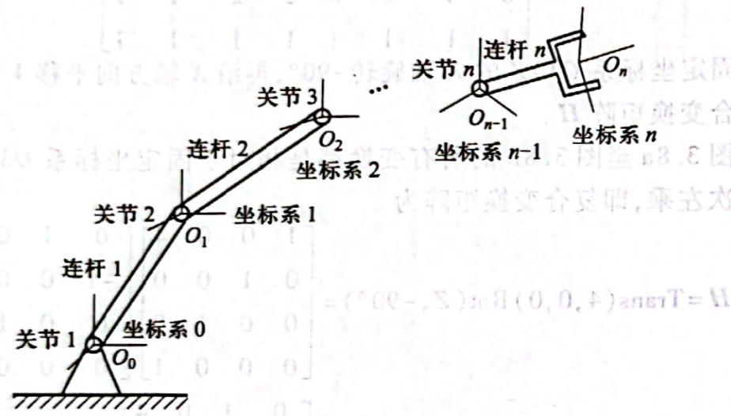

图3.15 机器人坐标系的分配

末端执行器上的坐标系依据夹持器(手爪)手指的运动方向固定在末端执行器上。原点位于形心； $X_{n}$ 沿末端执行器手指组成的平面的法向，故又被称为法线矢量； $Y_{n}$ 垂直于手指，称为姿态矢量。 $Z_{n}$ 的方向朝外指向目标，称为接近矢量。 

#### 二、各坐标系的方位的确定

有两种方法用于确定各坐标系的方位： 

##### 1. 一般方法

只要满足前述条件,则对坐标系各坐标轴的分配并无任何特殊规定。在此情况下,后一坐标系向前一坐标系的坐标变换完全按照坐标变换方程进行。 

##### 2. D-H 方法

这种方法由 Denault 和 Hartenbery 于 1956 年提出, 它严格定义了每个坐标系的坐标轴, 并对连杆和关节定义了 4 个参数。 

###### (1) 转动关节的 D-H 坐标系

转动关节的 D-H 坐标系建立如图 3.16 所示。 

连杆 $i$ 的坐标系的 $Z_{i}$ 轴位于连杆 $i$ 与连杆 $i + 1$ 的转动关节轴线上；连杆 $i$ 的两端轴线的公垂 线为连杆坐标系的 $X_{i}$ 轴，方向指向下一个连杆；公垂线与 $Z_{i}$ 的交点为坐标系原点；坐标系的 $Y_{i}$ 轴由 $X_{i}$ 和 $Z_{i}$ 确定。至此，连杆 $i$ 的坐标系确立。 

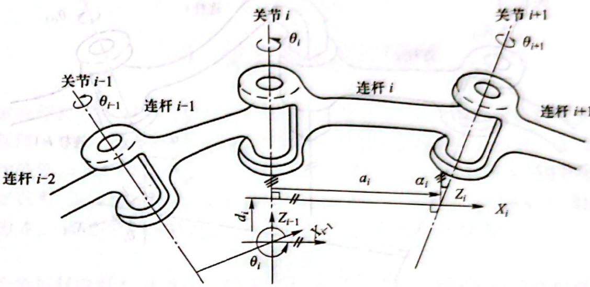

图 3.16 转动关节连杆 D-H 坐标系建立示意图

对于如上建立的连杆坐标系, 可用 4 个参数来描述, 其中两个参数用来描述连杆, 即两关节轴线沿公垂线的距离 $a_{i}$ , 称为连杆长度, 垂直于 $a_{i}$ 所在平面内两关节轴线 $(Z_{i-1}$ 和 $Z_{i})$ 的夹角 $\alpha_{i}$ , 称为连杆扭角; 另两个参数描述相邻两杆的关系, 即沿关节 $i$ 轴线两个公垂线的距离 $d_{i}$ (称为连杆距离), 垂直于关节 $i$ 轴线的平面内两个公垂线的夹角 $\theta_{i}$ (称为连杆夹角), 如图 3.16 所示。 

对于转动关节, $\theta_{i}$ 是关节变量,其他三个参数固定不变;对于移动关节, $d_{i}$ 是关节变量,其他三个参数固定不变。 

另有一种特殊情况,即连杆 i 的两端轴线平行。在这种情况下,由于两平行轴线的公垂线存在多值,故无法确定连杆 i 的坐标系原点。这时,连杆 i 的坐标系原点由 $d_{i+1}$ 确定。 

###### (2) 棱柱联轴器(平动关节)的 D-H 坐标系

对于图3.17所示的棱柱联轴器, 距离 $d_{i}$ 成为联轴器(关节)变量, 而联轴器的方向即为此联轴器移动的方向。该轴方向是规定的, 但不同于转动关节的情况是该轴空间位置没有规定。对于联轴器来说, 其长度 $a_{i}$ 没有意义, 令其为零。联轴器的坐标系原点与下一个规定的连杆原点重合。棱柱联轴器的 $Z$ 轴在关节 $i + 1$ 的轴线上。 $X_{i}$ 轴平行或反向平行于棱柱联轴器矢量与 $Z_{i}$ 矢量的叉积。当 $d_{i} = 0$ 时, 定义该联轴器的位置为零。 

### 3.3.2 连杆坐标系间的变换矩阵

#### 一、连杆坐标系间的齐次变换矩阵的表示方法

用 $A_{n}^{n - 1}$ 表示机器人连杆 $n$ 坐标系的坐标变换成连杆 $n - 1$ 坐标系的坐标的齐次变换矩阵，通常把上标省略，写成 $A_{n}$ 。对于 $n$ 个关节的机器人，后一个关节向前一个关节的坐标齐次变换矩阵分别为 

$$
A _ {n} ^ {n - 1}, \quad A _ {n - 1} ^ {n - 2}, \quad \dots , \quad A _ {1} ^ {0}
$$

也就是 

$$
\boldsymbol {A} _ {n}, \quad \boldsymbol {A} _ {n - 1}, \dots , \quad \boldsymbol {A} _ {1}
$$

其中， $A_{1}^{0}(A_{1})$ 表示杆件1上的1号坐标系到机座的0号坐标系的齐次坐标变换矩阵。 

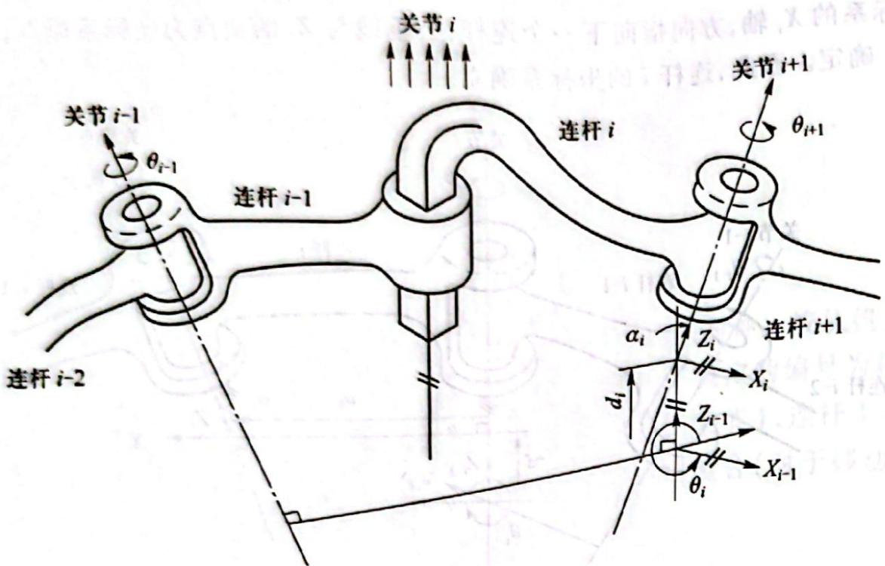

图 3.17 棱柱联轴器连杆 D-H 坐标系建立示意图

#### 二、连杆坐标系间变换矩阵的确定

如图 3.15 及图 3.16 所示,一旦对全部连杆规定坐标系后,就能按照下列的步骤建立相邻两连杆 i 与 i-1 之间的相对关系: 

1) 绕 $Z_{i-1}$ 轴旋转 $\theta_{i}$ 角，使 $X_{i-1}$ 轴转到与 $X_{i}$ 同一平面内。 

2）沿 $Z_{i - 1}$ 轴平移一距离 $d_{i}$ ，把 $X_{i - 1}$ 移到与 $X_{i}$ 同一直线上。 

3）沿 $X_{i}$ 轴平移一距离 $a_{i}$ ，把连杆 $i - 1$ 的坐标系移动到使其原点与连杆 $i$ 坐标系原点重合的地方。 

4）绕 $X_{i}$ 旋转 $\alpha_{i}$ 角，使 $Z_{i - 1}$ 转到与 $Z_{i}$ 同一直线上。 

连杆 $i - 1$ 的坐标系经过上述变换与连杆 $i$ 的坐标系重合。如果把表示相邻连杆相对空间关系的矩阵称为 $\pmb{A}$ 矩阵, 那么根据上述变换步骤, 从连杆 $i$ 到连杆 $i - 1$ 的坐标系间的齐次变换矩阵 $A_{i}$ 为 

$$
\boldsymbol {A} _ {i} = \operatorname{Rot} (Z, \theta_ {i}) \operatorname{Trans} (a _ {i}, 0, d _ {i}) \operatorname{Rot} (X, \alpha_ {i})
$$

$$
= \left[ \begin{array}{c c c c} \cos \theta_ {i} & - \sin \theta_ {i} & 0 & 0 \\ \sin \theta_ {i} & \cos \theta_ {i} & 0 & 0 \\ 0 & 0 & 0 & 0 \\ 0 & 0 & 0 & 1 \end{array} \right] \left[ \begin{array}{c c c c} 1 & 0 & 0 & a _ {i} \\ 0 & 1 & 0 & 0 \\ 0 & 0 & 1 & d _ {i} \\ 0 & 0 & 0 & 1 \end{array} \right] \left[ \begin{array}{c c c c} 1 & 0 & 0 & 0 \\ 0 & \cos \alpha_ {i} & - \sin \alpha_ {i} & 0 \\ 0 & \sin \alpha_ {i} & \cos \alpha_ {i} & 0 \\ 0 & 0 & 0 & 1 \end{array} \right]
$$

$$
= \left[ \begin{array}{c c c c} \cos \theta_ {i} & - \sin \theta_ {i} \cos \alpha_ {i} & \sin \theta_ {i} \sin \alpha_ {i} & a _ {i} \cos \theta_ {i} \\ \sin \theta_ {i} & \cos \theta_ {i} \cos \alpha_ {i} & - \cos \theta_ {i} \sin \alpha_ {i} & a _ {i} \sin \theta_ {i} \\ 0 & \sin \alpha_ {i} & \cos \alpha_ {i} & d _ {i} \\ 0 & 0 & 0 & 1 \end{array} \right]\tag{3.20}
$$

同理,对联轴器的齐次变换矩阵为 

$$
\boldsymbol {A} _ {i} = \left[ \begin{array}{c c c c} \cos \theta_ {i} & - \sin \theta_ {i} \cos \alpha_ {i} & \sin \theta_ {i} \sin \alpha_ {i} & 0 \\ \sin \theta_ {i} & \cos \theta_ {i} \cos \alpha_ {i} & - \cos \theta_ {i} \sin \alpha_ {i} & 0 \\ 0 & \sin \alpha_ {i} & \cos \alpha_ {i} & d _ {i} \\ 0 & 0 & 0 & 1 \end{array} \right]\tag{3.21}
$$

以上两式分别为在 D-H 坐标系中,转动关节及平动关节坐标与其后一个关节坐标的齐次变换矩阵。 

## 3.4 机器人正向运动学

根据前面介绍的方法,欲研究机器人运动学首先应建立机器人各杆件的构件坐标系,从而得出齐次变换矩阵 $A_{i}$ 。 $A_{i}$ 能描述连杆坐标系之间相对平移和旋转的齐次变换。 $A_{1}$ 描述第一个连杆对于机身的位姿, $A_{2}$ 描述第二个连杆坐标系相对于第一个连杆坐标系的位姿。如果已知一点在最末一个坐标系(如n坐标系)的坐标,要把它表示成前一个坐标系(如n-1)的坐标,那么齐次变换矩阵为 $A_{n}$ 。以此类推,可知此点到基础坐标系的齐次变换矩阵为 

$$
\boldsymbol {A} _ {1} \boldsymbol {A} _ {2} \boldsymbol {A} _ {3} \dots \boldsymbol {A} _ {n - 1} \boldsymbol {A} _ {n}
$$

若有一个六连杆机器人,机器人末端执行器坐标系(即连杆坐标系6)的坐标相对于连杆i-1坐标系的齐次变换矩阵用 $^{i-1}T_{6}$ 表示,即 

$$
^ {i - 1} T _ {6} = A _ {i} A _ {i + 1} \dots A _ {6}
$$

机器人末端执行器相对于机身坐标系的齐次变换矩阵为 

$$
{ } ^ { 0 } \boldsymbol { T } _ { 6 } = \boldsymbol { A } _ { 1 } \boldsymbol { A } _ { 2 } \dots \boldsymbol { A } _ { 6 }
$$

式中： $^{0}T_{6}$ 常写成 $T_{6}$ 。 

### 3.4.1 斯坦福机器人运动方程

下面以斯坦福机器人为例说明如何依据 D-H 方法来建立机器人的运动方程。 

例 3.8 斯坦福机器人的结构示意图如图 3.18 所示。求 $A_{i}(i=1,2,\cdots,6)$ 及 $T_{6}$ 的表达式。 

解（1）D-H坐标系的建立 

按 D-H 方法建立各连杆坐标系, 如图 3.18 所示。图中 $Z_{0}$ 轴沿关节 1 的轴, $Z_{i}$ 轴沿关节 $i+1$ 的轴, 令所有 $X_{i}$ 轴与机座坐标系 $X_{0}$ 轴平行, $Y_{i}$ 轴按右手坐标系确定。 

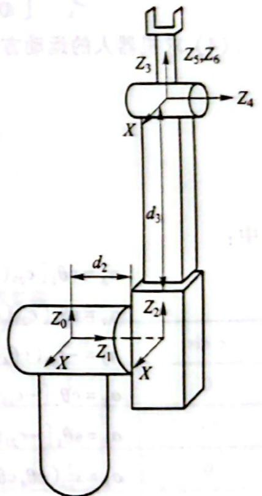

#### (2) 确定各连杆的 D-H 参数和关节变量

图 3.18 斯坦福机器人的 

表 3.1 给出了各连杆的 D-H 参数和关节变量。 

结构示意图 

表 3.1 斯坦福机器人各连杆的 D-H 参数和关节变量

<table><tr><td>连杆</td><td>θ</td><td>α</td><td>a</td><td>d</td><td>cos α</td><td>sin α</td></tr><tr><td>1</td><td>θ1</td><td>-90°</td><td>0</td><td>0</td><td>0</td><td>-1</td></tr><tr><td>2</td><td>θ2</td><td>90°</td><td>0</td><td>d2</td><td>0</td><td>1</td></tr><tr><td>3</td><td>0</td><td>0</td><td>0</td><td>d3</td><td>1</td><td>0</td></tr><tr><td>4</td><td>θ4</td><td>-90°</td><td>0</td><td>0</td><td>0</td><td>-1</td></tr><tr><td>5</td><td>θ5</td><td>90°</td><td>0</td><td>0</td><td>0</td><td>1</td></tr><tr><td>6</td><td>θ6</td><td>0</td><td>0</td><td>0</td><td>1</td><td>0</td></tr></table>

(3) 求两杆之间的位姿矩阵 $A_{i}$ 

根据表 3.1 所示的 D-H 参数和齐次变换矩阵公式, 可求得 $A_{i}$ : 

$$
\boldsymbol {A} _ {1} = \left[ \begin{array}{c c c c} \mathrm{c} \theta_ {1} & 0 & - \mathrm{s} \theta_ {1} & 0 \\ \mathrm{s} \theta_ {1} & 0 & \mathrm{c} \theta_ {1} & 0 \\ 0 & - 1 & 0 & 0 \\ 0 & 0 & 0 & 1 \end{array} \right], \quad \boldsymbol {A} _ {2} = \left[ \begin{array}{c c c c} \mathrm{c} \theta_ {2} & 0 & \mathrm{s} \theta_ {2} & 0 \\ \mathrm{s} \theta_ {2} & 0 & - \mathrm{c} \theta_ {2} & 0 \\ 0 & 1 & 0 & d _ {2} \\ 0 & 0 & 0 & 1 \end{array} \right]
$$

$$
\boldsymbol {A} _ {3} = \left[ \begin{array}{c c c c} 1 & 0 & 0 & 0 \\ 0 & 1 & 0 & 0 \\ 0 & 0 & 1 & d _ {3} \\ 0 & 0 & 0 & 1 \end{array} \right], \quad \boldsymbol {A} _ {4} = \left[ \begin{array}{c c c c} \mathrm{c} \theta_ {4} & 0 & - \mathrm{s} \theta_ {4} & 0 \\ \mathrm{s} \theta_ {4} & 0 & \mathrm{c} \theta_ {4} & 0 \\ 0 & - 1 & 0 & 0 \\ 0 & 0 & 0 & 1 \end{array} \right]
$$

$$
\boldsymbol {A} _ {5} = \left[ \begin{array}{c c c c} \mathrm{c} \theta_ {5} & 0 & \mathrm{s} \theta_ {5} & 0 \\ \mathrm{s} \theta_ {5} & 0 & - \mathrm{c} \theta_ {5} & 0 \\ 0 & 1 & 0 & 0 \\ 0 & 0 & 0 & 1 \end{array} \right], \quad \boldsymbol {A} _ {6} = \left[ \begin{array}{c c c c} \mathrm{c} \theta_ {6} & - \mathrm{s} \theta_ {6} & 0 & 0 \\ \mathrm{s} \theta_ {6} & \mathrm{c} \theta_ {6} & 0 & 0 \\ 0 & 0 & 1 & 0 \\ 0 & 0 & 0 & 1 \end{array} \right]\tag{3.53}
$$

(4) 求机器人的运动方程 

$$
\boldsymbol {T} _ {6} = \boldsymbol {A} _ {1} \boldsymbol {A} _ {2} \boldsymbol {A} _ {3} \boldsymbol {A} _ {4} \boldsymbol {A} _ {5} \boldsymbol {A} _ {6} = \left[ \begin{array}{c c c c} n _ {X} & o _ {X} & a _ {X} & P _ {X} \\ n _ {Y} & o _ {Y} & a _ {Y} & P _ {Y} \\ n _ {Z} & o _ {Z} & a _ {Z} & P _ {Z} \\ 0 & 0 & 0 & 1 \end{array} \right]
$$

$$
\mathrm{O} _ {\mathrm{B}} ^ {\mathrm{CP}}\tag{3.22}
$$

式中： 

$$
\begin{array}{r l} & n _ {X} = c \theta_ {1} \left[ c _ {2 3} (c \theta_ {4} c \theta_ {5} c \theta_ {6} - s \theta_ {4} s \theta_ {6}) - s _ {2 3} s \theta_ {5} c \theta_ {6} \right] - s \theta_ {1} (s \theta_ {4} c \theta_ {5} c \theta_ {6} + c \theta_ {4} s \theta_ {6}); \\ & n _ {Y} = s \theta_ {1} \left[ c _ {2 3} (c \theta_ {4} c \theta_ {5} c \theta_ {6} - s \theta_ {4} s \theta_ {6}) - s _ {2 3} s \theta_ {5} c \theta_ {6} \right] + c \theta_ {1} (s \theta_ {4} c \theta_ {5} c \theta_ {6} + c \theta_ {4} s \theta_ {6}); \\ & n _ {Z} = - s _ {2 3} (c \theta_ {4} c \theta_ {5} c \theta_ {6} - s \theta_ {4} s \theta_ {6}) - c _ {2 3} s \theta_ {5} c \theta_ {6}; \\ & o _ {X} = c \theta_ {1} \left[ - c _ {2 3} (c \theta_ {4} c \theta_ {5} s \theta_ {6} + s \theta_ {4} c \theta_ {6}) + s _ {2 3} s \theta_ {5} s \theta_ {6} \right] - s \theta_ {1} (- s \theta_ {4} c \theta_ {5} s \theta_ {6} + c \theta_ {4} c \theta_ {6}); \\ & o _ {Y} = s \theta_ {1} \left[ - c _ {2 3} (c \theta_ {4} c \theta_ {5} c \theta_ {6} + s \theta_ {4} c \theta_ {6}) + s _ {2 3} s \theta_ {5} s \theta_ {6} \right] + c \theta_ {1} (- s \theta_ {4} c \theta_ {5} s \theta_ {6} + c \theta_ {4} c \theta_ {6}); \\ & o _ {Z} = s _ {2 3} (c \theta_ {4} c \theta_ {5} s \theta_ {6} + s \theta_ {4} c \theta_ {6}) + c _ {2 3} s \theta_ {5} s \theta_ {6}; \\ & a _ {X} = c \theta_ {1} (c _ {2 3} c \theta_ {4} s \theta_ {5} + s _ {2 3} c \theta_ {5}) - s \theta_ {1} s \theta_ {4} s \theta_ {5}; \\ & a _ {Y} = s \theta_ {1} (c _ {2 3} c \theta_ {4} s \theta_ {5} + s _ {2 3} c \theta_ {5}) + c \theta_ {1} s \theta_ {4} s \theta_ {5}; \\ & a _ {Z} = - s _ {2 3} c \theta_ {4} s \theta_ {5} + c _ {2 3} c \theta_ {5}; \\ & P _ {\chi} = c \theta_ {1} s \theta_ {2} d _ {3} - s \theta_ {1} d _ {2}; \\ & P _ {\gamma} = s \theta_ {1} s \theta_ {2} d _ {3} + c \theta_ {1} d _ {2}; \\ & P _ {\zeta} = c \theta_ {2} d _ {3}. \end{array}
$$

式中： $s_{ij}=\sin(\theta_{i}+\theta_{j}),c_{ij}=\cos(\theta_{i}+\theta_{j})$ 。 

### 3.4.2 PUMA 560 型机器人运动学方程

(AS.E) 

PUMA 560 型机器人属于关节型机器人,6 个关节都是转动关节,具有 6 个自由度。前 3 个 关节用于确定手腕参考点在空间的位置,后3个关节用于确定手腕姿态。下面来分析PUMA 560型机器人的运动学方程。 

中 

例 3.9 求图 3.19 所示 PUMA 560 型机器人的运动学方程。 

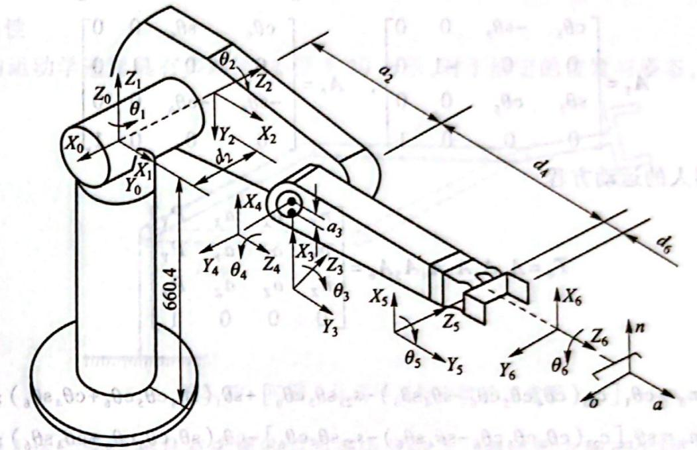

图 3.19 PUMA 560 型机器人结构简图

解（1）D-H坐标系的建立 

按 D-H 方法建立各连杆坐标系, 如图 3.19 所示。 

(2) 确定各连杆的 D-H 参数和关节变量 

表 3.2 中给出了各连杆的 D-H 参数和关节变量。 

表 3.2 PUMA 560 机器人各连杆的 D-H 参数和关节变量

<table><tr><td>连杆</td><td>θ</td><td>α</td><td>a</td><td>d</td><td>cos α</td><td>sin α</td></tr><tr><td>1</td><td><eq>θ_1</eq></td><td>0°</td><td>0</td><td>0</td><td>1</td><td>0</td></tr><tr><td>2</td><td><eq>θ_2</eq></td><td>-90°</td><td>0</td><td><eq>d_2</eq></td><td>0</td><td>-1</td></tr><tr><td>3</td><td><eq>θ_3</eq></td><td>0°</td><td><eq>a_2</eq></td><td>0</td><td>1</td><td>0</td></tr><tr><td>4</td><td><eq>θ_4</eq></td><td>-90°</td><td><eq>a_3</eq></td><td><eq>d_4</eq></td><td>0</td><td>-1</td></tr><tr><td>5</td><td><eq>θ_5</eq></td><td>90°</td><td>0</td><td>0</td><td>0</td><td>1</td></tr><tr><td>6</td><td><eq>θ_6</eq></td><td>-90°</td><td>0</td><td>0</td><td>0</td><td>-1</td></tr></table>

(3) 求两杆之间的位姿矩阵 $A_{i}$ 

根据表 3.2 所示的 D-H 参数和齐次变换矩阵公式, 可求得 $A_{i}$ : 

魏学凯 

$$
\boldsymbol {A} _ {1} = \left[ \begin{array}{c c c c} \mathrm{c} \theta_ {1} & - \mathrm{s} \theta_ {1} & 0 & 0 \\ \mathrm{s} \theta_ {1} & \mathrm{c} \theta_ {1} & 0 & 0 \\ 0 & 0 & 1 & 0 \\ 0 & 0 & 0 & 1 \end{array} \right], \quad \boldsymbol {A} _ {2} = \left[ \begin{array}{c c c c} \mathrm{c} \theta_ {2} & - \mathrm{s} \theta_ {2} & 0 & 0 \\ 0 & 0 & 1 & d _ {2} \\ - \mathrm{s} \theta_ {2} & - \mathrm{c} \theta_ {2} & 0 & 0 \\ 0 & 0 & 0 & 1 \end{array} \right],
$$

$$
A _ {3} = \left[ \begin{array}{c c c c} \mathrm{c} \theta_ {3} & - \mathrm{s} \theta_ {3} & 0 & a _ {2} \\ \mathrm{s} \theta_ {3} & \mathrm{c} \theta_ {3} & 0 & 0 \\ 0 & 0 & 1 & 0 \\ 0 & 0 & 0 & 1 \end{array} \right], \quad A _ {4} = \left[ \begin{array}{c c c c} \mathrm{c} \theta_ {4} & - \mathrm{s} \theta_ {4} & 0 & a _ {3} \\ 0 & 0 & 1 & d _ {4} \\ - \mathrm{s} \theta_ {4} & - \mathrm{c} \theta_ {4} & 0 & 0 \\ 0 & 0 & 0 & 1 \end{array} \right],
$$

$$
\boldsymbol {A} _ {5} = \left[ \begin{array}{c c c c} \mathrm{c} \theta_ {5} & - \mathrm{s} \theta_ {5} & 0 & 0 \\ 0 & 0 & - 1 & 0 \\ \mathrm{s} \theta_ {5} & \mathrm{c} \theta_ {5} & 0 & 0 \\ 0 & 0 & 0 & 1 \end{array} \right], \quad \boldsymbol {A} _ {6} = \left[ \begin{array}{c c c c} \mathrm{c} \theta_ {6} & - \mathrm{s} \theta_ {6} & 0 & 0 \\ 0 & 0 & 1 & 0 \\ - \mathrm{s} \theta_ {6} & - \mathrm{c} \theta_ {6} & 0 & 0 \\ 0 & 0 & 0 & 1 \end{array} \right]
$$

(4) 求机器人的运动方程 

$$
T _ {6} = A _ {1} A _ {2} A _ {3} A _ {4} A _ {5} A _ {6} = \left[ \begin{array}{c c c c} n _ {X} & o _ {X} & a _ {X} & P _ {X} \\ n _ {Y} & o _ {Y} & a _ {Y} & P _ {Y} \\ n _ {Z} & o _ {Z} & a _ {Z} & P _ {Z} \\ 0 & 0 & 0 & 1 \end{array} \right]\tag{3.23}
$$

式中： 

$$
n _ {x} = c \theta_ {1} \left[ c _ {2 3} (c \theta_ {4} c \theta_ {5} c \theta_ {6} - s \theta_ {4} s \theta_ {6}) - s _ {2 3} s \theta_ {5} c \theta_ {6} \right] + s \theta_ {1} (s \theta_ {4} c \theta_ {5} c \theta_ {6} + c \theta_ {4} s \theta_ {6});
$$

$$
n _ {1} = \mathrm{s} \theta_ {1} \left[ c _ {2 3} \left(\mathrm{c} \theta_ {4} \mathrm{c} \theta_ {5} \mathrm{c} \theta_ {6} - \mathrm{s} \theta_ {4} \mathrm{s} \theta_ {6}\right) - s _ {2 3} \mathrm{s} \theta_ {5} \mathrm{c} \theta_ {6} \right] - \mathrm{c} \theta_ {1} \left(\mathrm{s} \theta_ {4} \mathrm{c} \theta_ {5} \mathrm{c} \theta_ {6} + \mathrm{c} \theta_ {4} \mathrm{s} \theta_ {6}\right);
$$

$$
n _ {z} = - s _ {2 3} \left(\mathrm{c} \theta_ {4} \mathrm{c} \theta_ {5} \mathrm{c} \theta_ {6} - \mathrm{s} \theta_ {4} \mathrm{s} \theta_ {6}\right) - c _ {2 3} \mathrm{s} \theta_ {5} \mathrm{c} \theta_ {6};
$$

$$
o _ {x} = \mathrm{c} \theta_ {1} \left[ c _ {2 3} \left(- \mathrm{c} \theta_ {4} \mathrm{c} \theta_ {5} \mathrm{s} \theta_ {6} - \mathrm{s} \theta_ {4} \mathrm{c} \theta_ {6}\right) + s _ {2 3} \mathrm{s} \theta_ {5} \mathrm{s} \theta_ {6} \right] + \mathrm{s} \theta_ {1} \left(- \mathrm{s} \theta_ {4} \mathrm{c} \theta_ {5} \mathrm{s} \theta_ {6} + \mathrm{c} \theta_ {4} \mathrm{c} \theta_ {6}\right);
$$

$$
o _ {y} = \mathrm{s} \theta_ {1} \left[ c _ {2 3} \left(- \mathrm{c} \theta_ {4} \mathrm{c} \theta_ {5} \mathrm{s} \theta_ {6} - \mathrm{s} \theta_ {4} \mathrm{c} \theta_ {6}\right) + s _ {2 3} \mathrm{s} \theta_ {5} \mathrm{s} \theta_ {6} \right] - \mathrm{c} \theta_ {1} \left(- \mathrm{s} \theta_ {4} \mathrm{c} \theta_ {5} \mathrm{c} \theta_ {6} + \mathrm{c} \theta_ {4} \mathrm{c} \theta_ {6}\right);
$$

$$
o _ {z} = - s _ {2 3} \left(- c \theta_ {4} c \theta_ {5} s \theta_ {6} - s \theta_ {4} c \theta_ {6}\right) + c _ {2 3} s \theta_ {5} s \theta_ {6};
$$

$$
a _ {x} = - \mathrm{c} \theta_ {1} \left(c _ {2 3} \mathrm{c} \theta_ {4} \mathrm{s} \theta_ {5} + s _ {2 3} \mathrm{c} \theta_ {5}\right) - \mathrm{s} \theta_ {1} \mathrm{s} \theta_ {4} \mathrm{s} \theta_ {5};
$$

$$
a _ {Y} = - \mathrm{s} \theta_ {1} \left(c _ {2 3} \mathrm{c} \theta_ {4} \mathrm{s} \theta_ {5} + s _ {2 3} \mathrm{c} \theta_ {5}\right) + \mathrm{c} \theta_ {1} \mathrm{s} \theta_ {4} \mathrm{s} \theta_ {5};
$$

$$
a _ {z} = s _ {2 3} \mathrm{c} \theta_ {4} \mathrm{s} \theta_ {5} - c _ {2 3} \mathrm{c} \theta_ {5};
$$

$$
P _ {x} = \mathrm{c} \theta_ {1} \left[ a _ {2} \mathrm{c} \theta_ {2} + a _ {3} c _ {2 3} - s _ {2 3} d _ {4} \right] - \mathrm{s} \theta_ {1} d _ {2};
$$

$$
P _ {Y} = \mathrm{s} \theta_ {1} \left[ a _ {2} \mathrm{c} \theta_ {2} + a _ {3} c _ {2 3} - s _ {2 3} d _ {4} \right] + \mathrm{c} \theta_ {1} d _ {2};
$$

$$
P _ {z} = - a _ {3} s _ {2 3} - a _ {2} \mathrm{s} \theta_ {2} - c _ {2 3} d _ {4};
$$

式中： $c_{23} = \cos (\theta_2 + \theta_3) = c\theta_2c\theta_3 - s\theta_2s\theta_3;s_{23} = \sin (\theta_2 + \theta_3) = c\theta_2s\theta_3 + s\theta_2c\theta_3$ 

## 3.5 机器人逆向运动学

前面介绍了如何建立机器人的运动学方程。对于具有 $n$ 个自由度的操作臂，其运动学方程可以写成 

$$
\left[ \begin{array}{c c c c} n _ {x} & o _ {x} & a _ {x} & P _ {x} \\ n _ {y} & o _ {y} & a _ {y} & P _ {y} \\ n _ {z} & o _ {z} & a _ {z} & P _ {z} \\ 0 & 0 & 0 & 1 \end{array} \right] = A _ {1} A _ {2} A _ {3} A _ {4} A _ {5} A _ {6}\tag{3.24}
$$

式(3.24)左边表示末端连杆相对于基础坐标系的位姿。给定末端连杆的位姿计算相应关节变量的过程称为运动学逆解。 

### 3.5.1 逆向运动学的解

#### 一、多解性

机器人的运动学逆解具有多解性,如图 3.20 所示,对于给定的位置与姿态,它具有两组解。 

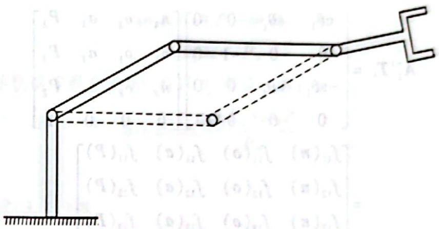

图 3.20 机器人运动学逆解多解性示意图

造成机器人运动学逆解具有多解的原因是由于解反三角函数方程产生的。对于一个真实的机器人, 只有一组解与实际情况对应, 为此必须做出判断, 以选择合适的解。通常采用剔除多余解的方法: 

1）根据关节运动空间来选择合适的解。 

2）选择一个最接近的解。 

3）根据避障要求选择合适的解。 

4）逐级剔除多余解。 

#### 二、可解性

能否求得机器人运动学逆解的解析式是机器人的可解性问题。 

所有具有转动和移动关节的机器人系统,在一个单一串联链中共有6个自由度(或小于6个自由度)时是可解的。其通解是数值解,不是解析表达式,是利用数值迭代原理求解得到的,其计算量比求解析解大得多。要使机器人有解析解,设计时就要使机器人的结构尽量简单,而且尽量满足有若干个相交的关节轴或许多 $\alpha_{i}$ 等于 $0^{\circ}$ 或 $\pm90^{\circ}$ 的特殊条件。 

对于逆运动学的求解, 虽然通过式(3.24)可得到 12 个方程式, 但不能对 12 个方程式联立求解, 而是用一系列变换矩阵的逆矩阵 $A_{i}^{-1}$ 左乘, 然后找出右端为常数的元素, 并令这些元素与左端元素相等, 这样就可以得出一个可以求解的三角函数方程式。 

### 3.5.2 逆向运动学求解实例

例 3.10 已知例 3.8 中斯坦福机器人末端执行器的位姿, 求其逆向运动学解。 

解 已知例3.8中斯坦福机器人的 

$$
T _ {6} = \left[ \begin{array}{c c c c} n _ {X} & o _ {X} & a _ {X} & P _ {X} \\ n _ {Y} & o _ {Y} & a _ {Y} & P _ {Y} \\ n _ {Z} & o _ {Z} & a _ {Z} & P _ {Z} \\ 0 & 0 & 0 & 1 \end{array} \right]\tag{3.25}
$$

由机器人运动学可知 

$$
T _ {6} = A _ {1} A _ {2} A _ {3} A _ {4} A _ {5} A _ {6}\tag{3.26}
$$

(1) 求 $\theta_{1}$ 

用 $A_{1}^{-1}$ 左乘式(3.26)，得 

$$
\boldsymbol {A} _ {1} ^ {- 1} \boldsymbol {T} _ {6} = \boldsymbol {A} _ {2} \boldsymbol {A} _ {3} \boldsymbol {A} _ {4} \boldsymbol {A} _ {5} \boldsymbol {A} _ {6} = ^ {1} \boldsymbol {T} _ {6}\tag{3.27}
$$

式中： 

$$
\boldsymbol {A} _ {1} ^ {- 1} \boldsymbol {T} _ {6} = \left[ \begin{array}{c c c c} \mathrm{c} \theta_ {1} & \mathrm{s} \theta_ {1} & 0 & 0 \\ 0 & 0 & - 1 & 0 \\ - \mathrm{s} \theta_ {1} & \mathrm{c} \theta_ {1} & 0 & 0 \\ 0 & 0 & 0 & 1 \end{array} \right] \left[ \begin{array}{c c c c} n _ {X} & o _ {X} & a _ {X} & P _ {X} \\ n _ {Y} & o _ {Y} & a _ {Y} & P _ {Y} \\ n _ {Z} & o _ {Z} & a _ {Z} & P _ {Z} \\ 0 & 0 & 0 & 1 \end{array} \right]
$$

$$
= \left[ \begin{array}{c c c c} f _ {1 1} (\boldsymbol {n}) & f _ {1 1} (\boldsymbol {o}) & f _ {1 1} (\boldsymbol {a}) & f _ {1 1} (\boldsymbol {P}) \\ f _ {1 2} (\boldsymbol {n}) & f _ {1 2} (\boldsymbol {o}) & f _ {1 2} (\boldsymbol {a}) & f _ {1 2} (\boldsymbol {P}) \\ f _ {1 3} (\boldsymbol {n}) & f _ {1 3} (\boldsymbol {o}) & f _ {1 3} (\boldsymbol {a}) & f _ {1 3} (\boldsymbol {P}) \\ 0 & 0 & 0 & 1 \end{array} \right]\tag{3.28}
$$

式中： $f_{11}(i) = c\theta_1i_X + s\theta_1i_Y;f_{12}(i) = -i_Z;f_{13}(i) = -s\theta_1i_X + c\theta_1i_Y;i = n,o,a$ 

$^{1}T_{6}=A_{2}A_{3}A_{4}A_{5}A_{6}$ 

$$
= \left[ \begin{array}{c c} \mathrm{c} \theta_ {2} (\mathrm{c} \theta_ {4} \mathrm{c} \theta_ {5} \mathrm{c} \theta_ {6} - \mathrm{s} \theta_ {4} \mathrm{s} \theta_ {6}) - \mathrm{s} \theta_ {2} \mathrm{s} \theta_ {5} \mathrm{c} \theta_ {6} & - \mathrm{c} \theta_ {2} (\mathrm{c} \theta_ {4} \mathrm{c} \theta_ {5} \mathrm{s} \theta_ {6} + \mathrm{s} \theta_ {4} \mathrm{s} \theta_ {6}) + \mathrm{s} \theta_ {2} \mathrm{s} \theta_ {5} \mathrm{s} \theta_ {6} \\ \mathrm{s} \theta_ {2} (\mathrm{c} \theta_ {4} \mathrm{c} \theta_ {5} \mathrm{c} \theta_ {6} - \mathrm{s} \theta_ {4} \mathrm{s} \theta_ {6}) + \mathrm{c} \theta_ {2} \mathrm{s} \theta_ {5} \mathrm{c} \theta_ {6} & - \mathrm{s} \theta_ {2} (\mathrm{c} \theta_ {4} \mathrm{c} \theta_ {5} \mathrm{s} \theta_ {6} + \mathrm{s} \theta_ {4} \mathrm{c} \theta_ {6}) - \mathrm{c} \theta_ {2} \mathrm{s} \theta_ {5} \mathrm{s} \theta_ {6} \\ \mathrm{s} \theta_ {4} \mathrm{c} \theta_ {5} \mathrm{c} \theta_ {6} + \mathrm{c} \theta_ {4} \mathrm{s} \theta_ {6} & - \mathrm{s} \theta_ {4} \mathrm{c} \theta_ {5} \mathrm{s} \theta_ {6} + \mathrm{c} \theta_ {4} \mathrm{c} \theta_ {6} \\ 0 & 0 \end{array} \right]
$$

$$
\left. \begin{array}{l l} \mathrm{c} \theta_ {2} \mathrm{c} \theta_ {4} \mathrm{s} \theta_ {5} + \mathrm{s} \theta_ {2} \mathrm{c} \theta_ {5} & \mathrm{s} \theta_ {2} d _ {3} \\ \mathrm{s} \theta_ {2} \mathrm{c} \theta_ {4} \mathrm{s} \theta_ {5} - \mathrm{c} \theta_ {2} \mathrm{c} \theta_ {5} & - \mathrm{c} \theta_ {2} d _ {3} \\ \mathrm{s} \theta_ {4} \mathrm{s} \theta_ {5} & d _ {2} \\ 0 & 1 \end{array} \right]\tag{3.29}
$$

式(3.29)中第3行、第4列的元素为常数,把对应的元素等同起来,可得 

$$
f _ {1 3} (P) = d _ {2}\tag{3.30}
$$

$$
- \mathrm{s} \theta_ {1} P _ {x} + \mathrm{c} \theta_ {1} P _ {y} = d _ {2}\tag{3.31}
$$

采用三角代换 

$$
P _ {x} = \rho \cos \varphi , \quad P _ {y} = \rho \sin \varphi
$$

式中： $\rho=\sqrt{P_{x}^{2}+P_{y}^{2}}$ ; $\varphi=\arctan2(P_{y},P_{x})$ 。 

进行三角代换后,可解得 

(25.6) 

$$
\begin{array}{r l} \sin (\varphi - \theta_ {1}) & = \frac {d _ {2}}{\rho}, \quad \cos (\varphi - \theta_ {1}) = \pm \sqrt {1 - \left(\frac {d _ {2}}{\rho}\right) ^ {2}} \\ \varphi - \theta_ {1} & = \arctan 2 \left[ \frac {d _ {2}}{\rho}, \pm \sqrt {1 - \left(\frac {d _ {2}}{\rho}\right) ^ {2}} \right] \\ \theta_ {1} & = \arctan 2 (P _ {Y}, P _ {X}) - \arctan 2 (d _ {2}, \pm \sqrt {P _ {X} + P _ {Y} - d _ {2} ^ {2}}) \end{array}\tag{3.32}
$$

式中：正、负号对应的两个解对应于 $\theta_{1}$ 的两个可能解。 

(2) 求 $\theta_{2}$ 

根据前述原则,用 $A_{2}^{-1}$ 左乘方程式(3.27),得 

$$
\boldsymbol {A} _ {2} ^ {- 1} \boldsymbol {A} _ {1} ^ {- 1} \boldsymbol {T} _ {6} = \boldsymbol {A} _ {3} \boldsymbol {A} _ {4} \boldsymbol {A} _ {5} \boldsymbol {A} _ {6}\tag{3.33}
$$

查找右边的元素,这些元素是各关节的函数。计算矩阵后可知,第1行、第4列和第2行、第4列是 $s\theta_{2}d_{3}$ 的函数,因此可得 

(φ4.ε) 

$$
\mathbf {s} \theta_ {2} d _ {3} = \mathbf {c} \theta_ {1} P _ {X} + \mathbf {s} \theta_ {1} P _ {Y}\tag{3.34}
$$

$$
- \mathrm{c} \theta_ {2} d _ {3} = - P _ {z}\tag{3.35}
$$

由于 $d_{3}$ 大于0（棱形导轨的伸展大于0），所以 $\theta_{2}$ 有唯一解： 

$$
\theta_ {2} = \arctan \frac {\mathrm{c} \theta_ {1} P _ {x} + \mathrm{s} \theta_ {1} P _ {y}}{P _ {z}}\tag{3.36}
$$

(3) 求 $d_{3}$ 

用 $A_{3}^{-1}$ 左乘方程式(3.33)得 

(02.8) 

$$
\boldsymbol {A} _ {3} ^ {- 1} \boldsymbol {A} _ {2} ^ {- 1} \boldsymbol {A} _ {1} ^ {- 1} \boldsymbol {T} _ {6} = \boldsymbol {A} _ {4} \boldsymbol {A} _ {5} \boldsymbol {A} _ {6}\tag{3.37}
$$

因已经求得 $\theta_{1},\theta_{2}$ ，故 $\mathrm{s}\theta_1,\mathrm{c}\theta_1,\mathrm{s}\theta_2,\mathrm{c}\theta_2$ 的值为已知。计算式(3.37)，令第3行、第4列元素相等，可以得到 $d_{3}$ 的方程式： 

$$
d _ {3} = \mathrm{s} \theta_ {2} (\mathrm{c} \theta_ {1} P _ {x} + \mathrm{s} \theta_ {1} P _ {y}) + \mathrm{c} \theta_ {2} P _ {z}\tag{3.38}
$$

(4) 求 $\theta_{4}$ 

用 $A_{4}^{-1}$ 左乘式(3.37)，得 

$$
\boldsymbol {A} _ {4} ^ {- 1} \boldsymbol {A} _ {3} ^ {- 1} \boldsymbol {A} _ {2} ^ {- 1} \boldsymbol {A} _ {1} ^ {- 1} \boldsymbol {T} _ {6} = \boldsymbol {A} _ {5} \boldsymbol {A} _ {6}\tag{3.39}
$$

计算矩阵式,因右端第3行、第3列元素为0,令左、右第3行、第3列元素相等,有 

$$
- \mathrm{s} \theta_ {4} \left[ \mathrm{c} \theta_ {2} \left(\mathrm{c} \theta_ {1} a _ {X} + \mathrm{s} \theta_ {1} a _ {Z}\right) - \mathrm{s} \theta_ {2} a _ {Y} \right] + \mathrm{c} \theta_ {4} \left(- \mathrm{s} \theta_ {1} a _ {X} + \mathrm{c} \theta_ {1} a _ {Y}\right) = 0
$$

解得 

(3.40) 

$$
\theta_ {4} = \arctan 2 \left[ - s \theta_ {1} a _ {X} + c \theta_ {1} a _ {Y}, c \theta_ {2} (c \theta_ {1} a _ {X} + s \theta_ {1} a _ {Y}) - s \theta_ {2} a _ {Z} \right]\tag{3.41}
$$

(5) 求 $\theta_{5}$ 

用 $A_{5}^{-1}$ 左乘式(3.39)，得 

$$
\boldsymbol {A} _ {5} ^ {- 1} \boldsymbol {A} _ {4} ^ {- 1} \boldsymbol {A} _ {3} ^ {- 1} \boldsymbol {A} _ {2} ^ {- 1} \boldsymbol {A} _ {1} ^ {- 1} \boldsymbol {T} _ {6} = \boldsymbol {A} _ {6}\tag{3.42}
$$

根据式(3.42)左、右两边对应的元素,可以得到 $s\theta_{5}$ 、 $c\theta_{5}$ 的方程,即 

$$
\mathrm{s} \theta_ {5} = \mathrm{c} \theta_ {4} \left[ \mathrm{c} \theta_ {2} \left(\mathrm{c} \theta_ {1} a _ {X} + \mathrm{s} \theta_ {1} a _ {Y}\right) - \mathrm{s} \theta_ {2} a _ {Z} \right] + \mathrm{s} \theta_ {4} \left(- \mathrm{s} \theta_ {1} a _ {X} + \mathrm{c} \theta_ {1} a _ {Y}\right)\tag{3.43}
$$

$$
\mathrm{c} \theta_ {5} = \mathrm{s} \theta_ {2} (\mathrm{c} \theta_ {1} a _ {X} + \mathrm{s} \theta_ {1} a _ {Y}) + \mathrm{c} \theta_ {2} a _ {Z}\tag{3.44}
$$

解得 

$$
\begin{array}{r l} \theta_ {5} & = \arctan 2 \left\{\mathrm{c} \theta_ {4} \left[ \mathrm{c} \theta_ {2} (\mathrm{c} \theta_ {1} a _ {X} + \mathrm{s} \theta_ {1} a _ {Y}) - \mathrm{s} \theta_ {2} a _ {Z} \right] + \mathrm{s} \theta_ {4} (- \mathrm{s} \theta_ {1} a _ {X} + \mathrm{c} \theta_ {1} a _ {Y}), \right. \\ & \left. \mathrm{s} \theta_ {2} (\mathrm{c} \theta_ {1} a _ {X} + \mathrm{s} \theta_ {1} a _ {Y}) + \mathrm{c} \theta_ {2} a _ {Z} \right\} \end{array}\tag{3.45}
$$

(6) 求 $\theta_{6}$ 

根据式(3.42)左、右两边对应的元素,可以得到 $s\theta_{6}$ 、 $c\theta_{6}$ 的表达式: 

$$
\begin{array}{r l} \mathrm{s} \theta_ {6} & = - \mathrm{c} \theta_ {5} \left\{\mathrm{c} \theta_ {4} \left[ \mathrm{c} \theta_ {2} (\mathrm{c} \theta_ {1} o _ {X} + \mathrm{s} \theta_ {1} o _ {Y}) - \mathrm{s} \theta_ {2} o _ {Z} \right] + \mathrm{s} \theta_ {4} (- \mathrm{s} \theta_ {1} o _ {X} + \mathrm{c} \theta_ {1} o _ {Y}) \right\} + \\ & \quad \mathrm{s} \theta_ {5} \left[ \mathrm{s} \theta_ {2} (\mathrm{c} \theta_ {1} o _ {X} + \mathrm{s} \theta_ {1} o _ {Y}) + \mathrm{c} \theta_ {2} o _ {Z} \right] \end{array}\tag{3.46}
$$

$$
\mathrm{c} \theta_ {6} = - \mathrm{s} \theta_ {4} \left[ \mathrm{c} \theta_ {2} \left(\mathrm{c} \theta_ {1} o _ {\mathrm{x}} + \mathrm{s} \theta_ {1} o _ {\mathrm{y}}\right) - \mathrm{s} \theta_ {2} o _ {\mathrm{z}} \right] + \mathrm{c} \theta_ {4} \left(- \mathrm{s} \theta_ {1} o _ {\mathrm{x}} + \mathrm{c} \theta_ {1} o _ {\mathrm{y}}\right)\tag{3.47}
$$

解得 

$$
\theta_ {6} = \arctan 2 (\mathrm{s} \theta_ {6}, \mathrm{c} \theta_ {6})\tag{3.48}
$$

例 3.11 求例 3.9 中的 PUMA 560 型机器人的逆向运动学解。 

解 将 PUMA 560 型机器人的运动方程为 

$$
T _ {t} = \left[ \begin{array}{c c c c} n _ {I} & o _ {I} & a _ {I} & P _ {I} \\ n _ {\gamma} & o _ {\gamma} & a _ {\gamma} & P _ {\gamma} \\ n _ {z} & o _ {z} & a _ {z} & P _ {z} \\ 0 & 0 & 0 & 1 \end{array} \right] = A _ {1} A _ {2} A _ {3} A _ {4} A _ {5} A _ {6}\tag{3.49}
$$

因末端执行器的位姿已经给定,则 n、o、a 和 P 为已知,为求关节变量 $\theta_{1}, \theta_{2}, \cdots, \theta_{6}$ ,用未知的连杆逆变换左乘方程式两边,把关节变量分离出来,从而求解。 

(1) 求 $\theta_{1}$ 

用 $A_{1}^{-1}$ 左乘式(3.49)，得 

$$
A _ {1} ^ {- 1} T _ {6} = A _ {2} A _ {3} A _ {4} A _ {5} A _ {6} = ^ {1} T _ {6}\tag{3.50}
$$

式中： 

$$
A _ {1} ^ {- 1} T _ {6} = \left[ \begin{array}{c c c c} \mathrm{c} \theta_ {1} & \mathrm{s} \theta_ {1} & 0 & 0 \\ 0 & 0 & - 1 & 0 \\ - \mathrm{s} \theta_ {1} & \mathrm{c} \theta_ {1} & 0 & 0 \\ 0 & 0 & 0 & 1 \end{array} \right] \left[ \begin{array}{c c c c} n _ {x} & o _ {x} & a _ {x} & P _ {x} \\ n _ {y} & o _ {y} & a _ {y} & P _ {y} \\ n _ {z} & o _ {z} & a _ {z} & P _ {z} \\ 0 & 0 & 0 & 1 \end{array} \right]
$$

$$
= \left[ \begin{array}{c c c c} f _ {1 1} (\boldsymbol {n}) & f _ {1 1} (\boldsymbol {o}) & f _ {1 1} (\boldsymbol {a}) & f _ {1 1} (\boldsymbol {P}) \\ f _ {1 2} (\boldsymbol {n}) & f _ {1 2} (\boldsymbol {o}) & f _ {1 2} (\boldsymbol {a}) & f _ {1 2} (\boldsymbol {P}) \\ f _ {1 3} (\boldsymbol {n}) & f _ {1 3} (\boldsymbol {o}) & f _ {1 3} (\boldsymbol {a}) & f _ {1 3} (\boldsymbol {P}) \\ 0 & 0 & 0 & 1 \end{array} \right]\tag{3.51}
$$

式中： $f_{11}(i) = \mathrm{c}\theta_1i_X + \mathrm{s}\theta_1i_Y;f_{12}(i) = -i_Z;f_{13}(i) = -\mathrm{s}\theta_1i_X + \mathrm{c}\theta_1i_Y;i = n,o,a$ 

式(3.51)中第3行、第4列的元素为常数,把对应的元素等同起来,可得 

$$
\begin{array}{r l} & f _ {1 3} (\boldsymbol {P}) = d _ {2} \\ & - \mathrm{s} \theta_ {1} P _ {x} + \mathrm{c} \theta_ {1} P _ {y} = d _ {2} \end{array}\tag{3.52}
$$

采用三角代换 

(3.53) 

$$
P _ {x} = \rho \cos \varphi , \quad P _ {\gamma} = \rho \sin \varphi\tag{3.54}
$$

式中： $\rho=\sqrt{P_{x}^{2}+P_{y}^{2}}$ ； $\varphi=\arctan2(P_{y},P_{x})$ 。 

进行三角代换后,可解得 

$$
\begin{array}{r l} \sin (\varphi - \theta_ {1}) & = \frac {d _ {2}}{\rho}, \quad \cos (\varphi - \theta_ {1}) = \pm \sqrt {1 - \left(\frac {d _ {2}}{\rho}\right) ^ {2}} \\ \varphi - \theta_ {1} & = \arctan 2 \left[ \frac {d _ {2}}{\rho}, \pm \sqrt {1 - \left(\frac {d _ {2}}{\rho}\right) ^ {2}} \right] \\ \theta_ {1} & = \arctan 2 (P _ {Y}, P _ {X}) - \arctan 2 (d _ {2}, \pm \sqrt {P _ {X} + P _ {Y} - d _ {2} ^ {2}}) \end{array}\tag{3.55}
$$

式中：正、负号对应的两个解对应于 $\theta_{1}$ 的两个可能解。 

(2) 求 $\theta_{1}$ 

在确定 $\theta_{1}$ 的一个解之后, 再令矩阵方程(3.51)两端第 1 行、第 4 列及第 3 行、第 4 列的元素分别对应相等, 则可得到下面的两个方程: 

$$
\mathrm{c} \theta_ {1} P _ {x} + \mathrm{s} \theta_ {1} P _ {y} = a _ {3} c _ {2 3} - d _ {4} s _ {2 3} + a _ {2} \mathrm{c} \theta_ {2}\tag{3.56}
$$

$$
- P _ {z} = a _ {1} s _ {2 3} + d _ {4} c _ {2 3} + a _ {2} \mathrm{s} \theta_ {2}\tag{3.57}
$$

求式(3.56)和式(3.57)的平方和,得 

$$
a _ {3} c \theta_ {3} - d _ {4} s \theta_ {3} = \frac {P _ {x} ^ {2} + P _ {y} ^ {2} + P _ {z} ^ {2} - a _ {2} ^ {2} - a _ {3} ^ {2} - d _ {2} ^ {2} - d _ {4} ^ {2}}{2 a _ {2}}\tag{3.58}
$$

令 $k = \frac{P_X^2 + P_Y^2 + P_Z^2 - a_2^2 - a_3^2 - d_2^2 - d_4^2}{2a_2}$ , 求解式(3.58), 可得 

$$
\theta_ {3} = \arctan 2 (a _ {3}, d _ {4}) - \arctan 2 (k, \pm \sqrt {a _ {3} ^ {2} + d _ {4} ^ {2} - k ^ {2}})\tag{3.59}
$$

(3) 求 $\theta_{2}$ 

把前面求出的 $\theta_{1}$ 、 $\theta_{3}$ 代入 $A_{1}$ 、 $A_{3}$ 中，再在矩阵方程两边依次左乘 $A_{1}^{-1}$ 、 $A_{2}^{-1}$ 、 $A_{3}^{-1}$ ，得 

$$
A _ {3} ^ {- 1} A _ {2} ^ {- 1} A _ {1} ^ {- 1} T _ {6} = A _ {4} A _ {5} A _ {6} = ^ {3} T _ {6}\tag{3.60}
$$

$$
\left[ \begin{array}{c c c c} \mathrm{c} \theta_ {1} c _ {2 3} & \mathrm{s} \theta_ {1} c _ {2 3} & - s _ {2 3} & a _ {2} \mathrm{c} \theta_ {3} \\ - \mathrm{c} \theta_ {1} s _ {2 3} & - \mathrm{s} \theta_ {1} s _ {2 3} & - c _ {2 3} & a _ {2} \mathrm{s} \theta_ {3} \\ - \mathrm{s} \theta_ {1} & \mathrm{c} \theta_ {1} & 0 & - d _ {2} \\ 0 & 0 & 0 & 1 \end{array} \right] \left[ \begin{array}{c c c c} n _ {x} & o _ {x} & a _ {x} & P _ {x} \\ n _ {\gamma} & o _ {\gamma} & a _ {\gamma} & P _ {\gamma} \\ n _ {z} & o _ {z} & a _ {z} & P _ {z} \\ 0 & 0 & 0 & 1 \end{array} \right] = A _ {4} A _ {5} A _ {6}\tag{3.61}
$$

把例 3.10 中的参数代入计算,令矩阵两边第 1 行、第 4 列及第 2 行、第 4 列的元素分别对应相等,可得 

$$
\mathrm{c} \theta_ {1} c _ {2 3} P _ {x} + \mathrm{s} \theta_ {1} c _ {2 3} P _ {y} - s _ {2 3} P _ {z} - a _ {2} \mathrm{c} \theta_ {3} = a _ {3}
$$

$$
- c \theta_ {1} s _ {2 3} P _ {x} - s \theta_ {1} s _ {2 3} P _ {y} - c _ {2 3} P _ {z} + a _ {2} s \theta_ {3} = d _ {4}\tag{3.62}
$$

求解上两式,解得 

(3.63) 

$$
s _ {2 3} = \frac {\left(- a _ {3} - a _ {2} c \theta_ {3}\right) P _ {Z} + \left(c \theta_ {1} P _ {X} + s \theta_ {1} P _ {Y}\right) \left(a _ {2} s \theta_ {3} - d _ {4}\right)}{P _ {Z} ^ {2} + \left(c \theta_ {1} P _ {X} + s \theta_ {1} P _ {Y}\right) ^ {2}}\tag{3.64}
$$

$$
c _ {2 3} = \frac {\left(- d _ {4} - a _ {2} \mathrm{s} \theta_ {3}\right) P _ {z} - \left(\mathrm{c} \theta_ {1} P _ {x} + \mathrm{s} \theta_ {1} P _ {y}\right) \left(- a _ {2} \mathrm{c} \theta_ {3} - a _ {3}\right)}{P _ {z} ^ {2} + \left(\mathrm{c} \theta_ {1} P _ {x} + \mathrm{s} \theta_ {1} P _ {y}\right) ^ {2}}\tag{3.65}
$$

由于 $s_{21}$ 和 $c_{23}$ 表达式的分母相等且为正, 可得 

$$
\begin{array}{r l} \theta_ {2 3} & = \theta_ {2} + \theta_ {3} \\ & = \arctan 2 \left[ - (a _ {3} + a _ {2} c \theta_ {3}) P _ {z} + (c \theta_ {1} P _ {x} + s \theta_ {1} P _ {y}) (a _ {2} s \theta_ {3} - d _ {4}), \right. \\ & \left. (- d _ {4} + a _ {2} s \theta_ {3}) P _ {z} + (c \theta_ {1} P _ {x} + s \theta_ {1} P _ {y}) (a _ {2} c \theta_ {3} + a _ {3}) \right] \end{array}\tag{3.66}
$$

根据 $\theta_{1}$ 和 $\theta_{3}$ 解的四种组合，可以解得 $\theta_{23}$ 的四种可能值，亦即 $\theta_{2}$ 有四种可能解： 

$$
\theta_ {2} = \theta_ {2 3} - \theta_ {3}
$$

(4) 求 $\theta_{4}$ 

(3.67) 

式(3.61)左边均为已知,令其两边的第1行、第3列及第3行、第3列元素对应相等,可得 

$$
\mathrm{c} \theta_ {1} c _ {2 3} a _ {x} + \mathrm{s} \theta_ {1} c _ {2 3} a _ {y} - s _ {2 3} a _ {z} = - \mathrm{c} \theta_ {4} \mathrm{s} \theta_ {5}\tag{3.68}
$$

$$
- \mathrm{s} \theta_ {1} a _ {\mathrm{x}} + \mathrm{c} \theta_ {1} a _ {\mathrm{y}} = \mathrm{s} \theta_ {4} \mathrm{s} \theta_ {5}\tag{3.69}
$$

如果 $\mathbf{s}\theta_{3} \neq 0$ ，即可求出 

$$
\theta_ {4} = \arctan 2 (- s \theta_ {1} a _ {x} + c \theta_ {1} a _ {y}, - c \theta_ {1} c _ {2 3} a _ {x} - s \theta_ {1} c _ {2 3} a _ {y} + s _ {2 3} a _ {z})\tag{3.70}
$$

#### (5) 求 $\theta_{s}$

将式(3.60)两端左乘 $A_{4}^{-1}$ ，得 

$$
\boldsymbol {A} _ {4} ^ {- 1} \boldsymbol {A} _ {3} ^ {- 1} \boldsymbol {A} _ {2} ^ {- 1} \boldsymbol {A} _ {1} ^ {- 1} \boldsymbol {T} _ {6} = \boldsymbol {A} _ {5} \boldsymbol {A} _ {6}\tag{3.71}
$$

把 $\theta_{1},\theta_{2},\theta_{3},\theta_{4}$ 的值代入左边，根据两边第1行、第3列及第3行、第3列的元素对应相等，可得 

$$
\left(\mathrm{c} \theta_ {1} \mathrm{c} _ {2 3} \mathrm{c} \theta_ {4} + \mathrm{s} \theta_ {1} \mathrm{s} \theta_ {4}\right) a _ {X} + \left(\mathrm{s} \theta_ {1} \mathrm{c} _ {2 3} \mathrm{c} \theta_ {4} - \mathrm{c} \theta_ {1} \mathrm{s} \theta_ {4}\right) a _ {Y} - s _ {2 3} \mathrm{c} \theta_ {4} a _ {Z} = - \mathrm{s} \theta_ {5}\tag{3.72}
$$

$$
- \mathrm{c} \theta_ {1} s _ {2 3} a _ {X} - \mathrm{s} \theta_ {1} s _ {2 3} a _ {Y} - c _ {2 3} a _ {Z} = \mathrm{c} \theta_ {5}\tag{3.73}
$$

解得 

$$
\theta_ {s} = \arctan 2 (s \theta_ {s}, c \theta_ {s})\tag{3.74}
$$

(6) 求解 $\theta_{6}$ 

将式(3.71)两边左乘 $A_{5}^{-1}$ ，得 

$$
\boldsymbol {A} _ {5} ^ {- 1} \boldsymbol {A} _ {4} ^ {- 1} \boldsymbol {A} _ {3} ^ {- 1} \boldsymbol {A} _ {2} ^ {- 1} \boldsymbol {A} _ {1} ^ {- 1} \boldsymbol {T} _ {6} = \boldsymbol {A} _ {6}\tag{3.75}
$$

根据等式两边第3行、第1列及第1行、第1列的元素分别对应相等，得 

$$
- \left(\mathrm{c} \theta_ {1} c _ {2 3} \mathrm{s} \theta_ {4} - \mathrm{s} \theta_ {1} \mathrm{c} \theta_ {4}\right) n _ {X} - \left(\mathrm{s} \theta_ {1} c _ {2 3} \mathrm{s} \theta_ {4} + \mathrm{c} \theta_ {1} \mathrm{c} \theta_ {4}\right) n _ {Y} + s _ {2 3} \mathrm{s} \theta_ {4} n _ {Z} = \mathrm{s} \theta_ {6}\tag{3.76}
$$

$$
\left[ \left(\mathrm{c} \theta_ {1} c _ {2 3} \mathrm{c} \theta_ {4} + \mathrm{s} \theta_ {1} \mathrm{s} \theta_ {4}\right) \mathrm{c} \theta_ {5} - \mathrm{c} \theta_ {1} s _ {2 3} \mathrm{s} \theta_ {5} \right] n _ {X} + \left[ \left(\mathrm{s} \theta_ {1} c _ {2 3} \mathrm{c} \theta_ {4} - \mathrm{c} \theta_ {1} \mathrm{s} \theta_ {4}\right) \mathrm{c} \theta_ {5} - \right.
$$

$$
\left. \mathrm{s} \theta_ {1} s _ {2 3} \mathrm{s} \theta_ {5} \right] n _ {\mathrm{Y}} - \left(s _ {2 3} \mathrm{c} \theta_ {4} \mathrm{c} \theta_ {5} + c _ {2 3} \mathrm{s} \theta_ {5}\right) n _ {\mathrm{Z}} = \mathrm{c} \theta_ {6}\tag{3.77}
$$

解得 

$$
\theta_ {6} = \arctan 2 (\mathrm{s} \theta_ {6}, \mathrm{c} \theta_ {6})\tag{3.78}
$$

PUMA 560 型机器人的逆向运动学解存在 8 种可能,但由于结构的限制,有些解不能实现。在机器人存在多解的情况下,应选取其中最优的一组解。 

## 3.6 苹果采摘机械手运动学分析实例

苹果采摘机械手结构简图如图3.21所示,它是由3个旋转关节和2个移动关节组成的5自由度机械手,试应用前述D-H方法对其进行运动学分析,求机器人末端执行器的位姿。 

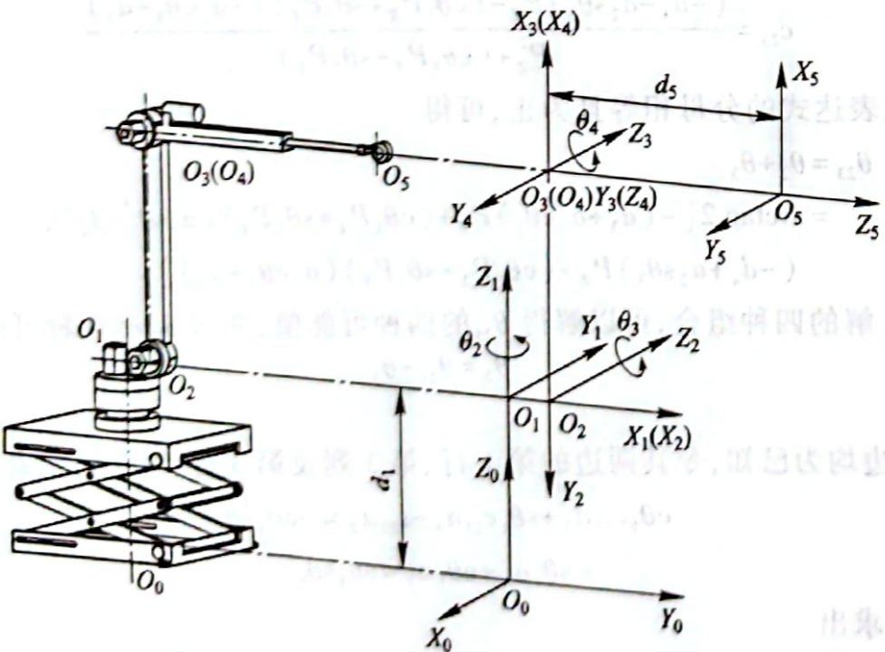

图 3.21 机械手 D-H 坐标系

### 1. 坐标系变换

以齐次坐标变换描述机器人相邻杆件的空间关系,则可通过以下步骤将 i 坐标系移动到 $i+1$ 坐标系: 

1) 绕 $Z_{i}$ 轴旋转 $\theta_{i}$ , 它使得 $X_{i}$ 和 $X_{i+1}$ 互相平行。 

2) 沿 $Z_{i}$ 轴平移 $d_{i}$ 距离，使得 $X_{i}$ 和 $X_{i+1}$ 共线。 

3) 沿 $X_{i+1}$ 轴平移 $a_{i+1}$ 距离，使得 $X_i$ 和 $X_{i+1}$ 的原点重合。 

4) 将 $Z_{i}$ 轴绕 $X_{i+1}$ 轴旋转 $\alpha_{i+1}$ , 使得 $Z_{i}$ 轴与 $Z_{i+1}$ 轴对准。 

### 2. 确定 D-H 参数

运用 D-H 方法, 结合图 3.21, 得到机械手的 D-H 参数(表 3.3)。根据 D-H 法则的规定, 确定连杆的坐标系位置。 

表 3.3 机械手的 D-H 参数

<table><tr><td>关节i</td><td><eq>\theta_i/(^\circ)</eq></td><td><eq>a_i/m</eq></td><td><eq>\alpha_i/(^\circ)</eq></td><td><eq>d_i/m</eq></td><td>关节变量范围</td></tr><tr><td>1</td><td>90</td><td>0</td><td>0</td><td><eq>d_1</eq></td><td><eq>d_1(0.84~1.84mm)</eq></td></tr><tr><td>2</td><td><eq>\theta_2</eq></td><td>0.133</td><td>-90</td><td>0</td><td><eq>\theta_2(-180^\circ~180^\circ)</eq></td></tr><tr><td>3</td><td><eq>\theta_3</eq></td><td>1</td><td>0</td><td>0</td><td><eq>\theta_3(-36^\circ~-142^\circ)</eq></td></tr><tr><td>4</td><td><eq>\theta_4</eq></td><td>0</td><td>-90</td><td>0</td><td><eq>\theta_4(-180^\circ~180^\circ)</eq></td></tr><tr><td>5</td><td>0</td><td>0</td><td>0</td><td><eq>d_5</eq></td><td><eq>d_5(1~1.4m)</eq></td></tr></table>

机器人的正向运动学是根据机器人的各关节变量,求机器人末端操作装置的位姿。由建立的连杆 D-H 参数坐标系与 D-H 参数,可推导出连杆的 D-H 坐标变换矩阵: 

$$
{ } _ { 1 } ^ { 0 } \boldsymbol { T } = \left[ \begin{array} { c c c c } { { 0 } } & { { - 1 } } & { { 0 } } & { { 0 } } \\ { { 1 } } & { { 0 } } & { { 0 } } & { { 0 } } \\ { { 0 } } & { { 0 } } & { { 1 } } & { { d _ { 1 } } } \\ { { 0 } } & { { 0 } } & { { 0 } } & { { 1 } } \end{array} \right] , \quad { } _ { 2 } ^ { 1 } \boldsymbol { T } = \left[ \begin{array} { c c c c } { { c _ { 2 } } } & { { 0 } } & { { - s _ { 2 } } } & { { 0 . 1 3 3 c _ { 2 } } } \\ { { s _ { 2 } } } & { { 0 } } & { { c _ { 2 } } } & { { 0 . 1 3 3 s _ { 2 } } } \\ { { 0 } } & { { - 1 } } & { { 0 } } & { { 0 } } \\ { { 0 } } & { { 0 } } & { { 0 } } & { { 1 } } \end{array} \right] , \quad { } _ { 3 } ^ { 2 } \boldsymbol { T } = \left[ \begin{array} { c c c c } { { c _ { 3 } } } & { { - s _ { 3 } } } & { { 0 } } & { { c _ { 3 } } } \\ { { s _ { 3 } } } & { { c _ { 3 } } } & { { 0 } } & { { s _ { 3 } } } \\ { { 0 } } & { { 0 } } & { { 1 } } & { { 0 } } \\ { { 0 } } & { { 0 } } & { { 0 } } & { { 1 } } \end{array} \right] ,
$$

$$
{ } _ { 4 } ^ { 3 } \boldsymbol { T } = \left[ \begin{array} { c c c c } c _ { 4 } & 0 & - s _ { 4 } & 0 \\ s _ { 4 } & 0 & c _ { 4 } & 0 \\ 0 & - 1 & 0 & 0 \\ 0 & 0 & 0 & 1 \end{array} \right] , \quad { } _ { 5 } ^ { 4 } \boldsymbol { T } = \left[ \begin{array} { c c c c } 1 & 0 & 0 & 0 \\ 0 & 1 & 0 & 0 \\ 0 & 0 & 1 & d _ { 5 } \\ 0 & 0 & 0 & 1 \end{array} \right]
$$

运动学方程为 

$$
{ } _ { 5 } ^ { 0 } \boldsymbol { T } = { } _ { 1 } ^ { 0 } \boldsymbol { T } { } _ { 2 } ^ { 1 } \boldsymbol { T } { } _ { 3 } ^ { 2 } \boldsymbol { T } { } _ { 4 } ^ { 3 } \boldsymbol { T } { } _ { 5 } ^ { 4 } \boldsymbol { T } = \left[ \begin{array} { c c c c } n _ { X } & o _ { X } & a _ { X } & P _ { X } \\ n _ { Y } & o _ { Y } & a _ { Y } & P _ { Y } \\ n _ { Z } & o _ { Z } & a _ { Z } & P _ { Z } \\ 0 & 0 & 0 & 1 \end{array} \right]\tag{3.79}
$$

式中： $n_{X} = -s_{2}c_{34},o_{X} = c_{2},a_{X} = s_{2}s_{34},P_{X} = s_{2}s_{34}d_{5} - s_{2}c_{3} - 0.133s_{2},n_{Y} = c_{2}c_{34},o_{Y} = s_{2},a_{Y} = -c_{2}s_{34},P_{Y} = -c_{2}s_{34}d_{5}+$ $c_2c_3 + 0.133c_2,n_z = -s_{34},o_z = 0,a_z = -c_{34},P_z = -c_{34}d_5 - s_3 + d_1$ 。  
式中： $s_i = \mathbf{s}\theta_i = \sin \theta_i,c_i = c\theta_i = \cos \theta_i,s_{ij} = \sin (\theta_i + \theta_j),c_{ij} = \cos (\theta_i + \theta_j)$ 。 

### 3. 逆向运动学求解

根据给定基座坐标上的机械手末端执行器的位姿,求各关节变量的值,称为机械手逆运动学 问题。苹果采摘机械手的逆向运动学问题，即是已知连杆的结构参数和 $^{0}_{5}T$ 矩阵中的各个元素，求解相应的关节变量 $d_{1}$ 、 $\theta_{2}$ 、 $\theta_{3}$ 、 $\theta_{4}$ 、 $d_{5}$ 。 

由前已知： 

$$
c _ {2} = o _ {x}\tag{3.80}
$$

$$
s _ {2} s _ {3 4} = a _ {X}\tag{3.81}
$$

$$
s _ {2} s _ {3 4} d _ {5} - s _ {2} c _ {3} - 0. 1 3 3 s _ {2} = P _ {x}\tag{3.82}
$$

$$
s _ {2} = o _ {Y}\tag{3.83}
$$

$$
- c _ {2} s _ {3 4} = a _ {Y}\tag{3.84}
$$

$$
- c _ {2} s _ {3 4} d _ {5} + c _ {2} c _ {3} + 0. 1 3 3 c _ {2} = P _ {Y}\tag{3.85}
$$

$$
- c _ {3 4} = a _ {z}\tag{3.86}
$$

$$
- c _ {3 4} d _ {5} - s _ {3} + d _ {1} = P _ {z}\tag{3.87}
$$

(1) 求 $\theta_{2}$ 

由式(3.80)、式(3.83)得 

$$
\theta_ {2} = \arctan \frac {o _ {Y}}{o _ {X}}\tag{3.88}
$$

(2) 求 $\theta_{3}$ 、 $d_{5}$ 和 $d_{1}$ 

将式(3.80)~式(3.87)整合,可得 

$$
\left\{ \begin{array}{l} a _ {X} d _ {5} - o _ {Y} c _ {3} - 0. 1 3 3 o _ {Y} = P _ {X} \\ a _ {Y} d _ {5} + o _ {X} c _ {3} + 0. 1 3 3 o _ {X} = P _ {Y} \\ a _ {Z} d _ {5} - s _ {3} + d _ {1} = P _ {Z} \end{array} \right.\tag{3.89}
$$

即将对 $\theta_{3}$ 、 $d_{5}$ 和 $d_{1}$ 的求解问题转化为求方程组(3.89)的解。 

可以看出, $P_{Y}o_{Y}+o_{X}P_{X}=0$ ,即方程组(3.89)中前两个方程线性相关,所以方程组的解中存在自由变量,即 $\theta_{3}$ 、 $d_{5}$ 和 $d_{1}$ 没有确定解,但可以任取 $\theta_{3}$ 、 $d_{5}$ 和 $d_{1}$ 中任一个参数为自由变量,来表示其余两个参数。这也说明该机械手结构仅对位置点具有一定的位置冗余度,它可在一定程度上增强机械手的避障能力。 

例如：令 $d_{5}$ 为自由变量，则 

$$
c _ {3} = \frac {P _ {x}}{o _ {y}} + 0. 1 3 3 - \frac {a _ {x} d _ {5}}{o _ {y}} (o _ {y} \neq 0)
$$

即 $\theta_{3} = -\arccos \left(\frac{P_{X}}{o_{Y}} + 0.133 - \frac{a_{X}d_{5}}{o_{Y}}\right), d_{1} = P_{Z} - a_{Z}d_{5} + s_{3}$ 。 

下面讨论几种特殊情况的 $\theta_{3}$ 、 $d_{5}$ 和 $d_{1}$ 的解。 

① $o_{x}=0$ ，且 $n_{z}=-s_{34}=0$ 。 

由 $n_z = -s_{34} = 0$ 可得 

$$
\left\{ \begin{array}{l} a _ {Y} = - c _ {2} s _ {3 4} = - o _ {X} s _ {3 4} = 0 \\ a _ {X} = s _ {2} s _ {3 4} = 0 \end{array} \right.
$$

进而可求得 

$$
a _ {z} = \pm \sqrt {1 - a _ {\chi} ^ {2} - a _ {\gamma} ^ {2}} = \pm 1
$$

由 $\left\{ \begin{array}{l} o_{z} = 0 \\ o_{x} = 0 \end{array} \right.$ 可求得 

$$
o _ {Y} = \pm \sqrt {1 - o _ {X} ^ {2} - o _ {Z} ^ {2}} = \pm 1
$$

此时 $\theta_{3}$ 有确定解： 

$$
\theta_ {3} = - \arccos (P _ {x} - 0. 1 3 3) \quad \text {或} \quad \theta_ {3} = - \arccos (- P _ {x} - 0. 1 3 3)\tag{3.90}
$$

而 $d_{1}, d_{5}$ 满足如下对应关系, 没有确定解: 

$$
P _ {z} = \pm d _ {5} - \sqrt {1 - (P _ {x} - 0 . 1 3 3) ^ {2}} + d _ {1}\tag{3.91}
$$

$$
P _ {z} = \pm d _ {5} - \sqrt {1 - (- P _ {x} - 0 . 1 3 3) ^ {2}} + d _ {1}
$$

② $o_{Y}=0$ ，且 $n_{Z}=-s_{34}=0$ 。 

(3.92) 

由 $n_z = -s_{34} = 0$ 可得 

$$
\left\{ \begin{array}{l} a _ {Y} = - c _ {2} s _ {3 4} = - o _ {X} s _ {3 4} = 0 \\ a _ {X} = s _ {2} s _ {3 4} = 0 \end{array} \right.\tag{八、提案表决表}
$$

进而可求得 

$$
a _ {z} = \pm \sqrt {1 - a _ {X} ^ {2} - a _ {Y} ^ {2}} = \pm 1
$$

由 $\left\{\begin{aligned}o_{z}&=0\\ o_{y}&=0\end{aligned}\right.$ 可求得 

$$
\left[ \begin{array}{c c c c} 0. 0 & 0 0 0. 0 & 0 0 0. 0 & 0 0 0. 1 \\ 0. 0 1 & 0 0 2. 0 & \partial \partial \partial . 0 & 0 0 0. 0 \\ 0. 0 5 - & \partial \partial \partial . 0 & 0 0 2. 0 & 0 0 0. 0 \\ o _ {X} = \pm \sqrt {1 - o _ {X} ^ {2} - o _ {Z} ^ {2}} = \pm 1 \end{array} \right] =
$$

此时 $\theta_{3}$ 有确定解： 

$$
\theta_ {3} = - \arccos (P _ {Y} - 0. 1 3 3) \quad \text {或} \quad \theta_ {3} = - \arccos (- P _ {Y} - 0. 1 3 3)\tag{3.93}
$$

$d_{1}$ 、 $d_{5}$ 满足如下对应关系,没有确定解: 

$$
P _ {z} = \pm d _ {s} - \sqrt {1 - (P _ {Y} - 0 . 1 3 3) ^ {2}} + d _ {1}\tag{3.94}
$$

$$
P _ {z} = \pm d _ {5} - \sqrt {1 - (- P _ {y} - 0 . 1 3 3) ^ {2}} + d _ {1}\tag{3.95}
$$

③ $o_{X}\neq0,o_{Y}\neq0$ 且 $n_{Z}=-s_{34}=0$ 。 

此时, $c_{3}=\frac{P_{Y}}{o_{X}}-0.133=\frac{P_{X}}{o_{Y}}-0.133$ ,即 

$$
\theta_ {3} = - \arccos \left(\frac {P _ {Y}}{o _ {X}} - 0. 1 3 3\right)\tag{3.96}
$$

$d_{1},d_{5}$ 满足如下对应关系,没有确定解: 

$$
P _ {z} = \pm d _ {5} - \sqrt {1 - \left(\frac {P _ {Y}}{o _ {X}} - 0 . 1 3 3\right) ^ {2} + d _ {1}}\tag{3.97}
$$

以上这三种特殊情况, $\theta_{3}$ 均有确定解,而 $d_{1}$ 和 $d_{5}$ 分别满足相应的对应关系,说明机械手末端在此位姿时, $d_{1}$ 、 $d_{5}$ 的轴线在竖直方向上平行,机构整体丧失一个自由度,机构处于奇异位形。(3)求 $\theta_{4}$ 

由式(3.86)可得 

$$
\theta_ {4} = \arccos (- a _ {z}) - \theta_ {3}\tag{3.98}
$$

## 习题

：谢宝尚许，θ 

3.1 点矢量 v 为 $[10.00 \quad 20.00 \quad 30.00]^{T}$ ，相对参考系作如下齐次坐标变换： 

$$
\mathbf {A} = \left[ \begin{array}{c c c c} 0. 8 6 6 & - 0. 5 0 0 & 0. 0 0 0 & 1 1. 0 \\ 0. 5 0 0 & 0. 8 6 6 & 0. 0 0 0 & - 3. 0 \\ 0. 0 0 0 & 0. 0 0 0 & 1. 0 0 0 & 9. 0 \\ 0 & 0 & 0 & 1 \end{array} \right]
$$

写出变换后点矢量 v 的表达式，并说明是什么性质的变换，写出旋转算子 Rot 及平移算子 Trans。 

3.2 有一旋转变换,先绕固定坐标系 $Z_{0}$ 轴旋转 $45^{\circ}$ ,再绕其 $X_{0}$ 轴旋转 $30^{\circ}$ ,最后绕其 $Y_{0}$ 轴旋转 $60^{\circ}$ ,试求该齐次变换矩阵。 

3.3 坐标系 $|B|$ 起初与固定坐标系 $|O|$ 相重合，现坐标系 $|B|$ 绕 $Z_{B}$ 旋转 $30^{\circ}$ ，然后绕旋转后的动坐标系的 $X_{B}$ 轴旋转 $45^{\circ}$ ，试写出该坐标系 $|B|$ 的起始矩阵表达式和最后矩阵表达式。 

3.4 坐标系 $|A|$ 及 $|B|$ 在固定坐标系 $|O|$ 中的矩阵表达式为 

$$
\boldsymbol {A} = \left[ \begin{array}{c c c c} 1. 0 0 0 & 0. 0 0 0 & 0. 0 0 0 & 0. 0 \\ 0. 0 0 0 & 0. 8 6 6 & - 0. 5 0 0 & 1 0. 0 \\ 0. 0 0 0 & 0. 5 0 0 & 0. 8 6 6 & - 2 0. 0 \\ 0 & 0 & 0 & 1 \end{array} \right]
$$

$$
\boldsymbol {B} = \left[ \begin{array}{c c c c} 0. 8 6 6 & - 0. 5 0 0 & 0. 0 0 0 & - 3. 0 \\ 0. 4 3 3 & 0. 7 5 0 & - 0. 5 0 0 & - 3. 0 \\ 0. 2 5 0 & 0. 4 3 3 & 0. 8 6 6 & 3. 0 \\ 0 & 0 & 0 & 1 \end{array} \right]
$$

画出它们在 $|0|$ 坐标系中的位置和姿态。 

3.5 写出齐次变换矩阵 $_{B}^{A}H$ ，它表示坐标系 $|B|$ 连续相对固定坐标系 $|A|$ 作以下变换： 

(1) 绕 $Z_{A}$ 轴旋转 $90^{\circ}$ 。 

$$
_ {1} 0, 0 \neq_ {2} 0
$$

(2) 绕 $X_{A}$ 轴旋转 $-90^{\circ}$ 。 

(3) 移动 $[3\ 7\ 9]^{T}$ 。 

3.6 写出齐次变换矩阵 $_{B}^{B}H$ ，它表示坐标系 $|B|$ 连续相对自身运动坐标系 $|B|$ 作以下变换： 

(1) 移动 $[3\ 7\ 9]$ 。 

(2) 绕 $X_{B}$ 轴旋转 $90^{\circ}$ 。 

(3) 绕 $Z_{B}$ 轴旋转 $-90^{\circ}$ 

3.7 对于题 3.7 图 a 所示的两个楔形物体, 试用两个变换序列分别表示两个楔形物体的变换过程, 使最后的状态如题 3.7 图 b 所示。 

3.8 题 3.8 图所示的二自由度平面机械手, 关节 1 为转动关节, 关节变量为 $\theta_{1}$ ; 关节 2 为移动关节, 关节变量为 $d_{2}$ 。试: 

(1) 建立关节坐标系, 并写出该机械手的运动方程式。 

(2) 按下列关节变量参数求出手部中心的位置值。 

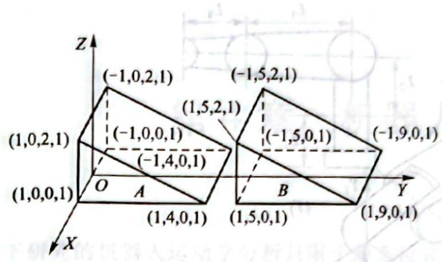

(a)

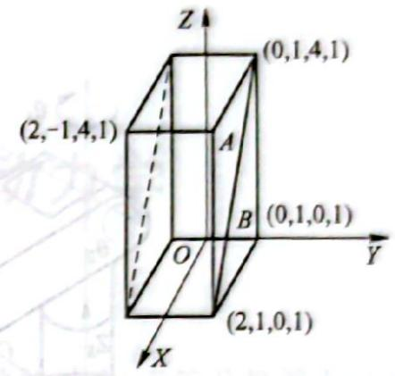

(b)

题3.7图

<table><tr><td><eq>\theta_1</eq></td><td>0°</td><td>30°</td><td>60°</td><td>90°</td></tr><tr><td><eq>d_2/m</eq></td><td>0.50</td><td>0.80</td><td>1.00</td><td>0.70</td></tr></table>

3.9 题 3.8 图所示二自由度平面机械手, 已知手部中心坐标值为 $X_0$ 、 $Y_0$ 。求该机械手运动学方程的逆解 $\theta_1$ 、 $d_2$ 。 

3.10 三自由度机械手如题3.10图所示，臂长为 $l_{1}$ 和 $l_{2}$ ，手部中心离手腕中心的距离为 $H$ ，转角为 $\theta_{1}, \theta_{2}, \theta_{3}$ ，试建立杆件坐标系，并推导出该机械手的运动学方程。 

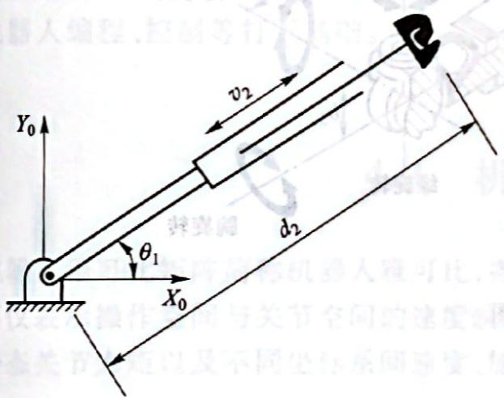

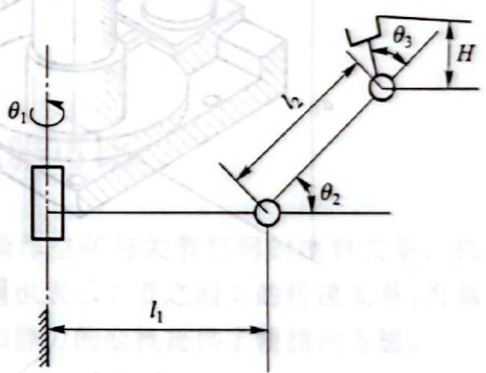

题3.8图

题3.10图

3.11 题 3.11 图所示为一个二自由度的机械手,两连杆长度均为 1 m,试建立各杆件坐标系,求出 $A_{1}$ 、 $A_{2}$ 及该机械手的运动学逆解。 

3.12 什么是机器人运动学逆解的多重性？ 

3.13 如题 3.13 图所示的三自由度机械手的机构, 各关节转角正向均由箭头所示方向指定, 请标出各连杆的 D-H 坐标系, 然后求各变换矩阵 $A_{1}$ 、 $A_{2}$ 、 $A_{3}$ 。 

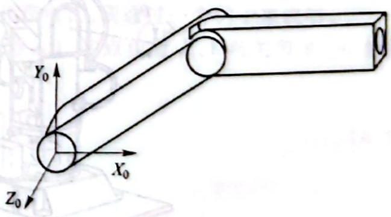

3.14 试按 D-H 坐标系建立题 3.14 图所示机器人各杆的坐标系(各 Z 轴正向位于有旋转标志一端)。 

3.15 试求题 3.15 图所示 V80 型机器人的运动学方程。 

题3.11图 

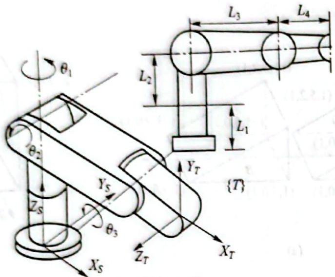

题3.13图

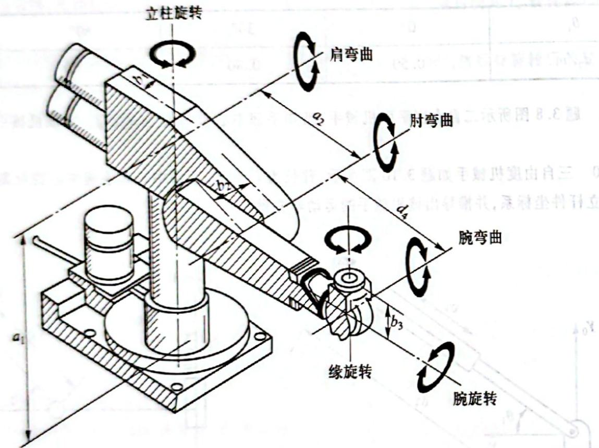

题3.14图

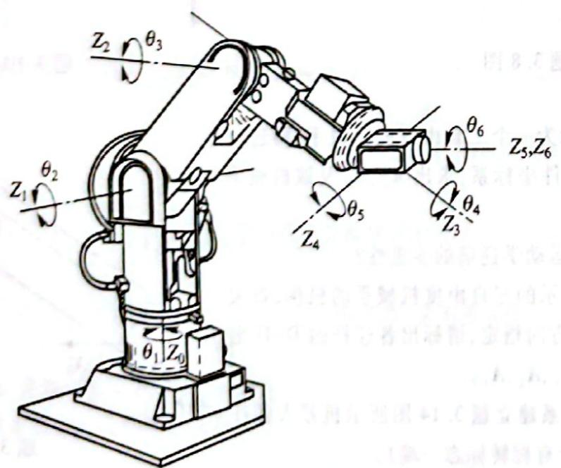

题3.15图
