# 第4章 机器人动力学

稳态下研究的机器人运动学分析只限于静态位置问题的讨论,未涉及机器人运动的力、速度、加速度等动态过程。实际上,机器人是一个复杂的动力学系统,机器人系统在外载荷和关节驱动力矩(驱动力)的作用下将取得静力平衡,在关节驱动力矩(驱动力)的作用下将发生运动变化。机器人的动态性能不仅与运动学因素有关,还与机器人的结构形式、质量分布、执行机构的位置、传动装置等对动力学产生重要影响的因素有关。 

机器人动力学主要研究机器人运动和受力之间的关系,目的是对机器人进行控制、优化设计和仿真。机器人动力学主要解决动力学正问题和逆问题两类问题:动力学正问题是根据各关节的驱动力(或力矩),求解机器人的运动(关节位移、速度和加速度),主要用于机器人的仿真;动力学逆问题是已知机器人关节的位移、速度和加速度,求解所需要的关节力(或力矩),是实时控制的需要。 

本章首先通过实例介绍与机器人速度和静力有关的雅可比矩阵,在机器人雅可比矩阵分析的基础上进行机器人的静力分析,讨论动力学的基本问题,对机器人的动态特性作简要论述,以便为机器人编程、控制等打下基础。 

## 4.1 机器人雅可比

机器人雅可比矩阵简称机器人雅可比，揭示了操作空间与关节空间的映射关系。机器人雅可比不仅表示操作空间与关节空间的速度映射关系，也表示二者之间力的传递关系，为确定机器人的静态关节力矩以及不同坐标系间速度、加速度和静力的变换提供了便捷的方法。 

### 4.1.1 机器人雅可比的定义

在机器人学中,雅可比是一个把关节速度矢量 $\dot{q}$ 变换为手爪相对基坐标的广义速度矢量 v 的变换矩阵。在机器人速度分析和静力分析中都将用到雅可比,现通过一个例子来说明。 

图4.1所示为二自由度平面关节型机器人(2R机器人)，端点位置 $X, Y$ 与关节 $\theta_{1}, \theta_{2}$ 的关系为 

$$
\left. \begin{array}{l} X = l _ {1} c \theta_ {1} + l _ {2} c _ {1 2} \\ Y = l _ {1} s \theta_ {1} + l _ {2} s _ {1 2} \end{array} \right\}\tag{4.1}
$$

$$
\left. \begin{array}{l} X = X \left(\theta_ {1}, \theta_ {2}\right) \\ Y = Y \left(\theta_ {1}, \theta_ {2}\right) \end{array} \right\}\tag{4.2}
$$

  

    <button type="button" class="is-active" data-figure-mode="original" aria-pressed="true">原图</button>
    <button type="button" data-figure-mode="interactive" aria-pressed="false">可交互</button>
  

  

    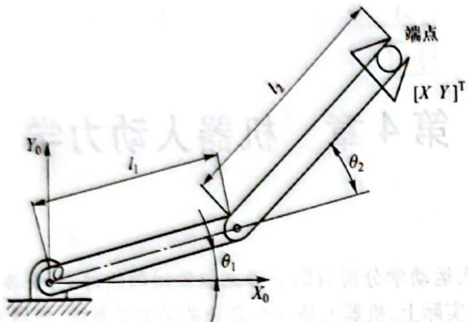
  

  

    
正在载入交互模型…

  

图4.1 二自由度平面关节型机器人简图（原图与交互示例）

求其微分得 

$$
\left\{ \begin{array}{l} \mathrm{d} X = \frac {\partial X}{\partial \theta_ {1}} \mathrm{d} \theta_ {1} + \frac {\partial X}{\partial \theta_ {2}} \mathrm{d} \theta_ {2} \\ \mathrm{d} Y = \frac {\partial Y}{\partial \theta_ {1}} \mathrm{d} \theta_ {1} + \frac {\partial Y}{\partial \theta_ {2}} \mathrm{d} \theta_ {2} \end{array} \right.
$$

将其写成矩阵形式为 

$$
\left[ \begin{array}{l} \mathrm{d} X \\ \mathrm{d} Y \end{array} \right] = \left[ \begin{array}{l l} \frac {\partial X}{\partial \theta_ {1}} & \frac {\partial X}{\partial \theta_ {2}} \\ \frac {\partial Y}{\partial \theta_ {1}} & \frac {\partial Y}{\partial \theta_ {2}} \end{array} \right] \left[ \begin{array}{l} \mathrm{d} \theta_ {1} \\ \mathrm{d} \theta_ {2} \end{array} \right]
$$

令 

(4.3) 

$$
\boldsymbol {J} = \left[ \begin{array}{l l} \frac {\partial X}{\partial \theta_ {1}} & \frac {\partial X}{\partial \theta_ {2}} \\ \frac {\partial Y}{\partial \theta_ {1}} & \frac {\partial Y}{\partial \theta_ {2}} \end{array} \right]\tag{4.4}
$$

于是式(4.3)可简写为 

$$
\mathrm{d} X = J \mathrm{d} \theta
$$

式中： 

$$
\mathrm{d} X = \left[ \begin{array}{l} \mathrm{d} X \\ \mathrm{d} Y \end{array} \right]; \quad \mathrm{d} \theta = \left[ \begin{array}{l} \mathrm{d} \theta_ {1} \\ \mathrm{d} \theta_ {2} \end{array} \right]\tag{4.5}
$$

J 称为图 4.1 所示 2R 机器人的速度雅可比, 它反映了关节空间微小运动 dθ 与手部作业空间微小位移 dX 的关系。 

若对式(4.4)进行运算,则图4.1所示2R机器人的雅可比可写为 

$$
\boldsymbol {J} = \left[ \begin{array}{l l} - l _ {1} \mathrm{s} \theta_ {1} - l _ {2} s _ {1 2} & - l _ {2} s _ {1 2} \\ l _ {1} \mathrm{c} \theta_ {1} + l _ {2} c _ {1 2} & l _ {2} c _ {1 2} \end{array} \right]\tag{4.6}
$$

从 J 中元素的组成可见, 矩阵 J 的值是关于 $\theta_{1}$ 及 $\theta_{2}$ 的函数。 

推而广之,对于 n 自由度机器人,关节变量可用广义关节变量 q 表示, $q = [q_1 \quad q_2 \quad \cdots \quad q_n]^T$ ,当关节为转动关节时, $q_i = \theta_i$ ;当关节为移动关节时, $q_i = d_i$ , $dq = [dq_1 \quad dq_2 \quad \cdots \quad dq_n]^T$ ,反映了关节空间的微小运动。机器人末端在操作空间的位置和方位可用末端手爪的位姿 X 表示,它是关节变量的函数, $X = X(q)$ ,并且是一个 6 维列矢量. $dX = [dX \quad dY \quad dZ \quad \Delta\varphi_X \quad \Delta\varphi_Y \quad \Delta\varphi_Z]^T$ 反映 了操作空间的微小运动,它由机器人末端微小线位移和微小角位移(微小转动)组成。因此,式(4.5)可写为 

$$
\mathrm{d} X = J (\boldsymbol {q}) \mathrm{d} \boldsymbol {q}\tag{4.7}
$$

式中： $J(q)$ 是 $6\times n$ 偏导数矩阵，称为 $\pmb{n}$ 自由度机器人速度雅可比，可表示为 

$$
\boldsymbol {J} (\boldsymbol {q}) = \frac {\partial \boldsymbol {X}}{\partial \boldsymbol {q} ^ {\mathrm{T}}} = \left[ \begin{array}{l l l l} \frac {\partial X}{\partial q _ {1}} & \frac {\partial X}{\partial q _ {2}} & \dots & \frac {\partial X}{\partial q _ {n}} \\ \frac {\partial Y}{\partial q _ {1}} & \frac {\partial Y}{\partial q _ {2}} & \dots & \frac {\partial Y}{\partial q _ {n}} \\ \frac {\partial Z}{\partial q _ {1}} & \frac {\partial Z}{\partial q _ {2}} & \dots & \frac {\partial Z}{\partial q _ {n}} \\ \frac {\partial \varphi_ {X}}{\partial q _ {1}} & \frac {\partial \varphi_ {X}}{\partial q _ {2}} & \dots & \frac {\partial \varphi_ {X}}{\partial q _ {n}} \\ \frac {\partial \varphi_ {Y}}{\partial q _ {1}} & \frac {\partial \varphi_ {Y}}{\partial q _ {2}} & \dots & \frac {\partial \varphi_ {Y}}{\partial q _ {n}} \\ \frac {\partial \varphi_ {Z}}{\partial q _ {1}} & \frac {\partial \varphi_ {Z}}{\partial q _ {2}} & \dots & \frac {\partial \varphi_ {Z}}{\partial q _ {n}} \end{array} \right]\tag{4.8}
$$

### 4.1.2 机器人速度分析

利用机器人速度雅可比可对机器人进行速度分析。对式(4.7)左、右两边各除以dt得 

$$
\frac {\mathrm{d} X}{\mathrm{d} t} = J (q) \frac {\mathrm{d} q}{\mathrm{d} t}\tag{4.9}
$$

或表示为 

$$
\boldsymbol {v} = \dot {\boldsymbol {X}} = \boldsymbol {J} (\boldsymbol {q}) \dot {\boldsymbol {q}}\tag{4.10}
$$

式中： $\pmb{v}$ 为机器人末端在操作空间中的广义速度； $\dot{\pmb{q}}$ 为机器人关节在关节空间中的关节速度； $J(\pmb{q})$ 为确定关节空间速度 $\dot{\pmb{q}}$ 与操作空间速度 $\pmb{v}$ 之间关系的雅可比矩阵。 

对于图4.1所示2R机器人而言， $J(\pmb {q})$ 是式(4.6)所示的 $2\times 2$ 矩阵。若令 $J_{1},J_{2}$ 分别为式(4.6)所示雅可比的第1列矢量和第2列矢量，则式(4.10)可写为 

$$
\boldsymbol {v} = \boldsymbol {J} _ {1} \dot {\theta} _ {1} + \boldsymbol {J} _ {2} \dot {\theta} _ {2}
$$

式中:右边第一项表示仅由第一个关节运动引起的端点速度;右边第二项表示仅由第二个关节运动引起的端点速度;总的端点速度为这两个速度矢量的合成。因此,机器人速度雅可比的每一列表示其他关节不动而某一关节运动产生的端点速度。 

图 4.1 所示二自由度机器人手部的速度为 

$$
\boldsymbol {v} = \left[ \begin{array}{c} v _ {X} \\ v _ {Y} \end{array} \right]
$$

$$
= \left[ \begin{array}{l l} - l _ {1} \mathrm{s} \theta_ {1} - l _ {2} s _ {1 2} & - l _ {2} s _ {1 2} \\ l _ {1} \mathrm{c} \theta_ {1} + l _ {2} c _ {1 2} & l _ {2} c _ {1 2} \end{array} \right] \left[ \begin{array}{l} \dot {\theta} _ {1} \\ \dot {\theta} _ {2} \end{array} \right]
$$

$$
= \left[ \begin{array}{l} - (l _ {1} s \theta_ {1} + l _ {1} s _ {1 2}) \dot {\theta} _ {1} - l _ {2} s _ {1 2} \dot {\theta} _ {2} \\ (l _ {1} c \theta_ {1} + l _ {2} c _ {1 2}) \dot {\theta} _ {1} + l _ {2} c _ {1 2} \dot {\theta} _ {2} \end{array} \right]
$$

假如已知的 $\dot{\theta}_1$ 及 $\dot{\theta}_2$ 是时间的函数，即 $\dot{\theta}_1 = f_1(t),\dot{\theta}_2 = f_2(t)$ ，则可求出该机器人手部在某一时刻的速度 $v = f(t)$ ，即手部瞬时速度。 

反之，假如给定机器人手部速度，可由式(4.10)解出相应的关节速度为 

$$
\dot {\boldsymbol {q}} = \boldsymbol {J} ^ {- 1} \boldsymbol {v}
$$

(4.11) 

式中： $J^{-1}$ 称为机器人逆速度雅可比。 

例 4.1 如图 4.2 所示的二自由度机械手, 手部沿固定坐标系 $X_{0}$ 轴正向以 1.0 m/s 的速度移动, 杆长 $l_{1}=l_{2}=0.5\ m$ 。设在某瞬时 $\theta_{1}=30^{\circ}, \theta_{2}=60^{\circ}$ , 求相应瞬时的关节速度。 

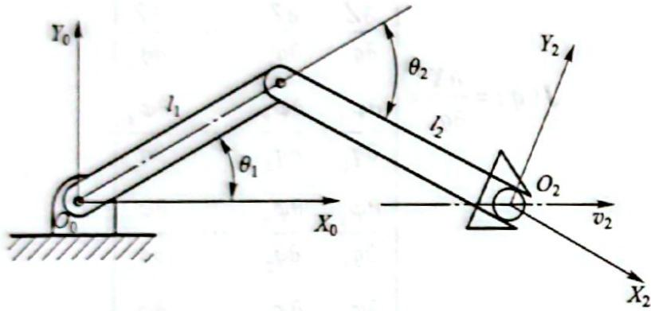

图 4.2 二自由度机械手手部沿 $X_{0}$ 方向运动示意图

解 由式(4.6)可知,二自由度机械手速度雅可比为 

$$
\boldsymbol {J} = \left[ \begin{array}{l l} - l _ {1} \mathrm{s} \theta_ {1} - l _ {2} s _ {1 2} & - l _ {2} s _ {1 2} \\ l _ {1} \mathrm{c} \theta_ {1} + l _ {2} c _ {1 2} & l _ {2} c _ {1 2} \end{array} \right]
$$

因此，逆雅可比为 

$$
J ^ {- 1} = \frac {1}{l _ {1} l _ {2} \mathrm{s} \theta_ {2}} \left[ \begin{array}{c c} l _ {2} c _ {1 2} & l _ {2} s _ {1 2} \\ - l _ {1} \mathrm{c} \theta_ {1} - l _ {2} c _ {1 2} & - l _ {1} \mathrm{s} \theta_ {1} - l _ {2} s _ {1 2} \end{array} \right]\tag{4.12}
$$

由式(4.11)可知, $\dot{\theta}=J^{-1}v$ ,且 $v=\left[1\quad0\right]^{T}$ ,即 $v_{X}=1\ m/s,v_{Y}=0$ ,因此 

$$
\left[ \begin{array}{c} \dot {\theta} _ {1} \\ \dot {\theta} _ {2} \end{array} \right] = \frac {1}{l _ {1} l _ {2} \mathrm{s} \theta_ {2}} \left[ \begin{array}{c c} l _ {2} c _ {1 2} & l _ {2} s _ {1 2} \\ - l _ {1} \mathrm{c} \theta_ {1} - l _ {2} c _ {1 2} & - l _ {1} \mathrm{s} \theta_ {1} - l _ {2} s _ {1 2} \end{array} \right] \left[ \begin{array}{c} 1 \\ 0 \end{array} \right]
$$

$$
\dot {\theta} _ {1} = \frac {c _ {1 2}}{l _ {1} s \theta_ {2}} = - \frac {1}{0 . 5} \mathrm{rad/s} = - 2 \mathrm{rad/s}
$$

$$
\dot {\theta} _ {2} = \frac {\mathrm{c} \theta_ {1}}{l _ {2} \mathrm{s} \theta_ {2}} - \frac {c _ {1 2}}{l _ {1} \mathrm{s} \theta_ {2}} = 4 \mathrm{rad/s}
$$

因此，在该瞬时两关节的位置分别为 $\theta_{1}=30^{\circ},\theta_{2}=-60^{\circ}$ ; 速度分别为 $\dot{\theta}_{1}=-2\ rad/s,\dot{\theta}_{2}=4\ rad/s$ ; 手部瞬时速度为 1 m/s。 

### 4.1.3 机器人雅可比讨论

对于平面运动的机器人,其雅可比矩阵 J 的行数恒为 3,列数则为机械手含有的关节数目,手部的广义位置矢量 $[X\quad Y\quad \varphi]^{T}$ 均容易确定,且方位 $\varphi$ 与角运动的形成顺序无关,故可采用直 

接微分法求 $\varphi$ ，非常方便。 

在三维空间作业的六自由度机器人的雅可比矩阵 J 的前三行代表手部线速度与关节速度的传递比, 后三行代表手部角速度与关节速度的传递比。而雅可比矩阵 J 的每一列则代表相应关节速度 $\dot{q}_{i}$ 对手部线速度和角速度的传递比, J 阵的行数恒为 6 (沿/绕基坐标系的变量共 6 个), 通过三维空间运行的机器人运动学方程可以获得直角位置矢量 $[X\quad Y\quad Z]^{T}$ 的显式方程。因此, J 的前三行可以直接微分求得, 但不可能找到方位矢量 $[\varphi_{x}\quad\varphi_{y}\quad\varphi_{z}]^{T}$ 的一般表达式。这是因为虽然可以用角度如回转角、俯仰角及偏转角等来规定方位, 却找不出互相独立、无顺序的三个转角来描述方位; 绕直角坐标轴的连续角运动变换不满足交换率, 而角位移的微分与角位移的形成顺序无关, 故一般不能运用直接微分法来获得 J 的后三行。因此常用构造法求雅可比矩阵 J。 

如果希望工业机器人手部在空间按规定的速度进行作业,则应计算出沿路径每一瞬时相应的关节速度。但是,当雅可比的秩不是满秩时,求解逆速度雅可比 $J^{-1}$ 较困难,有时还可能出现奇异解,此时相应操作空间的点为奇异点,无法解出关节速度,机器人处于退化位置。 

机器人的奇异形位分为两类： 

1) 边界奇异形位。当机器人手臂全部伸直或全部折回时，使手部处于机器人工作空间的边界上或边界附近，出现逆雅可比奇异，机器人运动受到物理结构的约束，这时相应的机器人形位称为边界奇异形位。 

2) 内部奇异形位。两个或两个以上关节轴线重合时，机器人各关节运动相互抵消，不产生操作运动，这时相应的机器人形位称为内部奇异形位。 

当机器人处在奇异形位时会产生退化现象,丧失一个或更多的自由度。这意味着在工作空间的某个方向上,不管怎样选择机器人关节速度,手部也不可能实现移动。 

例如, 对于例 4.1, 当 $l_{1}l_{2}\mathrm{s}\theta_{2}=0$ 时, 式 (4.12) 无解。若 $l_{1} \neq 0, l_{2} \neq 0$ , 则当 $\theta_{1}=0^{\circ}$ 或 $\theta_{2}=180^{\circ}$ 时, 二自由度机器人逆速度雅可比 $J^{-1}$ 奇异。这时, 该机器人二臂完全伸直或完全折回, 机器人处于奇异形位。在这种奇异形位下, 手部正好处于工作空间的边界, 手部只能沿着一个方向 (即与臂垂直的方向) 运动, 不能沿其他方向运动, 退化了一个自由度。 

## 4.2 机器人静力分析

机器人在工作状态下会与环境之间引起相互作用的力和力矩。机器人各关节的驱动装置提供关节力和力矩，通过连杆传递到末端执行器，克服外界作用力和力矩。关节驱动力和力矩与末端执行器施加的力和力矩之间的关系是机器人操作臂力控制的基础。 

### 4.2.1 操作臂的力和力矩平衡

如图 4.3 所示, 杆 i 通过关节 i 和 $i+1$ 分别与杆 i-1 和 $i+1$ 相连接, 建立两个坐标系 $\{i-1\}$ 和 $\{i\}$ 。定义如下变量: 

$f_{i-1,i}$ 及 $n_{i-1,i}$ —— i-1 杆通过关节 i 作用在 i 杆上的力和力矩； 

$f_{i,i+1}$ 及 $n_{i,i+1}$ —— i 杆通过关节 $i+1$ 作用在 $i+1$ 杆上的力和力矩； 

$-f_{i,i+1}$ 及 $-n_{i,i+1}$ ——i+1 杆通过关节 i+1 作用在 i 杆上的反作用力和反作用力矩； 

$f_{n,n+1}$ 及 $n_{n,n+1}$ ——机器人最末杆对外界环境的作用力和力矩； 

$-f_{n,n+1}$ 及 $-n_{n,n+1}$ ——外界环境对机器人最末杆的作用力和力矩； 

$f_{0,1}$ 及 $n_{0,1}$ ——机器人机座对杆 1 的作用力和力矩； 

$m_{i}g$ ——连杆 i 的重量,作用在质心 $C_{i}$ 上。 

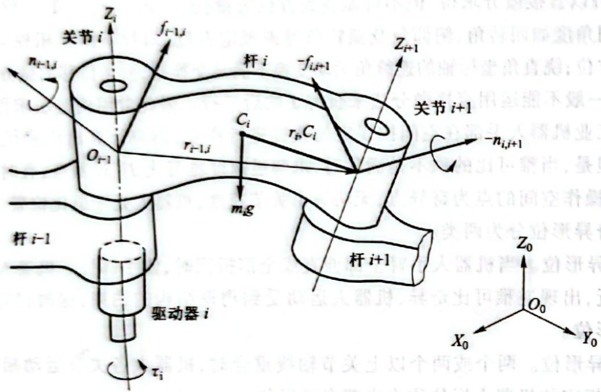

图4.3 杆 $i$ 上的力和力矩

连杆的静力平衡条件为其上所受的合力和合力矩为零，因此力和力矩平衡方程式为 

$$
\boldsymbol {f} _ {i - 1, i} + \left(- \boldsymbol {f} _ {i, i + 1}\right) + m _ {i} \boldsymbol {g} = 0\tag{4.13}
$$

$$
\boldsymbol {n} _ {i - 1, i} + (- \boldsymbol {n} _ {i, i + 1}) + (\boldsymbol {r} _ {i - 1, i} + \boldsymbol {r} _ {i, C _ {i}}) \times \boldsymbol {f} _ {i - 1, i} + \boldsymbol {r} _ {i, C _ {i}} \times (- \boldsymbol {f} _ {i, i + 1}) = 0\tag{4.14}
$$

式中： $r_{i-1,i}$ ——坐标系 $\{i\}$ 的原点相对于坐标系 $\{i-1\}$ 的位置矢量； 

$r_{i,c_{i}}$ ——质心 $C_{i}$ 相对于坐标系 $\{i\}$ 的位置矢量。 

假如已知外界环境对机器人末杆的作用力和力矩,那么可以由最后一个连杆向零连杆(机座)依次递推,从而计算出每个连杆上的受力情况。 

### 4.2.2 机器人力雅可比

为了便于表示机器人手部端点的力和力矩(简称为端点广义力 F)，可将 $f_{n,n+1}$ 和 $n_{n,n+1}$ 合并写成一个 6 维矢量： 

$$
\boldsymbol {F} = \left[ \begin{array}{c} f _ {n, n + 1} \\ n _ {n, n + 1} \end{array} \right]\tag{4.15}
$$

各关节驱动器的驱动力或力矩可写成一个 $n$ 维矢量的形式，即 

$$
\boldsymbol {\tau} = \left[ \begin{array}{c} \tau_ {1} \\ \tau_ {2} \\ \vdots \\ \tau_ {n} \end{array} \right]\tag{4.16}
$$

式中：n 为关节的个数； $\tau$ 为关节力矩（或关节力）矢量，简称广义关节力矩。对于转动关节， $\tau_{i}$ 表示关节驱动力矩；对于移动关节， $\tau_{i}$ 表示关节驱动力。 

假定关节无摩擦,并忽略各杆件的重力,现利用虚功原理推导机器人手部端点力 F 与关节力矩 $\tau$ 的关系。 

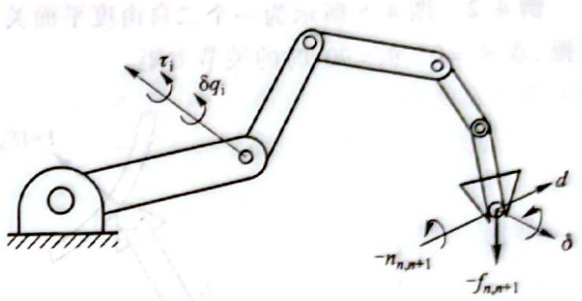

如图 4.4 所示, 关节虚位移为 $\delta q_{i}$ , 末端执行器的虚位移为 $\delta X$ , 则 

图 4.4 末端执行器及各关节的虚位移 

$$
\delta X = \left[ \begin{array}{l} {\pmb {d}} \\ {\pmb {\delta}} \end{array} \right] \text {及} \delta \pmb {q} = \left[ \begin{array}{l l l l} {\delta q _ {1}} & {\delta q _ {2}} & {\dots} & {\delta q _ {n}} \end{array} \right] ^ {\mathrm{T}}\tag{4.17}
$$

式中： $d=\left[d_{X}\quad d_{Y}\quad d_{Z}\right]^{T}$ 、 $\delta=\left[\delta\varphi_{X}\quad\delta\varphi_{Y}\quad\delta\varphi_{Z}\right]^{T}$ ，分别对应于末端执行器的线虚位移和角虚位移； $\delta q$ 为由各关节虚位移 $\delta q_{i}$ 组成的机器人关节虚位移矢量。 

假设发生上述虚位移时,各关节力矩为 $\tau_{i}(i=1,2,\cdots,n)$ , 环境作用在机器人手部端点上的力和力矩分别为 $-f_{n,n+1}$ 和 $-n_{n,n+1}$ 。由上述力和力矩所作的虚功可由下式求出: 

$$
\delta W = \tau_ {1} \delta q _ {1} + \tau_ {2} \delta q _ {2} + \dots + \tau_ {n} \delta q _ {n} - f _ {n, n + 1} d - n _ {n, n + 1} \delta
$$

或写成 

$$
\delta \boldsymbol {W} = \boldsymbol {\tau} ^ {\mathrm{T}} \delta \boldsymbol {q} - \boldsymbol {F} ^ {\mathrm{T}} \delta \boldsymbol {X}\tag{4.18}
$$

根据虚位移原理,机器人处于平衡状态的充分必要条件是对任意符合几何约束的虚位移有 $\delta W=0$ , 并注意到虚位移 $\delta q$ 和 $\delta X$ 之间符合杆件的几何约束条件。利用式 $\delta X=J\delta q$ , 将式(4.18)写成 

$$
\delta W = \boldsymbol {\tau} ^ {T} \delta q - \boldsymbol {F} ^ {T} J \delta q = (\boldsymbol {\tau} - \boldsymbol {J} ^ {T} \boldsymbol {F}) ^ {T} \delta q\tag{4.19}
$$

式中： $\delta q$ 表示从几何结构上允许位移的关节独立变量。对任意的 $\delta q$ ，欲使 $\delta W = 0$ 成立，必有 

$$
\boldsymbol {\tau} = \boldsymbol {J} ^ {\mathrm{T}} \boldsymbol {F}\tag{4.20}
$$

式(4.20)表示了在静态平衡状态下,手部端点力 F 和广义关节力矩 $\tau$ 之间的线性映射关系。式(4.20)中 $J^{T}$ 与手部端点力 F 和广义关节力矩 $\tau$ 之间的力传递有关,称为机器人力雅可比。显然,机器人力雅可比 $J^{T}$ 是速度雅可比 J 的转置矩阵。 

### 4.2.3 机器人静力计算

机器人操作臂静力计算可分为两类问题： 

1) 已知外界环境对机器人手部的作用力 $F'$ (手部端点力 $F = -F'$ ), 利用式(4.20)求相应的满足静力平衡条件的关节驱动力矩 $\tau$ 。 

2) 已知关节驱动力矩 $\tau$ ，确定机器人手部对外界环境的作用力或负载的质量。 

第二类问题是第一类问题的逆解。逆解的关系式为 

$$
\boldsymbol {F} = \left(\boldsymbol {J} ^ {\mathrm{T}}\right) ^ {- 1} \boldsymbol {\tau}
$$

机器人的自由度不是6时,例如n>6,力雅可比矩阵就不是方阵,则 $J^{T}$ 就没有逆解。所以,对第二类问题的求解就困难得多,一般情况不一定能得到唯一的解。如果F的维数比 $\tau$ 的维数低且J满秩,则可利用最小二乘法求得F的估计值。 

例 4.2 图 4.5 所示为一个二自由度平面关节机械手, 已知手部端点力 $F = \left[ F_{X}, F_{Y} \right]^{\mathrm{T}}$ , 忽略摩擦, 求 $\theta_{1} = 0^{\circ}$ , $\theta_{2} = 90^{\circ}$ 时的关节力矩。 

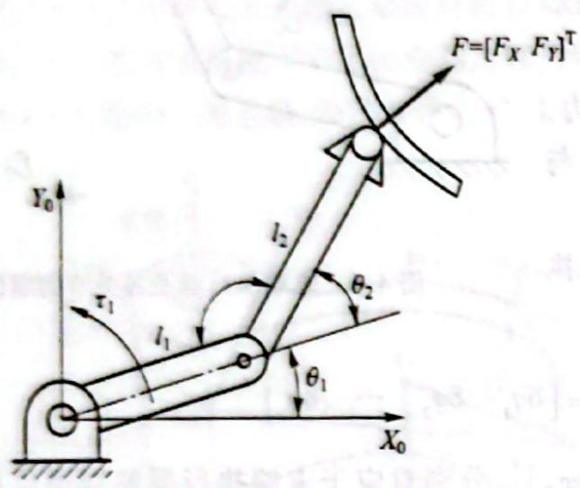

(a) 机械手结构简图

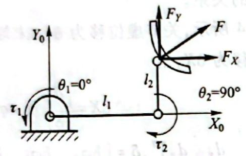

(b) 机械手受力图

图 4.5 手部端点力 F 与关节力矩 $\tau$

解 根据式(4.6)，该机械手的速度雅可比为 

$$
\boldsymbol {J} = \left[ \begin{array}{l l} - l _ {1} s \theta_ {1} - l _ {2} s _ {1 2} & - l _ {2} s _ {1 2} \\ l _ {1} c \theta_ {1} + l _ {2} c _ {1 2} & l _ {2} c _ {1 2} \end{array} \right]
$$

则该机械手的力雅可比为 

$$
\boldsymbol {J} ^ {\mathrm{T}} = \left[ \begin{array}{c c} - l _ {1} \mathrm{s} \theta_ {1} - l _ {2} s _ {1 2} & l _ {1} \mathrm{c} \theta_ {1} + l _ {2} c _ {1 2} \\ - l _ {2} s _ {1 2} & l _ {2} c _ {1 2} \end{array} \right]
$$

根据 $\pmb{\tau} = \pmb{J}^{\intercal}\pmb{F}$ 得 

$$
\tau = \left[ \begin{array}{c} \tau_ {1} \\ \tau_ {2} \end{array} \right] = \left[ \begin{array}{c c} - l _ {1} \mathrm{s} \theta_ {1} - l _ {2} s _ {1 2} & l _ {1} \mathrm{c} \theta_ {1} + l _ {2} c _ {1 2} \\ - l _ {2} s _ {1 2} & l _ {2} c _ {1 2} \end{array} \right] \left[ \begin{array}{c} F _ {X} \\ F _ {Y} \end{array} \right]
$$

所以 

$$
\begin{array}{r l} \tau_ {1} & = - (l _ {1} s \theta_ {1} + l _ {2} s _ {1 2}) F _ {X} + (l _ {1} c \theta_ {1} + l _ {2} c _ {1 2}) F _ {Y} \\ & \tau_ {2} = - l _ {2} s _ {1 2} F _ {X} + l _ {2} c _ {1 2} F _ {Y} \end{array}
$$

在某一瞬时 $\theta_{1}=0^{\circ},\theta_{2}=90^{\circ}$ ，如图 4.5b 所示，则与手部端点力相对应的关节力矩为 $\tau_{1}=-l_{2}F_{x}+l_{1}F_{y},\tau_{2}=-l_{2}F_{x}$ 。 

## 4.3 机器人动力学方程

机器人动力学的研究有牛顿-欧拉(Newton-Euler)法、拉格朗日(Langrange)法、高斯(Gauss)法、凯恩(Kane)法及罗伯逊-魏登堡(Robertson-Wittenburg)法等。本节介绍动力学研究常用的牛顿-欧拉方程和拉格朗日方程。 

### 4.3.1 欧拉方程

欧拉方程又称为牛顿-欧拉方程,应用欧拉方程建立机器人机构的动力学方程是指研究构件质心的运动使用牛顿方程,研究相对于构件质心的转动使用欧拉方程。欧拉方程表征了力、力矩、惯性张量和加速度之间的关系。 

质量为 $m$ 、质心在 $C$ 点的刚体，作用在其质心的力 $\pmb{F}$ 的大小与质心加速度 $\pmb{a}_{c}$ 的关系为 

$$
\boldsymbol {F} = m \boldsymbol {a} _ {c}\tag{4.21}
$$

式中： $F, a_{c}$ 为三维矢量。式(4.21)称为牛顿方程。 

欲使刚体得到角速度为 $\omega$ 、角加速度为 $\varepsilon$ 的转动，则作用在刚体上的力矩 $M$ 为 

$$
\boldsymbol {M} = ^ {c} \boldsymbol {I} \boldsymbol {\varepsilon} + \boldsymbol {\omega} \times^ {c} \boldsymbol {I} \boldsymbol {\omega}\tag{4.22}
$$

式中： $M, \varepsilon, \omega$ 均为三维矢量； $^c I$ 为刚体相对于原点通过质心 $C$ 并与刚体固接的刚体坐标系的惯性张量。式(4.22)即为欧拉方程。 

在三维空间运动的任一刚体,其惯性张量 $^{c}$ I 可用质量惯性矩 $I_{XX}$ 、 $I_{YY}$ 、 $I_{ZZ}$ 和惯性积 $I_{XY}$ 、 $I_{YZ}$ 、 $I_{ZX}$ 为元素的 $3 \times 3$ 矩阵或 $4 \times 4$ 齐次坐标矩阵来表示。通常将描述惯性张量的参考坐标系固定在刚体上,以方便刚体运动的分析。这种坐标系称为刚体坐标系,简称体坐标系。 

### 4.3.2 拉格朗日方程

在机器人的动力学研究中,主要应用拉格朗日方程建立起机器人的动力学方程。这类方程可直接表示为系统控制输入的函数,若采用齐次坐标,递推的拉格朗日方程也可建立比较方便而有效的动力学方程。 

对于任何机械系统,拉格朗日函数 L 的定义为系统总动能 $E_{k}$ 与总势能 $E_{p}$ 之差,即 

$$
L = E _ {\mathrm{k}} - E _ {\mathrm{p}}\tag{4.23}
$$

由拉格朗日函数 L 所描述的系统动力学状态的拉格朗日方程(简称 L-E 方程, $E_{k}$ 和 $E_{p}$ 可以用任何方便的坐标系来表示)为 

$$
F _ {i} = \frac {\mathrm{d}}{\mathrm{d} t} \frac {\partial L}{\partial \dot {q} _ {i}} - \frac {\partial L}{\partial q _ {i}} \quad i = 1, 2, \dots , n\tag{4.24}
$$

式中： $L$ 为拉格朗日函数（又称拉格朗日算子）； $n$ 为连杆数目； $q_{i}$ 为系统选定的广义坐标，单位为m或rad，具体选 $\mathbf{m}$ 还是rad由 $q_{i}$ 为直线坐标还是转角坐标来决定； $\dot{q}_i$ 为广义速度（广义坐标 $q_{i}$ 对时间的一阶导数），单位为 $\mathrm{m / s}$ 或 $\mathrm{rad / s}$ ，具体选 $\mathrm{m / s}$ 还是 $\mathrm{rad / s}$ 由 $\dot{q}_{i}$ 是线速度还是角速度来决定； $F_{i}$ 为作用在第 $i$ 个坐标上的广义力或力矩，单位为N或 $\mathbf{N} \cdot \mathbf{m}$ ，具体选N还是 $\mathbf{N} \cdot \mathbf{m}$ 由 $q_{i}$ 是直线坐标还是转角坐标来决定。考虑式(4.24)中不显含 $\dot{\pmb{q}}$ ，上式可写成 

$$
F _ {i} = \frac {\mathrm{d}}{\mathrm{d} t} \frac {\partial E _ {\mathrm{k}}}{\partial \dot {q} _ {i}} - \frac {\partial E _ {\mathrm{k}}}{\partial q _ {i}} + \frac {\partial E _ {\mathrm{p}}}{\partial q _ {i}}\tag{4.25}
$$

应用式(4.25)时应注意： 

1) 系统的势能 $E_{\mathrm{p}}$ 仅是广义坐标 $q_{i}$ 的函数, 而动能 $E_{\mathrm{k}}$ 是 $q_{i}, \dot{q}_{i}$ 及时间 $t$ 的函数, 因此拉格朗日函数可以写成 $L = L(q_{i}, \dot{q}_{i}, t)$ 。 

2) 若 $q_{i}$ 是线位移, 则 $\dot{q}_{i}$ 是线速度, 对应的广义力 $F_{i}$ 就是力; 若 $q_{i}$ 是角位移, 则 $\dot{q}_{i}$ 是角速 

度,对应的广义力 $F_{i}$ 是力矩。 

### 4.3.3 平面关节机器人动力学分析

机器人是一个非线性的复杂动力学系统。动力学问题的求解比较困难，而且需要较长的运算时间，因此简化解的过程，最大限度地减少工业机器人动力学在线计算的时间是一个受到关注的研究课题。机器人动力学问题有两类： 

1）给出已知轨迹点上的 $\theta, \dot{\theta}$ 及 $\ddot{\theta}$ ，即机器人关节位置、速度和加速度，求相应的关节力矩矢量 $\tau$ 。这对实现机器人动态控制是相当有用的。 

2）已知关节驱动力矩，求机器人系统相应各瞬时的运动。也就是说，给出关节力矩矢量 $\pmb{\tau}$ 求机器人所产生的运动 $\pmb{\theta},\dot{\pmb{\theta}}$ 及 $\ddot{\pmb{\theta}}$ 。这对模拟机器人的运动是非常有用的。 

#### 一、机器人动力学方程的推导过程

机器人是结构复杂的连杆系统,一般采用齐次变换的方法,用拉格朗日方程建立其系统动力学方程,对其位姿和运动状态进行描述。机器人动力学方程的具体推导过程如下: 

1）选取坐标系，选定完全而且独立的广义关节变量 $q_{i}, i=1,2,\cdots,n$ 。 

2）选定相应关节上的广义力 $F_{i}$ ：当 $q_{i}$ 是位移变量时， $F_{i}$ 为力；当 $q_{i}$ 是角度变量时， $F_{i}$ 为力矩。 

3）求出机器人各构件的动能和势能，构造拉格朗日函数。 

4）代入拉格朗日方程求得机器人系统的动力学方程。 

下面以图 4.6 所示的二自由度机器人为例,说明机器人动力学方程的推导过程。 

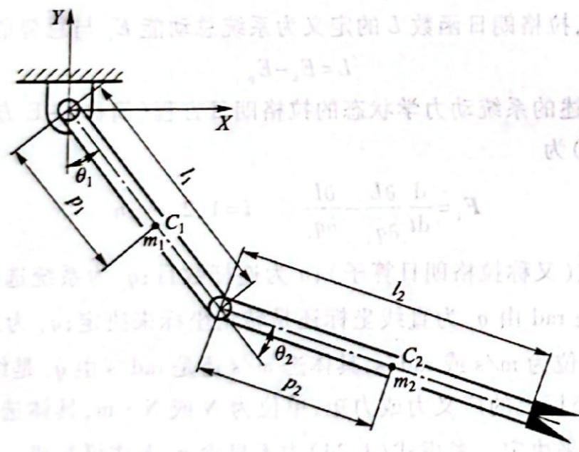

图 4.6 二自由度机器人动力学方程的建立

##### 1. 选定广义关节变量及广义力

选取笛卡儿坐标系。连杆1和连杆2的关节变量分别是转角 $\theta_{1}$ 和 $\theta_{2}$ ，关节1和关节2相应的力矩是 $\tau_{1}$ 和 $\tau_{2}$ 。连杆1和连杆2的质量分别是 $m_{1}$ 和 $m_{2}$ ，杆长分别为 $l_{1}$ 和 $l_{2}$ ，质心分别在 $C_{1}$ 和 $C_{2}$ 处，离关节中心的距离分别为 $p_{1}$ 和 $p_{2}$ 。 

因此，杆1质心 $C_1$ 的位置坐标为 

$$
Y _ {1} = - p _ {1} \mathrm{c} \theta_ {1}
$$

$$
X _ {1} = p _ {1} \mathrm{s} \theta_ {1}
$$

杆1质心 $C_1$ 速度的平方为 

$$
\dot {X} _ {1} ^ {2} + \dot {Y} _ {1} ^ {2} = (p _ {1} \dot {\theta} _ {1}) ^ {2}
$$

杆2质心 $C_2$ 的位置坐标为 

$$
X _ {2} = l _ {1} \mathrm{s} \theta_ {1} + p _ {2} s _ {1 2}
$$

$$
Y _ {2} = - l _ {1} \mathrm{c} \theta_ {1} - p _ {2} c _ {1 2}
$$

杆2质心 $C_2$ 速度的平方为 

$$
\dot {X} _ {2} = l _ {1} \mathbf {c} \theta_ {1} \dot {\theta} _ {1} + p _ {2} c _ {1 2} (\dot {\theta} _ {1} + \dot {\theta} _ {2})
$$

$$
\dot {Y} _ {2} = l _ {1} \mathrm{s} \theta_ {1} \dot {\theta} _ {1} + p _ {2} s _ {1 2} (\dot {\theta} _ {1} + \dot {\theta} _ {2})
$$

$$
\dot {X} _ {2} ^ {2} + \dot {Y} _ {2} ^ {2} = l _ {1} ^ {2} \dot {\theta} _ {1} ^ {2} + p _ {2} ^ {2} (\dot {\theta} _ {1} + \dot {\theta} _ {2}) ^ {2} + 2 l _ {1} p _ {2} (\dot {\theta} _ {1} ^ {2} + \dot {\theta} _ {1} \dot {\theta} _ {2}) c \theta_ {2}
$$

##### 2. 系统动能

$$
E _ {\mathrm{k}} = \sum E _ {\mathrm{ki}} \quad i = 1, 2
$$

$$
E _ {\mathrm{k1}} = \frac {1}{2} m _ {1} p _ {1} ^ {2} \dot {\theta} _ {1} ^ {2}
$$

$$
E _ {k 2} = \frac {1}{2} m _ {2} l _ {1} ^ {2} \dot {\theta} _ {1} ^ {2} + \frac {1}{2} m _ {2} p _ {2} ^ {2} (\dot {\theta} _ {1} + \dot {\theta} _ {2}) ^ {2} + m _ {2} l _ {2} p _ {2} (\dot {\theta} _ {1} ^ {2} + \dot {\theta} _ {1} \dot {\theta} _ {2}) c \theta_ {2}
$$

##### 3. 系统势能

$$
\begin{array}{r l} E _ {\mathrm{p}} & = \sum E _ {\mathrm{pi}} \quad i = 1, 2 \\ E _ {\mathrm{p1}} & = m _ {1} g p _ {1} (1 - c \theta_ {1}) \\ E _ {\mathrm{p2}} & = m _ {2} g l _ {1} (1 - c \theta_ {1}) + m _ {2} g p _ {2} (1 - c _ {1 2}) \end{array}
$$

4. 拉格朗日函数 

$$
\begin{array}{r l} & L = E _ {\mathrm{k}} - E _ {\mathrm{p}} \\ & = \frac {1}{2} (m _ {1} p _ {1} ^ {2} + m _ {2} l _ {1} ^ {2}) \dot {\theta} _ {1} ^ {2} + m _ {2} l _ {1} p _ {2} (\dot {\theta} _ {1} ^ {2} + \dot {\theta} _ {1} \dot {\theta} _ {2}) \mathrm{c} \theta_ {2} + \frac {1}{2} m _ {2} p _ {2} ^ {2} (\dot {\theta} _ {1} + \dot {\theta} _ {2}) ^ {2} - \\ & (m _ {1} p _ {1} + m _ {2} l _ {1}) g (1 - \mathrm{c} \theta_ {1}) - m _ {2} g p _ {2} (1 - c _ {1 2}) \end{array}
$$

##### 5. 系统动力学方程

根据拉格朗日方程式(4.25)计算各关节上的力矩,可得到系统动力学方程。 

(1) 计算关节 1 上的力矩 $\tau_{1}$ 

$$
\begin{array}{r l} \frac {\partial L}{\partial \dot {\theta} _ {1}} & = (m _ {1} p _ {1} ^ {2} + m _ {2} l _ {1} ^ {2}) \dot {\theta} _ {1} + m _ {2} l _ {1} p _ {2} (2 \dot {\theta} _ {1} + \dot {\theta} _ {2}) c \theta_ {2} + m _ {2} p _ {2} ^ {2} (\dot {\theta} _ {1} + \dot {\theta} _ {2}) \\ & \quad \frac {\partial L}{\partial \theta_ {1}} = - (m _ {1} p _ {1} + m _ {2} l _ {1}) g s \theta_ {1} - m _ {2} g p _ {2} s _ {1 2} \end{array}
$$

所以 

$$
\begin{array}{r l} \tau_ {1} & = \frac {\mathrm{d}}{\mathrm{d} t} \frac {\partial L}{\partial \dot {\theta} _ {1}} - \frac {\partial L}{\partial \theta_ {1}} \\ & = (m _ {1} p _ {1} ^ {2} + m _ {2} p _ {2} ^ {2} + m _ {2} l _ {1} ^ {2} + 2 m _ {2} l _ {1} p _ {2} c \theta_ {2}) \ddot {\theta} _ {1} + (m _ {2} p _ {2} ^ {2} + m _ {2} l _ {1} p _ {2} c \theta_ {2}) \ddot {\theta} _ {2} + \\ & (- 2 m _ {2} l _ {1} p _ {2} s \theta_ {2}) \dot {\theta} _ {1} \dot {\theta} _ {2} + (- m _ {2} l _ {1} p _ {2} s \theta_ {2}) \dot {\theta} _ {2} ^ {2} + (m _ {1} p _ {1} + m _ {2} l _ {1}) g s \theta_ {1} + m _ {2} p _ {2} g s _ {1 2} \end{array}
$$

上式可简写为 

$$
\tau_ {1} = D _ {1 1} \ddot {\theta} _ {1} + D _ {1 2} \ddot {\theta} _ {2} + D _ {1 1 2} \dot {\theta} _ {1} \dot {\theta} _ {2} + D _ {1 2 2} \dot {\theta} _ {2} ^ {2} + D _ {1}\tag{4.26}
$$

式中： 

$$
\left. \begin{array}{l} D _ {1 1} = m _ {1} p _ {1} ^ {2} + m _ {2} p _ {2} ^ {2} + m _ {2} l _ {1} ^ {2} + 2 m _ {2} l _ {1} p _ {2} c \theta_ {2} \\ D _ {1 2} = m _ {2} p _ {2} ^ {2} + m _ {2} l _ {1} p _ {2} c \theta_ {2} \\ D _ {1 1 2} = - 2 m _ {2} l _ {1} p _ {2} s \theta_ {2} \\ D _ {1 2 2} = - m _ {2} l _ {1} p _ {2} s \theta_ {2} \\ D _ {1} = (m _ {1} p _ {1} + m _ {2} l _ {1}) g s \theta_ {1} + m _ {2} p _ {2} g s _ {1 2} \end{array} \right\}\tag{4.27}
$$

(2) 计算关节 2 上的力矩 $\tau_{2}$ 

$$
\frac {\partial L}{\partial \dot {\theta} _ {2}} = m _ {2} p _ {2} ^ {2} (\dot {\theta} _ {1} + \dot {\theta} _ {2}) + m _ {2} l _ {1} p _ {2} \dot {\theta} _ {1} c \theta_ {2}
$$

$$
\frac {\partial L}{\partial \theta_ {2}} = - m _ {2} l _ {1} p _ {2} (\dot {\theta} _ {1} ^ {2} + \dot {\theta} _ {1} \dot {\theta} _ {2}) s \theta_ {2} - m _ {2} g p _ {2} s _ {1 2}
$$

所以 

$$
\begin{array}{l} \tau_ {2} = \frac {\mathrm{d}}{\mathrm{d} t} \frac {\partial L}{\partial \dot {\theta} _ {2}} - \frac {\partial L}{\partial \theta_ {2}} = (m _ {2} p _ {2} ^ {2} + m _ {2} l _ {1} p _ {2} c \theta_ {2}) \ddot {\theta} _ {1} + m _ {2} p _ {2} ^ {2} \ddot {\theta} _ {2} + \\ (- m _ {2} l _ {1} p _ {2} s \theta_ {2} + m _ {2} l _ {1} p _ {2} s \theta_ {2}) \dot {\theta} _ {1} \dot {\theta} _ {2} + (m _ {2} l _ {1} p _ {2} s \theta_ {2}) \dot {\theta} _ {1} ^ {2} + m _ {2} g p _ {2} s _ {1 2} \end{array}
$$

上式可简写为 

式中： 

$$
\tau_ {2} = D _ {2 1} \ddot {\theta} _ {1} + D _ {2 2} \ddot {\theta} _ {2} + D _ {2 1 2} \dot {\theta} _ {1} \dot {\theta} _ {2} + D _ {2 2 2} \dot {\theta} _ {1} ^ {2} + D _ {2}\tag{4.28}
$$

$$
\left. \begin{array}{l} D _ {2 1} = m _ {2} p _ {2} ^ {2} + m _ {2} l _ {1} p _ {2} \mathrm{c} \theta_ {2} \\ D _ {2 2} = m _ {2} p _ {2} ^ {2} \\ D _ {2 1 2} = - m _ {2} l _ {1} p _ {2} \mathrm{s} \theta_ {2} + m _ {2} l _ {1} p _ {2} \mathrm{s} \theta_ {2} \\ D _ {2 1 1} = m _ {2} l _ {1} p _ {2} \mathrm{s} \theta_ {2} \\ D _ {2} = m _ {2} g p _ {2} s _ {1 2} \end{array} \right\}\tag{4.29}
$$

式(4.26)、式(4.28)分别表示了关节驱动力矩与关节位移、速度、加速度之间的关系,即力和运动之间的关系,称为图4.6所示二自由度机器人的动力学方程。对这些公式进行分析可知: 

1）含有 $\ddot{\theta}_{1}$ 或 $\ddot{\theta}_{2}$ 的项表示由于加速度引起的关节力矩项，其中： 

① 含有 $D_{11}$ 和 $D_{22}$ 的项分别表示由于关节 1 加速度和关节 2 加速度引起的惯性力矩项； 

② 含有 $D_{12}$ 的项表示关节 2 加速度对关节 1 的耦合惯性力矩项； 

③ 含有 $D_{21}$ 的项表示关节 1 加速度对关节 2 的耦合惯性力矩项。 

2) 含有 $\dot{\theta}_{1}^{2}$ 和 $\dot{\theta}_{2}^{2}$ 的项表示由于向心力引起的关节力矩项，其中： 

① 含有 $D_{122}$ 的项表示由关节 2 速度引起的向心力对关节 1 的耦合力矩项； 

② 含有 $D_{222}$ 的项表示关节 1 速度引起的向心力对关节 2 的耦合力矩项。 

3) 含有 $\dot{\theta}_1\dot{\theta}_2$ 的项表示由于科氏力引起的关节力矩项，其中： 

① 含有 $D_{112}$ 的项表示科氏力对关节 1 的耦合力矩项； 

② 含有 $D_{212}$ 的项表示科氏力对关节 2 的耦合力矩项。 

4) 只含关节变量 $\theta_{1}$ 、 $\theta_{2}$ 的项表示重力引起的关节力矩项，其中： 

① 含有 $D_{1}$ 的项表示连杆 1 及连杆 2 的质量对关节 1 引起的重力矩项； 

② 含有 $D_{2}$ 的项表示连杆 2 的质量对关节 2 引起的重力矩项。 

从上面推导可以看出,很简单的二自由度平面关节型机器人的动力学方程已经很复杂,包含了很多因素,这些因素都在影响机器人的动力学特性。对于比较复杂的多自由度机器人,其动力学方程更庞杂,推导过程更为复杂,不利于机器人的实时控制。故进行动力学分析时,通常进行下列简化: 

1) 当杆件不太长、重量很小时，动力学方程中的重力矩项可以省略。 

2) 当关节速度不太大、机器人不是高速机器人时，含有 $\dot{\theta}_{1}^{2}$ 、 $\dot{\theta}_{2}^{2}$ 及 $\dot{\theta}_{1}\dot{\theta}_{2}$ 的项可以省略。 

3) 当关节加速度不太大, 即关节电动机的升、降速比较平稳时, 含有 $\ddot{\theta}_{1}, \ddot{\theta}_{2}$ 的项有时可以省略。但关节加速度减小会引起速度升降的时间增加, 延长机器人作业循环的时间。 

#### 二、关节空间和操作空间动力学

##### 1. 关节空间和操作空间

n 个自由度操作臂的末端位姿 X 由 n 个关节变量所决定, 这 n 个关节变量也称为 n 维关节矢量 q, 所有关节矢量 q 构成了关节空间。末端执行器的作业是在直角坐标空间中进行的, 即操作臂末端位姿 X 是在直角坐标空间中描述的, 因此把这个空间称为操作空间。运动学方程 $X = X(q)$ 就是关节空间向操作空间的映射; 而运动学逆解则是由映射求其在关节空间中的原像。在关节空间和操作空间, 操作臂动力学方程有不同的表示形式, 并且两者之间存在着一定的对应关系。 

##### 2. 关节空间的动力学方程

将式(4.26)、式(4.28)写成矩阵形式 

$$
\boldsymbol {\tau} = \boldsymbol {D} (\boldsymbol {q}) \ddot {\boldsymbol {q}} + \boldsymbol {H} (\boldsymbol {q}, \dot {\boldsymbol {q}}) + \boldsymbol {G} (\boldsymbol {q})\tag{4.30}
$$

式中： 

$$
\boldsymbol {\tau} = \left[ \begin{array}{l} \boldsymbol {\tau} _ {1} \\ \boldsymbol {\tau} _ {2} \end{array} \right]; \quad \boldsymbol {q} = \left[ \begin{array}{l} \theta_ {1} \\ \theta_ {2} \end{array} \right]; \quad \dot {\boldsymbol {q}} = \left[ \begin{array}{l} \dot {\theta} _ {1} \\ \dot {\theta} _ {2} \end{array} \right]; \quad \ddot {\boldsymbol {q}} = \left[ \begin{array}{l} \ddot {\theta} _ {1} \\ \ddot {\theta} _ {2} \end{array} \right]
$$

所以 

$$
\boldsymbol {D} (\boldsymbol {q}) = \left[ \begin{array}{c c} m _ {1} p _ {1} ^ {2} + m _ {2} (l _ {1} ^ {2} + p _ {2} ^ {2} + 2 l _ {1} p _ {2} \mathrm{c} \theta_ {2}) & m _ {2} (p _ {2} ^ {2} + l _ {1} p _ {2} \mathrm{c} \theta_ {2}) \\ m _ {2} (p _ {2} ^ {2} + l _ {1} p _ {2} \mathrm{c} \theta_ {2}) & m _ {2} p _ {2} ^ {2} \end{array} \right]\tag{4.31}
$$

$$
\boldsymbol {H} (\boldsymbol {q}, \dot {\boldsymbol {q}}) = \left[ \begin{array}{c} - m _ {2} l _ {1} p _ {2} \mathrm{s} \theta_ {2} \dot {\theta} _ {2} ^ {2} - 2 m _ {2} l _ {1} p _ {2} \mathrm{s} \theta_ {2} \dot {\theta} _ {1} \dot {\theta} _ {2} \\ m _ {2} l _ {1} p _ {2} \mathrm{s} \theta_ {2} \dot {\theta} _ {1} ^ {2} \end{array} \right]\tag{4.32}
$$

$$
\boldsymbol {G} (\boldsymbol {q}) = \left[ \begin{array}{c} (m _ {1} p _ {1} + m _ {2} l _ {1}) g s \theta_ {1} + m _ {2} p _ {2} g s _ {1 2} \\ m _ {2} p _ {2} g s _ {1 2} \end{array} \right]\tag{4.33}
$$

式(4.30)就是操作臂在关节空间的动力学方程的一般结构形式,它反映了关节力矩与关节变量、速度、加速度之间的函数关系。对于n个关节的操作臂,D(q)是 $n\times n$ 的正定对称矩阵,是q的函数,称为操作臂的惯性矩阵; $H(q,\dot{q})$ 是 $n\times1$ 的离心力和科氏力矢量; $G(q)$ 是 $n\times1$ 的重力矢量,与操作臂的形位q有关。 

##### 3. 操作空间动力学方程

与关节空间动力学方程相对应,在笛卡儿操作空间中可以用直角坐标变量即末端操作器位姿的矢量 X 表示机器人动力学方程。因此,操作力 F 与末端加速度 $\dot{X}$ 之间的关系可表示为 

$$
\boldsymbol {F} = \boldsymbol {M} _ {x} (\boldsymbol {q}) \ddot {\boldsymbol {X}} + \boldsymbol {U} _ {x} (\boldsymbol {q}, \dot {\boldsymbol {q}}) + \boldsymbol {G} _ {x} (\boldsymbol {q})\tag{4.34}
$$

式中： $M_{X}(q)\ddot{X},U_{X}(q,\dot{q}),G_{X}(q)$ 分别为操作空间惯性矩阵、离心力和科氏力矢量、重力矢量，它们都是在操作空间中表示的； $\pmb{F}$ 为广义操作力矢量。 

关节空间动力学方程和操作空间动力学方程之间的对应关系可以通过广义操作力 F 与广义关节力 $\tau$ 之间的关系 

$$
\boldsymbol {\tau} = \boldsymbol {J} ^ {\mathrm{T}} (\boldsymbol {q}) \boldsymbol {F}\tag{4.35}
$$

和操作空间与关节空间之间的速度、加速度的关系式(4.36)求出。 

$$
\left. \begin{array}{l} \dot {\boldsymbol {X}} = \boldsymbol {J} (\boldsymbol {q}) \dot {\boldsymbol {q}} \\ \ddot {\boldsymbol {X}} = \boldsymbol {J} (\boldsymbol {q}) \ddot {\boldsymbol {q}} + \dot {\boldsymbol {J}} (\boldsymbol {q}) \dot {\boldsymbol {q}} \end{array} \right\}
$$

## 4.4 机器人的动态特性

(4.36) 

机器人末端执行器能否以给定的速度准确地接近目标,其快速、准确地停在目标点的程度以及对给定停止位置的超调量等都取决于机器人的动态特性。机器人臂部与行走机构的结构、传动部件的精度、运动学和动力学计算机运算程序的质量等决定了机器人的动态特性。机器人的动态特性通常用空间分辨率、精度、重复定位精度等来描述。 

## 习题

4.1 简述欧拉方程的基本原理。 

4.2 简述用拉格朗日方程建立机器人动力学方程的步骤。 

4.4 简述空间分辨率的概念。 

4.3 动力学方程的简化条件有哪些？ 

4.5 机器人的稳态负荷研究包括哪些内容？ 

4.6 简述计算机控制机器人获得良好重复性的处理步骤。 

4.7 分别用拉格朗日动力学及牛顿力学推导题 4.7 图所示单自由度系统力和加速度的关系。假设车轮的惯量可忽略不计，X 轴 

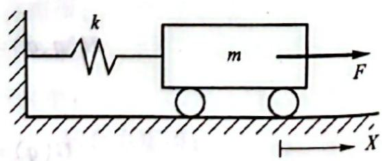

题4.7图

表示小车的运动方向。 

4.8 推导题 4.8 图所示二自由度系统的运动方程。 

4.9 推导题 4.9 图所示二自由度系统的运动方程。 

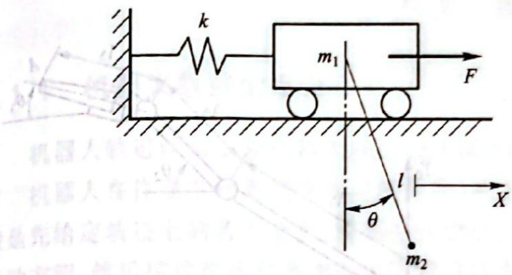

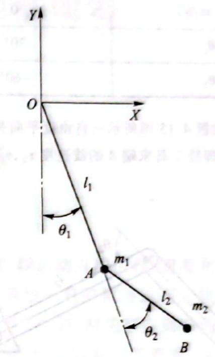

题4.8图

题4.9图

4.10 用拉格朗日法推导题 4.10 图所示二自由度机器人手臂的运动方程。连杆质心位于连杆中心，其转动惯量分别为 $I_{1}$ 和 $I_{2}$ 。 

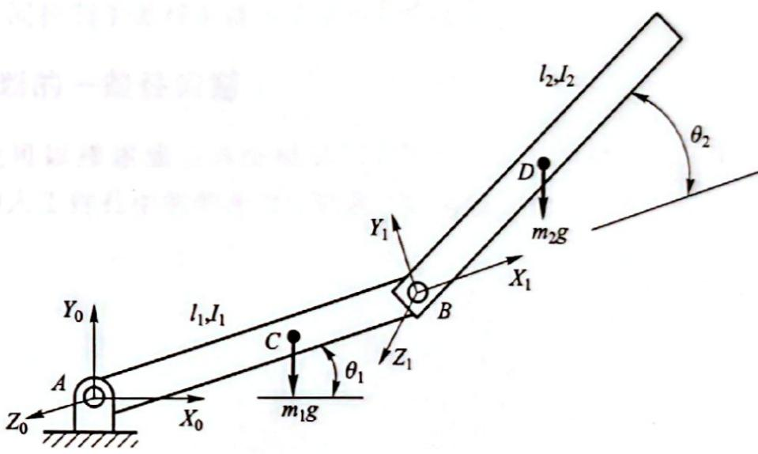

题4.10图

4.11 简述机器人速度雅可比、力雅可比的概念及其二者之间的关系。 

4.12 已知二自由度机械手的雅可比矩阵为 

$$
J = \left[ \begin{array}{l l} - l _ {1} \mathrm{s} \theta_ {1} - l _ {2} s _ {1 2} & - l _ {2} s _ {1 2} \\ l _ {1} \mathrm{c} \theta_ {1} + l _ {2} c _ {1 2} & l _ {2} c _ {1 2} \end{array} \right]
$$

若忽略重力,当手部端点力 $F=\left[1\quad0\right]^{\mathrm{T}}$ 时,求相应的关节力矩 $\tau$ 。 

4.13 如题 4.13 图所示, 一个三自由度机械手, 其末端夹持一质量 m=10 kg 的重物, $l_{1}=l_{2}=0.8\ m$ , $\theta_{1}=60^{\circ}$ , $\theta_{2}=-60^{\circ}$ , $\theta_{3}=-90^{\circ}$ 。若不计机械手的质量, 求机械手处于平衡状态时的各关节力矩。 

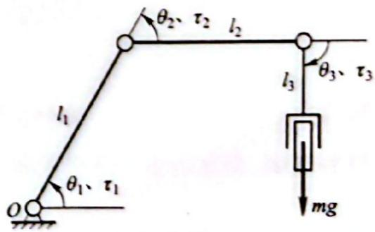

题4.13图

4.14 如题 4.14 图所示二自由度机械手，杆长 $l_{1}=l_{2}=0.5\ m$ ，求下表所示三种情况时的关节瞬时速度 $\dot{\theta}_{1}, \dot{\theta}_{2}$ 。

<table><tr><td><eq>v_x/(m/s)</eq></td><td>-1.0</td><td>0</td><td>1.0</td></tr><tr><td><eq>v_y/(m/s)</eq></td><td>0</td><td>1.0</td><td>1.0</td></tr><tr><td><eq>\theta_1</eq></td><td>30°</td><td>30°</td><td>30°</td></tr><tr><td><eq>\theta_2</eq></td><td>-60°</td><td>120°</td><td>-30°</td></tr></table>

4.15 如题 4.15 图所示三自由度平面关节机械手, 其手部握有焊接工具, 若已知各个关节的瞬时角度及瞬时角速度, 求焊接工具末端 A 的线速度 $v_{x}, v_{y}$ 。 

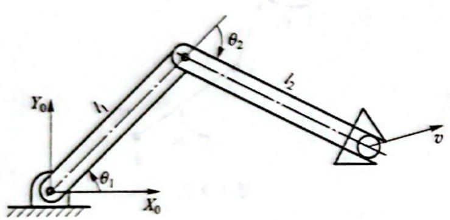

题4.14图

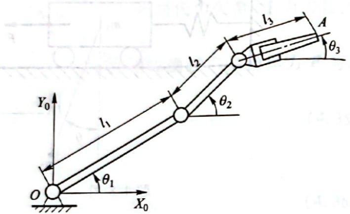

题4.15图
