# 第5章 机器人轨迹规划

## 5.1 概述

### 5.1.1 机器人轨迹的概念

机器人轨迹泛指工业机器人在运动过程中的运动轨迹,即运动点的位移、速度和加速度。 

机器人在作业空间要完成给定的任务,其手部运动必须按一定的轨迹进行。轨迹的生成一般是先给定轨迹上的若干个点,将其经运动学反解映射到关节空间,对关节空间中的相应点建立运动方程,然后按这些运动方程对关节进行插值,从而实现作业空间的运动要求,这一过程通常称为轨迹规划。工业机器人轨迹规划属于机器人低层规划,基本上不涉及人工智能的问题,本章仅讨论在关节空间或笛卡儿空间中工业机器人运动的轨迹规划和轨迹生成方法。 

机器人运动轨迹的描述一般是对其手部位姿的描述,此位姿值可与关节变量相互转换。控制轨迹也就是按时间控制手部或工具中心走过的空间路径。 

### 5.1.2 轨迹规划的一般性问题

机器人的作业可以描述成工具坐标系 $\{T\}$ 相对于工件坐标系 $\{S\}$ 的一系列运动。例如，图5.1所示将销插入工件孔中的作业可以借助工具坐标系的一系列 

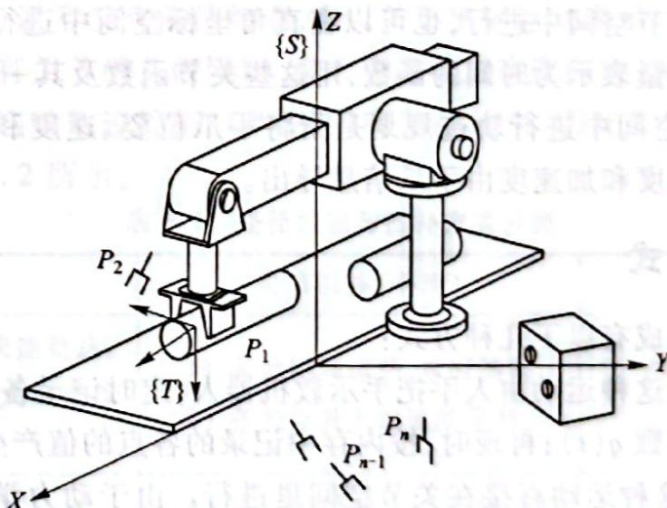

图 5.1 机器人将销插入工件孔中的作业描述

位姿 $P_{i}(i = 1,2,\dots ,n)$ 来描述。这种描述方法不仅符合机器人用户考虑问题的思路，而且有利于描述和生成机器人的运动轨迹。 

用工具坐标系相对于工件坐标系的运动来描述作业路径是一种通用的作业描述方法。它把 作业路径描述与具体的机器人、手爪或工具分离开来，形成了模型化的作业描述方法，从而使这种描述既适用于不同的机器人，也适用于在同一机器人上装夹不同规格的工具。有了这种描述方法就可以把如图5.2所示的机器人从初始状态运动到终止状态的作业看做是工具坐标系从初始位置 $\{T_0\}$ 变化到终止位置 $\{T_{\mathrm{f}}\}$ 的坐标变换。显然，这种变换与具体机器人无关。一般情况下，这种变换包含了工具坐标系位置和姿态的变化。 

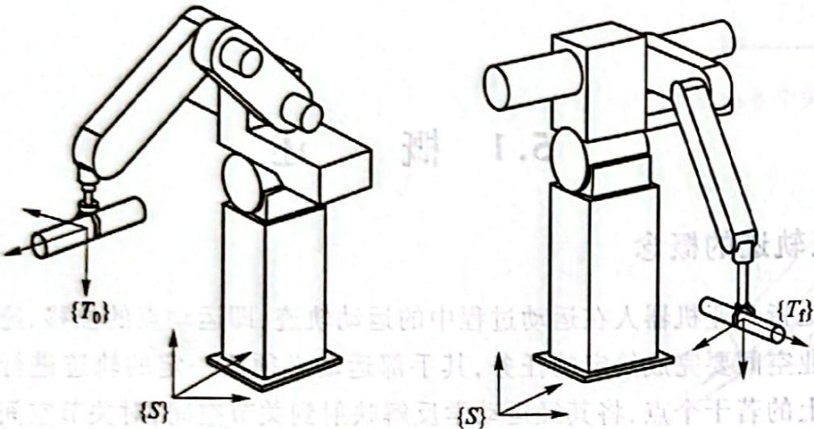

图 5.2 机器人的初始状态和终止状态

在轨迹规划中,为叙述方便,也常用点来表示机器人的状态,或用它来表示工具坐标系的位姿,例如起始点、终止点就分别表示工具坐标系的起始位姿及终止位姿。 

更详细地描述运动时,不仅要规定机器人的起始点和终止点,而且要给出介于起始点和终止点之间的中间点,也称路径点。这时,运动轨迹除了位姿约束外,还存在各路径点之间的时间分配问题。例如,在规定路径的同时,必须给出两个路径点之间的运动时间。 

机器人的运动应当平稳,不平稳的运动将加剧机械部件的磨损,并导致机器人的振动和冲击。为此,要求所选择的运动轨迹描述函数必须连续,而且它的一阶导数(速度),有时甚至二阶导数(加速度)也应该连续。 

轨迹规划既可以在关节空间中进行,也可以在直角坐标空间中进行。在关节空间中进行轨迹规划是指将所有关节变量表示为时间的函数,用这些关节函数及其一阶、二阶导数描述机器人预期的运动;在直角坐标空间中进行轨迹规划是指将手爪位姿、速度和加速度表示为时间的函数,而相应的关节位置、速度和加速度由手爪信息导出。 

### 5.1.3 轨迹的生成方式

运动轨迹的描述或生成有以下几种方式： 

1）示教-再现运动。这种运动由人手把手示教机器人，定时记录各关节变量，得到沿路径运动时各关节的位移时间函数 $q(t)$ ；再现时，按内存中记录的各点的值产生序列动作。 

2）关节空间运动。这种运动直接在关节空间里进行。由于动力学参数及其极限值直接在关节空间里描述，所以用这种方式求最短时间运动很方便。 

3）空间直线运动。这是一种直角空间里的运动，它便于描述空间操作，计算量小，适于简单的作业。 

4）空间曲线运动。这是一种在描述空间中用明确的函数表达的运动，如圆周运动、螺旋运动等。 

### 5.1.4 轨迹规划涉及的主要问题

为了描述一个完整的作业,往往需要将上述运动进行组合。通常这种规划涉及以下几方面的问题: 

1) 对工作对象及作业进行描述,用示教方法给出轨迹上的若干个结点。 

2) 用一条轨迹通过或逼近结点, 此轨迹可按一定的原则优化, 如加速度平滑得到直角空间的位移时间函数 $X(t)$ 或关节空间的位移时间函数 $q(t)$ ; 在结点之间如何进行插补, 即根据轨迹表达式在每一个采样周期实时计算轨迹上点的位姿和各关节变量值。 

3) 以上生成的轨迹是机器人位置控制的给定值, 可以据此并根据机器人的动态参数设计一定的控制规律。 

4) 规划机器人的运动轨迹时, 尚需明确其路径上是否存在障碍约束的组合。一般将机器人的规划与控制方式分为四种情况, 如表 5.1 所示。 

表 5.1 机器人的规划与控制方式

<table><tr><td rowspan="2" colspan="2"></td><td colspan="2">障碍约束</td></tr><tr><td>有</td><td>无</td></tr><tr><td rowspan="2">路径约束</td><td>有</td><td>离线无碰撞路径规则+在线路径跟踪</td><td>离线路径规划+在线路径跟踪</td></tr><tr><td>无</td><td>位置控制+在线障碍探测和避障</td><td>位置控制</td></tr></table>

本章主要讨论连续路径的无障碍轨迹规划方法。 

## 5.2 插补方式分类与轨迹控制

### 5.2.1 插补方式分类

点位控制(PTP 控制)通常没有路径约束,多以关节坐标运动表示。点位控制只要求满足起、终点位姿,在轨迹中间只有关节的几何限制、最大速度和加速度约束;为了保证运动的连续性,要求速度连续,各轴协调。连续轨迹控制(CP 控制)有路径约束,因此要对路径进行设计。路径控制与插补方式分类如表 5.2 所示。 

表 5.2 路径控制与插补方式分类

<table><tr><td>路径控制</td><td>不插补</td><td>关节插补(平滑)</td><td>空间插补</td></tr><tr><td>点位控制</td><td>1)各轴独立快速到达。2)各关节最大加速度限制</td><td>1)各轴协调运动,定时插补。2)各关节最大加速度限制</td><td></td></tr><tr><td>连续轨迹控制</td><td></td><td>1)在空间插补点间进行关节定时插补。2)用关节的低阶多项式拟合空间直线,使各轴协调运动。3)各关节最大加速度限制</td><td>1)直线、圆弧、曲线等距插补。2)起停线速度、线加速度给定,各关节速度、加速度限制</td></tr></table>

### 5.2.2 机器人轨迹控制过程

机器人的基本操作方式是示教-再现,即首先教机器人如何做,机器人记住了这个过程,于是它可以根据需要重复这个动作。操作过程中,不可能把空间轨迹的所有点都示教一遍使机器人记住,这样太烦琐,也浪费很多计算机内存。实际上,对于有规律的轨迹,仅示教几个特征点,计算机就能利用插补算法获得中间点的坐标,如直线需要示教两点,圆弧需要示教三点,通过机器人逆向运动学算法由这些点的坐标求出机器人各关节的位置和角度 $(\theta_{1},\cdots,\theta_{n})$ ,然后由后面的角位置闭环控制系统实现要求的轨迹上的一点。继续插补并重复上述过程,从而实现要求的轨迹。 

机器人轨迹控制过程如图 5.3 所示。 

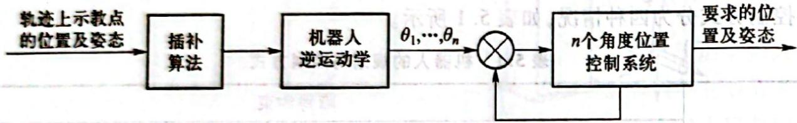

图 5.3 机器人轨迹控制过程

## 5.3 机器人轨迹插值计算

给出各个路径结点后,轨迹规划的任务包含解变换方程,进行逆向运动学求解和插值计算。在对关节空间进行规划时,需进行的大量工作是对关节变量的插值计算。 

### 5.3.1 直线插补

直线插补和圆弧插补是机器人系统中的基本插补算法。对于非直线和圆弧轨迹,可以采用直线或圆弧逼近,以实现这些轨迹。 

空间直线插补是在已知该直线始、末两点的位置和姿态的条件下,求各轨迹中间点(插补点)的位置和姿态。由于在大多数情况下,机器人沿直线运动时其姿态不变,所以无姿态插补,即 

保持第一个示教点时的姿态。当然在有些情况下要求变化姿态，这就需要姿态插补，可仿照下面介绍的位置插补原理处理，也可参照圆弧的姿态插补方法解决，如图5.4所示。已知直线始、末两点的坐标值 $P_{0}(X_{0},Y_{0},Z_{0})$ 、 $P_{e}(X_{e},Y_{e},Z_{e})$ 及姿态，其中 $P_{0}$ 、 $P_{e}$ 是相对于基坐标系的位置。这些已知的位置和姿态通常是通过示教方式得到的。设v为要求的沿直线运动的速度， $t_{s}$ 为插补时间间隔。为减少实时计算量，示教完成后，可求出： 

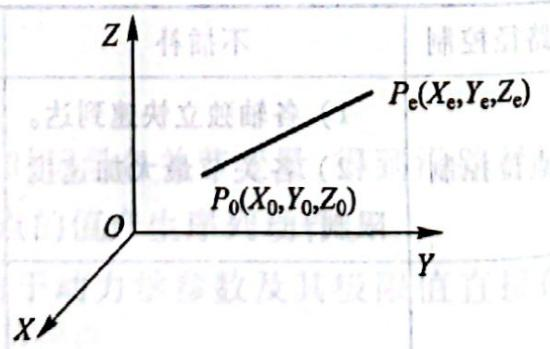

图 5.4 空间直线插补

直线长度 

$$
L = \sqrt {\left(X _ {e} - X _ {0}\right) ^ {2} + \left(Y _ {e} - Y _ {0}\right) ^ {2} + \left(Z _ {e} - Z _ {0}\right) ^ {2}}
$$

$t_{s}$ 间隔内行程 

各轴增量 

$$
d = v t _ {s}
$$

$$
\Delta X = (X _ {e} - X _ {0}) / N
$$

$$
\Delta Y = (Y _ {e} - Y _ {0}) / N
$$

$$
\Delta Z = (Z _ {e} - Z _ {0}) / N
$$

各插补点坐标值 

$$
X _ {i + 1} = X _ {i} + i \Delta X
$$

$$
Y _ {i + 1} = Y _ {i} + i \Delta Y
$$

$$
Z _ {i + 1} = Z _ {i} + i \Delta Z
$$

式中： $i=0,1,2,\cdots,N$ ;插补总步数N为 $L/d+1$ 的整数部分。 

### 5.3.2 圆弧插补

#### 一、平面圆弧插补

平面圆弧是指圆弧平面与基坐标系的三大平面之一重合。以 XOY 平面圆弧为例，已知不在一条直线上的三点 $P_{1}$ 、 $P_{2}$ 、 $P_{3}$ 及这三点对应的机器人手端的姿态，如图 5.5 及图 5.6 所示。 

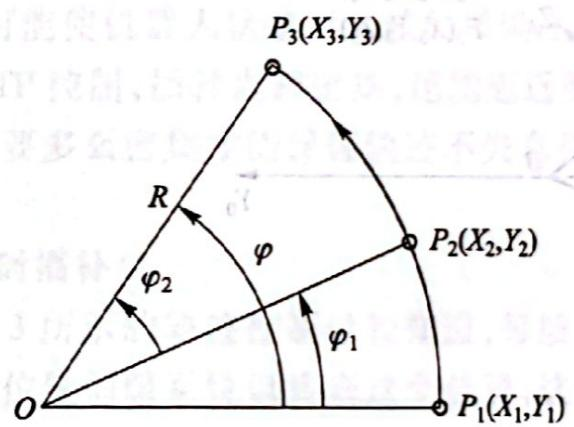

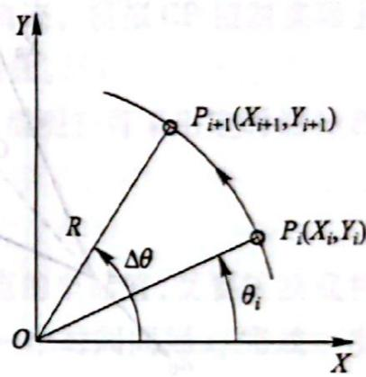

图5.5 由已知三点 $P_{1}, P_{2}, P_{3}$ 确定的圆弧

图 5.6 圆弧插补

设 $v$ 为沿圆弧运动速度， $t_{s}$ 为插补时时间隔。类似直线插补的情况计算出： 

1) 由 $P_{1}, P_{2}, P_{3}$ 确定的圆弧半径 $R$ 。 

2）总的圆心角 $\varphi = \varphi_{1} + \varphi_{2}$ ，其中 

$$
\begin{array}{l} \varphi_ {1} = 2 \arcsin \left[ \sqrt {\left(X _ {2} - X _ {1}\right) ^ {2} + \left(Y _ {2} - Y _ {1}\right) ^ {2}} / 2 R \right] \\ \varphi_ {2} = 2 \arcsin \left[ \sqrt {\left(X _ {3} - X _ {2}\right) ^ {2} + \left(Y _ {3} - Y _ {2}\right) ^ {2}} / 2 R \right] \end{array}
$$

3) $t_{s}$ 时间内角位移量 $\Delta \theta = t_{s}v / R$ ，根据图5.5所示的几何关系求各插补点坐标。  
4）总插补步数（取整数） 

$$
N = \varphi / \Delta \theta + 1
$$

对 $P_{i + 1}$ 点，有 

$$
X _ {i + 1} = R \cos (\theta_ {i} + \Delta \theta) = R \cos \theta_ {i} \cos \Delta \theta - R \sin \theta_ {i} \sin \Delta \theta = X _ {i} \cos \Delta \theta - Y _ {i} \sin \Delta \theta
$$

式中： $X_{i} = R\cos \theta_{i};Y_{i} = R\sin \theta_{i}$ 

同理,有 

$$
Y _ {i + 1} = R \sin (\theta_ {i} + \Delta \theta) = R \sin \theta_ {i} \cos \Delta \theta + R \cos \theta_ {i} \sin \Delta \theta = Y _ {i} \cos \Delta \theta + X _ {i} \sin \Delta \theta
$$

由 $\theta_{i+1} = \theta_i + \Delta\theta$ 可判断是否到插补终点。若 $\theta_{i+1} \leqslant \varphi$ ，则继续插补下去；当 $\theta_{i+1} > \varphi$ 时，则修正最后一步的步长 $\Delta\theta$ ，并以 $\Delta\theta'$ 表示， $\Delta\theta' = \varphi - \theta_i$ ，故平面圆弧位置插补为 

$$
\left. \begin{array}{l} X _ {i + 1} = X _ {i} \cos \Delta \theta - Y _ {i} \sin \Delta \theta \\ Y _ {i + 1} = Y _ {i} \cos \Delta \theta + X _ {i} \sin \Delta \theta \\ \theta_ {i + 1} = \theta_ {i} + \Delta \theta \end{array} \right\}
$$

#### 二、空间圆弧插补

空间圆弧是指三维空间任一平面内的圆弧，此为空间一般平面的圆弧问题。 

空间圆弧插补可分三步来处理： 

1）把三维问题转化成二维问题，找出圆弧所在平面。 

2）利用二维平面插补算法求出插补点坐标 $(X_{i+1},Y_{i+1})$ 。 

3）把该点的坐标值转变为基础坐标系下的值，如图5.7所示。 

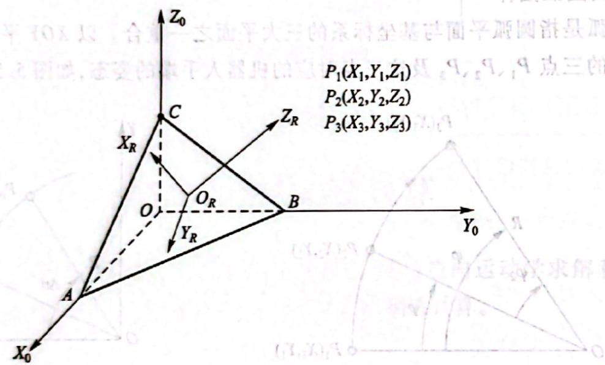

图 5.7 基础坐标与空间圆弧平面的关系

通过不在同一直线上的三点 $P_{1}, P_{2}, P_{3}$ 可确定一个圆及三点间的圆弧，其圆心为 $O_{R}$ ，半径为 $R$ ，圆弧所在平面与基础坐标系平面的交线分别为 $AB, BC, CA$ 。 

建立圆弧平面插补坐标系, 即把 $O_R X_R Y_R Z_R$ 坐标系原点与圆心 $O_R$ 重合, 设 $O_R X_R Y_R Z_R$ 平面为圆弧所在平面, 且保持 $Z_R$ 为外法线方向。这样, 一个三维问题就转化成平面问题, 可以应用平面圆弧插补的结论。 

求解两坐标系(图5.7)的转换矩阵。令 $T_{R}$ 表示由圆弧坐标 $O_{R}X_{R}Y_{R}Z_{R}$ 至基础坐标系 $OX_{0}Y_{0}Z_{0}$ 的转换矩阵。 

若 $Z_{R}$ 轴与基础坐标系 $Z_{0}$ 轴的夹角为 $\alpha, X_{R}$ 轴与基础坐标系 $X_{0}$ 轴的夹角为 $\theta$ ，则可完成下述步骤： 

① 绕 $X_{R}$ 轴旋转 $\alpha$ 角，使 $Z_{0}$ 轴与 $Z_{R}$ 轴平行；② 再绕 $Z_{R}$ 轴旋转 $\theta$ ，使 $X_{0}$ 轴与 $X_{R}$ 轴平行；③ 将 $O_{R}X_{R}Y_{R}Z_{R}$ 的原点 $O_{R}$ 放到基础原点 $O$ 上。 

这三步完成了 $O_{R}X_{R}Y_{R}Z_{R}$ 向 $OX_0Y_0Z_0$ 的转换，由于运动是相对固定坐标系的，故按照算子左乘的原则，故总转换矩阵应为 

$$
\begin{array}{r l} & T _ {R} = T (X _ {o _ {R}}, Y _ {o _ {R}}, Z _ {o _ {R}}) R (Z, \theta) R (X, \alpha) \\ & = \left[ \begin{array}{c c c c} \cos \theta & - \sin \theta \cos \theta & \sin \theta \cos \theta & X _ {o _ {R}} \\ \sin \theta & \cos \theta \cos \alpha & - \cos \theta \sin \alpha & Y _ {o _ {R}} \\ 0 & \sin \alpha & \cos \alpha & Z _ {o _ {R}} \\ 0 & 0 & 0 & 1 \end{array} \right] \end{array}\tag{5.1}
$$

式中： $X_{O_{R}}$ 、 $Y_{O_{R}}$ 、 $Z_{O_{R}}$ 为圆心 $O_{R}$ 在基础坐标系下的坐标值。 

欲将基础坐标系的坐标值表示在 $O_{R}X_{R}Y_{R}Z_{R}$ 坐标系，则要用到 $\pmb{T}_{R}$ 的逆矩阵： 

$$
\boldsymbol {T} _ {R} ^ {- 1} = \left[ \begin{array}{c c c c} \cos \theta & \sin \theta & 0 & - (X _ {o _ {R}} \cos \theta + Y _ {o _ {R}} \sin \theta) \\ - \sin \theta \cos \theta & \cos \theta \cos \alpha & \sin \alpha & - (X _ {o _ {R}} \sin \theta \cos \alpha + Y _ {o _ {R}} \cos \theta \cos \alpha + Z _ {o _ {R}} \sin \alpha) \\ \sin \theta \sin \alpha & - \cos \theta \sin \alpha & \cos \alpha & - (X _ {o _ {R}} \sin \theta \sin \alpha + Y _ {o _ {R}} \cos \theta \sin \alpha + Z _ {o _ {R}} \cos \alpha) \\ 0 & 0 & 0 & 1 \end{array} \right]
$$

### 5.3.3 定时插补与定距插补

由上述可知,机器人实现一个空间轨迹的过程即是实现轨迹离散的过程,如果这些离散点间隔很大,则机器人运动轨迹与要求轨迹可能有较大误差。只有这些插补得到的离散点彼此距离很近,才有可能使机器人轨迹以足够的精确度逼近要求的轨迹。模拟 CP 控制实际上是多次执行插补点的 PTP 控制,插补点越密集,越能逼近要求的轨迹曲线。 

插补点要多么密集才能保证轨迹不失真和运动连续平滑呢？可采用定时插补和定距插补方法来解决。 

#### 一、定时插补

从图 5.3 所示的轨迹控制过程知道, 每插补出一轨迹点的坐标值, 就要转换成相应的关节角度值并加到位置伺服系统以实现这个位置, 这个过程每隔一个时间间隔 $t_{s}$ 完成一次。为保证运动的平稳, 显然 $t_{s}$ 不能太长。 

由于关节型机器人的机械结构大多属于开链式, 刚度不高, $t_{s}$ 一般不超过 $25 \mathrm{~ms} (40 \mathrm{~Hz})$ , 这样就产生了 $t_{s}$ 的上限值。当然 $t_{s}$ 越小越好, 但它的下限值受到计算量限制, 即对于机器人的控制, 计算机要在 $t_{s}$ 时间里完成一次插补运算和一次逆向运动学计算。对于目前的大多数机器人控制器, 完成这样一次计算约需几毫秒, 这样就产生了 $t_{s}$ 的下限值。应当尽量选择 $t_{s}$ 接近或等于它的下限值, 这样可保证较高的轨迹精度和平滑的运动过程。 

以一个 XOY 平面里的直线轨迹为例说明定时插补的方法。 

设机器人需要的运动轨迹为直线,运动速度为 v(单位为 mm/s),时间间隔为 $t_{s}$ (单位为 ms),则每个 $t_{s}$ 间隔内机器人应走过的距离为 

$$
P _ {i} P _ {i + 1} = v t _ {\mathrm{s}}\tag{5.2}
$$

可见两个插补点之间的距离正比于要求的运动速度,两点之间的轨迹不受控制,只有插补点之间的距离足够小,才能满足一定的轨迹精度要求。 

机器人控制系统易于实现定时插补,例如采用定时中断方式每隔 $t_{1}$ 中断一次进行一次插补,计算一次逆向运动学,输出一次给定值。由于 $t_{1}$ 仅为几毫秒,机器人沿着要求轨迹的速度一般不会很高,且机器人总的运动精度不如数控机床、加工中心高,故大多数工业机器人采用定时插补 

方式。 

当要求以更高的精度实现运动轨迹时,可采用定距插补。 

#### 二、定距插补

由式(5.2)可知 v 是要求的运动速度, 它不能变化, 如果要两插补点的距离 $P_{i}P_{i+1}$ 恒为一个足够小的值, 以保证轨迹精度, $t_{s}$ 就要变化。也就是在此方式下, 插补点距离不变, 但 $t_{s}$ 要随着不同工作速度 v 的变化而变化。 

定时插补与定距插补的基本算法相同, 只是前者固定 $t_{s}$ , 易于实现, 后者保证轨迹插补精度, 但 $t_{s}$ 要随之变化, 实现起来比前者困难。 

### 5.3.4 关节空间插补

在关节空间中进行轨迹规划,需要给定机器人在起始点和终止点手臂的位姿。对关节进行插值时应满足一系列的约束条件,例如抓取物体时手部的运动方向(初始点),提升物体离开的方向(提升点),放下物体(下放点)和停止点等结点上的位姿、速度和加速度的要求;与此相应的各个关节位移、速度、加速度在整个时间间隔内的连续性要求以及其极值必须在各个关节变量的容许范围之内等。满足所要求的约束条件之后,可以选取不同类型的关节插值函数,生成不同的轨迹。常用的关节空间插补方法如下: 

#### 一、三次多项式插值

在机器人运动过程中,若末端执行器的起始和终止位姿已知,由逆向运动学即可求出对应于两位姿的各个关节角度。末端执行器实现两位姿的运动轨迹描述可在关节空间中用通过起始点和终止点关节角的一个平滑轨迹函数 $\theta(t)$ 来表示。 

(11.2) 

为实现系统的平稳运动,每个关节的轨迹函数 $\theta(t)$ 至少需要满足四个约束条件,即两端点位置约束和两端点速度约束。 

端点位置约束是指起始位姿和终止位姿分别所对应的关节角度。 $\theta(t)$ 在时刻 $t_{0}=0$ 时的值是起始关节角度 $\theta_{0}$ ，在终端时刻 $t_{f}$ 时的值是终止关节角度 $\theta_{f}$ ，即 

$$
\left. \begin{array}{l} \theta (0) = \theta_ {0} \\ \theta (t _ {\mathrm{f}}) = \theta_ {\mathrm{f}} \end{array} \right\}\tag{51.2}
$$

(5.3) 

为满足关节运动速度的连续性要求,起始点和终止点的关节速度可简单地设定为零,即 

$$
\left. \begin{array}{l} \dot {\theta} (0) = 0 \\ \dot {\theta} (t _ {f}) = 0 \end{array} \right\}\tag{5.4}
$$

上面给出的四个约束条件可以唯一地确定一个三次多项式 

$$
\theta (t) = a _ {0} + a _ {1} t + a _ {2} t ^ {2} + a _ {3} t ^ {3}\tag{1.2}
$$

(5.5) 

运动过程中的关节速度和加速度则为 

$$
\left. \begin{array}{c} \dot {\theta} (t) = a _ {1} + 2 a _ {2} t + 3 a _ {3} t ^ {2} \\ \ddot {\theta} (t) = 2 a _ {2} + 6 a _ {3} t \end{array} \right\}\tag{5.6}
$$

为求得三次多项式的系数 $a_0, a_1, a_2$ 和 $a_3$ , 将式(5.3)和式(5.4)代以给定的约束条件, 有方程组 

$$
\left. \begin{array}{c} \theta_ {0} = a _ {0} \\ \theta_ {\mathrm{f}} = a _ {0} + a _ {1} t _ {\mathrm{f}} + a _ {2} t _ {\mathrm{f}} ^ {2} + a _ {3} t _ {\mathrm{f}} ^ {3} \\ 0 = a _ {1} \\ 0 = a _ {1} + 2 a _ {2} t _ {\mathrm{f}} + 3 a _ {3} t _ {\mathrm{f}} ^ {2} \end{array} \right\}\tag{5.7}
$$

求解该方程组,可得 

$$
\left. \begin{array}{c} a _ {0} = \theta_ {0} \\ a _ {1} = 0 \\ a _ {2} = \frac {3}{t _ {\mathrm{f}} ^ {2}} (\theta_ {\mathrm{f}} - \theta_ {0}) \\ a _ {3} = - \frac {2}{t _ {\mathrm{f}} ^ {3}} (\theta_ {\mathrm{f}} - \theta_ {0}) \end{array} \right\}\tag{5.8}
$$

由式(5.5)和式(5.8)可知,对于起始速度及终止速度为零的关节运动,满足连续平稳运动要求的三次多项式插值函数为 

$$
\theta (t) = \theta_ {0} + \frac {3}{t _ {\mathrm{f}} ^ {2}} (\theta_ {\mathrm{f}} - \theta_ {0}) t ^ {2} - \frac {2}{t _ {\mathrm{f}} ^ {3}} (\theta_ {\mathrm{f}} - \theta_ {0}) t ^ {3}\tag{5.9}
$$

由式(5.9)可得关节角速度和角加速度的表达式为 

$$
\begin{array}{l} \dot {\theta} (t) = \frac {6}{t _ {\mathrm{f}} ^ {2}} (\theta_ {\mathrm{f}} - \theta_ {0}) t - \frac {6}{t _ {\mathrm{f}} ^ {3}} (\theta_ {\mathrm{f}} - \theta_ {0}) t ^ {2} \\ \ddot {\theta} (t) = \frac {6}{t _ {\mathrm{f}} ^ {2}} (\theta_ {\mathrm{f}} - \theta_ {0}) - \frac {1 2}{t _ {\mathrm{f}} ^ {3}} (\theta_ {\mathrm{f}} - \theta_ {0}) t \end{array}\tag{5.10}
$$

三次多项式插值的关节运动轨迹曲线如图 5.8 所示。由图可知, 其速度曲线为抛物线, 相应的加速度曲线为直线。 

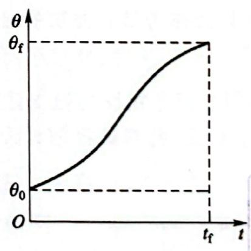

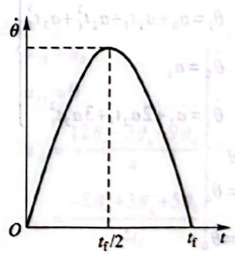

(a) 角位移

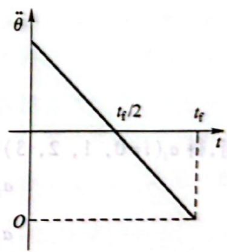

(b) 角速度

(c) 角加速度

图5.8 三次多项式插值的关节运动轨迹

例 5.1 设有一台具有转动关节的机器人, 其在执行一项作业时关节运动历时 2 s。根据需要, 其上某一关节必须运动平稳, 并具有如下作业状态: 初始时, 关节静止不动, 位置 $\theta_{0}=0^{\circ}$ ; 运动结束时, $\theta_{f}=90^{\circ}$ , 此时关节速度为 0。试根据上述要求规划该关节的运动。 

解 根据要求,可以对该关节采用三次多项式插值函数来规划其运动。已知 $\theta_{0}=0^{\circ},\theta_{f}=90^{\circ}$ , $t_{f}=2s$ , 代入式(5.8)可得三次多项式的系数 

(5.4) 

凝血液（6）

$$
a _ {0} = 0. 0, \quad a _ {1} = 0. 0, \quad a _ {2} = 6 7. 5, \quad a _ {3} = - 2 2. 5
$$

由式(5.5)和式(5.6)可确定该关节的运动轨迹,即 

$$
\theta (t) = 6 7. 5 t ^ {2} - 2 2. 5 t ^ {3}
$$

$$
\dot {\theta} (t) = 1 3 5 t - 6 7. 5 t ^ {2}
$$

$$
\ddot {\theta} (t) = 1 3 5 - 1 3 5 t
$$

#### 二、过路径点的三次多项式插值

若所规划的机器人作业路径在多个点上有位姿要求,如图5.9所示,机器人作业除在A、B点 

有位姿要求外，在路径点 C、D 也有位姿要求。对于这种情况，假如末端执行器在路径点停留，即各路径点上速度为 0，则轨迹规划可连续直接使用前面介绍的三次多项式插值方法；但若末端执行器只是经过，并不停留，就需要将前述方法推广。 

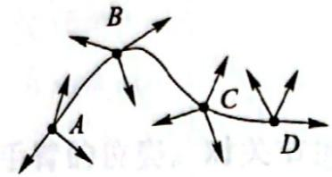

图 5.9 机器人作业路径点

对于机器人作业路径上的所有路径点可以用求解逆向运动学 

的方法先得到多组对应的关节空间路径点,进行轨迹规划时,把每个关节上相邻的两个路径点分别看做起始点和终止点,再确定相应的三次多项式插值函数,把路径点平滑连接起来。一般情况下,这些起始点和终止点的关节运动速度不再为零。 

设路径点上的关节速度已知，在某段路径上，起始点为 $\theta_0$ 和 $\dot{\theta}_0$ ，终止点为 $\theta_{\mathrm{f}}$ 和 $\dot{\theta}_{\mathrm{f}}$ ，这时，确定三次多项式系数的方法与前所述完全一致，只是速度约束条件变为 

$$
\left. \begin{array}{l} \dot {\theta} (0) = \dot {\theta} _ {0} \\ \dot {\theta} (t _ {\mathrm{f}}) = \dot {\theta} _ {\mathrm{f}} \end{array} \right\}\tag{5.11}
$$

利用约束条件确定三次多项式系数,有下列方程组: 

$$
\left. \begin{array}{l} \theta_ {0} = a _ {0} \\ \theta_ {\mathrm{f}} = a _ {0} + a _ {1} t _ {\mathrm{f}} + a _ {2} t _ {\mathrm{f}} ^ {2} + a _ {3} t _ {\mathrm{f}} ^ {3} \\ \dot {\theta} _ {0} = a _ {1} \\ \dot {\theta} _ {\mathrm{f}} = a _ {1} + 2 a _ {2} t _ {\mathrm{f}} + 3 a _ {3} t _ {\mathrm{f}} ^ {2} \end{array} \right\}\tag{5.12}
$$

求解方程组, 得 $a_{i}(i=0,1,2,3)$ 为 

$$
\left. \begin{array}{l} a _ {0} = \theta_ {0} \\ a _ {1} = \dot {\theta} _ {0} \\ a _ {2} = \frac {3}{t _ {\mathrm{f}} ^ {2}} \left(\theta_ {\mathrm{f}} - \theta_ {0}\right) - \frac {2}{t _ {\mathrm{f}}} \dot {\theta} _ {0} - \frac {1}{t _ {\mathrm{f}}} \dot {\theta} _ {\mathrm{f}} \\ a _ {3} = - \frac {2}{t _ {\mathrm{f}} ^ {3}} \left(\theta_ {\mathrm{f}} - \theta_ {0}\right) + \frac {1}{t _ {\mathrm{f}} ^ {2}} \left(\dot {\theta} _ {0} + \dot {\theta} _ {\mathrm{f}}\right) \end{array} \right\}\tag{5.13}
$$

当路径点上的关节速度为0, 即 $\dot{\theta}_{0} = \dot{\theta}_{1} = 0$ 时, 式(5.13)与式(5.8)完全相同, 这就说明了由式(5.13)确定的三次多项式描述了起始点和终止点具有任意给定位置和速度约束条件的运动轨迹。 

例 5.2 对于只有一个中间路径点的机器人作业, 设其路径点处的关节加速度连续。如果 

路径点用三次多项式连接,试确定多项式的所有系数。已知中间路径点的关节角度为 $\theta_{v}$ ,与它相邻的前、后两点的关节角度分别为 $\theta_{0}$ 和 $\theta_{g}$ 。 

解 该机器人路径可分为 $\theta_0$ 到 $\theta_{v}$ 及 $\theta_{v}$ 到 $\theta_{g}$ 两段，可通过由两个三次多项式组成的样条函数连接。设从 $\theta_0$ 到 $\theta_{v}$ 的三次多项式插值函数为 

$$
\theta_ {1} (t) = a _ {1 0} + a _ {1 1} t + a _ {1 2} t ^ {2} + a _ {1 3} t ^ {3}
$$

而从 $\theta_{\mathrm{v}}$ 到 $\theta_{\mathrm{s}}$ 的三次多项式插值函数为 

$$
\theta_ {2} (t) = a _ {2 0} + a _ {2 1} t + a _ {2 2} t ^ {2} + a _ {2 3} t ^ {3}
$$

上述两个三次多项式的时间区间分别是 $[0, t_{n}]$ 和 $[0, t_{n}]$ ，若要保证路径点处的速度及加速度均连续，即存在下列约束条件： 

$$
\left. \begin{array}{l} \dot {\theta} _ {1} (t _ {\mathrm{fl}}) = \dot {\theta} _ {2} (0) \\ \theta_ {1} (t _ {\mathrm{fl}}) = \theta_ {2} (0) \end{array} \right\}
$$

根据约束条件建立的方程组为 

$$
\left. \begin{array}{l} \theta_ {0} = a _ {1 0} \\ \theta_ {\mathrm{v}} = a _ {1 0} + a _ {1 1} t _ {\mathrm{fl}} + a _ {1 2} t _ {\mathrm{fl}} ^ {2} + a _ {1 3} t _ {\mathrm{fl}} ^ {3} \\ \theta_ {\mathrm{v}} = a _ {2 0} \\ \theta_ {\mathrm{g}} = a _ {2 0} + a _ {2 1} t _ {\mathrm{f2}} + a _ {2 2} t _ {\mathrm{f2}} ^ {2} + a _ {2 3} t _ {\mathrm{f2}} ^ {3} \\ 0 = a _ {1 1} \\ 0 = a _ {2 1} + 2 a _ {2 2} t _ {\mathrm{f2}} + 3 a _ {2 3} t _ {\mathrm{f2}} ^ {2} \\ a _ {1 1} + 2 a _ {1 2} t _ {\mathrm{fl}} + 3 a _ {1 3} t _ {\mathrm{fl}} ^ {2} = a _ {2 1} \\ 2 a _ {1 2} + 6 a _ {1 3} t _ {\mathrm{fl}} = 2 a _ {2 2} \end{array} \right\}
$$

上述约束条件组成含有8个未知数的8个线性方程。对于 $t_{\mathrm{fl}} = t_{\mathrm{f2}} = t_{\mathrm{f}}$ 的情况，这个方程组的解为 

$$
\left. \begin{array}{l} a _ {1 0} = \theta_ {0} \\ a _ {1 1} = 0 \\ a _ {1 2} = \frac {1 2 \theta_ {\mathrm{v}} - 3 \theta_ {\mathrm{g}} - 9 \theta_ {0}}{4} \\ a _ {1 3} = \frac {- 8 \theta_ {\mathrm{v}} + 3 \theta_ {\mathrm{g}} + 5 \theta_ {0}}{4 t _ {\mathrm{f}} ^ {3}} \end{array} \right\}
$$

$$
\left. \begin{array}{l} a _ {2 0} = \theta_ {\mathrm{v}} \\ a _ {2 1} = \frac {3 \theta_ {\mathrm{g}} - 3 \theta_ {0}}{4 t _ {\mathrm{f}}} \\ a _ {2 2} = \frac {- 6 \theta_ {\mathrm{v}} + 3 \theta_ {\mathrm{g}} + 3 \theta_ {0}}{2 t _ {\mathrm{f}} ^ {2}} \\ a _ {2 3} = \frac {8 \theta_ {\mathrm{v}} - 5 \theta_ {\mathrm{g}} - 3 \theta_ {0}}{4 t _ {\mathrm{f}} ^ {3}} \end{array} \right\}
$$

在更一般的情况下,包含许多路径点的机器人轨迹可用多个三次多项式表示。包括各路径 点处加速度连续的约束条件构成的方程组能表示成矩阵的形式,由于系数矩阵是三角阵,路径点的速度易于求出。 

#### 三、高阶多项式插值

若对于运动轨迹的要求更为严格,约束条件增加,三次多项式就不能满足需要,须用更高阶的多项式对运动轨迹的路径段进行插值。 

例如,对某段路径的起始点和终止点都规定了关节的位置、速度和加速度,则要用一个五次多项式进行插值,即 

$$
\theta (t) = a _ {0} + a _ {1} t + a _ {2} t ^ {2} + a _ {3} t ^ {3} + a _ {4} t ^ {4} + a _ {5} t ^ {5}\tag{5.14}
$$

多项式的系数 $a_{0}, a_{1}, \cdots, a_{5}$ 必须满足 6 个约束条件： 

$$
\left. \begin{array}{l} \theta_ {0} = a _ {0} \\ \theta_ {\mathrm{f}} = a _ {0} + a _ {1} t _ {\mathrm{f}} + a _ {2} t _ {\mathrm{f}} ^ {2} + a _ {3} t _ {\mathrm{f}} ^ {3} + a _ {4} t _ {\mathrm{f}} ^ {4} + a _ {5} t _ {\mathrm{f}} ^ {5} \\ \dot {\theta} _ {0} = a _ {1} \\ \dot {\theta} _ {\mathrm{f}} = a _ {1} + 2 a _ {2} t _ {\mathrm{f}} + 3 a _ {3} t _ {\mathrm{f}} ^ {2} + 4 a _ {4} t _ {\mathrm{f}} ^ {3} + 5 a _ {5} t _ {\mathrm{f}} ^ {4} \\ \ddot {\theta} _ {0} = 2 a _ {2} \\ \ddot {\theta} _ {\mathrm{f}} = 2 a _ {2} + 6 a _ {3} t _ {\mathrm{f}} + 1 2 a _ {4} t _ {\mathrm{f}} ^ {2} + 2 0 a _ {5} t _ {\mathrm{f}} ^ {3} \end{array} \right\}\tag{5.15}
$$

#### 四、用抛物线过渡的线性插值

在关节空间轨迹规划中,对于给定起始点和终止点的情况选择线性函数插值较为简单,如图5.10所示。然而,单纯线性插值会导致起始点和终止点的关节运动速度不连续,且加速度无穷大,显然在两端点会造成刚性冲击。因此,应对线性函数插值方案进行修正,在线性插值两端点的邻域内设置一段抛物线形缓冲区段。由于抛物线函数对于时间的二阶导数为常数,即相应区段内的加速度恒定,这样保证起始点和终止点的速度平滑过渡,从而使整个轨迹上的位置和速度连续。线性函数与两段抛物线函数平滑地衔接在一起形成的轨迹称为带有抛物线过渡域的线性轨迹,如图5.11所示。 

设两端的抛物线轨迹具有相同的持续时间 $t_{\mathrm{a}}$ ，具有大小相同而符号相反的恒加速度 $\ddot{\theta}$ 。对于这种路径规划存在有多个解，其轨迹不唯一，如图5.12所示。但是，每条路径都对称于时间中点 $t_{\mathrm{h}}$ 和位置中点 $\theta_{\mathrm{h}}$ 。 

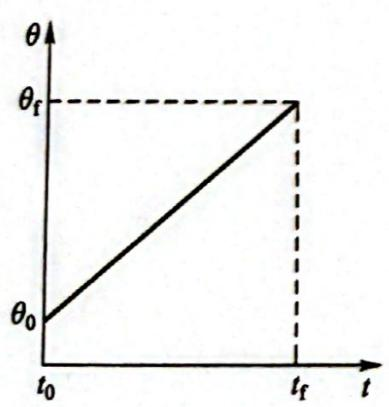

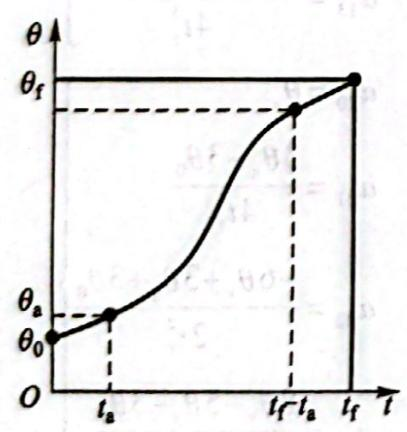

图5.10 两点间的线性

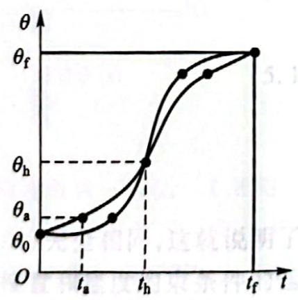

图 5.11 带有抛物线过渡域的线性轨迹

图5.12 轨迹的多解性与

要保证路径轨迹的连续、光滑,即要求抛物线轨迹的终点速度必须等于线性段的速度,故有下列关系: 

$$
\ddot {\theta} t _ {a} = \frac {\theta_ {h} - \theta_ {a}}{t _ {h} - t _ {a}}\tag{5.16}
$$

式中： $\theta_{a}$ 为对应于抛物线持续时间 $t_{a}$ 的关节角度。 $\theta_{a}$ 的值可以按下式求出： 

$$
\theta_ {\mathrm{a}} = \theta_ {0} + \ddot {\theta} t _ {\mathrm{a}} ^ {2} / 2\tag{5.17}
$$

设关节从起始点到终止点的总运动时间为 $t_{\mathrm{f}}$ ，则 $t_\mathrm{f} = 2t_\mathrm{h}$ ，并注意到 

$$
\theta_ {\mathrm{h}} = \left(\theta_ {0} + \theta_ {\mathrm{f}}\right) / 2\tag{5.18}
$$

则由式(5.16)至式(5.18)可得 

$$
\ddot {\theta} t _ {a} ^ {2} - \ddot {\theta} t _ {f} t _ {a} + (\theta_ {f} - \theta_ {0}) = 0\tag{5.19}
$$

一般情况下， $\theta_0, \theta_f, t_f$ 是已知条件，这样根据式(5.16)可以选择相应的 $\ddot{\theta}$ 和 $t_a$ ，得到相应的轨迹。通常的做法是先选定加速度 $\ddot{\theta}$ 的值，然后按式(5.19)求出相应的 $t_a$ ： 

$$
t _ {\mathrm{a}} = \frac {t _ {\mathrm{f}}}{2} - \frac {\sqrt {\ddot {\theta} ^ {2} t _ {\mathrm{f}} ^ {2} - 4 \ddot {\theta} (\theta_ {\mathrm{f}} - \theta_ {0})}}{2 \ddot {\theta}}\tag{5.20}
$$

由式(5.20)可知,为保证 $t_{a}$ 有解,加速度值 $\ddot{\theta}$ 必须选得足够大,即 

$$
\ddot {\theta} \geqslant \frac {4 (\theta_ {\mathrm{f}} - \theta_ {0})}{t _ {\mathrm{f}} ^ {2}}\tag{5.21}
$$

当式(5.21)中的等号成立时,轨迹线性段的长度缩减为零,整个轨迹由两个过渡域组成,这两个过渡域在衔接处的斜率(关节速度)相等;加速度 $\ddot{\theta}$ 的取值愈大,过渡域会变得愈短,若加速度趋于无穷大,轨迹又复归到简单的线性插值情况。 

例 5.3 $\theta_{0}$ 、 $\theta_{f}$ 和 $t_{f}$ 的定义同例 5.1, 若将已知条件改为 $\theta_{0}=15^{\circ},\theta_{f}=75^{\circ},t_{f}=3s$ , 试设计两条带有抛物线过渡的线性轨迹。 

解 根据题意,按式(5.21)定出加速度的取值范围,为此将已知条件代入式(5.21)中,有 $\ddot{\theta}\geqslant26.67^{\circ}/s^{2}$ 。 

##### (1) 设计第一条轨迹

对于第一条轨迹,如果选 $\ddot{\theta}_{1}=42^{\circ}/s^{2}$ ,由式(5.17)计算过渡时间 $t_{al}$ ,则 

$$
t _ {\mathrm{al}} = \left(\frac {3}{2} - \frac {\sqrt {4 2 ^ {2} \times 3 ^ {2} - 4 \times 4 2 \times (7 5 - 1 5)}}{2 \times 4 2}\right) \mathrm{s} = 0. 5 9 \mathrm{s}
$$

用式(5.17)和式(5.16)计算过渡域终了时的关节位置 $\theta_{\mathrm{al}}$ 和关节速度 $\dot{\theta}_{1}$ , 得 

$$
\begin{array}{r l} & \theta_ {\mathrm{al}} = 1 5 ^ {\circ} + \left(\frac {1}{2} \times 4 2 \times 0. 5 9 ^ {2}\right) ^ {\circ} = 2 2. 3 ^ {\circ} \\ & \dot {\theta} _ {1} = \ddot {\theta} _ {1} t _ {\mathrm{al}} = (4 2 \times 0. 5 9) ^ {\circ} / \mathrm{s} = 2 4. 7 8 ^ {\circ} / \mathrm{s} \end{array}
$$

据上面计算得出的数值可以绘出如图 5.13a 所示的轨迹曲线。 

##### (2) 设计第二条轨迹

对于第二条轨迹,若选择 $\ddot{\theta}_{2}=27^{\circ}/s^{2}$ , 可求出 

$$
t _ {a 2} = \left(\frac {3}{2} - \frac {\sqrt {2 7 ^ {2} \times 3 ^ {2} - 4 \times 2 7 \times (7 5 - 1 5)}}{2 \times 2 7}\right) s = 1. 3 3 s
$$

$$
\theta_ {a 2} = 1 5 ^ {\circ} + \left(\frac {1}{2} \times 2 7 \times 1. 3 3 ^ {2}\right) ^ {\circ} = 3 8. 8 8 ^ {\circ}
$$

$$
\dot {\theta} _ {2} = \ddot {\theta} _ {2} t _ {a 2} = (2 7 \times 1. 3 3) ^ {\circ} / s = 3 5. 9 1 ^ {\circ} / s
$$

相应的轨迹曲线如图 5.13b 所示。 

用抛物线过渡的线性函数插值进行轨迹规划的物理概念非常清楚,即如果机器人每一关节电动机采用等加速、等速和等减速运动规律,则关节的位置、速度、加速度随时间变化的曲线如图5.13所示。 

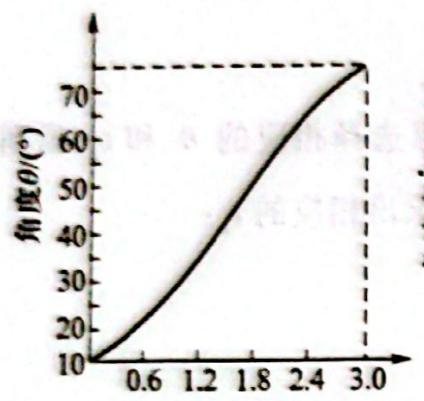

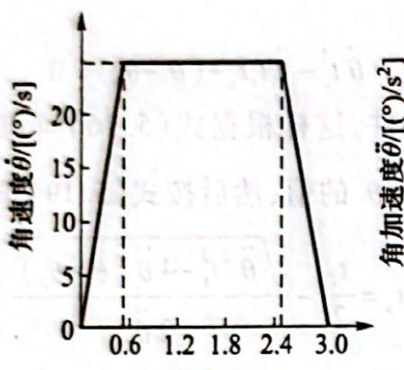

位移时间t/s

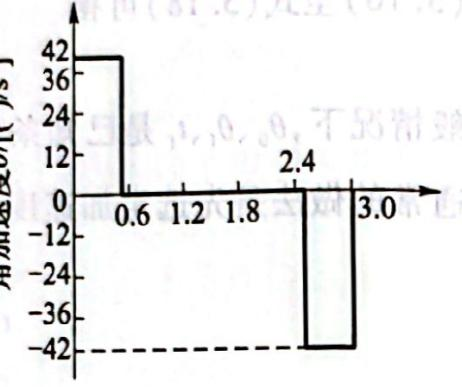

加速度时间 $t / \mathrm{s}$

(a) 加速度较大时的位移、速度、加速度曲线

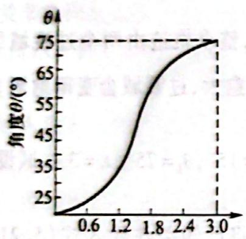

位移时间 $t / \mathrm{s}$

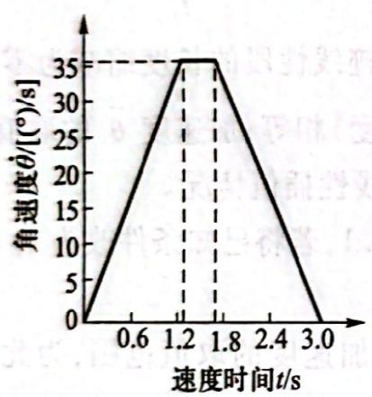

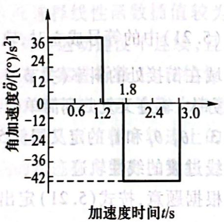

(b) 加速度较小时的位移、速度、加速度曲线

图 5.13 带有抛物线过渡的线性插值

若某个关节的运动要经过一个路径点,则可采用带抛物线过渡域的线性路径方案。如图 5.14 所示,关节的运动要经过一组路径点,用关节角度 $\theta_{j}$ 、 $\theta_{k}$ 和 $\theta_{l}$ 表示其中三个相邻的路径点,以线性函数将每两个相邻路径点之间相连,而所有路径点附近都采用抛物线过渡。 

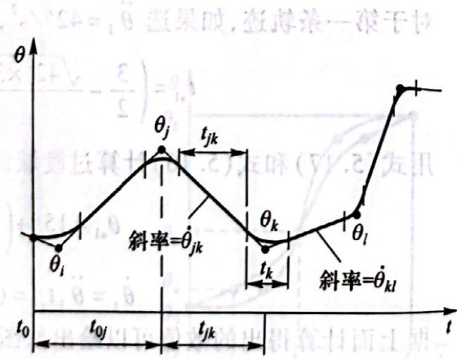

应该注意到:各路径段采用抛物线过渡域线性函数所进行的规划,机器人的运动关节并不能真正到达那些路径点,即使选取的加速度充分大,实际路径也只是十分接近理想路径点,如图5.14所示。 

图 5.14 多段带有抛物线 

过渡域的线性轨迹 

## 5.4 机器人手部路径的轨迹规划

### 5.4.1 操作对象的描述

由前述可知,任一刚体相对参考系的位姿是用与它固接的坐标系来描述的。刚体上相对于 

固接坐标系的任一点用相应的位置矢量 P 表示；任一方向用方向余弦表示。给出刚体的几何图形及固接坐标系后，只要规定固接坐标系的位姿，便可重构该刚体在空间的位姿。 

例如,如图 5.15 所示的螺栓,其轴线与固接坐标系的 Z 轴重合。螺栓头部直径为 32 mm,中心取为坐标原点,螺栓长 80 mm,直径 20 mm,则可根据固接坐标系的位姿重构螺栓在空间的位姿和几何形状。 

### 5.4.2 作业的描述

机器人的作业过程可用手部位姿结点序列来规定,每个结点可用工具坐标系相对于作业坐标系的齐次变换来描述。相应的关节变量可用逆向运动学求解程序计算。 

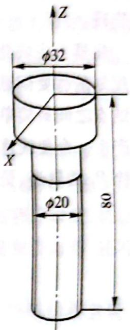

如图 5.16 所示的机器人插螺栓作业,要求把螺栓从槽中取出并放入托架的一个孔中,用符号表示沿轨迹运动的各结点的位姿,使机器人能沿虚线 

图5.15 操作对象的描述

运动并完成作业。设定 $P_{i}(i = 0,1,2,3,4,5)$ 为气动手爪必须经过的直角坐标结点。参照这些结点的位姿将作业描述为如表5.3所示的手部的一连串运动和动作。 

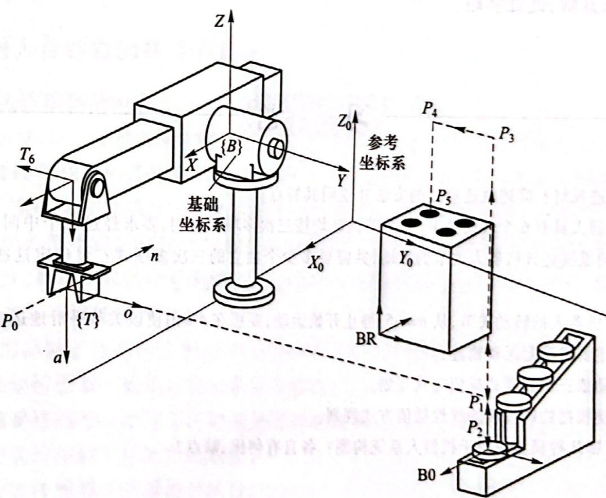

图 5.16 机器人插螺栓作业的轨迹

表 5.3 螺栓的抓取和插入过程

<table><tr><td>结点</td><td><eq>P_0</eq></td><td><eq>P_1</eq></td><td><eq>P_2</eq></td><td><eq>P_3</eq></td><td><eq>P_4</eq></td><td><eq>P_5</eq></td><td><eq>P_6</eq></td></tr><tr><td>运动</td><td>INIT</td><td>MOVE</td><td>MOVE</td><td>GRASP</td><td>MOVE</td><td>MOVE</td><td>RELEASE</td></tr><tr><td>目标</td><td>原始</td><td>接近螺栓</td><td>到达</td><td>抓住</td><td>提升</td><td>接近托架</td><td>松夹</td></tr></table>

第一个结点 $P_{1}$ 对应一个变换方程，从而解出相应的机器人的变换矩阵 ${}^{0}T_{6}$ 。由此得到作业描述的基本结构：作业结点 $P_{1}$ 只对应机器人变换矩阵 ${}^{0}T_{6}$ ，从一个变换到另一变换通过机器人运动实现。 

机器人完成此项作业时气动手爪的位姿可用一系列结点来表示。在直角坐标空间中进行轨迹规划的首要问题是，在结点 $P_{i}$ 和 $P_{i+1}$ 所定义路径的起点和终点之间如何生成一系列中间点。两结点之间最简单的路径是空间的一个直线移动和绕某定轴的转动。运动时间给定之后，则可以产生一个使线速度和角速度受控的运动。如图5.16所示，要生成从结点原位 $P_{0}$ 运动到接近螺栓 $P_{1}$ 的轨迹，更一般地，从任一结点 $P_{i}$ 到下一结点 $P_{i+1}$ 的运动可表示为从 

$$
{ } ^ { 0 } \boldsymbol { T } _ { 6 } { } ^ { 6 } \boldsymbol { T } _ { T } = { } ^ { 0 } \boldsymbol { T } _ { B } { } ^ { B } \boldsymbol { P } _ { i }
$$

即 

$$
{ } ^ { 0 } \boldsymbol { T } _ { 6 } = { } ^ { 0 } \boldsymbol { T } _ { B } { } ^ { B } \boldsymbol { P } _ { i } { } ^ { 6 } \boldsymbol { T } _ { T } ^ { - 1 }\tag{5.22}
$$

到 

$$
{ } ^ { 0 } \boldsymbol { T } _ { 6 } = { } ^ { 0 } \boldsymbol { T } _ { B } { } ^ { B } \boldsymbol { P } _ { i + 1 } { } ^ { 6 } \boldsymbol { T } _ { T } ^ { - 1 }\tag{5.23}
$$

的运动。 

式中： $^{6}T_{T}$ 为工具坐标系 $\{T\}$ 相对末端连杆系 $\{6\}$ 的变换； $^{B}P_{i}$ 和 $^{B}P_{i+1}$ 分别为两结点 $P_{i}$ 和 $P_{i+1}$ 相对坐标系 $\{B\}$ 的齐次变换。 

可将气动手爪从结点 $P_{i}$ 到结点 $P_{i + 1}$ 的运动看成是与气动手爪固接的坐标系的运动，按前述运动学知识可求其解，此处从略。 

## 习题

5.1 何谓轨迹规划？简述轨迹规划的方法并说明其特点。 

5.2 设一机器人具有6个转动关节,其关节运动均按三次多项式规划,要求经过两个中间路径点后停在一个目标位置。试问欲描述该机器人关节的运动,共需要多少个独立的三次多项式?要确定这些三次多项式,需要多少个系数? 

5.3 单连杆机器人的转动关节,从 $\theta = -5^{\circ}$ 静止开始运动,要想在 $4 \mathrm{~s}$ 内使该关节平滑地运动到 $\theta = +80^{\circ}$ 的位置停止。试按下述要求确定运动轨迹: 

(1) 关节运动依三次多项式插值方式规划。 

(2) 关节运动按抛物线过渡的线性插值方式规划。 

5.4 目前有哪几种模型应用于机器人系统构型？各自有何优、缺点？
