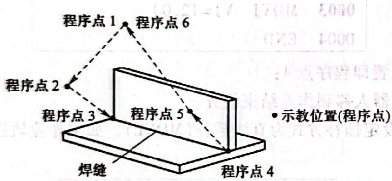
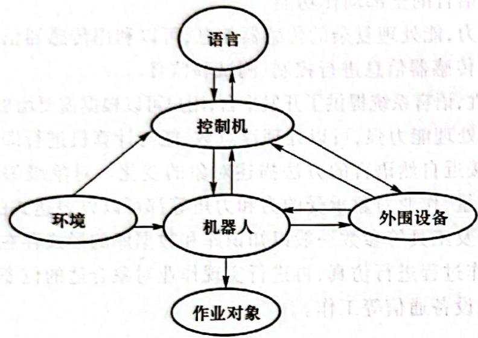
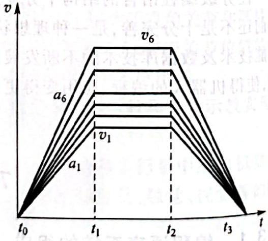
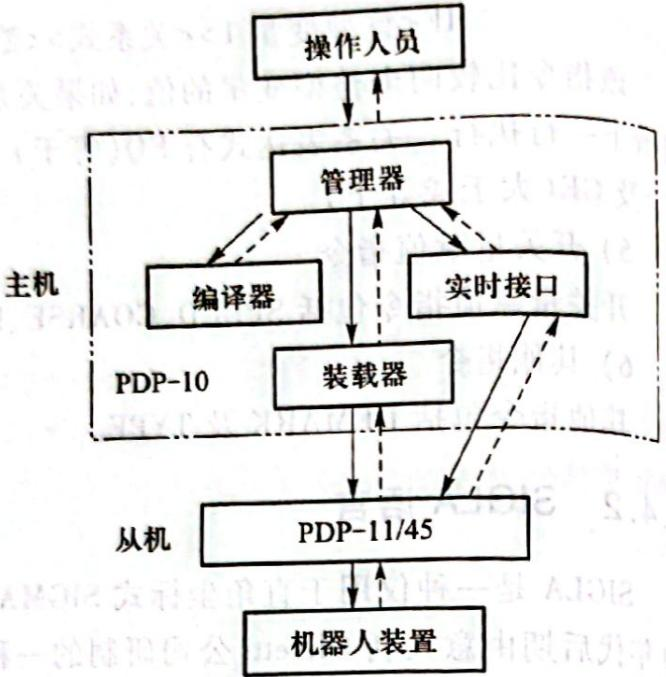
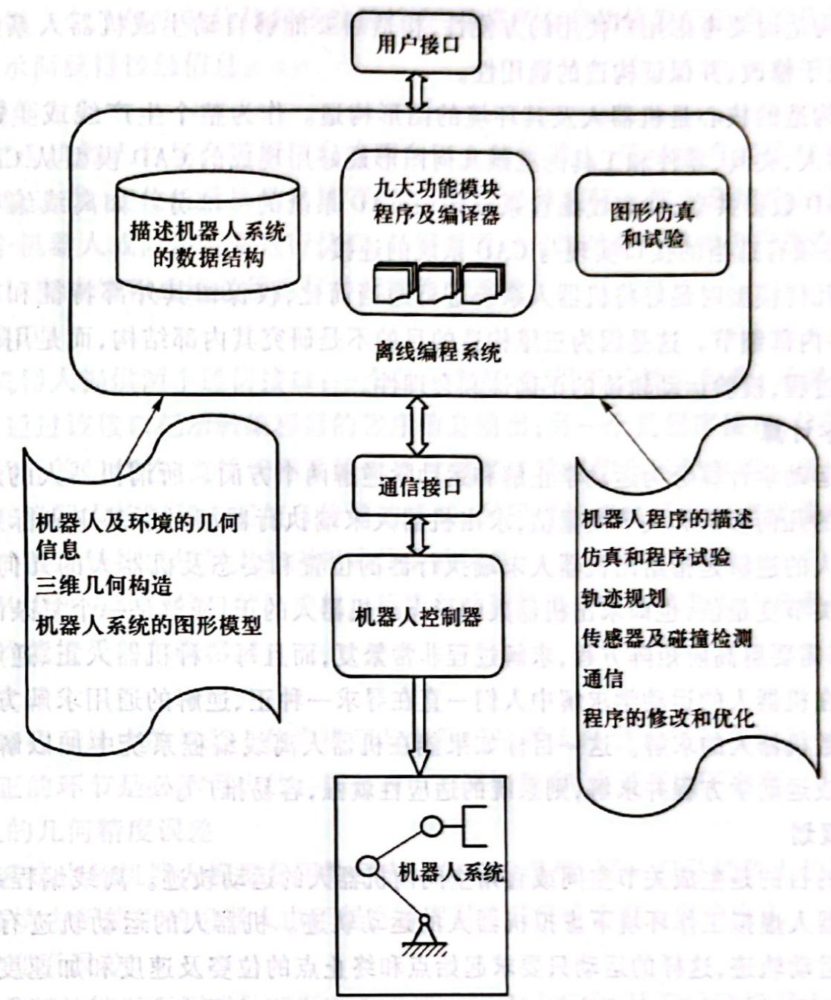
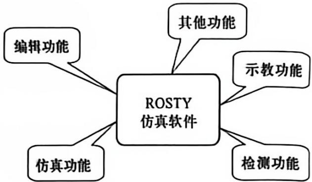

# 第7章 机器人语言与编程

## 7.1 概述

早期的机器人只具有简单的动作功能,采用固定程序控制,动作适应性差。随着机器人技术的发展及对机器人功能要求的提高,希望同一台机器人通过不同的程序能适应各种不同的作业,即机器人具有较好的通用性。鉴于这样的情况,机器人编程语言的研究变得越来越重要,机器人编程语言也层出不穷。机器人编程实际上就是针对某项作业任务而设计的程序,目前有三种机器人编程方法。 

### 一、示教编程

#### 1. 示教编程的特点

示教编程用于示教-再现型机器人中,它是目前大多数工业机器人的编程方式,在机器人作业现场进行。所谓示教编程,即操作者根据机器人作业的需要把机器人末端执行器送到目标位置,且处于相应的姿态,然后把这一位置、姿态所对应的关节角度信息记录到存储器保存。对机器人作业空间的各点重复以上操作,就把整个作业过程记录下来,再通过适当的软件系统,自动生成整个作业过程的程序代码,这个过程就是示教过程。 

机器人实际作业时,再现示教时的作业操作步骤就能完成预定工作。机器人示教产生的程序代码与机器人编程语言的程序指令形式非常类似。示教的方式有手把手示教和示教盒示教。手把手示教就是操作者操纵安装在机器人手臂内的操纵杆,按规定动作顺序示教动作内容。示教盒示教则是操作者利用控制盒上的按钮驱动机器人一步一步运动。 

示教编程的优点是操作简单,易于掌握,操作者不需要具备专门知识,不需复杂的装置和设备,轨迹修改方便,再现过程快。示教编程在一些简单、重复、轨迹或定位精度要求不高的作业中经常被应用,如焊接、堆垛、喷涂及搬运等。 

示教编程的缺点如下：

1）示教相对于再现所需的时间较长，即机器人的有效工作时间短，尤其对一些复杂的动作和轨迹，示教时间远远超过再现时间。 

2）很难示教复杂的运动轨迹及准确度要求高的直线。 

3）示教轨迹的重复性差，两个不同的操作者示教不出同一个轨迹，即使同一个人两次不同的示教也不能产生同一个轨迹。 

4) 无法接受传感器信息。 

5）难以与其他操作或其他机器人操作同步。 

2. MATOMAN 机器人的示教-再现 

如前所述,日本安川公司生产的 MOTOMAN 系列工业机器人是一类典型的示教-再现型机器人。该类机器人主要用于焊接、喷涂等作业,通过示教编程器实现示教编程。以该类机器人中的 MOTOMAN UP6 型机器人为例,示教操作的步骤如下: 

1）打开控制柜上的电源开关，示教编程器上部的液晶显示屏显示控制器内部初始化诊断后的初始画面。 

2）液晶显示屏开始显示系统控制软件菜单界面。 

3）左手提示教编程器上的伺服安全开关，接通伺服电源，此时控制柜上的伺服电源指示灯亮。 

4）按下示教编程器上的示教锁定操作键，此时控制柜正面再现操作盒上的“REMOTE”指示灯处于熄灭状态。 

5）按再现操作盒上的“TEACH”键。 

此时机器人即处于示教状态。其后的一切示教操作都通过操作示教编程器下部的按键进行： 

1）按光标键移动光标，使光标处于显示屏中程序菜单。 

2）按选择键打开程序菜单，接着按光标键移动光标到新建子菜单，按选择键确认，此时可以创建一个新的示教程序，程序名通过移动光标和选择键的组合来确定。 

3）光标移动到执行上，创建的程序被送到控制柜的内存中，程序被显示，NOP和END命令自动生成。 

4）从当前位置移动机器人到完全离开机器人周边物体的位置，输入程序点1。程序点1输入的过程如下： 

① 用轴操作键把机器人移到适合作业准备的位置。 

② 按插补方式键, 把插补方式定为关节插补, 在输入缓冲显示行中以 MOVJ 表示关节插补命令。 

$$
= > \mathrm{MOVJ} \quad \mathrm{VJ} = 0. 7 8
$$

③ 光标停在行号 0000 处, 按选择键。 

④ 光标停在显示速度“VJ=**.**”上,按转换键的同时按光标键,设定再现速度,如设为50%。 

$$
= > \mathrm{MOVJ} \quad \mathrm{VJ} = 5 0. 0 0
$$

⑤ 按回车键, 输入程序点 1(行 0001)。 

$$
\begin{array}{l l} \text {0000} & \text {NOP} \\ \text {0001} & \text {MOVJ} \quad \text {VJ = 50.00} \\ \text {0002} & \text {END} \end{array}
$$

5）输入程序点2，即确定作业开始位置附近的示教点。程序点2输入的过程如下： 

① 用轴操作键设定机器人为可作业姿态。 

② 用轴操作键移动机器人到适当位置。 

③ 按回车键输入程序点 2(行 0002)。 

0000 NOP  
0001 MOVJ VJ=50.00  
0002 MOVJ VJ=50.00  
0003 END 

6) 输入作业开始位置程序点 3: 

① 按手动速度高或低键选择示教速度。 

② 保持程序点 2 的姿态不变, 按坐标键设定机器人坐标系为直角坐标系, 用轴操作键把机器人移到作业开始位置。 

③ 光标在 0002 行处, 按选择键。 

④ 光标位于显示速度“VJ=50.00”上，按转换键的同时按光标键，设定再现速度，例如设为12%。 

$$
= > \mathrm{MOVJ} \quad \mathrm{VJ} = 1 2. 0 0
$$

⑤ 按回车键输入程序点 3。 

7) 输入作业结束位置即程序点 4: 

① 用轴操作键把机器人移到作业结束位置。 

② 按插补方式键, 设定插补方式为直线插补(MOVL)。如果作业轨迹为圆弧, 则插补方式为圆弧插补(MOVC)。 

$$
= > \mathrm{MOVL} \quad \mathrm{V} = 6 6
$$

③ 光标在行号 0003 处, 按选择键。 

④ 光标位于显示速度“V=66”上, 按转换键的同时按光标键, 设定再现速度, 例如把速度设为 $138 \mathrm{~cm} / \mathrm{min}$ 。 

$$
= > \mathrm{MOVL} \quad \mathrm{V} = 1 3 8
$$

⑤ 按回车键输入程序点 4。 

$$
\begin{array}{l l} \text {0000} & \text {NOP} \\ \text {0001} & \text {MOVJ} \quad \text {VJ = 50.00} \\ \text {0002} & \text {MOVJ} \quad \text {VJ = 50.00} \\ \text {0003} & \text {MOVJ} \quad \text {VJ = 12.00} \\ \text {0004} & \text {MOVL} \quad \text {V = 138.00} \\ \text {0005} & \text {END} \end{array}
$$

以后的各点分别为把机器人移到不碰工件和夹具的程序点5、机器人回到开始位置附近的程序点6(需经过适当的操作使之与程序点1重合)等,各点的操作与上述点类似,这里不再赘述。 

8）所有点的示教完成后，进行示教轨迹的确认： 

① 把光标移到程序点 1 所在行。 

② 手动速度设为中速。 

③ 按前进键,利用机器人的动作确认每一个程序点。每按一次前进键,机器人移动一个程序点。 

④ 程序点完成确认后,机器人回到程序起始处。 

⑤ 按下联锁键的同时按试运行键,机器人连续再现所有程序点,一个循环后停止。 

生成的程序还可以进行点位置的修改、程序点插入或删除等，具体方法可参阅相关资料。 

从上面的过程可看出,示教-再现型机器人的操作程序是通过对机器人的示教操作自动生成的。程序中控制机器人运动的命令即为机器人的移动命令,在命令中记录移动到的位置、插补方式及再现速度等。每个程序点前都有程序点号。对于不同用途的机器人,程序中还需插入相应的操作命令。如对于焊接机器人有引弧(ARCON)和熄弧(ARCOF)命令,对于搬运机器人有抓持工件(HAND ON)命令和放置工件(HAND OFF)命令,另外还有定时命令(TIMER T=*)等。 

下面讲述 MOTOMAN UP6 型机器人用于焊接作业时的示教编程示例, 其轨迹如图 7.1 所示。该机器人经过示教自动产生一个作业程序, 如表 7.1 所示。 

图 7.1 MOTOMAN UP6 型机器人焊接示教

表 7.1 焊接参考程序

<table><tr><td>行</td><td>命令</td><td>内容说明</td></tr><tr><td>0000</td><td>NOP</td><td>程序开始</td></tr><tr><td>0001</td><td>MOVJ VJ=25.00</td><td>移到待机位置 程序点1</td></tr><tr><td>0002</td><td>MOVJ VJ=25.00</td><td>移到焊接开始位置附近 程序点2</td></tr><tr><td>0003</td><td>MOVJ VJ=12.5</td><td>移到焊接开始位置 程序点3</td></tr><tr><td>0004</td><td>ARCON</td><td>焊接开始</td></tr><tr><td>0005</td><td>MOVL V=50</td><td>移到焊接结束位置 程序点4</td></tr><tr><td>0006</td><td>ARCOF</td><td>焊接结束</td></tr><tr><td>0007</td><td>MOVJ VJ=25.00</td><td>移到不碰触工件和夹具的位置 程序点5</td></tr><tr><td>0008</td><td>MOVJ VJ=25.00</td><td>移到待机位置 程序点6</td></tr><tr><td>0009</td><td>END</td><td>程序结束</td></tr></table>

要焊接如图7.1所示的焊缝，MOTOMAN UP6型机器人首先在示教状态下走出图示轨迹。点1、6为待机位置，两点重合，选取时需处于工件、夹具不干涉的位置，程序点5在向程序点6移动时，也需处于与工件、夹具不干涉的位置。从点1到点2再到点3和从点4到点5再回到点6为空行程，对轨迹无要求，所以选择工作状态好、效率高的关节插补，生成的代码为MOVJ。空行程中接近焊接轨迹段时选择慢速。程序中关节插补的速度用VJ表示，数值代表最高关节速度的百分比，如 $V_{J}=25$ 表示以关节最高运行速度的25%运动。从点3到点4为焊接轨迹段，以要求的焊接轨迹（这里为直线）走过，生成的代码为MOVL；以规定的焊接速度前进，速度用V表示，单位为mm/s。程序中ARCON为引弧指令，ARCOF为熄弧指令，分别用于引弧的开始和结束，这两个命令也是在示教过程中通过按示教编程器上的功能键自动产生的。NOP表示程序的开始，END表示程序的结束。 

### 二、离线编程

离线编程是在专门的软件环境支持下用专用或通用程序在离线情况下进行机器人轨迹规划编程的一种方法。离线编程程序通过支持软件的解释或编译产生目标程序代码，最后生成机器人路径规划数据。一些离线编程系统带有仿真功能，这使得在编程时就解决了障碍干涉和路径优化问题。这种编程方法与数控机床中编制数控加工程序非常类似。离线编程的发展方向是自动编程。 

### 三、机器人语言编程

机器人语言编程即用专用的机器人语言来描述机器人的动作轨迹。它不但能准确地描述机器人的作业动作，而且能描述机器人的现场作业环境，如对传感器状态信息的描述，更进一步还能引入逻辑判断、决策、规划功能及人工智能。机器人编程语言具有良好的通用性，同一种机器人语言可用于不同类型的机器人，也解决了多台机器人协调工作的问题。 

## 7.2 编程语言类型

伴随着机器人的发展,机器人语言也得到发展和完善。机器人语言已成为机器人技术的一个重要部分。机器人的功能除了依靠机器人硬件的支持外,相当一部分依赖机器人语言来完成。早期的机器人由于功能单一、动作简单,可采用固定程序或示教方式来控制机器人的运动。随着机器人作业动作的多样化和作业环境的复杂化,依靠固定的程序或示教方式已满足不了要求,必须依靠能适应作业和环境随时变化的机器人语言编程来完成机器人的工作。 

自机器人出现以来,美国、日本等机器人的原创国也同时开始进行机器人语言的研究。美国斯坦福大学于1973年研制出世界上第一种机器人语言——WAVE语言。WAVE是一种机器人动作语言,即语言功能以描述机器人的动作为主,兼以力和接触的控制,还能配合视觉传感器进行机器人的手、眼协调控制。 

在 WAVE 语言的基础上,1974 年斯坦福大学人工智能实验室又开发出一种新的语言,称为 AL 语言。这种语言与高级计算机语言 ALGOL 结构相似,是一种编译形式的语言,带有一个指令编译器,能在实时机上控制,用户编写好的机器人语言源程序经编译器编译后对机器人进行任务分配和作业命令控制。AL 语言不仅能描述机器人手部的动作,而且可以记忆作业环境和该环境内物体和物体之间的相对位置,实现多台机器人的协调控制。 

美国 IBM 公司也一直致力于机器人语言的研究,取得了不少成果。1975 年,IBM 公司研制出 ML 语言,主要用于机器人的装配作业。随后该公司又研制出另一种语言——AUTOPASS 语言,这是一种用于装配的更高级语言,它可以对几何模型类任务进行半自动编程。 

美国的 Unimation 公司于 1979 年推出了 VAL 语言。它是在 BASIC 语言基础上扩展的一种机器人语言，因此具有 BASIC 的内核与结构，编程简单，语句简练。VAL 语言成功地用于 PUMA 和 UNIMATE 型机器人。1984 年，Unimation 公司又推出了在 VAL 基础上改进的机器人语言——VAL II 语言。VAL II 语言除了含有 VAL 语言的全部功能外，还增加了对传感器信息的读取，使得可以利用传感器信息进行运动控制。 

20 世纪 80 年代初, 美国 Automatix 公司开发了 RAIL 语言, 该语言可以利用传感器的信息进行零件作业的检测。同时, 麦道公司研制了 MCL 语言, 这是一种在数控自动编程语言即 APT 语言的基础上发展起来的一种机器人语言。MCL 语言特别适用于由数控机床、机器人等组成的柔性加工单元的编程。 

机器人语言种类繁多,而且新的语言层出不穷。这是因为机器人的功能不断拓展,需要新的语言来配合其工作。另外,机器人语言多是针对某种类型的具体机器人而开发的,所以通用性很差,几乎一种新的机器人问世,就有一种新的机器人语言与之配套。 

机器人语言可以按照其作业描述水平的程度分为动作级编程语言、对象级编程语言和任务级编程语言三类。 

### 7.2.1 动作级编程语言

动作级编程语言是最低一级的机器人语言。它以机器人的运动描述为主，通常一条指令对应机器人的一个动作，表示从机器人的一个位姿运动到另一个位姿。动作级编程语言的优点是比较简单，编程容易。其缺点是功能有限，无法进行烦琐、复杂的数学运算，不接受浮点数和字符串，子程序不含有自变量；不能接受复杂的传感器信息，只能接受传感器开关信息；与计算机的通信能力很差。典型的动作级编程语言为VAL语言，如AVL语言语句“MOVE TO (destination)”的含义为机器人从当前位姿运动到目的位姿。 

动作级编程语言编程时分为关节级编程和末端执行器级编程两种。 

#### 一、关节级编程

关节级编程是以机器人的关节为对象,编程时给出机器人一系列各关节位置的时间序列,在关节坐标系中进行的一种编程方法。对于直角坐标型机器人和圆柱坐标型机器人,由于直角关节和圆柱关节的表示比较简单,这种方法编程较为适用;而对于具有回转关节的关节型机器人,由于关节位置的时间序列表示困难,即使一个简单的动作也要经过许多复杂的运算,故这一方法并不适用。 

关节级编程可以通过简单的编程指令来实现,也可以通过示教编程器示教和键入示教实现。 

#### 二、末端执行器级编程

末端执行器级编程在机器人作业空间的直角坐标系中进行。在此直角坐标系中给出机器人末端执行器一系列位姿组成位姿的时间序列，连同其他一些辅助功能如力觉、触觉、视觉等的时间序列，同时确定作业量、作业工具等，协调地进行机器人动作的控制。 

这种编程方法允许有简单的条件分支,有感知功能,可以选择和设定工具,有时还有并行功能,数据实时处理能力强。 

### 7.2.2 对象级编程语言

所谓对象即作业及作业物体本身。对象级编程语言是比动作级编程语言高一级的编程语言，它不需要描述机器人手部的运动，只要由编程人员用程序的形式给出作业本身顺序过程的描述和环境模型的描述，即描述操作物与操作物之间的关系。通过编译程序机器人即能知道如何动作。这类语言典型的例子有AML及AUTOPASS等语言，其特点如下： 

1) 具有动作级编程语言的全部动作功能。 

2) 有较强的感知能力,能处理复杂的传感器信息,可以利用传感器信息来修改、更新环境的描述和模型,也可以利用传感器信息进行控制、测试和监督。 

3) 具有良好的开放性,语言系统提供了开发平台,用户可以根据需要增加指令,扩展语言功能。
4) 数字计算和数据处理能力强,可以处理浮点数,能与计算机进行即时通信。 

对象级编程语言用接近自然语言的方法描述对象的变化。对象级编程语言的运算功能、作业对象的位姿时序、作业量、作业对象承受的力和力矩等都可以以表达式的形式出现。系统中机器人尺寸参数、作业对象及工具等参数一般以知识库和数据库的形式存在，系统编译程序时获取这些信息后对机器人动作过程进行仿真，再进行实现作业对象合适的位姿，获取传感器信息并处理，回避障碍以及与其他设备通信等工作。 

### 7.2.3 任务级编程语言

任务级编程语言是比前两类更高级的一种语言,也是最理想的机器人高级语言。这类语言不需要用机器人的动作来描述作业任务,也不需要描述机器人操作物的中间状态,只需要按照某种规则描述机器人操作物的初始状态和最终目标状态,机器人语言系统即可利用已有的环境信息和知识库、数据库自动进行推理、计算,从而自动生成机器人详细的动作、顺序和数据。例如,一装配机器人欲完成某一螺钉的装配,螺钉的初始位置和装配后的目标位置已知,当发出抓取螺钉的命令时,语言系统从初始位置到目标位置之间寻找路径,在复杂的作业环境中找出一条不会与周围障碍物产生碰撞的合适路径,在初始位置选择恰当的姿态抓取螺钉,沿此路径运动到目标位置。在此过程中,作业中间状态作业方案的设计、工序的选择、动作的前后安排等一系列问题都由计算机自动完成。 

任务级编程语言的结构十分复杂,需要人工智能的理论基础和大型知识库、数据库的支持,目前还不是十分完善,是一种理想状态下的语言,有待于进一步的研究。但可以相信,随着人工智能技术及数据库技术的不断发展,任务级编程语言必将取代其他语言而成为机器人语言的主流,使得机器人的编程、应用变得更加简单。 

## 7.3 编程语言系统

### 7.3.1 编程语言系统的组成

一般计算机语言单指语言本身,而机器人编程语言像一个计算机系统,包括硬件、软件和被 控设备。即机器人语言包括语言本身、运行语言的控制机、机器人、作业对象、周围环境和外围设备接口等。机器人编程语言系统的组成如图7.2所示，图中的箭头表示信息的流向。机器人语言的所有指令均通过控制机经过程序的编译、解释后发出控制信号。控制机一方面向机器人发出运动控制信号，另一方面向外围设备发出控制信号，外围设备如机器人焊接系统中的电焊机以及机器人搬运系统中的空压机等。周围环境通过感知系统把环境信息通过控制机反馈给语言，而这里的环境是指机器人作业空间内的作业对象位置、姿态以及作业对象之间的相互关系。 

图7.2 机器人编程语言系统的组成

### 7.3.2 编程语言系统的基本功能

#### 一、运算功能

运算功能是机器人最重要的功能之一。对于装有传感器的机器人所进行的主要是解析几何运算，包括机器人的正解、逆解、坐标变换及矢量运算等。根据运算的结果，机器人能自行决定工具或手爪下一步应到达何处。 

#### 二、运动功能

运动功能是机器人最基本的功能。机器人的设计目的是用它来代替人的繁复劳动,因此机器人发展到今天,不管其功能多么复杂,动作控制仍然是其基本功能,也是机器人语言系统的基本功能。 

机器人的运动功能就是机器人语言用最简单的方法向各关节伺服装置提供一系列关节位置及姿态信息，由伺服系统实现运动。对于具有路径轨迹要求的运动，这一系列位姿必须是路径上点的机器人位姿，并要求从起始点到终止点机器人的各关节必须同时开始和同时结束运动，即多关节协调运动。因此，由于机器人各关节运动的位移不一样，机器人的各关节必须以不同的速度运动。图7.3所示为六关节机器人的多轴协调运动。 

运动描述的坐标系可以根据需要来定义,如笛卡儿坐标系、关节坐标系、工具坐标系及工件坐标系等,最佳的情 具所定义的坐标系与机器人的形状无关。 

图 7.3 六轴同时启动、

同时停止的协调运动

运动描述可以分为绝对运动和相对运动。绝对运动每一次把工具带到工作空间的绝对位置，该位置与本次运动的起始位置无关；相对运动到达的位置与起始位置有关，是对起始位置的一个相对值。一个相对运动的运动子程序能够从最后一个相对运动出发，把工具带回到它的初始位置。 

#### 三、决策功能

所谓决策功能,就是指机器人根据作业空间范围内的传感信息不做任何运算而做出的判断决策。这种决策功能一般用条件转移指令由分支程序来实现。条件满足则执行一个分支,不满足则执行另一个分支。决策功能需使用这样一些条件:符号校验(正、负或0)、关系检验(大于、小于、不等于)、布尔校验(开或关、真或假)、逻辑校验(逻辑位值的检验)以及集合校验(一个集合的数、空集等)等。 

#### 四、通信功能

通信功能即机器人系统与操作人员的通信,包括机器人向操作人员要求信息和操作人员获取机器人的状态、人的操作意图等,其中许多通信功能由外部设备来协助提供。 

机器人向操作人员提供信息的外部设备有信号灯、绘图仪或图形显示屏、声音或语言合成器等。操作人员对机器人“说话”的外部设备有按钮、旋钮和指压开关、数字或字母键盘、光笔、光标指示器或数字转换板以及光电阅读机等。 

#### 五、工具功能

工具功能包括工具种类及工具号的选择、工具参数的选择及工具的动作(工具的开关、分合)。工具的动作一般由某个开关或触发器的动作来实现,如搬运机器人手爪的开合由气缸上行程开关的触发与否决定,行程开关的两种状态分别发出相应信号使气缸运动,从而完成手爪的开合。 

#### 六、传感数据处理功能

机器人只有与传感器连接起来才能具有感知能力,具有某种智能。如前所述,机器人中的传感器是多种多样的,按照功能来划分,有以下几种: 

1) 力和力矩传感器。 

2）触觉传感器。 

3）接近觉传感器。 

4）视觉传感器。 

这些传感器输入和输出信号的形式、性质及强弱不同，往往需要进行大量的复杂运算和处理。如视觉信息的获取由视觉传感器获得，但一个视觉图像需要大量的像素信息。 

## 7.4 常用的机器人编程语言

### 7.4.1 VAL语言

#### 一、VAL语言及特点

VAL 语言是美国 Unimation 公司于 1979 年推出的一种机器人编程语言, 主要配置在 PUMA 和 UNIMATION 等类型机器人上, 是一种专用的动作类描述语言。VAL 语言是在 BASIC 语言的基础上发展起来的, 所以与 BASIC 语言的结构很相似。在 VAL 语言的基础上, Unimation 公司又推出了 VAL II 语言。 

VAL 语言可应用于上、下两级计算机控制的机器人系统。上位机为 LSI-11/23，编程在上位机中进行，上位机进行系统的管理；下位机为 6503 微处理器，主要控制各关节的实时运动。编程时可以 VAL 语言和 6503 汇编语言混合编程。 

VAL 语言命令简单, 清晰易懂, 描述机器人作业动作及与上位机的通信均较方便, 实时功能强; 可以在在线和离线两种状态下编程, 适用于多种计算机控制的机器人; 能够迅速地计算出不同坐标系下复杂运动的连续轨迹, 能连续生成机器人的控制信号, 可以与操作人员交互地在线修改程序和生成程序; VAL 语言包含有一些子程序库, 通过调用各种不同的子程序可很快组合成复杂操作控制; 能与外部存储器进行快速数据传输, 以保存程序和数据。 

VAL 语言系统包括文本编辑、系统命令和编程语言三个部分。 

在文本编辑状态下可以通过键盘输入文本程序,也可通过示教编程器在示教方式下输入程序。在输入过程中可修改、编辑、生成程序,最后保存到存储器中。在文本编辑状态下也可以调用已存在的程序。 

系统命令包括位置定义、程序和数据列表、程序和数据存储、系统状态设置和控制、系统开关控制、系统诊断和修改。 

编程语言把一条条程序语句转换执行。 

#### 二、VAL语言的指令

VAL 语言包括监控指令和程序指令两种。其中监控指令有六类,分别为位置及姿态定义指令、程序编辑指令、列表指令、存储指令、控制程序执行指令和系统状态控制指令。各类指令的具体形式及功能如下: 

##### 1. 监控指令

##### 1）位置及姿态定义指令

POINT 指令:执行终端位置、姿态的齐次变换或以关节位置表示的精确点位赋值。 

其格式有两种： 

或 

$$
\begin{array}{r l} & \mathrm{POINT< 变量>[=< 变量2>...< 变量n>]} \\ & \mathrm{POINT< 精确点>[=< 精确点2>]} \end{array}
$$

例如： 

$$
\text {   POINT   } \quad \text {   PICK1   } = \text {   PICK2   }
$$

指令的功能是置变量 PICK1 的值等于 PICK2 的值。 

又如： 

POINT #PARK

是准备定义或修改精确点 PARK。 

DPOINT 指令: 删除包括精确点或变量在内的任意数量的位置变量。 

HERE 指令: 使变量或精确点的值等于当前机器人的位置。 

例如： 

HERE PLACK 

定义变量 PLACK 等于当前机器人的位置。 

WHERE 指令:用来显示机器人在直角坐标系中的当前位置和关节变量值。 

BASE 指令:用来设置参考坐标系,系统规定参考系原点在关节 1 和 2 轴线的交点处,方向沿固定轴的方向。 

格式： 

$$
\mathrm{BASE} [ \langle \mathrm{d} X \rangle ], [ \langle \mathrm{d} Y \rangle ], [ \langle \mathrm{d} Z \rangle ], [ \langle Z \mathrm{向旋转方向} \rangle ]
$$

例如： 

BASE 300, -50, 30

是重新定义基准坐标系的位置,它从初始位置向 X 方向移 300,沿 Z 的负方向移 50,再绕 Z 轴旋转了 $30^{\circ}$ 。 

TOOLI 指令: 对工具终端相对工具支承面的位置和姿态赋值。 

##### 2) 程序编辑指令

EDIT 指令: 允许用户建立或修改一个指定名字的程序, 可以指定被编辑程序的起始行号。其格式如下: 

EDIT[<程序名>], [<行号>]

如果没有指定行号,则从程序的第一行开始编辑;如果没有指定程序名,则上次最后编辑的程序被响应。 

用 EDIT 指令进入编辑状态后, 可以用 C、D、E、I、L、P、R、S、T 等命令来进一步编辑。如: 

C 命令: 改变编辑的程序, 用一个新的程序代替。 

D 命令: 删除从当前行算起的 n 行程序, n 默认时为删除当前行。 

E 命令: 退出编辑状态, 返回监控模式。 

I命令:将当前指令下移一行,以便插入一条指令。 

P命令:显示从当前行往下 n 行的程序文本内容。 

T命令:初始化关节插值程序示教模式。 

##### 3) 列表指令

DIRECTORY 指令: 显示存储器中的全部用户程序名。 

LISTL 指令: 显示任意个位置变量值。 

LISTP 指令: 显示任意个用户的全部程序。 

##### 4) 存储指令

FORMAT 指令:执行磁盘格式化。 

STOREP 指令: 在指定的磁盘文件内存储指定的程序。 

STOREL 指令: 存储用户程序中注明的全部位置变量名和变量值。 

LISTF 指令: 显示软盘中当前输入的文件目录。 

LOADP 指令: 将文件中的程序送入系统内存。 

LOADL 指令: 将文件中指定的位置变量送入系统内存。 

DELETE 指令:撤销磁盘中指定的文件。 

COMPRESS 指令: 只用来压缩磁盘空间。 

ERASE 指令: 擦除磁盘内容并初始化。 

##### 5）控制程序执行指令

ABORT 指令:执行此指令后紧急停止(紧停)。 

DO 指令:执行单步指令。 

EXECUTE 指令:执行用户指定的程序 n 次, n 可以从 -32768 到 32767, 当 n 被省略时, 程序执行一次。 

NEXT 指令: 控制程序在单步方式下执行。 

PROCEED 指令: 实现在某一步暂停、急停或运行错误后, 自下一步起继续执行程序。 

RETRY 指令: 在某一步出现运行错误后, 仍自那一步重新运行程序。 

SPEED 指令: 指定程序控制下机器人的运动速度, 其值从 0.01 到 327.67, 一般正常速度为 100. 

##### 6）系统状态控制指令

CALIB 指令:校准关节位置传感器。 

STATUS 指令:用来显示用户程序的状态。 

FREE 指令:用来显示当前未使用的存储容量。 

ENABL 指令: 用于开、关系统硬件。 

ZERO 指令: 清除全部用户程序和定义的位置, 重新初始化。 

DONE: 停止监控程序, 进入硬件调试状态。 

##### 2. 程序指令

##### 1）运动指令

运动指令包括 GO、MOVE、MOVEI、MOVES、DRAW、APPRO、APPROS、DEPART、DRIVE、READY、OPEN、OPENI、CLOSE、CLOSEI、RELAX、GRASP 及 DELAY 等。 

这些指令大部分具有使机器人按照特定的方式从一个位姿运动到另一个位姿的功能,部分指令表示机器人手爪的开合。例如: 

$$
\mathrm{MOVE} \# \mathrm{PICK!}
$$

表示机器人由关节插值运动到精确 PICK 所定义的位置。“！”表示位置变量已有自己的值。 

$$
\mathrm{MOVEI} \quad <   \text {位置} >, <   \text {手开度} >
$$

其功能是生成关节插值运动使机器人到达位置变量所给定的位姿,运动中若手为伺服控制,则手由闭合改变到手开度变量给定的值。 

又例如： 

OPEN[<手开度>]

表示使机器人手爪打开到指定的开度。 

##### 2）机器人位姿控制指令

机器人位姿控制指令包括 RIGHTY、LEFTY、ABOVE、BELOW、FLIP 及 NOFLIP 等。 

##### 3）赋值指令

赋值指令有 SETI、TYPEI、HERE、SET、SHIFT、TOOL、INVERSE 及 FRAME。 

##### 4）控制指令

控制指令有 GOTO、GOSUB、RETURN、IF、IFSIG、REACT、REACTI、IGNORE、SIGNAL、WAIT、PAUSE 及 STOP。其中 GOTO、GOSUB 实现程序的无条件转移，而 IF 指令执行有条件转移。IF 指令的格式如下： 

IF<整型变量1><关系式><整型变量2><关系式>THEN<标识符>

该指令比较两个整型变量的值,如果关系状态为真,程序转到标识符指定的行去执行,否则接着下一行执行。关系表达式有 EQ(等于)、NE(不等于)、LT(小于)、GT(大于)、LE(小于或等于)及 GE(大于或等于)。 

##### 5）开关量赋值指令

开关量赋值指令包括 SPEED、COARSE、FINE、NONULL、NULL、INTOFF 及 INTON。 

##### 6) 其他指令

其他指令包括 REMARK 及 TYPE。 

### 7.4.2 SIGLA 语言

SIGLA 是一种仅用于直角坐标式 SIGMA 装配型机器人运动控制时的编程语言, 是 20 世纪 70 年代后期由意大利 Olivetti 公司研制的一种简单的非文本语言。 

这种语言主要用于装配任务的控制,它可以把装配任务划分为一些装配子任务,如取旋具,在螺钉上料器上取螺钉、搬运螺钉、定位螺钉、装入螺钉、紧固螺钉等。编程时预先编制子程序,然后用子程序调用的方式来完成。 

### 7.4.3 IML语言

IML 语言也是一种着眼于末端执行器的动作级语言,由日本九州大学开发而成。IML 语言的特点是编程简单,能人机对话,适合于现场操作,许多复杂动作可由简单的指令来实现,易被操作者掌握。 

IML 语言用直角坐标系描述机器人和目标物的位置和姿态。坐标系分两种,一种是机座坐标系,一种是固连在机器人作业空间上的工作坐标系。IML 语言以指令形式编程,可以表示机器人的工作点、运动轨迹、目标物的位置及姿态等信息,从而可以直接编程。往返作业可不用循环语句描述,示教的轨迹能定义成指令插到语句中,还能完成某些力的施加。 

IML 语言的主要指令有运动指令 MOVE、速度指令 SPEED、停止指令 STOP、手指开合指令 OPEN 及 CLOSE、坐标系定义指令 COORD、轨迹定义指令 TRAJ、位置定义指令 HERE、程序控制指令 IF…THEN、FOR EACH 语句、CASE 语句及 DEFINE 等。 

### 7.4.4 AL语言

#### 一、AL 语言概述

AL 语言是 20 世纪 70 年代中期美国斯坦福大学人工智能研究所开发研制的一种机器人语言, 它是在 WAVE 语言的基础上开发出来的, 也是一种动作级编程语言, 但兼有对象级编程语言的某些特征, 使用于装配作业。它的结构及特点类似于 Pascal 语言, 可以编译成机器语言在实时控制机上运行, 具有实时编译语言的结构和特征, 如可以同步操作、条件操作等。AL 语言设计的原始目的是用于具有传感器信息反馈的多台机器人或机械手的并行或协调控制编程。 

运行 AL 语言的系统硬件环境包括主、从两级计算机控制, 如图 7.4 所示。主机为 PDP-10, 主机内的管理器负责管理协调各部分的工作, 编译器负责对 AL 语言的指令进行编译并检查程序, 实时接口负责主、从机之间的接口连接, 装载器负责分配程序。从机为 PDP-11/45。 

主机的功能是对 AL 语言进行编译,对机器人的动作进行规划;从机接受主机发出的动作规划命令,进行轨迹及关节参数的实时计算,最后对机器人发出具体的动作指令。 

#### 二、AL语言的编程格式

1）程序以 BEGIN 开始，由 END 结束。 

2）语句与语句之间用分号隔开。 

3）变量先定义说明其类型，后使用。变量名以英文字母开头，由字母、数字和下画线组成，字母不分大、小写。 

4）程序的注释用大括号括起来。 

5）变量赋值语句中如所赋的内容为表达式，则先计算表达式的值，再把该值赋给等式左边的变量。 

图 7.4 AL 语言运行的硬件环境 

#### 三、AL语言中数据的类型

1）标量(scalar) 可以是时间、距离、角度及力等，可以进行加、减、乘、除和指数运算，也可以进行三角函数、自然对数和指数换算。 

2）矢量（vector）与数学中的矢量类似，可以由若干个量纲相同的标量来构造一个矢量。 

3）旋转（rot）用来描述一个轴的旋转或绕某个轴的旋转以表示姿态。用ROT变量表示旋转变量时带有两个参数，一个代表旋转轴的简单矢量，另一个表示旋转角度。 

4）坐标系(frame) 用来建立坐标系,变量的值表示物体固连坐标系与空间作业的参考坐标系之间的相对位置与姿态。 

5）变换(trans) 用来进行坐标变换,具有旋转和矢量两个参数,执行时先旋转再平移。 

#### 四、AL语言的语句介绍

1. MOVE 语句 

用来描述机器人手部的运动,如从一个位置运动到另一个位置。MOVE 语句的格式为 MOVE<HAND>TO<目的地> 

2. 手爪控制语句 

OPEN: 手爪打开语句。 

CLOSE: 手爪闭合语句。 

语句的格式为 

$$
\begin{array}{l} \text {OPEN <   HAND > TO <   SVAL>} \\ \text {CLOSE <   HAND > TO <   SVAL>} \end{array}
$$

其中 SVAL 为开度距离值, 在程序中已预先指定。 

##### 3. 控制语句

与 Pascal 语言类似, 控制语句有下面几种: 

IF<条件>THEN<语句>ELSE<语句>
WHILE<条件>DO<语句> 

CASE<语句>

DO<语句>UNTIL<条件> 

FOR…STEP…UNTIL… 

4. AFFIX 和 UNFIX 语句 

在装配过程中经常出现将一个物体粘到另一个物体上或一个物体从另一个物体上分离的操作。语句 AFFIX 为两物体结合的操作，语句 AFFIX 为两物体分离的操作。 

例如:BEAM_BORE 和 BEAM 分别为两个坐标系,执行语句 

$$
\text { AFFIX   BEAM\_BORE   TO   BEAM }
$$

后两个坐标系就附着在一起了,即一个坐标系的运动也将引起另一个坐标系的同样运动。然后执行下面的语句: 

UNFIX BEAM_BORE FROM BEAM

两坐标系的附着关系被解除。 

##### 5. 力觉的处理

在 MOVE 语句中使用条件监控子语句可实现使用传感器信息来完成一定的动作。 

监控子语句如： 

ON<条件> DO<动作>

例如： 

$$
\text { MOVE   BARM   TO } \oplus - 0. 1 * \text { INCHES   ON   FORCE(Z) } > 1 0 * \text { OUNCES   DO   STOP }
$$

表示在当前位置沿 $Z$ 轴向下移动0.1英寸, 如果感觉 $Z$ 轴方向的力超过10盎司, 则立即命令机械手停止运动。 

## 7.5 机器人离线编程

随着大批量工业化生产向单件、小批量、多品种生产方式转化，生产系统越来越趋向于柔性制造系统(FMS)和集成制造系统(CIMS)。这样一些系统包含数控机床、机器人等自动化设备，结合CAD/CAM技术，由多层控制系统控制，具有很大的灵活性和很高的生产适应性。系统是一个连续协调工作的整体，其中任何一个生产要素停止工作都必将迫使整个系统的生产工作停止。例如用示教编程来控制机器人时，示教或修改程序时需让整体生产线停下来，占用了生产时间，所以其不适应于这种场合。另外，FMS和CIMS是大型的复杂系统，如果用机器人语言编程，编好的程序不经过离线仿真就直接用在生产系统中，很可能引起干涉、碰撞，有时甚至造成生产系统的损坏，所以可以独立于机器人在计算机系统上实现的一种编程方法——机器人离线编程就应运而生了。 

### 7.5.1 机器人离线编程的特点及功能

用机器人离线方式编制的机器人离线编程系统，在不接触实际机器人及机器人作业环境的情况下，通过图形技术，在计算机上提供一个和机器人进行交互作用的虚拟现实环境。 

机器人离线编程系统是在机器人编程语言的基础上发展起来的,是机器人语言的拓展。它利用机器人图形学的成果,建立起机器人及其作业环境的模型,再利用一些规划算法,通过对图 形的操作和控制，在离线的情况下进行轨迹规划。 

#### 一、机器人离线编程的优点

与其他编程方法相比,机器人离线编程具有下列优点: 

1) 减少机器人的非工作时间。当机器人在生产线或柔性系统中进行正常工作时，编程员可对下一个任务进行离线编程仿真，这样编程不占用生产时间，提高了机器人的利用率，从而可提高整个生产系统的工作效率。 

2）使编程员远离危险的作业环境。由于机器人是一个高速的自动执行机，而且作业现场环境复杂，如果采用示教这样的编程方法，编程员必须在作业现场靠近机器人末端执行器才能很好地观察机器人位姿，这样机器人的运动可能会给操作人员带来危险，而离线编程不必在作业现场进行。 

3）使用范围广。同一个离线编程系统可以适应各种机器人的编程。 

4）便于构建 FMS 和 CIMS 系统。FMS 和 CIMS 系统中有许多搬运、装配等工作需要由预先进行离线编程的机器人来完成，机器人与 CAD/CAM 系统结合，做到机器人及 CAD/CAM 的一体化。 

5）可使用高级机器人语言对复杂系统及任务进行编程。 

6）便于修改程序。 

一般的机器人语言是对机器人动作的描述。当然，有些机器人语言还具有简单环境构造功能。但对于目前常用的动作级和对象级机器人语言来说，用数字构造环境这样的工作的算法复杂，计算量大且程序冗长。而对任务级语言来说，一方面高水平的任务级语言尚在研制中，另一方面任务级语言要求复杂的机器人环境模型的支持，需借助人工智能技术，才能自动生成控制决策和轨迹规划。 

#### 二、机器人离线编程的过程及主要内容

机器人离线编程不仅需要掌握机器人的有关知识,还需要掌握数学、计算机及通信的有关知识,另外必须对生产过程及环境透彻了解,所以它是一个复杂的工作过程。机器人离线编程大约需要经历下面的一些过程: 

1）对生产过程及机器人作业环境进行全面的了解。 

2）构造出机器人及作业环境的三维实体模型。 

3）选用通用或专用的基于图形的计算机语言。 

4）利用几何学、运动学及动力学的知识。 

5）进行轨迹规划、算法检查、屏幕动态仿真，即检查关节超限及传感器碰撞的情况，规划机器人在动作空间的路径和运动轨迹。 

6）进行传感器接口连接和仿真，利用传感器信息进行决策和规划。 

7）实现通信接口，完成离线编程系统所生成的代码到各种机器人控制器的通信。 

8）实现用户接口，提供有效的人机界面，便于人工干预和进行系统操作。 

最后完成的离线编程及仿真还需考虑理想模型和实际机器人系统之间的差异,可以预测两者的误差,然后对离线编程进行修正,直到误差在容许范围内。 

### 7.5.2 机器人离线编程系统的结构

机器人离线编程系统的结构框图如图7.5所示，主要由用户接口、机器人系统的三维几何构造、运动学计算、轨迹规划、动力学仿真、传感器仿真、并行操作、通信接口和误差校正九部分组成。 

图 7.5 机器人离线编程系统结构框图

#### 一、用户接口

用户接口即人机界面,是计算机和操作人员之间信息交互的唯一途径,它的方便与否直接决定了离线编程系统的优劣。设计离线编程系统方案时,就应该考虑建立一个方便实用、界面直观的用户接口,通过它产生机器人系统编程的环境并快捷地进行人机交互。离线编程的用户接口一般要求具有图形仿真界面和文本编辑界面。文本编辑方式下的界面用于对机器人程序的编辑、编译等,而图形界面用于对机器人及环境的图形仿真和编辑。用户可以通过操作鼠标和光标等交互工具改变屏幕上机器人及环境几何模型的位置和形态。通过通信接口及联机至用户接口可以实现对实际机器人的控制,使之与屏幕机器人的位姿一致。 

#### 二、机器人系统的三维几何构造

三维几何构造是离线编程的特色之一,正是有了三维几何构造模型才能进行图形及环境的仿真。 

三维几何构造的方法有结构立体几何表示、扫描变换表示及边界表示三种。其中边界表示最便于形体的数字表示、运算、修改和显示，扫描变换表示便于生成轴对称图形，而结构立体几何表示所覆盖的形体较多。机器人的三维几何构造一般采用这三种方法的综合。 

三维几何构造时要考虑用户使用的方便性,构造后要能够自动生成机器人系统的图形信息和拓扑信息,便于修改,并保证构造的通用性。 

三维几何构造的核心是机器人及其环境的图形构造。作为整个生产线或生产系统的一部分，构造的机器人、夹具、零件和工具的三维几何图形最好用现成的 CAD 模型从 CAD 系统获得，这样可实现 CAD 数据共享，即离线编程系统作为 CAD 系统的一部分。如离线编程系统独立于 CAD 系统，则必须有适当的接口实现与 CAD 系统的连接。 

构建三维几何模型时最好将机器人系统进行适当简化,仅保留其外部特征和构件间的相互关系,忽略构件内部细节。这是因为三维构造的目的不是研究其内部结构,而是用图形方式模拟机器人的运动过程,检验运动轨迹的正确性和合理性。 

#### 三、运动学计算

机器人的运动学计算分为运动学正解和运动学逆解两个方面。所谓机器人的运动学正解是指已知机器人的几何参数和关节变量值，求出机器人末端执行器相对于基座坐标系的位置和姿态。所谓机器人的逆解是指给出机器人末端执行器的位置和姿态及机器人的几何参数，反过来求各个关节的关节变量值，也即求出机器人的形态。机器人的正、逆解是一个复杂的数学运算过程，尤其是逆解需要解高阶矩阵方程，求解过程非常繁复，而且每一种机器人正、逆解的推导过程又不同。所以在机器人的运动学求解中人们一直在寻求一种正、逆解的通用求解方法，这种方法能适用于大多数机器人的求解。这一目标如果能在机器人离线编程系统中加以解决，即在该系统中能自动生成运动学方程并求解，则系统的适应性就强，容易推广。 

#### 四、轨迹规划

轨迹规划的目的是生成关节空间或直角空间内机器人的运动轨迹。离线编程系统中的轨迹规划是生成机器人虚拟工作环境下虚拟机器人的运动轨迹。机器人的运动轨迹有两种：一种是点到点的自由运动轨迹，这样的运动只要求起始点和终止点的位姿及速度和加速度，对中间过程机器人运动参数无任何要求，离线编程系统自动选择各关节状态最佳的一条路径来实现这种运动形态：另一种是对路径形态有要求的连续路径控制，当离线编程系统实现这种轨迹时，轨迹规划器接受预定路径和速度、加速度要求，如路径为直线、圆弧等形态时，除了保证路径起始点和终止点的位姿及速度、加速度以外，还必须按照路径形态和误差的要求用插补的方法求出一系列路径中间点的位姿及速度、加速度。在连续路径控制中，离线编程系统还必须进行障碍物的防碰撞检测。 

#### 五、动力学仿真

用离线编程系统根据运动轨迹要求求出的机器人运动轨迹,理论上能满足路径的轨迹规划要求。当机器人的负载较小或空载时,确实不会因机器人动力学特性的变化而引起太大误差,但当机器人处于高速或重载的情况下时,机器人的机构或关节可能产生变形而引起轨迹位置和姿态的较大误差。这时就需要对轨迹规划进行机器人动力学仿真,对过大的轨迹误差进行修正。 

动力学仿真是离线编程系统实时仿真的重要功能之一,因为只有模拟机器人实际的工作环境(包括负载情况),仿真的结果才能用于实际生产。 

#### 六、传感器仿真

传感器信号的仿真及误差校正也是离线编程系统的重要内容之一。仿真的方法也是通过几何图形仿真。例如，对于触觉信息的获取，可以将触觉阵列的几何模型分解成一些小的几何块阵 

列,然后通过对每一个几何块和物体间干涉的检查,并将所有和物体发生干涉的几何块用颜色编
四.通过图形显示而获得接触信息。 

#### 七、并行操作

有些应用工业机器人的场合需用两台或两台以上的机器人,还可能有其他与机器人有同步要求的装置,如输送带、变位机及视觉系统等,这些设备必须在同一作业环境中协调工作。这时不仅需要对单个机器人或同步装置进行仿真,还需要同一时刻对多个装置进行仿真,也即所谓的并行操作。所以,离线编程系统必须提供并行操作的环境。 

#### 八、通信接口

一般工业机器人提供两个通信接口:一个是示教接口,用于示教编程器(示教盒)与机器人控制柜的连接,通过该接口把示教编程器的程序信息输出;另一个是程序接口,该接口与具有机器人语言环境的计算机相连,离线编程系统也通过该接口输出信息给控制机。所以通信接口是离线编程系统和机器人控制器之间信息传递的桥梁,利用通信接口可以把离线编程系统仿真生成的机器人运动程序转换成机器人控制柜能接受的信息。 

通信接口的发展方向是接口的标准化。标准化的通信接口能将机器人仿真程序转化为各种机器人控制柜均能接受的数据格式。 

#### 九、误差校正

由于离线编程系统中的机器人仿真模型与实际的机器人模型之间存在误差,所以离线编程系统中误差校正的环节是必不可少的。误差产生的原因很多,主要有以下方面: 

##### 1. 机器人的几何精度误差

离线编程系统中的机器人模型是用数字表示的理想模型,同一型号机器人的模型数字是相同的,而实际环境中所使用的机器人由于制造精度误差其尺寸会有一定的出入。 

##### 2. 动力学变形误差

机器人在重载的情况下因弹性变形产生机器人连杆的弯曲,从而导致机器人的位置和姿态误差。 

##### 3. 控制机及离线编程系统的字长

控制机和离线编程系统的字长决定了运算数据的位数,字长大则精度高。 

##### 4. 控制算法

不同的控制算法其运算结果具有不同的精度。 

##### 5. 工作环境

在工作空间内,有时环境与理想状态相比变化较大使机器人位姿产生误差,如温度变化产生的机器人变形。 

### 7.5.3 MOTOMAN UP6 型机器人离线编程仿真系统

大部分 MOTOMAN 机器人在工业领域都用来完成特定环境下的单一工作。但随着应用的进一步深入，该类机器人越来越多地用于一些环境复杂和多任务的场合，因此机器人进行实际作业前的离线编程和仿真就变得非常重要。这里介绍 MOTOMAN UP6 型机器人的离线编程仿真软件 ROSTY 的功能。 

ROSTY 仿真软件是一种在 Windows 98 以上环境下使用的仿真软件, 具有与工作站相当的高 速图形处理能力,能方便地实现三维图形的仿真,便捷地实现用户机器人系统的建立。 

ROSTY 仿真软件功能如图 7.6 所示, 具体如下: 

#### 一、编辑功能

随着 3D 图形显示的强化,ROSTY 仿真软件实现了 CAD 图形的编辑。此外,还配备了程序文件及其他各种数据的编辑功能,提供了强有力的编辑环境。 

图 7.6 ROSTY 仿真软件功能 

##### 1.3D模型编辑功能

用鼠标可方便地建立 3D 模型,系统内还配备有正方体、圆柱等模型。 

##### 2. 程序编辑功能

可编辑作业命令,并能在示教的同时简单地追加命令。 

##### 3.工具数据编辑功能

实现工具数据的编辑。 

##### 4. 用户坐标编辑功能

编辑用户坐标信息,自动生成三点指定方式的用户坐标,与离线示教功能组合还可进一步简化数据的建立。 

#### 二、仿真功能

随着仿真功能的强化,仿真精度得到提高,可通过画面操作确定实际机器人的位置和作业工具的适当配置。 

##### 1. 跟踪功能

用图像显示机器人的动作轨迹。 

##### 2. 脉冲记录

用脉冲数据记录机器人的轨迹；借助视觉可实现机器人动作的再现和逆动；通过显示点到点的时间可以直接确定机器人点到点的移动时间。 

##### 3. 提高轨迹精度

考虑伺服控制的延迟,角部的仿真精度可控制在 20% 以内。 

##### 4. 作业时间计算

仿真操作结束后自动算出作业时间,预测精度通常为±5%。 

##### 5. 动作范围显示功能

用图形显示机器人的作业范围,使得作业工具的配置变得简单易行。 

##### 6. 干涉状况自动检测

检测机器人和其他工具和夹具的干涉。 

7. 机器人可配置区域检测功能 

为使机器人达到理想的示教点,可检测出机器人的配置位置。 

#### 三、检测功能

检测功能使仿真时动作状况的检测得到加强。 

##### 1. I/O 信号的检测

支持控制柜的各种 I/O 指令、机器人 I/O 信号的检测以及 I/O 信号的输入、输出功能；模拟 

实现 I/O 信号同步程序的联锁。 

##### 2. 程序步骤的同步显示

与运行中的程序相对应,机器人动作时的各步骤得到同步显示。 

#### 四、示教功能

用鼠标指向示教的目标点就可以实现工具前端的瞬时移动，离线示教变得简单易行。 

##### 1. 示教编程器功能

具有与实际机器人示教编程器类似的功能:会操作机器人就会使用该功能;可以应用于示教编程器的实际操作培训。 

##### 2. 离线编程示教功能

示教功能与离线编程功能相结合,使原来的示教工作量大幅度减轻,直接对画面进行操作,实现目标点移动及姿态变换。 

#### 五、其他功能

##### 1. 高速 3D 图像显示

具有明暗显示功能、线型轮廓显示功能、远近投影显示功能、光源设定功能、旋转及放大/缩小显示功能等。 

##### 2. 校准功能

该功能使得机器人本体精度以及作业工具控制点动作精度得以提高；工具和机器人之间的相对位置得以修正。 

##### 3. 外部 CAD 数据的应用

可以利用外部 DXF、3DS 格式的数据。 

## 习题

7.1 试述机器人示教编程的过程及特点。 

7.2 试举例说明 MOTOMAN UP6 型机器人焊接作业时的示教编程过程。 

7.3 按机器人作业水平的程度分,机器人编程语言有哪几种?各有什么特点? 

7.4 机器人编程语言系统的基本功能是什么？ 

7.5 VAL 语言的编程特点是什么？试举其中的几个编程命令加以说明。 

7.6 AL语言运行的硬件环境是什么？编程时有什么特点？ 

7.7 机器人离线编程的特点及功能是什么？ 

7.8 MOTOMAN UP6 型机器人仿真软件有哪些主要功能？
