# 第9章 操纵型机器人

## 9.1 概述

操纵型机器人由于具有灵活性、机动性，可代替人完成很多重复、烦琐或危险的劳动，可广泛应用于各类服务、农林作业、海洋探索、外科手术、脑波控制、自动驾驶等领域。随着机器人技术日新月异的发展，操纵型机器人将呈现出更加广阔的应用前景。 

### 9.1.1 操纵型机器人的分类与应用

操纵型机器人是机器人的一个重要分支,按其应用的领域可分为服务机器人、水下机器人、医疗机器人等特种机器人以及娱乐机器人。 

#### 一、服务机器人

服务机器人是为公用设备提供服务的一类机器人。目前服务机器人在技术上已趋于成熟，已在许多国家得到了实际应用。家庭服务机器人、导游机器人、保安巡逻机器人、自动加油机器人、高楼擦窗和墙壁清洗机器人、清洗机器人及高空作业机器人等服务机器人的使用越来越广泛。如全自动吸尘器可以自动完成房间的吸尘工作，遇到障碍物会自动改变方向继续前进，直到整个房间清理干净为止。而且它在电力不足时可自动充电，减轻了主人的负担。此外，家用服务机器人中为残疾人研制的各种辅助机器人也已经投入使用，如为盲人设计的导航机器人以及为腿脚不便者设计的轮椅机器人等。 

#### 二、水下机器人

水下机器人主要用于沉船打捞、海上救生、光缆铺设、资源勘探和开采等水下作业任务。随着世界经济的飞速发展和世界人口的不断增加,人类消耗的自然资源越来越多,陆地上的资源正在日益减少,能在不同深度进行多种作业的水下机器人为人类的生存和发展提供了有力的技术保障。我国从1990年开始进行自主水下机器人的研制工作,并先后推出了“探索者”、7B8军用智能水下机器人以及与俄罗斯联合研制开发的6000 m水下机器人。 

#### 三、医疗机器人

医疗机器人主要指能够直接为医生提供服务,帮助医生对病人进行手术治疗的服务机器人。医疗机器人包括外科手术机器人、外科手术导航系统以及其他各种利用机器人技术的医疗器械。典型的医疗机器人是外科手术机器人,可以由医生对机器人进行遥控操作,在难以直接进行人工手术的部位由机器人准确地完成各种手术。外科手术导航系统、可进入人体的诊疗系统能为医生进行手术提供必要的手术信息,因此采用医疗机器人进行手术可以减小创面,缩短手术时间,从而达到减轻病人痛苦,并使病人早日痊愈的目的。目前世界上许多国家都在积极进行医疗机 器人的研究,各种类型的医疗机器人已经成功地完成了包括神经脑外科手术、心脏手术、胸外腹腔手术、髋关节置换手术在内的许多例不同类型的手术,充分证明了医疗机器人的实用价值。新一代医疗机器人是可以直接进入人体血管进行外科手术的微型机器人和机器人伴侣(partner robot)。机器人伴侣能提醒病人吃药;给病人量体温,测脉搏,喂饭;在病人身体不适时通知医师;为病人和老年人提供各种必要的服务。 

#### 四、娱乐机器人

目前国内外也有许多企业在积极研制开发娱乐机器人，并推出了各种类型的娱乐机器人产品。日本索尼公司推出的机器狗 AIBO，为机器人进入家庭提供了一个新的发展思路。日本欧姆龙公司的机器猫产品采用仿真皮材料和人工智能技术，在外形、叫声以及基本行为方面都与真猫十分接近，给人以耳目一新的感觉。机器人动物园、机器人歌手以及各种演奏机器人都能以逼真的形体或音质给人以视觉和听觉上的享受。各种类型的机器人竞赛具有很好的观赏性，可以使参赛的学生在创新能力、动手能力等方面得到很好的锻炼，深受学校和学生家长的欢迎，并越来越多地受到各国政府的重视。 

### 9.1.2 操纵型机器人的结构特点

#### 一、操纵型机器人的可移动性

与工业机器人相比,操纵型机器人的显著特点是其具有可移动性,使操纵型机器人移动的机构是行走装置。操纵型机器人行走装置由驱动装置、传动机构、位置检测元件等组成。行走装置一方面支承机器人的机身、手臂,另一方面主要根据任务要求,带动机器人在规定的空间内运动。按照行走机构的特点,操纵型机器人行走装置可分为: 

1）轮式行走机构，如图9.1所示。 

2）脚式行走机构，如图9.2所示。 

3）履带式行走机构，如图9.3所示。 

4）混合式行走机构，如图9.4所示。 

#### 二、操纵型机器人工作环境的多样性和复杂性

操纵型机器人不可能像工业领域的机器人那样总是具有良好结构化或抑制的环境。其使用环境的有关信息往往是多义、不完全或不准确的，而且可能随着时间改变。因此，在部分已知或未知环境，同时又要求自主执行任务时，用传感器探测环境、分析信号，通过适当的建模方式理解环境就具有特别重要的意义。 

人只能在自己所能忍受的环境条件下工作,超过这个最低限度就无法正常工作,如在宇宙空间、海底及放射性环境中,人就要受到很多因素的制约,因此机器人是最理想的工具。例如核电站使用的核工业机器人代替工人到核电站工作,执行如巡回检查、维修设备及处理反应堆等任务,既可减少放射线对人造成的伤害,还可节省费用,减少放射性废料;空间机器人可克服恶劣的自然条件,代替人去探索宇宙的奥秘,为人类实现遨游太空、移居外星球的理想;虽然潜水员、潜水艇可潜入海底工作,但他们均受到氧气、压力、温度、深度等因素的制约,而水下机器人则能克服这些困难,并能保证工作的准确性、安全性;火灾中产生的大量浓烟、有毒气体、高温等对人体有极大的危害,防灾机器人能预报火灾、预测火势发展等,无论在什么情况下都能控制火势并进行自主灭火,将火灾造成的损失降到最低。由于操纵型机器人实际执行的任务可能是一系列复 杂的运动,且这些运动往往在不能明确预见事件及环境的条件下进行,因此机器人在一定范围内必须能自主行动。为了满足机器人所有的自主性需要,能实现手爪、运动平台和各轴的动态运动,可对操作顺序及动作连续性自动进行规划、执行及监视的智能控制器和任务程序设计使用的用户接口需要相互配合。 

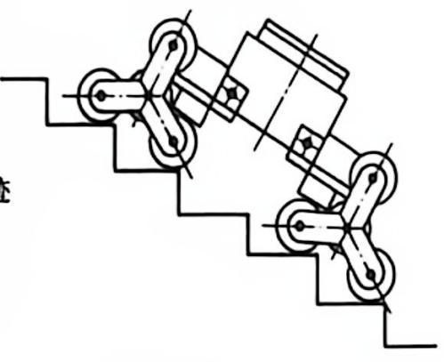

(a) 摇动摆线机构

(b) 转臂式阶梯升降机构

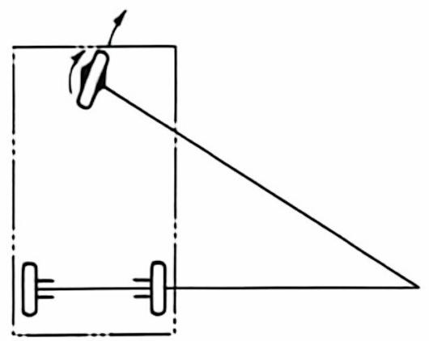

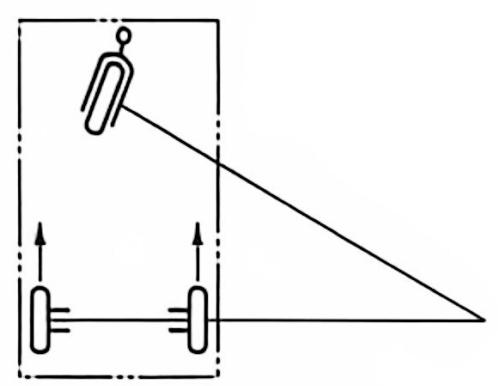

(c) 三轮行走(单轮驱动)

(d) 三轮行走(双轮驱动)

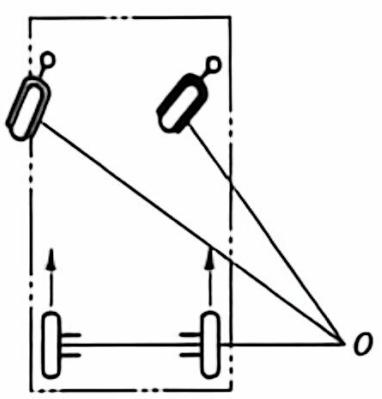

(c) 四轮行走(双轮驱动)

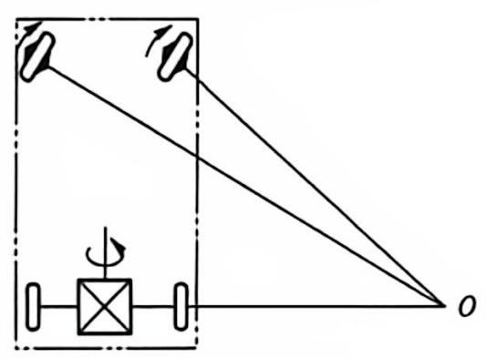

(f) 四轮行走(差速驱动)

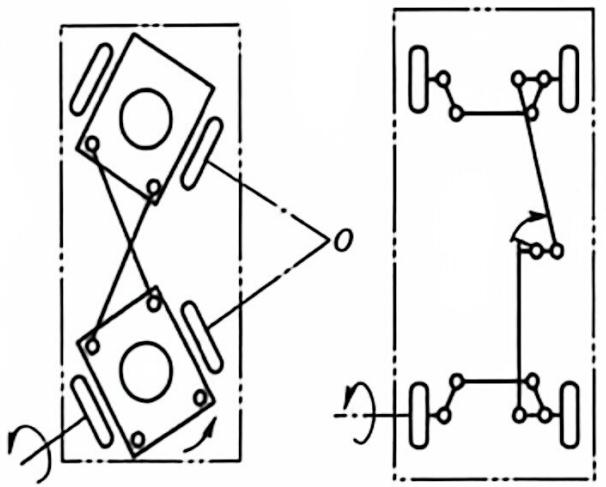

(g) 四轮行走(全轮驱动)

图9.1 轮式行走机构

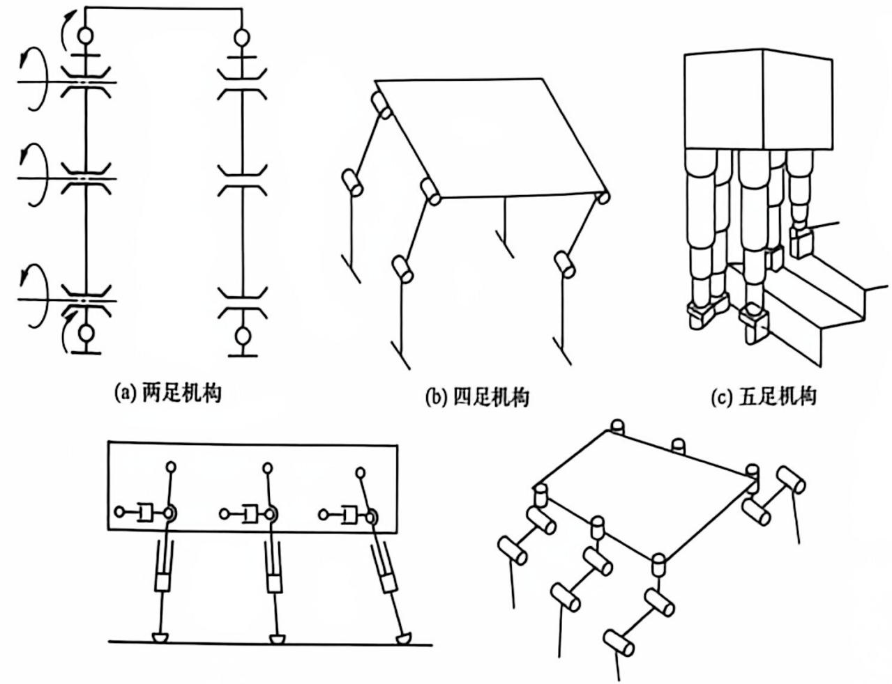

(d) 六足机构(12自由度)

(c) 六足机构(16自由度)

图9.2 脚式行走机构

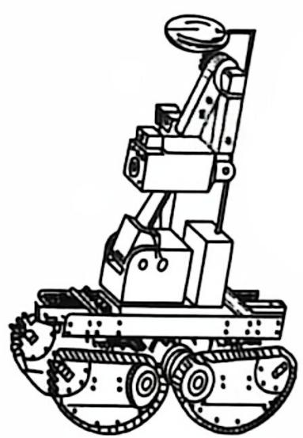

(a) 带转向履带的行走机构

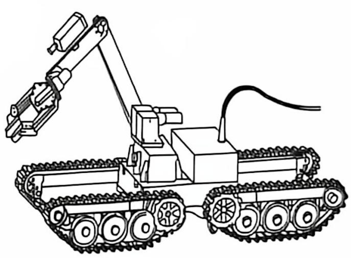

(b) 可上、下台阶的履带式机构

图9.3 履带式行走机构

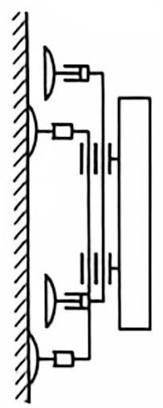

(a) 爬壁机器人

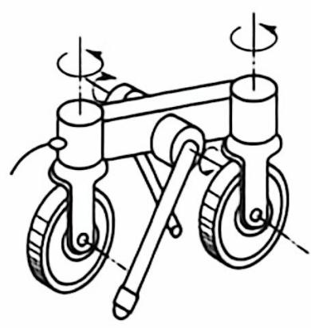

(b) 轮、脚混合式行走机器人

图9.4 混合式行走机构

## 9.2 操纵型机器人的控制

操纵型机器人的工作环境复杂,有时不可预知,该型机器人的显著特征是具有可移动性。因此,对于操纵型机器人除满足一般机器人的运动控制要求外,还应利用认知控制、自主控制等现代控制理论与方法对其进行控制,满足操纵型机器人高精度、高速、高灵活性及多样性的要求。 

### 9.2.1 操纵型机器人的控制特点

操纵型机器人应能自动分析工作环境状况,具备评价环境的能力;规划能达到目标的路径并能实时跟踪控制已规划的路径;能根据目标的颜色、大小等外观和空间参数进行自学习及手眼协调控制等。 

#### 一、手眼协调控制

实现手眼协调控制的系统是机器人的手眼协调控制系统,机器人通过摄像机(至少两台,以产生立体视觉)作为输入,使机器人能看到目标,并利用此视觉输入通过控制器产生动作信号,使末端执行器能准确抓取工作空间中一任意放置的物体。手眼协调控制系统包括视觉系统(图像处理和模式识别)、机器人系统和手眼控制器三大部分,如图9.5所示。 

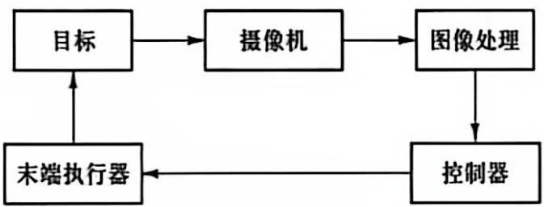

图 9.5 手眼协调控制系统示意图

操纵型机器人手眼协调控制要求在无外部输入和外反馈的情况下,使系统完成的输出与通过控制系统内部计算出的结果一致,即具备一致性。操纵型机器人手眼协调控制系统自一致学习流程如图9.6所示。 

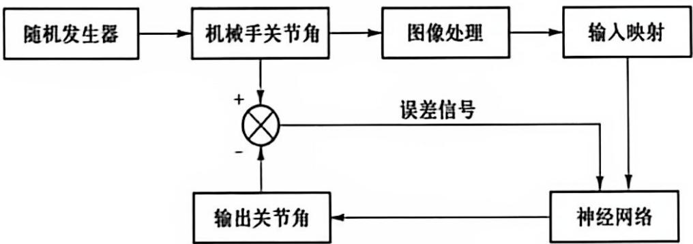

图9.6 自一致学习流程

在手眼协调控制系统的运行过程中, 还可以加上感觉误差的自学习。这样即使几何或物理参数变了, 如机器人底座垫高、摄像机倾斜以及机械臂磨损等情况发生时, 系统也能及时进行自适应调整, 以维持其工作特性。这个学习过程建立在视觉误差反馈的基础上, 需要系统具有有关 先验知识,而这些知识已在前面的自一致学习中建立起来,整个系统仍然是无导师的自学习系统。 

#### 二、认知控制

认知控制使操纵型机器人产生自主运动。认知控制系统(图9.7)包括感知层、数据处理层、存储层、控制层及执行层,分为认知、控制与环境三个子系统。认知子系统由感知子系统、认知知识数据库与概念及概念的产生三部分组成。控制子系统由目标感知、控制知识数据库以及解的产生三部分组成。 

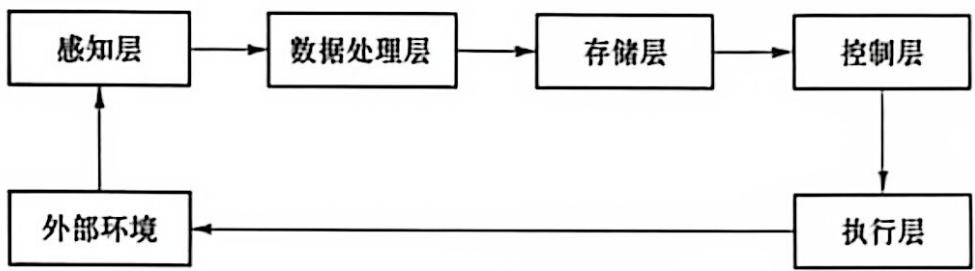

图9.7 认知控制系统结构

##### 1. 感知子系统

感知子系统感知内、外部环境参数,将感知的结果转换成适当的形式,以一定的形式存储、处理和解释信息并解决信息的存储、效率恢复等问题。感知子系统如图 9.8a 所示。 

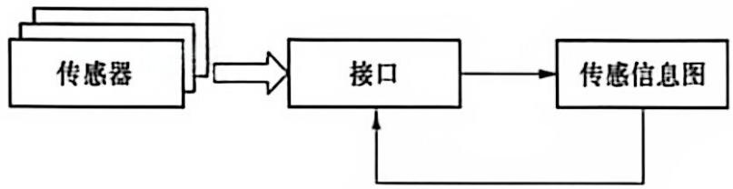

(a) 感知子系统

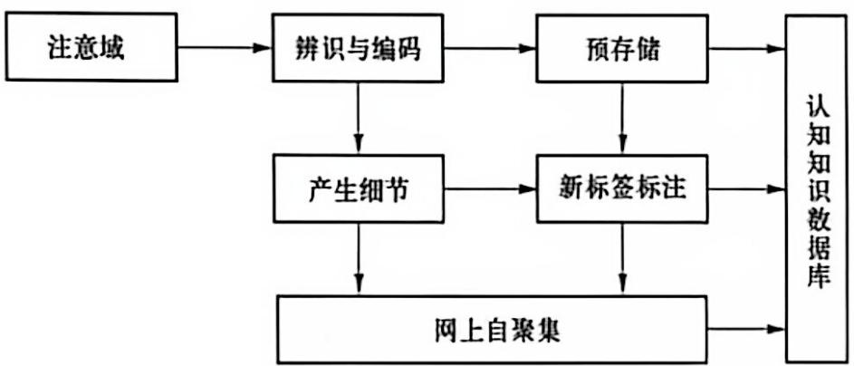

(b) 认知知识数据库

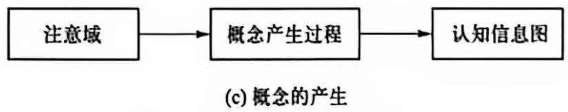

图9.8 认知子系统的组成

感知子系统对信息进行适当的组织,反映输入信息、输出信息和存储介质的性质。输入和输出的性质由传感器和输出子系统的表达能力决定,表达能力的广度和多样化应该满足运行目标的要求。输入、输出性质由系统的制造工艺、设备及其维护造价以及仿生系统的其他因素 

决定。 

##### 2. 认知知识数据库

认知知识数据库是一种解释知识数据库。它在注意(ATTENTION)域中选取内容,判断场景的特征和场景之间的关系,存储所选取的场景,在指定的场景上为世界感知注上新的标签,完成细节产生过程,并激发标注的场景网上相关场景自动聚集的过程。这一系列的动作建立在场景标签(或知识超级图解)汇编网的基础上。认知知识数据库如图9.8b所示。 

##### 3. 概念及概念的产生

概念产生的过程与感知子系统类似。感知子系统的算法通过对足够大的严格词汇表进行操作，将传感器的信息转换成传感信息的图形描述；概念产生子系统从注意域映射到概念域是假设没有严格确定在操作的词汇，因此称为描述空间或映像世界。感知和概念产生是组合算法，当输入/输出的词汇表足够大时，它们不能实时操作。概念的产生过程如图9.8c所示。 

##### 4. 目标感知

输入信息由整个运行目标或系统给定,目标产生器和目标感知系统初始化,目标感知系统转换成目标概念系统,组成目标概念图。目标感知如图9.9a所示。 

##### 5. 控制知识数据库

类似认知知识数据库,控制知识数据库是解释知识的数据库。它集中在与目标有关的标签网络的定义域上,并完成目标的分解、子目标集合的确认以及在每一层里持续减去子目标,确定适当的命令,对其优点进行评价,经过自聚集(self-clustering)确定目标标签网。控制知识数据库如图9.9b所示。 

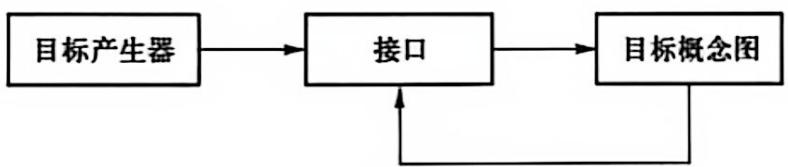

(a) 目标感知

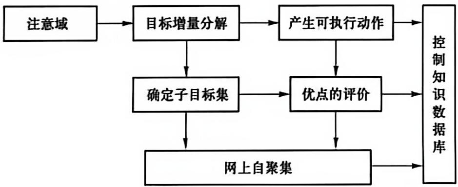

(b) 控制知识数据库

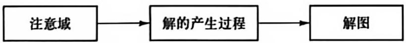

(c) 解的产生

图 9.9 控制子系统的组成

##### 6. 解的产生

这个过程在概念子系统内完成,图像的建立时间与远处实际观测场景的时间不同。解的产生如图 9.9c 所示。 

#### 三、自主控制

操纵型机器人自主控制(autonomous control, AC)主要用于无法描述和模型化的环境,或用于描述过于复杂、人有限介入或无人介入操作的未知环境。机器人工作在具有不确定性、不完整性和内部有不精确信息的布满障碍的环境中。自主控制由自主控制系统(autonomous control system, ACS)来实现。自主控制系统包括传感器、知识库、闭合控制和驱动回路、通信接口等。通信接口用来指定或修正任务,接收事先考察的结果,启动、中止或修正所需要的自主控制动作。自主控制的理论基础是面向知识的控制理论。面向知识的控制理论应用于基于面向知识的运动控制系统模块的开发、算法结构及自主或半自主系统最优运动的系统设计等。自主控制系统可替代人类工作在许多对人体有危害的场合。 

现举例说明自主控制。如图9.10所示,对于目的地 $G_{1}$ 或 $G_{2}$ ,由于没有给出任何人为目标(房子、篱笆、沟渠或耕地)的信息,以及由于地图的信息是不完整或有错误的,运动时在与环境接触的过程中将发现许多影响运动的因素,需对运动的所有初始方案进行不断调整。一个操纵型机器人处在初始位置 $O$ 点, $G_{j}$ 作为可能的目的地目标。最终目标由操作者确定。中间目标或子目标作为控制策略自动生成过程的一部分由自主控制系统自动确定。自主控制系统在最短的时间里可以连续地到达一个或几个目的地,还可以预先制订许多可能的实际运动方案。 

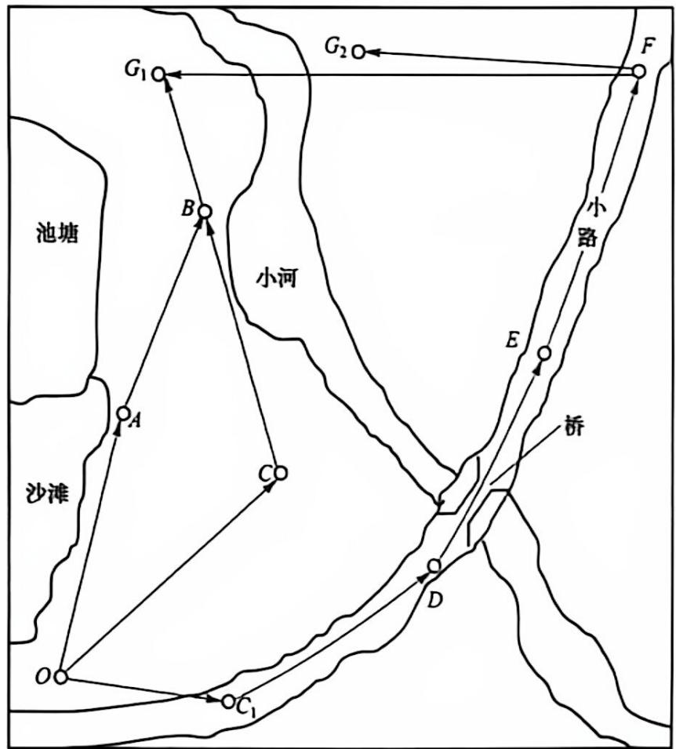

图9.10 自主控制实例

如果指定了目的地 $G_{1}$ , 可选择的方案有 $OABG_{1}$ 和 $OCBG_{1}$ , 此时系统必须评价哪一个更好。 

如果不拐弯或只需拐小弯, 就必须降低在沙地里行走的速度; 如果选取在坚固的表面行走, 则要走较长的距离; 如果因提高了运动速度, 路径 $OC_{1}DEFG_{1}$ 的确能够减少运动时间, 或者如果在 $G_{1}$ 的邻近地带河水足够浅, 自主运动系统不需要桥就能过河, 那么这个方案就是有价值的。然而, 这个方案存在一定的风险: 如果不可能直接过河, 则自主运动控制系统必须退回执行前一个方案。 

如果目的地为 $G_{2}$ , 那么路径 $OC_{1}DEFG_{2}$ 应是最好的方案, 除非桥被毁坏或采用另一个方案 $OABG_{1}G_{2}$ (过河)。 

另外,穿过一段地域时,要针对实际情况做出实时调整:沿路的边缘走,避开石头和水坑;需要执行很多动作来保持所选择的行走角度、行走速度或加速度;避免在急转弯减速和制动时打滑等。完成所有这些操作没有人的介入(没有预先设置,没有远程操作),完全依靠操纵型机器人的自主控制系统来实现。 

### 9.2.2 操纵型机器人的控制设计

#### 一、操纵型机器人的认知控制设计

用于实际认知控制的认知系统控制器分为三层,即规划层、导航层和执行层。 

操纵型机器人认知系统控制器有以下四个基本结构： 

1）机械系统 包括机械本体、驱动器、能量转换和传动子系统、驱动子系统、执行子系统和操作臂子系统。 

2）运动控制系统 面向路径、速度和加速/减速，使运动的损失达到最小。运动控制系统的功能包括： 

① 规划路径。包括运动轨迹、速度轨迹等。 

② 根据规划结果进行导航。通过使用在规划阶段无法获得的附加信息增大分辨率, 减少行驶偏差。 

③ 执行, 即执行导航结果。执行阶段产生使预定轨迹更具体、更详细的机动动作序列, 包括在导航中无法得到的动作。 

④ 控制。控制使能量转换和传动子系统的参数信息准确地跟踪执行结果。 

3）传感器系统 检测实际运动与理想运动之间的差别，对测量结果进行适当变换和集成。 

4）知识系统 包括系统机械部分设计时注入的知识以及系统运动控制部分得出的运动轨迹，用于解释传感结果。 

操纵型机器人认知系统控制器功能结构之间的关系如图9.11所示。 

下面讨论各子系统的运行情况。 

##### 1. 运动控制

###### (1) 运动规划

给定任务目标及其描述,运动控制系统必须规划出一个运动动作集合来实现这个目标。这需要进行目标位置分析、地形及其主要特征图的数据分析、约束分析,需要专家信息、优先权以及所有确定运行计划的描述模型和数学模型。 

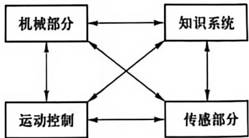

图9.11 功能结构之间的关系

###### (2) 导航

导航的作用是产生可能选择的路径。与这些路径相关的是行为的选择，这些行为的选择包 括控制模式和机动动作的详细说明以及传感器选择策略等。从一点运动到另一点的行为选择是利用导航进行知识推理的结果。 

###### (3) 驾驶

驾驶从导航器接收第一点的位置和方向产生命令序列。 

###### (4) 执行控制

执行控制子系统的作用是精确地完成驾驶系统的命令。 

知识系统和运动控制系统的关系如图 9.12 所示。 

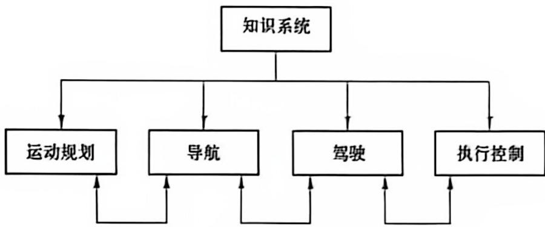

图 9.12 知识系统和运动控制系统的关系

##### 2. 传感器系统(感知)

传感器系统包括传感器子系统和信息处理子系统,传感器子系统提供从传感器提取信息的能力,使用知识库预先提供的环境模型,把环境模型输出到知识库中。 

传感器子系统包含两个主要部分,即传感器本身和处理其输出的系统。 

###### (1) 传感器

传感器提供环境中可观测已量化的测量值。选择的传感器应是特别定做的，以满足需要。除了视觉传感器外，还需要确定位置和方向的传感器连续不断地提供自主运动系统和整个系统每一部件运动的估计值。 

###### (2) 信息提取

当传感器的输出转换成可以帮助进行与一定内容相关推测的基本元素时,可以进行场景判别,以便找到边界。 

###### (3) 信息解释

信息解释类似人的感知反射处理过程,使用推理和推测工具构造环境模型和观测到的场景。 

##### 3. 知识系统

从图 9.13 所示的知识与视觉系统的关系中可以看到,运动控制系统和传感器系统都与知识系统相连,它们通过知识系统相互联系。 

###### (1) 场景(图形)模拟信息

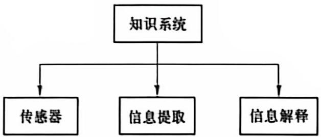

场景模拟信息包含两组信息,即可视化图形和变换的图形。 

图 9.13 知识和视觉系统的关系

###### (2) 场景描述信息

场景描述信息分为两组,即自然或有限自然语言表达和符号语言编码表达。 

###### (3) 规则

规则包括针对自主运动系统目标进行问题分类得到的“如果-那么”从句集合，包括所有合理的场景和机构知识。这些从句可以通过一系列处理过程从语言和图形网络中获得。 

#### 二、操纵型机器人的自主控制设计

一般地,控制器可以表述为图 9.14a 所示的一个具有三个输入和一个输出的系统,其中: 

1）任务 $T$ 是达到目标 $G$ 并满足各种约束的值。 

2）世界图包括控制过程中要考虑的各个信息，世界图 $M$ 经常是不完整的，有时甚至是错误的 

3）当前信息 I 是在控制过程刚开始时传感器提供的信息。 

内部决策过程如图 9.14b 所示。当在输入集合 M 中确定了初始点 S 和终点 G 的位置，输入任务 T 就确定了。输入当前信息 I 后，I 对 M 进行修正，在初始点 S 附近给出一个有限区域 $S-G_{1}$ ，这个有限区域里存在更广泛、更可靠的信息。轨迹 $S-G_{1}$ 比其他轨迹获得了更加丰富的信息。这样，依次输入当前信息 I 后，改变从 S 到 G 的整个轨迹段，每个很小的轨迹段不再是最佳轨迹。 

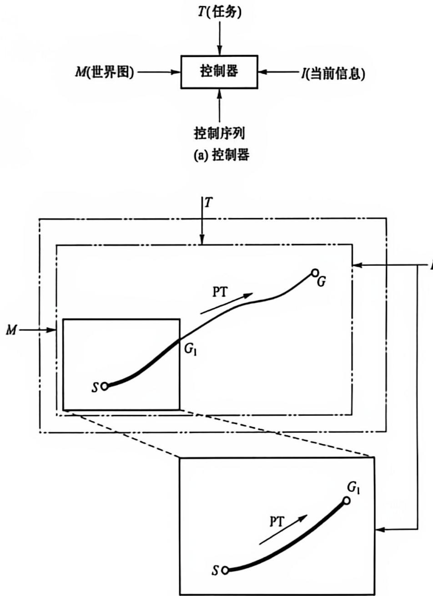

(b) 控制器内部决策过程

图 9.14 控制器及其内部决策过程

这个模型包含了下列控制规划过程因素： 

1) 基于世界图 $M$ 找到最佳轨迹 PT 和任务描述, 包括计算可选 PT、可选轨迹比较及最佳轨迹的选择等。 

2）通过使用传感器信息 $I$ 在初始点 $S$ 附近修正世界图 $M$ 的信息，包括集合的识别、 $M$ 的比较等。 

3）在修正的图域内重新规划轨迹，确定子目标 $G_{1}$ ，找到最佳轨迹 $PT^{*}$ 。 

4) 跟踪最佳轨迹 PT'。 

5）从初始点到达所选新轨迹点后返回步骤2）。 

操纵型机器人自主控制决策采用信息嵌套分层改进的办法连续不断地提取嵌套分层信息的过程如图9.15所示。在图9.15的顶部找到子目标 $G_{i}$ ，改进规划轨迹 $\mathrm{PT}^{\bullet}$ 。在初始点 $S$ 附近传给 $M_{i+1}$ 部分新的改进信息 $I_{i+1}$ 。 

这个递推过程产生了嵌套分类计算,嵌套分类计算由每一层的重要先决条件来刻画:如果在上一层确定了子目标,在给定层作为轨迹规划的结果可确定下一层子目标。因此,轨迹规划过程由一系列持续不断的子目标确定过程来实现,使其越来越接近所需要的位置。可以将最好的规划轨迹作为预测轨迹。系统的每一层如图9.15所示,轨迹的粗线部分是实际规划轨迹,其余部分为预测轨迹。下一层对上一层指定的计划进行改进,其余部分作为预测。 

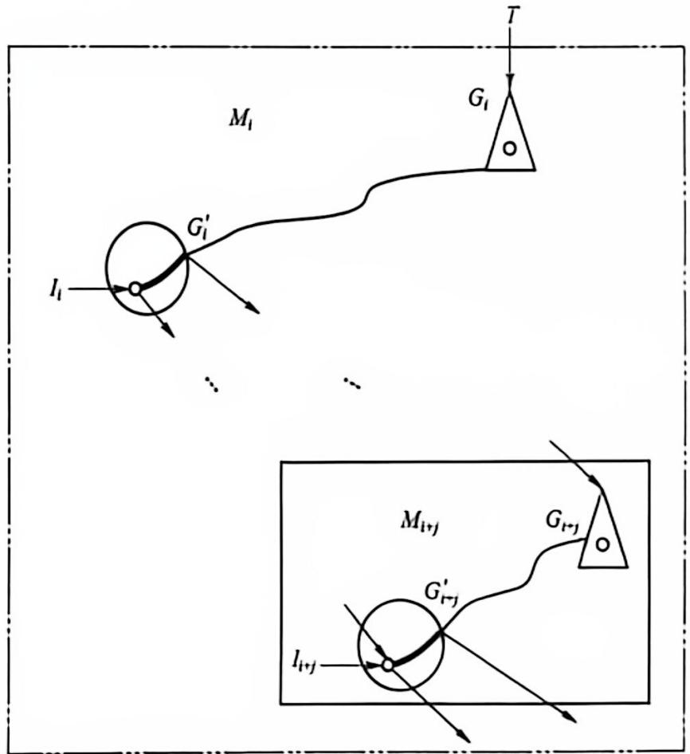

图 9.15 决策信息嵌套分层改进示意图

## 9.3 操纵型机器人实例

近年来,操纵型机器人的发展非常迅速,新的机型不断问世;整机性能不断提高;应用领域越 来越广泛,已经涉及医疗、海洋探测、太空、娱乐、医疗卫生等很多领域。随着机器人技术的不断进步和机器人制造和使用成本的不断降低,可以预见在不久的将来操纵型机器人将会应用到更多的领域,呈现出更好的使用前景。 

### 9.3.1 服务机器人

服务机器人目前处于早期阶段,国际机器人联合会对服务机器人的定义是:服务机器人是一种半自主或全自主工作的机器人,它所从事的服务工作可使人类生存得更好,使制造业以外的设备更好地工作。德国生产技术与自动化研究所(IPA)对服务机器人的定义是:服务机器人是一种可自由编程的移动装置,它至少应有三个运动轴,可以部分或全自动地完成服务工作。这里的服务工作不是指为工业生产而从事的服务活动,而是指为人和单位完成的服务工作。 

随着传感器和控制技术、驱动技术及材料技术的进步，在服务行业实现运输、操作及加工自动化已具备了必要的条件，服务机器人开辟了机器人应用的新领域。专家们预测，服务机器人的数量将会超过工业机器人。目前世界各国正努力开发应用于各种领域的服务机器人，医用机械手（治疗及诊断）、建筑机器人、公共事业及环保机器人、物体及平面清洗用机器人、在难以接近的地方进行维护检查用机器人、保安部门及内部送信用移动机器人等服务机器人不断出现。 

非制造业用操作型工业机器人也可以看做服务机器人。服务机器人在某些情况下可由一个移动平台构成，上面装有一只或数只手臂。服务机器人的控制方式与工业机器人手臂的控制方式相同。对服务机器人评价的内容包括：能否完成人所不能完成的任务；它的使用是否有意义或对人有所帮助；能否改善人的生活质量，并完成繁重的家务劳动等。 

#### 一、医用机器人

医用机器人大致可以分为三类： 

1）对残疾人、病人、护理人员个别进行援助的机器人。 

2）对诊断、治疗、检查等医疗业务进行辅助的机器人。 

3）用于医学研究的研究用机器人。 

医用机器人的研究与开发需要综合工、医、生、药、农等各个学科领域的先进技术与成果，特别是针对以人作为操作对象的机器人，它必须具有对状况变化的适应性、作业的柔性、危险作业的安全性以及对人和精神的适应性等性能。医用机器人既是高度精密的机械装置，又是以计算机控制为核心，可进行识别、判断和行动的综合性精密机电系统，是智能化仿生机械的典型应用。 

例如,卧床患者护理用机器人主要由机械手、储藏库与搬运车、控制装置与通信装置等组成。该机器人系统的主要特点是: 

1）可以自由地向任意方向前进以运送患者。 

2）床上特殊进口处的两个机械手，可以连床一起把患者抱起来移动。 

3）有供患者独立、自行操作的装置（主要是人机对话方式）等。 

储藏库和搬运车配备在患者的卧室内,护理人员只要定期地把患者的生活用品存入库内,患者就可以通过中央综合控制系统的显示装置(电视画面)选择想要进行的动作,构成指令,进行有关的操作,并且还可以与其他房间的患者或室外的来访者进行通信对话等。 

试验用助残机器人也已经取得了相当显著的成果,它可以帮助残疾人做许多事情。如可将盛满食品的盘子放入微波炉,从微波炉中取出盘子,并将盘子放到残疾人面前的最佳位置等。 

医用机器人在医疗方面的应用越来越广泛。例如美国协助外科医生完成关节移植手术的机器人ROBODOC可以完成开颅，在骨头上钻孔、精确铰孔及安装人造关节等多种操作。手术中，由CAI扫描仪将需要移植的骨头形状扫描并传给ROBODOC的控制系统，ROBODOC将植人物放到最佳位置。医用机器人还可以帮助外科医生完成许多复杂手术和微型手术，这一方面增加了手术的精确性，另一方面避免了外科医生因疲劳而产生误操作。 

#### 二、导盲机器人

导盲机器人的导向功能通过导盲街道地图即移动用数据库来实现。导盲机器人不仅能把握障碍物等外界状况，而且能实时地捕捉其后面盲人的行动，并根据盲人的行动来决定自己的行动。此种机器人可以按照通常盲人的自由行走步伐决定其自身的相应移动。当盲人行动安全时，导盲机器人不会给盲人任何约束，以保障盲人能集中残存的生理机能自由行动；只有当盲人的行动存在危险时，导盲机器人才会让盲人了解危险，躲避或远离危险的环境。 

移动用数据库是由计算机把普通地图进行图像处理,预先制成面向机械装置的地图。特别是对于将十字路口和十字路口之间的连接关系作为主体的地图,导盲机器人边走边对照来自地图和自身传感器的信息,使自身了解现在的位置和方向,用从外部传感器得到的确切信息来修正以消除误差,然后继续行走或停止前进。因此,在每个十字路口或重要的地方设置里程标记,帮助导盲机器人根据外部传感器的信息确定其位置与方向,导盲机器人便可成为盲人的向导。应用时只要盲人向导盲机器人输入现在所在点和目的地的编码,导盲机器人就会找到到达目的地的有效途径,实现盲人和导盲机器人一体单独行动的目的。 

#### 三、导游机器人

导游机器人装备有先进的计算机语音处理系统,它能使用语言与人类交流,机器人内的计算机可以根据雷达选择行走路线。这种机器人可以用于商店导购、宾馆服务及盲人导向等多方面的服务工作。 

### 9.3.2 水下机器人

水下机器人也称无人潜水器。1953年世界上第一台无人潜水器POODLE的诞生标志着机器人的发展进入了一个新的时代。该类机器人被广泛应用于沉船打捞、光缆铺设、资源勘探等工作。水下机器人可由水面母船上的工作人员通过连接潜水器的脐带提供动力操纵或控制，通过水下电视、声呐等专用设备进行观察，还能通过机械手进行水下作业。水下机器人分有缆水下机器人和无缆水下机器人两种，其中有缆水下机器人又分为水中自航式、拖航式和可在海底结构物上爬行式三种。 

#### 一、“探索者”号无缆水下机器人

“探索者”号无缆水下机器人是我国自行研制的第一台水下机器人，是国家科委“863”技术自动化领域的课题。该机器人的外形结构如图9.16所示。“探索者”号无缆水下机器人主要用于防险救生作业和海底资源考察，如在指定海域进行探索，对失事目标进行拍照、录像以及对失事领域、现场的海洋要素进行测量。它的工作深度为 $1000\mathrm{m}$ ，最大航速大于4节，侧移速度大于1节，下潜速度大于0.5 节，续航速度能力达到6 h。该机器人由四组充油铅酸蓄电池提供能源。 

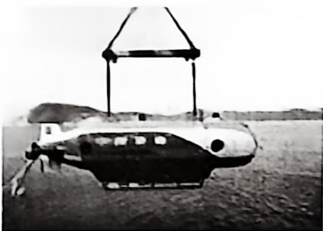

图 9.16 “探索者”号无缆水下机器人

“探索者”号无缆水下机器人在水面共设有三台计算机，即主控计算机、定位计算机及图像恢复计算机。主控计算机提供载体系统遥控操作界面、自治航线的编程界面以及载体系统状态的监视界面，实现了人机交互。同时由定位计算机得到GPS全球定位系统数据，并计算出母船的位置，这样可在海图中描绘载体在地理坐标系内的航迹。图像恢复计算机处理主控计算机送来的压缩电视信号并将其恢复。 

“探索者”号无缆水下机器人的电源系统由四组充油铅酸蓄电池组成，提供120 V直流电压。120 V直流电压经过DC/AC转换块，输出系统所需的电压。将120 V直流电压经逆变电源系统输出220 V交流电，供声学设备使用。“探索者”号无缆水下机器人的主要运动方式有定深、定高、定距、定位及视觉跟踪方式，其导航定位系统中采用了GPS全球定位系统、超短基线定位系统、短基线定位系统、多普勒测速系统和磁通门罗盘和方向陀螺等多种导航手段。 

“探索者”号无缆水下机器人的通信系统分为水上通信系统和水下通信系统两部分，两者之间的通信由水声通信机来完成。水上通信系统由主控计算机经水声通信机接收水下通信计算机传来的消息，并进行分解和重新打包。其中压缩电视信号送往图像恢复计算机，将声图和电视图像显示在监视器上，同时主控计算机发出信息对载体进行控制。主控计算机与定位计算机通过RS232智能串口卡进行双向通信，同时通过RS422串口定位计算机接收GPS数据。另外，主控计算机还与回收控制台进行通信。水下通信系统有两个枢纽，即声呐主控制器和通信计算机（从CPU）。声呐主控器负责对各种声呐设备，如水声通信机、侧扫声呐、声相声呐及多普勒声呐等进行控制；通信计算机负责与获取航行控制参数的传感器和受控设备，如控制舱、短基线及测距声呐等进行通信。声呐主控制器还完成对声图的压缩与数据处理。通过图像处理计算机，声呐主控制器与通信计算机进行通信。“探索者”号安装了许多先进的传感器为控制系统提供信息，信息经处理产生导航定位数据，同时作为航行控制系统闭环控制的数据。倾斜仪提供载体的状态参数，负压传感器和电流、电压检测传感器及漏水检测传感器提供故障诊断信息；照相机、摄像机、声相机和声相声呐组成环境传感系统。声相声呐和摄像机的信息一方面记录在载体内，另一方面送到水面操作控制台；照相机可拍250张照片。故障诊断功能分布于“探索者”号的各分系统，实时监测系统的故障情况。 

“探索者”号无缆水下机器人于1994年9—11月初在中国南海进行了为期四十多天的海上实验。实验分五个航次进行，对系统的主要技术指标进行了检测。机器人实际下潜到 $1000\mathrm{m}$ ，最大速度达到4.36节，续航能力超过 $6\mathrm{h}$ ，达到了预期的实验目的。机器人的回收通常由操作者下小船挂钩完成。 

#### 二、中国 $6000\mathrm{m}$ 水下机器人

该机器人是一套按预定航线航行,能自动回避障碍,可进行6000 m水下摄像、拍照、海底地势与剖面测量、水文物理测量和海底多金属结核丰度测定,并能自动记录各种数据及其相应坐标量的无人无缆水下机器人系统,主要由控制系统、载体系统、水声系统和收放系统四大部分构成。6000 m水下机器人外形如图9.17所示。 

##### 1. 控制系统

控制系统包括自动驾驶系统网络及网络管理系统、导 航系统、安全系统、能源及其监视与保护系统、语言及编译系统、实验设备及实验检测系统、电气接插件油压补偿及其连接系统、支持母船的操纵及信息处理和显示系统、软件体系结构及应用软件的编制与调试系统等。 

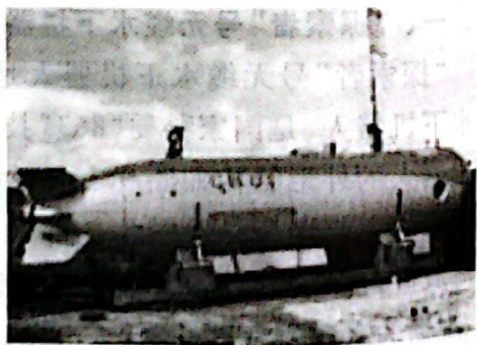

图 9.17 6000 m 水下机器人

##### 2. 载体系统

载体系统包括载体自身的骨架、浮力材、压力罐、传感器及满足线型和阻力的总布局、4台推进器、1台头侧推、1台垂直单推浆、下潜上浮用压铁、稳定翼及小襟翼、油压补偿系统等。 

##### 3. 水声系统

水声系统包括长基线声学定位系统、侧扫声呐系统、浅层剖面仪系统、声呐主控制器等。 

##### 4. 收放系统

收放系统包括水面回收器、甲板滑道装置、载体下水脱钩和回收插挂装置、操纵台及控制间等。 

6000 m 水下机器人的主要技术功能为: 工作水深(最大)6000 m, 最大水下航速达2节, 续航能力达10 h, 定位精度为10~15 m; 可拍摄照片3000张, 实现微光水下拍摄; 连续录像时间达4 h, 侧扫声呐距离为750 m, 避障声呐作用距离为60 m, 剖面仪地层穿透度为50 m; 能源为银锌电池, 总能量为4.8 kW·h, 电压为24 V; 机器人本体在空气中的质量为1305.15 kg, 长4.374 m, 宽0.8 m, 高0.93 m。 

### 9.3.3 清扫机器人

日本精工株式会社的清水工厂开发出一种自动清扫机器人(即机器人清扫车),它可完成各种工厂的清扫工作。该类机器人采用光纤陀螺自主控制机器人的方向,对地面没有任何要求,而传统的自动导引车(AGV)采用了不同的控制方式,例如电磁导引、磁气导引、反射式光学导引等。尽管它们的控制方式不同,但都要求地面上有相应的配套设施。 

清扫机器人能够稳定地进行大面积清扫,而人则能把复杂场所的死角扫得干干净净。该类机器人把机器人与人的特点充分地结合,且采取了充分的安全措施。机器人装备的光学传感器可测定障碍物的位置,机器人接收到信号后可实现加速、停车、等待和避障等动作。人与机器人清扫车一般不接触,为防止出现意外,在清扫机器人的四周装有橡胶垫,其内装有触觉传感器,一旦车辆与人接触,触觉传感器的信号就会使车辆停下来,从而保证人的安全。 

#### 一、机器人清扫车的特点

1) 行驶稳定,清扫效果良好。 

2）可利用车载充电器安全充电。 

3）采用无须维修保养的安全电池组。 

4）作业时的行驶路线呈梳形，由直线段和圆弧段构成。 

#### 二、机器人清扫车的功能

1）既能自动操作又能手动操作。 

2）前轮是一个转向轮，左、右两个后轮是驱动轮。 

3）直线行驶时车辆通过两个驱动轮的速度差修正方向；转向时，以转向轮为中心，两后轮沿接线方向行驶并保持一定的速度差。 

4）有两种不同功能的机器人，一种是擦洗车，另一种是真空吸尘式清扫车。 

5）控制装置由多个部件构成，包括控制机器人功能的CPU插件板、控制清扫功能的定序器、传送角度信息的光纤陀螺、测距用编码器及超声波传感器、探测障碍物用光学探测器、驱动电动机及控制转向用的电动机、液晶显示器、操作面板以及手动操作用悬垂式按钮开关。 

### 9.3.4 割草机器人

瑞典 Husqvarna 公司研制了太阳能割草机。清晨光线充足时，太阳能割草机就可自动开始工作。它可避开花园中有阴影的地方，等到阴影离开后再回到这一地区工作。1 台机器人割草机一个夏天可以整齐地修剪 $1200 \, m^{2}$ 的草坪。机器人割草机表面装有多晶太阳能电池，可将日光转换为电流；为防止损坏，对太阳能电池进行了封装处理，两组充电电池从太阳能电池获取能量，供机器人上的计算机使用；计算机中装有功能强大的微处理器。 

太阳能电池为电动机提供能量,电动机驱动割草刀片,刀片高度的变化范围为 $30 \sim 60 \, cm$ 。电动机内安装的传感器可测量切割阻力的大小。该信息经计算机处理后,再由计算机决定切割速度及切割图形。 

太阳能电池还为车轮电动机供电。割草机安装了两台电动机，电动机直接从太阳能电池获得电流驱动。电动机内装有连续可变的齿轮箱，驱动割草机运动。 

专门设计的太阳能发电机为割草机器人的导航提供动力。围绕待割草地边界铺设导线，导线产生两种不同频率的信号：一种是安全信号，只要机器人在圈内，它就可探测到这个信号；另一种是接近信号，机器人离开导线40 cm远时，它可接收到此信号。接近信号可使机器人掉转头，并转向其他方向。装在割草机前面的两个碰撞传感器接收安全信号和接近信号，机器人碰到坚硬物体时触发这两个碰撞传感器，所得到的信息也由计算机处理。这时机器人会停下来，掉头离开该物体。 

机器人割草机自己会决定怎样割草。若草比较短，它就随意割；若所到地区的草比较高，它就开始系统地按照一个方形割，随后又转换到随意割草的方式。机器人割草机可利用信号指出它正在割草、休息还是给电池充电（光线太暗时），指示它是否出了问题或者需要引起人的注意，并需要操作者输入指令码。当被人无意拿起时，机器人割草机还会报警。 

### 9.3.5 果蔬采摘机器人

果蔬机械化收获技术已有40多年的研究历史,最早的收获方式主要是机械振摇式和气动振摇式,其缺点是果实易损,效率不高,尤其无法进行有选择性的收获。随着果树栽培方式的改变,人们开始用梯子、升降台等设备辅助采摘水果,但劳动密集型的特点依然存在。因此,应用机器人进行水果的自动化采摘得到了快速的发展。 

#### 一、国外研究成果及现状

1968 年,美国学者 Schertz 和 Brown 首次提出应用机器人进行果蔬收获的思想。1987 年, Sistler 在回顾自动化收获领域的研究进展时指出,当时开发的收获机器人样机几乎都需要人的参与,因此只能算是半自动化的收获机械。目前,日本、荷兰、法国、英国、意大利、美国、以色列、西班牙等国家都展开了果蔬收获机器人方面的研究工作,涉及的研究对象主要有苹果、柑橘、番茄、芦笋、黄瓜、甜瓜、葡萄、甘蓝、菊花、草莓、蘑菇等。 

##### 1. 苹果采摘机器人

苹果采摘机器人在美国、法国、日本等国家已有研究，其中 Johan Baeten 和 Sven Boedrij 等人研制的苹果采摘机器人（图 9.18）利用工业机器人的 6 自由度手臂作为机械手主体，手臂整体可在架子上进行水平和竖直方向的移动，在果园作业时，机械手由一台拖拉机牵引，其机器人整体占地面积较大，机械手较重，且成本较高，只适于植株较矮小的苹果树。 

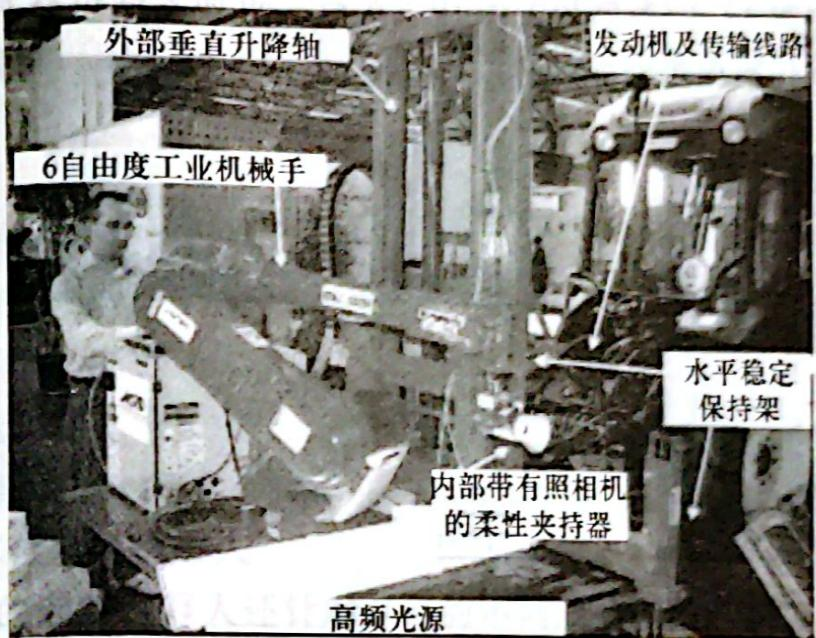

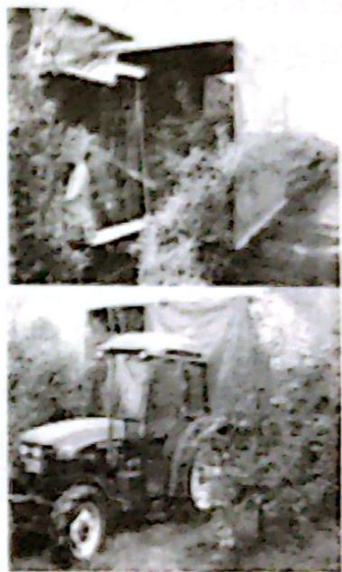

图 9.18 苹果采摘机器人

1983 年,法国国立农林机械研究所的 Pedenc 和 Motte 研制了 MAGAL 苹果收获机器人,利用 CCD 摄像机和光电传感器进行果实识别,收获的果实通过中空手臂筒进入容器中。1992—1993 年,第三代模型已经研制出来,机器人具有两个手臂,安装在自动引导车上。 

1994 年,韩国国立 Kyungpook 大学的 Jang 等人研制了苹果收获机器人,由伺服电动机驱动各个关节运动。CCD 彩色摄像机检测到果实的位置后,根据二维空间位置接近目标物体,限位器发出检测到果实的信号。其机械手工作空间可以达到 $3 \, m^{3}$ , 具有 4 个自由度, 包括 3 个旋转关节和 1 个移动关节。但该机器人多数情况下无法绕过障碍物摘取苹果。 

##### 2. 柑橘采摘机器人

法国和西班牙合作的项目“CITRUS”是比较成功的研究成果(图9.19)。该项目1988年开始启动,研制的收获机器人最高能达到 $80\%$ 的采摘率,由于其无法商业化,加上过多的费用损耗,缺乏资金投入,该项目在1997年已中止。 

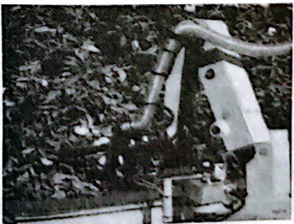

(a)

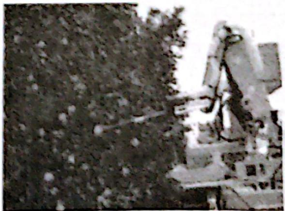

(b)

图 9.19 “CITRUS” 柑橘采摘机器人

##### 3. 番茄采摘机器人

番茄采摘机器人是研究较早的采摘机器人项目,其中日本近藤直等人研制的番茄采摘机器人影响较大。该采摘机器人主要由机械手、视觉传感器、移动机构组成,采用了7自由度机械手臂,如图9.20所示。用彩色摄像机作为视觉传感器,寻找和识别成熟果实,并采用双目视觉方法对果实进行定位,利用机械手的腕关节把果实拧下。移动系统采用4轮机构,可在垄间自动行走。该番茄采摘机器人采摘速度大约是15个/s,成功率在70%左右。番茄采摘机器人存在的主要问题是当成熟番茄的位置处于叶茎相对茂密的地方时,机械手无法避开叶茎障碍物完成采摘。 

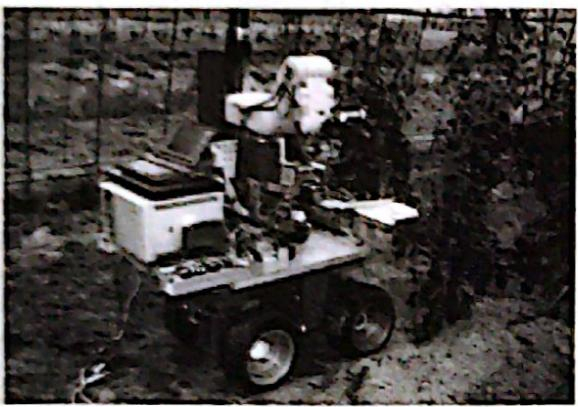

(a)

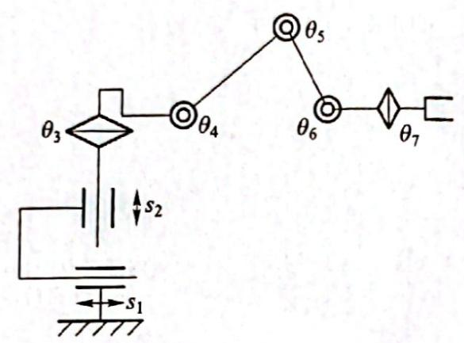

(b)

图 9.20 日本的番茄采摘机器人

另外,美国加利福尼亚番茄机械公司在2004年展出了两台全自动番茄采摘机(图9.21)。在番茄单位面积产量有保证的前提下,这种长12.5m、宽4.3m的番茄采摘机每分钟可采摘1t多番茄,1h可采摘70t番茄。这种番茄采摘机首先将番茄连枝带叶割倒后卷入分选仓,仓内能识别红色的光谱分选设备挑选出成熟的红色番茄,并将其余枝叶粉碎,喷洒在田里作肥料。 

##### 4. 黄瓜采摘机器人

荷兰研究的采摘机器人项目数量虽然不多,但在黄瓜采摘机器人的研制领域取得了较多成果。1996年,荷兰农业环境工程研究所(IMAG)研制出一种多功能黄瓜采摘机器人(图9.22)。研究在温室里进行,黄瓜为高拉线缠绕方式吊挂生长。该机器人利用近红外视觉系统辨识黄瓜果实,并探测其位置。机械手只收获成熟黄瓜。末端执行器由手指和切割器构成。该机器人视觉系统的黄瓜检测效率大于 $95\%$ ,采摘成功率约 $80\%$ ,采摘速度约为54个/s,在温室中作业效果良好。但由于采收时间过长,不能满足商用要求。 

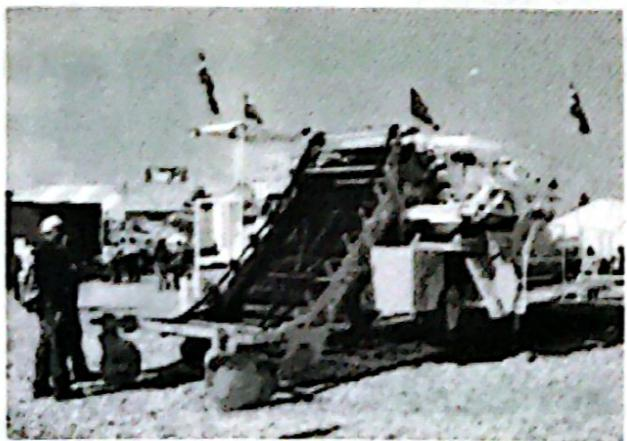

图 9.21 美国的番茄采摘机器人

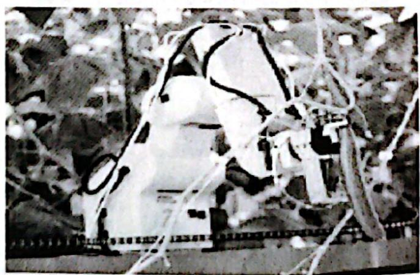

图 9.22 荷兰的黄瓜采摘机器人

日本的近藤直等人也研制了黄瓜采摘机器人,采用三菱MITSUBISH-IRV2E2型6自由度工业机器人,利用CCD摄像机,根据黄瓜果实比其叶茎对红外光的反射率高的原理来识别黄瓜和叶茎(图9.23)。采用剪断方式先把黄瓜抓住,用接近觉传感器找出果柄,然后剪断,采摘速度为16个/s。由于黄瓜是长条形,受到茎叶的影响更大,所以采摘的成功率较低,大约为60%。 

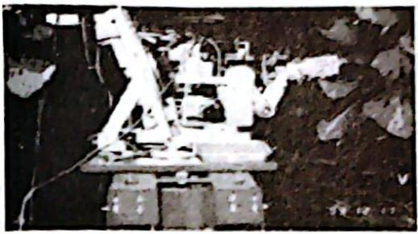

(a)

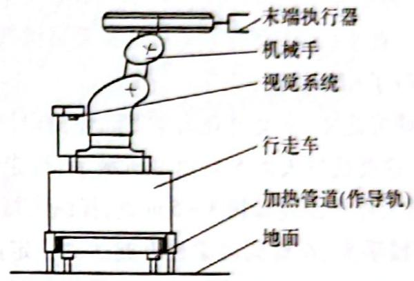

(b)

图 9.23 日本的黄瓜采摘机器人

##### 5. 草莓采摘机器人

日本的近藤直等人还针对草莓的不同栽培模式(高架栽培模式和传统模式)研制出了相应的采摘机器人(图9.24)。该机器人采用5自由度采摘机械手,视觉系统与西红柿采摘机器人类似,末端执行器采用真空系统加螺旋加速切割器。 

##### 6. 多功能葡萄采摘机器人

日本冈山大学研制出了一种多功能葡萄采摘机器人(图9.25)。这种机器人采用5自由度的极坐标机械手,末端臂可以在葡萄架下水平匀速运动。用于葡萄采摘的末端执行器有机械手爪和剪刀,机械手爪抓住果实,剪刀剪断果柄。为了提高使用率,更换不同的末端执行器还可以完成喷雾、套袋和剪枝等作业。 

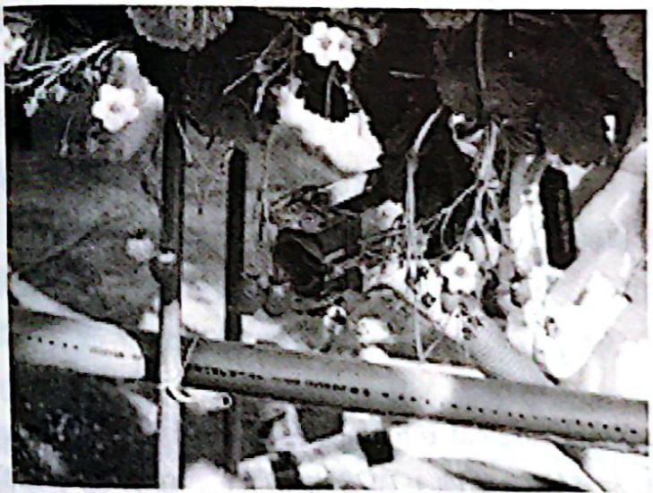

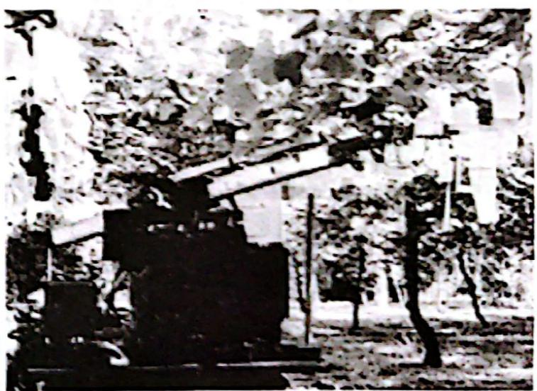

图 9.24 草莓采摘机器人

图 9.25 葡萄采摘机器人

总之,近年来国外在果蔬采摘机器人的研究方面虽取得了不少成果,但由于技术、市场和价格等因素的影响,果蔬采摘机器人的研究工作基本陷于停顿。美国在自动化收获机器人的研究方面没有一个很清晰的战略,研究工作也基本处于停顿状态。日本近年来开展了大量的收获机器人研究项目,进展很快,但还未能真正实现商业化。 

#### 二、国内研究成果及现状

我国在农业采摘机器人方面的研究始于20世纪90年代中后期，相对于发达国家起步较晚。但不少院校、研究所都在进行采摘机器人和智能农业机械相关的研究。西北农林科技大学对苹果采摘机器人手臂控制进行了研究，南京农业大学对茄子收获机器人机械臂避障路径规划进行了分析，东北林业大学的陆怀民研制了林木球果采摘机器人，浙江大学对番茄收获机械手进行了运动学分析。此外，上海交通大学对黄瓜采摘机器人进行了研究，浙江大学和江苏大学对番茄收获机械手进行了相应研究，等等。 

在这些研究之中, 东北林业大学的陆怀民研制的林木球果采摘机器人已经进行了采摘试验 (图9.26)。这类机器人由5自由度机械手、行走机构、液压驱动系统和单片机控制系统组成。采摘时, 机器人停在距离母树 $3 \sim 5 \mathrm{~m}$ 处, 操纵机械手回转马达对准目标果树。然后, 单片机控制系统控制机械手大、小臂同时柔性升起达到一定高度, 采摘机械手张开并摆动, 对准要采集的树枝, 大、小臂同时运动, 使采摘机械手沿着树枝生长方向趋近 $1.5 \sim 2 \mathrm{~m}$ , 然后采摘机械手的梳齿夹拢果枝, 大、小臂带动采摘机械手按原路向后返回, 梳下枝上球果, 完成一次采摘。这种机器人的采摘效率是 $500 \mathrm{~kg} / \text {天}$ , 为人工采摘的 $30 \sim 50$ 倍。采摘时对母树的破坏较小, 采净率高。 

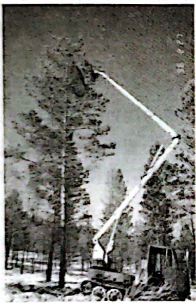

(a)

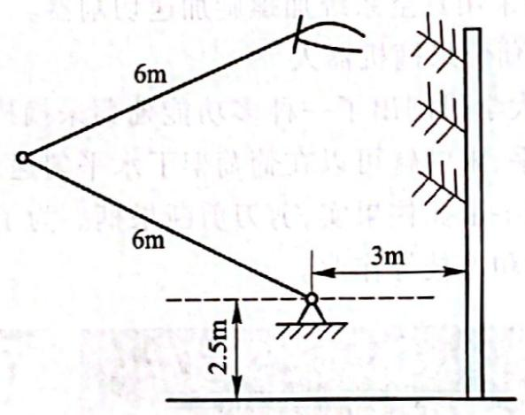

(b)

图 9.26 林木球果采摘机器人原理

### 9.3.6 达芬奇手术机器人

莱昂纳多·达·芬奇手术机器人(Leonardo Da Vinci surgical robot)简称达芬奇手术机器人,其手术技术是在麻省理工学院研发的机器人外科手术系统的基础上研发完成的。麻省理工学院随后与Intuitive Surgical、IBM等公司联手,把该系统进一步完善。经过完善后,到目前为止,达芬奇手术机器人手术系统不但可用于儿童,也可用于成年人。手术种类包括头颈外科、胸外科、腹部外科、普通外科以及妇产科等。 

达芬奇手术机器人的设计理念是通过使用微创手术的方法,实施复杂的外科治疗。达芬奇手术机器人主要包括医生操作台、机械臂系统、成像系统三部分,其外形如图9.27所示。 

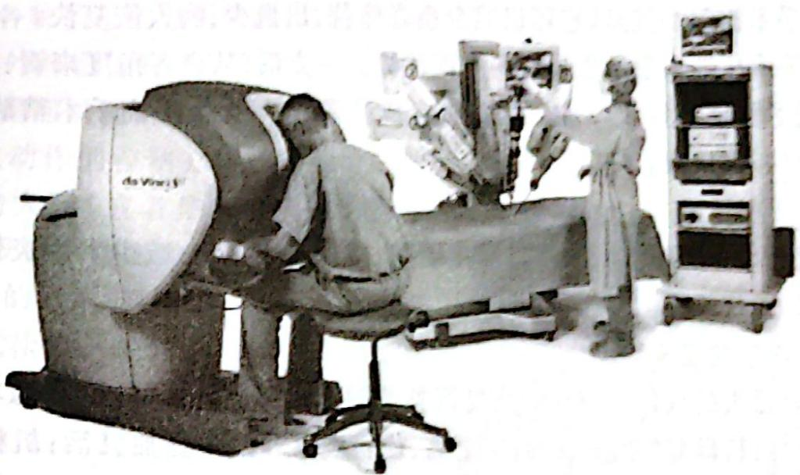

图 9.27 达芬奇手术机器人

#### 一、医生操作台

实施手术的医生坐在医生操作台边,通过双手操作两个主控制器和双脚踏板来控制机械臂系统、手术器械和一个三维内窥镜,机械臂和手术器械尖端与外科医生的双手同步运动。 

#### 二、机械臂系统

机械臂系统的主要功能是为手术器械和摄像系统提供支撑,手术器械和内窥镜的更换主要是由助手医生负责操作,协助实施手术的医生完成手术操作。为了保障患者手术时突发情况下的安全性,助手医生对机械臂系统的控制优先权比实施手术的医生更高。 

#### 三、成像系统

成像系统主要包括内窥镜、核心处理器和图像处理设备等，除了内窥镜，其他部分位于无菌区外，由护士操作。成像系统的内窥镜采用高分辨率的三维镜头，可对手术视野放大10倍以上，为手术医生提供手术视野内的三维高清影像，与普通手术相比，可使手术医生对解剖结构辨认更清晰，手术操作更稳定、更精确。 

达芬奇手术机器人的最大特点是它有一个可缩放的三维高清成像系统，以及一个比人类的手腕自由度更高、更轻巧灵活的小机器臂系统。因此，达芬奇手术机器人可以让实施手术的医生具有精细的视角，同时更精准、稳定地操作手术器械。 

机械臂系统中有三个机械臂用来抓取手术器械，如手术刀、止血器械、剪刀等。三维高清成像系统的三维内窥镜一般包括两个镜头，通过视觉算法能够给手术医生提供三维立体的视觉效果。实施手术操作的医生坐在医生操作台旁边，在使用成像系统的两个眼镜观察三维图像的同时，双手用两个小的控制器遥控机械臂运动，如烧灼、凝结或者切断组织等。右脚用来控制机械臂的操作力度，左脚的功能是用于移动内窥镜，根据情况拉近或者拉远镜头。 

达芬奇手术机器人采用动作过滤等方法,可以把手术医生的动作尺寸放大或者缩小,手术医生的动作在需要精确操作时可以转变成更精确的微小操作,因此医生在一个手术小切口里就可以进行复杂的手术操作。 

使用达芬奇手术机器人的手术医生离伤口很远,而且手术伤口很小,一般在0.5~1.5 cm范围内。成像系统中的内窥镜采用了一个很长的光纤系统,因此手术医生可以使用它来观察患者身体内部的手术位置。使用达芬奇手术机器人,手术医生可以执行一些非常精细的手术操作。 

采用内窥镜进行手术有很多优点,它可以减少患者痛苦,出血少,病人恢复快。 

使用达芬奇手术机器人手术主要有两方面优势。一方面，从患者角度来看： 

1）因为采用了可放大 $10\sim 15$ 倍的三维视觉成像系统，可大大提高手术精确度，手术效果更好，术后病人恢复快、伤口愈合好。 

2）使用范围更广泛。 

3）手术创面更小，减少失血量，缩短治疗周期，减少术后疼痛；减少术后炎性反应和术后粘连；增加美容效果，更快投入工作。 

另一方面，从医生角度来看：

达芬奇手术机器人的成像系统视野角度调整范围更广；机器人的动作过滤功能可以减少手部颤动，操作更精准；机器臂“手腕”自由度更高，使得观察和操作更加灵活；机械臂和内窥镜都很小，更有利于在有限狭窄空间操作；实施手术的医生在轻松的环境中工作，可减少疲劳，精力更集中。 

归根到底,医生有利之处也有利于患者。例如,机器人精度高,使得操作更精准,能节省手术时间,减少术者疲劳,因此可进一步提高手术质量。 

### 9.3.7 脑波控制机器人

在电影《阿凡达》中有这样一个情景:在潘多拉星球上,有一位下身瘫痪的名叫杰克·萨利的前海军战士平躺在一个密封舱中,他利用一个头上戴着的信息交换设备,通过意念来远程控制人造生物即混血阿凡达。虽然潘多拉星球和阿凡达是虚构的事务,通过意念控制阿凡达也不是真实发生的故事,但是大家要知道,通过“意念”控制物体已不再是人类的幻想。目前通过脑电波进行控制已经得到了一些应用,国内外都进行了大量相关研究和实验。 

“意念”控制物体究竟是如何进行的呢？这首先必须要弄清楚“脑波”近些年的研究领域。“意念”控制，其实是通过人类的脑波进行控制，相关的科学研究已经有了很多成果。研究表明，人类在进行很多种生理活动时都会在一些特定部位产生放电现象，尤其是在大脑表面。例如，眼睛睁开和闭合会产生5~6mV的电压波动，心脏每一次跳动会产生1~2mV的电压波动，即使是思考，大脑也会产生0.2~1mV的电压波动。如果用科学仪器测量大脑的电位活动，那么在荧幕上就会显示出波浪一样的图形，这就是“脑波”。 

研究人员发现,脑波活动还具有一定的规律性特征,它和大脑的不同意识存在某种程度的对应关系。人在放松、紧张、专注等不同状态下,脑电波频率会呈现不同的规律,一般在1~40 Hz范围内变化。 

依照不同的频率,研究人员把脑波分为 $\alpha$ 波、 $\beta$ 波、 $\delta$ 波、 $\theta$ 波等四种。研究人员发现,当人处于专注状态时,脑波的频率较高,一般为 $12 \sim 38 \mathrm{~Hz}$ ,称之为 $\beta$ 波,它是“意识”活动产生的脑波;当人处于放松状态时,脑波的频率会有一定下降,一般为 $8 \sim 12 \mathrm{~Hz}$ ,称之为 $\alpha$ 波;当人处于睡眠状态时,脑波的频率会继续下降,根据睡眠的深浅,把脑波分为 $\theta$ 波 ( $4 \sim 8 \mathrm{~Hz}$ ),和 $\delta$ 波 ( $0.5 \sim 4 \mathrm{~Hz}$ ),它们分别对应的是人在“浅睡眠”和“深睡眠”的状态。 

根据脑波的这种随着意识、情绪状态波动而变化的特性,研究人员开发了很多脑波的应用技术。在电影《阿凡达》中海军战士头上所佩戴的设备,在目前的研究中被称为脑机接口(brain-computer interface, BCI),这项技术是通过计算机在人脑与外部设备之间建立信息互相连接通道。 

通过对于脑电波各种信息的分析处理,并进一步通过算法转化为相应的动作,利用这种方法就是“意念”控制外部设备的基本原理。 

脑波控制就是通过脑机接口把人的意识、情绪状态波动等产生的脑波，通过分析处理和算法 

转换为某种特定动作的控制方式。脑机接口是用于在人或动物大脑（或者是大脑细胞的培养物）与外部机电设备间建立连接的信息通道。根据信息传递方向的不同，脑机接口分为单向脑机接口和双向脑机接口。单向脑机接口是指计算机要么只能接受大脑传来的信号，要么只能发送信号到大脑，但不能同时接收信号和发送信号。而双向脑机接口允许大脑和外部设备间的双向信息交换。在脑波控制机器人方面，目前脑机接口主要采用单向脑机接口。图9.28所示是两种典型的脑机接口。 

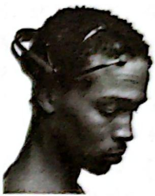

(a)

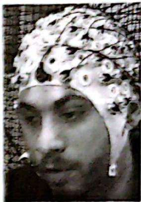

(b)

图 9.28 脑波检测接口模式

#### 一、脑波控制机械臂

杜克大学的 Miguel Nicolelis 采用的脑机接口覆盖了广大的大脑皮层区域, 大量的电极可以提取众多的神经信号, 他认为与单个电极或少量电极相比, 这种方法能够降低神经信号采集的不稳定性和随机性。Nicolelis 在 20 世纪 90 年代对大鼠的脑波进行初步研究后, 又对夜猴的脑波进行了研究, 实现了通过提取大脑皮层运动神经元信号用于控制机器臂。在 2000 年, Nicolelis 的研究小组完成了夜猴通过脑机接口模拟手臂运动操纵一个游戏杆获取食物的研究。这个脑机接口可以实时控制目标外部设备, 也可以通过互联网对机械臂进行远程操控。不过由于这个脑机接口是单向脑机接口, 夜猴不能接收机械手臂的反馈信号, 因此这类脑机接口只能进行开环控制。Nicolelis 小组后来又对恒河猴进行了相关研究。 

还有很多研究人员进行了脑机接口算法和分析解码神经元信号信息的研究,这些研究人员包括匹兹堡大学的 Andrew Schwartz、布朗大学的 John Donoghue 以及加州理工大学的 Richard Anderson 等。这些研究人员使用的脑机接口在同一时刻提取的神经元信号数量一般为 15 ~ 30 个,比 Nicolelis 的 50 ~ 200 个显著减少。 

Schwartz 研究小组的研究主要包括两个方面,一方面是通过脑机接口在虚拟的三维空间中追踪视觉目标,另一方面是通过脑机接口控制机械臂。Schwartz 研究小组研制的脑机接口,可以让他们的猴子利用脑机接口控制机械臂,并喂自己吃西葫芦。 

Donoghue 研究小组的主要研究是让恒河猴通过脑机接口控制计算机屏幕上的光标运动，并以此来追踪视觉目标。这项研究中恒河猴只是双眼追踪视觉目标，而肢体不需要运动。 

Anderson 研究小组所研究的脑机接口主要用于从后顶叶的神经元中提取动物前肢的运动信号。此类信号中还包括实验动物其他脑波信号，例如在期待奖励时所产生信号。 

上述研究人员所研究的脑机接口主要用于计算动物肢体的运动参数。此外，还有一些脑机接口可用于提取动物肌肉的电信号(肌电图)。根据此类脑机接口的工作原理，可以反过来利用脑机接口发出电信号刺激瘫痪病人的肌肉，从而重建动物或人类的自主运动功能。 

#### 二、脑波控制假肢

休斯敦大学等研究人员研发出一些非植入式的脑机接口，可以让病人的脑波控制电动假肢 

电动假肢一

只要患者戴上收集脑波的帽子(即脑机接口),按照一定规律集中注意力,即可发出指令控制电动假肢,如图9.29所示。这种脑机接口的优点是,通过佩戴外部设备,而不需要在病人身体内部植入控制器就能够控制假肢。这种脑机接口的工作原理是利用脑机接口提取患者的脑波,通过计算机和相关算法转化成假肢的特定运动。例如,患者要捡起地上的物品,脑机接口提取患者发出的脑电波信息,并通过算法分析患者的意识和目的,然后驱动电动假肢采取行动。 

电动假肢二

#### 三、脑波控制无人机

近些年来,许多企业致力于将脑波控制技术应用在消费级市场上,深圳市宏智力科技有限公司是国内较早的脑波技术科技公司,其代表产品是 Brain Link 脑波传感器。该公司认为脑波控制无人机技术目前存在的问题主要有两方面:一方面是 

目前脑波技术还无法准确地识别出人的复杂思维信息,只能进行非常有限而且基础的脑机交互;另一方面是目前的脑机接口对操作人员有很严格的要求,因为用脑波操作无人机并不能用意念直接命令无人机运动。 

因为该公司的脑机接口提取的脑波信号精度有限,仅通过简单的脑波控制无人机在复杂环境下自如穿梭很难实现。目前该公司的脑波控制无人机技术仅能让无人机去做一些特定场景下的简单动作,比如让无人机起飞或者翻滚,而控制的形式是按照预设的一系列步骤触发某一个动作,如图9.30所示。操作人员控制飞机的方式,并不是在心里默念一声“起飞”飞机就可以起飞了,而是需要按照要求先调整思绪和情绪,提高自己的专注力,当专注力提高到达某个规定的数值时才能触发无人机的起飞动作。实际上,这种利用脑波控制无人机的方式对操作人员有较高的要求。 

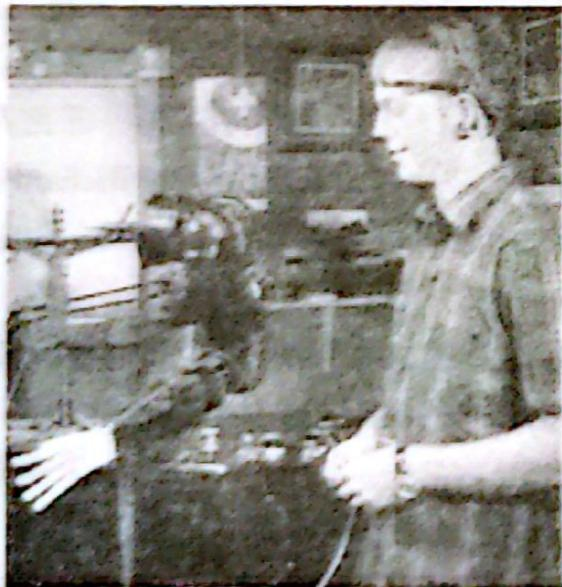

图 9.29 用脑波控制假肢

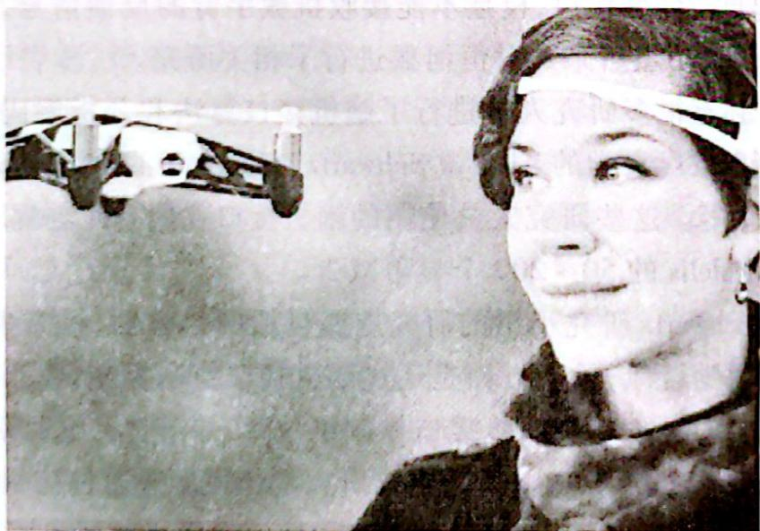

图 9.30 用脑波控制无人机

此外，美国的研究人员正在研发一项新技术，这项技术可以让人通过脑波接口同时控制多架无人机。该项研究的阿特米迪亚斯教授认为，可以通过脑机接口提取操控者的脑波，研发人员的研究目标是解读出这一脑波，并根据解读的结果，通过算法控制多种变量来协调多架无人机的飞行。 

在用脑波控制多架无人机过程中,操作人员要双眼凝视无人机,其脑波则通过脑机接口被计算机读取。该脑机接口是一个特制头盔,上面有128个电极,能够实时记录特定位置的脑波并传 输给计算机进行分析处理。若操作人员移动手或者其他动作，头盔上对应区域的指示灯就会点亮。通过这样的一个脑机接口，一个人的大脑可同时控制多达4台小型无人机。阿特米迪亚斯教授说：“你不能使用操纵杆来实现集体操控，但借助脑波则可以做到。” 

#### 四、脑波控制轮椅

脑波控制轮椅是一种利用脑电波控制轮椅运动的一种新技术。操作人员需戴一顶“脑波读取帽”，即脑机接口，帽内传感器读取脑波信号并将它发送给电动轮椅上的脑电图仪，如图9.31所示。脑电图仪中安装的程序会对脑波信号通过算法进行分析处理，根据分析处理的结果，脑电图仪向轮椅“下达”行动命令。使用这种轮椅的残疾人，可以在无须动用肌肉力量或者是发出声控指令的情况下，让轮椅载着自己按照自己的意识行动。 

最近,研究人员在脑波控制轮椅系统中预先装载了特定设施内的地图,并设定了多个目的地,而且每个目的地都有对应的数字编号,头戴“脑波读取帽”的使用人员想去哪个目的地,头脑中只要“想”那个数字编号,脑波接口通过提取脑波并采用算法分析处理就能读取对应数字,脑电图仪中的控制程序就能让轮椅避开障碍物并到达对应目的地。研究人员表 

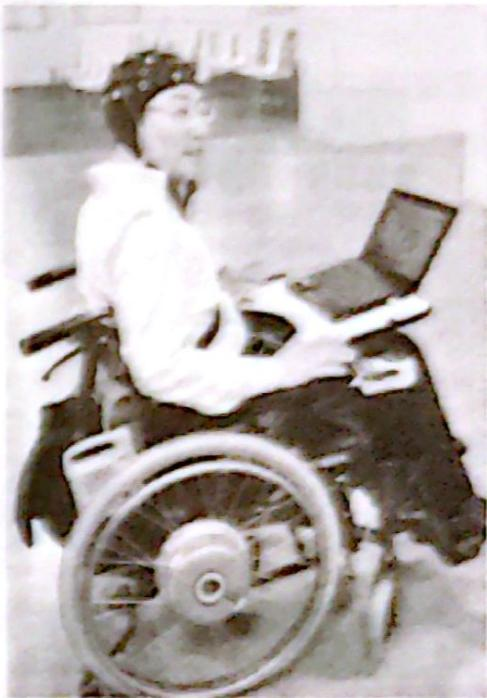

图 9.31 脑波控制轮椅

示,这个轮椅中的脑波控制装置采用了一种称为“深层学习”的人工智能技术。 

这一领域的相关研究人员今后将采集更多人的更多脑电波数据，改善分析处理算法，提高这一系统的操作便捷性，并最终使得轮椅使用者能够在陌生的场地里也能方便地抵达目的地。 

关于脑机接口技术及控制的进一步研究内容,可参见10.4.3节。 

### 9.3.8 自动驾驶汽车

自动驾驶汽车(autonomous vehicles)如图9.32所示,又称无人驾驶汽车,也称为轮式移动机器人,它是一种通过计算机系统、传感器、智能算法、软件、驱动电动机等设施实现无人驾驶的智能汽车。在20世纪已有数十年的研究历史,21世纪初已经出现部分实用化。 

自动驾驶汽车的自动驾驶技术集成了人工智能算法、视觉算法、雷达传感器、视觉装置和全球定位系统等多种高科技技术，通过计算机融合所有技术，可以在没有任何人类干预的情况下，自动、安全地控制机动车辆。 

据有关研究人员预测,自动驾驶汽车将对社会、驾驶人员和行人均有益处。有关研究认为自动驾驶汽车可将交通事故率大大降低,甚至可能降为零交通事故率。因此,随着目前自动驾驶汽车市场份额的高速增长,将会使整个社会的交通事故率得到逐步下降。通过行驶模式的优化,可以使自动驾驶汽车运行更加高效,更加节能。通过行驶路线的优化,可以缓解交通拥堵并减少空气污染。 

若将美国的汽车全部换成自动驾驶汽车,可以节省数千亿美元的交通成本,包括交通事故成本、交通人力驾驶成本及交通拥堵成本等。当然,自动驾驶汽车也将使得数百万职业驾驶员失去工作。据统计,美国90%以上的交通事故是由于驾驶员操作失误造成的。因此,如果自动驾驶汽车足够可靠,未来有一天各国政府或将禁止人类驾驶员手动驾车。 

#### 激光测距雷达

车顶的旋转感应器对各个方位进行超过200英尺距离的扫描，以获得精确的有关车身环境的三维地图 

靠近后视镜的摄像头侦查交通灯，帮助车载计算机识别人行道和自行车道等障碍物 

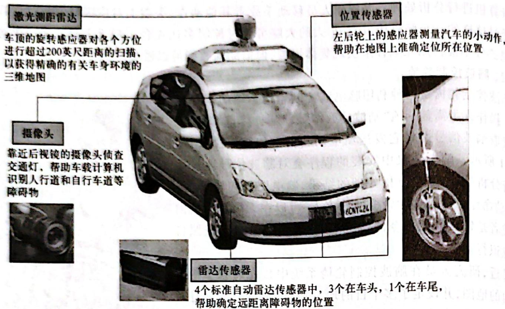

图9.32 自动驾驶汽车

有关研究表明,普及自动驾驶汽车将会大大减少行驶道路的一些设施投入,包括护栏、减速带、宽路肩以及停止标志等交通基础设施。 

#### 一、自动驾驶汽车工作原理

不同生产商生产的自动驾驶汽车所使用的设备和装置可能会有所不同。本书介绍的是谷歌公司的自动驾驶汽车，它采用视频摄像机，前、后雷达传感器以及回转激光测距雷达等来收集车辆周围的交通状况信息，并采用一个非常详细的公路交通地图对要行驶的道路进行导航。这些导航信息都预先存储在谷歌的数据中心，可通过无线通信技术与自动驾驶汽车实时交换信息，并把谷歌数据中心中有关周围地形的大量信息与车辆当前收集的周围地形信息进行比对，并根据导航作出决策。所以，从这方面来说，自动驾驶汽车实际上是由谷歌数据中心进行遥控的。由于自动驾驶汽车与互联网紧密相连，因此自动驾驶汽车是物联网的重要一环。 

自动驾驶汽车的自动驾驶技术主要包括以下六个部分： 

##### 1. 回转激光测距雷达

谷歌公司的自动驾驶汽车在车顶上安装了一个“水桶”形装置,它是回转激光测距雷达,能对半径60 m范围内的环境进行环形扫描,并将扫描结果转化为三维地图,作为计算机初步判断的依据。 

##### 2. 前置摄像机

谷歌在自动驾驶汽车的驾驶室内后视镜附近安装了一个前置摄像机,它的主要作用是识别交通信号灯。同时,在车载计算机提供的视觉算法的辅助下还能辨别出移动的物体,比如前方的行人、自行车或者车辆。 

##### 3. 位置传感器

谷歌在自动驾驶汽车的左后轮上安装了一个传感器,很多人会觉得这个传感器很像是一个方向的控制设备,而实际上这个传感器是自动驾驶汽车的位置传感器,它的主要作用是测定汽车 的横向移动，帮助计算机给汽车进行横向定位，给出它在马路上的横向位置。 

##### 4. 全球定位系统

谷歌在自动驾驶汽车上还安装了全球定位系统,它的主要作用是给汽车在导航地图的马路上进行纵向定位,辅助自动驾驶汽车根据导航地图提供的信息进行自动导航。 

##### 5. 前、后雷达传感器

谷歌在自动驾驶汽车上共安装了4个雷达传感器,其中3个安装在前方,1个安装在后方。这4个传感器和前置摄像机一同配合,测量汽车与前后、左右各个物体之间的距离。 

##### 6. 主控计算机

谷歌公司的自动驾驶汽车把最重要的主控计算机安排在后车厢。在后车厢中除了安装用于运算的主控计算机外，还安装了日本拓普康公司的测距信息综合器，这两套安装在后车厢的核心装备将控制汽车的行驶路线、判断汽车的行驶模式并执行必要的操作。 

自动驾驶汽车虽然在近些年得到了高速发展,但是到目前为止还没有达到完全自动化的程度。实际上,沃尔沃公司根据自动驾驶汽车自动化水平的高低,把它分成了四个阶段,即驾驶辅助系统、部分自动化系统、高度自动化系统、完全自动化系统。 

1) 驾驶辅助系统: 主要功能是为驾驶者提供部分协助功能, 包括提供一些重要的或有益的驾驶信息, 以及在车辆处于某些危急形势时向驾驶员发出明确而简洁的警告信息, 如“车道偏离警告”系统、“危险目标接近警告”系统等。 

2) 部分自动化系统: 主要功能是在驾驶员收到危急警告却未能及时采取相应行动时能够自动进行干预的系统, 如“自动紧急制动”系统和“应急车道辅助”系统等。此外, 部分自动化系统还包括“侧方位自动停车”系统等多种部分功能的自动化操作。 

3) 高度自动化系统: 主要功能是能够代替驾驶员在或长或短的时间段内操控车辆, 但是驾驶员不能离开驾驶座位, 且仍然需要驾驶员对车辆的自动驾驶活动进行监控, 并在危急情况下及时进行干预的系统。 

4）完全自动化系统：主要功能是在自动驾驶系统控制下，可不需要人驾驶车辆，车内所有乘员可以从事其他活动而无须监控车辆自动驾驶系统的驾驶操作。这种自动化系统允许所有乘客从事某些工作、休息、睡眠以及其他娱乐等活动，是真正全自动、无人的自动驾驶汽车。 

#### 二、自动驾驶汽车的发展历史与展望

20 世纪后期,多家研究单位开始进行自动驾驶汽车的研发。 

2009 年,首次发表了自动驾驶汽车的相关图片。 

2010 年 10 月 9 日, 谷歌公司宣布, 正在研发自动驾驶汽车, 用于改变汽车的使用方式和协助预防交通事故。 

2011年10月，谷歌在莫哈韦沙漠试验场对自动驾驶汽车进行测试。 

2012 年 3 月 1 日,美国内华达州允许自动驾驶车辆上路的法律正式生效。这也是美国首个类似法律。 

2012年5月7日，内华达州机动车辆管理局为谷歌自动驾驶汽车批准了美国首个自动驾驶车辆许可证。 

在内华达州机动车辆管理局颁发自动驾驶车辆牌照前，有关官员在高速公路、城市街区、闹市区等多种路况环境下检验过这款自动驾驶汽车，他们认为这款车辆在先前的高速公路区域、市 内街道区域和拉斯维加斯闹市区域等的各种路况下测试表明，自动驾驶汽车可以在各种路况下安全行驶，甚至比人工驾驶更安全。 

2017 年 12 月,北京市交通委员会与北京市公安局公安交通管理局、北京市经济和信息化委员会等部门,联合制定发布了自动驾驶车辆道路测试的《指导意见》和《实施细则》,对自动驾驶汽车的实际道路测试内容和规范做出了详细的规定。 

2018年3月18日晚上，优步自动驾驶汽车撞伤了美国亚利桑那州一名女子，该女子随后不幸身亡。这是自动驾驶汽车全球首例致人死亡的事故。 

2018 年 5 月 14 日, 深圳市向腾讯公司核发了智能网联汽车临时行驶车辆号牌。 

据全球知名经济咨询机构“IHS 环球透视”的汽车部门在 2013 年年末预测,到 2035 年,自动驾驶汽车的全球拥有量或将接近 5400 万辆。 

根据预测,自动驾驶汽车在全球的总销量在2025年约为23万辆,占汽车总销量的0.2%,至2035年,随着无人驾驶变成现实,销量将高速增长,这一数字将迅速上升至约1180万辆,占汽车总销量的比例达到9.2%。但是安装全自动化系统的自动驾驶汽车的推出速度会相对较慢,将于2030年左右才能面世。该机构还预测,到2050年之后,几乎所有汽车或将是无人驾驶的自动驾驶车辆,人类驾驶汽车的历史或将终止。 

### 9.3.9 巨型格斗机器人

巨型格斗机器人

斗机器人是模仿很多科幻片中“机甲”的一种新型机器人。全球首个国际巨型机器人大赛(the Giant Robot Duel)于美国时间2017年10月17日19点在官方网站上正式公布了比赛视频。这项赛事是一项民间赛事,比赛在两款巨型格斗机器人Mega-bot(图9.33a)与Kuratas(图9.33b)之间展开。这两款巨型格斗机器人的最大特点是都由驾驶者坐在机器人的驾驶舱内在“战场”上直接操纵机器人的“肢体”或者“武器”进行零距离格斗。 

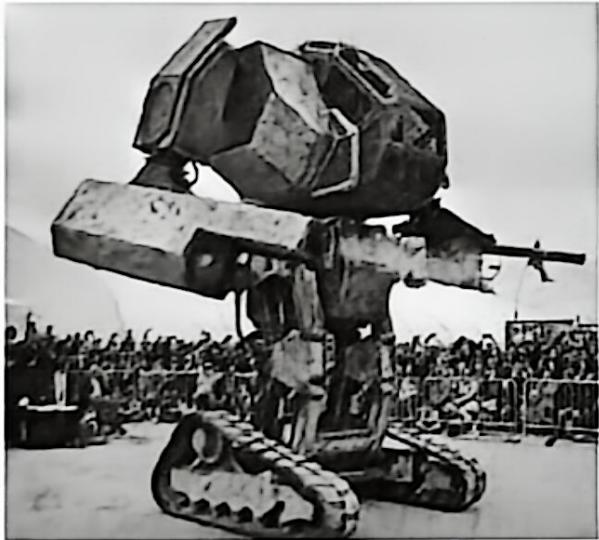

(a) Megabot

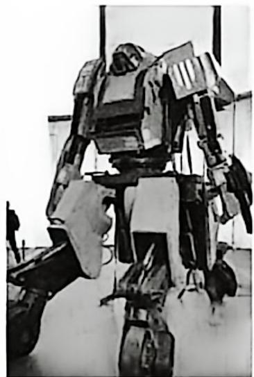

(b) Kuratas

图 9.33 驾驶型巨型机器人

比赛的最终结果是:美国 Megabot 以 2:1 的战绩战胜日本 Kuratas。这两款巨型格斗机器人的格斗过程非常短暂,虽然比赛过程看起来有些戏剧性,而且机器人本身的各种功能也存在很多 

缺陷，但还是让我们有耳目一新的感觉。 

#### 一、美国 Megabot 巨型格斗机器人

这台美国 Megabot 巨型格斗机器人高 4.57 m, 重约 6.8 t, 履带式移动, 武器是两把巨大的可拆卸空气大炮, 弹药是 3 磅重的油漆炮弹, 炮弹的最高飞行速度可以达到 120 英里/小时。这台巨型格斗机器人需要由 2 人操控, 一人驾驶机器人, 另一人作为炮手。Megabot 最初的设计目标是要通过一定数量的炮弹击中某一台机器人, 造成目标装甲的松动或爆炸, 或者裁判计算机认定某台机器人四肢或躯干受损严重就可以判定这台机器人失去战斗能力。 

#### 二、日本 Kuratas 巨型格斗机器人

日本巨型格斗机器人 Kuratas 高 4 m, 重达 4 t, 轮式移动, 可装备火箭发射器等武器系统。这台巨型格斗机器人是由日本东京机器人爱好者团体“水道桥重工”公司研制的, 机器人可以由一部 iPhone 手机通过网络进行远程控制, 操控者的一个微笑表情便能让它发射炮弹。Kuratas 也可以由操作员坐在驾驶舱中进行控制。 

制作人员仓田光吾郎(Kogoro Kurata)将这台日本巨型格斗机器人称为“人型四脚发动机驱动陆战兵器机器人”，该公司期望这款机器人研发完成后，能够在全世界范围内发售。 

### 9.3.10 无人机与飞行机器人

#### 一、概述

无人驾驶飞机简称无人机, 即 UAV (unmanned aerial vehicle) 或 UAS (unmanned aircraft system), 是利用无线电遥控设备和自主程序控制装置操纵的不载人飞机。目前世界范围内尚未有公认的无人机的分类标准或协议。美国联合无人机计划局 (JPO) 过去曾将无人机进行分类, 提供了一些无人机术语标准化的方法, 主要有低成本近程无人机、近程无人机、短程无人机、中程无人机、长航时无人机。 

无人机和飞行机器人的关系到底如何呢？从广义上讲，无人机就是会飞行的机器人，但是随着机器人技术的发展，目前机器人的智能化水平越来越高，超小型飞行器和一部分小型无人机已达到遥控加局部自主的飞控能力，而小型无人机的另一部分，战术无人机、长航时无人机目前还是超视距的遥控，还没有实现自主飞行，故可将实现了遥控加局部自主的超小型飞行器和一部分小型无人机定义为飞行机器人。 

#### 二、无人机技术及其应用

无人机的关键技术是控制,它可以是基于不同程度的自主控制,从无线遥控飞行的半自主控制,到半自动控制,再到完全自主控制。较之载人飞机,无人机的应用能够有效扩大活动范围,提高工作时间,在军事、科研、政府管理、商业活动及个人消费品等领域都有很大的应用空间。 

无人机技术进入民用阶段后,已应用于政府主导的公共服务、科研以及商业化服务,如农业、航拍等领域。近年由于技术成熟、成本下降、政策驱动等原因,在民用领域中,消费级无人机需求潜力巨大,故而近年来发展迅猛。其代表企业如中国大疆科技,占据全球小型无人机市场70%份额,其产品80%销往国外。根据Forbes网站报道,大疆科技在2013—2015的三年间,收入爆发式增长,成为第一家进入“十亿美元俱乐部”的无人机公司。作为消费级无人机的代表企业,大疆科技的成功也侧面印证了行业的发展趋势,无人机技术在民用领域的应用范围将不断扩大,市场快速膨胀。 

我国民用无人机还有众多企业，产品功能多样。从我国知名民用无人机企业部分代表产品可以看到除飞行、拍摄功能以外，部分无人机还具备基于不同原理的自动避障、VR遥控、便携自拍等多样化的功能。EVTank、中投顾问等研究机构数据表明，2013—2015年，全球民用无人机的市场销量分别为15万架、38万架和57万架，其中消费级市场需求是专业级无人机的两倍左右，并且以每年 $50\%$ 的速度快速增长。2015年中国无人机保有量已经达到数十万架，有约400家单位从事无人机的研发、生产和销售。2014年我国无人机销量约2万架，其中军用无人机约占 $1.4\%$ ，民用无人机占 $98.6\%$ ，销售规模达40亿元。 

对于未来发展趋势,中投顾问在《2016—2020年中国无人机行业深度调研及投资前景预测报告》中指出:预计2020年全球无人机年销量有望达到433万架,市场规模将达到259亿美元。中国无人机年销量将达到29万架,未来几年将保持50%以上的增长。 

国际上,在无人机技术发展较早的美国,AT&T与英特尔已经宣布将合作把4GLTE用于无人机,届时无人机将不受遥控距离的限制。Facebook宣布其联网无人机Aquila的首次飞行测试成功。该项目启动已久,旨在为全球范围内16亿无法上网的偏远地区用户提供互联网服务。测试显示,Aquila飞行了96min,比预期时间长3倍。据悉,Aquila可以飞行近3个月时间,速度达到120km/h,网络覆盖半径为96km。已举行的CESAsia展会上,无人机产品展现出小型化、智能化、应用领域细分等特点,表现为如下几点: 

1）小型化的无人机更贴近消费者，在操作性、安全性和性价比上更有优势。 

2）自动避障、跟随等功能已成为主流消费级无人机旗舰机型的标配，未来基于计算机视觉、机器学习等技术的进步，无人机将继续升级换代。 

3）消费级无人机目前虽仍以航拍为主要功能，但针对不同需求，已拓展出专业拍摄、运动拍摄、爱好者和社交应用等细分领域。根据不同领域使用者的特点优化无人机软、硬件及系统功能。 

无人机的研制是一项包含了多种交叉学科的高、精、尖技术，其研究水平在一定程度上可以反映一个国家在MEMS技术领域内的实力。它的研制不仅是对其自身问题的解决，更重要的是，还能对其他许多相关技术领域的发展起到积极的推动作用。 

#### 三、飞行机器人技术及其应用

飞行机器人主要的飞行性能包括起飞着陆性能、作业飞行性能、飞行安全可靠性、飞行可监控性、系统可操控性和可维护性以及人机接口任务设置的友好性等。一套典型的飞行机器人系统至少应该包括飞行机器人本体、一个或多个地面控制站、有效载荷、电源、随动天线和通信数据链。对于定翼及其飞行机器人还应该有发射和回收系统。 

飞行机器人的飞行平台主要有定翼、旋翼、扑翼和气浮四种。定翼机的升力是靠气流作用在有速度的飞行器的机翼上产生的。定翼机由机身、机翼、发动机、起落架和尾翼组成。机身将机翼、发动机、起落架和尾翼等部件连成一个整体，机翼和尾翼上分别有维持定翼机在空中飞行的稳定和平衡并控制姿态和方向的副翼、襟翼、平尾、垂尾、升降舵和方向舵等。旋翼机的升力是靠飞行器主桨的旋转而产生的，旋翼机由机身、旋翼、尾桨、发动机和起落架等组成。旋翼机通过桨叶的变距而得到较大的升力，来实现向前、向后、向左、向右飞行。并且能够垂直起飞、垂直降落，也能在空中悬停。扑翼机是靠飞行器机翼以一定频率转动而产生升力的。气浮机的升力主要是靠飞行器中装有轻于空气的气体产生的。气浮机的类型较多。无人飞艇由艇囊、吊舱、发动机、螺旋桨、安定面和操纵面组成。因此，飞行机器人也相应地有定翼飞行机器人、旋翼飞行机器人、 扑翼飞行机器人和气浮飞行机器人(飞艇)四种类型。由于机型不一样,其控制方式也是不一样的,扑翼飞行机器人目前还不太成熟,有待进一步地投人和研究。 

国外开展飞行机器人研究的国家很多,主要有美国、日本、欧洲国家、澳大利亚、加拿大和以色列等。这里将介绍比较典型的几种。 

美国麻省理工学院研究 Draper 的小型自动飞行机器人,机身长 1514 mm,旋翼直径 1455 mm。Draper 上的设备主要有差分 GPS、6 自由度的惯性测量单元、两轴的磁罗盘、超声高度声呐等传感器,系统同时使用了卡尔曼过滤器提高导航的精度,并改善系统的可靠性以及容错能力。 

斯坦福大学研制的能够自主悬停的 Hummingbird 型机器人, 机身长 $1580 \mathrm{~mm}$ , 旋翼直径 $1550 \mathrm{~mm}$ 。Hummingbird 的飞行控制和导航系统采用的是差分载波相位全球定位系统, 这是 Hummingbird 最具特色的技术措施。通过机体上放置的几组 GPS 接收天线, 该系统就能够检测飞行机器人的姿态、航向信息并加以控制, 从而省去了高度计、陀螺仪、惯性导航仪等繁杂的设备。此外, 飞行机器人没有运动部件, 对振动环境的要求很低。 

图 9.34 是美国 Sikorsky 公司研制的 Cypher 旋翼式无人飞行机器人, 可以垂直起降、悬停, 既可以按照地面指令飞行, 又可以脱离地面指令自主飞行, Cypher 的直径是 2 m, 升限为 2500 m, 质量为 15 kg。Cypher II 是 Cypher 的改进型, 其两侧增加了一对机翼, 尾部增加了一个前推动力, 这样既可以垂直起飞和降落, 又可以像固定翼那样平飞, 提高飞行效率。 

图9.35是美国D-STAR研制的名为D-Humbug用于战术观察、电子对抗的旋翼式无人飞行机器人,其翼展为 $1.98\mathrm{m}$ ,任务载荷 $11.4\mathrm{kgf}^{\text{①}}$ ,飞行速度 $321\mathrm{km/h}$ 。其任务载荷采用模块化设计的思路,可以根据具体的任务情况选择不同的传感器,阻涵道式的共轴升力装置能使飞行器垂直短距离起降。 

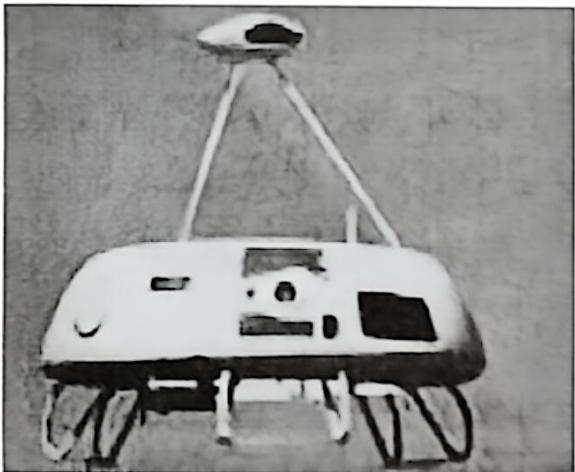

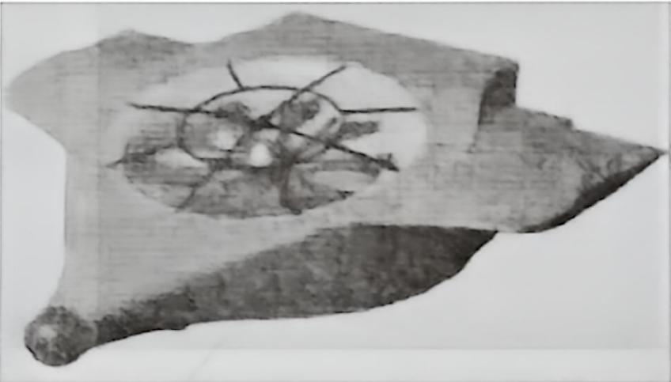

图 9.34 Cypher 旋翼式无人飞行机器人

图 9.35 D-Humbug 旋翼式无人飞行机器人

日本 YAMAHA 公司设计生产的 R-MAX 旋翼式无人飞行机器人, 是由原先 R-50 农药喷洒无人直升机放大改进而来的, 其机身长 $2.75 \mathrm{~m}$ , 有效载荷 $30 \mathrm{kgf}$ 。R-MAX 控制系统是采用无线电遥控器。但其机体上装有三个光纤陀螺与三个加速度计, 可以把数据提供给机载计算机以规范操纵, 提高了遥控的品质, R-MAX 的最新改进型 R-MAX II 可实现预编程的自主飞行和实施速度控制。值得一提的是, 美国卡内基·梅隆大学在 R-MAX 机体上采用 CCD 和数字处理器实 

现基于计算机视觉控制的自主操作和自主导航。 

图 9.36 是由美国、德国等国家联合控制的 Seamos 海上侦察飞行机器人, 其采用共轴反转双桨叶双旋翼系统, 由涡轮发动机驱动。机长 2.85 m, 配有海上监视雷达、红外探测仪、电子对抗设备等, 负载重量最大可达 150 kgf。该机采用先进的数字航空电子设备以及 DNS/GPS 等系统实现自主飞行。 

以色列研制的 Steadicopter 飞行机器人,该机长 2 m, 空机质量为 13.5 kg, 机上安装有加速度计、陀螺仪、高度计、GPS、机载计算机等系统来实现稳定操控, 机载的任务传感器是一台多频谱照相机。 

美国海军研制的火线侦察兵 Fire Scout 飞行机器人, 它是由 Schweizer 333 轻型直升机改装而成, 其外形尺寸为旋翼 $8 \mathrm{~m}$ , 机长 $6.98 \mathrm{~m}$ , 机高 $2.87 \mathrm{~m}$ , 任务载荷可达 $91 \mathrm{kgf}$ , 航程 $240 \mathrm{~km}$ 。它采用了雷神公司的战术控制站、L-3 通信链以及马丁联邦系统公司舰载综合系统等完成遥控和自主飞行。 

奥地利研制的 Camcopper 飞行机器人系统, 可以执行空中监视、目标捕获、边境巡逻以及环境监视等任务, 其机体尺寸较小, 行踪隐蔽, 不易被发现。Camcopper 的制导与控制系统是由地面控制站 (GCS)、数据链、任务控制单元 (MCU)、传感器控制单元 (SCU) 组成。该系统能够实现预先编程控制飞行和人工控制指挥飞行的功能。 

图 9.37 是法国的“警戒者”超小型近程无人直升机, 能在 30 km 的半径内执行监视、侦察、农药喷洒等民用和准军事任务, 该机长 2.3 m, 质量为 40 kg。Vigilant F2000M 上安装有三轴稳定系统和自主导航计算机, 可以按照预编程飞行, 并有禁区自动回避的功能。 

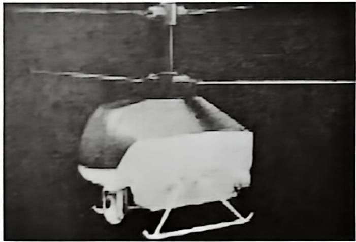

图 9.36 Seamos 海上侦察飞行机器人

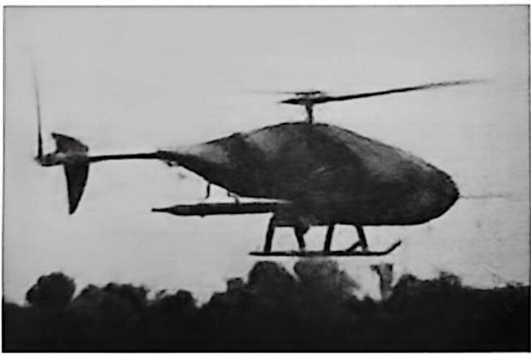

图 9.37 “警戒者”超小型近程无人直升机

飞行机器人的飞行控制方式主要为遥控加局部自主。遥控方式是飞行机器人在视觉范围内由地面控制人员操控飞行，通常在 $150\mathrm{m}$ 的范围内受控飞行，有效飞行半径小。局部自主一般是指飞行机器人在视距外自主作业飞行或在地面飞行控制人员监控下进行作业飞行，这时候要求飞行机器人具有一定的姿态自主控制能力，并且控制人员可以通过数据链传送回来的机载CCD图像和传感器的数据来操纵机器人。飞行机器人的机载计算机同时还具有预先编程控制飞行的功能以及根据导航信息自主飞行的能力。所以，飞行机器人的性能在很大程度上取决于它的飞行控制系统设计。 

## 习题

9.1 与工业机器人比较,操纵型机器人有哪些特点? 

9.2 从应用的角度,操纵型机器人可分为哪些类型? 

9.3 操纵型机器人行走装置有哪些形式？ 

9.4 操纵型机器人的控制方式有哪些？各有何特点？ 

9.5 简述手眼协调控制的基本原理。 

9.6 认知控制感知系统设计的特点是什么？ 

9.7 简述认知控制器的基本结构。 

9.8 简述操纵型机器人自主控制器的基本结构。 

9.9 操纵型机器人自主控制决策采用什么方式？如何进行决策？ 

9.10 举例说明操纵型机器人的发展趋势。
