# 第10章 仿生机器人

## 10.1 概述

### 10.1.1 仿生学研究概述

近年来,随着全球范围内现代科技的强力推动和应用市场的大力牵引,机器人技术取得了长足的进步。人们已不再局限于具有高端技术的工业机器人与操纵型机器人,而是将目标投向了自然界中拥有高超运动能力和协调控制能力的各种生物的仿生学研究,经过近代科研工作者的不懈努力,从各种仿生的概念提出、研发,到形成具有高仿生功能的现代仿生机器人,成功案例层出不穷。 

1960 年 9 月,世界第一次仿生学会议由美国空军航空局在俄亥俄州的空军基地戴通召开,标志着仿生学作为一门独立学科正式诞生。仿生学创始人美国工程师斯蒂尔为新兴的科学命名为“Bionics”,代表着研究生命系统功能的科学,1963 年我国将“Bionics”译为“仿生学”。斯蒂尔把仿生学定义为模仿生物原理来建造技术系统,或者使人造技术系统具有类似于生物特征的科学。简言之,仿生学就是模仿生物的科学。确切地说,仿生学是研究生物系统的结构、特质、功能、能量转换、信息控制等各种优异的特征,并把它们应用到技术系统,改善已有的技术工程设备,并创造出新的工艺过程、建筑构型、自动化装置等技术系统的综合性科学。因此,仿生学是一门综合了生命科学、数学与力学、信息科学、系统科学、工程技术等众多学科的交叉学科。 

仿生学的研究范围主要包括力学仿生、分子仿生、能量仿生、信息与控制仿生等。力学仿生是研究并模仿生物体大体结构与精细结构的静力学性质，以及生物体各组成部分在体内相对运动和生物体在环境中运动的动力学性质。分子仿生是研究与模拟生物体中酶的催化作用，生物膜的选择性、通透性，生物大分子或其类似物的分析和合成等。能量仿生是研究与模仿生物电器官生物发光、肌肉直接把化学能转换成机械能等生物体中的能量转换过程。信息与控制仿生是研究与模拟感觉器官、神经元与神经网络、高级中枢的智能活动等方面生物体中的信息处理过程。 

仿生学的主要研究方法就是提出模型并进行模拟。其研究程序大致有以下三个阶段:第一阶段是根据生产实际提出的具体课题得出生物模型。研究生物资料并予以简化,吸收其中对技术要求有益的部分,取消与生产技术要求无关的因素,得到生物模型;第二阶段是将生物模型转化为数学模型,通过对生物资料进行数学分析,抽象出其内在的联系,把生物模型表达成具有一定意义的数学模型;第三阶段是由数学模型制造出实物模型,并进行工程技术实验。从工程技术方面来看,仿生学根据对生物系统的研究,为设计和建造新的技术设备提供了新原理、新方法和 途径。通过研究、学习来模仿生物的特性和功能，将极大地提高人类对自然的适应和改造能力，并产生巨大的社会、经济效益。 

### 10.1.2 仿生机器人发展概述

仿生学与机器人领域应用需求相结合产生了仿生机器人。从机器人发展的角度出发，仿生机器人是机器人发展到高级阶段的产物。生物体具有自适应性、鲁棒性、运动多样性和灵活性等，使得人们在进行机器人设计时可以充分汲取这些优良的生物特性。按照机器人工作环境来划分，仿生机器人可分为陆地仿生机器人、水下仿生机器人和空中仿生机器人三种，如图10.1所示。 

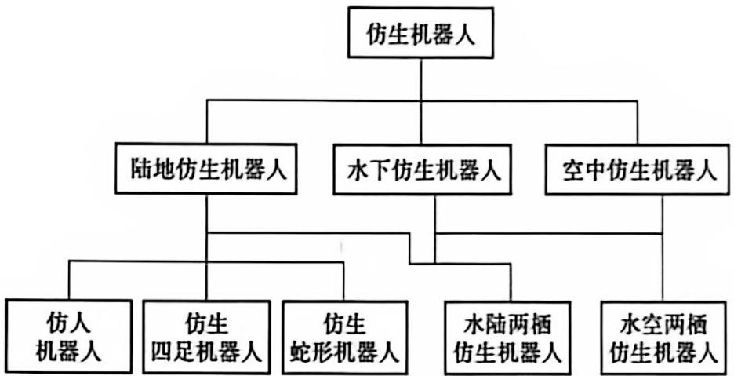

图10.1 仿生机器人的分类

在自然界中,陆地生物具有多种运动方式,比较典型的有人类双足运动方式、四足爬行方式以及蛇形移动方式。因此,陆地仿生机器人又可细分为仿人机器人、仿生四足机器人、仿生蛇形机器人等多种类型。此外,还有一些研究机构研究出水陆两栖机器人、水空两栖机器人等具有综合用途的仿生机器人。仿生机器人同时具有生物和机器人的特点,已经逐渐在反恐防爆、探索太空、抢险救灾等不适合由人来承担任务的环境中凸显出良好的应用前景。 

迄今为止,仿生机器人的发展主要经历了三个阶段。第一阶段是原型仿生阶段,该阶段主要是人们在对生物原型初步认知的基础上进行模仿,如通过模拟鸟类的翅膀扑动设计出原始飞行器等。第二阶段是机电仿生阶段,随着机电系统的发展,人们不再满足于原始的仿形,在设计仿生机器人时已可以充分利用机电系统来实现行走、跳跃、飞行等生物功能,从而实现一定的自动控制。第三阶段是生物特性仿生阶段,随着计算机技术的发展,人们在设计仿生机器人时,不仅考虑仿生机器人的运动特性,同时考虑生物的感知和控制等性能,如脑机接口、生肌电控制等技术应运而生,已成为当前仿生科学的前沿。 

## 10.2 仿生机器人发展现状

仿生机器人种类繁多,本节通过对仿人机器人、仿生四足机器人、仿生蛇形机器人、空中仿生机器人、水下仿生机器人领域中的部分典型研究工作的介绍与分析,阐述仿生机器人的发展现状。 

### 10.2.1 仿人机器人

仿人机器人是一类具有人类特征的智能机器人,它具有类似人类的运动、感知、学习甚至情感交流等功能。仿人机器人研究集机械、电子、计算机、材料、传感器、控制技术等多门科学于一体,代表着一个国家的高科技发展水平。最初,仿人机器人仅能模仿人的简单行走,后来逐渐发展到能初步感知外界环境,现在随着仿人机器人集成视觉、触觉等多项技术,已可以完成多项拟人化的复杂任务。 

#### 一、国外仿人机器人

自20世纪60年代末开始，美国、日本、欧盟等国家的多家科研机构进行了仿人机器人的研究探索工作，并取得了许多突破性的成果。 

美国是仿人机器人发展较早的国家之一,早在1968年,美国通用公司试制了一台名为“Rig”的操纵型双足步行机器人,揭开了仿人机器人研究的序幕。1990年,俄亥俄州立大学采用神经网络技术在SD-1型双足机器人上实现了动态步行。 

年,佛罗里达大学研制了双足步行机器人 Rabbit,该机器人已具备了一定的奔跑能力,如图 10.2 所示。2010 年,弗吉尼亚理工大学研制了双足机器人 CHARLI-L,它身高约 1.52 m,可以像人一样左右迈步,如图 10.3 所示。美国波士顿动力公司研制出仿人机器人 PETMAN,是近年来仿人机器人用于军事用途的著名代表,如图 10.4 所示。PETMAN 能维持平衡,灵活行动,可以完成行走、匍匐等动作。其奔跑速度能够达到 7 km/h,还具有像人一样模拟调控自身的体温、湿度等生理指标的优良性能。 

PETMAN仿人机器人 

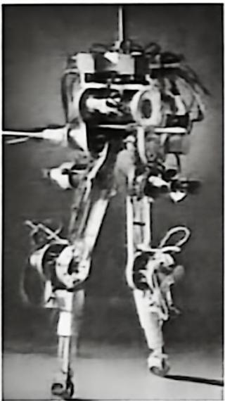

图10.2 Rabbit机器人

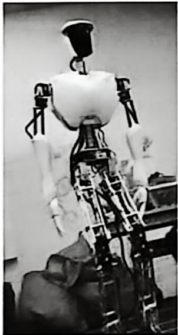

图 10.3 CHARLI-L 机器人

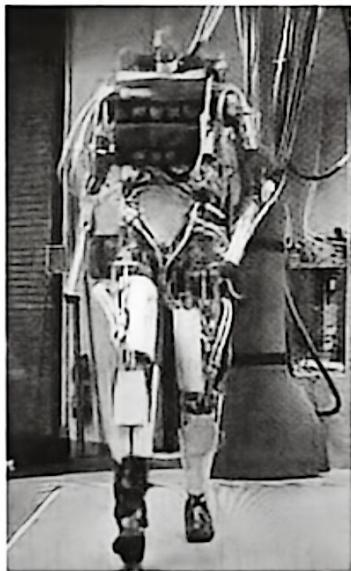

图 10.4 PETMAN 机器人

日本对仿人机器人的研究已有 40 多年的历史, 自 1973 年开始, 早稻田大学先后研制了 WAP、WL、WABOT 和 WABIAN 等系列机器人, 目前研制的最新机器人 WABIAN-2R 如图 10.5 所示, 高 1.48 m, 在行走时可以实现像人一样用脚跟触地和用脚趾离地, 脚趾采用被动关节连接, 通过双脚 

ASIMO 仿人机器人

的滑动可实现机器人快速转弯。从1998年开始，日本产业技术综合研究所实施HRP系列仿人机器人研究计划，其中研制的HRP-4机器人如图10.6所示，其体形与真人大小相当，设计上采用防尘防水结构，可以在大雨中或易滑冰面上行走，能耗小，重量轻，有较好的操作能力。2006年，本田公司仿人机器人推出的ASIMO机器人是仿人机器人的著名代表，如图10.7所示。ASIMO不仅具备行走和各种人类肢体动作的能 力,更具备了基本的记忆、辨识和动态环境下的自主避障能力,达到了较高的人工智能水平。 

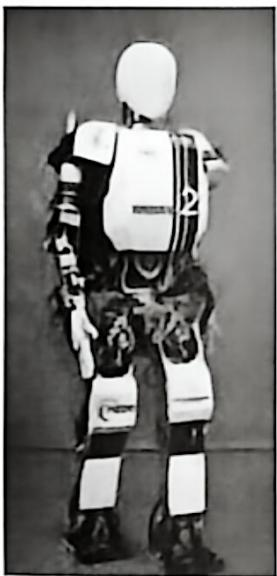

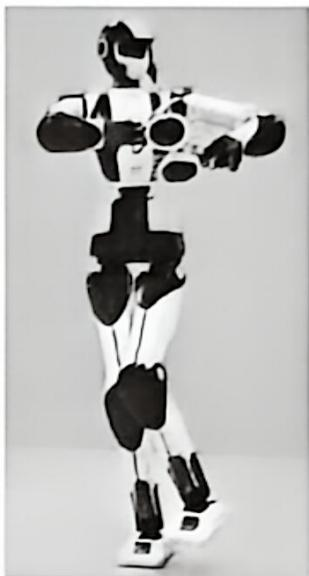

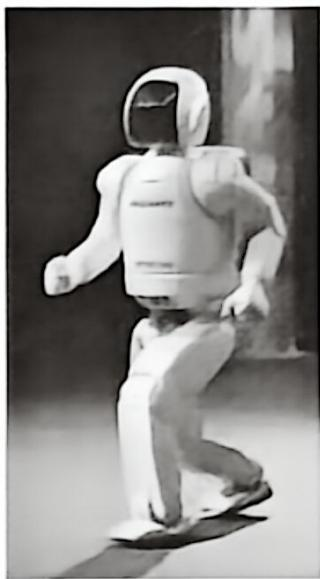

图 10.5 WABIAN-2R 机器人

图 10.6 HRP-4 机器人

图 10.7 ASIMO 机器人

除美国、日本外,其他西方国家也在进行仿人机器人的研究。其中,比较具有代表性的有德国慕尼黑工业大学的 Johnnie、法国普瓦捷实验室的 BIP2000、英国加藤实验室的 WL 系列、韩国仿人机器人研究中心的 KHR 系列、西班牙 PAL Robotics 公司的 REEM-B 等。 

#### 二、国内仿人机器人

我国仿人机器人的研究起步于20世纪80年代中期,至今也持续开展了多年。哈尔滨工业大学自1985年开始研制仿人机器人,到1995年研制成功了HIT仿人机器人,可实现静步态和动步态步行,能够完成前后行、侧行、转弯、上下台阶及斜坡等动作。国防科技大学于2000年底研制成功的“先行者”机器人,高1.4m,重20kg,研究人员为该机器人构造了具有学习功能的自适应步态规划参数修正框架。 

清华大学研制开发的仿人机器人 THBIP 如图 10.8 所示, 它采用模块化关节和同步带加谐波或速器的传动结构实现机器人的小型化, 成功实现连续稳定的平地行走和踢球等动作。北京理工大学 2011 年研制成功的“汇童 5”仿人机器人如图 10.9 所示, 它具有视觉、语言对话、力觉感知等功能, 能够自主行走, 可以实现打招呼、打太极拳、打乒乓球等动作, 是现阶段我国具有较高智能化水平的仿人机器人。 

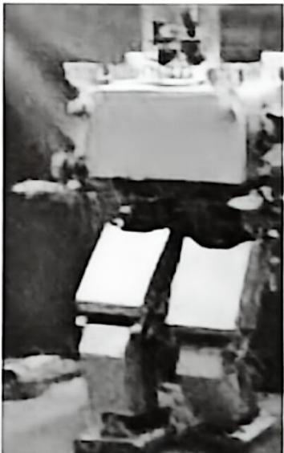

图 10.8 THBIP 机器人

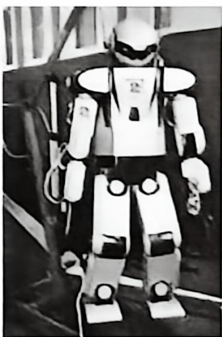

图10.9 “汇童5”机器人

仿人灵巧手

巧手是仿人机器人研究的一个重要分支,早在1993年,北京航空航天大学机器人研究所即研制成功了我国第一只三指手BUAA-I,如图10.10所示,此后又研制了相应的改进三指手。哈尔滨工业大学研制的HIT/DLR Hand II类人五指灵巧手,如图10.11所示,每个手指有4个关节、3个自由度,具有丰富的感知功能,能够完成复杂、拟人手的抓握操作。 

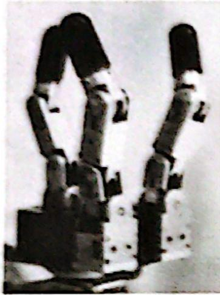

图 10.10 北航三指手

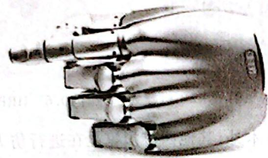

图 10.11 HIT/DLR Hand Ⅱ类人五指灵巧手

### 10.2.2 仿生四足机器人

四足机器人是一种模仿四足动物结构特点和运动形式的机器人,它是仿生多足机器人中研究和应用最广泛的一种。相对于双足机器人,它具有高负载性与高平稳性;相对于多足机器人,它又具备更大的运动空间,并使机构得到简化。四足机器人不仅可以在一般道路上高速行走,也可以在复杂地形上缓慢行走,在抢险救灾、野外勘探、军事运输、农业生产、教育娱乐等诸多方面都有广泛的应用前景。 

#### 一、国外仿生四足机器人

美国和日本是开展四足机器人研究较早的国家。1968年，美国通用公司成功研制Walking Truck四足电控步行车，如图10.12所示，它是早期四足机器人的典型代表，但该类型的机器人需要人操纵控制，因此严格来说并不能认为是真正意义上的足式步行机器人。1977年，世界上第一台真正意义上的四足步行机器人Phony Pony诞生，它标志着四足机器人开始步入计算机控制时代。进入20世纪80年代，随着计算机控制技术的日趋成熟，四足机器人的研制进入了一个高潮期，美国卡内基·梅隆大学和麻省理工学院共同研制的Raibert四足机器人是这一时期的代表。如图10.13所示，该机器人通过液压驱动，能够实现慢步、小跑、快跑三种步态的运动。通过跳跃步伐，它首先实现了四足机器人的动态稳定步行。 

进入21世纪以来，四足机器人的研究开始从已知环境逐步转移到未知复杂环境。通过面向复杂地形时的自适应运动规划，四足机器人具备了更多的自主性、更强的负载和动态行走的能力，应用范围也因此得到不断延伸。 

其中,在中小型四足机器人方面,日本电气通信大学研制的 Tekken 机器人具有代表性。如图 10.14 所示,该机器人在仿生运动控制中采用了改进的 Matsuoka 神经元振荡器模型,通过该模型构建机器人的基本节律运动发生器,从而实现了复杂地形条件下的自适应动态行走和平整路面上的奔跑运动。 

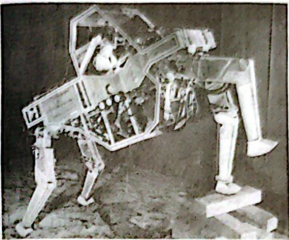

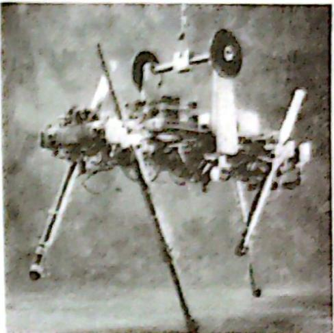

图 10.12 Walking Truck 四足电控步行车

图 10.13 Raibert 四足机器人

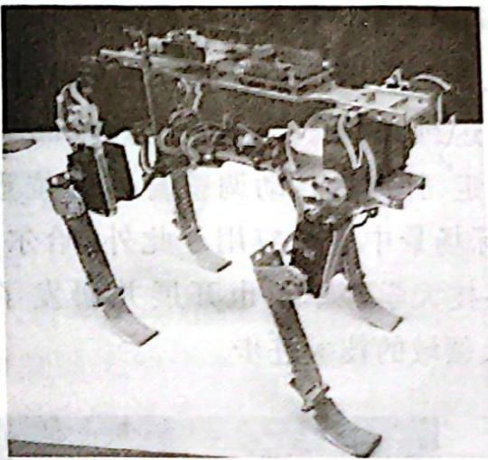

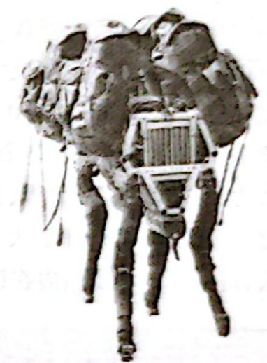

图10.14 Tekken机器人

图 10.15 BigDog 四足机器人

由于中小体型四足机器人整体负载能力较低。近年来，四足机器人的体形开始向大型化方向发展。2006年，美国波士顿动力公司研发的BigDog四足机器人(图10.15)是最具有代表性的大型四足机器人之一。BigDog是专门为美军研究设计，其体型与大型犬相当，可以为士兵运输食品、弹药等较重的货物。它不仅能够行走和奔跑，而且还可跨越一定高度的障碍物。2012年，波士顿动力公司推出了猎 

Cheetah猎豹机器人

豹机器人 Cheetah, 如图 10.16 所示, 该机器人采用仿生脊椎式的柔性背部关节, 在奔跑过程中可如猎豹一般屈伸自如, 其最高实验运动速度可达到 $47 \mathrm{~km} / \mathrm{h}$ , 是目前世界上奔跑速度最快的足式机器人。2013 年, 波士顿动力公司又继续推出了四足机器人 WildCat, 如图 10.17 所示, 以期适应全地形的奔跑。 

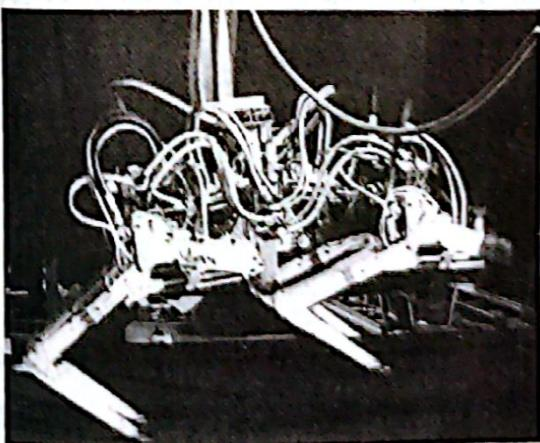

图 10.16 Cheetah 猎豹机器人

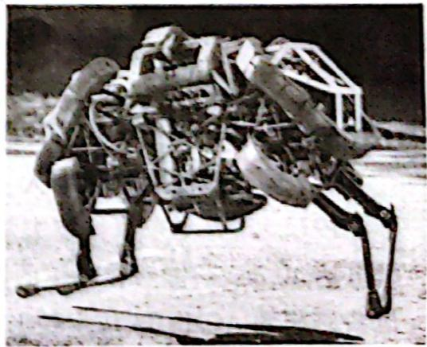

图 10.17 WildCat 机器人

#### 二、国内仿生四足机器人

相对于西方发达国家,我国对四足机器人的研究虽然起步较晚,但自20世纪80年代至今也已取得了长足的发展。 

上海交通大学研制的 JTUWM-Ⅲ是国内第一台四足机器人,可实现动态步行,步行速度最高约为 0.2 km/h。清华大学研制的四足机器人 Biosbot 也是国内较早研制出的四足机器人, $Biosbot$ 可以实现慢步行走和快步小跑两种步态,同时可以实现步态之间的转换,可完成上下坡、小幅越障等动作,具备了一定的环境自适应能力。 

2010 年, 山东大学研制成功国内第一台液压驱动的四足机器人 SCalf, 如图 10.18 所示, 是具有 12 个主动自由度和 4 个被动自由度的四足仿生机构, 其中每条腿分别有 1 个横摆关节和 2 个俯仰关节。其速度可以达到 $1.8 \mathrm{~m} / \mathrm{s}$ , 在负载 $80 \mathrm{~kg}$ 的情况下能以 $0.4 \mathrm{~m} / \mathrm{s}$ 的速度行走。此后, 山东大学又研制了 SCalf-2, 进一步升级了负载、抗侧向冲击和野外地形适应能力。 

2月,浙江大学发布了“绝影”四足机器人,如图10.19所示。该机器人身长1m,四足站立时高60cm,重70kg,载重可达到20kgf,行走速度为6km/h。目前,它已经掌握了跑跳、爬梯、在碎石子路上行走、摔倒后自动调整身体方位重新站立等许多能力,有望在安防、侦查、救灾等实际场景中进行应用。此外,哈尔滨工业大学、西北工业大学、北京理工大学、国防科技大学等单位也开展并研发了多种四足机器人,进一步推动了国内在四足机器人领域的技术进步。 

“绝影”四足机器人 

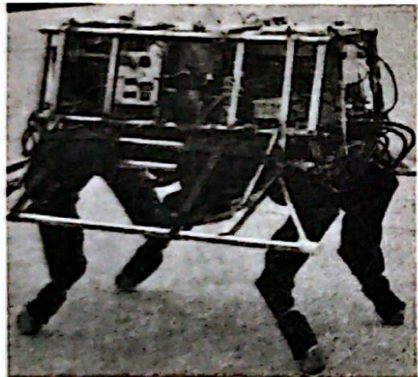

图10.18 SCalf四足机器人

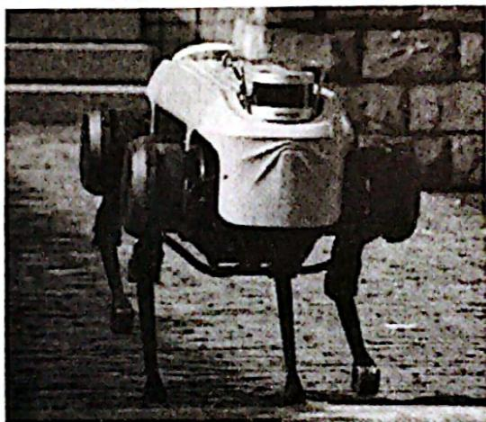

图 10.19 “绝影”四足机器人

### 10.2.3 仿生蛇形机器人

仿生蛇形机器人是一种能够模仿生物蛇运动的新型仿生机器人。由于其生理结构和运动特点，对复杂地形具有很强的适应性，即使在废墟中也可以自由运动，因此可以被应用到环境复杂、高度危险和人类无法进入的场合作业。特别是在地震发生后，仿生蛇形机器人展现出卓越的抢险救灾和生命搜寻能力，越来越受到各国科研人员的重视。 

#### 一、国外仿生蛇形机器人

ACM-R5 仿生蛇形机器人

1972 年, 日本东京科技大学研制出世界上第一台仿生蛇形机器人 ACM, 其速度可达 40 cm/s, 能够在崎岖的路面上移动。随后, ACM 进行了多代的更新研发, 其最新研制的 ACM-R5 仿生蛇形机器人(图 10.20), 已经发展到了水路两栖, 并且可以进行探雷应用。 

2018年2月,哈佛大学的科研人员展示了其开发的最新蛇形软体机器人,如图10.21所示,该机器人使用Kirigami感应结构的可变形材料来模仿蛇鳞的工作原理,通过反复充气、放气来爬行。人造蛇皮可以对抗粗糙的表面,如沥青和混凝土,在未来可以缩小用于在血管中运送药物。 

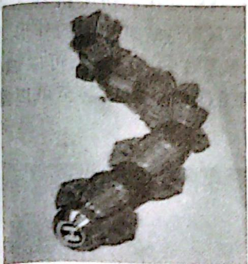

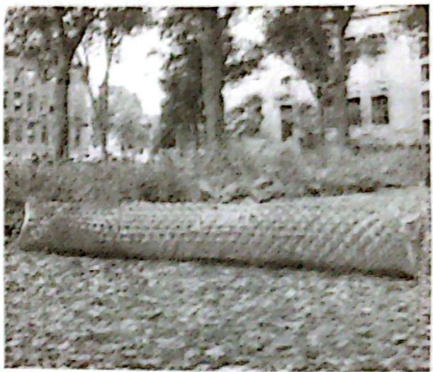

图 10.20 ACM-R5 仿生蛇形机器人

图 10.21 哈佛大学蛇形软体机器人

#### 二、国内仿生蛇形机器人

自20世纪末,我国也开始了仿生蛇形机器人的研究工作,虽然起步较晚,但研发脚步逐渐赶上国外发展水平,近年来也取得了可喜成果。 

1999 年上海交通大学研制了我国第一台微小型仿生蛇形机器人, 如图 10.22 所示, 该样机由一系列刚性连杆连接而成, 可以在水平面内做一些简单的动作。沈阳自动化研究所是国内对仿生蛇形机器人研究较多的机构, 其开发的蛇形机器人探查者Ⅲ比较有代表性, 它是一个水陆两栖的仿生蛇形机器人, 如图 10.23 所示, 共有 9 个关节, 长 1.17 m, 重达 6.75 kg, 其躯干四周均匀分布 8 个特殊的“桨轮结构”, 可以实现三维空间中的任意姿态。 

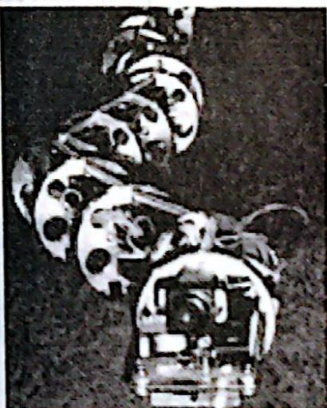

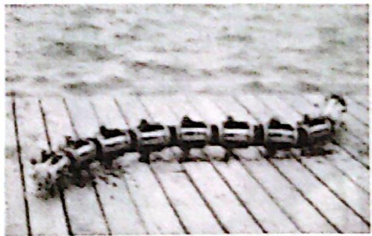

图 10.22 上海交通大学仿生蛇形机器人

图 10.23 “探查者Ⅲ”仿生蛇形机器人

### 10.2.4 空中仿生机器人

空中仿生机器人是一种能够模仿鸟类或昆虫飞行的新型仿生机器人。这种类型的机器人由于具有体积轻盈、运动灵活多变的特点，在军事和民用方面都具有广泛的应用前景。 

#### 一、国外空中仿生机器人

近年来,美国、德国等国家的科学家通过对飞行生物的模仿,研制了各式仿生扑翼飞行器。2011年,美国加州航空环境公司展示了其研发的微型飞行器“纳米蜂鸟”,如图10.24所示, 翼展为 $16.5\mathrm{cm}$ ，质量仅为 $10\mathrm{g}$ ，它相当于一个微型的无人侦察机，飞行速度可达 $17\mathrm{km/h}$ ，通过快速扇动身体两侧的翅膀，能够上下、左右自由飞动，还能旋转和盘旋，该仿生机器人可以用于前线侦察敌情，也可飞进危险的地震灾区或化学泄漏区搜寻受困人员。 

BionicOpter 仿生蜻蜓

2013 年, 德国 Festo 公司研制出一种模拟蜻蜓动作的仿生机器人 BionicOpter, 如图 10.25 所示, 长度约 43 cm, 拥有超轻的重量和与蜻蜓相似的外形, 它的四个翅膀由四个执行电动机分别控制, 使每个翅膀都能做 90° 的旋转, 可以通过单独振动每个翅膀完成减速、加速或后退, 使其能够朝任意方向飞行, 甚至可以盘旋, 拥有极强的灵活性。 

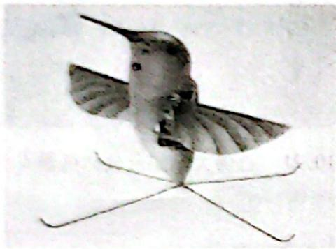

图 10.24 纳米蜂鸟

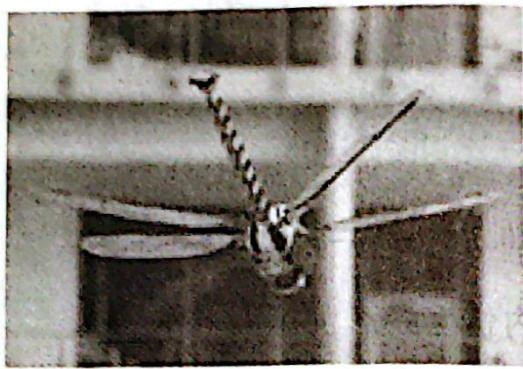

图 10.25 BionicOpter 仿生蜻蜓

#### 二、国内空中仿生机器人

与国外相比,国内在仿生飞行器的研究方面起步较晚,随着仿生飞行器的应用前景和使用价值得到广泛认可,仿生飞行器在国内也逐渐成为热门的研究对象。 

由南京航空航天大学设计制作的“黄莺”微小型可控扑翼飞行器如图10.26所示，翼展为24 cm，质量为38 g，能在空中飞行6 min，飞行高度可达50 m，可遥控飞行的航程达2 000 m，由自行研制的质量不到1 g的超微型无芯舵机控制，具有噪声小、飞行稳定、控制灵活等优点。 

西北工业大学研制的仿鸟扑翼飞行器“信鸽”如图10.27所示，重约 $200\mathrm{g}$ ，翼展约 $50~\mathrm{cm}$ ，最大飞行时速可达 $40\mathrm{km / h}$ 。该飞行器主要用于侦察，载有高清摄像头，其特制的防震颤软件可保证成像的清晰度，可以及时传送发现的信息数据。 

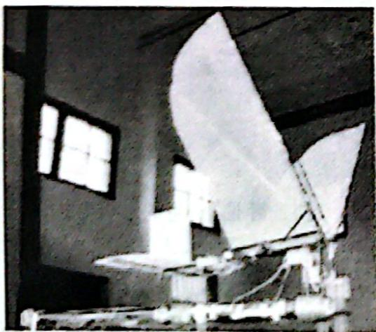

图 10.26 “黄莺”扑翼飞行器

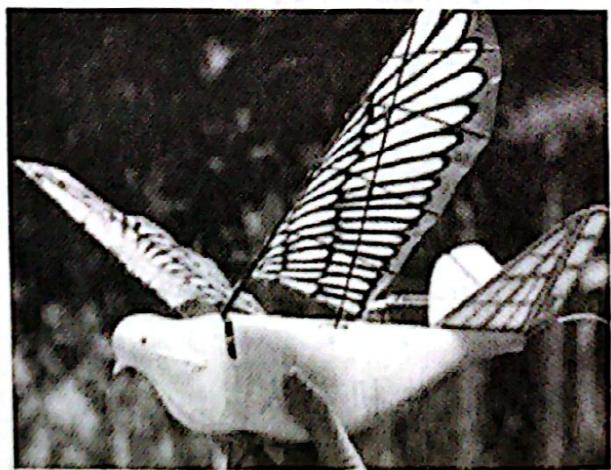

图 10.27 西工大仿生“信鸽”仿鸟扑翼飞行器

### 10.2.5 水下仿生机器人

水下仿生机器人是参照鱼类等水下生物游动的推进机理,利用机械电子元器件或智能材料 来实现水下推进的一种运动装置。由于以鱼类为代表的水下生物具有高效、高机动、低噪声等优良特性，因此水下仿生机器人适宜在狭窄、复杂和动态的水下环境中进行监测、搜索和救援等作业，具有广泛的应用前景。 

#### 一、国外水下仿生机器人

1994 年, 美国麻省理工学院成功研制了世界上第一条真正意义上 Robotuna 仿生机器鱼, 如图 10.28 所示。大部分鱼类的推进方式分为身体/尾鳍(body and/or caudal fin, BCF) 推进模式和中鳍/对鳍(median and/or paired fin, MPF) 推进模式两种。该仿生机器鱼主要采用 BCF 模式, 其瞬间游动的加速性能好, 周期游动巡航能力强, 但机动性能不如 MPF 模式。2010 年, 新加坡南洋理工大学研制的 RoMan-Ⅱ 仿生蝠鳍试验样机如图 10.29 所示, 身体两侧平均分布 6 个柔性鳍条, 通过鳍条的拍动产生推进力, 可实现各个方向的机动性。 

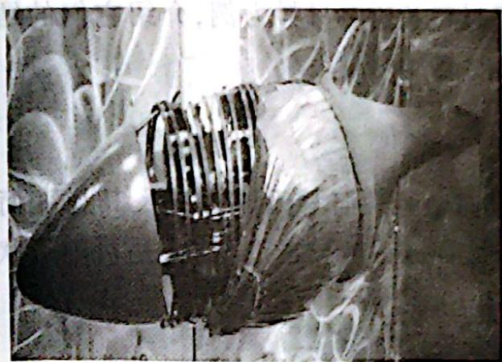

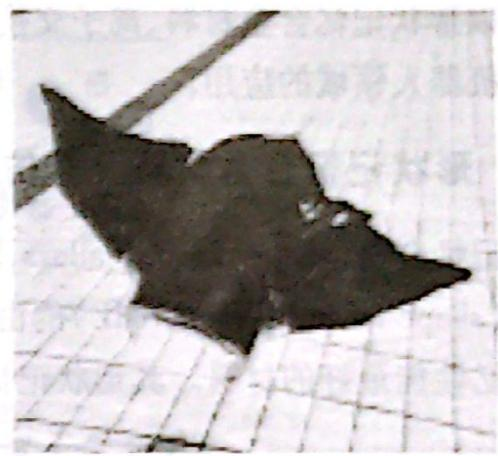

图 10.28 Robotuna 仿生机器鱼

图 10.29 “RoMan-Ⅱ”仿生蝠鳞试验样机

#### 二、国内水下仿生机器人

北京航空航天大学、中国科学院自动化研究所、国防科技大学等单位在国内开展了较为深入的水下仿生机器人研究。 

中国科学院自动化研究所开发的仿海豚机器鱼如图 10.30 所示, 其运动灵活性强, 能实现快速小半径转弯, 已应用于青海省玉树震区灾后水库的野外水质监测等工作。2017 年, 北京航空航天大学与德国 Festo 公司合作研制成功软体章鱼触手机器人, 如图 10.31 所示。该仿生软体触手模仿软体动物章鱼的生理结构, 由接近生物的软组织材料组成, 可以实现多种不同形状、不同尺寸、不同摆放姿态物体的安全、无损和稳定抓持, 未来可应用于医疗康复、家政服务等领域。 

软体章鱼触手机
器人

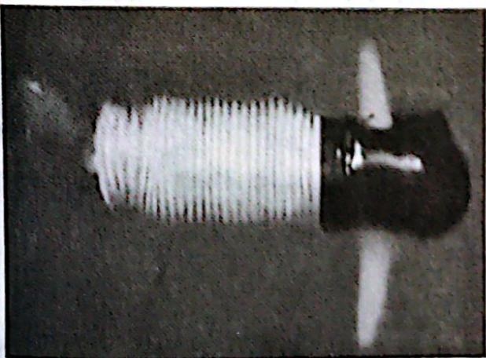

图 10.30 中国科学院仿海豚机器鱼

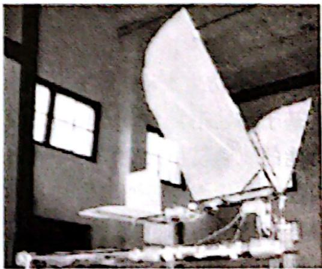

图 10.31 软体章鱼触手机器人

## 10.3 仿生机器人的智能材料技术

传统的仿生机器人主要利用电动机或者液压方式,通过机械传动机构实现对仿生机器人的驱动,在实际应用中已表现出机动性好、推进效率高的优点。但是这类仿生机器人往往体积较大,特别是柔性运动较为困难,难以完全实现对生物运动的模仿。 

近年来,智能材料技术得到了飞速的发展,由于智能材料相对于刚性材料而言更加贴近生物的生理结构,因此利用智能材料作为驱动器在仿生柔性化方面具有较大优势,由此设计并研发出新型仿生机器人成为新的发展趋势。 

本节以形状记忆合金材料、离子交换聚合金属材料和压电材料为例，介绍它们的结构特点及其在仿生机器人领域的应用。 

### 10.3.1 形状记忆合金材料及其仿生应用

形状记忆合金(shape memory alloys, SMA)是通过热弹性与马氏体相变及其逆变而具有形状记忆效应(shape memory effect, SME)的由两种以上金属元素所构成的材料, 是目前形状记忆材料中形状记忆性能最好的材料。其形状记忆原理如图 10.32 所示。 

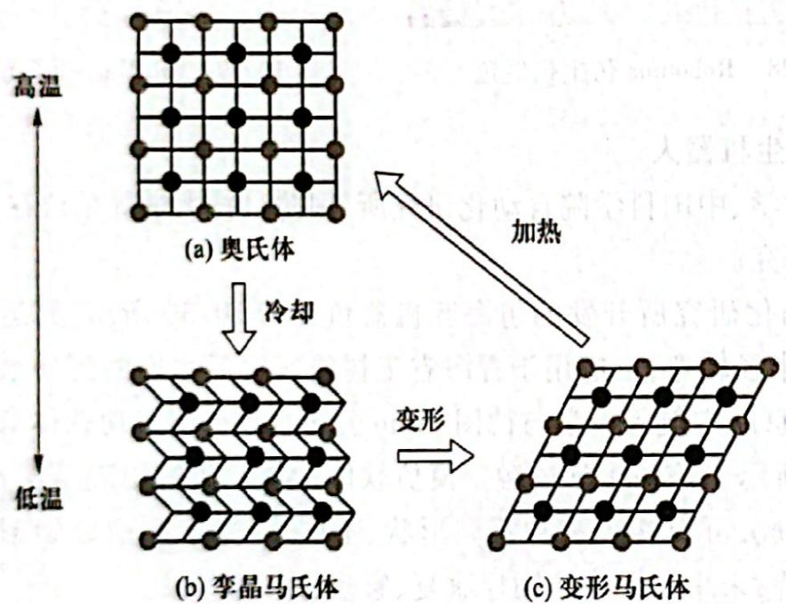

图 10.32 SMA 材料形状记忆原理

近年来,中国科学技术大学通过对海月水母的仿生性研究,研制了一款仿生水母机器人样机,如图10.33所示。该机器人基于形状记忆合金(SMA)丝设计了具有类似人工肌肉功能的驱动模块,共由6组SMA驱动模块辐射对称组装构成。与传统电磁驱动方式相比,采用SMA的柔性驱动器具有结构小巧、变形力输出大、可控性相对较高的优势。该机器人以SMA驱动为基础,采用基于中枢模式发生器(CPG)网络的仿生控制方式,可实现在三维空 

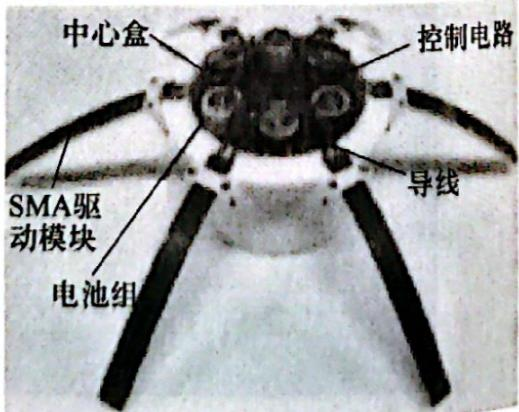

图 10.33 仿生水母机器人样机

间内的多模式游动。 

### 10.3.2 离子交换聚合金属材料及其仿生应用

离子交换聚合金属材料(Ion-exchange polymer-metal composites, IPMC), 是一种电活性高分子材料(electroactive polymer, EAP), 其主体是聚合物薄膜, 在聚合物薄膜的两面镀有薄的贵金属电极, 当在电极处施加电压时, IPMC 内部可活动阳离子在静电力作用下重新分布, 带动水合水分子向阴极运动, 形成阳离子和水分子在阴极的聚集。在静电力和膨胀力的共同作用下, IPMC 向阳极方向形成弯曲变形, 其结构和弯曲原理如图 10.34 所示。由于在较低的驱动电压下 IPMC 能产生较大的位移变形, 因此作为一种新型驱动器非常适用于仿生机器人的研发。 

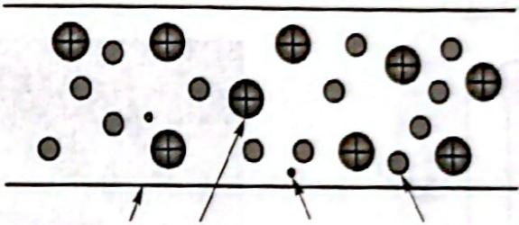

铂 离子 聚合物 水分子

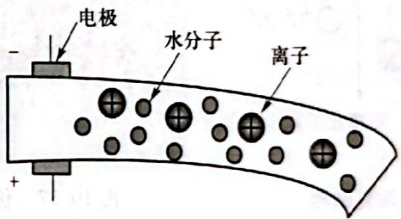

图10.34 IPMC的结构和弯曲原理

美国密歇根州立大学研制了一系列基于IPMC驱动的微型机器鱼。2005年首先研制出不附带被动鳍的微型机器鱼，如图10.35a所示。该机器鱼的尾鳍由一片IPMC构成，IPMC作为推进机器鱼的驱动器，同时用于传感平台，最高游速为 $6.3\mathrm{mm / s}$ 。随后研制出附带被动鳍的机器鱼，如图10.35b所示。通过在IPMC驱动器上附加被动尾鳍，改进了尾鳍的形状和结构，从而使机器鱼的推进速度提高到 $20\mathrm{mm / s}$ ，较大地提升了该机器鱼的驱动性能。 

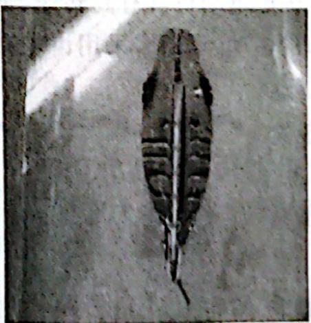

(a) 不附带被动鳍的机器鱼

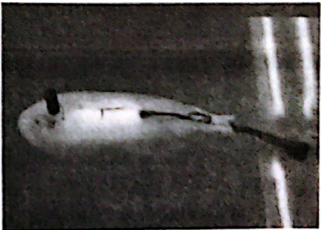

(b)附带被动鳍的机器鱼

图 10.35 利用 IPMC 材料制作的仿生机器鱼

### 10.3.3 压电材料及其仿生应用

压电材料是受到压力作用时会在两端面间出现电压的晶体材料,它可以实现机械能与电能之间的相互转换。石英、锆钛酸铅(piezoelectric ceramic transducer, PZT)压电陶瓷、偏聚二氟乙烯等都是主要的压电材料。 

PZT 压电陶瓷结构如图 10.36 所示, 在发生形变时可以形成电荷, 即产生压电效应。反之在外加电场的作用下, 由于逆压电效应, 材料也会产生形变, 因此可以作为仿生机器人的驱动器。 

2015 年, 德国 Festo 公司发布的蚂蚁仿生机器人 BionicANT 即采用了压电陶瓷技术, 如图 10.37 所示。每个 BionicANT 体长 13.5 cm, 重 105 g, 在其腿部和夹爪制动器上, 采用了压电陶瓷制成弯曲换能器, 可以实现模仿蚂蚁的行进和弯曲动作, 能够快速、高效地移动, 并且可以进入很小的空间。 

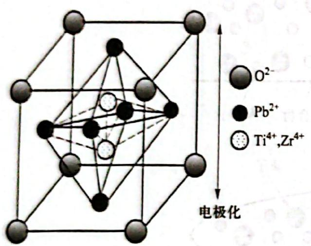

图 10.36 PZT 压电陶瓷结构

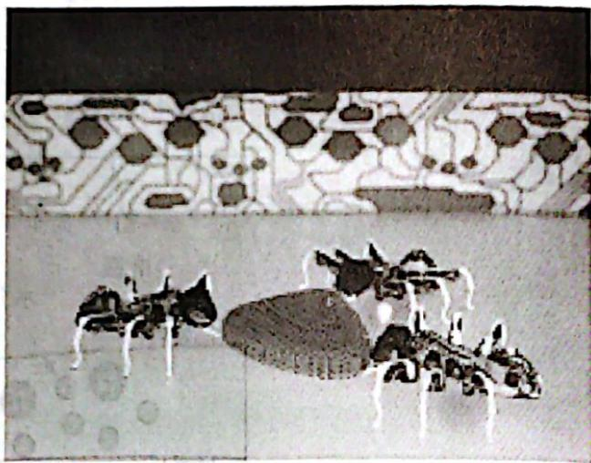

图 10.37 仿生蚂蚁 BionicANT

## 10.4 仿生机器人的控制技术

### 10.4.1 仿生机器人的驱动控制方式

仿生机器人的关节驱动方式包括伺服电动机驱动、液压驱动、气动肌肉等。其中，伺服电动机和液压驱动是传统仿生机器人主要采用的驱动方式。伺服电动机具有高转速、低扭矩的特点，在应用时一般通过与减速器相配合来完成对机器人关节的驱动，早期多采用齿轮减速器，目前已 

广泛使用谐波减速器。相对于伺服电动机方式，液压驱动方式具有输出功率大、承受机械冲击能力强、无需减速装置等优点，其缺点是液压系统易泄漏，同时必须配置液压源。因此，采用液压驱动方式的仿生机器人能否安装液压源是其需要解决的主要问题。 

气动人工肌肉是一种具有类似人类肌肉输出特性的柔性驱动器,如图 10.38 所示,它是根据人类肌肉的运动原理设计而成的。气动人工肌肉由外部提供的压缩空气驱动, 作推拉动作,其过程就像人体的肌肉运动,可以提供很大的力量,而自身质量却很小,最小的气动质量只有10 g。 

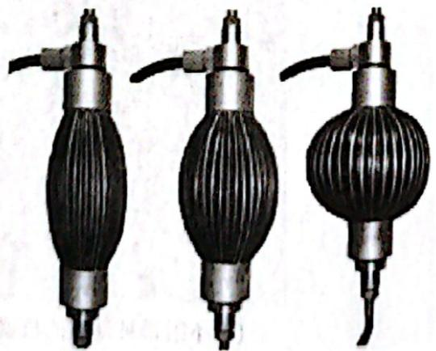

图 10.38 气动人工肌肉

与气缸相比，气动人工肌肉不仅具有质量小、价格低、易维护等优点，并且由于其力-位移关系特性与人类肌肉特性相似而具有很好的柔韧性，因此在仿生机器人领域中具有较好的应用 

气动人工肌肉通常只能提供拉力,为实现正反两个方向的动作,在使用时一般有两种方式,一种是将其与复位弹簧组合使用(图10.39),另一种是将多根气动人工肌肉成组使用(图10.40),两种方式均可实现直线或旋转运动。 

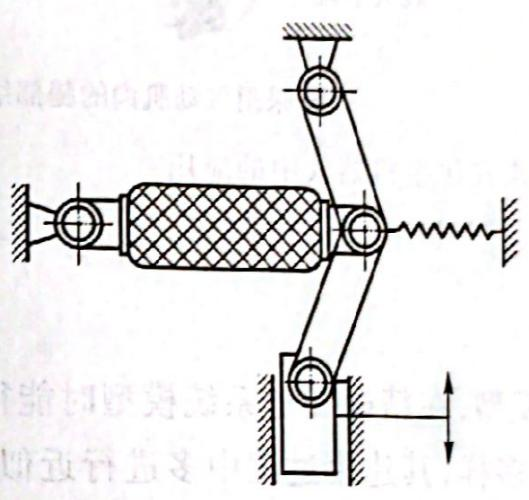

(a) 直线运动形式

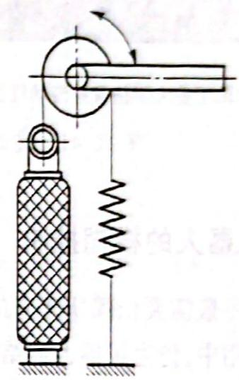

(b) 旋转运动形式

图 10.39 气动人工肌肉与复位弹簧组合使用方式

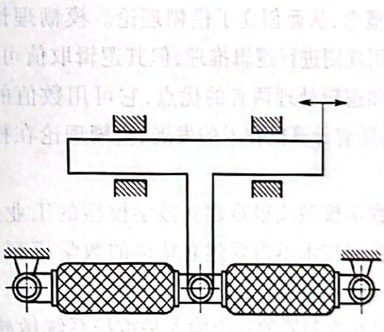

(a) 直线运动形式

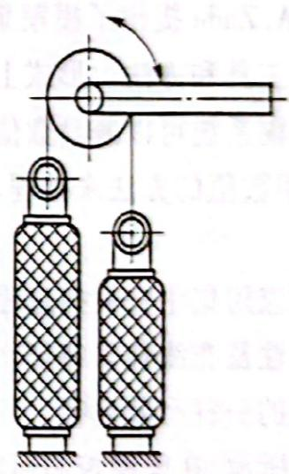

(b) 旋转运动形式

图 10.40 气动人工肌肉成组使用方式

近年来, 哈尔滨工业大学科研团队开展了基于气动肌肉的仿青蛙游动机器人样机设计与实验研究, 如图 10.41a 所示。该仿青蛙游动机器人采用气动人工肌肉作为驱动器完成腿部的踢腿运动, 其腿部结构设计如图 10.41b 所示, 采用单肌肉和复位弹簧驱动的钢丝绳直连驱动方式, 使关节输出力矩最大, 以满足仿青蛙游动机器人爆发性的要求, 同时弥补气动肌肉收缩率不足的缺点。通过将肌肉气源、核心控制系统和电气系统集中在仿青蛙游动机器人机体中, 来实现机器人的自由运动。 

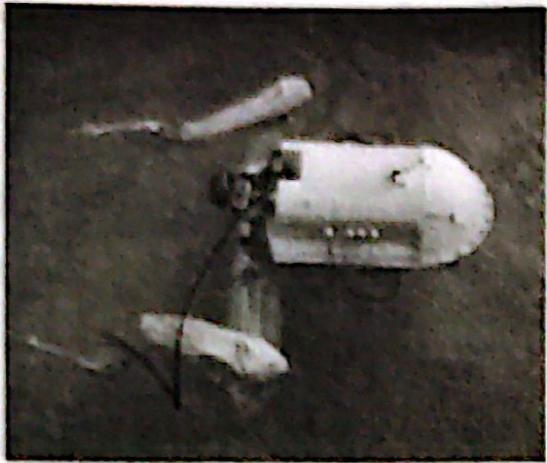

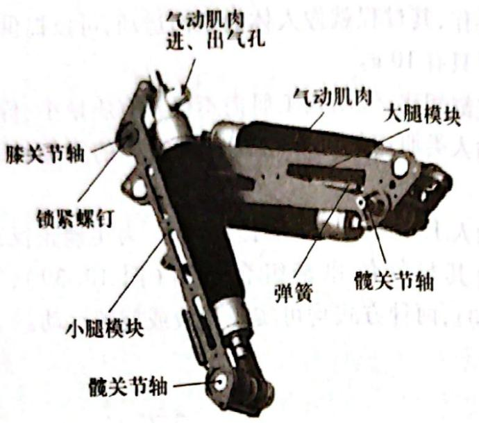

(a) 哈尔滨工业大学仿青蛙游动机器人

(b) 采用气动肌肉的腿部结构

图 10.41 气动人工肌肉在仿生机器人中的应用

### 10.4.2 仿生机器人的模糊控制

传统控制方法一般需要依赖所建立的数学模型,在精确知道系统模型时能得到很好的控制效果。然而在实际应用中,仿生机器人的结构复杂多样,其建模过程中多进行近似处理,造成其建模参数不可能足够精确,同时不可避免存在环境干扰,降低了传统控制方法的实施效果,而模糊控制方法适合于处理由不确定因素影响的控制模型,因此本节主要介绍仿生机器人的模糊控制方法。 

#### 一、模糊控制器的基本原理

1965 年, L. A. Zade 提出了模糊集合的概念, 从而创立了模糊理论。模糊理论是介于推理与计算之间的一种工具和方法。形式上它利用规则进行逻辑推理, 但其逻辑取值可以在 0~1 范围内连续变化。模糊系统可以兼具数值处理和逻辑处理两者的优点, 它可用数值的方法来表示结构性知识, 从而用数值的方法来处理。因而随着计算机技术的发展, 模糊理论在控制领域取得了巨大的成功。 

模糊理论的应用集中在被控过程没有数学模型或很难建立数学模型的工业过程,这些过程的参数具有时变性及非线性等特征。模糊控制技术不需要建立精确的数学模型,是解决不确定性系统控制问题的一种有效途径。 

如图 10.42 所示, 在模糊控制回路中, 模糊控制器的一个输入是被控系统敏感环节输出的测量值, 另外一个输入量是设定值输入; 模糊控制器的输出则是被控系统的调节环节输入。 

在常规控制中可以使用传递函数和数学方程精确地描述控制器的输入、输出特性。例如假设有一个自动调温系统，其常规控制语句如下： 

如果室温≥27℃,则启动制冷; 

如果室温≥18℃且≤27℃,则不启动调温系统; 

如果室温 $\leqslant18^{\circ}C$ ，则启动加热。 

但在模糊控制器中,则是使用语言型模糊控制率来描述模糊控制器的控制特性。模糊控制率是将人类对某一过程的推理和判断知识加以提炼后形成的。对同一个调温系统有如下描述: 

如果室温很低,室温还在微量降低,则全力加热; 

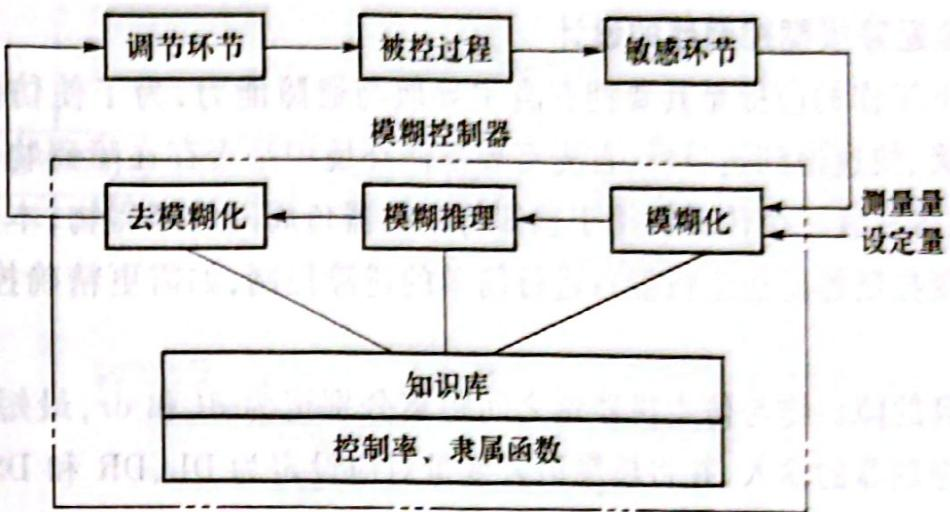

图 10.42 模糊控制系统原理图

如果室温适中,室温不再变化,则不加热; 

如果室温偏高,室温微量上升,则中等降温; 

如果室温较高,室温不再变化,则微量降温; 

如果室温较高,室温微量上升,则中等降温。 

在上述语言描述中,都是根据条件满足的情况得出定性结论。如果用 T 代表室温,dT 代表温度的变化,du 代表加热的大小,再为每个输入量定义出相应的语言值即模糊集: 

室温 $T=\{NB(很低),ZR(适中),PS(偏高),PM(较高)\}$ ; 

室温变化 $\mathrm{d}T = \{\mathrm{NS}$ （微量降低），ZR（不再变化），PS（微量上升）； 

温控量 $\mathrm{du} = \{\mathrm{PB}$ （全力加热），ZR（不加热），NS（微量降温），NM（中等降温） 

则可将上述语言描述改写为 

$$
\text { IF } T = \mathrm{NB} \text { AND } \mathrm{d} T = \mathrm{NS} \text { THEN } \mathrm{d} u = \mathrm{PB};
$$

$$
\text { IF   } T = \text { ZR   AND   } \mathrm{d} T = \text { ZR   THEN   } \mathrm{d} u = \text { ZR };
$$

$$
\text { OR   IF } T = \text { PS   AND } \mathrm{d} T = \text { PS   THEN } \mathrm{d} u = \text { NM };
$$

$$
\text { OR   IF } T = \text { PM   AND } \mathrm{d} T = \text { ZR   THEN } \mathrm{d} u = \text { NS };
$$

$$
\text { OR   IF } T = \text { PM   AND } \mathrm{d} T = \text { PS   THEN } \mathrm{d} u = \text { NM }
$$

以上描述称为温控模糊控制率。它是将模糊算子 OR 及单一的 IF-THEN 规则连接在一起的模糊控制规则。模糊控制率和隶属函数及推理方法一起决定着模糊控制器的传递特性。 

模糊控制器的输入和输出都是非模糊量,而其内部却建立在语言型的模糊控制率上,由条件满足的程度推出模糊输出的大小。该推理过程采用模糊理论,称为模糊推理。为了进行模糊推理必须先将非模糊量转化为模糊量,该过程称为模糊化。由于模糊推理的输出是模糊值,还必须将模糊输出转化为非模糊集,该过程称为去模糊化。模糊控制器由模糊化、模糊推理和去模糊化三部分组成,三部分共同建立在知识库上,如图10.43所示。 

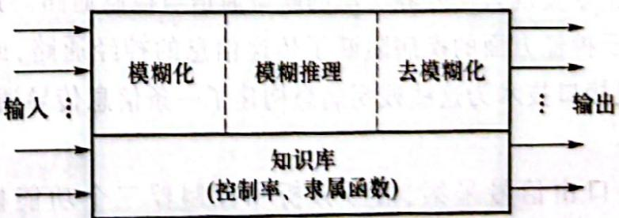

图 10.43 模糊控制器的组成

#### 二、仿生机器鱼避障模糊控制器的设计

仿生机器鱼水下工作的前提是其要拥有自主导航与避障能力,为了使仿生机器鱼能够在环境未知的情况下准确、快速地到达目标,首先需要探测环境中是否存在障碍物。在仿生机器鱼的头部前方左、右两侧各放置一个传感器用于感知仿生机器鱼周围的障碍物,本节根据虚拟传感器设计一个简化的模糊控制器对仿生机器鱼进行简单的避障控制,如需更精确控制,则应增加传感器数量。 

两传感器探测到的障碍物与仿生机器鱼之间距离分别记为 $dl$ 和 $dr$ ，最短安全距离为 $ds$ ，将上述距离作为模糊控制器的输入，并将模糊语言变量对应设定为 DL、DR 和 DS，定义距离语言值为 VC（很近）、RC（较近）、M（适中）、RF（较远）和 VF（很远）。以仿生机器鱼的控制偏转角作为输出，定义输出转角 $\varphi$ 的语言值为 BR（大角度右转）、SR（小角度右转）、N（不转动）、SL（小角度左转）和 BL（大角度左转）。 

当探测到仿生机器鱼与左侧障碍物的距离为 RC(较近)而与右侧障碍物的距离为 VC(很近)时,仿生机器鱼应 SL(小角度左转)。即规则形式为 

$$
\text { IF } (\text { DL   is   RC   AND   DR   is   VC }) \text { THEN } (\varphi \text {   is   SL })
$$

类似建立其他情况下的仿生机器鱼避障模糊控制规则,建立的模糊控制器规则如表10.1所示。 

表 10.1 仿生机器鱼模糊控制器的模糊规则表

<table><tr><td rowspan="2">DL</td><td colspan="2"></td><td colspan="3">DR</td></tr><tr><td>VC</td><td>RC</td><td>M</td><td>RF</td><td>VF</td></tr><tr><td>VC</td><td>N</td><td>SR</td><td>SR</td><td>SR</td><td>BR</td></tr><tr><td>RC</td><td>SL</td><td>N</td><td>SR</td><td>SR</td><td>SR</td></tr><tr><td>M</td><td>SL</td><td>SL</td><td>N</td><td>SR</td><td>SR</td></tr><tr><td>RF</td><td>SL</td><td>SL</td><td>SL</td><td>N</td><td>SR</td></tr><tr><td>VF</td><td>BL</td><td>SL</td><td>SL</td><td>SL</td><td>N</td></tr></table>

由于实际决策仿生机器鱼下一步动作的应是精确值,所以在对模糊语言值进行模糊推理后,需通过去模糊化最终得到仿生机器鱼的运动速度与转向角。 

### 10.4.3 脑机接口技术

脑机接口(brain-computer interface, BCI)是一种不依赖传统神经/肌肉组织,通过将大脑活动信号直接转换成计算机指令实现人与外界交流的新型通信与控制通路。这种技术最早出现于医疗康复领域。当人们由于神经方面的疾病阻断了传递信息的神经通路,或因为事故丧失了运动或语言交流能力时,脑机接口技术为这些残疾病患构建了一条信息传导通路,从而可重建与外界的交流。 

一个完整的脑机接口由信号采集、信号分析和控制器三个功能模块构成,如图 10.44 所示。 

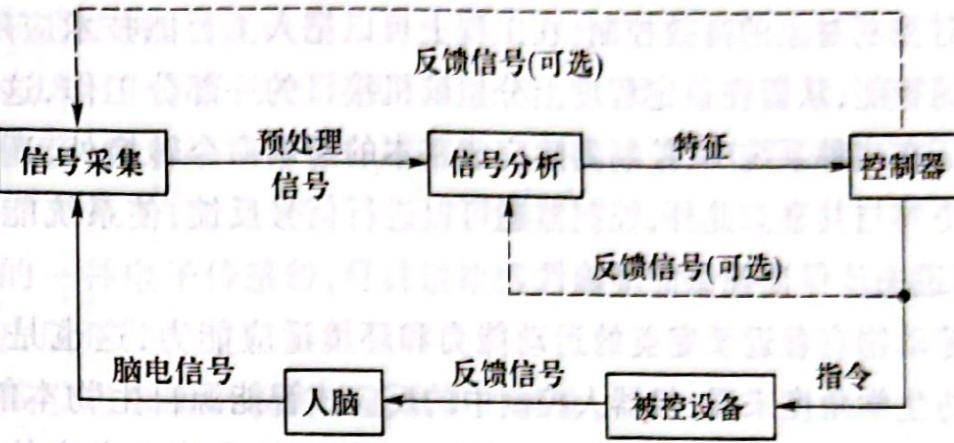

图 10.44 脑机接口构成

#### 一、信号采集模块

脑机接口的建立首先需要对脑活动信号进行记录。目前记录大脑活动信号的主要方法有功能磁共振成像技术、光学成像技术、脑磁图、脑电图等。作为一种面向人类的操控设备，脑机接口必须具备使用简单、携带方便、健康安全等特性，在上述方法中，脑电图技术是一种无损检测技术，比较适合为脑机接口提供信号源。 

脑电图信号是指由大量的神经细胞在生理活动过程中产生电生理现象,进而发生混合、叠加、传播,从而在大脑皮层或者头皮表面表现出来的一种电现象。一般脑电信号的电压幅值在几至几十微伏。从技术指标来看,脑电信号具有极高的时间分辨率,因此适宜构建实时的控制系统。采用脑电图对大脑活动进行采集十分安全快捷,只需在大脑头皮上粘贴金属电极即可,目前普遍采用的方法是使用电极帽来安置电极,如图10.45所示。 

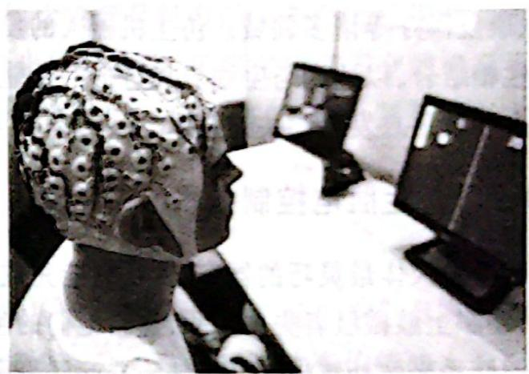

图 10.45 脑电图信号采集电极帽

#### 二、信号分析模块

通过信号采集得到的脑电信号强度一般极其微弱,容易受到外界环境的干扰,为提高信噪比,对采集到的脑电信号需要进行信号分析,主要包括信号放大(一般需要放大1000倍至mV级)、滤波等预处理,再通过A/D转换进行采样得到数字信号。 

脑电信号分析的目标是识别脑电信号所代表的大脑意图,这是脑机接口的核心工作。在工程上一般采用模式识别的方法对脑电信号进行识别分类并估计大脑意图。该过程的第一步是进行特征提取,提取反映脑电信号的时域和频域特征,可采用快速傅里叶变换、小波分析等常用方法。第二步是分类器设计。常用的分类器包括线性分析、支持向量机等。在完成了特征提取和分类器的学习之后,信号处理模块完成实时分类,根据分类识别的结果估计大脑的意图并通过控制器发出相应的控制指令。 

#### 三、控制器

一般来说,脑机接口能够输出的信号是一定的,但是其控制对象和所需要的控制命令却是多种多样的。因此,要实现输出指令到控制对象之间控制命令转换,这一工作主要由控制器来实现。 

为了能够实现对控制对象的高效控制,在工程上可以把人工智能技术应用于控制对象,让被控对象也具备一定的智能,从而在一定程度上分担脑机接口的一部分工作,这种脑机接口系统具有共享控制的特性。在这种系统中,控制器除完成基本的控制命令转换外,还需完成被控对象与控制器自身之间的协同与共享。此外,控制器还可以进行信号反馈,使系统能够根据反馈信号来自主调整脑电信号,进一步保证控制的准确性。 

自然界中的高等动物有着近于完美的运动能力和环境适应能力,这也是机器人智能控制研究的最佳参照。从仿生学角度来看,机器人控制中的反应式智能源自生物本能与反射机能,主要来自脑神经控制,因此从控制行为研究的角度,脑机接口控制技术将在未来仿生机器人的行为控制体系构建当中发挥越来越大的作用。 

## 10.5 仿生机器人的发展展望

目前,随着生物结构和功能逐渐被认知和掌握,仿生机器人技术已逐渐应用于军事、生产、生活、康复医疗等诸多领域。仿生机器人的发展趋势是将机器人学的新理论、新方法与复杂的生物特性相结合,以达到与生物更加近似的性能,从而实现更广阔的应用。下面简要介绍未来仿生机器人领域重点发展的关键技术。 

### 10.5.1 生肌电控制技术

手是人体最灵巧的器官之一,它能完成各种精细的工作。而由于自然灾害、疾病、事故等原因,许多上肢截肢者失去了手,这给他们的生活造成了很大的困难。早期,许多截肢者使用装饰型假肢手来弥补肢体的外观缺陷并起到平衡身体的作用。后来,通过肩膀、上臂和躯干等肢体运动来牵引驱动的索控型假肢手被许多截肢者采用,现在由肌电信号控制的机械假手已经成为截肢者的首选。 

应用于机械假手中的这种采用生物信号来控制机器人的技术称为生肌电控制技术,机械假手如何根据人的意图来控制其动作是该项技术需要解决的关键问题。研究者们尝试过多种控制信号对假手进行控制,如身体的机械运动、声音、脑电、神经信号及肌电信号。其中,表面肌电信号操作简单,代价小,对人体无损伤,已成为目前机械假手控制的最常用信号源。 

皮表的肌电电场是多个运动单元收缩时电效应的总和。用表面电极提取的肌电信号，称为表面肌电信号。它与肌肉的活动状态和功能状态之间存在着不同程度的关联性，因而能在一定程度上反映神经肌肉的活动。肌电信号蕴含丰富的信息，可以进行肌肉收缩模式和强度的识别。然而，由于肌电信号非常微弱、易受干扰，使得肌电信号的识别很困难，因此提取肌电信号的有用信息进行模式识别是生肌电控制技术的核心环节，未来随着生肌电控制技术的应用，人机交互的自然性和主动性将显著增强，在康复医疗等诸多领域有着广阔的应用前景。 

### 10.5.2 敏感触觉技术

使机器人具有如同真人一样的皮肤,具有敏感触觉是未来仿生机器人的发展方向之一。触觉感应人造皮肤是目前科学家们致力发展的一种新型材料,它是由硅制成的半导体纳米线。纳 米线是一种非常纤细的结构,其直径是人类头发的万分之一。美国加利福尼亚大学伯克利分校在边长为 $7 \mathrm{~cm}$ 大小、 $18 \times 19$ 像素的矩形模片上打印纳米线,每个像素中包含一个由数百个纳米线半导体制成的晶体管,纳米线晶体管与压力敏感橡胶结合可探测到触觉压力。经检测这种电子皮肤能够感应 $0 \sim 15 \mathrm{kPa}$ 的压力,这种触觉压力相当于人们在键盘上打字产生的效果。美国斯坦福大学最新研制的一种电子传感器,可灵敏地感触到像蝴蝶落在手上这样轻微的触觉行为。 

触觉感应人造皮肤可使仿生机器人能够灵敏地处理各种类型的物体。在可预见的未来能够使那些安装假肢的截肢患者重新获得接近真实的触觉。 

### 10.5.3 会话式智能交互技术

随着人工智能产业的飞速发展,各行各业都开始被人工智能渗透。当今,拥有对话能力的机器人被逐渐认为是一种核心智能,是否能够流利地完成对话,被看作仿生机器人是否真正拥有智能的凭证。 

对话机器人至少在20世纪60年代就已经问世，经过近六十年的发展，今天已经可以在许多产品中看到对话机器人的影子，微软的Cortana、苹果的Siri、Google Now、百度度秘、图灵机器人等，越来越多的公司试图通过这种全新的交互形式来优化或者升级自己的产品。采用会话式智能交互技术研制的机器人不仅能理解用户的问题并给出精准答案，还能在信息不全的情况下主动引导完成会话。苹果公司新一代会话交互技术将会摆脱Siri一问一答的模式，甚至可以主动发起对话。 

### 10.5.4 情感识别技术

随着机器人进入日常生活中的各个方面,人们对其提出了更高的要求,希望它们具有感知人类情感和意图的能力,这类机器人称为情感机器人。情感机器人的出现将改变传统的人机交互模式,实现人与机器人的情感交互。用人工的方法和技术赋予机器人以人类式的情感,使情感机器人具有识别、理解和表达喜乐哀怒的能力。 

情感识别技术可实现对人类情感甚至是心理活动的有效识别，使机器人获得类似人类的观察、理解、反应能力，可应用于机器人辅助医疗康复、刑侦鉴别等领域。对人类的面部表情进行识别和解读，是和人脸识别相伴相生的一种衍生技术。目前，机器人革命已经进入“互联网+情感+智能”的时代，这就要求机器人具有情感。提高机器人的智能化水平，使其能够感知周围的环境，理解人类的情感、意图和服务需求，自适应地与用户进行人机交互，根据用户的需求以及环境信息的变化来提供优质的服务，已成为新一代仿生机器人的发展趋势。 

### 10.5.5 纳米机器人技术

纳米机器人的研制属于“分子纳米技术”的范畴，它以分子水平的生物学原理为设计原型，设计制造可对纳米空间进行操作的“功能分子器件”。纳米机器人是设想在纳米尺度上应用生物学原理，发现新现象，研制可编程的分子机器人，也称纳米机器人。此外，合成生物学对细胞信号传导与基因调控网络重新设计，开发生物计算机或细胞机器人，从而产生了另一种方式的纳米机器人技术。 

近年来，哈尔滨工业大学的医疗纳米机器人已经完成了动物实验，预计五年内便可进行临床 试验。这种微型机器人体积与细胞相当,可以进入血管、视网膜等传统医疗器械难以到达的地方,从血管内部对变异细胞进行清除。中科院纳米科学与技术中心研制的 DNA 纳米机器人可以通过编程来传输分子有效载荷,引起局部肿瘤血液供应受阻,从而导致组织死亡、肿瘤缩小。由此可见,纳米机器人技术的发展在医疗领域有着广泛的应用前景,在攻克许多顽症方面为人类带来新的希望。 

## 习题

10.1 仿生机器人有哪些类型？列举出几种典型的仿生机器人。 

10.2 用于仿生机器人的智能材料有哪些？各有什么特点？ 

10.3 仿生机器人常见的驱动方式有哪些？ 

10.4 气动人工肌肉具有什么特点？ 

10.5 模糊控制器的设计有哪些步骤？ 

10.6 什么是脑机接口？简述其组成结构。 

10.7 简述仿生机器人的发展趋势。
