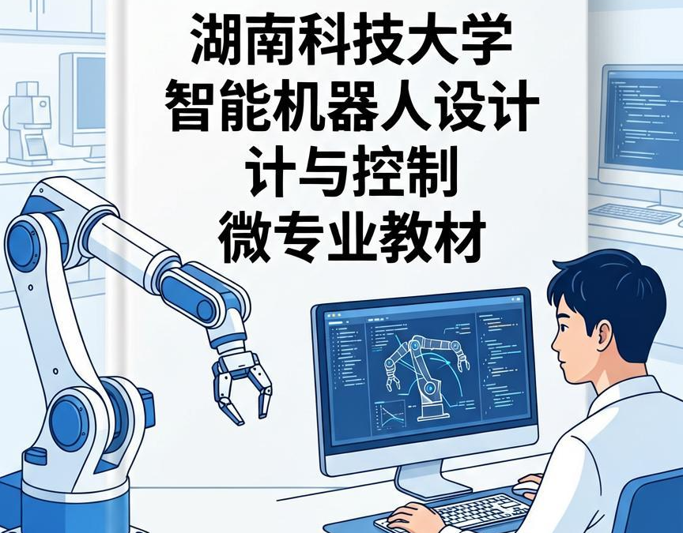
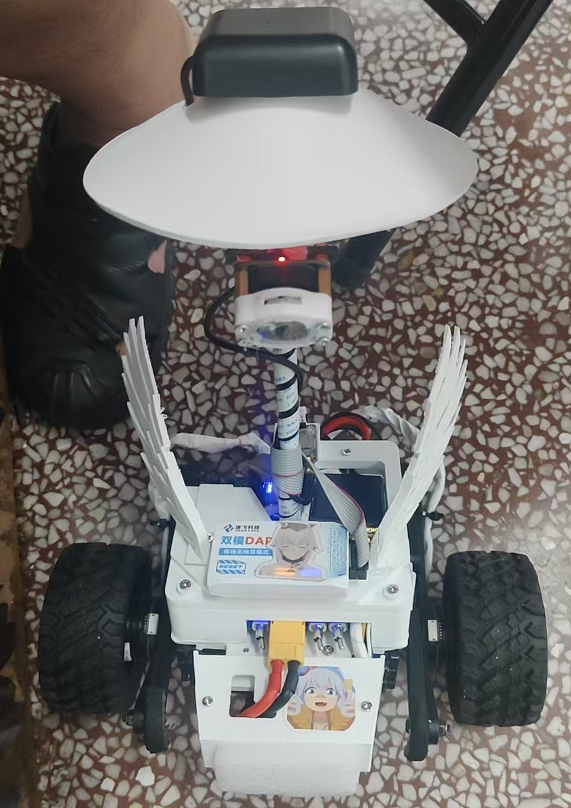
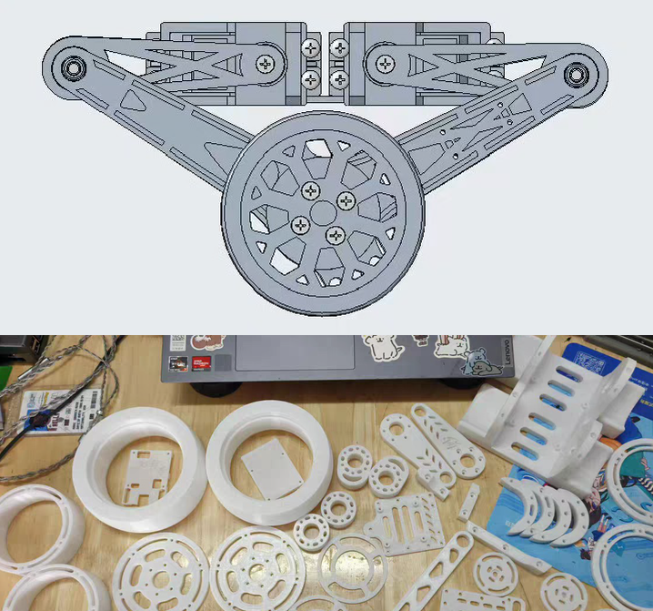
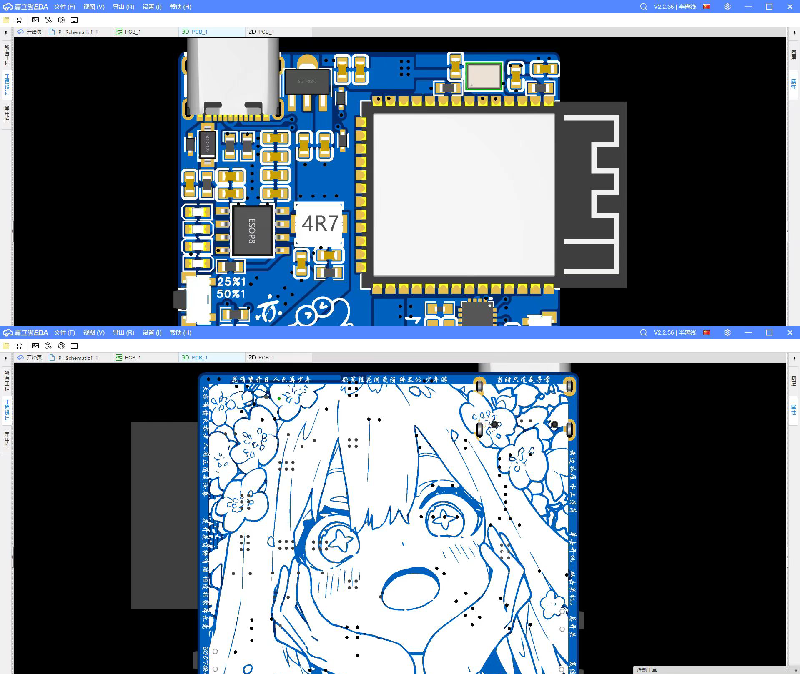
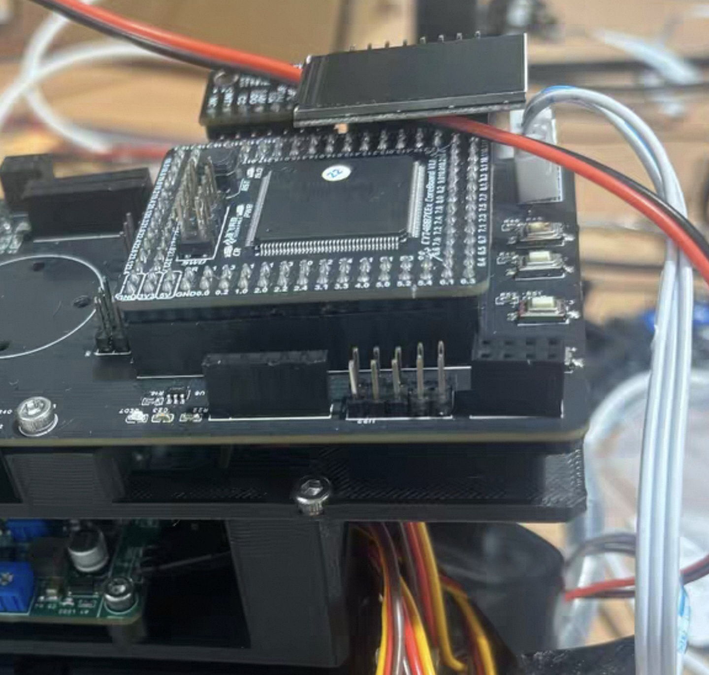
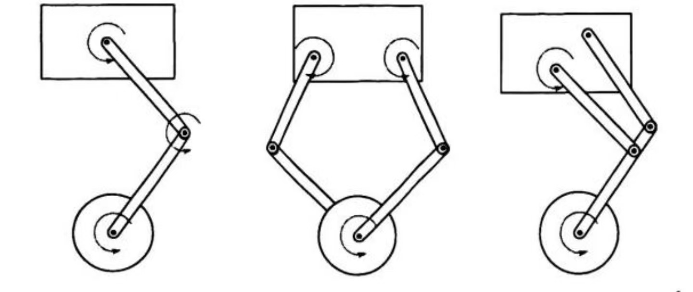
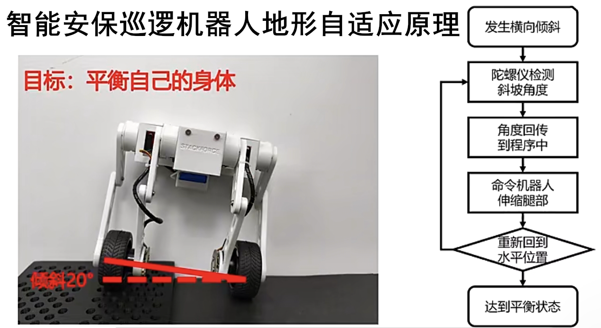

# 轮腿式智能安保巡逻机器人项目实战

肖钊a；何志鹏a；李学专b；朱荣钧c；唐咏荷d；李慧b；吴奥旗a；谢浩瑜b

a. 湖南科技大学机电工程学院

b. 湖南科技大学信息与电气工程学院

c. 湖南科技大学计算机科学与工程学院

d. 湖南科技大学建筑与设计学院

# 前言

## 一、背景

&emsp;&emsp;本书系湖南科技大学智能机器人设计与控制微专业实践项目的教学积累与工程实践。该微专业面向智能机器人产业对复合型人才的需求，打破传统专业壁垒，融合机械、电子、嵌入式、控制、视觉、ROS等多个方向，以“项目驱动、能力导向、跨界融合”为理念，着力培养学生解决复杂机器人工程问题的能力。在微专业建设中我们发现：学生只有在一台真实、完整的机器人平台上，经历从方案设计、零部件选型、软硬件开发到系统集成与调试的全过程，才能真正建立对机器人系统的整体认知和工程直觉。

&emsp;&emsp;因此，我们选择轮腿式智能安保巡逻机器人作为微专业综合实践项目载体。该载体工程挑战性强、技术综合度高，既包含轮腿复合机构设计，又涉及多电机驱动与实时控制，还需要多传感器融合导航，最终还要完成安保任务系统集成与现场部署。学生在项目实践中综合运用微专业各门课程所学，解决真实开发问题。

## 二、本书定位与特色

&emsp;&emsp;本书系湖南科技大学智能机器人设计与控制微专业实践项目指定教材。核心特色如下：

- **第一，项目贯穿，全栈覆盖。** 全书围绕一款轮腿式安保巡逻机器人从零到一的完整开发过程展开，依次完成需求分析、总体方案、机械结构、硬件电路、嵌入式软件、运动学与动力学、轮腿复合控制、环境感知、自主导航、安保任务、整机联调与测试。主线与微专业核心课程模块一一对应，学生所学知识能够在项目中即时应用。

- **第二，软硬件深度结合。** 每一章都包含与实物平台直接对应的代码示例、参数配置和调试方法，强调接口关系与协同调试，帮助读者理解“代码如何驱动硬件”“传感器数据如何影响控制决策”。

- **第三，强调工程实践与调试方法。** 每一章设置“实战”小节，专门讨论常见问题、故障现象、排查思路和解决方法，如驱动浪涌、IMU零偏、轮腿切换冲击、雷达相机时间同步等隐性工程知识。

- **第四，循序渐进，兼顾基础与进阶。** 内容从基础到进阶展开，不同背景读者可根据需要选择学习路径，教师可灵活组合。

- **第五，配套资源完善。** 提供三维模型、原理图与PCB文件、源代码、实验指导书和故障排查表等，支持自主学习和教学实施。

## 三、全书结构

&emsp;&emsp;全书共十二章，围绕轮腿式安保巡逻机器人从设计到部署的完整流程展开，层层递进，每章均包含理论讲解、代码示例与实战环节。

- **第1章 绪论**：介绍轮腿式机器人发展背景、安保巡逻需求及平台总体指标，确立全书项目贯穿主线。
- **第2章 系统总体设计**：完成安保场景需求分析、系统分层架构与模块划分，搭建开发环境与工具链。
- **第3章 机械结构设计**：完成轮腿复合机构选型、腿部与轮端结构设计及关键零部件强度校核。
- **第4章 硬件系统设计**：设计电源管理、电机驱动、传感器接口与通信总线，完成从原理图到实机点亮。
- **第5章 嵌入式底层软件开发**：实现RTOS任务划分、外设驱动、电机控制底层代码及通信协议。
- **第6章 运动学与动力学建模**：建立轮腿机构正逆运动学与拉格朗日动力学模型。
- **第7章 轮腿复合运动控制**：实现轮式差速控制、腿式步态规划、LQR平衡控制及越障策略。
- **第8章 环境感知系统**：集成激光雷达、深度相机、IMU等多传感器，实现目标检测与异常识别。
- **第9章 自主导航与路径规划**：实现建图定位、全局规划、局部DWA避障及轮腿模式切换导航。
- **第10章 安保巡逻任务系统**：设计任务管理框架、定点/随机巡逻策略、异常分级报警与远程交互。
- **第11章 综合实战与测试验证**：完成整机联调、性能与可靠性测试、故障诊断及现场部署闭环。

附录提供主要物料清单、核心接口协议、代码仓库结构、工具链配置、常见故障排查表及推荐阅读文献，便于读者查阅与参考。

## 四、使用建议与读者对象

&emsp;&emsp;本书适合湖南科技大学智能机器人设计与控制微专业学生、机器人相关专业本科生和研究生、移动机器人研发工程师、竞赛团队和科研课题组，以及具备一定编程和电路基础的自学者。

## 五、致谢与结语

&emsp;&emsp;感谢湖南科技大学智能机器人设计与控制微专业教学团队和参与实践项目的同学们。希望本书成为读者开发旅程中的一张地图，帮助少走弯路，早日做出属于自己的作品。由于作者水平有限，书中难免疏漏，恳请批评指正。

&emsp;&emsp;现在，请打开开发环境，准备好硬件平台，开启智能机器人微专业的实战之旅吧！！！

# [第1章 绪论 (单击打开)](section_1/section_1.md)

# [第2章 系统总体设计 (单击打开)](section_2/section_2.md)

# [第3章 机械结构设计 (单击打开)](section_3/section_3.md)

# [第4章 硬件系统设计 (单击打开)](section_4/section_4.md)

# [第5章 嵌入式软件开发 (单击打开)](section_5/section_5.md)

# [第6章 运动学与动力学建模 (单击打开)](section_6/section_6.md)

# [第7章 轮腿复合运动控制 (单击打开)](section_7/section_7.md)

# [第8章 环境感知系统 (单击打开)](section_8/section_8.md)

<video controls>
  <source src="./8.mp4" type="video/mp4">
</video>

# [第9章 自主导航与路径规划 (单击打开)](section_9/section_9.md)

<video controls>
  <source src="./9.mp4" type="video/mp4">
</video>

# [第10章 安保巡逻任务系统 (单击打开)](section_10/section_10.md)

<video controls>
  <source src="./10.mp4" type="video/mp4">
</video>

# [第11章 综合实战与测试验证 (单击打开)](section_11/section_11.md)

# 附录

# [附录A 主要物料清单](appendix/appendix_a.md)

# [附录B 核心接口定义与通信协议](appendix/appendix_b.md)

# [附录C 代码仓库结构与关键代码索引](appendix/appendix_c.md)

# [附录D 工具链与开发环境配置](appendix/appendix_d.md)

# [附录E 常见故障排查表](appendix/appendix_e.md)

# [附录F 推荐阅读与参考文献](appendix/appendix_f.md)
