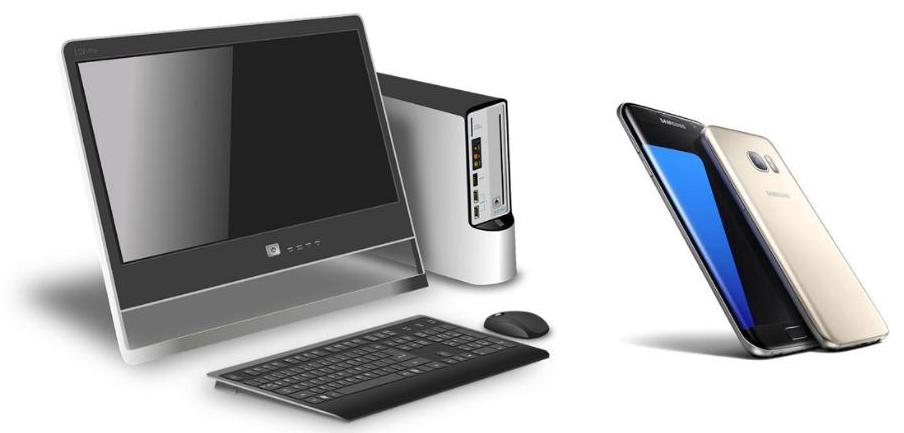
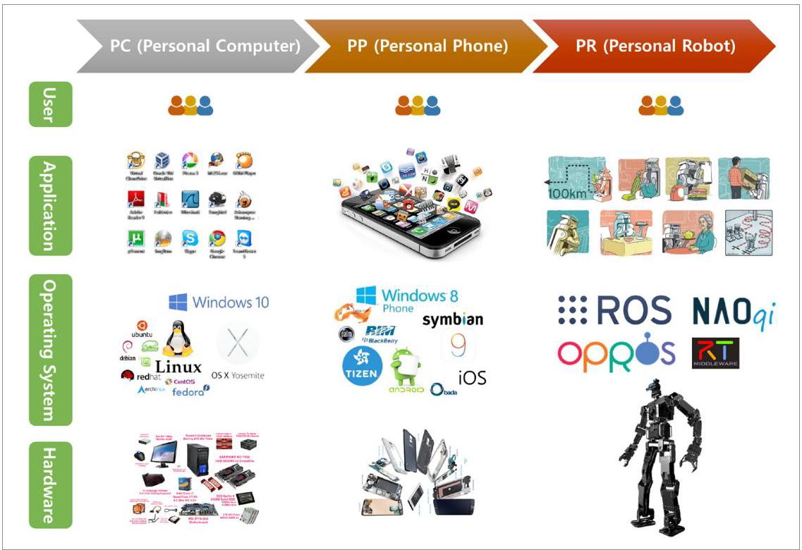
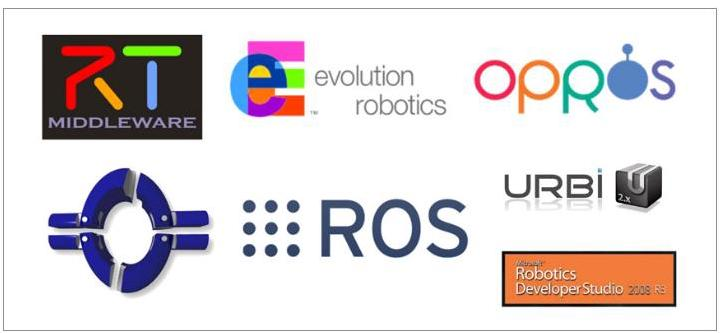

# 第1章 机器人软件平台

## 1.1. 平台的组件

图 1-1 PC 与智能手机

“这两个产品群的共同点是什么？”

IT产品群包括个人电脑 (PC) 和个人电话 (PP) 。 顾名思义, 这是每个人都有的个人产品。如图1-2所示, 该产品群的共同点在于它由可与各种硬件组合的硬件 (Hardware) 模块组成, 具有管理这些硬件的操作系统(Operating System)，在由操作系统提供的基于硬件抽象的软件开发环境中，存在提供各种服务的应用程序 (Application), 以及有大量的用户 (User) 使用它们。

硬件、操作系统、应用程序和用户等四个要素在IT行业中通常被称为平台的生态系统 (Ecosystem) 的四个要素，如图1-2所示。 当具有这些要素，并且它们之间形成不可见的分工和协作时，我们说这个平台成功实现了大众化和个人化。

上述PC和PP起初也并没有满足这四个要素。早期, 由特定公司开发的硬件的专用固件, 为了运行特定硬件设备而搭载了软件, 只能使用制造商提供的服务。如果您不明白, 让我们回想起苹果iPhone出现之前, 众多制造商的功能手机 (Feature phone) 吧。这些PC和PP的一个常见的成功来源是操作系统(Windows、Linux、Android、iOS等) 的出现。操作系统的引入导致了硬件和软件接口的集成，从而实现了硬件模块化，使得制造商能够通过大规模生产和专业化开发的低成本，成功实现产品的高性能化发展，从而使个人化计算机和电话成为可能。

图 1-2 生态系统的4大组成要素和PC、PP、PR的历史的共同点

不仅如此, 即使对硬件没有深刻的理解, 也能通过操作系统提供的开发环境很容易地开发应用程序，在智能手机市场中出现了10年前没有的叫做APP开发者的新的职业群。 如此的, 硬件以操作系统为中心, 开始向模块化发展, 并且以操作系统提供的硬件抽象化为基础的应用程序开始独立分工, 终于可以实现用户们真正想要的的服务了。那么, 与 PC和PP一起被关注的PR(个人机器人)的代表性的服务机器人平台是什么？由于历史被认为是重复的, 那么PR是否会像PC和PP的演变一样接近我们的生活? 在下一节我们来更仔细地看一看。

## 1.2. 机器人软件平台

最近，“平台”在机器人领域也备受关注。平台分为软件平台和硬件平台。 机器人软件平台不仅包括机器人应用中使用的硬件抽象、子设备控制，以及机器人工程中常用的传感、识别、实时自定位和绘图(SLAM)、导航(Navigation)和机械臂控制 (Manipulation) 等功能的实现, 还包含功能包管理、开发环境所需的库、多种开发/调试工具。机器人硬件平台不仅包括移动机器人、无人机和人形硬件研究平台，还包括正在商业化的诸如SoftBank的Pepper和MIT Media Lab的Jibo等产品。

需要留意的是, 这些硬件也是结合上述软件平台抽象出来的, 即使没有硬件专业知识, 也可以用软件平台来开发应用程序。正如您可以在不知道最新智能手机的硬件配置或细节的情况下开发APP一样。而且, 与以往的机器人开发者担负从硬件设计到软件设计的整个工作不同, 现在更多的非机器人领域的软件开发人员也可以参与机器人应用程序的开发。也就是说，借助软件平台，许多人可以参与机器人开发，而机器人硬件则是根据软件平台提出的界面进行设计的。

这一类的软件平台中具有代表性的有机器人操作系统ROS (Robot Operating System) ${}^{1}$ 、日本的开放式机器人技术中间件(OpenRTM) ${}^{2}$ 、欧洲的实时控制为中心的 OROCOS ${}^{3}$ 和韩国的OPRoS ${}^{4}$ 。名字各有不同，但这些机器人软件平台被开发的根本原因都是想让全世界的机器人研究人员们齐心协力解决机器人软件过于繁多和复杂而造成的问题。而其中使用人数最多的ROS正是本书要介绍的机器人软件平台。

例如, 当实现机器人识别周围情况的功能的时候, 硬件种类繁多的问题和要用在实际生活中的问题是会带来困难的部分。有些对人来说很简单的事情对机器人来说是很困难的问题，因为要实现机器人的传感、识别、绘制地图、动作规划等功能。因此学校的研究室或公司难以做到这些所有的功能。但如果全世界的相关领域的从事人员们都各自分享自己的专长部分，让其他研究团队使用的话情况就大不一样了。比如在众筹网Kickstarter和 CES2015被人们关注的Robotbase ${}^{5}$ 最近开发了Robotbase Personal Robot，并成功在众筹网投产。Robotbase公司集中于自己的核心技术脸部识别和物体识别，而移动机器人则采用支持ROS的Yujin Robot ${}^{6}$ 的移动机器人基台，舵机使用ROBOTIS ${}^{7}$ 的Dynamixel， 并且障碍物识别、导航、电机驱动等均使用了ROS的公开功能包。另一个例子是 ROS-I (ROS Industrial Consortium) ${}^{8}$ , 它是ROS工业组合。这个组合里有很多工业机器人领域的领军企业参与，一起解决着工业机器人领域中新出现的自动化、传感和协同机器人等一系列挑战。如此地，平台，尤其是在软件平台领域里通过使用共同的平台，用协作解决以往未能解决的问题，又带来了高效率。这展示了协作可能性的例子。

---

http://www.ros.org/

http://openrtm.org

3 http://www.orocos.org/

4 http://ropros.org/

https://www.kickstarter.com/projects/403524037/personal-robot

http://www.yujinrobot.com/

http://www.robotis.com

http://rosindustrial.org/

---

## 1.3. 机器人软件平台的必要性

**“为什么要使用机器人软件平台？”**

我们为什么要学习ROS这个新的概念？这是在线下的ROS研讨会中经常听到的用户们的提问。片面来讲是为了缩短开发时间。我们常说为了学习新的概念所花费的时间太可惜了, 因为要修改已经建立好的系统和现有的程序, 所以想维持现有的方式。但ROS不需要完全重新开发已有的系统和程序，而是通过加入一些标准化的代码就能对已有的非ROS程序进行ROS化的转化。并且很多通用的工具和软件都有提供，因此可以专注于自己感兴趣或想贡献的部分，这反而可以节省开发和维护所需的时间。让我们来了解一下这种方式的五种特点吧。

第一，程序的可重用性。 专注于自己想要开发的部分，对剩下的功能可以下载相关功能包来使用。相反, 也可以将自己开发出来的程序和其他人分享, 让他们也可以使用。比如,美国的NASA为了控制宇宙空间站里使用的Robonaout2 ${}^{9}$ 机器人，除了使用自行开发的程序，还结合了可以在多种操作系统使用的ROS和具有实时控制、消息通信修复、可靠性等特点的OROCOS，得以在宇宙中执行任务。前面介绍的Robotbase公司的例子也是充分发挥可重用性的案例。

第二, 是基于通信的程序。 为了提供一种服务, 很多时候在同一个框架里编写很多程序:从传感器或舵机的硬件驱动到传感、识别和动作等所有种类的程序。但为了重用机器人软件，根据每个处理器的用途将其分成更小的部分。根据平台的不同，我们将此称为组件化或节点化。必须由划分为最小执行单元的节点之间发送和接收数据，而平台具有关于该数据通信的所有一般信息。而且, 这与最小的单位进程连接到网络的物联网 (IoT) 的概念一致, 因此可以用作物联网平台。并且, 被划分成最小执行单元的程序可以进行小单元的调试，这非常有助于找出错误。

第三，提供开发工具。ROS提供调试相关的工具-2维绘图和3维视觉化工具RViz，所以无需亲手准备机器人开发所需的开发工具，可以直接拿来使用。例如，在机器人开发中， 可视化机器人的模型的情况比较多, 通过遵守规定的信息格式, 可以直接确认机器人的模型，并且还提供3D仿真器，因此易于扩展到仿真实验。另外，最近比较受人关注的点云 (point cloud) 形式也可以从英特尔的RealSense或微软的Kinect获得的3D距离信息转化过来。此外, 实验中使用的数据可以被记录下来, 因此需要的时候随时都可以重现实验当时的情况。像这样, ROS的一个重要特点是通过为机器人开发提供必要的软件工具, 使开发的便利性达到最大化。

---

9 https://robonaut.jsc.nasa.gov/R2/

---

第四, 活跃的开发者社区。至今比较封闭的机器人学界和机器人业界都因为前述的功能而走向重视互相之间的合作的方向。其目的可能各自相异，但实际的合作正在通过这种软件平台发生着。其核心是开源软件平台的社区。例如，以ROS为例，到2017年自愿开发和共享的功能包数量超过了5,000个，而解释如何使用它的wiki页面超过1.7万个，这些都由用户个别参与。 而在社区中非常重要的问题和答案已有超过24,000个，用户们通过这些建立着互惠互利的开发者社区。讨论超越了单纯的对于用法的议题，人们在寻找机器人工程软件的必要因素，并摸索出规则。

第五, 生态系统的形成。前面提到的智能手机平台革命是由Android和iOS等软件平台创造的生态系统造成的。这一趋势在机器人领域延续着。起初，各种硬件技术泛滥，却没有能整合它们的操作系统。在这种情况下，如上所述，各种软件平台已经出现，最受瞩目的ROS现在已经开始构建生态系统。这个正在形成的生态系统里，机器人硬件领域的开发者、ROS开发运营团队、应用软件开发者以及用户也能像机器人公司和传感器公司一样从中受益。起步虽然微不足道，但考虑到逐渐增多的用户数量和机器人公司，以及急剧增加的相关工具和库，我期待在不久的将来将会形成一个圆满的生态系统。

## 1.4. 机器人软件平台将带来的未来

在机器人领域也发生着与前述的智能手机的案例类似的故事。当然, 与智能手机操作系统相比，还有很多需要开发的工具处于正在发展的阶段，但机器人软件平台就像春秋战国时代一样处于百家争鸣的时期。其中活动比较显著的机器人软件平台和相应的群体如下。

---

- MSRDS ${}^{10}$ : Microsoft Robotics Developer Studio，美国 Microsoft

- ERSP ${}^{11}$ : Evolution Robotics Software Platform,欧洲 Evolution Robotics

10 https://www.microsoft.com/robotics/

11 https://en.wikipedia.org/wiki/Evolution_Robotics

---

- ROS: Robot Operating System, 美国 Open Robotics ${}^{12}$

- OpenRTM:日本工业技术综合研究所(AIST)

- OROCOS:欧洲

- OPRoS:韩国 ETRI, KIST, KITECH，江原大学

- NAOqi OS ${}^{13}$ :日本软银和法国阿尔德巴兰(Aldebaran)

除此之外, Player、YARP、MARIE、URBI、CARMEN、Orca、MOOS等也属于这个范畴。

图 1-3 多种机器人软件平台

虽然有各种各样的机器人软件平台，但是很难预测哪一个更好。 这是因为它们分别提供了方便的组件添加、通信、可视化、仿真器和实时性等各自的独特功能。 但是就像今天的个人电脑的操作系统一样，机器人软件的平台也将很快被压缩，具有类似的功能。 我们并不是自己制作软件平台本身, 所以最好把精力集中在开发通用机器人软件平台上运行的应用程序。

我收到了很多 “现今的机器人软件平台中, 你最喜欢哪个? ”的问题。对这个问题, 我的回答是:“我们从此停止消耗性的足球场建设吧！”，“让我们梦想成为球场上的伟大的球员吧！”这可以比作安卓系统。我们在既没有参与开发，也没有占据主导权的安卓生态系统中活跃为掌握硬软件的最优秀的选手，又给经济发展带来巨大的推动力一样，在机器人软件平台提供的市场中也能成为最棒的球员。

那么在现有的机器人软件平台当中，掌握哪一个比较好呢?

---

12 https://www.openrobotics.org/

13 http://doc.aldebaran.com/2-1/index_dev_guide.html

---

对于这种提问, 我认为Open Robotics在开发中的ROS是最佳的答案。尤其是如果考虑社区的活跃程度、丰富的库、扩展性和开发便利性的话ROS首当其冲。另外，供读者参考, Open Source Robotics Foundation在2017年5月改名为Open Robotics.

相比于其他任何机器人软件平台的社区，全世界的ROS社区是活动最活跃的社区。因此在使用中如果遇到疑问, 可以很容易地搜索到相关信息。ROS不仅是由Open Robotics 单独来开发，而且学界的科研人员、工业一线的开发人员和兴趣爱好者(Hobbyist)也都参与开发, 他们在对于开发中遇到的问题也是积极地在社区里寻找答案, 因此通过社区可以很方便地查到信息。不仅如此，除了机器人专业人士以外，网络、计算机科学和计算机视觉领域的人士也大有人在，因此ROS是更加让我期待的机器人软件平台。

利用机器人软件平台，即使是由不同的硬件构成的机器人，只要实现了基本功能，那么不用知道硬件专业知识，也能制作应用程序。这就像无需知道最新款智能手机的硬件和详细参数, 也能开发APP。

与以往的机器人开发者担负从硬件设计到软件设计的整个工作不同，现在更多的软件开发者可以参与机器人应用产品的开发了。也就是说，多亏软件平台，许多人可以参与机器人开发，而机器人硬件则是根据软件平台提出的界面进行设计的。这形成了机器人技术快速发展的契机。
