# 第2章 机器人操作系统 ROS

## 2.1. ROS简介

ROS is an open-source, meta-operating system for your robot. It provides the services you would expect from an operating system, including hardware abstraction, low-level device control, implementation of commonly-used functionality, message-passing between processes, and package management. It also provides tools and libraries for obtaining, building, writing, and running code across multiple computers.

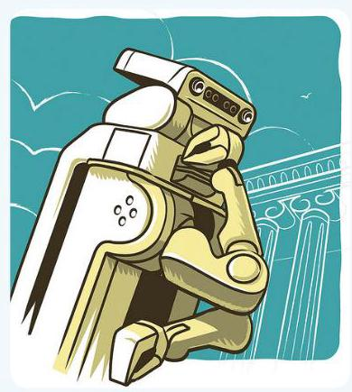

http://www.ros.org/wiki/

在ROS维基中将ROS定义为 “ROS是一个开放源代码的机器人元操作系统。它提供了我们对操作系统期望的服务，包括硬件抽象、低级设备控制、常用功能的实现、进程之间的消息传递以及功能包管理。它还提供了用于在多台计算机之间获取、构建、编写和运行代码的工具和库。”

换句话说，ROS包括一个类似于操作系统的硬件抽象，但它不是一个传统的操作系统, 它具有可用于异构硬件的特性。此外, 它是一个机器人软件平台, 提供了专门为机器人开发应用程序的各种开发环境。

## 2.2. 元操作系统

通用计算机操作系统的种类有Windows(XP/7/8/10)、Linux(Linux Mint/ Ubuntu/Fedora/Gentoo)、Mac(OS X Mavericks/Yosemite/El Capitan)等。至于智能手机，也有Android、iOS、Symbian、RiMO和Tizen等多种操作系统。

那么ROS是一种为机器人设计的新的操作系统吗?

ROS是Robot Operating System的缩写, 因此会认为是一种操作系统。尤其是那些对ROS不熟悉的人会认为ROS和上面提到的操作系统一样。当我第一次遇到它时，我也认为ROS是一个新的机器人操作系统。

然而更确切地说, ROS是一个元操作系统 (Meta-Operating System) ${}^{1}$ 。元操作系统不是一个明确定义的术语，而是一个利用应用程序和分布式计算资源之间的虚拟化层来运用分布式计算资源来执行调度、加载、监视、错误处理等任务的系统。

ROS不是传统的操作系统, 如Windows、Linux和Android, 反而是在利用现有的操作系统。使用ROS前需要先安装诸如Ubuntu的Linux发行版操作系统，之后再安装 ROS，以使用进程管理系统、文件系统、用户界面、程序实用程序(编译器、线程模型等)。此外，它还以库的形式提供了机器人应用程序所需的多数不同类型的硬件之间的数据传输/接收、调度和错误处理等功能。这个概念也被称为中间件(Middleware)或软件框架(Software framework)。

ROS开发、管理和提供基于元操作系统的各种用途的应用功能包，并拥有一个负责分享用户所开发的功能包的生态系统(Ecosystem)。如图2-1所示。ROS是在使用现有的传统操作系统的同时，通过使用硬件抽象概念来控制机器人应用程序所必需的机器人和传感器, 同时也是开发用户的机器人应用程序的支持系统。

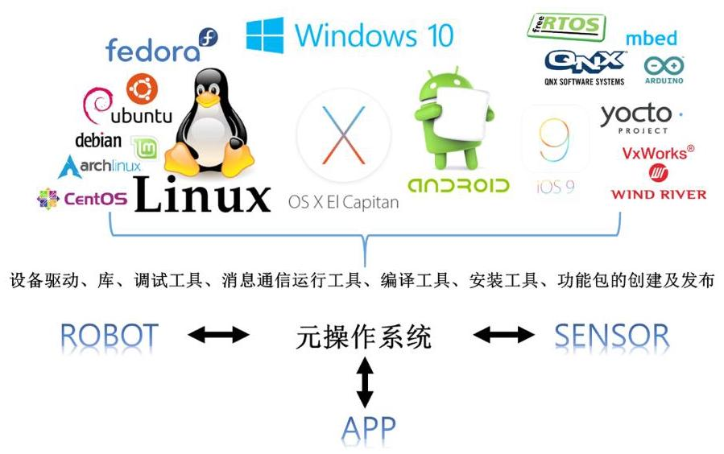

图 2-1 作为元操作系统的ROS

另外, 如图2-2所示, ROS数据通信可以在一个操作系统中进行, 但也适用于使用多种硬件的机器人开发，因为可以在不同的操作系统、硬件和程序之间交换数据。这将在下面的章节中详细讨论。

---

1 http://wiki.ros.org/ROS/Introduction

---

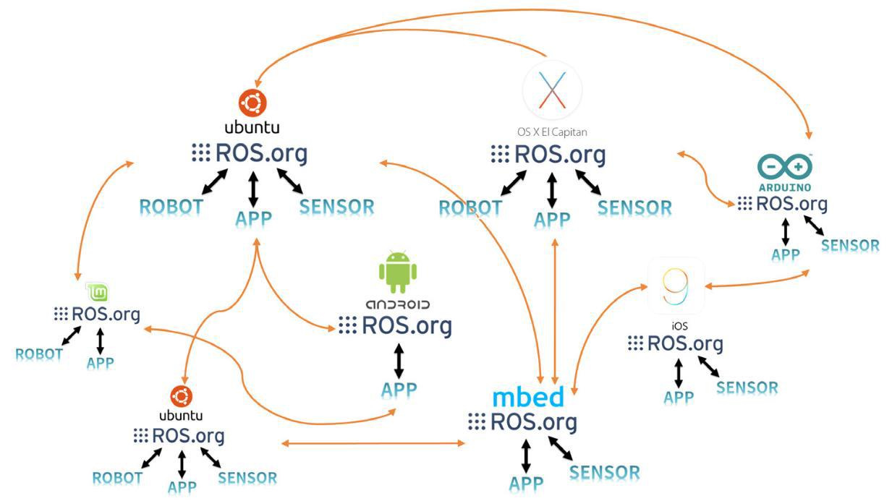

图 2-2 不同的操作系统或软件环境之间的ROS通信

## 2.3. ROS的目的

在我进行多年的ROS讲座的期间收到最多的提问是将ROS与其他机器人软件平台 (OpenRTM、OPRoS、播放器、YARP、Orocos、CARMEN、Orca、MOOS和 Microsoft Robotics Studio) 进行比较。虽然可以与这些平台进行简单的比较，但是它们的比较没有什么意义，因为它们的目的各不相同。作为ROS的使用者，我觉得ROS的目标是 “建立一个在全球范围内协作开发机器人软件的环境！” ROS致力于将机器人研究和开发中的代码重用做到最大化，而不是做所谓的机器人软件平台、中间件和框架。为了支持这个，ROS具有以下特征。

- 分布式进程:它以可执行进程的最小单位(节点，Node)的形式进行编程，每个进程独立运行，并有机地收发数据。

- 功能包单位管理:由于它以功能包的形式管理着多个具有相同目的的进程，所以开发和使用起来很容易，并且很容易共享、修改和重新发布。

_公共存储库:每个功能包都将其功能包公开给开发人员首选的公共存储库(例如GitHub)，并标识许可证。

- API类型:使用ROS开发程序时，ROS被设计为可以简单地通过调用API将其加载到其使用的代码中。在每章中介绍的源代码中，您会发现ROS编程与C++和Python程序没有区别。

- 支持多种编程语言:ROS程序提供客户端库(Client Library) ${}^{2}$ 以支持各种语言。它可以用于如JAVA、 C#、Lua和Ruby等语言，也可以用于机器人中常用的编程语言，如Python、C++和Lisp。换句话说， 您可以使用熟悉的语言开发ROS程序。

这种支持使得在全球范围内开发机器人软件的合作成为可能, 并且ROS的终极目的-机器人研究和开发过程中的代码重用-变得越来越普遍。

## 2.4. ROS的组件

如图2-3所示, ROS由支持多种编程语言的客户端库、用于控制硬件的硬件接口、数据通信通道、帮助编写各种机器人应用程序的机器人应用框架(Robotics Application Framework)、基于此框架的服务应用程序-Robotics Application、在虚拟空间中控制机器人的仿真 (Simulation) 工具和软件开发工具 (Software Development Tool) 等组成。

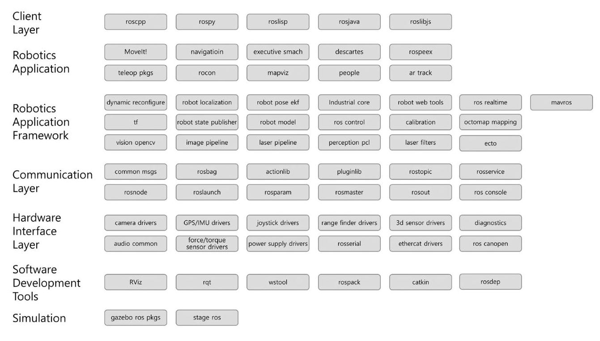

图 2-3 ROS的组件 ${}^{3}$

---

2 http://wiki.ros.org/Client%20Libraries

3 http://wiki.ros.org/APIs

---

## 2.5. ROS的生态系统

随着在智能手机市场出现安卓、iOS、Symbian、RiMO和Bada等多种操作系统，我们经常听到生态系统 (Ecosystem) 这个词。这是指将硬件制造商、操作系统公司、应用程序 (APP) 开发人员以及使用智能手机的用户连接起来的结构。

例如, 当智能手机制造商基于操作系统的给定硬件接口生产设备时, 每个操作系统公司会将它以库的形式提供。软件开发人员则无需了解硬件也可以轻松开发应用程序。而将产品投放到市场，让用户易于购买和使用。这一切统称为生态系统。

这种生态系统并不是在手机市场首次出现的。个人计算机领域也曾有各种各样的硬件制造商，而将他们结合在一起的微软的Windows操作系统和免费的Linux是典型的例子。也许这个过程就和自然界的生态系统是类似的发展过程。

机器人领域也正经历着同样的过程。起初，各种硬件技术泛滥，却没有能整合它们的操作系统。在这种情况下，如上所述，各种软件平台已经出现，最受瞩目的ROS现在已经开始构建生态系统。起步虽然微不足道，但考虑到逐渐增多的用户数量和机器人公司，以及急剧增加的相关工具和库，我期待在不久的将来将会形成一个圆满的生态系统。另外, 我希望机器人硬件领域的开发者、ROS开发运营团队、应用软件开发者以及用户也能像机器人公司和传感器公司一样从中受益。

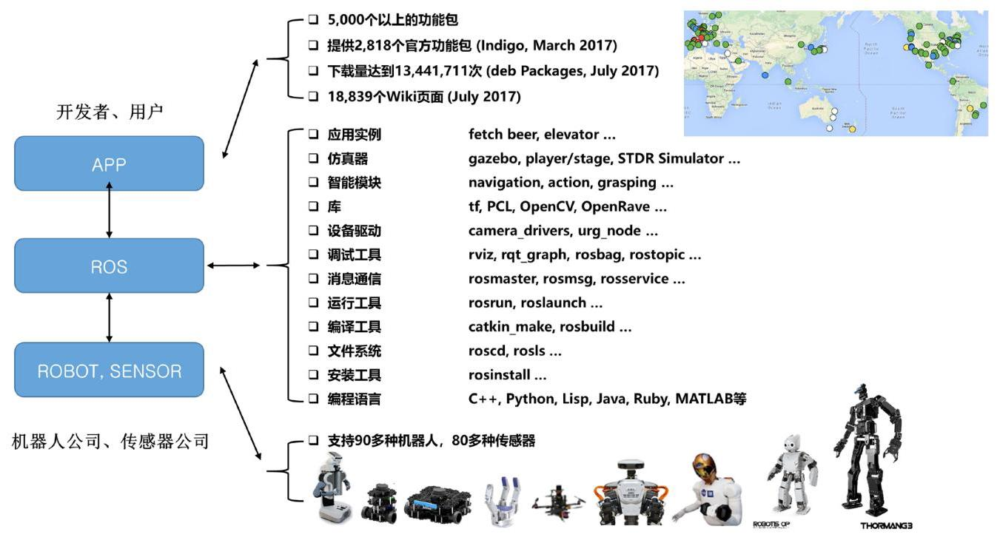

图 2-4 ROS生态系统

图 2-4是根据在ROSCon 2016 ${}^{4}$ 发布的ROS官方统计 ${}^{5}$ 和2017年度的ROS维基奇资料整理的ROS现状。也许很多人会认为现在还势单力薄，但我认为在机器人领域没有如此活跃的机器人软件平台。我非常期待将来的发展。

## 2.6. ROS的历史

让我们更深入地了解ROS吧。ROS始于2007年5月份由摩根·奎格利(Morgan Quigley)7 博士为了美国的斯坦福大学人工智能研究所 (AI LAB) 进行的STAIR (STanford AI Robot) ${}^{8}$ 项目开发的Switchyard ${}^{9}$ 系统。

摩根·奎格利博士

摩根·奎格利(Morgan Quigley)博士是现在负责开发和管理ROS的Open Robotics【原OSRF (Open Source Robotics Foundation) 】的创办人，也是软件开发负责人。Switchyard是当时为了用于AI 研究室项目的人工智能机器人的开发而设计的程序，也是ROS的前身。此外，从2000年开始开发， 对ROS的网络程序产生巨大影响的Player/Stage项目(Player网络服务器和2D stage仿真器，还影响至ROS的3D仿真器Gazebo的开发)的开发者Brian Gerkey(http://brian.gerkey.org/)是Open Robotics的CEO及共同创办人。因此，ROS在2007年由Willow Garage公司获得ROS这个名字之前， 受到了2000年的Player/Stage和2007年的Switchyard等项目的影响。

2007年11月开始，由美国的机器人专门公司Willow Garage承接开发ROS。Willow Garage是个人机器人(Personal robotics)及服务机器人领域中非常有名的公司。它以开发和支持我们熟知的视觉处理开源代码OpenCV和Kinect等在三维设备广泛使用的点云库 (PCL, Point Cloud Library) )而著名。

---

http://roscon.ros.org/2016/

http://wiki.ros.org/Metrics

http://wiki.ros.org/

7 https://www.osrfoundation.org/team/morgan-quigley/

http://stair.stanford.edu/

9 http://www.willowgarage.com/pages/software/ros-platform

---

这家Willow Garage从2007年11月开始着手ROS的开发，在2010年1月22日向全世界发布了ROS 1.0。我们熟知的ROS Box Turtle版是2010年3月1日首次发布的。此后, 和 Ubuntu和安卓一样, 每个版本都以C Turtle、Diamondback等按字母顺序起名。

ROS基于BSD许可证 (BSD 3-Clause License) ${}^{10}$ 及Apache License 2.0) ${}^{11}$ ,因此任何人可以修改、重用和重新发布。与此同时, ROS持续提供大量最新版本的软件, 因此在教育及学术领域认识的参与程度非常高, 一开始通过机器人相关学术会议广为传播。 有面向开发者和用户的ROSDay和ROSCon ${}^{12}$ 学术会议,还有叫做ROS Meetup ${}^{13}$ 的多种社区群。不仅如此, 可以应用ROS的机器人平台的开发也在快速跟进。例如以Personal Robot为含义的PR2 ${}^{14}$ 和TurtleBot ${}^{15}$ 机器人，有许多应用程序通过它们喷涌而出，这更加巩固了ROS作为机器人操作系统的地位。

Open Source Robotics Foundation

图 2-5 OSRF 的标志 (http://osrfoundation.org/)

open

robotics

图 2-6 Open Robotics 的标志 (https://www.openrobotics.org/)

## 2.7. ROS的版本

Willow Garage承接了从2007的斯坦福大学人工智能研究所以Switchyard开始的机器人软件框架研究之后以ROS(Robot Operating System)的名称延续了开发工作。其第六次发布版ROS Groovy Galapagos是Willow Garage的最后的版本。Willow Garage 在2013年进入商业服务机器人领域之后遇到诸多困难并分解为多个创业公司，此时ROS 被转让给开源机器人工程基金会 (OSRF, Open Source Robotics Foundation)。

---

10 https://opensource.org/licenses/BSD-3-Clause

11 https://www.apache.org/licenses/LICENSE-2.0

http://roscon.ros.org

http://wiki.ros.org/Events

14 http://www.willowgarage.com/pages/pr2/overview

http://www.turtlebot.com/

---

之后OSRF继续发布了4个新版本。从2017年5月开始OSRF更名为Open Robotics，至今开发、运营和管理ROS。在最近的2017年5月23日发布了ROS的第十一版ROS Lunar Loggerhead。ROS的每个版本的名称的首字母是按照英文字母的顺序来制定的，并将乌龟 (Turtle) 作为图标 (图 2-7)。

**ROS的发布及学术会议**

---

- 2017.12.08 - 发布ROS 2.0

2017.09.21 - 举办ROSCon2017 (加拿大)

- 2017.05.23 - 发布Lunar Loggerhead

- 2017.05.16 - 从OSRF更名为Open Robotics

	- 2016.10.08 - 举办ROSCon2016 (韩国)

	- 2016.05.23 - 发布Kinetic Kame

- 2015.10.03 - 举办ROSCon2015 (德国)

	- 2015.05.23 - 发布Jade Turtle

		2014.09.12 - 发布ROSCon2014 (美国)

2014.07.22 - 发布Indigo Igloo

		2014.06.06 - 举办ROS Kong 2014 (香港)

		- 2013.09.04 - 发布Hydro Medusa

- 2013.05.11 - 举办ROSCon2013 (德国)

	- 2013.02.11 - Open Source Robotics Foundation担任开发和管理

		- 2012.12.31 - 发布Groovy Galapagos

- 2012.05.19 - 举办ROSCon2012 (美国)

- 2012.04.23 - 发布Fuerte

		- 2011.08.30 - 发布Electric Emys

	- 2011.03.02 - 发布Diamondback

	- 2010.08.02 - 发布C Turtle

		2010.03.02 - 发布Box Turtle

---

2010.01.22 - 开发ROS 1.0

2007.11.01 - Willow Garage起名 "ROS"，并开始开发

- 2007.05.01 - Switchyard系统，Morgan Quigley，斯坦福大学 AI 实验室，斯坦福大学

2000 - Player/Stage 项目, Brian Gerkey, Richard Vaughan, Andrew Howard，南加州大学

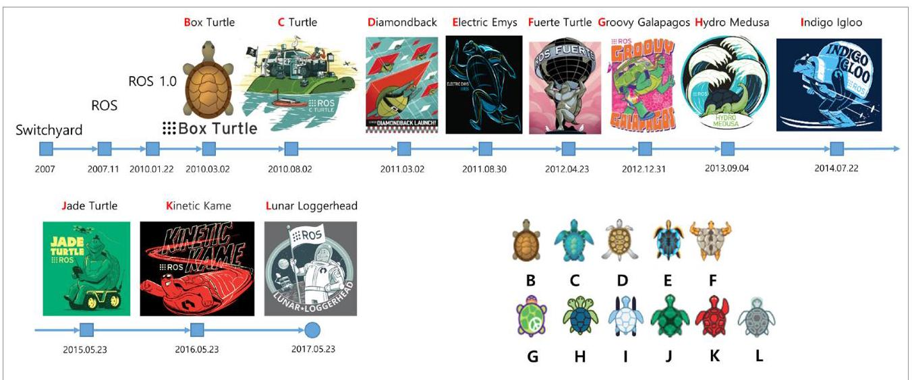

图 2-7 ROS的版本(http://wiki.ros.org/)

### 2.7.1. 版本规则

到目前为止ROS发布了ROS 1.0、Box Turtle、C Turtle、Diamondback、Electric Emys、Fuerte、Groovy Galapagos、Hydro Medusa、Indigo Igloo、Jade Turtle、 Kinetic Kame和Lunar Loggerhead等版本。

ROS除了1.0版本以外，都像Ubuntu和安卓一样，将版本名的首字母按英文字母顺序来安排。比如, Kinetic Kame是字母表的K版本，是第11个版本，也是第10个正式发布版。

此外还有一个规则。每个版本都有一个海报形式的插图和一个乌龟图标，如图2-8所示。这个乌龟图标也被用于ROS官方仿真教程turtlesim。使用海龟作为ROS的象征很大程度上是来自于20世纪60年代MIT人工智能研究所 ${}^{16}$ 的教育节目标志(Logo) ${}^{17}$ 。在50 多年前的1969年，乌龟(Turtle)机器人是使用一个叫Logo的编程语言开发的，这个机器人会根据计算机下达的命令，在地板上实际移动并可以画图。依照它，开发ROS的时候开发了叫做turtlesim的虚拟的例子程序，而这也是后来将ROS机器人成为TurtleBot的由来18°。

---

16 http://el.media.mit.edu/logo-foundation/what_is_logo/index.html

17 https://en.wikipedia.org/wiki/Logo_(programming_language)

---

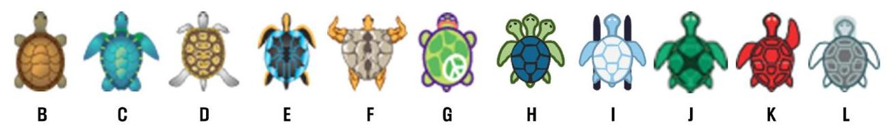

图 2-8 各版本的乌龟图标

### 2.7.2. 版本周期

ROS的版本周期和ROS正式支持的操作系统Ubuntu的新版本发布周期一样，是每年发布两次(4月和10月)。但2013年很多用户由于频繁的升级，提议新的版本周期。因此在2013年接纳了用户们的意见，决定从Hydro Medusa版本开始，每年发布一次正式版本，时间点则在新的Ubuntu xx.04版本发布一个月之后的5月份。而恰好每年的5月23日是世界乌龟日(World Turtle Day) ${}^{19}$ ，所以现在每年的这个有象征意义的一天会发布新的ROS版本。

ROS的支持期间根据版本而不同, 一般是发布后提供两年的支持。而针对每两年发布的Ubuntu长期支持版 (Long Term Support) ${}^{20}$ 发布的ROS版本提供与LTS一样的5 年的支持期间。比如, 支持2016年的Ubuntu 16.04 LTS的ROS Kinetic Kame具有直到 2021年5月的5年的支持期间。非LTS版本保持最新版本的Linux核，仅仅是进行了次要的升级以及基本的维护。因此很多ROS用户们使用偶数年度发布的LTS版本的ROS。目前为止的ROS的版本升级21如图2-9。

<table><tr><td>ROS发布版</td><td>发布日期</td><td>海报</td><td>乌龟图标</td><td>停止支持日期</td></tr><tr><td>Lunar Loggerhead</td><td>2017.05.23</td><td>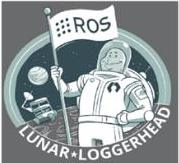</td><td></td><td>2019.05</td></tr><tr><td>Kinetic Kame (推荐)</td><td>2016.05.23</td><td>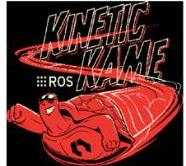</td><td></td><td>2021.04 (Xenial EOL)</td></tr><tr><td>Jade Turtle</td><td>2015.05.23</td><td>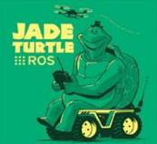</td><td></td><td>2017.05</td></tr><tr><td>Indigo Igloo</td><td>2014.07.22</td><td></td><td>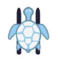</td><td>2019.04 (Trusty EOL)</td></tr></table>

图 2-9 主要ROS版本的发布及支持期限

### 2.7.3. 选择版本

由于ROS是元操作系统, 需要选择基本的操作系统。ROS支持Ubuntu、Linux Mint、Debian、OS X、Fedora、Gentoo、OpenSUSE、ArcLinux和Windows等多种操作系统，但用的最多的操作系统是Ubuntu和Linux Mint。开发部门也是针对Ubuntu LTS版本进行测试并发布。由于这种原因我推荐Ubuntu LTS或与Linux Mint版本匹配的 ROS版本。

对于每个ROS版本的Ubuntu移植信息，请访问相关信息页面 ${}^{22}$ 并选择要使用的ROS 版本。在这个文件中，您可以看到当前选择的ROS版本针对Linux各发行版进行的现有功能包(源代码)的迁移工作的进度(已结束或在进行中)。

您可能对Ubuntu的发布版版本比较陌生。从下面的列表可以看出14.04 Trusty是 Ubuntu T版本，之后依次是U、V、W和X版本。您需要在这里进行比较并找出稳定的版本。ROS的最新版本会有很多功能包显示处于处理中的状态, 如果不是重要的功能包, 那

---

22 http://repositories.ros.org/status_page/ros_kinetic_default.html

---

么选择最新版本也无碍。但如果自己一直以来使用的功能包还没有完成移植，那需要再等一等。

- Ubuntu 18.04 Bionic Beaver (LTS)

- Ubuntu 17.10 Artful Aardvark

- Ubuntu 17.04 Zesty Zapus

- Ubuntu 16.10 Yakkety Yak

- Ubuntu 16.04 Xenial Xerus (LTS)

- Ubuntu 15.10 Wily Werewolf

- Ubuntu 15.04 Vivid Vervet

- Ubuntu 14.10 Utopic Unicorn

- Ubuntu 14.04 Trusty Tahr (LTS)

- Ubuntu 13.10 Saucy Salamander

- Ubuntu 13.04 Raring Ringtail

- Ubuntu 12.10 Quantal Quetzal

- Ubuntu 12.04 Precise Pangolin (LTS)

在2018年发布的新的Linux版本和ROS LTS版本达到稳定的2019年之前我想推荐的组合如下:

- 操作系统:Ubuntu 16.04 Xenial Xerus ${}^{23}$ (LTS) 或 Linux Mint 18.x

- ROS版本:ROS Kinetic Kame ${}^{24}$

---

23 http://releases.ubuntu.com/16.04/

24 http://wiki.ros.org/kinetic

---
