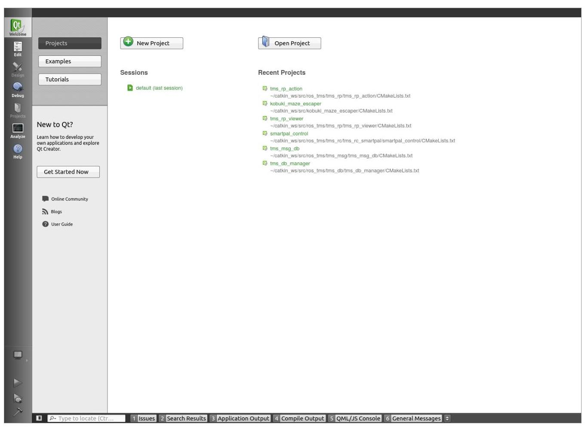
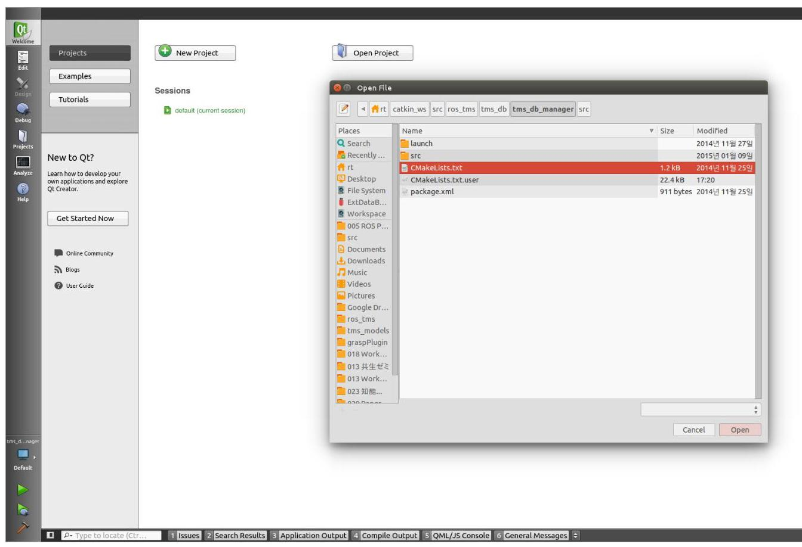
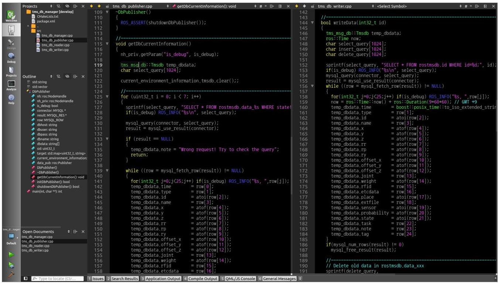
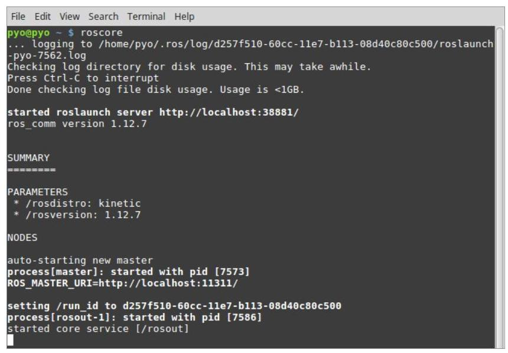
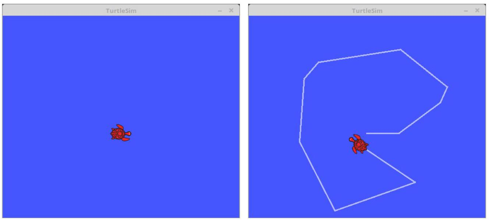
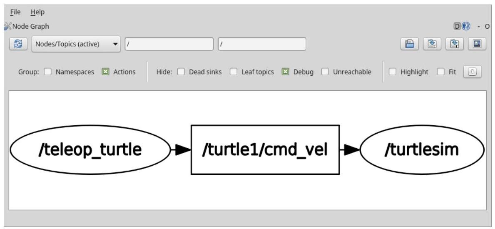

# 第3章 搭建 ROS 开发环境

ROS支持多种操作系统，但正式支持的只有Ubuntu，而对其它版本仅提供安装方法。因此本书只说明Ubuntu及与Ubuntu兼容的Linux Mint。

本书使用的ROS应用程序开发环境如下。

- 硬件:使用INTEL及AMD芯片的台式机及笔记本电脑

- 操作系统:Ubuntu 16.04.x Xenial Xerus或Linux Mint 18.x

- ROS: Kinetic Kame

如果用户的计算机上安装了不同版本的Ubuntu，请确认官网。如果用户的操作系统是OS X ${}^{1}$ 或Windows ${}^{2}$ ，可以查看相应wiki ${}^{3}$ 的安装说明。而使用ARM CPU而不是INTEL 或AMD CPU的单板计算机(SBC，Single Board Computer)并不单独说明ROS的安装, 假如是使用Ubuntu或Linux Mint，则与以下说明相同。

图 3-1 Linux Mint的桌面

---

1 http://wiki.ros.org/kinetic/Installation/OSX/Homebrew/Source

2 http://wiki.ros.org/hydro/Installation/Windows

3 http://wiki.ros.org/kinetic/Installation

---

## 3.1. 安装ROS

### 3.1.1. 常规安装

让我们安装ROS Kinetic吧。按照常规安装的说明也不难安装ROS Kinetic，但如果想更简单地进行安装，可以使用笔者在 3.1.2 给出的简易安装脚本。

**设置网络时间协议(NTP，Network Time Protocol)**

在ROS官方安装项目中虽然没有包括NTP，但为了缩小PC间通信中的ROS Time的误差, 下面我们设置NTP ${}^{4}$ 。设置方法是安装chrony之后用ntpdate命令指定ntp服务器即可。这样一来会表示服务器和当前计算机之间的时间误差, 进而会调到服务器的时间。这就是通过给不同的PC指定相同的NTP服务器, 将时间误差缩短到最小的方法。

---

\$ sudo apt-get install -y chrony ntpdate

\$ sudo ntpdate -q ntp.ubuntu.com

---

**添加代码列表**

在ros-latest.list添加ROS版本库。打开新的终端窗口，输入如下命令。

---

	\$ sudo sh -c 'echo "deb http://packages.ros.org/ros/ubuntu \$(1sb_release-sc) main" > /etc/apt/

sources.list.d/ros-latest.list'

---

如果用户正在使用Linux Mint版本18.x，请使用以下命令。上面提到的代码的\$(lsb_ release -sc) 会获得Linux发行版信息的代号，而Linux Mint 18.x使用了Ubuntu的 xenial代码, 所以可以添加与Ubuntu相同的源代码列表。

---

\$ sudo sh -c 'echo "deb http://packages.ros.org/ros/ubuntu xenial main" > /etc/apt/sources.list.d/ros-

	latest.list'

---

---

https://en.wikipedia.org/wiki/Network_Time_Protocol

---

**设置公钥(Key)**

为了从ROS存储库下载功能包，下面添加公钥。作为参考，以下公钥可以根据服务器的操作发生变更，请参考官方wiki页面 ${}^{5}$ 。

\$ sudo apt-key adv --keyserver hkp://ha.pool.sks-keyservers.net:80 --recv-key 421C365BD9FF1F717815A389552 3BAEEB01FA116

**更新软件包索引**

现在用户已经将ROS版本库地址放在代码列表中，我们建议在安装ROS之前刷新软件包列表的索引并升级所有当前安装的Ubuntu软件包，但这不是必选项。

\$ sudo apt-get update && sudo apt-get upgrade -y

**安装ROS Kinetic Kame**

使用以下命令安装台式机的ROS功能包。这包括ROS、rqt、RViz、机器人相关的库、仿真和导航等等。

---

\$ sudo apt-get install ros-kinetic-desktop-full

---

上面的安装只包含基本的rqt，但是笔者将安装所有额外的rqt相关的功能包。用下面的命令安装所有rqt相关的功能包，可以很方便地使用各种rqt插件。

\$ sudo apt-get install ros-kinetic-rqt*

---

5 http://wiki.ros.org/kinetic/Installation/Ubuntu

---

**ROS功能包二进制文件**

如果想安装ROS功能包，可以用下面的apt-cache命令搜索以ros-kinetic开头的所有的功能包。利用这个命令可以搜索到大约1600多个功能包。

apt-cache search ros-kinetic

如果想个别安装功能包，请使用如下命令。

sudo apt-get install ros-kinetic-[功能包名称]

此外也可以使用GUI工具sysnaptic package manager。

目 APT (Advanced Packaging Tool) ${}^{6}$

apt-get、apt-key、apt-cache等命令中的apt(Advanced Packaging Tool)是包括Ubuntu、Linux Mint的Debian系列的Linux中广泛使用的软件包管理命令。

http://en.wikipedia.org/wiki/Advanced_Packaging_Tool

目

删除旧版本的ROS及轮番使用不同版本的ROS。

sudo apt-get purge ros-indigo-* 命令可以实现设置和删除文件。在和现有版本一起使用时导入ROS 配置文件(加载到 ‘~/.bashrc’)的命令中，将如下命令中的ROS版本部分

source /opt/ros/kinetic/setup.bash

替换为kinetic或indigo即可。

**初始化rosdep**

在使用ROS之前，必须初始化rosdep。rosdep是一个通过在使用或编译ros的核心组件时轻松安装依赖包来增强用户便利的功能。

\$ sudo rosdep init

\$ rosdep update

---

6 https://en.wikipedia.org/wiki/Advanced_Packaging_Tool

---

**安装rosinstall**

这是安装ROS的各种功能包的程序。它是被频繁使用的有用的工具, 因此务必要安装它。

\$ sudo apt-get install python-rosinstall

**加载环境设置文件**

下面加载环境设置文件。里面定义着ROS_ROOT和ROS_PACKAGE_PATH等环境变量。

---

\$ source /opt/ros/kinetic/setup.bash

---

**创建并初始化工作目录**

ROS使用一个名为catkin的ROS专用构建系统。为了使用它，用户需要创建并初始化 catkin工作目录，如下所示。除非用户创建新的工作目录，否则此设置只需设置一次。

---

\$mkdir-p~/catkin_ws/src

\$cd ~/catkin_ws/src

\$catkin_init_workspace

---

如果用户已经创建了一个catkin工作目录，下面我们来进行构建。目前，只有src目录和CMakeLists.txt文件在catkin工作目录中，但让我们尝试使用catkin_make命令来构建吧。

---

\$cd ~/catkin_ws/

\$catkin_make

---

当用户构建没有问题时，运行ls命令。除了自己创建的src目录之外，还出现了一个新的build和devel目录。catkin的构建系统的相关文件保存在build目录中，构建后的可执行文件保存在devel目录中。

---

\$ 1 s

build

devel

src

---

最后, 我们加载与catkin构建系统相关的环境文件。

---

\$ source ~/catkin_ws/devel/setup.bash

---

**测试安装结果**

所有ROS安装已完成。要测试它是否正确安装，请关闭所有终端窗口并运行一个新的终端窗口。现在通过输入以下命令来运行roscore。

---

\$ roscore

---

如果运行之后像下面没有出现错误，则说明成功安装。退出是[Ctrl+c]。

---

	... logging to /home/pyo/.ros/log/9e24585a-60c8-11e7-b113-08d40c80c500/roslaunch-pyo-5207.log

Checking log directory for disk usage. This may take awhile.

Press Ctrl-C to interrupt

Done checking log file disk usage. Usage is <1GB.

started roslaunch server http://localhost:38345/

	ros_comm version 1.12.7

	SUMMARY

	=======

		PARAMETERS

								*/rosdistro: kinetic

								*/rosversion: 1.12.7

NODES

	auto-starting new master

process[master]: started with pid [5218]

ROS_MASTER_URI=http://localhost:11311/

setting/run_id to 9e24585a-60c8-11e7-b113-08d40c80c500

process[rosout-1]: started with pid [5231]

started core service [/rosout]

---

### 3.1.2. 简易安装

如果用户的Ubuntu版本是16.04.x或Linux Mint 18.x，那么可以使用下面准备好的一个脚本来简化上面描述的ROS安装。

---

	\$ wget https://raw.githubusercontent.com/ROBOTIS-GIT/robotis_tools/master/install_ros_kinetic.sh

\$ chmod 755 ./install_ros_kinetic.sh

\$ bash ./install_ros_kinetic.sh

---

在上述简易安装中，由wget命令下载的install_ros_kinetic.sh shell脚本包含3.1.1 中涵盖的常规安装的内容，下面将介绍的3.2.1的ROS环境设置的内容将自动建立简易的 ROS安装和配置。

## 3.2. 搭建ROS开发环境

### 3.2.1. ROS配置

要加载一个配置文件，就像在ROS安装过程中使用的以下命令一样，每次打开新的终端窗口时都必须运行它。

---

\$ source/opt/ros/kinetic/setup.bash

\$ source ~/catkin_ws/devel/setup.bash

---

为了避免这个繁琐的任务，可以设置终端，使得每次打开新的终端窗口时，都读入配置文件。另外，配置ROS网络，还将常用的命令简化为快捷命令。

首先，使用文本编辑器gedit程序来加载bashrc文件。本书使用gedit编辑文档，但也可以使用atom、sublime text、vim、emacs、nano和visual studio code等等。

---

\$ gedit ~/.bashrc

---

打开bashrc文件就可以看到已经有了很多设置。不要修改以前的设置, 而是到 bashrc文件的最底部添加以下内容(xxx.xxx.xxx.xxx是用户自己的IP地址，请参阅第31页的ifconfig了解IP地址设置)。输入了所有内容之后，保存用户的更改并退出 gedit。

~/.bashrc

#Set ROS Kinetic

source /opt/ros/kinetic/setup.bash

source ~/catkin_ws/devel/setup.bash

#Set ROS Network

export ROS_HOSTNAME=xxx.xxx.xxx.xxx

export ROS_MASTER_URI=http://\$\{ROS_HOSTNAME\}:11311

#Set ROS alias command

alias cw='cd ~/catkin_ws'

alias cs='cd ~/catkin_ws/src'

alias cm='cd ~/catkin_ws && catkin_make'

为了让修改了的bashrc文件发挥作用，输入如下命令。或者，如果用户关闭当前正在运行的终端窗口并运行新的终端窗口，用户也将得到相同的效果，因为用户在bashrc中所做的设置会适用于新的终端窗口。

---

\$ source ~/.bashrc

---

让我们仔细看看我们目前为止进行的设置。

**加载ROS配置**

"#" 是表明注释的开头字符，后面是注释内容。第二行的 "source/opt/ros/kinetic /setup.bash" 和第三行的 "source ~/catkin_ws/devel/setup.bash" 是必须设置的ROS 配置文件。

---

#Set ROS Kinetic

	source /opt/ros/kinetic/setup.bash

	source ~/catkin_ws/devel/setup.bash

---

**配置ROS网络**

下面是ROS_MASTER_URI和ROS_HOSTNAME设置。此配置非常重要, 因为ROS 通过网络在节点之间传递消息。首先，两个项目必须输入自己的网络IP。将来，如果有专用于总机(MASTER PC)的PC，并且机器人使用主机(HOST PC)，则可以通过分别输入不同的IP地址进行通信。现在让我们输入他们的网络IP。以下示例显示IP为 192.168.1.100的情况的示例。用户可以在终端窗口中使用ifconfig命令检查用户的IP信息。

#Set ROS Network

export ROS_HOSTNAME=192.168.1.100

export ROS_MASTER_URI=http://\$\{ROS_HOSTNAME\}:11311

如果用户在一台PC上运行所有ROS功能包，则可以指定localhost而不是指定特定的 IP。

#Set ROS Network

export ROS_HOSTNAME=localhost

export ROS_MASTER_URI=http://localhost:11311

**Ifconfig ${}^{7}$**

在Linux中，使用ifconfig命令确认本机IP。如果在终端窗口中运行ifconfig命令(如以下示例所示)，则会在wp2s0的inet addr中显示其有线网络IP地址，而在enp3s0的inet addr中显示本机的无线网IP地址。在我的情况下，我主要使用有线局域网，但我也接到了无线局域网。在以下示例中，有线连接的IP为192.168.1.100。

---

\$ ifconfig

	enp3s0 Link encap:Ethernet HWaddr d8:cb:8a:f1:74:2b

						inet addr:192.168.1.100 Bcast:192.168.1.255 Mask:255.255.05.0

						inet6 addr: fe80::60fc:7e2b:b877:f82b/64 Scope:Link

						UP BROADCAST RUNNING MULTICAST MTU:1500 Metric:1

						RX packets:52 errors:0 dropped:0 overruns:0 frame:0

---

---

7 https://en.wikipedia.org/wiki/Ifconfig

---

---

	TX packets:81 errors:0 dropped:0 overruns:0 carrier:0

	collisions:0 txqueuelen:1000

	RX bytes:10172 (10.1 KB) TX bytes:8917 (8.9 KB)

	Interrupt:19

lo Link encap:Local Loopback

	inet addr:127.0.0.1 Mask:255.0.0.0

	inet6 addr:::1/128 Scope:Host

	UP LOOPBACK RUNNING MTU:65536 Metric:1

	RX packets:3520 errors:0 dropped:0 overruns:0 frame:0

	TX packets:3520 errors:0 dropped:0 overruns:0 carrier:0

	collisions:0 txqueuelen:1

	RX bytes:560728 (560.7 KB) TX bytes:560728 (560.7 KB)

wlp2s0 Link encap:Ethernet HWaddr 08:d4:0c:80:c5:00

	inet addr:192.168.11.19 Bcast:192.168.11.255 Mask:255.255.255.0

	inet6 addr: fe80::a60b:e157:4157:d9dc/64 Scope:Link

	UP BROADCAST RUNNING MULTICAST MTU:1500 Metric:1

	RX packets:675821 errors:0 dropped:0 overruns:0 frame:0

	TX packets:219992 errors:0 dropped:0 overruns:0 carrier:0

	collisions:0 txqueuelen:1000

	RX bytes:919561165 (919.5 MB) TX bytes:46928931 (46.9 MB)

---

**快捷命令**

下面将ROS开发中经常使用的命令设为快捷命令。下面的cw、cs和cm是我编写的快捷命令，我是用alias简化命令编写了它们。

- cw:进入~/catkin_ws，预设的catkin工作目录

- cs:进入catkin工作目录中保存源文件的~/catkin_ws/src目录

- cm:在移动到catkin工作目录~/catkin_ws之后，用catkin_make命令构建ROS功能包

#Set ROS alias command

alias cw='cd ~/catkin_ws'

alias cs='cd ~/catkin_ws/src'

alias cm='cd ~/catkin_ws && catkin_make'

**检查ROS配置的方法**

可以用export | grep ROS命令检查当前的ROS配置。

\$ export | grep ROS

declare -x ROSLISP_PACKAGE_DIRECTORIES="/home/pyo/catkin_ws/devel/share/common-lisp"

declare -x ROS_DISTRO="kinetic"

declare -x ROS_ETC_DIR="/opt/ros/kinetic/etc/ros"

declare -x ROS_HOSTNAME="localhost"

declare -x ROS_MASTER_URI="http://localhost:11311"

declare -x ROS_PACKAGE_PATH="/home/pyo/catkin_ws/src:/opt/ros/kinetic/share"

declare -x ROS_ROOT=" /opt/ros/kinetic/share/ros ” ROS

### 3.2.2. 集成开发环境(IDE)

集成开发环境 (IDE) 是一种软件，在这个软件中完成与程序开发相关的所有任务: 如编写代码、调试、编译和发布等。很多开发者应该都会有一两个他们最喜欢的IDE。

ROS还可以使用多个IDE ${}^{8}$ 。流行的IDE包括Eclipse、CodeBlocks、Emacs、Vim、 NetBeans和QtCreator ${}^{9}$ 。我原来使用Eclipse，但Eclipse在最近的版本中感觉非常笨重, 使用ROS的catkin的构建系统时感到很多不便。所以, 在分析了其他IDE之后, 我认为在进行轻量级的工作时Visual Studio Code比较合适, 而进行GUI界面开发的时候 QtCreator最合适。尤其是考虑到ROS的开发、调试，以及视觉工具rqt和RViz都是用Qt 开发的; 并且可以用Qt插件开发ROS工具的插件, 因此可以说QtCreator非常有用。

即使不将Qt作为IDE，它也具有足够的通用编辑器功能，使用catkin_make非常方便, 因为用户可以直接通过CMakeLists.txt加载项目。

---

8 http://wiki.ros.org/IDEs

9 https://www.qt.io/ide/

---

以下是使用QtCreator的ROS开发环境的描述。在此说明，即使用户使用QtCreator 以外的其他IDE，理解以下内容是没有问题的。

**安装QtCreator**

---

\$ sudo apt-get install qtcreator

---

**运行QtCreator**

以双击QtCreator图标的方式运行QtCreator也不影响其运行。但为了将记录到 ~/.bashrc的ROS路径等设置应用于QtCreator，我们需要打开新的终端窗口，并运行如下命令。这样才能用到~/.bashrc里的配置。

\$ qtcreator

通过上面的命令, QtCreator如图3-2运行了。

图 3-2 QtCreator IDE

**加载ROS功能包**

如前所述, QtCreator使用CMakeLists.txt, 而ROS功能包也基于CMakeLists.txt, 所以如图3-3所示，点击OpenProject键，选择相应的ROS功能包的CMakeLists.txt，就可以方便地打开工程。

可以利用构建快捷库[Ctrl+b]运行catkin_make。但是, 与构建相关的文件是在与功能包相同的位置的新目录中创建的。例如，当用户编译tms_rp_action功能包时，所有与构建相关的文件都被放置在build-tms_rp_action-Desktop-Default目录中。最初, 要保存在~/catkin_ws/build和~/catkin_ws/devel中的文件是被分开编译的，并放置在一个新的位置, 所以用户需要在终端窗口中再次执行catkin_make。并非每次都需要反复这个过程, 在开发过程中, 在QtCreator开发和调试之后在运行时分别执行catkin_make即可。作为参考，还有用于ROS的Qt Creator插件(https://github.com/ros-industrial/ ros_qtc_plugin/wiki)，它为ROS开发环境优化了QtCreator。

图 3-3 打开QtCreator工程

图 3-4 QtCreator工程编程界面

## 3.3. ROS操作测试

如果用户已经安装了ROS，下面测试它看看是否正常工作。下面的例子是用ROS提供的turtlesim功能包(节点组合)在屏幕上显示ROS的图标-乌龟，并可以用键盘操纵它的一个节点(程序)。

在本文中，许多ROS特定的术语，如节点、功能包和roscore将在第4章的ROS术语中详细介绍。让我们先确保ROS安装没有问题吧。

**运行roscore**

打开一个新的终端窗口(Ctrl+Alt+t)并运行以下命令。这将启动负责所有ROS系统的roscore。

\$ roscore

---

---

图 3-5 roscore的运行画面

**运行turtlesim功能包的turtlesim_node**

打开一个新的终端并运行以下命令。那么将显示下面的消息，并执行turtlesim功能包的turtlesim_node。可以在一个单独的蓝色窗口中看到一只乌龟(乌龟的形状会随着运行而随机变化，所以它可能与图3-6不同)。

---

\$ rosrun turtlesim turtlesim_node

	[INFO] [1499182058.960816044]: Starting turtlesim with node name/turtlesim

[INFO] [1499182058.966717811]: Spawning turtle [turtle1] at x=[5.544445], y=[5.544445], theta=[0.000000]

---

图 3-6 乌龟的移动画面

**运行turtlesim功能包的turtle_teleop_key**

打开一个新的终端窗口并执行以下命令。将显示下面消息，并执行turtlesim功能包中的turtle_teleop_key。如果您按下该终端窗口上的方向键 $\left( { \leftarrow  , \rightarrow  , \uparrow  , \downarrow  }\right)$ ，您将看到乌龟按照图3-6右侧所示的方向键移动。您必须在终端窗口中输入键盘。这看似只是一个简单的仿真, 但实体机器人也可以通过这种方式进行远程控制。

\$ rosrun turtlesim turtle_teleop_key

Reading from keyboard

Use arrow keys to move the turtle.

**在终端窗口中使用[Tab]键**

Linux环境中经常需要在终端窗口中输入命令。起初，有许多用户会不熟悉，所以表示很不方便。 但积累了经验之后会发现是很快很方便的方式。但是, 即使有经验的用户也不会记住所有的命令, 而是使用[Tab]键。Linux终端窗口中的[Tab]键会提供命令的自动完成。有了这个，你不需要记住所有的命令，你可以快速，准确地输入命令而不会出现拼写错误。例如，让我们看看rosrun命令。在 turtlesim之后使用[Tab]键来查找turtlesim包中可用的各种节点，如下所示:

---

\$ rosrun turtlesim [Tab]

---

继续输入turtle_teleop之后，按[Tab]键将自动完成可用的命令。这不仅是ROS，也适用于Linux的所有命令。

---

\$ rosrun turtlesim turtle_teleop[Tab]

\$ rosrun turtlesim turtle_teleop_key

---

**运行rqt_graph功能包的rqt_graph**

在新的终端窗口中执行rqt_graph命令，这将启动rqt_graph功能包的rqt_graph节点。其结果是当前正在运行的节点(程序)的信息图，如图3-7所示。

---

\$ rqt_graph

---

rqt_graph节点以GUI形式显示关于当前正在运行的节点的信息。圆圈表示节点，正方形表示话题。从图3-7可以看到，箭头从/teleop_turtle节点开始，通往/turtlesim。这表示两个节点正在运行并且这两个节点之间正在发生消息通信。

并且/turtle1/cmd_vel是turtle1话题的子话题，是两个节点之间的话题的名称，意味着在teleop_turtle节点中通过键盘输进来的速度命令通过话题将消息发送给turtlesim。

换句话说，使用先前执行的两个节点，将键盘命令传送到机器人仿真器。欲了解更多信息，请参考以下章节。如果您已圆满完成目前为止的测试，那么您做完了ROS运行测试。

图 3-7 rqt_graph节点

**退出节点**

在终端窗口中按[Ctrl+c]终止所有被执行的roscore和节点。作为参考, [Ctrl+c]用于强制终止Linux/Unix中的程序。
