# 第4章 ROS 的重要概念

为了开发与ROS有关的机器人程序，有必要了解ROS的重要概念 ${}^{1}$ 。首先让我们看一下ROS中使用的术语，接下来我们来看看ROS的重要概念:消息通信、消息文件、名称 (Name) 、坐标变换(TF)、客户端库、不同设备之间的通信、文件系统和构建系统。

## 4.1. ROS术语

本节总结了常用的ROS术语，所以读者可以用作ROS术语词典。大部分应该是初次遇到的术语。即使有不明白的术语，让我们先略过。这些可以通过后面各章的例子和实习掌握到。

**ROS**

ROS是一个用于开发机器人应用程序的、类似操作系统的机器人软件平台。ROS提供开发机器人应用程序时所需的硬件抽象、子设备控制，以及机器人工程中广泛使用的传感、识别、绘图、运动规划等功能。此外ROS还提供进程之间的消息解析、功能包管理、 库和丰富的开发及调试工具。

**主节点**

主节点 (master) ${}^{2}$ 负责节点到节点的连接和消息通信，类似于名称服务器(Name Server)。roscore是它的运行命令，当您运行主节点时，可以注册每个节点的名字，并根据需要获取信息。没有主节点，就不能在节点之间建立访问和消息交流(如话题和服务)。

主节点使用XML远程过程调用(XMLRPC，XML-Remote Procedure Call) ${}^{3}$ 与节点进行通信。XMLRPC是一种基于HTTP的协议，主节点不与连接到主节点的节点保持连接。换句话说，节点只有在需要注册自己的信息或向其他节点发送请求信息时才能访问主节点并获取信息。通常情况下，不检查彼此的连接状态。由于这些特点，ROS可用于非常大而复杂的环境。XMLRPC也非常轻便，支持多种编程语言，使其非常适合支持各种硬件和语言的ROS。

---

1 http://wiki.ros.org/ROS/Concepts

2 http://wiki.ros.org/Master

3 https://en.wikipedia.org/wiki/XML-RPC

---

当启动ROS时，主节点将获取用户设置的ROS_MASTER_URI变量中列出的URI地址和端口。除非另外设置，默认情况下，URI地址使用当前的本地IP，端口使用11311。

**节点**

节点 (node) ${}^{4}$ 是指在ROS中运行的最小处理器单元。可以把它看作一个可执行程序。在ROS中, 建议为一个目的创建一个节点, 建议设计时注重可重用性。例如, 在移动机器人的情况下，为了驱动机器人，将每个程序细分化。也就是说，使用传感器驱动、传感器数据转换、障碍物判断、电机驱动、编码器输入和导航等多个细分节点。

节点在运行的同时，向主节点注册节点的名称，并且还注册发布者(publisher)、 订阅者 (subscriber) 、服务服务器 (service server) 、服务客户端 (service client )的名称，且注册消息形式、URI地址和端口。基于这些信息，每个节点可以使用话题和服务与其他节点交换消息。

节点使用XMLRPC与主站进行通信，并使用TCP/IP通信系列的XMLRPC或TCPROS ${}^{5}$ 进行节点之间的通信。节点之间的连接请求和响应使用XMLRPC，而消息通信使用 TCPROS，因为它是节点和节点之间的直接通信，与主节点无关。URI地址和端口则使用存储于运行当前节点的计算机上的名为ROS_HOSTNAME的环境变量作为URI地址，并将端口设置为任意的固有值。

**功能包**

功能包 (package) ${}^{6}$ 是构成ROS的基本单元。ROS应用程序是以功能包为单位开发的。功能包包括至少一个以上的节点或拥有用于运行其他功能包的节点的配置文件。它还包含功能包所需的所有文件，如用于运行各种进程的ROS依赖库、数据集和配置文件等。 目前注册为官方功能包的数量以2017年7月为准为:ROS Indigo多达约2500个(http:// repositories.ros.org/status_page/ ros_indigo_default.html), ROS Kinetic多达约1600个(http://repositories.ros.org/status_page/ros_kinetic_default.html)。 除此之外，用户们开发并共享的功能包虽然会有一些重复，但也有约4600个(http:// rosindex.github.io/stats/)。

---

4 http://wiki.ros.org/Nodes

5 http://wiki.ros.org/ROS/TCPROS

6 http://wiki.ros.org/Packages

---

**元功能包**

元功能包 (metapackage) ${}^{7}$ 是一个具有共同目的的功能包的集合。例如,导航元功能包包含AMCL、DWA、EKF和map_server等10余个功能包。

**消息**

节点之间通过消息(message) ${}^{8}$ 来发送和接收数据。消息是诸如integer、floating point和boolean等类型的变量。用户还可以使用诸如消息里包括消息的简单数据结构或列举消息的消息数组的结构。使用消息的通信方法包括TCPROS, UDPROS等, 根据情况使用单向消息发送/接收方式的话题(topic)和双向消息请求(request)/响应 (response) 方式的服务 (service) 。

**话题**

话题(topic)9就是“故事”。在发布者(publisher)节点关于故事向主节点注册之后, 它以消息形式发布关于该故事的广告。希望接收该故事的订阅者 (subscriber) 节点获得在主节点中以这个话题注册的那个发布者节点的信息。基于这个信息，订阅者节点直接连接到发布者节点，用话题发送和接收消息。

**发布与发布者**

发布 (publish) 是指以与话题的内容对应的消息的形式发送数据。为了执行发布, 发布者 (publisher) 节点在主节点上注册自己的话题等多种信息，并向希望订阅的订阅者节点发送消息。发布者在节点中声明自己是执行发布的个体。单个节点可以成为多个发布者。

**订阅与订阅者**

订阅是指以与话题内容对应的消息的形式接收数据。为了执行订阅，订阅者节点在主节点上注册自己的话题等多种信息，并从主节点接收那些发布此节点要订阅的话题的发布者节点的信息。基于这个信息，订阅者节点直接联系发布者节点来接收消息。订阅者在节点中声明自己执行订阅的个体。单个节点可以成为多个订阅者。

---

7 http://wiki.ros.org/Metapackages

8 http://wiki.ros.org/Messages

9 http://wiki.ros.org/Topics

---

发布和订阅概念中的话题是异步的, 这是一种根据需要发送和接收数据的好方法。另外, 由于它通过一次的连接, 发送和接收连续的消息, 所以它经常被用于必须连续发送消息的传感器数据。然而, 在某些情况下, 需要一种共同使用请求和响应的同步消息交换方案。因此，ROS提供叫做服务(service)的消息同步方法。服务分为响应请求的服务服务器和请求后接收响应的服务客户端。与话题不同，服务是一次性的消息通信。当服务的请求和响应完成时，两个节点的连接被断开。

**服务**

服务(service)10消息通信是服务客户端(service client)与服务服务器(service server)之间的同步双向消息通信。其中服务客户端请求对应于特定目的任务的服务，而服务服务器则负责服务响应。

**服务服务器**

服务服务器(service server)是以请求作为输入，以响应作为输出的服务消息通信的服务器。请求和响应都是消息, 服务器收到服务请求后, 执行指定的服务, 并将结果下发给服务客户端。服务服务器用于执行指定命令的节点。

**服务客户端**

服务客户端 (service client) 是以请求作为输出并以响应作为输入的服务消息通信的客户端。请求和响应都是消息，并发送服务请求到服务服务器后接收其结果。服务客户端用于传达给定命令并接收结果值的节点。

**动作**

动作 (action) ${}^{11}$ 是在需要像服务那样的双向请求的情况下使用的消息通信方式，不同点是在处理请求之后需要很长的响应，并且需要中途反馈值。动作文件也非常类似于服务，目标(goal)和结果(result)对应于请求和响应。此外，还添加了对应于中途的反馈(feedback)。它由一个设置动作目标(goal)的动作客户端(action client)和一个动作服务器(action server)，动作服务器根据目标执行动作，并发送反馈和结果。 动作客户端和动作服务器之间进行异步双向消息通信。

---

10 http://wiki.ros.org/Services

11 http://wiki.ros.org/actionlib

---

**动作服务器**

动作服务器 (action server) 以从动作客户端接收的目标作为输入并且以结果和反馈值作为输出的消息通信的服务器。在接收到来自客户端的目标值后，负责执行实际的动作。

**动作客户端**

动作客户端 (action client) 是以目标作为输出并以从动作服务器接收待结果和反馈值作为输入的消息通信的客户端。它将目标交付给动作服务器，收到结果和反馈，并给出下一个指示或取消目标。

**参数**

ROS中的参数 (parameter) ${}^{12}$ 是指节点中使用的参数。可以把它想象成一个 Windows程序中的*.ini配置文件。这些参数是默认(default)设置的，可以根据需要从外部读取或写入。尤其是, 它可以通过使用外部的写入功能实时更改设置值, 因此非常有用。例如，您可以指定与外部设备连接的PC的USB端口、相机校准值、电机速度或命令的最大值和最小值等设置值。

**参数服务器**

参数服务器 (parameter server) ${}^{13}$ 是指在功能包中使用参数时，注册各参数的服务器。参数服务器也是主节点的一个功能。

**catkin**

catkin ${}^{14}$ 是指ROS的构建系统。ROS的构建系统基本上使用CMake(Cross Platform Make)，并在功能包目录中的CMakeLists.txt文件中描述构建环境。在ROS中，我们将CMake修改成专为ROS定制的catkin构建系统。catkin从ROS Fuerte版本开始进行 alpha测试，并从Groovy版本开始核心功能包转换为catkin，且从Hydro版本开始应用于大部分功能包。catkin 构建系统让用户方便使用与ROS相关的构建、功能包管理以及功能包之间的依赖关系等。现在使用ROS的话, 需要使用catkin而不是rosbuild。

---

12 http://wiki.ros.org/Parameter%20Server#Parameters

13 http://wiki.ros.org/Parameter%20Server

14 http://wiki.ros.org/catkin

---

**rosbuild**

ROS构建(rosbuild) ${}^{15}$ 是在构建catkin构建系统之前使用的构建系统，虽然仍有一些用户可以使用，但这只是为ROS版本兼容性保留的，并不是官方推荐的。如果您必须使用rosbuild构建系统使用旧的功能包，我们建议您将rosbuild更改为catkin。

**roscore**

roscore ${}^{16}$ 是运行ROS主节点的命令。也可以在另一台位于同一个网络内的计算机上运行它。但是, 除了支持多roscore的某些特殊情况, roscore在一个网络中只能运行一个。运行ROS时，将使用您在ROS_MASTER_URI变量中列出的URI地址和端口。如果用户没有设置，会使用当前本地IP作为URI地址并使用端口11311。

**rosrun**

rosrun ${}^{17}$ 是ROS的基本运行命令。它用于在功能包中运行一个节点。节点使用的URI 地址将存储在当前运行节点的计算机上的ROS_HOSTNAME环境变量作为URI地址，端口被设置为任意的固有值。

**roslaunch**

如果rosrun是执行一个节点的命令，那么roslaunch ${}^{18}$ 是运行多个节点的概念。该命令允许运行多个确定的节点。其他功能还包括一些专为执行具有诸多选项的节点的ROS命令，比如包括更改功能包参数或节点名称、配置节点命名空间、设置ROS_ROOT和ROS_ PACKAGE_PATH以及更改环境变量 ${}^{19}$ 等。

---

15 http://wiki.ros.org/rosbuild

16 http://wiki.ros.org/roscore

17 http://wiki.ros.org/rosbash#rosrun

18 http://wiki.ros.org/roslaunch

19 http://wiki.ros.org/ROS/EnvironmentVariables

---

roslaunch使用*.launch文件来设置可执行节点，它基于可扩展标记语言(XML)， 并提供XML标记形式的多种选项。

**bag**

用户可以保存ROS中发送和接收的消息的数据，这时用于保存的文件格式称为 bag ${}^{20}$ ，是以*.bag作为扩展名。在ROS中，这个功能包可以用来存储信息并在需要时可以回放以前的情况。例如，当使用传感器执行机器人实验时，使用bag将传感器值以消息形式保存。有了这些保存的信息，即使不重复执行之前的实验，也能通过回放保存的bag文件来反复利用当时的传感器值。特别的, 如果利用rosbag的记录和回放功能, 在开发那些需要反复修改程序的算法的时候会非常有用。

**ROS Wiki**

ROS的基本说明是一个基于wiki的页面(http://wiki.ros.org/)，它解释了ROS提供的每个功能包和功能。这个维基页面描述了ROS的基本用法、每个功能包的简要说明、 用到的参数、作者、许可证、主页、存储库和教程等内容。目前, ROS Wiki拥有超过 17,000页的内容。

**存储库**

每一个公开的功能包在该功能包的wiki上指定一个存储库(repository)。存储库是存储功能包的网站的URL地址，并使用源代码管理系统(如svn、hg和git)来管理问题、开发、下载等。许多当前可用的ROS功能包将github ${}^{21}$ 用作存储库。如果您对每个功能包的源代码内容感兴趣，则可以在相应的存储库中进行查阅。

**状态图**

上面描述的节点、话题、发布者和订阅者之间关系可以通过状态图 (graph) 直观地表示。它是当前正在运行的消息通信的图形表示。但不能为一次性服务创建状态图。执行它是通过运行rqt_graph功能包的rqt_graph节点完成的。有两种执行命令:rqt_graph 和rosrun rqt_graph rqt_graph。

---

20 http://wiki.ros.org/Bags

21 http://www.github.com/

---

**名称**

节点、参数、话题和服务都有名称 (name) ${}^{22}$ 。当使用主节点的参数、话题和服务时，向主节点注册该名称并根据名称进行搜索，然后发送消息。此外，名称非常灵活，因为它们可以在运行时被更改。另外, 对于一个节点、参数、话题和服务, 也能给其设定多个不同的名称。这种取名规则使得ROS适用于大型项目和复杂系统。

**客户端库**

ROS是一个客户端库 (client library) ${}^{23}$ ,它为各种语言提供开发环境,以减少对所用语言的依赖性。主要的客户端库包括C++、Python和Lisp。其他语言包括Java、 Lua、.NET、EusLisp和R。为此，开发了诸如roscpp、rospy、roslisp、rosjava、 roslua、roscs、roseus、PhaROS、rosR等客户端库。

URI

统一资源标识符 (URI, Uniform Resource Identifier) 是代表Internet上资源的唯一地址。该URI被用作Internet协议中的标识符，是在Internet上所需的基本条件。

**MD5**

MD5 (Message-Digest algorithm 5) ${}^{24}$ 是128位密码散列函数。它主要用于检查程序或文件的完整性，以查看它是否保持原样。在使用ROS消息的通信中，使用MD5来检查消息发送/接收的完整性。

**RPC**

远程过程调用 (RPC, Remote Procedure Call) ${}^{25}$ 意味着远程 (Remote) 计算机上的程序调用 (Call) 另一台计算机中的子程序 (Procedure) 。这个利用TCP/IP、IPX 等传输协议的技术在不需要程序员一一进行编程的情况下也能允许计算机在另一个地址空间通过远程控制运行函数或子程序。

---

22 http://wiki.ros.org/Names

23 http://wiki.ros.org/Client%20Libraries

24 https://en.wikipedia.org/wiki/Md5sum

25 http://wiki.ros.org/ROS/Technical%20Overview

---

可扩展标记语言 (XML, Extensible Markup Language) 是W3C推荐用于创建其他特殊用途标记语言的通用标记语言。它是通过使用标签来指定数据结构的语言之一。在 ROS中用于*.launch、*.urdf和package.xml等各个部分。

**XMLRPC**

XML-Remote Procedure Call (XMLRPC) 是一种RPC协议，其编码形式采用XML 编码格式，而传输方式采用既不保持连接状态、也不检查连接状态的请求和响应方式的 HTTP协议。XMLRPC是一个非常简单的约定，仅用于定义小数据类型或命令。所以它比较简单。有了这个特点, XMLRPC非常轻便, 支持多种编程语言, 因此非常适合支持各种硬件和语言的ROS。

**TCP/IP**

传输控制协议 (TCP, Transmission Control Protocol) 是一种传输控制协议, 通常被称为TCP/IP。从互联网协议层的角度来看，它基于IP(Internet Protocol)且使用传输控制协议TCP，以此保证数据传输，并按照发送顺序进行发送/接收。

TCPROS消息和服务中使用的基于TCP/IP的消息方式称为TCPROS，而UDPROS消息及服务中使用的基于UDP的消息方式称为UDPROS。在ROS中，常用的是TCPROS。

**CMakeLists.txt**

ROS 构建系统的catkin基本上使用了CMake，因此在功能包目录的CMakeLists. txt ${}^{26}$ 文件中描述着构建环境。

**package.xml**

包含功能包信息的XML文件 ${}^{27}$ ，描述功能包名称、作者、许可证和依赖包。

---

26 http://wiki.ros.org/catkin/CMakeLists.txt

27 http://wiki.ros.org/catkin/package.xml

---

## 4.2. 消息通信

到目前为止，还没有详细解释ROS实际上是如何工作的。在本节中，我们来看看ROS 的核心功能和概念。对ROS的概念描述中使用的各个术语的详细描述，请参阅前面介绍的术语表，本节仅涉及概念。实际的编程方法将在第7章ROS编程基础中介绍。

如第2章所述, 为了最大化用户的可重用性, ROS是以节点的形式开发的, 而节点是根据其目的细分的可执行程序的最小单位。节点则通过消息 (message) 与其他的节点交换数据，最终成为一个大型的程序。这里的关键概念是节点之间的消息通信，它分为三种。单向消息发送/接收方式的话题 (topic); 双向消息请求/响应方式的服务 (service) ; 双向消息目标 (goal) /结果 (result) /反馈 (feedback) 方式的动作 (action)。另外，节点中使用的参数可以从外部进行修改。这在大的框架中也可以被看作消息通信。消息通信可以用一张图来说明，如图4-1所示，而不同之处总结在了表 4-1中。在对ROS进行编程时，为每个目的使用合适的话 题、服务、动作和参数是很重要的。

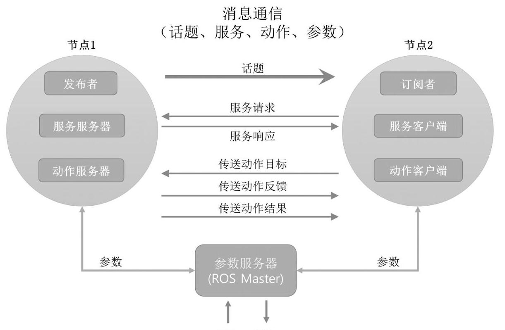

图 4-1 节点间的消息通信

<table><tr><td>种类</td><td>区别</td><td></td><td></td></tr><tr><td>话题</td><td>异步</td><td>单向</td><td>连续单向地发送/接收数据的情况</td></tr><tr><td>服务</td><td>同步</td><td>双向</td><td>需要对请求给出即时响应的情况</td></tr><tr><td>动作</td><td>异步</td><td>双向</td><td>请求与响应之间需要太长的时间，所以难以使用服务的情况，或需要中途反馈值的情况</td></tr></table>

表 4-1 话题、服务和动作之间的差异

### 4.2.1. 话题 (topic)

如图4-2所示, 话题消息通信是指发送信息的发布者和接收信息的订阅者以话题消息的形式发送和接收信息。希望接收话题的订阅者节点接收的是与在主节点中注册的话题名称对应的发布者节点的信息。基于这个信息，订阅者节点直接连接到发布者节点来发送和接收消息。例如，通过计算移动机器人的两个车轮的编码器值生成可以描述机器人当前位置的测位 (odometry) ${}^{28}$ 信息,并以话题信息 $\left( {\mathrm{x},\mathrm{y},\mathrm{i}}\right)$ 传达,以此实现异步单向的连续消息传输。话题是单向的, 适用于需要连续发送消息的传感器数据, 因为它们通过一次的连接连续发送和接收消息。另外, 单个发布者可以与多个订阅者进行通信, 相反, 一个订阅者可以在单个话题上与多个发布者进行通信。当然, 这两家发布者都可以和多个订阅者进行通信。

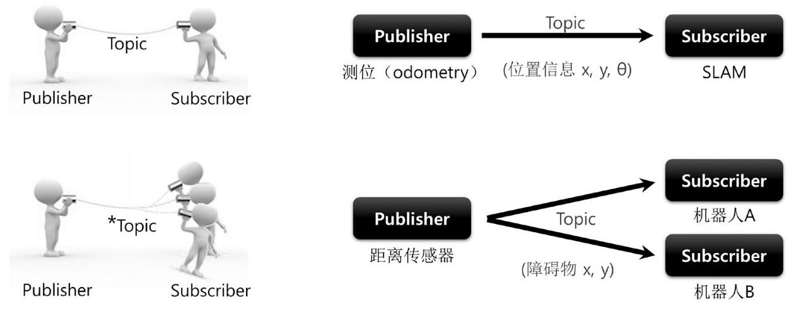

*利用Topic可以实现1:1 的Publisher、Subscriber通信, 也可以根据目的实现1:N、N:1和N:N通信。

图 4-2 话题消息通信

---

28 http://wiki.ros.org/navigation/Tutorials/RobotSetup/Odom

---

### 4.2.2. 服务(service)

服务消息通信是指请求服务的服务客户端与负责服务响应的服务服务器之间的同步双向服务消息通信, 如图4-3所示。前述的发布和订阅概念的话题通信方法是一种异步方法, 是根据需要传输和接收给定数据的一种非常好的方法。然而, 在某些情况下, 需要一种同时使用请求和响应的同步消息交换方案。因此, ROS提供叫做服务的消息同步方法。

一个服务被分成服务服务器和服务客户端，其中服务服务器只在有请求(request) 的时候才响应 (response), 而服务客户端会在发送请求后接收响应。与话题不同, 服务是一次性消息通信。因此, 当服务的请求和响应完成时, 两个连接的节点将被断开。该服务通常被用作请求机器人执行特定操作时使用的命令，或者用于根据特定条件需要产生事件的节点。由于它是一次性的通信方式, 又因为它在网络上的负载很小, 所以它也被用作代替话题的手段，因此是一种非常有用的通信手段。例如，如图4-3所示，当客户端向服务器请求当前时间时，服务器将确认时间并作出响应。

图 4-3 服务消息通信

### 4.2.3. 动作 (action)

动作 ${}^{29}$ 消息通信是在如下情况使用的消息通信方式:服务器收到请求后直到响应所需的时间较长, 且需要中途反馈值。这与服务非常相似, 服务具有与请求和响应分别对应的目标 (goal) 和结果 (result) 。除此之外动作中还多了反馈 (feedback) 。收到请求后需要很长时间才能响应, 又需要中间值时, 使用这个反馈发送相关的数据。消息传输方案本身与异步方式的话题(topic)相同。反馈在动作客户端(action client)和动作服务器 (action server) 之间执行异步双向消息通信，其中动作客户端设置动作目标 (goal) , 而动作服务器根据目标执行指定的工作, 并将动作反馈和动作结果发送给动作客户端。例如，如图4-4所示，当客户端将家庭服务器设置为服务器时，服务器会时时地通知客户端洗碗、洗衣和清洁等进度，最后将结果值发送给客户端。与服务不同，动作通常用于指导复杂的机器人任务，例如发送一个目标值之后，还可以在任意时刻发送取消目标的命令。

---

29 http://wiki.ros.org/actionlib

---

图 4-4 动作消息通信

在这种情况下, 发布者、订阅者、服务服务器、服务客户端、动作服务器和动作客户端都存在于不同的节点中，这些节点需要连接才能进行消息通信。这时候，主节点是帮助节点之间的连接。主节点就像节点名称、话题和服务、动作名称、URI地址和端口以及参数们的名称服务器。换句话说，节点同时向主节点注册自己的信息，并从主节点获取其他节点希望通过主节点访问的节点的信息。然后，节点和节点直接连接进行消息通信。如图 4-5所示。

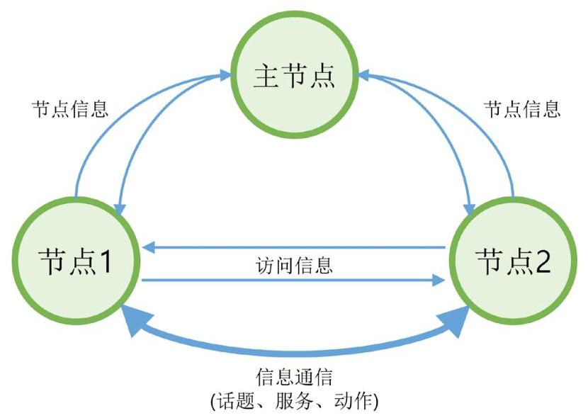

图 4-5 消息通信

### 4.2.4. 参数(parameter)

信息通信主要分为话题、服务和动作，而从大的框架来看，参数也可以看作一种消息通信。可以认为参数是节点中使用的全局变量。参数的用途与Windows程序中的*.ini配置文件非常类似。默认情况下，这些设置值是指定的，有需要时可以从外部读取或写入参数。特别是, 由于可以通过使用来自外部的写入功能来实时地改变设置值, 因此它是非常有用的, 因为它可以灵活地应对多变的情况。

尽管参数严格的来说并不是消息通信，但笔者认为它们属于消息通信的范畴，因为它们使用消息。例如，用户可以设置要连接的USB端口、摄像机色彩校正值以及速度和命令的最大值和最小值。

### 4.2.5. 消息通信的过程

主节点管理节点信息，每个节点根据需要与其他节点进行连接和消息通信。在这里, 我们来看看最重要的主节点、节点、话题、服务和动作信息的过程。

**运行主节点**

节点之间的消息通信当中，管理连接信息的主节点是为使用ROS必须首先运行的必需元素。ROS 主节点使用roscore命令来运行，并使用XMLRPC运行服务器。主节点为了节点与节点的连接, 会注册节点的名称、话题、服务、动作名称、消息类型、URI地址和端口，并在有请求时将此信息通知给其他节点。

\$ roscore

主节点

XMLRPC: 服务器

http://ROS_MASTER_URI:11311

节点信息管理

图 4-6 运行主节点

**运行订阅者节点**

订阅者节点使用rosrun或roslaunch命令来运行。订阅者节点在运行时向主节点注册其订阅者节点名称、话题名称、消息类型、URI地址和端口。主节点和节点使用 XMLRPC进行通信。

\$ rosrun PACKAGE_NAME NODE_NAME

\$ roslaunch PACKAGE_NAME LAUNCH_NAME

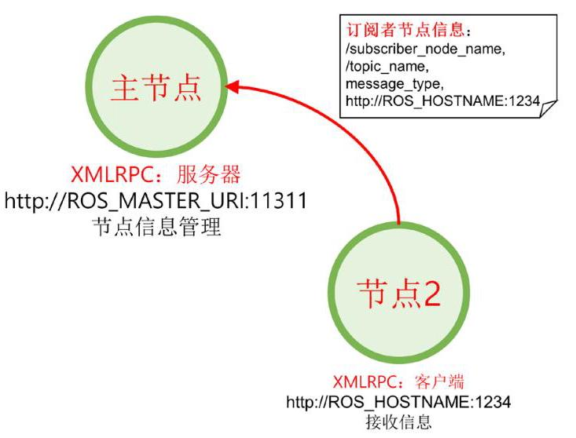

图 4-7 运行订阅者节点

**运行发布者节点**

发布者节点(与订阅者节点类似)使用rosrun或roslaunch命令来运行。发布者节点向主节点注册发布者节点名称、话题名称、消息类型、URI地址和端口。主节点和节点使用XMLRPC进行通信。

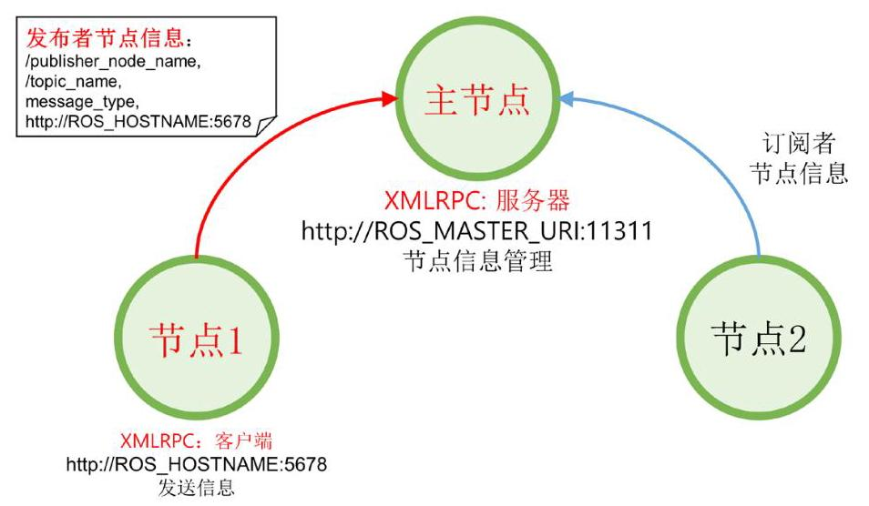

图 4-8 运行发布者节点

**通知发布者信息**

主节点向订阅者节点发送此订阅者希望访问的发布者的名称、话题名称、消息类型、 URI地址和端口等信息。主节点和节点使用XMLRPC进行通信。

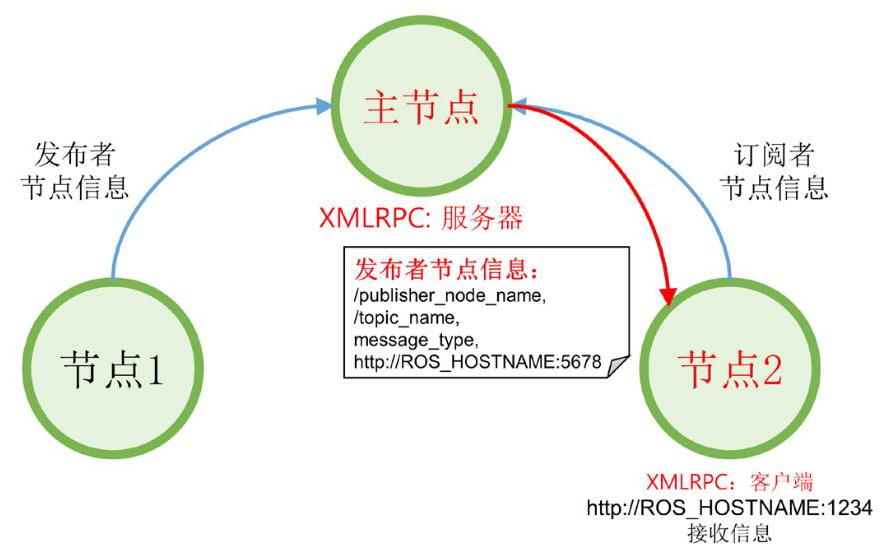

图 4-9 给订阅者节点通知发布者信息

**订阅者节点的连接请求**

订阅者节点根据从主节点接收的发布者信息，向发布者节点请求直接连接。在这种情况下, 要发送的信息包括订阅者节点名称、话题名称和消息类型。发布者节点和订阅者节点使用XMLRPC进行通信。

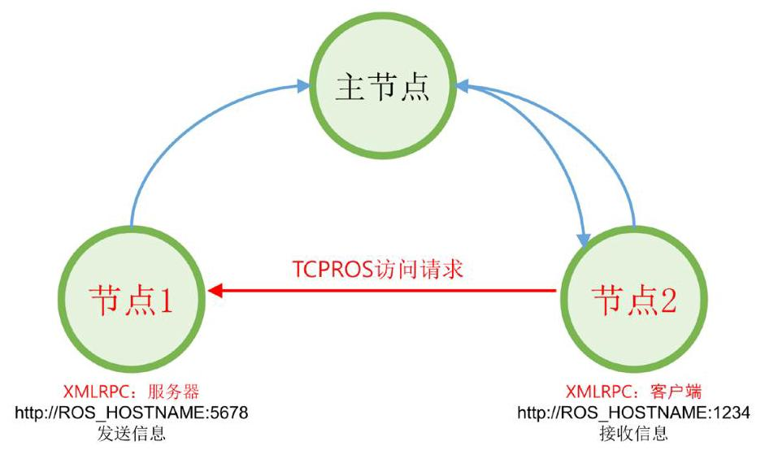

图 4-10 向发布者节点请求连接

**发布者节点的连接响应**

发布者节点将TCP服务器的URI地址和端口作为连接响应发送给订阅者节点。发布者节点和订阅者节点使用XMLRPC进行通信。

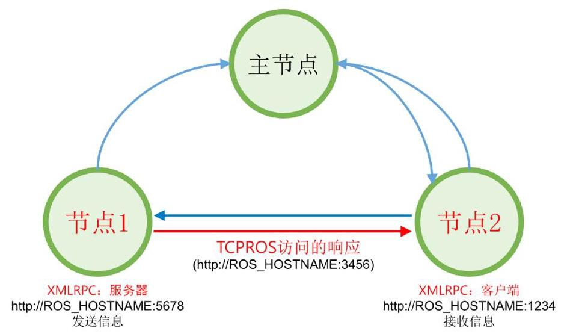

图 4-11 发布者节点的连接响应

**TCPROS连接**

订阅者节点使用TCPROS创建一个与发布者节点对应的客户端，并直接与发布者节点连接。节点间通信使用一种称为TCPROS的TCP/IP方式。

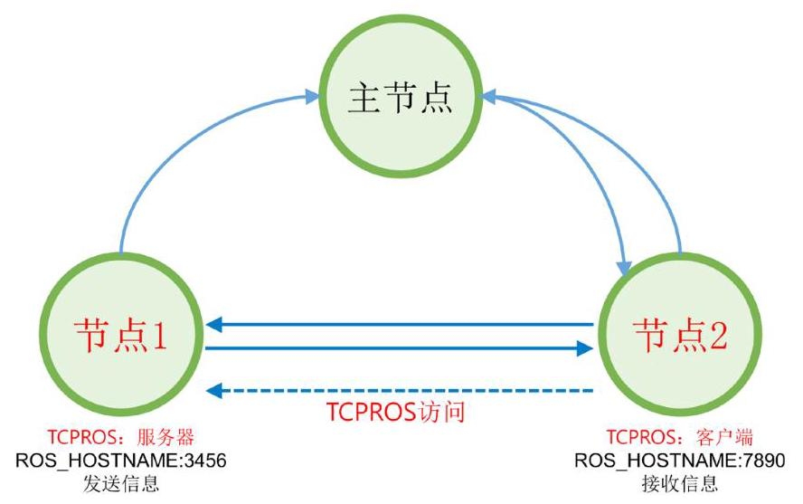

图 4-12 TCPROS连接

**发送消息**

发布者节点向订阅者节点发送消息。节点间通信使用一种称为TCPROS的TCP/IP 方式。

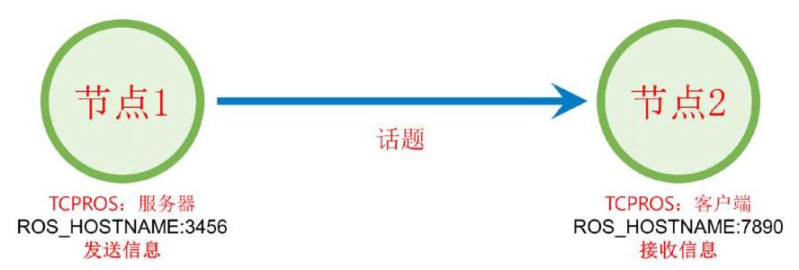

图 4-13 发送话题消息

**服务请求及响应**

上述内容相当于消息通信中的话题。话题消息通信是只要发布者或订阅者不停止，会持续地发布和订阅。服务分为下面两种。

- 服务客户端:请求服务后等待响应

- 服务服务器:收到服务请求后执行指定的任务，并发送响应。

服务服务器和客户端之间的连接与上述发布者和订阅者之间的TCPROS连接相同，但是与话题不同, 服务只连接一次, 在执行请求和响应之后彼此断开连接。如果有必要, 需要重新连接。

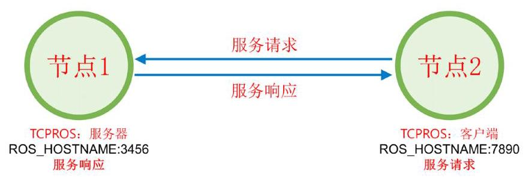

图 4-14 服务请求及响应

**动作的目标、结果和反馈**

动作 (action) 在执行的方式上好像是在服务 (service) 的请求 (goal) 和响应 (result) 之间仅仅多了中途反馈环节, 但实际的运作方式与话题相同。事实上, 如果使用rostopic命令来查阅话题，那么可以看到该动作的goal、status、cancel、result 和feedback等五个话题。动作服务器和客户端之间的连接与上述发布者和订阅中的 TCPROS连接相同，但某些用法略有不同。例如，动作客户端发送取消命令或服务器发送结果值会中断连接，等。

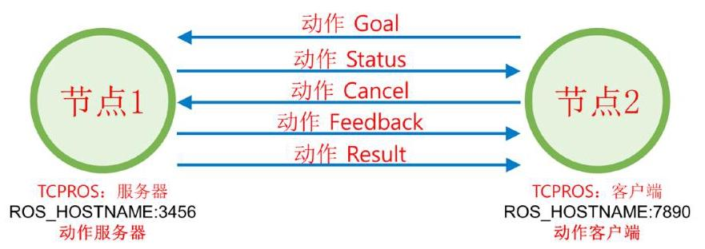

图 4-15 动作消息通信

在前面的内容中, 我们用turtlesim测试了ROS的操作。在这个测试中, 使用了主节点和两个节点，并且在两个节点之间，使用/turtle1/cmd_vel话题将平移和旋转消息传送给虚拟海龟。如果按照上面描述的ROS概念思考它，可以以图4-16表达出来。让我们回顾一下之前的ROS操作测试，并再次用ROS概念思考一下吧。

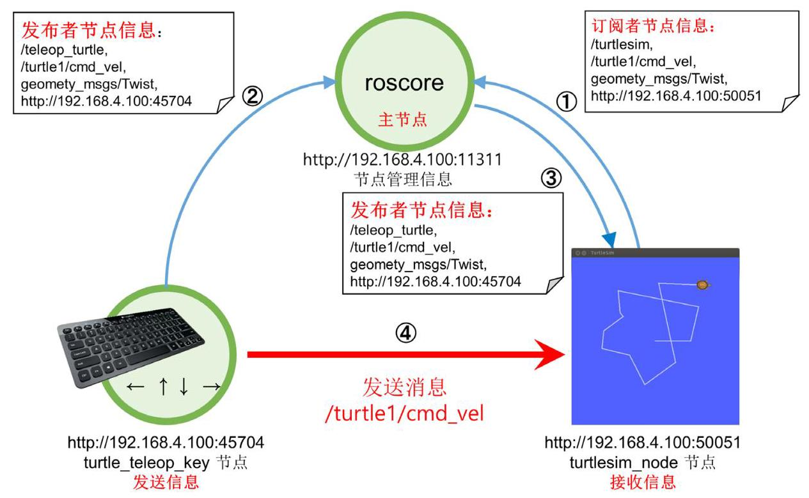

图 4-16 消息通信例子

## 4.3. 消息

消息 (message) ${}^{30}$ 是用于节点之间的数据交换的一种数据形式。前述的话题、服务和动作都使用消息。消息可以是简单的数据结构，如整数(integer)、浮点(floating point)和布尔值(boolean)，或者是像 "geometry_msgs/PoseStamped" ${}^{31}$ 一样消息包含消息的简单的数据结构，或者也可以是像 "float32[ ] ranges" 或 "Point32[10] points" 之类的消息数组结构。另外, ROS中常用的头 (header、std_msgs/Header) 也可以作为消息来使用。这些消息由两种类型组成:字段类型 (fieldtype) 和字段名称 (fieldname)

---

30 http://wiki.ros.org/msg

31 http://docs.ros.org/api/geometry_msgs/html/msg/PoseStamped.html

---

fieldtype1 fieldname1

fieldtype2 fieldname2

fieldtype3 fieldname3

字段类型应填入ROS数据类型，如表4-2所示。字段名称要填入指示数据的名称。例如, 您可以按照下面两行填入。这只是最简单的消息形式, 如果要添加更多的消息, 则可以将字段类型作为如表4-3所示的数组，并且常常使用消息包含消息的形式。

int32 x

int32 y

<table><tr><td>ROS数据类型</td><td>序列化(Serialization)</td><td>C++数据类型</td><td>Python数据类型</td></tr><tr><td>bool</td><td>unsigned 8-bit int</td><td>uint8_t</td><td>bool</td></tr><tr><td>int8</td><td>signed 8-bit int</td><td>int8_t</td><td>int</td></tr><tr><td>uint8</td><td>unsigned 8-bit int</td><td>uint8_t</td><td>int</td></tr><tr><td>int16</td><td>signed 16-bit int</td><td>int16_t</td><td>int</td></tr><tr><td>uint16</td><td>unsigned 16-bit int</td><td>uint16_t</td><td>int</td></tr><tr><td>int32</td><td>signed 32-bit int</td><td>int32_t</td><td>int</td></tr><tr><td>uint32</td><td>unsigned 32-bit int</td><td>uint32_t</td><td>int</td></tr><tr><td>int64</td><td>signed 64-bit int</td><td>int64_t</td><td>long</td></tr><tr><td>uint64</td><td>unsigned 64-bit int</td><td>uint64_t</td><td>long</td></tr><tr><td>float32</td><td>32-bit IEEE float</td><td>float</td><td>float</td></tr><tr><td>float64</td><td>64-bit IEEE float</td><td>double</td><td>float</td></tr><tr><td>string</td><td>ascii string</td><td>std::string</td><td>str</td></tr><tr><td>time</td><td>secs/nsecs unsigned 32-bit ints</td><td>ros::Time</td><td>rospy.Time</td></tr><tr><td>duration</td><td>secs/nsecs signed 32-bit ints</td><td>ros::Duration</td><td>rospy.Duration</td></tr></table>

表 4-2 ROS的基本消息数据类型、序列化方法和与此对应的C++和Python的数据类型

<table><tr><td>ROS数据类型</td><td>序列化(Serialization)</td><td>C++数据类型</td><td>Python数据类型</td></tr><tr><td>fixed-length</td><td>no extra serialization</td><td>boost::array, std::vector</td><td>tuple</td></tr><tr><td>variable-length</td><td>uint32 length prefix</td><td>std::vector</td><td>tuple</td></tr><tr><td>uint8[]</td><td>uint32 length prefix</td><td>std::vector</td><td>bytes</td></tr><tr><td>bool[]</td><td>uint32 length prefix</td><td>std::vector<uint8_t></td><td>list of bool</td></tr></table>

表 4-3 ROS的消息数据类型中与数组类似的用法，与此对应的C++和Python的数据类型

前面讲到ROS中常用的头 (header、std_msgs/Header) 可以作为消息来使用。更具体来说，正如std_msgs ${}^{32}$ 的Header.msg文件中描述，会记录序列号、时间戳和框架 ID，利用它们在消息中记录消息的计数以及时间的计算。

std_msgs/Header.msg

#序列号:是连续增加的ID，每个消息中依次递增+1。

uint32 seq

#时间戳:具有两个子属性:以秒为单位的stamp.sec和以纳秒为单位的stamp.nsec。

time stamp

#记录框架ID。

string frame_id

消息在程序中的实际用法如下。在第3章的ROS操作测试中执行的turtlesim功能包的teleop_turtle_key节点的例子中，根据方向键(←、→、↑、↓)将turtlesim节点的转速 (meter/sec) 和旋转速度 (radian/sec) 用消息发送给turtlesim_node节点。 乌龟机器人使用接收到的速度值在屏幕上移动。此时使用的消息是geometry_msgs中的 Twist'33消息，是如下形式。

---

Vector3 linear

Vector3 angular

---

它以Vector3消息的形式声明了linear和angular。它是消息包含消息的形式，其中， Vector3消息是geometry_msgs ${}^{34}$ 之一。这个Vector3 ${}^{35}$ 具有以下形式。

---

float64 x

	float64 y

	float64 z

---

换句话说，从teleop_turtle_key节点发布的话题是linear.x、linear.y、linear.z、 angular.x、angular.y和angular.z。所有这些都是float64格式，这是上面描述的ROS基本类型之一。利用它，键盘的箭头以平移速度(meter/sec)和旋转速度(radian/sec) 消息传送，从而驱动TurtleBot。

---

32 http://wiki.ros.org/std_msgs

33 http://docs.ros.org/api/geometry_msgs/html/msg/Twist.html

34 http://docs.ros.org/api/geometry_msgs/html/index-msg.html

35 http://docs.ros.org/api/geometry_msgs/html/msg/Vector3.html

---

上一节中描述的基于消息的话题、服务和动作都使用消息, 这些消息在形式和概念上都是相似的, 但根据其用法分为三类。这将在下一节中更详细地讨论。

### 4.3.1. msg文件

msg文件是用于话题的消息文件，扩展名为*.msg。例如，上述geometry_msgs中的 Twist ${}^{36}$ 消息是有代表性的。这种msg文件只包含一个字段类型和一个字段名称。

geometry_msgs/Twist.msg

---

Vector3 linear

Vector3 angular

---

### 4.3.2. srv文件

srv文件是服务使用的消息文件，扩展名为*.srv。例如，sensor_msgs的SetCamera Info ${}^{37}$ 消息是典型的srv文件。与msg文件的主要区别在于三个连字符( —— )作为分隔符, 上层消息是服务请求消息, 下层消息是服务响应消息。

sensor_msgs/SetCameraInfo.srv

sensor_msgs/CameraInfo camera_info

---

bool success

string status_message

---

36 http://docs.ros.org/api/geometry_msgs/html/msg/Twist.html

37 http://docs.ros.org/api/sensor_msgs/html/srv/SetCameraInfo.html

---

### 4.3.3. action文件

action消息 ${}^{38}$ 文件是动作 ${}^{39}$ 中使用的消息文件，它使用 ${}^{ \star  }$ .action扩展名。与msg和srv 不同, 它不是一个比较常见的消息文件, 所以没有典型的官方消息文件, 但是可以像下面的例子一样使用它。与msg和srv文件的主要区别在于，三个连字符(——)在两个地方用作分隔符, 第一部分是goal消息, 第二部分是result消息, 第三部分是feedback消息。 最大的区别是来自action文件的feedback信息。action文件的goal消息和result消息与上述srv文件的请求消息和响应消息角色相同，但action文件的feedback消息用于传输指定进程执行过程中的中途值。在下面的例子中，当机器人的出发点start_pose和目标点 goal_pose的位置和姿态作为请求值被传送时，机器人移动到预定的目标位置并且将发送最终到达的result_pose的位置和姿态。另外，用percent_complete消息，周期性地发送到达目标地点进程的百分比。

---

geometry_msgs/PoseStamped start_pose

geometry_msgs/PoseStamped goal_pose

---

geometry_msgs/PoseStampedresult_pose

---

float32 percent_complete

---

## 4.4. 名称(name)

ROS有一个称为图 (graph) 的抽象数据类型作为其基本概念 ${}^{40}$ 。这显示了每个节点的连接关系以及通过箭头表达发送和接收消息(数据)的关系。为此，服务中使用的节点、话题、消息以及ROS中使用的参数都具有唯一的名称(name) ${}^{41}$ 。让我们仔细看看话题的名称。话题名称分为相对的方法、全局方法和私有方法，如表4-4所示。

以下代码显示了常用的话题的声明。这将在第7章中详细介绍。在这里，我们通过修改话题名称来理解名称的用法。

---

38 http://wiki.ros.org/actionlib_msgs

http://wiki.ros.org/actionlib

40 http://wiki.ros.org/ROS/Concepts

41 http://wiki.ros.org/Names

---

---

int main(int argc, char **argv) 	// 节点主函数

\{

ros::init(argc, argv, "node1"); 	// 初始化节点

ros::NodeHandle nh; 	// 声明节点句柄

// 声明发布者，话题名 = bar

ros::Publisher node1_pub = nh.advertise<std_msg::Int32>("bar", 10);

---

这里的节点名称是/node1。如果您用一个没有任何字符的相对形式的bar来声明一个发布者，这个话题将和/bar具有相同的名字。如果以如下所示使用斜杠(/)字符用作全局形式，话题名也是/bar。

---

ros::Publisher node1_pub = nh.advertise<std_msg::Int32>("/bar", 10);

---

但是, 如果使用波浪号(~)字符将其声明为私有, 则话题名称将变为/node1/bar。

---

ros::Publisher node1_pub = nh.advertise<std_msg::Int32>("~bar", 10);

---

这可以按照表4-4所示的各种方式使用。其中/wg意味着命名空间的修改。这在下面的描述中更详细地讨论。

<table><tr><td>Node</td><td>Relative (基本)</td><td>Global</td><td>Private</td></tr><tr><td>/node1</td><td>bar $\rightarrow$ /bar</td><td>/bar $\rightarrow$ /bar</td><td>~bar $\rightarrow$ /node1/bar</td></tr><tr><td>/wg/node2</td><td>bar $\rightarrow  /\mathrm{{wg}}/\mathrm{{bar}}$</td><td>/bar $\rightarrow$ /bar</td><td>~bar → /wg/node2/bar</td></tr><tr><td>/wg/node3</td><td>foo/bar $\rightarrow  /\mathrm{{wg}}/$ foo/bar</td><td>/foo/bar $\rightarrow$ /foo/bar</td><td>~foo/bar → /wg/node3/foo/bar</td></tr></table>

表 4-4 名称规则

如果要运行两个摄像头应该如何做？简单地两次执行相关节点将导致之前执行的节点因ROS的性质而终止, 因为ROS必须具有唯一的名称。用户可以在运行时更改节点的名称, 而不需要运行额外的程序或更改源代码。方法包括命名空间 (namespace) 和重新映射 (remapping)。

为了帮助理解，假设有一个虚拟的camera_package。假设执行camera_package功能包的camera_node会运行camera节点，此时的运行方法如下。

\$rosrun camera_package camera_node

当该节点将相机的图像值发送给image话题时，可以通过rqt_image_view传送该 image话题，如下所示。

---

\$rosrun rqt_imgae_view rqt_imgae_view

---

现在让我们通过重新映射来修改这些节点的话题值。如果执行如下命令，只有话题名称将被改为/front/image。其中, image是camera_node的话题名, 而这些命令是在运行两个节点的同时，顺便修改名称的例子。

---

	\$ rosrun camera_package camera_node image:=front/image

\$ rosrun rqt_imgae_view rqt_imgae_view image:=front/image

---

例如，当有前、左、右，三个摄像头，且当多次执行同名的节点时，由于节点名重复, 该节点将被重复执行, 因此节点会被停止。为了避免这种情况, 可以采取用同一个名称运行多个不同的节点的方法。下面的命令示例中, name选项使用了两个下划线 (___)。附加地说明，选项___ns、___name、___log、___ip、___hostname和___master 是运行节点时使用的特殊选项。我们在话题名称选项中使用了一个下划线(_)，如果它是private名称，则在现有名称前加上一个下划线。

---

\$ rosrun camera_package camera_node __name:=front_device:=/dev/video0

\$ rosrun camera_package camera_node __name::left_device::/dev/video1

	\$ rosrun camera_package camera_node __name::right _device::/dev/video2

	\$rosrun rqt_imgae_view rqt_imgae_view

---

如果想绑定到单一的命名空间，可以如下操作。这样会将指定的节点和话题都绑定到一个命名空间，因此会改变所有的名称。

---

	\$ rosrun camera_package camera_node __ns:=back

\$ rosrun rqt_imgae_view rqt_imgae_view_ns:=back

---

上面讲到了名称的多种用法。名称使得整个ROS系统的灵活运转。在本节中，我们通过节点运行命令rosrun了解了修改名称值的方法。同样，可以使用roslaunch，用一次执行来指定它们的选项。这将在第7章中通过实习例子更详细地讨论。

## 4.5. 坐标变换 (TF)

描述如图4-17所示的机器人的手臂位置时，可以将其描述为每个关节(joint)的相对坐标变换 ${}^{42}$ 。下面举一个人形机器人的手的例子。手连接到手腕，再连接到肘部，而肘部又连接到肩膀。以此逆推, 在机器人行走和移动时, 利用相对坐标关系, 可以将肘部的状态表示为肩部关节状态的函数，继而可以表示为腰部状态的函数，再可以表示为各腿关节状态的函数, 最终可以表示为机器人双脚的中心状态的函数。换句话说, 当机器人步行移动时，机器人手的坐标会根据各个相关关节的相对坐标变换而移动。另外，除了机器人以外，假设有一个机器人要抓取的物体，那么机器人的原点会相对的位于特定的地图上，而这个物体也是在这个地图上。机器人为了抓取这个物体，需要以自己在地图上的相对位置计算出物体对自己的相对位置，最终抓取物体。在机器人编程中，经过坐标变换的机器人的关节(或带有旋转轴的车轮)和物体的位置是非常重要的，在ROS中将它以坐标变换 (Transform) ${}^{43}$ 来表达。

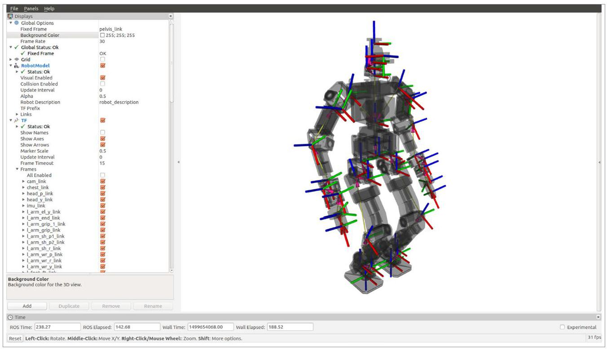

图 4-17 机器人各坐标的表达 (THORMANG3, http://robots.ros.org/thormang/)

---

42 http://wiki.ros.org/geometry/CoordinateFrameConventions

43 http://wiki.ros.org/tf

---

ROS中的坐标转换TF在描述组成机器人的每个部分、障碍物和外部物体时是最有用的概念之一。这些可以被描述为位置 (position) 和方向 (direction), 统称为姿态 (pose) 。在此，位置由x、y、z这3个矢量表示，而方向是用四元数(quaternion) x、y、z、w表示。四元数并不直观，因为它们没有使用我们在日常生活中使用的三元数的角度表达方式:滚动角(roll)、俯仰角(pitch)和偏航角(yaw)。但这种四元数方式不存在滚动、俯仰和偏航矢量的欧拉(Euler)方式具有的万向节死锁(gimbal lock)问题或速度问题，因此在机器人工程中人们更喜欢用四元数(quaternion)的形式。因为同样的原因, ROS中也大量使用四元数。当然, 考虑到方便, 它也提供将欧拉值转换成四元数的功能。

类似上面说明的消息(message)，TF使用以下格式 ${}^{44}$ 。Header用于记录转换的时间，并使用名为child_frame_id的消息来表示下位的坐标。并且为了表达坐标的转换值, 使用transformTranslation.x / transform.translation.y / transform.translation. z / transform.rotation.x / transform.rotation.y / transform.rotation.z / transform. rotation.w 的数据形式描述对方的位置和方向。

geometry_msgs/TransformStamped.msg

Header header

string child_frame_id

Transform transform

到这里，我们简单地了解了TF。我们后面将在移动机器人和机械手臂的建模部分详细讨论TF的实例。

## 4.6.客户端库

编程语言多如繁星。为了更快的性能和更好地控制硬件, 会选择C++; 为了更高的工作效率，会选择Python和Ruby。除了这些之外还有人工智能领域常用的LISP、数值分析等工程用软件MATLAB、安卓中使用的Java，此外还有C#、Go、Haskell、Node. js、Lua、R、EusLisp和Julia等很多种编程语言。很难说哪些更重要。因为目的不同， 最合适的语言也会不同。由于ROS需要支持具有多重目的特点的机器人，因此ROS提供面向多种语言的便利接口。具体来说，各个节点可以用各自的语言来编写，而节点间通过消息通信交换信息。其中, 允许用各自的语言编写的软件模块就是客户端库 (client library) ${}^{45}$ 。常用且具有代表性的库有支持C++的roscpp、支持Python的rospy、支持LISP的roslisp、支持Java的rosjava。此外还有roscs、roseus、rosgo、roshask、 rosnodejs、RobotOS.jl、roslua、PhaROS、rosR、rosruby和Unreal-Ros-Plugin 等。不仅如此，各个客户端库此时此刻也在为丰富ROS的语言多样性而被开发和改进中。

---

44 http://docs.ros.org/api/geometry_msgs/html/msg/TransformStamped.html

---

在本书中，我们将重点介绍C++语言的roscpp。但即便使用不同的语言，也只不过是编程用法相异，概念都是一样的，所以可以选择自己熟悉的语言，通过参考每个客户端库的wiki ${}^{46}$ 来编写相应的客户端库。

## 4.7. 异构设备间的通信

第2章的元操作系统那一节说明了消息通信、消息、名称、坐标变换和客户端库等概念, ROS因为具有这些概念和属性, 因此基本上支持异构设备间的通信(参见图4-18)。 节点间的通信不受各节点所在的ROS底层的操作系统的种类的影响，也不受编程语言的影响, 因此可以很容易地进行通信。例如, 即使机器人安装了Linux的发行版之一的 Ubuntu，开发者可以在MacOS上监测机器人的状态，同时，用户可以通过基于Android 的应用程序 (APP) 来向机器人发送指令。相应的实习例子将通过第8章关于USB摄像头的内容中的两个不同的PC之间的视频流传输例子讲到。此外, 即使是无法安装ROS的那些基于微控制器的嵌入式系统设备，只要提供收发消息的功能，也能在机器人控制器级别上进行消息通信。与此相关的内容将在第9章的嵌入式系统部分进行更详细的讨论。

---

45 http://wiki.ros.org/Client%20Libraries

46 http://wiki.ros.org/Client%20Libraries

---

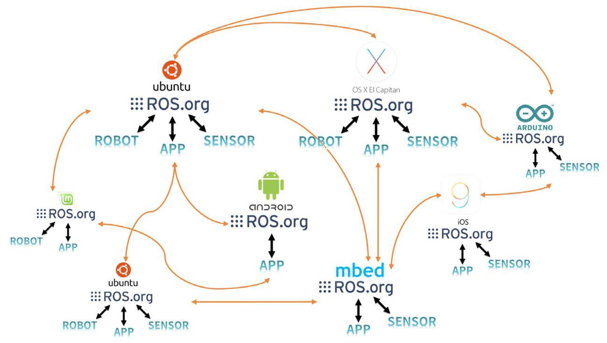

图 4-18 异构设备间的通信

## 4.8.文件系统

### 4.8.1.文件组织结构

我们来看一下ROS文件的组织结构。在ROS中，组成软件的基本单位是功能包 (package), 因此ROS应用程序是以功能包为单位开发的。功能包包含一个以上的节点 (node, ROS中最小的执行处理器)或包含用于运行其他节点的配置文件。截至2017年 7月，ROS Indigo拥有约2500个功能包，而ROS Kinetic拥有约1,600个官方功能包。用户开发和发布的功能包可能有一些重复，但也大约有5000个。这些功能包也会以元功能包 (metapackage) 的形式来统一管理。元功能包是具有共同目的的功能包的集合体。 例如, Navigation元功能包含10个功能包:AMCL、DWA、EKF和map_server等等。 每个功能包都包含一个名为package.xml的文件，该文件是一个包含功能包信息的XML 文件，包括其名称，作者，许可证和依赖包。此外，ROS构建系统catkin基本上使用 CMake，并在功能包目录中的CMakeLists.txt文件中描述构建环境。另外，它由节点的源代码和消息文件组成，用于节点之间的消息通信。

ROS的文件系统分为安装目录和用户工作目录。安装ROS desktop版本后，在/opt目录中会自动生成名为ros的安装目录，里面会安装有roscore、rqt、RViz、机器人相关库、仿真和导航等核心实用程序。用户很少需要修改这个区域的文件。如果要修改以二进制文件形式分发的功能包，请找到包含源代码的功能包存储库之后利用在 “~/catkin_ ws/src”目录下用“git clone [存储库地址]”命令直接复制源代码，而不是用“sudo apt-get install ros-kinetic-xxx”形式的功能包安装命令。

用户的工作目录可以在用户想要的位置创建, 下面我们就使用Linux用户目录 “~/ catkin_ws/(在Linux中，‘~/’指‘/home/用户名/’目录)”。接下来，让我们来看看ROS安装目录和用户工作目录。

**二进制文件安装和源代码安装**

ROS功能包的安装方式有二进制文件安装和源代码安装两种。二进制文件安装是使用二进制形式的文件，无需额外的构建，而源代码安装是下载该功能包的源代码之后由用户进行构建之后使用的方式。 根据功能包使用的目的不同选择不同的方式。如果需要修改安装包或者要检查源代码的内容，可以使用后一种安装方法。下面用turtlebot3功能包的例子，介绍两种安装方法的不同之处。

**1. 二进制文件安装**

\$ sudo apt-get install ros-kinetic-turtlebot3

**2. 源代码安装**

\$ cd ~/catkin_ws/src

\$ git clone https://github.com/ROBOTIS-GIT/turtlebot3.git

\$ cd ~/catkin_ws/

\$ catkin_make

### 4.8.2. 安装目录

ROS安装在 “/opt/ros/[版本名称]” 目录中。例如，如果您安装了ROS Kinetic Kame版本，则ROS安装路径为:

- ROS 安装目录路径:/opt/ros/kinetic

**文件组织结构**

如图4-19所示, "/opt/ros/kinetic" 目录下包含bin、etc、include、lib、share目录和一些配置文件。

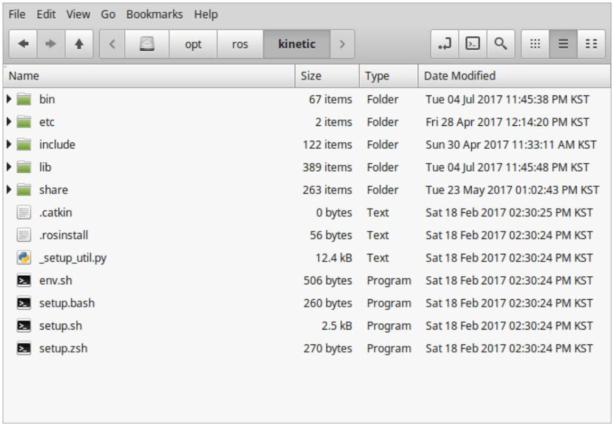

图 4-19 ROS文件组织结构

**详细内容**

ROS目录包含用户在安装ROS时选择的功能包和ROS运行程序。详情如下。

---

- /bin 	可执行的二进制文件

- /etc 	与ROS和catkin相关的配置文件

- /include 	头文件

= /lib 	库文件

- /share 	ROS功能包

env.* 	配置文件

setup.* 	配置文件

---

### 4.8.3. 工作目录

用户可以在任意位置创建工作目录，但是为了方便，本书中将Linux用户目录 “~/ catkin_ws/”用作工作目录。也就是说，您将使用“/home/用户名/catkin_ws”目录。 例如, 如果用户名是 “oroca”, 而catkin目录名设为 “catkin_ws”, 则路径是:

- 工作目录路径/home/oroca/catkin_ws/

**文件组织结构**

如图4-20所示，在 “/home/用户名/” 目录下有一个名为catkin_ws的目录，由目录 build、devel和src组成。请注意，build和devel目录是在catkin_make之后创建的。

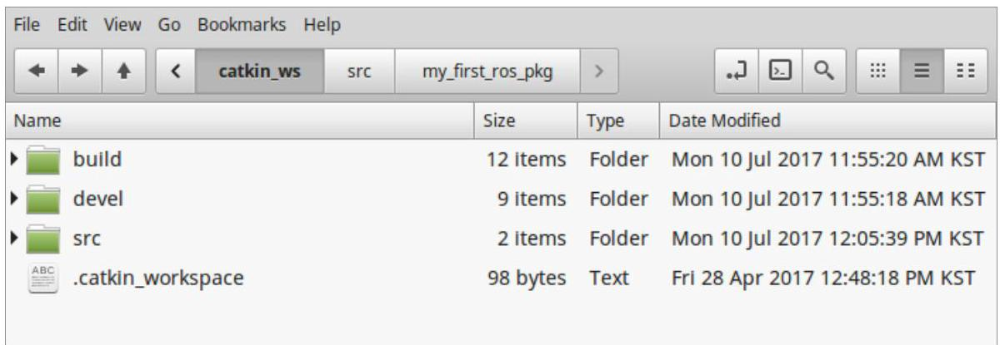

图 4-20 catkin workspace的文件组织结构

**详细内容**

工作目录是对用户创建的功能包和其他开发人员公开的功能包进行存储和构建的空间。用户在该目录中执行与ROS有关的大部分操作。详情如下。

---

	- /build 构建相关的文件

	- /devel msg、srv头文件、用户包库、可执行文件

= /src 用户功能包

---

**用户功能包**

目录 “~/catkin_ws/src” 是用户源代码的空间。在这个目录中，用户可以保存和建立自己的ROS功能包或其他开发者开发的功能包。ROS的构建系统将在下一节详细介绍。 图4-21显示了笔者编写了ros_tutorials_topic功能包之后的状态。下面列举了通常使用的目录和文件，但其文件组成会根据功能包的用途而有所不同。

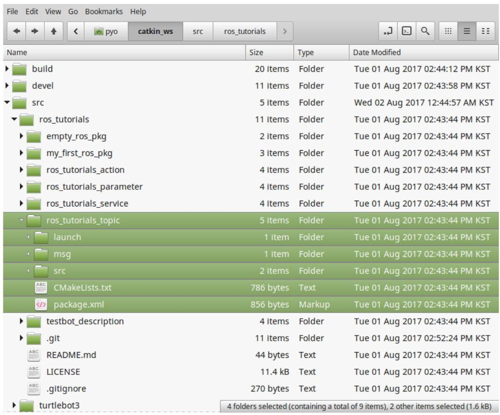

图 4-21 用户功能包的文件组成

---

- /include 	头文件

- /launch 	用于roslaunch的启动文件

- /node 	用于rospy的脚本

- /msg 	消息文件

- /src 	源代码文件

- /srv 	服务文件

- CMakeLists.txt

	- package.xml

---

## 4.9. 构建系统

ROS的构建系统默认使用CMake (Cross Platform Make), 其构建环境在功能包目录中的CMakeLists.txt文件中描述。在ROS中, CMake被修改为适合于ROS的 "catkin" 构建系统。

在ROS中使用CMake的是为了在多个平台上构建 ROS功能包。因为不同于只支持 Unix系列的Make, CMake支持Unix类的Linux、BSD和OS X以外, 还支持Windows 系列。并且，它还支持Microsoft Visual Studio，也还可以轻松应用于Qt开发。此外， catkin 构建系统可以轻松使用与ROS相关的构建、功能包管理和功能包之间的依赖关系。

### 4.9.1. 创建功能包

创建ROS功能包的命令如下。

---

\$ catkin_create_pkg [功能包名称] [依赖功能包1] [依赖功能包n]

---

"catkin_create_pkg" 命令在创建用户功能包时会生成catkin 构建系统所需的 CMakeLists.txt和package.xml文件的包目录。让我们来创建一个简单的功能包，以巩固理解。首先打开一个新的终端窗口(Ctrl + Alt + t)并运行以下命令移至工作目录。

---

\$cd ~/catkin_ws/src

---

要创建的功能包名称是 “my_first_ros_pkg”。ROS中的功能包名称全部是小写字母, 不能包含空格。格式规则是将每个单词用下划线(_)而不是短划线(- )连接起来。有关ROS编程，请参阅相关页面的编码风格 ${}^{47}{}^{48}$ 和命名约定。那么下面使用以下命令创建一个名为my_first_ros_pkg的功能包:

---

47 http://wiki.ros.org/CppStyleGuide

48 http://wiki.ros.org/PyStyleGuide

---

上面用 “std_msgs” 和 “roscpp” 作为前面命令格式中的依赖功能包的选项。这意味着为了使用ROS的标准消息包std_msgs和客户端库roscpp(为了在ROS中使用C/ C++)，在创建功能包之前先进行这些选项安装。这些相关的功能包的设置可以在创建功能包时指定，但是用户也可以在创建之后直接在package.xml中输入。

如果已经创建了功能包，“~/catkin_ws/src”会创建“my_first_ros_pkg”功能包目录、ROS功能包应有的内部目录以及CMakeLists.txt和package.xml文件。用户可以用下面的“ls”命令来检查内容，并使用类似Windows资源管理器的基于GUI的 Nautilus来检查功能包的内部。

---

\$cdmy_first_ros_pkg

\$ 1s

include 	$\rightarrow$ include目录

src 	→ 源代码目录

CMakeLists.txt 	→构建配置文件

package.xml → 功能包配置文件

---

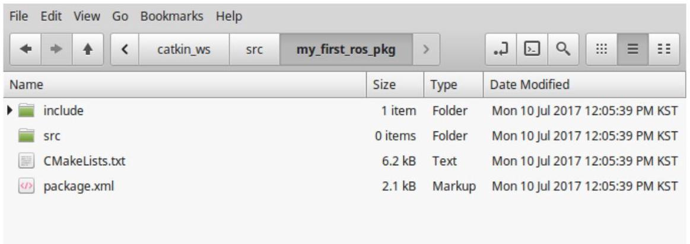

图 4-22 创建功能包时自动生成的目录及文件

### 4.9.2. 修改功能包配置文件(package.xml)

必要的ROS配置文件之一的package.xml是一个包含功能包信息的XML文件，包括功能包名称、作者、许可证和依赖功能包。最初没有做任何修改的原始文件如下: <maintainer email="oroca@todo.todo">pyo</maintainer>

<?xml version="1.0"?>

<package>

<name>my_first_ros_pkg</name>

<version>0.0.0</version>

<description>The my_first_ros_pkg package</description>

 <license>TODO</license>

<buildtool_depend>catkin</buildtool_depend>

<build_depend>roscpp</build_depend>

<build_depend>std_msgs</build_depend>

<run_depend>roscpp</run_depend>

<run_depend>std_msgs</run_depend>

<export>

</export>

</package>

下面是对每个语句的说明。

---

<?xml> 																这是一个定义文档语法的语句，随后的内容表明在遵循xml版本1.0。

- <package> 																从这个语句到最后</package>的部分是ROS功能包的配置部分。

<name> 																功能包的名称。使用创建功能包时输入的功能包名称。正如其他选项，用户可

																以随时更改。

<version> 																功能包的版本。可以自由指定。

<description> 																功能包的简要说明。通常用两到三句话描述。

<maintainer> 																提供功能包管理者的姓名和电子邮件地址。

<license> 																记录版权许可证。写BSD、MIT、Apache、GPLv3或LGPLv3即可。

- <url> 																记录描述功能包的说明，如网页、错误管理、存储库的地址等。根据功能包的

																类型, 用户可以填写网站、错误跟踪(bugtracker)或存储库的地址。

- <author> 																记录参与功能包开发的开发人员的姓名和电子邮件地址。如果涉及多位开发人

																员，只需在下一行添加<author>标签。

<buildtool_depend> 																描述构建系统的依赖关系。我们正在使用catkin 构建系统，因此输入catkin。

	<build_depend> 																在编写功能包时写下您所依赖的功能包的名称。

	<run_depend> 																填写运行功能包时依赖的功能包的名称。

	<test_depend> 																填写测试功能包时依赖的功能包名称。

---

- <export>

在使用ROS中未指定的标签名称时会用到<export>。最广泛使用的情况是元功能包的情况，这时用<export> <metapackage/> </export>格式表明是元功能包。

- <metapackage> 在export标签中使用的官方标签声明，当前功能包为一个元功能包时声明它。

笔者修改了功能包配置文件(package.xml)，如下所示。读者们也可以根据自己的环境进行修改。如果还不熟悉，可以键入以下内容:

<?xml version="1.0"?>

<package>

<name>my_first_ros_pkg</name>

<version>0.0.1</version>

<description>The my_first_ros_pkg package</description>

<license>Apache License 2.0</license>

<author email="pyo@robotis.com">Yoonseok Pyo</author>

<maintainer email="pyo@robotis.com">Yoonseok Pyo</maintainer>

<url type="bugtracker">https://github.com/ROBOTIS-GIT/ros_turtorials/issues</url>

<url type="repository">https://github.com/ROBOTIS-GIT/ros_turtorials.git</url>

<url type="website">http://www.robotis.com</url>

<buildtool_depend>catkin</buildtool_depend>

<build_depend>std_msgs</build_depend>

<build_depend>roscpp</build_depend>

<run_depend>std_msgs</run_depend>

<run_depend>roscpp</run_depend>

<export></export>

</package>

### 4.9.3. 修改构建配置文件(CMakeLists.txt)

ROS的构建系统catkin基本上使用CMake，并在功能包目录中的CMakeLists.txt 文件中描述构建环境。在这个文件中设置可执行文件的创建、依赖包优先构建、连接器 (linker) 的创建等等。最初没有做任何修改的原始文件如下:

---

cmake_minimum_required(VERSION 2.8.3)

project(my_first_ros_pkg)

##Find catkin macros and libraries

**if COMPONENTS list like find_package(catkin REQUIRED COMPONENTS xyz)**

**is used, also find other catkin packages**

find_package(catkin REQUIRED COMPONENTS

	roscpp

	std_msgs

)

##System dependencies are found with CMake's conventions

#find_package(Boost REQUIRED COMPONENTS system)

##Uncomment this if the package has a setup.py. This macro ensures

##modules and global scripts declared therein get installed

**See http://ros.org/doc/api/catkin/html/user_guide/setup_dot_py.html**

#catkin_python_setup()

#######........................................................................

##Declare ROS messages, services and actions ##

#######............................................................

**To declare and build messages, services or actions from within this**

##package, follow these steps:

##* Let MSG_DEP_SET be the set of packages whose message types you use in

##your messages/services/actions (e.g. std_msgs, actionlib_msgs, ...).

##* In the file package.xml:

##* add a build_depend tag for "message_generation"

##* add a build_depend and a run_depend tag for each package in MSG_DEP_SET

		* * If MSG_DEP_SET isn't empty the following dependency has been pulled in

**but can be declared for certainty nonetheless:**

##* add a run_depend tag for "message_runtime"

##* In this file (CMakeLists.txt):

##* add "message_generation" and every package in MSG_DEP_SET to

##find_package(catkin REQUIRED COMPONENTS ...)

##* add "message_runtime" and every package in MSG_DEP_SET to

---

---

		##catkin_package(CATKIN_DEPENDS ...)

		##* uncomment the add_*_files sections below as needed

**and list every .msg/.srv/.action file to be processed**

##* uncomment the generate_messages entry below

	##* add every package in MSG_DEP_SET to generate_messages(DEPENDENCIES ...)

	##Generate messages in the 'msg' folder

#add_message_files(   )

#FILES

#Message1.msg

#Message2.msg

	#)

	##Generate services in the 'srv' folder

	#add_service_files(   )

	#FILES

#Service1.srv

#Service2.srv

#)

	##Generate actions in the 'action' folder

	#add_action_files(   )

	#FILES

#Action1.action

#Action2.action

#)

##Generate added messages and services with any dependencies listed here

	#generate_messages(   )

	#DEPENDENCIES

	#std_msgs

	#)

		************************************************

	##Declare ROS dynamic reconfigure parameters ##

		#######.............................................................

**To declare and build dynamic reconfigure parameters within this**

	##package, follow these steps:

---

---

##* In the file package.xml:

##* add a build_depend and a run_depend tag for "dynamic_reconfigure"

##* In this file (CMakeLists.txt):

	##* add "dynamic_reconfigure" to

		##find_package(catkin REQUIRED COMPONENTS ...)

##* uncomment the "generate_dynamic_reconfigure_options" section below

**and list every .cfg file to be processed**

##Generate dynamic reconfigure parameters in the 'cfg' folder

#generate_dynamic_reconfigure_options(   )

#cfg/DynReconf1.cfg

#cfg/DynReconf2.cfg

#)

		#######..............................####

		##catkin specific configuration##

		#######..............................####

**The catkin_package macro generates cmake config files for your package**

	##Declare things to be passed to dependent projects

	##INCLUDE_DIRS: uncomment this if you package contains header files

##LIBRARIES: libraries you create in this project that dependent projects also need

##CATKIN_DEPENDS: catkin_packages dependent projects also need

##DEPENDS: system dependencies of this project that dependent projects also need

		catkin_package(   )

	#INCLUDE_DIRS include

#LIBRARIES my_first_ros_pkg

	#CATKIN_DEPENDS roscpp std_msgs

#DEPENDS system_lib

)

		#####------------

		##Build ##

		####

	##Specify additional locations of header files

##Your package locations should be listed before other locations

	#include_directories(include)

		include_directories(   )

													\$\{catkin_INCLUDE_DIRS\}

)

---

---

##Declare a C++ library

#add_library(my_first_ros_pkg

#src/\$\{PROJECT_NAME\}/my_first_ros_pkg.cpp

#)

**Add cmake target dependencies of the library**

**as an example, code may need to be generated before libraries**

	##either from message generation or dynamic reconfigure

#add_dependencies(my_first_ros_pkg \$\{\$\{PROJECT_NAME\}_EXPORTED_TARGETS\} \$\{catkin_EXPORTED_TARGETS\})

	##Declare a C++ executable

	#add_executable(my_first_ros_pkg_node src/my_first_ros_pkg_node.cpp)

**Add cmake target dependencies of the executable**

##same as for the library above

#add_dependencies(my_first_ros_pkg_node \$\{\$\{PROJECT_NAME\}_EXPORTED_TARGETS\}

	\$\{catkin_EXPORTED_TARGETS\})

	##Specify libraries to link a library or executable target against

#target_link_libraries(my_first_ros_pkg_node

#\$\{catkin_LIBRARIES\}

#)

		##############

		##Install ##

		#######

#all install targets should use catkin DESTINATION variables

#See http://ros.org/doc/api/catkin/html/adv_user_guide/variables.html

##Mark executable scripts (Python etc.) for installation

**in contrast to setup.py, you can choose the destination**

#install(PROGRAMS

#scripts/my_python_script

#DESTINATION \$\{CATKIN_PACKAGE_BIN_DESTINATION\}

#)

##Mark executables and/or libraries for installation

#install(TARGETS my_first_ros_pkg my_first_ros_pkg_node

---

---

#ARCHIVE DESTINATION \$\{CATKIN_PACKAGE_LIB_DESTINATION\}

#LIBRARY DESTINATION \$\{CATKIN_PACKAGE_LIB_DESTINATION\}

#RUNTIME DESTINATION \$\{CATKIN_PACKAGE_BIN_DESTINATION\}

#)

	##Mark cpp header files for installation

	#install(DIRECTORY include/\$\{PROJECT_NAME\}/

	#DESTINATION \$\{CATKIN_PACKAGE_INCLUDE_DESTINATION\}

#FILES_MATCHING PATTERN "*.h"

#PATTERN ".svn" EXCLUDE

#)

##Mark other files for installation (e.g. launch and bag files, etc.)

#install(FILES

##myfile1

##myfile2

#DESTINATION \$\{CATKIN_PACKAGE_SHARE_DESTINATION\}

#)

		####**********

		##Testing ##

		###########

**Add gtest based cpp test target and link libraries**

#catkin_add_gtest(\$\{PROJECT_NAME\}-test test/test_my_first_ros_pkg.cpp)

#if(TARGET \$\{PROJECT_NAME\}-test)

#target_link_libraries(\$\{PROJECT_NAME\}-test \$\{PROJECT_NAME\})

#endif()

**Add folders to be run by python nosetests**

	#catkin_add_nosetests(test)

---

构建配置文件 (CMakeLists.txt) 中的每一项如下所示。第一条是操作系统中安装的cmake的最低版本。由于它目前被指定为版本2.8.3，所以如果使用低于此版本的 cmake，则必须更新版本。

---

cmake_minimum_required(VERSION 2.8.3)

---

project项是功能包的名称。只需使用用户在package.xml中输入的功能包名即可。 请注意，如果功能包名称与package.xml中的<name>标记中描述的功能包名称不同，则在构建时会发生错误，因此需要注意。

---

project(my_first_ros_pkg)

---

find_package项是进行构建所需的组件包。目前，roscpp和std_msgs被添加为依赖包。如果此处没有输入功能包名称，则在构建时会向用户报错。换句话说，这是让用户先创建依赖包的选项。

---

						find_package(catkin REQUIRED COMPONENTS

																roscpp

																	std_msgs

)

---

以下是使用ROS以外的功能包时使用的方法。例如，使用Boost时，必须安装system 功能包。功能如前面的说明，是让用户先创建依赖功能包的选项。

---

find_package(Boost REQUIRED COMPONENTS system)

---

catkin_python_setup( )选项是在使用Python，也就是使用rospy时的配置选项。其功能是调用Python安装过程setup.py。

---

catkin_python_setup()

---

add_message_files是添加消息文件的选项。FILES将引用当前功能包目录的msg目录中的*.msg文件，自动生成一个头文件(*.h)。在这个例子中，我们将使用消息文件 Message1.msg和Message2.msg。

---

add_message_files(   )

			FILES

			Message1.msg

				Message2.msg

)

---

add_service_files是添加要使用的服务文件的选项。使用FILES会引用功能包目录中的srv目录中的*.srv文件。在这个例子中，用户可以选择使用服务文件Service1.srv和 Service2.srv。

---

add_service_files(   )

			FILES

			Service1.srv

				Service2.srv

)

---

generate_messages是设置依赖的消息的选项。此示例是将DEPENDENCIES选项设置为使用std_msgs消息包。

---

						generate_messages(   )

																DEPENDENCIES

																	std_msgs

)

---

generate_dynamic_reconfigure_options是使用dynamic_reconfigure时加载要引用的配置文件的设置。

---

			generate_dynamic_reconfigure_options(   )

																cfg/DynReconf1.cfg

																	cfg/DynReconf2.cfg

)

---

以下是catkin 构建选项。INCLUDE_DIRS表示将使用INCLUDE_DIRS后面的内部目录include的头文件。LIBRARIES表示将使用随后而来的功能包的库。

CATKIN_DEPENDS后面指定如roscpp或std_msgs等依赖包。目前的设置是表示依赖于roscpp和std_msgs。DEPENDS是一个描述系统依赖包的设置。

---

catkin_package(   )

			INCLUDE_DIRS include

			LIBRARIES my_first_ros_pkg

			CATKIN_DEPENDS roscpp std_msgs

		DEPENDS system_lib

)

---

include_directories是可以指定包含目录的选项。目前设定为\$\{catkin_INCLUDE_ DIRS\}，这意味着将引用每个功能包中的include目录中的头文件。当用户想指定一个额外的include目录时，写在\$\{catkin_INCLUDE_DIRS\}的下一行即可。

---

						include_directories(   )

															\$\{catkin_INCLUDE_DIRS\}

)

---

add_library声明构建之后需要创建的库。以下是引用位于my_first_ros_pkg功能包的src目录中的my_first_ros_pkg.cpp文件来创建my_first_ros_pkg库的命令。

---

			add_library(my_first_ros_pkg

													src/\$\{PROJECT_NAME\}/my_first_ros_pkg.cpp

)

---

add_dependencies是在构建该库和可执行文件之前, 如果有需要预先生成的有依赖性的消息或dynamic_reconfigure，则要先执行。以下内容是优先生成my_first_ros_ pkg库依赖的消息及dynamic reconfigure的设置。

---

add_dependencies(my_first_ros_pkg \$\{\$\{PROJECT_NAME\}_EXPORTED_TARGETS\} \$\{catkin_EXPORTED_TARGETS\})

---

add_executable是对于构建之后要创建的可执行文件的选项。以下内容是引用src/ my_first_ros_pkg_node.cpp文件生成my_first_ros_pkg_node可执行文件。如果有多个要引用的*.cpp文件，将其写入my_first_ros_pkg_node.cpp之后。如果要创建两个以上的可执行文件，需追加add_executable项目。

---

add_executable(my_first_ros_pkg_node src/my_first_ros_pkg_node.cpp)

---

如前面描述的add_dependencies一样, add_dependencies是一个首选项，是在构建库和可执行文件之前创建依赖消息和dynamic reconfigure的设置。下面介绍名为my_ first_ros_pkg_node的可执行文件的依赖关系，而不是上面提到的库。在建立可执行文件之前，先创建消息文件的情况下会经常用到。

add_dependencies(my_first_ros_pkg_node \$\{\$\{PROJECT_NAME\}_EXPORTED_TARGETS\} \$\{catkin_EXPORTED_TARGETS\})

target_link_libraries是在创建特定的可执行文件之前将库和可执行文件进行链接的选项。

---

						target_link_libraries(my_first_ros_pkg_node

										\$\{catkin_LIBRARIES\}

)

---

此外, 还提供了创建官方发行版ROS功能包时使用的Install项目和用于单元测试的 Testing项目。

笔者如下修改了构建配置文件(CMakeLists.txt)。读者也可以根据情况进行修改。有关如何使用它的更多信息，请参阅https://github.com/ROBOTIS-GIT上发布的 TurtleBot3和OP3功能包，相信会对大家有用。

cmake_minimum_required(VERSION 2.8.3)

project(my_first_ros_pkg)

find_package(catkin REQUIRED COMPONENTS roscpp std_msgs)

catkin_package(CATKIN_DEPENDS roscpp std_msgs)

include_directories(\$\{catkin_INCLUDE_DIRS\})

add_executable(hello_world_node src/hello_world_node.cpp)

target_link_libraries(hello_world_node \$\{catkin_LIBRARIES\})

### 4.9.4. 编写源代码

在上述CMakelists.txt文件的可执行文件创建部分(add_executable)中，进行了以下设置。

add_executable(hello_world_node src/hello_world_node.cpp)

换句话说，是引用功能包的src目录中的hello_world_node.cpp源代码来生成hello_ world_node可执行文件。由于这里没有hello_world_node.cpp源代码，我们来写一个简单的例子。

首先, 用cd命令转到功能包目录中包含源代码的目录(src)，并创建hello_world_ node.cpp文件。这个例子使用gedit编辑器，但是您可以使用自己的编辑器，比如vi、 gedit、qtcreator、vim或者emacs。

---

\$cd ~/catkin_ws/src/my_first_ros_pkg/src/

\$ gedithello_world_node.cpp

---

之后如下修改代码。

---

#include <ros/ros.h>

#include <std_msgs/String.h>

	#include <sstream>

	int main(int argc, char **argv)

\{

											ros::init(argc, argv, "hello_world_node");

													ros::NodeHandle nh;

												ros::Publisher chatter_pub = nh.advertise<std_msgs::String>("say_hello_world", 1000);

													ros::Rate loop_rate(10);

													int count = 0;

													while (ros::ok())

											\{

																								std_msgs::String msg;

																								std::stringstreamss;

																									ss << "hello world!" << count;

																								msg.data = ss.str();

																							ROS_INFO("%s", msg.data.c_str());

																								chatter_pub.publish(msg);

																									ro::spin0nce();

																									loop_rate.sleep();

																									++count;

							\}

											return 0;

\}

---

### 4.9.5. 构建功能包

所有构建功能包的准备工作都已完成。在构建之前，使用以下命令更新ROS功能包的配置文件。这是一个将之前创建的功能包反映在ROS功能包列表的命令，这并不是必选操作, 但在创建新功能包后更新的话使用时会比较方便。

\$ rospack profile

下面是catkin构建。移动到catkin工作目录后进行catkin构建。

\$ cd ~/catkin_ws && catkin_make

**快捷命令**

如第3.2节 “搭建ROS开发环境” 中所述，如果在.bashrc文件中设置了 “alias cm = 'cd~/catkin_ ws && catkin_make”，则可以用终端窗口中的cm命令替换以前的命令。这种有用的命令，最好通过复习以前的章节来掌握它。

### 4.9.6. 运行节点

如果构建无误，那么将在 “~/catkin_ws/devel/lib/my_first_ros_pkg” 中生成 "hello_world_node" 文件。

下一步是运行该节点, 打开一个终端窗口 (Ctrl + Alt + t) 并在运行该节点之前先运行roscore。请注意，运行roscore后，ROS中的所有节点都可用，除非退出了roscore, 否则只需运行一次。

---

\$ roscore

---

最后, 打开一个新的终端窗口 (Ctrl + Alt + t) 并使用以下命令运行节点。这是在名为my_first_ros_pkg的功能包中运行名为hello_world_node的节点的命令。

---

\$rosrunmy_first_ros_pkg hello_world_node

---

[INFO] [1499662568.416826810]: hello world!0

[INFO] [1499662568.516845339]: hello world!1

[INFO] [1499662568.616839553]: hello world!2

[INFO] [1499662568.716806374]: hello world!3

[INFO] [1499662568.816807707]: hello world!4

[INFO] [1499662568.916833281]: hello world!5

[INFO] [1499662569.016831357]: hello world!6

[INFO] [1499662569.116832712]: hello world!7

[INFO] [1499662569.216827362]: hello world!8

[INFO] [1499662569.316806268]: hello world!9

[INFO] [1499662569.416805945]: hello world!10

当您运行这个节点的时候，您可以在终端窗口中看到以hello world! 0,1,2,3 ... 作为字符串发送的消息。这不是一个实际的消息传递，但可以看作是本节讨论的构建系统的结果。由于本节旨在说明ROS的构建系统, 因此对于消息和节点的源代码将在下面的章节中将更详细地讨论。
