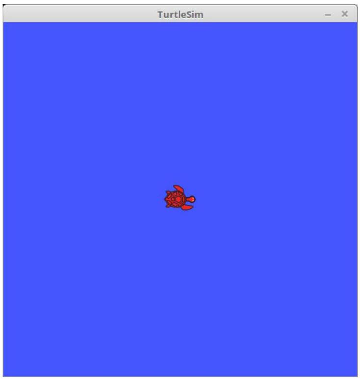
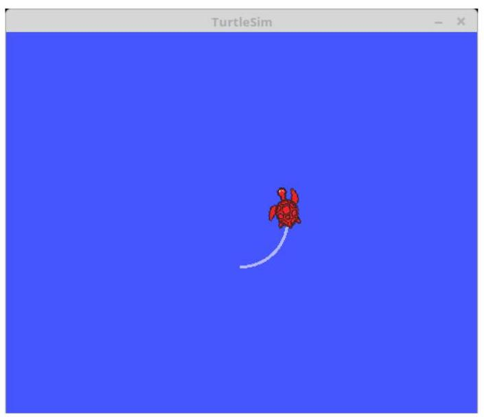
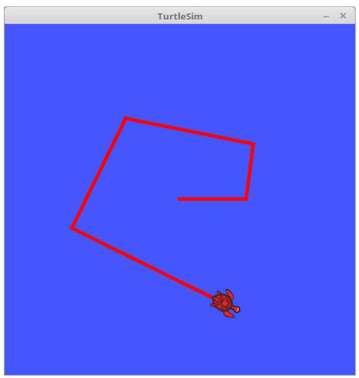
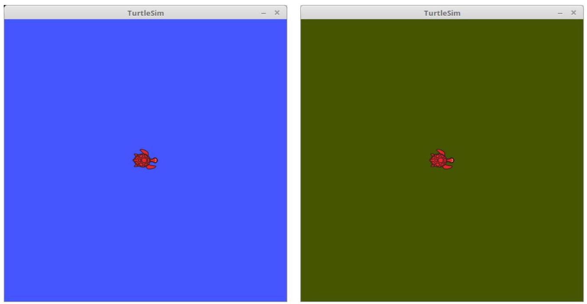
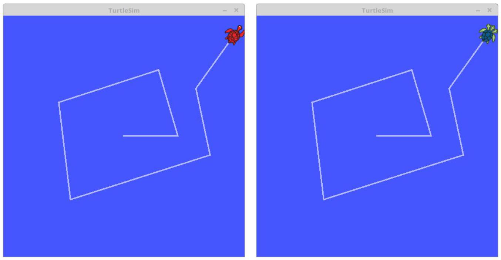

# 第5章 ROS 命令

## 5.1. ROS命令概述

ROS 维基

ROS命令在http://wiki.ros.org/ROS/CommandLineTools上的维基页面上有详细描述。另外，在 https://github.com/ros/cheatsheet/releases的存储库中，总结了本章中的一些重要命令。这些是本章内容的有用的辅助资料。

ROS可以通过在shell环境中输入命令来进行文件系统的使用、源代码编辑、构建、调试和功能包管理等。为了正确使用ROS，除了基本的Linux命令之外，还需要熟悉ROS专用命令。

为了熟练掌握ROS的各种命令，我们对每个命令的功能进行了简单的描述，并给出了例子。在介绍每条命令时，考虑到使用的频率和重要性，标了星级评分。虽然很难从一开始就很熟练地使用所有的命令，但是随着使用的次数增多，读者会发现越来越方便快捷地使用各个ROS命令。

**ROS shell 命令**

<table><tr><td>命令</td><td>重要度</td><td>命令释义</td><td>详细说明</td></tr><tr><td>roscd</td><td>★★★</td><td>ros+cd(changes directory)</td><td>移动到指定的ROS功能包目录</td></tr><tr><td>rosls</td><td>★☆☆</td><td>ros+ls(lists files)</td><td>显示ROS功能包的文件和目录</td></tr><tr><td>rosed</td><td>★☆☆</td><td>ros+ed(editor)</td><td>编辑ROS功能包的文件</td></tr><tr><td>roscp</td><td>★☆☆</td><td>ros+cp(copies files)</td><td>复制ROS功能包的文件</td></tr><tr><td>rospd</td><td>☆☆☆☆</td><td>ros+pushd</td><td>添加目录至ROS目录索引</td></tr><tr><td>rosd</td><td>☆☆☆☆</td><td>ros+directory</td><td>显示ROS目录索引中的目录</td></tr></table>

**ROS执行命令**

<table><tr><td>命令</td><td>重要度</td><td>命令释义</td><td>详细说明</td></tr><tr><td>roscore</td><td>★★★</td><td>ros+core</td><td>master(ROS名称服务)+ rosout(日志记录)+ parameter server(参数管理)</td></tr><tr><td>rosrun</td><td>★★★</td><td>ros+run</td><td>运行节点</td></tr><tr><td>roslaunch</td><td>★★★</td><td>ros+launch</td><td>运行多个节点及设置运行选项</td></tr><tr><td>rosclean</td><td>★★☆</td><td>ros+clean</td><td>检查或删除ROS日志文件</td></tr></table>

**ROS信息命令**

<table><tr><td>命令</td><td>重要度</td><td>命令释义</td><td>详细说明</td></tr><tr><td>rostopic</td><td>★★★</td><td>ros+topic</td><td>确认ROS话题信息</td></tr><tr><td>rosservice</td><td>★★★</td><td>ros+service</td><td>确认ROS服务信息</td></tr><tr><td>rosnode</td><td>★★★</td><td>ros+node</td><td>确认ROS节点信息</td></tr><tr><td>rosparam</td><td>★★★</td><td>ros+param(parameter)</td><td>确认和修改ROS参数信息</td></tr><tr><td>rosbag</td><td>★★★</td><td>ros+bag</td><td>记录和回放ROS消息</td></tr><tr><td>rosmsg</td><td>★★☆</td><td>ros+msg</td><td>显示ROS消息类型</td></tr><tr><td>rossrv</td><td>★★☆</td><td>ros+srv</td><td>显示ROS服务类型</td></tr><tr><td>rosversion</td><td>★☆☆</td><td>ros+version</td><td>显示ROS功能包的版本信息</td></tr><tr><td>roswtf</td><td>☆☆☆</td><td>ros+wtf</td><td>检查ROS系统</td></tr></table>

**ROS catkin命令**

<table><tr><td>命令</td><td>重要度</td><td>详细说明</td></tr><tr><td>catkin_create_pkg</td><td>★★★</td><td>自动生成功能包</td></tr><tr><td>catkin_make</td><td>★★★</td><td>基于catkin构建系统的构建</td></tr><tr><td>catkin_eclipse</td><td>★★☆</td><td>对于用catkin构建系统生成的功能包进行修改，使其能在 Eclipse环境中使用</td></tr><tr><td>catkin_prepare_release</td><td>★★☆</td><td>发布时用到的日志整理和版本标记</td></tr><tr><td>catkin_generate_changelog</td><td>★★☆</td><td>在发布时生成或更新CHANGELOG.rst文件</td></tr><tr><td>catkin_init_workspace</td><td>★★☆</td><td>初始化catkin构建系统的工作目录</td></tr><tr><td>catkin_find</td><td>★☆☆</td><td>搜索catkin</td></tr></table>

**ROS功能包命令**

<table><tr><td>命令</td><td>重要度</td><td>命令释义</td><td>详细说明</td></tr><tr><td>rospack</td><td>★★★</td><td>ros+pack(age)</td><td>查看与ROS功能包相关的信息</td></tr><tr><td>rosinstall</td><td>★★☆</td><td>ros+install</td><td>安装ROS附加功能包</td></tr><tr><td>rosdep</td><td>★★☆</td><td>ros+dep(endencies)</td><td>安装该功能包的依赖性文件</td></tr><tr><td>roslocate</td><td>☆☆☆</td><td>ros+locate</td><td>ROS功能包信息相关命令</td></tr><tr><td>roscreate-pkg</td><td>☆☆☆☆</td><td>ros+create-pkg</td><td>自动生成ROS功能包(用于旧的rosbuild系统)</td></tr><tr><td>rosmake</td><td>☆☆☆☆</td><td>ros+make</td><td>构建 ROS功能包(用于旧的rosbuild系统)</td></tr></table>

## 5.2.ROS shell 命令

ROS shell命令又被称为rosbash ${}^{1}$ 。这使我们可以在ROS开发环境中使用Linux中常用的bash shell命令。我们主要使用前缀是ros且带有多种后缀的命令，例如cd、pd、 d、ls、ed、cp和run。相关命令如下。

<table><tr><td>命令</td><td>重要度</td><td>命令释义</td><td>详细说明</td></tr><tr><td>roscd</td><td>★★★</td><td>ros+cd(changes directory)</td><td>移动到指定的ROS功能包目录</td></tr><tr><td>rosls</td><td>★☆☆</td><td>ros+el(lists files)</td><td>显示ROS功能包的文件和目录</td></tr><tr><td>rosed</td><td>★☆☆</td><td>ros+ed(editor)</td><td>编辑ROS功能包的文件</td></tr><tr><td>roscp</td><td>★☆☆</td><td>ros+cp(copies files)</td><td>复制ROS功能包的文件</td></tr><tr><td>rospd</td><td>☆☆☆☆</td><td>ros+pushd</td><td>添加目录至ROS目录索引</td></tr><tr><td>rosd</td><td>☆☆☆☆</td><td>ros+directory</td><td>显示ROS目录索引</td></tr></table>

我们来看看其中相对常见的roscd、rosls和rosed命令。

三

**ROS shell命令的使用环境**

想要使用ROS shell命令，需要用以下命令安装rosbash，并且只能在设置了source /opt/ros/<ros distribution>/setup.bash的终端窗口中可以使用。这不需要单独安装，只要完成了第3章的ROS开发环境的搭建，则可以使用它。

\$ sudo apt-get install ros-<ros distribution>-rosbash

### 5.2.1. roscd:移动ROS目录

**roscd [功能包名称]**

这是一个移动到保存有功能包的目录的命令。该命令的基本用法是在roscd命令之后将功能包名称写入参数。在以下示例中, turtlesim功能包位于安装ROS的目录中, 但是, 如果将创建的功能包名称(例如，在第4章中创建的my_first_ros_pkg)作为参数， 则会移至您指定的功能包的目录。这是在使用基于命令行的ROS时常用的命令。

---

1 http://wiki.ros.org/rosbash

---

---

\$rosed turtlesim

/opt/ros/kinetic/share/turtlesim\$

\$rosedmy_first_ros_pkg

	~/catkin_ws/src/my_first_ros_pkg\$

---

请注意, 要运行此示例并获得相同的结果, 必须安装相关功能包ros-kinetic-turtlesim。如果未安装，请使用以下命令进行安装。

---

\$ sudo apt-get install ros-kinetic-turtlesim

---

如果已经安装，将可以看到如下所示的功能包的消息。

---

	\$ sudo apt-get install ros-kinetic-turtlesim

		[sudo] password for USER:

	Reading package lists... Done

	Building dependency tree

	Reading state information... Done

ros-kinetic-turtlesim is already the newest version (0.7.1-0xenial-20170613-170649-0800).

	ros-kinetic-turtlesim set to manually installed.

0 upgraded, 0 newly installed, 0 to remove and 18 not upgraded.

---

### 5.2.2. rosls:ROS文件列表

---

rosls [功能包名称]

---

该命令查看指定的ROS功能包的文件列表。您可以使用roscd命令移动到功能包，然后使用正常的ls命令执行相同的功能，但有时需要立即查看。实际中并不经常使用。

---

\$ rosls turtlesim

cmake images msg srv package.xml

---

### 5.2.3. rosed:ROS编辑命令

---

rosed [功能包名称] [文件名称]

---

该命令用于编辑功能包中的特定文件。运行时，它会用用户设置的编辑器打开文件。 用于快速修改相对简单的内容。这时用到的编辑器可以在 ~/.bashrc文件中进行指定， 如: export EDITOR= 'emacs -nw'。如前所述，它用于需要在命令窗口中直接修改的简单任务，因此不推荐用于除此之外的编写程序的任务。这不是一个经常使用的命令。

\$ rosed turtlesim package.xml

## 5.3. ROS执行命令

ROS执行命令管理ROS节点的运行。最重要的是, roscore被用作节点之间的名称服务器。执行命令是rosrun和roslaunch。rosrun运行一个节点，当运行多个节点或设置各种选项时使用roslaunch。rosclean是删除节点执行时记录的日志的命令。

<table><tr><td>命令</td><td>重要度</td><td>命令释义</td><td>详细说明</td></tr><tr><td>roscore</td><td>★★★</td><td>ros+core</td><td>master (ROS名称服务) + rosout (日志记录) + parameter server(参数管理)</td></tr><tr><td>rosrun</td><td>★★★</td><td>ros+run</td><td>运行节点</td></tr><tr><td>roslaunch</td><td>★★★</td><td>ros+launch</td><td>运行多个节点或设置运行选项</td></tr><tr><td>rosclean</td><td>★★☆</td><td>ros+clean</td><td>检查或删除ROS日志文件</td></tr></table>

### 5.3.1. roscore:运行roscore

roscore [选项]

roscore命令会运行主节点, 主节点管理节点之间的消息通信中的连接信息。主节点是使用ROS时必须首先被运行的必要元素。ROS 主节点由roscore运行命令来驱动, 并作为XMLRPC服务器运行。主节点接收多种信息的注册，如节点的名称、话题和服务名称、消息类型、URI地址和端口号，并在收到节点的请求时将此信息通知给其他节点。此外，会运行rosout ${}^{2}$ ，这个命令用于记录ROS中使用的ROS标准输出日志，例如DEBUG、 INFO、WARN、ERROR和FATAL。它还运行一个管理参数的参数服务器。

---

2 http://wiki.ros.org/roscpp/Overview/Logging

---

当执行roscore时, 将用户设置的ROS_MASTER_URI作为主URI, 并且驱动主节点。如第3章ROS配置中介绍, 用户可以在~/.bashrc设置ROS_MASTER_URI。

---

\$ roscore

		... logging to /home/pyo/.ros/log/c2d0b528-6536-11e7-935b-08d40c80c500/roslaunch-pyo-20002.log

Checking log directory for disk usage. This may take awhile.

Press Ctrl-C to interrupt

Done checking log file disk usage. Usage is <1GB.

started roslaunch server http://localhost:43517/

ros_comm version 1.12.7

SUMMARY

__________

	PARAMETERS

							*/rosdistro: kinetic

							*/rosversion: 1.12.7

NODES

auto-starting new master

process[master]: started with pid [20013]

ROS_MASTER_URI=http://localhost:11311/

setting /run_id to c2d0b528-6536-11e7-935b-08d40c80c500

process[rosout-1]: started with pid [20027]

started core service [/rosout]

---

从结果可以看出如下信息:日志保存在/home/xxx/.ros/log/目录中；可以使用 [Ctrl+c]退出roscore; roslaunch server、ROS_MASTER_URI等信息；/rosdistro和/ rosversion的参数服务器; /rosout节点正在运行。

**Log 保存位置**

在上面的运行结果中，保存日志的位置是 “/home/xxx/.ros/log/” ，但实际上它被记录在设置ROS_ HOME环境变量的地方。如果ROS_HOME环境变量未设置，则默认值为 “~/.ros/log/”。

### 5.3.2. rosrun:运行ROS节点

rosrun [功能包名称] [节点名称]

rosrun 是执行指定的功能包中的一个节点的命令。以下例子运行turtlesim功能包的 turtlesim_node节点。请注意，屏幕上出现的乌龟图标是随机选择并运行的。

---

\$ rosrun turtlesim turtlesim_node

	[INFO] [1499667389.392898079]: Starting turtlesim with node name/turtlesim

[INFO] [1499667389.399276453]: Spawning turtle [turtle1] at x=[5.544445], y=[5.544445], theta=[0.000000]

---

图 5-1 运行turtlesim_node节点的画面

### 5.3.3. roslaunch:运行多个ROS节点

---

roslaunch [功能包名称] [launch文件名]

---

roslaunch是运行指定功能包中的一个或多个节点或设置执行选项的命令。通过运行openni_launch功能包，可以运行20个以上的节点和10个以上的参数服务器，如 camera_nodelet_manager、depth_metric、depth_metric_rect和depth_points。

因此, 使用launch文件启动的方式对于运行多个节点非常有用, 这是ROS中常用的执行方法。有关创建 “*.launch” 文件的更多信息，请参阅第7.6节 roslaunch用法。

---

\$ roslaunch openni_launch openni.launch

~省略~

---

请注意, 要运行此示例并获得相同的结果, 必须安装相关功能包ros-kinetic-openni-launch。如果未安装，请使用以下命令进行安装。

---

\$ sudo apt-get install ros-kinetic-openni-launch

---

### 5.3.4. rosclean:检查及删除ROS日志

---

rosclean [选项]

---

该命令检查或删除ROS日志文件。在运行roscore时，对所有节点的记录都会写入日志文件，随着时间的推移，需要定期使用rosclean命令删除这些记录。

以下是检查日志使用情况的示例。

---

	\$ rosclean check

320K ROS node logs $\rightarrow$ 意味着ROS日志一共占320KB

---

当运行roscore时, 如果显示以下警告信息, 则意味着日志文件超过1GB, 如果用户觉得会让系统不堪重负，请使用rosclean命令将其删除。

---

WARNING: disk usage in log directory [/xxx/.ros/log] is over 1GB.

---

以下是删除ROS日志存储库(笔者是/home/rt/.ros/log)的所有日志的示例。如果要删除它，请按y按钮将其删除。

---

	\$ rosclean purge

Purging ROS node logs.

PLEASE BE CAREFUL TO VERIFY THE COMMAND BELOW!

Okay to perform:

rm-rf /home/pyo/.ros/log

	(y/n)?

---

## 5.4. ROS信息命令

ROS信息命令用于识别话题、服务、节点和参数等信息。尤其是rostopic、 rosservice、rosnode和rosparam经常被使用，并且rosbag是ROS的主要特征之一，它具有记录数据和回放功能，务必要掌握。

<table><tr><td>命令</td><td>重要度</td><td>命令释义</td><td>详细说明</td></tr><tr><td>rostopic</td><td>★★★</td><td>ros+topic</td><td>确认ROS话题信息</td></tr><tr><td>rosservice</td><td>★★★</td><td>ros+service</td><td>确认ROS服务信息</td></tr><tr><td>rosnode</td><td>★★★</td><td>ros+node</td><td>确认ROS节点信息</td></tr><tr><td>rosparam</td><td>★★★</td><td>ros+param(parameter)</td><td>确认和修改ROS参数信息</td></tr><tr><td>rosbag</td><td>★★★</td><td>ros+bag</td><td>记录和回放ROS消息</td></tr><tr><td>rosmsg</td><td>★★☆</td><td>ros+msg</td><td>显示ROS消息类型</td></tr><tr><td>rossrv</td><td>★★☆</td><td>ros+srv</td><td>显示ROS服务类型</td></tr><tr><td>rosversion</td><td>★☆☆</td><td>ros+version</td><td>显示ROS功能包的版本信息</td></tr><tr><td>roswtf</td><td>☆☆☆☆</td><td>ros+wtf</td><td>检查ROS系统</td></tr></table>

### 5.4.1. 运行节点

我们将使用下面的命令，利用ROS提供的turtlesim来了解相关的节点、话题和服务。在使用ROS信息命令进行测试之前，需要做好以下准备工作。

**运行roscore**

为确保顺利进行，关闭所有以前运行的终端。然后打开一个新的终端并运行以下命令。

\$ roscore

为了运行turtlesim功能包中的turtlesim_node节点，打开一个新的终端并运行以下命令。这将从turtlesim功能包运行turtlesim_node。用户会在一个蓝色的屏幕上看到乌龟。

---

\$ rosrun turtlesim turtlesim_node

---

**运行turtlesim功能包中的turtle_teleop_key节点**

打开一个新的终端并运行以下命令。这将在turtlesim功能包中运行turtle_teleop_ key。一旦执行，可以在该终端窗口上，用键盘上的方向键控制乌龟。请自己尝试。当您按下方向键时, 屏幕上的乌龟会移动, 这是一个简单的仿真, 但这是将驱动机器人所需的移动速度 $\left( {\mathrm{m}/\mathrm{s}}\right)$ 和旋转速度 $\left( {\mathrm{{rad}}/\mathrm{s}}\right)$ 用消息传送的。有关消息的更多信息和用法，请参阅第4.2节“消息通信”和第7章“ROS编程基础”。

\$ rosrun turtlesim turtle_teleop_key

### 5.4.2. rosnode: ROS节点

首先，我们需要了解节点(node)，所以先复习4.1的术语。

<table><tr><td>命令</td><td>详细说明</td></tr><tr><td>rosnode list</td><td>查看活动的节点列表</td></tr><tr><td>rosnode ping [节点名称]</td><td>与指定的节点进行连接测试</td></tr><tr><td>rosnode info [节点名称]</td><td>查看指定节点的信息</td></tr><tr><td>rosnode machine [PC名称或IP]</td><td>查看该PC中运行的节点列表</td></tr><tr><td>rosnode kill [节点名称]</td><td>停止指定节点的运行</td></tr><tr><td>rosnode cleanup</td><td>删除失连节点的注册信息</td></tr></table>

**rosnode list:列出正在运行中的所有节点**

这是列出连接到roscore的所有节点的命令。如果已经运行了roscore和之前准备好的节点 (turtlesim_node, turtle_teleop_key), 则可以看到终端中列出了用于在 roscore进行日志记录的rosout，以及teleop_turtle和turtlesim节点。

---

	\$ rosnode list

/rosout

/teleop_turtle

/turtlesim

---

**节点运行及实际节点的名称**

在前面的例子中运行的节点是turtlesim_node和turtle_teleop_key。rosnode list列表中有teleop_ turtle和turtlesim的原因是运行的节点名称与实际节点名称不同。例如，turtle_teleop_key节点在源文件中设置为 "ros :: init(argc, argv, "teleop_turtle");"。笔者建议使可执行节点的名称等于实际的节点名称。

**rosnode ping [节点名称]:与指定的节点进行连接测试**

以下是测试turtlesim节点是否确实连接到当前使用的计算机。如果已连接, 它将从节点收到XMLRPC响应，如下所示。

---

	\$ rosnode ping / turtlesim

	rosnode: node is [/turtlesim]

pinging / turtlesim with a timeout of 3.0s

xmlrpc reply from http://192.168.1.100:45470/time=0.377178ms

---

如果在该节点运行出现问题或通信中断，则显示以下错误消息。

---

ERROR: connection refused to [http://192.168.1.100:55996/]

---

**rosnode info [节点名称]:检查指定节点的信息**

使用rosnode info命令可以查看指定节点的信息。基本上, 用户可以检查发布者、订阅者和服务等。此外，还可以检查关于节点运行URI和话题输入/输出的信息。由于会显示大量信息，因此省略了内容，所以请务必亲自运行。

---

\$ rosnode info /turtlesim

Node [/turtlesim] Publications:

				*/turtle1/color_sensor[turtlesim/Color]

～省略～

---

**rosnode机器[PC名称或IP]:查看此PC上运行的所有节点**

您可以看到指定设备(PC或终端)上运行的所有节点。

---

	\$ rosnode machine 192.168.1.100

/rosout

/teleop_turtle

/turtlesim

---

**rosnode kill [节点名称]:终止指定节点的运行**

这是一个终止正在运行的节点的命令。您可以在运行节点的终端窗口中使用[Ctrl+c] 直接终止节点, 但也可以指定要结束的的节点, 如下所示。

---

	\$ rosnode kill /turtlesim

killing/turtlesim

	killed

---

如果使用该命令终止了节点，则会在运行该节点的终端窗口上显示如下警告消息，并关闭该节点。

---

	[WARN] [1499668430.215002371]: Shutdown request received.

[WARN] [1499668430.215031074]: Reason given for shutdown: [user request]

---

**rosnode cleanup:删除无法验证连接信息的虚拟节点的注册信息**

删除连接信息未被确认的虚拟节点的注册信息。当节点由于意外事件而异常终止时, 该命令将从节点目录中删除连接中断的节点。这个命令很少使用，但是它非常有用，因为用户不需要重新运行roscore。

---

\$ rosnode cleanup

---

### 5.4.3. rostopic: ROS话题

首先，让我们参考第4.1节 "ROS术语"，因为我们需要了解话题。

<table id="cross-table-1"><tr><td>命令</td><td>详细说明</td></tr><tr><td>rostopic list</td><td>显示活动的话题目录</td></tr><tr><td>rostopic echo [话题名称]</td><td>实时显示指定话题的消息内容</td></tr><tr><td>rostopic find [类型名称]</td><td>显示使用指定类型的消息的话题</td></tr><tr></tr><tr><td>rostopic type [话题名称]</td><td>显示指定话题的消息类型</td></tr><tr><td>rostopic bw [话题名称]</td><td>显示指定话题的消息带宽(bandwidth)</td></tr><tr><td>rostopic hz [话题名称]</td><td>显示指定话题的消息数据发布周期</td></tr><tr><td>rostopic info [话题名称]</td><td>显示指定话题的信息</td></tr><tr><td>rostopic pub [话题名称] [消息类型] [参数]</td><td>用指定的话题名称发布消息</td></tr></table>

在运行ROS话题示例之前, 请先关闭所有节点。通过在不同的终端窗口中分别运行以下命令来运行turtlesim_node和turtle_teleop_key。

---

	\$ roscore

\$ rosrun turtlesim turtlesim_node

\$ rosrun turtlesim turtle_teleop_key

---

**rostopic list:列出活动话题**

rostopic list命令显示当前正在发送和接收的所有话题的列表。

---

	\$ rostopic list

	/rosout

	/rosout_agg

/turtle1/cmd_vel

/turtle1/color_sensor

/turtle1/pose

---

通过将 "-v" 选项添加到rostopic list命令，可以分开发布话题和订阅话题，并将每个话题的消息类型一起显示。

---

	\$ rostopic list -v

Published topics:

* /turtle1/color_sensor[turtlesim/Color] 1 publisher

* /turtle1/cmd_vel[geometry_msgs/Twist] 1 publisher

* /rosout [rosgraph_msgs/Log] 2 publishers

* /rosout_agg [rosgraph_msgs/Log] 1 publisher

		* /turtle1/pose [turtlesim/Pose] 1 publisher

Subscribed topics:

	* /turtle1/cmd_vel [geometry_msgs/Twist] 1 subscriber

* /rosout [rosgraph_msgs/Log] 1 subscriber

---

**rostopic echo [话题名称]:实时显示指定话题的消息内容**

以下示例实时显示组成/turtle1/pose话题的x、y、theta、linear_velocity和 angular_velocity的数据。

---

\$ rostopic echo / turtle 1/pose

x: 5.35244464874

y: 5.544444561

	theta: 0.0

linear_velocity: 0.0

	angular_velocity: 0.0

		~省略~

---

**rostopic find [类型名称]:显示使用指定类型的消息的话题**

---

\$ rostopic find turtlesim/Pose

/turtle1/pose

---

rostopic type [话题名称]:显示指定话题的消息类型

---

\$ rostopic type / turtle1/pose

turtlesim/Pose

---

**rostopic bw [话题名称]:显示指定话题的消息数据带宽(bandwidth)**

在以下示例中，用于/turtle1/pose话题的数据带宽平均为每秒1.27 KB。

---

\$ rostopic bw/turtle1/pose

subscribed to [/turtle1/pose]

average: 1.27KB/s

mean: 0.02KB min: 0.02KB max: 0.02KB window: 62...

~省略~

---

**rostopic hz [话题名称]:显示指定话题的消息数据发布周期**

在以下示例中, 用户可以检查/turtle1/pose数据的发布周期。从结果可以看出, 该消息以大约62.5Hz(0.016秒= 16毫秒)的频率被发布。

---

	\$ rostopic hz / turtle1/pose

	subscribed to [/turtle1/pose]

	average rate: 62.502

min: 0.016s max: 0.016s std dev: 0.00005s window: 62

---

**rostopic info [话题名称]:显示指定话题的信息**

在以下示例中，用户可以看到/turtle1/pose话题使用turtlesim/Pose消息类型，发布到/turtlesim节点，并且没有实际订阅的话题。

---

\$ rostopic info/turtle1/pose

Type: turtlesim/Pose

Publishers:

					*/turtlesim(http://192.168.1.100:42443/)

Subscribers: None

---

**rostopic pub [话题名称] [消息类型] [参数]:使用指定的话题名称发布消息**

以下是使用/turtle1/cmd_vel话题名称发布类型为geometry_msgs/Twist的消息的示例。

\$ rostopic pub-1 /turtle1/cmd_vel geometry_msgs/Twist-- '[2.0,0.0,0.0]' '[0.0,0.0,1.8]' publishing and latching message for 3.0 seconds

每个选项的描述如下。

• -1只发布一次消息(实际上只运行一次，但会像以前的结果一样运行3秒)。

- /turtle1/cmd_vel 指定的话题名称

- geometry_msgs/Twist 要发布的消息类型名称

- - "[2.0, 0.0, 0.0]" '[0.0, 0.0, 1.8]' 在x轴坐标上以每秒2.0 m的速度移动，以z轴为中心，每秒旋转 1.8rad

图 5-2 反映了发布的消息的画面

### 5.4.4. rosservice:ROS服务

由于读者需要了解该服务(service)，请参阅第4.1节“ROS术语”。

<table><tr><td>命令</td><td>详细说明</td></tr><tr><td>rosservice list</td><td>显示活动的服务信息</td></tr><tr><td>rosservice info [服务名称]</td><td>显示指定服务的信息</td></tr><tr><td>rosservice type [服务名称]</td><td>显示服务类型</td></tr><tr><td>rosservice find [服务类型]</td><td>查找指定服务类型的服务</td></tr><tr><td>rosservice uri [服务名称]</td><td>显示ROSRPC URI服务</td></tr><tr><td>rosservice args [服务名称]</td><td>显示服务参数</td></tr><tr><td>rosservice call [服务名称] [参数]</td><td>用输入的参数请求服务</td></tr></table>

在运行ROS服务相关例子之前先关闭所有节点。通过在不同的终端窗口中运行以下命令来运行turtlesim_node和turtle_teleop_key。

---

\$ roscore

\$ rosrun turtlesim turtlesim_node

\$ rosrun turtlesim turtle_teleop_key

---

**rosservice list:显示活动的服务信息**

显示活动中的服务的信息。会显示在同一网络中使用的所有服务。

---

	\$ rosservice list

	/clear

	/kill

	/reset

	/rosout

	/get_loggers

	/rosout

	/set_logger_level

	/spawn

/teleop_turtle/get_loggers

	/teleop_turtle/set_logger_level

	/turtle1/set_pen

/turtle1/teleport_absolute

/turtle1/teleport_relative

/turtlesim/get_loggers

/turtlesim/set_logger_level

---

**rosservice info [服务名称]:显示指定服务的信息**

以下是使用rosservice的info选项查看/turtle1/set_pen服务的节点名称、URI、类型和参数的示例。

---

	\$ rosservice info/turtle1/set_pen

Node: /turtlesim

URI: rosrpc://192.168.1.100:34715

	Type: turtlesim/SetPen

Args: rgb width off

---

**rosservice type [服务名称]:显示服务类型**

在以下示例中，可以看到/turtle1/set_pen服务是turtlesim/SetPen类型。

---

\$ rosservice type / turtle1/set_pen

	turtlesim/SetPen

---

**rosservice find [服务类型]:查找指定服务类型的服务**

以下示例搜索turtlesim/SetPen类型的服务。因此, 可以看到搜索出/turtle1/ set_pen。

---

\$ rosservice find turtlesim/SetPen

/turtle1/set_pen

---

**rosservice uri [服务名称]:显示ROSRPC uri服务**

用户也可以使用rosservice的uri选项来检查/turtle1/set_pen服务的ROSRPC URI, 如下所示:

---

\$ rosservice uri /turtle1/set_pen

rosrpc://192.168.1.100:50624

---

**rosservice args [服务名称]:服务参数输出**

我们来看看/turtle1/set_pen服务的每个参数，如下例所示，该命令显示在/turtle1/ set_pen服务中使用r、g、b、width和off参数。

---

	\$ rosservice args / turtle1/set_pen

rgbwidth off

---

**rosservice call [服务名称] [参数]:用输入的参数服务请求**

以下示例是请求/turtle1/set_pen服务的命令。所使用的 “255 0 0 5 0” 是对应于用于/turtle1/set_pen服务的参数(r, g, b, width, off)的值。红色的r的最大值是255, 因为g和b都是0，所以笔的颜色是红色的。width设置为5，off为0(假)。rosservice call是一个非常有用的命令，通常用于测试服务。

---

\$ rosservice call /turtle1/set_pen 255 0 0 5 0

---

通过使用前面的命令，发送了服务请求，更改了turtlesim中使用的笔的属性，并且从turtle_teleop_key中下达了下移命令。作为结果，可以从下面图中看到原来是白色的笔色显示为红色。

图 5-3 rosservice call 示例

### 5.4.5. rosparam:ROS参数

由于读者需要了解这些参数，请参阅第4.1节“ROS术语”。

<table><tr><td>命令</td><td>详细说明</td></tr><tr><td>rosparam list</td><td>查看参数列表</td></tr><tr><td>rosparam get [参数名称]</td><td>获取参数值</td></tr><tr><td>rosparam set [参数名称]</td><td>设置参数值</td></tr><tr><td>rosparam dump [文件名称]</td><td>将参数保存到指定文件</td></tr><tr><td>rosparam load [文件名称]</td><td>获取保存在指定文件中的参数</td></tr><tr><td>rosparam delete [参数名称]</td><td>删除参数</td></tr></table>

在运行ROS参数相关示例之前先关闭所有节点。通过在不同的终端窗口中运行以下命令来运行turtlesim_node和turtle_teleop_key。

---

	\$ roscore

\$ rosrun turtlesim turtlesim_node

\$ rosrun turtlesim turtle_teleop_key

---

**rosparam list:查看参数列表**

显示在同一网络中使用的参数列表。

---

	\$rosparamlist

	/background_b

/background_g

/background_r

/rosdistro

/roslaunch/uris/host_192_168_1_100__39536

/rosversion

/run_id

---

**rosparam get [参数名称]:获取参数值**

如果要查看特定参数的值，可以将该参数名称指定为rosparam get命令的选项。

---

	\$ rosparam get /background_b

255

---

如果要检查所有参数的值，而不是某一特定的参数，可以使用 “/” 作为选项来显示所有参数的值，如下所示。

---

	\$ rosparam get /

background_b: 255

background_g: 86

background_r: 69

	rosdistro: 'kinetic'

	roslaunch:

								uris: \{host_192_168_1_100_43517: 'http://192.168.1.100:43517/'\}

	rosversion: '1.12.7'

run_id: c2d0b528-6536-11e7-935b-08d40c80c500

---

**rosparam dump [文件名]:将参数保存到指定的文件**

以下示例将当前参数值保存到parameters.yaml文件中。因为它保存了每次使用的参数值，并且可以在下次执行时使用(“~/”表示用户的home目录)，所以很方便。

---

\$ rosparam dump ~/parameters.yaml

---

rosparam set [参数名称]:设置参数值

这是设置参数值的命令。在以下示例中，将turtlesim节点的background_b参数 (与背景色相关的参数) 设置为0。

\$ rosparam set background_b 0

\$ rosservice call clear

RGB从255,86,69变为0,86,69, 所以变成深绿色, 如图5-4右图所示。但是, 由于 turtlesim节点并不是每次读取参数，因此需要使用 “rosparam set background_b 0” 命令修改参数之后，用 “rosservice call clear” 命令刷新屏幕。参数的反映结果决于节点的运行方式。

图 5-4 rosparam set 示例

**rosparam load [文件名称]:将参数保存到指定的文件**

此命令与rosparam dump相反, 是读取parameters.yaml文件并将其用作当前参数值。如下例所示，运行 "rosservice call clear" 命令，参数值将会变为所加载的文件的参数值, 并且在执行dump命令时, 图5-4中变为绿色的背景将变为蓝色背景。rosparam load是一个非常有用的命令，会经常使用，读者需要掌握。

---

\$rosparam load ~/parameters.yaml

\$ rosservice call clear

---

**rosparam delete [参数名称]:删除参数**

该命令删除指定的参数。

---

\$ rosparam delete /background_b

---

### 5.4.6. rosmsg: ROS消息信息

由于读者需要了解消息(message)，所以我们参考第4.1节“ROS术语”。

<table><tr><td>命令</td><td>详细说明</td></tr><tr><td>rosmsg list</td><td>显示所有消息</td></tr><tr><td>rosmsg show [消息名称]</td><td>显示指定消息</td></tr><tr><td>rosmsg md5 [消息名称]</td><td>显示md5sum</td></tr><tr><td>rosmsg package [功能包名称]</td><td>显示用于指定功能包的所有消息</td></tr><tr><td>rosmsg packages</td><td>显示使用消息的所有功能包</td></tr></table>

在运行ROS消息信息示例之前, 先关闭所有节点。通过在不同的终端窗口中运行以下命令来运行turtlesim_node和turtle_teleop_key。

---

\$ roscore

\$ rosrun turtlesim turtlesim_node

\$ rosrun turtles im turtle_teleop_key

---

**rosmsg list:显示所有消息**

该命令显示当前ROS中安装的功能包的所有消息。根据当前ROS中包含的功能包，显示结果可能会有所不同。

---

\$rosmsglist

actionlib/TestAction

actionlib/TestActionFeedback

actionlib/TestActionGoal

actionlib/TestActionResult

actionlib/TestFeedback

actionlib/TestGoal

	sensor_msgs/Joy

	sensor_msgs/JoyFeedback

	sensor_msgs/JoyFeedbackArray

sensor_msgs/LaserEcho

zeroconf_msgs/DiscoveredService

	～省略～

---

**rosmsg show [消息名称]:显示指定的消息信息**

显示指定的消息信息。以下是显示turtlesim/Pose消息信息的例子。float32是一个浮点变量，可以确认它是一个包含5条信息(x、y、theta、linear_velocity和angular_ velocity)的消息。

---

\$ rosmsg show turtlesim/Pose

	float32 x

float32 y

float32 theta

	float32 linear_velocity

	float32 angular_velocity

---

**rosmsg md5 [消息名称]:显示md5sum**

以下是查看turtlesim/Pose消息的md5信息的示例。有时如果在消息通信期间遇到 MD5问题，则需要检查md5sum。这时会用到该命令，一般不常用。有关md5sum的解释，请参见第4.1节“ROS术语”。

---

	\$ rosmsg md5 turtlesim/Pose

863b248d5016ca62ea2e895ae5265cf9

---

**rosmsg package [功能包名称]:显示用于指定功能包的所有消息**

可以看到特定功能包中使用的消息。

---

\$ rosmsg package turtlesim

turtlesim/Color

turtlesim/Pose

---

rosmsg packages:显示使用消息的所有功能包

<table><tr><td>\$ rosmsg packages</td></tr><tr><td>actionlib</td></tr><tr><td>actionlib_msgs</td></tr><tr><td>actionlib_tutorials</td></tr><tr><td>base_local_planner</td></tr><tr><td>bond</td></tr><tr><td>control_msgs</td></tr><tr><td>costmap_2d</td></tr><tr><td>~省略~</td></tr></table>

### 5.4.7. rossrv:ROS服务信息

因为读者需要了解服务，所以请参考4.1节 “ROS术语” 中的服务(service)。

<table><tr><td>命令</td><td>详细说明</td></tr><tr><td>rossrv list</td><td>显示所有服务</td></tr><tr><td>rossrv show [服务名称]</td><td>显示指定的服务信息</td></tr><tr><td>rossrv md5 [服务名称]</td><td>显示md5sum</td></tr><tr><td>rossrv package [功能包名称]</td><td>显示指定的功能包中用到的所有服务</td></tr><tr><td>rossrv packages</td><td>显示使用服务的所有功能包</td></tr></table>

在运行ROS服务信息相关示例之前, 先关闭所有节点。通过在不同的终端窗口中运行以下命令来运行turtlesim_node和turtle_teleop_key。

---

	\$ roscore

	\$ rosrun turtlesim turtlesim_node

\$ rosrun turtlesim turtle_teleop_key

---

**rossrv list:显示所有服务**

该命令显示了ROS上当前安装的功能包的所有服务。根据目前包含在ROS中的功能包, 显示结果可能会有所不同。

---

	\$rossrvlist

	control_msgs/QueryCalibrationState

	control_msgs/QueryTrajectoryState

diagnostic_msgs/SelfTest

dynamic_reconfigure/Reconfigure

gazebo_msgs/ApplyBodyWrench

gazebo_msgs/ApplyJointEffort

gazebo_msgs/BodyRequest

gazebo_msgs/DeleteModel

	～省略～

---

**rossrv show [服务名称]:显示指定服务的信息**

以下示例显示turtlesim/SetPen服务信息。可以确认uint8是包含r、g、b、width 和off等5种信息的服务。请注意，“___”在服务文件中用作请求和响应的分隔符。对于 turtlesim/SetPen，用户可以看到只有请求，没有任何响应。对于服务文件，参见4.3节的说明和7.3节的例子。

---

\$ rossrv show turtlesim/SetPen

uint8 r

	uint8 g

	uint8 b

uint8 width

uint8 off

---

---

**rossrv md5 [服务名称]:显示md5sum**

在以下示例中，使用该命令来查看turtlesim/SetPen服务的md5信息。有时如果在服务请求和响应期间遇到MD5问题，则需要检查md5sum。这时会用到该命令，一般不常用。

---

	\$ rossrv md5 turtlesim/SetPen

9f452acce566bf0c0954594f69a8e41b

---

**rossrv package [功能包名称]:显示用于指定功能包的所有服务**

可以看到指定功能包中用到的服务。

---

\$ rossrv package turtlesim

turtlesim/Kill

turtlesim/SetPen

turtlesim/Spawn

	turtlesim/TeleportAbsolute

	turtlesim/TeleportRelative

---

rossrv packages:显示使用服务的所有功能包

---

\$ rossrv packages

	control_msgs

diagnostic_msgs

dynamic_reconfigure

gazebo_msgs

map_msgs

nav_msgs

navfn nodelet

	oroca_ros_tutorials

	roscpp

sensor_msgs

	std_srvs

	tf

		tf2_msgs

	turtlesim

	~省略~

---

### 5.4.8. rosbag:ROS日志信息

如第4.1节 “ROS术语” 中所述，在ROS中用bag格式保存各种消息，并在需要时将其回放, 以便我们可以重现以前的情况。rosbag是一个实现生成、播放和压缩等功能的程序, 它具有以下几种功能。

<table><tr><td>命令</td><td>详细说明</td></tr><tr><td>rosbag record [选项] [话题名称]</td><td>将指定话题的消息记录到bag文件</td></tr><tr><td>rosbag info [文件名称]</td><td>查看bag文件的信息</td></tr><tr><td>rosbag play [文件名称]</td><td>回放指定的bag文件</td></tr><tr><td>rosbag compress [文件名称]</td><td>压缩指定的bag文件</td></tr><tr><td>rosbag decompress [文件名称]</td><td>解压指定的bag文件</td></tr><tr><td>rosbag filter [输入文件] [输出文件] [选项]</td><td>生成一个删除了指定内容的新的bag文件</td></tr><tr><td>rosbag reindex bag [文件名称]</td><td>刷新索引</td></tr><tr><td>rosbag check bag [文件名称]</td><td>检查指定的bag文件是否能在当前系统中回放</td></tr><tr><td>rosbag fix [输入文件] [输出文件] [选项]</td><td>将由于版本不同而无法回放的bag文件修改成可以回放的文件</td></tr></table>

在运行ROS日志信息例子之前，先关闭所有节点。通过在不同的终端窗口中运行以下命令来运行turtlesim_node和turtle_teleop_key。

---

	\$ roscore

	\$ rosrun turtlesim turtlesim_node

\$rosrun turtlesim turtle_teleop_key

---

**rosbag record [选项][话题名称]:记录指定话题的消息**

首先，使用rostopic list命令查看ROS网络上当前正在使用的话题列表。

---

\$rostopic list

	/rosout

/rosout_agg

/turtle1/cmd_vel

/turtle1/color_sensor

/turtle1/pose

---

如以下示例所示，把要进行记录的话题作为record命令的选项来输入，则会开始记录于bag文件中。在开始记录之后，在运行turtle_teleop_key节点的终端窗口中用键盘的方向键移动乌龟，则会记录选定的/turtle1/cmd_vel话题。然后按[Ctrl + c]结束记录，则会生成一个文件名为 “2017-07-10-14-16-28.bag” 的bag文件，如下所示。

---

\$ rosbag record / turtle1/cmd_vel

	[INFO] [1499663788.499650818]: Subscribing to /turtle1/cmd_vel

[INFO] [1499663788.502937962]: Recording to 2017-07-10-14-16-28.bag.

---

如果要同时记录所有话题，而不是特定话题，请在命令中添加 “-a” 选项。

\$ rosbag record -a

[WARN] [1499664121.243116836]: --max-splits is ignored without --split

[INFO] [1499664121.248582681]: Recording to 2017-07-10-14-22-01.bag.

[INFO] [1499664121.248879947]: Subscribing to /turtle1/color_sensor

[INFO] [1499664121.252689657]: Subscribing to /rosout

[INFO] [1499664121.257219911]: Subscribing to /rosout_agg

[INFO] [1499664121.260671283]: Subscribing to /turtle1/pose

**rosbag info [bag文件名]:查看bag文件的信息**

用户可以检查bag文件的信息。以下示例记录了/turtle1/cmd_vel话题，共记录了373 条消息。使用的消息类型是geometry_msgs/Twist。此外，还可以检查路径，bag版本和时间等信息。

---

	\$ rosbag info 2017-07-10-14-16-28.bag

path: $\;{2017} - {07} - {10} - {14} - {16} - {28}$ .bag

version: 2.0

duration: $\;{17.4}\mathrm{s}$

start: Jul 10 2017 14:16:30.36 (1499663790.36)

end: Jul 10 2017 14:16:47.78 (1499663807.78)

	size: $\;{44.5}\mathrm{\;{KB}}$

	messages: 373

		compression: none [1/1 chunks]

types: geometry_msgs/Twist [9f195f881246fdfa2798d1d3eebca84a]

topics: /turtle1/cmd_vel 373msgs :geometry_msgs/Twist

---

**rosbag play [bag文件名]:回放指定的bag文件**

下面的例子是一个回放之前记录的2017-07-10-14-16-28.bag文件的命令。如此一来, 当时记录的/turtle1/cmd_vel消息会原原本本地传输，因此在屏幕上可以看到乌龟移动的情况。但是, 只有重新执行turtlesim_node, 使得优先初始化机器人轨迹和机器人位置, 才可以获得与图5-5中相同的结果。

---

---

\$ rosbag play 2017-07-10-14-16-28.bag

[INFO] [1499664453.406867251]: Opening 2017-07-10-14-16-28.bag

---

---

---

Waiting 0.2 seconds after advertising topics... done.

Hit space to toggle paused, or 's' to step.

	[RUNNING] Bag Time: 1499663790.357031 Duration: 0.000000 / 17.419737

	[RUNNING] Bag Time: 1499663790.357031 Duration: 0.000000 / 17.419737

	[RUNNING] Bag Time: 1499663790.357163 Duration: 0.000132 / 17.419737

	～省略～

---

如下图所示, 可以看到回放的数据与原始数据相同。

图 5-5 rosbag play 示例

**rosbag compress [bag文件名]:压缩指定的bag文件**

短时间记录的bag文件因为不是很大，所以不成问题，但是长时间记录数据时，bag 文件会占用大量的硬盘存储空间。如果使用本例中使用的命令对其进行压缩，则将占用很小的存储空间。

---

	\$ rosbag compress 2017-07-10-14-16-28.bag

	2017-07-10-14-16-28.bag 0% 0.0 KB 00:00

2017-07-10-14-16-28.bag 100% 35.0 KB 00:00

---

如下所示，前面的例子中的bag文件被缩减为1/4。压缩前的原始文件会以文件名添加 "orig" 的文件另行存储。

**rosbag decompress [bag文件名]:对指定的bag文件解压**

要解压缩，则需使用如下命令。这个命令会将文件恢复到压缩之前的状态。

---

	\$ rosbag decompress 2017-07-10-14-16-28.bag

2017-07-10-14-16-28.bag 0% 0.0 KB 00:00

2017-07-10-14-16-28.bag 100% 35.0 KB 00:00

---

## 5.5.ROS catkin命令

ROS的catkin命令用于使用catkin 构建系统来构建功能包。

<table><tr><td>命令</td><td>重要度</td><td>详细说明</td></tr><tr><td>catkin_create_pkg</td><td>★★★</td><td>自动生成功能包</td></tr><tr><td>catkin_make</td><td>★★★</td><td>基于catkin 构建系统的构建</td></tr><tr><td>catkin_eclipse</td><td>★★☆</td><td>把用catkin 构建系统生成的功能包修改，使得可以在Eclipse 环境中使用</td></tr><tr><td>catkin_prepare_release</td><td>★★☆</td><td>发布时用到的日志整理和版本标记</td></tr><tr><td>catkin_generate_changelog</td><td>★★☆</td><td>发布时生成或更新CHANGELOG.rst文件</td></tr><tr><td>catkin_init_workspace</td><td>★★☆</td><td>初始化catkin 构建系统的工作目录</td></tr><tr><td>catkin_find</td><td>★☆☆</td><td>搜索catkin</td></tr></table>

**catkin_create_pkg:自动生成功能包**

catkin_create_pkg [功能包名称] [依赖性功能包1] [依赖性功能包2] ...

catkin_create_pkg是创建一个包含CMakeLists.txt和package.xml文件的空功能包的命令。有关ROS的构建系统的更多信息，请参考第4.9节。以下例子显示了使用catkin_ create_pkg命令创建一个依赖于roscpp和std_msgs的my_package功能包。

---

\$ catkin_create_pkg my_package rosp std_msgs

---

catkin_make:基于catkin 构建系统的构建

---

catkin_make [选项]

---

catkin_make是构建用户创建的功能包或构建下载的功能包的命令。以下示例是构建 ~/catkin_ws/src目录中所有功能包的示例。

---

\$cd ~/catkin_ws

\$ catkin_make

---

如果要只构建一部分功能包，而不是全部功能包，请使用 “--pkg [包名]” 选项来运行, 如下所示:

---

\$ catkin_make --pkg user_ros_tutorials

---

catkin_eclipse:将以catkin构建系统生成的功能包修改成可以在Eclipse环境中使用的功能包

Eclipse是集成开发环境 (IDE) 之一, 而catkin_eclipse命令用于构建一个可以使用Eclipse来管理和编程功能包的环境。这将为Eclipse创建一个~/catkin_ws/ build/. cproject和~/catkin_ws/build/.project等项目文件。您可以通过从Eclipse菜单中选择 [Makefile Project with Existing Code]并选择~/catkin_ws/build/来管理Eclipse中~/ catkin_ws/src中的所有功能包。

---

\$cd ~/catkin_ws

	\$ catkin_eclipse

---

**catkin_generate_changelog:生成CHANGELOG.rst文件**

catkin_generate_changelog命令在更新功能包的版本时创建一个描述更新记录的 CHANGE LOG.rst文件。

**catkin_prepare_release:准备发布时用到的更新记录和版本标记**

catkin_prepare_release是用于更新由catkin_generate_changelog命令生成的 CHANGELOG.rst文件的命令。在把创建的功能包注册到官方ROS存储库或更新功能包的版本时，会使用catkin_generate_changelog和catkin_prepare_release命令。

catkin_init_workspace:初始化catkin构建系统的工作目录

catkin_init_workspace是初始化用户工作目录(~/catkin_ws/src)的命令。如3.1 节所述，除了特殊情况外，这个命令在ROS安装期间只执行一次。

---

	\$ cd ~/catkin_ws/src

\$ catkin_init_workspace

---

catkin_find:搜索catkin，找到并显示工作空间

catkin_find是一个显示各项目的工作目录的命令。

---

catkin_find [功能包名称]

---

用户可以通过运行catkin_find命令来找出正在使用的所有工作目录。此外, 如果执行 “catkin_find [功能包名称]”，则会看到选项中指定的与功能包相关的工作目录，如下所示。

---

	\$ catkin_find

/home/pyo/catkin_ws/devel/include

/home/pyo/catkin_ws/devel/lib

/home/pyo/catkin_ws/devel/share

	/opt/ros/kinetic/bin

/opt/ros/kinetic/etc

/opt/ros/kinetic/include

/opt/ros/kinetic/lib

/opt/ros/kinetic/share

---

\$ catkin_find turtlesim

/opt/ros/kinetic/include/turtlesim

/opt/ros/kinetic/lib/turtlesim

/opt/ros/kinetic/share/turtlesim

## 5.6. ROS功能包命令

ROS功能包命令用于操作ROS功能包，比如显示功能包信息、安装相关功能包，等。

<table><tr><td>命令</td><td>重要度</td><td>命令释义</td><td>详细说明</td></tr><tr><td>rospack</td><td>★★★</td><td>ros+pack(age)</td><td>显示与ROS功能包相关的信息</td></tr><tr><td>rosinstall</td><td>★★☆</td><td>ros+install</td><td>安装ROS附加功能包</td></tr><tr><td>rosdep</td><td>★★☆</td><td>ros+dep(endencies)</td><td>安装该功能包的依赖性文件</td></tr><tr><td>roslocate</td><td>☆☆☆</td><td>ros+locate</td><td>与ROS功能包信息有关的命令</td></tr><tr><td>roscreate-pkg</td><td>☆☆☆☆</td><td>ros+create-pkg</td><td>自动生成ROS功能包(用于旧的rosbuild系统)</td></tr><tr><td>rosmake</td><td>☆☆☆☆</td><td>ros+make</td><td>构建ROS功能包(用于旧的rosbuild系统)</td></tr></table>

**rospack:显示指定的ROS功能包的相关信息**

rospack [选项] [功能包名称]

rospack是一个命令，用于显示与指定的ROS功能包相关的信息，如存储位置、依赖关系和整个功能包列表。可以使用find、list、depends-on、depends和profile等选项。如果在rospack查找命令之后指定了功能包名称，会显示该功能包的存储位置，如以下示例所示。

---

	\$ rospack find turtlesim

/opt/ros/kinetic/share/turtlesim

---

rospack list命令显示PC上的所有功能包。用户可以结合rospack list命令与Linux搜索命令grep来轻松找到该功能包。例如, “rospack list | grep turtle”将显示所有功能包中只与turtle相关的功能包。

---

	\$ rospacklist

	actionlib /opt/ros/kinetic/share/actionlib

	actionlib_msgs /opt/ros/kinetic/share/actionlib_msgs

	actionlib_tutorials /opt/ros/kinetic/share/actionlib_tutorials

amcl /opt/ros/kinetic/share/amcl

angles /opt/ros/kinetic/share/angles

base_local_planner /opt/ros/kinetic/share/base_local_planner

bf1/opt/ros/kinetic/share/bf1

	\$rospacklist|grepturtle

turtle_actionlib/opt/ros/kinetic/share/turtle_actionlib

turtle_tf/opt/ros/kinetic/share/turtle_tf

turtle_tf2/opt/ros/kinetic/share/turtle_tf2

turtlesim/opt/ros/kinetic/share/turtlesim

---

如果在rospack depends-on命令之后指定了一个功能包名称，则仅显示使用指定功能包的功能包列表，如以下示例所示。

---

\$ rospack depends-on turtlesim

turtle_tf2

turtle_tf

	turtle_actionlib

---

如果在rospack depends命令之后指定了功能包名称，则会看到运行该功能包所需的依赖性功能包的列表, 如以下示例所示。

---

\$ rospack depends turtlesim

cpp_common

rostime

roscpp_traits

roscpp_serialization

genmsg

genpy

message_runtime

std_msgs

geometry_msgs

	catkin

	gencpp

	genlisp

message_generation

rosbuild

rosconsole

rosgraph_msgs

xmlrpcpp

roscpp

rospack

roslib

std_srvs

---

rospack profile命令通过检查存储功能包的工作目录(例如 “/opt/ros/kinetic/ share”或“~/catkin_ws/src”)和功能包的信息来重建功能包索引。当新添加的功能包使用 “roscd” 等时, 在列表中没有显示时可以使用该命令来更新索引。

\$ rospack profile

Full tree crawl took 0.021790 seconds.

Directories marked with (*) contain no manifest. You may

want to delete these directories.

To get just of list of directories without manifests,

re-run the profile with --zombie-only

0.020444 /opt/ros/kinetic/share

0.000676 /home/pyo/catkin_ws/src

0.000606 /home/pyo/catkin_ws/src/ros_tutorials

0.000240 * /opt/ros/kinetic/share/OpenCV-3.2.0-dev

0.000054 */opt/ros/kinetic/share/OpenCV-3.2.0-dev/haarcascades

0.000035 */opt/ros/kinetic/share/doc

0.000020 */opt/ros/kinetic/share/OpenCV-3.2.0-dev/lbpcascades

0.000008 */opt/ros/kinetic/share/doc/liborocos-kdl

**rosinstall:安装ROS附加功能包**

rosinstall是一个自动安装或更新由源代码管理软件(SCM，如SVN、Mercurial、 Git和Bazaar)管理的ROS包的命令。一旦像3.1节那样运行它一次，之后当功能包有更新时，会自动安装需要的功能包或更新。

rosdep:安装该功能包的依赖性文件

rosdep [选项]

rosdep是安装指定功能包的依赖性文件的命令。选项包括check、install、init和 update。如下例所示，执行 "rosdep check [功能包名]"，会检查指定功能包的依赖关系。执行 "rosdep install package name", 将安装指定功能包的依赖功能包。还有 "rosdep init" 和 "rosdep update"，但请参阅第3.1节的实际用法。

---

		\$ rosdep check turtlesim

All system dependencies have been satisified

\$ rosdep install turtlesim

All required rosdeps installed successfully

---

**roslocate:显示ROS功能包的信息**

roslocate [选项] [功能包名称]

roslocate是显示功能包相关信息的命令，例如功能包正在使用的ROS的版本、SCM 类型和存储库位置等。可用的选项是info、vcs、type、uri和repo等。在这里，我们来看看一次显示所有这些信息的info。

---

	\$ roslocate info turtlesim

Using ROS_DISTRO: kinetic

	- git:

	local-name: turtlesim

	uri: https://github.com/ros/ros_tutorials.git

	version: kinetic-devel

---

**roscreate-pkg:自动生成ROS功能包(用于旧的rosbuild系统)**

roscreate-pkg是一个像catkin_create_pkg命令一样自动创建一个功能包的命令。该命令是在catkin构建系统之前的旧的rosbuild系统中使用的命令。它被保留仅仅是为了版本兼容性，现在基本不会用到。

**rosmake:构建ROS功能包(用于旧的rosbuild系统)**

rosmake是一个像catkin_make命令一样构建功能包的命令。该命令是在catkin构建系统之前的旧的rosbuild系统中使用的命令。它被保留仅仅是为了版本兼容性，现在基本不会用到。
