# 第7章 ROS 编程基础

目前为止，我们算是学习了ROS的概略，现在开始让我们学习真正的ROS编程吧。之前的内容中出现最多的词是消息、话题、服务、动作和参数。这是因为他们是ROS的核心。作为最小执行单元的节点通过消息通信在节点之间交换I/O消息, 此时使用的方法是话题、服务、动作和参数。在本章中，我们通过实例来了解ROS编程。

## 7.1. ROS编程前须知事项

### 7.1.1. 标准单位

对ROS中所使用的消息 (message), 推荐使用世界上最广泛运用的标准单位 SI。为了确保这一点, REP-0103 ${}^{1}$ 也明确了各物理量的单位。例如, 长度 (Length) 使用米(merter)、质量(Mass)使用千克(Kilogram)、时间(Time)使用秒(Second)、电流(Current)使用安培(Ampere)、角度(Angle)使用弧度 (Radian) 、频率 (Frequency) 使用赫兹 (Hertz) 、力 (Force) 使用牛顿 (Newton)、功率(Power)使用瓦(Watt)、电压(Voltage)使用伏特(Volt)、 温度(Temperature)使用摄氏度(Celsius)。其他所有单位都是这些单位的组合。

例如, 平移速度以米/秒表示, 旋转速度以弧度/秒表示。消息鼓励重用ROS提供的方式, 但也可以根据需要使用用户全新定义的新的类型的消息。然而, 消息用到的单位却必须要遵守使用SI单位，这是为了让其他用户使用这种消息的时候不需要转换单位。

<table><tr><td>物理量</td><td>单位</td></tr><tr><td>Length</td><td>Meter</td></tr><tr><td>Mass</td><td>Kilogram</td></tr><tr><td>Time</td><td>Second</td></tr><tr><td>Current</td><td>Ampere</td></tr><tr><td>Angle</td><td>Radian</td></tr></table>

<table><tr><td>物理量</td><td>单位</td></tr><tr><td>Frequency</td><td>Hertz</td></tr><tr><td>Force</td><td>Newton</td></tr><tr><td>Power</td><td>Watt</td></tr><tr><td>Voltage</td><td>Volt</td></tr><tr><td>Temperature</td><td>Celsius</td></tr></table>

---

1 http://www.ros.org/reps/rep-0103.html

---

REP (ROS Enhancement Proposals) REP是一份建议书，它的内容包含由用户们在ROS社区提出的规则、新功能和管理方法。它用于以民主方式创建ROS的规则的情况，还用于在协商ROS的开发、运营和管理所需的内容的情况。收到建议书后，许多ROS用户可以查看，并通过互相协商继续修改。REP就是通过这样的过程成为ROS标准文档的。REP文件的目录可以在http://www.ros.org/reps/rep-0000.html找到。

### 7.1.2. 坐标表现方式

如图7-1左侧所示，ROS中的旋转轴 ${}^{2}$ 使用x，y和z轴。正面是x轴的正方向，轴是红色 (R) 。左边是y轴的正方向，轴用绿色 (G) 表示。最后，上方是z轴的正方向，轴用蓝色 (B) 表示。为了便于记忆, 您可以将x轴视为食指, 将y轴视为中指, 将z轴视为拇指。顺序是x、y、z，且颜色是RGB颜色顺序。

机器人的旋转方向是右手定则 ${}^{3}$ ，用右手卷住的方向是正(+)方向。例如，如果机器人在原地从12点钟方向开始向9点方向旋转，则由于旋转角度的单位用弧度，所以我们说机器人在z轴上旋转+1.5708弧度。

这种坐标表示法在ROS编程中经常使用, 必须以x: forward, y: left, z: up的形式进行编程。

图 7-1 x, y, z轴坐标系和右手定则

---

2 http://www.ros.org/reps/rep-0103.html#coordinate-frame-conventions

3 http://en.wikipedia.org/wiki/Right-hand_rule

---

### 7.1.3. 编程规则

为了最大化每个程序的源代码的可重用性，ROS指定了编程风格指南，并建议开发者遵守该指南。这减少了开发人员在处理源代码时频繁发生的额外的选项，也提高了其他协作开发人员和用户们的代码理解程度, 并降低了他们之间的代码分析难度。这不是一个要求, 但为了代码共享, 笔者想鼓励ROS的许多用户遵守这一规则。

编程规则在wiki (C++ ${}^{4}$ , Python ${}^{5}$ ) 中按各个编程语言有详细解释。下面的表格中整理了基本的命名规则 ${}^{6}$ ，在开始ROS编程之前熟悉这些吧。

<table><tr><td>对象</td><td>命名规则</td><td>举例</td></tr><tr><td>功能包</td><td>under_scored</td><td>Ex) first_ros_package</td></tr><tr><td>话题、服务</td><td>under_scored</td><td>Ex) raw_image</td></tr><tr><td>文件</td><td>under_scored</td><td>Ex) turtlebot3_fake.cpp</td></tr><tr><td colspan="3">注意，使用ROS消息和服务时，放置在/msg和/srv目录中的消息、服务和动作文件的名称遵循CamelCased 规则。这是因为*.msg、*.srv和*.action被转换为头文件后用作结构体和数据类型(例如TransformStamped. msg，SetSpeed.srv)。</td></tr><tr><td>命名空间</td><td>under_scored</td><td>Ex) ros_awesome_package</td></tr><tr><td>变量</td><td>under_scored</td><td>Ex) string table_name;</td></tr><tr><td>数据类型</td><td>CamelCased</td><td>Ex) typedef int32_t PropertiesNumber;</td></tr><tr><td>类</td><td>CamelCased</td><td>Ex) class UrlTable</td></tr><tr><td>结构体</td><td>CamelCased</td><td>Ex) struct UrlTableProperties</td></tr><tr><td>枚举型</td><td>CamelCased</td><td>Ex) enum ChoiceNumber</td></tr><tr><td>函数</td><td>camelCased</td><td>Ex) addTableEntry();</td></tr><tr><td>函数方法</td><td>camelCased</td><td>Ex) void setNumEntries(int32_t num_entries)</td></tr><tr><td>常数</td><td>ALL_CAPITALS</td><td>Ex) const uint8_t DAYS_IN_A_WEEK = 7;</td></tr><tr><td>宏定义</td><td>ALL_CAPITALS</td><td>Ex) #define PI_ROUNDED 3.0</td></tr></table>

---

http://wiki.ros.org/CppStyleGuide

http://wiki.ros.org/PyStyleGuide

http://wiki.ros.org/ROS/Patterns/Conventions#Naming_ROS_Resources

---

## 7.2. 发布者节点和订阅者节点的创建和运行

ROS消息通信中使用的发布者 (Publisher) 和订阅者 (Subscriber) 可以被发送和接收所代替。在ROS中, 发送端称为发布者, 接收端称为订阅者。本节旨在创建一个简单的msg文件，并创建和运行发布者和订阅者节点。

### 7.2.1. 创建功能包

以下命令是创建ros_tutorials_topic功能包的命令。这个功能包依赖于message_ generation、std_msgs和roscpp功能包, 因此将这些用作依赖选项。第二行命令意味着将使用创建新的功能包时用到的message_generation表示将使用创建新消息的功能包 std_msgs (ROS标准消息功能包) 和roscpp (在ROS中使用C/C ++的客户端程序库)必须在创建功能包之前安装。用户可以在创建功能包时指定这些相关的功能包设置, 但也可以在创建功能包之后直接在package.xml中修改。

---

	\$ cd ~/catkin_ws/src

\$ catkin_create_pkg ros_tutorials_topic message_generation std_msgs roscpp

---

创建功能包时，将在~/catkin_ws/src目录中创建ros_tutorials_topic功能包目录，并在该功能包目录中创建ROS功能包的默认目录和CMakeLists.txt和package.xml文件。 可以使用下面的ls命令检查它，并使用基于GUI的Nautilus(类似Windows资源管理器)来检查功能包的内部。

---

\$ cd ros_tutorials_topic

\$ 1s

include 	$\rightarrow$ 头文件目录

src 	→ 源代码目录

CMakeLists.txt 	→构建配置文件

package.xml 	→ 功能包配置文件

---

### 7.2.2. 修改功能包配置文件

ROS的必备配置文件package.xml是一个包含功能包信息的XML文件，其中包含用于描述功能包名称、作者、许可证和依赖包的信息。使用以下命令，利用编辑器 (gedit、vim、emacs等)打开文件，并修改它以匹配当前节点。

---

\$ gedit package.xml

---

以下代码显示如何修改package.xml文件以匹配我们这次要创建功能包。笔者的个人信息包含在如下文件内容中，您可以修改它，以适应您的需求。有关每个选项的详细说明, 请参见第4.9节。

ros_tutorials_topic/package.xml

<?xml version="1.0"?>

<package>

<name>ros_tutorials_topic</name>

<version>0.1.0</version>

<description>R0S tutorial package to learn the topic</description>

<license>Apache License 2.0</license>

<author email="pyo@robotis.com">Yoonseok Pyo</author>

<maintainer email="pyo@robotis.com">Yoonseok Pyo</maintainer>

<url type="bugtracker">https://github.com/R0B0TIS-GIT/ros_tutorials/issues</url>

<url type="repository">https://github.com/ROBOTIS-GIT/ros_tutorials.git</url>

<url type="website">http://www.robotis.com</url>

<buildtool_depend>catkin</buildtool_depend>

<build_depend>roscp</build_depend>

<build_depend>std_msgs</build_depend>

<build_depend>message_generation</build_depend>

<run_depend>roscpp</run_depend>

<run_depend>std_msgs</run_depend>

<run_depend>message_runtime</run_depend>

<export></export>

</package>

### 7.2.3. 修改构建配置文件(CMakeLists.txt)

ROS的构建系统catkin基本上使用CMake，它在功能包目录中的CMakeLists.txt文件中描述了构建环境。该文件设置可执行文件的创建、依赖包优先构建、链接创建等。

\$ gedit CMakeLists.txt

以下是为了匹配正在创建的功能包而修改的CMakeLists.txt。同样, 有关每个选项的详细说明, 请参见第4.9节。

cmake_minimum_required(VERSION 2.8.3)

project(ros_tutorials_topic)

##catkin构建时需要的组件包。

##是依赖包，是message_generation、std_msgs和roscpp。

##如果这些功能包不存在，在构建过程中会发生错误。

find_package(catkin REQUIRED COMPONENTS message_generation std_msgs roscpp)

##消息声明:MsgTutorial.msg

add_message_files(FILESMsgTutorial.msg)

##这是设置依赖性消息的选项。

##如果未安装std_msgs，则在构建过程中会发生错误。

generate_messages(DEPENDENCIES std_msgs)

##catkin功能包选项，描述了库、catkin构建依赖项和系统依赖的功能包。

catkin_package(   )

LIBRARIES ros_tutorials_topic

CATKIN_DEPENDS std_msgs roscpp

)

##设置包含目录。

include_directories(\$\{catkin_INCLUDE_DIRS\})

##topic_publisher节点的构建选项。

##配置可执行文件、目标链接库和其他依赖项。

add_executable(topic_publisher src/topic_publisher.cpp)

add_dependencies(topic_publisher \$\{\$\{PROJECT_NAME\}_EXPORTED_TARGETS\} \$\{catkin_EXPORTED_TARGETS\})

target_link_libraries(topic_publisher \$\{catkin_LIBRARIES\})

##topic_subscriber节点的构建选项。

add_executable(topic_subscriber src/topic_subscriber.cpp)

add_dependencies(topic_subscriber \$\{\$\{PROJECT_NAME\}_EXPORTED_TARGETS\} \$\{catkin_EXPORTED_TARGETS\}) target_link_libraries(topic_subscriber \$\{catkin_LIBRARIES\})

### 7.2.4. 创建消息文件

在上述的CMakeLists.txt文中添加了如下选项。

---

add_message_files(FILES MsgTutorial.msg)

---

这意味着在构建时要包含消息MsgTutorial.msg，该消息将在此节点中被使用。现在我们还没有创建MsgTutorial.msg，因此按以下顺序创建它:

---

\$ roscd ros_tutorials_topic 	$\rightarrow$ 移动到功能包目录

\$ mkdirmsg 	→功能包中创建新的msg消息目录

\$ cdmsg 	→转到创建的msg目录

\$ gedit MsgTutorial.msg 	→ 创建新的MsgTutorial.msg文件并修改内容

---

内容很简单。如下所示, 创建一个time消息类型的stamp消息和一个int32消息类型的data消息, 除了这些消息类型之外, 还有一些如bool、int8、int16、float32、 string、time、duration和common_msgs等基本消息类型 ${}^{7}$ ，以及在ROS中收集常用消息的common_msgs ${}^{8}$ 。这里我们只是为了创建一个简单的例子，因此用了time和 int32。

ros_tutorials_topic/msg/MsgTutorial.msg

time stamp

int32 data

一消息(msg、srv、action)功能包的独立化

一般情况下，建议将消息文件msg和服务文件srv制作成一个只包含消息文件的单独的包，而不是将其包含在可执行节点中。其原因是, 假设订阅者节点和发布者节点在不同的计算机上运行, 存在的问题是必须安装不必要的节点，因为这两个节点只有在它们具有相互依赖性时才能使用。如果您独立创建消息功能包，则只需将独立于消息的功能包添加到依赖性选项，从而消除功能包之间不必要的依赖关系。但是，在本书中，我们为了简化代码已经将消息文件包含在可执行节点中。

---

7 http://wiki.ros.org/std_msgs

8 http://wiki.ros.org/common_msgs

---

### 7.2.5. 创建发布者节点

在前面的CMakeLists.txt文件中，给了生成以下可执行文件的选项。

add_executable(topic_publisher src/topic_publisher.cpp)

换句话说，是在src目录中构建topic_publisher.cpp文件以创建topic_publisher可执行文件。那么我们按如下顺序创建一个执行发布者节点函数的源代码。

\$ roscd ros_tutorials_topic/src $\rightarrow$ 移至src目录,该目录是功能包的源代码目录

\$ gedit topic_publisher.cpp $\rightarrow$ 新建源文件并修改内容

ros_tutorials_topic/src/topic_publisher.cpp

#include "ros/ros.h" // ROS默认头文件

#include "ros_tutorials_topic/MsgTutorial.h" // MsgTutorial消息头文件(构建后自动生成)

int main(int argc, char **argv) // 节点主函数

\{

ros::init(argc, argv, "topic_publisher"); ros::NodeHandle nh; // 初始化节点名称

// 声明一个节点句柄来与ROS系统进行通信

// 声明发布者，创建一个使用ros_tutorials_topic功能包的MsgTutorial 消息文件的

// 发布者ros_tutorial_pub。话题名称是"ros_tutorial_msg"，

// 消息文件发布者队列(queue)的大小设置为100

ros::Publisher ros_tutorial_pub =

nh.advertise<ros_tutorials_topic::MsgTutorial>("ros_tutorial_msg", 100);

// 设定循环周期。"10"是指10Hz，是以0.1秒间隔重复

ros::Rate loop_rate(10);

ros_tutorials_topic::MsgTutorial msg; // 以MsgTutorial消息文件格式声明一个叫做msg的消息

int count = 0; // 声明要在消息中使用的变量

while (ros::ok())

\{

msg.stamp = ros::Time::now(); // 把当前时间传给msg的下级消息stamp

msg.data = count; // 将变量count的值传给下级消息data

ROS_INFO("send msg = %d", msg.stamp.sec); // 显示stamp.sec消息

ROS_INFO("send msg = %d", msg.stamp.nsec); // 显示stamp.nsec消息

ROS_INFO("send msg = %d", msg.data); // 显示data消息

ros_tutorial_pub.publish(msg); // 发布消息。

loop_rate.sleep(); // 按照上面定义的循环周期进行暂歇

++count; // 变量count增加1

\}

return 0;

\}

### 7.2.6. 创建订阅者节点

在CMakeLists.txt文件中添加以下选项来生成可执行文件。

---

add_executable(topic_subscriber src/topic_subscriber.cpp)

---

也就是说, 通过构建topic_subscriber.cpp文件来创建topic_subscriber可执行文件。我们创建一个按照以下顺序执行订阅节点功能的源代码。

\$ rosed ros_tutorials_topic/src $\rightarrow$ 移动到src目录,该目录是功能包的源代码目录

\$ gedit topic_subscriber.cpp → 创建和修改新的源代码文件

ros_tutorials_topic/src/topic_subscriber.cpp

#include "ros/ros.h" // ROS的默认头文件

#include "ros_tutorials_topic/MsgTutorial.h" // MsgTutorial消息头文件(构建后自动生成)

// 这是一个消息后台函数，

// 此函数在收到一个下面设置的名为ros_tutorial_msg的话题时候被调用。

// 输入的消息是从ros_tutorials_topic功能包接收MsgTutorial消息。

void msgCallback(const ros_tutorials_topic::MsgTutorial::ConstPtr&msg)

\{

---

ROS_INFO("recieve msg = %d", msg->stamp.sec); 			// 显示stamp.sec消息

ROS_INFO("recieve msg = %d", msg->stamp.nsec); 			// 显示stamp.nsec消息

ROS_INFO("recieve msg = %d", msg->data); 			// 显示data消息

\}

int main(int argc, char **argv) 			// 节点主函数

\{

ros::init(argc, argv, "topic_subscriber"); 			// 初始化节点名称

ros::NodeHandle nh; 			// 声明用于ROS系统和通信的节点句柄

// 声明订阅者，创建一个订阅者ros_tutorial_sub,

// 它利用ros_tutorials_topic功能包的的MsgTutorial消息文件。

// 话题名称是"ros_tutorial_msg"，订阅者队列(queue)的大小设为100。

ros::Subscriber ros_tutorial_sub = nh.subscribe("ros_tutorial_msg", 100, msgCallback);

// 用于调用后台函数，等待接收消息。在接收到消息时执行后台函数。

ros::spin();

return 0;

\}

\$cd ~/catkin_ws 	$\rightarrow$ 移动到catkin目录

\$ catkin_make 	$\rightarrow$ 执行catkin构建

---

### 7.2.7. 构建(build)节点

现在使用以下命令在ros_tutorials_topic功能包中构建消息文件、发布者节点和订阅者节点。ros_tutorials_topic功能包的源代码位于 “~/catkin_ws/src/ros_tutorials_ topic/src" 中，而ros_tutorials_topic功能包中的消息文件位于 "~/catkin_ws/src/ros_ tutorials_topic/msg" 中。

基于此的构建将分别在 “~/catkin_ws” 的 “/build” 和 “/devel” 目录中生成文件。“/build”目录中保存catkin构建用到的配置内容，而“/devel/lib/ros_tutorials_ topic'”目录中保存可执行文件。另外，“/devel/include/ros_tutorials_topic”目录存储着从消息文件自动生成的消息头文件。如果您想了解生成文件，请根据目录查看文件。

### 7.2.8. 运行发布者

让我们运行发布者吧。以下是使用rosrun命令运行ros_tutorials_topic功能包的 ros_tutorial_msg_publisher节点的命令。运行节点之前, 请确保要从另一个终端运行 roscore。在以下示例中，即使没有解释，roscore也必须在运行节点之前运行。

---

	\$ roscore

\$ rosrun ros_tutorials_topic topic_publisher

---

运行发布者时, 您会看到如图7-2所示的输出屏幕。但是, 屏幕上显示的内容仅仅是使用ROS专用的ROS_INFO()函数将信息显示在屏幕上，这个函数与常见编程语言中使用的 printf()函数类似。实际上，为了发布话题，您必须使用一个订阅者节点或rostopic等能做订阅者节点角色的命令。

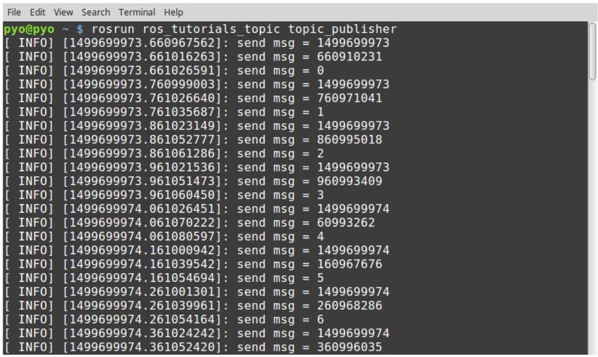

图 7-2 topic_publisher节点的运行画面

下面, 我们使用rostopic命令获取topic_publisher发布的话题吧。首先, 我们来看一下ROS网络当前正在使用的话题列表。通过将list选项添加到rostopic命令来查看是否存在ros_tutorial_msg话题。

---

	\$rostopic list

/ros_tutorial_msg

/rosout

/rosout_agg

---

接下来，让我们看看我们运行的发布者节点发布的消息。换句话说，是检查ros_ tutorial_msg话题消息。您可以看到发布的消息，如图7-3所示。

\$ rostopic echo / ros_tutorial_msg

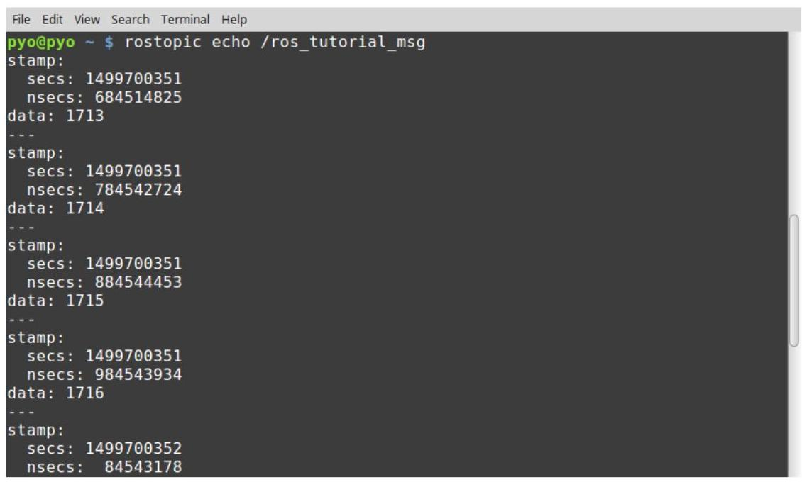

图 7-3 接收ros_tutorial_msg话题的明细

### 7.2.9. 运行订阅者

以下是为了运行订阅者使用ROS节点命令rosrun来运行ros_tutorials_topic功能包的 topic_subscriber节点的过程。

---

\$ rosrun ros_tutorials_topic topic_subscriber

---

当运行订阅者时，可以看到如图7-4所示的输出屏幕。订阅者接收到了发布者发布的 ros_tutorial_msg话题的消息，并在屏幕上显示该值。

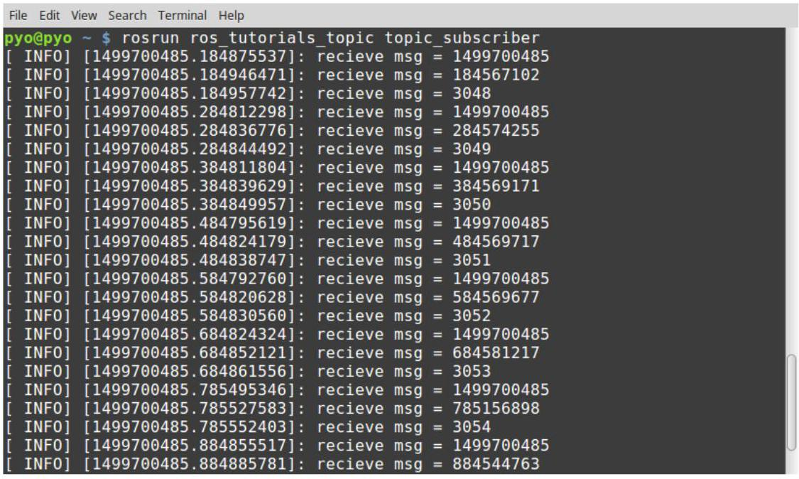

图 7-4 topic_subscriber节点的运行画面

### 7.2.10. 检查运行中的节点的通信状态

让我们用6.2节中介绍的rqt命令来查看运行中的节点的通信状态。您可以使用rqt_ graph或rqt，如下所示。执行rqt时，在菜单中选择[Plugins] $\rightarrow$ [Introspection] $\rightarrow$ [Node Graph]。则如图7-5所示，可以确认当前在ROS上运行的节点和消息。

\$ rqt_graph 或 \$ rqt

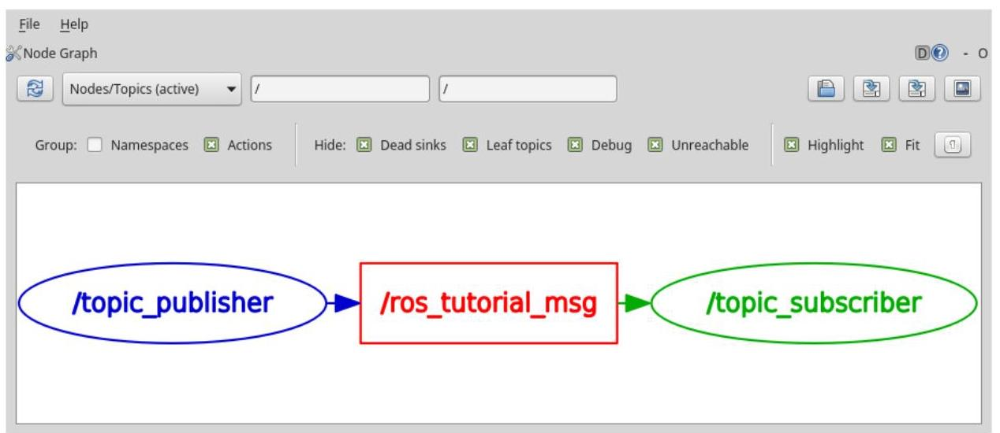

图 7-5 利用rqt_graph看到的两个节点之间的关系

在当前的ROS网络上, 发布者节点 (topic_publisher) 正在传输话题 (ros_ tutorial_msg)，并且可以确认它正在接收订阅者节点(topic_subscriber)。

在本节中, 我们创建了话题中用到的发布者和订阅者节点, 并执行它以了解如何在节点之间进行通信。相关代码可以在以下github地址找到:

---

- https://github.com/ROBOTIS-GIT/ros_tutorials/tree/master/ros_tutorials_topic

---

如果您想马上应用它，可以在 “catkin_ws/src” 目录中用以下命令来克隆源代码， 并进行构建。然后运行topic_publisher和topic_subscriber节点。

---

\$cd ~/catkin_ws/src

\$ git clone https://github.com/ROBOTIS-GIT/ros_tutorials.git

\$ cd ~/catkin_ws

	\$ catkin_make

\$ rosrun ros_tutorials_topic topic_publisher

---

\$ rosrun ros_tutorials_topic topic_subscriber

## 7.3. 创建和运行服务服务器与客户端节点

服务由服务服务器 (service server) 和服务客户端 (service client) 组成，其中服务服务器仅在收到请求(request)时才会响应(response)，而服务客户端则会发送请求并接收响应。与话题不同，服务是一次性消息通信。因此，当服务的请求和响应完成时，两个节点的连接会被断开。

这种服务通常在让机器人执行特定任务时用到。或者用于需要在特定条件下做出反应的节点。由于它是一次性的通信方式, 因此对网络的负载很小, 所以是一种非常有用的通信手段，例如被用作一种代替话题的通信手段。

本节旨在创建一个简单的服务文件，并创建和运行一个服务服务器(server)节点和一个服务客户端(client)节点。

### 7.3.1. 创建功能包

以下命令创建ros_tutorials_service功能包。这个功能包依赖于message_ generation、std_msgs和roscpp功能包, 因此将他们用作依赖性选项。其中, message_generation是用于创建新消息的功能包, std_msgs是ROS的标准消息功能包, roscpp是在ROS中使用C/C++的客户端程序库，这些都必须在创建功能包之前安装好。用户可以在创建功能包时指定这些依赖关系, 但也可以在创建功能包之后直接在 package.xml中对其进行修改。

---

	\$cd ~/catkin_ws/src

\$ catkin_create_pkg ros_tutorials_service message_generation std_msgs roscpp

---

在创建功能包的时候，会在 “~/catkin_ws/src” 目录中生成ros_tutorials_service 功能包目录, 在这个功能包目录中会生成ROS功能包所要配备的默认目录, 以及 CMakeLists.txt和package.xml文件。下面使用ls命令检查内容。

---

\$ cd ros_tutorials_service

\$ 1s

include 	$\rightarrow$ 头文件目录

src 	→源代码目录

CMakeLists.txt 	$\rightarrow$ 构建配置文件

package.xml 	→ 功能包配置文件

---

### 7.3.2. 修改功能包配置文件(package.xml)

ROS所必需的配置文件之一package.xml是一个包含功能包信息的XML文件，它描述了功能包名称、作者、许可证和依赖包。使用以下命令使用编辑器(gedit、vim、 emacs等)打开文件，并修改它，以匹配当前节点。

---

\$ gedit package.xml

---

以下代码显示如何修改package.xml文件以匹配您正在创建的功能包。我的个人信息包含在内容中, 所以请将其更改为您自己的信息。有关每个选项的详细说明, 请参见第 4.9节。

<?xml version="1.0"?>

<package>

<name>ros_tutorials_service</name>

<version>0.1.0</version>

<description>ROS tutorial package to learn the service</description>

<license>Apache License 2.0</license>

<author email="pyo@robotis.com">Yoonseok Pyo</author>

<maintainer email="pyo@robotis.com">Yoonseok Pyo</maintainer>

<url type="bugtracker">https://github.com/ROBOTIS-GIT/ros_tutorials/issues</url>

<url type="repository">https://github.com/ROBOTIS-GIT/ros_tutorials.git</url>

<url type="website">http://www.robotis.com</url>

<buildtool_depend>catkin</buildtool_depend>

<build_depend>roscpp</build_depend>

<build_depend>std_msgs</build_depend>

<build_depend>message_generation</build_depend>

<run_depend>roscpp</run_depend>

<run_depend>std_msgs</run_depend>

<run_depend>message_runtime</run_depend>

<export></export>

</package>

### 7.3.3. 修改构建配置文件(CMakeLists.txt)

ROS的构建系统catkin以CMake为基础, 它在功能包目录中的CMakeLists.txt文件里描述了构建环境。该文件设置可执行文件的创建、依赖包优先构建、链接生成等。 与上述ros_tutorials_topic不同, 如果添加了发布者节点、订阅者节点和msg文件, 则 ros_tutorials_service功能包将添加新的服务服务器节点、服务客户端节点和服务文件 (*.srv) 。

\$ gedit CMakeLists.txt

ros_tutorials_service/CMakeLists.txt

cmake_minimum_required(VERSION 2.8.3)

project(ros_tutorials_service)

##这是进行catkin构建时所需的组件包。

##依赖包是message_generation、std_msgs和roscpp。如果这些包不存在，在构建过程中会发生错误。

find_package(catkin REQUIRED COMPONENTS message_generation std_msgs roscpp)

##服务声明:SrvTutorial.srv

add_service_files(FILES SrvTutorial.srv)

##这是一个设置依赖消息的选项。

##如果未安装std_msgs，则在构建过程中会发生错误。

generate_messages(DEPENDENCIES std_msgs)

##这是catkin功能包选项，它描述了库、catkin构建依赖和依赖系统的功能包。

catkin_package(   )

LIBRARIES ros_tutorials_service

CATKIN_DEPENDS std_msgs roscpp

)

##设置包含目录。

include_directories(\$\{catkin_INCLUDE_DIRS\})

##这是service_server节点的构建选项。

##设置可执行文件、目标链接库和附加依赖项。

add_executable(service_server src/service_server.cpp)

add_dependencies(service_server \$\{\$\{PROJECT_NAME\}_EXPORTED_TARGETS\} \$\{catkin_EXPORTED_TARGETS\})

target_link_libraries(service_server \$\{catkin_LIBRARIES\})

##这是节点的构建选项。

add_executable(service_client src/service_client.cpp)

add_dependencies(service_client \$\{\$\{PROJECT_NAME\}_EXPORTED_TARGETS\} \$\{catkin_EXPORTED_TARGETS\})

target_link_libraries(service_client \$\{catkin_LIBRARIES\})

### 7.3.4. 创建服务文件

CMakeLists.txt文件中加了下面的选项。

---

add_service_files(FILES SrvTutorial.srv)

---

这是在构建本次的节点中使用的SrvTutorial.srv时所包含的内容。现在您还没有创建 SrvTutorial.srv，请按以下顺序创建它。

---

\$ roscd ros_tutorials_service 	$\rightarrow$ 移动到功能包目录

\$ mkdir srv 	$\rightarrow$ 在功能包中创建一个名为srv的新服务目录

\$ cd srv 	→ 转到创建的srv目录

\$ gedit SrvTutorial.srv 	→ 新建和修改SrvTutorial.srv文件

---

内容很简单。让我们以int64格式设计服务请求(request)a、b，和结果服务响应 (response) result, 如下所示。“___”是分隔符，用于分隔请求和响应。除了请求和响应之间有一个分隔符之外, 它与上述话题的消息相同。

ros_tutorials_service/srv/SrvTutorial.srv

int64 a

int64b

---

int64 result

### 7.3.5. 创建服务服务器节点

在CMakeLists.txt文件中添加了如下选项来生成可执行文件。

---

add_executable(service_server src/service_server.cpp)

---

换句话说，是构建service_server.cpp文件来创建service_server可执行文件。我们按以下顺序编写一个具有服务服务器节点功能的程序吧。

\$ roscd ros_tutorials_service/src $\rightarrow$ 移动到功能包的源代码目录src

\$ gedit service_server.cpp → 创建和修改源文件

ros_tutorials_service/src/service_server.cpp

#include "ros/ros.h" // ROS的基本头文件

#include "ros_tutorials_service/SrvTutorial.h" // SrvTutorial服务头文件(构建后自动生成)

// 如果有服务请求，将执行以下处理

// 将服务请求设置为req，服务响应则设置为res。

---

bool calculation(ros_tutorials_service::SrvTutorial::Request &req,

	ros_tutorials_service::SrvTutorial::Response &res)

\{

// 在收到服务请求时，将a和b的和保存在服务响应值中

res.result = req.a + req.b;

// 显示服务请求中用到的a和b的值以及服务响应result值

ROS_INFO("request: x=%ld, y=%ld", (long int)req.a, (long int)req.b);

ROS_INFO("sending back response: %ld", (long int)res.result);

return true;

\}

int main(int argc, char **argv) // 节点主函数

\{

ros::init(argc, argv, "service_server"); // 初始化节点名称

ros::NodeHandle nh; /// 声明节点句柄

// 声明服务服务器

// 声明利用ros_tutorials_service功能包的SrvTutorial服务文件的

// 服务服务器ros_tutorials_service_server

// 服务名称是ros_tutorial_srv，且当有服务请求时，执行calculation函数。

ros::ServiceServer ros_tutorials_service_server = nh.advertiseService("ros_tutorial_srv",

calculation);

ROS_INFO("ready srv server!");

ros::spin(); // 等待服务请求

return 0;

\}

---

### 7.3.6. 创建服务客户端节点

在CMakeLists.txt文件中添加了一个选项来生成可执行文件。

---

add_executable(service_client src/service_client.cpp)

---

换句话说, 是通过构建service_client.cpp文件来创建service_client可执行文件。我们按以下顺序编写一个执行服务客户端节点功能的程序吧。

\$ rosed ros_tutorials_service/src $\rightarrow$ 移动到功能包的源代码目录src

\$ gedit service_client.cpp → 创建和修改源文件

ros_tutorials_service/src/service_client.cpp

#include "ros/ros.h" // ROS的基本头文件

#include "ros_tutorials_service/SrvTutorial.h" // SrvTutorial服务头文件(构建后自动生成)

#include <cstdlib> // 使用atoll函数所需的库

int main(int argc, char **argv) // 节点主函数

\{

ros::init(argc, argv, "service_client"); // 初始化节点名称

if (argc != 3) // 处理输入值错误

\{

ROS_INFO("cmd : rosrun ros_tutorials_service service_client arg0 arg1");

ROS_INFO("arg0: double number, arg1: double number");

return 1;

\}

ros::NodeHandle nh; // 声明与ROS系统通信的节点句柄

// 声明客户端，声明利用ros_tutorials_service功能包的SrvTutorial服务文件的

// 服务客户端ros_tutorials_service_client。

// 服务名称是"ros_tutorial_srv"

ros::ServiceClient ros_tutorials_service_client =

nh.serviceClient<ros_tutorials_service::SrvTutorial>("ros_tutorial_srv");

// 声明一个使用SrvTutorial服务文件的叫做srv的服务

ros_tutorials_service::SrvTutorial srv;

// 在执行服务客户端节点时用作输入的参数分别保存在a和b中

srv.request.a = atoll(argv[1]);

srv.request.b = atoll(argv[2]);

---

													// 请求服务，如果请求被接受，则显示响应值

														if (ros_tutorials_service_client.call(srv))

													\{

																							ROS_INFO("send srv, srv.Request.a and b: %ld, %ld", (long int)srv.request.a, (long int)srv.request.b);

																						ROS_INFO("receive srv, srv.Response.result: %ld", (long int)srv.response.result);

											\}

															else

														\{

																										ROS_ERROR("Failed to call service ros_tutorial_srv");

																										return 1;

										\}

														return 0;

\}

---

### 7.3.7. 构建节点

使用以下命令构建ros_tutorials_service功能包的服务文件、服务服务器节点和客户端节点。ros_tutorials_service功能包的源文件位于 “~/catkin_ws/src/ros_tutorials_ service/src”目录中，服务文件位于“~/catkin_ws/src/ros_tutorials_service/srv”目录中。

\$cd ~/catkin_ws && catkin_make → 转到catkin目录并运行catkin构建

生成的文件位于 “~/catkin_ws/build” 目录和 “~/catkin_ws/devel” 目录。目录 “~/catkin_ws/build” 包含catkin构建中使用的配置，“~/catkin_ws/devel/lib/ros_ tutorials_service”包含可执行文件，“~/catkin_ws/devel/include/ros_tutorials_ service” 保存从消息文件自动生成的服务头文件。如果您想知道这些文件，请进入各自的目录查看。

### 7.3.8. 运行服务服务器

在前一节中编写的服务服务器被设定为一直等待，不做任何处理，直到有服务请求。因此，执行以下命令时，服务服务器将等待服务请求。运行节点之前一定要运行 roscore。

---

\$ roscore

---

### 7.3.9. 运行服务客户端

如果已经运行了服务服务器，请使用以下命令运行服务客户端:

\$ rosrun ros_tutorials_service service_client 2 3

[INFO] [1495726543.277216401]: send srv, srv.Request.a and b: 2, 3

[INFO] [1495726543.277258018]: receive srv, srv.Response.result: 5

从上面编写的代码可知, 在运行服务客户端时输入的执行参数2和3会被作为服务请求值。结果，2和3分别请求服务作为a和b值，后来作为结果值，作为响应值收到了这两者的总和。在这种情况下，它只是用作执行参数，但在实际使用中，可以用指令代替，可以将要计算的值和触发变量用作服务请求值。

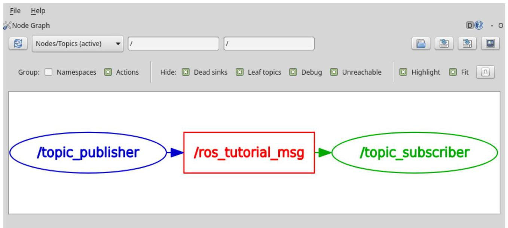

图 7-6 话题发布者(左)和话题订阅者(右)

请注意，服务与图7-6的话题发布者和订阅者不同，是一次性的，因此在rqt_graph中不可用。

### 7.3.10. rosservice call命令的用法

服务请求可以由service_client等服务客户端节点来执行，但有一种使用 "rosservice call" 或者rqt的serviceCaller的方法。我们来看看如何使用rosservice call吧。

在下面的命令中执行rosservice call命令之后，写入相应的服务名称，例如/ros_ tutorial_srv，然后写入服务请求所需的参数即可。

---

	\$ rosservice call / ros_tutorial_srv 102

result: 12

---

在前面的例子中, 我们如下面的服务文件, 将int64类型的a和b设置为请求, 所以我们输入了10和2作为参数。服务响应的结果是int64的result以12的值返回。

---

	int64 a

	int64b

---

	int64 result

---

### 7.3.11. GUI工具Service Caller的用法

最后, 介绍使用rqt的ServiceCaller的方法, 它使用一个GUI形式的界面。首先, 运行ROS的GUI工具rqt。

---

\$ rqt

---

然后从rqt程序的菜单中选择[插件[Plugins] $\rightarrow$ [Service] $\rightarrow$ [Service Caller]，然后出现如下屏幕。

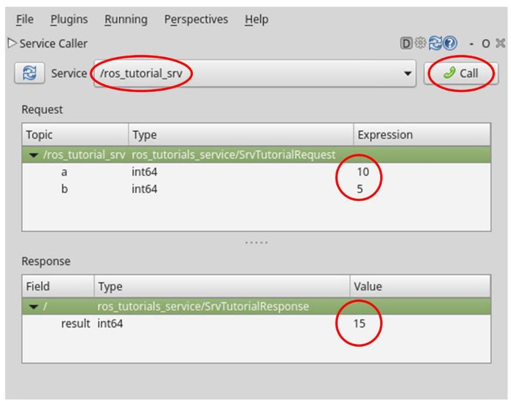

图 7-7 通过rqt的Service Caller插件的服务请求

如果在顶部的 “Service” 项目中选择服务名称, 则会在Request中看到服务请求所需的信息。要请求服务，请在每个请求信息的Expression中输入信息。我给a输入了10, 给b输入了5。然后点击右上角绿色电话的<Call>图标，服务请求将被执行，屏幕下方的 Response将显示服务响应的结果。

前面描述的rosservice call具有直接在终端上运行的优点, 但对于不熟悉使用Linux 或ROS命令的用户，我们推荐rqt的Service Caller。

在本节中，我们创建了一个服务服务器和一个客户端节点，并尝试执行它，还学习了如何在节点之间进行服务通信。相关资源可以在以下github地址找到:

---

- https://github.com/ROBOTIS-GIT/ros_tutorials/tree/master/ros_tutorials_service

---

如果您想马上应用它，可以用catkin_ws/src目录中的以下命令来克隆源代码，并运行构建。然后运行service_server和service_client节点。

---

\$cd ~/catkin_ws/src

\$ git clone https://github.com/ROBOTIS-GIT/ros_tutorials.git

\$ cd ~/catkin_ws

\$ catkin_make

\$ rosrun ros_tutorials_service service_server

\$ rosrun ros_tutorials_service service_client 2 3

---

## 7.4. 创建和运行动作服务器和客户端节点

在本节中，我们将创建并运行一个动作服务器和动作客户端节点，我们将了解第4.2节中讨论的第三种消息通信方法-动作 ${}^{9}$ 。动作与话题和服务不同,在异步、双向,以及请求和响应之间需要很长的时间的情况，以及需要中途结果值等需要更复杂的编程的情况中显的格外有用。这里我们将使用ROS Wiki中介绍的actionlib示例 ${}^{10}$ 。

### 7.4.1. 生成功能包

以下命令创建ros_tutorials_action功能包。这个功能包依赖于message_ generation、std_msgs、actionlib_msgs、actionlib和roscpp功能包，因此将这些作为了依赖选项。

---

	\$cd ~/catkin_ws/src

\$catkin_create_pkg ros_tutorials_action message_generation std_msgs actionlib_msgs actionlib roscpp

---

### 7.4.2. 修改功能包配置文件(package.xml)

包括修改功能包配置文件 (package.xml) 的大部分过程与上述话题和服务中描述的过程非常相似。除了本节的例子中的细节之外，我只会提到源代码并跳过细节。

---

\$ rosed ros_tutorials_action

\$ gedit package.xml

---

---

9 http://wiki.ros.org/actionlib

10 http://wiki.ros.org/actionlib_tutorials/Tutorials

---

<?xml version="1.0"?>

<package>

<name>ros_tutorials_action</name>

<version>0.1.0</version>

<description>ROS tutorial package to learn the action</description>

<license>BSD</license>

<author>Melonee Wise</author>

<maintainer email="pyo@robotis.com">pyo</maintainer>

<buildtool_depend>catkin</buildtool_depend>

<build_depend>roscpp</build_depend>

<build_depend>actionlib</build_depend>

<build_depend>message_generation</build_depend>

<build_depend>std_msgs</build_depend>

<build_depend>actionlib_msgs</build_depend>

<run_depend>roscpp</run_depend>

<run_depend>actionlib</run_depend>

<run_depend>std_msgs</run_depend>

<run_depend>actionlib_msgs</run_depend>

<run_depend>message_runtime</run_depend>

<export></export>

</package>

### 7.4.3. 修改构建配置文件(CMakeLists.txt)

与上面介绍的ros_tutorials_topic和ros_tutorials_service节点的构建配置文件不同的是, 如果这些节点的构建过程中生成了msg和srv文件, 那么ros_tutorials_action功能包会生成动作文件(*.action)。此外，还添加了一个新的动作服务器节点和一个动作客户端节点作为使用它的示例节点。另外，由于我们使用了一个ROS之外的名为Boost的库，所以多了一个单独的依赖项选项。

\$ gedit CMakeLists.txt

ros_tutorials_action/CMakeLists.txt

cmake_minimum_required(VERSION 2.8.3)

project(ros_tutorials_action)

---

			find_package(catkin REQUIRED COMPONENTS

											message_generation

													std_msgs

													actionlib_msgs

														actionlib

														roscpp

)

	find_package(Boost REQUIRED COMPONENTS system)

	add_action_files(FILES Fibonacci.action)

	generate_messages(DEPENDENCIES actionlib_msgs std_msgs)

			catkin_package(   )

													LIBRARIES ros_tutorials_action

													CATKIN_DEPENDS std_msgs actionlib_msgs actionlib roscpp

													DEPENDS Boost

)

	include_directories(\$\{catkin_INCLUDE_DIRS\} \$\{Boost_INCLUDE_DIRS\})

		add_executable(action_server src/action_server.cpp)

		add_dependencies(action_server \$\{\$\{PROJECT_NAME\}_EXPORTED_TARGETS\} \$\{catkin_EXPORTED_TARGETS\})

	target_link_libraries(action_server \$\{catkin_LIBRARIES\})

	add_executable(action_client src/action_client.cpp)

	add_dependencies(action_client \$\{\$\{PROJECT_NAME\}_EXPORTED_TARGETS\} \$\{catkin_EXPORTED_TARGETS\})

	target_link_libraries(action_client \$\{catkin_LIBRARIES\})

---

### 7.4.4. 创建动作文件

在CMakeLists.txt文件中加了如下选项。

---

add_action_files(FILES Fibonacci.action)

---

这意味着在构建时包含服务Fibonacci.action, 这个服务将用于本次的节点中。由于我们目前还没有创建Fibonacci.action，因此我们按以下顺序创建它。

\$ rosed ros_tutorials_action $\rightarrow$ 移动到功能包目录

\$ mkdir action → 在功能包中创建一个名为action的动作目录

\$ cd action $\rightarrow$ 移至创建的action目录

\$ gedit Fibonacci.action → 创建Fibonacci.action文件并修改内容

在动作文件中，三个连字符(---)用作分隔符，第一个是goal消息，第二个是result 消息，第三个是feedback消息。goal消息和result消息之间的关系与上述srv文件相同， 但主要区别在于feedback消息用于指定进程执行过程中的中间值传输。

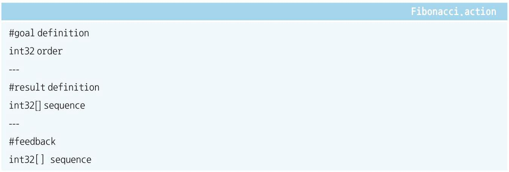

**动作的5种基本消息**

除了可以在动作文件中找到的目标 (goal) 、结果 (result) 和反馈 (feedback) 之外, 动作基本上还使用两个额外的消息: 取消 (cancel) 和状态 (status) 。取消 (cancel)消息使用actionlib_msgs/GoalID，它在动作运行时可以取消动作客户端和单独节点上的动作的执行。状态 (status) 消息可以根据状态转换 ${}^{11}$ (如PENDING、 ACTIVE、PREEMPTED和SUCCEEDED ${}^{12}$ )检查当前动作的状态。

### 7.4.5. 创建动作服务器节点

在CMakeLists.txt文件中如下添加了生成可执行文件的选项。

---

add_executable(action_server src/action_server.cpp)

11 http://wiki.ros.org/actionlib/DetailedDescription

12 http://docs.ros.org/kinetic/api/actionlib_msgs/html/msg/GoalStatus.html

---

也就是说，是通过构建action_server.cpp文件来创建action_server可执行文件。我们按以下顺序编写一个执行Action Server节点的功能的程序吧。

\$ roscd ros_tutorials_action/src $\rightarrow$ 移动到功能包的源代码目录src

\$ gedit action_server.cpp $\rightarrow$ 创建和编辑源代码文件

---

																															ros_tutorials_action/src/action_server.cpp

#include <ros/ros.h> 																																// ROS的基本头文件

#include <actionlib/server/simple_action_server.h> 																																// 动作库头文件

#include <ros_tutorials_action/FibonacciAction.h> 																																//FibonacciAction动作头文件(生成后自动生成)

class FibonacciAction

\{

protected:

// 声明节点句柄

ros::NodeHandle nh_;

// 声明动作服务器

actionlib::SimpleActionServer<ros_tutorials_action::FibonacciAction> as_;

// 用作动作名称

std::string action_name_;

// 声明用于发布的反馈及结果

ros_tutorials_action::FibonacciFeedback feedback_;

ros_tutorials_action::FibonacciResult result_;

public:

// 初始化动作服务器(节点句柄、动作名称、动作后台函数)

FibonacciAction(std::stringname) :

	as_(nh_, name, boost::bind(&FibonacciAction::executeCB, this, _1), false),

	action_name_(name)

\{

	as_.start();

\}

---

---

~FibonacciAction(void)

\{

\}

// 接收动作目标(goal)消息并执行指定动作(此处为斐波那契数列)的函数。

void executeCB(const ros_tutorials_action::FibonacciGoalConstPtr &goal)

\{

ros::Rater(1); 		// 循环周期:1 Hz

bool success = true; 		// 用作保存动作的成功或失败的变量

// 斐波那契数列的初始化设置，也添加了反馈的第一个(0)和第二个消息(1)

feedback_.sequence.clear();

feedback_.sequence.push_back(0);

feedback_.sequence.push_back(1);

// 将动作名称、目标和斐波那契数列的两个初始值通知给用户

ROS_INFO("%s: Executing, creating fibonacci sequence of order %i with seeds %i, %i",

action_name_.c_str(), goal->order, feedback_.sequence[0], feedback_.sequence[1]);

// 动作细节

for(int i=1; i<=goal->order; i++)

\{

// 从动作客户端得知动作取消

if (as_.isPreemptRequested() || !ros::ok())

\{

ROS_INFO("%s: Preempted", action_name_.c_str());

as_.setPreempted(); 			// 取消动作

success = false; 			// 看作动作失败并保存到变量

break;

\}

// 除非有动作取消或已达成动作目标

// 将当前斐波纳契数字加上前一个数字的值保存到反馈值。

feedback_.sequence.push_back(feedback_sequence[i] + feedback_.sequence[i-1]);

as_.publishFeedback(feedback_); 			// 发布反馈。

r.sleep(); 			// 按照上面定义的循环周期调用暂歇函数。

\}

// 如果达到动作目标值，则将当前斐波那契数列作为结果值传输。

if(success)

\{

---

---

	result_.sequence = feedback_.sequence;

	ROS_INFO("%s: Succeeded", action_name_.c_str());

	as_.setSucceeded(result_);

\}

\}

\};

int main(int argc, char** argv) // 节点主函数

\{

ros::init(argc, argv, "action_server"); 																								// 初始化节点名称

FibonacciAction fibonacci("ros_tutorial_action"); 																								// 声明Fibonacci(动作名:ros_tutorial_action)

ros::spin(); 																								// 等待动作目标

return 0;

\}

---

### 7.4.6. 创建动作客户端节点

与动作服务器节点一样，客户端节点的设置内容也作为选项加到了CMakeLists.txt文件中。

add_executable(action_client src/action_client.cpp)

也就是说，通过构建一个名为action_client.cpp的文件来创建action_client可执行文件。我们按照以下顺序编写一个执行动作客户端节点功能的程序。

\$ rosed ros_tutorials_action/src $\rightarrow$ 移动到功能包的源代码目录src

\$ gedit action_client.cpp → 创建并修改源代码文件

<table><tr><td></td><td>ros_tutorials_action/src/action_client.cpp</td></tr><tr><td>#include <ros/ros.h>   #include <actionlib/client/simple_action_client.h>   #include <actionlib/client/terminal_state.h>   #include <ros_tutorials_action/FibonacciAction.h>   int main (int argc, char **argv)   \{   ros::init(argc, argv, "action_client");</td><td>// ROS的基本头文件   // 动作库头文件   // 动作目标状态头文件   // FibonacciAction动作头文件(构建后自动生成)   // 节点主函数   // 初始化节点名称</td></tr></table>

---

// 声明动作客户端(动作名称:ros_tutorial_action)

actionlib::SimpleActionClient<ros_tutorials_action::FibonacciAction> ac("ros_tutorial_action",

true);

ROS_INFO("Waiting for action server to start.");

ac.waitForServer(); 	// 等待动作服务器启动

ROS_INFO("Action server started, sending goal.");

ros_tutorials_action::FibonacciGoal goal; 	// 声明动作目标

goal.order = 20; 	// 指定动作目标(进行20次斐波那契运算)

ac.sendGoal(goal); 	// 发送动作目标

// 设置动作完成时间限制(这里设置为30秒)

bool finished_before_timeout = ac.waitForResult(ros::Duration(30.0));

// 在动作完成时限内收到动作结果值时

if (finished_before_timeout)

\{

// 获取动作目标状态值并将其显示在屏幕上

actionlib::SimpleClientGoalState state = ac.getState();

ROS_INFO("Action finished: %s", state.toString().c_str());

\}

else

ROS_INFO("Action did not finish before the time out."); // 超过了动作完成时限的情况

//exit

return 0;

\}

---

### 7.4.7. 构建节点

使用以下命令构建ros_tutorials_action功能包的动作文件、动作服务器节点和动作客户机节点。ros_tutorials_action功能包的源文件位于 “~/catkin_ws/src/ros_ tutorials_action/src" 目录中，而动作文件位于“~/catkin_ws/src/ros_tutorials_ action/src/action”目录中。

\$ cd ~/catkin_ws && catkin_make

### 7.4.8. 运行动作服务器

我们之前编写的动作服务器在指定动作目标(goal)前不做任何行动，只会等待。因此, 执行以下命令时, 动作服务器会等待来自动作客户端的目标 (goal) 指定。运行节点之前不要忘记运行roscore。

---

\$ roscore

\$ rosrun ros_tutorials_action action_server

---

如4.3节所述，动作中的动作目标(goal)和结果(result)的用法与服务中的请求和响应类似, 这是动作和服务的相似之处。但不同之处在于, 动作还有作为中途值的反馈 (feedback) 消息。这与服务类似，但其消息的实际通信方式与话题非常类似。因此, 可以通过rqt_graph和rostopic list命令来查看当前动作消息的使用情况。

---

	\$rostopic list

	/ros_tutorial_action/cancel

	/ros_tutorial_action/feedback

	/ros_tutorial_action/goal

/ros_tutorial_action/result

/ros_tutorial_action/status

/rosout

	/rosout_agg

---

如果想了解更多有关每条消息的信息，请将-v选项添加到rostopic list中。这将单独显示发布和订阅的话题，如下所示:

---

\$ rostopic list -v

Published topics:

			*/ros_tutorial_action/feedback [ros_tutorials_action/FibonacciActionFeedback] 1 publisher

	*/ros_tutorial_action/status [actionlib_msgs/GoalStatusArray] 1 publisher

			*/rosout [rosgraph_msgs/log] 1 publisher

			*/ros_tutorial_action/result[ros_tutorials_action/FibonacciActionResult] 1 publisher

		*/rosout_agg [rosgraph_msgs/Log] 1 publisher

Subscribed topics:

	*/ros_tutorial_action/goal [ros_tutorials_action/FibonacciActionGoal] 1 subscriber

			*/rosout [rosgraph_msgs/log] 1 subscriber

			*/ros_tutorial_action/cancel [actionlib_msgs/GoalID] 1 subscriber

---

为了查看可视化信息，请使用以下命令。 动作消息、动作服务器和客户端之间的关系如图7-8所示，是双向发送和接收。在这里，动作信息由名字ros_tutorial_action/ action_topics统一表示，当关闭菜单中的Actions时，可以看到所有5个消息，如图7-9所示。在这里我们可以看到，这个动作由5个话题以及发布和订阅这些话题的节点组成。

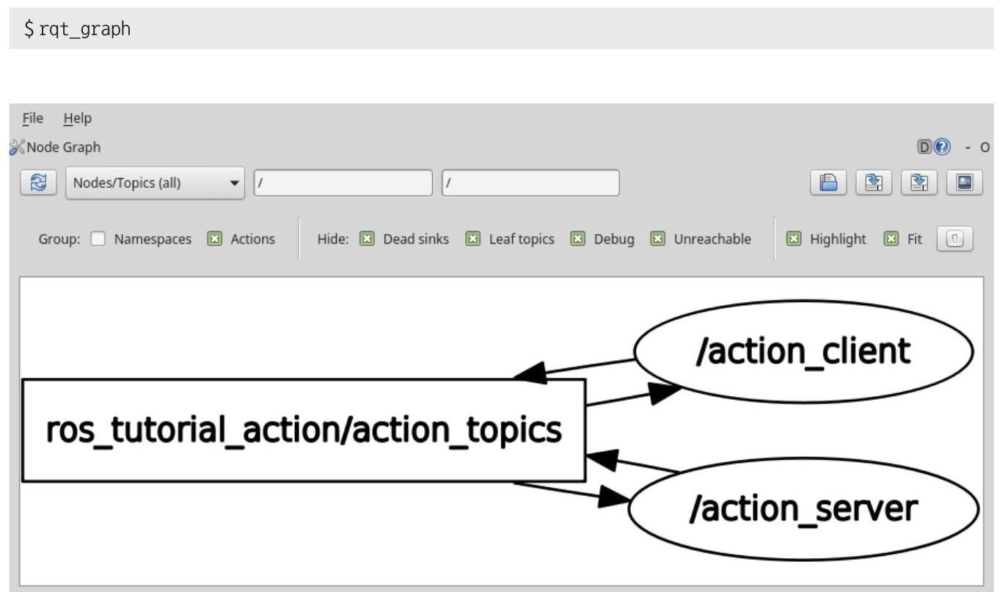

图 7-8 双向收发的动作消息、动作服务器和客户端之间的关系图

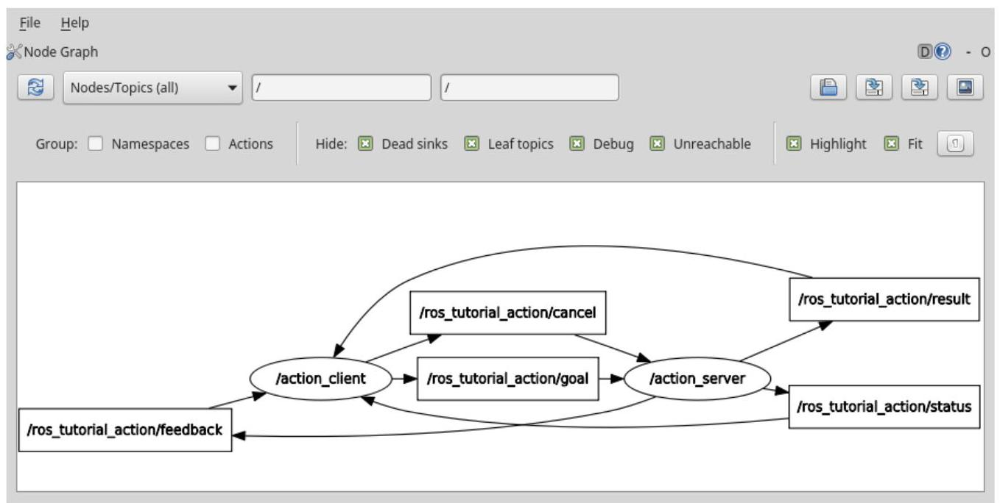

图 7-9 用于动作的5种消息

### 7.4.9. 运行动作客户端

使用以下命令运行动作客户端。在动作客户端启动的同时，会通过动作目标消息将动作目标设为 20。

---

\$ rosrun ros_tutorials_action action_client

---

通过设置这个目标值, 动作服务器将如下启动斐波那契数列。如果想详细了解中途值或结果值, 可以使用像 "rostopic echo /ros_tutorial_action/feedback" 这样的 rostopic命令。

\$ rosrun ros_tutorials_action action_server

[INFO] [1495764516.294367721]: ros_tutorial_action: Executing, creating fibonacci sequence of order 20 with seeds 0,1

[INFO] [1495764536.294488991]: ros_tutorial_action: Succeeded

\$ rosrun ros_tutorials_action action_client

[INFO] [1495764515.999158825]: Waiting for action server to start.

[INFO] [1495764516.293575887]: Action server started, sending goal.

[INFO] [1495764536.295139830]: Action finished: SUCCEEDED

---

\$ rostopic echo / ros_tutorial_action/feedback

header:

															seq: 42

															stamp:

																											secs: 1495764700

																										nsecs: 413836908

															frame_id: ' '

					status:

														goal_id:

																												stamp:

																																							secs: 1495764698

																																						nsecs: 413136891

																										id: /action_client-1-1495764698.413136891

															status: 1

														text: This goal has been accepted by the simple action server

				feedback:

												sequence: $\left\lbrack  {0,1,1,2,3}\right\rbrack$

---

---

在本节中, 我们创建和运行了动作服务器和客户端节点, 了解了节点间的服务通信方法。相关资源可以在下面的github地址找到。

---

- https://github.com/ROBOTIS-GIT/ros_tutorials/tree/master/ros_tutorials_action

---

如果想马上应用它，读者可以用catkin_ws/src目录中的以下命令来克隆源代码，并运行构建。然后运行action_server和action_client节点即可。

---

\$ cd ~/catkin_ws/src

\$ git clone https://github.com/ROBOTIS-GIT/ros_tutorials.git

\$ cd ~/catkin_ws

	\$ catkin_make

\$ rosrun ros_tutorials_action action_server

\$ rosrun ros_tutorials_action action_client

---

## 7.5. 参数的用法

到目前为止，我们已经多次讲到了对于参数的说明和概念。因此，在本节中，让我们通过实习学会如何使用参数。有关参数的术语，请参阅第4.1节，而rospram命令请参考第5.4节。

### 7.5.1. 利用参数创建节点

修改第7.3节中创建的服务服务器和客户端节点中的service_server.cpp，让通过服务请求输入的a和b不光进行加法运算，还会利用参数让a和b进行四则运算。我们按以下顺序修改service_server.cpp源代码。

---

\$ roscd ros_tutorials_service/src 	$\rightarrow$ 移至功能包的源代码目录src

\$ gedit service_server.cpp 	→修改源文件的内容

---

---

#include "ros/ros.h" 																																				// ROS的基本头文件

#include "ros_tutorials_service/SrvTutorial.h" 																																				// SrvTutorial服务头文件

#define PLUS 1 																																				// 加

#define MINUS 2 																																				//减

#define MULTIPLICATION 3 																																				//乘

#define DIVISION 4 																																				// 除

int g_operator = PLUS;

// 当有服务请求时，会处理以下内容。

// 服务请求设置为req，服务响应设置为res。

bool calculation(ros_tutorials_service::SrvTutorial::Request &req,

											ros_tutorials_service::SrvTutorial::Response &res)

\{

	// 根据g_operator参数值进行a和b的运算

	// 计算后将结果保存到服务响应值中。

	switch(g_operator)

	\{

	case PLUS:

		res.result = req.a + req.b; break;

	case MINUS:

		res.result = req.a - req.b; break;

	case MULTIPLICATION:

		res.result = req.a * req.b; break;

	case DIVISION:

		if(req.b == 0)

		\{

		res.result = 0; break;

		\}

		else

		\{

		res.result = req.a / req.b; break;

	\}

	default:

		res.result = req.a + req.b; break;

\}

	//显示服务请求中使用的a和b值，以及相当于服务响应的result值。

	ROS_INFO("request: x=%ld, y=%ld", (long int)req.a, (long int)req.b);

---

---

ROS_INFO("sending back response: [%ld]", (long int)res.result);

return true;

\}

int main(int argc, char **argv) 			// 节点主函数

\{

ros::init(argc, argv, "service_server"); 			// 初始化节点名称

ros::NodeHandle nh; 			// 声明节点句柄

nh.setParam("calculation_method", PLUS); 			// 初始化参数

// 声明服务服务器，创建使用ros_tutorials_service功能包中的SrvTutorial服务文件的

// 服务服务器service_server。服务名称是"ros_tutorial_srv"，

// 此服务器当收到服务请求时，会执行一个叫做calculation的函数。

ros::ServiceServer ros_tutorial_service_server = nh.advertiseService("ros_tutorial_srv",

calculation);

ROS_INFO("ready srv server!");

ros::Rater(10); // 10hz

while (1)

\{

// 将运算符改为通过参数收到的值。

nh.getParam("calculation_method", g_operator);

ros::spin0nce(); // 后台函数处理进程

r.sleep(); 	// 为了反复进入进程而添加的sleep(暂歇)函数

\}

return 0;

\}

---

他们中的大多数与之前的内容类似, 所以我们只看看为了利用参数而添加的部分。特别是, 粗体的 “setParam” 和 “getParam” 在参数利用中是最重要的函数。但它非常简单, 所以只看函数的应用例子, 就可以理解它。

### 7.5.2. 设置参数

下面的代码是将calculate_method参数设置为PLUS值。由于PLUS在7.5.1源中被定义为1，所以calculate_method参数变为1，因此对于通过服务请求收到的值，进行加法运算来做出服务响应。

---

nh.setParam("calculation_method", PLUS);

---

作为参考, 参数可以设置为integers、floats、boolean、string、dictionaries和list 等。例如, 1是一个integer, 1.0是一个floats, "internetofthings" 是一个string, true是一个boolean, [1,2,3]是一个integers的list, a: b和c: d是一个dictionary。

### 7.5.3. 读取参数

以下是调取calculation_method参数并设置为g_operator的值的部分代码。因此, 在7.5.1的源代码中，g_operator每0.1秒检查一次参数的值，并判断对于通过服务请求收到的值进行何种四则运算。

---

nh.getParam("calculation_method", g_operator);

---

### 7.5.4. 构建节点和运行节点

使用以下命令重新构建ros_tutorials_service功能包中的服务服务器节点。

---

\$ cd ~/catkin_ws && catkin_make

---

完成后，使用以下命令运行ros_tutorials_service功能包的service_server节点:

---

\$ roscore

\$ rosrun ros_tutorials_service service_server

[INFO] [1495767130.149512649]: ready srv server!

---

### 7.5.5. 查看参数目录

可以使用 “rosparam list” 命令查看当前用于ROS网络的参数列表。在显示的列表中, /calculation_method是我们使用的参数。

---

	\$ rosparam list

/calculation_method

/rosdistro

/rosversion

/run_id

---

### 7.5.6. 参数的用例

让我们按照以下命令来设置参数, 并观察每次做相同的请求服务但会得到不同的服务处理。

---

\$ rosservice call /ros_tutorial_srv 105 	$\rightarrow$ 输入要进行四则运算的变量a和b

result: 15 	→ 默认运算加法的结果值

\$ rosparam set /calculation_method 2 	$\rightarrow$ 减法

\$ rosservice call /ros_tutorial_srv 105

result: 5

\$ rosparam set /calculation_method 3 	$\rightarrow$ 乘法

\$ rosservice call /ros_tutorial_srv 105

result: 50

\$ rosparam set /calculation_method 4 	$\rightarrow$ 除法

\$ rosservice call /ros_tutorial_srv 105

result: 2

---

您可以使用 “rosparam set” 命令更改calculation_method参数。通过更改参数, 您可以看到每次做相同的输入 “rosservice call /ros_tutorial_srv 10 5”，却得到不同的结果值。通过这种方式, ROS中的参数可以改变节点外部的节点的流程、设置和处理。 这是一个非常有用的功能, 所以就算现在不使用它, 但需要记住。

在本节中, 我们讨论了如何修改现有的服务服务器和参数的用法。为了与以前创建的服务源代码区分开来，相关的源代码已经被重命名为ros_tutorials_parameter功能包， 并且可以在以下github地址找到。

---

- https://github.com/ROBOTIS-GIT/ros_tutorials/tree/master/ros_tutorials_parameter

---

如果您想马上应用它，可以用catkin_ws/src目录中的以下命令克隆源代码并运行构建。然后运行service_server和service_client节点即可。

---

\$cd ~/catkin_ws/src

	\$git clone https://github.com/ROBOTIS-GIT/ros_tutorials.git

	\$ cd ~/catkin_ws

	\$ catkin_make

\$ rosrun ros_tutorials_parameter service_server_with_parameter

\$ rosrun ros_tutorials_parameter service_client_with_parameter 2 3

---

## 7.6. roslaunch的用法

如果rosrun是执行一个节点的命令，那么roslaunch可以运行多个节点。除此之外， 它还是一种在运行节点时可以附带如下各种选项的ROS命令: 修改参数或节点的名称， 设置节点的命名空间，设置ROS_ROOT及ROS_PACKAGE_PATH，以及环境变量修改等选项的ROS命令，等。

roslaunch使用“*.launch”文件来设置可执行节点，它基于XML，并提供各个标签的选项。执行命令是 “roslaunch [功能包名称] [roslaunch文件]”。

### 7.6.1. roslaunch的应用

为了解如何使用roslaunch, 下面先重命名之前创建的topic_publisher和topic_ subscriber节点。只改变名字没有意义，所以让我们运行两个独立的发布者和两个独立的订阅者节点来进行各自的消息通信。

首先, 我们编写一个*.launch文件。用于roslaunch的文件具有*.launch文件名, 您需要在该功能包目录中创建一个launch 目录，并将launch文件放在该目录中。使用以下命令创建一个目录，并创建一个名为union.launch的新文件。

---

\$ rosed ros_tutorials_topic

\$ mkdir launch

	\$ cd launch

	\$ gedit union.launch

---

如下编辑union.launch文件的内容。

---

																																																					union.launch

<launch>

	<node pkg="ros_tutorials_topic" type="topic_publisher" name="topic_publisher1"/>

	<node pkg="ros_tutorials_topic" type="topic_subscriber" name="topic_subscriber1"/>

	<node pkg="ros_tutorials_topic" type="topic_publisher" name="topic_publisher2"/>

	<node pkg="ros_tutorials_topic" type="topic_subscriber" name="topic_subscriber2"/>

</launch>

---

在<launch>标签中，描述了使用roslaunch命令运行节点所需的标签。<node>描述了roslaunch运行的节点。选项包括pkg、type和name。

- pkg 功能包的名称

- type 实际运行的节点的名称(节点名)

与上述type对应的节点被运行时，起的名称(运行名)。一般情况下使用与type相同的名称，但可以根据需要，在运行时更改名称。

如果创建了roslaunch文件，可以如下运行union.launch。请注意，当用roslaunch 命令运行多个节点时, 运行中的节点的输出 (info、error等) 不会显示在终端屏幕上, 这会使调试变得困难。如果此时添加了--screen选项，终端上运行的所有节点的输出将显示在终端屏幕上。

---

\$ roslaunch ros_tutorials_topic union.launch --screen

---

运行结果会如何？首先，让我们使用以下命令看看当前正在运行的节点吧。

---

	\$ rosnode list

	/rosout

/topic_publisher1

/topic_publisher2

/topic_subscriber1

/topic_subscriber2

---

可以看到, topic_publisher节点已被重命名为topic_publisher1和topic_ publisher2，而topic_subscriber节点已被重命名为topic_subscriber1和topic_ subscriber2。这四个节点均在运行中。

问题在于，我们通过rqt_graph(图7-10)看到，与“两个发布者节点和两个订阅者节点中的每一个发布者和订阅者都只与一个订阅者和发布者进行单独的通信”的当初的目的不符, 两个订阅者都在订阅两个发布者的消息。这是因为我们只是改变了节点的名字, 而没有改变要使用的消息的名字。我们用另一个roslaunch命名空间标记来解决这个问题。

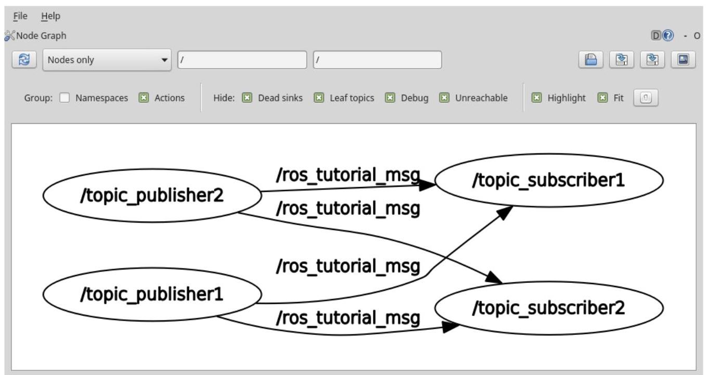

图 7-10 利用roslaunch运行多个节点时的节点图

让我们修改之前创建的union.launch文件，如下所示。

---

\$ rosed ros_tutorials_topic/launch

\$ gedit union.launch

---

ros_tutorials_topic/launch/union.launch

<launch>

<group ns="ns1">

<node pkg="ros_tutorials_topic" type="topic_publisher" name="topic_publisher"/>

<node pkg="ros_tutorials_topic" type="topic_subscriber" name="topic_subscriber"/>

</group>

<group ns="ns2">

<node pkg="ros_tutorials_topic" type="topic_publisher" name="topic_publisher"/>

<node pkg="ros_tutorials_topic" type="topic_subscriber" name="topic_subscriber"/>

</group>

</launch>

<group>是对指定节点进行分组的标签。选项有ns。这是命名空间 (name space)，是组的名称，属于该组的节点和消息都包含在由ns指定的名称中。

再一次, 我们来检查rqt_graph节点之间的连接和消息发送/接收状态。这一次, 如图 7-11所示，我们可以看到，我们实现了我们最初的目的。

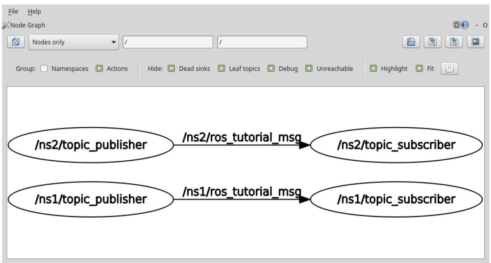

图 7-11 利用命名空间时的消息通信

### 7.6.2. Launch标签

在launch文件中根据XML ${}^{13}$ 的编写方式可以实现多种功能。launch中使用的标签如下所示。

- <launch> 指roslaunch语句的开始和结束。

<node> 这是对于节点运行的标签。您可以更改功能包、节点名称和执行名称。

- <machine> 可以设置运行该节点的PC的名称、address、ros-root和ros-package-path。

<include>

您可以加载属于同一个功能包或不同的功能包的另一个launch，并将其作为一个launch 文件来运行。

<remap> 可以更改节点名称、话题名称等等，在节点中用到的ROS变量的名称。

---

13 http://wiki.ros.org/roslaunch/XML

---

设置环境变量，如路径和IP(很少使用)。

<param> 设置参数名称、类型、值等

<rosparam> ram> 可以像rosparam命令一样，查看和修改load、dump和delete等参数信息。

<group> 用于分组正在运行的节点。

- <test> 用于测试节点。类似于<node>，但是有可以用于测试的选项。

<arg> 可以在launch文件中定义一个变量，以便在像下面这样运行时更改参数。

如下面的例子所示，利用其中的参数设置<param>和launch文件中的变量<arg>，可以在运行launch时从外部修改内部变量, 因此甚至可以在运行的同时修改节点内部的参数。这是一个非常有用和广泛使用的方法, 因此需要掌握。

---

	<launch>

												<arg name="update_period" default="10" />

												<param name="timing" value="\$(argupdate_period)"/>

</launch>

---

\$ roslaunch my_package my_package.launch update_period:=30
