# 第8章 机器人、传感器和电机

## 8.1. 机器人功能包

机器人主要分为硬件和软件。机械、电机、齿轮、电路和传感器被归类为硬件。直接驱动或控制机器人硬件的微控制器级别的固件，以及利用从传感器获得的信息进行识别、 制图、导航和动作规划的应用软件均被分类为软件。

ROS属于应用软件的范畴，根据功能，ROS的功能包被分类为机器人功能包 ${}^{1}$ 、专为传感器的传感器功能包 ${}^{2}$ 和专为驱动部的电机功能包 ${}^{3}$ 。这些功能包由Willow Garage、 ROBOTIS、Yujin Robot和Fetch Robotics等机器人公司提供。或者由Open Robotics (曾经是Opensource Robot Foundation, OSRF)、机器人专业的大学实验室和个人开发者开发并发表自己开发的ROS机器人、传感器和电机的相关功能包。

如果要选机器人功能包的代表作，那么绝对是图8-1的PR2和TurtleBot。其中，PR2 是负责ROS开发的Willow Garage以科研用机器人为目的开发的移动人形机器人。即使现在, PR2功能包还是具有代表性的机器人功能包, 因为其他机器人的核心功能包很多还是使用PR2功能包的衍生包。

虽然PR2的通用性和性能非常优秀, 但因为价格过高, 无法实现刺激和传播ROS 的目的, TurtleBot机器人正是由于这个原因而开发的机器人, 旨在普及ROS。第一版 Turtlebot是将基于iRobot公司的扫地机器人Roomba的create作为基础而开发的。而 TurtleBot2是将韩国的服务机器人公司Yujin Robot的iCLEBO的改进版KOBUKI作为移动的基础而开发的。此外, 本书将重点介绍的TurtleBot3是由ROBOTIS、Intel和Open Robotics合作开发的一款基于Dynamixel舵机的移动机器人。在后续的第10章里会介绍与TurtleBot有关的机器人功能包的用法，同时会进行对TurtleBot的更详细的说明。

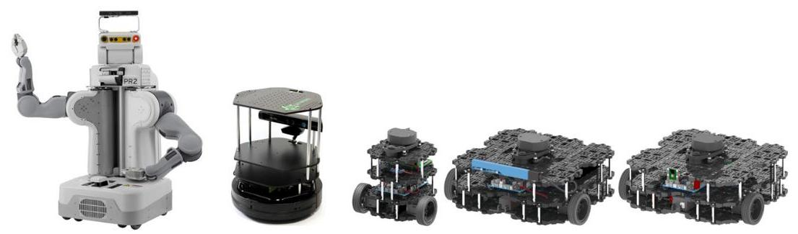

图 8-1 PR2(左1)、TurtleBot2(左2)和TurtleBot3(右侧的三种机器人)

---

1 http://robots.ros.org/, http://wiki.ros.org/Robots

2 http://wiki.ros.org/Sensors

3 http://wiki.ros.org/Motor%20Controller%20Drivers

---

除了这两种有代表性的机器人之外, 还有180多种机器人的功能包也已公开, 如图8-2 所示。这是以开源形式的ROS功能包公开的机器人数量, 再加上机器人相关的公司、研究所、大学和个人使用的机器人的话数量会更多。

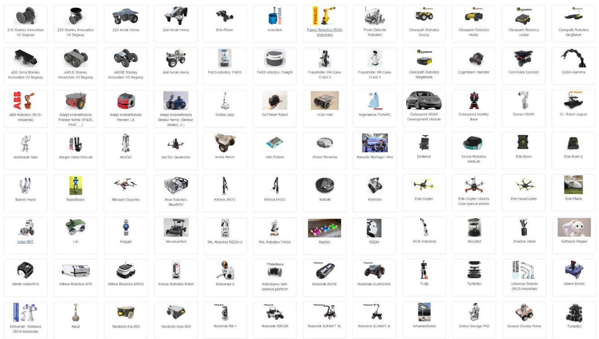

图 8-2 ROS引入的机器人(http://robots.ros.org/)

注册的机器人来自各种领域，如下所示。公共机器人功能包可以在http://robots.ros.org/找到。

- 机械手臂 (Manipulator)

- 移动机器人 (Mobile robot)

- 自动驾驶汽车 (Autonomous car)

- 人形机器人(Humanoid)

- 无人驾驶飞机 (UAV: Unmanned Aerial Vehicle)

- 无人潜艇 (UUV: Unmanned Undersea Vehicle)

- 无人水面艇 (UWV: Unmanned Surface Vehicle)

如果您要使用的机器人功能包是ROS官方功能包, 那么安装方法非常简单。首先, 请检查您要使用的机器人功能包是否在ROS Wiki (http://robots.ros.org/) 上公开可用, 或者您可以使用以下命令在所有ROS功能包列表中找到它。

---

\$ apt-cache search ros-kinetic

---

还有一种方法是运行Linux的GUI功能包管理器程序synaptic，并搜索单词 “ros-kinetic”。如果您想使用的机器人功能包是一个官方的功能包，安装很简单。下面举几个例子。以下命令安装PR2功能包。

---

\$ sudo apt-get install ros-kinetic-pr2-desktop

---

以下是安装TurtleBot3功能包的命令。

---

\$ sudo apt-get install ros-kinetic-turtlebot3 ros-kinetic-turtlebot3-msgs ros-kinetic-turtlebot3-

simulations

---

* 由于TurtleBot3在持续地进行升级，因此推荐您获取最新的源代码，而不是进行二进制文件安装。这在第10章移动机器人中有说明。

即使机器人功能包没有正式提供, 也可以按照机器人功能包的维基页面的说明来进行安装。例如, 要安装以移动机器人而闻名的Pioneer, 可以移动到catkin构建系统的用户源程序目录，并从wiki存储库(repository)中下载最新的机器人功能包。

---

\$cd ~/catkin_ws/src 	$\rightarrow$ 移动到catkin构建系统的用户源程序目录

\$ hg clone http://code.google.com/p/amor-ros-pkg/ 	$\rightarrow$ 从存储库下载

---

如上所述, 机器人功能包可以安装ROS官方功能包, 或按照维基中说明的安装方法从开源存储库中下载机器人功能包, 然后经过构建过程之后就可以使用。对于功能包中的各节点的使用说明请参照相应机器人功能包的说明。机器人功能包主要包括机器人驱动节点、获取安装上的传感器的数据的节点、应用安装上的传感器的数据的的节点，以及远程控制节点。如果机器人是多关节机器人，则还包括逆运动学节点，如果是移动机器人则包括导航节点。

## 8.2. 传感器功能包

传感器是与机器人无法分离的。有许多研究从传感器数据提供的无数环境信息中提取有意义的信息, 或利用这些信息认识环境并传输给机器人。这样的环境信息有位置、空间、天气、声音、惯性、振动、气体、电流量、RFID，物体和外力识别等很多种。该信息被用作机器人执行实际任务的重要数据。

在制作机器人时，通过驱动轮或机器人手臂让机器人移动，且通过智能手机等进行遥控并不意味着开发完成。如果您在这里停下来，只能说您搭建了一个移动的机器。机器人只有在自己认识到周围环境，只提取有意义的信息，并能够计划和做出思考和判断，才能被视为机器人。这就是为什么传感器很重要。

### 8.2.1. 传感器的类型

环境信息有很多种，而传感器的种类也不亚于此。其中，机器人使用的典型传感器有距离传感器。比较常见的是红外线传感器和以激光为基础的多种激光距离传感器。激光距离传感器有LDS(Laser Distance Sensor，激光距离传感器)、LiDAR(Light Detection And Ranging, 光检测和测距) 和LRF (Laser Range Finders, 激光测距仪)。最近，三维距离传感器RealSense、Kinect和Xtion也广泛地被用作距离传感器。 另外还有用于识别用户或物体的彩色照相机、用于位置估计的惯性传感器、用于语音识别的麦克风以及用于转矩控制的转矩传感器等处理各种信息的多种传感器。

问题是, 如图8-3所示, 有太多的传感器可以使用。而在微处理器中以ADC(模拟数字转换器)方式接收数据的传感器是有限的。其中，LDS、3D传感器、相机等传感器有大量需要处理的信息, 处理起来需要较高的配置, 因此无法用微处理器实现, 需要用 PC。因此需要驱动程序，还需要如OpenNI和OpenCV的Point Cloud处理，以及图像处理所需的库。

ROS提供了可以使用上述传感器的驱动程序和库的开发环境。目前，还并不是提供所有的传感器功能包, 但传感器功能包正变得越来越多。而且功能相同但通信方式不同的传感器们的用法也趋向于统一。传感器制造商正在积极支持ROS传感器功能包, 这将加速 ROS对未来传感器的支持。

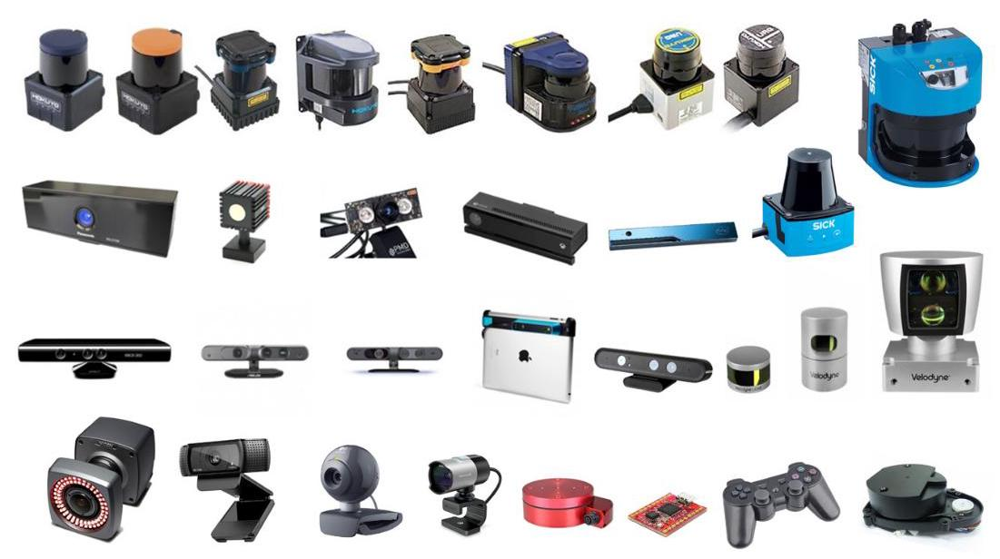

图 8-3 ROS中可用的传感器示例

### 8.2.2. 传感器功能包的分类

在ROS传感器wiki页面 ${}^{4}$ 上公开着多种传感器功能包。这里按照种类将传感器分为 1D range finders、2D range finders、3D Sensors、Pose Estimation(GPS+IMU)、 Cameras、Sensor Interfaces、Audio/Speech Recognition、Environmental、 Force/Torque/Touch Sensors、Motion Capture、Power Supply和RFID等，并介绍属于每个类别的传感器。有关传感器功能包的更多详细用法, 请参阅上述ROS传感器wiki 页面。以下是笔者尤其重视的功能包。

1 D Range Finders 可用于制作低成本机器人的红外线方式的直线距离传感器。

2D Range Finders 亦被称为LDS，是常用于导航的传感器。

③ D Sensors 有英特尔的RealSense、微软的Kinect和华硕的Xction，以及各种3D测量所需的传感器。

Audio/Speech Recognition 目前，与语音识别相关的部分很少，但估计会不断增加。

Cameras 这里收集了广泛用于物体识别、人脸识别和字符识别的相机驱动程序和各种应用功能包。

Sensor Interfaces 很少有传感器支持USB和Web协议。仍然有许多传感器可以很容易地从微处理器获取信息。这些传感器支持微处理器的UART和微型PC中的ROS接口。下面将介绍这些接口。

---

4 http://wiki.ros.org/Sensors

---

这里公开了各种传感器功能包，读者可以找到适合自己的项目的传感器，并将其应用到自己的项目。最常用的相机 (camera) 、深度相机 (depth camera) 和激光距离传感器 (LDS) 将在下面的章节中详细讨论。

## 8.3. 相机

相机相当于机器人的眼睛。从相机获得的图像对于识别机器人周围的环境非常有用。 例如，利用相机图像的对象识别和脸部识别；使用两台相机(立体相机)从两个不同图像之间的差异获得的距离值；利用距离值生成3维地图的Visual-SLAM；单眼相机Visual-SLAM；利用从彩色图像获得的颜色信息的颜色识别；跟踪特定对象的对象跟踪。

这些场合中用到的相机种类非常多，本节中将用USB摄像头来进行说明。USB摄像头意味着它是支持USB的视频录制设备。另一个名称是USB video device class (UVC) ${}^{5}$ 。 所以，官方的名字是 “UVC相机”，但本节中将其称为常用的 “USB摄像头”。

截至2017年7月，UVC发布到1.5版°。UVC 1.5版本支持最新的USB 3.0，可在几乎所有的操作系统上使用，包括Linux、Windows和OS X.它比其他相机易于使用、要求高、 价格便宜。在本章中，我们将实习运行USB摄像头的操作和检查数据的操作。

**相机接口**

相机的接口并不只有USB。某些相机具有可连接到网络的功能。通常连接到局域网或WiFi，将视频数据以视频流形式传输到网络。这些相机应该被称为网络摄像头。此外，有些摄像机使用FireWire(IEEE 1394接口)进行高速传输，主要用于需要高速传输图像的研究目的。FireWire标准在大多数常见的电路板上无法找到，但它是由苹果公司开发的，因此主要用于苹果产品。

---

5 https://en.wikipedia.org/wiki/USB_video_device_class

6 http://www.usb.org/developers/docs/devclass_docs/

---

### 8.3.1. USB摄像头相关功能包

ROS提供了与USB摄像头相关的各种功能包。有关更多信息, 请参阅ROS Wiki的 “传感器/摄像机”类别(http://wiki.ros.org/Sensors/Cameras)。在此让我们看看几种功能包。

- libuvc-camera 这是用于采用UVC标准的相机的接口功能包。(开发者:Ken Tossell)

- uvc-camera 因为有相对详细的相机设置功能，所以非常方便。此外，如果您因为有两个相机，所以考虑使用立体相机，那么这将是一个比较合适的功能包。

usb-cam 这是Bosch使用的非常简单的摄像头驱动程序。(开发者:Benjamin Pitzer)

Freenect-camera, openni-camera, openni2-camera 所有这三个功能包名称中都有相机，但它们都是深度相机(如Kinect或Xtion)的功能包。这些传感器也被称为RGB-D相机，因为它们也包含彩色相机。如果要利用彩色图像，则需要使用这些功能包。

- camera1394 它是使用FireWire(IEEE 1394接口)的相机的驱动程序。

prosilica-camera 它被用于AVS的prosilica相机，它被广泛用于研究目的。

- pointgrey-camera-driver 它是Point Grey Research公司的Point Gray相机的一个驱动程序，被广泛用于科研。

camera-calibration James Bowman和Patrick Mihelich开发了一个应用了OpenCV的校准功能的相机校准功能包。许多相机相关的功能包需要这个功能包。

### 8.3.2. USB摄像头测试

在本节中，我们来使用Ken Tossell发布的uvc-camera ${}^{7}$ 。它是最常用的USB摄像头功能包。其他相关功能包的用法类似，所以如果您想使用另一个功能包，请检查本功能包的 wiki页面。

- USB摄像头:将准备好的USB摄像头连接到电脑的USB端口。

- 相机连接信息: 打开一个新的终端窗口，并按如下所示使用“lsusb”命令检查连接是否正确。如果您有一个通用的UVC系统，则可以检查摄像机是否连接成带下划线的消息。

---

7 http://wiki.ros.org/uvc_camera

---

\$ 1 susb

Bus 004 Device 001: ID 1d6b:0003 Linux Foundation 3.0 root hub

Bus 003 Device 001: ID 1d6b:0002 Linux Foundation 2.0 root hub

Bus 002 Device 002: ID 2109:0812 VIA Labs, Inc. VL812 Hub

Bus 002 Device 001: ID 1ddb:0003 Linux Foundation 3.0 root hub

Bus 001 Device 005: ID 046d:c52b Logitech, Inc. Unifying Receiver

Bus 001 Device 006: ID 05e3:0608 Genesys Logic, Inc. Hub

Bus 001 Device 013: ID 046d:08ce Logitech, Inc. QuickCam Pro 5000

Bus 001 Device 012: ID 0c45:7603 Microdia

Bus 001 Device 002: ID 2109:2812 VIA Labs, Inc. VL812 Hub

Bus 001 Device 007: ID 8087:002a Intel Corp.

Bus 001 Device 001: ID 1d6b:0002 Linux Foundation 2.0 root hub

**安装uvc camera功能包**

---

\$ sudo apt-get install ros-kinetic-uvc-camera

---

**安装image相关功能包**

---

\$ sudo apt-get install ros-kinetic-image-*

\$ sudo apt-get install ros-kinetic-rqt-image-view

---

**运行uvc_camera节点**

如果您运行uvc_camera节点，将收到关于相机校准的警告，例如 “[WARN] [1423194481.257752159]: Camera calibration file /home/xxx/.ros/camera_info/ camera.yaml not found." 。可以先忽略它。在下一节中，我们将详细介绍校准。

---

	\$ roscore

\$ rosrun uvc_camera uvc_camera_node

---

**查看话题消息**

以下话题消息显示正在发布相机信息(/camera_info)和图像信息(/image_raw)。

---

\$rostopic list

/camera_info

	/image_raw

/image_raw/compressed

/image_raw/compressed/parameter_descriptions

/image_raw/compressed/parameter_updates

/image_raw/compressedDepth

/image_raw/compressedDepth/parameter_descriptions

/image_raw/compressedDepth/parameter_updates

/image_raw/theora

/image_raw/theora/parameter_descriptions

/image_raw/theora/parameter_updates

/rosout

/rosout_agg

---

### 8.3.3. 查看图像信息

在上一节中，我们确认过在执行uvc_camera_node节点时会发布图像信息。在本节中, 将使用可视化工具image_view和RViz实际地查看图像信息。如果在这里没有看到图像, 则说明摄像头驱动程序或连接有问题, 则请转到下一节查看是否有这些问题。

**使用image_view节点查看图像**

首先，我们运行image_view节点来查看图像信息。最后面的附加选项 "image:=/ image_raw" 是把话题列表中的话题以图像形式查看的选项。运行下面命令后，摄像机图像将在一个小窗口中显示，如图8-4所示。

\$ rosrun image_view image_view image:=/image_raw

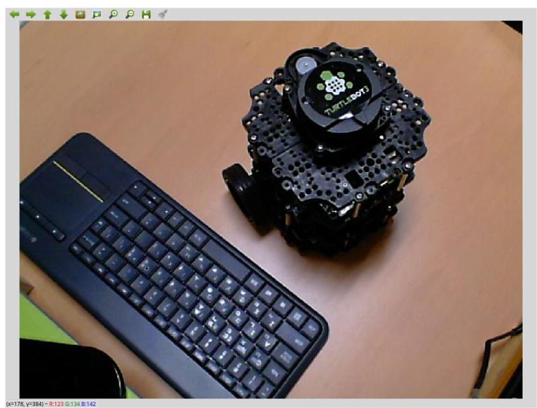

图 8-4 利用image_view节点查看图像视图

**用rqt_image_view节点检查**

我们来利用6.2节中介绍的rqt_image_view。rqt_image_view中有GUI元素的rqt插件image_view。运行rqt_image_view节点将显示如图8-5所示的图像。与image_view 不同, 您还可以在运行后从图像查看器GUI中选择一个话题。

\$ rqt_image_view image:=/image_raw

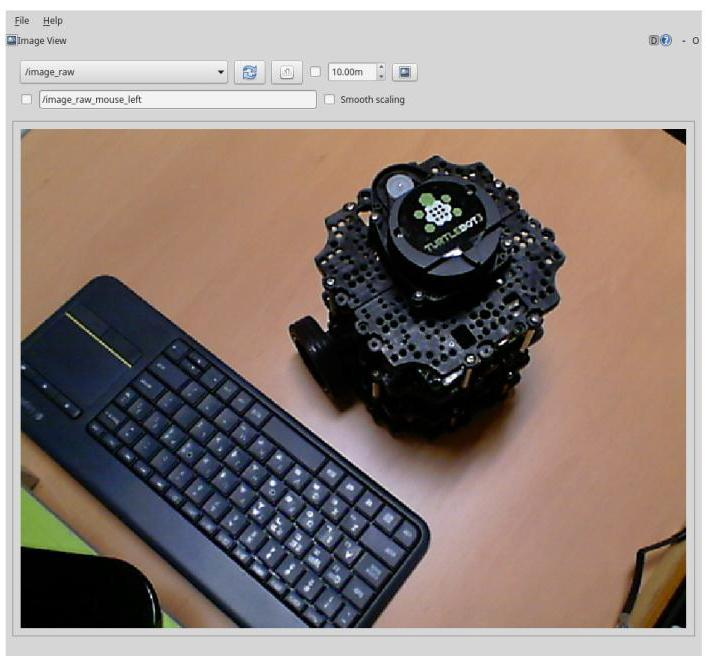

图 8-5 利用rqt_image_view节点查看图像

**用RViz查看**

我们运行一个可视化工具RViz。有关RViz的详细说明，请参见第6.1节。

---

\$rviz

---

RViz运行后, 先更改 “Displays” 选项。单击RViz左下方的[Add], 在[By display type]选项卡中选择[Image]，以此加载图像显示功能，如图8-6所示。

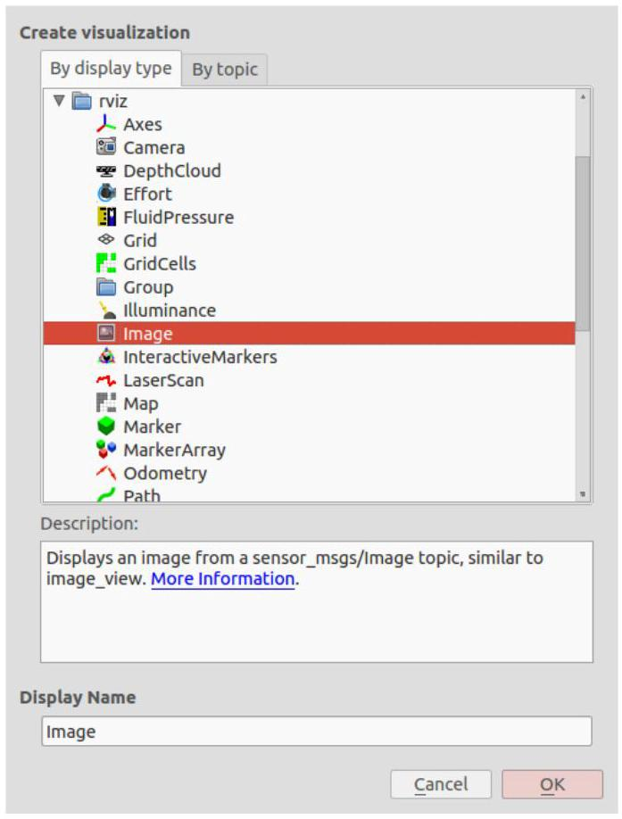

图8-6 将Image Display添加到RViz

然后将[Image] $\rightarrow$ [Image Topic]的值更改为 “/image_raw”。则会如图8-7所示显示图像。如果图像看起来很小, 则可以用鼠标调整该image视图的边缘, 以增加视图尺寸。

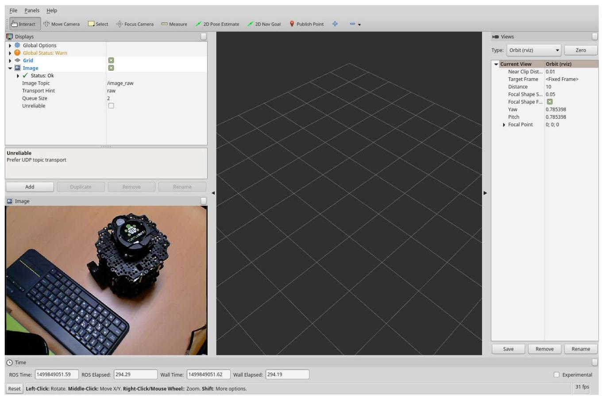

图 8-7 使用RViz查看图像

### 8.3.4. 远程传输图像

在前一节中, 我们在一台计算机上连接USB摄像头并查看了图像。但是, 由于机器人在移动，所以安装在机器人上的相机在跟随机器人移动时无法看到图像。在本节中，我将解释从另一台远程计算机查看安装在机器人上的相机的图像信息的方法。请务必掌握下述说明并亲自操作。

**连接了相机的计算机**

ROS主节点可以在任何一台计算机上运行，但是在这个例子中，将一台连有相机的计算机用作运行ROS主节点的计算机。您需要做的第一件事就是修改网络变量，比如ROS_ MASTER_URI和ROS_HOSTNAME。首先，使用类似gedit的文档编辑程序(sublime text、vim、emacs和nano)，使用以下命令打开bashrc文件。

\$ gedit ~/.bashrc

加载bashrc文件后可以发现已经有很多设置。保持现有的设置不变，到bashrc文件的底部，并按如下所示修改ROS_MASTER_URI和ROS_HOSTNAME变量。请注意，以下示例中的IP地址(192.168.1.100是相机所连接的计算机的IP地址)仅为示例。需要将它修改为自己的IP。检查IP的命令是ifconfig, 这在上面的3.2节中描述。

---

export ROS_MASTER_URI = http://192.168.1.100:11311

export ROS_HOSTNAME = 192.168.1.100

---

然后运行roscore, 并在另一个终端窗口中运行uvc_camera_node节点

---

\$ roscore

\$ rosrun uvc_camera uvc_camera_node

---

**远程计算机**

同样地，在远程计算机上，打开bashrc文件并修改ROS_MASTER_URI和ROS_ HOSTNAME变量。将ROS_MASTER_URI设置为连有相机的计算机的IP，并将ROS_ HOSTNAME变量更改为远程计算机本身的IP(192.168.1.120是远程计算机的IP)。在这里, 192.168.1.120也是一个示例。需要用ifconfig检查自己的IP，并记录到bashrc文件。然后只运行image_view。

---

export ROS_MASTER_URI = http://192.168.1.100:11311

	export ROS_HOSTNAME = 192.168.1.120

\$rosrun image_view image_view image:=/image_raw

---

在本节中, 我们介绍了如何在远程的另一台计算机上检查安装在机器人上的摄像机的图像信息。由于可以远程查看机器人周围环境，所以可以用作遥感机器人、视频会议机器人或者可以将图像信息实时地传输到网络的网络摄像机(即监控系统)。

### 8.3.5. 相机校准

当运行uvc_camera节点时，会得到关于相机校准的警告，例如 “[WARN] [1423194481.257752159]: Camera calibration file /home/xxx/.ros/camera_info/ camera.yaml not found." 。这可以忽略。但是, 当您使用立体相机或用图像测量距离值, 或在处理图像(如物体识别)时，需要进行校准。

为了从相机图像信息获得准确的距离信息，则需要多种附加信息，如每台相机各不相同的镜头特性、镜头与图像传感器之间的距离以及扭转角度等信息。这是因为相机是一个将我们生活的三维空间世界投影到二维空间的图像投影设备, 所以在投影过程中, 由于每台相机的固有特性，这些参数都会不同。

例如, 每台相机的镜头和图像传感器彼此不同, 并且由于相机的硬件结构不同, 镜头和图像传感器之间的距离也各不相同。并且, 在相机制作过程中, 镜头和图像传感器必须水平组装, 但由于细微的偏差, 图像中心 (image center) 与主点 (principal point) 会有细微的偏离, 且图像传感器的倾度也会略有差异。

校准这些部件的过程称为相机校准 (Calibration), 目的是查找相机的固有参数。 摄像机的校准是非常重要的，但在本书中很难处理，所以请参考OpenCV图像处理书籍。

ROS提供的是利用OpenCV相机校准的校准功能包 ${}^{8}$ 。接下来，按照以下章节所述校准相机。

**安装相机校准功能包**

如下所示安装相机校准功能包并运行uvc_camera_node节点。

---

\$ sudo apt-get install ros-kinetic-camera-calibration

\$ rosrun uvc_camera uvc_camera_node

---

接下来，我们来检查当前的相机信息。由于目前还没有关于相机校准的信息，因此将全部显示为默认值。

---

\$ rostopic echo /camera_info

	header:

													seq: 7609

														stamp:

																									secs: 1499873386

																								nsecs: 558678149

---

---

8 http://wiki.ros.org/camera_calibration

---

---

													frame_id: camera

	height: 480

	width: 640

distortion_model: ' '

D: []

K: $\left\lbrack  {{0.0},{0.0},{0.0},{0.0},{0.0},{0.0},{0.0},{0.0},{0.0}}\right\rbrack$

R: $\left\lbrack  {{0.0},{0.0},{0.0},{0.0},{0.0},{0.0},{0.0},{0.0},{0.0}}\right\rbrack$

P: $\left\lbrack  {{0.0},{0.0},{0.0},{0.0},{0.0},{0.0},{0.0},{0.0},{0.0},{0.0},{0.0},{0.0}}\right\rbrack$

	binning_x:0

	binning_y:0

		roi:

												x_offset: 0

												y_offset: 0

												height: 0

													width: 0

														do_rectify: False

	---

---

**准备棋盘**

摄像机的校准是以一个由黑白方块组成的棋盘为基准进行的，如图8-8所示。从下面的地址下载8x6国际象棋棋盘，并打印出来后将其贴到一个平坦的纸箱。有时也会打印成超过1米的棋盘，但这里用的是A4纸。作为参考，8x6棋盘横向有9个方块，所以有8个交叉点, 而竖向有7个方块, 有6个交叉点, 所以它被称为8x6棋盘。

- http://wiki.ros.org/camera_calibration/Tutorials/MonocularCalibration?action=AttachFile&do=vie w&target=check-108.pdf

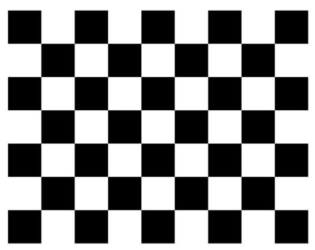

图 8-8 用于校准的国际象棋棋盘(8×6)

**校准**

下面进行相机校准。--size是上述棋盘的宽度和高度, --square 0.024是棋盘的一个小方格的实际尺寸。这个小方块是长宽相同的正方形，但是打印出来的尺寸可能会各不相同。笔者打印出来是24毫米，所以下面命令中写了0.024。

\$ rosrun camera_calibration cameracalibrator.py --size 8x6 --square 0.024 image:=/image_raw camera:=/ camera

校准节点运行后会运行GUI，如图8-9所示。此时，如果用相机对准棋盘，校准将立即开始。在GUI屏幕的右侧，可以看到一个标有X、Y、Size和Skew的条形控件。这是校准的进展状态，都以绿色填满意味着校准完成。在校准过程中需要将棋盘对着相机朝着左/ 右/上/下/前/后移动，还需要倾斜棋盘。

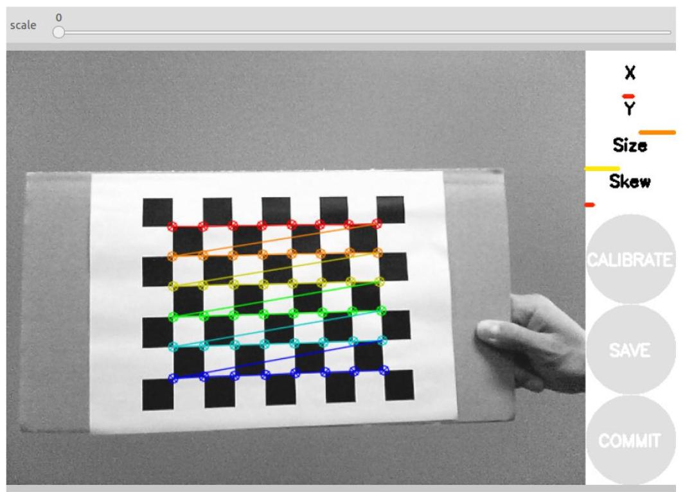

图8-9 校准GUI的初始状态

如图8-10所示，校准所需的所有图像都记录下来之后，CALIBRATE按钮会被激活。 点击这个按钮后会进行实际的校准计算，这需要大约1到5分钟。计算完成后，点击SAVE 按钮保存校准信息。存储的地址显示在执行校准的终端窗口中，是存储在某一个/tmp目录(如 “/tmp/calibrationdata.tar.gz”)中。

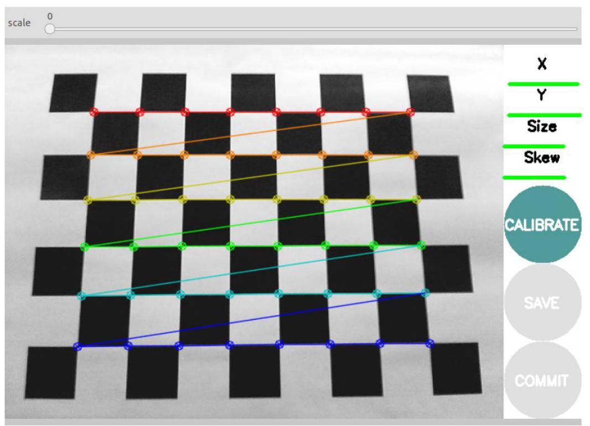

图8-10 利用校准GUI进行的校准过程

**创建相机参数文件**

下面, 我们来创建一个包含相机校准参数的相机参数文件(camera.yaml)。如下例所示，解压缩calibrationdata.tar.gz文件以查看图像文件(*.png)和记录了校准中使用的校准参数的ost.txt文件。

---

	\$ cd /tmp

\$ tar -xvzf calibrationdata.tar.gz

---

接下来, 将ost.txt文件改名为ost.ini, 并使用camera_calibration_parsers功能包的convert节点创建相机参数文件(camera.yaml)。创建完成后，将其保存在~/.ros/ camera_info/目录中，则ROS中使用的相机相关功能包会引用此信息。

---

\$mvost.txt ost.ini

	\$ rosrun camera_calibration_parsers convert ost.ini camera.yaml

	\$ mkdir ~/.ros/camera_info

	\$mv camera.yaml ~/.ros/camera_info/

---

接下来, 打开camera.yaml文件后可以看到如下设置内容。其中, 可以将相机名称 (camera_name)改为任意值。一般来说，与相机相关的功能包通常被称为carmera， 所以笔者将相机名称从原来的narror_stereo改为camera来使用。

~/.ros/camera_info/camera.yaml

---

image_width: 640

image_height: 480

camera_name: camera

camera_matrix:

	rows: 3

	cols: 3

	data: [778.887262, 0, 302.058565, 0, 779.885146, 221.545303, 0, 0, 1]

distortion_model: plumb_bob

distortion_coefficients:

	rows: 1

	cols: 5

	data: [0.195718, -0.419555, -0.002234, -0.016098, 0]

rectification_matrix:

	rows: 3

	cols: 3

	data: $\left\lbrack  {1,0,0,0,1,0,0,0,1}\right\rbrack$

projection_matrix:

	rows: 3

	cols: 4

	data: [794.464417, 0, 294.819501, 0, 0, 805.005371, 220.404173, 0, 0, 0, 1, 0]

---

在这个camera.yaml中, 记录着相机内部矩阵camera_matrix、失真系数 distortion_coefficients、立体相机的整流矩阵rectification_matrix和投影矩阵 projection matrix。各个参数的含义在 "http://wiki.ros.org/image_pipeline/ CameraInfo” 中有详细的描述。最后再次运行uvc_camera_node节点。这一次，确保您目前没有出现关于校准文件的警告。

---

\$ rosrun uvc_camera uvc_camera_node

[INFO] [1499873830.472050095]: using default calibration URL

[INFO] [1499873830.472116471]: camera calibration URL:

file:///home/xxx/.ros/camera_info/camera.yaml

---

另外,如果查看/camera_info话题,则可以看到D、K、R和P参数已被填充, 如以下示例所示。

---

\$rostopic echo /camera_info

header:

seq: 2213

stamp:

	secs: 1499874042

nsecs: 898227060

frame_id: camera

height: 480

width: 640

distortion_model: plumb_bob

D: [0.195718, -0.419555, -0.002234, -0.016098, 0.0]

K: [778.887262, 0.0, 302.058565, 0.0, 779.885146, 221.545303, 0.0, 0.0, 1.0]

R: $\left\lbrack  {{1.0},{0.0},{0.0},{0.0},{1.0},{0.0},{0.0},{0.0},{1.0}}\right\rbrack$

P: [794.464417, 0.0, 294.819501, 0.0, 0.0, 805.005371, 220.404173, 0.0, 0.0, 0.0, 1.0, 0.0]

binning_x:0

binning_y:0

roi:

x_offset:0

y_offset:0

height: 0

width: 0

do_rectify: False

---

---

## 8.4. 深度相机(Depth Camera)

Depth Camera(深度相机)有多种名称，在类似LDS(laser distance sensor, 激光距离传感器)的范畴内被称为Depth sensor，可以获得彩色图像时也被称为RGB-D camera，而微软公司成功普及的深度相机被称为Kinect Camera。在本节中，为了防止产生混淆, 将其统一称为Depth camera。

### 8.4.1. Depth Camera的类型

根据获取信息的方法, Depth camera可以被分成多种类型, 诸如ToF (Time of flight、飞行时间) ${}^{9}$ 、结构光(Structured Light) ${}^{10}$ 和立体(Stereo) ${}^{11}$ 方法、等。

**ToF (Time of Flight)**

ToF方法是发送红外线后利用返回所需的时间测量距离。通常, IR发光部和收光部是成对的(例如使用红外相机的产品。但在另一些产品中却不是如此)，并读取由每个像素测量的距离。ToF方法比后面将介绍的利用相干辐射模式的结构光方式更昂贵的原因是这种结构方面的原因提高了硬件的价格(最近，引入了使用相位差的距离计算方法，因此价格在下降)。

采用ToF方式的传感器有Panasonic的D-IMAGER、MESA Imaging的SwissRan ger、Fotonic的FOTONIC-B70、pmdtechnologies的CamCube和CamBoard、 SoftKinectic的DepthSense DS系列以及微软最新发布的Kinect 2。

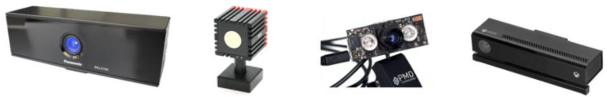

图 8-11 从左边起, D-IMager、SwissRanger、CamBoard和Kinect2

**结构光 (Structured Light)**

结构光方式的代表性产品是微软的Kinect和华硕的Xtion，它们使用相干辐射模式 (pattern of coherent radiation, 利用US20100225746专利) 。此外, 还有 PrimeSense的Carmine和Capri以及最近的Occipital的Structure Sensor。这些传感器的共同点是都使用PrimeSense公司的PrimeSense片上系统(SoC)。

---

11 https://en.wikipedia.org/wiki/Range_imaging

---

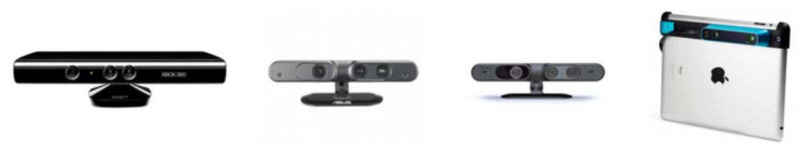

图8-12 从左边起, Kinect、Xtion、Carmine和Structure Sensor

使用PrimeSense公司的 PrimeSense SoC的Depth Camera是一款由一个红外投影仪和一个红外相机组成的传感器，它使用了现有的ToF方法中从未使用的相干辐射模式。 该技术解决了现有ToF方式的硬件昂贵的问题和外部干扰等问题，因此备受关注。而且搭载了PrimeSense公司的PrimeSense SoC的Carmine和Capri也面世了。另外，采用了相同SoC芯片的微软Kinect成为了Xbox的控制器之后人气飞涨。也因为有这款SoC，华硕也能推出面向普通PC用户的Xtion了。这些都是配备了PrimeSense SoC的传感器。

但是, 苹果在2013年12月收购PrimeSense时出现了问题。PrimeSense的Carmine 和Capri产品已经不再可用，而且微软的Kinect也停产，而华硕的Xtion也即将停产(库存除外)。Occipital公司的Structure Sensor是采用PrimeSense SoC的最后一款产品, 目前是将此产品作为苹果的附件出售，但无法知道未来会发生什么。以低价流行的产品已经隐藏在历史中。

**立体(Stereo)相机**

作为Depth Camera类型之一的立体相机 (见图8-13) 是比前两种类型研究了更长时间的相机，其距离是使用双眼视差来计算的，如人的左眼和右眼。顾名思义，立体相机配置了相隔一定距离的两个图像传感器，并利用这两个图像传感器捕获的两幅图像之间的差异来计算距离值。代表性的产品包括Point Grey的Bumblebee相机和韩国InRobot公司的OjOcamStereo。

立体照相机的类型很多, 最近脱颖而出的有两种, 分别是双红外图像传感器, 以及内置一个红外线投影仪和两个图形传感器的传感器。其中后一种利用红外线投影仪以一定的模式发射肉眼看不见的红外线，并且用两个图形传感器接收之后通过三角测量法计算出距离。为了与上述一般的立体相机区分开，将前者称为无源(passive)立体相机，而后者也称为有源(active)立体相机。后一种类型的相机的主要产品是Intel的RealSense。 R200型号是约100美元左右，在目前的Depth Camera产品中是最便宜的产品，而且尺寸小，性能也和前面介绍的Xtion类似。此外，被认为是RealSense的下一代产品的D400系列尽管属于低价产品，但因为小尺寸、广视角、野外可用、测距范围提升等原因，在机器人工程领域广为所用。

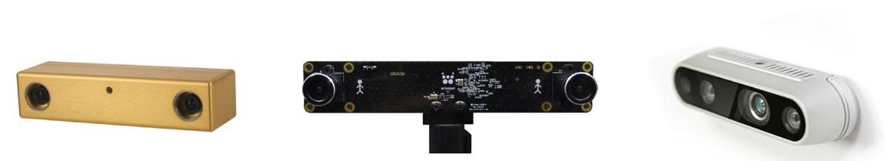

图 8-13 从左边起, Bumblebee、OjOcamStereo和RealSense

### 8.4.2. Depth Camera测试

为了进行安装和运行Depth camera的驱动程序, 本节将使用英特尔的RealSense R200。

**安装与RealSense相关的功能包**

下载并安装与RealSense相关的驱动程序和可执行功能包。

\$ sudo apt-get install ros-kinetic-librealsense ros-kinetic-realsense-camera

运行r200_nodelet_default启动文件

运行realsense_camera功能包中的r200_nodelet_default.launch文件。

---

\$ roscore

\$ roslaunch realsense_camera r200_nodelet_default.launch

---

如上所述运行后，如果功能包未能安装或工作异常，则有时可能需要对不同的Linux 内核进行不同的设置。这在下面的维基地址详细描述。

- http://wiki.ros.org/librealsense

### 8.4.3. Point Cloud Data(点云数据)的可视化

Depth Camera与对象物体的三维空间距离被表示为空间中的一个点, 而这些点的集合体与云相似，因此这些数据被称为Point Cloud Data(点云数据)。下面为了在GUI环境中检查点云数据，运行RViz并按以下顺序更改显示选项。

1 将[Global Options] $\rightarrow$ [Fixed Frame]更改为 “camera_depth_frame”。

② 单击RViz左下角的[Add]按钮，然后选择[PointCloud2]来添加它。在详细设置中将Topic设为camera/ depth/points，然后选择所需形状的大小和颜色。

③ 完成所有设置后，可以看到PCD值，如图8-14所示。由于颜色基准设为X轴，因此离X轴越远，越接近紫色。

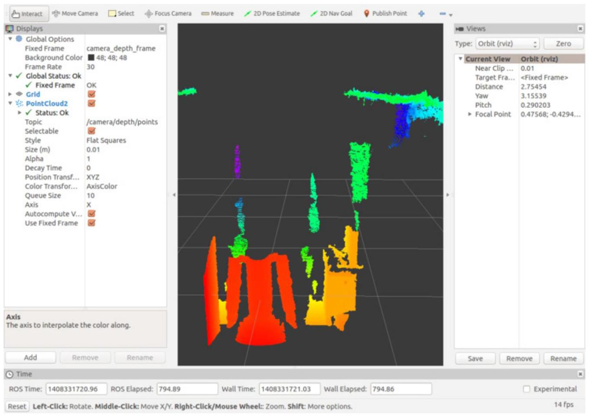

图 8-14 从RViz的PointCloud2显示屏观察到的点云数据

如果使用的是其他深度相机，请查看以下地址的wiki，了解各种相机的操作方法和功能包的用法。

---

- http://wiki.ros.org/Sensors#A3D_Sensors_.28range_finders_.26_RGB-D_cameras.29

---

### 8.4.4. Point Cloud Data相关库

**Point Cloud Library**

Depth Sensor根据获取信息的方法的不同，分为LDS和Depth Camera，这个类别的所有距离传感器都将与物体相距的距离显示为一个点, 并处理点的集合Point Cloud。作为使用该点云的API的集合，用的最多的是叫做PCL(Point Cloud Library) ${}^{12}$ 的库，功能包括滤波、分割、表面重构、用模型拟合或提取特征，等。

**OpenNI**

OpenNI (Open Natural Interaction, 开放自然交互) ${}^{13}$ 是以PrimeSense公司为中心, 与Willow Garage和ASUS一起, 为了使用这几家公司的产品而开发的驱动程序和多种API库。在这里, NI (Natural Interaction, 自然交互) 是指人与机器之间的交流, 这个词意味着这个交流基于人的感觉而非键盘和鼠标的交互。带有PrimeSense SoC的大多数传感器都使用此驱动程序。

类似的形式有微软的Kinect Windows SDK和Libfreenect, 后者曾经是第一次破解 Kinect并免费发布的驱动程序。除了Ponit Cluud Data的基本驱动程序之外，OpenNI还包括处理人体骨架的中间件，如NITE。PrimeSense被苹果公司收购后，OpenNI一度被置于废弃的边缘，但现在Occipital公司在其Github存储库 ${}^{14}$ 中提供OpenNI ${}^{15}$ 。

## 8.5. 激光距离传感器

激光距离传感器 (Laser Distance Sensor, LDS) 有多种名称, 比如激光雷达 (LIDAR) 、激光测距仪 (Laser Range Finder, LRF) 和激光扫描仪 (Laser Scanner)。LDS是利用激光光源来测量与物体的距离的传感器。LDS传感器具有高性能、高速度和实时数据采集的优点，因此在距离测量方面有着广泛的应用。由于这些优点, 它是在机器人领域被广泛使用的传感器, 比如用于使用距离传感器的SLAM

---

12 http://pointclouds.org/

13 http://en.wikipedia.org/wiki/OpenNI

14 https://github.com/occipital/openni2

15 https://structure.io/openni

---

(Simultaneous Localization and Mapping) 或用于识别人或物体识别。由于其优越的实时性能，最近还被广泛用于无人驾驶车辆。

典型的产品是在室内广泛使用的Hokuyo的URG系列，如图8-15所示。多用于室外的产品有SICK和Velodyne的配有多个激光传感器的HDL系列。这些传感器最大的问题是价格。一般来说, 不同产品的价格不尽相同, 但大多是几千美元左右, 而其中Velodyne 的HDL系列是几万美元的产品。弥补这些缺点的中国产品 (如RPLIDAR) 以400美元左右的低价进入了市场，而近期则出现了韩国的一家公司推出的一款100多美元的LDS (HLS-LFCD2) ${}^{16}$ 。

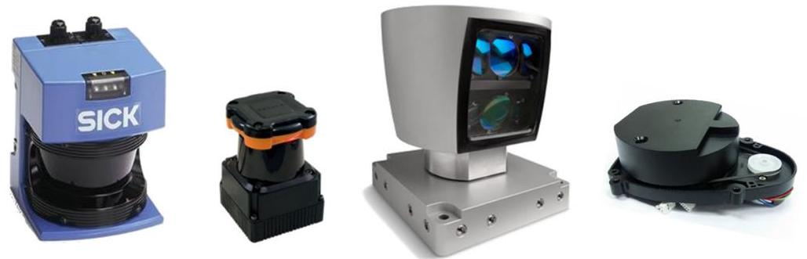

图8-15 从左边起, SICK LMS 210、Hokuyo UTM-30LX、Velodyne HDL-64e和HLS-LFCD LDS

### 8.5.1. LDS传感器距离测量原理

LDS传感器在测量距离时利用激光被物体反射时出现的波长。问题在于这里使用的激光器受控制和价格问题，所以大多数制造商只使用一个激光源。作为参考，价格高达数万美元或更多的Velodyne公司的HDL系列使用的激光器少则16个，多达64个。除此之外大多只使用一个激光器。为了克服这个问题，典型的LDS由一个激光器、一个反射镜和电机组成。当使用LDS时，会听到电机声音，因为它会旋转内部的反射镜，以在水平面内发射激光。测量范围通常是从180度到360度, 取决于具体产品。

图8-16的左侧是LDS的内部结构, 可以看到内部有一个激光器和一个倾斜的反射镜, 在选择反射镜的过程中测量激光的返回时间(准确地说是波长的差异)。这样，如中间所示，可以扫描到以LDS为中心的水平面上的物体。但缺点是，如右图所示，随着距离变长，准确度降低。

---

16 http://wiki.ros.org/hls_lfcd_lds_driver

---

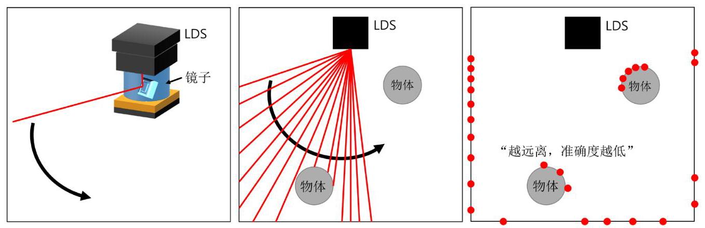

图8-16 使用LDS进行距离测量

用户不需要知道LDS的工作原理。这里包含了这个内容的原因是, 因为这种原理, 在测量时有一些要注意的地方。

第一，由于激光被用作光源，强烈的激光束可能会损伤眼睛。不过由于产品分为不同的等级，购买产品时需要注意。一般来说，激光等级分为1级到4级，数字越高越危险。1 级是安全的产品，与眼睛直接接触也没有问题，2级和2级以上会在长时间接触时有风险。 上述的LDS对应于1级。

第二，由于LDS利用反射光，因此如果不发生反射，则无法测量。换句话说，如透明玻璃、PET瓶和玻璃杯等不发生反射而散射到许多方向的物体是无法用LDS准确识别的。 而且, 由于激光在镜面上会发生镜面反射, 因此无法获得准确的值。

第三，由于LDS在水平面发射激光，所以传感器仅检测水平面上的物体。换句话说， 您需要理解这是2D数据(某些LDS会旋转传感器本身，并以3D方式进行测量)。

### 8.5.2. LDS测试

支持LDS的典型的ROS功能包包括支持SICK LDS的sicks300、sicktoolbox和 sicktoolbox_wrapper功能包, 还有支持Hokuyo公司的LDS的hokuyo_node和urg_ node功能包，以及支持velodyne公司的LDS的velodyne功能包。还有支持RPLIDAR的 rplidar功能包, 以及支持TurtleBot3所配备的LDS的hls_lfcd_lds_drive功能包。

**安装hls_lfcd_lds_driver功能包**

在本节中，我们将使用HLDS(日立-LG数据存储)公司的LDS(HLS-LFCD2)进行测试，因此安装hls_lfcd_lds_driver功能包 ${}^{17}$ 。

---

\$ sudo apt-get install ros-kinetic-hls-lfcd-lds-driver

---

**LDS连接和更改使用权限**

HLDS的LDS是USB类型的, 因此可以通过将其插入计算机的USB端口来进行连接。 当连接建立时，它会被识别为 “ttyUSB*”，所以让我们如下设置权限(注意，在这里被识别为ttyUSB0)。

---

	\$ 1s -1 /dev/ttyUSB*

crw-rw--- 1 root dialout 188, 0 Jul 13 23:25 /dev/ttyUSB0

---

在上面的结果中可以看到, ttyUSB0的使用权限还未被赋予。我们用chmod命令设置权限，如下所示。

---

\$ sudo chmod a+rw /dev/ttyUSB0

\$1s -1/dev/ttyUSB*

crw-rw-rw- 1 root dialout 188, 0 Jul 13 23:25 /dev/ttyUSB

---

您可以使用chmod命令验证是否已更改使用权限。

**运行hlds_laser启动文件**

为了运行hlds_laser启动文件，在运行了roscore的情况下运行以下命令。

---

\$ roslaunch hls_lfcd_lds_driver hlds_laser.launch

---

**检查scan数据**

运行hlds_laser节点，则会将LDS值发送到 “/scan” 话题。我们用rostopic echo命令检查这个值，如下所示。

---

17 http://wiki.ros.org/hls_lfcd_lds_driver

---

---

\$ rostopic echo /scan

header:

												seq: 49

												stamp:

																							secs: 1499956463

																						nsecs: 667570534

												frame_id: laser

	angle_min: 0.0

	angle_max: 6.28318548203

	angle_increment: 0.0174532923847

	time_increment: 2.98899994959e-05

scan_time: 0.0

	range_min: 0.119999997318

range_max: 3.5

ranges: [0.0, 0.47200000286102295, 0.4779999852180481, 0.48399999737739563, 0.4909999966621399,

0.4970000088214874, 0.0, 0.5099999904632568,

---

在扫描信息中，frame_id设置为laser，测量角度为6.28318548203弧度(= ${360}^{ \circ  }$ )。 您还可以看到增量为 ${1}^{ \circ  }$ (0.0174532923847 rad = 1°)，测量距离范围是0.11米到3.5米， 而且将距离值按测量角度的顺序记录在发布的数组中。

### 8.5.3. 可视化LDS的距离值

现在为了在GUI环境中检查LDS距离信息，运行RViz，并按以下顺序更改显示选项。

\$ rviz

① 将RViz右上方的Views的Type设置为“TopDownOrtho”，将其变成XY平面视图，以便轻松查看二维距离信息。

② 将RViz左上角的[Global Options] $\rightarrow$ [Fixed Frame]更改为“laser”。

③ 单击RViz左下角的[Add]按钮，然后从显示中选择[Axes]来添加它。如图8-17所示，更改细节设置 (Length和Radius)。

④ 单击RViz左下角的[Add]按钮，然后从显示屏中选择[LaserScan]来添加它。如图8-17所示，更改细节设置 (Topic、Color Transformer和Color)。

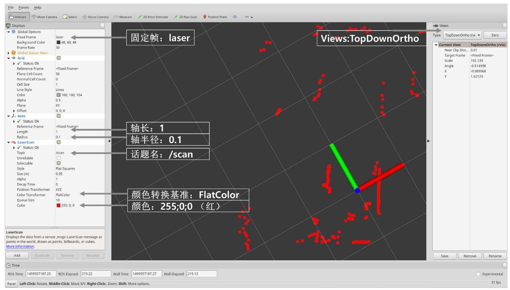

图8-17 在RViz上显示LaserScan

完成所有设置后，可以看到在中间红色(x轴)和绿色(y轴)所示坐标系的z轴周围扫描到了物体，并以点的形式显示出来，如图8-17所示。由于灰色网格的边长设为1米， 因此可以通过与现实的比较来确认。

将上述操作作为预先配置的启动文件来运行，效果也是相同的。 下面使用命令一次检查RViz中的激光值。

\$ roslaunch hls_lfcd_lds_driver view_hlds_laser.launch

### 8.5.4. LDS的应用

LDS有着无限的应用, 一个典型的例子是SLAM (Simultaneous Localization And Mapping) ${}^{18}$ 。SLAM是在机器人上安装LDS，用它识别机器人周围的障碍物，并通过估计自身的位置来创建地图, 如图8-18所示。在第11章里将详细介绍SLAM。

---

18 https://en.wikipedia.org/wiki/Simultaneous_localization_and_mapping

---

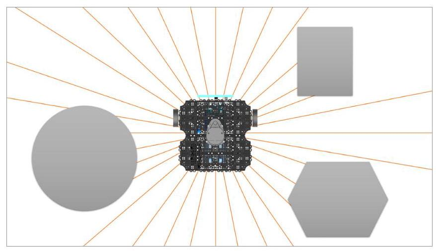

图8-18 LDS的应用:移动机器人的障碍物检测

作为LDS的另一个例子, LDS可以检测周围的各种物体, 感知人的脚或身体的位置, 如图8-19所示，并通过匹配周围情况来预测当前的行为。在第10章和第11章中，将利用安装了LDS的机器人更详细地介绍LDS的实际应用。

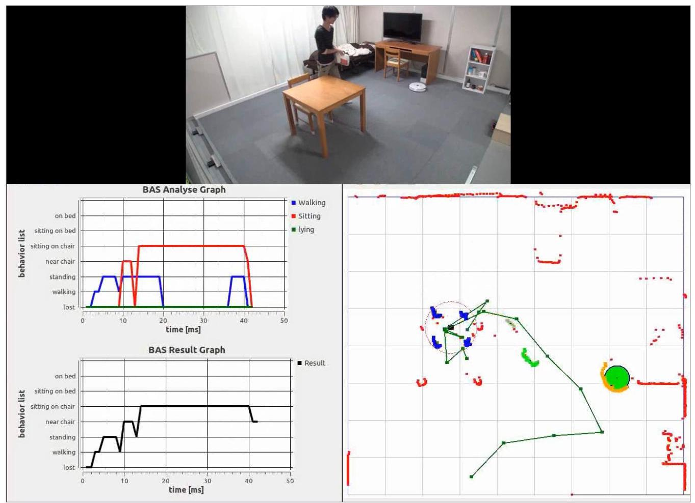

图8-19 使用LDSF的应用:检测人员和移动物体

## 8.6. 电机功能包

最近添加到ROS Wiki中的Motors页面 ${}^{19}$ 是ROS支持的所有电机和伺服控制器的说明页面。目前有支持PhidgetMotorControl HC、Roboteq AX2550 Motor Controller和 ROBOTIS Dynamixel的功能包。

### 8.6.1. Dynamixel舵机

Dynamixel系列是由减速箱、控制器、驱动单元和通信单元组成的模块，并且可以向主机反馈位置、速度、温度、负载、电压和电流等物理量。因为它可以通过总线方法连接和控制，从而可以非常简单地设计机器人。除了基本的位置控制之外，还可以使用广泛应用于机器人的速度控制和转矩控制(部分系列)。

因为有这些丰富的功能, Dynamixel被广泛应用于机器人领域。将Dynamixel应用于机器人的方法有两种:一种是通过U2D2(将在第13章讨论的通信转换设备)将控制命令从计算机传送到舵机的方法，还有一种是直接通过OpenCR(将在第9章讨论)等嵌入式控制器来控制舵机的方法。为了在如此多样的环境中使用Dynamixel，此舵机支持叫做DynamixelSDK ${}^{20}$ 的开发环境。这个开发环境支持三种主要的操作系统(Linux、 Windows和MacOS)且支持C、C++、C#、Python、Java、MATLAB和LabVIEW 等多种编程语言。此外还支持Arduino和ROS功能包，因此在ROS中也可以很容易地使用Dynamixel。支持Dynamixel的典型功能包是dynamixel_motor、arbotix和 dynamixel_workbench ${}^{21}$ 。前两个是社区用户提供的功能包，后者是由ROBOTIS官方提供的功能包。dynamixel_workbench使用官方DynamixelSDK，通过ROS中的 GUI工具支持电机设置和位置/速度/转矩控制。本书中将要详细讨论的TurtleBot3也将 Dynamixel作为舵机来使用。有关这些电机的说明，请参见第9章“嵌入式系统”和第10 章“移动机器人”。

---

20 http://wiki.ros.org/dynamixel_sdk

21 http://wiki.ros.org/dynamixel_workbench

---

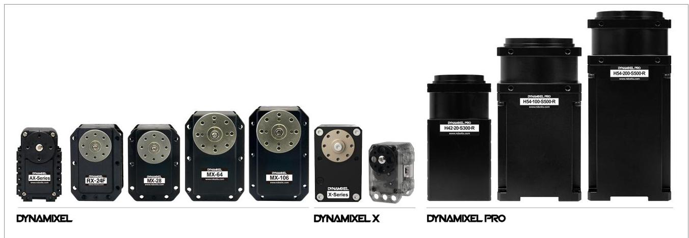

图8-20 Dynamixel系列舵机

## 8.7. 已公开的功能包的用法

ROS上已经发布了多少个功能包呢? 截至2017年7月，ROS Kinetic提供了大约1600 个功能包 (http://repositories.ros.org/status_page/ros_kinetic_default.html) , 用户开发和发布的功能包可能有一些重复, 但也有大约5,000个 (http://rosindex.github.io/stats/)。在本节中，您将学习如何从公开了的功能包中搜索并安装和使用所需的功能包。

首先访问下面网页，点击上方的ROS版本中的“kinetic”，可以看到ROS的最新版本 “kinetic”的功能包列表，如图8-21所示。

- http://www.ros.org/browse/list.php

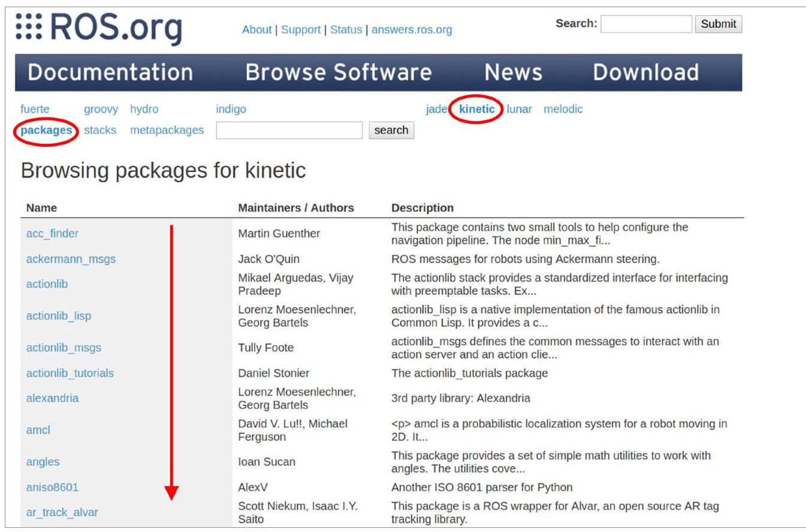

图8-21 ROS功能包列表

这个列表是为ROS Kinetic版本发布的功能包。数一数有大约1600个。之前的LTS版本Indigo发布了2900多个功能包。作为参考，有些是同一个功能包在ROS版本升级时持续提供兼容版，也有一些是由于开发终止，所以在新版本不提供兼容的功能包。但是，即使ROS的版本不同，也会有一些兼容性，所以只要对旧版本的功能包进行一点修改，也可以在新版本的ROS中使用。那么如何使用这些功能包呢? 我们来看下一节。

### 8.7.1. 搜索功能包

为了在公开的ROS功能包中找到所需的功能包，请在网页http://wiki.ros.org/上的搜索框中输入关键词，则会在网站上显示搜索词的搜索结果。例如，如果您键入 “find object”并单击“Submit”按钮，则可以查看与您输入的关键词匹配的各种功能包的信息和提问。

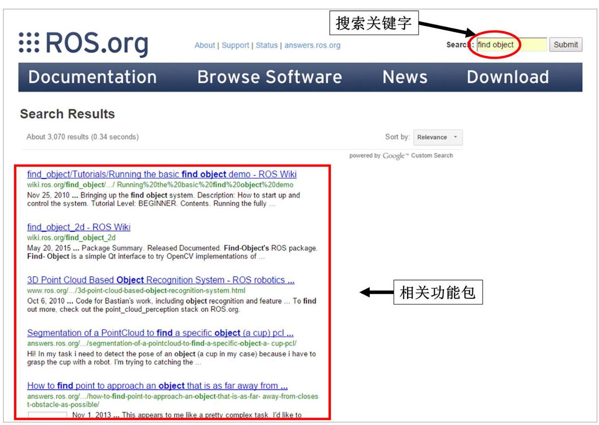

图8-22 如何搜索功能包

如果关键词合适，则会显示相关的功能包，如图8-22所示。有很多相关的功能包，但是在这里我们将使用上数第二个 “find_object_2d-ROS Wiki” 中的 “find_object_2d” 功能包。点击 “find_object_2d-ROS Wiki” 将打开find_object_2d功能包的wiki页面，如图8-23所示。在这个页面上，您可以看到加载该功能包时使用的构建系统是catkin 还是rosbuild, 是谁创建的, 以及它的开源许可证的类型。先点击上方的kinetic按钮, 查看kinetic版本的信息。这个页面列出了依赖包(点击右边的Dependencies)、项目的Web页面的链接(External website)、功能包的存储库地址以及功能包的用法。其中，一定要检查功能包的依赖关系。

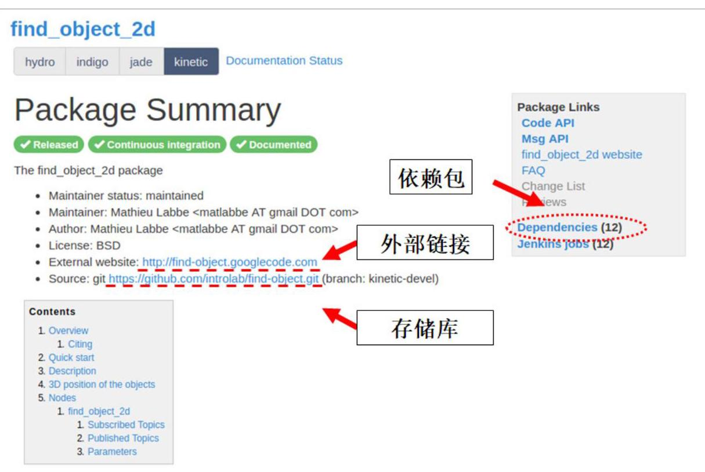

**1. Overview**

Simple Qt interface to try OpenCV implementations of SIFT, SURF, FAST, BRIEF and other feature detectors and descriptors. Using a webcam, objects can be detected and published on a ROS topic with ID and position (pixels in the image). This package is a ROS integration of the $\Theta$ Find-Object application.

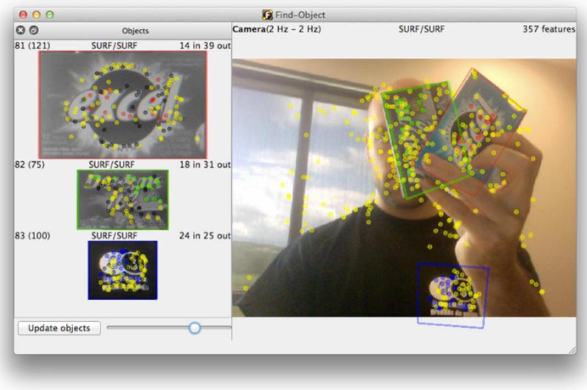

图8-23 功能包的信息

### 8.7.2. 安装依赖包

可以在find_object_2d功能包的wiki页面 ${}^{22}$ 中查看功能包相关性(Dependen cies)，则可以看到此功能包总共依赖于12个不同的功能包。

---

- catkin

- cv_bridge

- genmsg

- image_transport

- message_filters

	pcl_ros

	roscpp

	rospy

		- sensor_msgs

- std_msgs

	std_srvs

- tf

---

使用rospack list命令或rospack find命令确认是否安装了必要的功能包。

**使用rospack list命令确认**

---

	\$ rospacklist

actionlib /opt/ros/kinetic/share/actionlib

actionlib_msgs /opt/ros/kinetic/share/actionlib_msgs

actionlib_tutorials /opt/ros/kinetic/share/actionlib_tutorials

---

**使用rospack find命令确认(如果已安装)**

---

	\$ rospack find cv_bridge

/opt/ros/kinetic/share/cv_bridge

---

---

22 http://wiki.ros.org/find_object_2d

---

使用rospack find命令确认(如果尚未安装)

---

\$ rospack find cv_bridge

[rospack] Error: package 'cv_bridge' not found

---

如果未安装，请检查相应功能包的wiki页面上的安装方法并按如下所示进行安装。

---

\$ sudo apt-get install ros-kinetic-cv-bridge

---

此外, 维基页面 (http://wiki.ros.org/find_object_2d) 中的 "2. Quick start" 中的 "find_object_2d" 功能包被描述为能够使用uvc_camera功能包(http://wiki.ros.org/uvc_camera)，所以我们也安装uvc_camera功能包。

---

\$ sudo apt-get install ros-kinetic-uvc-camera

---

### 8.7.3. 安装功能包

如果您已经安装了所有的依赖包，那么接下来安装find_object_2d。典型的安装方法有二进制安装和下载后构建源代码的方式。在图8-23的功能包信息中，单击存储库中的链接, 转到Github地址, 这里有安装方法的说明。

**二进制安装**

---

\$ sudo apt-get install ros-kinetic-find-object-2d

---

**安装源程序**

---

\$ cd ~/catkin_ws/src

\$ git clone https://github.com/introlab/find-object.git

\$cd ~/catkin_ws/

\$ catkin_make

---

以下功能包与ROS没有直接关系，但是它们使用find_object_2d功能包中的OpenCV 和Qt库，因此您需要在安装之前安装它们。

---

\$ sudo apt-get install libopencv-dev 	// 安装OpenCV

\$ sudo apt-get install libqt4-dev 	// 安装Qt

---

### 8.7.4. 运行功能包

按照find_object_2d功能包的说明运行功能包。首先启动roscore，然后在另一个终端窗口中使用以下命令启动相机节点。

\$ roscore

\$ rosrun uvc_camera uvc_camera_node

然后打开另一个终端窗口并运行find_object_2d节点，如下所示。

---

\$ rosrun find_object_2d find_object_2d image:=image_raw

---

将检测对象的图像保存为PNG、JPEG等通用的图像文件格式，并将其拖放到已执行的GUI程序中。在这里，我们将下面两个图片用作检测对象，如图8-24所示。

**find_object_2d ::: ROS.org**

图 8-24 两个要检测的对象

现在我们尝试对象检测。准备图8-24的要检测的图像和其他非检测图像混在一起的图像, 并将其打印后放到相机前面, 如图8-25所示。 您可以看到两个字符串分别被一个矩形包围，说明被正确检测到。

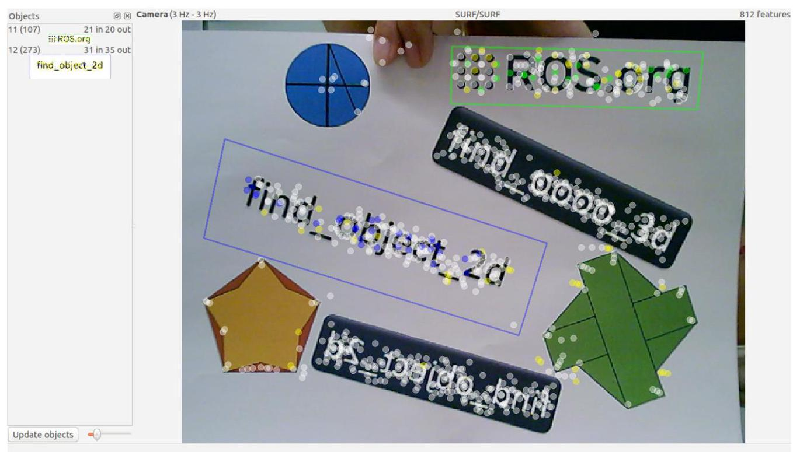

图8-25 两个检测到的对象

您还可以在终端窗口中使用rostopic echo命令来查看/object话题，或运行print_ objects_detected节点以查看搜索到的对象的信息。当使用此功能包创建新功能包时，如果通过话题接收该坐标值，那么可以充分创建其他的应用功能包。

rostopic echo /object

rosrun find_object_2dprint_objects_detected

随着ROS开始被广泛使用, 在ROS公开的功能包正在迅速增加。正如我在本节中所解释的那样, 如果您知道如何在需要的时候查找和运用功能包, 那么您可以依靠那些一直专注并努力工作的人们的成果，能够向前跨越一步，将时间集中花费在真正需要的部分。这是ROS的基本理念。知识逐渐积累并上升到更高的阶段，以此带来机器人技术的发展。

至此, 说明了如何使用开源的功能包的例子。有关功能包的详细的用法, 请参阅ROS Wiki。
