# 第10章 移动机器人

## 10.1. ROS支持的机器人

ROS支持的机器人可以在相关wiki(http://robots.ros.org/)上找到。有大约180 种。其中一些包括由个人开发者公开发布的自制机器人，但是如果考虑到这是由单一系统支持的机器人的话, 却是不少的数量。其中最著名的是Willow garage开发的PR2和 TurtleBot。两者都是Willow garage或Open Robotics(前称OSRF)参与开发的机器人，也是ROS的标准平台。在本章中，我们将重点讨论这两者中以普及型为目的开发的 TurtleBot3机器人。

## 10.2. TurtleBot3系列机器人

TurtleBot是ROS的标准平台机器人。这里的turtle来源于1967年开发的乌龟机器人。这款机器人是为了用教育计算机编程语言Logo ${}^{1}$ 控制实际机器人而开发的。另外,在 ROS基础教程中首先出现的turtlesim节点是一个模仿Logo turtle ${}^{2}$ 程序的命令体系而制作的程序。如图10-1所示，乌龟图标甚至成为了ROS的象征。不仅如此，ROS标志中使用的9个点也来自龟背壳。源于Logo的乌龟的Turtlebot，旨在通过TurtleBot向ROS新手轻松教授ROS的用法(这与Logo的目的类似, Logo的目的是利用Logo语言轻松教授计算机编程语言)。从第一代TurtleBot开始，近10年来，TurtleBot已经成为开发者和学生使用最多的ROS标准平台。

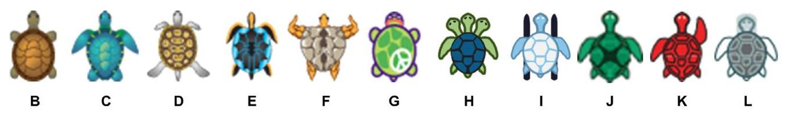

图 10-1 ROS各版本的图标

TurtleBot系列 ${}^{3}$ 有1、2和3版本(见图10-2)。TurtleBot1由Willow Garage的Tully (现为Open Robotics Platform Manager) 和Melonee(现为Fetch Robotics CEO)

---

1 http://el.media.mit.edu/logo-foundation/index.html

2 http://el.media.mit.edu/logo-foundation/what_is_logo/logo_primer.html

3 http://www.turtlebot.com/about

---

为了普及ROS，以iRobot公司的基于Roombar的研究机器人Create为基础而开发 ${}^{4}$ 。它于2010年开发，自2011年起开始销售。然后在2012年，Yujin Robot公司开发出了以基于 iCLEBO的研究机器人Kobuki为基础的TurtleBot2。在2017年开发的TurtleBot3弥补了 TurtleBot1和TurtleBot2中的不足点，且采纳了用户们的新的需求。TurtleBot3的驱动部采用了ROBOTIS公司的智能舵机Dynamixel。

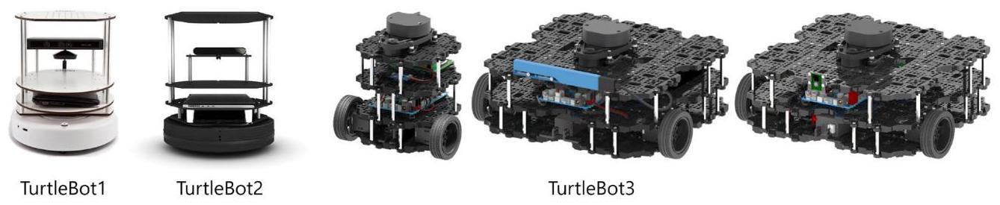

图 10-2 TurtleBot1(左1)、TurtleBot2(左2)和TurtleBot3(右侧3种机器人)

TurtleBot3是一个小型、低成本、可编程的基于ROS的移动机器人，其目的是用于教育、科研、爱好者作品和产品原型。TurtleBot3的目标是在不牺牲功能和品质的前提下大幅缩小平台的尺寸且降低价格, 同时将机器人组件根据用户的需求更改或扩展。根据用户如何选择部件，如机械部件、计算机和传感器，TurtleBot3可以通过各种方法进行定制。 此外, TurtleBot3采用了比现有的PC更经济、更小巧, 并且适合嵌入式系统的SBC (单板计算机)，还应用了距离传感器和3D打印等最新技术。

## 10.3. TurleBot3的硬件

如图10-3, TurtleBot3 ${}^{5}$ 有TurtleBot3 Burger、Waffle和Waffle Pi三种官方型号。如不特指, 本书中将以TurtleBot3 Burger为例进行说明。此外, TurtleBot3还有如TurtleBot3 Monster、Tank、Carrier等TurtleBot3 + 【后缀】的多种型号。 TurtleBot3的基本组件有:用于驱动的舵机、用于运行ROS的SBC、用于SLAM和导航 (Navigation) 的传感器、可变形的结构件、用作中层控制器的嵌入式控制器 OpenCR、兼容轮胎和履带的链轮，最后还有11.1V的锂聚合物电池。Waffle型号的特

---

4 http://spectrum.ieee.org/automaton/robotics/diy/interview-turtlebot-inventors-tell-us-everything-about-the-robot

5 http://turtlebot3.robotis.com

---

点是:其形状更易于装载物体、采用扭矩更大的舵机、采用基于Intel处理器的SBC、使用360度距离传感器LDS(Laser Distance Sensor)，还有用于三维识别的深度摄像机 (Depth Camera) Intel RealSense。TurtleBot3 Waffle Pi与Waffle具有相同的外形, 但Waffle Pi的单板机采用了与Burger相同的Raspberry Pi，并且相机采用了Raspberry Pi Camera，因此大大提高了性价比。

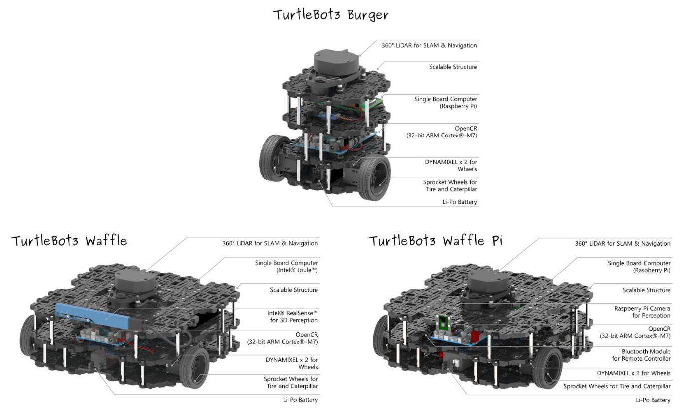

图 10-3 TurtleBot3的硬件配置

此外, TurtleBot的所有硬件结构信息都已在云共享三维CAD Onshape中公开, Onshape可供多人同时使用智能手机、平板电脑以及网页浏览器查看 。您可以在网页浏览器中查看TurtleBot3的每个组件，也可以把想修改的零件下载到您的资源库，通过修改设计出自己想要的零件。也可以下载相关的STL文件后，用3D打印机打出零件。每个型号的公开文件可以在TurtleBot3的官方wiki ${}^{6}$ 的附录提供的Open Source项目中找到。

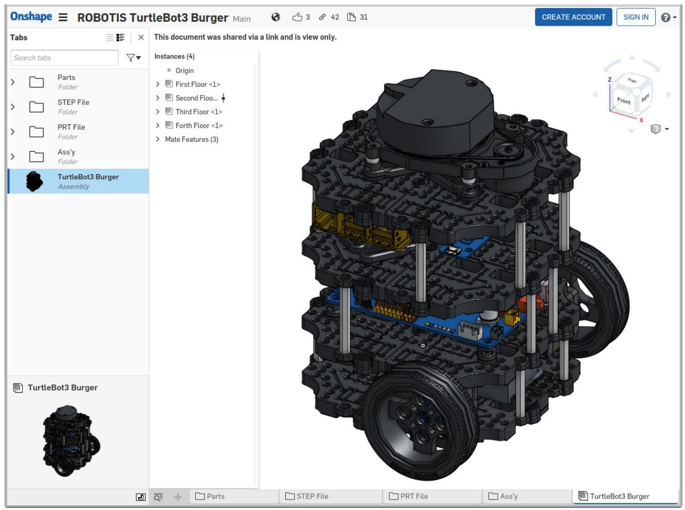

图 10-4 TurtleBot3的开源硬件

-

**TurtleBot3官方维基**

上面提到的TurtleBot3的硬件细节和本章介绍的基本内容也可以在以下链接(TurtleBot3官方wiki) 中找到。如果您想用TurtleBot3学习ROS，请参考以下链接的信息。

http://turtlebot3.robotis.com

豆

**TurtleBot3的开源硬件**

TurtleBot3的硬件设计文件像开源软件一样，都向公众开放。如果需要使用TurtleBot3的控制器 OpenCR或需要TurtleBot3各型号的硬件文件，请使用以下链接地址。每个开源硬件如无特指，都遵循Open Source Hardware Statement of Principles and Definition v1.0许可证。

OpenCR: https://github.com/ROBOTIS-GIT/OpenCR-Hardware

TurtleBot3 Burger: http://www.robotis.com/service/download.php?no=676

TurtleBot3 Waffle: http://www.robotis.com/service/download.php?no=677

TurtleBot3 Waffle Pi: http://www.robotis.com/service/download.php?no=678

TurtleBot3 Friends OpenManipulator Chain: http://www.robotis.com/service/download.php?no=679

TurtleBot3 Friends Segway: http://www.robotis.com/service/download.php?no=680

TurtleBot3 Friends Conveyor: http://www.robotis.com/service/download.php?no=681

TurtleBot3 Friends Monster: http://www.robotis.com/service/download.php?no=682

TurtleBot3 Friends Tank: http://www.robotis.com/service/download.php?no=683

TurtleBot3 Friends Omni: http://www.robotis.com/service/download.php?no=684

TurtleBot3 Friends Mecanum: http://www.robotis.com/service/download.php?no=685

TurtleBot3 Friends Bike: http://www.robotis.com/service/download.php?no=686

TurtleBot3 Friends Road Train: http://www.robotis.com/service/download.php?no=687

leBot3 Friends Real TurtleBot: http://www.robotis.com/service/download.php?no=688

TurtleBot3 Friends Carrier: http://www.robotis.com/service/download.php?no=689

## 10.4. TurtleBot3软件

TurtleBot3的软件由OpenCR控制板的固件(FW)和4个ROS功能包组成。正如在第 9章嵌入式系统中的说明，作为TurtleBot3的核心，OpenCR的固件还被称为turtlebot3_ core。固件将OpenCR作为中间控制器，读取TurtleBot3的驱动舵机Dynamixel的编码器值来估算机器人的位置，或者根据上位软件的命令来控制速度。另外，固件还从安装在 OpenCR上的3轴加速度和3轴陀螺仪传感器获得加速度和角加速度，以此估计机器人的方向, 此外还测量电池电压并将其以话题传输。

TurtleBot3的ROS功能包包括turtlebot3、turtlebot3_msgs、turtlebot3_simulations 和turtlebot3_applications。其中, turtlebot3功能包包括TurtleBot3的机器人模型、 SLAM和导航功能包、遥控功能包以及与行驶相关的bringup功能包。另外, TurtleBot3的消息文件的集合turtlebot3_msgs、仿真功能包的集合turtlebot3_simulations以及应用程序的集合turtlebot3_applications构成了TurtleBot3的ROS功能包。

TurtleBot3的开源软件

TurtleBot3的软件都是开源的。在TurtleBot3中用作控制器的OpenCR的引导加载程序、用于与Arduino IDE兼容的固件、用于控制TurtleBot3的固件，等TurtleBot3的控制器的固件均已公开。此外, ROS功能包 (turtlebot3、turtlebot3_msgs、turtlebot3_simulations 和turtlebot3_ applications)也都以开源形式提供。这些开源软件的许可证根据每个源代码都有不同，基本上是 Apache许可证2.0，有些软件使用3-clause BSD许可证和GPLv3。

https://github.com/R0B0TIS-GIT/0penCR

https://github.com/R0B0TIS-GIT/turtlebot3

https://github.com/R0B0TIS-GIT/turtlebot3_msgs

https://github.com/ROBOTIS-GIT/turtlebot3_simulations

https://github.com/ROBOTIS-GIT/turtlebot3_applications

## 10.5. TurtleBot3的开发环境

如图10-5所示，TurtleBot3的开发环境可以分为远程PC(运行远程控制、SLAM和导航功能包)和TurtleBot PC(控制实际机器人且搜集传感器信息)。这两种PC在开发环境上都非常相似，但是它们使用的功能包根据PC的性能和用途进行了不同的配置。为了搭建一个基本的开发环境，两台PC都要安装Linux(Ubuntu 16.04兼容的Linux Mint和 Ubuntu MATE)作为基本操作系统，且ROS安装Kinetic Kame版本即可。有关详细信息，请参阅第3章“搭建ROS开发环境”。有关PC、TurtleBot和OpenCR的信息，请参阅以下地址。

- http://turtlebot3.robotis.com

如果已经安装了Linux和ROS，则可以安装与TurtleBot3相关的软件。所有这些安装方法都在上面提到的维基地址中描述, 但是这里我们简单地总结一下, 只解释一下安装方法。在控制TurtleBot3机器人的用户PC(在这里我们称为远程PC)上，如下所示安装相关的依赖包和TurtleBot3功能包。但是, 我们已经排除了包含本书中没有提到的多种示例的turtlebot3_applications功能包。

安装依赖包的方法 [Remote PC]

\$ sudo apt-get install ros-kinetic-joy ros-kinetic-teleop-twist-joy ros-kinetic-teleop-twist-keyboard ros-kinetic-laser-proc ros-kinetic-rgbd-launch ros-kinetic-depthimage-to-laserscan ros-kinetic-rosserial-arduino ros-kinetic-rosserial-python ros-kinetic-rosserial-server ros-kinetic-rosserial-client ros-kinetic-rosserial-msgs ros-kinetic-amc1 ros-kinetic-map-server ros-kinetic-move-base ros-kinetic-urdf ros-kinetic-xacro ros-kinetic-compressed-image-transport ros-kinetic-rqt-image-view ros-kinetic-gmapping ros-kinetic-navigation

安装TurtleBot3功能包 [Remote PC]

\$ cd ~/catkin_ws/src/

\$ git clone https://github.com/ROBOTIS-GIT/turtlebot3.git

\$ git clone https://github.com/ROBOTIS-GIT/turtlebot3_msgs.git

\$ git clone https://github.com/ROBOTIS-GIT/turtlebot3_simulations.git

\$ cd ~/catkin_ws && catkin_make

接下来, 在TurtleBot3机器人的PC (以下称为TurtleBot) 中安装相关的依赖包、 TurtleBot3功能包和传感器包。

**安装依赖包的方法[TurtleBot3]**

\$ sudo apt-get install ros-kinetic-joy ros-kinetic-teleop-twist-joy ros-kinetic-teleop-twist-keyboard ros-kinetic-laser-proc ros-kinetic-rgbd-launch ros-kinetic-depthimage-to-laserscan ros-kinetic-rosserial-arduino ros-kinetic-rosserial-python ros-kinetic-rosserial-server ros-kinetic-rosserial-client ros-kinetic-rosserial-msgs ros-kinetic-amcl ros-kinetic-map-server ros-kinetic-move-base ros-kinetic-urdf ros-kinetic-xacro ros-kinetic-compressed-image-transport ros-kinetic-rqt-image-view ros-kinetic-gmapping ros-kinetic-navigation

安装TurtleBot3功能包 [TurtleBot3]

\$ cd ~/catkin_ws/src

\$ git clone https://github.com/ROBOTIS-GIT/turtlebot3.git

\$ git clone https://github.com/ROBOTIS-GIT/turtlebot3_msgs.git

\$ git clone https://github.com/ROBOTIS-GIT/hls_lfcd_lds_driver.git

\$ cd ~/catkin_ws && catkin_make

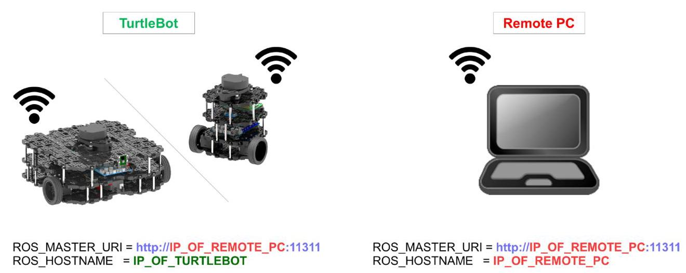

* 在远程PC运行ROS Master时的例子

图 10-5 TurtleBot3的远程控制设置

如果已经安装了所有软件，则下一个最重要的配置是如图10-5所示的网络设置。有关如何更改ROS_HOSTNAME和ROS_MASTER_URI设置的详细说明，请参阅第3.2节和第 8.3节，本节中只了解设置的顺序。作为参考，TurtleBot3将用户的个人台式机和笔记本电脑称为远程PC，这台PC将担任运行roscore的主节点，会负责远程控制、SLAM、导航等上层控制。与此PC配对的TurtleBot3配备了SBC，负责机器人行驶和传感器信息采集。以下远程控制设置示例是在远程PC上运行ROS Master时的示例。

**查看远程PC的IP值**

在终端窗口中，使用ifconfig命令查看远程PC的IP值(例如，192.168.7.100)。

**远程PC的ROS_HOSTNAME、ROS_MASTER_URI设置**

修改~/.bashrc文件中的ROS_HOSTNAME和ROS_MASTER_URI设置，如下所示:

---

export ROS_HOSTNAME=192.168.7.100

export ROS_MASTER_URI=http://\$\{ROS_HOSTNAME\}:11311

---

**查看TurtleBot的IP值**

在终端窗口中使用ifconfig命令查看TurtleBot的IP值。例如，假设TurtleBot的IP是 192.168.7.200。需要注意，TurtleBot必须使用与远程PC相同的网络。

TurtleBot3 SBC的ROS_HOSTNAME及ROS_MASTER_URI设置

如下修改~/.bashrc文件中的ROS_HOSTNAME和ROS_MASTER_URI设置。

---

export ROS_HOSTNAME=192.168.7.200

export ROS_MASTER_URI=http://192.168.7.100:11311

---

以此搭建了所有TurtleBot3的开发环境。在下一节中, 我们将以远程控制为开始, 使用TurtleBot3的各种ROS功能包控制TurtleBot3。

## 10.6. TurtleBot3远程控制

让我们来看一看Turtlebot的远程控制。几乎所有可连接到PC的设备，如键盘、蓝牙遥控器RC-100B、PS3游戏杆、XBOX 360游戏杆、Wii遥控器、Nunchuk、Android应用程序、LEAP Motion, 和Myo等都可以用于远程遥控TurtleBot3。更多信息可以在 "http://turtlebot3.robotis.com/" 的teleoperation项目中查看。在本节中，我们将以最易于使用的键盘和通常用于机器人控制的PS3操纵杆进行说明。

### 10.6.1. 遥控TurtleBot3

运行roscore [Remote PC]

在远程PC上, 使用以下命令启动roscore。roscore只需运行一次。

---

\$ roscore

---

**运行turtlebot3_robot.launch启动文件[TurtleBot]**

如下所示，在TurtleBot中，运行turtlebot3_robot.launch文件。这个启动文件将运行负责turtlebot3_core和hls_lfcd_lds_driver节点，其中turtlebot3_core负责与 TurtleBot3的控制器OpenCR的通信，而hls_lfcd_lds_driver节点负责运行360度距离传感器LDS。

---

\$ roslaunch turtlebot3_bringup turtlebot3_robot.launch --screen

---

--screen 选项

roslaunch同时运行多个节点。默认情况下，不显示来自每个节点的消息。如有必要，可以使用 --screen选项查看启动过程中发生的所有隐藏的消息。在运行roslaunch时，我推荐使用这个选项。

**运行turtlebot3_teleop_key.launch启动文件[Remote PC]**

在远程PC上, 按如下所示运行turtlebot3_teleop_key.launch启动文件。

---

\$ roslaunch turtlebot3_teleop turtlebot3_teleop_key.launch --screen

---

运行该启动文件时，会运行turtlebot3_teleop_keyboard节点，并在终端窗口中显示以下消息。该节点用键盘的w、a、d和x键将平移速度(单位为m/sec)和旋转速度(单位为rad/sec)发送给机器人，并用空格键或s键将平移速度和旋转速度均设为0(停止机器人)。

---

Control Your Turtlebot3!

Moving around:

		W

	a s d

		X

w/x: increase/decrease linear velocity

a/d: increase/decrease angular velocity

space key, s : force stop

CTRL-C to quit

---

如果要使用PS3操纵杆代替键盘来操作机器人，请按如下方式在远程PC上安装依赖包。然后运行teleop_twist_joy功能包中的teleop.launch启动文件, 则可以用PS3游戏杆控制机器人。此时，PS3游戏杆必须通过蓝牙连接到远程PC。

---

\$ sudo apt-get install ros-kinetic-joy ros-kinetic-joystick-drivers ros-kinetic-teleop-twist-joy

\$ roslaunch teleop_twist_joy teleop.launch --screen

---

### 10.6.2. 可视化TurtleBot3

我们将利用RViz来可视化机器人的状态。为了确定要使用的模型, 先使用export命令将当前的TurtleBot3的型号指定为Burger。如果是Waffle或Waffle Pi，您可以将其指定为'waffle'或'waffle_pi'，而不是'burger'。然后运行turtlebot3_model. launch启动文件，则RViz将会被运行。

---

	\$ export TURTLEBOT3_MODEL=burger

	\$ roslaunch turtlebot3_bringup turtlebot3_remote.launch

\$ rosrun rviz rviz -d `rospack find turtlebot3_description`/rviz/model.rviz

---

如图10-6所示，当RViz被运行时，TurtleBot3 Burger的模型和各关节的tf会以RGB 坐标系的形式显示在画面中央。而且，可以看到安装在机器人上的360度距离传感器LDS 接收距离值, 并将障碍物显示为红色。

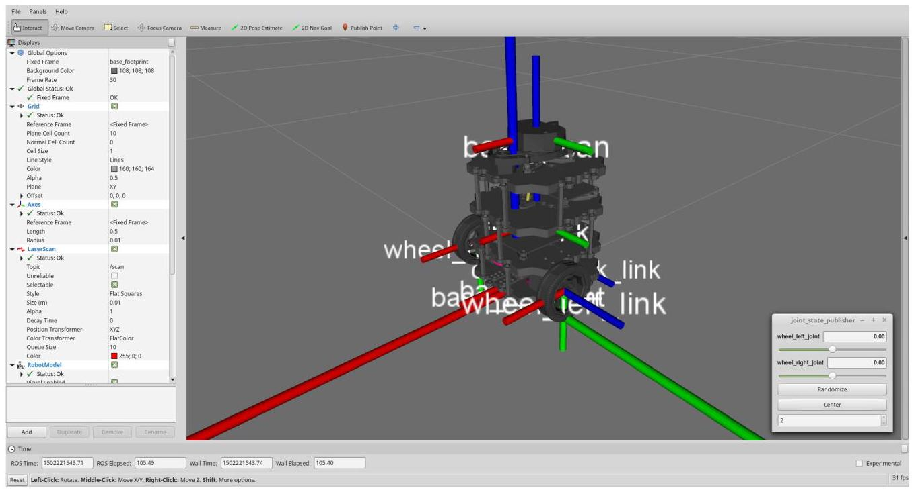

图 10-6 TurtleBot3的可视化

如上面所述, 对TurtleBot3的控制需要在远程PC和TurtleBot3 SBC的计算机上来回操作，是比较麻烦的方式。为了解决这个问题，我想建议一种使用SSH来远程访问 TurtleBot3 SBC的方法。这使您可以在远程PC上执行所有的命令。从远程PC远程连接到 TurtleBot3 SBC的操作如下。有关更多信息，请参阅有关SSH的说明。

=

SSH (Secure Shell, 安全外壳)

SSH是指一种应用程序或用于该应用程序的协议，它允许您登录到网络上的另一台计算机，或在远程系统上运行命令并将文件复制到另一个系统。它多用于在Linux环境中从终端窗口访问另一台计算机并发送远程指令的情况。要做到这一点，您需要按如下操作安装ssh程序。

\$ sudo apt-get install ssh

要连接到另一台计算机，请在终端窗口中用如下命令访问。连接之后的用法与其他命令一样。

\$ ssh 用户名@笔记本电脑IP

使用Raspberry Pi的情况中(TurtleBot3 Burger和Waffle Pi)，由于Ubuntu MATE 16.04.x和 Raspbian的SSH服务器默认是未激活的。如果要激活SSH，请参考如下链接的文档进行设置。

https://www.raspberrypi.org/documentation/remote-access/ssh/

https://ubuntu-mate.org/raspberry-pi/

## 10.7. Turtlebot3话题

如果在远程PC上只运行roscore，并且没有运行任何其他节点的情况下使用 roscopic list命令查看话题列表，则只能看到/rosout和/rosout_agg。在此基础上， 正如在TurtleBot3远程控制中的操作一样，可以在TurtleBot3 SBC的终端窗口中运行 turtlebot3_robot.launch启动文件，以此驱动TurtleBot3。当TurtleBot3被驱动时， turtlebot3_core节点和turtlebot3_lds节点会被运行，并且可以用话题的方式接收从每个节点发布的关节的状态、电机驱动单元和IMU等内容。

---

\$ roslaunch turtlebot3_bringup turtlebot3_robot.launch --screen

---

例如, 您可以使用rostopic list命令来查看正在发布或订阅的各种话题。

---

	\$ rostopic list

	/cmd_vel

/cmd_vel_rc100

---

---

/diagnostics

/imu

/joint_states

/odom

/rosout

/rosout_agg

/rpms

	/scan

/sensor_state

/tf

---

进一步地，像在TurtleBot远程控制中的操作一样，在远程PC上运行turtlebot3_ teleop_key.launch启动文件。

---

\$roslaunch turtlebot3_teleop turtlebot3_teleop_key.launch --screen

---

要获得更详细的节点和话题的信息，请运行rqt_graph，如下例所示。则可以查看在 TurtleBot中发布和订阅的话题，如图10-7所示。

\$ rqt_graph

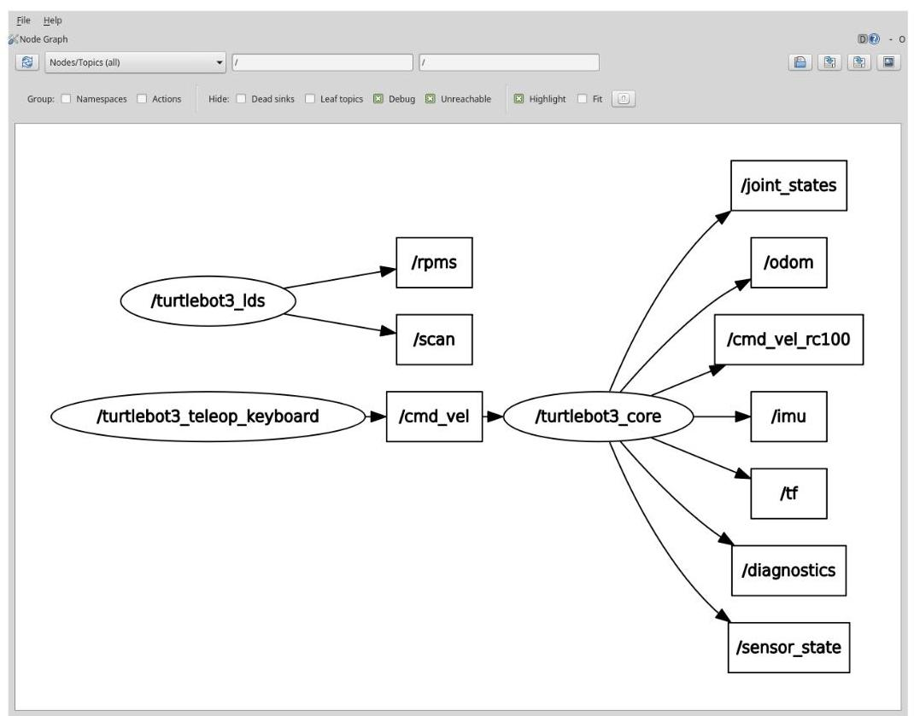

图 10-7 TurtleBot3的节点和话题

### 10.7.1. 订阅话题

上述话题可以分为TurtleBot3收到的订阅话题和TurtleBot3发送的发布话题。其中, 订阅话题如下。您不需要知道所有的订阅话题。下面通过测试来了解几种订阅话题的用法。所有的话题当中，“cmd_ vel”是最需要知道的话题。这是控制机器人的最实用的话题, 用户可以通过这个话题来控制机器人的前进、后退和左右旋转。

<table><tr><td>名称</td><td>形式</td><td>功能</td></tr><tr><td>motor_power</td><td>std_msgs/Bool</td><td>Dynamixel舵机On/Off</td></tr><tr><td>reset</td><td>std_msgs/Empty</td><td>重置测位(odometry and IMU)</td></tr><tr><td>sound</td><td>turtlebot3_msgs/Sound</td><td>发出“哔”声</td></tr><tr><td>cmd_vel</td><td>geometry_msgs/Twist</td><td>控制移动机器人的平移和旋转速度，   单位分别是米/秒和弧度/秒(实际控制机器人运动)</td></tr></table>

*TurtleBot3中使用的话题会根据目的而有变化。

表 10-1 TurtleBot3的订阅话题

### 10.7.2.通过订阅话题控制机器人

上述订阅话题的过程是, 用户发布话题后由机器人接收和处理该话题。很难测试本书中的每个话题, 所以下面只使用几种订阅话题作为示例。下面例子是在终端窗口中使用 rostopic pub命令停止电机的例子。

---

\$ rostopic pub /motor_powerstd_msgs/Bool "data: 0"

---

接下来，为了让TurtleBot动起来，让我们控制机器人的速度吧。这里使用的x和y是平移速度，单位是ROS标准中的m/s。z是以rad/s为单位的转速。如下面的例子所示，当 x的值为0.02时，TurtleBot3在x轴方向上以0.02m/s的速度前进。

---

\$ rostopic pub /cmd_vel geometry_msgs/Twist "linear:

										x: 0.02

										y: 0.0

											z: 0.0

	angular:

										x: 0.0

											y: 0.0

											z: 0.0"

---

如下例所示，当z值设为1.0时，TurtleBot3相对于z轴以逆时针1.0弧度/秒的转速旋转。

\$ rostopic pub /cmd_vel geometry_msgs/Twist "linear:

x: 0.0

y: 0.0

z: 0.0

angular:

x: 0.0

y: 0.0

z: 1.0"

### 10.7.3. 发布话题

TurtleBot3发布的主要的话题可以分为与诊断(diagnostics)相关的话题、与调试相关的话题以及与传感器相关的话题。其他话题还包括与关节(joint_states)相关的话题、与控制器信息(controller_info)相关的话题、与测位(odometry)和转换(tf) 相关的话题。

您不需要知道所有的发布话题，下面通过测试来了解几种发布话题的用法。尤其要留意到是, 包含测位 (odometry) 信息的odom、坐标变换信息tf、关节信息joint_states 和与传感器相关的信息，它们是将来使用TurtleBot时必不可少的话题。

<table id="cross-table-4"><tr><td>名称</td><td>形式</td><td>功能</td></tr><tr><td>sensor_state</td><td>turtlebot3_msgs/SensorState</td><td>这是一个可以查看安装在TurtleBot3上的传感器值的话题。</td></tr><tr><td>battery_state</td><td>sensor_msgs/BatteryState</td><td>可以获得诸如电池电压等状态值。</td></tr><tr><td>Scan</td><td>sensor_msgs/LaserScan</td><td>这是一个可以查看安装在TurtleBot3上的雷达的扫描值的话题。</td></tr><tr><td>Imu</td><td>sensor_msgs/lmu</td><td>这个话题包含机器人的方向值，此方向值由加速度传感器和陀螺仪传感器值计算而得。</td></tr><tr><td>Odom</td><td>nav_msgs/Odometry</td><td>根据编码器和IMU信息，可以获得TurtleBot3的测位 (odometry)信息。</td></tr><tr><td>Tf</td><td>tf2_msgs/TFMessage</td><td>它包含TurtleBot3的坐标转换值，例如base_ footprint和odom等。</td></tr><tr><td>joint_states</td><td>sensor_msgs/JointState</td><td>将左右车轮看作关节时，可以查看位置、速度和力。各单位为位置:米，速度:米/秒，力:N·米。</td></tr><tr></tr><tr><td>Diagnostics</td><td>diagnostic_msgs/ DiagnosticArray</td><td>可以获得自检信息。</td></tr><tr><td>version_info</td><td>turtlebot3_msgs/ VersionInfo</td><td>可以获得TurtleBot3的硬件、固件和软件等信息。</td></tr><tr><td>cmd_vel_rc100</td><td>geometry_msgs/Twist</td><td>这是使用RC-100B(一种基于蓝牙的控制器)时使用的话题，用于移动机器人的速度控制并会订阅此话题。单位使用m/s和rad/s。</td></tr></table>

### 10.7.4. 通过发布话题识别机器人状态

上面提到的发布话题以话题的形式传输机器人的传感器值、电机状态和机器人的位置。在本节中, 我们尝试接收一些话题并查看机器人的当前状态。

sensor_state话题主要涉及连接到嵌入式控制板OpenCR的仿真传感器，如下例所示，您可以获取bumper、cliff、button、left_encoder和right_encoder等信息。

---

	\$ rostopic echo /sensor_state

		stamp:

												secs: 1500378811

												nsecs: 475322065

	bumper: 0

		cliff: 0

	button:0

	left_encoder: 35070

right_encoder: 108553

battery: 12.0799999237

---

---

利用odom话题可以获取Odometry信息, 这相当于行车记录器。通过此话题, 可以获得基于陀螺仪和编码器的TurtleBot3的测位(odometry)信息，这在移动机器人系列中是必要的信息。这也是对导航必要的信息，因此请务必掌握。

\$ rostopic echo /odom

header:

seq: 30

stamp:

secs: 1500379033

nsecs: 274328964

frame_id: odom

child_frame_id: ''

pose:

pose:

position:

x: 3.55720114708

y:0.655082702637

z:0.0

orientation:

x: 0.0

y: 0.0

z: 0.113450162113

w:0.993543684483

covariance: [0.0.0.0.0.0.0.0.0.0.0.0.0.0.0.0.0.0.0.0.0.0.0.0.0.0.0.0.0.0.0.0.0.0.0.0.0.0.0.0.0.0.0.0.0.0.0.0.0.0.0.0.0.0.0.0.0.0.0. 0.0,0.0,0.0,0.0,0.0,0.0,0.0,0.0,0.0,0.0,0.0,0.0,0.0.0]

twist

twist

linear

x: 0.0

y: 0.0

z: 0.0

angular:

x: 0.0

y: 0.0

z: -0.00472585950047

covariance: $\lbrack {0.0},{0.0},{0.0},{0.0},{0.0},{0.0},{0.0},{0.0},{0.0},{0.0},{0.0},{0.0},{0.0},{0.0},{0.0},{0.0},{0.0},{0.0},{0.0},{0.0},{0.0},{0.0},{0.0},{0.0},{0.0},$ 0.0,0.0,0.0,0.0,0.0,0.0,0.0,0.0,0.0,0.0,0.0,0.0,0.0

---

tf话题是以相对坐标形式描述的机器人的各个关节的姿势(位置和方向)信息，例如 XY平面上的机器人的中心位置base_footprint与测位(odometry)信息odom之间的坐标转换。

---

\$rostopic echo/tf

		transforms:

										-

																								header:

																																						seq: 0

																																						stamp:

																																																secs: 1500379130

																																																	nsecs: 727869913

																																						frame_id: odom

																											child_frame_id: base_footprint

																											transform:

																																						translation:

																																																x: 3.55720019341

																																																y: 0.655082404613

																																																z: 0.0

																																							rotation:

																																																x: 0.0

																																															y: 0.0

																																																	z: 0.112961538136

																																																w: 0.993599355221

---

---

还可以使用rqt中的tf_tree插件(如图10-8所示)，在GUI环境中查看。在图10-8中， 由于未包括机器人的模型信息，所以各坐标未被连接，但是如果包含了机器人的模型信息后进行坐标变换，则可以使用机器人的每个关节的连接信息，如图10-14所示。

\$rosrun rqt_tf_tree rqt_tf_tree

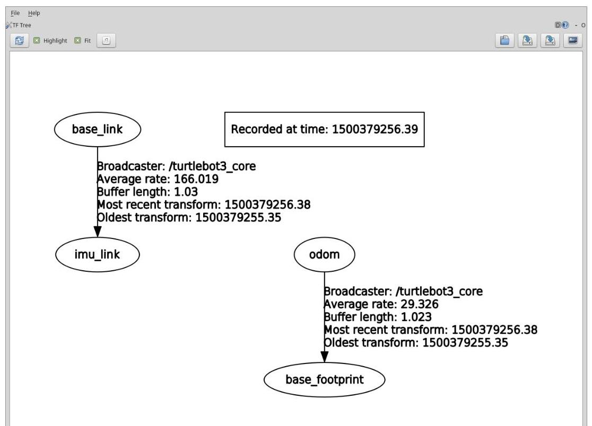

图 10-8 使用tf_tree查看坐标变换

至此，说明了关于话题的内容。在ROS中，节点作为各自独立的处理器，他们之间的通信方式有话题、服务和动作，其中话题是使用最广泛的消息通信方法，因此必须要掌握。

## 10.8. 使用RViz 仿真 TurtleBot3

### 10.8.1. 仿真

TurtleBot3提供虚拟仿真开发环境，即使没有机器人硬件，也可以通过仿真软件里的虚拟机器人进行编程和仿真。有两种方法可以做到这一点, 一种是使用ROS的3D可视化工具RViz, 另一种是使用3D机器人仿真器Gazebo。

在本节中，我们将了解第一个方法RViz的用法。即使您没有TurtleBot3的硬件，您也可以遥控TurtleBot3，还可以测试SLAM和导航，因此是非常有用的方法。具体方法是使用turtlebot3_simulations元功能包。要在这个元功能包中使用虚拟仿真，首先需要安装 turtlebot3_fake功能包。这在“10.5. TurtleBot3开发环境”中做了说明。如果已经安装了它，请转到下面的内容。

### 10.8.2. 运行虚拟机器人

要运行虚拟机器人，请按如下所示运行turtlebot3_fake功能包的turtlebot3_fake. launch文件。

\$ export TURTLEBOT3_MODEL=burger

\$ roslaunch turtlebot3_fake turtlebot3_fake.launch

它运行turtlebot3_fake_node节点和robot_state_publisher节点。其中, turtlebot3_fake_node节点从turtlebot3_description功能包导入TurtleBot3的三维模型, 并发布实际机器人发布的话题。robot_state_publisher节点则通过接收机器人的两个车轮的旋转值, 以TF形式发布两个车轮及各关节的三维位置和方向信息。但是, 由于在RViz中无法使用传感器信息, 所以需要使用包含物理引擎的3D仿真器Gazebo。 下一节将介绍Gazebo，在本节中，我们只介绍在简单的运动和移动过程中可以确认的 Odometry和TF。

本来,下一步操作是运行RViz并在左侧显示窗口中将 [Global Options] $\rightarrow$ [fixed frame]更改为 “/odom”，然后按下显示窗口左下方的添加按钮，再点击 "RobotModel" 来添加机器人模型，但是由于我们已经从turtlebot3_fake.launch文件中加载了TurtleBot3的3D模型，所以您会在画面中央看到TurtleBot3的3D模型，如图 10-9所示。

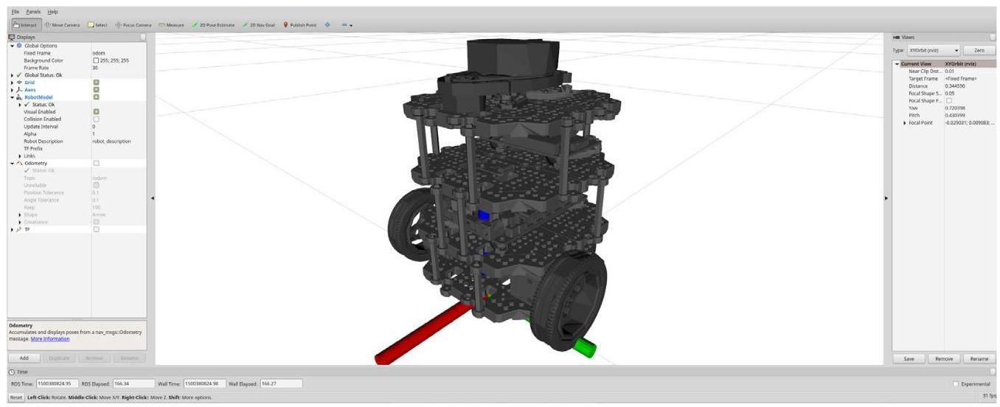

图 10-9 运行虚拟机器人

接下来，我们来运行这个虚拟机器人。运行turtlebot3_teleop功能包中的 turtlebot3_teleop_key.launch文件，该文件允许用键盘操纵机器人。

---

\$roslaunch turtlebot3_teleop turtlebot3_teleop_key.launch

---

运行turtlebot3_teleop_key.launch文件将启动turtlebot3_teleop_keyboard节点。turtlebot3_fake_node节点接收由turtlebot3_teleop_keyboard节点通过/cmd_ vel话题发送的平移速度和旋转速度, 并将其作为驱动命令, 并用此命令驱动虚拟机器人。在执行turtlebot3_teleop_key.launch文件的终端窗口中，让我们直接使用下面的键运行机器人。

---

	- w 键:前进(+0.01, 单位=m/sec)

	- x 键:后退(-0.01, 单位=m/sec)

- a 键:逆时针方向旋转(+0.1, 单位=rad/sec)

	- d 键: 顺时针方向旋转(-0.1, 单位=rad/sec)

	- 空格或者s键: 初始化平移速度及旋转速度

- Ctrl + C:退出

---

### 10.8.3. Odometry和TF

我们已经尝试了虚拟机器人的驱动，下面让我们查看其他话题值。例如，如图10-10 所示, turtlebot3_fake_node节点会接收速度命令以生成测位 (odometry) 信息并将其以话题形式发布, 还可以发布joint states或tf, 从而在RViz中查看TurtleBot3的移动情况。

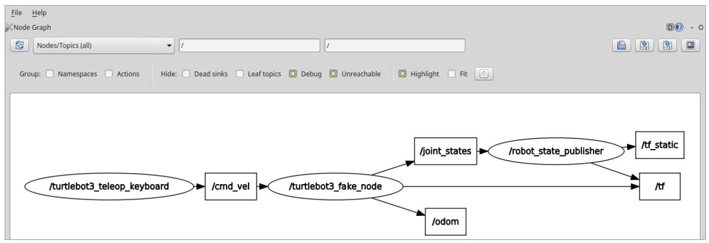

图 10-10 使用rqt_graph查看的节点和话题

首先来确认测位 (odometry) 信息是否正确地生成和发布。您可以在终端窗口中使用 “rostopic echo /odom” 命令来检查, 但我们这次是在使用RViz, 因此我们可以直观地检查它。单击RViz左下角的“Add”按钮，然后单击“By Topic”标签，如图10-11 所示，选择 “Odometry” 来添加它。屏幕上会出现一个红色的箭头，表示TurtleBot3前方的测位(odometry)。首先，在显示窗口中关闭 “Odometry” 中的 “Covariance” 复选框，并且因为箭头初始值比机器人大很多，因此需要适当设置 “Shape/Shaft Length” 和 “Shape/Head Length”。

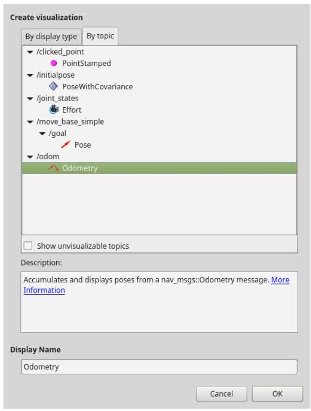

图 10-11 为检查odom话题添加odometry的显示功能

现在，让我们再次使用turtlebot3_teleop_keyboard节点移动虚拟TurtleBot3。如图10-12所示, 与之前不同, 可以看到红色箭头会沿着机器人的移动轨迹显示。这个测位 (odometry) 信息对于移动机器人来说是表示自身位置和方向的非常基本的信息。至此, 我们简单查看了测位 (odometry) 信息是否正确显示。

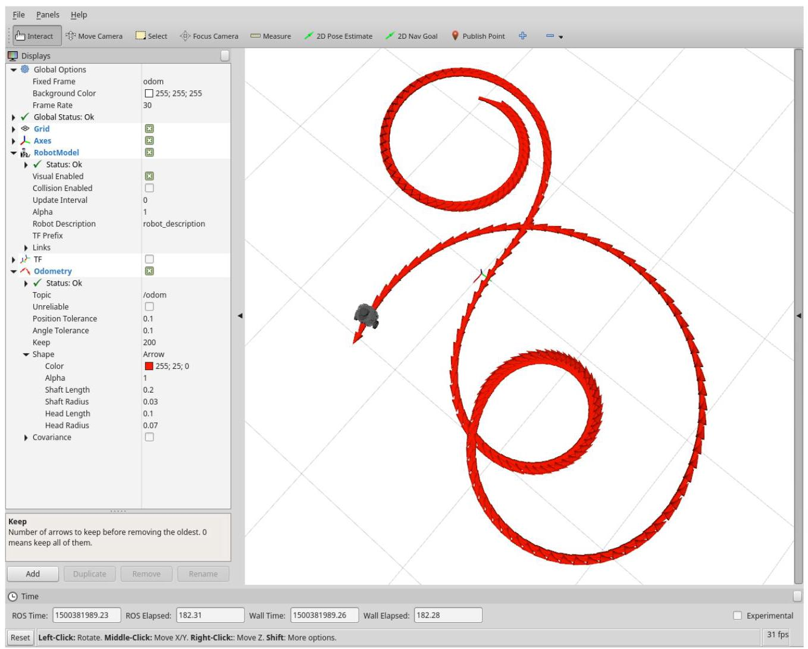

图 10-12 虚拟机器人移动和测位(odometry)信息

TF话题包含TurtleBot3组件的相对坐标信息，它可以像之前的操作一样用rostopic命令确认, 但是我们下面将用RViz进行确认, 就像查看odom的方式一样。并用rqt_tf_tree 检查层次结构。

按下RViz左下角的Add按钮，然后选择 “TF”。则如图10-13所示，会显示Odom、 base_footprint、imu_link、wheel_left_link和wheel_right_link。让我们再次使用 turtlebot3_teleop_keyboard节点移动虚拟TurtleBot3。当TurtleBot3移动时，wheel_ left_link和wheel_right_link会旋转。

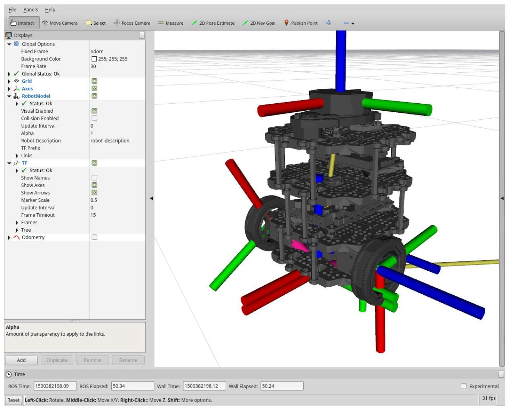

图 10-13 查看RViz中的tf话题

下面使用以下命令运行rqt_tf_tree。我们可以看到每个部分的元素的相对位置会通过 tf进行变换，且彼此相关联，如图10-14所示。以后可以通过这个方法，表示安装在机器人上的传感器的位置。这在下一章中会有更详细的介绍。

\$ rosrun rqt_tf_tree rqt_tf_tree

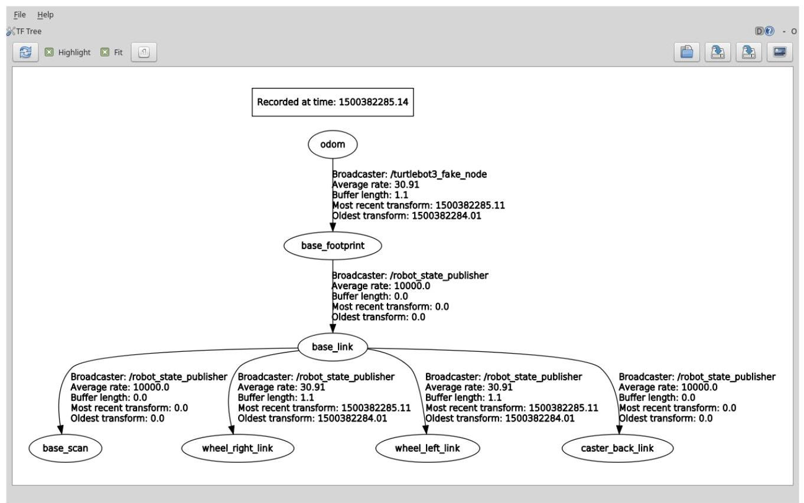

图 10-14 通过rqt_tf_tree查看tf话题

## 10.9. 利用Gazebo仿真TurtleBot3

### 10.9.1. Gazebo仿真器

Gazebo是一款3D仿真器，支持机器人开发所需的机器人、传感器和环境模型，并且通过搭载的物理引擎可以得到逼真的仿真结果。Gazebo是近年来最受欢迎的三维仿真器之一，并被选为美国DARPA机器人挑战赛 ${}^{7}$ 的官方仿真器。因此它再接再厉，即便是开源仿真器，却具有高水准的仿真性能，因此在机器人工程领域中非常流行。不仅如此， 负责开发和普及ROS，且担任社区的Open Robotics在开发ROS和Gazebo，因此ROS和 Gazebo非常兼容。

---

7 http://www.darpa.mil/program/darpa-robotics-challenge

---

Gazebo的特征 ${}^{8}$ 如下。

- 动力学仿真:在最初的版本中，只支持ODE(开放式动力引擎)，但从3.0版本开始，各种物理引擎如 Bullet、Simbody和DART被用来满足不同用户的需求。

B 3D图形:Gazebo采用经常在游戏中使用的OGRE(开源图形渲染引擎)，因此不仅可以实现机器人模型, 还可以逼真地表达光、阴影和材质。

▪ 支持传感器和噪声:支持虚拟的激光测距仪(LRF)、2/3D相机、深度相机、触摸传感器、力矩传感器, 并且在检测到的数据中包含与真实世界相似的噪声。

- 可添加插件:提供API，以便用户可以以插件的形式亲手创建机器人、传感器和环境控制等。

- 机器人模型:PR2、Pioneer2 DX、iRobot Create和TurtleBot已经以SDF格式存在于Gazebo中。SDF格式是一个Gazebo模型文件格式。此外，用户可以添加自己创建的SDF格式的机器人。

- TCP/IP数据传输:仿真也可以在远程服务器上执行，这是使用Google的protobufs(基于socket的消息传递) 实现的。

云仿真:提供CloudSim云仿真环境，因此可以在Amazon、Softlayer和OpenStack等云环境中使用 Gazebo。

- 命令行工具:不仅可以使用GUI界面，还可以使用CUI风格的命令行工具来查看和控制仿真过程。

在写这本书的时候，Gazebo的版本是8.0。就在五年前，它还是1.9版本，但在短暂的 5年当中已经更新到了8.0版本。当前版本8.0是本书使用的ROS Kinetic Kame版本的默认版本, 如果已经按照 “3.1 ROS安装” 中的说明进行安装, 则无需安装即可使用。

现在我们来运行Gazebo。运行以下命令，如果没有问题，则可以看到Gazebo正在运行，如图10-15所示。到目前为止，它可以被看作是与ROS无关的独立的仿真器。

\$ gazebo

---

8 http://gazebosim.org/

---

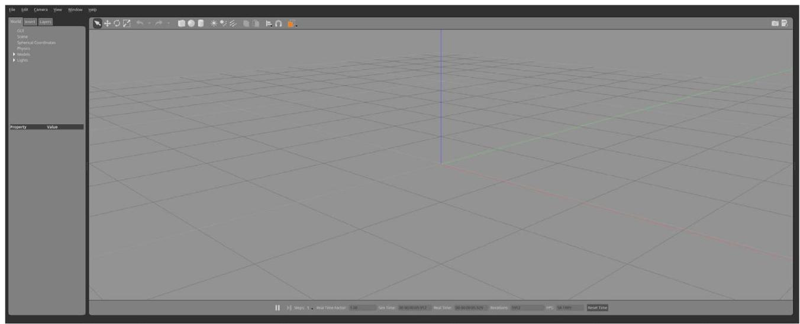

图 10-15 Gazebo初始画面

### 10.9.2. 启动虚拟机器人

为了在Gazebo运行TurtleBot, 先安装相关的功能包。要安装的功能包有gazebo_ ros_pkgs metapack和turtlebot3_gazebo。前者的功能是连接Gazebo和ROS，已经安装。后者是与TurtleBot3的三维仿真有关的功能包, 也已在 “10.5. TurtleBot3开发环境” 中安装。

下面是在Burger、Waffle和Waffle Pi中选择型号的命令。在这里, 我们使用可以检查相机信息的Waffle模型。使用以下命令将TURTLEBOT3_MODEL变量设置为waffle。 作为参考，在~/.bashrc文件中记录以下模型变量，则不必每次输入命令。

---

**\$ export TURTLEBOT3_MODEL=waffle**

---

下面如以下示例所示运行启动文件。那么将同时运行gazebo、gazebo_gui、 mobile_base_nodelet_manager、robot_state_publisher和spawn_mobile_base节点, 且TurtleBot3会出现在Gazebo屏幕上, 如图10-16所示。Gazebo是一款3D仿真器, 由于使用了物理引擎和图形效果, 因此会占据大量的CPU、GPU和RAM的资源。根据您的PC的规格，可能需要相当长的时间来加载。

---

\$ roslaunch turtlebot3_gazebo turtlebot3_empty_world.launch

---

如下图所示，可以看到只显示了机器人，因为没有指定任何环境选项。

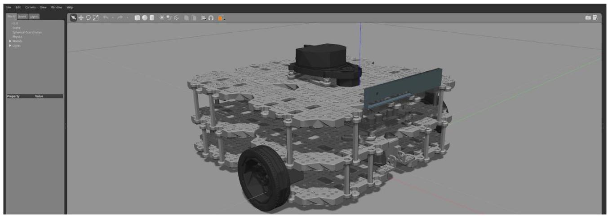

图 10-16 Gazebo上的TurtleBot3的3D形象

这只是在Gazebo加载了机器人, 为了进行实际的仿真, 用户可以指定环境或者加载Gazebo提供的环境模型。要从Gazebo加载环境模型, 您可以通过点击屏幕顶部的 “Insert”并选择一个文件来添加环境模型。除了环境模型以外，还有各种机器人和物体的模型, 必要时都可以添加。

在本书中, 为了使读者使用和我相同的环境, 我们将使用现有的开发环境。关闭当前活动的Gazebo屏幕。如果要退出Gazebo，请点击屏幕右上角的X按钮，或者在开始 Gazebo的终端窗口中键入[Ctrl+c]即可。

再次运行turtlebot3_world.launch文件，如下所示。turtlebot3_world.launch文件将加载我们已经创建的turtlebot3.world环境模型。turtlebot3.world环境模型是通过模仿TurtleBot系列图标创建的，如图10-17所示。如果您想知道如何做到这一点，请查看 turtlebot3_gazebo功能包中的/models/turtlebot3.world文件来了解它是如何制作的。

\$ roslaunch turtlebot3_gazebo turtlebot3_world.launch

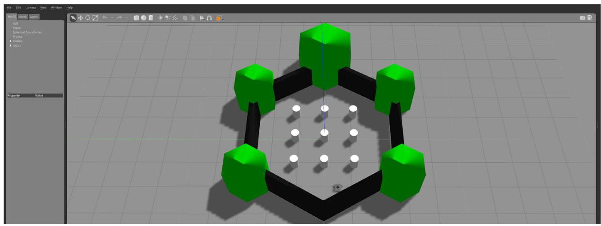

图 10-17 加载了TurtleBot3和环境模型的画面

现在运行下面例子中的远程控制launch文件，这样就可以在Gazebo环境中用键盘控制虚拟TurtleBot3。

---

\$ roslaunch turtlebot3_teleop turtlebot3_teleop_key.launch

---

至此，会与上一节中介绍的使用RViz的仿真相同。然而，Gazebo不仅提供虚拟机器人的外形，还可以检测机体的碰撞，也可以测量位置，还能虚拟地使用IMU传感器和摄像机传感器。一个使用这些功能的例子是下面的启动文件。启动后，虚拟TurtleBot3在规定的环境中随机移动，如图10-18所示，以避免障碍物或撞墙。这是学习Gazebo的一个很好的例子。

---

	\$ export TURTLEBOT3_MODEL=waffle

\$ roslaunch turtlebot3_gazebo turtlebot3_simulation.launch

---

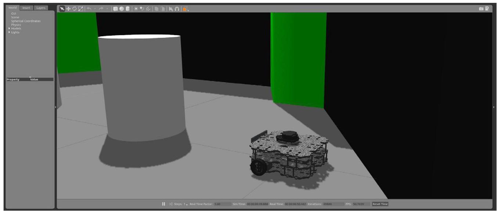

图 10-18 在Gazebo中自动避障行驶的TurtleBot3

下一步，我们用以下命令调用RViz。如图10-19所示，RViz可以检查Gazebo中运行的机器人的位置、距离传感器值和摄像机图像。这与通过RViz观察机器人的状态是一样的, 就像Gazebo本身是一个环境, 同时也在运行机器人一样。

---

\$ export TURTLEBOT3_MODEL=waffle

\$ roslaunch turtlebot3_gazebo turtlebot3_gazebo_rviz.launch

---

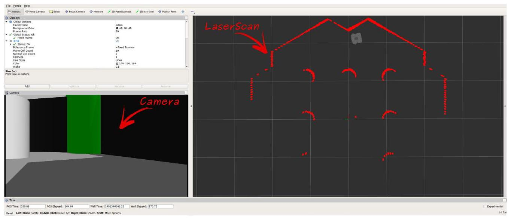

图 10-19 在Gazebo中查看影像和距离值

### 10.9.3. 虚拟SLAM和导航

在下一章中，我们将介绍使用TurtleBot3创建地图的SLAM和移动到地图中指定的目的地的导航，这里使用的SLAM和导航也可以在上面提到的Gazebo中实现。我建议在下一章中掌握了SLAM和导航之后再通过Gazebo实现SLAM和导航，而在这一章只列出使用方法。在学完下一章后请再自行尝试。

**虚拟SLAM运行顺序**

当运行了相关功能包，且在虚拟空间中移动机器人，并创建地图时，您可以创建如图 10-20所示的地图，并获得类似于结果10-21的地图。

**运行Gazebo**

---

\$ export TURTLEBOT3_MODEL=waffle

\$ roslaunch turtlebot3_gazebo turtlebot3_world.launch

---

**运行SLAM**

---

\$ export TURTLEBOT3_MODEL=waffle

\$ roslaunch turtlebot3_slam turtlebot3_slam.launch

---

**运行RViz**

\$ export TURTLEBOT3_MODEL=waffle

\$rosrun rviz rviz -d `rospack find turtlebot3_slam`/rviz/turtlebot3_slam.rviz

**远程操作Turtlebot**

\$roslaunch turtlebot3_teleop turtlebot3_teleop_key.launch

**显示地图**

\$ rosrun map_server map_saver -f ~/map

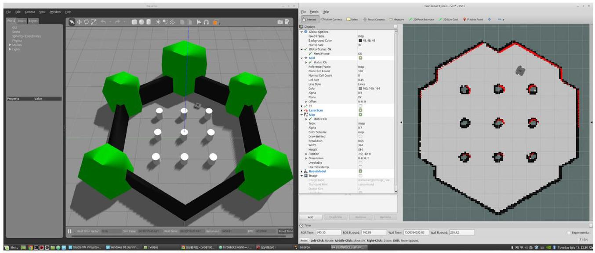

图 10-20 在Gazebo中运行SLAM的影像(左:Gazebo，右:Rviz)

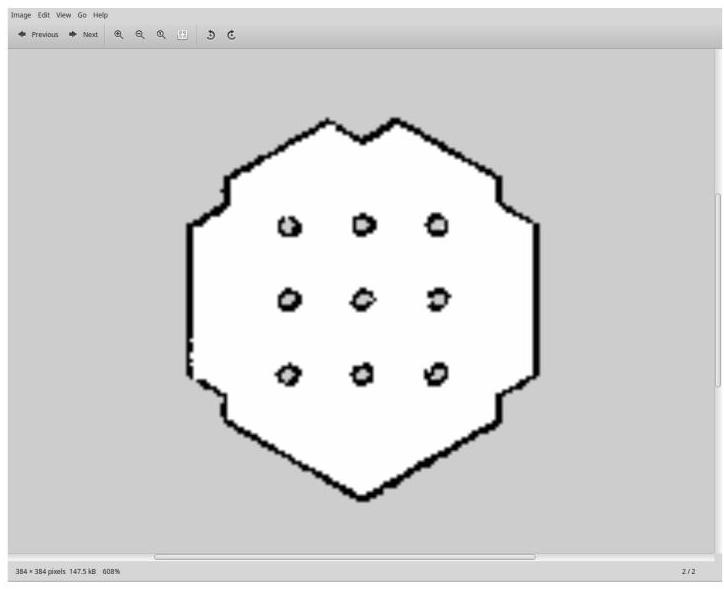

图 10-21 已生成的Gazebo环境地图

**虚拟导航运行顺序**

在运行导航之前退出所有执行的程序。然后, 如下所示运行相关功能包时, 机器人将显示在之前创建的地图上。在RViz上设置机器人的初始位置并设置目的地后, 可以看到机器人移动到目的地，如图10-22所示。请注意，初始位置在开始时只能指定一次。

**运行Gazebo**

\$ export TURTLEBOT3_MODEL=waffle

\$ roslaunch turtlebot3_gazebo turtlebot3_world.launch

**运行导航**

---

	\$ export TURTLEBOT3_MODEL=waffle

\$ roslaunch turtlebot3_navigation turtlebot3_navigation.launch map_file:=\$HOME/map.yaml

---

**运行RViz并设置目的地**

---

\$export TURTLEBOT3_MODEL=waffle

\$rosrun rviz rviz -d `rospack find turtlebot3_navigation`/rviz/turtlebot3_nav.rviz

---

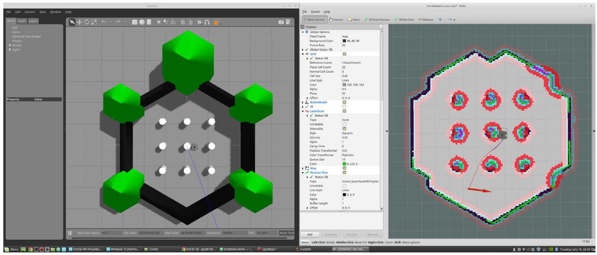

图 10-22 在Gazebo中运行导航的影像(左:Gazebo，右:RViz)

至此, 我们介绍了TurtleBot3功能包中的两种仿真工具。一种是使用ROS的3D可视化工具RViz，另一种是使用3D机器人仿真器Gazebo。仿真可以在逼近实际的机器人和场景中完成, 而不需要实际的机器人, 所以对于需要虚拟仿真的用户来说, 这将是一个很好的工具。

=

**TurtleBot的仿真**

Turtlebot支持三种类型的仿真(stage、stdr、gazebo)。当希望用虚拟机器人进行各种仿真时，请参考以下相关wiki。

http://wiki.ros.org/turtlebot_stdr

http://wiki.ros.org/turtlebot_gazebo

http://wiki.ros.org/turtlebot_stage
