# 第11章 SLAM 和导航

## 11.1. 导航及其组成要素

这里的导航 (navigation) 可以理解为安装在汽车里的导航仪。在驾驶汽车时, 只要在导航仪中设置目的地，就可以知道从当前位置到目的地的准确距离和所需时间，另外还可以设置中途路过的地点或指定公路。

我们现今使用的导航仪使用方便, 但其历史相对较短。1981年日本本田首先推出了一种基于三轴陀螺仪和胶卷地图的叫做 “Electro Gryrocator” ${}^{1}$ 的模拟(非数字)方法。 后来美国汽车产品公司Etak推出了利用带传感器的电子罗盘和车轮的电子导航仪(Etak Navigator) ${}^{2}$ 。然而,将传感器安装在电子罗盘和车轮上对于已经很昂贵的汽车来说是大的负担，而且还具有可靠性方面的问题。自二十世纪七十年代以来，美国一直在开发用于军事的卫星定位系统，二十一世纪二十年代开放了二十四颗全球定位系统(GPS) ${}^{3}$ 卫星, 并开始使用三角测量导航系统。

### 11.1.1. 移动机器人的导航

让我们把话题转移到机器人上吧。导航是移动机器人技术的基本目的之一, 同时也是一颗明珠。机器人技术中导航非常重要, 是必不可少的部分。导航是指机器人运动到一个指定的目的地, 这说起来很容易, 但完成它所需的技术一个个都不是容易的任务: 要知道机器人本身在哪里，并要有一个给定的周围环境的地图，在各种路径中找出最优路径，在行驶中避免障碍物 (如墙壁、家具、物体) 等。

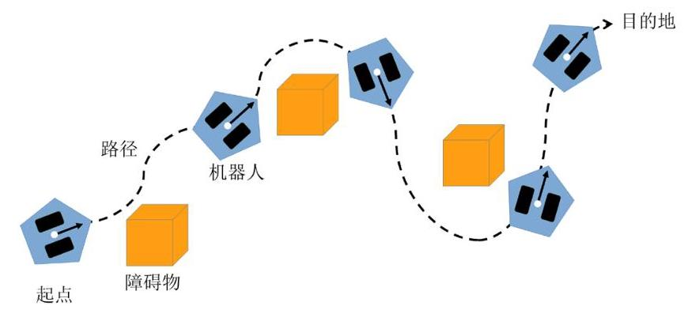

图 11-1 导航

---

1 https://en.wikipedia.org/wiki/Electro_Gyrocator

2 https://en.wikipedia.org/wiki/Etak

3 https://en.wikipedia.org/wiki/Global_Positioning_System

---

机器人实现自主导航都需要哪些？根据导航算法会有不同，但应该至少需要如下几种:

① 地图

2 测量或估计机器人的姿态的功能

3 识别障碍物，如墙壁和物体的功能

4 能够计算出最优路线并行驶的功能

### 11.1.2. 地图

第一是地图。导航仪从购买时起就配备有非常准确的地图，并且可以定期下载更新的地图, 以便可以根据地图将汽车引导到目的地。但是在使用服务机器人的房间里是否会有地图呢？服务机器人也像导航仪一样，需要一个地图，所以需要人创建一个地图，并把它给到机器人，或者需要机器人自己创建一个地图。

SLAM (Simultaneous localization and mapping) ${}^{4}$ 就是为了让机器人自己(或接受人的一些帮助)绘制地图而出现的技术。用中文应该是“同步定位和绘制地图”。这是在机器人移动到未知空间时通过探测周围环境来估计当前位置并同时绘制地图的方法。

### 11.1.3. 测量或估计机器人姿态的功能

第二，机器人需要自己能够测量和估计姿态(位置+方向)。汽车会用GPS估计自己的位置，但在室内无法使用GPS。即使说可以在室内使用，误差较大的GPS无法用于测量精细的移动。最近，虽然有DGPS ${}^{5}$ 等高精度的定位系统，但在室内还是无法使用的。为了克服这种问题, 人们引进了标志识别方式及室内定位系统等技术, 但在成本或精确度方面还不足以投入实际应用。当前的室内机器人用的最多的是导航推测(dead reckoning) ${}^{6} \; {}^{7}$ 。它的缺点是只能估算相对位置，但因为仅用廉价的传感器就能实现，且已有较长时间的研究进展，因此可以得到一定水平的位置估计值，因此被广泛使用。导航推测技术用机器人的车轮的旋转量来估计机器人本身的移动量。但车轮的旋转量具有不少的误差。

---

4 https://en.wikipedia.org/wiki/Simultaneous_localization_and_mapping

5 https://en.wikipedia.org/wiki/Differential_GPS

6 https://en.wikipedia.org/wiki/Dead_reckoning

7 http://www.cs.cmu.edu/afs/cs.cmu.edu/academic/class/16311/www/s07/labs/NXTLabs/Lab%203.html

---

因此还利用IMU传感器等获取惯性信息来补偿位置和方向值, 以此减小误差。

**姿态(位置+方向)**

在ROS中，机器人的位置(position:x，y，z)和方向(orientation:x，y，z，w)被定义为姿态。如第4.5节TF描述中所提到的，该位置由x、y和z三个向量描述，而方向使用四元数形式的x、y、 z和w。有关消息pose的说明，请参阅以下地址。需要注意，有一些术语隐含地包括方向信息，例如位置估计或特定物体的位置等。

http://docs.ros.org/api/geometry_msgs/html/msg/Pose.html

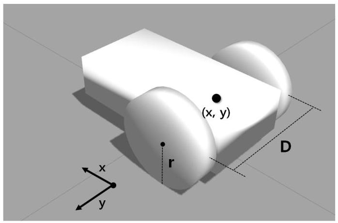

图 11-2 导航推测所需要的信息(中心位置(x，y)，车轮间距离D，车轮半径r)

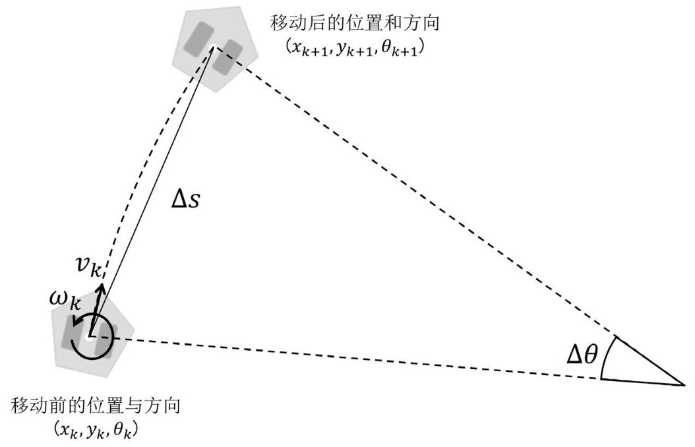

图 11-3 导航推测 (dead reckoning)

下面简要介绍一下导航推测。当有如图11-2的移动机器人时，设D是车轮之间的距离, $\mathrm{r}$ 是车轮的半径。如图11-3所示,当机器人在时间 ${T}_{e}$ 内移动很短距离时,利用左右电机旋转量 (当前编码器值 ${E}_{l}\mathrm{c}\text{ 、 }{E}_{r}\mathrm{c}$ 和 ${T}_{e}$ 之前的编码器值 ${E}_{l}\mathrm{p}$ 和 ${E}_{r}\mathrm{p}$ ) 来计算出左右车轮的转速 $\left( {{v}_{l},{v}_{r}}\right)$ ,如式11-1和11-2所示。

$$
{v}_{l} = \frac{\left( {E}_{l}\mathrm{c} - {E}_{l}\mathrm{p}\right) }{{T}_{e}} \cdot  \frac{\pi }{180}\text{ (radian }/\text{ sec) }
$$

$$
{v}_{r} = \frac{\left( {E}_{r\mathrm{C}} - {E}_{r}\mathrm{p}\right) }{{T}_{e}} \cdot  \frac{\pi }{180}\text{ (radian }/\text{ sec) }
$$

如式11-3和11-4求出左右车轮的移动速度( ${V}_{l}$ ， ${V}_{r}$ )，并如式11-5和11-6求出机器人的平移速度(linear velocity: ${v}_{k}$ )和旋转速度(angular velocity: ${\omega }_{k}$ )。

$$
{V}_{l} = {v}_{l} \cdot  \mathrm{r}\text{ (meter/sec) }
$$

(式 11-3)

$$
{V}_{r} = {v}_{r} \cdot  \mathrm{r}\text{ (meter/sec) }
$$

(式 11-4)

$$
{v}_{k} = \frac{\left( {V}_{r} + {V}_{l}\right) }{2}\text{ (meter/sec) }
$$

(式 11-5)

$$
{\omega }_{k} = \frac{\left( {V}_{r} - {V}_{l}\right) }{D}\text{ (radian/sec) }
$$

(式 11-6)

最后,通过这些值,利用式11-7至11-10的计算来求得机器人的位置 $\left( {{x}_{\left( k + 1\right) },{y}_{\left( k + 1\right) }}\right)$ 和方向 $\left( {\theta }_{\left( k + 1\right) }\right)$ 。

$$
\Delta \mathrm{s} = {v}_{k}{T}_{e}\;{\Delta \theta } = {\omega }_{k}{T}_{e}
$$

(式 11-7)

$$
{x}_{\left( k + 1\right) } = {x}_{k} + {\Delta s}\cos \left( {{\theta }_{k} + \frac{\Delta \theta }{2}}\right)
$$

(式 11-8)

$$
{y}_{\left( k + 1\right) } = {y}_{k} + {\Delta s}\sin \left( {{\theta }_{k} + \frac{\Delta \theta }{2}}\right)
$$

(式 11-9)

$$
{\theta }_{\left( k + 1\right) } = {\theta }_{k} + {\Delta \theta }
$$

(式 11-10)

### 11.1.4. 识别障碍物，如墙壁和物体

第三是一种利用传感器检测墙壁和物体等障碍物的方法。此时用到距离传感器、视觉传感器等多种传感器。其中距离传感器有基于雷达的距离传感器(常用的是LDS、LRF 和LiDAR)、超声波传感器和红外距离传感器等，而视觉传感器包括立体相机、单镜相机、360度相机，以及经常用作深度摄像头的RealSense、Kinect和Xtion也都用于识别障碍物。

### 11.1.5. 计算最优路径和行驶功能

第四是导航(Navigation)功能，这是计算到达目的地的最优路径，并且驱动机器人按照最优路径到达目的地的功能。实现这个功能的算法有很多种:称为路径搜索和规划的 A*算法 ${}^{8}$ 、势场算法 ${}^{9}$ 、粒子过滤算法 ${}^{10}$ 和RRT(Rapidly-exploring Random Tree)算法 ${}^{11}$ 等。

在这一节中, 我们简要地总结了SLAM和导航的组成要素, 但这是难解和广博的内容。四个要素中的第二个要素-测量和估计机器人的位置-已经在前面讲到，第三个要素-识别墙壁、物体等障碍物-在前面的“第8章 机器人、传感器和电机”中已说明。下面了解一下第一个要素-用于绘制地图的SLAM-和第四个要素-导航。

## 11.2. SLAM实习篇

在描述SLAM的理论之前，我将解释如何使用TurtleBot3来使用SLAM。在本节中， 把可以用于绘制地图的bag文件也上传到了github存储库中，因此建议读者跟着做一次。 下面先介绍SLAM的应用方法，理论则会在11.4节中详细介绍。

---

10 https://en.wikipedia.org/wiki/Particle_filter

11 https://en.wikipedia.org/wiki/Rapidly-exploring_random_tree

---

### 11.2.1. 对于使用SLAM的机器人的硬件限制

与SLAM相关的常用的功能包有gmapping ${}^{12}$ 、cartographer ${}^{13}$ 和rtabmap ${}^{14}$ 。我们将在本节中使用gmapping。使用Gmapping有几种硬件限制。对于常见的移动机器人不成问题, 但还是希望读者了解一下。

**移动方式**

机器人必须能够用 $\mathrm{X}\text{ 、 }\mathrm{Y}$ 轴平面上的平移速度 (linear velocity) 和theta旋转速度 (angular velocity)指令进行操作。比如有左右两个可以单独驱动的差动驱动式移动机器人(differential drive mobile robot)，或者具有三个以上的全向轮的全向移动机器人(omni-wheel robot)。

**测位(Odometry)**

需要能获得测位信息。换句话说，要可以通过导航推测方法(dead reckoning)来推算机器人移动的距离和旋转量，或者通过使用IMU传感器的惯性信息推定姿态补偿，或用IMU传感器测量平移速度和旋转速度, 最终要可以测量及推断机器人本身的位置。

**检测用传感器**

为了实现SLAM和导航，机器人需要有LDS (Laser Distance Sensor)、 LRF (Laser Range Finder) 和LiDAR来测量XY平面上的障碍物。深度相机(如 RealSense、Kinect和Xtion)也可以将3D信息转换为XY平面上的信息。换句话说，有必要安装一个能够测量二维平面的传感器。使用超声波传感器、PSD传感器和摄像机的可视SLAM也属于这个概念，但不在本书论述的范围内。

**机器人的形态**

只考虑正多边形、正方形和圆形机器人。不考虑沿某一方向太长的机器人、无法从房门通过的过大的机器人、双足人形机器人、多关节移动机器人和飞行机器人等。在本章中，我们将使用我们在第10章中讨论过的官方ROS平台TurtleBot3。图11-4中的

---

12 http://wiki.ros.org/gmapping

13 http://wiki.ros.org/cartographer

14 http://wiki.ros.org/rtabmap

---

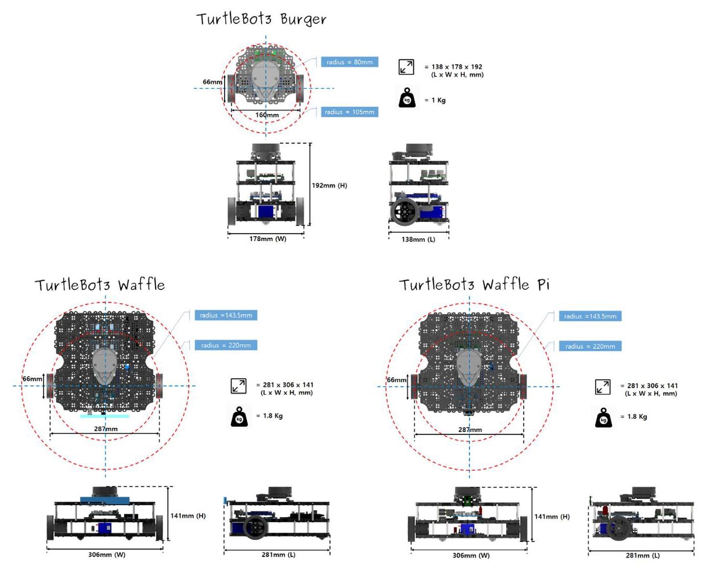

图 11-4 TurtleBot3 Burger、Waffle和Waffle Pi的外形

### 11.2.2. SLAM的实验环境

如下几种环境从Gmapping算法的角度来看缺少特征要素, 因此这些不适合应用 SLAM。题没有任何障碍物的方形环境。②由两个长长而平行的墙壁形成的走廊。③无法反射激光或红外线的玻璃窗。④散射镜。流由于传感器的特性，无法获取障碍物信息的环境, 如湖泊或海边等。

在本书的练习中, 实验环境被设置为一个可以测量长度的网格式的迷宫型平面区域, 如图11-5所示。

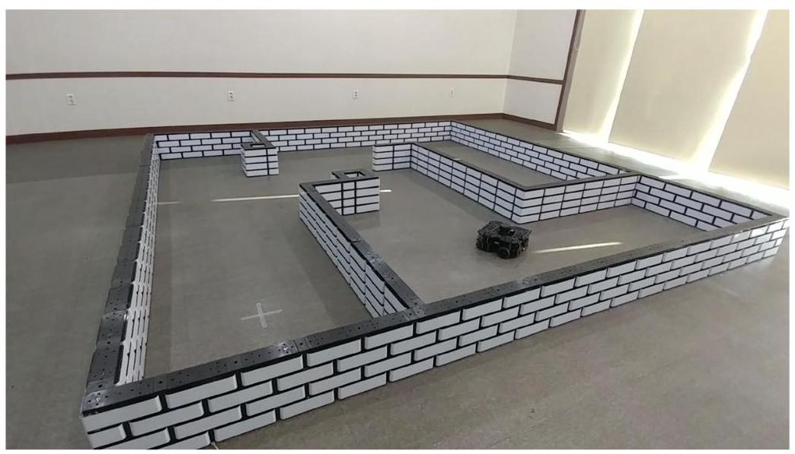

图 11-5 实验环境

### 11.2.3. 用于SLAM的ROS功能包

本节中使用的SLAM相关的ROS功能包是turtlebot3元功能包、slam_gmapping元功能包中的gmapping功能包，以及navigation元功能包中的map_server功能包。这一切都曾在 "10.5 TurtleBot3开发环境" 中安装过。由于这个练习是第10章的后续内容, 所以我只描述运行方法。每个功能包的说明将在下一节中详细介绍。为了便于参考, 本节将分开说明[Remote PC]和[TurtleBot]两种环境下运行的命令以避免混淆。

### 11.2.4. 运行SLAM

SLAM运行顺序如下。在这个例子中，我们将使用TurtleBot3 Waffle作为参考。如果您的是Burger，则只需改变名字。如果是在使用Burger或Waffle Pi，只需将命令中的 'TURTLEBOT3_MODEL'项目从'waffle'改为'burger'或'waffle_pi'。

**roscore**

在[Remote PC]中, 运行roscore。

---

\$ roscore

---

**启动机器人**

在[TurtleBot]中, 运行turtlebot3_robot.launch文件并运行turtlebot3_core和 turtlebot3_lds节点。

---

\$ roslaunch turtlebot3_bringup turtlebot3_robot.launch

---

**运行SLAM功能包**

在[Remote PC]中, 运行turtlebot3_slam.launch启动文件。turtlebot3_slam功能包只包含一个launch文件。运行后，将运行robot_state_publisher节点和slam_ gmapping节点，其中robot_state_publisher节点将两个轮子和每个关节的三维位置和方向信息以TF形式发布，而slam_gmapping节点用于绘制地图。另外，描述包含机器人的外观信息的URDF的robot_model也会被设置。

---

	\$ export TURTLEBOT3_MODEL=waffle

\$ roslaunch turtlebot3_slam turtlebot3_slam.launch

---

**运行RViz**

运行RViz可视化工具RViz，以便在SLAM过程中可以直观地确认结果。运行时如果附加如下所示的 “-d” 选项，则从一开始就会添加有关显示(display)的插件，会比较方便。

---

	\$ export TURTLEBOT3_MODEL=waffle

\$rosrun rviz rviz -d `rospack find turtlebot3_slam`/rviz/turtlebot3_slam.rviz

---

**保存话题信息**

下一步，用户将直接遥控机器人并执行SLAM操作，此时发出的/scan和/tf话题存储在名为scan_data的bag文件中。您可以在后期使用此文件创建地图，也可以重现绘制地图过程中的/scan和/tf话题, 而无需重复做实验。可以把它想象成来自实验的话题数据 (下一个例子中的/scan和/tf话题)的副本。以下命令的-O选项是指定输出文件名称的选项，这将会把输出内容保存为叫做“scan_data.bag”的bag文件。保存话题消息在 SLAM过程中不是必要功能，所以如果不需要保存消息，则可以跳过它。

---

\$ rosbag record -0 scan_data /scan /tf

---

**遥控机器人**

以下命令允许用户手动遥控机器人并执行SLAM操作。这里重要的是不要过快改变机器人的速度，也不要以过快的速度前进、后退或旋转。移动机器人时，机器人必须扫描要测量的环境的每个角落。这需要经验和技巧，因此需要在大量的SLAM实验中积累经验。

\$ roslaunch turtlebot3_teleop turtlebot3_teleop_key.launch

**绘制地图**

现在已经完成了所有的准备工作, 让我们运行map_saver节点来创建一个地图吧。 当移动机器人时，机器人会根据测位(odometry)、tf信息和传感器的扫描信息来创建地图。这可以在我们刚刚运行的RViz中看到。创建的地图保存在运行map_saver的目录中。除非指定了文件名，否则保存为实际地图文件map.pgm和包含地图信息的和map. yaml文件。如下命令中的“-f”选项是指定保存地图文件的目录及文件名的选项。例如， 如果指定为 “~/map”，则“~”意味着用户目录，而“map”意味着要保存为map. pgm和map.yaml文件。

---

\$ rosrun map_server map_saver -f ~/map

---

您可以通过上述过程创建地图。绘制地图所需的节点和话题可以通过使用rqt_graph 来查看，如图11-6所示。绘制地图过程如图11-7所示，最终的地图如图11-8所示。我们可以确认, 上面提到的实验环境地图已正确绘制。

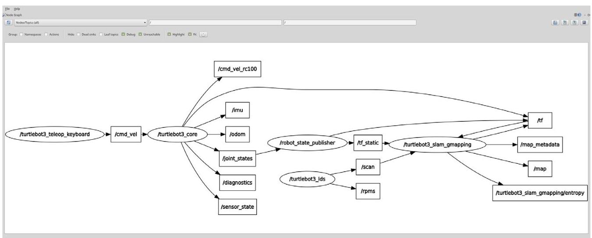

图 11-6 SLAM所需的节点和话题

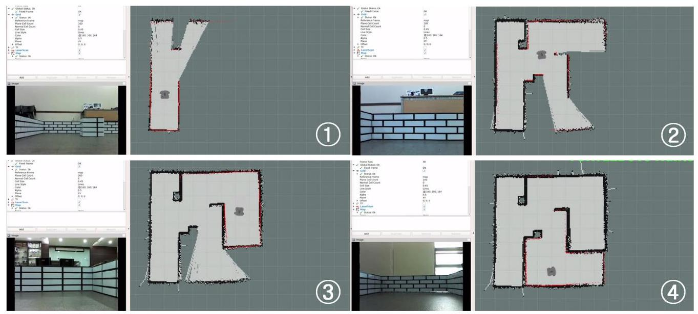

图 11-7 用于绘制地图的SLAM的运行过程

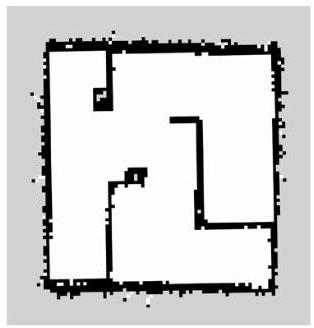

图 11-8 完成的地图

### 11.2.5. 利用预先准备好的bag文件运行的SLAM

为了可以在没有TurtleBot3和LDS传感器的情况下尝试SLAM，我们将利用录制的 bag文件。首先，下载本节要用到的文件。

---

\$wget https://raw.githubusercontent.com/R0B0TIS-GIT/turtlebot3/master/turtlebot3_slam/bag/

TB3_WAFFLE_SLAM.bag

---

以下内容类似于上面的SLAM运行方法。唯一的不同点是对rosbag进行回放 (play) , 而不是保存。如此操作就和实际实验相同。

---

\$ roscore

---

---

\$export TURTLEBOT3_MODEL=waffle

\$ roslaunch turtlebot3_bringup turtlebot3_remote.launch

---

\$ export TURTLEBOT3_MODEL=waffle

\$rosrun rviz rviz -d `rospack find turtlebot3_slam`/rviz/turtlebot3_slam.rviz

---

\$ roscd turtlebot3_slam/bag

\$ rosbag play ./TB3_WAFFLE_SLAM.bag

\$ rosrun map_server map_saver -f ~/map

---

在下一节中将更详细地说明前面运行过的功能包的源代码，并附加说明设置方法。

## 11.3. SLAM应用篇

如果11.2节是一个按部就班操作的简单的过程, 那么本节的应用篇中将详细剖析 SLAM中使用的ROS功能包以及创建和配置它的方法。我们将仔细看看turtlebot3元功能包、slam_gmapping元功能包中的gmapping功能包和navigation元功能包中的map_ server功能包。所以，本节是将11.2节内容应用于自己的机器人的应用篇。对SLAM的理论将在11.4节中介绍。

本课程是基于TurtleBot3机器人平台和LDS传感器，但理解和掌握之后可以将SLAM 应用在自己的机器人，而非受限于机器人平台和传感器。如果您想在TurtleBot3机器人平台上搭建您自己的机器人或创建自己的风格的新的机器人，本节将会带来帮助。

### 11.3.1.地图

首先, 由于本段课程最终要得到的结果是地图, 因此我们有必要更详细了解有关地图的内容。如果我们给机器人一张我们使用的纸质地图，机器人会理解吗？应该不会。应该给机器人一个易于理解和易于计算的数字文件。人们对于这种机器人导航地图的定义已经讨论了很长时间，现在也没有结束。尤其是，近年来出现了各种形式的地图，有些不仅包括二维信息，而且还包括三维信息，或者有些地图不仅包含有关移动的信息，还包含各物体的分割(segmentation)的信息。

在这个讲座中, 我们将使用在ROS社区中常用的二维占用网格地图 (OGM, Occupancy Grid Map)。如上图11-9所示，白色是机器人可以移动的自由区域(free area)，黑色是机器人不能移动的占用区域(occupied area)，灰色是未被确认的未知区域(unknown area)。

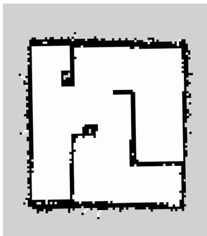

图 11-9 占用网格地图

这些区域用从0到255表达的灰度 (gray scale) 值表示。该值是通过贝叶斯定理的后验概率获得的, 该概率代表占用状态的占用概率。占用概率occ表示为 “occ = (255 - color_avg) /255.0”。如果图像是24位，则是 “color_avg = (一个单元的灰度值/ 0xFFFFFFF×255)”。这个occ越接近1，它被占用的概率越大，越接近0，被占用的概率就越小。

当它以ROS消息(nav_msgs/OccupancyGrid)发布时，会被重新定义为占有度， 是[0〜100]之间的整数。越接近 “0” 就越接近移动自由的区域(free area)，而越接近 “100”就越是不可移动的已占用的区域(occupied area)。此外，“-1”是定义为未知区域(unknown area)。

在ROS中, 地图信息以*.pgm文件格式 (portable graymap format)存储和使用。它还包含一个*.yaml文件，它也包含地图信息。例如，如果我们查看我们在11.2节中所写的地图信息(map.yaml)，则结果类似如下所示。image是地图的文件名，而 resolution是地图的分辨率，单位是meters/pixel。

---

image: map.pgm

resolution: 0.050000

origin: [-10.000000, -10.000000, 0.000000]

---

---

negate: 0

	occupied_thresh: 0.65

	free_thresh: 0.196

---

也就是说, 每个像素意味着5厘米。origin是地图的原点, origin的每个数字代表x、 y和yaw。地图的左下角是x = -10m，y = -10m。negate会反转黑白。每个像素的颜色如下确定:由当占用概率超过占用阈值(occupied_thresh)时表示为黑色的占用区域，而当占用概率小于自由阈值 (free_thresh) 时表示为白色的自由区域 (free area)。

图11-10显示了使用TurtleBot3创建大型地图的结果。用了大约一个小时的时间创建了一个行程约350米的地图。

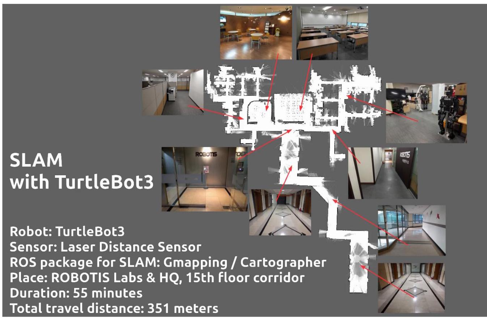

图 11-10 用TurtleBot3制作的广域占用网格地图

### 11.3.2. SLAM所需的信息

我们已经了解过地图了, 那下面让我们来看看为了绘制地图, SLAM都需要哪些信息。首先，“制作地图时需要什么？” 首要的是距离值。例如，可以以自己为中心来判断“那个沙发离我有2m远”的距离值。可以说这个距离值是用LDS或深度摄像机来扫描 XY平面的结果值。

其次是我的位置值。在这里，“我”是指“传感器”，因为这个传感器的位置固定在机器人上，所以如果机器人移动，传感器也会一起移动。因此，传感器的位置值依赖于机器人的移动量，也就是测位(odometry)。有必要计算它并将其作为位置值来提供。

这里提到的距离值在ROS中被称为scan，并且姿态(位置+方向)信息会根据相对坐标关系而改变，因此被称为tf(transform)。如图11-11所示，我们根据两个信息scan 和tf来运行SLAM，并创建我们想要的地图。

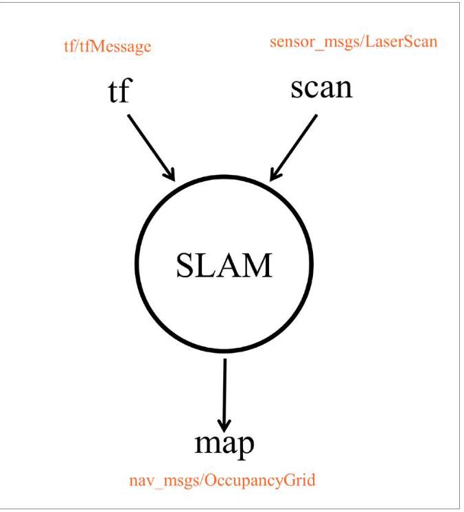

图 11-11 SLAM所需的tf、scan数据及其结果map的关系

### 11.3.3. SLAM的处理过程

为了创建地图，除了turtlebot3_core节点之外，笔者还为SLAM创建了turtlebot3_ slam功能包。该功能包没有源文件，但是通过将需要的功能包捆绑成launch文件来运行。这个过程如图11-12所示，后面有详细的说明。

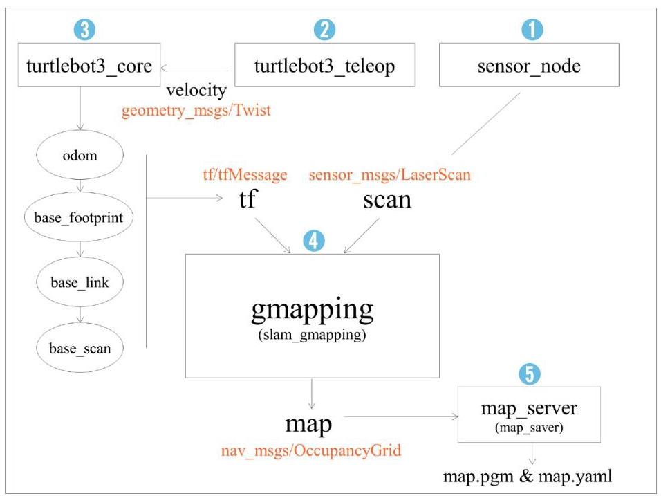

图 11-12 turtlebot3_slam流程图

**① sensor_node(例: turtlebot3_lds)**

turtlebot3_lds节点运行LDS传感器, 并将SLAM所需的scan信息发送到slam_ gmapping节点。

**② turtlebot3_teleop(例:turtlebot3_teleop_keyboard)**

turtlebot3_teleop_keyboard节点是可以接收键盘输入并控制机器人的节点。向 turtlebot3_core节点发送移动速度和旋转速度命令。

**③ turtlebot3_core**

turtlebot3_core节点接收用户的命令并移动机器人。此时在内部发送测得的机器人自己的位置odom信息,且还会以odom $\rightarrow$ base_footprint $\rightarrow$ base_link $\rightarrow$ base_scan的顺序将odom的相对坐标变换信息以tf形式发布。

**4 turtlebot3_slam_gmapping**

在turtlebot3_slam_gmapping节点中，根据scan信息(由传感器测量的距离值)和 tf值(传感器的位置值)来创建地图。

5 map_saver

map_server功能包中的map_saver节点将利用这个地图的信息生成一个可保存的 map.pgm文件和一个信息文件map.yaml。

### 11.3.4. 坐标变换(TF)

在SLAM中使用的两种信息是如上所述的距离值和测量该距离值的位置。距离值可以从传感器节点接收，并且距离值被测量的位置是相应传感器的位置。传感器安装在机器人的某个地方, 因此机器人的移动会带动传感器移动。换句话说, 机器人和传感器在物理上是固定的，并且传感器的姿态(位置+方向)根据机器人的移动而相对变化。可以将其视为相对坐标变换。在ROS中，这个过程被称为tf。我们以树的形式看看当前的相对坐标， 命令如下:

**\$ rosrun rat_tf_tree rqt_tf_tree**

如果执行上述命令，则可以使用tf的tree查看器检查机器人和传感器的相对位置变换信息 (tf) ，如图11-13所示。换句话说，如果仅考虑从机器人位置到安装LDS的位置这一段,则位置信息会按照odom $\rightarrow$ base_footprint $\rightarrow$ base_link $\rightarrow$ base_scan的顺序相对连接。机器人会根据从turtlebot3_teleop_keyboard节点收到的平移速度和转速命令来移动，并且按照前面所述的导航推测(dead reckoning)估计机器人的测位 (odometry),如此生成的odom会以tf形式发布。之后的base_footprint→base_ link→base_scan是在结构上固定的状态。这与在turtlebot3_description功能包中的/ urdf/turtlebot3_waffle.urdf.xacro中描述的一样, 描述了各坐标变换, 并定期地通过 robot_state_publisher节点发布tf。

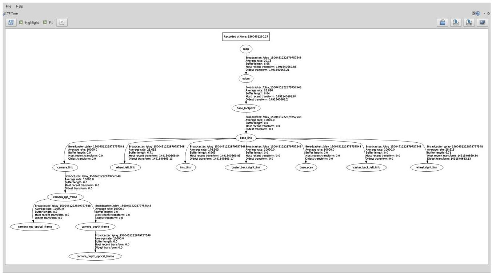

图 11-13 地图和机器人各部分的相对坐标变换状态

### 11.3.5. turtlebot3_slam功能包

turtlebot3_slam功能包中的turtlebot3_slam.launch的内容如下。这个启动文件主要分为两种，一种包含turtlebot3_remote.launch文件，另一种运行本章讨论的 turtlebot3_slam_gmapping节点。

turtlebot3_slam/launch/turtlebot3_slam.launch

---

<lunch>

									<include file="\$(find turtlebot3_bringup)/launch/turtlebot3_remote.launch" />

										<node pkg="gmapping" type="slam_gmapping" name="turtlebot3_slam_gmapping" output="screen">

																				<param name="base_frame" value="base_footprint"/>

																				<param name="odom_frame" value="odom"/>

																					<param name="map_update_interval" value="2.0"/>

																					<param name="maxUrange" value="4.0"/>

																						<param name="minimumScore" value="100"/>

																						<param name="linearUpdate" value="0.2"/>

																						<param name="angularUpdate" value="0.2"/>

---

---

	<param name="temporalUpdate" value="0.5"/>

	<param name="delta" value="0.05"/>

	<param name="1skip" value="0"/>

	<param name="particles" value="120"/>

	<param name="sigma" value="0.05"/>

	<param name="kernelSize" value="1"/>

	<param name="lstep" value="0.05"/>

	<param name="astep" value="0.05"/>

	<param name="iterations" value="5"/>

	<param name="lsigma" value="0.075"/>

	<param name="ogain" value="3.0"/>

	<param name="srr" value="0.01"/>

	<param name="srt" value="0.02"/>

	<param name="str" value="0.01"/>

	<param name="stt" value="0.02"/>

	<param name="resampleThreshold" value="0.5"/>

	<param name="xmin" value="-10.0"/>

	<param name="ymin" value="-10.0"/>

	<param name="xmax" value="10.0"/>

	<param name="ymax" value="10.0"/>

	<param name="llsamplerange" value="0.01"/>

	<param name="llsamplestep" value="0.01"/>

	<param name="lasamplerange" value="0.005"/>

	<param name="lasamplestep" value="0.005"/>

	</node>

</launch>

---

首先, 我们来看看turtlebot3_remote.launch文件。该文件描述了用户指定的机器人模型的加载和robot_state_publisher节点的执行，该节点将两个轮子和每个关节的姿态信息以TF形式。

---

	turtlebot3_bringup/launch/turtlebot3_remote.launch

<launch>

<arg name="model" default="\$(env TURTLEBOT3_MODEL)" doc="model type [burger, waffle, waffle_pi]"/>

<include file="\$(find turtlebot3_bringup)/launch/includes/description.launch.xml">

<arg name="model" value="\$(arg model)" />

</include>

---

<node pkg="robot_state_publisher" type="robot_state_publisher" name="robot_state_publisher"

output="screen">

<param name="publish_frequency" type="double" value="50.0" />

</node>

</launch>

剩下的一个节点turtlebot3_slam_gmapping实际上是将gmapping功能包中的 slam_gmapping节点改名后运行。为了使这个节点正常工作，需要根据自己的机器人和传感器修改各种选项，如下所示。下面的设置值都是为TurtleBot3 Waffle设置的。如果想使用TurtleBot3以外的其他机器人，请参考以下说明并根据您的机器人和传感器进行修改。

<param name="base_frame" value="base_footprint"/>

<param name="odom_frame" value="odom"/>

<param name="map_update_interval" value="2.0"/>

<param name="maxUrange" value="4.0"/>

<param name="minimumScore" value="100"/>

<param name="linearUpdate" value="0.2"/>

<param name="angularUpdate" value="0.2"/>

<param name="temporalUpdate" value="0.5"/>

间，则执行扫描。如果这个值小于0，则不使用它。

<param name="delta" value="0.05"/>

<param name="1skip" value="0"/>

<param name="particles" value="120"/>

<param name="sigma" value="0.05"/>

<param name="kernelSize" value="1"/>

<param name="lstep" value="0.05"/>

<param name="astep" value="0.05"/>

<param name="iterations" value="5"/>

<param name="lisigma" value="0.075"/>

<param name="ogain" value="3.0"/>

<param name="srr" value="0.01"/>

<param name="srt" value="0.02"/>

<param name="str" value="0.01"/>

<param name="stt" value="0.02"/>

<param name="resampleThreshold" value="0.5"/>

<table id="cross-table-5"><tr><td></td><td>设置slam_gmapping节点</td></tr><tr><td><param name="base_frame" value="base_footprint"/></td><td>机器人基本框架</td></tr><tr><td><param name="odom_frame" value="odom"/></td><td>测位 (Odometry) 框架</td></tr><tr><td><param name="map_update_interval" value="2.0"/></td><td>地图更新时间间隔 (sec)</td></tr><tr><td><param name="maxUrange" value="4.0"/></td><td>使用的激光传感器的最大范围(meter)</td></tr><tr><td><param name="minimumScore" value="100"/></td><td>考虑到扫描匹配结果的最低分数</td></tr><tr><td><param name="linearUpdate" value="0.2"/></td><td>处理所需的最小移动距离</td></tr><tr><td><param name="angularUpdate" value="0.2"/></td><td>处理所需的最小旋转角度</td></tr><tr><td><param name="temporalUpdate" value="0.5"/></td><td>如果从最后一次扫描时刻开始超过了此更新时</td></tr><tr><td>间，则执行扫描。如果这个值小于0，则不使用它。</td><td></td></tr><tr><td><param name="delta" value="0.05"/></td><td>地图分辨率:距离/像素</td></tr><tr><td><param name="lskip" value="0"/></td><td>在每次扫描中跳过的光束数量</td></tr><tr><td><param name="particles" value="120"/></td><td>粒子滤波器中的粒子数</td></tr><tr><td><param name="sigma" value="0.05"/></td><td>激光辅助搜索的标准偏差</td></tr><tr><td><param name="kernelSize" value="1"/></td><td>激光辅助搜索的窗口大小</td></tr><tr><td><param name="lstep" value="0.05"/></td><td>初始搜索步骤(平移)</td></tr><tr><td><param name="astep" value="0.05"/></td><td>初始搜索步骤(旋转)</td></tr><tr><td><param name="iterations" value="5"/></td><td>扫描匹配迭代次数</td></tr><tr><td><param name="lsigma" value="0.075"/></td><td>光束似然估计的标准偏差</td></tr><tr><td><param name="ogain" value="3.0"/></td><td>似然估计扁平增益</td></tr><tr><td><param name="srr" value="0.01"/></td><td>测位误差(平移→移动)</td></tr><tr><td><param name="srt" value="0.02"/></td><td>测位误差(平移→旋转)</td></tr><tr><td><param name="str" value="0.01"/></td><td>测位误差(旋转→平移)</td></tr><tr><td><param name="stt" value="0.02"/></td><td>测位误差(旋转→旋转)</td></tr><tr><td><param name="resampleThreshold" value="0.5"/></td><td>重新采样阈值</td></tr><tr><td><param name="xmin" value="-10.0"/></td><td>初始地图大小(最小x)</td></tr><tr><td><param name="ymin" value="-10.0"/></td><td>初始地图大小 (最小y)</td></tr><tr><td><param name="xmax" value="10.0"/></td><td>初始地图大小 (最大x)</td></tr><tr><td><param name="ymax" value="10.0"/></td><td>初始地图大小 (最大y)</td></tr><tr><td><param name="llsamplerange" value="0.01"/></td><td>似然估计的范围(平移)</td></tr><tr><td><param name="llsamplestep" value="0.01"/></td><td>似然估计的步幅(平移)</td></tr><tr><td><param name="lasamplerange" value="0.005"/></td><td>似然估计的范围(旋转)</td></tr><tr><td><param name="lasamplestep" value="0.005"/></td><td>似然估计的步幅(旋转)</td></tr></table>

上面解释了绘制地图所需的所有内容。下一节讨论SLAM的理论。

## 11.4. SLAM理论篇

### 11.4.1. SLAM

SLAM (Simultaneous Localization And Mapping), 翻译成中文就是 “同时定位与地图构建”。换句话说，这意味着机器人在未知的环境中探索，仅通过安装在机器人上的传感器估计机器人本身的位置的同时绘制未知环境的地图。这是导航及自主驾驶的关键技术。

通常用于位置估算的传感器有编码器(Encoder)和惯性测量单元(IMU)。编码器测量车轮的旋转量, 并通过导航推测 (dead reckoning) 推算机器人的大致位置。在这种情况下会发生一定的误差，此时用惯性传感器测得的惯性信息补偿位置信息的误差。根据目的，位置也可以不用编码器，只用惯性传感器来估算。

该位置估计根据通过在创建地图时使用的距离传感器或相机获得的周围环境的信息再次校正位置。这种位置估计方法包括卡尔曼滤波(Kalman filter)、马尔可夫定位 (Markov localization)、利用粒子滤波(Particle filter)的蒙特卡罗定位(Monte Carlo Localization)等等。

距离传感器广泛用于测绘，如超声波传感器、光探测器、无线电探测器、激光测位仪和红外扫描仪。除了距离传感器之外，还使用相机，诸如将立体相机当作距离传感器，或使用普通相机的视觉SLAM。

而且, 有的研究者提出了通过给环境贴上标记 (marker) 来识别环境的方法。 例如, 通过将标记安装在天花板上, 用相机区分标记。近来, 出现了多种深度相机 (RealSense、Kinect和Xtion等)，利用这些相机可以获得接近距离传感器的距离值， 因此有很多相关的研究。

### 11.4.2. 多种位置估计(localization)方法论

位置估计方法是机器人工程的一个重要研究领域，它目前也在被人们积极地研究。只要能对机器人的位置进行足够正确的估计, 则能够容易地解决基于位置的地图绘制的问题，如SLAM。但是目前还有许多问题，比如，传感器捕捉到信息不确定、为了在实际环境中工作需要保证实时性，等等。为了解决这个问题，有各种位置估计方法在被研究当中。在本节中, 作为位置估计的代表性例子, 讨论了卡尔曼滤波器 (Kalman filter) 和粒子滤波器(Particle filter)方法论。

**卡尔曼滤波器(Kalman filter)**

由Rudolf E. Kalman博士开发的卡尔曼滤波器 (Kalman filter) 因其在美国宇航局的阿波罗计划中的应用而广为人知，该滤波器指，在有噪声的线性系统中，跟踪目标值状态的递归滤波器。它基于贝叶斯(Bayes)概率，它预先假定了一个模型，并使用这个模型从以前的状态预测(Prediction)当前状态。然后, 使用这个预测值与由外部测量仪器获得的实际测量值之间的误差来执行一个补偿 (update) 过程, 这个过程利用误差值推定更准确的状态值。它持续地重复迭代，以此提高准确性。这个过程的简化说明如图 11-14所示。

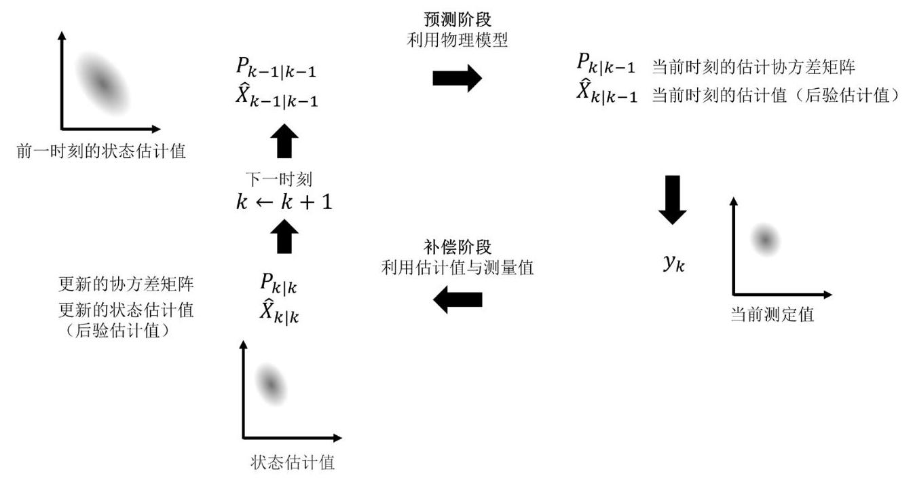

图 11-14 卡尔曼滤波器的基本概念

但是, 卡尔曼滤波器仅适用于线性系统。我们的机器人和传感器大部分都是非线性系统，扩展和改进卡尔曼滤波的EKF(扩展卡尔曼滤波)被广泛应用。此外，还有许多 KF变体, 例如无损卡尔曼滤波器 (UKF, Unscented Kalman Filter) 和快速卡尔曼滤波器 (Fast Kalman filter) ，这些都提高了EKF的精度。它也经常与其他算法一起使用，例如会与粒子滤波器一起使用的Rao-Blackwellized粒子滤波器(RBPF，Rao-Blackwellized Particle Filter)一起使用。

**粒子滤波器**

粒子滤波(Particle Filter)是目前最流行的目标跟踪算法。典型的例子是使用粒子滤波器的蒙特卡罗定位(Monte Carlo Localization)。前面描述的卡尔曼滤波器存在一个问题, 即在具有高斯噪声的线性系统中能保证准确度, 但是对于其他的系统无法保证准确度。但现实世界中的大部分问题都是非线性系统。

机器人和传感器也是如此, 所以粒子滤波器通常用于位置估计。如果卡尔曼滤波器是一个分析方法, 假设目标是一个线性系统, 那么卡尔曼滤波器通过线性运动搜索参数, 而粒子滤波器是一种基于尝试和错误(try-and-error)的方法通过仿真进行预测的技术。 称为粒子滤波器是因为将由目标系统中的概率分布随机生成的估计值看作为粒子。这也被称为顺序蒙特卡罗 (SMC, Sequential Monte Carlo) 方法或蒙特卡罗方法。

像其他位置估计算法一样, 用粒子滤波方法推定目标物体的位置时, 也假设输入信息中包含误差。当使用SLAM时，使用机器人的测位(odometry)值和用距离传感器获得的环境测量值作为观测值来估计机器人的当前位置。

在粒子滤波方法中, 位置不确定性是用称为样本的粒子群来描述的。我们根据机器人的运动模型和概率将粒子移动到一个新的估计位置和方向, 并根据实际测量值对每个粒子的权重进行调整，逐渐降低噪声，得到比较精确的位置。在移动机器人的情况下，每个粒子 (particle) 是姿态 (pose) 和权重 (weight) 的函数。其中姿态 (pose) 是机器人的位置(x，y)和方向(i)的函数。

这个粒子滤波器经历以下5个步骤。除了第一步的初始化之外，重复执行第二至第五步，以估计机器人的位置值。换句话说，是一种用测量值反复更新粒子分布(在X，Y坐标平面上把机器人的位置用概率表达的粒子的分布)，以此推测机器人的位置的方法。

**1 初始化 (initialization)**

由于一开始根本无法知道初始机器人的姿态(位置和方向)，因此在可以用N个粒子求得的所有可能的姿态的范围内随机安排机器人的姿态。每个初始粒子权重为 $1/\mathrm{N}$ ，总和为1。N以经验确定, 通常为数百。如果初始位置已知, 则将粒子放置在其附近。

**② 预测 (prediction)**

根据描述机器人运动的系统模型 (system model), 给被观察到的移动量 (如机器人的测位(Odometry)信息等)加上噪声(noise)，用这种方法移动各个粒子。

**3 调整 (update)**

基于所测量到的传感器信息，计算每个粒子的概率，并且通过反映这个值来更新每个粒子的权重值。

**4 姿态估计 (pose estimation)**

利用所有粒子的位置、方向和权重值来计算加权平均值、中央值和最大权重的粒子值, 并用这些估计机器人的姿态。

**5 重采样 (Resampling)**

这是生成新粒子的步骤, 是去除权重小的粒子, 以权重大的粒子为中心创建继承了现有例子的特性(姿态信息)的新粒子。这里，必须保持粒子数量N不变。

另外, 如果样本数量足够, 粒子滤波器的位置估计比卡尔曼滤波器改进版的EKF或 UKF更准确，但如果数目不够，则可能不准确。为了解决这个问题，同时使用粒子滤波和卡尔曼滤波的基于Rao-Blackwellized粒子滤波器(RBPF)的SLAM算法被广泛使用。

**粒子滤波器 (Particle Filter)**

如果您想了解更多关于粒子滤波器的知识，您可以在 "Probabilistic Robotics" 一书中找到更多关于粒子滤波器的知识。Sebastian Thrun(斯坦福教授，Juda City创始人，谷歌研究员)的这本书被称为机器人工程领域的概率教科书。我给任何想学习机器人的人都强烈推荐这本书。此外, 在Open Robotics领域中进行大量活动的KITECH的Yang Guang-Woong先生的博客和个人主页、Hwang Byung-Hoon先生在机器人工程相关的博客上写的有关粒子的文章、Choi Sung-Jun先生的enginius 博客，这些都会带来帮助。最后，还可以参考Juda City的在线视频讲座 "Artificial Intelligence for Robotics"。

http://www.probabilistic-robotics.org/

https://www.udacity.com/course/cs373

http://blog.daum.net/pg365/

http://abipictures.tistory.com/

http://enginius.tistory.com/

至此结束了对SLAM的讲解。对于gmapping的描述已被粒子滤波器的说明所取代，因此，更详细的解释请参阅以下参考文献中提到的文章。下一节将介绍导航 (navigation)

=

**OpenSLAM와 Gmapping**

如上所述, SLAM领域已经在机器人工程中进行着广泛的研究。这些信息可以在最新的学术期刊和学会的讲座中找到，其中许多研究都是开源的。这些信息由OpenSLAM小组编辑，可以在OpenSLAM. org找到。这是我们必须访问的网站。

我们在第11.4节中使用的gmapping也在这里有介绍，而ROS社区在SLAM中使用了很多gmapping。 有两篇关于gmapping的论文。其中一篇发表在ICRA 2005上，另一篇发表在2007年的Robotics， IEEE Transactions on论文期刊上。

这些论文描述了如何尽量减少粒子的数量, 以减少计算量且提高实时性。主要的方法是使用上述 Rao-Blackwellized粒子滤波器。有关详细信息，请参阅文章，粗略描述可以理解为11.4.2节中的粒子滤波器的解释。

[1] Grisetti, Giorgio, Cyrill Stachniss, and Wolfram Burgard, Improving grid-based slam with rao-blackwellized particle filters by adaptive proposals and selective resampling, Proceedings of the 2005 IEEE International Conference on Robotics and Automation, pp. 2432-2437, 2005.

[2] Grisetti, Giorgio, Cyrill Stachniss, and Wolfram Burgard, Improved techniques for grid mapping with rao-blackwellized particle filters, IEEE Transactions on Robotics, Vol.23, No.1, pp.34-46, 2007

## 11.5. 导航实战篇

在说明导航之前, 先解释如何使用TurtleBot3进行导航。与SLAM相同, 首先介绍导航应用篇，而对于导航的理论将在11.7节中介绍。

导航所需的机器人硬件与11.2节中提到的相同。移动机器人使用TurtleBot3，传感器使用LDS。测量环境也与SLAM相同。在本节中将了解的导航是指:利用前面在SLAM的章节中创建的地图, 让机器人移动到指定的目的地。

### 11.5.1. 用于导航的ROS功能包

本节中使用的与导航相关的ROS功能包包括: turtlebot3元功能包; 前一个SLAM课程中编写的turtlebot3元功能包；navigation元功能包中的move_base、amcl和map_ server功能包。安装已经在前面的SLAM课程中做好了。由于这个练习是后续讲座，所以我只描述执行方法。下一节将介绍每个功能包。

### 11.5.2. 运行导航

运行导航的顺序如下。在这个例子中，我们将以TurtleBot3 Waffle为准进行说明。如果是用Burger模型, 只需改变它的名字。 如果是在使用Burger或Waffle Pi，只需将命令中的'TURTLEBOT3_MODEL'项目从'waffle'改为'burger'或'waffle_pi'。

**roscore**

在[Remote PC]中, 运行roscore。

---

\$ roscore

---

**启动机器人**

在[TurtleBot]中，运行turtlebot3_robot.launch文件来运行turtlebot3_core和 turtlebot3_lds节点。

\$ roslaunch turtlebot3_bringup turtlebot3_robot.launch

**运行导航功能包**

在[Remote PC]中, 运行turtlebot3_navigation.launch启动文件。turtlebot3_ navigation功能包由几个启动文件组成。运行后, robot_state_publisher节点(将 TurtleBot3的3D模型信息、双轮及各关节的三维位置和方向信息以TF形式发布)、用于加载先前创建的地图的map_server节点、AMCL(自适应蒙特卡罗定位，Adaptive Monte Carlo Localization)节点和move_base节点等4个节点会一起被运行。

\$ export TURTLEBOT3_MODEL=waffle

\$ roslaunch turtlebot3_navigation turtlebot3_navigation.launch map_file:=\$HOME/map.yaml

**运行RViz**

先运行ROS的可视化工具RViz，以便在导航中可以直观地确认目标指定命令和结果。 当使用以下选项运行RViz时，会从一开始添加显示插件，因此非常方便。

\$rosrun rviz rviz -d `rospack find turtlebot3_navigation`/rviz/turtlebot3_nav.rviz

运行后，可以看到如图11-15所示的画面。在右边的地图上，可以看到很多绿色的箭头，这是SLAM理论中描述的粒子滤波器的粒子。这是因为导航也使用粒子滤波器，我将在稍后再解释。可以确认机器人在绿色箭头的中间。

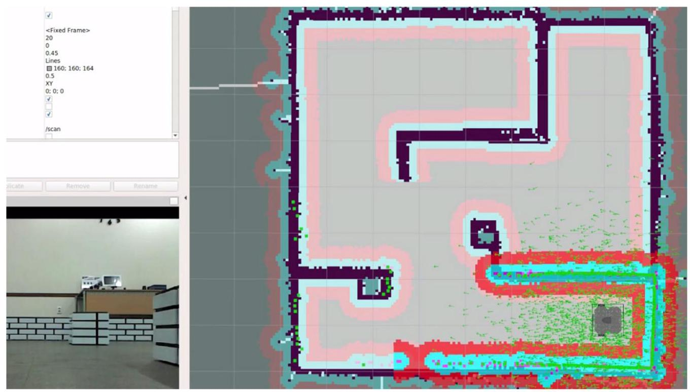

图 11-15 RViz中可以查看的粒子(机器人周围的绿色箭头)

**初始位置估计**

首先, 要做的是估计机器人的初始位置。当在RViz的菜单中按下[2D Pose Estimate] 时, 会出现一个非常大的绿色箭头。将其移动到机器人在给定的地图中所在的位置, 并按住鼠标键的同时，拖动绿色箭头使其指向机器人的前方。这是一种在初期为了估计机器人位置的命令。然后用turtlebot3_teleop_keyboard节点等来回移动机器人，搜集周围的环境信息，找出机器人当前位于地图上的位置。经过了这个过程后，机器人将绿色箭头指定的位置和方向作为初始位置，推定自己的位置和方向。

**设置目的地且移动机器人**

一切准备就绪后，下面下达移动命令。如果在RViz的菜单中按[2D Nav Goal]，会出现一个非常大的绿色箭头。该绿色箭头是指定机器人的目的地的标记，箭头的起点是机器人的x、y位置，箭头方向是机器人的i方向。将此箭头移动到机器人的目的地，然后拖动，以设置方向。机器人将根据创建的地图躲避障碍物，移动到目的地(见图11-16)。

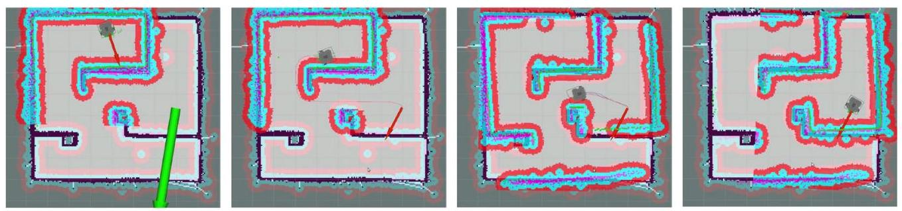

图 11-16 目的地设置(大箭头)和机器人的移动

以下部分将介绍上面运行过的功能包源代码的详细说明和设置方法。它将与SLAM的课程类似地，按实习篇和应用篇和理论篇来分步进行。

## 11.6. 导航应用程序

如果第11.5节只是按部就班的操作课，那么本节将探讨导航中使用的ROS功能包以及如何创建和配置它。我们将讲解turtlebot3元功能包、作为LDS驱动程序的turtlebot3_ lds节点、turtlebot3的三维模型信息(turtlebot3_description)、加载先前创建的地图的map_server节点、ACML(自适应蒙特卡罗定位)节点和和move_base节点。这是一个可以将导航实习篇应用于自己的机器人的应用篇。

在本节中，我们将以TurtleBot3机器人平台和LDS传感器为例进行说明，但是如果能活学活用, 则可以用自己的机器人实现导航, 而不限于特定的机器人平台和特定的传感器。如果读者想创建自己的机器人平台或想在TurtleBot3机器人平台上按自己的风格构建一个新的机器人，本教程将对读者有所帮助。

### 11.6.1. 导航

导航是在给定的环境中将机器人从当前位置移动到指定的目的地。为此, 需要有包含给定环境的家具、物体和墙壁的几何信息(geometry, geo-: 土地, metry: 测量)的地图, 正如前面的SLAM课程所述, 机器人可以从自己的姿态信息和从传感器获得的距离信息来获得地图。

在导航中, 机器人利用这个地图和机器人的编码器、惯性传感器和距离传感器等资源, 从当前位置移动到地图上的指定目的地。这个过程如下。

**传感 (sensing)**

在地图上, 机器人利用编码器和惯性传感器 (IMU传感器) 更新其测位 (odometry) 信息，并测量从距离传感器的位置到障碍物(墙壁、物体、家具等)的距离。

**姿态估计 (localization/pose estimation)**

基于来自编码器的车轮旋转量、来自惯性传感器的惯性信息以及从距离传感器到障碍物的距离信息，估计机器人在已经绘制的地图上的姿态(localization / pose estimation)。此时用到的姿态估计方法有很多种, 本节中将使用粒子滤波器定位 (particle filter localization), 以及蒙特卡罗定位 (Monte Carlo Localization) 的变体ACML(Adaptive Monte Carlo Localization，自适应蒙特卡罗定位)。

**运动规划**

也称为路径规划, 它创建一个从当前位置到地图上指定的目标点的轨迹。对整个地图进行全局路径规划, 以及以机器人为中心对部分地区进行局部路径规划。我们计划使用基于一种避障算法Dynamic Window Approach (DWA) 的ROS move_base和nav_core 等路径规划功能包。

**移动/躲避障碍物 (move / collision avoidance)**

如果按照在运动规划中创建的移动轨迹向机器人发出速度命令，则机器人会根据移动轨迹移动到目的地。由于感应、位置估计和运动规划在移动时仍在被执行，因此使用动态窗口方法(DWA)算法可避免突然出现的障碍物和移动物体。

### 11.6.2. 导航所需的信息

图11-17显示了运行ROS导航功能包所需的必要节点和话题之间的关系。我们将重点介绍导航所需的信息(话题)。作为参考，在描述图11-17中的话题时，分别显示了话题名称和话题消息类型。例如，在测位(odometry)中，“/odom”是话题名称，“nav_ msgs/Odometry”是话题消息的类型。

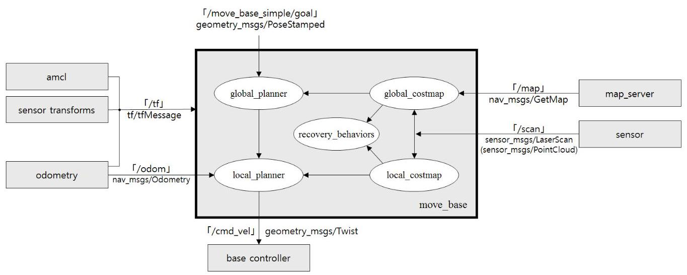

图 11-17 有关导航堆栈配置的各必要节点和话题的关系图

**测位('/odom', nav_msgs/Odometry)**

机器人的测位信息用于局部路径规划，利用接收到的机器人的当前速度等信息，产生局部移动路径或避开障碍物。

**坐标变换('/tf', tf/tfMessage)**

由于机器人传感器的位置根据机器人的硬件配置而变化, 所以ROS使用tf相对坐标变换。这只是简单地利用测位获得机器人的位置，例如测位描述“以机器人的位置为原点，传感器在x、y、z坐标坐标系中位于某某位置”。例如，经过odom→base_ footprint→base_link→base_scan的变换后以话题来发布。它从move_base节点接收这些信息，并根据机器人的位置和传感器的位置执行移动路径规划。

**距离传感器('/scan', sensor_msgs/LaserScan or sensor_msgs/PointCloud)**

意味着从传感器测量得到的距离值。通常使用LDS和RealSense、Kinect、Xtion 等。该距离传感器使用AMCL(adaptive Monte Carlo localization，自适应蒙特卡罗定位)来估计机器人的当前位置，且规划机器人的运动。

**地图(‘/map’, nav_msgs/GetMap)**

导航使用占用网格地图 (occupancy grid map) 。在本教程中，我们将使用map_ server功能包来发布我们之前编写的 “map.pgm”和 “map.yaml” 文件。

目标坐标 ('/move_base_simple/goal', geometry_msgs/PoseStamped)

目标坐标由用户直接指定。可以使用如平板电脑的设备创建和使用单独的目标坐标命令功能包, 但在本教程中, 将在ROS的可视化工具RViz中设置目标坐标。目标坐标由二维坐标 (x, y) 和姿态θ组成。

**速度命令('/cmd_vel', geometry_msgs/Twist)**

根据最终规划的移动轨迹发布移动机器人的速度命令，而机器人根据该命令移动到目的地。

### 11.6.3. turtlebot3_navigation的各节点和话题状态

如第11.5节所述, 如下所示, 在[turtlebot]中执行turtlebot3_robot.launch文件和 turtlebot3_navigation.launch文件，就具有了导航的必要条件。

\$ roslaunch turtlebot3_bringup turtlebot3_robot.launch

\$ export TURTLEBOT3_MODEL=waffle

\$ roslaunch turtlebot3_navigation turtlebot3_navigation.launch map_file:=\$HOME/map.yaml

在这种状态下，运行rqt_graph，则可以在ROS环境中查看正在运行的节点和话题信息，如图11-18所示。如图所示，上述导航所需的信息分别以/odom、/tf、/scan、/map 和/cmd_vel的话题名称发布和订阅，而move_base_simple/goal是在ROS的可视化工具 RViz中直接指定目标坐标时才会被发布。

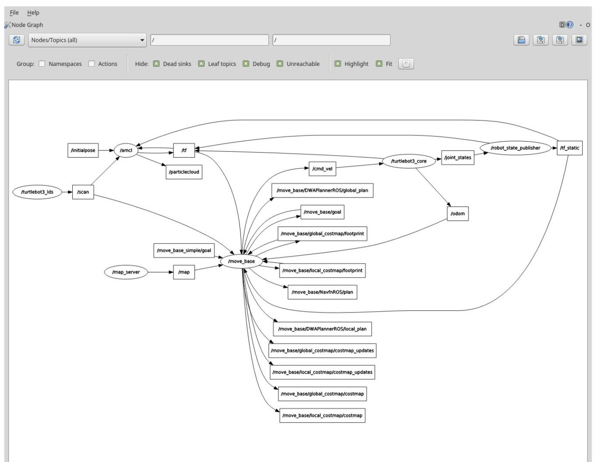

图 11-18 turtlebot3_navigation的各节点和话题的状态

### 11.6.4. turtlebot3_navigation设置

turtlebot3_navigation功能包需要多种文件:启动与导航节点有关的功能包的 launch文件、xml文件、设置各种参数的yaml文件、地图相关文件和rviz配置文件。下面介绍这些配置文件。

- /launch/turtlebot3_navigation.launch

turtlebot3_navigation.launch一个文件可以启动与导航相关的所有功能包。

**/launch/amcl.launch.xml**

amcl.launch.xml文件是一个包含自适应蒙特卡罗定位(AMCL)的各种参数设置的文件。它与turtlebot3_navigation.launch一起使用。

- /param/move_base_params.yaml

统筹管理运动规划的move_base的参数设置文件。

- /param/costmap_common_params_burger.yaml

= /param/costmap_common_params_waffle.yaml

- /param/global_costmap_params.yaml

**/param/local_costmap_params.yaml**

导航使用11.3.1中描述的占用网格地图(occupancy grid map)。基于该占用网格地图, 利用机器人姿态和从传感器获得的周围信息, 将每个像素计算为障碍物、不可移动区域和可移动区域。这时用到的概念是costmap。costmap的配置参数就是这些文件, 其中包括公用的costmap_common_params.yaml文件、全局区域运动规划所需的global_costmap_params.yaml文件以及本地区域所需的local_costmap_params. yaml文件。其中，costmap_common_params.yaml根据机器人的型号具有burger和 waffle等两种后缀，并且各模型的内容包含不同的外观信息。需要留意的是，TurtleBot3 Waffle Pi除了相机以外其他部分与TurtleBot3 Waffle相同，因此使用waffle后缀，沿用 waffle型号的设置。

**/param/dwa_local_planner_params.yaml**

dwa_local_planner是最后将移动速度命令传给机器人的功能包，上面文件则是设置该功能包的参数的文件。

**base_local_planner_params.yaml**

因为turtlebot3已将dwa_local_planner用作base_local_planner的设置值，因此在此不使用。这是因为已经在move_base节点中更改了参数设置, 如下所示:

---

<param name=" base_local_planner" value=" dwa_local_planner/DWAPlannerROS" />

---

- /maps/map.pgm

- /maps/map.yaml

将以前创建的占用网格地图 (occupancy grid map) 保存在/maps目录中。

**= /rviz/turtlebot3_nav.rviz**

它是一个包含ROS的可视化工具RViz的设置信息的文件。将加载RViz的显示插件中的Grid、RobotModel、TF、LaserScan、Map、Global Map、Local Map和AMCL Particles。

以下文件是turtlebot3_navigation.launch文件的详细内容, 其中包括机器人模型、 robot_state_publisher、map server、AMCL和move_base的执行和配置的内容。

/launch/turtlebot3_navigation.launch

---

							<launch>

																	<arg name="model" default="\$(env TURTLEBOT3_MODEL)" doc="model type [burger, waffle, waffle_pi]"/>

																	<include file="\$(find turtlebot3_bringup)/launch/turtlebot3_remote.launch" />

																			<arg name="map_file" default="\$(find turtlebot3_navigation)/maps/map.yaml"/>

																	<node name="map_server" pkg="map_server" type="map_server" args="\$(arg map_file)">

																		</node>

																	<include file="\$(find turtlebot3_navigation)/launch/amcl.launch.xml"/>

																	<arg name="cmd_vel_topic" default="/cmd_vel" />

																		<arg name="odom_topic" default="odom" />

																			<node pkg="move_base" type="move_base" respawn="false" name="move_base" output="screen">

																											<param name="base_local_planner" value="dwa_local_planner/DWAPlannerROS" />

																											<rosparamfile="\$(find turtlebot3_navigation)/param/costmap_common_params_\$(arg model).yaml"

						command="load" ns="global_costmap" />

																											<rosparam file="\$(find turtlebot3_navigation)/param/costmap_common_params_\$(arg model).yaml"

						command="load" ns="local_costmap" />

																													<rosparam file="\$(find turtlebot3_navigation)/param/local_costmap_params.yaml" command="load" />

																													<rosparam file="\$(find turtlebot3_navigation)/param/global_costmap_params.yaml" command="load" />

																													<rosparam file="\$(find turtlebot3_navigation)/param/move_base_params.yaml" command="load" />

																													<rosparam file="\$(find turtlebot3_navigation)/param/dwa_local_planner_params.yaml" command="load"

/>

---

---

																					<remap from="cmd_vel" to="\$(arg cmd_vel_topic)"/>

																						<remap from="odom" to="\$(arg odom_topic)"/>

										</node>

</launch>

---

**机器人模型和TF**

该部分从turtlebot3_description功能包中加载TurtleBot3的机器人3D模型，并通过robot_state_publisher将关节信息等机器人状态发布到相对坐标变换tf。更确切地说, 测位 (odometry) 的tf (例如odom) 是从turtlebot3_core发布的, 而其他坐标是以导入的机器人模型中描述的坐标变换值为基准进行相对坐标变换 (odom $\rightarrow$ base_ footprint $\rightarrow$ base_link $\rightarrow$ base_scan)后以tf形式发布的。由于这个过程,在RViz中可以看到机器人的三维模型, 通过tf可以得到从传感器获得的格栅值的测量位置。

<include file="\$(find turtlebot3_bringup)/launch/turtlebot3_remote.launch" />

turtlebot3_bringup/launch/turtlebot3_remote.launch

<launch>

<arg name="model" default="\$(env TURTLEBOT3_MODEL)" doc="model type [burger, waffle, waffle_pi]"/>

<include file="\$(find turtlebot3_bringup)/launch/includes/description.launch.xml"> <arg name="model" value="\$(arg model)" />

</include>

<node pkg="robot_state_publisher" type="robot_state_publisher" name="robot_state_publisher"

output="screen">

<param name="publish_frequency" type="double" value="50.0" />

</node>

</launch>

**地图服务器 (map server)**

保存在turtlebot3_navigation/maps/目录中的地图信息(map.yaml)和地图 (map.pgm) 被加载后通过map_server节点以话题的形式被发布。

---

<arg name="map_file" default="\$(find turtlebot3_navigation)/maps/map.yaml"/>

<node name="map_server" pkg="map_server" type="map_server" args="\$(arg map_file)">

	</node>

---

**AMCL (Adaptive Monte Carlo Localization)**

运行AMCL的amcl节点并设置相关参数。这将在11.6.5中有更详细地介绍。

<include file=" \$(find turtlebot3_navigation)/launch/amcl.launch.xml" />

**move_base**

设置几种变量:运动规划所需的costmap相关参数、将移动速度命令传递给机器人的 dwa_local_planner相关参数以及统筹运动规划的move_base的参数。更详细的讨论将在11.6.6中给出。

---

<arg name=" cmd_vel_topic" default="/cmd_vel" />

	<arg name="odom_topic" default="odom" />

<node pkg="move_base" type="move_base" respawn="false" name="move_base" output="screen">

								<param name="base_local_planner" value="dwa_local_planner/DWAPlannerROS" />

											<rosparam file="\$(find turtlebot3_navigation)/param/costmap_common_params_\$(arg model).yaml"

	command="load" ns="global_costmap" />

										<rosparamfile="\$(find turtlebot3_navigation)/param/costmap_common_params_\$(arg model).yaml"

		command="load" ns="local_costmap" />

											<rosparam file="\$(find turtlebot3_navigation)/param/local_costmap_params.yaml" command="load" />

											<rosparam file="\$(find turtlebot3_navigation)/param/global_costmap_params.yaml" command="load" />

												<rosparam file="\$(find turtlebot3_navigation)/param/move_base_params.yaml" command="load" />

												<rosparam file="\$(find turtlebot3_navigation)/param/dwa_local_planner_params.yaml" command="load"

/>

										<remap from="cmd_vel" to="\$(arg cmd_vel_topic)"/>

											<remap from="odom" to="\$(arg odom_topic)"/>

	</node>

---

### 11.6.5. 设置turtlebot3_navigation的详细参数

我们来设置前面讨论过的与turtlebot3navigation相关的详细参数。

**AMCL (Adaptive Monte Carlo Localization)**

amcl.launch.xml文件是一个包含AMCL参数设置的文件，它与上述的turtlebot3_ navigation.launch一起使用。对AMCL的描述将在导航理论篇中进行讨论。

---

	turtlebot3_navigation/launch/amc1.launch.xml

<luunch>

<arg name="use_map_topic" default="false"/>

<arg name="scan_topic" default="scan"/>

<arg name="initial_pose_x" default="0.0"/>

<arg name="initial_pose_y" default="0.0"/>

<arg name="initial_pose_a" default="0.0"/>

<node pkg="amcl" type="amcl" name="amcl">

<param name="min_particles" value="500"/>

<param name="max_particles" value="3000"/>

<param name="kld_err" value="0.02"/>

<param name="update_min_d" value="0.2"/>

<param name="update_min_a" value="0.2"/>

<param name="resample_interval" value="1"/>

---

<param name="transform_tolerance" value="0.5"/>

<param name="recovery_alpha_slow" value="0.0"/>

<param name="recovery_alpha_fast" value="0.0"/>

<param name="initial_pose_x" value="\$(arg initial_pose_x)"/>

<param name="initial_pose_y" value="\$(arg initial_pose_y)"/>

<param name="initial_pose_a" value="\$(arg initial_pose_a)"/>

<param name="gui_publish_rate" value="50.0"/>

<param name="use_map_topic" value="\$(arg use_map_topic)"/>

<remap from="scan" to="\$(arg scan_topic)"/>

<param name="laser_max_range" value="3.5"/>

<param name="laser_max_beams" value="180"/>

<param name="laser_z_hit" value="0.5"/>

<param name="laser_z_short" value="0.05"/>

<param name="laser_z_max" value="0.05"/>

<param name="laser_z_rand" value="0.5"/>

<param name="laser_sigma_hit" value="0.2"/>

<param name="laser_lambda_short" value="0.1"/>

<param name="laser_likelihood_max_dist" value="2.0"/>

<param name="laser_model_type" value="likelihood_field"/>

<param name="odom_model_type"value="diff"/>

<param name="odom_alpha1" value="0.1"/>

<param name="odom_alpha2" value="0.1"/>

<param name="odom_alpha3" value="0.1"/>

<param name="odom_alpha4" value="0.1"/>

<param name="odom_frame_id" value="odom"/>

<param name="base_frame_id" value="base_footprint"/>

</node>

</launch>

**move_base**

统筹运动规划的move_base的参数设置文件。

turtlebot3_navigation/param/move_base_params.yaml

#move_base处于非活动状态时，是否停止costmap节点的选项

shutdown_costmaps: false

#向机器人底座发送速度命令的控制周期(Hz)

controller_frequency: 3.0

#控制器在执行space-clearing操作之前等待接收控制信息的最长时间(以秒为单位)

controller_patience: 1.0

#全局规划的重复周期 (Hz)

planner_frequency: 2.0

#在space-clearing操作之前等待查询可用规划的时间上限(以秒为单位)

planner_patience: 1.0

#在执行还原操作 (recovery behavior) 之前, 允许机器人来回移动的时间 (以秒为单位)

oscillation_timeout: 10.0

#为使机器人不被认为是在来回移动而需要挪动的最小距离

#以meter为单位，若移动大于或等于下面的距离则oscillation_timeout会被初始化)。

oscillation_distance: 0.2

#在还原操作中costmap被初始化时，比该给定距离更远的障碍物将从地图中移除。

conservative_reset_dist: 0.1

**costmap**

导航使用占用网格地图。基于这种网格地图, 根据机器人的位置和从传感器获得的周围信息, 将各像素计算为障碍物、不可移动区域和可移动区域。这时用到的概念就是 costmap。costmap由三种文件组成:公共的costmap_common_params.yaml文件、 全局区域运动规划所需的global_costmap_params.yaml文件以及本地所需的local_ costmap_params.yaml文件。TurtleBot3根据型号分为costmap_common_params_ burger.yaml文件和costmap_common_params_waffle.yaml文件。

首先, 是对Turtlebot3 Burger的参数设定。

turtlebot3_navigation/param/costmap_common_params_burger.yaml

---

#当物体与机器人的距离在如下距离内时，将物体视为障碍物。

obstacle_range: 2.5

#传感器值大于如下距离的数据被视为自由空间(freespace)。

		raytrace_range: 3.5

	#将机器人的外部尺寸以多边形的形式来提供。

	footprint: [[-0.110, -0.090], [-0.110, 0.090], [0.041, 0.090], [0.041, -0.090]]

	#记录机器人的半径。这里我们使用上面的footprint设置而不是robot_radius。

	#robot_radius: 0.105

#膨胀区的半径，以防止接近障碍物。

		inflation_radius: 0.15

		#costmap计算中使用的缩放变量。计算公式如下。

#exp(-1.0 * cost_scaling_factor *(distance_from_obstacle - inscribed_radius)) *(254 - 1)

		cost_scaling_factor: 0.5

#从voxel(voxel-grid)和costmap(costmap_2d)中选择要使用的costmap。

	map_type: costmap

#tf之间相对坐标变换时间的允许的误差

	transform_tolerance: 0.2

#指定要使用的传感器

	observation_sources: scan

	#激光扫描的数据类型、话题类型、是否反映到costmap、是否设置障碍物高度

scan: \{data_type: LaserScan, topic: scan, marking: true, clearing: true\}

---

以下是TurtleBot3 Waffle的参数设置。与TurtleBot3 Burger不同的是, 模型的外形尺寸(footprint)和膨胀区域半径(inflation_radius，防止接近障碍物)对于每个模型都是不同的。此外的值都相同, 对于每个参数的描述, 请参阅Burger的说明。

turtlebot3_navigation/param/costmap_common_params_waffle.yaml

obstacle_range: 2.5

raytrace_range: 3.5

footprint: [[-0.205, -0.145], [-0.205, 0.145], [0.077, 0.145], [0.077, -0.145]]

inflation_radius: 0.20

cost_scaling_factor: 0.5

map_type: costmap

transform_tolerance: 0.2

observation_sources: scan

scan: \{data_type: LaserScan, topic: scan, marking: true, clearing: true\}

<table><tr><td colspan="2">turtlebot3_navigation/param/global_costmap_params.yaml</td></tr><tr><td>global_costmap:</td><td></td></tr><tr><td>global_frame: /map</td><td>#设置地图框架</td></tr><tr><td>robot_base_frame: /base_footprint</td><td>#设置机器人底座框架</td></tr><tr><td>update_frequency: 2.0</td><td>#更新周期</td></tr><tr><td>publish_frequency: 0.1</td><td>#发布周期</td></tr><tr><td>static_map: true</td><td>#是否使用给定地图的设置</td></tr><tr><td>transform_tolerance: 1.0</td><td>#允许的转换时间</td></tr></table>

turtlebot3_navigation/param/local_costmap_params.yaml

local_costmap:

global_frame: /odom #地图框架设置

robot_base_frame: /base_footprint #机器人底座框架设置

update_frequency: 2.0 #更新周期

publish_frequency: 0.5 #发布周期

static_map: false #是否使用给定地图的设置

rolling_window: true #局部地图窗口设置

width: 3.5 #局部地图窗口宽度

height: 3.5 #局部地图窗口高度

resolution: 0.05 #局部地图窗口分辨率(米/单元格)

transform_tolerance: 1.0 #允许的转换时间

**dwa_local_planner**

dwa_local_planner是一个最终将移动速度命令传给机器人的功能包，会设置其参数。

turtlebot3_navigation/param/dwa_local_planner_params.yaml

DWAPlannerROS:

#机器人参数设定

max_vel_x: 0.18 #x轴最大速度 (meter/sec)

min_vel_x:-0.18 #x轴最小速度 (meter/sec)

max_vel_y: 0.0 #仅适用于全向机器人，因此省略

min_vel_y: 0.0 #仅适用于全向机器人，因此省略

max_trans_vel: 0.18 #最大平移速度 (meter/sec)

min_trans_vel: 0.05 #最小平移速度 (meter/sec) ，当值为负数时也可以后退

#trans_stopped_vel: 0.01 #平移停止速度 (meter/sec)

max_rot_vel: 1.8 #最大旋转速度 (radian/sec)

min_rot_vel: 0.7 #最小旋转速度 (radian/sec)

#rot_stopped_vel: 0.01 #旋转停止速度 (radian/sec)

acc_lim_x: 2.0 #x轴加速度限制(meter/sec^2)

acc_lim_y: 0.0 #y轴加速度限制(meter/sec^2)

acc_lim_theta: 2.0 #theta轴角加速度限制(radian/sec^2)

#目标地点的允许误差

yaw_goal_tolerance: 0.15 #yaw轴离目标地点允许的误差(弧度)

xy_goal_tolerance: 0.05 #x, y离目标地点允许的距离误差(米)

#前向仿真(Forward Simulation)参数

sim_time:3.5 #前向仿真轨迹时间

vx_samples: 20 #在x轴速度空间中搜索的样本数

vy_samples: 0 $\#$ 在 $y$ 轴速度空间中搜索的样本数

vtheta_samples: 40 #在theta轴速度空间中搜索的样本数

#轨迹评分参数 (轨迹评估)

#用于轨迹评估的成本函数的分数计算如下。

#cost =

#path_distance_bias * (distance to path from the endpoint of the trajectory in meters)

#+ goal_distance_bias * (distance to local goal from the endpoint of the trajectory in meters)

#+ occdist_scale * (maximum obstacle cost along the trajectory in obstacle cost (0-254))

path_distance_bias: 32.0 #衡量控制器遵循给定路径的一致程度的加权值

---

goal_distance_bias: 24.0 	#判断是否接近目标地点和控制速度的加权值

occdist_scale: 0.04 	#有关避障的加权值

forward_point_distance: 0.325 	#机器人中心与附加得分点之间的距离 (meter)

stop_time_buffer: 0.2 	#机器人在碰撞之前为了停止所需的最小时间 (sec)

scaling_speed: 0.25 	#scaling speed (meter/sec)

max_scaling_factor: 0.2 	#maximum scaling factor

#防止震荡动作的参数

#震荡标志复位之前机器人所需移动的距离

oscillation_reset_dist: 0.05

#调试

publish_traj_pc: true # 移动轨迹调试设置

publish_cost_grid_pc: true 	#costmap调试设置

global_frame_id: odom 	#全局框架ID设置

---

**map**

将先前创建的占用网格地图 (occupancy grid map) 保存到/maps目录。没有其他配置参数。

---

/maps/map.pgm

/maps/map.yaml

---

**turtlebot3_nav.rviz**

它是一个包含ROS的可视化工具RViz的设置信息文件。它将加载RViz的显示插件中的Grid、Robot Model、TF、LaserScan、Map、Global Map、Local Map和Amcl Particles。建议使用以下文件，而不使用单独的配置文件。使用方法是，按如下命令运行rosrun时，可以指定为一个选项。

---

\$rosrunrvizrviz-d `rospack find turtlebot3_navigation`/rviz/turtlebot3_nav.rviz

---

至此，解释了使用导航功能包所需要的一切。在下一节中，我们将讨论costmap、 Adaptive Monte Carlo Localization(AMCL)和Dynamic Window Approach(DWA)的理论。

## 11.7. 导航理论篇

### 11.7.1. Costmap

机器人的位置是根据从编码器和惯性传感器(IMU传感器)获得的测位来估计的。然后, 通过安装在机器人上的距离传感器来计算机器人与障碍物之间的距离。导航系统将机器人位置、传感器姿态、障碍物信息和作为SLAM地图的结果而获得的占用网格地图调用到固定地图(static map)，用作占用区域(occupied area)、自由区域(free area) 和未知区域(unknown area)。

在导航中，基于上述四种因素，计算障碍物区域、预计会和障碍物碰撞的区域以及机器人可移动区域，这被称为成本地图(costmap)。根据导航类型，成本地图又被分成两部分。一个是global_costmap，在全局移动路径规划中以整个区域为对象建立移动计划，其输出结果就是global_costmap。而另一个被称为local_costmap，这是在局部移动路径规划中，在以机器人为中心的部分限定区域中规划移动路径时，或在躲避障碍物时用到的地图。然而, 这两种成本图的表示方法是相同的, 尽管它们的目的不同。

costmap用0到255之间的值来表示。数值的含义如图11-19所示，简单地说，根据该值可以知道机器人是位于可移动区域还是位于可能与障碍物碰撞的区域。每个区域的计算取决于第11.6节中指定的costmap配置参数。

- 000:机器人可以自由移动的free area(自由区域)

- 001~127:碰撞概率低的区域

- 128~252:碰撞概率高的区域

- 253~254:碰撞区域

- 255:机器人不能移动的占用区域(occupied area)

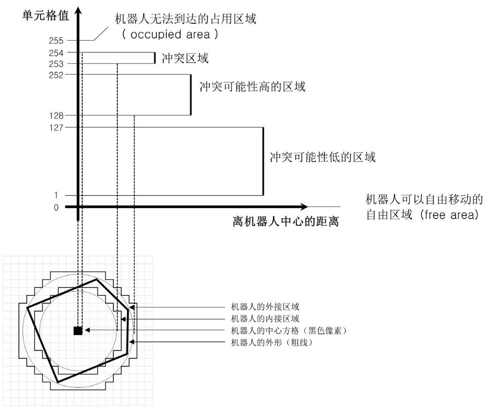

图 11-19 障碍距离与costmap值的关系

例如，实际的costmap如图11-20所示。具体的，机器人模型位于中间，其周围的黑色边框对应于机器人的外表面。当这个轮廓线碰到实际的墙壁时，意味着机器人会发生碰撞。绿色用从激光传感器获得的距离传感器值表示的障碍物, 灰度的颜色越深的位置意味着碰撞的可能性越高。这同样适用于用颜色表示的情况，粉红色区域是实际的障碍物，蓝色区域是机器人中心位置进入该区域则会发生碰撞的位置，且边框用粗红色像素绘制。这些颜色可以由用户在RViz中修改，因此可以说没有太大的意义。

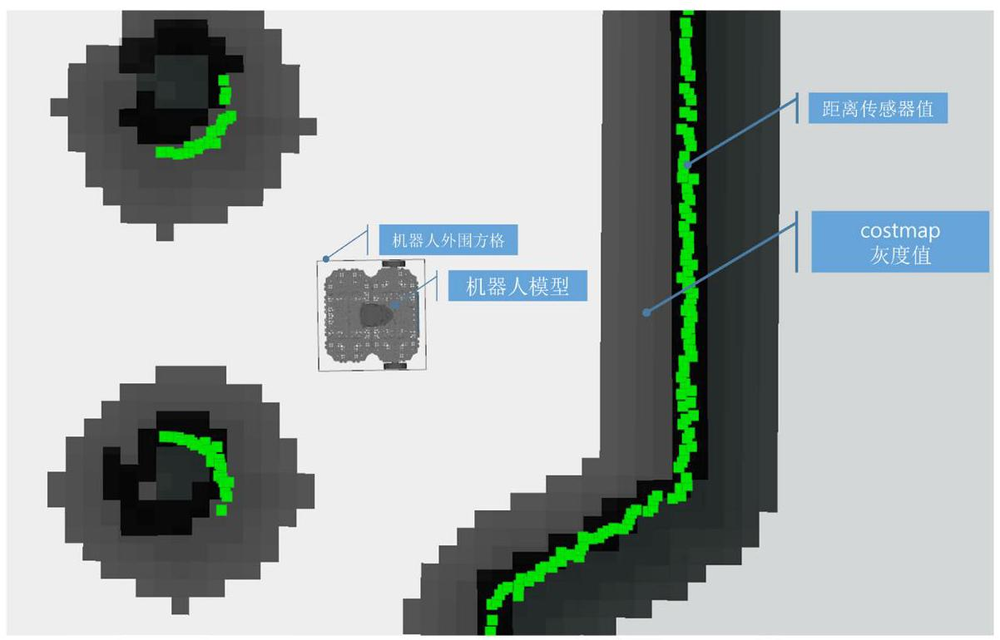

图 11-20 costmap的表示方式 (灰度)

### 11.7.2. AMCL

正如在11.4节的SLAM理论篇的粒子滤波 (particle filter) 的说明, 蒙特卡罗定位 (MCL) 位置估计算法在位置估计领域中被广泛运用。AMCL(自适应蒙特卡罗定位) 可以被看作蒙特卡罗位置估计的改进版本，它通过在蒙特卡罗位置估计算法中使用少量样本来减少执行时间，以此提高实时性能。那么，我们先来看看基本的蒙特卡罗位置估计 (MCL)。

蒙特卡罗位置估计 (MCL) 的最终目的是确定机器人在特定环境中的位置。也就是说, 我们必须在地图中得到x、y和θ。为此, MCL计算机器人所在位置的概率。首先, 机器人在t时刻的位置和方向 (x, y, θ) 是 ${x}_{t}$ , 距离传感器到t时刻为止获得的距离信息记为 ${z}_{0\ldots t} = \left\{  {{z}_{0},{z}_{1},\ldots ,{z}_{t}}\right\}$ ,编码器到 $\mathrm{t}$ 时刻为止获得的机器人的运动信息记为 ${u}_{0\ldots t} = \left\{  {{u}_{0},{u}_{1},\ldots }\right.$ , $\left. {u}_{t}\right\}$ ，则可以如下计算belief(使用贝叶斯更新公式的后验概率)。

$$
\operatorname{bel}\left( {x}_{t}\right)  = p\left( {{x}_{t} \mid  {z}_{0\ldots t},{u}_{0..t}}\right)
$$

(式 11-11)

由于机器人可能存在硬件误差, 因此建立传感器模型和移动模型, 并且如下执行贝叶斯滤波器 (bayes filter) 的预测 (prediction) 和更新 (update) 。首先, 在预测阶段中，利用机器人的移动模型 $p\left( {{x}_{t} \mid  {x}_{t - 1},{u}_{t - 1}}\right)$ 、前一个位置上的概率 ${bel}\left( {x}_{t - 1}\right)$ ，和从编码器获得的移动信息u,计算下一个时刻的机器人位置bel' ${\left( {x}_{t}\right) }_{ \circ  }$

$$
{be}{l}^{\prime }\left( {x}_{t}\right)  = \int p\left( {{x}_{t} \mid  {x}_{t - 1},{u}_{t - 1}}\right) \operatorname{bel}\left( {x}_{t - 1}\right) d{x}_{t - 1}
$$

下面是校正步骤,这次我们利用传感器模型 $p\left( {{z}_{t} \mid  {x}_{t}}\right)$ 、前面求得的概率 ${be}{l}^{\prime }\left( {x}_{t}\right)$ 和归一化常数 ${\eta }_{t}$ ,可以求得基于传感器信息提高准确度的当前位置的概率 ${bel}\left( {x}_{t}\right)$ 。

$$
\operatorname{bel}\left( {x}_{t}\right)  = {\eta }_{t}p\left( {{z}_{t} \mid  {x}_{t}}\right) {\operatorname{bel}}^{\prime }\left( {x}_{t}\right)
$$

(式 11-13)

以下步骤通过上面得出的当前位置的概率 ${bel}\left( {x}_{t}\right)$ ,用粒子滤波器生成 $\mathrm{N}$ 个粒子来估计位置。具体请参考11.4节SLAM理论篇的粒子滤波器(particle filter)的说明。 在MCL中，使用“样品”这个术语来代替“粒子”。总的来说会经过SIR(Sampling Importance weighting Re-sampling) 过程。首先, 是抽样 (sampling) 过程。这里,使用前一个位置的概率 ${bel}\left( {x}_{t - 1}\right)$ 中的机器人的移动模型 $p\left( {{x}_{t} \mid  {x}_{t - 1},{u}_{t - 1}}\right)$ 来提取新的样本集合 ${x}_{t}^{\prime }$ 。利用该样品集合 ${x}_{t}^{\prime }$ 中的第 $\mathrm{i}$ 个样品 ${x}_{t}^{\prime \left( i\right) }$ 、由距离传感器获得的距离信息 ${z}_{t}$ 和归一化常数 ${\eta p}$ 来计算权重值 ${\omega }_{t}^{\left( i\right) }$ 。

$$
{\omega }_{t}^{\left( i\right) } = {\eta p}\left( {{z}_{t} \mid  {x}_{t}^{\prime \left( i\right) }}\right)
$$

(式 11-14)

最后,在重采样过程中,我们使用样本 ${x}_{t}^{\prime }$ 和权重 ${\omega }_{t}^{\left( i\right) }$ 来创建N个新的样品(粒子)集合 ${X}_{t \circ  }$

$$
{X}_{t} = \left\{  {{x}_{t}^{\left( j\right) } \mid  j = 1\ldots N}\right\}   \sim  \left\{  {{x}_{t}^{\prime \left( i\right) },{\omega }_{t}^{\left( i\right) }}\right\}
$$

(式 11-15)

以这种方式, 在重复SIR过程的同时移动粒子, 且提高机器人位置估计的准确度。例如, 如图11-21所示, 我们可以看到随着时间随t1、t2、t3、t4变化的过程中位置估计在逐渐收敛。所有这些过程都参考了在机器人工程中被称为概率领域的教科书的Sebastian Thrun教授的著作 “Probabilistic Robotics” 一书。如有时间建议读者务必参阅。

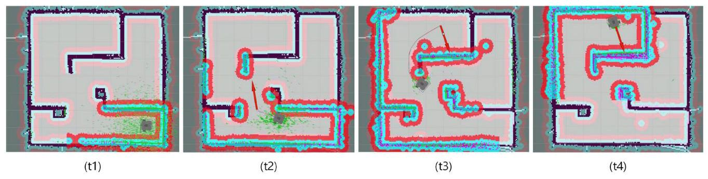

图 11-21 用于机器人位置估计的AMCL过程

### 11.7.3. Dynamic Window Approach(DWA)

动态窗口方法 (Dynamic Windows Approach, DWA) 是在规划移动路径和躲避障碍物时常用的方法, 具体是指在机器人的速度搜索空间 (velocity search space) 中选择适当的速度, 以躲避可能碰撞的障碍物的同时能迅速到达目的地。在ROS中, 局部移动规划中曾广泛使用Trajectory planner，而最近由于DWA的性能优越，因此DWA在逐渐代替Trajectory planner。

首先,如图11-22所示,用平移速度 $v$ 和旋转速度 $\omega$ 为轴的速度搜索空间 (velocity search space) 来表示机器人，而不是用x轴和y轴的位置坐标系表示。在这个空间中， 由于硬件限制，机器人具有最大允许速度，这被称为动态窗口(Dynamic Window)。

---

$v$ : 平移速度 (meter/sec)

$\omega$ : 旋转速度 (radian/sec)

			${V}_{s}$ : 最大速度区域

			${V}_{a}$ : 允许的速度区域

				${V}_{c}$ : 当前速度

		${V}_{r}$ : 动态窗口中的速度区域

${a}_{\max }$ : 最大加/减速度

$G\left( {v,\omega }\right)  = \sigma \left( {\alpha  \cdot  \operatorname{heading}\left( {v,\omega }\right)  + \beta  \cdot  \operatorname{dist}\left( {v,\omega }\right)  + \gamma  \cdot  \operatorname{velocity}\left( {v,\omega }\right) }\right)$ : 目标函数

heading $\left( {v,\omega }\right)  : {180}$ - (机器人的方向与目标点的方向之差)

$\operatorname{dist}\left( {v,\omega }\right)$ : 离障碍物的距离

velocity $\left( {v,\omega }\right)$ : 选择的速度

$\alpha ,\beta ,\gamma$ : 权重常数

$\sigma \left( \mathrm{x}\right)$ : Smooth Function

---

在这个动态窗口中, 通过使用目标函数, 获得满足条件的平移速度和旋转速度。满足条件意味着使考虑了机器人的方向、速度和碰撞的目标函数达到最大化。如果绘制出来, 则如图11-23所示，我们可以在各种和 中找到最优速度并移动机器人。

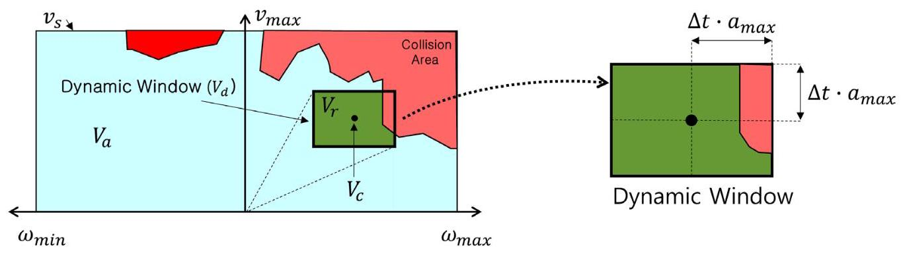

图 11-22 机器人的速度搜索空间 (velocity search space) 和动态窗口 (Dynamic Window)

至此, 结束了对SLAM和导航的实习、应用和理论的讲解。虽然这主要是用移动机器人平台Turtlebot3来说明的，但也适用于其他机器人，所以如果读者正在使用另一个机器人或开发了自己的机器人，那么也可以应用它。

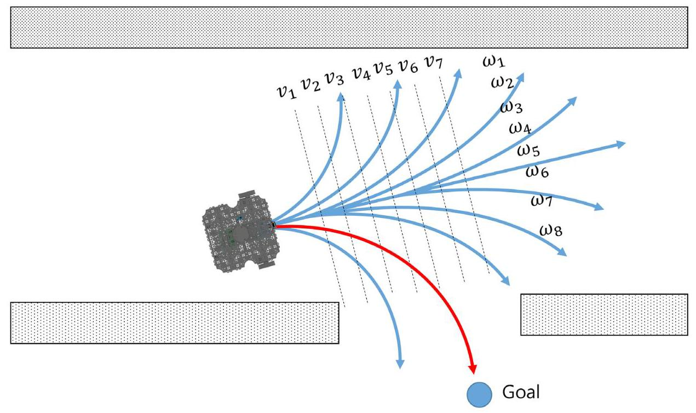

图 11-23 平移速度和转速
