# 第12章 服务机器人

## 12.1. 配送服务机器人

目前，SLAM和导航技术应用于多种情况。在机器人领域，有用于车辆、工厂和生产线的机器人，还有用于配送服务的机器人，并且其技术也在迅速发展。在第10章和第11 章中，我们了解了SLAM和导航功能包的组成和配置。在第12章中，我们来制作一个简单实用的配送服务机器人。

## 12.2. 配送服务机器人的结构

### 12.2.1. 系统结构

如图12-1所示，配送服务机器人的服务系统设计可以分为 “服务核心”、 “服务主机”和“服务从机”等区块。

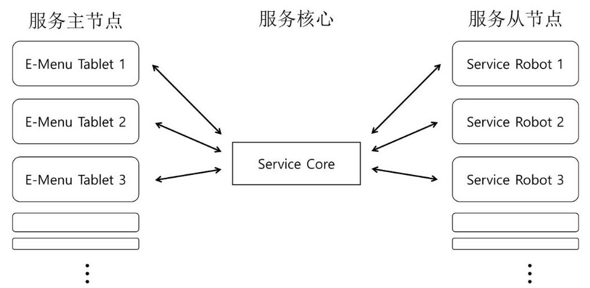

图 12-1 配送服务机器人系统设计实例

**服务核心**

服务核心是综合管理客户订单状态和机器人服务执行状态的数据库的一种。在接到客户的订单后, 它在处理订单和调度机器人的服务处理方面起着关键作用。由于一个客户的订单和处理该订单的机器人的状态影响另一个客户的订单，所以服务核心必须作为一个单独的个体来存在。设计时，可以小到用键盘输入接单的形式，也可以大到用如平板PC的设备接单的形式。

**服务主机**

服务主机直接接收客户的订单并将订单内容转达给服务核心。另外，也可以列出客户可以订购的物品列表，并将机器人的服务执行状态发送给客户。为此，服务主机必须与由服务核心管理的数据库同步。

**服务从机**

服务从机是实际配送客户订购的产品的对象或机器人平台，在服务执行期间实时地将服务状态更新到服务核心。

### 12.2.2. 系统设计

服务主机、服务从机和服务核心等区块可以设计为都在单台计算机上运行或各个区块分别分配给各自的计算机来运行。但是, 如果在一台计算机上运行所有工作, 则该计算机的处理能力可能无法承担所有任务，而如果给每一种区块分配单独的计算机，则无线网络有可能无法承受要传输的数据量，因此要根据实情适当分配。而且，由于ROS 1.x基本上是一个旨在控制一台机器人的系统, 所以如果要在多台PC上使用ROS, 则应使用以下命令尽可能地同步每台计算机的时间。

\$ sudo ntpdate ntp.ubuntu.com

例如，如图12-2所示，笔者使用以下设备实现了配送服务机器人系统。

- 服务核心:NUC i5(3台，包括roscore和服务核心的PC)

- 服务主机:SAMSUNG NOTE 10.4 Android OS 3台

Bin务从机:TurtleBot3 Carrier (用TurtleBot3 Waffle定制的配送机器人) 的三台英特尔Joule 570

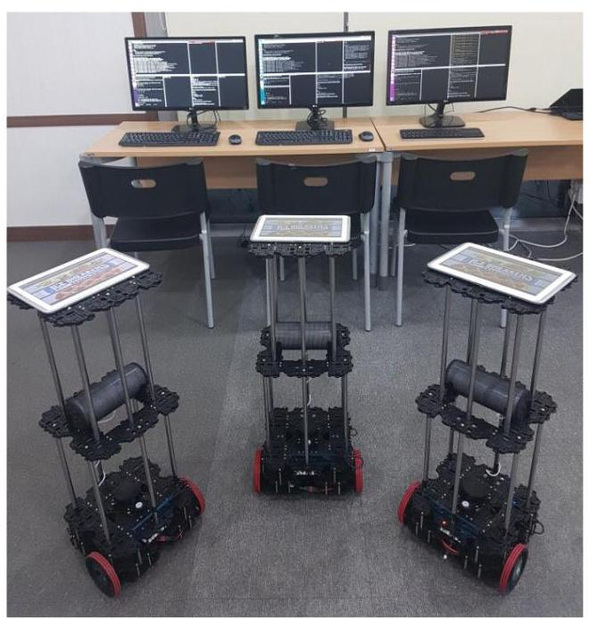

图 12-2 配送服务机器人和运营系统的实际照片

总体构想完成后，需要决定在每个区块的节点之间应该交换什么消息，如图12-3所示。

图 12-3 配送服务机器人系统中的每个区块发送和接收消息的示例

尽管可以用一个平板控制多个机器人，但是为了简化系统结构，说明时，按照给每个机器人配备一个平板的结构来进行说明。当客户下订单时，用于下单的平板将他们的平板 ID和关于所选项目的信息发送到服务核心。服务核心基于平板ID来确定应该移动哪个服务机器人来执行服务，并向服务机器人发送与订购的项目相对应的目的地，以便服务机器人可以执行服务。

服务机器人根据自己的路径规划 (Path planning) 算法到达目的地。此时, 服务机器人会把各种情况传送给服务核心，例如包括与障碍物的碰撞、未找到路径、到达目的地等可能面临的状况，以及是否成功获取订购的物品等。服务核心综合处理实时接收到的机器人的服务状态、与订购物品相关的重复订单以及在机器人工作期间接收到的订单等情况, 并通过平板向客户提供反馈。在这个过程中发送和接收的所有信息将使用由开发者根据各个目的新配置的msg文件或srv文件。

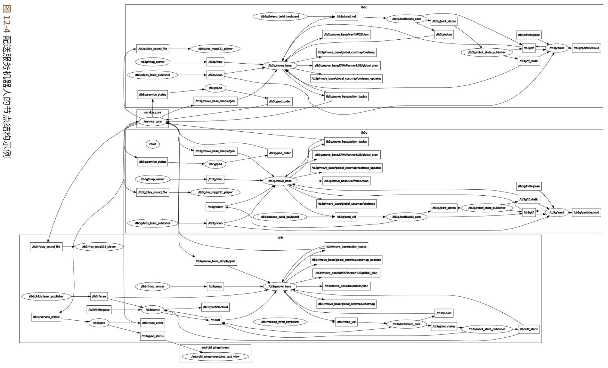

在我们解释每个节点之前，先来了解整个大局。图12-4用关系图显示了在第12章中将创建的配送服务机器人的所有节点和话题的相关性。该图由三个组 (group) 和service_ core组成。每个组中，与订单平板和服务机器人相关的所有节点都在名为 “tb3p”、 “tb3g”和“tb3r”的namespace中配对存在。由于service_core需要管理三个组，因此不属于任何组, 它独立于三个组而存在。如果要配置成平板和机器人不配对的方式, 也就是说如要采用一个平板控制多台机器人的系统的话, 要为平板和每台服务机器人都创建单独的namespace下的组。

在开发服务机器人系统时使用组namespace ${}^{1}$ 的原因是,当多个机器人或计算机要同时使用一种ROS功能包时, 要注册到 ROS主节点的名称 (如节点或话题等) 会重复，因此会无法运行。

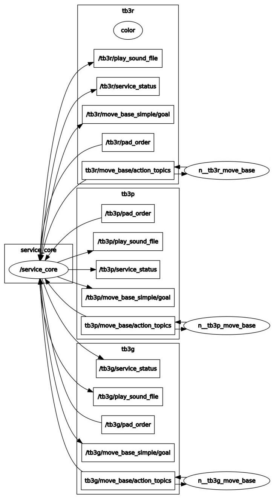

图 12-5 service_core节点发送和接收的话题列表

图12-5显示了一个节点图, 该节点图着重表达分组到三个namespace的话题当中由service_core直接发送和接收的那些话题。service_core通过名为 /pad_order的话题接收订单，并通过 /move_base/action_topics话题接收机器人的路径查找情况和到达目的地与否。它还通过/service_status话题提供服务状态，通过/play_sound_file传递已录音的语音文件的位置，并通过/ move_base_simple/goal来传达机器人的目的地的坐标。

---

1 http://wiki.ros.org/roslaunch/XML/group

---

图12-6是用于准备配送服务的流程图。导航使用SLAM制作的地图。在服务中, 有必要考虑将哪个位置用作服务区, 然后确认和记录该区域在生成的地图上的坐标。该坐标值将在下面要说明的service_core中通过获得和设置ROS参数来使用。在下面的示例中，需要“客户下单的位置”和“从机器人获取物品的位置”在地图上的坐标值。有关SLAM和导航的更多信息，请参阅第10章和第11章。

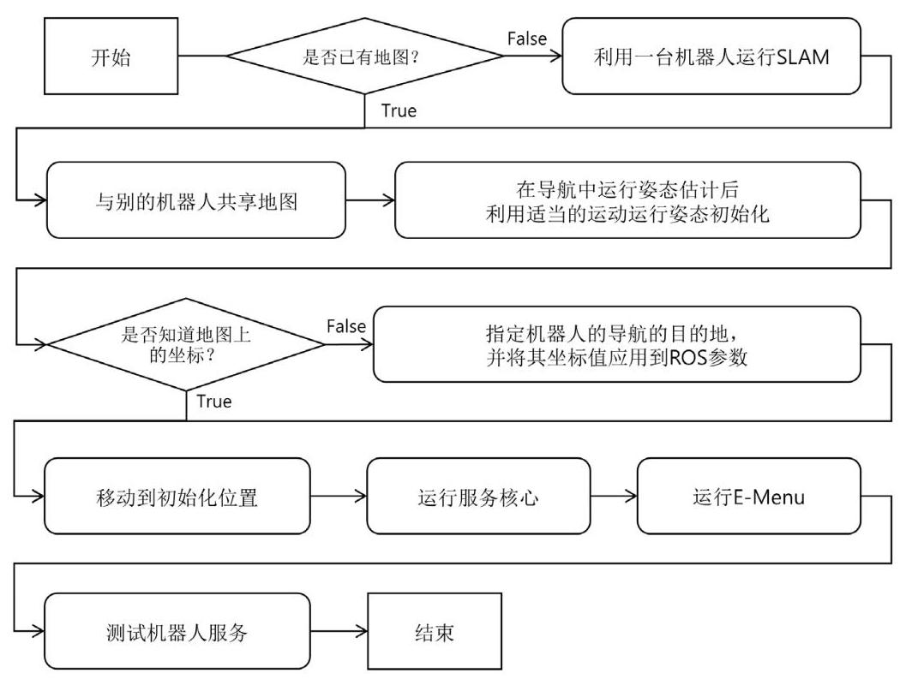

图 12-6 准备配送服务的流程图

以下链接以开源形式提供了本章描述的配送服务机器人制作所需的源代码。下面, 将描述与各个区域对应的节点的配置和源代码。

- https://github.com/ROBOTIS-GIT/turtlebot3_deliver

### 12.2.3. 服务核心节点

图12-7表示服务核心节点的基本结构。该节点以main()函数开始，首先通过 fnInitParam()设置ROS参数。之后，接收有关客户订单的数据的bReceivePadOrder() 函数和接收机器人的目的地到达与否信息的cbCheckArrivalStatus()函数, 会被声明为在话题订阅时被运行。并且通过fnPubServiceStatus()和fnPubPose()函数发布服务状态和机器人目的地的坐标值。这个过程在无限循环中执行，直到按下[Ctrl + c]键。

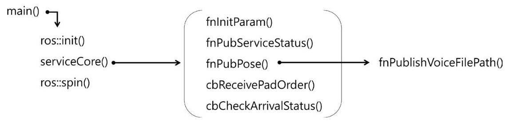

图 12-7 服务核心的基本结构

当运行serviceCore()函数时，会调用fnInitParam()函数，并定义用于收发各种数据的发布者和订阅者。service_core节点需要处理来自3个机器人和3个平板的话题，所以定义了3种发布者和3种订阅者。各个发布者和订阅者的工作任务如下。

<table><tr><td>项目</td><td>说明</td></tr><tr><td>pubServiceStatusPad</td><td>向平板发布配送服务状态的发布者</td></tr><tr><td>pubPlaySound</td><td>发布录音语音文件位置的发布者</td></tr><tr><td>subPadOrder</td><td>从平板订阅客户订单的订阅者</td></tr><tr><td>subArrivalStatus</td><td>订阅机器人到达与否的订阅者</td></tr></table>

表 12-1 service_core.cpp中的ServiceCore()函数

/turtlebot3_carrier/src/service_core.cpp (只提取一部分)

ServiceCore()

\{

fnInitParam();

pubServiceStatusPadTb3p = nh_.advertise<turtlebot3_carrier::ServiceStatus>("/tb3p/service_status", 1);

pubServiceStatusPadTb3g = nh_.advertise<turtlebot3_carrier::ServiceStatus>("/tb3g/service_status", 1);

pubServiceStatusPadTb3r = nh_.advertise<turtlebot3_carrier::ServiceStatus>("/tb3r/service_status", 1);

pubPlaySoundTb3p = nh_.advertise<std_msgs::String>("/tb3p/play_sound_file", 1);

pubPlaySoundTb3g = nh_.advertise<std_msgs::String>("/tb3g/play_sound_file", 1);

pubPlaySoundTb3r = nh_.advertise<std_msgs::String>("/tb3r/play_sound_file", 1);

pubPoseStampedTb3p = nh_.advertise<geometry_msgs::PoseStamped>("/tb3p/move_base_simple/goal", 1);

pubPoseStampedTb3g = nh_.advertise<geometry_msgs::PoseStamped>("/tb3g/move_base_simple/goal", 1);

pubPoseStampedTb3r = nh_.advertise<geometry_msgs::PoseStamped>("/tb3r/move_base_simple/goal", 1);

subPadOrderTb3p = nh_.subscribe("/tb3p/pad_order", 1, &ServiceCore::cbReceivePadOrder, this);

---

					subPadOrderTb3g = nh_.subscribe("/tb3g/pad_order", 1, &ServiceCore::cbReceivePadOrder, this);

					subPadOrderTb3r = nh_.subscribe("/tb3r/pad_order", 1, &ServiceCore::cbReceivePadOrder, this);

				subArrivalStatusTb3p = nh_.subscribe("/tb3p/move_base/result", 1,

&ServiceCore::cbCheckArrivalStatusTB3P, this);

			subArrivalStatusTb3g = nh_.subscribe("/tb3g/move_base/result", 1,

&ServiceCore::cbCheckArrivalStatusTB36, this);

			subArrivalStatusTb3r = nh_.subscribe("/tb3r/move_base/result", 1,

&ServiceCore::cbCheckArrivalStatusTB3R, this);

					ros::Rate loop_rate(5);

					while (ros::ok())

					\{

																		fnPubServiceStatus();

																	fnPubPose();

																		ros::spin0nce();

																		loop_rate.sleep();

\}

\}

---

fnInitParam()函数从给定参数文件获取机器人在地图上的目标姿态(位置+方向)数据，如下所示。在这个例子中，机器人从互不相同的三个下单区域出发并移动到订购的物品所在的位置。可以下单的物品设为三种, 因此总共需要知道地图上的6个位置的坐标。 fnInitParam()函数的结构如下。

<table><tr><td>项目</td><td>说明</td></tr><tr><td>poseStampedTable</td><td>客户下订单的位置的坐标</td></tr><tr><td>poseStampedCounter</td><td>载货区域的坐标</td></tr></table>

表 12-2 service_core.cpp中的fnInitParam()函数

/turtlebot3_carrier/src/service_core.cpp (   )

void fnInitParam()

\{

nh_.getParam("table_pose_tb3p/position", target_pose_position);

nh_.getParam("table_pose_tb3p/orientation", target_pose_orientation);

poseStampedTable[0].header.frame_id = "map";

poseStampedTable[0].header.stamp = ros::Time::now();

poseStampedTable[0].pose.position.x = target_pose_position[0];

poseStampedTable[0].pose.position.y = target_pose_position[1];

poseStampedTable[0].pose.position.z = target_pose_position[2];

poseStampedTable[0].pose.orientation.x = target_pose_orientation[0];

poseStampedTable[0].pose.orientation.y = target_pose_orientation[1];

poseStampedTable[0].pose.orientation.z = target_pose_orientation[2];

poseStampedTable[0].pose.orientation.w = target_pose_orientation[3];

nh_.getParam("table_pose_tb3g/position", target_pose_position);

nh_.getParam("table_pose_tb3g/orientation", target_pose_orientation);

poseStampedTable[1].header.frame_id = "map";

poseStampedTable[1].header.stamp = ros::Time::now();

poseStampedTable[1].pose.position.x = target_pose_position[0];

poseStampedTable[1].pose.position.y = target_pose_position[1];

poseStampedTable[1].pose.position.z = target_pose_position[2];

poseStampedTable[1].pose.orientation.x = target_pose_orientation[0];

poseStampedTable[1].pose.orientation.y = target_pose_orientation[1];

poseStampedTable[1].pose.orientation.z = target_pose_orientation[2];

poseStampedTable[1].pose.orientation.w = target_pose_orientation[3];

nh_.getParam("table_pose_tb3r/position", target_pose_position);

nh_.getParam("table_pose_tb3r/orientation", target_pose_orientation);

poseStampedTable[2].header.frame_id = "map";

poseStampedTable[2].header.stamp = ros::Time::now();

poseStampedTable[2].pose.position.x = target_pose_position[0];

poseStampedTable[2].pose.position.y = target_pose_position[1];

poseStampedTable[2].pose.position.z = target_pose_position[2];

poseStampedTable[2].pose.orientation.x = target_pose_orientation[0];

poseStampedTable[2].pose.orientation.y = target_pose_orientation[1];

poseStampedTable[2].pose.orientation.z = target_pose_orientation[2];

poseStampedTable[2].pose.orientation.w = target_pose_orientation[3];

nh_.getParam("counter_pose_bread/position", target_pose_position);

nh_.getParam("counter_pose_bread/orientation", target_pose_orientation);

poseStampedCounter[0].header.frame_id = "map";

poseStampedCounter[0].header.stamp = ros::Time::now();

poseStampedCounter[0].pose.position.x = target_pose_position[0];

poseStampedCounter[0].pose.position.y = target_pose_position[1];

poseStampedCounter[0].pose.position.z = target_pose_position[2];

poseStampedCounter[0].pose.orientation.x = target_pose_orientation[0];

poseStampedCounter[0].pose.orientation.y = target_pose_orientation[1];

poseStampedCounter[0].pose.orientation.z = target_pose_orientation[2];

poseStampedCounter[0].pose.orientation.w = target_pose_orientation[3];

nh_.getParam("counter_pose_drink/position", target_pose_position);

nh_.getParam("counter_pose_drink/orientation", target_pose_orientation);

poseStampedCounter[1].header.frame_id = "map";

poseStampedCounter[1].header.stamp = ros::Time::now();

poseStampedCounter[1].pose.position.x = target_pose_position[0];

poseStampedCounter[1].pose.position.y = target_pose_position[1];

poseStampedCounter[1].pose.position.z = target_pose_position[2];

poseStampedCounter[1].pose.orientation.x = target_pose_orientation[0];

poseStampedCounter[1].pose.orientation.y = target_pose_orientation[1];

poseStampedCounter[1].pose.orientation.z = target_pose_orientation[2];

poseStampedCounter[1].pose.orientation.w = target_pose_orientation[3];

nh_.getParam("counter_pose_snack/position", target_pose_position);

nh_.getParam("counter_pose_snack/orientation", target_pose_orientation);

poseStampedCounter[2].header.frame_id = "map";

poseStampedCounter[2].header.stamp = ros::Time::now();

poseStampedCounter[2].pose.position.x = target_pose_position[0];

poseStampedCounter[2].pose.position.y = target_pose_position[1];

poseStampedCounter[2].pose.position.z = target_pose_position[2];

poseStampedCounter[2].pose.orientation.x = target_pose_orientation[0];

poseStampedCounter[2].pose.orientation.y = target_pose_orientation[1];

poseStampedCounter[2].pose.orientation.z = target_pose_orientation[2];

poseStampedCounter[2].pose.orientation.w = target_pose_orientation[3];

\}

在target_pose.yaml文件中显示的参数值是机器人为了执行其服务所需的地图上的坐标值。在地图上获取坐标值的方法有很多种, 其中有一种简单的方法是在导航过程中通过 "rostopic echo" 命令获取姿态(pose)值。但是，由于每次通过SLAM执行地图绘制时该坐标值都发生变化, 因此建议在实际导航期间尽可能避免重新绘制地图, 并且减少物体和障碍物的位置变化以便使用同一个地图。

/turtlebot3_carrier/param/target_pose.yaml

table_pose_tb3p:

position: [-0.338746577501, -0.85418510437, 0.0]

orientation: [0.0, 0.0, -0.0663151963596, 0.997798724559]

table_pose_tb3g:

position: [-0.168751597404, -0.19147400558, 0.0]

orientation: [0.0, 0.0, -0.0466624033917, 0.998910716786]

table_pose_tb3r:

position: [-0.251043587923, 0.421476781368, 0.0]

orientation: [0.0, 0.0, -0.0600887022438, 0.998193041382]

counter_pose_bread:

position: [-3.60783815384, -0.750428497791, 0.0]

orientation: [0.0, 0.0, 0.999335763287, -0.0364421763375]

counter_pose_drink:

position: [-3.48697376251, -0.173366710544, 0.0]

orientation: [0.0, 0.0, 0.998398746904, -0.0565680314445]

counter_pose_snack:

position: [-3.62247490883, 0.39046728611, 0.0]

orientation: [0.0, 0.0, 0.998908838216, -0.0467026009308]

接下来的fnPubPose()函数的功能是, 根据机器人当前所处的服务状态, 在机器人到达目的地时设定下一个目的地。当机器人完成服务时，所有的参数都会被初始化。

<table><tr><td>项目</td><td>说明</td></tr><tr><td>is_robot_reached_target</td><td>机器人是否已经到达导航目的地</td></tr><tr><td>is_item_available</td><td>项目是否可以订购</td></tr><tr><td>item_num_chosen_by_pad</td><td>订购的物品的编号</td></tr><tr><td>robot_service_sequence</td><td>机器人的服务状态   0- 等待客户的订单   1- 刚收到客户的订单   2- 正在去取客户订购的物品   3- 正在装载订购的物品   4- 正在移动到客户的位置   5- 正将物品递给客户</td></tr><tr><td>fnPublishVoiceFilePath()</td><td>发布已经录制的语音文件的位置的函数</td></tr><tr><td>ROBOT_NUMBER</td><td>机器人的编号(开发者指定)</td></tr></table>

表 12-3 service_core.cpp中的fnPubPose()函数

/turtlebot3_carrier/src/service_core.cpp ( 只提取一部分 )

void fnPubPose()

\{

if (is_robot_reached_target[ROBOT_NUMBER])

\{

if (robot_service_sequence[ROBOT_NUMBER] == 1)

\{

fnPublishVoiceFilePath(ROBOT_NUMBER,"~/voice/voice1-2.mp3");

robot_service_sequence[ROBOT_NUMBER] = 2;

\}

---

																									else if (robot_service_sequence[ROBOT_NUMBER] == 2)

																								\{

																																				pubPoseStampedTb3p.publish(poseStampedCounter[item_num_chosen_by_pad[ROBOT_NUMBER]]);

																																					is_robot_reached_target[ROBOT_NUMBER] = false;

																																					robot_service_sequence[ROBOT_NUMBER] = 3;

																				\}

																										else if (robot_service_sequence[ROBOT_NUMBER] == 3)

																								\{

																																				fnPublishVoiceFilePath(ROBOT_NUMBER, " / voice/voice1-3.mp3");

																																					robot_service_sequence[ROBOT_NUMBER] = 4;

																				\}

																										else if (robot_service_sequence[ROBOT_NUMBER] == 4)

																							\{

																																			pubPoseStampedTb3p.publish(poseStampedTable[ROBOT_NUMBER]);

																																					is_robot_reached_target[ROBOT_NUMBER] = false;

																																					robot_service_sequence[ROBOT_NUMBER] = 5;

																				\}

																										else if (robot_service_sequence[ROBOT_NUMBER] == 5)

																							\{

																																					fnPublishVoiceFilePath(ROBOT_NUMBER, ""/voice/voice1-4.mp3");

																																					robot_service_sequence[ROBOT_NUMBER] = 0;

																																						is_item_available[item_num_chosen_by_pad[ROBOT_NUMBER]] = 1;

																																						item_num_chosen_by_pad[ROBOT_NUMBER] = -1;

																	\}

								\}

\}

	... 省略 ...

---

cbReceivePadOrder()函数接收订购时使用的平板的编号和订购商品的编号，以确定是否可以提供服务。如果可能, 则将robot_service_sequence设置为 “1” ，以启动服务。这个函数的源代码如下。

<table><tr><td>项目</td><td>说明</td></tr><tr><td>pad_number</td><td>用于下单的平板的编号(要提供服务的机器人的编号)</td></tr><tr><td>item_number</td><td>订购的物品的编号</td></tr></table>

表 12-4 service_core.cpp中的cbReceivePadOrder()函数

---

	/turtlebot3_carrier/src/service_core.cpp ( 只提取一部分 )

void cbReceivePadOrder(const turtlebot3_carrier::PadOrder padOrder)

\{

int pad_number = padOrder.pad_number;

int item_number = padOrder.item_number;

if (is_item_available[item_number] != 1)

\{

ROS_INFO("Chosen item is currently unavailable");

return;

\}

if (robot_service_sequence[pad_number] != 0)

\{

ROS_INFO("Your TurtleBot is currently on servicing");

return;

\}

if (item_num_chosen_by_pad[pad_number] != -1)

\{

ROS_INFO("Your TurtleBot is currently on servicing");

return;

\}

item_num_chosen_by_pad[pad_number] = item_number;

robot_service_sequence[pad_number] = 1; // just left from the table

is_item_available[item_number] = 0;

\}

---

下面显示的cbCheckArrivalStatus()函数确认订阅的机器人的移动状态。在由else处理的部分中, 服务核心将对于机器人处于困境的情况作出响应, 比如当机器人在路径寻找中遇到障碍时或者在路径寻找算法中不能找到路径时的情况。

/turtlebot3_carrier/src/service_core.cpp ( 只提取一部分 )

void cbCheckArrivalStatusTB3P(const move_base_msgs::MoveBaseActionResult rcvMoveBaseActionResult) \{

if (rcvMoveBaseActionResult.status.status == 3)

\{

is_robot_reached_target[ROBOT_NUMBER_TB3P] = true;

\}

else

\{

...省略...

\}

\}

void cbCheckArrivalStatusTB3G(const move_base_msgs::MoveBaseActionResult rcvMoveBaseActionResult)

\{

...省略...

\}

void cbCheckArrivalStatusTB3R(const move_base_msgs::MoveBaseActionResult rcvMoveBaseActionResult)

\{

...省略...

\}

以下源代码中显示的fnPublishVoicePath()函数将预先录制的语音文件的位置以字符串形式发布。实际上, 为了在ROS上播放声音, 需要用于播放语音文件的ROS功能包。

/turtlebot3_carrier/src/service_core.cpp ( 只提取一部分 )

void fnPublishVoiceFilePath(intr robot_num, const char* file_path)

\{

std_msgs::String str;

str.data = file_path;

if (robot_num == ROBOT_NUMBER_TB3P)

---

												\{

																								pubPlaySoundTb3p.publish(str);

										\}

															else if (robot_num == ROBOT_NUMBER_TB3G)

													\{

																									pubPlaySoundTb3g.publish(str);

											\}

															else if (robot_num == ROBOT_NUMBER_TB3R)

													\{

																									pubPlaySoundTb3r.publish(str);

						\}

\}

---

### 12.2.4. 服务主节点

在本例中，服务主节点在安装了Android操作系统的平板电脑上运行。但是，也可以使节点从终端接受订单。下一节将讨论使用Android OS平台的ROS Java编程。下面描述的服务主节点的源代码是使用ROS Java ${}^{2}$ 基本提供的 "android_tutorial_pubsub" 例子的源代码创建的，这是一个发布和订阅话题的简单的例子。

turtlebot3_carrier_pad/ServicePad.java

package org.ros.android.android_tutorial_pubsub;

import org.ros.concurrent.CancellableLoop;

import org.ros.message.MessageListener;

import org.ros.namespace.GraphName;

import org.ros.node.AbstractNodeMain;

import org.ros.node.ConnectedNode;

import org.ros.node.topic.Publisher;

import org.ros.node.topic.Subscriber;

import javax.security.auth.SubjectDomainCombiner;

public class ServicePad extends AbstractNodeMain \{

---

2 http://wiki.ros.org/rosjava

---

---

			private String pub_pad_order_topic_name;

			private String sub_service_status_topic_name;

			private String pub_pad_status_topic_name;

			private int robot_num = 0;

		private int selected_item_num = -1;

		private boolean jump = false;

		private int[] item_num_chosen_by_pad = \{-1, -1, -1\};

			private int[] is_item_available = \{1, 1, 1\};

			private int[] robot_service_sequence = \{0, 0, 0\};

			public boolean[] button_pressed = \{false, false, false\};

			public ServicePad() \{

																this.pub_pad_order_topic_name = "/tb3g/pad_order";

																this.sub_service_status_topic_name = "/tb3g/service_status";

																this.pub_pad_status_topic_name = "/tb3g/pad_status";

\}

			public GraphName getDefaultNodeName() \{

												return GraphName.of("tb3g/pad");

\}

			public void onStart(ConnectedNode connectedNode) \{

																final Publisher pub_pad_order = connectedNode.newPublisher(this.pub_pad_order_topic_name,

"turtlebot3_carrier/PadOrder");

															final Publisher pub_pad_status = connectedNode.newPublisher(this.pub_pad_status_topic_name,

"std_msgs/String");

															final Subscriber<turtlebot3_carrier.ServiceStatus> subscriber =

connectedNode.newSubscriber(this.sub_service_status_topic_name, "turtlebot3_carrier/

ServiceStatus");

																	subscriber.addMessageListener(new MessageListener<turtlebot3_carrier.SerivceStatus>() \{

																													@Override

																										public void onNewMessage(turtlebot3_carrier.SerivceStatus serviceStatus)

																									\{

																																					item_num_chosen_by_pad = serviceStatus.item_num_chosen_by_pad;

---

---

	is_item_available = serviceStatus.is_item_available;

	robot_service_sequence = serviceStatus.robot_service_sequence

\}

\});

connectedNode.executeCancellableLoop(new CancellableLoop() \{

	protected void setup() \{\}

	protected void loop() throws InterruptedException

	\{

	str_msgs.String padStatus = (str_msgs.String)pub_pad_status.newMessage();

	turtlebot3_carrier.PadOrder padOrder = (turtlebot3_carrier.PadOrder)pub_pad_order.newMessage();

	String str = "";

	if (button_pressed[0] || button_pressed[1] || button_pressed[2])

	\{

		jump = false;

		if (button_pressed[0])

		\{

		selected_item_num = 0;

		str+="Burgerwas selected";

		button_pressed[0] = false;

		\}

		else if (button_pressed[1])

		\{

		selected_item_num = 1;

		str += "Coffee was selected";

		button_pressed[1] = false;

		\}

		else if (button_pressed[2])

		\{

		selected_item_num = 2;

		str += "Waffle was selected";

		button_pressed[2] = false;

	\}

---

---

																																																													else

																																																												\{

																																																																										selected_item_num = -1;

																																																																								str += "Sorry, selected item is now unavailable. Please choose another item.";

																																																						\}

																																																													if (is_item_available[selected_item_num]!=1)

																																																												\{

																																																																							str += ", but chosen item is currently unavailable.";

																																																																								jump = true;

																																																								\}

																																																														else if (robot_service_sequence[robot_num] != 0)

																																																												\{

																																																																									str += ", but your TurtleBot is currently on servicing";

																																																																									jump = true;

																																																							\}

																																																													else if (item_num_chosen_by_pad[robot_num] != -1)

																																																												\{

																																																																									str += ", but your TurtleBot is currently on servicing";

																																																																								jump = true;

																																																						\}

																																																													padStatus.setData(str);

																																																												pub_pad_status.publish(padStatus);

																																																													if(!jump)

																																																												\{

																																																																								padOrder.pad_number = robot_num;

padOrder.item_number = selected_item_num;

																																																																								pub_pad_order.publish(padOrder);

																																																				\}

																																											\}

																																																	Thread.sleep(1000L);

																											\}

																					\});

							\}

\}

---

在整个源代码中, MainActivity类接收和使用ServicePad类的一个实例 (instance)，但是除此之外的部分与一般的MainActivity类一样，所以省略了详细的解释, 下面只了解与配送服务对应的部分。

将上传本例的平板电脑要控制的机器人的编号指定给robot_num变量，并将平板电脑上被选商品的编号初始化为 “-1”。

---

private int robot_num = 0;

private int selected_item_num = -1;

---

为了避免重复的订单，平板电脑必须在收到客户的订单之前与保存在服务核心中的订单状态同步。以下源代码的格式声明与在服务核心中记录订单状态的数组保持一致的格式声明。

---

	private int[] item_num_chosen_by_pad = \{-1, -1, -1\};

private int[] is_item_available = \{1,1,1\};

	private int[] robot_service_sequence = \{0, 0, 0\};

---

在MainActivity类中创建ServicePad类的实例时，按如下方式指定话题名称。 在这个例子中，每对平板和机器人都被指定于同一组namespace，所以在每个话题名称之前要写入namespace中使用的名称才能进行通信。

---

		public ServicePad() \{

														this.pub_pad_order_topic_name = "/tb3g/pad_order";

													this.sub_service_status_topic_name = "/tb3g/service_status";

														this.pub_pad_status_topic_name = "/tb3g/pad_status";

\}

---

指定在ROS中显示的节点名称。节点名称也应该标记group namespace。

---

		public GraphName getDefaultNodeName() \{

														return GraphName.of("tb3g/pad");

\}

---

从服务核心接收如下服务状态:从各平板订购的物品编号、是否可以选择该物品、机器人的服务状态。

---

subscriber.addMessageListener(new MessageListener<turtlebot3_carrier.ServiceStatus>() \{

@Override

public void onNewMessage(turtlebot3_carrier.ServiceStatus serviceStatus)

\{

	item_num_chosen_by_pad = serviceStatus.item_num_chosen_by_pad;

	is_item_available = serviceStatus.is_item_available;

	robot_service_sequence = serviceStatus.robot_service_sequence;

\}

\});

---

这是根据与服务核心同步的整体服务情况来处理客户订单的部分。同样, 判断订单是否重复，如果可以下单，则发布订单。图12-8和12-9分别显示了按下一个画有物品图片的按键后下单成功和下单失败的示例。

---

	protected void loop() throws InterruptedException

\{

												std_msgs.String padStatus = (std_msgs.String) pub_pad_status.newMessage();

												turtlebot3_carrier.PadOrder padOrder = (turtlebot3_carrier.PadOrder) pub_pad_order.newMessage();

												String str = "";

												if (button_pressed[0] || button_pressed[1] || button_pressed[2])

											\{

																							jump = false;

																									if (button_pressed[0])

																							\{

																																					selected_item_num = 0;

																																				str += "Burger was selected";

																																			button_pressed[0] = false;

																			\}

																									else if (button_pressed[1])

																							\{

																																				selected_item_num = 1;

																																				str += "Coffee was selected";

																																			button_pressed[1] = false;

																		\}

---

---

																			else if (button_pressed[2])

																			\{

																															selected_item_num = 2;

																															str += "Waffle was selected";

																														button_pressed[2] = false;

															\}

																				else

																			\{

																																selected_item_num = -1;

																												str += "Sorry, selected item is now unavailable. Please choose another item.";

												\}

																				if (is_item_available[selected_item_num]!=1)

																			\{

																														str += ", but chosen item is currently unavailable.";

																														jump = true;

															\}

																				else if (robot_service_sequence[robot_num] != 0)

																			\{

																														str += ", but your TurtleBot is currently on servicing";

																														jump = true;

														\}

																				else if (item_num_chosen_by_pad[robot_num] != -1)

																			\{

																														str += ", but your TurtleBot is currently on servicing";

																															jump = true;

													\}

																			padStatus.setData(str);

																		pub_pad_status.publish(padStatus);

																					if(!jump)

																			\{

																															padOrder.pad_number = robot_num;

																															padOrder.item_number = selected_item_num;

																															pub_pad_order.publish(padOrder);

								\}

\}

---

图 12-8 在平板上运行的菜单示例1 (订单已成功接收的情况)

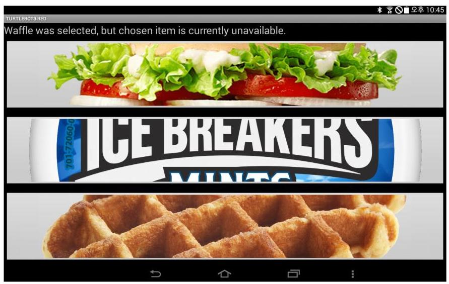

图 12-9 在平板上运行的菜单示例2 (选择了无法下单的物品的情况)

### 12.2.5. 服务从节点

服务从节点管理的节点都与机器人的控制直接相关。例如, 这个例子使用了 TurtleBot3 Carrier，并且在第10章和第11章中所描述的SLAM和导航运行时运行的节点是主要节点。在这里,我们描述了为了开发TurtleBot3 Carrier ${}^{3}$ 而改装的TurtleBot3的源代码。在这个例子中，主要使用图12-10所示的功能包。每个箭头代表一个子功能包。 为了制作配送服务机器人，其中一些功能包需要进行修改。

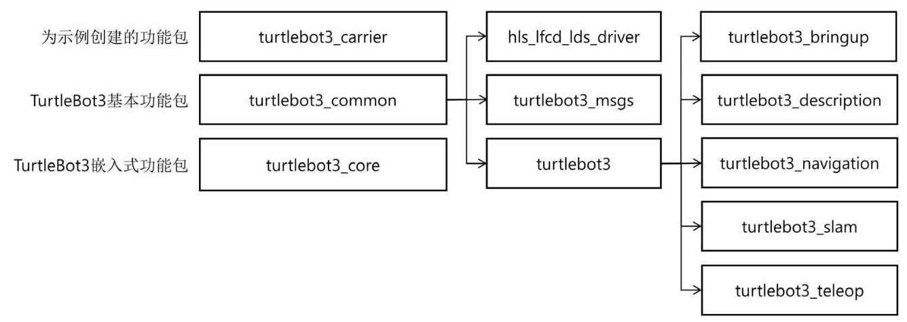

图 12-10 要使用的功能包列表

以下说明了为了制作配送服务机器人而修改的源代码。poll()函数处理附近物体之间的距离，而这个距离是通过LDS(HLS-LFCD2)的激光获得的。由于TurtleBot3 Carrier在LDS周围立了一些柱子，并且为了配送，被设计成有几层结构的形态，所以当 LDS运转时，识别柱子，因此会对SLAM或导航的结果产生不利影响。因此，TurtleBot3 Carrier在检测到小于一定的距离的物体时, 将与此物体相同角度的反射光的强度强制改为“0”。之后，在导航算法中，距离“0”的值被识别为“无对象”，因此柱子不影响 SLAM或导航。

hld_lfcd_lds_driver/src/hlds_laser_publisher.cpp

---

void LFCDLaser::poll(sensor_msgs::LaserScan::Ptr scan)

\{

...省略...

while (!shutting_down_ && !got_scan)

\{

...省略...

	if(start_count == 0)

---

---

3 http://emanual.robotis.com/docs/en/platform/turtlebot3/friends/#turtlebot3-friends-carrier

---

---

	\{

		if(raw_bytes[start_count] == 0xFA)

		\{

		start_count = 1;

	\}

	\}

	else if(start_count == 1)

	\{

		if(raw_bytes[start_count] == 0xA0)

		\{

...省略...

		//read data in sets of 6

		for(uint16_t i = 0; i < raw_bytes.size(); i=i+42)

		\{

			if(raw_bytes[i]==0xFA&&raw_bytes[i+1]==(0xA0+i/42))

			\{

...省略...

			for(uint16_t j = i+4; j < i+40; j=j+6)

			\{

				index $= \left( {{6}^{ \star  }\mathrm{i}}\right) /{42} + \left( {\mathrm{j} - 6 - \mathrm{i}}\right) /6$ ;

				// Four bytes per reading

				uint8_t byte0 = raw_bytes[j];

				uint8_t byte2 = raw_bytes[j+1];

				uint8_t byte2 = raw_bytes[j+2];

				uint8_t byte3 = raw_bytes[j+3];

				// Remaining bits are the range in mm

				uint16_t intensity = (byte1 << 8) + byte0;

				uint16_trange = (byte3<<8) + byte2;

				scan->ranges[359-index] = range / 1000.0;

				scan->intensities[359-index] = intensity;

			\}

		\}

		\}

			/// 添加部分开始 ///

			for(uint16_t deg = 0; deg < 360; deg++)

			\{

			if(scan->ranges[deg] < 0.15)

			\{

			scan->ranges[deg] = 0.0;

			scan->intensities[deg] = 0.0;

			\}

		\}

			/// 添加部分结束 //

		scan->time_increment = motor_speed/good_sets/1e8;

	\}

	else

	\{

		start_count = 0;

	\}

	\}

\}

\}

---

turtlebot3_core是TurtleBot3使用的控制板OpenCR的专用固件，turtlebot3_ motor_driver.cpp是直接控制TurtleBot3中使用的舵机的源程序。实际的服务机器人在装载物体的情况下移动，因此为了安全的搬运，需要适当的控制。因此，我们在下面的源代码中添加了不包含在turtlebot3_motor_driver.cpp源程序的Dynamixel的轮廓控制 (profile control)代码。这里，ADDR_X_PROFILE_ACCELERATION的值是108。关于舵机的更多信息，请参阅Dynamixel手册(http://emanual.robotis.com/)。

---

	turtlebot3_core(for TurtleBot3 waffle)/turtlebot3_motor_driver.cpp

bool Turtlebot3MotorDriver::init(void)TurtleBot3载体

\{

...省略...

// Enable Dynamixel Torque

setTorque(left_wheel_id_, true);

setTorque(right_wheel_id_, true);

---

---

				/// 添加部分开始 ///

					// Set Dynamixel Profile Acceleration

					setProfileAcceleration(left_wheel_id_, 15);

					setProfileAcceleration(right_wheel_id_, 15);

				/// 添加部分结束 ///

						...省略...

					return true;

\}

bool Turtlebot3MotorDriver::setTorque(uint8_t id, bool onoff)

\{

					...省略...

\}

bool Turtlebot3MotorDriver::setProfileAcceleration(uint8_t id, uint32_t value)

\{

					uint8_t dx1_error = 0;

					int dx1_comm_result = COMM_TX_FAIL;

				dxl_comm_result = packetHandler_->write4ByteTxRx(portHandler_, id, ADDR_X_PROFILE_ACCELERATION,

value, &dxl_error);

					if(dxl_comm_result!=COMM_SUCCESS)

				\{

													packetHandler_->printTxRxResult(dxl_comm_result);

	\}

					else if(dxl_error != 0)

				\{

														packetHandler_->printRxPacketError(dxl_error);

\}

\}

---

turtlebot3_navigation.launch启动在TurtleBot3中进行导航时运行的节点。如前所述, 节点和ROS话题必须分组到同一组namespace中, 以便在多个机器人中同时使用一种ROS功能包。在上面的launch代码中, 我们将节点分组到叫做 “tb3g” 的 namespace，并为了从未绑定在同一个namespace的其他节点接收消息，使用了remap 功能。这种方法在无法修改源代码的话题名称时也可以使用。请注意，这种修改不仅应该在launch文件中完成，而且还应该在需要同样的分组(如RViz文件)的所有地方进行。

---

	turtlebot3/turtlebot3_navigation/turtlebot3_navigation.launch

<launch>

<group ns="tb3g">

<remap from="/tf" to="/tb3g/tf"/>

<remap from="/tf_static" to="/tb3g/tf_static"/>

<arg name="model" default="waffle" doc="model type [burger, waffle, waffle_pi]"/>

...省略...

</node>

</group> 如果已操作到这里，那么已经成功搭建了图12-11所示的系统。

</launch>

---

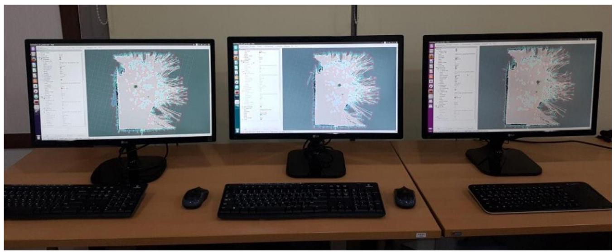

图 12-11 在各个计算机上运行的RViz显示的各机器人的导航场景

## 12.3. 用ROS Java进行Android平板PC编程

在前一节中，我们以图12-8中的平板上运行的菜单为例，说明了利用平板的订购。在本节中，我将在Linux上安装Android Studio IDE ${}^{4}$ ，并构建ROS Java开发环境。然后， 将介绍一个简单的ROS Java示例。

下面介绍Android Studio IDE的安装方法和ROS Java环境设置所需的功能包的安装方法。ROS Java是指以Java语言运行的ROS客户端库。我们先设置运行Java所需的选项。需要的功能包是Java SE Development Kit (JDK), 您需要指定其他的选项, 如运行位置等。本书介绍了如何下载JDK 8，但在JDK版本更新后，您应该修改它。

---

---

	\$ sudo apt-get install openjdk-8-jdk

	\$ echo export PATH=\$\{PATH\}:/opt/android-sdk/tools:/opt/android-sdk/platform-tools:/opt/android-studio/

bin>>> //.bashrc

	\$ echo export ANDROIS_HOME=/opt/android-sdk >> ~/.bashrc

\$ source ~/.bashrc

---

4 https://developer.android.com/studio/index.html

---

以下命令下载用于ROS Java中的构建所需的工具。之后, 安装并构建一个包含ROS Java系统和示例的功能包。这里的android_core目录是和前面出现的catkin_ws目录具有同样意义的目录。

\$ sudo apt-get install ros-kinetic-ros java-build-tools

\$ mkdir-p~/android_core

\$wstool init-j4 ~/android_core/srchttps://raw.github.com/rosjava/rosjava/kinetic/

android_core.rosinstall

\$ source /opt/ros/kinetic/setup.bash

\$ cd ~/android_core

\$catkin_make

下面说明如何安装Android Studio IDE。为了避免混淆, 下面说明时使用与ROS Android中说明的目录和文件名一样的名称。这些功能包是在Android Studio IDE中安装mksdcard所需的附加功能包, 其中mksdcard是利用SD卡实现Virtual Device的功能。如果不安装, mksdcard功能将无法安装。

---

\$ sudo apt-get install lib32z1 lib32ncurses5 lib32stdc++6

---

本书中将在ROS Android ${}^{5}$ 推荐的/opt目录安装Android Studio IDE和SDK。为了安装到/opt目录，需要将/opt的用户权限更改为可写。

\$ sudo chown -R \$USER:\$USER /opt

Android Studio IDE的安装文件可以从https://developer.android.com/studio/ index.html#download获取。下载安装文件后，将其解压到/opt/android-studio。解压后，目录的配置如图12-12所示。

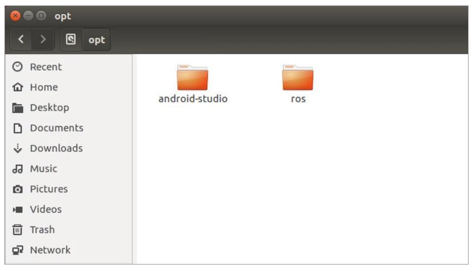

图 12-12 下载的Android Studio IDE已正确解压缩

解压完成后，输入以下命令开始IDE安装。

---

\$/opt/android-studio/bin/studio.sh

---

当出现如图12-13所示的窗口时，单击“无导入运行”继续进行“自定义安装”。

---

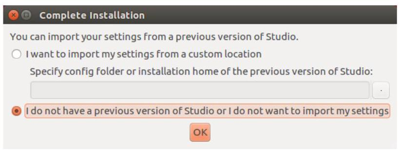

	图 12-13 在安装过程中出现的第一个窗口

---

之后，您将看到如图12-14所示的安装Android SDK的窗口。请注意，您需要将安装位置设置为/opt/android-sdk。如果您没有“android-sdk”目录，请在该位置创建并继续。

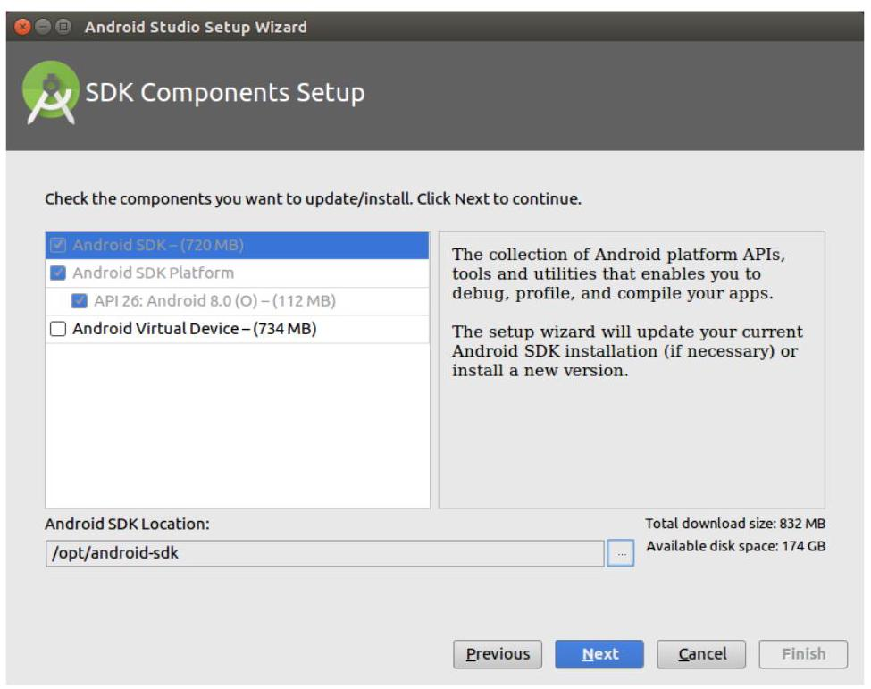

图 12-14 Android SDK安装画面

如果安装正常完成，则按照图12-15所示完成安装。

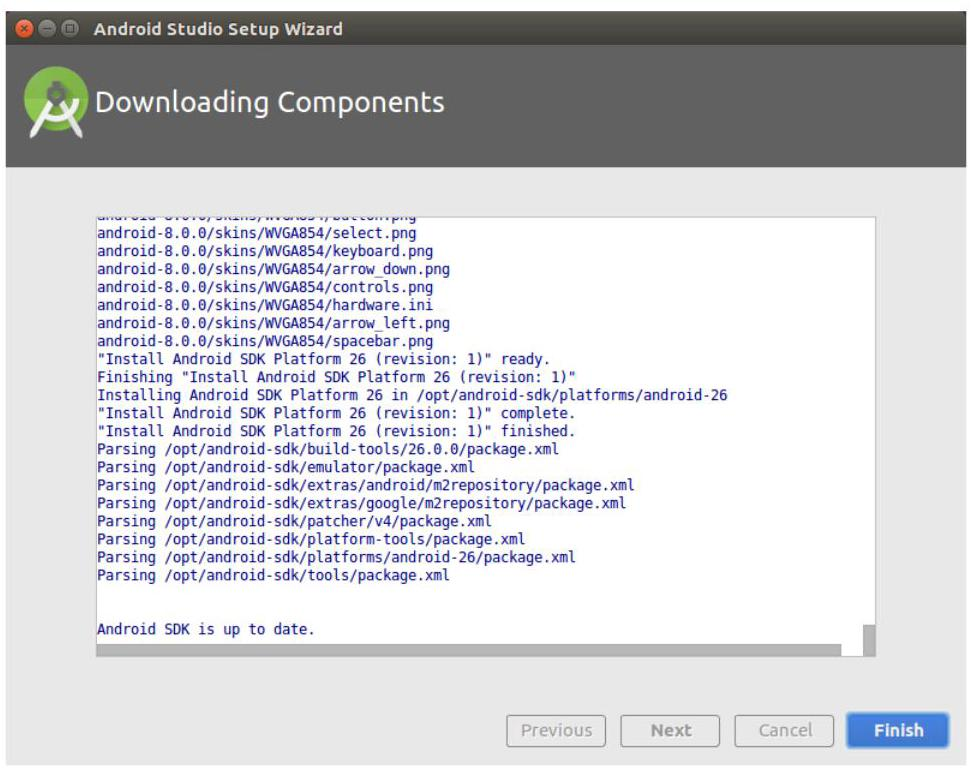

图 12-15 安装正常结束的画面

当Android Studio IDE正常安装时，将出现 “Welcome to Android Studio” 窗口, 如图12-16所示。

图 12-16 Welcome to Android Studio

此时, 请通过Configure $\rightarrow$ SDK Manager更新Android SDK。在图12-17中, 可用的SDK包括10(Gingerbread)、13(Honeycomb)、15(Ice cream)、18 (Jellybean) 。

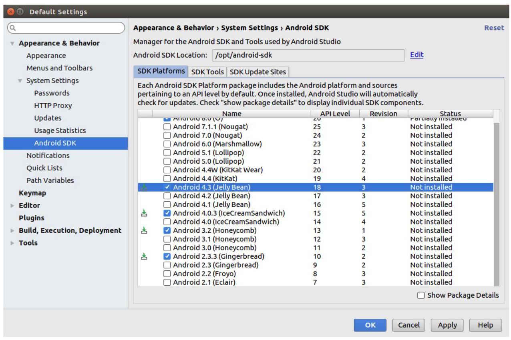

图 12-17 Android SDK设置

配置和安装完成后, 从窗口中点击Open an existing Android Studio project, import之前安装的android_core，如图12-18所示。当点击OK后，出现如图12-19所示的IDE窗口并开始构建import的源代码。

---

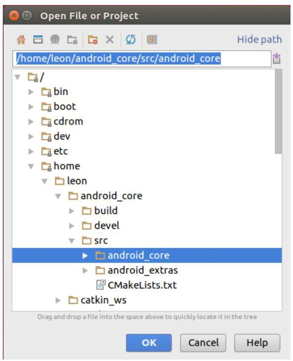

	## 图 12-18 Project import

---

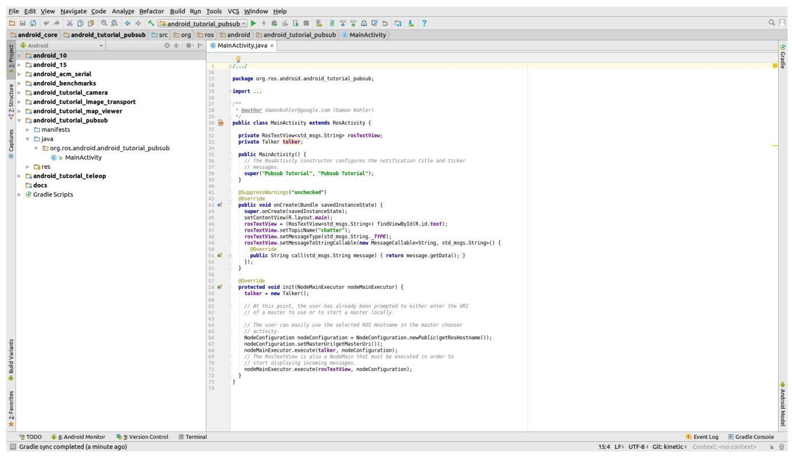

图 12-19 Android Studio IDE的import画面

接下来，我们运行android_tutorial_pubsub示例。在窗口顶部的project选择窗口中选择android_tutorial_pubsub，然后点击旁边的play键，则会查找执行程序的终端。 选择适当的终端，如图12-20所示，然后按OK。

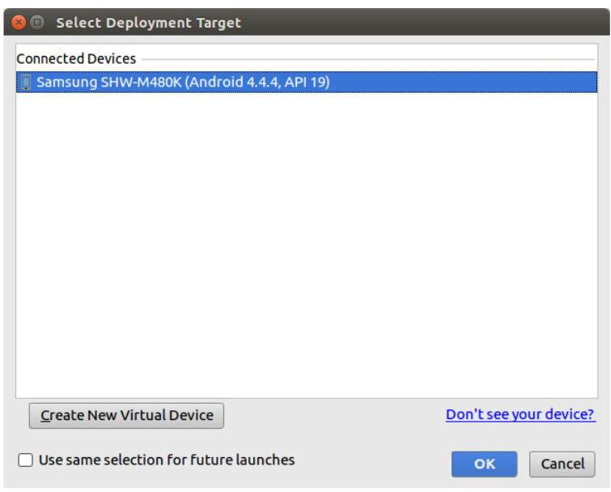

图 12-20 终端选择窗口

将程序成功安装到终端上时，需要将ROS主节点所在的PC(运行roscore的PC)的IP 输入到终端，如图12-21所示。输入正确的IP，然后按Connect。

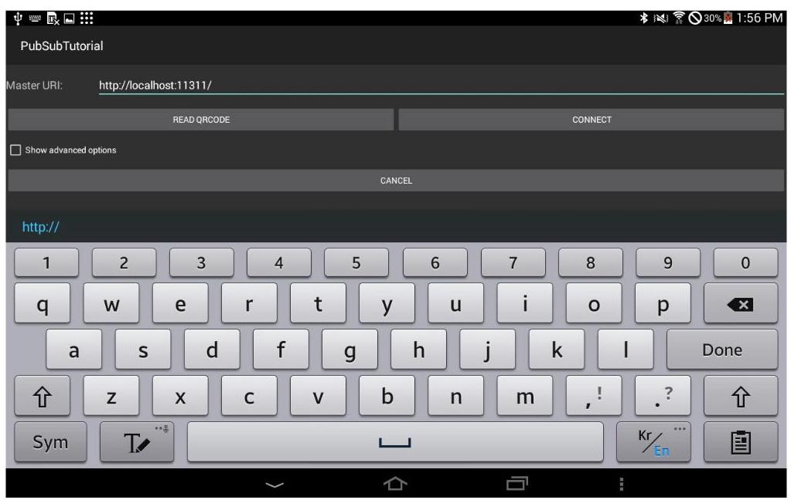

图 12-21 ROS IP设置窗口

当android_tutorial_pubsub运行时，终端会发布std_msgs::String类型的“Hello world! n”。现在，让我们在您的计算机上订阅此终端发布的字符串吧。如果您使用上述的 "rostopic echo" 命令查看 "/chatter" 话题，则可以看到该话题正在发布，如下所示。

---

\$ rostopic echo /chatter

data: Hello world! 96

---

data: Hello world! 97

---

data: Hello world! 98

---

data: Hello world! 99

---

data: Hello world! 100

---

	data: Hello world! 101

---

---

我们在上一章中介绍了应用SLAM和导航的服务机器人。如本章所述，创建一个在您周围可见的服务机器人并不困难。在本章的结尾，我衷心希望读者可以通过本书可以开发出更好的机器人。
