# 第13章 机械手臂

## 13.1. 机械手臂介绍

机械手臂 (Manipulator) 是为了在工厂里执行简单重复任务而设计的机器人。它的目的是取代危险的工作或取代重复的任务，最近有许多有关机械手臂和人的协作的研究。12

随着人机交互 (Human Robot Interaction, HRI) ${}^{3}$ 的研究活跃起来, 机械手臂不仅应用到了工厂，还与多种领域(Media Arts ${}^{4}$ 、VR ${}^{5}$ 等)结合，为大众带来了新的体验。数字舵机和3D打印技术的结合正在提高机械手臂对公众的接近度，这给了制造商和教育行业巨大的期待。 ${}^{6}{}^{7}{}^{8}$ 一方面，机械手臂和人工智能的结合使很多人带来了大规模失业的恐惧。 ${}^{9}{}^{10}$ 但是,机械手臂长期以来一直是使社会富饶的工具之一,当今也在许多不同的领域帮助人们。1112未来如果机器人的发展能够渗透到我们的生活中，而不会摆脱其本质，那么像扫地机器人一样，机器人将成为我们生活的一部分。

今后, 我们将介绍机械手臂的结构和ROS中提供的机械手臂的库。ROBOTIS的 OpenManipulator是支持ROS的机械手臂之一，其优点是能够使用Dynamixel和3D打印部件，因此可以以低成本轻松制作。我将以本机械手臂为例，介绍可以与ROS一起使用的Gazebo 3D仿真器，还会介绍用于机械手臂的集成库MoveIt!，并且讲解他们的使用方法。最后, 我将讨论如何配置和控制实际的平台, 以及OpenManipulator与TurtleBot3 Waffle、Waffle Pi之间的兼容性。

### 13.1.1. 机械手臂的结构和控制

机械手臂的基本结构由基座 (Base)、连杆 (Link)、关节 (Joint) 和末端执行器 (End-effector)组成，如图13-1所示。

---

https://www.automationworld.com/inside-human-robot-collaboration-trend

thttps://www.kuka.com/en-us/technologies/human-robot-collaboration

3 https://en.wikipedia.org/wiki/Human%E2%80%93robot_interaction

4 https://youtu.be/lX6JcybgDFo

5 http://www.asiae.co.kr/news/view.htm?idxno=2016100416325879220

6 http://www.littlearmrobot.com/

7 https://niryo.com/products/

8 http://www.ufactory.cc/#/en/

9 http://time.com/4742543/robots-jobs-machines-work/

10 http://adage.com/article/digitalnext/5-jobs-robots/308094/

11 https://www.bostonglobe.com/magazine/2015/09/24/this-robot-going-take-your-job/paj3zwznSXMSvQiQ8pdBjK/story.html

12 https://www.automationworld.com/article/abb-unveils-future-human-robot-collaboration-yumi

---

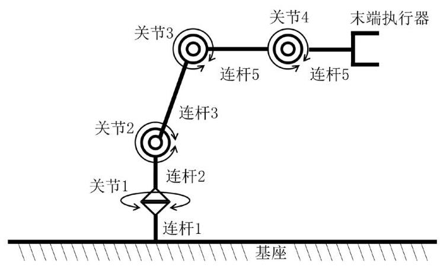

图 13-1 机械手臂的基本结构

机械手臂一般是固定一端，而固定部分称为基座。因为机械手臂的长度和端部的移动速度与施加到基座的力的大小成比例, 所以基座在机械手臂的整个结构中是面积最大且最坚固的部分。基座不仅是一个固定的物体, 它也可以是一个像移动机器人那样运动的物体，因此可以作为机械手臂自由度的补充。以“基座”作为基础而制作出来的机械手臂还由连杆和关节的级联组成。连杆通常有一个关节，但有时也有不止一个关节。关节代表旋转轴, 主要由电机组成。通过这个电机的转动, 关节产生连杆的运动。关节根据其运动方式可以分为:旋转关节(Revolute)、平移关节(Prismatic)、螺丝关节(Screw)、 圆筒关节(Cylindrical)、混合关节(Universal)和球形关节(Spherical)等。近年来, 出现了很多使用液压而非电机的关节, 而且学界正在积极进行关于可以代替电机的新型关节的研究。

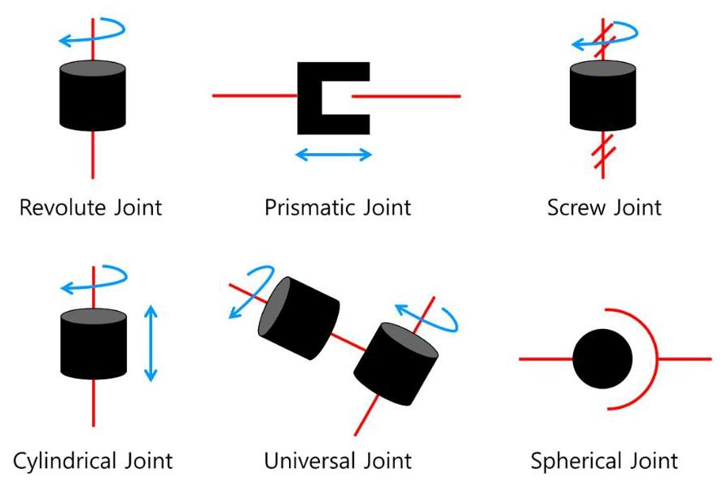

图 13-2 关节 (joint) 的类型

基座上有一连串的连杆和关节，最终端是一个“末端执行器”。由于机械手臂的固有目的是抓取并搬运物体，因此其 “末端执行器” 往往是一个抓手(Gripper)。如图13-3 所示，为了实现抓取不同形状物体的任务，研究者们尝试着多种形态的末端执行器。

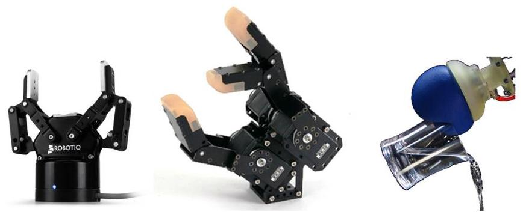

图 13-3 抓手的类型(从左到右 ROBOTIQ、ROBOTIS、Cornell University)

控制机械手臂的方法可分为关节空间控制 (Joint Space Control) 和任务空间控制 (Task Space Control)。

关节空间控制是通过输入每个关节的旋转角度来输出机械手臂坐标值的方法, 如图 13-4所示。根据各关节的旋转程度而变化的末端坐标值(X，Y，Z，θ，ϕ和ψ)可以通过正向运动学获得。

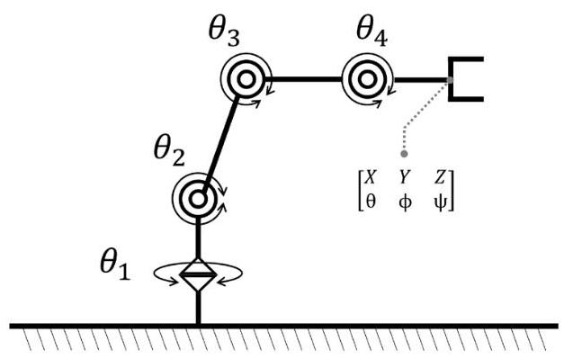

图 13-4 正向运动学

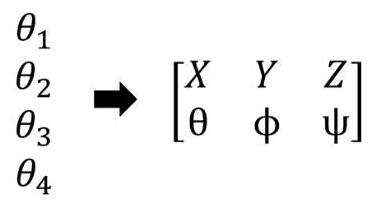

如图13-5所示，任务空间控制是输入机械手臂的末端的坐标值，以此获得各关节的角度位置, 其输入和输出与关节空间控制正好相反。工作空间中的物体姿态 (Pose) 包括其位置 (Position) 和方向 (Orientation) 。我们生活在一个三维的世界, 因此可以用 X、Y、Z轴来表示，而方向可以表示为θ(roll)、ϕ(pitch)、ψ(yaw)。以桌子上的杯子(假设该坐标系的原点是杯子的中心)为例，即使它的位置不变，但可以通过使其躺下或改变它的手把的方向来改变杯子在三维空间中的姿态。换句话说，如果以数学语言描述, 则意味着有6个未知数, 所以如果有6个方程就可以找到唯一的解。根据机械手臂的自由度特点, 当有6个关节时, 才可以把桌子上的杯子以任何角度举到任何可能的位置。但是, 并不是所有的机械手臂都需要六个以上的自由度。根据机械手臂使用的目的和环境来调整自由度会更有效率。通过逆运动学原理，可以根据机械手臂末端的坐标值获得每个关节的角度。

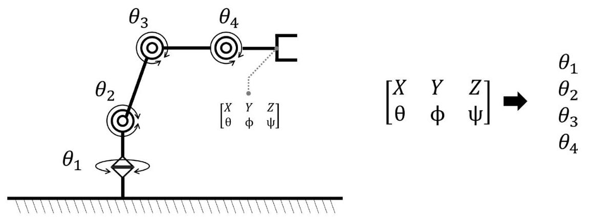

图 13-5 逆运动学

### 13.1.2. 机械手臂和ROS

ROS通过开源的可扩展性和灵活性吸引了许多用户。随着越来越多的用户使用ROS, 出现了更多的支持ROS的平台，也出现了收集和销售这些平台的公司 ${}^{13}$ 。此外，个人开发者为了研究或爱好的目的而创建的平台也有在ROS官方功能包中注册，并被介绍给许多用户。ROS Robots ${}^{14}$ 支持大约180个ROS平台。

典型的有ROS-INDUSTRIAL ${}^{15}$ 支持的ABB的工业机械手臂 ${}^{16}$ ，而被广泛用于研究的 KinOva的JACO ${}^{17}$ 也支持ROS。作为韩国公司，ROBOTIS的MANIPULATOR-H ${}^{18}$ 支持 ROS。各机械手臂参见图13-6。

---

13 https://www.roscomponents.com/en/

14 http://robots.ros.org/

15 http://wiki.ros.org/abb/

16 http://wiki.ros.org/abb/

17 http://wiki.ros.org/Robots/JACO/

18 http://wiki.ros.org/ROBOTIS-MANIPULATOR-H/

---

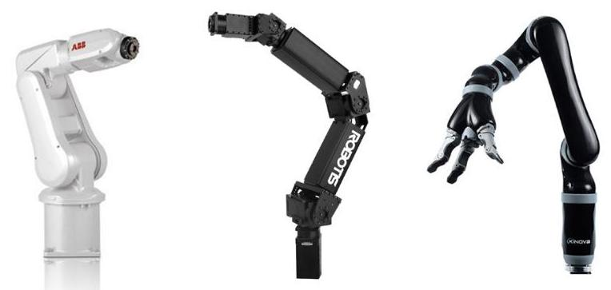

图 13-6 支持ROS的各种机械手臂(从左开始，ABB，ROBOTIS，Kinova)

## 13.2. OpenManipulator建模和仿真

ROS为机械手臂提供了有用的工具。

第一种工具是可以通过可扩展标记语言 (XML) 很方便地创建一个统一机器人描述格式 (URDF ${}^{19}$ , Unified Robot Description Format) 文件,该文件可以在ROS的机器人建模可视化工具RViz(ROS Visualization)中加载并使用。

第二种工具是3D仿真器Gazebo ${}^{20}$ ，可以仿真实际的操作环境。与URDF类似， Gazebo仿真环境也可以使用XML和仿真描述格式 (SDF, Simulation Description Format ${}^{21}$ )文件轻松创建。Gazebo还支持ROS-CONTROL ${}^{22}$ 和plugin ${}^{23}$ 功能来控制机器人和各种传感器。

第三种是MoveIt! ${}^{24}$ ,一个用于机械手臂的集成库。MoveIt!提供Kinematics and Dynamics Library (KDL) ${}^{25}$ 和The Open Motion Planning Library (OMPL) ${}^{26}$ 等开源库。它是功能强大的机械手臂工具，可以查看机械手臂的多种功能，比如碰撞计算、 运动规划和Pick and Place演示，等。

让我们看看如何使用上面的三个工具，并用示例代码来实现它。

---

19 http://wiki.ros.org/urdf

20 http://gazebosim.org/

21 http://sdformat.org/

22 http://wiki.ros.org/ros_control

23 http://gazebosim.org/tutorials?tut=ros_gzplugins

24 http://moveit.ros.org/

25 http://www.orocos.org/kdl

26 http://ompl.kavrakilab.org/

---

### 13.2.1. OpenManipulator

OpenManipulator是由ROBOTIS开发的基于开源软件和硬件的机械手臂。 OpenManipulator支持Dynamixel X系列 ${}^{27}$ ，您可以通过选择您所需的规格的舵机来制作机器人。而且, 因为它由基本连接件和3D打印连接件组成, 因此可以根据用户的环境或目的制作一种新型的机械手臂。由于这些特点，除了四关节机械手臂之外，还将提供 SCARA、Planar、Delta等各种形状和功能的机械手臂。OpenManipulator支持ROS的同时还支持OpenCR ${}^{28}$ 、Arduino IDE ${}^{29}$ 和Processing ${}^{30}$ 。

本章中将要使用的OpenManipulator Chain具有最基本的机械手臂形式，并且末端执行器具有由3D打印连接件构成的线性抓手形状。OpenManipulator Chain设计文件都已在Onshape ${}^{31}$ 上公开，而源代码可以从ROBOTIS的Github ${}^{32}$ 下载。源代码同时支持 ROS、Arduino和Processing，而且源代码包括OpenManipulator Chain的MoveIt!功能包和Gazebo功能包。此外, OpenManipulator Chain与TurtleBot3 Waffle及Waffle Pi在机械方面兼容, 所以可以弥补自由度的不足。

下面我们将看OpenManipulator Chain的源代码、URDF、Gazebo和MoveIt!。以下是使用上述三种工具所需的ROS功能包。我们预先安装它们。

\$ sudo apt-get install ros-kinetic-ros-controllers ros-kinetic-gazebo* ros-kinetic-moveit* ros-kinetic-dynamixel-sdk ros-kinetic-dynamixel-workbench-toolbox ros-kinetic-robotis-math ros-kinetic-industrial-core

### 13.2.2. 机械手臂建模

为了在虚拟空间中仿真机械手臂, 我们先来了解一下各个组件的仿真方法。在查看 OpenManipulator Chain中的URDF之前，让我们为由三个关节和四个连杆组成的机械手臂创建一个简单的URDF。

---

27 http://www.robotis.com/index/product.php?cate_code=131810

28 http://emanual.robotis.com/docs/en/parts/controller/opencr10/

29 https://www.arduino.cc/en/main/software

30 https://processing.org/

1 https://goo.gl/NsqJMu

32 https://github.com/ROBOTIS-GIT/open_manipulator

---

首先，按如下所示创建testbot_description功能包，然后创建urdf目录。然后使用编辑器创建一个testbot.urdf文件，并输入下面的URDF例程。

\$cd ~/catkin_ws/src

\$ catkin_create_pkg testbot_description urdf

\$ cd testbot_description

\$mkdirurdf

\$ cd urdf

\$ gedit testbot.urdf

testbot description/urdf/testbot.urdf

---

<?xml version="1.0" ?>

<robot name="testbot">

												<material name="black">

																					<color rgba="0.00.00.01.0"/>

													</material>

													<material name="orange">

																					<color rgba="1.00.40.01.0"/>

													</material>

											<link name="base"/>

												<joint name="fixed" type="fixed">

																					<parent link="base"/>

																					<child link="link1"/>

												</joint>

													<link name="link1">

																								<collision>

																																		<origin xyz="000.25" rpy="000"/>

																																				<geometry>

																																														<box size="0.10.10.5"/>

																																			</geometry>

																								</collision>

																								<visual>

																																		<origin xyz="000.25" rpy="000"/>

																																			<geometry>

																																														<box size="0.10.10.5"/>

																								</geometry>

																							<material name="black"/>

														</visual>

														<inertial>

																							<origin xyz="000.25" rpy="000"/>

																								<mass value="1"/>

																									<inertia ixx="1.0" ixy="0.0" ixz="0.0" iyy="1.0" iyz="0.0" izz="1.0"/>

												</inertial>

	</link>

	<joint name="joint1" type="revolute">

										<parent link="link1"/>

											<child link="link2"/>

											<origin xyz="000.5" rpy="000"/>

											<axis xyz="001"/>

											<limit effort="30" lower="-2.617" upper="2.617" velocity="1.571"/>

	</joint>

	<link name="link2">

												<collision>

																								<origin xyz="000.25" rpy="000"/>

																								<geometry>

																																				<box size="0.10.10.5"/>

																								</geometry>

													</collision>

													<visual>

																							<origin xyz="000.25" rpy="000"/>

																								<geometry>

																																			<box size="0.10.10.5"/>

																									</geometry>

																							<material name="orange"/>

														</visual>

														<inertial>

																							<origin xyz="000.25" rpy="000"/>

																							<mass value="1"/>

																								<inertia ixx="1.0" ixy="0.0" ixz="0.0" iyy="1.0" iyz="0.0" izz="1.0"/>

												</inertial>

</link>

---

---

<joint name="joint2" type="revolute">

									<parent link="link2"/>

										<child link="link3"/>

											<origin xyz="000.5" rpy="000"/>

										<axis xyz="010"/>

											<limit effort="30" lower="-2.617" upper="2.617" velocity="1.571"/>

	</joint>

	<link name="link3">

											<collision>

																							<origin xyz="000.5" rpy="000"/>

																								<geometry>

																																		<box size="0.10.11"/>

																							</geometry>

												</collision>

													<visual>

																						<origin xyz="000.5" rpy="000"/>

																								<geometry>

																																		<box size="0.10.11"/>

																									</geometry>

																							<material name="black"/>

													</visual>

													<inertial>

																						<origin xyz="000.5" rpy="000"/>

																							<mass value="1"/>

																					<inertia ixx="1.0" ixy="0.0" ixz="0.0" iyy="1.0" iyz="0.0" izz="1.0"/>

											</inertial>

	</link>

	<joint name="joint3" type="revolute">

									<parent link="link3"/>

										<childlink="link4"/>

											<origin xyz="001.0" rpy="000"/>

										<axis xyz="010"/>

										<limit effort="30" lower="-2.617" upper="2.617" velocity="1.571"/>

	</joint>

<link name="link4">

											<collision>

---

---

																																			<origin xyz="000.25" rpy="000"/>

																																			<geometry>

																																														<box size="0.10.10.5"/>

																																		</geometry>

																								</collision>

																								<visual>

																																		<origin xyz="000.25" rpy="000"/>

																																		<geometry>

																																															<box size="0.10.10.5"/>

																																			</geometry>

																																			<material name="orange"/>

																								</visual>

																								<inertial>

																																		<origin xyz="000.25" rpy="000"/>

																																		<mass value="1"/>

																																		<inertia ixx="1.0" ixy="0.0" ixz="0.0" iyy="1.0" iyz="0.0" izz="1.0"/>

																							</inertial>

											</link>

</robot>

---

URDF使用XML标签来描述机器人的每个组件。以URDF形式先描述机器人的名称、 基座(在URDF中将基座看作一个固定的连杆)的名称和类型、连接到基座的连杆，之后逐一说明连杆和关节的内容。连杆描述连杆的名称、大小、重量和惯性等。关节描述每个关节的名称、类型和连接的连杆。并且可以很容易地设置机器人的动力学元素、可视化和碰撞模型。URDF是以<robot>标签来开始，详细内容中通常会反复交替出现<link>标签和<joint>标签，这两种标签都用于定义机器人的组件-连杆和关节。其中，为了与ROS-Control共用，通常还包括用于设置关节和舵机之间的关系的<transmission>标签。接着, 让我们仔细看看我们创建的testbot.urdf。

material标签描述连杆的颜色和纹理等信息。在下面的例子中，我们定义了两种材质, 黑色和橙色, 以区分每个连杆。颜色是利用color标签, 可以在rgba选项后面输入对应于红色、绿色和蓝色的三个0.0到1.0之间的一个数字来分别设置。最后一个数字的透明度 (alpha) 值为0.0到1.0，值为1.0意味着没有透明度。

---

<material name=" black" >

									<color rgba="0.00.00.01.0"/>

</material>

	<material name="orange">

									<color rgba="1.00.40.01.0"/>

	</material>

---

机械手臂的第一种组件，基座在URDF中以连杆表示。基座通过关节连接到第一个连杆，这个关节是固定的，位于原点(0,0,0)。为了进行更多关于<link>标签的详细描述, 我们先来看第一个连杆 (link1) 标签。

---

<link name=" base" />

	<joint name="fixed" type="fixed">

										<parent link="base"/>

										<childlink="link1"/>

</joint>

	<link name="link1">

												<collision>

																							<origin xyz="000.25" rpy="000"/>

																							<geometry>

																																		<box size="0.10.10.5"/>

																							</geometry>

													</collision>

													<visual>

																						<origin xyz="000.25" rpy="000"/>

																							<geometry>

																																		<box size="0.10.10.5"/>

																							</geometry>

																							<material name="black"/>

												</visual>

													<inertial>

																					<origin xyz="000.25" rpy="000"/>

																						<mass value="1"/>

																					<inertia ixx="1.0" ixy="0.0" ixz="0.0" iyy="1.0" iyz="0.0" izz="1.0"/>

											</inertial>

</link>

---

如上面的link1例子，URDF <link>标签由碰撞(collision)、视觉(visual)和惯性(inertial)标签(见图13-7)组成。collision标签允许您输入表示连杆的外形范围的几何信息。origin写外形范围的中心坐标。geometry写以origin坐标为中心的外形范围的形状和大小。例如，长方体类型的外形范围是长、宽和高的值。除长方体形式以外， 还有圆柱型和球型, 他们的输入内容各不相同。在visual标签中写下实际的形状。origin 和geometry与collision标签相同。而且也可以在这里输入CAD文件，如STL和DAE。 collision标签可以在CAD模型中使用，但仅适用于ODE或Bullet等部分物理引擎，不支持DART和Simbody等。在inertial标签中，输入连杆的重量(质量单位为kg)和惯性矩 (惯性矩单位为 $\mathrm{{kg}} \cdot  {\mathrm{m}}^{2}$ )。这种惯性信息可以通过设计软件、实际测量和计算得到，用于动力学仿真。

testbot.urdf示例中描述的link1、link2和link4的原点与各自的上部关节(分别为 fixed、joint1和joint3)的原点相距0.25m，而这三个连杆的外形是以这个移动的原点为中心的长宽各 ${0.1}\mathrm{\;m}$ ，高 ${0.5}\mathrm{\;m}$ (z轴正方向 ${0.25}\mathrm{\;m}$ ，z轴负方向 ${0.25}\mathrm{\;m}$ )的长方体。link3的原点与上部关节(joint2)的原点相距 ${0.5}\mathrm{\;m}$ ，且link3的外形是以这个移动的原点为中心的长宽各 ${0.1}\mathrm{\;m}$ ，高 $1\mathrm{\;m}$ 的长方体。

在第一次遇到URDF时对于相对坐标变换的理解是相当困难的。一边直观地查看图形, 一边理解各设定值会容易得多。为了更好地理解, 可以通过图13-12观察各轴的相对坐标变换在RViz上是如何表现的, 并通过修改设定值观察RViz上的变化。笔者建议读者务必尝试一下。

= 连杆(link)标签的属性

<link3>: 连杆的可视化、碰撞和惯性信息设置

<collision>: 设置连杆的碰撞计算的信息

<visual>: 设置连杆的可视化信息

<inertial>: 设置连杆的惯性信息

<mass>: 连杆重量(单位:kg)的设置

<inertia>: 惯性张量 (Inertia tensor ${}^{34}$ ) 设置

<origin>: 设置相对于连杆相对坐标系的移动和旋转

---

33 http://wiki.ros.org/urdf/XML/link

34 https://en.wikipedia.org/wiki/Moment_of_inertia

---

---

<geometry>: 输入模型的形状。提供box、cylinder、sphere等形态，也可以导入COLLADA

												(.dae)、STL(.stl)格式的设计文件。在<collision>标签中，可以指定为简单的

											形态来减少计算时间

<material>: 设置连杆的颜色和纹理

---

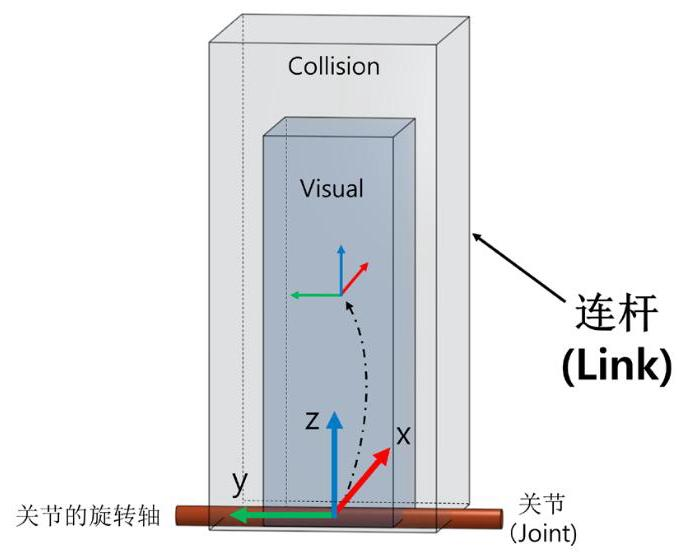

图 13-7 连杆的建模参数

接下来, 我们来看看连接相邻连杆的关节 (joint) 标签。关节标签描述了关节的特征，如图13-8所示。具体来说它描述关节的名称和类型，如revolute(旋转运动型)、 prismatic(平移运动型) 、continuous(连续旋转的轮)、fixed(固定型)、floating (非固定)和planar(在与轴垂直的平面移动的形态)。它还描述连接的两个连杆的名称、关节的位置、旋转和平移运动的基准轴的动作限制。连接的连杆根据位置称为父连杆 (parent link) 和子连杆 (child link) ，父连杆通常是靠近基座的连杆。以下示例显示了joint2关节的设置。

---

<joint name=" joint2" type=" revolute">

									<parent link="link2"/>

										<child link="link3"/>

										<origin xyz="000.5" rpy="000"/>

											<axis xyz="010"/>

											<limit effort="30" lower="-2.617" upper="2.617" velocity="1.571"/>

	</joint>

---

-

关节(joint)标签的属性

<joint3>: 与连杆的关系和关节类型的设置

<parent> 关节的父连杆

<child>: 关节的子连杆

<origin>: 将父连杆坐标系转换为子连杆坐标系

<axis>:

<limit>: 2. 设置关节的速度、力和半径(仅当关节是revolute或prismatic时)

为了更深入理解，让我们仔细了解一下。joint2的类型(type)设置为一种运动型关节revolute。父连杆 (parent link) 设置为link2，而子连杆设置为link3。另外，origin 中以上级关节joint1的坐标系为原点，指定joint2的坐标系的相对位置姿态(位置+方向)。例如，joint2坐标系的原点是joint1坐标系朝z轴方向相距0.5m的位置。下面是轴设置。在轴设置axis中, 如果是旋转型关节, 则写入旋转轴的方向, 如果是平移型关节, 则写入运动方向。在joint2的情况下，设定为在y轴方向上旋转的关节。limit设定了关节运动的极限。属性包括给予关节的力 (effort, 单位N), 最小、最大角度 (下限, 上限, 以弧度为单位) 和速度 (以弧度/秒) 等物理量的限制值。

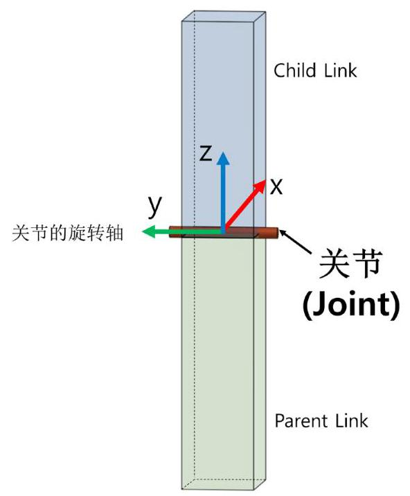

图 13-8 关节的建模参数

---

35 http://wiki.ros.org/urdf/XML/joint

---

完成建模后, 我们来检查每个连杆和关节, 看它们是否逻辑正确。在ROS中, 可以用 check_urdf命令来检查已创建的URDF的语法错误以及每个连杆的连接关系，如下例所示。如果在语法和逻辑上没有问题，则可以看到连杆1、2、3和4正常连接，如下所示。

---

\$check_urdf testbot.urdf

robot name is: testbot

---------- Successfully Parsed XML -------------

root Link: base has 1 child(ren)

	child(1): link1

		child(1): link2

			child(1): link3

				child(1): link4

---

接下来，让我们来用关系图表示urdf_to_graphiz程序创建的模型吧。如果您运行 urdf_to_graphiz，则会创建一个.gv文件和一个.pdf文件。如果您用PDF阅读器，可以一目了然地看到连杆与关节之间的关系，以及每个关节之间的相对坐标转换，如图13-9所示。

---

\$urdf_to_graphiz testbot.urdf

Created file testbot.gv

Created file testbot.pdf

---

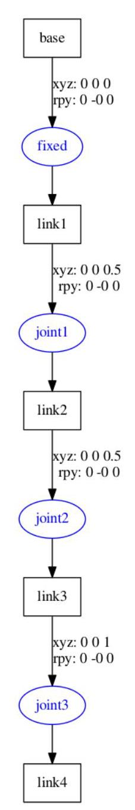

图 13-9 URDF连杆与关节的关系

用check_urdf和urdf_to_graphiz是检查模型的连杆关系的最快的方法。最后, 让我们使用RViz检查机器人模型。为此，请转至testbot_description功能包目录并创建一个 testbot.launch文件，如以下示例所示。

---

\$cd ~/catkin_ws/src/testbot_description

	\$ mkdir launch

	\$ cd launch

	\$ gedit testbot.launch

---

testbot_description/launch/testbot.launch

<launch>

<arg name="model" default="\$(find testbot_description)/urdf/testbot.urdf" />

<arg name="gui" default="True" />

<param name="robot_description" textfile="\$(arg model)" />

<param name="use_gui" value="\$(arg gui)"/>

<node pkg="joint_state_publisher" type="joint_state_publisher" name="joint_state_publisher"/>

<node pkg="robot_state_publisher" type="state_publisher" name="robot_state_publisher"/>

</launch>

Launch文件由包含URDF的参数、joint_state_publisher ${}^{36}$ 节点和robot_state_ publisher ${}^{37}$ 节点组成。joint_state_publisher节点通过sensor_msgs/JointState消息的形式发布URDF形式的机器人的关节状态，并提供一个GUI工具来给关节提供命令。 robot_state_publisher节点以 ${\mathrm{{tf}}}^{38}$ 消息的形式发布forward kinematics的结果，这个结果是由URDF中设置的机器人信息和sensor_msgs/JointState话题信息来计算得出的。 (参见图13-10)。

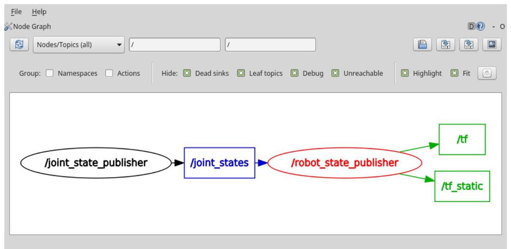

图 13-10 joint_state_publisher节点和robot_state_publisher节点中的话题

---

36 http://wiki.ros.org/joint_state_publisher

37 http://wiki.ros.org/robot_state_publisher

38 http://wiki.ros.org/tf

---

一切准备就绪后，运行testbot.launch和RViz，如下所示:

---

\$ roslaunch testbot_description testbot.launch

\$rviz

---

运行launch文件时会运行joint_state_publisher节点的GUI，如图13-11所示。 在这里您可以调整joint1、2和3的关节值。此外, 运行RViz后将[Fixed Frame]选为 "base"，点击左下方的Add按钮，添加“RobotModel”显示屏，就可以看到每个关节和连杆的形状，如图13-12的上图所示。如果添加“TF”显示屏，并将机器人模型的 “Alpha”值修改为约0.3，则可以查看每个连杆的形状以及关节之间的关系，如图13-12 的下图所示。

如果调整了joint_state_publisher节点的GUI滑动条，则可以看到RViz上的虚拟机器人的运动，如图13-13所示。相关的源代码可以在Github存储库中找到:

https://github.com/ROBOTIS-GIT/ros_tutorials/tree/master/testbot_description

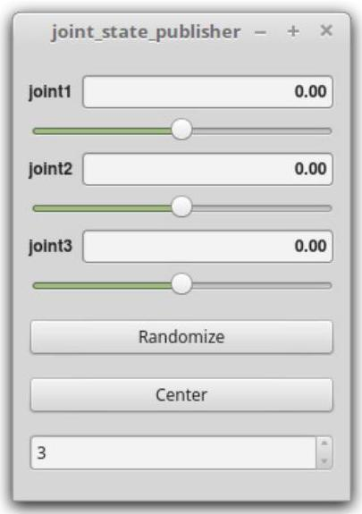

图 13-11 Joint State Publisher的GUI

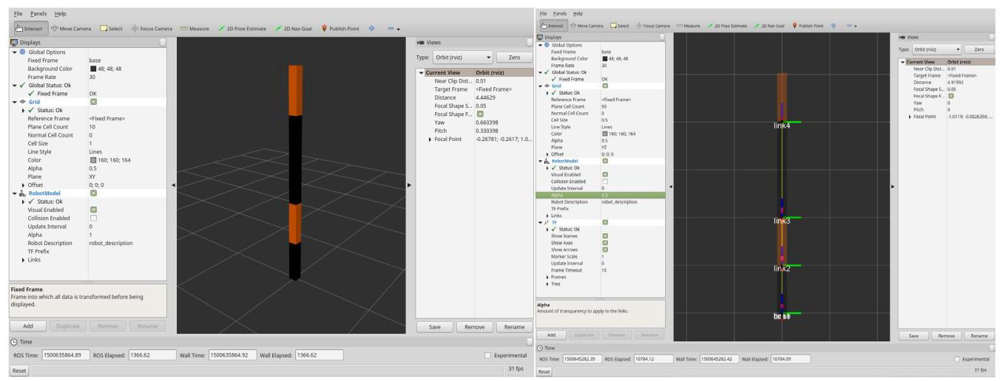

**图 13-12 RViz中各个关节和连杆的形象**

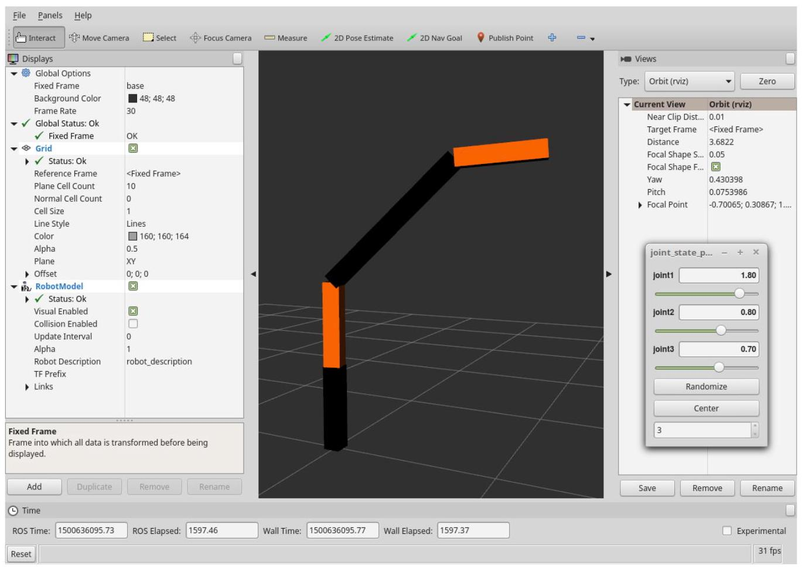

图 13-13 在Joint State Publisher GUI工具中操纵各关节的结果

前面已经按URDF格式对三轴机械手臂进行了建模，并使用RViz对其进行了确认。基于此，我们来看一下OpenManipulator Chain的URDF，它由4轴关节和线性抓手组成。 首先，下载OpenManipulator和TurtleBot3的GitHub上的源代码。

---

\$cd ~/catkin_ws/src

\$ git clone https://github.com/ROBOTIS-GIT/open_manipulator.git

\$ cd ~/catkin_ws && catkin_make

	\$cd ~/catkin_ws/src/

\$ git clone https://github.com/ROBOTIS-GIT/turtlebot3.git

\$ git clone https://github.com/ROBOTIS-GIT/turtlebot3_msgs.git

\$ git clone https://github.com/ROBOTIS-GIT/turtlebot3_simulations.git

\$ cd ~/catkin_ws && catkin_make

---

以下是从Github复制的OpenManipulator目录中的内容。

---

\$cd ~/catkin_ws/src/open_manipulator

\$ 1s

Arduino 	$\rightarrow$ Arduino库

open_manipulator_description 	→ 建模功能包

open_manipulator_dynamixel_ctrl 	$\rightarrow$ Dynamixel控制功能包

open_manipulator_gazebo 	$\rightarrow$ Gazebo package

open_manipulator_moveit 	$\rightarrow$ Move It!功能包

open_manipulator_msgs 	→信息功能包

open_manipulator_position_ctrl 	→位置控制功能包

open_manipulator_with_tb3 	$\rightarrow$ OpenManipulator和TurtleBot3功能包

---

建模功能包 (open_manipulator_description) 由包含可执行文件的launch目录、 包含设计文件的meshes目录、包含发布者节点的src目录以及urdf目录组成。打开urdf 目录和launch目录并查看内容。

---

\$ roscd open_manipulator_description/urdf

\$1s

materials.xacro 	$\rightarrow$ 材质信息

open_manipulator_chain.xacro 	→ 机械手臂建模

open_manipulator_chain.gazebo.xacro 	→机械手臂Gazebo建模

---

---

\$ roscd open_manipulator_description/launch

\$ 1 s

open_manipulator.rviz 	$\rightarrow$ RViz配置文件

open_manipulator_chain_ctrl.launch 	→ 机械手臂状态信息发布者节点运行文件

open_manipulator_chain_rviz.launch 	→ 机器人建模信息可视化节点运行文件

---

如果确认完毕，请打开materials.xacro文件。

\$ roscd open_manipulator_description/urdf

\$ gedit materials.xacro

open_manipulator_description/urdf/materials.xacro

---

<?xml version="1.0"?>

	<robot>

												<material name="black">

																					<color rgba="0.00.00.01.0"/>

												</material>

												<material name="white">

																					<color rgba="1.01.01.01.0"/>

												</material>

												<material name="red">

																						<color rgba="0.80.00.01.0"/>

												</material>

												<material name="blue">

																				<color rgba="0.00.00.81.0"/>

											</material>

												<material name="green">

																				<color rgba="0.00.80.01.0"/>

											</material>

											<material name="grey">

																			<color rgba="0.50.50.51.0"/>

												</material>

											<material name="orange">

																				<color rgba="\$\{255/255\} \$\{108/255\} \$\{10/255\} 1.0"/>

											</material>

											<material name="brown">

																				<color rgba="\$\{222/255\} \$\{207/255\} \$\{195/255\} 1.0"/>

---

---

											</material>

</robot>

---

.xacro文件是XML Macro ${}^{39}$ 的缩略语,是一种可以调用反复使用的代码的宏语言,建议将重复使用的代码做为一个宏。material.xacro文件指定了接下来要制作的机械手臂的可视化过程中需要的颜色。

接下来, 我们来查看OpenManipulator Chain的建模和可视化所需的URDF文件。

\$ roscd open_manipulator_description/urdf

\$ gedit open_manipulator_chain.xacro

open_manipulator_description/urdf/open_manipulator_chain.xacro

<xacro:property name="pi" value="3.141592654" />

<xacro:include filename="\$(find open_manipulator_description)/urdf/open_manipulator_chain.gazebo.xa cro" />

<xacro:include filename="\$(find open_manipulator_description)/urdf/materials.xacro ''/

URDF有一个缺点是, 在表达连杆和关节的连续结构时需要用到许多重复的语句, 因此需要较多时间花费在修改代码上。但是, 使用xacro可以大大减少这些任务。例如, 如上面的代码, 可以设置圆周的变量, 或分别管理前面创建的物质信息文件和Gazebo配置文件并将他们包含在实际使用的文件当中，以此有效地管理代码。

我们已经在为三轴机械手臂创建URDF时讨论了<link>和<joint>标签。除此之外， OpenManipulator Chain为了和ROS-CONTROL一起运行，还使用<transmission>标签。我们来看看这个。

---

39 http://wiki.ros.org/xacro

---

open_manipulator_description/urdf/open_manipulator_chain.xacro

<transmission name="tran1">

<type>transmission_interface/SimpleTransmission</type>

<joint name="joint1">

<hardwareInterface>PositionJointInterface</hardwareInterface>

</joint>

<actuator name="motor1">

<hardwareInterface>PositionJointInterface</hardwareInterface>

<mechanicalReduction>1</mechanicalReduction>

</actuator>

</transmission>

<transmission>是与ROS-CONTROL一起运行所必须的标签，它输入关节与舵机之间的命令接口。命令接口有力(effort)、速度(velocity)和位置(position)，用户可以根据需要选择要输入的控制量。

<transmission>标签

<transmission>: 设置关节和舵机之间的变量

<type>: 设置力的传递方式的形状

<joint> 设置关节信息设置

<hardwareInterface>: 设置硬件接口

<actuator>: 设置舵机信息

<mechanicalReduction>: 设置舵机与关节之间的齿轮比

OpenManipulator Chain由四个关节 (电机) 和五个连杆组成, 其中两个连杆和一个关节(电机)组成一个线性抓手。线性抓手部分的关节形态是prismatic的，其余描述和前面的内容重复，所以请查看URDF文件。

为了利用已完成的URDF文件在RViz中显示机械手臂, 运行launch文件, 并使用 joint_state_publisher GUI移动关节，如图13-14所示。

\$ roslaunch open_manipulator_description open_manipulator_chain_rviz.launch

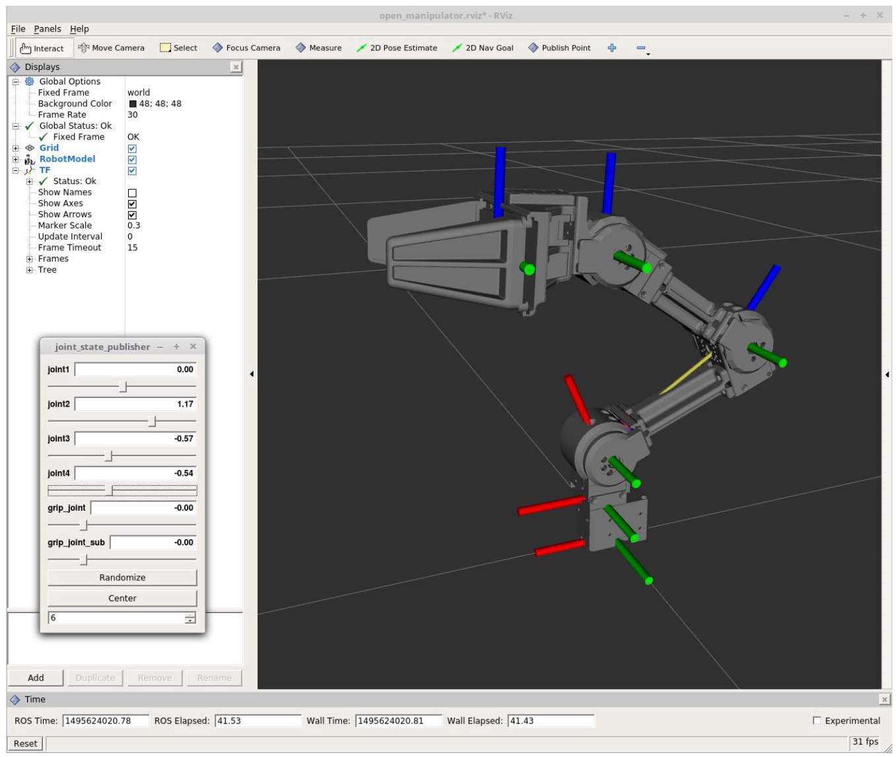

图 13-14 通过GUI更改关节值的OpenManipulator Chain

### 13.2.3. Gazebo设置

Gazebo是一个三维机器人仿真器，它是独立的软件，支持ROS。可以用它进行机器人设计、算法测试、回归分析和人工智能训练，并且它支持多种机器人，因此许多ROS用户将它用于机器人仿真。由于RViz是一种可视化工具, 因此无法实时地获得工作中的机器人或周围环境的物理变化(惯性、扭矩和碰撞等)，而Gazebo具有可以对这些数据进行实时监控的优点。通过这种实时监控功能，可以防止机器人在实验过程中发生的故障和人为事故。

上一节中创建的URDF是为使用RViz实现可视化而设计的。让我们在这个文件中添加一些可以用于Gazebo仿真环境的几种标签。用于Gazebo仿真的标签存储在open_ manipulator_chain.gazebo.xacro文件中。我们来看看这个。

\$ roscd open_manipulator_description/urdf

\$ gedit open_manipulator_chain.gazebo.xacro

open_manipulator_description/urdf/open_manipulator_chain.gazebo.xacro

<gazebo reference="link1">

<mu2>0.2</mu1>

<mu2>0.2</mu2>

<material>Gazebo/Grey</material>

</gazebo>

对于在Gazebo中使用的连杆的设置必不可少的是色彩和惯性信息。由于惯性信息包含在之前创建的URDF文件中，因此只需设置颜色。另外，可以给Gazebo支持的开放动力学引擎 (ODE, Open Dynamics Engine) ${}^{40}{}^{41}$ 设置重力、阻尼和摩擦力。在上述文件中，仅以摩擦系数为例。虽然没有指出，但还有关节信息的参数，望读者自己确认。

- <gazebo>标签

<gazebo>: 设置Gazebo仿真的参数

<mu1>, <mu2>: 设置摩擦系数

<material>: 设置连杆颜色

open_manipulator_description/urdf/open_manipulator_chain.gazebo.xacro

<gazebo>

<plugin name="gazebo_ros_control" filename="libgazebo_ros_control.so">

<robotNamespace>/open_manipulator_chain</robotNamespace>

<robotSimType>gazebo_ros_control/DefaultRobotHWSim</robotSimType>

---

40 http://gazebosim.org/tutorials?tut=ros_urdf&cat=connect_ros

41 http://www.ode.org/

---

---

										</plugin>

</gazebo>

---

Gazebo plugin ${}^{42}$ 是使用ROS消息和服务通信支持通过URDF或SDF创建的机器人模型的传感器和电机的状态和控制的工具。Plugin支持各种传感器，如相机、激光和惯性导航传感器等多种传感器, 还支持差速器、滑移转向、平行移动等移动平台控制和 ROS-CONTROL。OpenManipulator Chain使用关节的位置控制界面，并启用默认的插件库。

<gazebo>标签

<gazebo>: 设置Gazebo仿真的参数

<plugin>: 传感器和机器人状态控制工具

<robotNamespace>: 设置在Gazebo中使用的机器人名称

<robotSimType>: 设置机器人仿真界面的插件名称

其余的是重复的内容, 所以请自行查看下面的源代码。

open_manipulator_description/urdf/open_manipulator_chain.gazebo.xacro

<?xml version="1.0"?>

<robot>

<gazebo reference="world">

</gazebo>

<gazebo reference="link1">

<mu1>0.2</mu1>

<mu2>0.2</mu2>

<material>Gazebo/Grey</material>

</gazebo>

---

42 http://gazebosim.org/tutorials?tut=ros_gzplugins&cat=connect_ros

---

---

<gazebo reference="link2">

										<mu1>0.2</mu1>

											<mu2>0.2</mu2>

										<material>Gazebo/Grey</material>

	</gazebo>

	<gazebo reference="link3">

										<mu1>0.2</mu1>

											<mu2>0.2</mu2>

											<material>Gazebo/Grey</material>

	</gazebo>

	<gazebo reference="link4">

											<mu1>0.2</mu1>

											<mu2>0.2</mu2>

											<material>Gazebo/Grey</material>

	</gazebo>

	<gazebo reference="link5">

										<mu1>0.2</mu1>

											<mu2>0.2</mu2>

											<material>Gazebo/Grey</material>

	</gazebo>

	<gazebo reference="grip_link">

										<mu1>0.2</mu1>

											<mu2>0.2</mu2>

										<material>Gazebo/Grey</material>

</gazebo>

<gazebo reference="grip_link_sub">

										<mu1>0.2</mu1>

											<mu2>0.2</mu2>

											<material>Gazebo/Grey</material>

											</gazebo>

											<gazebo>

																							<plugin name="gazebo_ros_control" filename="libgazebo_ros_control.so">

																																<robotNamespace>/open_manipulator_chain</robotNamespace>

																																	<robotSimType>gazebo_ros_control/DefaultRobotHWSim</robotSimType>

																							</plugin>

											</gazebo>

</robot>

---

open_manipulator_chain.gazebo.xacro是为设置Gazebo仿真参数单独创建的文件，包含在open_manipulator_chain.xacro文件中。现在使用已完成的URDF将 OpenManipulator Chain输出到Gazebo环境中。

---

\$ roscd open_manipulator_gazebo/launch

\$ 1s

open_manipulator_gazebo.launch 	$\rightarrow$ Gazebo运行文件

position_controller.launch 	$\rightarrow$ ROS-CONTROL运行文件

---

launch目录是open_manipulator_gazebo目录的子目录, 包含用于运行Gazebo并执行ROS-CONTROL的launch文件。我们来打开Gazebo运行文件，查看都包含哪些节点。

---

	\$ roscd open_manipulator_gazebo/launch

\$ gedit open_manipulator_gazebo.launch

---

open_manipulator_gazebo/launch/open_manipulator_gazebo.launch

<?xml version="1.0" ?>

<launch>

<arg name="paused" default="false"/>

<arg name="use_sim_time" default="true"/>

<arg name="gui" default="true"/>

<arg name="headless" default="false"/>

<arg name="debug" default="false"/>

---

									<include file="\$(find gazebo_ros)/launch/empty_world.launch">

									<arg name="world_name" value="\$(find open_manipulator_gazebo)/world/empty.world"/>

										<arg name="debug" value="\$(arg debug)" />

										<arg name="gui" value="\$(arg gui)" />

											<arg name="paused" value="\$(arg paused)"/>

										<arg name="use_sim_time" value="\$(arg use_sim_time)"/>

										<arg name="headless" value="\$(arg headless)"/>

										</include>

									<param name="robot_description" command="\$(find xacro)/xacro.py '\$(find

	open_manipulator_description)/urdf/open_manipulator_chain.xacro'"/>

								<node name="urdf_spawner" pkg="gazebo_ros" type="spawn_model" respawn="false" output="screen"

args="-urdf-model open_manipulator_chain -z 0.0 -param robot_description"/>

									<include file="\$(find open_manipulator_gazebo)/launch/position_controller.launch"/>

</launch>

---

前面的可执行文件包含empty_world.launch文件、spawn_model节点和position_ controller.launch文件。empty_world.launch文件包含运行Gazebo的节点，因此您可以设置仿真环境、GUI和时间。Gazebo仿真环境支持SDF ${}^{43}$ 格式的文件。spawn_model 节点根据上面创建的URDF调用机器人，position_controller.launch负责设置和运行 ROS-CONTROL。

现在, 通过在终端中输入以下可执行代码来运行Gazebo, 则可以在Gazebo仿真空间中看到OpenManipulator Chain，如图13-15所示。

---

\$ roslaunch open_manipulator_gazebo open_manipulator_gazebo.launch

---

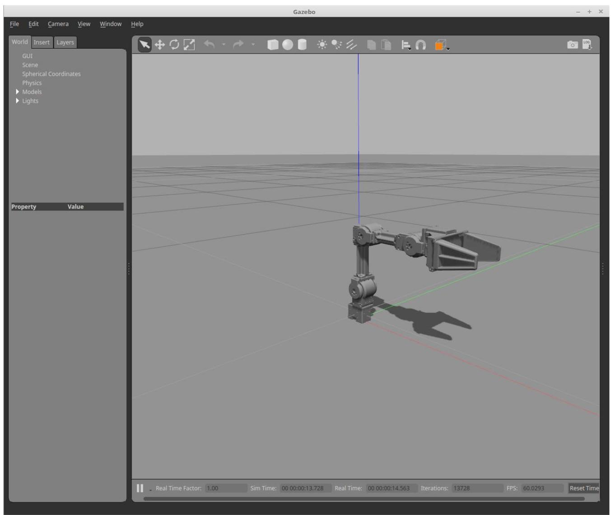

图 13-15 仿真空间中的OpenManipulator Chain

\$ rostopic list

/clock

/gazebo/link_states

/gazebo/model_states

/gazebo/parameter_descriptions

/gazebo/parameter_updates

/gazebo/set_link_state

/gazebo/set_model_state

/joint_states

/open_manipulator_chain/grip_joint_position/command

/open_manipulator_chain/grip_joint_sub_position/command

/open_manipulator_chain/joint1_position/command

/open_manipulator_chain/joint2_position/command

---

/open_manipulator_chain/joint3_position/command

/open_manipulator_chain/joint4_position/command

/open_manipulator_chain/joint_states

/rosout

/rosout_agg

---

查看话题列表, 可以看到话题分为具有/gazebo命名空间的话题和具有/open_ manipulator_chain命名空间的话题。我们可以通过ROS-CONTROL使用/open_ manipulator_chain命名空间的话题来检查和控制Gazebo上机器人的状态。让我们通过以下命令移动机器人。

\$ rostopic pub /open_manipulator_chain/joint2_position/command std_msgs/Float64 "data: 1.0" --once

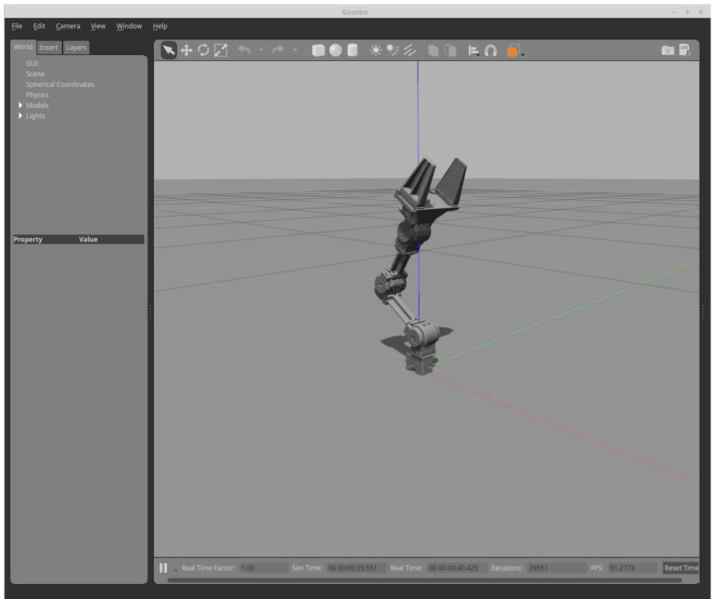

图 13-16 通过与ROS-CONTROL的通信来控制OpenManipulator Chain

通过简单的消息通信，可以看到OpenManipulator Chain的第二个关节的运动，如图13-16所示。

## 13.3. MoveIt!

MoveIt! ${}^{44}$ 是一个集成的机械手臂库，提供多种功能，包括用于运动规划的快速逆运动学分析、用于操纵的高级算法、机械手控制、动力学、控制器和运动规划。通过提供一个 GUI来协助MoveIt!所需的各种设置，它还具有的一个优点是没有对机械手臂的高级知识也能容易使用。这是许多ROS用户喜欢的工具，因为它允许使用RViz进行视觉反馈。下面我们先简单了解MoveIt!的结构，然后创建一个用于控制OpenManipulator Chain的 MoveIt!功能包。

### 13.3.1. move_group

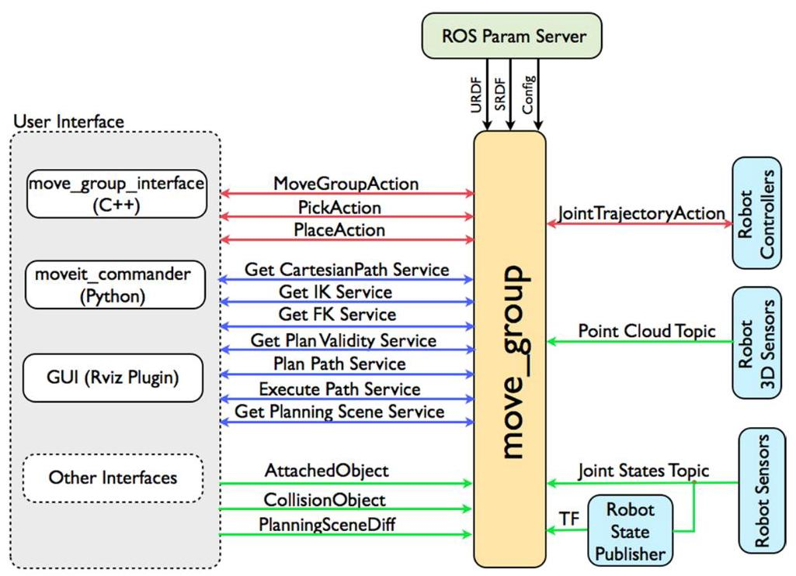

图 13-17 与move_group节点的通信方案

---

44 http://moveit.ros.org/

---

如图13-17所示, move_group节点可以使用ROS动作和服务与用户交换命令。提供各种用户界面的MoveIt!为C++语言提供move_group interface，为Python语言提供move_commander，而且构建了允许很多用户利用 “Motion Planning plugin to RViz”选择自己熟悉的界面与move_group节点通信的服务。

move_group节点从URDF、Semantic Robot Description Format (SRDF) ${}^{45}$ 和 MoveIt! Configuration接收关于机器人的信息。URDF使用先前创建的文件，而SRDF和 MoveIt! Configuration将通过MoveIt!提供的Setup Assistant ${}^{46}$ 创建。

move_group节点通过ROS话题和动作提供机器人的状态与控制, 还提供周围环境。关节状态是通过sensor_msgs/JointStates消息, 变换信息是通过tf库，控制器是通过FollowTrajectoryAction接口向用户发送关于机器人的信息。另外, 通过planning scene向用户提供关于机器人工作的环境信息和机器人的状态。

move_group为其可扩展性提供了一个plugin功能，并提供了一个通过开源库将各种功能(控制、路径生成、动力学等)应用到用户的机器人的机会。MoveIt!内置的插件是已经被许多人验证过的优秀的库，并且还有许多最近开发的开源库也待发布。典型的例子有The Open Motion Planning Library (OMPL) ${}^{47}$ 、Kinematic and Dynamic Library (KDL) ${}^{48}$ 和A Flexible Collision Library (FCL) ${}^{49}$ 。

### 13.3.2. MoveIt! Setup Assistant

为了创建用于机械手臂的MoveIt!功能包, 需要URDF、SRDF以及用于MoveIt! Configuration的文件。MoveIt!提供的Setup Assistant(设置助手)基于URDF生成用于创建MoveIt!功能包的SRDF和MoveIt! Configuration文件。接下来了解一下利用MoveIt! Setup Assistant来创建用于OpenManipulator Chain的MoveIt!功能包的方法。

在终端中输入以下命令运行MoveIt! Setup Assistant。

---

\$ roslaunch moveit_setup_assistant setup_assistant.launch

45 http://wiki.ros.org/srdf

46 http://docs.ros.org/kinetic/api/moveit_tutorials/html/doc/setup_assistant/setup_assistant_tutorial.html

47 http://ompl.kavrakilab.org/

48 http://www.orocos.org/kdl

49 http://gamma.cs.unc.edu/FCL/fcl_docs/webpage/generated/index.html

---

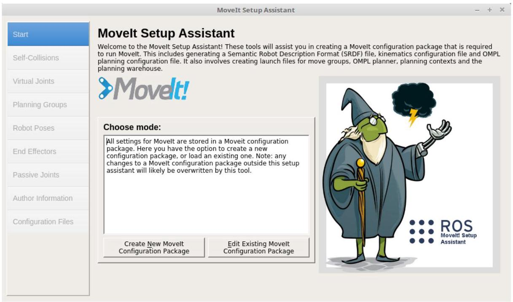

图13-18 MoveIt! Setup Assistant的开始页面

图13-18是运行MoveIt! Setup Assistant后看到的第一个开始页面。在此页面中，您可以在右侧看到ROS的代表性的乌龟图标，并且可以在左侧窗口中选择创建新的功能包还是修改现有的功能包。现在我们需要创建一个新的功能包，所以让我们点击Create New MoveIt Configuration Package按钮。

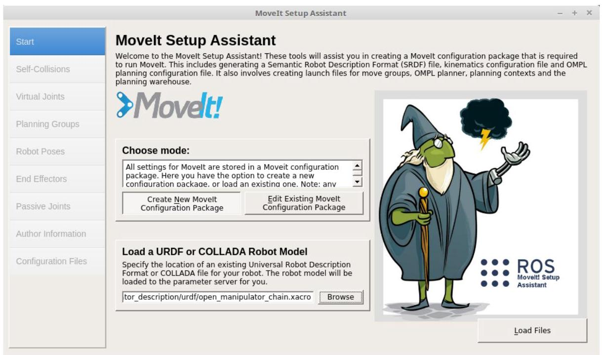

图13-19 MoveIt! Setup Assistant的开始页面

MoveIt! Setup Assistant会根据存储在URDF文件或COLLADA文件中的机器人模型, 通过附加的设置生成SRDF文件。点击图13-19中所示的Browse按钮, 打开前面创建的open_manipulator_chain.xacro文件，然后点击Load Files按钮。

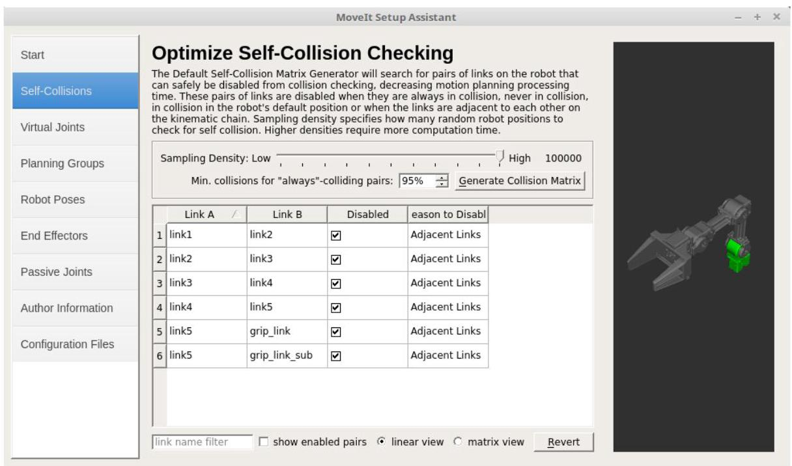

图13-20 MoveIt! Setup Assistant中的 "Self-Collisions" 页面

如果您已成功加载文件，请转到“Self-Collision”页面。通过此页面，可以设置构建Self-Collision Matrix(自碰撞矩阵)所需的Sampling density(采样密度)，并可以根据需要确定组成机器人的连杆之间的碰撞范围，如图13-20所示。Sampling density 越高, 需要越多的计算来防止机器人在各种姿态中的连杆之间的碰撞, 因此需要用户的工作环境进行适当的设置。设置需要的Sampling density, 然后单击Generate Collision Matrix按钮。默认值设置为10,000。

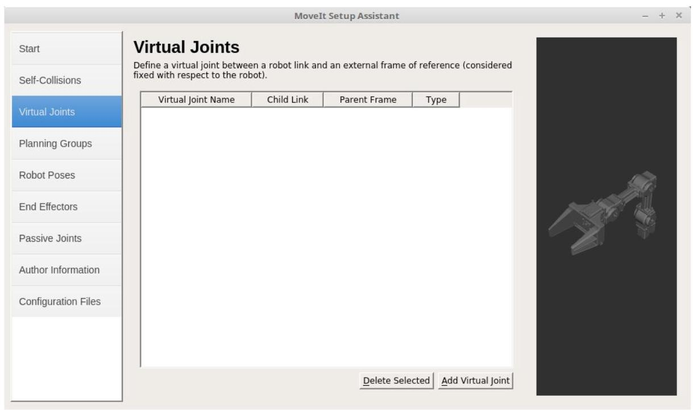

图13-21 MoveIt! Setup Assistant的Virtual Joints页面

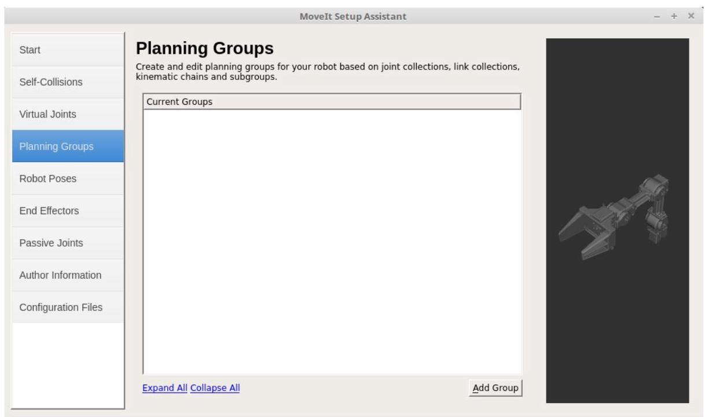

图13-22 Movelt! Setup Assistant的Planning Groups页面

MoveIt!将机械手臂分为几个组，为各组分别提供运动规划，用户可以在Planning Groups页面上进行分组。OpenManipulator Chain由四个关节和一个抓手组成。点击图13-22右下方的add group按钮后窗口画面将会改变，如图13-23所示。

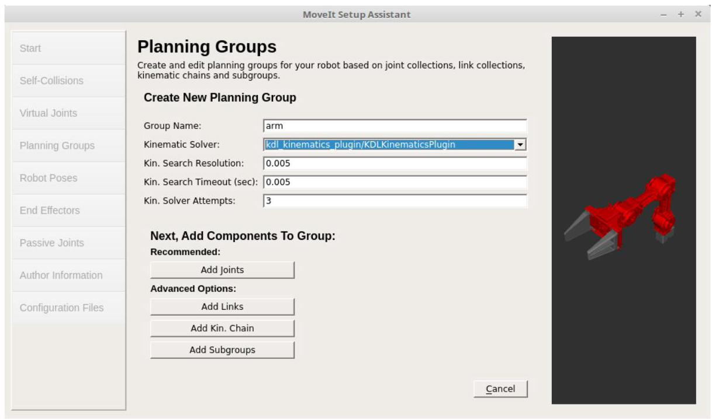

图13-23 在Planning Groups页面上新建组的页面

在上一个窗口中, 可以指定组名称并选择所需的运动分析插件 (Kinematic Slover项目)。组名设为arm，并选择需要的机械学解析插件。因为将要以关节为单元分组，因此点击Add joint按钮。如果窗口如图13-24所示变化，则选择第一个关节到第四个关节，然后单击Save按钮，则可以看到已创建的组，如图13-25所示。

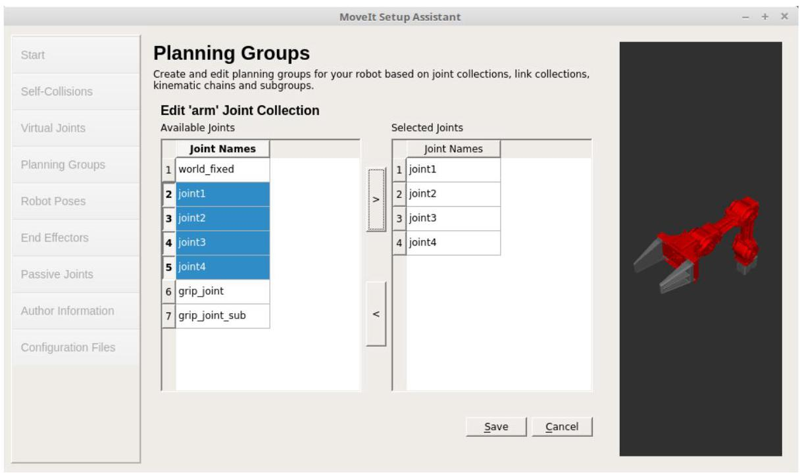

图13-24 Planning Groups页面中创建新组的窗口

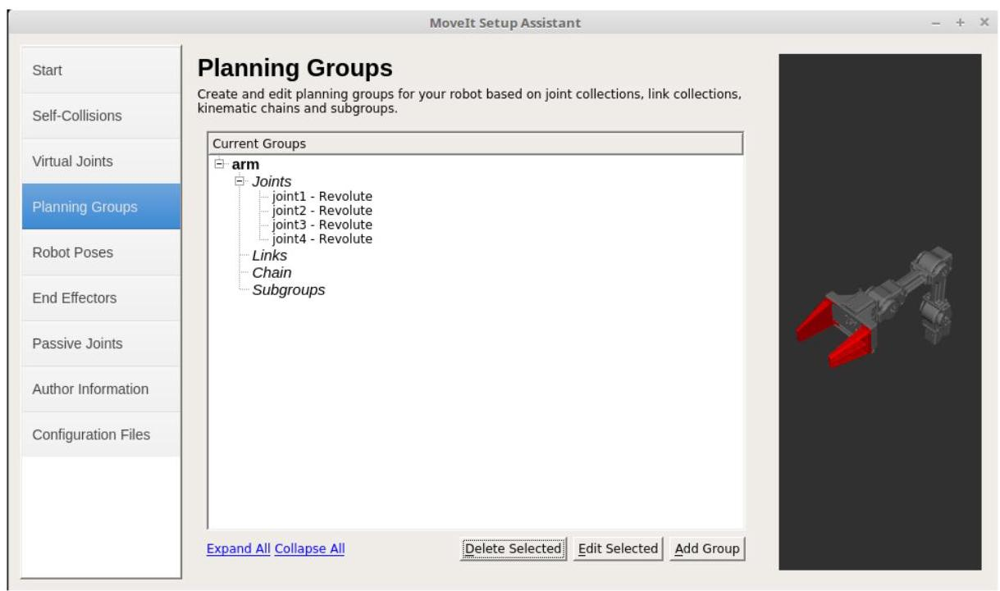

图13-25 在Planning Groups页面上创建的arm组

如果您创建了一个arm组，让我们创建一个类似的gripper组。只由一个舵机控制的线性抓手无法在机械分析插件中运行。因此, 在创建gripper组时, 请将运动学分析插件设置为None。并且像arm组一样, 在Add joints中, 选择相关的关节grip_joint和grip_ joint_sub。gripper组完成后，您可以看到arm组和gripper组，如图13-26所示。

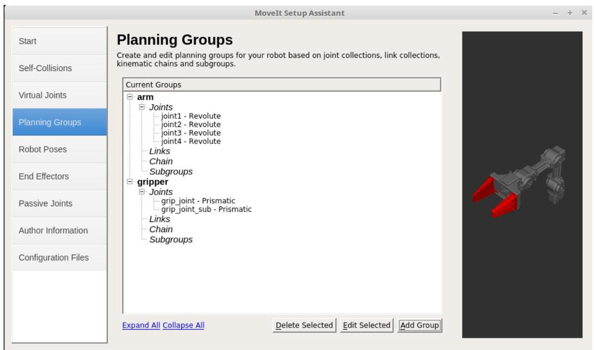

图13-26 Planning Groups页面上创建的arm组和gripper组

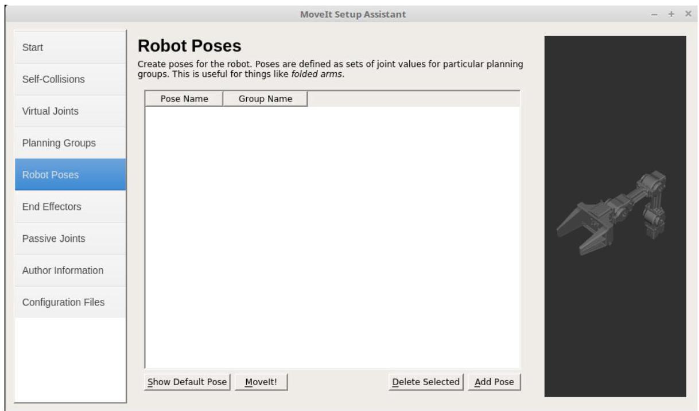

图13-27 MoveIt! Setup Assistant的Robot Poses页面

Robot Poses页面允许您创建和注册机器人的特殊姿态。点击图13-27右下方的Add Pose按钮，注册所有舵机的角度为0的姿态。点击按钮会进入姿态创建窗口，如图13-28 所示，在这里您可以将所有关节值设置为0.0，然后填入姿态名称。

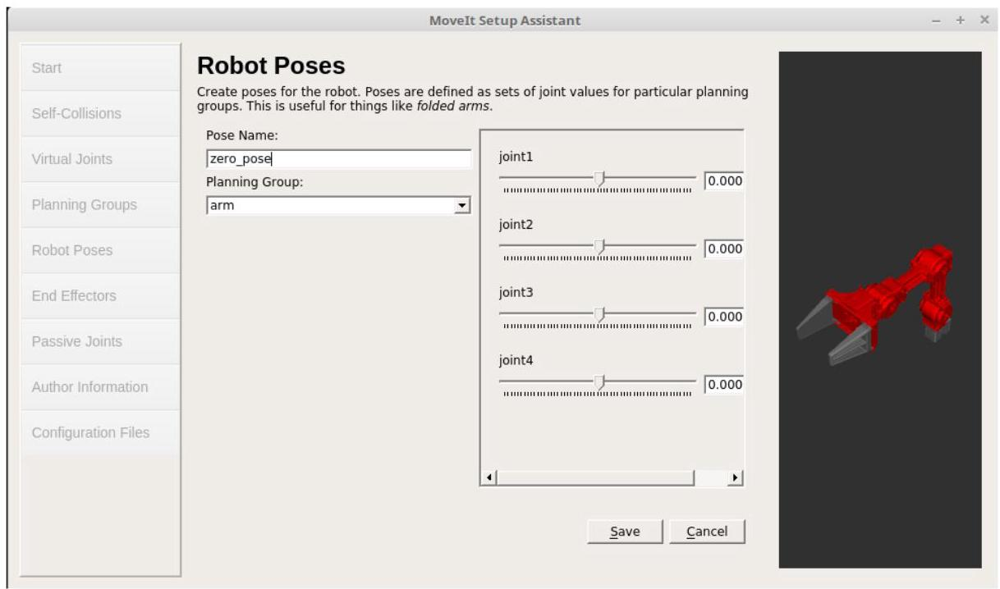

图13-28 在Robot Poses页面窗口上创建姿态

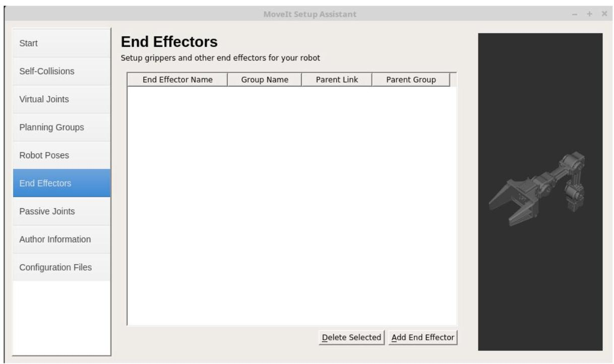

图13-29 MoveIt! Setup Assistant的End Effectors页面

End Effectors页面可以注册机械手臂的end-effector(末端执行器)。点击图13-29 右下角的Add End Effector按钮来注册OpenManipulator Chain的线性抓手。

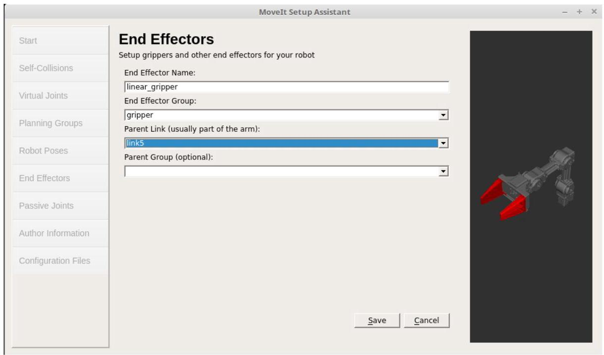

图13-30 End Effectors页面的End Effectors设置窗口

如图13-30所示，命名End Effectors，并在Planning groups页面中创建的组中选择 gripper。检查URDF可以发现，抓手的第五个连杆作为其父连杆。

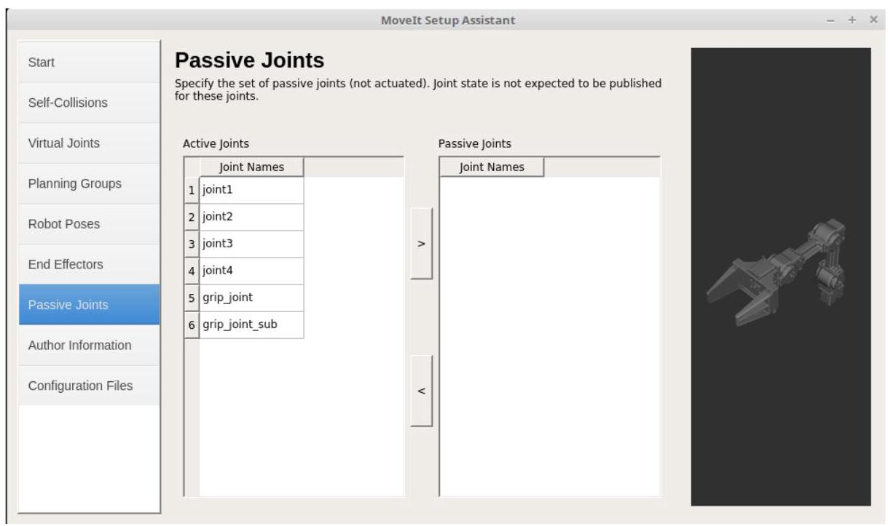

图13-31 MoveIt! Setup Assistant的Passive Joints页面

passive Joints页面允许您指定不属于运动规划的关节。在OpenManipulator Chain 中, 没有passive joint, 因此不作任何改变进入下一阶段，如图13-31所示。

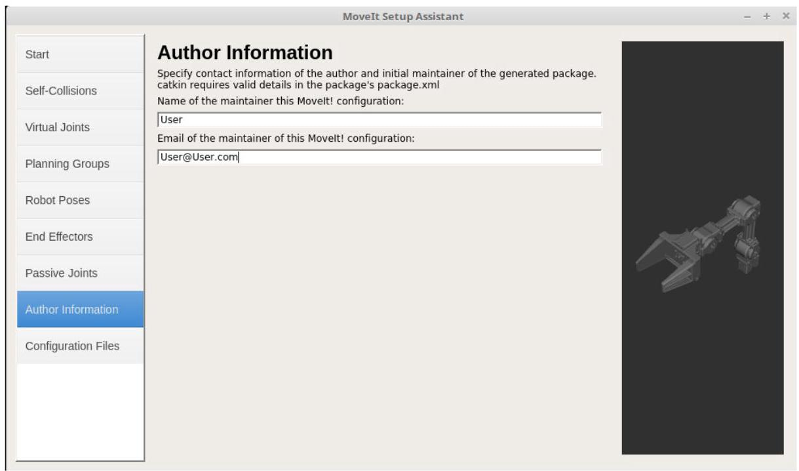

图13-32 MoveIt! Setup Assistant的Author Information页面

在Author information页面上, 要输入创建功能包的用户的姓名和电子邮件, 如图 13-32所示。

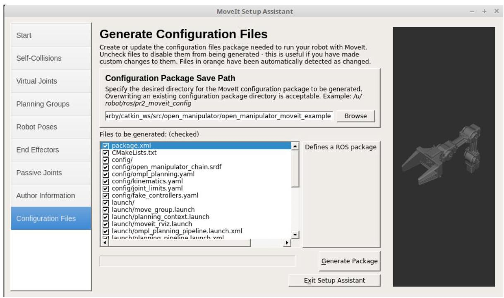

图13-33 MoveIt! Setup Assistant的Configuration Files页面

完成所有设置后，您可以在Configuration Files页面上完成配置。单击图13-33顶部的Browse按钮，在open_manipulator目录中创建open_manipulator_moveit_ example目录，选中它，然后单击右下角的Generate Package按钮，则会生成MoveIt! Configuration所需的config日录和包含可执行文件的launch目录。

查看生成的功能包并运行演示。

\$cd~/catkin_ws/src/open_manipulator/open_manipulator_moveit_example

\$1s

Config $\rightarrow$ 用于MoveIt! Configuration的yaml文件和SRDF文件

launch $\rightarrow$ 运行文件

.setup_assistant $\rightarrow$ 由setup assistant创建的功能包的信息

CMakeLists.txt → CMake构建系统输入文件

package.xml $\rightarrow$ 定义功能包的属性

\$ cd ~/catkin_ws && catkin_make

\$ roslaunch open_manipulator_moveit_example demo.launch

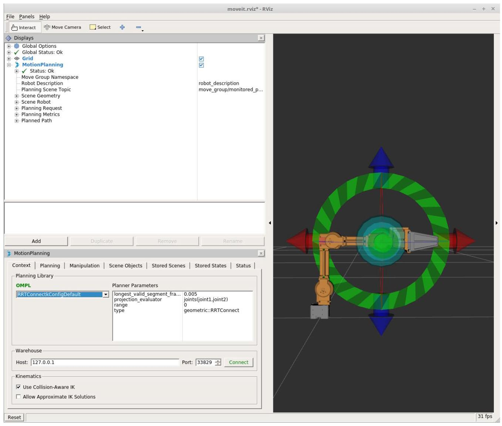

图13-34 MoveIt! RViz demo

运行Demo时, 可以通过RViz窗口看到OpenManipulator Chain, 如图13-34所示。 在位于左下角的MotionPlanning命令窗口的Context页面中，可以选择OMPL支持的路径规划库 ${}^{50}$ 。选择RRTConnectkConfigDefault并转到Planning页面。

本来,机械手臂终点的坐标由表示运动的X、Y、Z和表示旋转的 $\Theta$ (Roll)、 $\Phi$ (Pitch)和Ψ(Yaw)组成的姿态值来表示。但是，由于OpenManipulator Chain只有四个关节，因此终点将只有X、Z和Pitch轴的自由度(其余的一个自由度是一号关节的 Yaw轴旋转)。记住这一点，并将终点移动到所需的坐标位置。

---

50 http://ompl.kavrakilab.org/planners.html

---

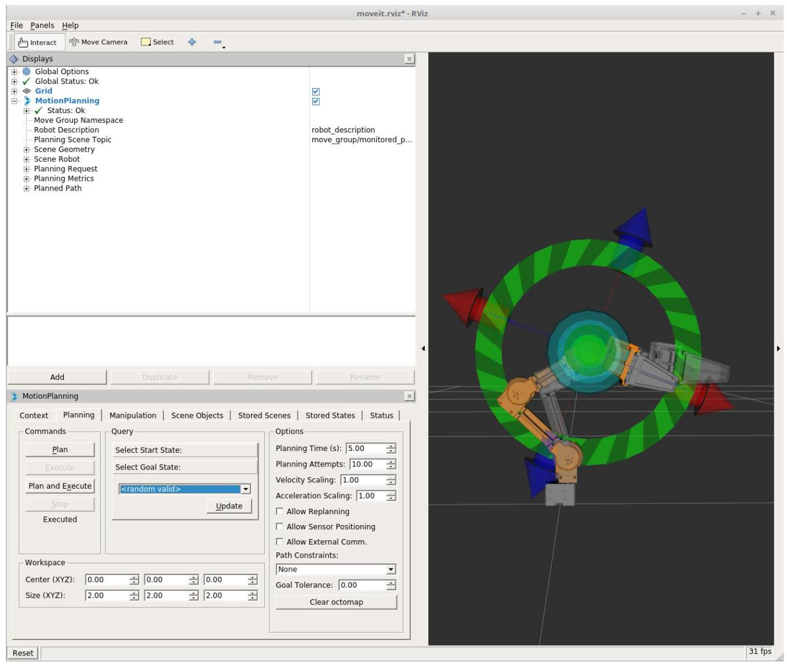

图13-35 使用MoveIt! RViz demo的机械手臂运动规划

如果已将终点移至所需位置，请单击Planning页面上的[Plan & Excute]按钮以检查移动。

**指定机械手臂的目标姿态(位置+方向)的方式**

在这个例子中, 您可以通过在RViz上输入位置和方向来指定机械手臂的目标姿态。除此之外, 还可以采用通过绿色球状物(Interactive marker)来指定位置的方法。为此，将position_only_ik:true记录在config目录下的kinematics.yaml文件的底部。

\$ roscd open_manipulator_moveit/config/

\$ gedit kinematics.yaml

arm:

kinematics_solver: kdl_kinematics_plugin/KDLKinematicsPlugin

kinematics_solver_search_resolution: 0.005

kinematics_solver_timeout: 0.005

kinematics_solver_attempts: 3

position_only_ik: true

OpenManipulator提供MoveIt!示例包。检查open_manipulator目录中的open_ manipulator_moveit功能包目录。

---

\$ roscd open_manipulator_moveit

\$ 1s

Config 	→用于move_group设置的yaml文件和SRDF文件

include 	$\rightarrow$ trajectory filter头文件

launch 	$\rightarrow$ 运行文件

src 	$\rightarrow$ trajectory filter源代码文件

.setup_assistant 	$\rightarrow$ 由setup assistant创建的功能包的信息

CMakeLists.txt 	$\rightarrow$ CMake构建系统输入文件

package.xml 	→ 定义功能包的属性

planning_request_adapters_plugin_description.xml → plugin安装文件

---

可以看到比起用setup assistant生成的文件更多的文件。路径生成算法中被人们熟知的Rapidly-exploring Random Tree (RRT) ${}^{51}$ 随机采样路径以找到从当前位置移动到目标位置的路径，然后返回搜索得出的结果。返回的每个关节值表示移动到目标位置所需的姿态。但是, 为了从第 $\mathrm{n}$ 个姿态向第 $\mathrm{n} + 1$ 个姿态移动,需要以较短的采样时间获得的关节值，因此使用了ROS-INDUSTRIAL支持的industrial_trajectory_filters ${}^{52}$ 。

industrial_trajectory_filters应用方法

1. 下载ROS-INDUSTRIAL CORE功能包。

\$ git clone https://github.com/ros-industrial/industrial_core.git

---

51 https://en.wikipedia.org/wiki/Rapidly-exploring_random_tree

52 http://wiki.ros.org/industrial_trajectory_filters

---

2. 查看下载的ros-industrial功能包中的industrial_trajectory_filters。

\$ cd ~/catkin_ws/src/industrial_core/industrial_trajectory_filters/

3. 将industrial_trajectory_filters目录中的planning_request_adapters_plugin_description.xml目录和src目录复制到之前创建的moveit功能包中。

\$ cp -r planning_request_adapters_plugin_description.xml src include ~/catkin_ws/src/ open_manipulator/open_manipulator_moveit_example/

4. 在config目录中创建smoothing_filter_params.yaml并指定系数。

\$ cd ~/catkin_ws/src/open_manipulator/open_manipulator_moveit_example/config

\$ gedit smoothing_filter_params.yaml

smoothing_filter_name: /move_group/smoothing_5_coef

smoothing_5_coef:

- 0.25

- 0.50

- 1.00

- 0.50

- 0.25

5. 打开launch目录中的ompl_planning_pipeline.launch.xml，并在planning_adapters添加以下过滤器。

\$ cd ~/catkin_ws/src/open_manipulator/open_manipulator_moveit_example/launch

\$ gedit ompl_planning_pipeline.launch.xml

industrial_trajectory_filters/UniformSampleFilter

industrial_trajectory_filters/AddSmoothingFilter

6. 将以下参数添加到同一个文件中。

---

	<param name="sample_duration" value="0.04" />

<rosparam command="load" file="\$(find open_manipulator_moveit)/config/

smoothing_filter_params.yaml "/>

---

7. 下面的示例显示了插入步骤5和6时启动文件的内容。

<lunch>

<arg name="planning_plugin" value="ompl_interface/OMPLPlanner" />

---

			<!-- The request adapters (plugins) used when planning with OMPL.

						ORDER MATTERS -->

			<arg name="planning_adapters" value="

											industrial_trajectory_filters/UniformSampleFilter

											industrial_trajectory_filters/AddSmoothingFilter

											default_planner_request_adapters/AddTimeParameterization

											default_planner_request_adapters/FixWorkspaceBounds

											default_planner_request_adapters/FixStartStateBounds

											default_planner_request_adapters/FixStartStateCollision

											default_planner_request_adapters/FixStartStatePathConstraints " />

			<arg name="start_state_max_bounds_error" value="0.1" />

			<param name="planning_plugin" value="\$(arg planning_plugin)" />

			<param name="request_adapters" value="\$(arg planning_adapters)" />

			<param name="start_state_max_bounds_error” value="\$(arg

	start_state_max_bounds_error) " />

			<param name="sample_duration" value="0.04" />

			<rosparam command="load" file="\$(find open_manipulator_moveit)/config/

	ompl_planning.yaml”/>

		<rosparam command="load" file=" \$(find open_manipulator_moveit)/config/

	smoothing_filter_params.yaml "/>

	</launch>

8. 运行命令

	\$ roslaunch open_manipulator_moveit_example demo.launch

	请运行以下命令并观察与以前的演示有什么不同。

---

\$roslaunch open_manipulator_moveit open_manipulator_demo.launch

### 13.3.3. Gazebo仿真

此前讲到, Gazebo仿真器能够测试机器人在真实环境中的运动。在本节中, 我们尝试通过Gazebo仿真器中的move_group和OpenManipulator Chain之间的消息通信来检查机器人的运动。我们先运行Gazebo。

\$ roslaunch open_manipulator_gazebo open_manipulator_gazebo.launch

在上一节中, 我们尝试通过消息通信来控制Gazebo仿真器的机器人。我们来看一下将这个功能用源代码表现出来的open_manipulator_position_ctrl功能包。

\$ roscd open_manipulator_position_ctrl/src

\$ gedit position_controller.cpp

open_manipulator_position_ctrl/src/position_controller.cpp

---

bool PositionController::initStatePublisher(bool using_gazebo)

\{

// ROS Publisher

if (using_gazebo)

\{

	ROS_WARN("SET Gazebo Simulation Mode");

	for (std::map<std::string, uint8_t>::iterator state_iter = joint_id_.begin();

		state_iter != joint_id_.end(); state_iter++)

\{

	std::stringjoint_name = state_iter->first;

	gazebo_goal_joint_position_pub_[joint_id_[joint_name]-1]

	= nh_.advertise<std_msgs::Float64>("/" + robot_name_ + "/" + joint_name + "_position/command", 10);

\}

	gazebo_gripper_position_pub_[LEFT_GRIP] = nh_.advertise<std_msgs::Float64>("/" + robot_name_ +

"/grip_joint_position/command", 10);

	gazebo_gripper_position_pub_[RIGHT_GRIP] = nh_.advertise<std_msgs::Float64>("/" + robot_name_ +

"/grip_joint_sub_position/command", 10);

\}

else

\{

goal_joint_position_pub_ = nh_advertise<sensor_msgs::JointState>("/robotis/open_manipulator/

goal_joint_states", 10);

\}

\}

bool PositionController::initStateSubscriber(bool using_gazebo)

\{

// ROS Subscriber

if (using_gazebo)

\{

gazebo_present_joint_position_sub_=nh_.subscribe("/" + robot_name_ + "/joint_states", 10,

	&PositionController::gazeboPresentJointPositionMsgCallback, this);

\}

else

\{

present_joint_position_sub_=nh_.subscribe("/robotis/open_manipulator/present_joint_states", 10,

	&PositionController::presentJointPositionMsgCallback, this);

\}

move_group_feedback_sub_ = nh_.subscribe("/move_group/feedback", 10,

	&PositionController::moveGroupActionFeedbackMsgCallback, this);

display_planned_path_sub_ = nh_.subscribe("/move_group/display_planned_path", 10,

	&PositionController::displayPlannedPathMsgCallback, this);

gripper_position_sub_ = nh_.subscribe("/robotis/open_manipulator/gripper", 10,

	&PositionController::gripperPositionMsgCallback, this);

\}

---

open_manipulator_position_ctrl功能包的position_controller节点通过与move_ group节点的消息通信获得运动规划的结果，然后通过逆运动学计算(用于追随生成的路径)来创建可以控制机械手臂的最终输入值。在上面的代码中，先检查是否使用了 Gazebo, 如果是在Gazebo环境中控制机械手臂, 则会注册与它相对应的话题发布者, 并订阅当前机械手臂的每个关节值的状态。

position_controller节点包含在open_manipulator_demo.launch文件中。在运行此演示的命令后面输入与Gazebo进行通信的参数值。

\$ roslaunch open_manipulator_moveit open_manipulator_demo.launch use_gazebo:=true

如果在RViz窗口中选择了所需的运动规划库并定义了终点坐标，并单击Plan和 Excute按钮(如图13-35所示)，则可以看到，Gazebo仿真器环境中的机械手臂会与 RViz窗口中的机械手臂一起运动，如图13-36和图13-37所示。

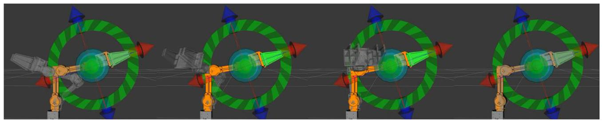

图13-36 使用MoveIt! RViz Demo的机械手臂运动规划

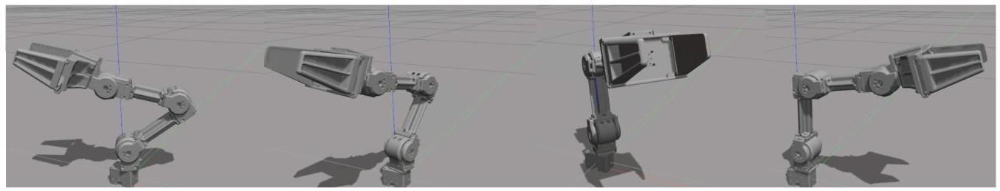

图13-37 使用了MoveIt!的Gazebo环境中的机械手臂的运动画面

position_controller节点负责与move_group的消息通信和线性抓手的控制。

open_manipulator_position_ctrl/src/position_controller.cpp

---

	void PositionController::gripperPositionMsgCallback(const std_msgs::String::ConstPtr &msg)

\{

													if (msg->data == "grip_on")

													\{

																									grip0n();

											\}

															else if (msg->data == "grip_off")

													\{

																									gripOff();

											\}

														else

													\{

																							ROS_ERROR("If you want to grip or release something, publish 'grip_on' or 'grip_off'");

								\}

\}

---

移动线性抓手的方法是发布如下话题。按照如下命令运行，就可以看到抓手是如何工作的，如图13-38所示。要向反方向运行，可以在data输入grip_off。

\$ rostopic pub / robotis/open_manipulator/gripper std_msgs/String "data: 'grip_on' " --once

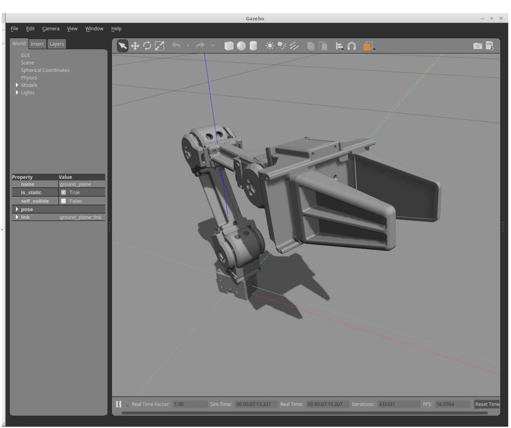

图13-38 在使用MoveIt!的Gazebo环境中进行抓取操作

## 13.4. 应用于实际平台

到目前为止，我已经使用MoveIt!来控制了Gazebo仿真器上的机械手臂。在本节中， 我们将学习如何控制实际的OpenManipulator Chain, 并进行实际操作。

### 13.4.1. 准备和控制OpenManipulator

OpenManipulator Chain由总共5个DYNAMIXEL X系列舵机和与其兼容的连接件和3D打印部件组成。用户可以自行购买DYNAMIXEL X和连接件，并从onshape ${}^{53}$ 下载 3D打印设计文件。

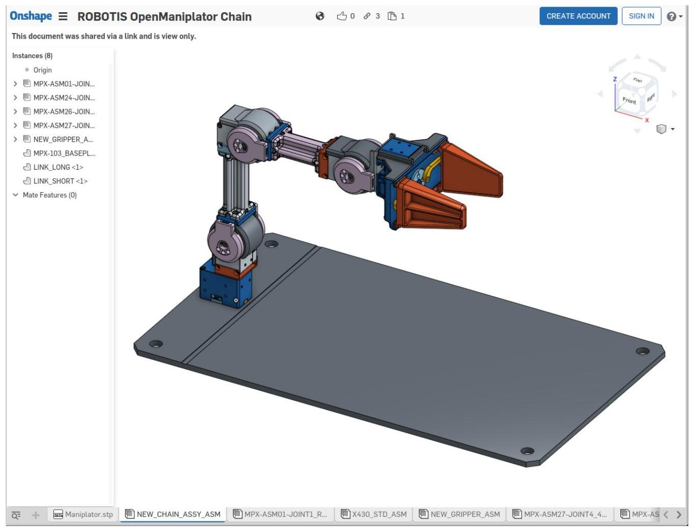

图13-39 上传到Onshape的OpenManipulator Chain装配文件

要在ROS上运行DYNAMIXEL，需要使用dynamixel_sdk功能包 ${}^{54}$ 。dynamixel_ sdk是ROBOTIS提供的DYNAMIXEL SDK中包含的一个ROS功能包，它提供了用于功能包通信的函数，因此有助于更轻松地控制DYNAMIXEL。

---

53 https://goo.gl/NsqJMu

54 http://wiki.ros.org/dynamixel_sdk

---

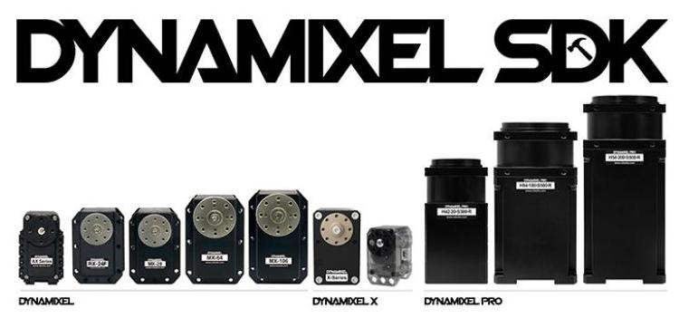

图13-40 由ROBOTIS提供的DYNAMIXEL SDK

ROBOTIS提供的dynamixel_workbench ${}^{55}$ 元功能包通过single_manager功能包更容易地改变Dynamixel控制表的参数，同时也提供了一个合适的GUI。它还提供了一个通过toolbox库和controller功能包来控制ROS中的DYNAMIXEL的例子。

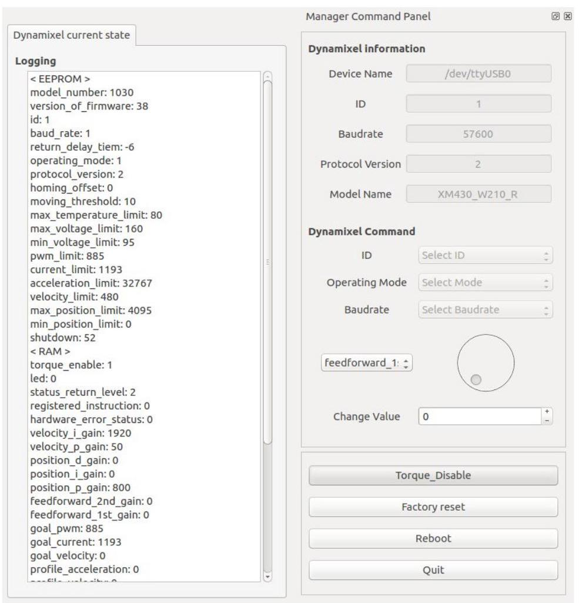

图13-41 ROSOTIS提供的ROS官方功能包之一, dynamixel-workbench

---

55 http://wiki.ros.org/dynamixel_workbench

---

将准备好的5个Dynamixel的通信速度均设为1M(1000000)bps，并将工作模式都设置为位置控制模式, 将ID分别指定为1至5, 并参考OpenManipulator wiki和已发布的硬件 (Onshape) 信息开始组装。组装完成后, 为了与OpenManipulator Chain进行通信，使用U2D2将通信方式转换为USB，并将U2D2连接至主计算机。电源采用12V5A 输出的SMPS，可以通过SMPS2DYNAMIXEL给Dynamixel供电。

U2D2和USB2DYNAMIXEL

U2D2是USB2DYNAMIXEL的最新版本，具有与DYNAMIXEL X系列舵机兼容的接头。另外，与现有的 USB2DYNAMIXEL不同，它支持Micro USB接头，并且显着减小了尺寸。U2D2支持RS-485、TTL和额外的UART。

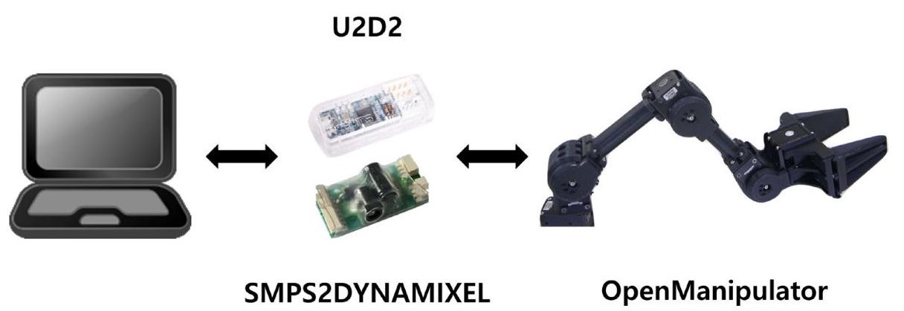

图13-42 运行OpenManipulator所需的配置和连接方法

连接完成后, 在终端窗口中输入以下命令。在这里, chmod命令是为了使用设备而设置权限的命令。下面的例子是U2D2被识别为ttyUSB0的一个例子。

---

\$ sudo chmod a+rw /dev/ttyUSB0

\$ roslaunch open_manipulator_dynamixel_ctrl dynamixel_controller.launch

---

当运行完成后，每个DYNAMIXEL都会输出扭力。我们来看看话题列表。

---

	\$rostopic list

/robotis/dynamixel/goal_states

/robotis/dynamixel/present_states

/rosout

	/rosout_agg

---

如上所述, 通过话题消息通信可以监视每个Dynamixel的当前位置, 并且可以以任意的角度值控制Dynamixel。

现在让我们通过MoveIt!来控制实际的机械手臂吧。

---

\$roslaunch open_manipulator_moveit open_manipulator_demo.launch

---

在RViz窗口中, 选择所需的运动规划库, 输入终点坐标, 然后单击Plan & Execute按钮就可以看到实际机器人正在移动。

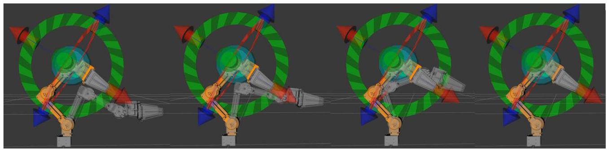

图13-43 使用MoveIt!的OpenManipulator Chain条运动规划。

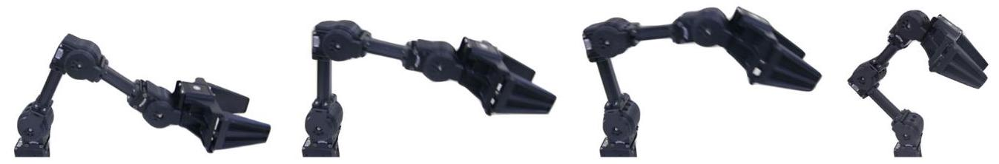

图13-44 OpenManipulator Chain的运动

以下示例显示了13.3.2. MoveIt! Setup Assistant中说明的参考内容 “指定机械手臂的目标姿态 (位置+方向) 的方式”中将position_only_ik项目设为true，并指定目标姿态的位置的例子。详细说明请参阅该参考内容。

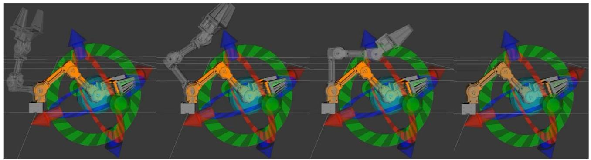

图13-45 利用MoveIt!的OpenManipulator Chain运动规划 (Position IK Only)

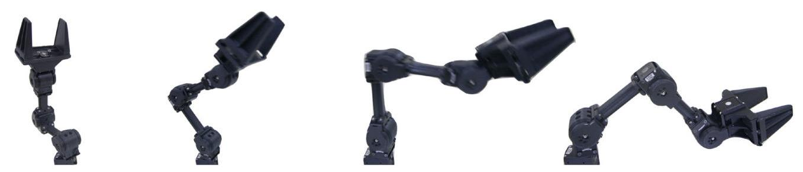

图13-46 OpenManipulator Chain的运行

### 13.4.2. OpenManipulator与TurtleBot3 Waffle及Waffle Pi

OpenManipulator Chain具有与Turtlebot 3 Waffle和Waffle Pi兼容的优点。这可以弥补自由度不足，而且还能利用TurtleBot3 Waffle和Waffle Pi具有的SLAM和导航功能, 因此可以提高完成度。

在本节中，我们将TurtleBot3 Waffle URDF添加到上面创建的open_manipulator_ chain.xacro文件，并在RViz中观察。

可以看到在turtlebot3_description目录中有一个保存有URDF文件的URDF目录。 当创建OpenManipulator Chain的URDF文件时, 笔者提到如果将其保存为xacro文件格式, 则以后可以方便地重用。我们来看看open_manipulator_with_tb3功能包。

\$ roscd open_manipulator_with_tb3/urdf

\$ gedit open_manipulator_chain_with_tb3.xacro

---

	open_manipulator_with_tb3/urdf/open_manipulator_chain_with_tb3.xacro

<xacro:include filename="\$(find turtlebot3_description)/urdf/turtlebot3_waffle_naked.urdf.xacro" />

<joint name="base_fixed" type="fixed">

<origin xyz="-0.0050.00.091" rpy="000"/>

<parent link="base_link"/>

<child link="link1"/>

</joint>

---

如果您检查open_manipulator_with_tb3功能包的URDF文件，则可以看到在代码顶部有一段包含turtlebot3_waffle_naked.urdf.xacro文件的代码。通过这段代码，简单地加载了TurtleBot3的 Waffle后，在想要放置机械手臂的关节创建了固定关节并连接了机械手臂。

=

**TurtleBot3 Waffle和Waffle Pi模型**

TurtleBot3 Waffle和Waffle Pi基本配有雷达传感器，但为了方便用户，ROBOTIS还提供了一个没有雷达传感器的TurtleBot3 Waffle和Waffle Pi的URDF。

现在用下面的命令运行RViz。

\$roslaunch open_manipulator_with_tb3 open_manipulator_chain_with_tb3_rviz.launch

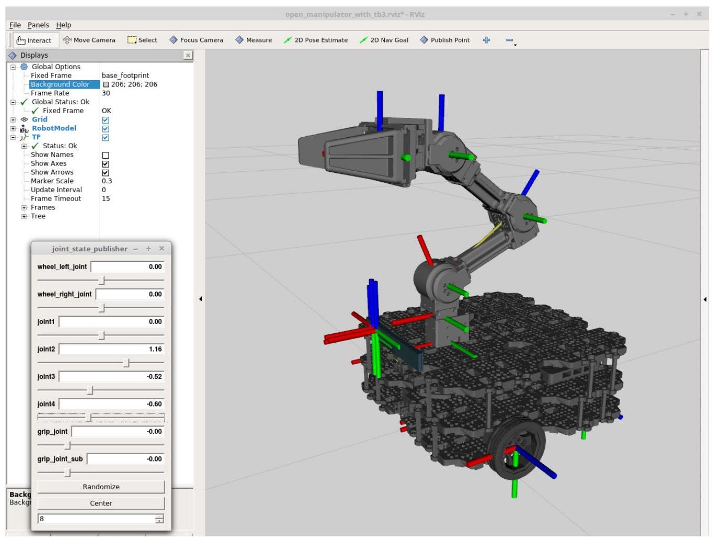

图13-47 上部结合了OpenManipulator Chain的TurtleBot3 Waffle

OpenManipulator Chain采用了模块化舵机Dynamixel，因此可以与各种机器人组合使用。建议利用xacro的可重用的优势, 把OpenManipulator Chain安装在您自己制作的机器人上。

<table><tr><td>符号</td><td></td></tr><tr><td>~ /</td><td>71</td></tr><tr><td>～ (波浪号)</td><td>65</td></tr><tr><td>___(两个下划线)</td><td>66</td></tr><tr><td>一(三个连字符)</td><td>64, 167, 177</td></tr><tr><td>--screen</td><td>292</td></tr><tr><td>/(斜杠)</td><td>65</td></tr><tr><td>(一个下划线)</td><td>66</td></tr></table>

<table><tr><td>A</td></tr><tr><td>ACML 346</td></tr><tr><td>action文件 64</td></tr><tr><td>AMCL 353, 354, 363</td></tr><tr><td>Android 396</td></tr><tr><td>APT 26</td></tr><tr><td>Arduino 244</td></tr><tr><td>ARM 238</td></tr><tr><td>安装 24</td></tr></table>

<table><tr><td>bag</td><td>47, 327</td></tr><tr><td>bashrc</td><td>29</td></tr><tr><td>Button</td><td>267</td></tr><tr><td>Buzzer</td><td>255</td></tr></table>

C

catkin 45, 75, 122

catkin_create_pkg 153

catkin_make 123

<table><tr><td>catkin_python_setup</td><td>85</td></tr><tr><td>CMake</td><td>75</td></tr><tr><td>CMakeLists.txt</td><td>49, 75, 79, 154, 165, 175</td></tr><tr><td>collision</td><td>416</td></tr><tr><td>costmap</td><td>357,361</td></tr><tr><td>参数</td><td>45, 54, 185</td></tr><tr><td>参数服务器</td><td>45</td></tr><tr><td>测位</td><td>347</td></tr><tr><td>传感器</td><td>199</td></tr><tr><td>存储库</td><td>47</td></tr></table>

<table><tr><td>DAE</td><td>416</td></tr><tr><td>DWA</td><td>346, 359, 365</td></tr><tr><td>Dynamixel</td><td>226, 257, 278, 456</td></tr><tr><td>dynamixel_sdk</td><td>456</td></tr><tr><td>dynamixel_workbench</td><td>457</td></tr><tr><td>单位</td><td>150</td></tr><tr><td>导航</td><td>312, 317, 342, 345, 361</td></tr><tr><td>导航推测</td><td>318</td></tr><tr><td>地图</td><td>318, 326, 328</td></tr><tr><td>地图服务器</td><td>352</td></tr><tr><td>电机</td><td>226</td></tr><tr><td>电压</td><td>269</td></tr><tr><td>订阅</td><td>43</td></tr><tr><td>订阅者</td><td>43, 57, 158</td></tr><tr><td>动作</td><td>44, 52</td></tr><tr><td>动作服务器</td><td>45, 177</td></tr><tr><td>动作客户端</td><td>45, 180</td></tr><tr><td>动作文件</td><td>176</td></tr></table>

<table><tr><td>F</td><td></td></tr><tr><td>feedback</td><td>59</td></tr><tr><td>发布</td><td>43</td></tr><tr><td>发布者</td><td>43, 56, 157</td></tr><tr><td>仿真</td><td>301,315</td></tr><tr><td>仿真器</td><td>307</td></tr><tr><td>服务</td><td>44, 52</td></tr><tr><td>服务从机</td><td>369</td></tr><tr><td>服务从节点</td><td>390</td></tr><tr><td>服务服务器</td><td>44, 59, 167</td></tr><tr><td>服务核心</td><td>368, 373</td></tr><tr><td>服务客户端</td><td>44, 59, 168</td></tr><tr><td>服务文件</td><td>166</td></tr><tr><td>服务主机</td><td>369</td></tr><tr><td>服务主节点</td><td>383</td></tr></table>

IDE 33

Ifconfig 31

IMU 240, 256, 271

Java 396

机器人 196

机械手臂 405

建模 410

节点 42

K

Kinetic Kame 18,25

可重用性 5

客户端库 13, 48, 68

<table><tr><td>LDS</td><td>220</td></tr><tr><td>LED</td><td>254,265</td></tr><tr><td>link</td><td>415</td></tr><tr><td>Log</td><td>98</td></tr><tr><td>LTS</td><td>19</td></tr><tr><td>历史</td><td>15</td></tr><tr><td>粒子滤波器</td><td>339,341</td></tr><tr><td>连杆</td><td>406</td></tr></table>

<table><tr><td>G</td><td></td></tr><tr><td>Gazebo</td><td>307, 428, 452</td></tr><tr><td>Gmapping</td><td>341</td></tr><tr><td>goal</td><td>59</td></tr><tr><td>GUI</td><td>130, 137, 422</td></tr><tr><td>工具</td><td>5, 130, 137</td></tr><tr><td>工作目录</td><td>27, 73</td></tr><tr><td>功能包</td><td>42, 227</td></tr><tr><td>关节</td><td>406, 418</td></tr><tr><td>关节空间控制</td><td>407</td></tr><tr><td>惯性</td><td>416</td></tr><tr><td></td><td></td></tr></table>

H

<table><tr><td>M</td><td></td></tr><tr><td>map</td><td>360</td></tr><tr><td>map_saver</td><td>333</td></tr><tr><td>map_server</td><td>313, 324, 326, 328</td></tr><tr><td>MD5</td><td>48</td></tr><tr><td>move_base</td><td>353,356</td></tr><tr><td>move_group</td><td>436</td></tr><tr><td>MoveIt!</td><td>436</td></tr><tr><td>MoveIt! Setup Assistant</td><td>437</td></tr><tr><td>msg文件</td><td>63</td></tr><tr><td>名称</td><td>48, 64</td></tr><tr><td>命名</td><td>152</td></tr><tr><td>命名空间</td><td>65, 66, 152, 192</td></tr><tr><td>模型</td><td>352</td></tr></table>

<table><tr><td>N</td></tr><tr><td>namespace 372</td></tr><tr><td>NTP 24</td></tr><tr><td>ntpdate 24</td></tr><tr><td>逆运动学 408</td></tr></table>

<table><tr><td>O</td><td></td></tr><tr><td>Odometry</td><td>303, 322</td></tr><tr><td>OGM</td><td>329</td></tr><tr><td>Open Robotics</td><td>17</td></tr><tr><td>OpenCR</td><td>238</td></tr><tr><td>OpenManipulator</td><td>410,460</td></tr><tr><td>OpenSLAM</td><td>341</td></tr><tr><td>OSRF</td><td>16</td></tr></table>

P

package.xml 49, 76, 153, 164, 174

pgm 326,347

平台 2

<table><tr><td>Q</td></tr><tr><td>Qt 33, 138</td></tr><tr><td>棋盘 210</td></tr><tr><td>卡尔曼滤波器 338</td></tr><tr><td>嵌入式系统 236</td></tr></table>

<table><tr><td>R</td><td></td></tr><tr><td>REP</td><td>151</td></tr><tr><td>result</td><td>59</td></tr><tr><td>ROS</td><td>41</td></tr><tr><td>ros_hostname</td><td>31, 207, 291</td></tr><tr><td>ROS_MASTER_URI</td><td>31, 207, 291</td></tr><tr><td>rosbag</td><td>118, 147</td></tr><tr><td>rosbuild</td><td>46</td></tr><tr><td>roscd</td><td>95</td></tr><tr><td>rosclean</td><td>100</td></tr><tr><td>roscope</td><td>28, 36, 46, 55, 97</td></tr><tr><td>roscpp</td><td>69</td></tr><tr><td>rosdep</td><td>26, 127</td></tr><tr><td>rosed</td><td>96</td></tr><tr><td>rosinstall</td><td>27, 127</td></tr><tr><td>roslaunch</td><td>46, 55, 99, 190</td></tr><tr><td>roslocate</td><td>128</td></tr><tr><td>rosls</td><td>96</td></tr><tr><td>rosmsg</td><td>114</td></tr><tr><td>rosnode</td><td>102</td></tr></table>

rospack 125

rosparam 111

rospy 69

rosrun 46, 55, 99

rosserial 258, 262, 263, 26

rosserial client 259

rosserial server 259

rosserial_python 259

rosserial协议 260

rosservice 108

rossrv 116

rostopic 104

RPC 48

rqt 138

rqt_bag 147

rqt_graph 38, 47, 143

rqt_image_view 142

rqt_plot 145

RViz 130, 218, 223, 275, 301, 302

RViz显示屏 136

任务空间控制 407

日志 118, 147

S

SDF 409

Service Calle 172

SLAM 312, 321, 328, 337

SRDF 437

srv文件 63

SSH 294

STL 416

Switchyard 15

社区 6

深度相机 214

生态系统 6, 14

四元数 68, 319

T

TCP/IP 49

TCPROS 49,58

teleoperation 291

TF 67, 303, 347, 352

Turtlebot3

TurtleBot3 276, 283, 287, 288, 291, 294, 301, 307

turtlesim 37

通信 5

U2D2 458

URDF 409, 410, 437

urdf_to_graphiz

URI 48

visual

Wiki

维基 93

<table><tr><td>X</td></tr><tr><td>XML 49, 414</td></tr><tr><td>XMLRPC 49</td></tr><tr><td>相机 201</td></tr><tr><td>相机校准 208</td></tr><tr><td>消息 43, 60, 156</td></tr><tr><td>消息通信 50</td></tr><tr><td>消息文件 156</td></tr></table>

<table><tr><td></td><td>Y</td></tr><tr><td>yaml</td><td>112, 209, 326, 347, 446</td></tr><tr><td>元操作系统</td><td>10</td></tr><tr><td>元功能包</td><td>43</td></tr></table>

<table><tr><td>Z</td><td></td></tr><tr><td>占用网格地图</td><td>329</td></tr><tr><td>正向运动学</td><td>407</td></tr><tr><td>重新映射</td><td>65</td></tr><tr><td>主节点</td><td>41,54</td></tr><tr><td>姿态</td><td>318, 319</td></tr><tr><td>自由度</td><td>408, 447</td></tr><tr><td>坐标表现方式</td><td>151</td></tr></table>

**ROS 机器人编程**

从基本概念到机器人应用程序编程实战!

- ROS Kinetic Kame:基本概念、讲解和工具

. 在ROS中使用传感器功能包和电机功能包

・专为ROS而设计的嵌入式控制板:OpenCR1.0

，利用TurtleBot3实现SLAM与导航

，用ROS Java编写配送机器人程序

•使用MoveIt!和Gazebo来仿真OpenManipulator机械手臂

**本手册的目标读者**

- 希望学习基于ROS (Robot Operating System) 的机器人编程的大学生和研究生

- 想采用ROS的专业研究者和工程师

我们尽最大努力提供了我们在开发和应用TurtleBot3和 OpenManipulator的过程中所掌握到的详细的信息。我们希望这本书能成为ROS初学者和将来为开源机器人领域做出贡献的众多研究者和开发者的完全手册。
